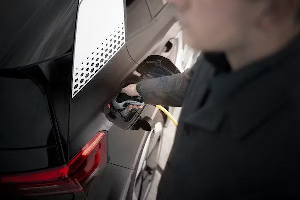
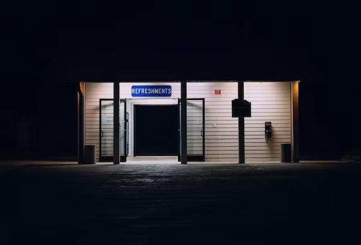
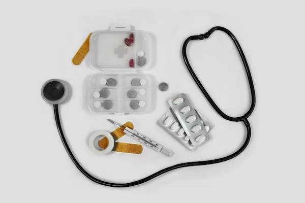
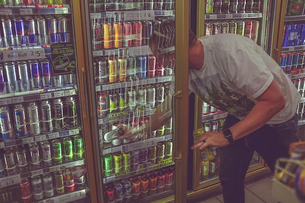
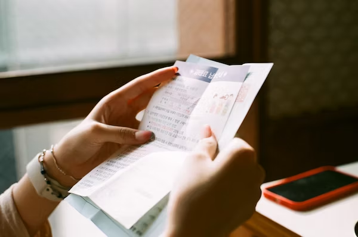

This article has been written and researched by our expert Loveable through a precise methodology. [Learn more about our methodology](https://avada.io/loveable/our-methodological.html)

[Loveable](https://avada.io/loveable/) > [Blog](https://avada.io/loveable/blog/) > [Holiday](https://avada.io/loveable/holiday/)

# 26 Essential Road Trip Tips for a Memorable Adventure

Written by [Blake Simpson](https://avada.io/loveable/author/blake/) Last Updated on August 22, 2023

- [Fill Up the Gas Tank Before Going](https://avada.io/loveable/blog/essential-road-trip-tips/#wp-block-heading-2-3)
- [Set Road Trip Budget](https://avada.io/loveable/blog/essential-road-trip-tips/#wp-block-heading-2-7)
- [Make Sure Your Home is Safe Before You Go](https://avada.io/loveable/blog/essential-road-trip-tips/#wp-block-heading-2-10)
- [Prepare All The Road Trip Apps, Playlists, And Podcast Episodes](https://avada.io/loveable/blog/essential-road-trip-tips/#wp-block-heading-2-14)
- [Plan Your Rest Stops](https://avada.io/loveable/blog/essential-road-trip-tips/#wp-block-heading-2-17)
- [Keep The Car Organized And Clean](https://avada.io/loveable/blog/essential-road-trip-tips/#wp-block-heading-2-21)
- [Give Yourself a Little Room](https://avada.io/loveable/blog/essential-road-trip-tips/#wp-block-heading-2-24)
- [Book a Roadside Rescue Service](https://avada.io/loveable/blog/essential-road-trip-tips/#wp-block-heading-2-27) 
- [Final Check Of Your Vehicle](https://avada.io/loveable/blog/essential-road-trip-tips/#wp-block-heading-2-30)
- [Plan “Must-Visit” Destinations](https://avada.io/loveable/blog/essential-road-trip-tips/#wp-block-heading-2-33)
- [Make All Accommodation Reservations Prior To Departure.](https://avada.io/loveable/blog/essential-road-trip-tips/#wp-block-heading-2-37)
- [Get Enough Sleep Each Night](https://avada.io/loveable/blog/essential-road-trip-tips/#wp-block-heading-2-40) 
- [Prepare a Paper Map](https://avada.io/loveable/blog/essential-road-trip-tips/#wp-block-heading-2-44) 
- [Sit With Good Posture](https://avada.io/loveable/blog/essential-road-trip-tips/#wp-block-heading-2-47)
- [Always Have A First Aid Box And Spare Tire Available](https://avada.io/loveable/blog/essential-road-trip-tips/#wp-block-heading-2-51)
- [Prepare Some Snacks and Energy Drinks](https://avada.io/loveable/blog/essential-road-trip-tips/#wp-block-heading-2-55) 
- [Establish a Realistic Daily Mileage Goal.](https://avada.io/loveable/blog/essential-road-trip-tips/#wp-block-heading-2-59)
- [Steer Clear of Rush Hour Traffic and Peak Dinner Times.](https://avada.io/loveable/blog/essential-road-trip-tips/#wp-block-heading-2-62)
- [Avoid traveling to small towns on Sundays and Mondays.](https://avada.io/loveable/blog/essential-road-trip-tips/#wp-block-heading-2-65)
- [Keep up with monthly bills](https://avada.io/loveable/blog/essential-road-trip-tips/#wp-block-heading-2-68)
- [Buy Some Souvenir](https://avada.io/loveable/blog/essential-road-trip-tips/#wp-block-heading-2-72) 
- [Leave Room For Spontaneity](https://avada.io/loveable/blog/essential-road-trip-tips/#wp-block-heading-2-76)
- [Only Travel by Day](https://avada.io/loveable/blog/essential-road-trip-tips/#wp-block-heading-2-79)
- [Preserve the Memories of The Trip](https://avada.io/loveable/blog/essential-road-trip-tips/#wp-block-heading-2-82)
- [Stay Connected With Regular Updates.](https://avada.io/loveable/blog/essential-road-trip-tips/#wp-block-heading-2-85)
- [Watch Out for the Heat](https://avada.io/loveable/blog/essential-road-trip-tips/#wp-block-heading-2-89) 
- [Bottom Line](https://avada.io/loveable/blog/essential-road-trip-tips/#wp-block-heading-2-93) 

Everything has a first time, always, and it is time to organize a road vacation if you have never done so already. However, road excursions, in particular, offer a whole [unique travel experience](https://avada.io/loveable/gifts-travelers/). A road trip can get more challenging the longer it lasts. A new experience that is both exciting and enlightening is being on the open highway for the first time. Even though road vacations are fantastic, they may also be expensive and risky if you do not plan properly or know some **road trip tips**.

You shouldn’t be concerned if you’re ready to embark on your first long road trip but are anxious about it. It is normal. There are a couple of **road trip tips** you can follow before hitting the road to have the finest trip experience possible, regardless of whether you’re attempting to visit every park or just exploring outside of your hometown. Therefore, you should undoubtedly read these 26 Essential **Road Trip Tips** for a Memorable Adventure. Everything you need to know before a perfect trip is in this article, so do not hesitate to check!

## **Fill Up the Gas Tank Before Going**

It may seem the most basic thing to fill up the gas tank. But with all the preparations, you’d be shocked how simple it is to not think about this! Before setting out on a lengthy drive, thoroughly filling up your petrol tank is generally an excellent idea. Doing this will save yourself the inconvenience of making many stops along the way to fill up your tank. 

You’ll also save time because you won’t need to make unforeseen stops for refueling, which will let you stay on schedule. Long road trips should always be started with a full fuel tank regardless of whether you get lost, cannot find a gas station, or just forget to refuel. Additionally, driving for a long time with the gas tank light on might harm your car. So before you get on the road, just fill up the tank!

## **Set Road Trip Budget**

This one is closely related to making an itinerary. First, you’ll need to plan a budget for your road trip that includes money for food, lodging, petrol, and entertainment. Once you have accumulated a general sense of how much these expenses will cost, you can add everything to get the price of your entire trip. Additionally, it is advised to set aside some extra cash in case any unforeseen costs or problems occur while you are traveling.

Additionally, you should prepare for crises. You never know because anything is possible. So, save some cash or keep an emergency debit card on hand. Finally, you should find out how to road trip on a budget if you’re on a limited budget.

## **Make Sure Your Home is Safe Before You Go**

Although it may not directly relate to your vacation, this is significant. Worrying about your home while traveling by car is the last thing you should do. Therefore, ensure that everything is in order when you leave on a trip and that everything is in the same condition when you return.

The most crucial things to do are lock all the doors, shut and lock the windows and all others. You should also remove the garbage, throw away any food near to spoiling, and give your trusted neighbor a spare key for the case. Then, be prepared to temporarily leave your home, knowing everything is fine there, and you will have a wonderful trip without worrying.

## **Prepare All The Road Trip Apps, Playlists, And Podcast Episodes**

The more you accomplish before getting into your car, the more time you are going to have to make the most of your road trip! Make the ideal road trip music now, before you set out. Download all the apps that you think you might need and prepare all the things with your phone.

A few podcast episodes should be set aside for listening to while driving. And be sure that you download them just in case there isn’t any wifi or data while you’re out on the open road! Road trip applications like Gaia GPS or TheDyrt are something else you must download beforehand. If you want additional handy applications for your road trip, check out the complete list of the top ones.

## **Plan Your Rest Stops**

If you’re traveling a long distance, you might need a spot to stop, relax, and recharge your car. So check your map to identify the finest locations for a brief rest stop. Make sure the location where you stop has a convenience store, a restaurant, or perhaps even anything quick and enjoyable for you to do. By organizing your rest periods and breaks, you can ensure you are well-rested, hydrated, and attentive while driving.

Make a route plan for your itinerary before you leave, noting any prospective rest stops or attractive sights. Plan your rest stops based on how long you can drive comfortably without getting tired or fatigued. Usually, it takes roughly two to three hours to go between rest stations.

## **Keep The Car Organized And Clean**

Maintaining a clean and orderly car is crucial for a comfortable and secure ride. If you don’t try to clean up after yourself, your automobile will accumulate a lot of trash. How enjoyable your journey is can greatly depend on this. You won’t feel as comfortable or be able to fully appreciate the occasion if your car is overflowing with trash. So throughout your journey, maintain a tidy and ordered environment.

Remove all extra belongings from the car before setting out on your journey. Bring only what is required for the journey. To keep things organized and where they belong, use automobile organizers. Use seatback organizers for smaller goods like [favourite books](https://avada.io/loveable/gifts-book-lovers/) and snacks and a trunk organizer for larger items. Packing your suitcase carefully and organizing your belongings with packing cubes is also crucial.

## **Give Yourself a Little Room**

Inflexible planning that covers every minute of the day can lead to tension and anxiety if something unexpected happens or if a task takes longer than anticipated. This stress can be reduced, and the planning process is made easier and more fun by allowing extra time or creating backup plans. To maximize your time and resources, it’s crucial to balance being well-organized and adaptable in your strategy.

However, you should also prepare for unforeseen delays or schedule adjustments! You won’t have fun if you approach your first road trip with the same rigidity as your work schedule. After all, this is a trip! So give yourself some leeway and avoid scheduling every activity back-to-back. Just in case you encounter a roadblock or decide to stay another day in a new location.

## **Book a Roadside Rescue Service** 

Although it may be the most typical of these initial road trip suggestions, it’s not the least significant. On your first road trip experience, likely, you won’t end yourself lost on the side of the road. But even the best-prepared people experience it occasionally. You sometimes have no control over the situation. Apart from getting roadside assistance insurance!

With this rescue insurance, you may be sure that if you are lost in the depths of nowhere, you can phone someone who will put you in touch with nearby mechanics and towing services. You would otherwise be fairly defenseless unless you are familiar with the area. Later, you’ll be grateful that you saved yourself all that trouble.

## **Final Check Of Your Vehicle**

It is not a normal thing that it would be a good idea for anyone to start a road trip before he was confident that his car was ready to travel. What happens if you don’t reach your destination because your automobile broke down? What if it fails in a remote location? Will you go there to mend it? If the repair facility doesn’t accept credit cards, how will you make a payment?

Those difficult circumstances could arise if you put off thoroughly inspecting your car. You certainly don’t want your vehicle to become your worst enemy when driving. So give it a thorough tune-up before you go to ensure everything about your vehicle is acceptable.

## **Plan “Must-Visit” Destinations**

If you want to successfully complete your first lengthy road trip, planning is essential. The agenda and pace of the journey must be agreed upon by your complete travel team. Is this a road journey where you can get lost? Or are you going to visit must-see locations every day?  Plan out a detailed schedule for everything you want to do on your first road trip! 

It aids in prioritizing and limiting your trip selections so you can concentrate on the locations that most interest you. Additionally, it aids in trip planning and guarantees that you have sufficient time to visit all you want to see. Get a map, round up your friends, and start exploring!

## **Make All Accommodation Reservations Prior To Departure.**

As you might have guessed, preparation is the key to a successful first road trip! Additionally, thorough planning includes making reservations for your lodging. The easiest approach to guarantee that you have a place to sleep every night of your trip is to do this.

Do not get it wrong — driving while sleeping in your car is fantastic! For your first road trip, though, you might like [sleeping in a bed](https://avada.io/loveable/sleep-gifts/). If that’s what you’re after, make reservations for your lodgings before you start driving. or at the very least look into nearby lodging options! And if you do intend to spend any of your nights sleeping in your car, find it out to make sure you’re ready to do so while on a road trip.

## **Get Enough Sleep Each Night** 

Being worn out while driving is the final thing you would like to be. Not getting enough sleep before a road trip is dangerous. Also, driving while fatigued is unpleasant. In order to balance all the driving and fun at each place, make sure you schedule at least eight hours of sleep each night.

When traveling by car, getting a sufficient amount of rest is essential because driving when fatigued is very risky. On your first road trip, try to refrain from driving at night. Additionally, you might want to think about stopping at regular intervals and stretching your legs and close your eyes. Besides, it’s crucial to pull over to take a nap if you begin to feel sleepy while driving or, if it’s possible, switch drivers.

## **Prepare a Paper Map** 

Today**,** we can navigate using Google Maps, and a number of other digital tools. However, there are situations when a dependable, traditional paper map is simply unbeatable. Just consider it. It could be that your phone runs out of battery, there is no data or internet, or some of the small places you intended to visit aren’t even shown on the digital maps. How will you respond then? Be safe rather than sorry! Only take a few paper maps.

For situations where you don’t have phone coverage or wifi, you can download maps that are offline with this free app. Use Google Maps anytime you have service though, as distance and time predictions aren’t usually exact. Another thing to keep in mind is that you must download the maps before going offline, and if you download many at once, they can consume a significant amount of space on your phone.

## **Sit With Good Posture**

This may seem like an odd piece of advice, but never disregard it. On a road trip, it makes all the difference, though. If you’ve never taken a road trip before, you might not be aware of how physically demanding it can be. Just consider what would happen if you sat in an unpleasant position for half a day. Isn’t that the weariness and discomfort?

You set yourself up for more pain and discomfort if you sit in a bad posture for an extended period of time. Therefore, taking breaks is crucial, but sitting properly will also make a significant difference and increase the length of your trip.

_**Check Out**_: [25 Best Road Trip Games to Play in The Car Family](https://avada.io/loveable/road-trip-games-play-in-car/)

## **Always Have A First Aid Box And Spare Tire Available**

On the open road, you won’t want to take the chance. Safety should therefore be at the top of your final check list! You can deal with unforeseen circumstances when traveling by preparing yourself with a first aid package and an extra tire. A spare tire can be helpful if you get a flat tire, and a first aid kit can supply the essential medical equipment needed for treating minor wounds and diseases. 

A spare tire and a supply of medical supplies are two additional items you must include in your emergency kit. In the most unlikely situations – those for which nothing in the way of planning can adequately prepare you – both of them will come to your rescue. Only bring something else to your car once you’ve put these two items in the trunk!

## **Prepare Some Snacks and Energy Drinks** 

Although it should go without saying, it’s usually a good idea to remind beginners to bring food too! Finding meals while traveling can be challenging for a variety of reasons. There may be traffic congestion, and it’s been six hours since your last meal. Alternatively, the nearby cafe only accepts credit cards and you’ve run out of cash. So prepare an [outdoor](https://avada.io/loveable/outdoor-lover-gifts/) basket including all the necessary food items.

For a bit of indulgence, look for combinations that include nuts, dried fruit, and perhaps some chocolate or other sweets. Another fantastic option is an energy bar. Many kinds of energy bars are available, so choose one that suits your tastes for flavor and nutrition needs. 

## **Establish a Realistic Daily Mileage Goal.**

Enjoying the road trip as much as the destination is the goal of a road trip. Taking a road trip adventure when you have to go 500 miles per day on interstates is not very enjoyable. It’s tedious and exhausting to drive so far on two-lane roads.

The number of miles you can cover in a day will be little after you make pit stops at a few roadside sites, walk in a state park, have lunch, and decide to make a brief detour. However, that is what the road trip is all about! Give yourself enough time to soak in everything you’ll encounter along the road by setting a daily mileage cap that isn’t more than a certain amount of miles.

## **Steer Clear of Rush Hour Traffic and Peak Dinner Times.**

Two most significant instances of wasting time on a lengthy car trip are waiting for lunch and sitting in backed-up traffic. In fact, those are the largest time wasters for almost any type of travel. But there is a quick and easy solution to stop wasting time: avoid rush hour and dinnertime. Additionally, stay away from the peak hours between 4-6 p.m. and 7-9 a.m. when traveling within the city or between locations.

Use the app for navigation or a specialized GPS unit in your car that has traffic information as a bonus; such details will help you notice probable delays from traffic jams, construction, or accidents and typically includes optional routes. In addition, you may book reservations at numerous restaurants using an app in advance.

## **Avoid traveling to small towns on Sundays and Mondays.**

Additionally, you should avoid weekend trips to small towns. On a Sunday or Monday, you’re likely to find nearly every eatery, gallery, and attraction closed in practically any little city with an approximate population of under 20,000. It’s not because the owners lack business knowledge; instead, it’s because they frequently work in their companies and desire a few days off per week.

The most frequent days these neighborhood businesses are closed are Sunday and Monday. Tuesday and Wednesday are examples of midweek days that could potentially be included. Consider spending the evening in a state or national park, taking a scenic route, or just taking a few days off to rest instead of going to the tiny towns.

## **Keep up with monthly bills**

Forgetting to pay those expenses before you leave or at some point during a long road trip that lasts over a month is one of the greatest errors you can make. Your saved login information makes it simple to pay the bills on the home computer, but could you do it on the go using a smartphone or tablet?

Bring your login credentials and store them somewhere secure, such as a secured glove box or mobile security case. Remember to include any bill due dates in your vacation plan and remember that not all locations will have cellphone coverage. You can select the day your monthly bill is due with several credit card issuers and some utilities.  

## **Buy Some Souvenir** 

According to one of the travel advice, don’t overpack your car to the brim before you set out on your journey. You’ll probably want to pick up a few trinkets on your travels. The ideal souvenirs to buy are smaller items that are simple to load into a bag or tote and keep in the car, such as apparel, home goods, and Christmas ornaments. 

However, if you purchase additional large items, such as large gifts, glassware, or [artwork](https://avada.io/loveable/gifts-for-art-lovers/), ask the vendor whether they can be shipped to your house or a family member’s house as a security measure. In major tourist destinations where they anticipate that the customers would not be natives, shipping is frequently included.

## **Leave Room For Spontaneity**

Having a travel schedule is always a smart idea. To avoid arriving too early or on a time when they are generally closed, it is imperative to be aware of the operating hours of museums, eateries, and attractions. You can avoid these inconveniences by creating an itinerary; when traveling, you won’t have to worry about what to do next.

On the other hand, be prepared for unforeseen detours that will undoubtedly occur during a lengthy road trip because not everything will go as planned. As you travel, be ready for entire locations to alter. Take counsel from the locals and be open to trying something new!

## **Only Travel by Day**

It’s a good idea for some people to just travel at night to avoid any kind of traffic congestion. However, there are significant safety concerns when driving at night on unfamiliar roads, in addition to what would occur if your car broke down in the middle of the night. Going by car after midnight is extremely dangerous, so you should never consider doing so.

Traveling just during the day is the more secure and surest option. You’ll be able to stay alert on the unfamiliar road in front of you much more easily, and you’ll undoubtedly receive roadside assistance more quickly during regular business hours. Additionally, calling for local assistance in an emergency is simpler than fixing every issue alone. 

## **Preserve the Memories of The Trip**

Using your smartphone or camera to record as many moments as you can during the journey is advised. This will make it easier for you to review the trip later. You may also retain the memories by putting your experiences, ideas, and emotions about the journey in writing. You can also store actual keepsakes like tickets and maps in the notebook.

Make a movie montage of your trip using the videos and photos you took. To make it more interesting, you can add music and captions. Then, share your photos and videos on social media, talk to your loved ones about your vacation, and write a blog post about your experience. This might make the trip more vivid for you and encourage others to take vacations.

## **Stay Connected With Regular Updates.**

Let somebody know when you’ve been and where you’re heading. This is one of the most important safety precautions you can take on a lengthy road trip. It’s a good idea to let someone know you’ll be somewhere by evening so you can phone them again, especially in areas where cellular reception can be sketchy.

In this manner, if your car breaks down in a remote area with little traffic and no cellular service, at least someone will be aware of your route and can send help your way.

## **Watch Out for the Heat** 

The interior of a car can get roughly 35 degrees hotter on sunny summer days than the ambient temperature. More than simply, pressurized food cans are susceptible to spoilage due to the high interior temperatures of cars. The harm caused by temperatures above 100 degrees might affect refrigerators, contact lenses, prescription drugs, and electronics.

Make use of a windshield sunshade to lower those interior temps. Retract the moonroof’s sunshade. Even buying drapes for the sides of your windows is an option you might want to explore; it is not as absurd as you would believe.

You can also look at some adorable road trip gifts so that your trip will be more complete. [Check it out here](https://avada.io/loveable/road-trips-gifts/)!

## Bottom Line 

Having a memorable road trip would not be as hard as you may have thought if you knew the 26 essential road trip tips we had listed above. With so much thorough investigation with our personal experience, you can follow some of our instructions to have the best road trip ever.

As those road trip tips are just some of our recommendations, you can check out each of them and have your own way of enjoying your trip. Hope that with our valuable tips, you can have one of the most unforgettable experiences. 

- [Fill Up the Gas Tank Before Going](https://avada.io/loveable/blog/essential-road-trip-tips/#wp-block-heading-2-3)
- [Set Road Trip Budget](https://avada.io/loveable/blog/essential-road-trip-tips/#wp-block-heading-2-7)
- [Make Sure Your Home is Safe Before You Go](https://avada.io/loveable/blog/essential-road-trip-tips/#wp-block-heading-2-10)
- [Prepare All The Road Trip Apps, Playlists, And Podcast Episodes](https://avada.io/loveable/blog/essential-road-trip-tips/#wp-block-heading-2-14)
- [Plan Your Rest Stops](https://avada.io/loveable/blog/essential-road-trip-tips/#wp-block-heading-2-17)
- [Keep The Car Organized And Clean](https://avada.io/loveable/blog/essential-road-trip-tips/#wp-block-heading-2-21)
- [Give Yourself a Little Room](https://avada.io/loveable/blog/essential-road-trip-tips/#wp-block-heading-2-24)
- [Book a Roadside Rescue Service](https://avada.io/loveable/blog/essential-road-trip-tips/#wp-block-heading-2-27) 
- [Final Check Of Your Vehicle](https://avada.io/loveable/blog/essential-road-trip-tips/#wp-block-heading-2-30)
- [Plan “Must-Visit” Destinations](https://avada.io/loveable/blog/essential-road-trip-tips/#wp-block-heading-2-33)
- [Make All Accommodation Reservations Prior To Departure.](https://avada.io/loveable/blog/essential-road-trip-tips/#wp-block-heading-2-37)
- [Get Enough Sleep Each Night](https://avada.io/loveable/blog/essential-road-trip-tips/#wp-block-heading-2-40) 
- [Prepare a Paper Map](https://avada.io/loveable/blog/essential-road-trip-tips/#wp-block-heading-2-44) 
- [Sit With Good Posture](https://avada.io/loveable/blog/essential-road-trip-tips/#wp-block-heading-2-47)
- [Always Have A First Aid Box And Spare Tire Available](https://avada.io/loveable/blog/essential-road-trip-tips/#wp-block-heading-2-51)
- [Prepare Some Snacks and Energy Drinks](https://avada.io/loveable/blog/essential-road-trip-tips/#wp-block-heading-2-55) 
- [Establish a Realistic Daily Mileage Goal.](https://avada.io/loveable/blog/essential-road-trip-tips/#wp-block-heading-2-59)
- [Steer Clear of Rush Hour Traffic and Peak Dinner Times.](https://avada.io/loveable/blog/essential-road-trip-tips/#wp-block-heading-2-62)
- [Avoid traveling to small towns on Sundays and Mondays.](https://avada.io/loveable/blog/essential-road-trip-tips/#wp-block-heading-2-65)
- [Keep up with monthly bills](https://avada.io/loveable/blog/essential-road-trip-tips/#wp-block-heading-2-68)
- [Buy Some Souvenir](https://avada.io/loveable/blog/essential-road-trip-tips/#wp-block-heading-2-72) 
- [Leave Room For Spontaneity](https://avada.io/loveable/blog/essential-road-trip-tips/#wp-block-heading-2-76)
- [Only Travel by Day](https://avada.io/loveable/blog/essential-road-trip-tips/#wp-block-heading-2-79)
- [Preserve the Memories of The Trip](https://avada.io/loveable/blog/essential-road-trip-tips/#wp-block-heading-2-82)
- [Stay Connected With Regular Updates.](https://avada.io/loveable/blog/essential-road-trip-tips/#wp-block-heading-2-85)
- [Watch Out for the Heat](https://avada.io/loveable/blog/essential-road-trip-tips/#wp-block-heading-2-89) 
- [Bottom Line](https://avada.io/loveable/blog/essential-road-trip-tips/#wp-block-heading-2-93) 

### [Blake Simpson](https://avada.io/loveable/author/blake/)

Hi, I'm Blake from Loveable. I help people find perfect gifts for occasions like anniversaries and weddings. I also write a blog about holidays, sharing insights to make them more meaningful. Let's create unforgettable moments together!

- [Twitter](https://twitter.com/intent/tweet)
- [Facebook](https://www.facebook.com/sharer/sharer.php)
- [instagram](https://avada.io/loveable/blog/essential-road-trip-tips/)
- [pinterest](https://www.pinterest.com/loveablellc/)

## Related Posts

[### 120+ Christian Birthday Wishes To Spread Your Love](https://avada.io/loveable/blog/christian-birthday-wishes/) 

[

### 35 Best 70th Birthday Ideas To Celebrate The Special Milestone

](https://avada.io/loveable/blog/70th-birthday-ideas/)

[

### 50 Best 30th Birthday Decorations for a Remarkable Birthday Bash

](https://avada.io/loveable/blog/30th-birthday-decorations/)

[

### 40 Delicious Vegan Christmas Desserts to Delight Your Palate

](https://avada.io/loveable/blog/vegan-christmas-desserts/)

[

### 60 Christmas Team Building Activities to Boost Workplace Spirit

](https://avada.io/loveable/blog/christmas-team-building-activities/)
