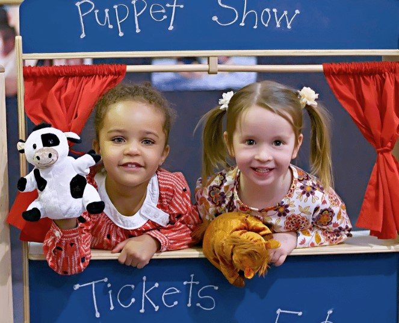

This article has been written and researched by our expert Loveable through a precise methodology. [Learn more about our methodology](https://avada.io/loveable/our-methodological.html)

[Loveable](https://avada.io/loveable/) > [Blog](https://avada.io/loveable/blog/) > [Family](https://avada.io/loveable/family/)

# 30 Best 4 Year Old Birthday Party Ideas For A Memorable Celebration 

Written by [Rose Bryne](https://avada.io/loveable/author/rose/) Last Updated on October 06, 2023

- [Best 4-Year-Old Boy Birthday Party Ideas](https://avada.io/loveable/blog/4-year-old-birthday-party-ideas/#wp-block-heading-2-4)
    - [1\. Dinosaur Adventure Party](https://avada.io/loveable/blog/4-year-old-birthday-party-ideas/#wp-block-heading-3-5)
    - [2\. Superhero Training Camp](https://avada.io/loveable/blog/4-year-old-birthday-party-ideas/#wp-block-heading-3-8)
    - [3\. Construction Zone Bash](https://avada.io/loveable/blog/4-year-old-birthday-party-ideas/#wp-block-heading-3-11)
    - [4\. Pirate Treasure Hunt](https://avada.io/loveable/blog/4-year-old-birthday-party-ideas/#wp-block-heading-3-14)
    - [5\. Outer Space Odyssey](https://avada.io/loveable/blog/4-year-old-birthday-party-ideas/#wp-block-heading-3-17)
    - [6\. Jungle Safari](https://avada.io/loveable/blog/4-year-old-birthday-party-ideas/#wp-block-heading-3-20)
    - [7\. Race Car Rally](https://avada.io/loveable/blog/4-year-old-birthday-party-ideas/#wp-block-heading-3-23)
    - [8\. Under the Sea Exploration](https://avada.io/loveable/blog/4-year-old-birthday-party-ideas/#wp-block-heading-3-26)
    - [9\. Farmyard Fiesta](https://avada.io/loveable/blog/4-year-old-birthday-party-ideas/#wp-block-heading-3-29)
    - [10\. Sports Spectacular](https://avada.io/loveable/blog/4-year-old-birthday-party-ideas/#wp-block-heading-3-32)
- [4-Year-Old Girl Birthday Party Ideas](https://avada.io/loveable/blog/4-year-old-birthday-party-ideas/#wp-block-heading-2-35)
    - [11\. Enchanted Garden Tea Party](https://avada.io/loveable/blog/4-year-old-birthday-party-ideas/#wp-block-heading-3-36)
    - [12\. Unicorn Fantasy Celebration](https://avada.io/loveable/blog/4-year-old-birthday-party-ideas/#wp-block-heading-3-39)
    - [13\. Ballerina Dance Party](https://avada.io/loveable/blog/4-year-old-birthday-party-ideas/#wp-block-heading-3-42)
    - [14\. Garden Fairy Gathering](https://avada.io/loveable/blog/4-year-old-birthday-party-ideas/#wp-block-heading-3-45)
    - [15\. Mermaid Undersea Adventure](https://avada.io/loveable/blog/4-year-old-birthday-party-ideas/#wp-block-heading-3-48)
    - [16\. Teddy Bear Picnic Birthday Party](https://avada.io/loveable/blog/4-year-old-birthday-party-ideas/#wp-block-heading-3-52)
    - [17\. Artistic Masterpiece Party](https://avada.io/loveable/blog/4-year-old-birthday-party-ideas/#wp-block-heading-3-55)
    - [18\. Animal Zoo Safari](https://avada.io/loveable/blog/4-year-old-birthday-party-ideas/#wp-block-heading-3-58)
    - [19\. Rainbow Adventure Bash](https://avada.io/loveable/blog/4-year-old-birthday-party-ideas/#wp-block-heading-3-61)
    - [20\. Magical Storybook Wonderland](https://avada.io/loveable/blog/4-year-old-birthday-party-ideas/#wp-block-heading-3-64)
- [Indoor Birthday Party Ideas for 4-Year-Old](https://avada.io/loveable/blog/4-year-old-birthday-party-ideas/#wp-block-heading-2-67)
    - [21\. Indoor Fun Photobooth](https://avada.io/loveable/blog/4-year-old-birthday-party-ideas/#wp-block-heading-3-68)
    - [22\. Indoor Croquet Play](https://avada.io/loveable/blog/4-year-old-birthday-party-ideas/#wp-block-heading-3-71) 
    - [23\. Painting Party for 4-Year-Old](https://avada.io/loveable/blog/4-year-old-birthday-party-ideas/#wp-block-heading-3-74) 
    - [24\. Make Home-Made Slime](https://avada.io/loveable/blog/4-year-old-birthday-party-ideas/#wp-block-heading-3-77) 
    - [25\. Play Board Games](https://avada.io/loveable/blog/4-year-old-birthday-party-ideas/#wp-block-heading-3-81)
    - [26\. Inspector Party Game](https://avada.io/loveable/blog/4-year-old-birthday-party-ideas/#wp-block-heading-3-85)
    - [27\. Puppet Show for Kids](https://avada.io/loveable/blog/4-year-old-birthday-party-ideas/#wp-block-heading-3-88)
    - [28\. DIY Craft Party](https://avada.io/loveable/blog/4-year-old-birthday-party-ideas/#wp-block-heading-3-91)
    - [29\. Hula Hoop It Up](https://avada.io/loveable/blog/4-year-old-birthday-party-ideas/#wp-block-heading-3-94)
    - [30\. Cup Creations](https://avada.io/loveable/blog/4-year-old-birthday-party-ideas/#wp-block-heading-3-98)
- [Bottom Line](https://avada.io/loveable/blog/4-year-old-birthday-party-ideas/#wp-block-heading-2-101)

Planning the perfect birthday party becomes delightful as your little one takes their first steps into being a preschooler. To help you create an unforgettable experience, we’ve curated a collection of **4-year-old birthday party ideas** that will captivate young hearts and create cherished memories. From enchanting themes to creative activities and scrumptious treats, these ideas will make your child’s special day extraordinary. 

And that’s not all – in this collection, we’ve also included a handpicked selection of the [best birthday gifts for 4-year-olds](https://avada.io/loveable/birthday-gifts-4-year-olds/) guaranteed to light up their faces with excitement. So, let’s step into a world of imagination and celebration, where the possibilities for joy are as boundless as a child’s imagination.

Ready to create an experience that’ll leave everyone – especially the birthday star – beaming with happiness? Let’s jump right in!

## **Best 4-Year-Old Boy Birthday Party Ideas**

### **1\. Dinosaur Adventure Party**

For a dinosaur-themed party, decorate the venue with dino cutouts and fossils and set up a “dig site” where kids can unearth toy dinosaurs. You can also organize a “Dino Egg Hunt” and provide dinosaur-themed goodie bags.

### **2\. Superhero Training Camp**

Let the kids unleash their inner superheroes with a training camp party. You create obstacle challenges for them to conquer, and give each child a superhero cape and mask. They can also design their superhero logos on cardboard shields as a fun craft activity.

### **3\. Construction Zone Bash**

If your little one loves trucks and buildings, a construction-themed party could be a hit. Set up a mini construction site with cardboard boxes and toy tools. Organize a “Build Your Cupcake” station where kids can decorate cupcakes like construction sites.

### **4\. Pirate Treasure Hunt**

Ahoy, matey! Arrange a pirate-themed treasure hunt where kids follow clues to find a hidden treasure chest filled with goodies. Provide eye patches, bandanas, and plastic swords for a swashbuckling adventure. Your kids can even have a “Walk the Plank” game or a pirate ship pinata to play.

### **5\. Outer Space Odyssey**

Take the 4-year-old boy on an intergalactic journey with an outer space party. To hold this special party, you need to decorate with stars, planets, and rocket ships. Organize space-themed games like “Pin the Alien on the Spaceship” and let the kids create their own alien masks.

### **6\. Jungle Safari**

We highly recommend you transform your party space into a wild jungle adventure. Set up animal-themed activities like a “Safari Scavenger Hunt,” where kids search for hidden animal toys. Provide animal masks, binoculars, and safari hats to make the experience more immersive.

### **7\. Race Car Rally**

If your little one is a fan of fast cars, consider a race car-themed birthday party. Create a mini race track for toy cars and organize races. Set up a pit stop station for decorating race car cookies and provide race car-themed stickers as party favors.

### **8\. Under the Sea Exploration**

Use blue and green decorations to create a watery atmosphere. Build sensory play stations with sand, water, and ocean animal toys. Kids can also make their own “sea in a bottle” craft.

### **9\. Farmyard Fiesta**

A farm-themed party could be delightful if your 4-year-old child [loves animals](https://avada.io/loveable/animals/) and nature. If possible, create a mini petting zoo with stuffed animals or even real animals like rabbits or chickens. Set up a farm animal face painting station and offer mini tractor rides if space allows.

### **10\. Sports Spectacular**

For active kids who [love sports](https://avada.io/loveable/outdoors-sports/), a sports-themed party is perfect. Set up various sports stations like soccer, basketball, and mini obstacle courses. You can organize friendly mini-tournaments and provide sports-themed goodie bags with small toys and treats.

## **4-Year-Old Girl Birthday Party Ideas**

### **11\. Enchanted Garden Tea Party**

If your 4-year-old girl loves fairy tales and pretty things, why not throw her an enchanting garden tea party? We could decorate the backyard with twinkling lights and set up a table adorned with delicate teacups and flowers. Imagine her joy as she and her friends dress up as fairies and enjoy a magical tea time together; your little princess looks so pretty!

### **12\. Unicorn Fantasy Celebration**

You can create a magical world with a unicorn-themed party. Decorate with pastel colors, rainbows, and unicorn cutouts. Set up a unicorn craft station where kids can decorate their own unicorn horns. For an extra touch, arrange a “Pin the Horn on the Unicorn” game and provide unicorn-themed treats.

### **13\. Ballerina Dance Party**

If your 4-year-old loves to dance, a ballerina-themed birthday party could be perfect. You have to set up a mini dance studio with tutus, ballet slippers, and a dance barre. Organize a simple dance routine for the kids to learn and perform, and provide ballet-themed cupcakes and cookies.

### **14\. Garden Fairy Gathering**

Let your kid have a meaningful activity by decorating the garden with pretty flowers, twinkling fairy lights, and cute toadstool cutouts. Plus, you can set up a station where everyone can dress like fairies with wings and flower crowns. For extra fun, you can have a scavenger hunt so your kids are more excited to find fairy treasures. It’s going to be an enchanting time!

### **15\. Mermaid Undersea Adventure**

How about plunging into the magical world of mermaids for your next party? I think it would be fantastic! You can transform your place into an underwater paradise with beautiful shades of blue and ocean-inspired decorations. Consider giving everyone mermaid tail blankets or skirts to dress up in to make it even more special.

And for some extra mermaid fun, create a “Mermaid Lagoon” sensory play station with colorful sand and seashells. It’s going to be an oceanic adventure that everyone will remember!

### **16\. Teddy Bear Picnic Birthday Party**

Have the kids bring their favorite stuffed animals and set up blankets for a cozy picnic. Organize classic picnic games like sack races and a teddy bear parade. You can also provide mini teddy bears – your little child’s friends as party favors. Having friends who are lovely teddy bears is such a special birthday experience, right?

### **17\. Artistic Masterpiece Party**

[Art for kids](https://avada.io/loveable/art-gifts-for-kids/) will be a perfect birthday idea that is creative and fun; you can set up various art stations with supplies for painting, drawing, and crafting. Encourage the kids to create their own masterpieces and provide mini easels as party favors. Display their artwork for a mini art gallery showcase.

### **18\. Animal Zoo Safari**

If your 4-year-old child loves animals, hosting a zoo safari-themed party could be fantastic! To entertain the little explorers, set up a fun “Zoo Passport” activity where the kids can gather stamps by visiting different animal stations. And don’t forget to treat them to some delicious animal-themed cupcakes or cake pops that will surely make their taste buds roar with delight!

### **19\. Rainbow Adventure Bash**

To keep the little ones entertained, we can organize a super fun rainbow scavenger hunt where they can hunt for items of each rainbow color. Also, for snacks, this place serves up a rainbow of delicious treats. Don’t forget the awesome rainbow stickers as party favors to ensure everyone goes home with a little piece of the rainbow magic. This party is going to be an absolute blast!

### **20\. Magical Storybook Wonderland**

If your lovely 4-year-old kid is a book lover, why not bring her favorite stories to life? You could choose her most beloved storybook and base the party around it. From decorations to games and even a special character appearance, it would be a party straight out of her imagination.

## **Indoor Birthday Party Ideas for 4-Year-Old**

### **21\. Indoor Fun Photobooth**

Create lasting memories of the party by setting up your DIY photo booth. With just some pool noodles and oversized balls, you’ll have everything required to strike those picture-perfect poses! Arrange the props against a simple backdrop, and watch the kids pick their favorites. For playful options, you can consider sunglasses, pom-poms, and even these vibrant rainbow shirts.

### **22\. Indoor Croquet Play** 

Here’s a great outdoor activity that’s ideal for the 4-year-old kids for his birthday party. Get everyone together and introduce them to the game of croquet. After a quick lesson, you let each child pick a mallet from the croquet set. Since these sets usually have six or eight mallets, it’s a fantastic choice for smaller groups who want to have some fun playing together.

### **23\. Painting Party for 4-Year-Old** 

Here’s a delightful birthday party activity for 4 years old that lets kids showcase their artistic talents in style. Lay out a lengthy table with a clean sheet of paper and provide a vibrant array of art supplies, including paints, markers, crayons, and beyond. Then, you hand each child a compact canvas and watch as their creativity comes to life in their own masterpiece.

### **24\. Make Home-Made Slime** 

Get ready to blast your 4-year-old child’s upcoming birthday party with a slime-making station that everyone will love. Whether hosting it indoors or outdoors, prepare a lengthy table with all the supplies needed for crafting homemade slime.

Each child can have their own glass jar; you can use our free printable tags to personalize them. This awesome party activity guarantees a fantastic time and serves as a cool take-home gift for the young guests.

### **25\. Play Board Games**

You might wonder if a 4-year-old is too young for board games. Of course, there are board games designed specifically for kids. You arrange these games neatly on a lengthy table, and let your kids all set for an afternoon filled with friendly competition and lively play!

Here are a few board games you can consider: [Hasbro Gaming Sorry](https://www.amazon.com/Hasbro-Gaming-A5065-Sorry-Game/dp/B076HK9H7Z/), [Candy Land](https://www.amazon.com/Hasbro-Gaming-Kingdom-Adventures-Exclusive/dp/B00000DMF5/), [Connect 4](https://www.amazon.com/Hasbro-A5640-Connect-4-Game/dp/B00D8STBHY/)

### **26\. Inspector Party Game**

In this game, equip each child with a magnifying glass and scatter clues around for them to unravel a thrilling party mystery or embark on an exciting scavenger hunt. Make sure each clue points the way to the next, creating a trail that leads to the ultimate solution or discovery of a hidden item!

### **27\. Puppet Show for Kids**

Look around for a nearby puppet show troupe that can stage a performance at a fixed venue or in your backyard. If your child has a particular favorite theme (like princesses, Sesame Street characters, dragons, etc.), try to locate a company that can tailor the entertainment to match their interests. This way, you’ll create an unforgettable experience that’s perfectly aligned with what your child loves.

### **28\. DIY Craft Party**

You’ve got choices – opt for a wonderfully messy venture like painting or keep things neater with a creative beaded bracelet-making craft. A heads-up like this DIY party for his/her little guests would be fantastic so they can dress accordingly. Furthermore, you should keep an eye on their activity to prevent possible small accidents to children. 

### **29\. Hula Hoop It Up**

Hand out hula hoops to the players and let them give it their best spin for as long as possible. If the hoop takes a tumble, they’re gently ushered out of the game. If your kid is short on space to accommodate everyone all at once, you can arrange a bunch of exciting one-on-one showdowns to keep the competition rolling.

Check out the [game tutorial](https://www.verywellfamily.com/hula-hoop-games-and-activities-1256808) 

### **30\. Cup Creations**

While grabbing your party essentials, consider snagging a couple of extra plastic cups, too. They can open the door to loads of games, or you can get creative and construct some awesome structures with them. A suitable activity for 4-year-old girls on their birthday.

## **Bottom Line**

In 2023, the world of **4-year-old birthday parties** has been ignited with various vibrant and imaginative ideas. From enchanting princess tea parties to thrilling superhero training camps, the options are as diverse as the personalities they celebrate. These trends promise to create cherished memories for the kids and their families, encapsulating the joy of growing up through playful celebrations.

- [Best 4-Year-Old Boy Birthday Party Ideas](https://avada.io/loveable/blog/4-year-old-birthday-party-ideas/#wp-block-heading-2-4)
    - [1\. Dinosaur Adventure Party](https://avada.io/loveable/blog/4-year-old-birthday-party-ideas/#wp-block-heading-3-5)
    - [2\. Superhero Training Camp](https://avada.io/loveable/blog/4-year-old-birthday-party-ideas/#wp-block-heading-3-8)
    - [3\. Construction Zone Bash](https://avada.io/loveable/blog/4-year-old-birthday-party-ideas/#wp-block-heading-3-11)
    - [4\. Pirate Treasure Hunt](https://avada.io/loveable/blog/4-year-old-birthday-party-ideas/#wp-block-heading-3-14)
    - [5\. Outer Space Odyssey](https://avada.io/loveable/blog/4-year-old-birthday-party-ideas/#wp-block-heading-3-17)
    - [6\. Jungle Safari](https://avada.io/loveable/blog/4-year-old-birthday-party-ideas/#wp-block-heading-3-20)
    - [7\. Race Car Rally](https://avada.io/loveable/blog/4-year-old-birthday-party-ideas/#wp-block-heading-3-23)
    - [8\. Under the Sea Exploration](https://avada.io/loveable/blog/4-year-old-birthday-party-ideas/#wp-block-heading-3-26)
    - [9\. Farmyard Fiesta](https://avada.io/loveable/blog/4-year-old-birthday-party-ideas/#wp-block-heading-3-29)
    - [10\. Sports Spectacular](https://avada.io/loveable/blog/4-year-old-birthday-party-ideas/#wp-block-heading-3-32)
- [4-Year-Old Girl Birthday Party Ideas](https://avada.io/loveable/blog/4-year-old-birthday-party-ideas/#wp-block-heading-2-35)
    - [11\. Enchanted Garden Tea Party](https://avada.io/loveable/blog/4-year-old-birthday-party-ideas/#wp-block-heading-3-36)
    - [12\. Unicorn Fantasy Celebration](https://avada.io/loveable/blog/4-year-old-birthday-party-ideas/#wp-block-heading-3-39)
    - [13\. Ballerina Dance Party](https://avada.io/loveable/blog/4-year-old-birthday-party-ideas/#wp-block-heading-3-42)
    - [14\. Garden Fairy Gathering](https://avada.io/loveable/blog/4-year-old-birthday-party-ideas/#wp-block-heading-3-45)
    - [15\. Mermaid Undersea Adventure](https://avada.io/loveable/blog/4-year-old-birthday-party-ideas/#wp-block-heading-3-48)
    - [16\. Teddy Bear Picnic Birthday Party](https://avada.io/loveable/blog/4-year-old-birthday-party-ideas/#wp-block-heading-3-52)
    - [17\. Artistic Masterpiece Party](https://avada.io/loveable/blog/4-year-old-birthday-party-ideas/#wp-block-heading-3-55)
    - [18\. Animal Zoo Safari](https://avada.io/loveable/blog/4-year-old-birthday-party-ideas/#wp-block-heading-3-58)
    - [19\. Rainbow Adventure Bash](https://avada.io/loveable/blog/4-year-old-birthday-party-ideas/#wp-block-heading-3-61)
    - [20\. Magical Storybook Wonderland](https://avada.io/loveable/blog/4-year-old-birthday-party-ideas/#wp-block-heading-3-64)
- [Indoor Birthday Party Ideas for 4-Year-Old](https://avada.io/loveable/blog/4-year-old-birthday-party-ideas/#wp-block-heading-2-67)
    - [21\. Indoor Fun Photobooth](https://avada.io/loveable/blog/4-year-old-birthday-party-ideas/#wp-block-heading-3-68)
    - [22\. Indoor Croquet Play](https://avada.io/loveable/blog/4-year-old-birthday-party-ideas/#wp-block-heading-3-71) 
    - [23\. Painting Party for 4-Year-Old](https://avada.io/loveable/blog/4-year-old-birthday-party-ideas/#wp-block-heading-3-74) 
    - [24\. Make Home-Made Slime](https://avada.io/loveable/blog/4-year-old-birthday-party-ideas/#wp-block-heading-3-77) 
    - [25\. Play Board Games](https://avada.io/loveable/blog/4-year-old-birthday-party-ideas/#wp-block-heading-3-81)
    - [26\. Inspector Party Game](https://avada.io/loveable/blog/4-year-old-birthday-party-ideas/#wp-block-heading-3-85)
    - [27\. Puppet Show for Kids](https://avada.io/loveable/blog/4-year-old-birthday-party-ideas/#wp-block-heading-3-88)
    - [28\. DIY Craft Party](https://avada.io/loveable/blog/4-year-old-birthday-party-ideas/#wp-block-heading-3-91)
    - [29\. Hula Hoop It Up](https://avada.io/loveable/blog/4-year-old-birthday-party-ideas/#wp-block-heading-3-94)
    - [30\. Cup Creations](https://avada.io/loveable/blog/4-year-old-birthday-party-ideas/#wp-block-heading-3-98)
- [Bottom Line](https://avada.io/loveable/blog/4-year-old-birthday-party-ideas/#wp-block-heading-2-101)

### [Rose Bryne](https://avada.io/loveable/author/rose/)

Hi, I'm Rose! I love animals and spending time with kids. At Loveable, I help people find unique gifts for special occasions like Valentine's Day, housewarmings, and graduations. I enjoy finding gifts for kids, teens, and animal lovers that match their interests and personalities. Making gift-giving a pleasant experience is my priority. Let me assist you in finding the perfect gift!

- [Twitter](https://twitter.com/intent/tweet)
- [Facebook](https://www.facebook.com/sharer/sharer.php)
- [instagram](https://avada.io/loveable/blog/4-year-old-birthday-party-ideas/)
- [pinterest](https://www.pinterest.com/loveablellc/)

## Related Posts

[### 30 Best 4 Year Old Birthday Party Ideas For A Memorable Celebration](https://avada.io/loveable/blog/4-year-old-birthday-party-ideas/) 

[

### 16th Birthday Party Ideas to Make an Unforgettable Day

](https://avada.io/loveable/blog/16th-birthday-party-ideas/)

[

### 150+ Inspirational Birthday Quotes to Spread Joy on Special Day

](https://avada.io/loveable/blog/inspirational-birthday-quotes/)

[

### 160+ Birthday Wishes for Wife to Express Eternal Love

](https://avada.io/loveable/blog/birthday-wishes-for-wife/)

[### 90+ Heart Touching Birthday Wishes for Niece to Make Her Day Extra Special](https://avada.io/loveable/blog/birthday-wishes-for-niece/)
