This article has been written and researched by our expert Loveable through a precise methodology. [Learn more about our methodology](https://avada.io/loveable/our-methodological.html)

[Loveable](https://avada.io/loveable/) > [Blog](https://avada.io/loveable/blog/) > [Holiday](https://avada.io/loveable/holiday/)

# 30 Best Christmas Ornaments Diy Ideas For 2023 (With Detail Guides)

Written by [Blake Simpson](https://avada.io/loveable/author/blake/) Last Updated on September 11, 2023

- [30 Easy Christmas Ornaments Diy Ideas For Anyone To Make At Home](https://avada.io/loveable/blog/christmas-ornaments-diy/#wp-block-heading-2-4) 
    - [1\. DIY Glittery Leaf](https://avada.io/loveable/blog/christmas-ornaments-diy/#wp-block-heading-3-5)
    - [2\. Pastel Hand Painted Ornaments](https://avada.io/loveable/blog/christmas-ornaments-diy/#wp-block-heading-3-8)
    - [3\. Polish Tree Ornaments](https://avada.io/loveable/blog/christmas-ornaments-diy/#wp-block-heading-3-12)
    - [4\. Mini Bell Christmas Ornaments](https://avada.io/loveable/blog/christmas-ornaments-diy/#wp-block-heading-3-16)
    - [5\. Beautiful Marbled Ornaments](https://avada.io/loveable/blog/christmas-ornaments-diy/#wp-block-heading-3-21)
    - [6\. Paper Honeycomb Ornaments](https://avada.io/loveable/blog/christmas-ornaments-diy/#wp-block-heading-3-24)
    - [7\. Gold Splatter Christmas Ornaments](https://avada.io/loveable/blog/christmas-ornaments-diy/#wp-block-heading-3-28)
    - [8\. Cute Mini Santa Ornament](https://avada.io/loveable/blog/christmas-ornaments-diy/#wp-block-heading-3-33)
    - [9\. Personalized Wire Ornament](https://avada.io/loveable/blog/christmas-ornaments-diy/#wp-block-heading-3-39)
    - [10\. Avocado Toast Ornaments](https://avada.io/loveable/blog/christmas-ornaments-diy/#wp-block-heading-3-42)
    - [11\. Colorful Sprinkles Ornaments](https://avada.io/loveable/blog/christmas-ornaments-diy/#wp-block-heading-3-46)
    - [12\. Clothespin Ornament](https://avada.io/loveable/blog/christmas-ornaments-diy/#wp-block-heading-3-50)
    - [13\. Jewelry Ornament](https://avada.io/loveable/blog/christmas-ornaments-diy/#wp-block-heading-3-58)
    - [14\. Cute Gnome Ornaments](https://avada.io/loveable/blog/christmas-ornaments-diy/#wp-block-heading-3-62)
    - [15\. Dry Orange Slice Ornament](https://avada.io/loveable/blog/christmas-ornaments-diy/#wp-block-heading-3-66) 
    - [16\. Mini Crochet Wreath Ornament](https://avada.io/loveable/blog/christmas-ornaments-diy/#wp-block-heading-3-69)
    - [17\. Cute Olaf Ornament](https://avada.io/loveable/blog/christmas-ornaments-diy/#wp-block-heading-3-73)
    - [18\. Cookie Cutter Frame Ornaments](https://avada.io/loveable/blog/christmas-ornaments-diy/#wp-block-heading-3-82)
    - [19\. DIY Candy Cane Ornaments](https://avada.io/loveable/blog/christmas-ornaments-diy/#wp-block-heading-3-86)
    - [20\. Bell Jars Ornament](https://avada.io/loveable/blog/christmas-ornaments-diy/#wp-block-heading-3-91) 
    - [21\. House Shape Ornament made from Clay](https://avada.io/loveable/blog/christmas-ornaments-diy/#wp-block-heading-3-94) 
    - [22\. Walnut Rudolf Christmas Ornament](https://avada.io/loveable/blog/christmas-ornaments-diy/#wp-block-heading-3-98)
    - [23\. Reindeer Ornament](https://avada.io/loveable/blog/christmas-ornaments-diy/#wp-block-heading-3-105)
    - [24\. Salt Shaker Ornaments](https://avada.io/loveable/blog/christmas-ornaments-diy/#wp-block-heading-3-113)
    - [25\. Made Ornament from Acorn](https://avada.io/loveable/blog/christmas-ornaments-diy/#wp-block-heading-3-117) 
    - [26\. Tree Hoop Ornament](https://avada.io/loveable/blog/christmas-ornaments-diy/#wp-block-heading-3-121)
    - [27\. Snow Pine Globe Ornament](https://avada.io/loveable/blog/christmas-ornaments-diy/#wp-block-heading-3-125)
    - [28\. Santa Ornament](https://avada.io/loveable/blog/christmas-ornaments-diy/#wp-block-heading-3-129)
    - [29\. Cute Gumball Machine Ornaments](https://avada.io/loveable/blog/christmas-ornaments-diy/#wp-block-heading-3-134)
    - [30\. Yarn Ball Ornament](https://avada.io/loveable/blog/christmas-ornaments-diy/#wp-block-heading-3-138)
- [Bottom Line](https://avada.io/loveable/blog/christmas-ornaments-diy/#wp-block-heading-2-145) 

Looking to add a touch of creativity and charm to your holiday decor this year? Look no further! In this article, we unveil the 30 best **Christmas ornaments DIY** **ideas** for 2023, complete with step-by-step guides. Have you ever wondered how to turn simple materials into stunning holiday masterpieces that will captivate your guests? Get ready to infuse your festive season with a dash of imagination and craftiness as we explore these delightful DIY ornament ideas.

From elegant hand-painted baubles to whimsical felt creations, this year’s DIY Christmas ornament ideas promise to elevate your holiday decor game. Whether you’re a seasoned crafting enthusiast or just starting, you’re sure to find inspiration in our curated collection. Unleash your inner artist and follow our detailed guides to transform basic materials into personalized ornaments that will add a heartwarming touch to your tree.

Don’t miss out on the opportunity to create magical memories and stunning decorations that will be cherished for years to come. Let’s kick-start your holiday crafting journey with these exquisite [unique ornament ideas](https://avada.io/loveable/unique-christmas-ornaments/) and expert guidance. Ready to make this Christmas truly special? Let’s get started!

## **30 Easy Christmas Ornaments Diy Ideas For Anyone To Make At Home** 

### **1\. DIY Glittery Leaf**

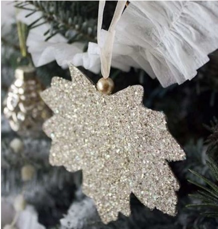

**How to make**: Create two leaf shapes by cutting them out from either cardstock or watercolor paper. Add a touch of sparkle by applying glitter to the sides facing outward. Next, thread a ribbon loop through a bead and securely attach the ends between the two leaves. Gently press the leaves together and allow them to dry while clamped in place.

### **2\. Pastel Hand Painted Ornaments**

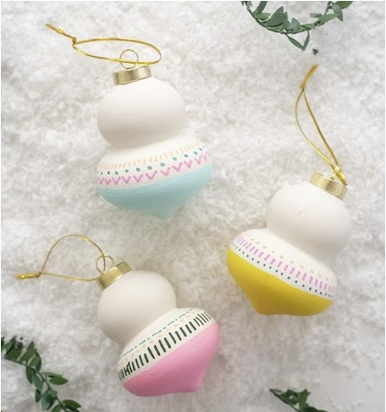

There’s a distinct ’80s vibe to these lively and boldly designed ornaments! They inject a burst of vibrant color into your Christmas tree and bring a delightful touch of playfulness to the overall arrangement.

Check out the step-by-step guide over at [Alice & Lois](https://www.aliceandlois.com/13061-2/) to create your own.

### **3\. Polish Tree Ornaments**

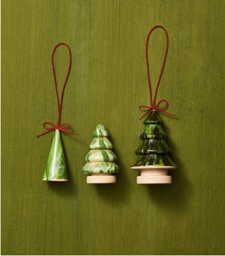

Transforming simple wooden trees into festive decorations is a breeze! Just dip them into a cup filled with water mixed with two distinct shades of green nail polish. To ensure even coverage, dip with the tree upside down and let any excess polish drip off. Once you’re satisfied, flip the tree upright and let it dry. It’s as easy as that!

Buy [wooden tree from Amazon](https://www.amazon.com/Wooden-Christmas-Crafts-Unfinished-Woodpeckers/dp/B081QRD1GP?ots=1&slotNum=0&imprToken=1ec4f995-0b3e-6170-b7d&linkCode=ogi&tag=womansday_auto-append-20&ascsubtag=%5Bartid%7C10070.g.2019%5Bsrc%7Cwww.google.com%5Bch%7C%5Blt%7C%5Bpid%7C153be17f-dba7-47ae-9418-4acc8efce814) 

### **4\. Mini Bell Christmas Ornaments**

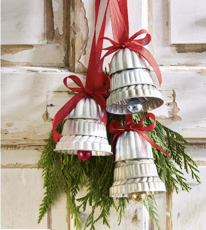

Adorn your front door with these charming ornaments, or elegantly drape them across your Christmas tree.

**Here’s how you can create them:** Stack mini molds and Bundt pans to craft bell shapes, securing them together with epoxy. Attach small ornaments to the lower part to fashion the clappers. For easy hanging, use hot glue to affix ribbon loops and a bow to the top. If you like, you can also include a swag of greenery to enhance the decoration.

Buy [mold from amazon](https://www.amazon.com/Bezall-Aluminum-Cupcake-Cookie-Pudding/dp/B00T5K0GGO/) 

### **5\. Beautiful Marbled Ornaments**

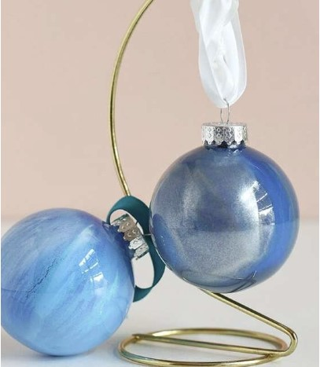

Transform plain, clear glass ornaments into vibrant and colorful decorations using acrylic paint. Begin by adding a few drops of paint to the top inside of the ornament’s neck, then gently rotate the ornament to form beautiful swirls of color. Gradually add more paint until your unique masterpiece comes to life. For a detailed step-by-step guide, check out the full tutorial over at [Persia Lou](https://persialou.com/diy-marbled-ornaments/).

### **6\. Paper Honeycomb Ornaments**

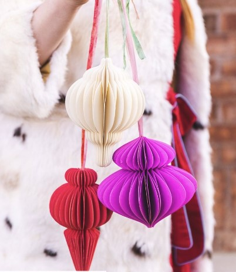

You’ve likely come across those charming honeycomb ornaments in your beloved home design shop, but guess what? You can craft equally stunning ones right in the comfort of your home! Their generous size and delightful lightness make them an ideal visual complement to the dainty ornaments adorning your Christmas tree.

For detailed instructions, head over to [The House That Lars Built](https://thehousethatlarsbuilt.com/2020/12/diy-paper-honeycomb-ornaments.html/) and follow their tutorial. Your tree will thank you!

### **7\. Gold Splatter Christmas Ornaments**

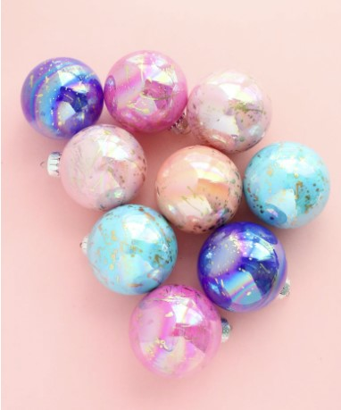

Switch things up this year by opting for ornaments that boast vibrant hues and plenty of luxurious gold accents.

Discover how to create stunning [Iridescent Gold Splatter Ornaments](https://akailochiclife.com/2018/11/diy-iridescent-gold-splatter-painted.html) by checking out the tutorial over at A Kailo Chic Life.

If you’re ready to start, you can find the [clear ornaments](https://www.amazon.com/Richland-Glass-Ornaments-Set-24/dp/B07GR8CCRJ) you need in the shop. Happy crafting!

### **8\. Cute Mini Santa Ornament**

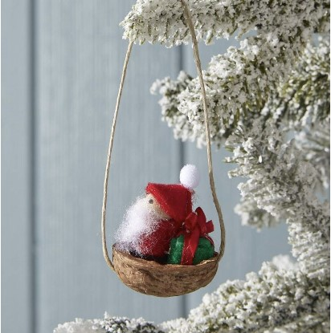

A delightful sight for all, Santa will bring joy to anyone who spots him perched on the tree in his charming mini walnut shell sleigh.

**Here’s how to craft this whimsical decoration:** Start by giving a small wooden peg doll expressive eyes using a fine-tip black marker. Envelop the doll’s body in red felt, using hot glue to hold it in place securely. Craft a tiny hat from red felt and attach it to the doll’s head using hot glue, then add a mini pom pom as the finishing touch. For the gift, cover a mini wooden cube with green felt, ensuring it stays put with hot glue. Fasten a ribbon around the present for added charm.

Prepare the walnut shell by drilling small holes on each end of a halved shell. Thread a piece of slender twine through each hole and secure it inside the shell with hot glue, knotting the twine at the top for hanging. Complete the scene by using hot glue to position Santa and his gift inside the shell.

You can find the necessary [mini wooden peg dolls](https://www.amazon.com/dp/B00WQDTTCE) in the shop. Happy crafting!

### **9\. Personalized Wire Ornament**

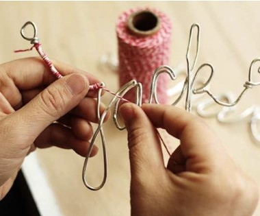

Begin by elegantly writing a name in cursive style. Next, take a lengthy piece of wire and utilize pliers to carefully shape it to mirror the graceful curves of the written name. Conclude the wire with a charming loop or heart shape. To complete the design, delicately wrap the wire with baker’s twine or yarn, ensuring each letter is artfully covered. If needed, apply a few drops of glue to securely anchor the string in its place.

### **10\. Avocado Toast Ornaments**

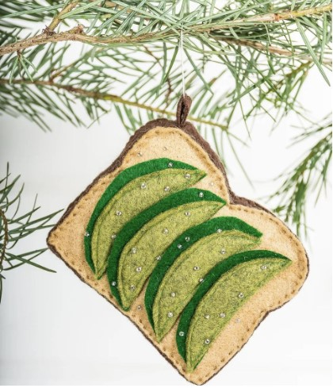

Attention, avocado toast enthusiasts! Prepare to be charmed by this utterly delightful ornament that ingeniously captures the essence of your beloved snack.

Find the comprehensive tutorial over at [DIY in PDX](http://diyinpdx.com/2018/12/13/diy-scandi-minimalist-or-avocado-toast-christmas-ornaments/) and embark on a creative journey. Happy crafting!

### **11\. Colorful Sprinkles Ornaments**

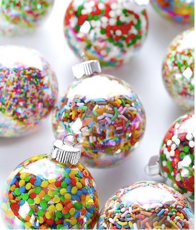

Head over to your pantry and snag some sprinkles – it’s time to work some holiday magic! Fill up those ornaments with sprinkles and transform them into a whimsical winter wonderland of candies.

Curious to learn how? Dive into the detailed [Sprinkles Ornaments tutorial](http://www.gimmesomeoven.com/diy/diy-sprinkles-ornaments/) available at Gimme Some Oven. Let the festive fun begin!

### **12\. Clothespin Ornament**

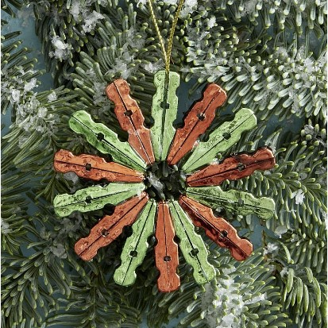

Transforming a timeless country staple, the clothespin, into a delightful [personalized Christmas ornament](https://avada.io/loveable/personalized-christmas-ornaments/) is a charming crafting idea. We’ve taken the mini clothespin route for our version, but you’re free to opt for the standard size if you prefer.

Here’s the tutorial from Country Living  to create this festive ornament:

1. Carefully detach the springs from 14 mini clothespins.
2. Flip the components of each clothespin and affix them together back-to-back using glue.
3. Arrange and glue the pins in a circular arrangement, forming the ornament’s shape.
4. Attach a piece of gold twine to one of the pins to serve as the hanging loop.

### **13\. Jewelry Ornament**

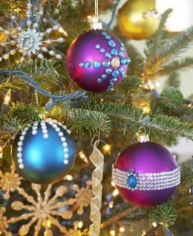

It’s time to grab your trusty hot glue gun and those sparkly rhinestones – we’re diving into a bedazzling adventure that’s bound to impress. Feel free to unleash your creativity and decorate to your heart’s content!

[Browse Rhinestones](https://www.amazon.com/editTime-Colorful-Rhinestones-Rhinestone-multicolor/dp/B07KDVHS2H)

### **14\. Cute Gnome Ornaments**

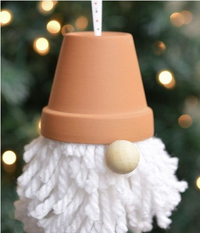

We’re not quite certain if any gnome has ever held a candle to the cuteness of this ornament! Peeking out from beneath its terra cotta pot hat, you’ll find a generously fluffy yarn beard and an utterly charming bead nose.

Discover the step-by-step guide over at [One Little Project.](https://onelittleproject.com/gnome-ornaments/)

### **15\. Dry Orange Slice Ornament** 

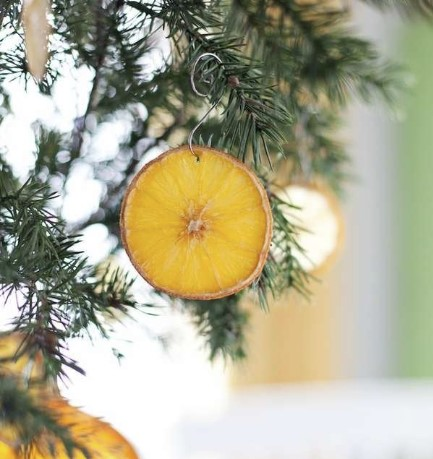

Adding dried orange slices to your Christmas tree brings in both vibrant colors and a delightful aroma. Making your own is easy: pop citrus slices in the oven at 150 degrees for 3 to 4 hours, or let them air dry for 4 days. While oranges are the traditional pick, you can follow the same steps with lemons, limes, or even grapefruit for a twist!

### **16\. Mini Crochet Wreath Ornament**

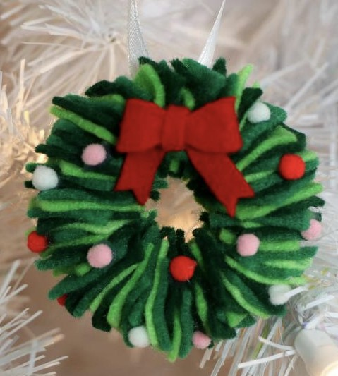

Before you toss those leftover felt scraps from your previous crafting endeavors, hold on a second! Put them to good use by creating charming Christmas tree ornaments, just like this cute mini wreath. This enjoyable and festive decoration brings a wonderful touch to any tree, and it’s a fantastic option for kids to craft since it won’t shatter if accidentally dropped.

Discover the step-by-step guide and explore more creative ideas: [Crafting Christmas Tree Ornaments Using Scrap Felt](https://www.hgtv.com/lifestyle/holidays/easy-felt-scrap-christmas-ornaments)

### **17\. Cute Olaf Ornament**

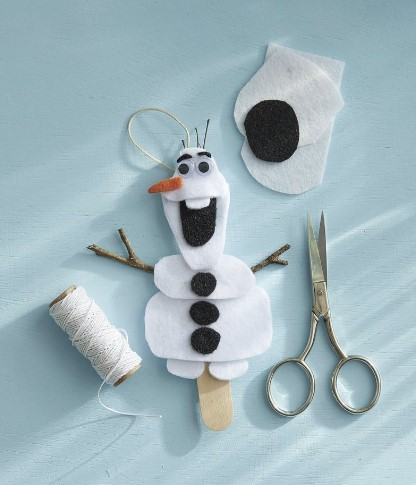

Frozen is a favorite among kids, and this ornament is practically guaranteed to have them twirling around the tree while belting out “Let It Go” on repeat (apologies in advance, parents!).

Here’s how you can create it (guide from Country Living):

1. Craft the body shapes using white felt, then affix them onto a tongue depressor using hot glue.
2. Fashion buttons, a mouth, and expressive eyebrows from black felt, then secure them onto the body with hot glue.
3. Attach tiny googly eyes just below those fabulous eyebrows.
4. Cut out a carrot-shaped nose from an orange felt, then glue it below the eyes with hot glue.
5. For a finishing touch, glue on mini twig arms and attach a piece of twine to the tongue depressor for easy hanging.

### **18\. Cookie Cutter Frame Ornaments**

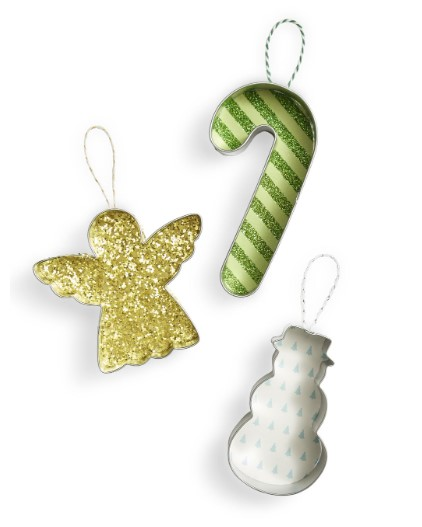

Round up a collection of festive Christmas cookie cutters for a fun DIY ornament project. Start by tracing the shapes of the cookie cutters onto your choice of patterned paper, then carefully cut along the lines. Apply a thin line of glue along the edge of the cookie cutter and gently press the cut paper onto it, ensuring the edges line up perfectly. Allow it to dry.

Next, attach a petite loop of cord to the back of the ornament, giving it a secure spot to hang. After that, let the cord dry in place. Finally, it’s time to hang up your charming homemade ornaments and add a touch of holiday spirit to your decor.

### **19\. DIY Candy Cane Ornaments**

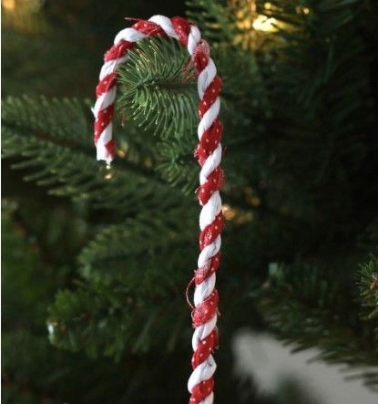

Add a delightful twist to your tree decor by combining genuine candy canes with decorative ones! The beauty of this project lies in its simplicity – you’ll only require red and white fabric scraps along with some wire.

For a step-by-step guide, check out the tutorial over at [DIY Candy](https://diycandy.com/diy-candy-cane-ornaments/).

Get ready to infuse your tree with a unique touch of holiday charm!

### **20\. Bell Jars Ornament** 

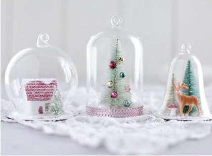

You can find all the necessary supplies for this festive holiday DIY project at The Smile Mercantile. Crafting these charming vintage-inspired bell jar ornaments involves capturing a classic winter scene within the enchanting glass dome of a cloche, and adding a sprinkle of glitter for that extra magical touch. Follow these [detailed instructions](https://www.smilemercantile.com/blogs/tutorials/diy-snow-globe-ornaments-fun-christmas-crafts) to craft your very own miniature holiday diorama this season.

### **21\. House Shape Ornament made from Clay** 

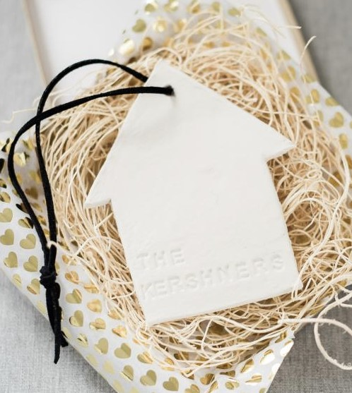

Crafting a customized, house-shaped clay ornament is a heartfelt and meaningful housewarming gesture that new homeowners will hold dear for many years.

Discover the step-by-step process in our guide: Crafting a [House-Shaped Clay Ornament](https://www.hgtv.com/design/make-and-celebrate/handmade/how-to-make-a-house-shaped-clay-ornament)

### **22\. Walnut Rudolf Christmas Ornament**

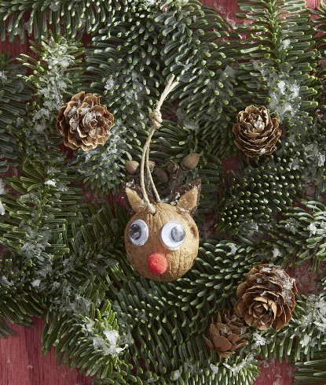

Welcome Santa with a touch of charm through this adorable Rudolph ornament, complete with a bright and welcoming face. His glistening red nose is sure to guide Santa straight to those cookies thoughtfully placed under the tree.

Here’s how you can create it (Guide from Country Living):

1. Carefully drill a small hole near the upper part of one half of a walnut shell.
2. Use hot glue to attach mini googly eyes, a miniature red pom pom for the nose, and cute brown felt ears.
3. Thread a length of twine through the hole and secure it with a knot.

### **23\. Reindeer Ornament**

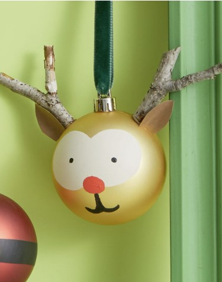

Take a gold ornament as your canvas and create an eye-catching design with a few simple steps. Here’s how:

1. Paint two overlapping white circles onto the ornament to form the eye area. Allow the paint to dry.
2. Once the white circles are dry, carefully paint two small black dots at the center of each circle to create the eyes. Allow the paint to dry once again.
3. For the nose, paint a black spot in the middle where the two white circles meet. If you’re making Rudolph, you can opt for a red nose instead. Below the nose, add a petite mouth shape. Allow the paint to dry thoroughly.
4. Use hot glue to attach twig antlers to the top of the ornament.
5. Craft a triangle-shaped ear from brown construction paper, slightly bend it inward, and secure it in front of one of the twig antlers using a thin line of hot glue.

### **24\. Salt Shaker Ornaments**

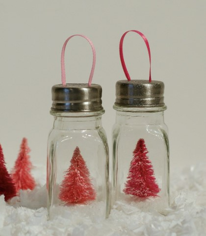

Here’s a unique and playful spin on the traditional snow globe ornament. Rather than the usual round dome, this funky version features bottle brush trees nestled within clear salt shakers, resulting in a delightful vintage-inspired appearance.

For detailed instructions, check out the tutorial over at [Mason Jar Crafts Love](https://masonjarcraftslove.com/salt-shaker-ornaments/).

### **25\. Made Ornament from Acorn** 

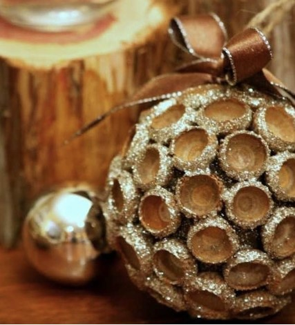

Start by giving a three-inch Styrofoam ball a rich, natural hue with your choice of dark paint. Now, press or use hot glue to secure acorn caps onto the foam, arranging them snugly for a cohesive look. Craft a loop using twine, fold it, and then affix it to the ball using a straight pin.

To add an extra touch of sparkle, apply Mod Podge along the edges of the acorn caps and while the glue is still wet, gently sprinkle glitter over them. Once the ornament is dry, you can complete the festive look by attaching a ribbon bow.

### **26\. Tree Hoop Ornament**

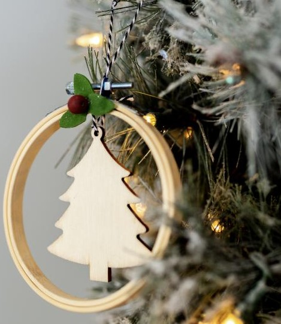

Encased within a petite embroidery hoop, an unadorned wooden tree ornament undergoes a charming metamorphosis, becoming an engaging and Nordic-inspired decorative piece. Enhance it by affixing felt leaves and a vibrant red wooden bead, infusing it with a burst of holiday cheer.

Discover The Step-By-Step Guide + Additional Inspiration: Crafting [Three Exquisite Scandinavian-Style Ornaments](https://www.hgtv.com/lifestyle/holidays/diy-scandinavian-style-ornaments) on Your Own

### **27\. Snow Pine Globe Ornament**

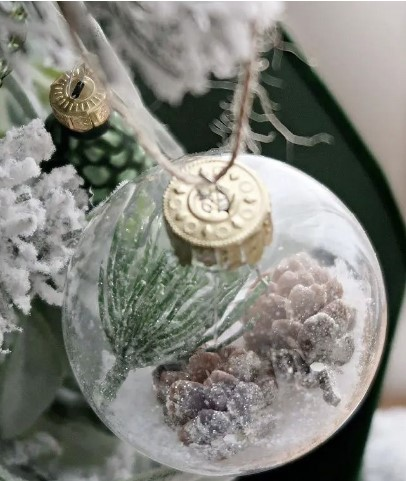

Contained within the delicate sphere of this ornament snow globe, you’ll discover the enchanting components of a wintery forest. Inside, pinecones, snow, and pine needles come together harmoniously, creating a whimsical scene that can be playfully mixed with a simple shake.

Find the detailed guide over at [The Crazy Craft Lady](https://thecrazycraftlady.com/pine-snow-globe-ornaments/) and embark on your own creative journey.

### **28\. Santa Ornament**

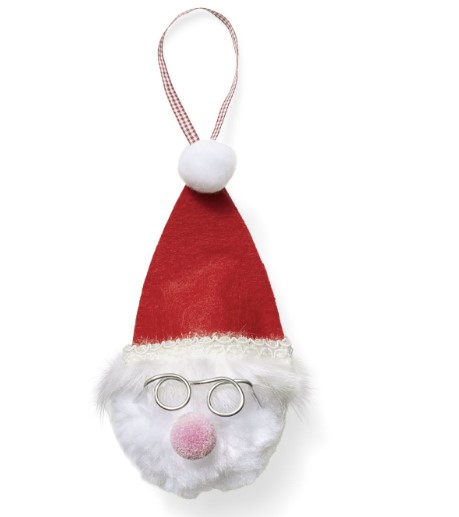

Crafting a delightfully soft and huggable Santa is a breeze with a sizable pom-pom at the helm.

Start by cutting a 3″ x 3″ square of red felt into two triangles, then secure them together on two sides using hot glue. Add a touch of charm by carefully attaching faux-fur trim along the bottom and affixing a dainty white pom-pom.

For Santa’s distinctive eyewear, fashion two loops from silver craft wire, shaping them into glasses and trimming the ends neatly. With precision, attach the wire glasses and a petite pink pom-pom nose using hot glue, giving life to his adorable face.

### **29\. Cute Gumball Machine Ornaments**

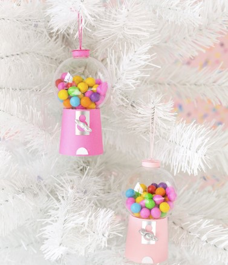

Transform an ordinary transparent ornament into a wonderfully vibrant miniature gumball machine, replete with its own collection of petite candies (or opt for charming pom poms if you wish). Prepare to leave folks astonished by your skill in crafting these adorable replicas!

Discover the step-by-step guide at [Aww Sam](http://www.awwsam.com/2017/11/diy-gumball-machine-ornaments.html) and embark on a crafting journey that will surely captivate your creativity.

### **30\. Yarn Ball Ornament**

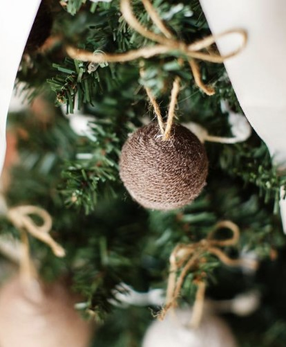

Wrap budget-friendly foam balls with yarn to craft charmingly rustic Christmas ornaments that the kids can proudly display on the tree or use as delightful gift toppers. Opt for classic wool or synthetic yarn for a sleek finish, or unleash your imagination by enveloping the balls in playful novelty yarns boasting fluffy faux-fur textures or captivating variegated hues.

EXPLORE THE STEP-BY-STEP GUIDE: [Crafting Fun with the Kids: Yarn-Wrapped Christmas Ball Ornaments](https://www.hgtv.com/design/make-and-celebrate/handmade/christmas-kids-craft-yarn-ball-ornaments)

_**See More:**_

- [Funny Christmas Ornaments](https://avada.io/loveable/funny-christmas-ornaments/)

- Stunning [Crochet Christmas Ornaments](https://avada.io/loveable/blog/crochet-christmas-ornaments/)

## **Bottom Line** 

In the spirit of celebrating the joyous season, we’ve unveiled a treasure trove of creative brilliance through our compilation of the 30 Best **DIY Christmas Ornament** Ideas for 2023, complete with detailed step-by-step guides. These enchanting creations are bound to infuse your holiday festivities with personalized charm and heartfelt warmth. From traditional classics to imaginative novelties, each ornament offers a unique avenue for self-expression and crafting delight. As you embark on your crafting journey, may these ideas inspire you to craft not just ornaments, but cherished memories that adorn your holiday season for years to come. Happy crafting, and a very Merry Christmas to you and your loved ones!

- [30 Easy Christmas Ornaments Diy Ideas For Anyone To Make At Home](https://avada.io/loveable/blog/christmas-ornaments-diy/#wp-block-heading-2-4) 
    - [1\. DIY Glittery Leaf](https://avada.io/loveable/blog/christmas-ornaments-diy/#wp-block-heading-3-5)
    - [2\. Pastel Hand Painted Ornaments](https://avada.io/loveable/blog/christmas-ornaments-diy/#wp-block-heading-3-8)
    - [3\. Polish Tree Ornaments](https://avada.io/loveable/blog/christmas-ornaments-diy/#wp-block-heading-3-12)
    - [4\. Mini Bell Christmas Ornaments](https://avada.io/loveable/blog/christmas-ornaments-diy/#wp-block-heading-3-16)
    - [5\. Beautiful Marbled Ornaments](https://avada.io/loveable/blog/christmas-ornaments-diy/#wp-block-heading-3-21)
    - [6\. Paper Honeycomb Ornaments](https://avada.io/loveable/blog/christmas-ornaments-diy/#wp-block-heading-3-24)
    - [7\. Gold Splatter Christmas Ornaments](https://avada.io/loveable/blog/christmas-ornaments-diy/#wp-block-heading-3-28)
    - [8\. Cute Mini Santa Ornament](https://avada.io/loveable/blog/christmas-ornaments-diy/#wp-block-heading-3-33)
    - [9\. Personalized Wire Ornament](https://avada.io/loveable/blog/christmas-ornaments-diy/#wp-block-heading-3-39)
    - [10\. Avocado Toast Ornaments](https://avada.io/loveable/blog/christmas-ornaments-diy/#wp-block-heading-3-42)
    - [11\. Colorful Sprinkles Ornaments](https://avada.io/loveable/blog/christmas-ornaments-diy/#wp-block-heading-3-46)
    - [12\. Clothespin Ornament](https://avada.io/loveable/blog/christmas-ornaments-diy/#wp-block-heading-3-50)
    - [13\. Jewelry Ornament](https://avada.io/loveable/blog/christmas-ornaments-diy/#wp-block-heading-3-58)
    - [14\. Cute Gnome Ornaments](https://avada.io/loveable/blog/christmas-ornaments-diy/#wp-block-heading-3-62)
    - [15\. Dry Orange Slice Ornament](https://avada.io/loveable/blog/christmas-ornaments-diy/#wp-block-heading-3-66) 
    - [16\. Mini Crochet Wreath Ornament](https://avada.io/loveable/blog/christmas-ornaments-diy/#wp-block-heading-3-69)
    - [17\. Cute Olaf Ornament](https://avada.io/loveable/blog/christmas-ornaments-diy/#wp-block-heading-3-73)
    - [18\. Cookie Cutter Frame Ornaments](https://avada.io/loveable/blog/christmas-ornaments-diy/#wp-block-heading-3-82)
    - [19\. DIY Candy Cane Ornaments](https://avada.io/loveable/blog/christmas-ornaments-diy/#wp-block-heading-3-86)
    - [20\. Bell Jars Ornament](https://avada.io/loveable/blog/christmas-ornaments-diy/#wp-block-heading-3-91) 
    - [21\. House Shape Ornament made from Clay](https://avada.io/loveable/blog/christmas-ornaments-diy/#wp-block-heading-3-94) 
    - [22\. Walnut Rudolf Christmas Ornament](https://avada.io/loveable/blog/christmas-ornaments-diy/#wp-block-heading-3-98)
    - [23\. Reindeer Ornament](https://avada.io/loveable/blog/christmas-ornaments-diy/#wp-block-heading-3-105)
    - [24\. Salt Shaker Ornaments](https://avada.io/loveable/blog/christmas-ornaments-diy/#wp-block-heading-3-113)
    - [25\. Made Ornament from Acorn](https://avada.io/loveable/blog/christmas-ornaments-diy/#wp-block-heading-3-117) 
    - [26\. Tree Hoop Ornament](https://avada.io/loveable/blog/christmas-ornaments-diy/#wp-block-heading-3-121)
    - [27\. Snow Pine Globe Ornament](https://avada.io/loveable/blog/christmas-ornaments-diy/#wp-block-heading-3-125)
    - [28\. Santa Ornament](https://avada.io/loveable/blog/christmas-ornaments-diy/#wp-block-heading-3-129)
    - [29\. Cute Gumball Machine Ornaments](https://avada.io/loveable/blog/christmas-ornaments-diy/#wp-block-heading-3-134)
    - [30\. Yarn Ball Ornament](https://avada.io/loveable/blog/christmas-ornaments-diy/#wp-block-heading-3-138)
- [Bottom Line](https://avada.io/loveable/blog/christmas-ornaments-diy/#wp-block-heading-2-145) 

### [Blake Simpson](https://avada.io/loveable/author/blake/)

Hi, I'm Blake from Loveable. I help people find perfect gifts for occasions like anniversaries and weddings. I also write a blog about holidays, sharing insights to make them more meaningful. Let's create unforgettable moments together!

- [Twitter](https://twitter.com/intent/tweet)
- [Facebook](https://www.facebook.com/sharer/sharer.php)
- [instagram](https://avada.io/loveable/blog/christmas-ornaments-diy/)
- [pinterest](https://www.pinterest.com/loveablellc/)

## Related Posts

[### 120+ Christian Birthday Wishes To Spread Your Love](https://avada.io/loveable/blog/christian-birthday-wishes/) 

[

### 35 Best 70th Birthday Ideas To Celebrate The Special Milestone

](https://avada.io/loveable/blog/70th-birthday-ideas/)

[

### 50 Best 30th Birthday Decorations for a Remarkable Birthday Bash

](https://avada.io/loveable/blog/30th-birthday-decorations/)

[

### 40 Delicious Vegan Christmas Desserts to Delight Your Palate

](https://avada.io/loveable/blog/vegan-christmas-desserts/)

[

### 60 Christmas Team Building Activities to Boost Workplace Spirit

](https://avada.io/loveable/blog/christmas-team-building-activities/)
