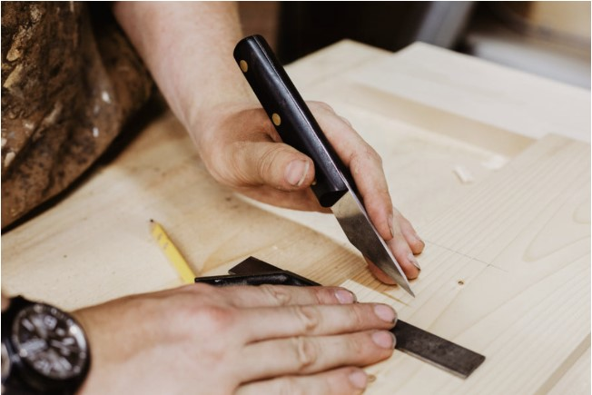
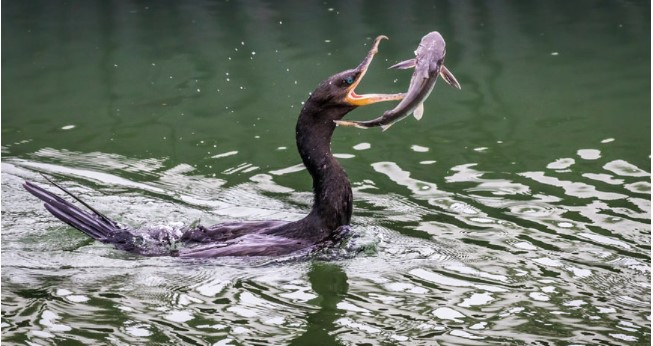
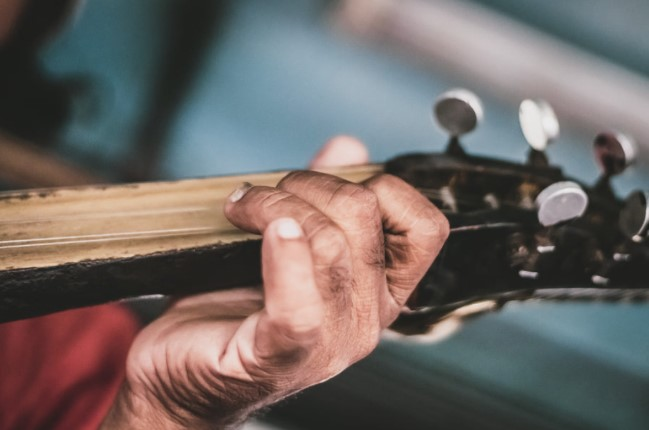
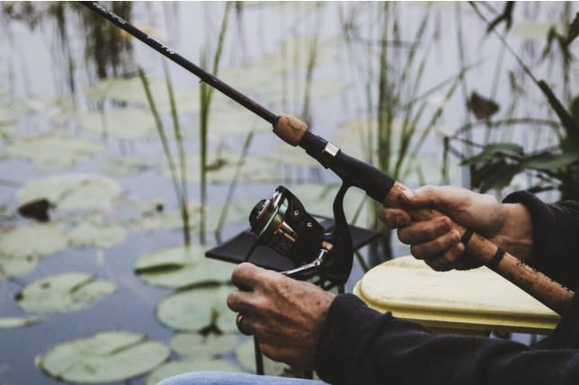
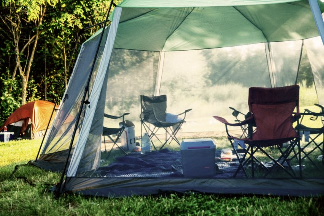
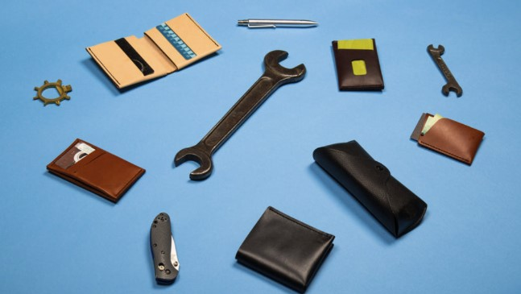

This article has been written and researched by our expert Loveable through a precise methodology. [Learn more about our methodology](https://avada.io/loveable/our-methodological.html)

[Loveable](https://avada.io/loveable/) > [Blog](https://avada.io/loveable/blog/) > [Family](https://avada.io/loveable/family/)

# 30 Best Dad Hobbies That Fit Any Kind Of Dad

Written by [Rose Bryne](https://avada.io/loveable/author/rose/) Last Updated on August 18, 2023

- [30 Best Dad Hobbies that fit any kind of Dad](https://avada.io/loveable/blog/dad-hobbies/#wp-block-heading-2-3)
    - [1\. Meditation](https://avada.io/loveable/blog/dad-hobbies/#wp-block-heading-3-4)
    - [2\. Reading](https://avada.io/loveable/blog/dad-hobbies/#wp-block-heading-3-8)
    - [3\. Photography](https://avada.io/loveable/blog/dad-hobbies/#wp-block-heading-3-11)
    - [4\. Blogging](https://avada.io/loveable/blog/dad-hobbies/#wp-block-heading-3-16)
    - [5\. Learning A New Language](https://avada.io/loveable/blog/dad-hobbies/#wp-block-heading-3-18)
    - [6\. Cooking](https://avada.io/loveable/blog/dad-hobbies/#wp-block-heading-3-22)
    - [7\. Working Out](https://avada.io/loveable/blog/dad-hobbies/#wp-block-heading-3-25)
    - [8\. Play Board Games with Children](https://avada.io/loveable/blog/dad-hobbies/#wp-block-heading-3-29)
    - [9\. Wood Working](https://avada.io/loveable/blog/dad-hobbies/#wp-block-heading-3-31) 
    - [10\. Gardening](https://avada.io/loveable/blog/dad-hobbies/#wp-block-heading-3-35)
    - [11\. Hunting](https://avada.io/loveable/blog/dad-hobbies/#wp-block-heading-3-39)
    - [12\. Make Something by Hands](https://avada.io/loveable/blog/dad-hobbies/#wp-block-heading-3-44)
    - [13\. Play a Musical Instrument](https://avada.io/loveable/blog/dad-hobbies/#wp-block-heading-3-47)
    - [14\. Origami](https://avada.io/loveable/blog/dad-hobbies/#wp-block-heading-3-50)
    - [15\. Puzzles](https://avada.io/loveable/blog/dad-hobbies/#wp-block-heading-3-53)
    - [16\. Go Fishing](https://avada.io/loveable/blog/dad-hobbies/#wp-block-heading-3-56)
    - [17\. Practice Dancing](https://avada.io/loveable/blog/dad-hobbies/#wp-block-heading-3-60)
    - [18\. Go Camping](https://avada.io/loveable/blog/dad-hobbies/#wp-block-heading-3-62) 
    - [19\. Playing Chess](https://avada.io/loveable/blog/dad-hobbies/#wp-block-heading-3-65)
    - [20\. Archery](https://avada.io/loveable/blog/dad-hobbies/#wp-block-heading-3-68)
    - [21\. Leather Craft](https://avada.io/loveable/blog/dad-hobbies/#wp-block-heading-3-70)
    - [22\. Stock Market Trading](https://avada.io/loveable/blog/dad-hobbies/#wp-block-heading-3-73)
    - [23\. Restoring Vintage Cars](https://avada.io/loveable/blog/dad-hobbies/#wp-block-heading-3-76)
    - [24\. Yoga](https://avada.io/loveable/blog/dad-hobbies/#wp-block-heading-3-79)
    - [25\. Cheesemaking](https://avada.io/loveable/blog/dad-hobbies/#wp-block-heading-3-83)
    - [26\. Design and Coding](https://avada.io/loveable/blog/dad-hobbies/#wp-block-heading-3-86)
    - [27\. Off-Roading](https://avada.io/loveable/blog/dad-hobbies/#wp-block-heading-3-89)
    - [28\. Rock Climbing](https://avada.io/loveable/blog/dad-hobbies/#wp-block-heading-3-91)
    - [29\. Volunteer](https://avada.io/loveable/blog/dad-hobbies/#wp-block-heading-3-93)
    - [30\. Martial Arts](https://avada.io/loveable/blog/dad-hobbies/#wp-block-heading-3-97)
- [Bottom Line](https://avada.io/loveable/blog/dad-hobbies/#wp-block-heading-2-99) 

Dads are often busy [balancing work and family life](https://avada.io/loveable/balancing-work-and-family-life/), but having a hobby can be a great way to relax and unwind. Hobbies can also provide an opportunity for dads to [bond](https://avada.io/loveable/family-indoor-activities/) with their children and share their interests. With so many options out there, it can be hard to know where to start. 

That’s why we’ve summarized a list of the **30 best dad hobbies** that fit any kind of dad. Whether he’s into sports, art, music, or just likes to tinker with gadgets, there’s something on this list for every dad. So, let’s dive in and discover some new hobbies to try!

## 30 Best Dad Hobbies that fit any kind of Dad

### 1\. Meditation

Take a moment to unwind and let go of the day’s stresses with a few minutes of meditation. 

Research suggests that practicing meditation can provide similar benefits to those of exercise, making it a valuable tool for promoting both mental and physical well-being, and it’s a good hobby for busy dads. 

### 2\. Reading

Reading is a hobby that can be flexible to fit any schedule. You can decide to read an entire chapter or just a few pages depending on the amount of time available. Reading is also an activity that can be shared with your children by reading together with them at home. 

This not only strengthens the bond between you and your kids but also demonstrates to them that you value spending time with them and prioritize their well-being over work.

### 3\. Photography

While raising your children, you will undoubtedly come across wonderful moments that you’ll want to cherish forever. 

Fortunately, with advancements in smartphone technology, you don’t need to own a professional camera to take great pictures. By using the latest iPhone or any advanced Android smartphone, you can take high-quality photos anytime, and anywhere you spend time with your kids.

If you have a dad who loves photography, these photography gifts will be perfect for giving him on special occasions.

### 4\. Blogging

Blogging can be a great hobby, especially for fathers, as it provides a platform to share personal experiences with the wider world. By documenting your mistakes, lessons learned, and other important information, you could potentially assist other new fathers on their own parenting journey.

### 5\. Learning A New Language

Learning a second or even a third language has become remarkably easy these days. With just a few taps on your smart device, you can access language learning resources and start the journey towards fluency in any language you desire. 

Plus, this new skill can come in handy when you want to impress your kids or even teach them the language you’ve learned.

### 6\. Cooking

Isn’t it about time you treated your family to some delicious homemade meals? Next time you have some free time, why not grab a recipe book, learn a few new recipes, and try your hand at cooking? Who knows, you might just discover a hidden talent for turning hungry tummies into satisfied smiles and happy giggles.

**Related**: [_34 Cooking Gifts for Home Cooks That Everyone Will Adore_](https://avada.io/loveable/cooking-gifts/)

### 7\. Working Out

Engaging in regular workouts can be a fantastic hobby, as it’s an excellent way to boost both your physical and mental well-being by releasing those feel-good endorphins.

Why not invite your kids to join you in your workouts? This way, they too can reap the benefits of this healthy activity. Exercising together as a family can be a great way to bond and stay healthy.

### 8\. Play Board Games with Children

Board games are a fantastic way to have fun and spend quality time with your kids, just like video games. There are a wide variety of board games available, including word games, war games, exploratory games, and even party games that are safe to play with your kids. The best part is that you can enjoy these games anytime and anywhere you like.

### 9\. Wood Working 

Woodworking as a hobby for Dad is a great idea! Woodworking can be a very satisfying and rewarding hobby. It allows for creativity and the opportunity to create beautiful and useful items from scratch. 

In terms of materials, you can start with basic lumber from a hardware store. You can also experiment with reclaimed wood from old furniture or buildings.

### 10\. Gardening

Gardening can be a great hobby for dads who enjoy spending time outdoors and being surrounded by nature. It provides a sense of satisfaction and accomplishment as one watches their plants grow and flourish.

He can start with simple plants such as herbs or vegetables or even flowers and some simple items for gardening. Gardening can also be a great way to bond with family members or neighbors, as it can be a shared hobby. 

Whether you’re a dad or have a dad who enjoys gardening, these [great gardening items](https://avada.io/loveable/gifts-gardeners/) will make a great gift for any occasion. 

### 11\. Hunting

Hunting can be a popular hobby for some dads who enjoy [spending time outdoors](https://avada.io/loveable/family-outdoor-activities/) and have an interest in wildlife.

Before starting, you will need to research the laws and regulations in his area regarding hunting and obtain the necessary licenses and permits. Safety is also an important consideration, and you will need to ensure the proper gear and training.

**Related:** _[Fishing Gifts For Your Amazing Dad](https://avada.io/loveable/fishing-gifts-dad/)_

### 12\. Make Something by Hands

Challenge yourself to enhance your DIY skills by crafting new items to incorporate into your home decor. You could create a cozy pallet wood bench for your balcony, a charming rustic bookcase for your study, or even a playful treehouse for your kids’ bedroom. 

Don’t hesitate to explore unconventional materials like driftwood to add a distinctive touch to your projects. 

### 13\. Play a Musical Instrument

Music has a powerful impact on the soul, and playing musical instruments has been linked to a host of benefits. These include improved coordination and memory skills, as well as fostering self-expression and discipline. Research has shown that music is a highly effective stress reliever, making it a popular hobby for busy dads who seek to cultivate passion and motivation in their lives.

### 14\. Origami

Origami is a fascinating hobby that dates back to ancient times, involving the art of paper folding to create intricate shapes and decorative ornaments from sheets of paper. It is often recommended to use specialized origami paper for this craft, as it is designed to be more pliable and hold its shape more easily. 

For busy dads, origami is an excellent hobby choice, as it offers a high degree of flexibility and creativity. This activity can be done virtually anywhere, making it a portable pastime that can be enjoyed on the go.

### 15\. Puzzles

Puzzles are an excellent pastime due to their versatility, as they are available in various formats that are adaptable to a busy schedule, especially for parents looking after their children. In today’s digital age, the majority of puzzle options can be accessed through smartphone apps, offering an almost unlimited range of puzzles that can be downloaded instantly. 

Alternatively, [physical puzzles](https://avada.io/loveable/gift-puzzle-lovers/) can be purchased for shared activities with your children during leisure time.

### 16\. Go Fishing

Spend your weekends bonding with your children by taking them fishing, whether it be for fly or deep sea fishing, to expand your skills and enjoy the great outdoors. 

This pastime offers the opportunity to teach your kids new techniques, adding depth to the hobby while creating lasting memories in nature.

### 17\. Practice Dancing

Turn dancing into an enjoyable hobby for you and your spouse by joining a local dance club. Explore various styles, such as the tango, waltz, or rock n’ roll, and learn new moves together. This activity offers an opportunity to bond with your partner while keeping fit and having fun on the dance floor.

### 18\. Go Camping 

Show your children the wonders of the great outdoors by taking up [camping](https://avada.io/loveable/camping-gifts-dad/) as a favorite hobby. It’s an excellent opportunity to spend quality time with your family and escape the stresses of daily life. This activity offers the chance to explore nature, learn new skills, and create lasting memories with your loved ones.

### 19\. Playing Chess

Chess is a strategic game that has been enjoyed by many generations, making it an excellent hobby for dads. This strategic and intellectual game offers a chance to improve cognitive skills such as critical thinking, memory, and problem-solving. 

Chess also promotes patience, discipline, and decision-making abilities. It’s an activity that you can enjoy alone or with others, providing a great opportunity for fathers to bond with their children. If you have a dad who loves to play chess, don’t miss the chance to show him your love with these [cool chess gifts](https://avada.io/loveable/gifts-for-chess-lovers/)

### 20\. Archery

Archery is a fulfilling hobby that not only provides entertainment but also helps develop mental abilities. Additionally, it’s a sport that can be shared with the entire family, making it a perfect pastime for any dad.

### 21\. Leather Craft

Engaging in leatherworking is a calming and imaginative hobby that can be easily pursued during the breaks between diaper changes or bottle feedings.

### 22\. Stock Market Trading

Enhance your investment skills by taking up trading on the stock market as a hobby. Whether you choose to buy and sell securities or dabble in derivatives, this activity offers an opportunity to learn about the financial market and potentially earn some profit while doing so.

However, it’s essential to approach trading with caution and not treat it solely as a form of gambling. Proper research and analysis are crucial for making informed investment decisions.

### 23\. Restoring Vintage Cars

Restoring vintage cars can also be a great way to bond with your family, especially if you involve your children in the process. This hobby can provide a sense of accomplishment and pride as you transform a rundown vehicle into a piece of automotive history.

### 24\. Yoga

Yoga is an excellent hobby that can be easily learned and practiced in the comfort of your own home, and you can even include your kids in your daily routines. With countless online resources and instructional videos available, you can start your yoga journey from the comfort of your living room. 

Practicing yoga regularly offers a wide range of benefits, including improved flexibility, strength, and mental clarity. 

**Related**: [_Gifts For Yoga Lovers_](https://avada.io/loveable/gifts-yoga-lovers/)

### 25\. Cheesemaking

Cheesemaking is a fantastic skill to acquire and can be easily done in the comfort of your own home. 

With the right equipment and ingredients, you can produce a wide range of delicious cheeses, from soft cheeses like brie and camembert to hard cheeses like cheddar and gouda. 

### 26\. Design and Coding

If you have an affinity for working on computers, consider taking up digital design and coding as a hobby. With a plethora of online resources available, you can learn everything from graphic design to web development. Not only is it an effective way to exercise your creativity, but it can also lead to lucrative career opportunities.

### 27\. Off-Roading

Looking for a hobby that will get you and your kids out of the house and into the great outdoors? Consider off-roading! This exciting activity allows you to explore rugged terrain and scenic vistas while bonding with your family. With the right vehicle and equipment, you can tackle everything from rocky trails to muddy bogs.

### 28\. Rock Climbing

Rock Climbing can be a great hobby for dads looking for a physical and mental challenge. It requires strength, endurance, and problem-solving skills, all while providing an opportunity to enjoy the great outdoors. Additionally, rock climbing can be a fun and rewarding activity to share with children, promoting a healthy and active lifestyle.

### 29\. Volunteer

Volunteering can be a fulfilling hobby that allows you to impact your community positively. There are many options for volunteering, such as working with children in an orphanage, raising puppies, or helping out at a meal kitchen. 

By giving your time and energy to those in need, you can experience a sense of purpose and joy.

### 30\. Martial Arts

Martial art is an excellent hobby for dads who are looking to stay active. Finding a nearby class can increase your stamina and enhance your physical and mental strength.

## Bottom Line 

In conclusion, there are many **dad hobbies** they can take up to relax, unwind, and enjoy their free time. Whether it’s something creative like painting or woodworking, or something more physical like martial arts or rock climbing, there’s something to do out there for every kind of dad. These activities not only provide a way to de-stress and have fun, but they can also help to improve mental and physical health, develop new skills, and even bring the family together. So, if you’re a dad looking for a new hobby, don’t be afraid to try something new and find what works for you!

- [30 Best Dad Hobbies that fit any kind of Dad](https://avada.io/loveable/blog/dad-hobbies/#wp-block-heading-2-3)
    - [1\. Meditation](https://avada.io/loveable/blog/dad-hobbies/#wp-block-heading-3-4)
    - [2\. Reading](https://avada.io/loveable/blog/dad-hobbies/#wp-block-heading-3-8)
    - [3\. Photography](https://avada.io/loveable/blog/dad-hobbies/#wp-block-heading-3-11)
    - [4\. Blogging](https://avada.io/loveable/blog/dad-hobbies/#wp-block-heading-3-16)
    - [5\. Learning A New Language](https://avada.io/loveable/blog/dad-hobbies/#wp-block-heading-3-18)
    - [6\. Cooking](https://avada.io/loveable/blog/dad-hobbies/#wp-block-heading-3-22)
    - [7\. Working Out](https://avada.io/loveable/blog/dad-hobbies/#wp-block-heading-3-25)
    - [8\. Play Board Games with Children](https://avada.io/loveable/blog/dad-hobbies/#wp-block-heading-3-29)
    - [9\. Wood Working](https://avada.io/loveable/blog/dad-hobbies/#wp-block-heading-3-31) 
    - [10\. Gardening](https://avada.io/loveable/blog/dad-hobbies/#wp-block-heading-3-35)
    - [11\. Hunting](https://avada.io/loveable/blog/dad-hobbies/#wp-block-heading-3-39)
    - [12\. Make Something by Hands](https://avada.io/loveable/blog/dad-hobbies/#wp-block-heading-3-44)
    - [13\. Play a Musical Instrument](https://avada.io/loveable/blog/dad-hobbies/#wp-block-heading-3-47)
    - [14\. Origami](https://avada.io/loveable/blog/dad-hobbies/#wp-block-heading-3-50)
    - [15\. Puzzles](https://avada.io/loveable/blog/dad-hobbies/#wp-block-heading-3-53)
    - [16\. Go Fishing](https://avada.io/loveable/blog/dad-hobbies/#wp-block-heading-3-56)
    - [17\. Practice Dancing](https://avada.io/loveable/blog/dad-hobbies/#wp-block-heading-3-60)
    - [18\. Go Camping](https://avada.io/loveable/blog/dad-hobbies/#wp-block-heading-3-62) 
    - [19\. Playing Chess](https://avada.io/loveable/blog/dad-hobbies/#wp-block-heading-3-65)
    - [20\. Archery](https://avada.io/loveable/blog/dad-hobbies/#wp-block-heading-3-68)
    - [21\. Leather Craft](https://avada.io/loveable/blog/dad-hobbies/#wp-block-heading-3-70)
    - [22\. Stock Market Trading](https://avada.io/loveable/blog/dad-hobbies/#wp-block-heading-3-73)
    - [23\. Restoring Vintage Cars](https://avada.io/loveable/blog/dad-hobbies/#wp-block-heading-3-76)
    - [24\. Yoga](https://avada.io/loveable/blog/dad-hobbies/#wp-block-heading-3-79)
    - [25\. Cheesemaking](https://avada.io/loveable/blog/dad-hobbies/#wp-block-heading-3-83)
    - [26\. Design and Coding](https://avada.io/loveable/blog/dad-hobbies/#wp-block-heading-3-86)
    - [27\. Off-Roading](https://avada.io/loveable/blog/dad-hobbies/#wp-block-heading-3-89)
    - [28\. Rock Climbing](https://avada.io/loveable/blog/dad-hobbies/#wp-block-heading-3-91)
    - [29\. Volunteer](https://avada.io/loveable/blog/dad-hobbies/#wp-block-heading-3-93)
    - [30\. Martial Arts](https://avada.io/loveable/blog/dad-hobbies/#wp-block-heading-3-97)
- [Bottom Line](https://avada.io/loveable/blog/dad-hobbies/#wp-block-heading-2-99) 

### [Rose Bryne](https://avada.io/loveable/author/rose/)

Hi, I'm Rose! I love animals and spending time with kids. At Loveable, I help people find unique gifts for special occasions like Valentine's Day, housewarmings, and graduations. I enjoy finding gifts for kids, teens, and animal lovers that match their interests and personalities. Making gift-giving a pleasant experience is my priority. Let me assist you in finding the perfect gift!

- [Twitter](https://twitter.com/intent/tweet)
- [Facebook](https://www.facebook.com/sharer/sharer.php)
- [instagram](https://avada.io/loveable/blog/dad-hobbies/)
- [pinterest](https://www.pinterest.com/loveablellc/)

## Related Posts

[### 30 Best 4 Year Old Birthday Party Ideas For A Memorable Celebration](https://avada.io/loveable/blog/4-year-old-birthday-party-ideas/) 

[

### 16th Birthday Party Ideas to Make an Unforgettable Day

](https://avada.io/loveable/blog/16th-birthday-party-ideas/)

[

### 150+ Inspirational Birthday Quotes to Spread Joy on Special Day

](https://avada.io/loveable/blog/inspirational-birthday-quotes/)

[

### 160+ Birthday Wishes for Wife to Express Eternal Love

](https://avada.io/loveable/blog/birthday-wishes-for-wife/)

[### 90+ Heart Touching Birthday Wishes for Niece to Make Her Day Extra Special](https://avada.io/loveable/blog/birthday-wishes-for-niece/)
