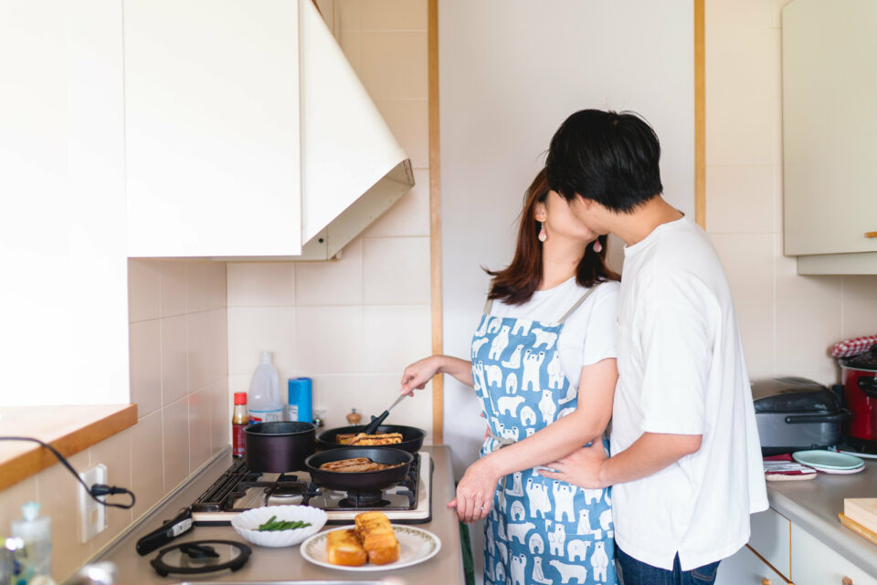
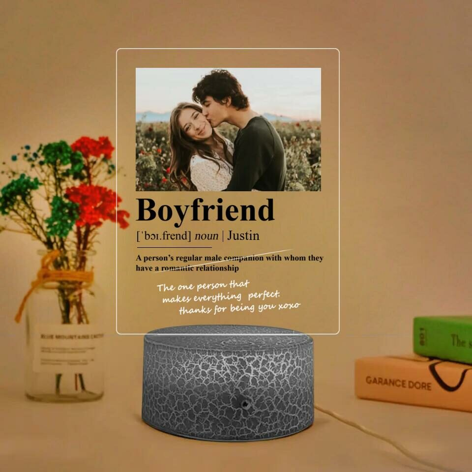
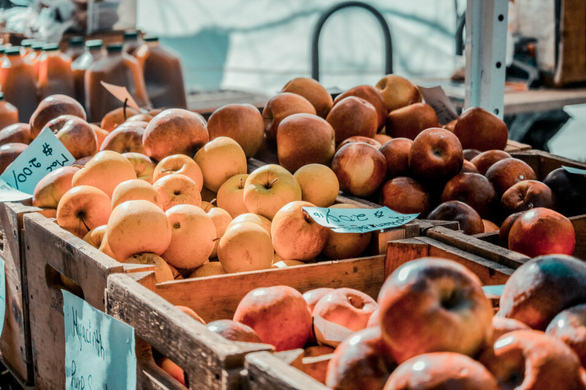
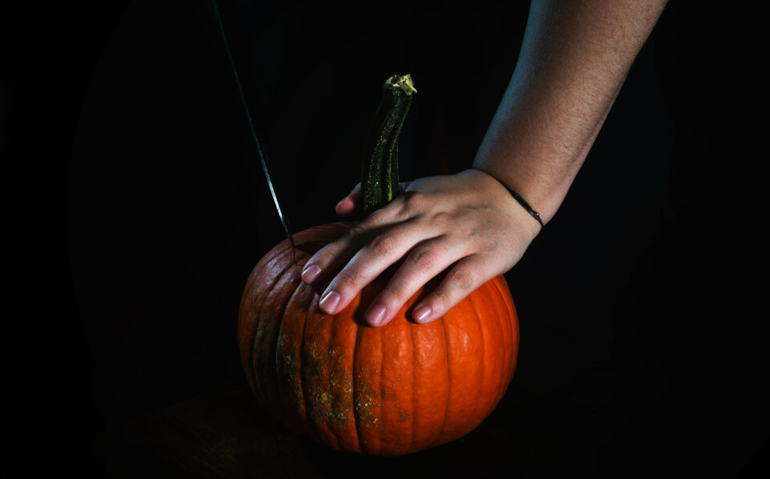
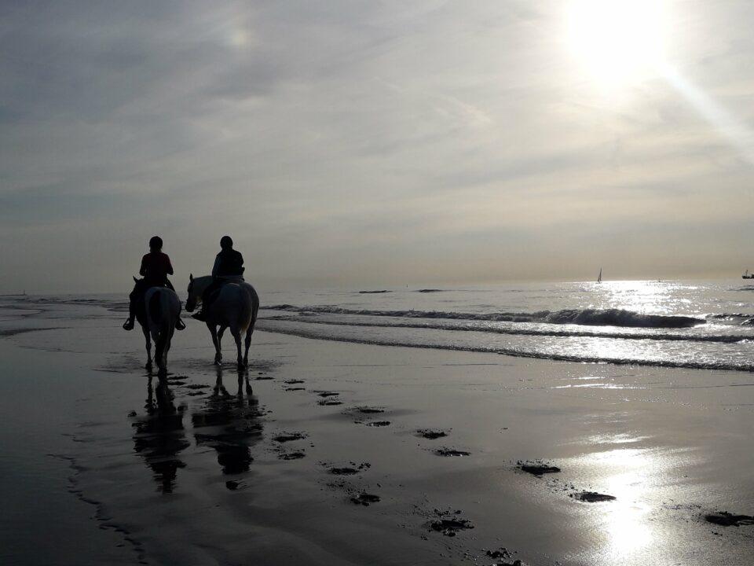

This article has been written and researched by our expert Loveable through a precise methodology. [Learn more about our methodology](https://avada.io/loveable/our-methodological.html)

[Loveable](https://avada.io/loveable/) > [Blog](https://avada.io/loveable/blog/) > [Relationship](https://avada.io/loveable/relationship/)

# 30 Best Fall Dates Ideas For Couples 

Written by [Luna Miller](https://avada.io/loveable/author/luna/) Last Updated on August 22, 2023

- [Visit a CD Store](https://avada.io/loveable/blog/fall-dates-ideas/#wp-block-heading-2-5)
- [Dating in a whole new space](https://avada.io/loveable/blog/fall-dates-ideas/#wp-block-heading-2-7)
- [Go Hiking Together](https://avada.io/loveable/blog/fall-dates-ideas/#wp-block-heading-2-9) 
- [Build A Blanket Fort Together](https://avada.io/loveable/blog/fall-dates-ideas/#wp-block-heading-2-13) 
- [Make A Delicious Fall Dish Together](https://avada.io/loveable/blog/fall-dates-ideas/#wp-block-heading-2-15)
- [Enjoy A Long Drive Together To See Fall Foliage](https://avada.io/loveable/blog/fall-dates-ideas/#wp-block-heading-2-18)
- [Celebrate The Time Of Sunflower](https://avada.io/loveable/blog/fall-dates-ideas/#wp-block-heading-2-20) 
- [Have A Picnic In The Country](https://avada.io/loveable/blog/fall-dates-ideas/#wp-block-heading-2-22)
- [Prepare A Sweet Gift For Your Significant Other](https://avada.io/loveable/blog/fall-dates-ideas/#wp-block-heading-2-25) 
- [Go Karaoke Together](https://avada.io/loveable/blog/fall-dates-ideas/#wp-block-heading-2-41) 
- [Go On A Fall Art Expedition](https://avada.io/loveable/blog/fall-dates-ideas/#wp-block-heading-2-43)
- [Join The Hot Air Balloon Festival](https://avada.io/loveable/blog/fall-dates-ideas/#wp-block-heading-2-45)
- [Spend The Weekend Together In A Cabin](https://avada.io/loveable/blog/fall-dates-ideas/#wp-block-heading-2-48) 
- [Spend Time In A Vintage Cafe](https://avada.io/loveable/blog/fall-dates-ideas/#wp-block-heading-2-50)
- [Visit A Famer Market](https://avada.io/loveable/blog/fall-dates-ideas/#wp-block-heading-2-52) 
- [Go Geocaching.](https://avada.io/loveable/blog/fall-dates-ideas/#wp-block-heading-2-55)
- [Try Something New In The Kitchen.](https://avada.io/loveable/blog/fall-dates-ideas/#wp-block-heading-2-58)
- [Go For A Food Tour](https://avada.io/loveable/blog/fall-dates-ideas/#wp-block-heading-2-60)
- [Carve A Pumpkin.](https://avada.io/loveable/blog/fall-dates-ideas/#wp-block-heading-2-62)
- [Go For A Drive-in Movie.](https://avada.io/loveable/blog/fall-dates-ideas/#wp-block-heading-2-66)
- [Try The Escape Room Game](https://avada.io/loveable/blog/fall-dates-ideas/#wp-block-heading-2-68) 
- [Prepare For Halloween Ideas](https://avada.io/loveable/blog/fall-dates-ideas/#wp-block-heading-2-70) 
- [Enjoy The Boat Ride](https://avada.io/loveable/blog/fall-dates-ideas/#wp-block-heading-2-73)
- [Make Scented Candles For Home Fall Dates](https://avada.io/loveable/blog/fall-dates-ideas/#wp-block-heading-2-75)
- [Riding A Horse](https://avada.io/loveable/blog/fall-dates-ideas/#wp-block-heading-2-78) 
- [Enjoy The Hot Tub](https://avada.io/loveable/blog/fall-dates-ideas/#wp-block-heading-2-81)
- [Fall Dates Wine Tasting](https://avada.io/loveable/blog/fall-dates-ideas/#wp-block-heading-2-83)
- [Do Some Gardening Together](https://avada.io/loveable/blog/fall-dates-ideas/#wp-block-heading-2-85) 
- [Organize An Outdoor Barbecue](https://avada.io/loveable/blog/fall-dates-ideas/#wp-block-heading-2-87) 
- [Attend A Fall Beer Festival And Try Some Seasonal Drinks.](https://avada.io/loveable/blog/fall-dates-ideas/#wp-block-heading-2-89)
- [Bottom Line](https://avada.io/loveable/blog/fall-dates-ideas/#wp-block-heading-2-91) 

When thinking about a romantic date, the most important thing to consider is choosing activities that both of you can enjoy together.

Autumn is the most romantic and wonderful time of the year. Days for love with warm hugs like the sun passing over the equator. The sunlight usually begins to wane in the fall, the days are shorter than the nights, and the weather also becomes more comfortable and creates a good mood for couples to have the opportunity to lie down together on the fall leaves or go out for a walk under beautiful sunsets. The road with fallen leaves made a perfect scenery that strengthened the couple’s affection. Many people think spring is when love is most in the air, but from my point of view, fall is. 

There are many reasons why people feel like autumn is the perfect time for dating. Autumn is also the time when natural hormones in both men and women are at their highest, making the desire for physical intimacy also higher. In addition, when following couples’ personal pages on social networks, autumn is a time when many single people are in a new relationship.

There are so many things you can do in the fall that you can’t do in other seasons of the year; let’s take advantage of that. Here are **30 romantic fall dates ideas** to inspire couples in this beautiful season. 

## Visit a CD Store

Like bookshops, CD stores have a cozy, old-fashioned feel, making them great places to visit in autumn. Look through the CD at your local CD store, talk about your old favorite songs, and find some new music to listen to together. Buy a few you both like, take them home, and listen to them on your next date night.

## Dating in a whole new space

Dating on the ground is way too traditional; why don’t you try dating in cafes on high floors or in the slings and watching the beautiful city under your feet? There are a lot of romantic elevated spaces for you to explore. The best thing about a date on high is that you can see the tiny scenery in the distance. This allows you and him to think and discuss things together and maybe about your future life, including the small dreams you both cherish. The most important part of a long-term relationship is that we finally see the forest in front of the trees.

## Go Hiking Together 

Go Hiking Together

Climbing isn’t a bad idea in the fall, is it? If both of you are sports and adventure lovers, mountain climbing is a great choice for a date at this time. It is good for your health, and you can share your passion with the other person.

In addition, in the chilling autumn atmosphere, planning for an outdoor camping trip with your other half is really a very romantic date idea. Surely everyone would love to be with him or her to set up a tent, bathe in the stream, grill fish, or lie down and watch the stars.

## Build A Blanket Fort Together 

Who says kids are the only ones who can build forts? Some young-at-heart adults might find this to be the ideal activity for a fun night in. That hut can be a great place for you and your lover to have wonderful moments together. You can come up with an amazing idea after viewing our best collection of personalized blankets. These blanket designs are unique and perfect for anyone in your life. Make sure you don’t miss out best [Photo Blanket Gifts](https://avada.io/loveable/photo-blanket-gift/) that are perfect for your loved ones

## Make A Delicious Fall Dish Together

Make A Delicious Fall Dish

If you and your friends aren’t the pie-eating types, stay in and bake an apple-based dessert like apple-walnut cake or caramelize some apples. Apple dishes are the typical flavor of autumn. Imagine you and your other half sitting under a beautiful autumn tree and enjoying apple pie together. You will want to stay in that moment forever!

## Enjoy A Long Drive Together To See Fall Foliage

Have you ever been captivated by the enchanting golden color of autumn leaves? Whether walking under the carpet of yellow leaves or taking a long-distance car ride to see the beautiful rows of yellow-leaf trees, this is always the most anticipated thing in autumn; So, roll down the windows and put on some love songs, especially with your lover aside.

## Celebrate The Time Of Sunflower 

Welcome to autumn! The season of stunning sunflowers. Along with the beauty of autumn is the elegant typical yellow of sunflowers. What do you think about the sunflower garden? Come with your significant other to the parks or flower gardens to admire this beautiful flower before autumn is over. Don’t forget to use your camera to capture those memories. 

## Have A Picnic In The Country

Choose a peaceful place to immerse yourself in nature on autumn days. Ideally, your hometown. For a lazy afternoon outside, bring some warm blankets and a basket of dips and salads. You can even bring lawn games with you for hours of fun (and maybe a little bit of competition) with your group. Sitting under the tree will definitely make you feel peaceful. 

If your hometown does not have too many beautiful scenes, you can also choose to go camping at ecological parks, where everything is quiet in the autumn sunshine. You can also prepare more game sets, such as uno, card, .. so that both of you can play together. 

## Prepare A Sweet Gift For Your Significant Other 

You don’t have to wait until an extraordinary occasion comes to give a gift to someone you love. Right in front of you is your lover shining under the autumn sunshine, so don’t hesitate to give him and her sweet gifts right at the moment. 

And if you are still struggling to look for a really meaningful gift at a reasonable price. Loveable is here to help. We have a lot of special gift collections specially designed just for your other half that surely touched their heart. 

- Best [Long Distance Gifts For Boyfriend](https://avada.io/loveable/long-distance-gifts-boyfriend/) That He’ll Be Sure To Fall In Love With

- Best [Cute Gifts For Boyfriend](https://avada.io/loveable/cute-gifts-boyfriend/) That He’ll Definitely Adore

- Best [Boyfriend Anniversary Gifts](https://avada.io/loveable/boyfriend-anniversary-gifts/) To Make Him Happy

Here are some of our best-seller for you to check out: 

1. [**Boyfriend Definition Personalized Photo Lamp**](https://loveable.ai/products/boyfriend-girlfriend-definition-personalized-photo-name-the-one-person-that-makes-everything-perfect-thank-you-for-being-you-3d-led-light-custom-lamp-valentine-gift-anniversary-gift-for-her-him-301icnvsll057?variant=44230970310888&utm_source=avada&ranking=&utm_source=&utm_campaign=best-cute-gifts-for-boyfriend-that-hell-definitely-adore)

This acrylic led is lovely, just like your relationship; It is made of high-quality materials with high durability.  This product will definitely be a suitable decoration for any space in the house. In addition, all images and words printed on this lamp are yours to choose from. Make it your own!

2. [**I Love My Boyfriend Sweatshirt**](https://loveable.ai/products/i-love-my-girlfriend-custom-nickname-title-personalized-photo-sweatshirt-hoodie-t-shirt-best-birthday-christmas-anniversary-gift-for-girlfriend-boyfriend-wife-husband-valentine-gifts-212icnnpts344?variant=44163671720168&utm_source=avada&ranking=&utm_source=&utm_campaign=best-cute-gifts-for-boyfriend-that-hell-definitely-adore)

If you’re looking for a gift that’s both meaningful and practical at the same time, look no further; this custom unisex t-shirt is for you. Made from high-quality cotton fabric, this shirt is not only durable but can be worn in all weather and temperature conditions. This could be a sweet reminder that you will always stand by her anytime, anywhere. 

3. [**Custom Photo Collage Mug**](https://loveable.ai/products/i-met-you-i-liked-you-i-love-you-im-keeping-you-custom-photo-collage-mug-best-personalized-mug-gift-for-anniversary-husband-wife-girlfriends-boyfriends-209ihnunmu691?variant=43926851158248&utm_source=avada&ranking=&utm_source=&utm_campaign=best-cute-gifts-for-boyfriend-that-hell-definitely-adore)

This is still a very practical gift that you can give to anyone. With these heat-resistant porcelain mugs, every sip of your morning coffee will be a reminder that you love him/her very much. In addition, you can choose any image and color you like to print on this product. 

## Go Karaoke Together 

Karaoke is a fun way to relax and have silly fun with friends and the person you love on cool autumn days and nights. Maybe not be the best date idea for shy people in the fall. But you and your lover can also sing karaoke at home if you don’t like crowded places. It’s not a bad idea to sing together and enjoy wine and chocolate together. 

## Go On A Fall Art Expedition

Feeling artistic? What about combining a hike or road trip this autumn with some time to explore your creative side in whatever form that takes for you, be it pen and paper or paint and canvas? Autumn has so many beautiful scenes, from nature to people. Take advantage of the vibrant colors and picturesque landscapes that fall has to offer. There aren’t many better options for a date in the fall.

## Join The Hot Air Balloon Festival

Hot Air Balloon

It sounds a bit unfamiliar, but have you ever thought about dating or traveling together in a hot air balloon? We all know that the blue sky in autumn is the most beautiful, and the air is so refreshing, and it will definitely be the right time for you and your significant other to contemplate the city from above. Of course, not for couples who are afraid of heights. 

## Spend The Weekend Together In A Cabin 

Renting a house by the river for a weekend getaway can be very romantic; you can think of many fun activities, like making a campfire, baking marshmallows, and mingling with nature. And most importantly, you will have a lot of private time together, away from the city lights and car horns. This is a choice that is highly suitable for the autumn atmosphere. 

## Spend Time In A Vintage Cafe

Sitting together in a cozy space and enjoying a cup of coffee together is something you can do anytime, but it is especially suitable for the autumn atmosphere. Choose a cafe with a classic style, and don’t forget to bring some good books. 

## Visit A Famer Market 

Famer Market 

Farmers’ markets have always been a favorite place for people with a healthy lifestyle because everything here is simply as fresh as in the garden. Autumn is also a suitable time for you and your lover to visit the Famer markets near your home. You can buy typical autumn vegetables, such as pumpkins and apples, to cook a delicious dish together.

## Go Geocaching.

Similar to a treasure hunt, participants in geocaching use GPS receivers and maps to locate hidden containers, or “caches,” at specific coordinates. [Geocaching.com](https://www.geocaching.com/play) has all the information you need to plan an exciting date this fall.

And you may wonder what gift to put in that mysterious box; Loveable understands this, and we have prepared a lot of meaningful gifts for you to give to your beloved.

## Try Something New In The Kitchen.

This fun date idea for fall lets you play with foods that are in season. Sussman says that cooking together is a great way for people to spend time together inside. Whether you want to take a cooking class in person or online, both are great for people who need some help. Or, look through some cookbooks to make a personalized menu for the intermediate chef that you can cook together.

## Go For A Food Tour

Find your town’s signature delicacies and prepare for a food tour. If your town is known for its burger, tacos, or any kind of street food, make a fun walking food tour so people can try some of the best foods. If you don’t want to plan your own food adventure, you can sign up for food tours online in many towns. Find a tour with a fall theme for extra points and the best fall date ever.

## Carve A Pumpkin.

Carve A Pumpkin

Pumpkins are the hallmark of autumn. Don’t hesitate to prepare a beautiful carving for a pumpkin. You may also need it during Halloween. It takes a village to carve a pumpkin as good as the Mona Lisa, so working together on this project is important. Choose something more complex than a simple Jack-o’-lantern pattern to give everyone a chance to practice cooperating toward a common goal. 

Enjoy a healthy dose of healthy rivalry? As an added bonus, you can make it into a contest to see who can carve the most impressive Jack-o’-Lantern. Either way, afterward, you can continue the date night with a pumpkin-themed happy hour or nightcap, complete with freshly roasted pumpkin seeds and spiced pumpkin punch.

## Go For A Drive-in Movie.

Nothing says romance like the drive-in. Get cozy and watch a Halloween film or some old-school classics from the ’80s and ’90s with some popcorn and your pals. The level of romance between you and your date will definitely increase after this outing. Our parents were able to put it to use, so it must work” Are there really no more in your area? If you want to create your own home theater, all you need is a projector and a wall.  

## Try The Escape Room Game 

With this game, you can learn much about each other’s listening, contributing, thinking, and pressure-handling skills by observing who takes charge and backs up the plan. Like your couch too much to leave it?  You can learn a lot about your partner’s strengths and weaknesses, as well as your own, in an escape room. 

## Prepare For Halloween Ideas 

We all know that Halloween is one of the most important things to do in the fall, and that there are a lot of crazy and fun things to do around Halloween. Make some of the things on your Halloween to-do list into a fun date, like going shopping for costumes. We also have some brand-new Halloween date gifts, including personalizable ones, that you’ll want to try and probably make part of your annual routine. Make sure you check out the collection

Best [Personalised Halloween Gifts](https://avada.io/loveable/personalised-halloween-gifts/) That Will Make The Day Extraordinary

## Enjoy The Boat Ride

Get out on the water with your significant other before the winter ice sets in. Go on a canoe trip together, or at the very least, take in the scenery hand in hand.

## Make Scented Candles For Home Fall Dates

Making candles together would be a fun and creative DIY activity for a couple to do on a date. It could be something new you’ve never tried together, and lighting them up later will only add to the sensuality of the evening. 

But if you are not skillful in making a scented candle yourself. You can also check out Loveable’s collection of [personalized scented candles](https://avada.io/loveable/personalized-candles/). Grab a scented candle and make your date night extra romantic!

## Riding A Horse 

Riding A Horse

Like all other outdoor activities, such as sailing or watching the city on a hot air balloon, riding a horse is equally exciting to enjoy the refreshing fall atmosphere. Choose a spacious location with beautiful natural scenery to experience this exciting activity with your loved one. 

## Enjoy The Hot Tub

Warming up in a hot tub together on a crisp autumn evening is the perfect way to spend time with your special someone. Relax in a stock tank hot tub, a hot tub at a local hotel, or a hot tub in your backyard with the help of this guide.

## Fall Dates Wine Tasting

If you and your significant other spent most of the summer outdoors, now is the perfect time to plan some indoor, romantic dates, such as attending a wine tasting and trying out some new varieties. There are many delicious autumn wines

## Do Some Gardening Together 

It sounds so ordinary, but gardening is a meaningful way for you and your loved one to be together. Even though summer is over, that doesn’t mean you can’t still bring life back to your garden. Change summer flowers for chrysanthemums with someone you care about and get a little dirty. You’ll both feel proud of yourselves if you can keep a plant alive.

## Organize An Outdoor Barbecue 

An outdoor barbecue party will surely make you both enjoy the beauty of autumn while helping fulfill two hungry stomachs; I mean, who doesn’t love barbecue? With this idea, you can invite more friends or family to join the party, which will be so much fun.

## Attend A Fall Beer Festival And Try Some Seasonal Drinks.

The best time to find a beer festival is in the fall, and if you head over to BeerFests, you can locate one near you. The two of you can even plan your own craft beer crawl to sample local brews throughout the year.

## Bottom Line 

What we’ve outlined above are just some of **many excellent fall date ideas**. But, of course, you can entirely base your on the recommendation above to create your own meaningful date. After all, fall dates are all about creating a wonderful time for the two of you.

- [Visit a CD Store](https://avada.io/loveable/blog/fall-dates-ideas/#wp-block-heading-2-5)
- [Dating in a whole new space](https://avada.io/loveable/blog/fall-dates-ideas/#wp-block-heading-2-7)
- [Go Hiking Together](https://avada.io/loveable/blog/fall-dates-ideas/#wp-block-heading-2-9) 
- [Build A Blanket Fort Together](https://avada.io/loveable/blog/fall-dates-ideas/#wp-block-heading-2-13) 
- [Make A Delicious Fall Dish Together](https://avada.io/loveable/blog/fall-dates-ideas/#wp-block-heading-2-15)
- [Enjoy A Long Drive Together To See Fall Foliage](https://avada.io/loveable/blog/fall-dates-ideas/#wp-block-heading-2-18)
- [Celebrate The Time Of Sunflower](https://avada.io/loveable/blog/fall-dates-ideas/#wp-block-heading-2-20) 
- [Have A Picnic In The Country](https://avada.io/loveable/blog/fall-dates-ideas/#wp-block-heading-2-22)
- [Prepare A Sweet Gift For Your Significant Other](https://avada.io/loveable/blog/fall-dates-ideas/#wp-block-heading-2-25) 
- [Go Karaoke Together](https://avada.io/loveable/blog/fall-dates-ideas/#wp-block-heading-2-41) 
- [Go On A Fall Art Expedition](https://avada.io/loveable/blog/fall-dates-ideas/#wp-block-heading-2-43)
- [Join The Hot Air Balloon Festival](https://avada.io/loveable/blog/fall-dates-ideas/#wp-block-heading-2-45)
- [Spend The Weekend Together In A Cabin](https://avada.io/loveable/blog/fall-dates-ideas/#wp-block-heading-2-48) 
- [Spend Time In A Vintage Cafe](https://avada.io/loveable/blog/fall-dates-ideas/#wp-block-heading-2-50)
- [Visit A Famer Market](https://avada.io/loveable/blog/fall-dates-ideas/#wp-block-heading-2-52) 
- [Go Geocaching.](https://avada.io/loveable/blog/fall-dates-ideas/#wp-block-heading-2-55)
- [Try Something New In The Kitchen.](https://avada.io/loveable/blog/fall-dates-ideas/#wp-block-heading-2-58)
- [Go For A Food Tour](https://avada.io/loveable/blog/fall-dates-ideas/#wp-block-heading-2-60)
- [Carve A Pumpkin.](https://avada.io/loveable/blog/fall-dates-ideas/#wp-block-heading-2-62)
- [Go For A Drive-in Movie.](https://avada.io/loveable/blog/fall-dates-ideas/#wp-block-heading-2-66)
- [Try The Escape Room Game](https://avada.io/loveable/blog/fall-dates-ideas/#wp-block-heading-2-68) 
- [Prepare For Halloween Ideas](https://avada.io/loveable/blog/fall-dates-ideas/#wp-block-heading-2-70) 
- [Enjoy The Boat Ride](https://avada.io/loveable/blog/fall-dates-ideas/#wp-block-heading-2-73)
- [Make Scented Candles For Home Fall Dates](https://avada.io/loveable/blog/fall-dates-ideas/#wp-block-heading-2-75)
- [Riding A Horse](https://avada.io/loveable/blog/fall-dates-ideas/#wp-block-heading-2-78) 
- [Enjoy The Hot Tub](https://avada.io/loveable/blog/fall-dates-ideas/#wp-block-heading-2-81)
- [Fall Dates Wine Tasting](https://avada.io/loveable/blog/fall-dates-ideas/#wp-block-heading-2-83)
- [Do Some Gardening Together](https://avada.io/loveable/blog/fall-dates-ideas/#wp-block-heading-2-85) 
- [Organize An Outdoor Barbecue](https://avada.io/loveable/blog/fall-dates-ideas/#wp-block-heading-2-87) 
- [Attend A Fall Beer Festival And Try Some Seasonal Drinks.](https://avada.io/loveable/blog/fall-dates-ideas/#wp-block-heading-2-89)
- [Bottom Line](https://avada.io/loveable/blog/fall-dates-ideas/#wp-block-heading-2-91) 

### [Luna Miller](https://avada.io/loveable/author/luna/)

I'm Luna Miller, a helpful employee at Loveable. I excel at giving great advice on birthday gifts. I love suggesting memorable experiences like concerts, spas, and getaways. As a reliable and supportive colleague, I'm always there to assist.

- [Twitter](https://twitter.com/intent/tweet)
- [Facebook](https://www.facebook.com/sharer/sharer.php)
- [instagram](https://avada.io/loveable/blog/fall-dates-ideas/)
- [pinterest](https://www.pinterest.com/loveablellc/)

## Related Posts

[

### 35 Unforgettable Exciting Adult Birthday Party Ideas

](https://avada.io/loveable/blog/adult-birthday-party-ideas/)

[

### 42 Best 21st Birthday Outfits to Rock the Party

](https://avada.io/loveable/blog/21st-birthday-outfits/)

[

### 50+ Happy 40th Anniversary Quotes, Messages, and Wishes

](https://avada.io/loveable/blog/happy-40th-anniversary-quotes/)

[

### 100+ Heartwarming Happy 30th Anniversary Quotes, Messages, and Wishes

](https://avada.io/loveable/blog/happy-30th-anniversary-quotes/)

[

### 120+ Heartfelt Thank You Messages for The Birthday Wishes

](https://avada.io/loveable/blog/thank-you-messages-birthday-wishes/)
