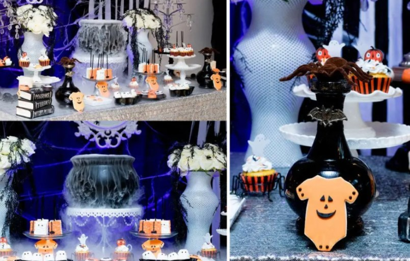

This article has been written and researched by our expert Loveable through a precise methodology. [Learn more about our methodology](https://avada.io/loveable/our-methodological.html)

[Loveable](https://avada.io/loveable/) > [Blog](https://avada.io/loveable/blog/) > [Holiday](https://avada.io/loveable/holiday/)

# 30 Best Halloween Baby Shower Ideas for Boys and Girls

Written by [Blake Simpson](https://avada.io/loveable/author/blake/) Last Updated on August 31, 2023

- [5 Best Halloween-themed Party and Decorations](https://avada.io/loveable/blog/halloween-baby-shower-ideas/#wp-block-heading-2-5)
    - [1\. Spooky Theme A Baby Is Brewing Baby Shower](https://avada.io/loveable/blog/halloween-baby-shower-ideas/#wp-block-heading-3-6)
    - [2\. A Little Treat Baby Shower Theme](https://avada.io/loveable/blog/halloween-baby-shower-ideas/#wp-block-heading-3-11)
    - [3\. Pumpkin Baby Shower Theme](https://avada.io/loveable/blog/halloween-baby-shower-ideas/#wp-block-heading-3-17)
    - [4\. Nightmare before Christmas Theme](https://avada.io/loveable/blog/halloween-baby-shower-ideas/#wp-block-heading-3-22) 
    - [5\. Red Baby Shower Theme](https://avada.io/loveable/blog/halloween-baby-shower-ideas/#wp-block-heading-3-27)  
- [15 Best Halloween Baby Shower Games Ideas For Kid To Have Fun In The Occasion](https://avada.io/loveable/blog/halloween-baby-shower-ideas/#wp-block-heading-2-33) 
    - [1\. Pumpkin Diaper Hunt](https://avada.io/loveable/blog/halloween-baby-shower-ideas/#wp-block-heading-3-34)
    - [2\. Mummy Wrapping Contest](https://avada.io/loveable/blog/halloween-baby-shower-ideas/#wp-block-heading-3-36)
    - [3\. Bobbing for Nipples](https://avada.io/loveable/blog/halloween-baby-shower-ideas/#wp-block-heading-3-39)
    - [4\. Guess the Baby Food Flavor](https://avada.io/loveable/blog/halloween-baby-shower-ideas/#wp-block-heading-3-41) 
    - [5\. Monster Mash-Up](https://avada.io/loveable/blog/halloween-baby-shower-ideas/#wp-block-heading-3-44)
    - [6\. Costume Contest](https://avada.io/loveable/blog/halloween-baby-shower-ideas/#wp-block-heading-3-46) 
    - [7\. Halloween Baby Bingo](https://avada.io/loveable/blog/halloween-baby-shower-ideas/#wp-block-heading-3-49)
    - [8\. Pin the Boo on the Baby](https://avada.io/loveable/blog/halloween-baby-shower-ideas/#wp-block-heading-3-51)
    - [9\. Creepy Crawlers Memory Game](https://avada.io/loveable/blog/halloween-baby-shower-ideas/#wp-block-heading-3-54)
    - [10\. Spooky Storytime](https://avada.io/loveable/blog/halloween-baby-shower-ideas/#wp-block-heading-3-56)
    - [11\. Witch’s Potion Mix-Up](https://avada.io/loveable/blog/halloween-baby-shower-ideas/#wp-block-heading-3-58)
    - [12\. Ghostly Lullaby Karaoke](https://avada.io/loveable/blog/halloween-baby-shower-ideas/#wp-block-heading-3-60)
    - [13\. Mystical Baby Predictions](https://avada.io/loveable/blog/halloween-baby-shower-ideas/#wp-block-heading-3-63)
    - [14\. Spider Web Maze Game](https://avada.io/loveable/blog/halloween-baby-shower-ideas/#wp-block-heading-3-65)
    - [15\. Cauldron of Advice](https://avada.io/loveable/blog/halloween-baby-shower-ideas/#wp-block-heading-3-68)
- [Best Coordinating Outfits for Family Members and Friends In Halloween Baby Shower Party](https://avada.io/loveable/blog/halloween-baby-shower-ideas/#wp-block-heading-2-70)
- [10 Creative Halloween Baby Shower Food And Drink Ideas](https://avada.io/loveable/blog/halloween-baby-shower-ideas/#wp-block-heading-2-78) 
    - [1\. Baby mummy dogs](https://avada.io/loveable/blog/halloween-baby-shower-ideas/#wp-block-heading-3-79)
    - [2\. Mini oranges pumpkins](https://avada.io/loveable/blog/halloween-baby-shower-ideas/#wp-block-heading-3-84) 
    - [3\. Halloween Baby Shower Drinks Ideas](https://avada.io/loveable/blog/halloween-baby-shower-ideas/#wp-block-heading-3-87)
    - [4\. Mummy Brie Dessert](https://avada.io/loveable/blog/halloween-baby-shower-ideas/#wp-block-heading-3-90)
    - [5\. Zombie Brain Cupcakes](https://avada.io/loveable/blog/halloween-baby-shower-ideas/#wp-block-heading-3-95)
    - [6\. Smokey Pumpkin Deviled Eggs](https://avada.io/loveable/blog/halloween-baby-shower-ideas/#wp-block-heading-3-99)
    - [7\. Make Marshmallow Ghost Brownies](https://avada.io/loveable/blog/halloween-baby-shower-ideas/#wp-block-heading-3-103)
    - [8\. Caramel Apple Bar](https://avada.io/loveable/blog/halloween-baby-shower-ideas/#wp-block-heading-3-108)
    - [9\. Halloween Party Poppers](https://avada.io/loveable/blog/halloween-baby-shower-ideas/#wp-block-heading-3-112)
    - [10\. Pumpkin-Spiced Buns with Spiderweb Glaze](https://avada.io/loveable/blog/halloween-baby-shower-ideas/#wp-block-heading-3-118)
- [Bottom Line](https://avada.io/loveable/blog/halloween-baby-shower-ideas/#wp-block-heading-2-122) 

Welcome to our fun guide for **Halloween baby shower ideas**! It’s an exciting time when we can celebrate a baby on the way while enjoying the spookiness of Halloween. Whether you’re going to be a new parent or planning a surprise for someone, this guide is here to give you cool and cute ideas.

Halloween baby showers let us mix regular baby shower stuff with Halloween magic. We’ve got plenty of ideas for cool invitations and decorations that are both adorable and a little spooky. And, of course, we’ll talk about games and activities that will make the party unforgettable.

But wait, we can’t forget about the baby! We’ve got [cute baby costumes](https://avada.io/loveable/infant-halloween-costumes/) and [gift ideas](https://avada.io/loveable/halloween-party-gifts/) that match the Halloween theme. We’ll also be careful about safety and making everyone feel comfortable at the party.

So, if you love Halloween or just want to add some spooky charm to a baby shower, let’s explore these Halloween baby shower ideas together. Get ready to host an awesome celebration that everyone will love!

## **5 Best Halloween-themed Party and Decorations**

### **1\. Spooky Theme A Baby Is Brewing Baby Shower**

Atop the list stands [Rosy’s Manor](https://www.instagram.com/rosysmanor/), conjuring a spooktacular delight of a Halloween-themed Baby Shower. The ambiance embraces dark navy, adorned with drizzles of white cobwebs and accentuated by black spiders. Suspended crystals sway like spectral whispers, alongside pale, ghostly white flowers that add an ethereal touch to the scene.

Upon ebony cake stands, custom cupcakes await in oranges and white, each bearing a sweet yet spooky face. To truly capture the essence of this Halloween Baby Shower theme, the addition of a smoke machine and a bubbling cauldron will weave an enchanting spell of delight.

Step into this realm of mystical revelry, where Rosy’s Manor unveils a Halloween Baby Shower to remember.

### **2\. A Little Treat Baby Shower Theme**

Step forth, as we unveil the enchanting allure of Linnag’s Halloween Baby Shower cakes, venturing into uncharted territory with a mesmerizing focus on pumpkins. Behold, a fresh and bountiful harvest-y ambiance, sprinkled with a touch of whimsical witchery.

Bathe in the radiance of Fall-themed colors, where splendid oranges dance alongside the serene allure of toned-down blacks. Fresh floral accents are delicately strewn around like nature’s confetti, adding a dash of rustic charm to the celebration.

Imagine a spooky yet outdoorsy Fall-themed [Baby Shower](https://avada.io/loveable/baby-shower-hostess-gifts/), where the essence of the season casts its bewitching spell upon all who enter. Embrace this captivating option, and as you immerse yourself in this wondrous realm, be sure to seize the opportunity to acquire our Halloween Baby Shower Printables set, ensuring your games and stationery are impeccably adorned for this extraordinary occasion.

Check out [darlingcelebrations](https://www.darlingcelebrations.com/best-fall-baby-shower-themes/) for more Fall-Themed Ideas 

### **3\. Pumpkin Baby Shower Theme**

At its helm, a woman of remarkable talent, conjuring a wondrous mural that dances with spookiness, yet retains an endearing cuteness. A magnificent balloon arch, akin to a portal into a world of magic, drapes over the scene, inviting all to partake in its allure.

Wicked cobwebs, like silken threads of enchantment, cascade from the regal purple tables, extending their embrace over bright, [captivating pumpkins](https://avada.io/loveable/calabaza-halloween/) adorned with mysterious black lettering.

In the presence of such a spectacle, a shiver runs down your spine, touched by both excitement and a thrilling chill. Prepare to immerse yourself in this extraordinary Halloween Baby Shower, where bellas\_partyrentals weaves a spellbinding ambiance, capturing hearts with its beguiling fusion of eerie and adorable.

### **4\. Nightmare before Christmas Theme** 

Prepare to be enchanted by the mystique woven by [Lumineux Event Rentals](https://www.instagram.com/lumineuxeventrentals/), as they summon forth a chilling color palette that leaves us utterly dazzled. Your eyes will embark on a captivating journey, uncertain where to settle first amidst the breathtaking spectacle.

A shimmering cloth backdrop sets the stage, an ethereal canvas that beckons one and all. Behold the spellbinding display of spooky custom cupcakes, each a miniature [work of art](https://avada.io/loveable/gifts-for-art-lovers/), delighting both the palate and the soul. Black heightened towers rise like dark sentinels, casting an enchanting shadow over the affair, while crystals and baubles dance in an enchanting symphony of light.

Such a feast awaits, not only for the taste buds but also for the eyes, a sensory wonderland that lingers in your dreams.

### **5\. Red Baby Shower Theme**  

In this realm, red and black reign supreme, ruling the day with an ironclad charm. And to complete this mesmerizing symphony of terror, skeletons stand tall, casting their eerie presence, a testament to the Halloween spirits that linger.

A striped cake takes center stage, its black top an epitome of chic elegance, while red mood lighting adds a touch of haunting beauty, shrouding the gathering in an aura of mystery and allure. The grown-up glam fest trembles with excitement, as chills of anticipation course through the veins of all who bear witness.

For those who yearn to embrace the eerie with a bold and sophisticated touch, fear not to venture forth. This Halloween Baby Shower theme, crafted by Juliet Peel Photography, awaits your presence, daring you to embark on a seriously eerie adventure where magic and style entwine in wondrous delight.

Check out the theme by [Juliet Peel Photography](http://www.julietpeel.com/) 

## **15 Best Halloween Baby Shower Games Ideas For Kid To Have Fun In The Occasion** 

### **1\. Pumpkin Diaper Hunt**

Let’s sprinkle some enchantment around the party area by hiding adorable pumpkin-themed baby items. We’ll form teams and embark on a thrilling quest to find these treasures. The team that uncovers the most hidden items within a time limit will earn their rightful place as champions of the Pumpkin Diaper Hunt!

### **2\. Mummy Wrapping Contest**

Get ready for a spine-chilling competition! We’ll pair up and unleash our inner ancient Egyptian artists. One of us will become the mysterious “mummy,” while the other weaves magic with rolls of toilet paper, transforming our mummy into a masterpiece of bandaged perfection. May the most imaginative mummy creators be crowned rulers of the bandaged realm!

### **3\. Bobbing for Nipples**

Prepare to dive into a bewitching challenge, inspired by the classic “Bobbing for Apples” game. Our cauldron shall be filled with water, and floating amidst its depths will be baby bottle nipples, like tiny magic potions. But beware, to claim these enchanted prizes, we must retrieve them using only our mouths, with our hands bound by the power of the Halloween spirits!

### **4\. Guess the Baby Food Flavor** 

We’ll test our taste buds in a tantalizing game of mystery and flavor. Jars of baby food shall be transformed into enigmatic concoctions as labels disappear, leaving only numbers to guide us. Let’s indulge in this mystical feast and attempt to unravel the baby food flavors. The one with the most accurate guesses shall be bestowed with a special treat from the baby shower magic cauldron!

### **5\. Monster Mash-Up**

Prepare to decipher the mystical language of baby-related terms, scrambled like a spell gone awry. We shall unravel these “monster” words and restore their rightful forms. Through this alchemical process, we will reveal hidden truths, proving our mastery of both baby talk and Halloween enchantments!

### **6\. Costume Contest** 

Embrace your inner spirits and don your most bewitching Halloween costumes! As we parade our magical attire, we shall compete for the coveted titles of “[Cutest Costume](https://avada.io/loveable/cute-halloween-costumes-tweens/),” “Scariest Costume,” and more. Our costumes will weave tales of wonder and delight, ensuring an unforgettable Halloween baby shower spectacle!

### **7\. Halloween Baby Bingo**

As the baby shower moon rises, we shall embark on an enchanting game of bingo, tailored to our baby-themed wonders. With each gift unwrapped, we’ll mark off the corresponding items on our spellbinding bingo cards. The first sorcerer to achieve a bingo shall be granted a magical prize fit for a baby shower celebration!

### **8\. Pin the Boo on the Baby**

Let us venture into a world of baby-themed surprises and ghostly delights! Blindfolded and armed with ghost-shaped stickers, we shall try to place the “Boo” closest to the baby’s sweet smile. Our journey will be filled with laughter and amazement as we unveil our results!

### **9\. Creepy Crawlers Memory Game**

Prepare to challenge your memory amidst a world of baby items and Halloween-themed toys. After gazing upon this mesmerizing tableau, we shall cover it and test our memory prowess. As we recall these treasures, we’ll be rewarded with mystical tokens of recognition!

### **10\. Spooky Storytime**

Gather ’round the mystical circle and join us in a tale-weaving adventure! We’ll conjure up a Halloween-themed baby story, each guest contributing their own line of enchantment. Our story will weave its way through twists and turns, ultimately birthing a captivating narrative to cherish forever.

### **11\. Witch’s Potion Mix-Up**

In this mystical game of concoctions, prepare several jars filled with various baby items, such as baby socks, pacifiers, and small toys. Each jar represents a witch’s ingredient. Guests must guess the baby item in each jar without opening them, relying solely on their sense of touch. The witch with the most accurate potion predictions shall be granted a magical reward!

### **12\. Ghostly Lullaby Karaoke**

Let’s awaken our inner ghosts and sing along to spooky lullabies with a Halloween twist! Choose hauntingly sweet lullaby renditions of classic Halloween songs or create our own eerie melodies. The bravest spirits who take the stage shall receive applause and admiration from all!

### **13\. Mystical Baby Predictions**

Delve into the realm of predictions and mysticism as we guess various baby-related elements, such as the baby’s birth date, weight, and gender (if not already revealed). Scribble our predictions on parchment scrolls, sealing them with a touch of enchantment. When the time comes, we shall see whose mystical foresight was the most accurate!

### **14\. Spider Web Maze Game**

Enchant the party area with a spider web maze made of colorful yarn or streamers. Guests must navigate their way through the web without touching the “spider-infested” strings. Those who successfully make it to the other side without getting tangled in the web shall be hailed as master escape artists!

### **15\. Cauldron of Advice**

Set up a “Cauldron of Advice” station where guests can write down their spookiest or most heartwarming parenting advice for the mom-to-be. These pieces of wisdom will serve as magical tokens of love and support as she embarks on her journey into motherhood.

## **Best Coordinating Outfits for Family Members and Friends In Halloween Baby Shower Party**

In the enchanting world of Halloween Baby Shower Ideas, there is no better way to embrace the spirit of the season than by coordinating outfits for family members and friends. The magic of Halloween shines brightest when shared with loved ones, and dressing up together adds a touch of whimsy and togetherness to the joyous occasion. From couples donning spooktacular costumes to families uniting in themed attire, the possibilities for creating unforgettable memories are endless. So, let’s explore the bewitching realm of coordinating Halloween outfits, where creativity, laughter, and bonds intertwine for an experience that will be cherished by all.

**_Check out Loveable’s Best Costume Ideas For Halloween:_**

- Adorable [Infant Halloween Costumes](https://avada.io/loveable/infant-halloween-costumes/)

- Spooktacular [Halloween Family Costumes](https://avada.io/loveable/halloween-family-costumes/)

- Best [Pet Halloween Costumes](https://avada.io/loveable/pet-halloween-costumes/)

- Unique [Funny Halloween Costumes](https://avada.io/loveable/funny-halloween-costumes/)

- Best [Halloween Costumes for Boys](https://avada.io/loveable/halloween-costumes-for-boys/)

## **10 Creative Halloween Baby Shower Food And Drink Ideas** 

### **1\. Baby mummy dogs**

Delight in the joyous arrival of a precious bundle of joy with these endearing delights: dainty mini hot dogs, cozily swaddled in the tender embrace of golden phyllo dough, as if they were sweet cherubs wrapped in celestial blankets. But that’s not all! 

Elevate the charm by fashioning tiny baby hats from the same dough, adding a touch of whimsy to each darling morsel. And for that extra dash of playfulness, create eyes with dots of golden mustard, giving your edible babies an enchanting gaze that will warm hearts and taste buds alike.

Check out the [mini hot dog recipe](https://www.instacart.com/products/16991132-oscar-mayer-classic-mini-dogs-wieners-14-oz)

### **2\. Mini oranges pumpkins** 

Looking for a wholesome and playful touch for your baby shower with a Halloween twist? Well, let me share a delightful little idea that I absolutely adore! Picture this: vibrant mandarins or oranges, lovingly peeled to reveal their juicy sweetness. Now, take a small stick of celery, gently place it in the center of each citrus gem, and voilà! You’ve conjured up the cutest mini pumpkins you’ve ever seen!

### **3\. Halloween Baby Shower Drinks Ideas**

Embrace the month of frights with fun beverages for both adults and kids! Adults can enjoy black martinis with edible dry ice, goblin green jello shots, and spooky bloody marys. Kids will love pumpkin orange punch with edible dry ice, purple koolaid in skeleton cups, ghost-shaped marshmallows in hot chocolate, or cider with a glittering pumpkin-orange sugar rim. Cheers to a spook-tacular celebration!

### **4\. Mummy Brie Dessert**

A luscious wheel of brie, wrapped snugly in the warm embrace of flaky puff pastry, creating a mummy-like appearance that will leave your guests both intrigued and amused. The contrasting textures of the creamy brie and the crispy pastry offer a mouthwatering experience that’s just as delightful as it is spooky.

Whether you’re hosting a ghostly gathering or heading to a haunted movie night with friends, this Mummy Brie is an absolute must-try! It’s a bewitching delight that will have everyone under its deliciously haunting spell.

So, get your hands on the [Mummy Brie recipe](https://www.delish.com/holiday-recipes/halloween/recipes/a49347/mummy-brie-recipe/)

### **5\. Zombie Brain Cupcakes**

Level up your Halloween bash with the spookiest, most delicious surprise: Zombie Brain Cupcakes! Forget plain old cupcakes; we’re taking moist, chocolatey goodness and transforming them into eerie delights with rich vanilla frosting and neon green food coloring. But wait, there’s more! With clever piping, these treats will look like creepy zombie brains, complete with blood-red decorating gel for that extra gruesome touch.

Get ready to wow your guests with this super-festive and devilishly tasty treat. Check out [the Zombie Brain Cupcakes recipe](https://www.delish.com/cooking/recipe-ideas/a41546860/zombie-brain-cupcakes-recipe/) and let the ghastly baking adventure begin! Happy haunting!

### **6\. Smokey Pumpkin Deviled Eggs**

Creamy deviled eggs with a touch of smokiness, beautifully garnished to resemble little pumpkins. The combination of flavors is simply divine, and their charming appearance will instantly bring smiles to your guests’ faces.

Whether it’s a cozy autumn get-together or a festive Halloween party, these delightful treats are a must-have addition to your menu. 

### **7\. Make Marshmallow Ghost Brownies**

Imagine sinking your teeth into these fudgy, chocolaty brownies, adorned with ghostly white decorations that will tickle your taste buds and warm your soul. The moment your guests catch a glimpse of these sweet spirits, I can guarantee you’ll hear a collective chorus of “awws” filling the air.

So, prepare to embrace the enchantment of Halloween with these hauntingly cute Ghostly Brownies.

See the tutorial at [@SugarPartiesLA.](https://www.instagram.com/sugarpartiesla/)

### **8\. Caramel Apple Bar**

A spread of crisp, juicy apples, lovingly coated in luscious caramel, just waiting for you to unleash your creativity. Gather an array of mouthwatering toppings like chopped nuts, colorful sprinkles, mini chocolate chips, and maybe even some crushed cookies. The possibilities are endless!

This delightful activity not only satisfies sweet cravings but also brings out the inner artist in all of us.

### **9\. Halloween Party Poppers**

These charming party poppers are sure to set the mood and get the celebration in full swing!

Colorful poppers brimming with joyous treats, waiting to be cracked open and shower your guests with laughter and delight. It’s not just a party essential; it’s a magical experience that brings out the childlike glee in everyone.

Whether you want to kick off the festivities with a bang or show your appreciation to your guests, these personalized party poppers are a must-have addition to your celebration.

Head on over to [Onion Rings and Things](https://www.onionringsandthings.com/halloween-party-poppers/) for the tutorial

### **10\. Pumpkin-Spiced Buns with Spiderweb Glaze**

Imagine the sweet aroma of freshly baked buns filling the air, enticing your guests to gather around and savor the moment. The soft, gooey texture of the sticky buns, coupled with the heavenly sweetness of the glaze, will surely make this brunch a truly memorable experience.

Get the tutorial at [Good Country Living](https://www.countryliving.com/food-drinks/a33943653/pumpkin-spiced-buns/) 

## **Bottom Line** 

Celebrate the joy of a **Halloween-themed baby shower** with an enchanting blend of spooky and adorable elements. From mini hot dogs wrapped like babies in a blanket to whimsical Zombie Brain Cupcakes, the possibilities for delightful treats and decorations are endless. Embrace the spirit of the season with ghostly decorations, themed games, and fun activities that will leave guests bewitched and charmed. 

- [5 Best Halloween-themed Party and Decorations](https://avada.io/loveable/blog/halloween-baby-shower-ideas/#wp-block-heading-2-5)
    - [1\. Spooky Theme A Baby Is Brewing Baby Shower](https://avada.io/loveable/blog/halloween-baby-shower-ideas/#wp-block-heading-3-6)
    - [2\. A Little Treat Baby Shower Theme](https://avada.io/loveable/blog/halloween-baby-shower-ideas/#wp-block-heading-3-11)
    - [3\. Pumpkin Baby Shower Theme](https://avada.io/loveable/blog/halloween-baby-shower-ideas/#wp-block-heading-3-17)
    - [4\. Nightmare before Christmas Theme](https://avada.io/loveable/blog/halloween-baby-shower-ideas/#wp-block-heading-3-22) 
    - [5\. Red Baby Shower Theme](https://avada.io/loveable/blog/halloween-baby-shower-ideas/#wp-block-heading-3-27)  
- [15 Best Halloween Baby Shower Games Ideas For Kid To Have Fun In The Occasion](https://avada.io/loveable/blog/halloween-baby-shower-ideas/#wp-block-heading-2-33) 
    - [1\. Pumpkin Diaper Hunt](https://avada.io/loveable/blog/halloween-baby-shower-ideas/#wp-block-heading-3-34)
    - [2\. Mummy Wrapping Contest](https://avada.io/loveable/blog/halloween-baby-shower-ideas/#wp-block-heading-3-36)
    - [3\. Bobbing for Nipples](https://avada.io/loveable/blog/halloween-baby-shower-ideas/#wp-block-heading-3-39)
    - [4\. Guess the Baby Food Flavor](https://avada.io/loveable/blog/halloween-baby-shower-ideas/#wp-block-heading-3-41) 
    - [5\. Monster Mash-Up](https://avada.io/loveable/blog/halloween-baby-shower-ideas/#wp-block-heading-3-44)
    - [6\. Costume Contest](https://avada.io/loveable/blog/halloween-baby-shower-ideas/#wp-block-heading-3-46) 
    - [7\. Halloween Baby Bingo](https://avada.io/loveable/blog/halloween-baby-shower-ideas/#wp-block-heading-3-49)
    - [8\. Pin the Boo on the Baby](https://avada.io/loveable/blog/halloween-baby-shower-ideas/#wp-block-heading-3-51)
    - [9\. Creepy Crawlers Memory Game](https://avada.io/loveable/blog/halloween-baby-shower-ideas/#wp-block-heading-3-54)
    - [10\. Spooky Storytime](https://avada.io/loveable/blog/halloween-baby-shower-ideas/#wp-block-heading-3-56)
    - [11\. Witch’s Potion Mix-Up](https://avada.io/loveable/blog/halloween-baby-shower-ideas/#wp-block-heading-3-58)
    - [12\. Ghostly Lullaby Karaoke](https://avada.io/loveable/blog/halloween-baby-shower-ideas/#wp-block-heading-3-60)
    - [13\. Mystical Baby Predictions](https://avada.io/loveable/blog/halloween-baby-shower-ideas/#wp-block-heading-3-63)
    - [14\. Spider Web Maze Game](https://avada.io/loveable/blog/halloween-baby-shower-ideas/#wp-block-heading-3-65)
    - [15\. Cauldron of Advice](https://avada.io/loveable/blog/halloween-baby-shower-ideas/#wp-block-heading-3-68)
- [Best Coordinating Outfits for Family Members and Friends In Halloween Baby Shower Party](https://avada.io/loveable/blog/halloween-baby-shower-ideas/#wp-block-heading-2-70)
- [10 Creative Halloween Baby Shower Food And Drink Ideas](https://avada.io/loveable/blog/halloween-baby-shower-ideas/#wp-block-heading-2-78) 
    - [1\. Baby mummy dogs](https://avada.io/loveable/blog/halloween-baby-shower-ideas/#wp-block-heading-3-79)
    - [2\. Mini oranges pumpkins](https://avada.io/loveable/blog/halloween-baby-shower-ideas/#wp-block-heading-3-84) 
    - [3\. Halloween Baby Shower Drinks Ideas](https://avada.io/loveable/blog/halloween-baby-shower-ideas/#wp-block-heading-3-87)
    - [4\. Mummy Brie Dessert](https://avada.io/loveable/blog/halloween-baby-shower-ideas/#wp-block-heading-3-90)
    - [5\. Zombie Brain Cupcakes](https://avada.io/loveable/blog/halloween-baby-shower-ideas/#wp-block-heading-3-95)
    - [6\. Smokey Pumpkin Deviled Eggs](https://avada.io/loveable/blog/halloween-baby-shower-ideas/#wp-block-heading-3-99)
    - [7\. Make Marshmallow Ghost Brownies](https://avada.io/loveable/blog/halloween-baby-shower-ideas/#wp-block-heading-3-103)
    - [8\. Caramel Apple Bar](https://avada.io/loveable/blog/halloween-baby-shower-ideas/#wp-block-heading-3-108)
    - [9\. Halloween Party Poppers](https://avada.io/loveable/blog/halloween-baby-shower-ideas/#wp-block-heading-3-112)
    - [10\. Pumpkin-Spiced Buns with Spiderweb Glaze](https://avada.io/loveable/blog/halloween-baby-shower-ideas/#wp-block-heading-3-118)
- [Bottom Line](https://avada.io/loveable/blog/halloween-baby-shower-ideas/#wp-block-heading-2-122) 

### [Blake Simpson](https://avada.io/loveable/author/blake/)

Hi, I'm Blake from Loveable. I help people find perfect gifts for occasions like anniversaries and weddings. I also write a blog about holidays, sharing insights to make them more meaningful. Let's create unforgettable moments together!

- [Twitter](https://twitter.com/intent/tweet)
- [Facebook](https://www.facebook.com/sharer/sharer.php)
- [instagram](https://avada.io/loveable/blog/halloween-baby-shower-ideas/)
- [pinterest](https://www.pinterest.com/loveablellc/)

## Related Posts

[### 120+ Christian Birthday Wishes To Spread Your Love](https://avada.io/loveable/blog/christian-birthday-wishes/) 

[

### 35 Best 70th Birthday Ideas To Celebrate The Special Milestone

](https://avada.io/loveable/blog/70th-birthday-ideas/)

[

### 50 Best 30th Birthday Decorations for a Remarkable Birthday Bash

](https://avada.io/loveable/blog/30th-birthday-decorations/)

[

### 40 Delicious Vegan Christmas Desserts to Delight Your Palate

](https://avada.io/loveable/blog/vegan-christmas-desserts/)

[

### 60 Christmas Team Building Activities to Boost Workplace Spirit

](https://avada.io/loveable/blog/christmas-team-building-activities/)
