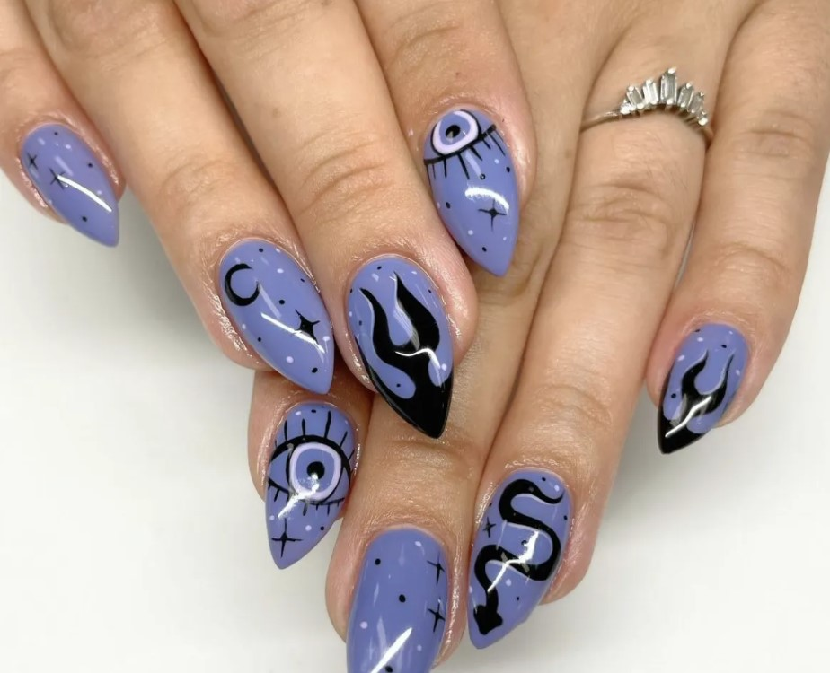

This article has been written and researched by our expert Loveable through a precise methodology. [Learn more about our methodology](https://avada.io/loveable/our-methodological.html)

[Loveable](https://avada.io/loveable/) > [Blog](https://avada.io/loveable/blog/) > [Holiday](https://avada.io/loveable/holiday/)

# 30 Best Halloween Nail Ideas With Tutorials In 2023 

Written by [Blake Simpson](https://avada.io/loveable/author/blake/) Last Updated on August 25, 2023

- [30 Spooky Halloween Nail Ideas With Tutorials](https://avada.io/loveable/blog/halloween-nail-ideas/#wp-block-heading-2-4) 
    - [1\. Holographic Blood Drip Tips](https://avada.io/loveable/blog/halloween-nail-ideas/#wp-block-heading-3-5)
    - [2\. Tortoiseshell Ghost](https://avada.io/loveable/blog/halloween-nail-ideas/#wp-block-heading-3-8)
    - [3\. Spooky French Tips](https://avada.io/loveable/blog/halloween-nail-ideas/#wp-block-heading-3-12) 
    - [4\. Smoky Sky](https://avada.io/loveable/blog/halloween-nail-ideas/#wp-block-heading-3-16) 
    - [5\. Negative Space French Tips](https://avada.io/loveable/blog/halloween-nail-ideas/#wp-block-heading-3-20)
    - [6\. Pumpkin French Tips](https://avada.io/loveable/blog/halloween-nail-ideas/#wp-block-heading-3-24) 
    - [7\. Matte Black Bats](https://avada.io/loveable/blog/halloween-nail-ideas/#wp-block-heading-3-29)
    - [8\. Jelly Spiderweb](https://avada.io/loveable/blog/halloween-nail-ideas/#wp-block-heading-3-33)
    - [9\. Hand-Painted Halloween Figures](https://avada.io/loveable/blog/halloween-nail-ideas/#wp-block-heading-3-37)
    - [10\. Gudetama Pumpkin](https://avada.io/loveable/blog/halloween-nail-ideas/#wp-block-heading-3-42)
    - [11\. Galaxy Nails](https://avada.io/loveable/blog/halloween-nail-ideas/#wp-block-heading-3-46) 
    - [12\. Comme Des Garçons Devils](https://avada.io/loveable/blog/halloween-nail-ideas/#wp-block-heading-3-51)
    - [13\. Chucky Meets Candyman](https://avada.io/loveable/blog/halloween-nail-ideas/#wp-block-heading-3-55)
    - [14\. Cat Eye Halloween Scene](https://avada.io/loveable/blog/halloween-nail-ideas/#wp-block-heading-3-60)
    - [15\. Spotty Sorcery](https://avada.io/loveable/blog/halloween-nail-ideas/#wp-block-heading-3-64)
    - [16\. Disco Ghosts](https://avada.io/loveable/blog/halloween-nail-ideas/#wp-block-heading-3-68)
    - [17\. Glitter Ombré](https://avada.io/loveable/blog/halloween-nail-ideas/#wp-block-heading-3-73)
    - [18\. Neon Necromancy](https://avada.io/loveable/blog/halloween-nail-ideas/#wp-block-heading-3-77)
    - [19\. Orange Ombré Spiderwebs](https://avada.io/loveable/blog/halloween-nail-ideas/#wp-block-heading-3-81)
    - [21\. Ghoulish Galaxy](https://avada.io/loveable/blog/halloween-nail-ideas/#wp-block-heading-3-85)
    - [22\. Boo Nails](https://avada.io/loveable/blog/halloween-nail-ideas/#wp-block-heading-3-89)
    - [23\. Mismatched Halloween-Themed Designs](https://avada.io/loveable/blog/halloween-nail-ideas/#wp-block-heading-3-93)
    - [24\. Corpse Bride Nails](https://avada.io/loveable/blog/halloween-nail-ideas/#wp-block-heading-3-97)
    - [25\. Ouija Board Nails](https://avada.io/loveable/blog/halloween-nail-ideas/#wp-block-heading-3-101)
    - [26\. Red, White, Black, and Scary AF](https://avada.io/loveable/blog/halloween-nail-ideas/#wp-block-heading-3-104)
    - [27\. “One Bite” Nails](https://avada.io/loveable/blog/halloween-nail-ideas/#wp-block-heading-3-108)
    - [28\. Duo-Chrome Bats and Birds](https://avada.io/loveable/blog/halloween-nail-ideas/#wp-block-heading-3-111)
    - [29\. Creepy Creatures](https://avada.io/loveable/blog/halloween-nail-ideas/#wp-block-heading-3-114)
    - [30\. Red Rum Nails](https://avada.io/loveable/blog/halloween-nail-ideas/#wp-block-heading-3-117)
- [Bottom Line](https://avada.io/loveable/blog/halloween-nail-ideas/#wp-block-heading-2-120) 

Welcome to the ultimate guide for the Best **Halloween Nail** Ideas in 2023! As the spookiest time of the year approaches, it’s the perfect opportunity to get creative and express your Halloween spirit through your nails. Whether you’re attending a costume party, hosting a haunted gathering, or simply embracing the eerie ambiance of the season, we’ve got you covered with an array of nail designs that are sure to bewitch and captivate. 

From creepy creatures and wicked witches to enchanting pumpkins and hauntingly beautiful patterns, we’ve curated a collection of the most trending and eye-catching **Halloween nail ideas** for this year. So, grab your nail polish, unleash your imagination, and get ready to transform your nails into hauntingly glamorous works of art. Let’s dive into the world of Halloween-inspired nail designs that will leave everyone spellbound!

Alongside these beautiful nail sets, undoubtedly, Halloween-themed accessories are something you’ll definitely want to own this festive season. If you’re looking to gift your friends and loved ones on this exciting holiday, don’t miss out on the [fantastic Halloween gift collection](https://avada.io/loveable/halloween/) from Loveable. It’s guaranteed not to disappoint you.

## **30 Spooky Halloween Nail Ideas With Tutorials** 

### **1\. Holographic Blood Drip Tips**

If you’re drawn to the allure of Halloween’s blood-curdling aesthetics but prefer to keep it stylish and imaginative, then we have the ideal manicure for you: holographic blood drip tips. Vanity Projects Miami nail salon has ingeniously merged the captivating blood drip nail effect with the classic French tip and mesmerizing holographic powder. The result? We’re absolutely smitten.

### **2\. Tortoiseshell Ghost**

Would you believe that the unlikely pairing of tortoiseshell nail art with a ghost design could create such a delightful combination? Well, neither did we, but thanks to the creative genius of Milli from [Hard As Nails Studio](https://www.instagram.com/hardasnails_studio/), this adorable design has come to life.

By merging the trendy backdrop of a tortoiseshell-inspired print with a playful [cartoon character](https://avada.io/loveable/blog/famous-halloween-cartoon-characters/), this nail art caters to those who prefer to steer clear of gory elements during the Halloween season while still embracing the festive spirit. It’s a charming and unique way to participate in the Halloween fun!

### **3\. Spooky French Tips** 

Prepare to be amazed because we never thought a Halloween-themed manicure could be this effortlessly chic, courtesy of digital creator Melanie. This design is an absolute must-try, especially for those who prefer convenience without compromising on style. Instead of meticulously hand-painting intricate characters, Melanie opted for the ingenious approach of using Deco Mani nail art stickers.

With precision and care, she artfully placed these stickers over her black and white French tips. The result? A winning Halloween combo that is both sophisticated and hassle-free. Trust us; this design is definitely worth recreating at home for an effortlessly stunning Halloween look.

### **4\. Smoky Sky** 

During the spooky season, your nail art doesn’t have to be literal. Instead, you can incorporate elements of the season and experiment with different techniques, just like this manicure created by Sky, a nail artist based in NYC.

To achieve this look, gather various shades of blue and green and swirl them together on a palette. Then, using a nail art brush, gently apply the blended colors onto your nails, creating a smoky effect. Next, grab a detail brush and add some stars and moons for an extra touch of magic. Finally, complete the look with a matte-effect top coat, and voila! You’ll have a dazzling set of nails that perfectly captures the essence of the season.

### **5.** **Negative Space French Tips**

Get ready to be bewitched because LA-based manicurist Thuy Nguyen has crafted a nail design that combines negative space tips with a mesmerizing starry night pattern, and it’s the witchy glam we never knew we craved.

If you’re yearning for this enchanting look, it’s best to visit a salon for professional assistance. Ask for a reverse French tip with a clear free edge for that chic and modern touch. Opt for a deep, true black hue to create a striking contrast. Finally, adorn the set with delicate black stars to add a touch of celestial magic. Trust us; this is one salon visit you won’t want to miss to achieve the perfect witch-inspired glam.

### **6.** **Pumpkin French Tips** 

You won’t believe how much you’ll fall in love with these [creative pumpkin](https://avada.io/loveable/blog/halloween-pumpkin/) nails. They are absolutely adorable, and we can’t wait to have them painted on our own nails.

If you want to try this design at home, here’s how: start by applying a neutral-toned base color. Then, select five autumnal shades that will represent your pumpkins. Using those colors, create a rounded tip, similar to a classic French tip, but with a slight dip in the center to form the shape of a pumpkin.

Next, take a detailing brush and use a black shade to outline the pumpkins, giving them some personality. Don’t forget to add cute little stalks to complete the look. It’s a fun and festive design that you can easily recreate at home.

### **7\. Matte Black Bats**

Want to add a spooky twist to a classic Halloween character? Try experimenting with matte and shiny top coats on a black nail polish shade for an ultra-cool effect. Take a look at this awesome set created by nail artist Sydney from Minnesota.

She used a matte black base and painted a spooky bat design in a high-shine top coat, making it stand out without the need for additional colors. It’s a badass way to elevate your Halloween nails and give them a unique edge. Give it a try, and get ready to spookify your manicure!

### **8\. Jelly Spiderweb**

Elevate your spiderweb design by adding a jelly nail base, just like nail artist Gabbi did for this stunning set.

If you have a steady hand and a jelly nail polish, this is a design you can definitely try recreating at home. It’s a fun and creative way to jazz up your nails, and the translucent effect of the jelly base will give your spiderweb an extra touch of allure. Give it a go, and let your artistic skills shine!

### **9\. Hand-Painted Halloween Figures**

Prepare to be amazed as blue steel tips transform into captivating [Halloween artwork](https://avada.io/loveable/blog/easy-halloween-craft-ideas/)! Take a look at this intricate set skillfully crafted by [Rosie from Nails Bab](https://www.instagram.com/nails.bab/), featuring a spooky skull, rose, spider, eyeball, and fangs. It’s a design that perfectly captures the spirit of Halloween.

If you’re inspired by this photo and eager to bring it to life, we recommend visiting a specialist nail artist who excels in hand painting. This level of detail requires expertise to achieve the desired result.

Whoever said French tips were boring? Certainly not us! Embrace the creativity and let your nails become a canvas for Halloween magic.

### **10\. Gudetama Pumpkin**

Prepare to have your love for Gudetama taken to new heights by nail artist Emily Gilmour. She has created a truly remarkable accent nail design that combines the lovable Gudetama with a pumpkin, resulting in the most intricate and adorable artwork we’ve ever laid eyes on.

It’s so incredible that we’re tempted to build our entire [Halloween costume](https://avada.io/loveable/halloween-costume-ideas/) around it. This nail art is a testament to Emily’s skill and creativity, and it’s bound to make a delightful statement. 

### **11\. Galaxy Nails** 

Although these nails may not be your typical Halloween style, they absolutely deserve a place on your inspiration list for the spooky season. Crafted by the talented sister-owned [salon Hey Nice Nails](https://www.instagram.com/heynicenails/), this manicure features a unique touch. Reflective glitter gel is skillfully applied in swirling patterns on half of each nail, creating a mesmerizing effect.

To add a touch of magic, tiny metallic gold stars are delicately placed, elevating the set to a whole new level. The best part? When the flash is turned on, these nails light up in a completely different way, essentially giving you two stunning nail designs in one!

It’s a creative and enchanting twist that will surely make your nails stand out this Halloween.

### **12\. Comme Des Garçons Devils**

Nail artist Abi Markey took a delightful approach by infusing spookiness into the style of Comme Des Garçons with this nail set. Drawing inspiration from the classic French manicure and incorporating a Halloween twist, she seamlessly merged three trends into one captivating design.

The outcome? An adorable French manicure with a spooky-themed twist that is guaranteed to grab everyone’s attention. It’s a creative and playful take on a beloved style that adds a touch of Halloween flair to your nails.

### **13\. Chucky Meets Candyman**

If you’re a die-hard horror movie fan, there’s no better way to showcase your love than by combining two Halloween movie icons: Chucky and Candyman. And thanks to the talented Phoenix-based manicurist Adreanna, we can see exactly how it’s flawlessly executed.

Using a vibrant neon yellow base, Adreanna meticulously hand-painted each character from the films, including the iconic lettering, ensuring that every intricate detail shines through. To enhance the design, she applied a matte topcoat, allowing the artistry to truly stand out.

Recreating this extraordinary manicure requires the expertise of a specialist artist with exceptional hand-painting skills.

### **14\. Cat Eye Halloween Scene**

Take your Halloween manicure to the next level with a stunning cat eye base shade, just like this design by digital creator Aistė Plechaviciute.

We are absolutely obsessed with the velvety appearance complemented by orange accents, bringing to life a mesmerizing night sky scene adorned with tiny bats and stars. It’s a magical and enchanting look that will add a touch of allure to your Halloween festivities.

### **15\. Spotty Sorcery**

Orange and black manicures are always a classic choice for Halloween, but with the stunning graphics created by U.K.-based nail artist Aimee, you can infuse even more personality into these colors.

Aimee’s impeccable orange ombré sets the foundation, and it’s elevated with captivating witchy illustrations in matte black and white. From snakes and moons to potions, these detailed designs add a touch of enchantment to your nails. To keep it on the cuter side rather than creepy, Aimee incorporates adorable little dots and stars.

### **16\. Disco Ghosts**

Prepare to be charmed by the delightful manicure created by U.K.-based nail artist India Jade. The tips of this nail design feature adorable little ghosts, each with its own unique personality as if they’re joyfully dancing at a shimmering disco.

The base color, The Gel Bottle Inc’s lavender Flax shade, is beautifully enhanced with a coat of iridescent glitter, creating a mesmerizing look that effortlessly blends glamor with the playful presence of ghouls.

It’s a perfect combination of elegance and cuteness, sure to bring a smile to your face and add a touch of Halloween spirit to your nails.

### **17\. Glitter Ombré**

Even the classic orange-and-black color combination of Halloween can take on a unique and subtle form in a manicure. Nail artist 

[Rachel Schmitz](https://www.instagram.com/rachels.nailspiration.station/) has masterfully created a mesmerizing transition effect in this design. She painted the pinky finger black, while the ring finger boasts a stunning metallic gray glitter that smoothly fades into a peachy orange shade on the middle finger. To achieve this captivating look, Rachel used Cascade Color Works dip powder in Onyx, Nebula, and Salmon, respectively. The soft and festive shade continues throughout the rest of the manicure, resulting in a Halloween-inspired look that is tasteful and not overtly bold. It’s a perfect balance of sophistication and seasonal charm, ideal for those seeking a more refined Halloween manicure.

### **18\. Neon Necromancy**

The captivating color transition perfectly captures the dark allure of the season. However, Houston-based nail artist Christie Schobel takes it a step further by adding neon-green graphics, elevating the design to a whole new level.

Fluorescent moons, spiderwebs, snakes, smile drips, and other eye-catching elements emerge with incredible contrast against the moody base color. It’s a mesmerizing combination that effortlessly balances edginess and boldness, creating a statement-making manicure that captures the essence of Halloween in a truly captivating way.

### **19\. Orange Ombré Spiderwebs**

This pointy, long nails showcase a delightful orange ombré effect that evokes the playful colors of candy corn. However, this design goes beyond the sugary treat, as Arizona-based nail artist Kaylee Barraza introduces a touch of spookiness.

With the skillful use of a detail brush, she delicately adds intricate spiderwebs and a few creepy spiders onto the vibrant matte orange base, resulting in a Halloween-inspired manicure that screams with eerie charm. It’s a perfect balance between festive playfulness and a hint of Halloween’s darker side. 

### **21\. Ghoulish Galaxy**

Embrace the enchanting spirit of Halloween with this mystical manicure crafted by California-based nail artist Sabrina Fagundes. It’s a whimsical and witchy creation that demonstrates how any color, even a dusty periwinkle, can be transformed into a spooky masterpiece with the right details.

Sabrina enhances the periwinkle base with captivating elements such as mesmerizing eyes, slithering snakes, and a starry sky, creating a spellbinding manicure that captures the essence of Halloween.

### **22\. Boo Nails**

Get ready to be charmed by this adorably spooky manicure created by California-based nail artist Jordan Aleccia. The true magic lies in the intricate details that set this look apart.

From the heart-eyed pumpkin to the mischievous ghost playfully sticking out its tongue, every little element adds a touch of whimsy and uniqueness to the design. Jordan’s artistic talent shines through, turning this manicure into something truly extraordinary. It’s a delightful reminder that sometimes, it’s the smallest details that make all the difference.

### **23\. Mismatched Halloween-Themed Designs**

If you prefer a more lighthearted approach to Halloween, this cheerful design is a perfect choice. It showcases faceless witches, playful black and neon-colored stripes, a whimsical cauldron, and other delightful Halloween-inspired details.

This design is a must-try for those looking for a fun and festive manicure. You can easily recreate it using stickers, which will give you the desired effect effortlessly. However, if you’re feeling adventurous and up for a challenge, you can try your hand at freehand painting using a detail brush. 

### **24\. Corpse Bride Nails**

Here’s another hauntingly beautiful manicure crafted by Cornett. This design showcases a captivating combination of blue and green matte polishes, skillfully chosen to create striking contrasts between the nails.

To achieve the eerie sky design, Cornett employed a sponge technique, resulting in a faded and hauntingly atmospheric effect. The cobweb, on the other hand, was meticulously crafted using a long-haired brush and Cornett’s precise handiwork.

### **25\. Ouija Board Nails**

Imagine the meta experience of using an Ouija board while flaunting this Ouija board manicure! Created by San Francisco-based nail artist @Rawrrgina, this captivating design features black polish meticulously depicting the iconic symbols of the seance-inspired game. These symbols are delicately applied over a cream-colored base adorned with matte gold glitter, adding an enchanting touch to the overall look. 

### **26\. Red, White, Black, and Scary AF**

This impressive manicure by @rawrrgina pays homage to classic horror movies with intricate details that truly stand out. When it comes to hand-painted designs like this, @rawrrgina shares a valuable tip: “Plan your design ahead of time! I usually sketch out what I want first on paper or on my iPad, and that’s really helpful.”

To recreate this particular look, make sure to have solid red, white, and black polishes readily available. Additionally, you’ll need a tiny thin brush for precise lines and a dotting tool for adding intricate details. With these tools in hand, you can embark on creating this incredible manicure and unleash your creativity.

### **27\. “One Bite” Nails**

Disney-inspired artwork typically leans towards the whimsical rather than the spooky, but @decorateddigits breaks that stereotype with an enchantingly eerie design. Drawing inspiration from Snow White’s wicked Queen and her infamous poison apple, this manicure transforms into a wickedly delightful Halloween tribute.

### **28\. Duo-Chrome Bats and Birds**

Crows and ominous trees are elements that should be incorporated more often in Halloween manicures. Nail artist @iamdeliasnails the norm by using a mesmerizing polish that transitions between orange and olive green as the captivating backdrop. The eerie design features hand-painted branches adorned with bats and birds, creating a hauntingly beautiful composition. While @iamdeliasnails doesn’t specify whether the designs were done freehand or with the use of stickers, beginners can opt for spooky press-ons or nail wraps to achieve a similar effect.

### **29\. Creepy Creatures**

According to Sophia Fraccalvieri, a talented nail artist based in Florida, these nails are the epitome of eerie for Halloween. To achieve precise and crisp linework, Sophia used Nailz by Dev’s Hella Cute Liner Brush, which proved to be a valuable tool in her artistic process. For the complete impact, consider filing your nails into a sharp and triangular shape, adding an extra touch of spookiness to the overall look. 

### **30\. Red Rum Nails**

Fraccalvieri drew inspiration from the iconic ’80s horror movie, The Shining, to create this captivating nail look. Utilizing Vetro’s Black Gel Polish, her trusted choice for various nail art styles, she effortlessly brought these spooky Halloween stilettos to life. With the help of Vetro’s Black Gel Polish, Fraccalvieri found the process of creating this design to be incredibly smooth and straightforward. 

## **Bottom Line** 

Get ready to nail your Halloween look with these 26 best **Halloween Nails** in 2023. From spooky designs to whimsical creations, these nail art inspirations will add an extra dose of festivity to your Halloween celebrations.

- [30 Spooky Halloween Nail Ideas With Tutorials](https://avada.io/loveable/blog/halloween-nail-ideas/#wp-block-heading-2-4) 
    - [1\. Holographic Blood Drip Tips](https://avada.io/loveable/blog/halloween-nail-ideas/#wp-block-heading-3-5)
    - [2\. Tortoiseshell Ghost](https://avada.io/loveable/blog/halloween-nail-ideas/#wp-block-heading-3-8)
    - [3\. Spooky French Tips](https://avada.io/loveable/blog/halloween-nail-ideas/#wp-block-heading-3-12) 
    - [4\. Smoky Sky](https://avada.io/loveable/blog/halloween-nail-ideas/#wp-block-heading-3-16) 
    - [5\. Negative Space French Tips](https://avada.io/loveable/blog/halloween-nail-ideas/#wp-block-heading-3-20)
    - [6\. Pumpkin French Tips](https://avada.io/loveable/blog/halloween-nail-ideas/#wp-block-heading-3-24) 
    - [7\. Matte Black Bats](https://avada.io/loveable/blog/halloween-nail-ideas/#wp-block-heading-3-29)
    - [8\. Jelly Spiderweb](https://avada.io/loveable/blog/halloween-nail-ideas/#wp-block-heading-3-33)
    - [9\. Hand-Painted Halloween Figures](https://avada.io/loveable/blog/halloween-nail-ideas/#wp-block-heading-3-37)
    - [10\. Gudetama Pumpkin](https://avada.io/loveable/blog/halloween-nail-ideas/#wp-block-heading-3-42)
    - [11\. Galaxy Nails](https://avada.io/loveable/blog/halloween-nail-ideas/#wp-block-heading-3-46) 
    - [12\. Comme Des Garçons Devils](https://avada.io/loveable/blog/halloween-nail-ideas/#wp-block-heading-3-51)
    - [13\. Chucky Meets Candyman](https://avada.io/loveable/blog/halloween-nail-ideas/#wp-block-heading-3-55)
    - [14\. Cat Eye Halloween Scene](https://avada.io/loveable/blog/halloween-nail-ideas/#wp-block-heading-3-60)
    - [15\. Spotty Sorcery](https://avada.io/loveable/blog/halloween-nail-ideas/#wp-block-heading-3-64)
    - [16\. Disco Ghosts](https://avada.io/loveable/blog/halloween-nail-ideas/#wp-block-heading-3-68)
    - [17\. Glitter Ombré](https://avada.io/loveable/blog/halloween-nail-ideas/#wp-block-heading-3-73)
    - [18\. Neon Necromancy](https://avada.io/loveable/blog/halloween-nail-ideas/#wp-block-heading-3-77)
    - [19\. Orange Ombré Spiderwebs](https://avada.io/loveable/blog/halloween-nail-ideas/#wp-block-heading-3-81)
    - [21\. Ghoulish Galaxy](https://avada.io/loveable/blog/halloween-nail-ideas/#wp-block-heading-3-85)
    - [22\. Boo Nails](https://avada.io/loveable/blog/halloween-nail-ideas/#wp-block-heading-3-89)
    - [23\. Mismatched Halloween-Themed Designs](https://avada.io/loveable/blog/halloween-nail-ideas/#wp-block-heading-3-93)
    - [24\. Corpse Bride Nails](https://avada.io/loveable/blog/halloween-nail-ideas/#wp-block-heading-3-97)
    - [25\. Ouija Board Nails](https://avada.io/loveable/blog/halloween-nail-ideas/#wp-block-heading-3-101)
    - [26\. Red, White, Black, and Scary AF](https://avada.io/loveable/blog/halloween-nail-ideas/#wp-block-heading-3-104)
    - [27\. “One Bite” Nails](https://avada.io/loveable/blog/halloween-nail-ideas/#wp-block-heading-3-108)
    - [28\. Duo-Chrome Bats and Birds](https://avada.io/loveable/blog/halloween-nail-ideas/#wp-block-heading-3-111)
    - [29\. Creepy Creatures](https://avada.io/loveable/blog/halloween-nail-ideas/#wp-block-heading-3-114)
    - [30\. Red Rum Nails](https://avada.io/loveable/blog/halloween-nail-ideas/#wp-block-heading-3-117)
- [Bottom Line](https://avada.io/loveable/blog/halloween-nail-ideas/#wp-block-heading-2-120) 

### [Blake Simpson](https://avada.io/loveable/author/blake/)

Hi, I'm Blake from Loveable. I help people find perfect gifts for occasions like anniversaries and weddings. I also write a blog about holidays, sharing insights to make them more meaningful. Let's create unforgettable moments together!

- [Twitter](https://twitter.com/intent/tweet)
- [Facebook](https://www.facebook.com/sharer/sharer.php)
- [instagram](https://avada.io/loveable/blog/halloween-nail-ideas/)
- [pinterest](https://www.pinterest.com/loveablellc/)

## Related Posts

[### 120+ Christian Birthday Wishes To Spread Your Love](https://avada.io/loveable/blog/christian-birthday-wishes/) 

[

### 35 Best 70th Birthday Ideas To Celebrate The Special Milestone

](https://avada.io/loveable/blog/70th-birthday-ideas/)

[

### 50 Best 30th Birthday Decorations for a Remarkable Birthday Bash

](https://avada.io/loveable/blog/30th-birthday-decorations/)

[

### 40 Delicious Vegan Christmas Desserts to Delight Your Palate

](https://avada.io/loveable/blog/vegan-christmas-desserts/)

[

### 60 Christmas Team Building Activities to Boost Workplace Spirit

](https://avada.io/loveable/blog/christmas-team-building-activities/)
