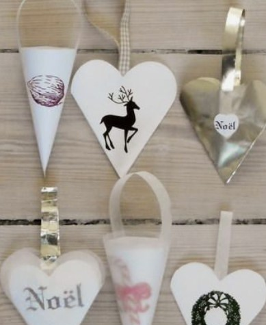

This article has been written and researched by our expert Loveable through a precise methodology. [Learn more about our methodology](https://avada.io/loveable/our-methodological.html)

[Loveable](https://avada.io/loveable/) > [Blog](https://avada.io/loveable/blog/) > [Holiday](https://avada.io/loveable/holiday/)

# 30 Best Paper Christmas Ornament Ideas For 2023 Celebration 

Written by [Blake Simpson](https://avada.io/loveable/author/blake/) Last Updated on September 12, 2023

- [30 Best Paper Christmas Ornament Ideas That You Can Buy on Amazon or DIY](https://avada.io/loveable/blog/paper-christmas-ornament/#wp-block-heading-2-4)
    - [1\. Origami Star DIY Ornament](https://avada.io/loveable/blog/paper-christmas-ornament/#wp-block-heading-3-5) 
    - [2\. Christmas ornaments made of book paper](https://avada.io/loveable/blog/paper-christmas-ornament/#wp-block-heading-3-9) 
    - [3\. Another Version of Origami Paper Stars](https://avada.io/loveable/blog/paper-christmas-ornament/#wp-block-heading-3-13) 
    - [4\. Paper Christmas tree Ornament](https://avada.io/loveable/blog/paper-christmas-ornament/#wp-block-heading-3-16) 
    - [5\. Paper Snowflakes Ornament](https://avada.io/loveable/blog/paper-christmas-ornament/#wp-block-heading-3-20) 
    - [6\. Snowflake Tree Ornament](https://avada.io/loveable/blog/paper-christmas-ornament/#wp-block-heading-3-25) 
    - [7\. DIY Paper Star](https://avada.io/loveable/blog/paper-christmas-ornament/#wp-block-heading-3-29) 
    - [8\. Paper Christmas Balls Ornament](https://avada.io/loveable/blog/paper-christmas-ornament/#wp-block-heading-3-34)
    - [9\. Snowbird Snowflake Hanging Decor Decoration](https://avada.io/loveable/blog/paper-christmas-ornament/#wp-block-heading-3-38)
    - [10\. Colorful Paper Ornaments](https://avada.io/loveable/blog/paper-christmas-ornament/#wp-block-heading-3-43)
    - [11\. Wrapping Paper Theme Paper Ornaments](https://avada.io/loveable/blog/paper-christmas-ornament/#wp-block-heading-3-47)
    - [12\. Paper Pinecone Christmas Ornament](https://avada.io/loveable/blog/paper-christmas-ornament/#wp-block-heading-3-51)
    - [13\. Embellished Paper Ornament](https://avada.io/loveable/blog/paper-christmas-ornament/#wp-block-heading-3-54)
    - [14\. Paper Pinwheel Ornament](https://avada.io/loveable/blog/paper-christmas-ornament/#wp-block-heading-3-57)
    - [15\. 3D Star Ornament](https://avada.io/loveable/blog/paper-christmas-ornament/#wp-block-heading-3-61)
    - [16\. Bright Paper Christmas Ornament](https://avada.io/loveable/blog/paper-christmas-ornament/#wp-block-heading-3-74)
    - [17\. German Paper Stars Ornament](https://avada.io/loveable/blog/paper-christmas-ornament/#wp-block-heading-3-77) 
    - [18\. Recycled Bird Ornament](https://avada.io/loveable/blog/paper-christmas-ornament/#wp-block-heading-3-81)
    - [19\. Gift Box Christmas Ornaments](https://avada.io/loveable/blog/paper-christmas-ornament/#wp-block-heading-3-85)
    - [20\. Home Paper Ornaments](https://avada.io/loveable/blog/paper-christmas-ornament/#wp-block-heading-3-89)
    - [21\. Simple Paper Flower Ornaments](https://avada.io/loveable/blog/paper-christmas-ornament/#wp-block-heading-3-93)
    - [22\. Folded Paper Ornament](https://avada.io/loveable/blog/paper-christmas-ornament/#wp-block-heading-3-97)
    - [23\. Paper Magnolia Ornament](https://avada.io/loveable/blog/paper-christmas-ornament/#wp-block-heading-3-101)
    - [24\. Peppermint Candy Ornaments](https://avada.io/loveable/blog/paper-christmas-ornament/#wp-block-heading-3-105)
    - [25\. Easy Origami Stars](https://avada.io/loveable/blog/paper-christmas-ornament/#wp-block-heading-3-109)
    - [26\. Personalized Photo Christmas Ornament](https://avada.io/loveable/blog/paper-christmas-ornament/#wp-block-heading-3-113)
    - [27\. Carol Sheet Music Ornaments](https://avada.io/loveable/blog/paper-christmas-ornament/#wp-block-heading-3-117)
    - [28\. Geometric Paper Ornaments](https://avada.io/loveable/blog/paper-christmas-ornament/#wp-block-heading-3-121)
    - [29\. Woven Star Christmas Ornament](https://avada.io/loveable/blog/paper-christmas-ornament/#wp-block-heading-3-125)
    - [30\. Dingbat Paper Ornaments](https://avada.io/loveable/blog/paper-christmas-ornament/#wp-block-heading-3-129)
- [Bottom Line](https://avada.io/loveable/blog/paper-christmas-ornament/#wp-block-heading-2-136)

Welcome to a world of festive creativity and timeless holiday charm! As we approach the joyous season of 2023, it’s the perfect time to explore a delightful array of paper Christmas ornament ideas that will add a touch of elegance and warmth to your decorations. Crafting paper ornaments not only embraces the spirit of tradition but also offers an opportunity to infuse your personal style into your holiday ambiance. 

From intricate snowflakes to enchanting origami designs, this curated collection of the 35 best paper Christmas ornament ideas is sure to inspire your imagination and help you create a memorable and captivating holiday atmosphere. 

For those seeking a touch of humor and whimsy, be sure to check out our collection of [Funny Christmas Ornaments](https://avada.io/loveable/funny-christmas-ornaments/), adding a playful twist to your festive adornments. Let’s dive into the world of paper craft and embark on a journey of festive crafting joy!

## **30 Best Paper Christmas Ornament Ideas That You Can Buy on Amazon or DIY**

### **1\. Origami Star DIY Ornament** 

Crafting these charming 5-pointed origami stars is a breeze, and they effortlessly transform into exquisite Christmas embellishments. Utilize old magazines, scrapbook papers, or even sheet music – whatever materials you have on hand – to fashion these delightful ornaments.

Check out the tutorial at [homemade-gifts-made-easy](https://www.homemade-gifts-made-easy.com/5-pointed-origami-star.html)

### **2\. Christmas ornaments made of book paper** 

Transform those old books into beautiful paper Christmas ornaments using the [tutorial from Gimmie Some Oven](https://www.gimmesomeoven.com/diy/diy-easy-book-page-ornaments/). It’s a wonderful method to breathe new life into books that have seen better days.

For an even more festive touch, consider opting for Christmas classics such as “A Christmas Carol” to craft your delightful ornaments!

### **3\. Another Version of Origami Paper Stars** 

Infuse a touch of starry magic into your home with [Sarah Matthews’ tutorial](https://www.gathered.how/papercraft/origami/how-to-make-a-paper-origami-christmas-star/). Discover the art of crafting your very own paper origami Christmas stars and adorn your living space with their enchanting charm. These stars will exquisitely embellish your Christmas tree, illuminate your windows, or create a striking focal point on your wall, just as Sarah herself has accomplished.

### **4\. Paper Christmas tree Ornament** 

Say goodbye to needle shedding and hello to everlasting charm with these adorable mini origami Christmas trees! Our easy-to-follow tutorial will guide you through the process, allowing you to craft your very own festive trees using your preferred origami paper designs. To add a finishing touch, attach a bit of twine to the top for hanging, or let it grace your Christmas table as a delightful centerpiece.

Check out the [Paper Christmas tree Ornament](https://www.gathered.how/papercraft/origami/diy-origami-christmas-tree/)  tutorial 

### **5\. Paper Snowflakes Ornament** 

Christmas just wouldn’t be complete without the classic addition of a paper snowflake! These delicate creations work wonderfully as window decorations and can even be made smaller to adorn your Christmas tree.

Plus, they’re an absolute blast to create, especially as a festive crafting activity with the little ones. Simply gather some paper and scissors, and embark on the joyful journey of crafting your very own paper snowflake.

Check out the [Paper Snowflakes Ornament](https://www.gathered.how/papercraft/how-to-make-paper-snowflakes/) tutorial 

### **6\. Snowflake Tree Ornament** 

Blend the enchantment of snowflakes with the charm of Christmas trees, and what do you get? The ultimate handmade paper Christmas tree ornament! Hello Wonderful’s tutorial brings these two festive elements together seamlessly, and the best part? It’s a fantastic way to put those paper scraps to use, creating various layers that stack up beautifully.

Check out the [Snowflake Tree Ornament](https://www.hellowonderful.co/post/paper-snowflake-tree-ornaments/) tutorial 

### **7\. DIY Paper Star** 

What truly captivates me about these Christmas tree stars is their woven and intricate appearance, yet crafting them is surprisingly simple. In fact, they’re such a hit in Finland that children often enjoy creating them as decorations!

With their intricate patterns, I can’t help but see a resemblance to snowflakes. Don’t you agree? If you’re pondering over how to make paper snowflakes, these stars could be a wonderful alternative, boasting 8 points instead of the usual 6.

Check out the tutorial at [homemade-gifts-made-easy](https://www.homemade-gifts-made-easy.com/how-to-make-a-star.html)

### **8\. Paper Christmas Balls Ornament**

Elevate the allure of your Christmas tree this season by introducing these one-of-a-kind glittery ornaments! These distinctive Christmas balls will catch the twinkle of your tree’s lights, creating a dazzling display. They make for an ideal family project that encapsulates the holiday spirit!

Check out how to make [Paper Christmas Balls Ornament](https://modpodgerocksblog.com/paper-christmas-balls/)

### **9\. Snowbird Snowflake Hanging Decor Decoration**

The TAG Snowbird Snowflake Christmas Ornament adds an elegant touch to your holiday décor with its intricate snowflake design and delicate detailing. Crafted with a blend of metal and paper, it exudes a subtle charm that captures the festive spirit while maintaining a timeless appeal. The combination of silver tones and a bird motif gives it a unique character, making it a standout addition to any Christmas tree or seasonal display.

This ornament’s blend of craftsmanship and aesthetic creates a refined holiday ambiance, making it a thoughtful gift option or a stylish addition to your own festive collection.

Buy [Snowbird Snowflake Hanging on Amazon](https://www.amazon.com/TAG-Snowbird-Snowflake-Christmas-Ornament/dp/B0845QG6H8/) 

### **10\. Colorful Paper Ornaments**

If you’re aiming to adorn your tree with a burst of vibrant ornaments in no time, these paper decorations boasting stunning designs are a breeze to create. They offer a simple yet visually captivating way to deck out your entire tree without breaking the bank.

Check out [Colorful Paper Ornaments tutorial](https://www.apieceofrainbow.com/diy-paper-christmas-ornaments-crafts/)  

### **11\. Wrapping Paper Theme Paper Ornaments**

The delightful hues of these adorable paper ornaments bring to mind the whimsical charm of Whoville, instantly bringing a smile to my face! Opt for vibrant colors, and you’ll find that your kids will be thrilled to join in the crafting fun as well.

Check out the [Wrapping Paper Theme Ornaments](https://www.thatswhatchesaid.net/3d-paper-ornaments/)

### **12\. Paper Pinecone Christmas Ornament**

Turn those Christmas cards from last year into a fun ornament project for this year using a simple paper punch. Choose cards that have colors that go well together, and then punch out various shapes from them. Use some hot glue to attach these shapes in rows onto a foam egg shape. Begin at the bottom and make sure to overlap the pieces slightly for each new row.

### **13\. Embellished Paper Ornament**

Deck out your Christmas tree with these simple yet charming paper ornaments that you can whip up in no time. Start by cutting out circles from cardstock, either with festive patterns or plain designs. To give them a unique touch, jazz them up with string, ribbon, buttons, and other delightful holiday decorations. To achieve an authentic look, glue a snippet of gold foil onto the ornament’s top. Then, on the reverse side, attach an ornament hanger or a piece of string for easy hanging. Your tree will be adorned with your very own personalized creations!

### **14\. Paper Pinwheel Ornament**

Create eye-catching paper ornaments for your tree with these delightful holiday-themed pinwheel shapes. Crafting them is a breeze and only requires a handful of cuts and folds.

Begin by grabbing some two-sided scrapbook paper. Transform the sheet into a square by trimming it accordingly. Now, with the square in hand, perform a diagonal cut from every corner, halting at the midpoint. Gently fold one side of each section towards the center (feel free to use tape or an extra hand to keep the first folds steady while you tackle the rest). Once folded, bring all four pieces together at the center and fasten them using a brad. Your tree will be adorned with these captivating pinwheels in no time!

### **15\. 3D Star Ornament**

Even though this 3D snowflake looks like it’s made from a bunch of paper pieces, it’s actually put together from just one sheet. Here’s how you can make it:

1. Get a [printable pattern](https://www.bhg.com/content/dam/bhg/PDFs/secure/SnowflakeStarOrnament.pdf) and download it.
2. Stick the pattern to a light box or a window with direct sunlight.
3. Place tracing paper on top of the pattern and secure it with tape.
4. Use a pencil to trace the pattern onto white cardstock.
5. Put pinholes on all the important points. This will help you get things right when you start and finish each cut.
6. Begin cutting from the center of the design and work your way outwards. Be careful not to cut the parts that hold the shape together.
7. Cut along all the lines in the pattern.
8. Start with the center star and gently twist it a quarter-turn.
9. Do the same twisting for each star, one after the other, until they’re all twisted out.

So, even though it might look complicated, you’ll create this cool snowflake using just one piece of paper. Just follow these steps and enjoy your crafty masterpiece!

### **16\. Bright Paper Christmas Ornament**

Create a vibrant array of snowflake ornaments by folding sturdy decorative paper diagonally twice to form a square. Make cuts along the edges, unfold, outline with crafts glue, and add a sprinkle of glitter for a dazzling touch.

### **17\. German Paper Stars Ornament** 

If your Christmas decor needs a little pick-me-up, why not give these German Paper Stars a shot? 

These DIY Christmas crafts are a cherished part of German holiday decor. Known as Frobelstern, German paper stars stand out due to their sixteen distinct points. Inside this project, you’ll find a [video tutorial](https://www.allfreechristmascrafts.com/More-DIY-Christmas-Decorations/German-Paper-Stars) that guides you through each step, making it a breeze to create these intricate paper stars.

### **18\. Recycled Bird Ornament**

Got some old book pages, sheet music, or scrapbook paper lying around? Why not put them to good use and create your own charming Recycled Bird Ornament!

Check out the tutorial at [allfreechristmascrafts](https://www.allfreechristmascrafts.com/Paper-Christmas-Ornament-Crafts/Recycled-Bird-Ornament)

### **19\. Gift Box Christmas Ornaments**

When you’re thinking about crafting your own Christmas decorations, you really can’t go wrong with Recycled Gift Box Christmas Ornaments. Instead of spending a lot on pricey holiday decor, why not tap into your upcycling talents and craft these adorable and one-of-a-kind recycled Christmas ornaments? Take a cue from those familiar little brown boxes at Starbucks and transform them into delightful hanging ornaments that’ll infuse a festive spirit into your space.

Check out the [Gift Box Christmas Ornaments](https://www.allfreepapercrafts.com/Crafts-for-Christmas/Recycled-Gift-Box-Christmas-Ornaments) 

### **20\. Home Paper Ornaments**

You can spruce up some miniature houses for your Christmas tree using these charming Happy Holiday Home Paper Ornaments. And even if your tree is already adorned, these DIY ornaments can add a lovely touch to your tables or any other festive corners. The best part? We’ve got you covered with free printable templates, making the assembly of these paper house ornaments a breeze and an enjoyable activity.

Check out the printable and tutorial at [allfreepapercrafts](http://www.allfreepapercrafts.com/Crafts-for-Christmas/Happy-Holiday-Home-Paper-Ornaments/?utm_content=bufferd1b01&utm_medium=social&utm_source=pinterest.com&utm_campaign=buffer)

### **21\. Simple Paper Flower Ornaments**

Make your home cheerful this holiday time with super simple [DIY Christmas ornaments](https://avada.io/loveable/blog/christmas-ornaments-diy/). Try making these Easy Paper Flower Ornaments using red, white, and green. If your kids can use a stapler, they can join in too. Mix up colors like red and white for a candy cane look, or go for the traditional red and green combo.

Check out the tutorial at [allfreechristmascrafts](https://www.allfreechristmascrafts.com/Paper-Christmas-Ornament-Crafts/Simple-Paper-Flower-Ornaments/?utm_content=buffer7e154&utm_medium=social&utm_source=pinterest.com&utm_campaign=buffer)

### **22\. Folded Paper Ornament**

This snowflake decoration is really beautiful. You can use it to decorate your Christmas tree, and later, you can wear it as a necklace throughout the rest of the year – that’s like having two uses in one! You don’t need a special quilling tool to make the folds or the rolled paper center. Give it a try tonight, and you can hang it on your tree or wear it tomorrow.

Check out the tutorial at [allfreechristmascrafts](https://www.allfreechristmascrafts.com/Wearable-Christmas-Crafts/Folded-Paper-Ornament-or-Necklace-Pendant?utm_content=buffer09e02&utm_medium=social&utm_source=pinterest.com&utm_campaign=buffer)

### **23\. Paper Magnolia Ornament**

This Sheet Music Magnolia Ornament is made from sheets of music and will surely bring a musical touch to your Christmas tree. It’s a wonderful DIY ornament that’s just right for people who enjoy bringing the Christmas cheer into their home. If you’re into crafting and decorating your home, these flowers can even be used to create a fantastic centerpiece for a musical-themed wedding celebration.

Check out the tutorial at [allfreechristmascrafts](http://www.allfreepapercrafts.com/Crafts-for-Christmas/Sheet-Music-Magnolia-Ornament/?utm_content=buffer23f15&utm_medium=social&utm_source=pinterest.com&utm_campaign=buffer)

### **24\. Peppermint Candy Ornaments**

Add a burst of color to your Christmas tree with Peppermint Candy Printable Ornaments. They come in red, pink, blue, and yellow, in different sizes. Easy to make – just print, cut, hole punch, and add string. Also great as gift tags!

Check out the tutorial at [allfreechristmascrafts](http://www.allfreepapercrafts.com/Crafts-for-Christmas/Peppermint-Candy-Printable-Ornaments/?utm_content=buffer3ea09&utm_medium=social&utm_source=pinterest.com&utm_campaign=buffer)

### **25\. Easy Origami Stars**

Origami is about folding paper into fancy designs. Kirigami goes a bit beyond by folding and cutting paper into beautiful art. If you’re curious about kirigami, you might like to begin with these Simple Kirigami Stars. These stars are crafted from multiple pieces of origami paper, allowing you to create lots of colorful combos.

Check out the tutorial at [allfreechristmascrafts](https://www.allfreepapercrafts.com/Origami/Easy-Kirigami-Stars/?utm_content=buffer0ef5a&utm_medium=social&utm_source=pinterest.com&utm_campaign=buffer)

### **26\. Personalized Photo Christmas Ornament**

Turn your lovely family photos into special Christmas Memories DIY Photo Ornaments. Crafting an ornament like this is simple – just gather a few supplies you likely have on hand. The round design lets you use several photos in your ornament. When it’s on your Christmas tree, it’ll twirl around, displaying all those precious memories.

Check out the tutorial at [allfreechristmascrafts](https://www.allfreechristmascrafts.com/Paper-Christmas-Ornament-Crafts/Christmas-Memories-DIY-Photo-Ornaments/?utm_content=buffer6996b&utm_medium=social&utm_source=pinterest.com&utm_campaign=buffer)

### **27\. Carol Sheet Music Ornaments**

If you’re looking for simple Christmas crafts, these Christmas Carol Sheet Music Ornaments have it all! They’re simple to create, won’t break the bank, and can also be a wonderful gift to top presents for family and friends who enjoy holiday music.

Check out the tutorial at [allfreechristmascrafts](https://www.allfreechristmascrafts.com/Christmas-Ornament-Crafts/Christmas-Carol-Sheet-Music-Ornaments)

### **28\. Geometric Paper Ornaments**

A great thing about DIY projects is they let you keep learning and improving. Every now and then, it’s nice to refresh your decorations, even the traditional ones for Christmas!

Check out the tutorial at [bestfriendsforfrosting](http://bestfriendsforfrosting.com/2013/12/geometric-paper-ornaments/)

### **29\. Woven Star Christmas Ornament**

I’m really thrilled about this week’s Stampin’ Royalty Challenge – it’s all about STARS! I made a Woven Star Christmas Ornament with my group during our Stamp Crew meeting, and I’ve been waiting for this challenge to show it to you!

Check out the tutorial at [carriestamps](http://www.carriestamps.com/weblog/2015/11/woven-star-christmas-ornament.html)

### **30\. Dingbat Paper Ornaments**

Here’s an awesome Christmas craft trick for those of us who aren’t into art. These Dingbat Homemade Christmas Ornaments aren’t just quirky in name. Instead of drawing intricate Christmas pictures yourself, you can use special fonts like dingbats and wingdings to make lovely designs on your homemade paper ornaments.

Check out the tutorial at [allfreechristmascrafts](http://www.allfreechristmascrafts.com/Paper-Christmas-Ornament-Crafts/Dingbat-Homemade-Christmas-Ornaments/?utm_content=bufferaa939&utm_medium=social&utm_source=pinterest.com&utm_campaign=buffer)

**_See More:_**

- Best [Unique Christmas Ornaments](https://avada.io/loveable/unique-christmas-ornaments/)

- Stunning [Crochet Christmas Ornaments](https://avada.io/loveable/blog/crochet-christmas-ornaments/)

## **Bottom Line**

These 30 **Paper Christmas Ornament** ideas are perfect for adding a personalized touch to your 2023 celebrations. Whether you’re looking for intricate origami or creative uses of materials like sheet music, these ornaments offer a blend of tradition and innovation that will make your holiday season truly memorable.

- [30 Best Paper Christmas Ornament Ideas That You Can Buy on Amazon or DIY](https://avada.io/loveable/blog/paper-christmas-ornament/#wp-block-heading-2-4)
    - [1\. Origami Star DIY Ornament](https://avada.io/loveable/blog/paper-christmas-ornament/#wp-block-heading-3-5) 
    - [2\. Christmas ornaments made of book paper](https://avada.io/loveable/blog/paper-christmas-ornament/#wp-block-heading-3-9) 
    - [3\. Another Version of Origami Paper Stars](https://avada.io/loveable/blog/paper-christmas-ornament/#wp-block-heading-3-13) 
    - [4\. Paper Christmas tree Ornament](https://avada.io/loveable/blog/paper-christmas-ornament/#wp-block-heading-3-16) 
    - [5\. Paper Snowflakes Ornament](https://avada.io/loveable/blog/paper-christmas-ornament/#wp-block-heading-3-20) 
    - [6\. Snowflake Tree Ornament](https://avada.io/loveable/blog/paper-christmas-ornament/#wp-block-heading-3-25) 
    - [7\. DIY Paper Star](https://avada.io/loveable/blog/paper-christmas-ornament/#wp-block-heading-3-29) 
    - [8\. Paper Christmas Balls Ornament](https://avada.io/loveable/blog/paper-christmas-ornament/#wp-block-heading-3-34)
    - [9\. Snowbird Snowflake Hanging Decor Decoration](https://avada.io/loveable/blog/paper-christmas-ornament/#wp-block-heading-3-38)
    - [10\. Colorful Paper Ornaments](https://avada.io/loveable/blog/paper-christmas-ornament/#wp-block-heading-3-43)
    - [11\. Wrapping Paper Theme Paper Ornaments](https://avada.io/loveable/blog/paper-christmas-ornament/#wp-block-heading-3-47)
    - [12\. Paper Pinecone Christmas Ornament](https://avada.io/loveable/blog/paper-christmas-ornament/#wp-block-heading-3-51)
    - [13\. Embellished Paper Ornament](https://avada.io/loveable/blog/paper-christmas-ornament/#wp-block-heading-3-54)
    - [14\. Paper Pinwheel Ornament](https://avada.io/loveable/blog/paper-christmas-ornament/#wp-block-heading-3-57)
    - [15\. 3D Star Ornament](https://avada.io/loveable/blog/paper-christmas-ornament/#wp-block-heading-3-61)
    - [16\. Bright Paper Christmas Ornament](https://avada.io/loveable/blog/paper-christmas-ornament/#wp-block-heading-3-74)
    - [17\. German Paper Stars Ornament](https://avada.io/loveable/blog/paper-christmas-ornament/#wp-block-heading-3-77) 
    - [18\. Recycled Bird Ornament](https://avada.io/loveable/blog/paper-christmas-ornament/#wp-block-heading-3-81)
    - [19\. Gift Box Christmas Ornaments](https://avada.io/loveable/blog/paper-christmas-ornament/#wp-block-heading-3-85)
    - [20\. Home Paper Ornaments](https://avada.io/loveable/blog/paper-christmas-ornament/#wp-block-heading-3-89)
    - [21\. Simple Paper Flower Ornaments](https://avada.io/loveable/blog/paper-christmas-ornament/#wp-block-heading-3-93)
    - [22\. Folded Paper Ornament](https://avada.io/loveable/blog/paper-christmas-ornament/#wp-block-heading-3-97)
    - [23\. Paper Magnolia Ornament](https://avada.io/loveable/blog/paper-christmas-ornament/#wp-block-heading-3-101)
    - [24\. Peppermint Candy Ornaments](https://avada.io/loveable/blog/paper-christmas-ornament/#wp-block-heading-3-105)
    - [25\. Easy Origami Stars](https://avada.io/loveable/blog/paper-christmas-ornament/#wp-block-heading-3-109)
    - [26\. Personalized Photo Christmas Ornament](https://avada.io/loveable/blog/paper-christmas-ornament/#wp-block-heading-3-113)
    - [27\. Carol Sheet Music Ornaments](https://avada.io/loveable/blog/paper-christmas-ornament/#wp-block-heading-3-117)
    - [28\. Geometric Paper Ornaments](https://avada.io/loveable/blog/paper-christmas-ornament/#wp-block-heading-3-121)
    - [29\. Woven Star Christmas Ornament](https://avada.io/loveable/blog/paper-christmas-ornament/#wp-block-heading-3-125)
    - [30\. Dingbat Paper Ornaments](https://avada.io/loveable/blog/paper-christmas-ornament/#wp-block-heading-3-129)
- [Bottom Line](https://avada.io/loveable/blog/paper-christmas-ornament/#wp-block-heading-2-136)

### [Blake Simpson](https://avada.io/loveable/author/blake/)

Hi, I'm Blake from Loveable. I help people find perfect gifts for occasions like anniversaries and weddings. I also write a blog about holidays, sharing insights to make them more meaningful. Let's create unforgettable moments together!

- [Twitter](https://twitter.com/intent/tweet)
- [Facebook](https://www.facebook.com/sharer/sharer.php)
- [instagram](https://avada.io/loveable/blog/paper-christmas-ornament/)
- [pinterest](https://www.pinterest.com/loveablellc/)

## Related Posts

[### 120+ Christian Birthday Wishes To Spread Your Love](https://avada.io/loveable/blog/christian-birthday-wishes/) 

[

### 35 Best 70th Birthday Ideas To Celebrate The Special Milestone

](https://avada.io/loveable/blog/70th-birthday-ideas/)

[

### 50 Best 30th Birthday Decorations for a Remarkable Birthday Bash

](https://avada.io/loveable/blog/30th-birthday-decorations/)

[

### 40 Delicious Vegan Christmas Desserts to Delight Your Palate

](https://avada.io/loveable/blog/vegan-christmas-desserts/)

[

### 60 Christmas Team Building Activities to Boost Workplace Spirit

](https://avada.io/loveable/blog/christmas-team-building-activities/)
