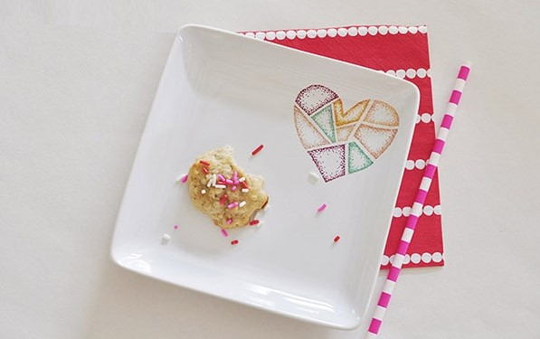
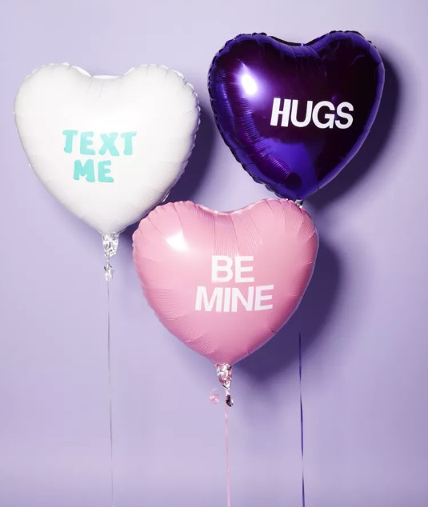

This article has been written and researched by our expert Loveable through a precise methodology. [Learn more about our methodology](https://avada.io/loveable/our-methodological.html)

[Loveable](https://avada.io/loveable/) > [Blog](https://avada.io/loveable/blog/) > [Holiday](https://avada.io/loveable/holiday/)

# 30 Best Valentine Crafts Ideas For Kids And Adults

Written by [Blake Simpson](https://avada.io/loveable/author/blake/) Last Updated on August 21, 2023

- [3\. Sweetheart Candies And Flower For Valentine](https://avada.io/loveable/blog/valentine-crafts-ideas/#wp-block-heading-2-12)
- [4\. Painted Rocks With Conversation Heart](https://avada.io/loveable/blog/valentine-crafts-ideas/#wp-block-heading-2-17)
- [5\. Heart-Shaped Coasters Inspired By Farmhouse Idea](https://avada.io/loveable/blog/valentine-crafts-ideas/#wp-block-heading-2-22)
- [6\. Heart Paper Flowers](https://avada.io/loveable/blog/valentine-crafts-ideas/#wp-block-heading-2-26)
- [7\. Valentine’s Day Cookie Dish](https://avada.io/loveable/blog/valentine-crafts-ideas/#wp-block-heading-2-32)
- [8\. Dollar Tree Love Shack](https://avada.io/loveable/blog/valentine-crafts-ideas/#wp-block-heading-2-37)
- [9\. Succulents for Valentine’s Day](https://avada.io/loveable/blog/valentine-crafts-ideas/#wp-block-heading-2-42)
- [10\. Photo Display Board DIY Heart](https://avada.io/loveable/blog/valentine-crafts-ideas/#wp-block-heading-2-46) 
- [11\. Easy Cute DIY Jar](https://avada.io/loveable/blog/valentine-crafts-ideas/#wp-block-heading-2-51)
- [12\. Mod Podge Slime For Valentine’s Day](https://avada.io/loveable/blog/valentine-crafts-ideas/#wp-block-heading-2-55) 
- [13\. Heart Mason Jar with Button](https://avada.io/loveable/blog/valentine-crafts-ideas/#wp-block-heading-2-60)
- [14.  Lovely Valentine Gift Box for Him](https://avada.io/loveable/blog/valentine-crafts-ideas/#wp-block-heading-2-64)
- [15\. Lovely Valentine’s Heart Attack](https://avada.io/loveable/blog/valentine-crafts-ideas/#wp-block-heading-2-69) 
- [16\. Romantic Collage Valentine Frame](https://avada.io/loveable/blog/valentine-crafts-ideas/#wp-block-heading-2-74)
- [17\. Valentine’s Day Wrapping Paper (Downloadable)](https://avada.io/loveable/blog/valentine-crafts-ideas/#wp-block-heading-2-78)
- [18\. Dancing Hearts Valentine Mobile](https://avada.io/loveable/blog/valentine-crafts-ideas/#wp-block-heading-2-82)
- [19\. Romantic Homemade Ring Plate](https://avada.io/loveable/blog/valentine-crafts-ideas/#wp-block-heading-2-87)
- [20\. Wind Chimes Made by Heart-shaped Cookie mold](https://avada.io/loveable/blog/valentine-crafts-ideas/#wp-block-heading-2-92) 
- [21\. Dishtowels with a love message](https://avada.io/loveable/blog/valentine-crafts-ideas/#wp-block-heading-2-97)
- [22\. Fabric Wrapped Valentine’s Wreath](https://avada.io/loveable/blog/valentine-crafts-ideas/#wp-block-heading-2-102)
- [23\. Cute Valentine’s Day Vase](https://avada.io/loveable/blog/valentine-crafts-ideas/#wp-block-heading-2-106)
- [24\. Valentine’s Day Wall Art](https://avada.io/loveable/blog/valentine-crafts-ideas/#wp-block-heading-2-110)
- [25\. Personalized Printed Market Tote](https://avada.io/loveable/blog/valentine-crafts-ideas/#wp-block-heading-2-114)
- [26\. Love Heart Balloons](https://avada.io/loveable/blog/valentine-crafts-ideas/#wp-block-heading-2-119) 
- [27\. Key Ring with Conversation Heart](https://avada.io/loveable/blog/valentine-crafts-ideas/#wp-block-heading-2-127)
- [28\. Loveable Heart Truffle Box](https://avada.io/loveable/blog/valentine-crafts-ideas/#wp-block-heading-2-140)
- [29\. DIY Valentine’s Day Party Invitation Card](https://avada.io/loveable/blog/valentine-crafts-ideas/#wp-block-heading-2-151)
- [30\. Blooming Paper Flower](https://avada.io/loveable/blog/valentine-crafts-ideas/#wp-block-heading-2-163) 
- [Bottom Line](https://avada.io/loveable/blog/valentine-crafts-ideas/#wp-block-heading-2-177) 

A handcrafted card or DIY gift is the most heartfelt way to express your feelings. So your significant other can feel your love. Try to make your own Valentine’s Day items, such as cards, gifts, or cool boxes of chocolates; You don’t need to make it complicated. They’re all cute and small trinkets, and most of them can be completed with inexpensive, easy-to-find materials.

This article has compiled the most beautiful DIY **Valentine crafts**. They are easy to make and do not require too many tools. Let’s craft!

1. **Wooden Love Sign**

This blogger used creamy brown wax to give her letters a worn look. She then glued them to an old piece of barn wood to make an upcycled display that could be kept all year.

**Tutorial:** [_Check out Lolly Jane Tutorial_](https://lollyjane.com/rustic-love-barnwood-sign/)

**Related**: Loveable Store specializes in gifts, including gifts for special occasions and for all kinds of relationships, so check out Loveable [Valentine Wooden products](https://avada.io/loveable/wooden-valentine-gifts/).

2. Lavender Lip Balm Home-made 

This cute lip balm you can make yourself will ensure that you and your Valentine have kissable lips on February 14.

**Tutorial**: [_Check out Sugar and Charm tutorial_](https://sugarandcharm.com/diy-lavender-lip-balm-printable) 

## 3\. Sweetheart Candies And Flower For Valentine

3. Sweetheart Candies And Flower For Valentine

A small flower pot decked out in conversation hearts is as cute as it gets.

**Tutorial**: [_Check out the tutorial at made with happy_](https://www.madewithhappy.com/candy-hearts-valentines-flower/) 

**Related:** [Best Home-Made Valentine’s Gifts](https://avada.io/loveable/homemade-valentines-gifts/)

## 4\. Painted Rocks With Conversation Heart

These creatively painted rocks make the ideal paperweights for Valentine’s Day gifts and are a fun craft project for both children and adults.

**Tutorial**: [_Check out the tutorial at made with happy_](https://www.madewithhappy.com/conversation-heart-painted-rocks/) 

**Related:** [SHOP FELT SHEETS](https://www.amazon.com/Platinum-ID-Cards-Holographic-Rainbow/dp/B005GLPL16?ots=1&linkCode=ogi&tag=countryliving_auto-append-20&ascsubtag=%5Bartid%7C10050.g.1093%5Bsrc%7C%5Bch%7C%5Blt%7C%5Bpid%7C74f37d59-a567-4b3b-864e-a3dc0cf10a58)

## 5\. Heart-Shaped Coasters Inspired By Farmhouse Idea

As a homemade Valentine’s Day present, you can make these simple coasters in the style of a farmhouse for very little money and in very little time.

**Tutorial**: [_Check out the tutorial at DIY Beautify_](https://www.diybeautify.com/2020/01/farmhouse-valentines-day-heart-shaped-coasters.html)

## 6\. Heart Paper Flowers

To put it simply, I can’t stop thinking about hearts now that Valentine’s Day is here. I was scrambling to find something to give to a couple of friends for Valentine’s Day, and I came up with these incredibly adorable heart-shaped paper flowers. Together, these two are ridiculously cute, and they only took about 20 minutes to assemble.

These paper flowers are not only a beautiful decoration for your home, but they can also be used as a simple and inexpensive centerpiece for your Valentine’s Day party or brunch!

**Tutorial:** [_Check out the tutorial at Happiness is homemade_](https://www.happinessishomemade.net/how-to-make-heart-paper-flowers/) 

**Related**: _[Check out lovely paper gifts](https://avada.io/loveable/paper-anniversary-gifts/)_ 

## 7\. Valentine’s Day Cookie Dish

When February 14th gets closer, everyone starts smelling more like hearts, rosy pink, and a whole lotta love. In the spirit of this love-themed holiday, it would be fun to use the trendy sharpie technique to make a simple Valentine’s Day cookie dish.

**Tutorial:** [_Get the tutorial at Delineate Your Dwelling._](https://www.delineateyourdwelling.com/valentines-day-cookie-dish/)

**Related:** [_Best Food Gifts for Valentine_](https://avada.io/loveable/valentine-food-gifts/)

## 8\. Dollar Tree Love Shack

Craft paper and a few other supplies can transform a simple wood-frame house into a thoughtful and endearing present for Valentine’s Day.

**Tutorial:** [_Get the tutorial at Average But Inspired._](https://averageinspired.com/2021/01/dollar-tree-house-valentines-day.html)

**Related**: [_Best Valentine’s Gift Ideas_](https://avada.io/loveable/valentine-gift-ideas/) 

## 9\. Succulents for Valentine’s Day

Taking care of these puny little succulents is a breeze (and even easier to make).

**Tutorial:** [_Get the tutorial at Made With Happy._](https://www.madewithhappy.com/valentines-day-succulents-3/)

## 10\. Photo Display Board DIY Heart 

DIY hanging photo display heart painting made with FolkArt Multi-Surface; perfect for Valentine’s Day or Galentine’s Day to show your Valentine or Galentine how much you care about them.

**Tutorial:** [_Get the tutorial at plaidonline_](https://plaidonline.com/projects/diy-heart-photo-display-board)

**Related:** [33 First Valentine’s Gift For Girlfriend That Makes Her Day Special](https://avada.io/loveable/first-valentine-gift-girlfriend/)

## 11\. Easy Cute DIY Jar

These hand-painted jars are the perfect way to show your beloved ones how much you care about them on Valentine’s Day by serving their favorite candies. These are perfect for displaying on your Valentine’s Day table or giving as a gift.

**Tutorial:** [Get the tutorial at plaidonline](https://plaidonline.com/projects/easy-valentine-gift-jarcuterie)

## 12\. Mod Podge Slime For Valentine’s Day 

Make this homemade slime for your Valentine to show how much you care. This chocolate-themed slime is a fantastic Valentine’s Day activity for kids who enjoy playing with play food or experimenting with slime. Beads, sequins, and colorful string can stand in for a variety of flavors.

**Tutorial:** [Get the tutorial at handmadecharlotte](https://www.handmadecharlotte.com/valentines-day-mod-podge-slime/?crlt.pid=camp.jr6CQzi7aGq6)

**Related:** [_Best Valentine’s Gifts For Class That Children Will Love_](https://avada.io/loveable/valentine-class-gifts/)

## 13\. Heart Mason Jar with Button

The heart was created by a collage of pink buttons of varying sizes and shapes, and it turned out to be a really cool-looking heart. It was ideal for dressing up a mason jar and turning it into a cute homemade gift idea and candy jar.

**Tutorial:** [_Get the tutorial at chicacircle_](https://club.chicacircle.com/button-heart-mason-jar/?crlt.pid=camp.aJAxHvQNWdgX)

## 14.  Lovely Valentine Gift Box for Him

Design this dashing present box and put something delicious inside it for your sweetheart to enjoy.

**Tutorial**: [_Get the tutorial at plaidonline_](https://plaidonline.com/projects/gifts-for-guys-valentine-gift-box-for-him)

**Related:** [Best Valentine’s Gift For Boyfriend That Will Make His Day](https://avada.io/loveable/valentine-gift-boyfriend/)

## 15\. Lovely Valentine’s Heart Attack 

Your loved ones, especially on Valentine’s Day, are going to go crazy for this Valentine’s heart attack! This package will make their Valentine’s Day more enjoyable no matter how close or how far away they are.

**Tutorial:**  [_Get the tutorial at thehousethatlarsbuilt_](https://thehousethatlarsbuilt.com/2012/02/valentines-heart-attack-take-3.html/?utm_source=pinterest&utm_medium=social)

**Related:** [_Best Romantic Valentines Day Gifts That Are Astonishing_](https://avada.io/loveable/romantic-valentines-day-gifts/)

## 16\. Romantic Collage Valentine Frame

Using a photo transfer made with Mod Podge and various embellishments, you can make a mixed-media frame with a romantic vibe.

**Tutorial**: [_Get the tutorial at plaidonline_](https://plaidonline.com/projects/romantic-collage-valentine-frame)

## 17\. Valentine’s Day Wrapping Paper (Downloadable)

Are you prepared to celebrate Saint Valentine’s Day? Make your holiday more festive by downloading and printing out these free conversation heart valentine tags and gift wrap. So cute.

**Download:** [_Download printable wrapping paper at diycandy_](https://diycandy.com/valentines-day-wrapping-paper/)

## 18\. Dancing Hearts Valentine Mobile

Use Gallery Glass to make a fantastical mobile.

**Tutorial**: [_Get the tutorial at plaidonline_](https://plaidonline.com/projects/dancing-hearts-valentine-mobile)

**Related**: [_Best Valentine Gifts For Children They’re Sure To Love_](https://avada.io/loveable/valentine-gifts-children/)

## 19\. Romantic Homemade Ring Plate

This easy-to-make ring plate from clay that has been baked in the oven is perfect for storing rings and other jewelry, and it will serve as a constant reminder to that special someone of how you feel about them every time they use it.

**Tutorial**

Form a heart-shaped plate out of modeling clay and let it dry. Make the rim of the plate decorative, and then use a skewer or another sculpting tool to carve a saying into the surface of the plate. Follow the specific baking instructions.

## 20\. Wind Chimes Made by Heart-shaped Cookie mold 

Convert cookie cutters into chirpy wind chimes perfect for hanging above a bed or on the front porch. All you need are some cookie cutters and some string.

**Tutorial**

Make a heart from a 10- to 12-inch piece of wire by wrapping it with red twine and setting it aside. Make a clay heart by baking modeling clay in the oven. Before baking, punch a hole in the top so it can be hung and write a phrase on it if you want, then set it aside. Three large, three medium, and three small heart-shaped cookie cutters need holes punched in the bend and point. Cut the twine into three pieces. Working with one length at a time, thread a large, medium, and small cookie cutter onto the twine. Tie a knot above and below each cutter to keep it in place. Do it again with the rest of the string and cookie cutters. Wrap lengths of twine around the wire heart, making sure the hearts are facing the right way. Gather the twine lengths at the top and tie a knot to hang. Knot lengths of twine at the bottom and cut. Thread a short piece of twine through the ceramic heart, tie a knot at the bottom of the wine chime, and hang.

## 21\. Dishtowels with a love message

These beautiful custom dishtowels will bring love and joy to the most used room in the house, which is the kitchen. Both beautiful and functional, these dishtowels will not disappoint.

**Tutorial**

Create visuals for your project using your computer, including photographs if you so choose. Print on iron-on transfer paper to complete the process. Imagery should be cut out around the edges and then ironed onto cotton dishtowels in accordance with the directions provided by the manufacturer.

## 22\. Fabric Wrapped Valentine’s Wreath

Put together this easy-to-wrap Valentine’s Day wreath for a thoughtful present that will also send a message.

**Tutorial:** [Get the tutorial at Lolly Jane.](https://lollyjane.com/fabric-wrapped-valentine-wreath/)

## 23\. Cute Valentine’s Day Vase

When you give this easy vase that you made yourself to your sweetheart, along with a dozen red roses, it will look even more beautiful than it already does.

**Tutorial:** [_Get the tutorial at delineateyourdwelling_](https://www.delineateyourdwelling.com/painted-valentines-day-vase/)

## 24\. Valentine’s Day Wall Art

You can use this ingenious craft throughout the year by exchanging the pink and hearts for other types of holiday decorations or photographs.

**Tutorial** [_Get the tutorial at Little Red Window_](https://littleredwindow.com/valentines-day-wall-art/)

## 25\. Personalized Printed Market Tote

Crafting a one-of-a-kind market tote for a loved one, complete with iron-on graphics and a ribbon embellishment, will guarantee that she is the center of attention at the local farmer’s market.

**Tutorial** 

Create visuals, possibly including facetious proverbs or sayings, using your computer (ours says, “I love you from my head tomatoes”). Print on iron-on transfer paper to complete the process. Remove the excess paper around the image, then iron it onto a canvas tote bag. Stitch Witchery should be used to secure a length of ribbon to the very top of the bag.

## 26\. Love Heart Balloons 

Personalize balloons to make your Valentine’s Day party decorations more unique. 

**Tutorials** 

- Prepare: Herat-shaped balloons, Vinyl stick-on letters

- To-Do: Buy heart-shaped balloons from a store that sells party supplies. Then,

attach letters to each balloon that spell out phrases you might find on a conversation heart.

**Related**: [_Check out Beautiful Love letter Gifts_](https://loveable.ai/search?options%5Bprefix%5D=last&q=Letter) 

## 27\. Key Ring with Conversation Heart

This fun Valentine’s Day craft is all about molding clay and writing your favorite phrases on the hearts.

**Preparation** 

- Hole punch or awl
- Heart-shaped cookie cutter
- Stamp with small letter stamps or cookie-cutter letters
- Keyrings
- Molding clay

**Tutorial:** 

- **Step 1**: Roll out the modeling clay until it is about 14 inches thick.

- **Step 2**: Use a heart-shaped cookie cutter to cut out a heart. Stamp a phrase without cutting all the way through. Use the hole punch or the awl to make a hole for the key ring in one corner.

- **Step 3**: Follow the directions on the clay package to bake it in the oven. Wait until the keyring is completely cool before putting it on.

## 28\. Loveable Heart Truffle Box

What could be more lovely than giving someone homemade chocolate truffles in a homemade box?

**Preparation** 

- Scissors
- Cardstock
- Glue stick
- Box template

**Tutorial** 

- Print the box template and cut it out. Trace the shape on the paper and cut it out.
- Fold the paper along the single lines on the template to put the box together. Cut slits in the template where the bold line is. This will help you keep the top of the heart together. Use a glue stick to hold the box’s sides together.

## 29\. DIY Valentine’s Day Party Invitation Card

Even a small party should be something to remember. Invite the kids to help you make this Valentine’s Day party invitation, which may get a bit messy, but worth it. 

**Preparation** 

- Envelopes
- Newspaper
- Washable hand paint
- Paper

**Tutorial** 

- **Step 1**: Print out the invitation 
- **Step 2**: Spread newspaper out on the table. Give your kid a chance to get creative by making handprint invitations by dipping their hands in paint. Put it in a dry place for a while.
- **Step 3:** Just fill in the party information.

## 30\. Blooming Paper Flower 

When will they be able to show the world their love is forever? The first step is to craft a bud that will last. (It is recommended that you do not water this flower.)

**Preparation**

Pipe cleaners (in green)

Cupcake liners (in assorted colors)

Craft glue or hot glue

Craft knife

**Tutorial**

**Step 1**: Stack five or six cupcake liners high. Make a hole in the middle of the stack with the craft knife.

**Step 2**: Use a small amount of hot glue to secure one end of a pipe cleaner. Finally, stick one cupcake liner to the glue. Put it in a dry place for a while.

**Step 3**: To make it look like a flower bud, scrunch the liner shut once the glue is dry.

**Step 4**: Slide the extra liners onto the same pipe cleaner, secure them with glue, and scrunch them together as in Step 2.

**Step 5**: Wrap the pipe cleaner around the flower’s stem and bend it into a leaf.

## Bottom Line 

With the above handmade **Valentine’s craft ideas**, we hope that you will have a meaningful valentine’s with the one you love. These great ideas can be used to make [valentine’s gifts for students](https://avada.io/loveable/valentine-gifts-students/) and adults as well. 

- [3\. Sweetheart Candies And Flower For Valentine](https://avada.io/loveable/blog/valentine-crafts-ideas/#wp-block-heading-2-12)
- [4\. Painted Rocks With Conversation Heart](https://avada.io/loveable/blog/valentine-crafts-ideas/#wp-block-heading-2-17)
- [5\. Heart-Shaped Coasters Inspired By Farmhouse Idea](https://avada.io/loveable/blog/valentine-crafts-ideas/#wp-block-heading-2-22)
- [6\. Heart Paper Flowers](https://avada.io/loveable/blog/valentine-crafts-ideas/#wp-block-heading-2-26)
- [7\. Valentine’s Day Cookie Dish](https://avada.io/loveable/blog/valentine-crafts-ideas/#wp-block-heading-2-32)
- [8\. Dollar Tree Love Shack](https://avada.io/loveable/blog/valentine-crafts-ideas/#wp-block-heading-2-37)
- [9\. Succulents for Valentine’s Day](https://avada.io/loveable/blog/valentine-crafts-ideas/#wp-block-heading-2-42)
- [10\. Photo Display Board DIY Heart](https://avada.io/loveable/blog/valentine-crafts-ideas/#wp-block-heading-2-46) 
- [11\. Easy Cute DIY Jar](https://avada.io/loveable/blog/valentine-crafts-ideas/#wp-block-heading-2-51)
- [12\. Mod Podge Slime For Valentine’s Day](https://avada.io/loveable/blog/valentine-crafts-ideas/#wp-block-heading-2-55) 
- [13\. Heart Mason Jar with Button](https://avada.io/loveable/blog/valentine-crafts-ideas/#wp-block-heading-2-60)
- [14.  Lovely Valentine Gift Box for Him](https://avada.io/loveable/blog/valentine-crafts-ideas/#wp-block-heading-2-64)
- [15\. Lovely Valentine’s Heart Attack](https://avada.io/loveable/blog/valentine-crafts-ideas/#wp-block-heading-2-69) 
- [16\. Romantic Collage Valentine Frame](https://avada.io/loveable/blog/valentine-crafts-ideas/#wp-block-heading-2-74)
- [17\. Valentine’s Day Wrapping Paper (Downloadable)](https://avada.io/loveable/blog/valentine-crafts-ideas/#wp-block-heading-2-78)
- [18\. Dancing Hearts Valentine Mobile](https://avada.io/loveable/blog/valentine-crafts-ideas/#wp-block-heading-2-82)
- [19\. Romantic Homemade Ring Plate](https://avada.io/loveable/blog/valentine-crafts-ideas/#wp-block-heading-2-87)
- [20\. Wind Chimes Made by Heart-shaped Cookie mold](https://avada.io/loveable/blog/valentine-crafts-ideas/#wp-block-heading-2-92) 
- [21\. Dishtowels with a love message](https://avada.io/loveable/blog/valentine-crafts-ideas/#wp-block-heading-2-97)
- [22\. Fabric Wrapped Valentine’s Wreath](https://avada.io/loveable/blog/valentine-crafts-ideas/#wp-block-heading-2-102)
- [23\. Cute Valentine’s Day Vase](https://avada.io/loveable/blog/valentine-crafts-ideas/#wp-block-heading-2-106)
- [24\. Valentine’s Day Wall Art](https://avada.io/loveable/blog/valentine-crafts-ideas/#wp-block-heading-2-110)
- [25\. Personalized Printed Market Tote](https://avada.io/loveable/blog/valentine-crafts-ideas/#wp-block-heading-2-114)
- [26\. Love Heart Balloons](https://avada.io/loveable/blog/valentine-crafts-ideas/#wp-block-heading-2-119) 
- [27\. Key Ring with Conversation Heart](https://avada.io/loveable/blog/valentine-crafts-ideas/#wp-block-heading-2-127)
- [28\. Loveable Heart Truffle Box](https://avada.io/loveable/blog/valentine-crafts-ideas/#wp-block-heading-2-140)
- [29\. DIY Valentine’s Day Party Invitation Card](https://avada.io/loveable/blog/valentine-crafts-ideas/#wp-block-heading-2-151)
- [30\. Blooming Paper Flower](https://avada.io/loveable/blog/valentine-crafts-ideas/#wp-block-heading-2-163) 
- [Bottom Line](https://avada.io/loveable/blog/valentine-crafts-ideas/#wp-block-heading-2-177) 

### [Blake Simpson](https://avada.io/loveable/author/blake/)

Hi, I'm Blake from Loveable. I help people find perfect gifts for occasions like anniversaries and weddings. I also write a blog about holidays, sharing insights to make them more meaningful. Let's create unforgettable moments together!

- [Twitter](https://twitter.com/intent/tweet)
- [Facebook](https://www.facebook.com/sharer/sharer.php)
- [instagram](https://avada.io/loveable/blog/valentine-crafts-ideas/)
- [pinterest](https://www.pinterest.com/loveablellc/)

## Related Posts

[### 120+ Christian Birthday Wishes To Spread Your Love](https://avada.io/loveable/blog/christian-birthday-wishes/) 

[

### 35 Best 70th Birthday Ideas To Celebrate The Special Milestone

](https://avada.io/loveable/blog/70th-birthday-ideas/)

[

### 50 Best 30th Birthday Decorations for a Remarkable Birthday Bash

](https://avada.io/loveable/blog/30th-birthday-decorations/)

[

### 40 Delicious Vegan Christmas Desserts to Delight Your Palate

](https://avada.io/loveable/blog/vegan-christmas-desserts/)

[

### 60 Christmas Team Building Activities to Boost Workplace Spirit

](https://avada.io/loveable/blog/christmas-team-building-activities/)
