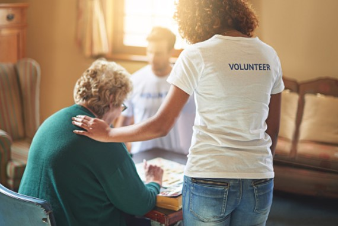
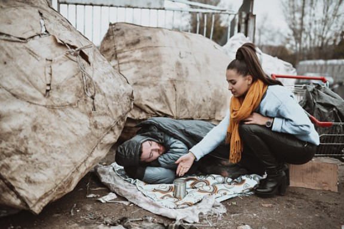
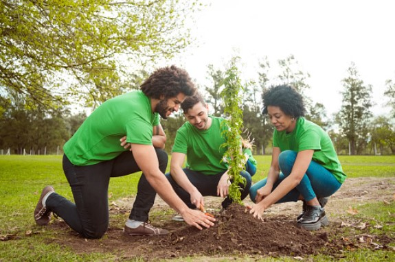
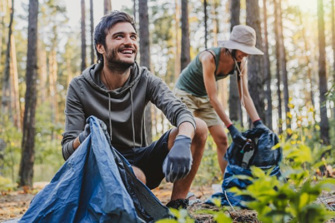

This article has been written and researched by our expert Loveable through a precise methodology. [Learn more about our methodology](https://avada.io/loveable/our-methodological.html)

[Loveable](https://avada.io/loveable/) > [Blog](https://avada.io/loveable/blog/) > [Family](https://avada.io/loveable/family/)

# 30 Best Volunteer Activities for Personal Growth and Community Impact

Written by [Rose Bryne](https://avada.io/loveable/author/rose/) Last Updated on August 23, 2023

- [30 Best Volunteer Activities in Your Community](https://avada.io/loveable/blog/volunteer-activities/#wp-block-heading-2-4) 
    - [1\. Spend Time at Summer Camp](https://avada.io/loveable/blog/volunteer-activities/#wp-block-heading-3-5)
    - [2\. Do Volunteer at School](https://avada.io/loveable/blog/volunteer-activities/#wp-block-heading-3-9)
    - [3\. Volunteering at a Nursing Home](https://avada.io/loveable/blog/volunteer-activities/#wp-block-heading-3-11)
    - [4\. Volunteer in a Food Bank](https://avada.io/loveable/blog/volunteer-activities/#wp-block-heading-3-14)
    - [5\. Help With Building Homes](https://avada.io/loveable/blog/volunteer-activities/#wp-block-heading-3-16)
    - [6\. Give Christmas Present](https://avada.io/loveable/blog/volunteer-activities/#wp-block-heading-3-19) 
    - [7\. Package Meals](https://avada.io/loveable/blog/volunteer-activities/#wp-block-heading-3-21)
    - [8\. Help at Library](https://avada.io/loveable/blog/volunteer-activities/#wp-block-heading-3-23) 
    - [9\. Give Back to Local Foundations](https://avada.io/loveable/blog/volunteer-activities/#wp-block-heading-3-26)
    - [10\. Help In the Kitchen](https://avada.io/loveable/blog/volunteer-activities/#wp-block-heading-3-28) 
    - [11\. Teach Young Students](https://avada.io/loveable/blog/volunteer-activities/#wp-block-heading-3-30)
    - [12\. Reading Club](https://avada.io/loveable/blog/volunteer-activities/#wp-block-heading-3-33) 
    - [13\. Help The Homeless](https://avada.io/loveable/blog/volunteer-activities/#wp-block-heading-3-35)
    - [14\. Look After the Kids](https://avada.io/loveable/blog/volunteer-activities/#wp-block-heading-3-38) 
    - [15\. Help in the Hospital](https://avada.io/loveable/blog/volunteer-activities/#wp-block-heading-3-40) 
    - [16\. Voluntary Blood Donation](https://avada.io/loveable/blog/volunteer-activities/#wp-block-heading-3-42)
    - [17\. Help the Animal](https://avada.io/loveable/blog/volunteer-activities/#wp-block-heading-3-45) 
    - [18\. Help Sport Teams](https://avada.io/loveable/blog/volunteer-activities/#wp-block-heading-3-47) 
    - [19\. Protect the Environment](https://avada.io/loveable/blog/volunteer-activities/#wp-block-heading-3-49)
    - [20\. Make Blessing Bags](https://avada.io/loveable/blog/volunteer-activities/#wp-block-heading-3-52)
    - [21\. Save Energy](https://avada.io/loveable/blog/volunteer-activities/#wp-block-heading-3-54)
    - [22\. Planting](https://avada.io/loveable/blog/volunteer-activities/#wp-block-heading-3-57) 
    - [23\. Put on a Show](https://avada.io/loveable/blog/volunteer-activities/#wp-block-heading-3-59)
    - [24\. Do Volunteer at The Church](https://avada.io/loveable/blog/volunteer-activities/#wp-block-heading-3-61)
    - [25\. Running](https://avada.io/loveable/blog/volunteer-activities/#wp-block-heading-3-64) 
    - [26\. Donate Spare Computing Power](https://avada.io/loveable/blog/volunteer-activities/#wp-block-heading-3-66) 
    - [27\. Get Crafty](https://avada.io/loveable/blog/volunteer-activities/#wp-block-heading-3-68)
    - [28\. Donate Unnecessary Items](https://avada.io/loveable/blog/volunteer-activities/#wp-block-heading-3-71)
    - [29\. Clean Up](https://avada.io/loveable/blog/volunteer-activities/#wp-block-heading-3-73)
    - [30\. Books Donate](https://avada.io/loveable/blog/volunteer-activities/#wp-block-heading-3-76) 
- [Bottom Line](https://avada.io/loveable/blog/volunteer-activities/#wp-block-heading-2-78) 

It’s amazing to give someone, isn’t it? Real happiness sometimes isn’t how much you can earn, it’s how many people you can help. Life is unpredictable, so cherish your life as well as that of others. Therefore, **volunteer activities** are a meaningful idea for leisure time, and you want to distribute to society. 

Volunteering is a wonderful opportunity to give back to your community, meet new people, and develop as a person. Let’s make a good change in the world and get more active in the issues that are important to us. Volunteering not only gives you a sense of fulfillment but also helps you to obtain useful experience. Don’t worry if you have never ever done it before; the most important is sincerity and heart. As long as you are satisfied to give someone a hand, you are amazing. 

There are many volunteer options to meet your schedule and interests, whether who you are. Whatever option you select, you can make a difference in the lives of others while also growing as a person.

## **30 Best Volunteer Activities in Your Community** 

### **1\. Spend Time at Summer Camp**

Both working and enjoying, it’s definitely summer camp. Spending time with children at a summer camp may be really fulfilling. You may also be able to offer advice to campers who are dealing with problems. As a volunteer counselor, you will be able to educate young people on important life skills while participating in activities with them. 

_**Related**_: [Gifts For Campers](https://avada.io/loveable/gifts-campers/)

### **2\. Do Volunteer at School**

Volunteering at a school is a great way to give back and contribute to children’s education. Schools are always welcome to get assistance from volunteers. It may be tremendously fulfilling to observe the influence you can have on a child’s education and mental health. Just adhere to the school’s volunteer standards and procedures, which may involve identity verification and training.

### **3\. Volunteering at a Nursing Home**

While residents do benefit immensely from medical treatment, they also require social and emotional assistance. Volunteers can offer companionship and emotional support to nursing home patients who are often lonely or alone. You can read to them, play games with them, listen to their stories, or simply talk to them.

### **4\. Volunteer in a Food Bank**

Who can live without food? Nah. No food, no life. Food banks depend significantly on volunteer assistance to sort, package, and deliver food to hunger. You can help with some activities by advertising the food bank’s services and encouraging donations; otherwise, work with a team of volunteers to sort through donated food products and organize them for distribution.  

### **5\. Help With Building Homes**

It can be out of your ability; however, it’s meaningful if you can. This physical work is likely to be exhausting, but it can also be quite satisfying since you are helping to provide a secure shelter for someone. You will also gain practical skills and work as part of a team. Besides, it helps form relationships with other volunteers and individuals being helped.

### **6\. Give Christmas Present** 

It’s sad to be alone at Christmas. Don’t stay at home on this sacred occasion just because you don’t have someone to go with. It’s even a good dating idea to go with your partners. You may help provide joy to children who might not otherwise get gifts over [Christmas](https://avada.io/loveable/christmas/) by helping to give or wrap presents. Simple ones are Ok as long as you’re sincere. 

### **7\. Package Meals**

You may help package meals for delivery by volunteering at a local community center. Sorting food contributions, making meals, and packing them for delivery are all available positions. You may even be able to deliver the meals personally and witness their happiness directly when getting them. 

### **8\. Help at Library** 

Volunteering at a library is an ideal opportunity for book lovers and those who appreciate a peaceful space. Volunteering at a library allows you to help your community and develop your own knowledge. You can be provided to broaden your knowledge and discover new interests by utilizing the library’s extensive collection of book resources.

### **9\. Give Back to Local Foundations**

You can make a big change in the lives of people in need. Participating in fundraising activities, contributing money or commodities, or volunteering your talents and knowledge to the organization are all examples. They often recruit on social media platforms, so if you like, get ready. 

### **10\. Help In the Kitchen** 

Let’s show your amazing cooking skills with this chance. You may assist with distributing meals to those in need while also learning new recipes from professional chefs. This is a particularly wonderful experience since you may serve supper to someone who would not otherwise have one. This can allow you to interact with folks from many walks of life. 

### **11\. Teach Young Students**

Anything related to education is also sublime. Volunteering to educate young pupils might be an amazing pastime in the list of volunteer activities for those who love teaching and working with the youth. You may assist students with their homework or conduct educational events. It’s meaningful because you may help mold the next generation of leaders.

### **12\. Reading Club** 

You may contribute to the creation of a welcoming atmosphere for book lovers, where they can share their passion for reading. For example, some kids may see a deterioration in the reading ability they gained throughout the school year over summer break. Organizing a summer reading club is an excellent approach to keeping their brains fresh.

### **13\. Help The Homeless**

Homelessness can be caused by many different factors, including job loss, mental health issues, or a lack of affordable housing. Whatever the reason, they deserve a better life. You can just help provide basic needs like food, shelter, and clothing to those in need. No matter how much you give away, the most important thing is the spiritual values left.

### **14\. Look After the Kids** 

Many academic programs need to have support as a tutor for professors. Some jobs even need to be paid, so they will be very welcome if you accept to do it for free. Volunteering at a local childcare center or after-school program allows you to assist children as a great role model for them. Spending time with children may also help you to enhance your patience and communication abilities. Let’s see what you can do to help children in their life.

### **15\. Help in the Hospital** 

You can volunteer in a hospital even if you don’t have a medical background. While hospitals require medical personnel, they appreciate employees who can amuse patients. You may also help with meal preparation or just simply join them on walks. The laugh can be the best medicine in helping them to be better.

### **16\. Voluntary Blood Donation**

Donations are constantly needed at blood donation facilities, and one gift can assist numerous people. When you give blood, you help someone recover from a devastating illness. Patients in need of blood frequently require it quickly, and giving blood can help guarantee that it is accessible when they need it. The process is safe and uncomplicated. 

### **17\. Help the Animal** 

Besides humans, the lives of animals are also precious. So, if you are an animal lover or an introverted person, volunteering at an animal group is a great opportunity. Many shelters and rescues also want volunteers to assist with events and fundraisers. 

### **18\. Help Sport Teams** 

Volunteering to assist a sports team is an excellent way to become engaged in your community while also supporting young athletes. Depending on your interests and talents, you can assist with everything from equipment management to scorekeeping to coaching. You may assist these young athletes in developing and learning life experiences.

### **19\. Protect the Environment**

Our planet is endangered right now and many extreme phenomena negatively affect our life. Environmental protection is a serious subject that demands everyone’s attention. Volunteering for environmental groups can help you contribute to environmental conservation initiatives. You may volunteer with a local organization to clean up rubbish in public. 

### **20\. Make Blessing Bags**

Blessing bags are care packages that include necessities for individuals who are homeless or in financial need. Making blessing bags is an excellent method to assist those in need, and it may be accomplished with the assistance of friends or family. This is a simple yet effective approach to assisting individuals in need.

### **21\. Save Energy**

Misusing energy is becoming popular nowadays, leading to many urgent problems for both environment and people’s health. Take action as soon as possible! You can do several easy things in your everyday life to save energy, such as turning off lights, unplugging gadgets when not in use, and utilizing energy-efficient equipment. 

### **22\. Planting** 

Planting trees, flowers, and other flora not only improves the area’s aesthetic appeal but also helps to filter the air and offer the home for animals. You may also learn about the many types of plants and their relevance to the environment. It’s also a terrific way to make friends with nature. 

### **23\. Put on a Show**

You may host a talent show and ask people of all ages to perform. Make it a joyful and collaborative activity by involving your friends, family, and neighbors in the planning and preparation process. 

### **24\. Do Volunteer at The Church**

If you haven’t had a good place for volunteering, this option is for you. Many available volunteering works in the church include working as an usher, aiding with [childcare during services](https://avada.io/loveable/blog/community-service-activities/), or assisting with administrative chores. Volunteering at a church may be a terrific opportunity to meet new people and create relationships while also helping a cause you care about. There might be a lot of children, so be prepared carefully.

### **25\. Running** 

Many groups organize charity marathons to raise funds for a wide range of social causes. You may join by signing up to run or walk in the event, or you can volunteer to help with event organization. In addition, Running also encourages you to stay healthy.

### **26\. Donate Spare Computing Power** 

You may help academics reach breakthroughs in a variety of pressing problems by giving your extra computing power. Let’s show your talent to support society.

### **27\. Get Crafty**

You may express your talent by making goods for a nonprofit organization. You may sell handcrafted artwork and give the earnings to a charitable organization. If you like sewing or knitting, you may produce clothes for needy children or quilts for veterans. Whatever your crafting ability, you will help the community. 

### **28\. Donate Unnecessary Items**

Take some time to browse through your wardrobe and kitchen for lightly used goods such as clothing and home equipment. These things can be donated to community centers to help more people. To you, it may just be a piece of junk, but it’s valuable for them. You not only make more room in your house, but you also help people who may benefit from your gifts. 

### **29\. Clean Up**

It will benefit the ecology by lowering pollutants and conserving animals. You may even make it a game by challenging the group to collect as much garbage as possible in a certain amount of time. Go first as a role model!

### **30\. Books Donate** 

Rearrange your bookshelves if it’s messy. If there are some redundancies, you should donate them instead of throwing them away. Donating books is to encourage literacy. Many groups( book donation organizations and charities) also accept book donations. Donating books can bring a sense of accomplishment in knowing you have helped a bigger cause.

## **Bottom Line** 

Life will be more meaningful and valuable when you are willing to give without expecting anything in return. This blog of **30 Best Volunteer Activities for Personal Growth and Community Impact** provides you with countless ways to get involved in creating a happy world.

Volunteering not only allows you to get more engaged in your community, but it also has several benefits for your own growth and development. Volunteering allows you to obtain fresh views, boost your self-confidence, and learn useful skills that will benefit you personally and professionally. So, why not volunteer now to give back and make a difference in your community?

- [30 Best Volunteer Activities in Your Community](https://avada.io/loveable/blog/volunteer-activities/#wp-block-heading-2-4) 
    - [1\. Spend Time at Summer Camp](https://avada.io/loveable/blog/volunteer-activities/#wp-block-heading-3-5)
    - [2\. Do Volunteer at School](https://avada.io/loveable/blog/volunteer-activities/#wp-block-heading-3-9)
    - [3\. Volunteering at a Nursing Home](https://avada.io/loveable/blog/volunteer-activities/#wp-block-heading-3-11)
    - [4\. Volunteer in a Food Bank](https://avada.io/loveable/blog/volunteer-activities/#wp-block-heading-3-14)
    - [5\. Help With Building Homes](https://avada.io/loveable/blog/volunteer-activities/#wp-block-heading-3-16)
    - [6\. Give Christmas Present](https://avada.io/loveable/blog/volunteer-activities/#wp-block-heading-3-19) 
    - [7\. Package Meals](https://avada.io/loveable/blog/volunteer-activities/#wp-block-heading-3-21)
    - [8\. Help at Library](https://avada.io/loveable/blog/volunteer-activities/#wp-block-heading-3-23) 
    - [9\. Give Back to Local Foundations](https://avada.io/loveable/blog/volunteer-activities/#wp-block-heading-3-26)
    - [10\. Help In the Kitchen](https://avada.io/loveable/blog/volunteer-activities/#wp-block-heading-3-28) 
    - [11\. Teach Young Students](https://avada.io/loveable/blog/volunteer-activities/#wp-block-heading-3-30)
    - [12\. Reading Club](https://avada.io/loveable/blog/volunteer-activities/#wp-block-heading-3-33) 
    - [13\. Help The Homeless](https://avada.io/loveable/blog/volunteer-activities/#wp-block-heading-3-35)
    - [14\. Look After the Kids](https://avada.io/loveable/blog/volunteer-activities/#wp-block-heading-3-38) 
    - [15\. Help in the Hospital](https://avada.io/loveable/blog/volunteer-activities/#wp-block-heading-3-40) 
    - [16\. Voluntary Blood Donation](https://avada.io/loveable/blog/volunteer-activities/#wp-block-heading-3-42)
    - [17\. Help the Animal](https://avada.io/loveable/blog/volunteer-activities/#wp-block-heading-3-45) 
    - [18\. Help Sport Teams](https://avada.io/loveable/blog/volunteer-activities/#wp-block-heading-3-47) 
    - [19\. Protect the Environment](https://avada.io/loveable/blog/volunteer-activities/#wp-block-heading-3-49)
    - [20\. Make Blessing Bags](https://avada.io/loveable/blog/volunteer-activities/#wp-block-heading-3-52)
    - [21\. Save Energy](https://avada.io/loveable/blog/volunteer-activities/#wp-block-heading-3-54)
    - [22\. Planting](https://avada.io/loveable/blog/volunteer-activities/#wp-block-heading-3-57) 
    - [23\. Put on a Show](https://avada.io/loveable/blog/volunteer-activities/#wp-block-heading-3-59)
    - [24\. Do Volunteer at The Church](https://avada.io/loveable/blog/volunteer-activities/#wp-block-heading-3-61)
    - [25\. Running](https://avada.io/loveable/blog/volunteer-activities/#wp-block-heading-3-64) 
    - [26\. Donate Spare Computing Power](https://avada.io/loveable/blog/volunteer-activities/#wp-block-heading-3-66) 
    - [27\. Get Crafty](https://avada.io/loveable/blog/volunteer-activities/#wp-block-heading-3-68)
    - [28\. Donate Unnecessary Items](https://avada.io/loveable/blog/volunteer-activities/#wp-block-heading-3-71)
    - [29\. Clean Up](https://avada.io/loveable/blog/volunteer-activities/#wp-block-heading-3-73)
    - [30\. Books Donate](https://avada.io/loveable/blog/volunteer-activities/#wp-block-heading-3-76) 
- [Bottom Line](https://avada.io/loveable/blog/volunteer-activities/#wp-block-heading-2-78) 

### [Rose Bryne](https://avada.io/loveable/author/rose/)

Hi, I'm Rose! I love animals and spending time with kids. At Loveable, I help people find unique gifts for special occasions like Valentine's Day, housewarmings, and graduations. I enjoy finding gifts for kids, teens, and animal lovers that match their interests and personalities. Making gift-giving a pleasant experience is my priority. Let me assist you in finding the perfect gift!

- [Twitter](https://twitter.com/intent/tweet)
- [Facebook](https://www.facebook.com/sharer/sharer.php)
- [instagram](https://avada.io/loveable/blog/volunteer-activities/)
- [pinterest](https://www.pinterest.com/loveablellc/)

## Related Posts

[### 30 Best 4 Year Old Birthday Party Ideas For A Memorable Celebration](https://avada.io/loveable/blog/4-year-old-birthday-party-ideas/) 

[

### 16th Birthday Party Ideas to Make an Unforgettable Day

](https://avada.io/loveable/blog/16th-birthday-party-ideas/)

[

### 150+ Inspirational Birthday Quotes to Spread Joy on Special Day

](https://avada.io/loveable/blog/inspirational-birthday-quotes/)

[

### 160+ Birthday Wishes for Wife to Express Eternal Love

](https://avada.io/loveable/blog/birthday-wishes-for-wife/)

[### 90+ Heart Touching Birthday Wishes for Niece to Make Her Day Extra Special](https://avada.io/loveable/blog/birthday-wishes-for-niece/)
