This article has been written and researched by our expert Loveable through a precise methodology. [Learn more about our methodology](https://avada.io/loveable/our-methodological.html)

[Loveable](https://avada.io/loveable/) > [Blog](https://avada.io/loveable/blog/) > [Holiday](https://avada.io/loveable/holiday/)

# 30 Captivating Animated Christmas Movies to Spark Holiday Joy

Written by [Blake Simpson](https://avada.io/loveable/author/blake/) Last Updated on September 11, 2023

- [Why Animated Christmas Movie is a Great Idea to Spread Festive Joy?](https://avada.io/loveable/blog/animated-christmas-movies/#wp-block-heading-2-3)
- [Top 30 Animated Christmas Movies to Watch with Family](https://avada.io/loveable/blog/animated-christmas-movies/#wp-block-heading-2-9)
    - [1\. A Charlie Brown Christmas (1965)](https://avada.io/loveable/blog/animated-christmas-movies/#wp-block-heading-3-10)
    - [2\. How the Grinch Stole Christmas! (1966)](https://avada.io/loveable/blog/animated-christmas-movies/#wp-block-heading-3-16)
    - [3\. Frosty the Snowman (1969)](https://avada.io/loveable/blog/animated-christmas-movies/#wp-block-heading-3-22)
    - [4\. The Polar Express (2004)](https://avada.io/loveable/blog/animated-christmas-movies/#wp-block-heading-3-28)
    - [5\. Frozen (2013)](https://avada.io/loveable/blog/animated-christmas-movies/#wp-block-heading-3-34)
    - [6\. Mickey’s Christmas Carol (1983)](https://avada.io/loveable/blog/animated-christmas-movies/#wp-block-heading-3-40)
    - [7\. Arthur Christmas (2011)](https://avada.io/loveable/blog/animated-christmas-movies/#wp-block-heading-3-46)
    - [8\. The Spirit of Christmas (1995)](https://avada.io/loveable/blog/animated-christmas-movies/#wp-block-heading-3-52)
    - [9\. The Snowman and the Snowdog (2012)](https://avada.io/loveable/blog/animated-christmas-movies/#wp-block-heading-3-58)
    - [10\. The Muppet Christmas Carol (1992)](https://avada.io/loveable/blog/animated-christmas-movies/#wp-block-heading-3-64)
    - [11\. Prep & Landing (2009)](https://avada.io/loveable/blog/animated-christmas-movies/#wp-block-heading-3-70)
    - [12\. A Christmas Carol (2009)](https://avada.io/loveable/blog/animated-christmas-movies/#wp-block-heading-3-76)
    - [13\. The Gruffalo’s Child (2011)](https://avada.io/loveable/blog/animated-christmas-movies/#wp-block-heading-3-82)
    - [14\. Santa Claus Is Comin’ to Town (1970)](https://avada.io/loveable/blog/animated-christmas-movies/#wp-block-heading-3-87)
    - [15\. The Year Without a Santa Claus (1974)](https://avada.io/loveable/blog/animated-christmas-movies/#wp-block-heading-3-93)
    - [16\. The Nutcracker Prince (1990)](https://avada.io/loveable/blog/animated-christmas-movies/#wp-block-heading-3-99)
    - [17\. Beauty and the Beast: The Enchanted Christmas (1997)](https://avada.io/loveable/blog/animated-christmas-movies/#wp-block-heading-3-105)
    - [18\. The Flight Before Christmas (2008)](https://avada.io/loveable/blog/animated-christmas-movies/#wp-block-heading-3-111)
    - [19\. Annabelle’s Wish (1997)](https://avada.io/loveable/blog/animated-christmas-movies/#wp-block-heading-3-117)
    - [20\. Santa’s Apprentice (2010)](https://avada.io/loveable/blog/animated-christmas-movies/#wp-block-heading-3-123)
    - [21\. The Christmas Toy (1986)](https://avada.io/loveable/blog/animated-christmas-movies/#wp-block-heading-3-129)
    - [22\. The Smurfs: A Christmas Carol (2011)](https://avada.io/loveable/blog/animated-christmas-movies/#wp-block-heading-3-135)
    - [23\. Mickey’s Once Upon a Christmas (1999)](https://avada.io/loveable/blog/animated-christmas-movies/#wp-block-heading-3-141)
    - [24\. Nestor, the Long-Eared Christmas Donkey (1977)](https://avada.io/loveable/blog/animated-christmas-movies/#wp-block-heading-3-147)
    - [25\. The Legend of Frosty the Snowman (2005)](https://avada.io/loveable/blog/animated-christmas-movies/#wp-block-heading-3-153)
    - [26\. A Chipmunk Christmas (1981)](https://avada.io/loveable/blog/animated-christmas-movies/#wp-block-heading-3-159)
    - [27\. A Very Merry Cricket (1973)](https://avada.io/loveable/blog/animated-christmas-movies/#wp-block-heading-3-165)
    - [28\. The Swan Princess Christmas (2012)](https://avada.io/loveable/blog/animated-christmas-movies/#wp-block-heading-3-171)
    - [29\. The Magic Snowflake (2013)](https://avada.io/loveable/blog/animated-christmas-movies/#wp-block-heading-3-177)
    - [30\. Frosty Returns (1992)](https://avada.io/loveable/blog/animated-christmas-movies/#wp-block-heading-3-183)
- [Bottom Line](https://avada.io/loveable/blog/animated-christmas-movies/#wp-block-heading-2-189)

Christmas is coming. Do you have any plans to enjoy this day with your loved one? Let’s take on our journey to explore 30 Captivating **Animated Christmas Movies**. Each film on this list is a radiant ornament on the Christmas tree of cinema, carefully chosen to evoke laughter, tears, and a sense of togetherness that defines this cherished time of year. 

From timeless classics that have graced generations, this compilation is a celebration of artistry, imagination, and the enduring power of storytelling. Join us in unwrapping the magic that brings these films to life, kindling a season of togetherness, laughter, and everlasting holiday delight!

## **Why Animated Christmas Movie is a Great Idea to Spread Festive Joy?**

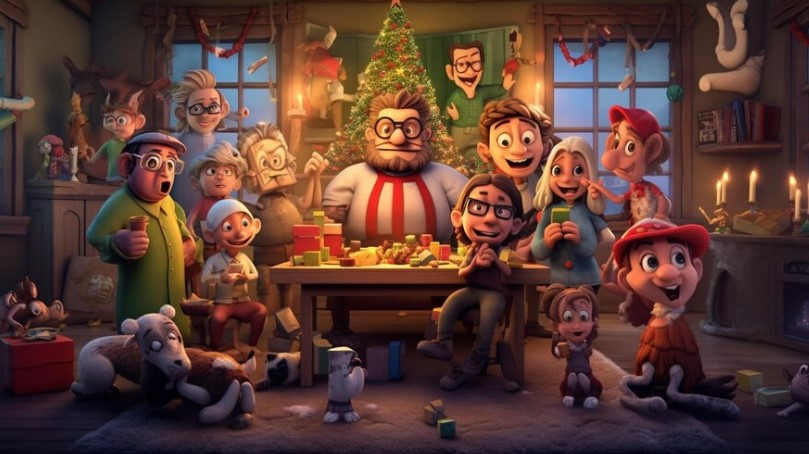

Have you ever wondered why animated Christmas movies are such a fantastic idea for spreading festive joy? Well, let us tell you, there’s something truly magical about them that can light up your holiday season.

- **Nostalgia and family traditions:** Remember those cozy evenings from your childhood when you snuggled up with your family, waiting eagerly for your favorite animated Christmas movie to start? When those familiar characters appeared on the screen, you instantly connected to cherished memories.

- **The art of building anticipation and excitement:** You can almost feel the excitement building in the room as you gather your loved ones around. It’s eagerly waiting to see what adventures the characters will embark upon and what lessons they’ll learn. 

- **Foster a sense of togetherness:** When you sit together and see the characters overcome challenges, learn valuable lessons. It would find you and your loved ones together and share in this journey with a feeling of warmth.

## **Top 30 Animated Christmas Movies to Watch with Family**

### **1\. A Charlie Brown Christmas (1965)**

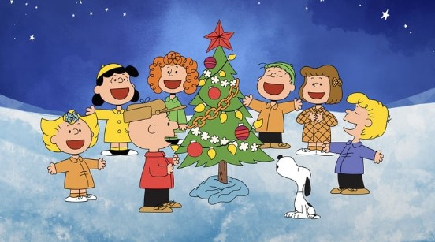

Voice cast: Peter Robbins, Christopher Shea, Tracy Stratford, Cathy Steinberg, Chris Doran

In “A Charlie Brown Christmas”, you’ll discover a timeless treasure that brings the holiday right to you. As soon as you join Charlie Brown and his friends as they navigate the joys and challenges of the season. It will remind you of the true meaning of Christmas. 

Through Charlie’s quest to find the perfect tree and Linus’ heartwarming speech, you’ll feel a warm connection to the characters. 

**Where to watch**: [Amazon Prime Video](https://www.amazon.com/Charlie-Brown-Christmas-Ann-Altieri/dp/B015X7G3P0/)

### **2\. How the Grinch Stole Christmas! (1966)**

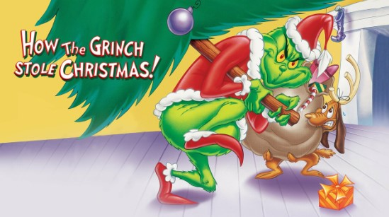

Voice cast: Boris Karloff, June Foray, Dallas McKennon, Thurl Ravenscroft 

“How the Grinch Stole Christmas!” is about the Grinch, a curmudgeonly character who learns the true meaning of Christmas through his encounters with the Whos of Whoville. 

As you watch him transform from a holiday hater to someone who embraces the spirit of the season, you’ll feel your heart grow three sizes. Get ready to be swept up in the magic and emotions of this festive classic.

**Where to watch:** [Amazon Prime Video](https://www.amazon.com/How-Grinch-Stole-Christmas-Ultimate/dp/B07HSW2HGT/)

### **3\. Frosty the Snowman (1969)**

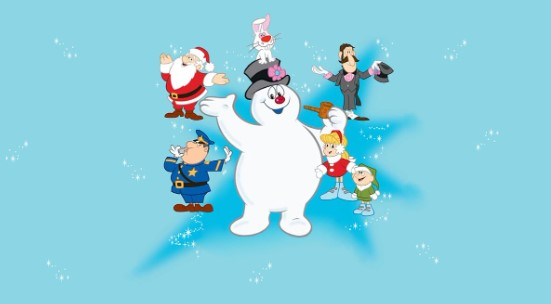

Voice cast: Jimmy Durante, Billy De Wolfe, Jackie Vernon

Let’s get on a journey with Frosty on “Frosty the Snowman”, a wonderful Christmas amination. 

As you follow Frosty’s journey, you’ll share in the joy and wonder he brings to the children around him. Through ups and downs, you’ll feel a deep connection to the characters and the spirit of the season.

**Where to watch:** [Amazon Prime Video](https://www.amazon.com/Frosty-Snowman-Jimmy-Durante/dp/B018T0J5WQ/)

### **4\. The Polar Express (2004)**

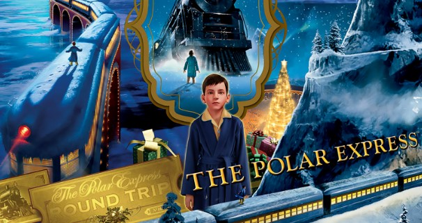

Voice cast: Tom Hanks , Nona Gaye , Peter Scolari and Michael Jeter

When you watch “The Polar Express” (2004), you’re in for an enchanting ride that takes you on a magical journey to the North Pole. From the moment you step aboard the mystical train, you’ll feel the excitement as the story unfolds. 

In addition, when you follow the young boy’s adventure to meet Santa Claus, you’ll be swept up in a tale of belief and discovery. 

**Where to watch:** [Amazon Prime Video](https://www.amazon.com/Polar-Express-Tom-Hanks/dp/B0C558RPGL/) 

### **5\. Frozen (2013)**

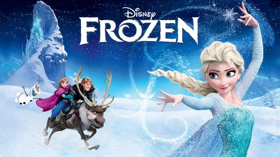

Voice cast: Kristen Bell, Idina Menzel, Jonathan Groff

Are you ready to be swept away by the tale of “Frozen?” Following sisters Elsa and Anna as they navigate a frosty kingdom and gradually unveil Elsa’s magical ice powers. 

In snowflakes and lovely songs, you’ll witness Elsa’s breathtaking ice palace and the heartwarming tale of Olaf – a lovable snowman. And you’re reminded of the strength of family bonds and the beauty of a world where love conquers all.

**Where to watch:** [Amazon Prime Video](https://www.amazon.com/Frozen-Plus-Bonus-Features-Kristen/dp/B00HV2KU5A/)  

### **6\. Mickey’s Christmas Carol (1983)**

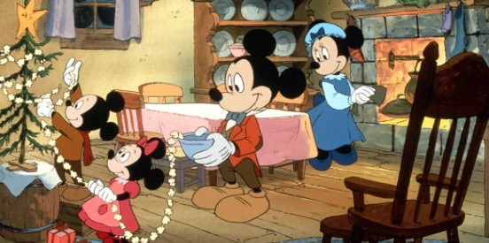

Voice cast: Alan Young, Wayne Allwine, Hal Smith, Will Ryan

“Mickey’s Christmas Carol” offers a heartwarming twist on a classic tale. With beloved Disney characters taking on iconic roles, you’ll be whisked into a world of holiday magic.

The nostalgic, animated Christmas move and familiar voices will create a comforting atmosphere. It is time for you to follow Scrooge’s transformation and experience a mix of emotions, from laughter to empathy.

**Where to watch:** [Amazon Prime Video](https://www.amazon.com/Mickeys-Christmas-Carol-Alan-Young/dp/B09HZDYHRC/)

### **7\. Arthur Christmas (2011)**

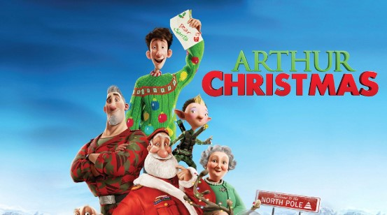

Voice cast: James McAvoy, Jim Broadbent, Bill Nighy, and more

“Arthur Christmas” is a delightful animated holiday film that takes you on a heartwarming adventure. From the beginning, you will be excited as Arthur, Santa’s clumsy but earnest son, embarks on a mission to save Christmas.  

Moreover, when you see Arthur’s determination to deliver a missed present, you’ll experience the true spirit that the movie wants to inspire you and your kids. 

**Where to watch:** [Amazon Prime Video](https://www.amazon.com/Arthur-Christmas-James-McAvoy/dp/B009SQQRH2/) 

### **8\. The Spirit of Christmas (1995)**

Voice cast: Trey Parker and Matt Stone

In “The Spirit of Christmas” (1995), from the moment you start watching, you’ll be drawn into a world of magic and romance. The story follows a woman who encounters a charming ghost in a historic inn. 

In the film, you will witness their unique connection develop and feel a mixture of emotions, from curiosity to warmth. Let this film remind you that love knows no boundaries, even beyond this world.

**Where to watch:** [IMDb](https://www.imdb.com/title/tt0122264/)

### **9\. The Snowman and the Snowdog (2012)**

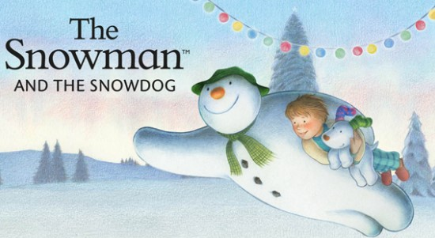

Voice cast: Raymond Briggs

“The Snowman and the Snowdog” (2012) tells a heartwarming story about the beautiful friendship between a young boy, a snowman, and a playful snowdog. The enchanting animation will immerse you in their world. 

Throughout their adventures, you’ll feel the joys of discovery, the warmth of companionship, and the gentle tug of bittersweet moments. 

**Where to watch** [IMDb](https://www.imdb.com/title/tt2560206/)

### **10\. The Muppet Christmas Carol (1992)**

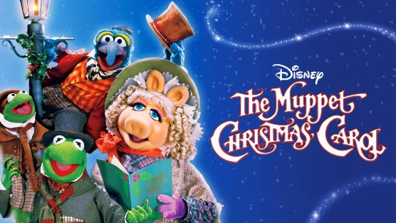

Voice cast: Michael Caine, Steve Whitmire, Frank Oz, and Dave Goelz

Have you ever imagined how animals celebrate Christmas? That’s precisely what you’ll experience in The Muppet Christmas Carol (1992). You’re drawn into the Muppets’ unique retelling of the classic Dickens tale from the first scene. 

As you join Scrooge on his transformative journey, you’ll feel a sense of empathy and redemption. The lovable characters will create a festive atmosphere that envelops you this Christmas.

**Where to watch:** [Amazon Prime Video](https://www.amazon.com/Muppet-Christmas-Carol-Dave-Goelz/dp/B008Y7IFSA/) 

### **11\. Prep & Landing (2009)**

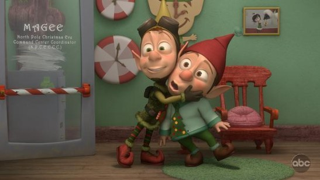

Voice cast: David Foley, Sarah Chalke, Mason Cotton, David DeLuise

“Prep & Landing” (2009) is a delightful holiday adventure that brings you into the world of Santa’s secret helpers. In the film, you’re taken on a fun and heartwarming journey alongside Wayne and Lanny, two energetic elves with a special job. 

This animated Christmas movie will make you feel like you’re part of the mission. Beyond this, you will learn how teamwork and determination make the season brighter. 

**Where to watch:** [IMDb](https://www.imdb.com/title/tt1474311/)

### **12\. A Christmas Carol (2009)**

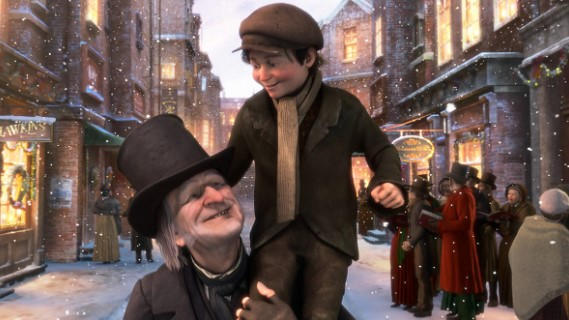

Voice cast: Jim Carrey, Gary Oldman, Colin Firth, and Bob Hoskins

Ready to fuel up your heart with “A Christmas Carol” (2009), a captivating Christmas movie animated. Watching this film, you’ll be transported into Ebenezer Scrooge’s world, feeling his coldness and witnessing his transformation. 

As you follow Scrooge’s past, present, and future journey, you’ll feel sadness and hope. This film also teaches you the importance of compassion and the magic of redemption.

**Where to watch:** [Amazon Prime Video](https://www.amazon.com/Disneys-Christmas-Carol-Jim-Carrey/dp/B004EK926K/)

### **13\. The Gruffalo’s Child (2011)**

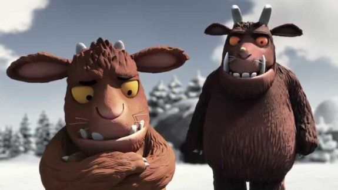

“The Gruffalo’s Child” (2011) welcomes you into a captivating world of curiosity and bravery. As you journey alongside Gruffalo’s child, you’ll feel a sense of wonder and excitement. 

The characters you meet, including the clever mouse, bring the story to life. Also, this film is a reminder that curiosity and courage can lead to unexpected and heartwarming discoveries.

**Where to watch:** [Amazon Prime Video](https://www.amazon.com/Gruffalos-Child-Robbie-Coltrane/dp/B0B65STMNS/) 

### **14\. Santa Claus Is Comin’ to Town (1970)**

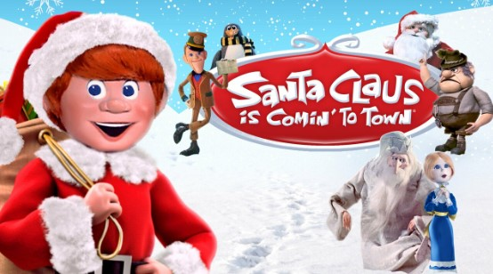

Voice cast: Fred Astaire, Mickey Rooney, Keenan Wynn

“Santa Claus Is Comin’ to Town” (1970) brings you a joyful journey into the origins of Santa Claus. 

The characters are nice and kind, and specifically, the film delivers a meaningful message that spreading happiness and love is what makes Christmas truly special. That’s why it is perfect for your family to watch this season. 

**Where to watch:** [Amazon Prime Video](https://www.amazon.com/Santa-Claus-Comin-Town-Astaire/dp/B00AH70BKA/)

### **15\. The Year Without a Santa Claus (1974)**

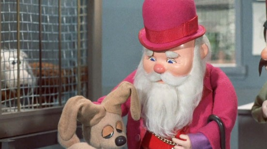

Voice cast: Mickey Rooney, Shirley Booth, Dick Shawn

Have you ever wondered what would happen if Santa decided not to deliver presents? That’s the premise of “The Year Without a Santa Claus” (1974), a Christmas animated movie that takes you on a journey to save Christmas. 

You’ll meet characters like Mrs. Claus and the Heat Miser and Snow Miser brothers. This film brings out the magic of the season and teaches you that even in tough times, the joy of Christmas can shine through.

**Where to watch:** [Amazon Prime Video](https://www.amazon.com/Year-Without-Santa-Claus/dp/B08MD29NYD/)

### **16\. The Nutcracker Prince (1990)**

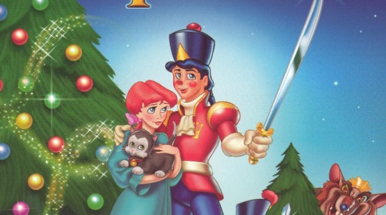

Voice cast: Toby Harper and Joshua Zamrycki

Prepare to be attracted to “The Nutcracker Prince” (1990), a wonderful Christmas movie for you and all your kids. When you engage in this story of Clara and her beloved Nutcracker on an adventurous journey, you will discover a world of enchantment. 

Besides, As you witness their quest to break the curse, you’ll feel a sense of wonder and excitement. 

**Where to watch:** [Amazon Prime Video](https://www.amazon.com/Nutcrackers-Toby-Harper/dp/B00AXZ8YIM/)

### **17\. Beauty and the Beast: The Enchanted Christmas (1997)**

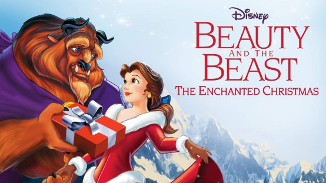

Voice cast: David Ogden Stiers, Robby Benson

If you are a big fan of Christmas animated films, this movie is a delightful choice you cannot miss. This movie will bring you back to the magical world of Belle and the Beast as they celebrate their first Christmas together.

The film’s familiar characters will give you a variety of feelings, from nostalgia to hope. So, why not choose this film to watch with your little kids and enjoy the magic coming to life?

**Where to watch:** [Amazon Prime Video](https://www.amazon.com/Beauty-Beast-Enchanted-Paige-OHara/dp/B012F6V71W/)

### **18\. The Flight Before Christmas (2008)**

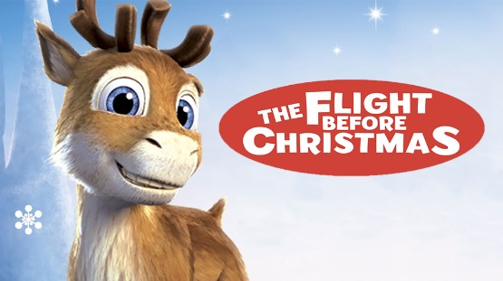

Voice cast: Emma Roberts, Norm Macdonald, Olli Jantunen

“The Flight Before Christmas” (2008) is about the journey of a young reindeer named Niko, who dreams of joining Santa’s sleigh team. As you watch Niko overcome challenges and make new friends, you’ll feel excitement and empathy. 

This delightful tale reminds you that perseverance and friendship can lead to the most magical of achievements.

**Where to watch:** [Amazon Prime Video](https://www.amazon.com/Little-Mermaid-Rene-Auberjonois/dp/B07MG7VNKF/)

### **19\. Annabelle’s Wish (1997)**

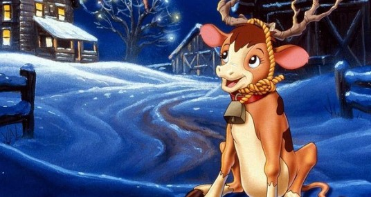

Voice cast: Randy Travis, Jay Johnson, Jerry Van Dyke

Let’s cherish your holiday by watching an animated Christmas movie. Then “Annabelle’s Wish” (1997) is your perfect pick. The movie will transport you to a cozy farm where a young calf named Annabelle dreams of being a reindeer.

Annabelle’s journey and her friendship with a young boy are so attractive, they will lift up your mood and give you an emotional experience, from laughter to sentiment. 

**Where to watch:** [Amazon Prime Video](https://www.amazon.com/Annabelles-Wish-Randy-Travis/dp/B08LDPXLZN/)

### **20\. Santa’s Apprentice (2010)**

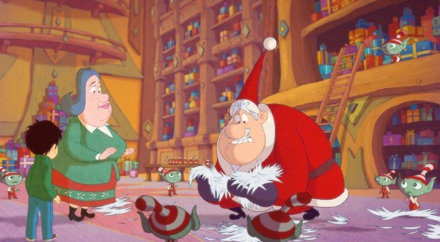

Voice cast: Julie Gayet, Jean-Pierre Marielle, Lorànt Deutsch, Bruno Salomone

In “Santa’s Apprentice” (2010), you’ll follow a young boy named Nicholas as he dreams of becoming Santa’s successor. The film’s charming animation creates a joyful atmosphere. 

When you watch Nicholas’ adventures and his bond with a seasoned Santa, you’ll feel a range of emotions, from excitement to empathy. Through its touching message, this uplifting story teaches you determination and kindness. 

**Where to watch:** [IMDb](https://www.imdb.com/title/tt1754455/) 

### **21\. The Christmas Toy (1986)**

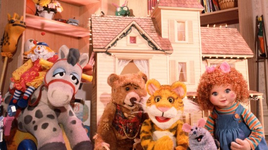

Voice cast: Dave Goelz, Steve Whitmire, Kathryn Mullen, Jerry Nelson

Ready for a magical trip down memory lane? Let’s enter “The Christmas Toy” (1986), where toys come to life when humans aren’t around. You’ll join Rugby the Tiger, who’s worried about being replaced as Christmas approaches. 

This timeless movie reminds you of the special place toys hold in our hearts, making it a cherished holiday classic.

**Where to watch:** [Amazon Prime Video](https://www.amazon.com/Christmas-Toy-Dave-Goelz/dp/B07ZPG2WC5/)

### **22\. The Smurfs: A Christmas Carol (2011)**

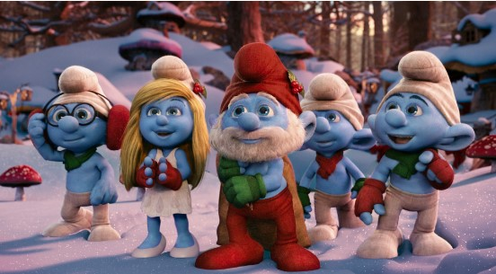

Voice cast: Jack Angel, Fred Armisen, Hank Azaria, and Gary Basaraba

If you’re looking for a heartwarming holiday movie, “The Smurfs: A Christmas Carol” from 2011 might be just right for you. In this film, you’ll follow the lovable Smurfs as they bring their own spin to the classic tale of Ebenezer Scrooge.

You’ll see Grouchy Smurf in the role of Scrooge, learning the true meaning of Christmas with the help of some blue friends. With its familiar characters and a message that warms your heart, it’s a delightful way to get into the holiday spirit.

**Where to watch:** [Amazon Prim](https://www.amazon.com/Smurfs-Christmas-Carol-Jack-Angel/dp/B00FWLKO1W/)[e](https://www.amazon.com/Smurfs-Christmas-Carol-Jack-Angel/dp/B00FWLKO1W/) [Video](https://www.amazon.com/Smurfs-Christmas-Carol-Jack-Angel/dp/B00FWLKO1W/)

### **23\. Mickey’s Once Upon a Christmas (1999)**

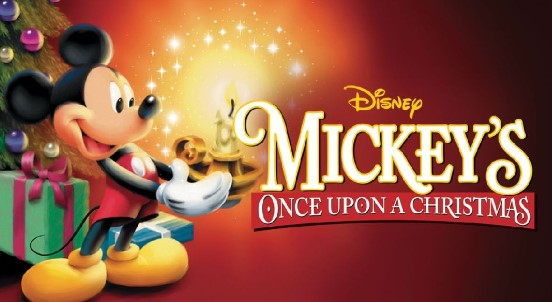

Voice cast: Wayne Allwine, Russi Taylor, Kelsey Grammer

Are you searching for a Christmas animated movie? “Mickey’s Once Upon a Christmas”  is a great choice. This film weaves together three heartwarming stories featuring Mickey Mouse and his pals. 

You’ll laugh as Goofy tries to create a perfect Christmas and feel the warmth as Mickey and Minnie exchange gifts. The tales will teach you about the magic of giving and the importance of friends.  

**Where to watch:** [Amazon Prime Video](https://www.amazon.com/Mickeys-Once-Christmas-Kelsey-Grammer/dp/B00D8GZPKS/)

### **24\. Nestor, the Long-Eared Christmas Donkey (1977)**

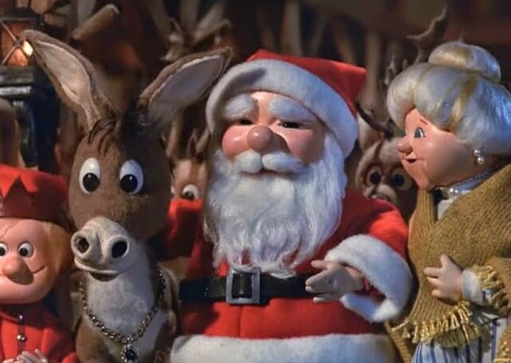

Voice cast: Roger Miller, Brenda Vaccaro, and Paul Frees

Whether you’re seeking a Christmas movie animated for your kids or a movie to lift your mood, “Nestor, the Long-Eared Christmas Donkey” is always a charming option for you.

Despite his differences, Nestor becomes an unexpected hero, carrying Mary and Joseph on the road to Bethlehem. You’ll find warmth and inspiration by following Nestor’s journey, making it a perfect addition to your holiday watchlist.

**Where to watch:** [Amazon Prime Video](https://www.amazon.com/Nestor-Christmas-Donkey-Roger-Miller/dp/B08PKDVQD1/)

### **25\. The Legend of Frosty the Snowman (2005)**

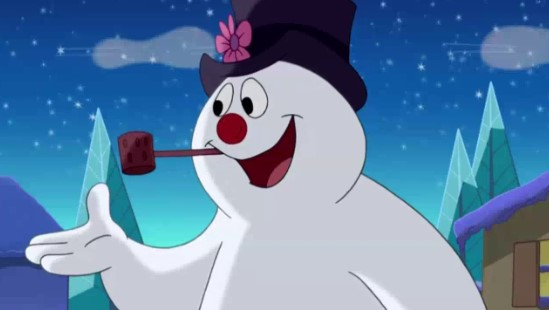

Voice cast: Burt Reynolds, Jeannie Elias, and Bill Fagerbakke

“The Legend of Frosty the Snowman” from 2005 is a great pick for you. This charming movie takes you to the magical town of Evergreen, where Frosty comes to life again. 

Furthermore, the movie features colorful animation and catchy songs to attract your little kids. So, let’s turn on your TV and sit around with your kids to enjoy this masterpiece for a festive holiday. 

**Where to watch:** [Amazon Prime Video](https://www.amazon.com/Legend-Frosty-Snowman-Jeannie-Elias/dp/B09KPNWFHZ/) 

### **26\. A Chipmunk Christmas (1981)**

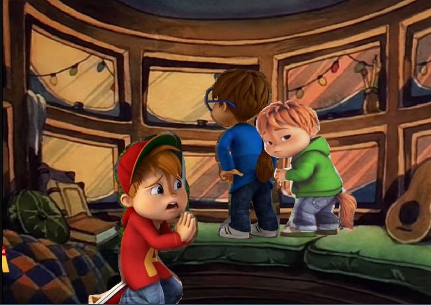

Voice cast: Ross Bagdasarian and Janice Karman

Merry Christmas! Today, let’s head to an incredible Christmas animation to enjoy on your long days off. “A Chipmunk Christmas” absolutely brings you joy. This film is about Alvin, Simon, and Theodore as they try to make a sick boy’s Christmas wish come true.

With catchy tunes and heartfelt moments, you’ll join them on a musical adventure full of friendship and warmth. 

**Where to watch:** [Amazon Prime Video](https://www.amazon.com/Alvin-Chipmunks-Christmas-Ross-Bagdasarian/dp/B00GNRDBVO/) 

### **27\. A Very Merry Cricket (1973)**

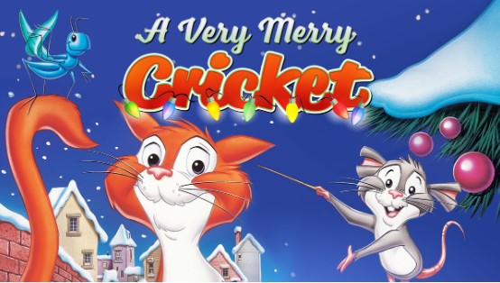

Voice: Griffin Gluck, Lauren Graham, Rob Riggle

Let’s go to “A Very Merry Cricket” from 1973 – a delightful movie to watch with your family. This film introduces you to Chester Cricket, a musical insect, as he discovers the true meaning of Christmas in New York City. 

Through their journey, you’ll feel the warmth of the holiday spirit and the joy of coming together.

**Where to watch:** [Amazon Prime Video](https://www.amazon.com/Chuck-Jones-Collection-Merry-Cricket/dp/B07Z47S478/)

### **28\. The Swan Princess Christmas (2012)**

Voice cast: Yuri Lowenthal, Summer Eguchi

“The Swan Princess Christmas” from 2012 is a magic movie that could enchant you. In this animated Christmas movie, you’ll reunite with Princess Odette and Prince Derek as they celebrate their first Christmas together. 

Through this movie, you’ll see the power of unity and courage. With its captivating animation and heartwarming moments, this film weaves a story of hope and togetherness.

**Where to watch:** [Amazon Prime Video](https://www.amazon.com/Swan-Princess-Christmas-Elle-Deets/dp/B00AZM5Y9K/)

### **29\. The Magic Snowflake (2013)**

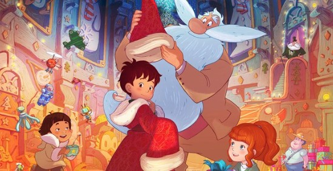

Voice cast: Tristan Mackid, Robyn Slade

The Magic Snowflake is a wonderful option. With his friends and determination, he faces challenges and discovers the importance of believing in himself. 

The film’s charming animation and heartfelt story will warm your heart. Through twists and turns, you’ll find lessons about courage and the true excitement of the season.

**Where to watch:** [IMDb](https://www.imdb.com/title/tt3332410/)

### **30\. Frosty Returns (1992)**

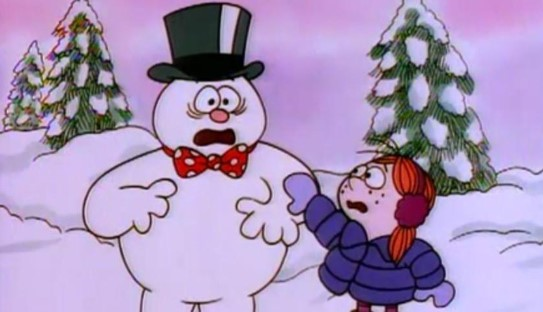

Voice cast: Jonathan Winters, John Goodman

If you’re interested in a different Frosty tale, “Frosty Returns” might intrigue you. In this unique story, you’ll join Frosty and a girl named Holly as they navigate a town facing some troubles. 

With its message about environmental responsibility, this film teaches you about making a difference. If you’re curious about a modern twist on a classic character, “Frosty Returns” could be a cozy holiday choice for you!

**Where to watch:** [IMDb](https://www.imdb.com/title/tt0106973/)

## **Bottom Line**

In the twinkle of every animated frame, these 30 **animated Christmas movies** have woven a tapestry of holiday enchantment. They’ve kindled the season’s spirit from heartwarming stories to whimsical adventures. Therefore, why not choose a movie accompanying your childhood and watch it with your family during Christmas? It would be a great idea to make your family’s bond closer. Now, let the glow of these captivating tales light up your holidays and spark the excitement that makes this time of year truly special.

**_See More:_**

- Noteable [Scary Christmas Movies](https://avada.io/loveable/blog/scary-christmas-movies/)

- Best [Claymation Christmas Movies](https://avada.io/loveable/blog/claymation-christmas-movies/)

- [Why Animated Christmas Movie is a Great Idea to Spread Festive Joy?](https://avada.io/loveable/blog/animated-christmas-movies/#wp-block-heading-2-3)
- [Top 30 Animated Christmas Movies to Watch with Family](https://avada.io/loveable/blog/animated-christmas-movies/#wp-block-heading-2-9)
    - [1\. A Charlie Brown Christmas (1965)](https://avada.io/loveable/blog/animated-christmas-movies/#wp-block-heading-3-10)
    - [2\. How the Grinch Stole Christmas! (1966)](https://avada.io/loveable/blog/animated-christmas-movies/#wp-block-heading-3-16)
    - [3\. Frosty the Snowman (1969)](https://avada.io/loveable/blog/animated-christmas-movies/#wp-block-heading-3-22)
    - [4\. The Polar Express (2004)](https://avada.io/loveable/blog/animated-christmas-movies/#wp-block-heading-3-28)
    - [5\. Frozen (2013)](https://avada.io/loveable/blog/animated-christmas-movies/#wp-block-heading-3-34)
    - [6\. Mickey’s Christmas Carol (1983)](https://avada.io/loveable/blog/animated-christmas-movies/#wp-block-heading-3-40)
    - [7\. Arthur Christmas (2011)](https://avada.io/loveable/blog/animated-christmas-movies/#wp-block-heading-3-46)
    - [8\. The Spirit of Christmas (1995)](https://avada.io/loveable/blog/animated-christmas-movies/#wp-block-heading-3-52)
    - [9\. The Snowman and the Snowdog (2012)](https://avada.io/loveable/blog/animated-christmas-movies/#wp-block-heading-3-58)
    - [10\. The Muppet Christmas Carol (1992)](https://avada.io/loveable/blog/animated-christmas-movies/#wp-block-heading-3-64)
    - [11\. Prep & Landing (2009)](https://avada.io/loveable/blog/animated-christmas-movies/#wp-block-heading-3-70)
    - [12\. A Christmas Carol (2009)](https://avada.io/loveable/blog/animated-christmas-movies/#wp-block-heading-3-76)
    - [13\. The Gruffalo’s Child (2011)](https://avada.io/loveable/blog/animated-christmas-movies/#wp-block-heading-3-82)
    - [14\. Santa Claus Is Comin’ to Town (1970)](https://avada.io/loveable/blog/animated-christmas-movies/#wp-block-heading-3-87)
    - [15\. The Year Without a Santa Claus (1974)](https://avada.io/loveable/blog/animated-christmas-movies/#wp-block-heading-3-93)
    - [16\. The Nutcracker Prince (1990)](https://avada.io/loveable/blog/animated-christmas-movies/#wp-block-heading-3-99)
    - [17\. Beauty and the Beast: The Enchanted Christmas (1997)](https://avada.io/loveable/blog/animated-christmas-movies/#wp-block-heading-3-105)
    - [18\. The Flight Before Christmas (2008)](https://avada.io/loveable/blog/animated-christmas-movies/#wp-block-heading-3-111)
    - [19\. Annabelle’s Wish (1997)](https://avada.io/loveable/blog/animated-christmas-movies/#wp-block-heading-3-117)
    - [20\. Santa’s Apprentice (2010)](https://avada.io/loveable/blog/animated-christmas-movies/#wp-block-heading-3-123)
    - [21\. The Christmas Toy (1986)](https://avada.io/loveable/blog/animated-christmas-movies/#wp-block-heading-3-129)
    - [22\. The Smurfs: A Christmas Carol (2011)](https://avada.io/loveable/blog/animated-christmas-movies/#wp-block-heading-3-135)
    - [23\. Mickey’s Once Upon a Christmas (1999)](https://avada.io/loveable/blog/animated-christmas-movies/#wp-block-heading-3-141)
    - [24\. Nestor, the Long-Eared Christmas Donkey (1977)](https://avada.io/loveable/blog/animated-christmas-movies/#wp-block-heading-3-147)
    - [25\. The Legend of Frosty the Snowman (2005)](https://avada.io/loveable/blog/animated-christmas-movies/#wp-block-heading-3-153)
    - [26\. A Chipmunk Christmas (1981)](https://avada.io/loveable/blog/animated-christmas-movies/#wp-block-heading-3-159)
    - [27\. A Very Merry Cricket (1973)](https://avada.io/loveable/blog/animated-christmas-movies/#wp-block-heading-3-165)
    - [28\. The Swan Princess Christmas (2012)](https://avada.io/loveable/blog/animated-christmas-movies/#wp-block-heading-3-171)
    - [29\. The Magic Snowflake (2013)](https://avada.io/loveable/blog/animated-christmas-movies/#wp-block-heading-3-177)
    - [30\. Frosty Returns (1992)](https://avada.io/loveable/blog/animated-christmas-movies/#wp-block-heading-3-183)
- [Bottom Line](https://avada.io/loveable/blog/animated-christmas-movies/#wp-block-heading-2-189)

### [Blake Simpson](https://avada.io/loveable/author/blake/)

Hi, I'm Blake from Loveable. I help people find perfect gifts for occasions like anniversaries and weddings. I also write a blog about holidays, sharing insights to make them more meaningful. Let's create unforgettable moments together!

- [Twitter](https://twitter.com/intent/tweet)
- [Facebook](https://www.facebook.com/sharer/sharer.php)
- [instagram](https://avada.io/loveable/blog/animated-christmas-movies/)
- [pinterest](https://www.pinterest.com/loveablellc/)

## Related Posts

[### 120+ Christian Birthday Wishes To Spread Your Love](https://avada.io/loveable/blog/christian-birthday-wishes/) 

[

### 35 Best 70th Birthday Ideas To Celebrate The Special Milestone

](https://avada.io/loveable/blog/70th-birthday-ideas/)

[

### 50 Best 30th Birthday Decorations for a Remarkable Birthday Bash

](https://avada.io/loveable/blog/30th-birthday-decorations/)

[

### 40 Delicious Vegan Christmas Desserts to Delight Your Palate

](https://avada.io/loveable/blog/vegan-christmas-desserts/)

[

### 60 Christmas Team Building Activities to Boost Workplace Spirit

](https://avada.io/loveable/blog/christmas-team-building-activities/)
