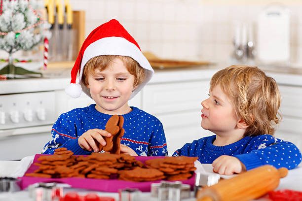

This article has been written and researched by our expert Loveable through a precise methodology. [Learn more about our methodology](https://avada.io/loveable/our-methodological.html)

[Loveable](https://avada.io/loveable/) > [Blog](https://avada.io/loveable/blog/) > [Holiday](https://avada.io/loveable/holiday/)

# 30 Christmas Activities for Kindergarten to Spark Holiday Joy

Written by [Blake Simpson](https://avada.io/loveable/author/blake/) Last Updated on September 26, 2023

- [30 Christmas Activities for Kindergarten to Create Holiday Memories](https://avada.io/loveable/blog/christmas-activities-for-kindergarten/#wp-block-heading-2-2)
    - [1\. Reindeer Paper Craft](https://avada.io/loveable/blog/christmas-activities-for-kindergarten/#wp-block-heading-3-3)
    - [2\. Christmas Race to Fill](https://avada.io/loveable/blog/christmas-activities-for-kindergarten/#wp-block-heading-3-6)
    - [3\. Christmas Tree Noodle Craft](https://avada.io/loveable/blog/christmas-activities-for-kindergarten/#wp-block-heading-3-10)
    - [4\. Make December Boom Cards](https://avada.io/loveable/blog/christmas-activities-for-kindergarten/#wp-block-heading-3-13)
    - [5\. Make Christmas Slime](https://avada.io/loveable/blog/christmas-activities-for-kindergarten/#wp-block-heading-3-17)
    - [6\. Candy Cane Writing](https://avada.io/loveable/blog/christmas-activities-for-kindergarten/#wp-block-heading-3-20)
    - [7\. Pine Cone Tree Craft](https://avada.io/loveable/blog/christmas-activities-for-kindergarten/#wp-block-heading-3-23)
    - [8\. Christmas Wish List!](https://avada.io/loveable/blog/christmas-activities-for-kindergarten/#wp-block-heading-3-27)
    - [9\. Christmas Learning Book](https://avada.io/loveable/blog/christmas-activities-for-kindergarten/#wp-block-heading-3-30)
    - [10\. Peppermint Mocha Sensory Bin](https://avada.io/loveable/blog/christmas-activities-for-kindergarten/#wp-block-heading-3-33)
    - [11\. Christmas Play Dough Tray!](https://avada.io/loveable/blog/christmas-activities-for-kindergarten/#wp-block-heading-3-36)
    - [12\. Fork-printed Christmas Trees](https://avada.io/loveable/blog/christmas-activities-for-kindergarten/#wp-block-heading-3-39)
    - [13\. Stocking Name Craft](https://avada.io/loveable/blog/christmas-activities-for-kindergarten/#wp-block-heading-3-43)
    - [14\. Christmas Sweater Activity](https://avada.io/loveable/blog/christmas-activities-for-kindergarten/#wp-block-heading-3-47)
    - [15\. Make Bow Art](https://avada.io/loveable/blog/christmas-activities-for-kindergarten/#wp-block-heading-3-50)
    - [16\. Make Christmas Bracelets](https://avada.io/loveable/blog/christmas-activities-for-kindergarten/#wp-block-heading-3-53)
    - [17\. Christmas Writing Tray](https://avada.io/loveable/blog/christmas-activities-for-kindergarten/#wp-block-heading-3-56)
    - [18\. Wreath Letter Match](https://avada.io/loveable/blog/christmas-activities-for-kindergarten/#wp-block-heading-3-59)
    - [19\. Write Letters to Santa](https://avada.io/loveable/blog/christmas-activities-for-kindergarten/#wp-block-heading-3-62)
    - [20\. Santa Sensory](https://avada.io/loveable/blog/christmas-activities-for-kindergarten/#wp-block-heading-3-66)
    - [21\. Make Christmas Tree Word Families](https://avada.io/loveable/blog/christmas-activities-for-kindergarten/#wp-block-heading-3-69)
    - [22\. Ornament Counting Mats](https://avada.io/loveable/blog/christmas-activities-for-kindergarten/#wp-block-heading-3-72)
    - [23\. Christmas BINGO Game](https://avada.io/loveable/blog/christmas-activities-for-kindergarten/#wp-block-heading-3-75)
    - [24\. Gingerbread House Craft](https://avada.io/loveable/blog/christmas-activities-for-kindergarten/#wp-block-heading-3-78)
    - [25\. Shape Cookies Match](https://avada.io/loveable/blog/christmas-activities-for-kindergarten/#wp-block-heading-3-81)
    - [26\. Christmas Tree Sticker Art](https://avada.io/loveable/blog/christmas-activities-for-kindergarten/#wp-block-heading-3-84)
    - [27\. Jingle Bell STEM](https://avada.io/loveable/blog/christmas-activities-for-kindergarten/#wp-block-heading-3-87)
    - [28\. Christmas Candy Cane Counting](https://avada.io/loveable/blog/christmas-activities-for-kindergarten/#wp-block-heading-3-90)
    - [29\. Helping and Giving: Anchor Chart](https://avada.io/loveable/blog/christmas-activities-for-kindergarten/#wp-block-heading-3-93)
    - [30\. Christmas Bakery](https://avada.io/loveable/blog/christmas-activities-for-kindergarten/#wp-block-heading-3-96)
- [Bottom Line](https://avada.io/loveable/blog/christmas-activities-for-kindergarten/#wp-block-heading-2-99)

Kindergarten is a magical time in a child’s life, and what better way to make it even more enchanting than by celebrating Christmas? The holiday season brings a sense of wonder and excitement that’s perfect for young learners. In this guide, we’ve compiled **30 Christmas Activities For Kindergarten** that will ignite their holiday spirit and create cherished memories. Let’s share the joy of learning and celebrating this festive season!

## **30 Christmas Activities for Kindergarten to Create Holiday Memories**

### **1\. Reindeer Paper Craft**

Get those little hands busy with a reindeer paper craft activity. Kids can create their own reindeer friends With simple materials like brown construction paper, googly eyes, and red pom-poms. It’s a fun Christmas activity for Kindergarten to explore creativity while getting into the Christmas spirit.

### **2\. Christmas Race to Fill**

This entertaining kindergarten Christmas activity takes only basic classroom items, making prep easy! This project requires dot cubes, colored pom-poms, and Christmas-themed containers for each kid. Use a Christmas tree cake mold, cup, or tiny gift bag. Add gigantic tweezers for fine motor exercise.

Read more: [Christmas Race to Fill](https://www.theprintableprincess.com/christmas-activities-for-kindergarten/)

### **3\. Christmas Tree Noodle Craft**

In this Christmas-oriented activity centered around pasta, crafting meets the holiday. Allow children in kindergarten to make works of art based on Christmas trees by using various shaped pasta as decorations. They can add some personality to their Christmas artwork by painting and decorating their pasta trees.

### **4\. Make December Boom Cards**

Using December boom cards, you can integrate technology into the teaching and learning process. This crafting activity covers a variety of kindergarten abilities, from counting to letter recognition, and they do so in a way that is both amusing and suitable for the holiday season. Even during the hectic Christmas season, studying can feel like kids are having fun with boom cards.

Read more: [Make December Boom Cards](https://www.theprintableprincess.com/ultimate-guide-to-boom-cards/)

### **5\. Make Christmas Slime**

Slime is all the rage and can be transformed into a holiday-themed experience. Mix some Christmas slime with red and green colors, glitter, and tiny ornaments. Kids will love the sensory experience and creativity of crafting their Christmas slime.

### **6\. Candy Cane Writing**

You can make practicing your handwriting a fun activity with candy cane writing. Give each child a tray of sugar or salt and encourage them to use candy canes to write letters and words on the surface of the mixture. These Christmas activities your kids can make learning to recognize letters and improve writing abilities more fun and tactile.

### **7\. Pine Cone Tree Craft**

To make this, collect pine cones and have your kindergarteners paint them in some Christmas colors after you have finished collecting them. When you add a few tiny ornaments to the mix, you have a lovely [Christmas tree decoration](https://avada.io/loveable/blog/white-christmas-tree-decoration/) that serves as a creative project.

Read more: [Pine Cone Tree Craft](https://pjsandpaint.com/crafts/pinecone-christmas-tree-craft/)

### **8\. Christmas Wish List!**

Encourage children to get into the holiday spirit by having them write down their Christmas wish lists. Make sure to give them paper, markers, and stickers so that they can personalize their lists. It is a wonderful opportunity for kids to exercise their imaginations while also developing their writing skills and capacity for self-expression.

### **9\. Christmas Learning Book**

For this Christmas activity, you can combine learning and creativity by having kindergarteners create their own Christmas learning book. They can draw and write about their favorite holiday traditions, foods, and more. It’s a wonderful keepsake that captures the magic of the season.

### **10\. Peppermint Mocha Sensory Bin**

Engage the senses with a peppermint mocha sensory bin. You can guide your kids to fill a bin with coffee grounds, peppermint extract, and pretend play items like mugs, spoons, and cotton balls for whipped cream. Kindergarten kids can explore the textures and scents of this delightful Christmas-themed sensory experience.

### **11\. Christmas Play Dough Tray!**

Prepare a Christmas playdough tray with red and green playdough, cookie cutters with a holiday motif, and other Christmas-themed accessories like beads and googly eyes. Kindergarten students can use molds to make their holiday masterpieces, which will improve their fine motor skills and creative potential.

### **12\. Fork-printed Christmas Trees**

Transform ordinary forks into holiday tools for art. To show kindergarteners how to do this, you can dip forks into green paint and press them onto paper to create textured Christmas trees. Then, add ornaments and decorations with your fingertips or brushes/forks. It’s a simple yet engaging activity that yields beautiful results.

Get a tutorial here: [Fork-Printed Christmas Trees](https://www.thebestideasforkids.com/fork-painted-christmas-tree/)

### **13\. Stocking Name Craft**

Personalize the Christmas season with a stocking name craft. Provide paper stockings and plenty of craft supplies like stickers, markers, and glitter. Kindergarteners can decorate their stockings and practice writing their names, adding a personal touch to their holiday creations with this lovely activity.

Read more: [Stocking Name Craft](https://iheartcraftythings.com/christmas-stocking-craft.html)

### **14\. Christmas Sweater Activity**

Participating in a Christmas sweater activity is a fun way to embrace the tradition of wearing ugly sweaters. Paper, bits of cloth, and glue should be the materials that children use to make their own “ugly” holiday jumpers. Because it is a creative project, they can explore various textures and patterns while letting their imaginations run wild.

### **15\. Make Bow Art**

Wrap up the holiday fun with a bow art activity. Set out an assortment of colorful bows and let kindergarteners create their holiday-themed artwork. They can arrange the bows into shapes and patterns or make festive cards for loved ones.

### **16\. Make Christmas Bracelets**

Kick off the holiday spirit with a creative flair! Gather colorful beads, strings, and some Christmas-themed charms. Let your little ones design their own Christmas bracelets. It’s a fantastic activity that combines fine motor skills with holiday spirit. Plus, they can proudly wear their creations throughout the season.

### **17\. Christmas Writing Tray**

Give your kindergarten students a Christmas-themed writing activity to help them improve their skills. Encourage your kids to use their fingers to write letters and numbers, or design festive shapes by filling a tray with salt or sugar. Learning to write becomes a lot more fun due to the sensory experience that comes with it.

### **18\. Wreath Letter Match**

Make wreaths with letters written on them, then prepare tiny cards with pictures or words related to those letters. You can put your children to the test by having them match the cards to the appropriate wreaths. It is a fun and interactive activity to practice recognizing letters and improving vocabulary at Christmas.

### **19\. Write Letters to Santa**

Keep the tradition alive by helping your kids write heartfelt letters to Santa Claus. This Christmas activity for Kindergarten will encourage your kids to express their wishes, dreams, and gratitude. It’s not just about receiving gifts but also about the joy of sharing their thoughts with the jolly old man from the North Pole.

Read more: [Write Letters to Santa](https://www.abcya.com/games/write_a_letter_to_santa)

### **20\. Santa Sensory**

Engage their senses with a Santa-themed sensory bin. Fill a container with materials like rice, cotton balls, and small Christmas-themed objects. Let your children explore and play, encouraging them to find and identify the different items hidden within. It’s a sensory adventure that stimulates their curiosity.

### **21\. Make Christmas Tree Word Families**

Combine literacy with creativity by crafting Christmas tree word families. You can do that by providing paper and various decorations. And helping your kids write different word families on the tree branches. It’s a fantastic way to expand their vocabulary while having fun decorating.

### **22\. Ornament Counting Mats**

Math can be merry, too! Make counting mats for ornaments that include both numbers and spaces for the ornaments themselves. Your kindergarten students can determine the right number of decorations to place on each mat by counting them. Counting and learning numbers with this method is more of a hands-on experience at Christmas.

### **23\. Christmas BINGO Game**

Who doesn’t love a game of BINGO? You can personalize your BINGO cards by adding images or statements related to Christmas. A fun evening of BINGO can be had by inviting friends over or playing with your family. It is a wonderful method for generating excitement for the upcoming Christmas season.

### **24\. Gingerbread House Craft**

Let the creative juices flow with a gingerbread house craft project. This Christmas activity for kindergarten involves making your own templates with graham crackers, icing, and an assortment of candies. Building and decorating gingerbread houses is a cherished Christmas tradition that your kindergarteners will adore.

### **25\. Shape Cookies Match**

Baking cookies is a classic Christmas activity, but why not make it educational? Roll out cookie dough and cut it into different shapes. Then, have your little ones match the baked cookies to the corresponding shapes. It’s a tasty way to learn about shapes and practice matching skills through this helpful activity.

### **26\. Christmas Tree Sticker Art**

Stickers and creativity go hand in hand. Give your kindergarteners a blank Christmas tree outline and a variety of stickers. They can decorate the tree with stickers of ornaments, snowflakes, and more. It’s a simple yet delightful art project that lets their imagination run wild.

### **27\. Jingle Bell STEM**

Introduce your kids to the world of science, technology, engineering, and mathematics (STEM) with a jingle bell-themed activity. Use different-sized jingle bells and containers to explore the concepts of sound and size. When dropped into different containers, your little scientists can observe and compare each bell’s sounds.

### **28\. Christmas Candy Cane Counting**

Counting can be sweet! So, you can use candy canes as a fun math tool. For the Christmas activity for Kindergarten, you should create math problems or counting exercises using candy canes as visual aids. Not only will your kindergarteners enjoy the sweetness, but they’ll also strengthen their counting skills.

### **29\. Helping and Giving: Anchor Chart**

Teach your children the true spirit of Christmas by discussing the importance of giving and helping others. You can create an anchor chart with ideas for spreading kindness during the holiday season. This Christmas activity will encourage them to participate in acts of kindness, like making cards for nursing home residents or donating toys to a local charity.

### **30\. Christmas Bakery**

Wrap up your Christmas activity for Kindergarten with a baking extravaganza. Let your kindergarteners assist in the kitchen, whether decorating cookies, making cupcakes, or creating their special holiday treat. Baking together enhances their culinary skills and provides a delicious reward for all the holiday fun.

## **Bottom Line**

Christmas is an amazing time for discovery and joy, and these **30 Christmas Activities for Kindergarten** are designed to make the holiday season even more special for young learners. Each activity offers a unique blend of fun and learning, from crafting reindeer to exploring sensory bins. So, this holiday, let the season’s magic infuse your child’s kindergarten experience with unforgettable memories and valuable skills. Happy holiday time!

- [30 Christmas Activities for Kindergarten to Create Holiday Memories](https://avada.io/loveable/blog/christmas-activities-for-kindergarten/#wp-block-heading-2-2)
    - [1\. Reindeer Paper Craft](https://avada.io/loveable/blog/christmas-activities-for-kindergarten/#wp-block-heading-3-3)
    - [2\. Christmas Race to Fill](https://avada.io/loveable/blog/christmas-activities-for-kindergarten/#wp-block-heading-3-6)
    - [3\. Christmas Tree Noodle Craft](https://avada.io/loveable/blog/christmas-activities-for-kindergarten/#wp-block-heading-3-10)
    - [4\. Make December Boom Cards](https://avada.io/loveable/blog/christmas-activities-for-kindergarten/#wp-block-heading-3-13)
    - [5\. Make Christmas Slime](https://avada.io/loveable/blog/christmas-activities-for-kindergarten/#wp-block-heading-3-17)
    - [6\. Candy Cane Writing](https://avada.io/loveable/blog/christmas-activities-for-kindergarten/#wp-block-heading-3-20)
    - [7\. Pine Cone Tree Craft](https://avada.io/loveable/blog/christmas-activities-for-kindergarten/#wp-block-heading-3-23)
    - [8\. Christmas Wish List!](https://avada.io/loveable/blog/christmas-activities-for-kindergarten/#wp-block-heading-3-27)
    - [9\. Christmas Learning Book](https://avada.io/loveable/blog/christmas-activities-for-kindergarten/#wp-block-heading-3-30)
    - [10\. Peppermint Mocha Sensory Bin](https://avada.io/loveable/blog/christmas-activities-for-kindergarten/#wp-block-heading-3-33)
    - [11\. Christmas Play Dough Tray!](https://avada.io/loveable/blog/christmas-activities-for-kindergarten/#wp-block-heading-3-36)
    - [12\. Fork-printed Christmas Trees](https://avada.io/loveable/blog/christmas-activities-for-kindergarten/#wp-block-heading-3-39)
    - [13\. Stocking Name Craft](https://avada.io/loveable/blog/christmas-activities-for-kindergarten/#wp-block-heading-3-43)
    - [14\. Christmas Sweater Activity](https://avada.io/loveable/blog/christmas-activities-for-kindergarten/#wp-block-heading-3-47)
    - [15\. Make Bow Art](https://avada.io/loveable/blog/christmas-activities-for-kindergarten/#wp-block-heading-3-50)
    - [16\. Make Christmas Bracelets](https://avada.io/loveable/blog/christmas-activities-for-kindergarten/#wp-block-heading-3-53)
    - [17\. Christmas Writing Tray](https://avada.io/loveable/blog/christmas-activities-for-kindergarten/#wp-block-heading-3-56)
    - [18\. Wreath Letter Match](https://avada.io/loveable/blog/christmas-activities-for-kindergarten/#wp-block-heading-3-59)
    - [19\. Write Letters to Santa](https://avada.io/loveable/blog/christmas-activities-for-kindergarten/#wp-block-heading-3-62)
    - [20\. Santa Sensory](https://avada.io/loveable/blog/christmas-activities-for-kindergarten/#wp-block-heading-3-66)
    - [21\. Make Christmas Tree Word Families](https://avada.io/loveable/blog/christmas-activities-for-kindergarten/#wp-block-heading-3-69)
    - [22\. Ornament Counting Mats](https://avada.io/loveable/blog/christmas-activities-for-kindergarten/#wp-block-heading-3-72)
    - [23\. Christmas BINGO Game](https://avada.io/loveable/blog/christmas-activities-for-kindergarten/#wp-block-heading-3-75)
    - [24\. Gingerbread House Craft](https://avada.io/loveable/blog/christmas-activities-for-kindergarten/#wp-block-heading-3-78)
    - [25\. Shape Cookies Match](https://avada.io/loveable/blog/christmas-activities-for-kindergarten/#wp-block-heading-3-81)
    - [26\. Christmas Tree Sticker Art](https://avada.io/loveable/blog/christmas-activities-for-kindergarten/#wp-block-heading-3-84)
    - [27\. Jingle Bell STEM](https://avada.io/loveable/blog/christmas-activities-for-kindergarten/#wp-block-heading-3-87)
    - [28\. Christmas Candy Cane Counting](https://avada.io/loveable/blog/christmas-activities-for-kindergarten/#wp-block-heading-3-90)
    - [29\. Helping and Giving: Anchor Chart](https://avada.io/loveable/blog/christmas-activities-for-kindergarten/#wp-block-heading-3-93)
    - [30\. Christmas Bakery](https://avada.io/loveable/blog/christmas-activities-for-kindergarten/#wp-block-heading-3-96)
- [Bottom Line](https://avada.io/loveable/blog/christmas-activities-for-kindergarten/#wp-block-heading-2-99)

### [Blake Simpson](https://avada.io/loveable/author/blake/)

Hi, I'm Blake from Loveable. I help people find perfect gifts for occasions like anniversaries and weddings. I also write a blog about holidays, sharing insights to make them more meaningful. Let's create unforgettable moments together!

- [Twitter](https://twitter.com/intent/tweet)
- [Facebook](https://www.facebook.com/sharer/sharer.php)
- [instagram](https://avada.io/loveable/blog/christmas-activities-for-kindergarten/)
- [pinterest](https://www.pinterest.com/loveablellc/)

## Related Posts

[### 120+ Christian Birthday Wishes To Spread Your Love](https://avada.io/loveable/blog/christian-birthday-wishes/) 

[

### 35 Best 70th Birthday Ideas To Celebrate The Special Milestone

](https://avada.io/loveable/blog/70th-birthday-ideas/)

[

### 50 Best 30th Birthday Decorations for a Remarkable Birthday Bash

](https://avada.io/loveable/blog/30th-birthday-decorations/)

[

### 40 Delicious Vegan Christmas Desserts to Delight Your Palate

](https://avada.io/loveable/blog/vegan-christmas-desserts/)

[

### 60 Christmas Team Building Activities to Boost Workplace Spirit

](https://avada.io/loveable/blog/christmas-team-building-activities/)
