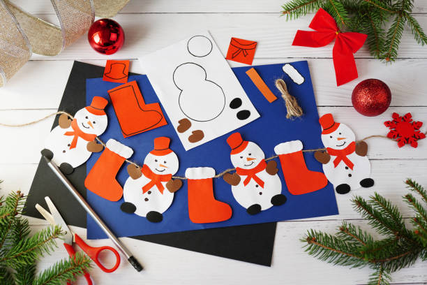

This article has been written and researched by our expert Loveable through a precise methodology. [Learn more about our methodology](https://avada.io/loveable/our-methodological.html)

[Loveable](https://avada.io/loveable/) > [Blog](https://avada.io/loveable/blog/) > [Holiday](https://avada.io/loveable/holiday/)

# 30+ Christmas Classroom Activities to Cheer Up The Holidays

Written by [Blake Simpson](https://avada.io/loveable/author/blake/) Last Updated on September 27, 2023

- [30+ Christmas Classroom Activities to Brighten the Holiday Season](https://avada.io/loveable/blog/christmas-classroom-activities/#wp-block-heading-2-2)
    - [1\. Santa Claus nose-pinching game](https://avada.io/loveable/blog/christmas-classroom-activities/#wp-block-heading-3-3)
    - [2\. Says Santa](https://avada.io/loveable/blog/christmas-classroom-activities/#wp-block-heading-3-6)
    - [3\. Clue hunt](https://avada.io/loveable/blog/christmas-classroom-activities/#wp-block-heading-3-10)
    - [4\. Christmas charades](https://avada.io/loveable/blog/christmas-classroom-activities/#wp-block-heading-3-13)
    - [5\. Snowman-making play tray](https://avada.io/loveable/blog/christmas-classroom-activities/#wp-block-heading-3-17)
    - [6\. Revamp a holiday favorite](https://avada.io/loveable/blog/christmas-classroom-activities/#wp-block-heading-3-21)
    - [7\. Santa Claus CD bauble](https://avada.io/loveable/blog/christmas-classroom-activities/#wp-block-heading-3-24)
    - [8\. Pictionary for the holidays](https://avada.io/loveable/blog/christmas-classroom-activities/#wp-block-heading-3-28)
    - [9\. Prepare holiday greetings](https://avada.io/loveable/blog/christmas-classroom-activities/#wp-block-heading-3-31)
    - [10\. Smell Christmas game](https://avada.io/loveable/blog/christmas-classroom-activities/#wp-block-heading-3-35)
    - [11\. How to play “Jingle Bells” on the piano](https://avada.io/loveable/blog/christmas-classroom-activities/#wp-block-heading-3-39)
    - [12\. Christmas tree bowling game](https://avada.io/loveable/blog/christmas-classroom-activities/#wp-block-heading-3-42) 
    - [13\. Ice skating pizza](https://avada.io/loveable/blog/christmas-classroom-activities/#wp-block-heading-3-46)
    - [14\. Donation jar](https://avada.io/loveable/blog/christmas-classroom-activities/#wp-block-heading-3-49)
    - [15\. Letter to Santa contest](https://avada.io/loveable/blog/christmas-classroom-activities/#wp-block-heading-3-52)
    - [16\. Composing holiday-themed tales](https://avada.io/loveable/blog/christmas-classroom-activities/#wp-block-heading-3-56)
    - [17\. Calculate using emojis](https://avada.io/loveable/blog/christmas-classroom-activities/#wp-block-heading-3-60)
    - [18\. Free printable holiday activity book](https://avada.io/loveable/blog/christmas-classroom-activities/#wp-block-heading-3-63)
    - [19\. Experiments in science for the holidays](https://avada.io/loveable/blog/christmas-classroom-activities/#wp-block-heading-3-66)
    - [20\. Fluffy snowflake artwork](https://avada.io/loveable/blog/christmas-classroom-activities/#wp-block-heading-3-70)
    - [21\. Arctic science competition with reindeer](https://avada.io/loveable/blog/christmas-classroom-activities/#wp-block-heading-3-73)
    - [22\. Make a snowglobe](https://avada.io/loveable/blog/christmas-classroom-activities/#wp-block-heading-3-76) 
    - [23\. Online holiday field trips](https://avada.io/loveable/blog/christmas-classroom-activities/#wp-block-heading-3-80)
    - [24\. Silver bell memory game](https://avada.io/loveable/blog/christmas-classroom-activities/#wp-block-heading-3-83)
    - [25\. Make holiday greeting cards](https://avada.io/loveable/blog/christmas-classroom-activities/#wp-block-heading-3-87)
    - [26\. Trivia about Christmas](https://avada.io/loveable/blog/christmas-classroom-activities/#wp-block-heading-3-91)
    - [27\. Toss in a holiday tale](https://avada.io/loveable/blog/christmas-classroom-activities/#wp-block-heading-3-95)
    - [28\. A seasonal disagreement](https://avada.io/loveable/blog/christmas-classroom-activities/#wp-block-heading-3-98)
    - [29\. Christmas tongue twisters](https://avada.io/loveable/blog/christmas-classroom-activities/#wp-block-heading-3-101)
    - [30\. Who am I? Christmas characters](https://avada.io/loveable/blog/christmas-classroom-activities/#wp-block-heading-3-105)
    - [31\. Bingo for the holidays](https://avada.io/loveable/blog/christmas-classroom-activities/#wp-block-heading-3-108)
    - [32\. Crafts for decorating and giving](https://avada.io/loveable/blog/christmas-classroom-activities/#wp-block-heading-3-111)
- [To Wrap It Up,](https://avada.io/loveable/blog/christmas-classroom-activities/#wp-block-heading-2-119)

The holiday season is upon us, and what better way to bring joy and excitement into your classroom than with some festive activities? In this blog post, we will show you over **30+ Christmas classroom activities** that will brighten up your students’ holidays. From creative games to educational crafts, these activities will engage your students in playing and teamwork with their classmates – make this holiday season one to remember.

## **30+ Christmas Classroom Activities to Brighten the Holiday Season**

### **1\. Santa Claus nose-pinching game**

Let’s kick things off with a fun and hilarious game that will make your students laugh. The Santa Claus Nose-Pinching Game is a twist on the classic “Pin the Tail on the Donkey.” Blindfold your students, hand them a red nose, and watch as they try to pin it on Santa’s face. It will be a fantastic activity at Christmas.

### **2\. Says Santa**

“Says Santa” is a game where students take turns being Santa and giving commands to the other students. If Santa says, “Wiggle like a reindeer,” the students must follow suit. If Santa forgets to say “Santa says” before a command, anyone who follows it is out. This Christmas classroom activity is a great way to keep your students active and entertained.

Read more: [Says Santa](https://theinspiredtreehouse.com/holiday-games-santa-says/)

### **3\. Clue hunt**

Get your students’ detective skills into action with a Christmas-themed clue hunt. Create a series of clues that lead to a hidden holiday surprise, like a small gift or a special treat. This activity encourages teamwork and problem-solving while adding an element of excitement to your classroom.

### **4\. Christmas charades**

Writing a list of things to do during the holidays on note cards or craft paper is a helpful classroom activity for kids at Christmas. If you want, you can have your kids write a few each day until you have a lot of them. If you don’t want to make charades, you can buy them online.

Read more: [Christmas Charades](https://www.whiteelephantrules.com/christmas-charades/)

### **5\. Snowman-making play tray**

Let your students get creative with a Snowman-Making Play Tray. Provide them with playdough, buttons, and scarves, and watch as they build their mini snowmen. It’s a hands-on Christmas classroom activity that allows for artistic expression and imagination.

Read more: [Snowman-Making Play Tray](https://www.powerfulmothering.com/build-a-snowman-activity-tray/)

### **6\. Revamp a holiday favorite**

Take a classic holiday story or song and give it a fresh twist. This Christmas activity encourages your students to rewrite a Christmas favorite with a new ending or a modern-day setting in the Classroom. It’s a great exercise in creativity and storytelling.

### **7\. Santa Claus CD bauble**

Get crafty with your students by making Santa Claus CD baubles. Have them paint old CDs to resemble Santa’s face, complete with a fluffy beard and red hat. These festive decorations can be hung in the classroom or taken home as holiday keepsakes.

Get a Tutorial: [Santa Claus CD Bauble](https://diyjoy.com/diy-santa-claus-wall-hanging-using-cds/)

### **8\. Pictionary for the holidays**

Put a holiday spin on the classic game of Pictionary. Create a list of Christmas-themed words and phrases for your students to draw and guess. It’s a fantastic Christmas classroom activity to test their artistic skills and get everyone laughing.

### **9\. Prepare holiday greetings**

Teach your students the art of giving by having them create holiday greetings for residents of local nursing homes or hospitals. These heartfelt cards and messages can bring a smile to your lovely students’ faces during the Christmas season.

Read more: [Prepare Holiday Greetings](https://avada.io/loveable/blog/christmas-card-messages/)

### **10\. Smell Christmas game**

There are so many wonderful scents during the holidays. Let the kids guess what they smell like as a fun sensory game. Just get some hidden containers or Mason jars. Put on a top and make holes in it. Kids can try to guess what is in the packages by passing them around. You can use this for a class party, a science project, or just for fun.

Read more: [Smell Christmas Game](https://www.fantasticfunandlearning.com/christmas-scents-guessing-game.html)

### **11\. How to play “Jingle Bells” on the piano**

If you can access a piano in your classroom, why not teach your students how to play a holiday classic? “Jingle Bells” is a relatively simple tune that beginners can learn, and it’s bound to get everyone singing along.

### **12\. Christmas tree bowling game** 

Use some green plastic bottles as Christmas tree ornaments. Put a gold star on top and decorate with stickers or foam shapes. Set up a triangle with the 10 bottles and roll a whiffle ball to knock them over. Include this Christmas classroom activity in your school’s holiday so the students will be excited to try this game!

Read more: [Christmas Tree Bowling Game](https://www.stirthewonder.com/christmas-tree-bowling-gross-motor-activity/)

### **13\. Ice skating pizza**

For this classroom activity, you combine two favorite activities – ice skating and pizza! Take your students on a virtual ice skating adventure by showing them videos of professional ice skaters. Then, let them create their own “ice skate” pizzas with various toppings.

### **14\. Donation jar**

Instill the spirit of giving in your classroom by setting up a donation jar for a local charity or cause. You can encourage students to contribute spare change or small donations throughout the holiday season. It will be a meaningful Christmas classroom activity for kids to learn another form of love and sympathy.

### **15\. Letter to Santa contest**

Inspire your pupils to put pen to paper and share their hopes, dreams, and seasonal cheer by having them write letters to Santa. You could have a contest with categories like “Most Heartfelt Letter,” “Most Creative Wish,” and “Best Handwriting.” Give the winners small prizes or recognition to make the classroom activity more fun. 

How to write: [Letter to Santa](https://www.wikihow.com/Write-a-Letter-to-Santa-Claus)

### **16\. Composing holiday-themed tales**

Give your students the opportunity to become authors by having them write their own stories with a Christmas theme. You can push up creativity and abilities in telling stories for kids. Whether it’s a tale about a naughty elf or a story about a snow globe with magical powers.

Read more: [Composing Holiday-Themed Tales](https://www.writerswrite.co.za/essential-advice-for-writing-the-christmas-themed-story/)

### **17\. Calculate using emojis**

Make math more engaging and interesting by incorporating emojis into your lessons. Create math problems and equations using emojis as variables and symbols. It’s fun to reinforce mathematical concepts while adding a touch of holiday fun.

### **18\. Free printable holiday activity book**

Provide your students with a free printable holiday activity book filled with coloring pages, puzzles, and games at Christmas. It’s a great way to keep them entertained and enthusiastic during downtime or holiday breaks.

### **19\. Experiments in science for the holidays**

Bring a bit of scientific wonder to the holiday season with fun and safe science experiments. From creating erupting snow volcanoes to exploring the science behind snowflakes, these hands-on activities will spark curiosity.

Read more: [Experiments in Science](https://littlebinsforlittlehands.com/christmas-science-activities-kids-top-10-christmas-ideas-kids/)

### **20\. Fluffy snowflake artwork**

You can come up with this Christmas classroom activity for your students to make stunning artwork in the shape of snowflakes by using cotton balls and glitter. With this hassle-free decorating activity, your classroom will have an air of wintry magic in no time.

### **21\. Arctic science competition with reindeer**

Host an imaginary Arctic science and technology competition with reindeer as the focus. Challenge your students to develop innovative solutions for challenges that reindeer might face in the North Pole.

### **22\. Make a snowglobe** 

For this Christmas classroom activity, you can get crafty again by teaching your students how to make their own snowglobes. Provide templates and materials, and let their creativity run wild as they design their personalized snowglobes.

Get the tutorial here: [How to Make a Snowglobe](https://www.bbcgoodfood.com/howto/guide/how-make-snow-globe)

### **23\. Online holiday field trips**

Take your students on virtual holiday field trips to explore different holiday traditions and celebrations worldwide. It’s a fantastic classroom activity to broaden their cultural awareness and learn about diverse customs.

### **24\. Silver bell memory game**

Make your own memory activity for the classroom activity, using Hershey Kisses and circle yard sale stickers. Write sight words, letters, numbers, math equations, ten frames, and whatever else you can think of at the bottom of the Kisses. Kids will play memory matches and get to eat the matches they create!

Read more: [Silver Bells Memory Game](https://www.icanteachmychild.com/silver-bells-memory-game/)

### **25\. Make holiday greeting cards**

Set up a card-making station in your classroom, complete with colorful paper, markers, and stickers. This lovely Christmas activity allows your students to create personalized holiday cards for their friends and family. It’s a thoughtful and creative activity that will warm hearts.

Get the tutorial here: [Make Holiday Greeting Cards](https://www.goodhousekeeping.com/holidays/christmas-ideas/g4080/clever-diy-christmas-cards/)

### **26\. Trivia about Christmas**

Test your students’ knowledge with a Christmas trivia game. Prepare a list of fun and challenging questions about Christmas traditions, history, and folklore. It’s a great way to keep them engaged while learning about the holiday season.

Find more: [Trivia about Christmas](https://avada.io/loveable/blog/christmas-movie-trivia/)

### **27\. Toss in a holiday tale**

Gather your students in a circle and start a holiday storytelling chain. Begin with a sentence, and have each student add to the story one sentence at a time. It’s a collaborative and imaginative activity that can lead to some hilarious tales at Christmas.

### **28\. A seasonal disagreement**

Host a friendly debate in your classroom on a holiday-related topic. Whether it’s the best Christmas movie or the ideal way to decorate a tree, cheer up your students to express their opinions and engage in lively discussions.

### **29\. Christmas tongue twisters**

Tongue twisters are a fantastic way to engage your students with the sounds and rhythms of language while having a barrel of holiday laughter. You can create a list of Christmas-themed tongue twisters. For example, “Santa’s sleigh slides swiftly over snowy slopes” or “Ten tiny toy trains toot tidily”, then challenge your students to repeat these phrases as quickly and accurately as possible.

Read more: [Christmas Tongue Twisters](https://www.earlychildhoodireland.ie/christmas-tongue-twisters/)

### **30\. Who am I? Christmas characters**

Put a holiday spin on the classic “Who Am I?” game. Attach a Christmas character name to each student’s back, and have them guess their character by asking yes or no questions. It’s a fun classroom activity to test their knowledge of holiday figures.

### **31\. Bingo for the holidays**

Create holiday-themed bingo cards and host a game of bingo in your classroom. Your kids use festive symbols and images instead of numbers to make it even more exciting. Prizes for the winners can include small holiday treats or trinkets.

### **32\. Crafts for decorating and giving**

Wrap up your list of Christmas classroom activities with a craft session. Let your students create beautiful holiday decorations they can take home to adorn their homes or give as gifts to loved ones.

Read more: [Crafts for Decorating and Giving](https://www.twinkl.com.vn/blog/christmas-craft-ideas-for-school-and-home)

_**See More:**_

- [25 Days of Christmas Activities](https://avada.io/loveable/blog/25-days-of-christmas-activities/)

- [Christmas Activities for Kindergarten](https://avada.io/loveable/blog/christmas-activities-for-kindergarten/)

- [Memorable Christmas Activities for Preschoolers](https://avada.io/loveable/blog/christmas-activities-for-preschoolers/)

## **To Wrap It Up,**

Have you read all of our activities-at-school suggestions? Hope you have some exciting and interesting ideas to hold a Christmas game for your students!

**30+ Christmas classroom activities** will make the holiday season in your classroom truly magical. Whether you’re looking for fun games, creative crafts, or educational experiences, these activities offer something for every teacher and student. So, let the holiday festivities begin, and watch as your classroom comes alive with the spirit of Christmas!

- [30+ Christmas Classroom Activities to Brighten the Holiday Season](https://avada.io/loveable/blog/christmas-classroom-activities/#wp-block-heading-2-2)
    - [1\. Santa Claus nose-pinching game](https://avada.io/loveable/blog/christmas-classroom-activities/#wp-block-heading-3-3)
    - [2\. Says Santa](https://avada.io/loveable/blog/christmas-classroom-activities/#wp-block-heading-3-6)
    - [3\. Clue hunt](https://avada.io/loveable/blog/christmas-classroom-activities/#wp-block-heading-3-10)
    - [4\. Christmas charades](https://avada.io/loveable/blog/christmas-classroom-activities/#wp-block-heading-3-13)
    - [5\. Snowman-making play tray](https://avada.io/loveable/blog/christmas-classroom-activities/#wp-block-heading-3-17)
    - [6\. Revamp a holiday favorite](https://avada.io/loveable/blog/christmas-classroom-activities/#wp-block-heading-3-21)
    - [7\. Santa Claus CD bauble](https://avada.io/loveable/blog/christmas-classroom-activities/#wp-block-heading-3-24)
    - [8\. Pictionary for the holidays](https://avada.io/loveable/blog/christmas-classroom-activities/#wp-block-heading-3-28)
    - [9\. Prepare holiday greetings](https://avada.io/loveable/blog/christmas-classroom-activities/#wp-block-heading-3-31)
    - [10\. Smell Christmas game](https://avada.io/loveable/blog/christmas-classroom-activities/#wp-block-heading-3-35)
    - [11\. How to play “Jingle Bells” on the piano](https://avada.io/loveable/blog/christmas-classroom-activities/#wp-block-heading-3-39)
    - [12\. Christmas tree bowling game](https://avada.io/loveable/blog/christmas-classroom-activities/#wp-block-heading-3-42) 
    - [13\. Ice skating pizza](https://avada.io/loveable/blog/christmas-classroom-activities/#wp-block-heading-3-46)
    - [14\. Donation jar](https://avada.io/loveable/blog/christmas-classroom-activities/#wp-block-heading-3-49)
    - [15\. Letter to Santa contest](https://avada.io/loveable/blog/christmas-classroom-activities/#wp-block-heading-3-52)
    - [16\. Composing holiday-themed tales](https://avada.io/loveable/blog/christmas-classroom-activities/#wp-block-heading-3-56)
    - [17\. Calculate using emojis](https://avada.io/loveable/blog/christmas-classroom-activities/#wp-block-heading-3-60)
    - [18\. Free printable holiday activity book](https://avada.io/loveable/blog/christmas-classroom-activities/#wp-block-heading-3-63)
    - [19\. Experiments in science for the holidays](https://avada.io/loveable/blog/christmas-classroom-activities/#wp-block-heading-3-66)
    - [20\. Fluffy snowflake artwork](https://avada.io/loveable/blog/christmas-classroom-activities/#wp-block-heading-3-70)
    - [21\. Arctic science competition with reindeer](https://avada.io/loveable/blog/christmas-classroom-activities/#wp-block-heading-3-73)
    - [22\. Make a snowglobe](https://avada.io/loveable/blog/christmas-classroom-activities/#wp-block-heading-3-76) 
    - [23\. Online holiday field trips](https://avada.io/loveable/blog/christmas-classroom-activities/#wp-block-heading-3-80)
    - [24\. Silver bell memory game](https://avada.io/loveable/blog/christmas-classroom-activities/#wp-block-heading-3-83)
    - [25\. Make holiday greeting cards](https://avada.io/loveable/blog/christmas-classroom-activities/#wp-block-heading-3-87)
    - [26\. Trivia about Christmas](https://avada.io/loveable/blog/christmas-classroom-activities/#wp-block-heading-3-91)
    - [27\. Toss in a holiday tale](https://avada.io/loveable/blog/christmas-classroom-activities/#wp-block-heading-3-95)
    - [28\. A seasonal disagreement](https://avada.io/loveable/blog/christmas-classroom-activities/#wp-block-heading-3-98)
    - [29\. Christmas tongue twisters](https://avada.io/loveable/blog/christmas-classroom-activities/#wp-block-heading-3-101)
    - [30\. Who am I? Christmas characters](https://avada.io/loveable/blog/christmas-classroom-activities/#wp-block-heading-3-105)
    - [31\. Bingo for the holidays](https://avada.io/loveable/blog/christmas-classroom-activities/#wp-block-heading-3-108)
    - [32\. Crafts for decorating and giving](https://avada.io/loveable/blog/christmas-classroom-activities/#wp-block-heading-3-111)
- [To Wrap It Up,](https://avada.io/loveable/blog/christmas-classroom-activities/#wp-block-heading-2-119)

### [Blake Simpson](https://avada.io/loveable/author/blake/)

Hi, I'm Blake from Loveable. I help people find perfect gifts for occasions like anniversaries and weddings. I also write a blog about holidays, sharing insights to make them more meaningful. Let's create unforgettable moments together!

- [Twitter](https://twitter.com/intent/tweet)
- [Facebook](https://www.facebook.com/sharer/sharer.php)
- [instagram](https://avada.io/loveable/blog/christmas-classroom-activities/)
- [pinterest](https://www.pinterest.com/loveablellc/)

## Related Posts

[### 120+ Christian Birthday Wishes To Spread Your Love](https://avada.io/loveable/blog/christian-birthday-wishes/) 

[

### 35 Best 70th Birthday Ideas To Celebrate The Special Milestone

](https://avada.io/loveable/blog/70th-birthday-ideas/)

[

### 50 Best 30th Birthday Decorations for a Remarkable Birthday Bash

](https://avada.io/loveable/blog/30th-birthday-decorations/)

[

### 40 Delicious Vegan Christmas Desserts to Delight Your Palate

](https://avada.io/loveable/blog/vegan-christmas-desserts/)

[

### 60 Christmas Team Building Activities to Boost Workplace Spirit

](https://avada.io/loveable/blog/christmas-team-building-activities/)
