This article has been written and researched by our expert Loveable through a precise methodology. [Learn more about our methodology](https://avada.io/loveable/our-methodological.html)

[Loveable](https://avada.io/loveable/) > [Blog](https://avada.io/loveable/blog/) > [Holiday](https://avada.io/loveable/holiday/)

# 30+ Christmas Coffee Table Decoration Ideas to Brighten Your Home

Written by [Blake Simpson](https://avada.io/loveable/author/blake/) Last Updated on September 15, 2023

- [30+ DIY Christmas Coffee Table Decorations To Make In 2023](https://avada.io/loveable/blog/christmas-coffee-table-decoration/#wp-block-heading-2-2) 
    - [1\. Christmas Coffee Table Decor in A Box](https://avada.io/loveable/blog/christmas-coffee-table-decoration/#wp-block-heading-3-3)
    - [2\. Wooden Tabletop Tree](https://avada.io/loveable/blog/christmas-coffee-table-decoration/#wp-block-heading-3-7)
    - [3\. Tree Votives Christmas Coffee Table Decor](https://avada.io/loveable/blog/christmas-coffee-table-decoration/#wp-block-heading-3-11)
    - [4\. Wooden Box Christmas Table Centerpiece](https://avada.io/loveable/blog/christmas-coffee-table-decoration/#wp-block-heading-3-15)
    - [5\. Mason Jar Luminaries Christmas Centerpiece Idea](https://avada.io/loveable/blog/christmas-coffee-table-decoration/#wp-block-heading-3-19)
    - [6\. Ornament Tree for Coffee Table Decor](https://avada.io/loveable/blog/christmas-coffee-table-decoration/#wp-block-heading-3-23)
    - [7\. Painted Table Runner](https://avada.io/loveable/blog/christmas-coffee-table-decoration/#wp-block-heading-3-27)
    - [8\. Santa’s Sleigh Ride](https://avada.io/loveable/blog/christmas-coffee-table-decoration/#wp-block-heading-3-31)
    - [9\. Christmas Coffee Table Centerpiece](https://avada.io/loveable/blog/christmas-coffee-table-decoration/#wp-block-heading-3-34)
    - [10\. Christmas Tree Box of Sweets](https://avada.io/loveable/blog/christmas-coffee-table-decoration/#wp-block-heading-3-37)
    - [11\. Pine Cones and Red Berry Table Centerpiece](https://avada.io/loveable/blog/christmas-coffee-table-decoration/#wp-block-heading-3-40) 
    - [12\. Reindeer Tea Lights](https://avada.io/loveable/blog/christmas-coffee-table-decoration/#wp-block-heading-3-43)
    - [13\. Cupcake Liner Trees](https://avada.io/loveable/blog/christmas-coffee-table-decoration/#wp-block-heading-3-46)
    - [14\. Crafted Metal Epergne](https://avada.io/loveable/blog/christmas-coffee-table-decoration/#wp-block-heading-3-50)
    - [15\. Thread Christmas Trees](https://avada.io/loveable/blog/christmas-coffee-table-decoration/#wp-block-heading-3-54)
    - [16\. Winter Yarn Trees Farmhouse Tiered Tray](https://avada.io/loveable/blog/christmas-coffee-table-decoration/#wp-block-heading-3-58) 
    - [17\. Christmas Tiered Tray Decor](https://avada.io/loveable/blog/christmas-coffee-table-decoration/#wp-block-heading-3-61)
    - [18\. Hot Cocoa Decorative Book Stack](https://avada.io/loveable/blog/christmas-coffee-table-decoration/#wp-block-heading-3-64)
    - [19\. Christmas Trees Tiered Tray Decoration](https://avada.io/loveable/blog/christmas-coffee-table-decoration/#wp-block-heading-3-67)
    - [20\. Red Snowflake Retro Home Decor for Coffee Table](https://avada.io/loveable/blog/christmas-coffee-table-decoration/#wp-block-heading-3-70)
    - [21\. Christmas Serving Tray with Handles](https://avada.io/loveable/blog/christmas-coffee-table-decoration/#wp-block-heading-3-73)
    - [22\. Snowflake Coffee Spice Blocks](https://avada.io/loveable/blog/christmas-coffee-table-decoration/#wp-block-heading-3-76)
    - [23\. Christmas Slogans for Coffee Table Decor](https://avada.io/loveable/blog/christmas-coffee-table-decoration/#wp-block-heading-3-79)
    - [24\. Coffee Table Runner for Farmhouse](https://avada.io/loveable/blog/christmas-coffee-table-decoration/#wp-block-heading-3-82)
    - [25\. Christmas Coasters with Holder](https://avada.io/loveable/blog/christmas-coffee-table-decoration/#wp-block-heading-3-85)
    - [26\. Faux Christmas Coffee with Whipped Cream](https://avada.io/loveable/blog/christmas-coffee-table-decoration/#wp-block-heading-3-88)
    - [27\. Christmas Candle Holder Centerpiece](https://avada.io/loveable/blog/christmas-coffee-table-decoration/#wp-block-heading-3-91)
    - [28\. Christmas Mantle Decor](https://avada.io/loveable/blog/christmas-coffee-table-decoration/#wp-block-heading-3-94)
    - [29\. Holiday Centerpiece in Winter Tin with Red Truck](https://avada.io/loveable/blog/christmas-coffee-table-decoration/#wp-block-heading-3-97)
    - [30\. Christmas Vintage Red Truck Decor](https://avada.io/loveable/blog/christmas-coffee-table-decoration/#wp-block-heading-3-100)
    - [31\. Christmas Snowflake Signs for Coffee Table Decor](https://avada.io/loveable/blog/christmas-coffee-table-decoration/#wp-block-heading-3-103)
- [Bottom Line](https://avada.io/loveable/blog/christmas-coffee-table-decoration/#wp-block-heading-2-106)

As the holiday season comes knocking, it’s time to infuse your living space with the festive spirit. One area that often takes center stage in your home is the coffee table. When adorning your coffee table, it’s key to harmoniously blend various textures, colors, heights, and finishes. The beauty of Christmas decor lies in its inherent festiveness. Through thoughtful arrangement, you can craft captivating scenes that elevate your coffee table into the main attraction of your living area. In this article, we bring you a collection of stunning **Christmas coffee table decor ideas** that will have your guests in awe.

## **30+ DIY Christmas Coffee Table Decorations To Make In 2023** 

### **1\. Christmas Coffee Table Decor in A Box**

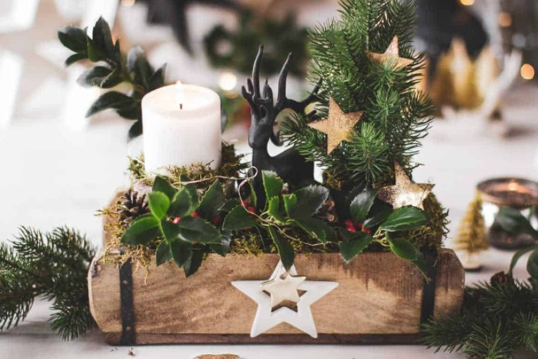

Christmas Coffees Table Decor in a Box offers a convenient and stylish solution to elevate your holiday home decor. This all-in-one package includes festive coffee-themed ornaments and accessories to adorn your coffee table and create a merry atmosphere. 

Get the tutorial at [Chalking Up Success](https://chalkingupsuccess.com/christmas-coffee-table-decor-ideas/#containers-for-christmas-coffee-table-decor)

### **2\. Wooden Tabletop Tree**

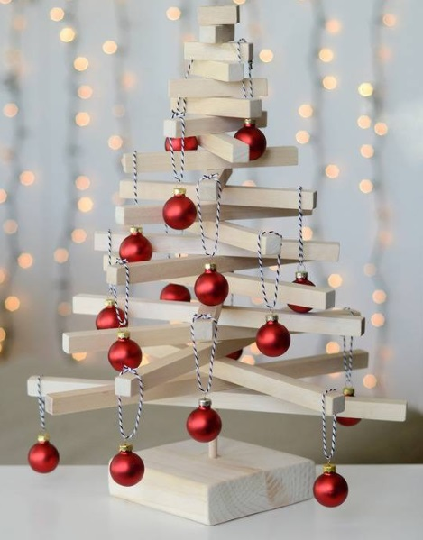

You have the option to embrace one of these contemporary, do-it-yourself wooden Christmas tree designs and make it the centerpiece. Whether adorned with ornaments or left plain, it presents a fantastic appearance!

Get the tutorial at [Curbly](https://www.curbly.com/15623-how-to-make-a-modern-wooden-tabletop-christmas-tree)

### **3\. Tree Votives Christmas Coffee Table Decor**

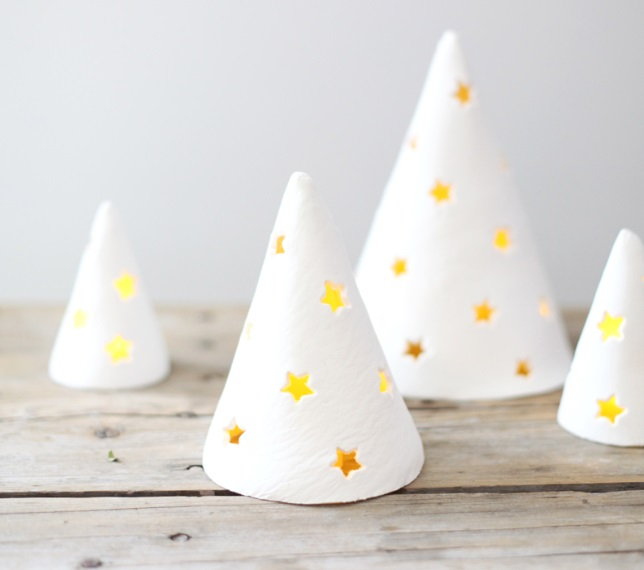

A Beautiful Mess presents these delightful tree-shaped votives that hold the potential to enhance the table’s center. Placing them there not only adds an extra layer of elegance to the setting but also brings a touch of magic and romance to the entire scene.

Get the tutorial at [A Beautiful Mess](https://abeautifulmess.com/diy-porcelain-holiday-tree-lights/)

### **4\. Wooden Box Christmas Table Centerpiece**

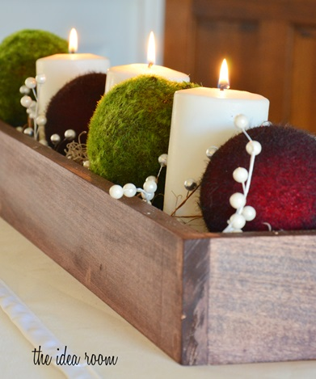

The wooden box Christmas table centerpiece creates a cozy and inviting atmosphere for family and guests to gather around, making it an essential decorative piece for an unforgettable holiday season.

Get the tutorial at [The Idea Room](https://www.theidearoom.net/2012/11/christmas-table-centerpiece.html)

### **5\. Mason Jar Luminaries Christmas Centerpiece Idea**

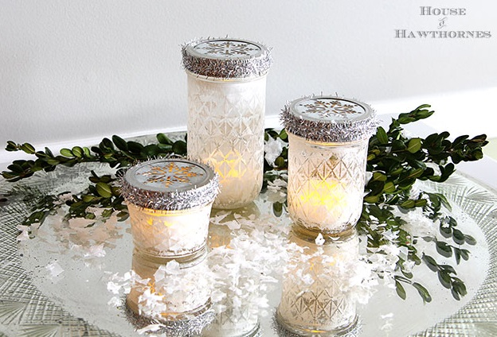

House of Hawthorne ingeniously crafted mason jar luminaries, which possess the ability to infuse a touch of romance onto the coffee table. The gentle and inviting illumination they provide works wonders in altering the room’s ambiance. 

Get the tutorial at [House of Hawthornes](https://www.houseofhawthornes.com/mason-jar-chalk-paint-christmas/)

### **6\. Ornament Tree for Coffee Table Decor**

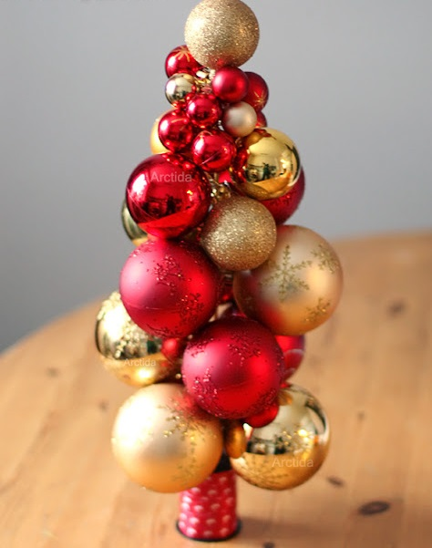

We’re truly fond of this do-it-yourself ornament tree. It emanates a festive vibe, and the process of assembling it is much simpler than you might imagine. Whether you opt for neutral shades or vibrant hues, rest assured, you can’t make a wrong choice with this one!

Get the tutorial at [Arctida Blogspot](https://arctida.blogspot.com/2012/12/diy-christmas-ornament-tree-how-to.html)

### **7\. Painted Table Runner**

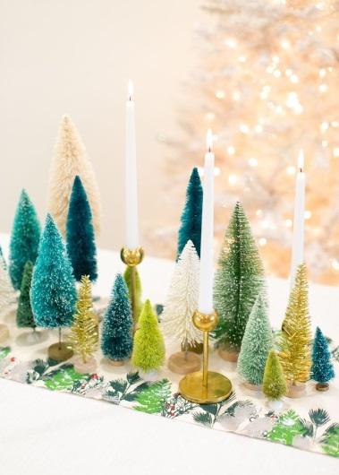

All you need to make your own festive table runner are some winter-themed stencils, craft paint, and a basic canvas fabric. These table runners elevate any table setting effortlessly and provide a unique and artistic focal point for your coffee area.

Get the tutorial at [Lovely Indeed](https://lovelyindeed.com/how-to-make-a-painted-table-runner/)

### **8\. [Santa’s Sleigh Ride](https://www.villeroy-boch.ca/shop/en/christmas-toys-memory-santas-sleigh-ride-1486026500.html)**

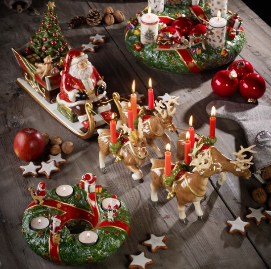

This triples as a candle holder, music box, and sentimental centerpiece. Villeroy and Boch’s porcelain Santa, sleigh, and reindeer will brighten your coffee table and the smiles of everyone who sees it.

### **9\. [Christmas Coffee Table Centerpiece](https://www.amazon.com/dp/B01IMYISBI)**

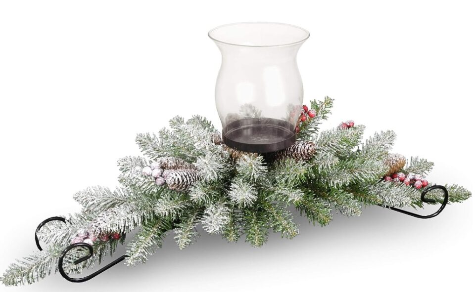

It typically includes carefully arranged elements such as fresh greenery, pine cones, ornaments, candles, and seasonal decorations. This beautifully crafted centerpiece is a focal point, creating a warm and inviting ambiance in your home, perfect for gathering around and celebrating with loved ones during Christmas.

### **10\. [Christmas Tree Box of Sweets](https://herendusa.com/bvhv-06104-0-93-christmas-tree-box)**

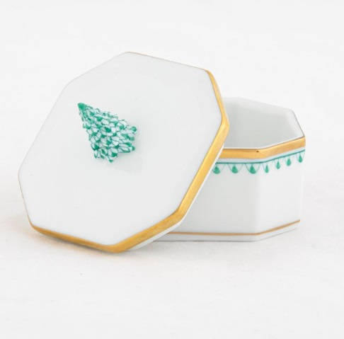

Place this delicious treat box on your coffee table in an enticing manner after filling it with treats. Everyone will be compelled to open the lid and peek inside. It is ideal for your coffee table decorations!

### **11\. [Pine Cones and Red Berry Table Centerpiece](https://www.amazon.com/dp/B08HS1YYNT)** 

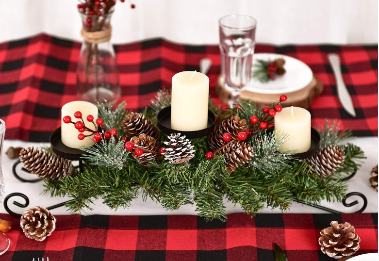

A pine cone and red berry coffee table centerpiece exudes natural charm and festive cheer. Perfect for seasonal gatherings and holiday decorations, this arrangement combines rustic pine cones with vibrant red berries to create a warm and inviting atmosphere. 

### **12\. [Reindeer Tea Lights](https://www.walmart.com/ip/Reindeer-Tea-Light-Holders-Set-of-6-Holiday-Home-Candle-Decorations/184084170)**

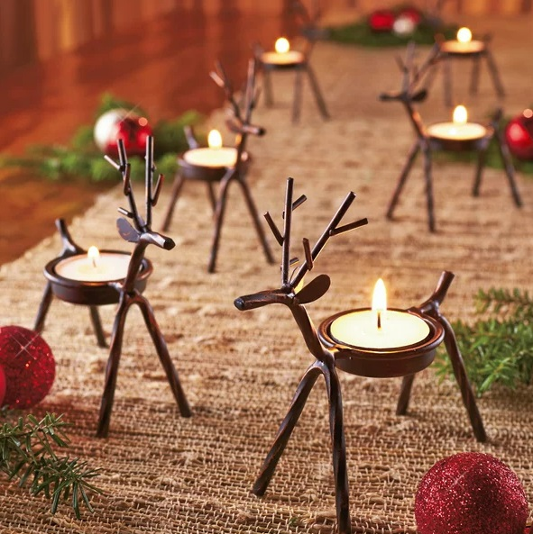

These delicate reindeer tea light holders offer a charming and elegant way to create a stylish ambiance. Crafted with care, these reindeer hold small tea lights, casting a warm and gentle glow that adds a touch of magic to any space. 

### **13\. Cupcake Liner Trees**

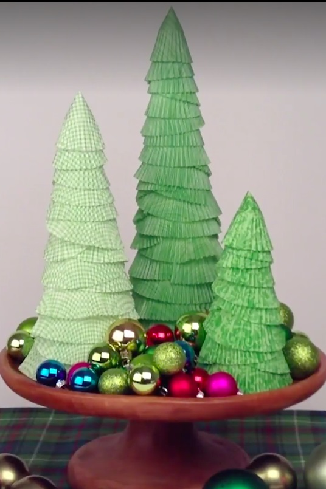

The entire family will enjoy this simple yet enjoyable DIY project. The greatest thing, though? There will be a ton of extra cupcake liners, which means lots more Christmas treats!

Get the [Cupcake Liner Trees tutorial](https://www.womansday.com/home/crafts-projects/how-to/a52955/cupcake-wrapper-christmas-tree/)

### **14\. Crafted Metal Epergne**

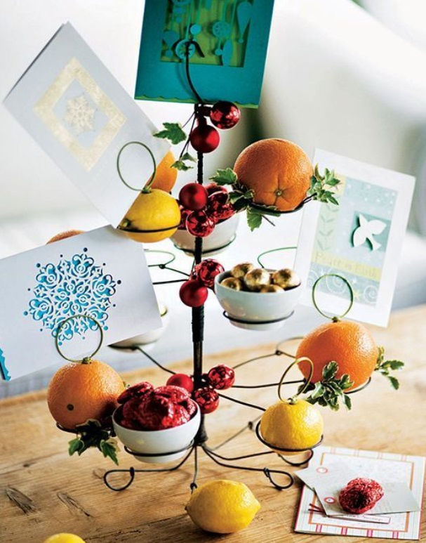

A wonderfully original way to display all the lovely [Christmas cards](https://avada.io/loveable/christmas-card-ideas/) you get over the holiday season. Let your personality emanate from a beautifully designed display that captures the essence of your festive spirit while creating an enchanting atmosphere. 

Get the [Crafted Metal Epergne](https://www.womansday.com/home/crafts-projects/how-to/a2739/crafted-metal-epergne-901/) tutorial

### **15\. Thread Christmas Trees**

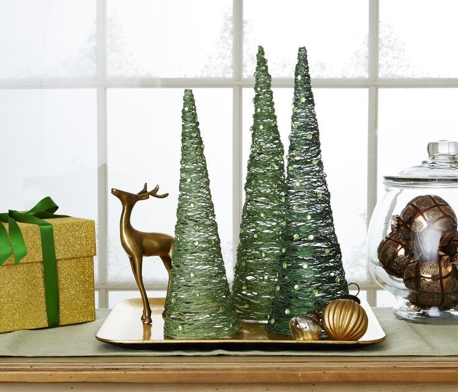

These thread [Christmas trees](https://avada.io/loveable/blog/christmas-tree-decorating-ideas/) add the perfect touch to any table setting. Crafted with care, you’ll feel proud of yourself for creating them. These unique decorations bring your space a festive and whimsical vibe, allowing you to fully embrace the holiday spirit.

Get the [Thread Christmas Trees](https://www.womansday.com/life/how-to/a56961/how-to-make-a-thread-christmas-tree/) tutorial

### **16\. [Winter Yarn Trees Farmhouse Tiered Tray](https://www.etsy.com/listing/1120321227/)** 

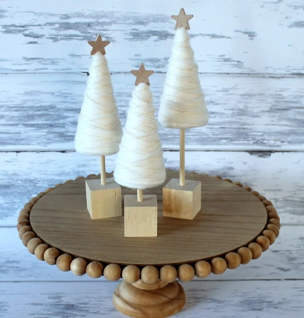

These cream, gold filament-wrapped, contemporary wood block-base, and star-adorned Farmhouse Winter or Christmas yarn trees (set of three) make a lovely complement to your holiday décor for a tiered tray, fireplace, shelf, or coffee table.

### **17\.** [**Christmas Tiered Tray Decor**](https://www.amazon.com/Jetec-Christmas-Decorations-Tabletop-Farmhouse/dp/B0B7J21QBJ)

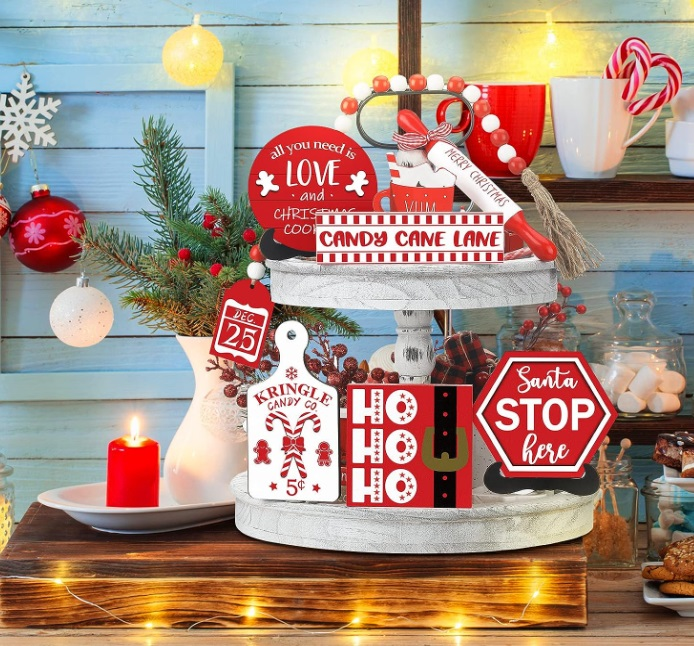

These decor items include miniature Christmas trees, ornaments, figurines, candles, and other festive elements. They are creatively arranged to add a touch of Christmas magic and cheer to any space, making it a perfect centerpiece for holiday gatherings or a delightful addition to [Christmas home decor](https://avada.io/loveable/blog/christmas-house-decorations/).

### **18\.** [**Hot Cocoa Decorative Book Stack**](https://www.amazon.com/KORMMCO-Wood-Decorative-Stack-Book/dp/B0BG25BH2R/)

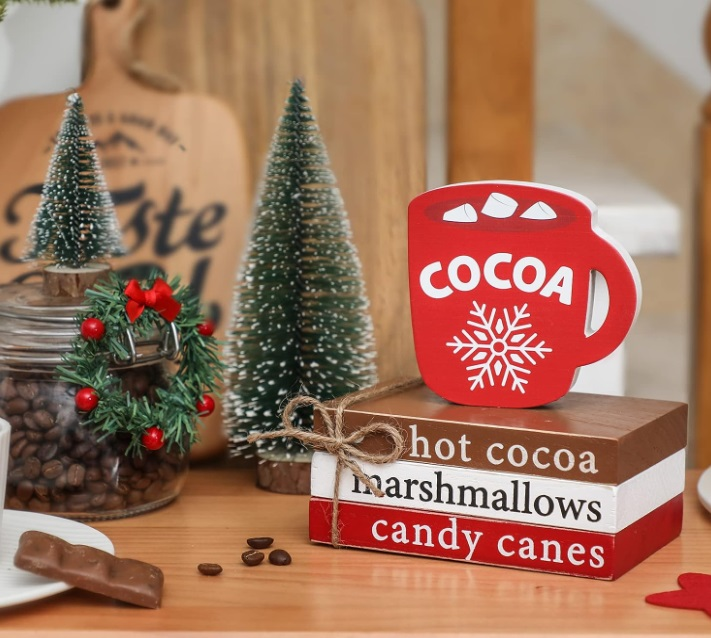

Nestled upon your shelf or coffee table, this charming stack of vintage-inspired books invites warmth and comfort into your home. With their rich, chocolate-brown hues and delicate patterns, these books beautifully complement any space, making them the perfect addition to your coffee table décor. 

### **19\.** [**Christmas Trees Tiered Tray Decoration**](https://www.amazon.com/Christmas-Pieces-Farmhouse-Centerpiece-Decoration/dp/B09HXKG2YY)

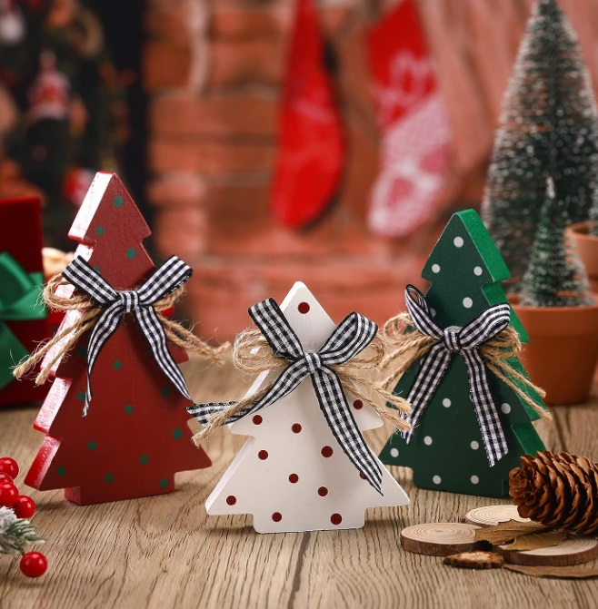

Christmas tree tiered tray decoration refers to a charming and festive way of adorning tiered trays with miniature Christmas trees. These tiny trees are adorned with sparkling ornaments, colorful ribbons, and twinkling lights, creating a whimsical and celebratory atmosphere.

### **20\.** [**Red Snowflake Retro Home Decor for Coffee Table**](https://www.amazon.com/Christmas-Snowflake-Farmhouse-Wedding-Banquet/dp/B0BBTY7TK2)

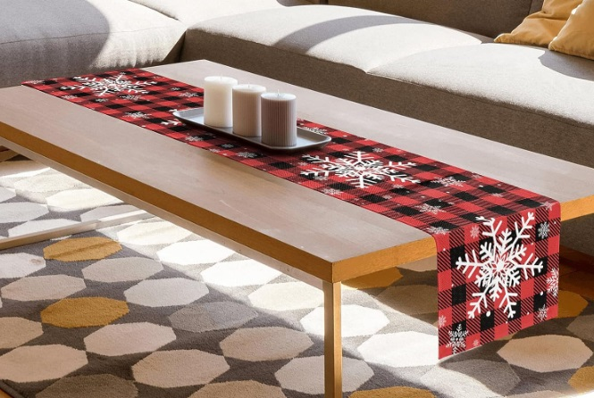

Red snowflake retro home decor for a coffee table is a stylish and festive addition to any living space. Its vibrant red color and intricate snowflake design instantly add a touch of retro charm. Perfect for a coffee table centerpiece, it complements both modern and vintage interior styles.

### **21\.** [**Christmas Serving Tray with Handles**](https://www.amazon.com/Krismax-Christmas-Decoration-Decorative-Thanksgiving/dp/B0B1VKRDX9)

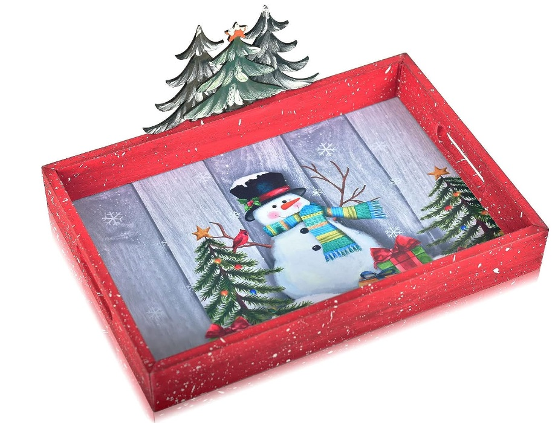

This tray is designed with festive patterns and features sturdy handles, making it easy to serve your favorite dishes and drinks. Whether you’re hosting a Christmas dinner or a holiday party, this tray will effortlessly elevate your serving game and impress your guests.

### **22\.** [**Snowflake Coffee Spice Blocks**](https://www.amazon.com/Christmas-Snowman-Snowflake-Farmhouse-Halloween/dp/B0CBV4YF6J)

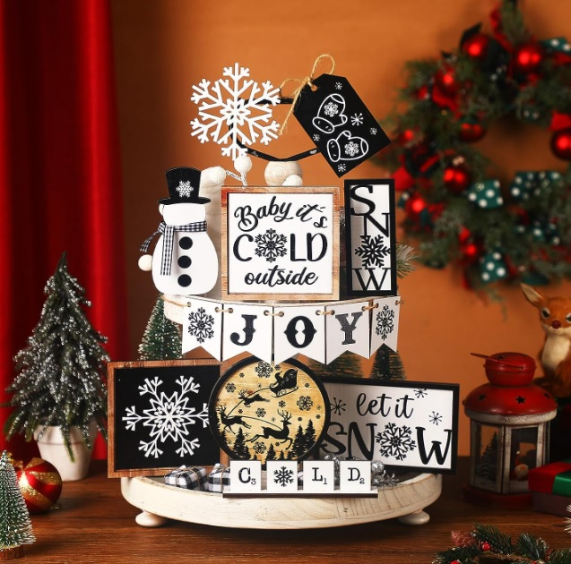

Snowflake coffee spice blocks are designed to transform your daily brew into a captivating sensory journey. Each block is a small work of art, delicately formed to resemble a snowflake, embodying the uniqueness and beauty of nature’s frozen wonders.

### **23\.** [**Christmas Slogans for Coffee Table Decor**](https://www.amazon.com/Liooty-Christmas-Decorations-Ornaments-Reindeer/dp/B0B4S9NVFT/)

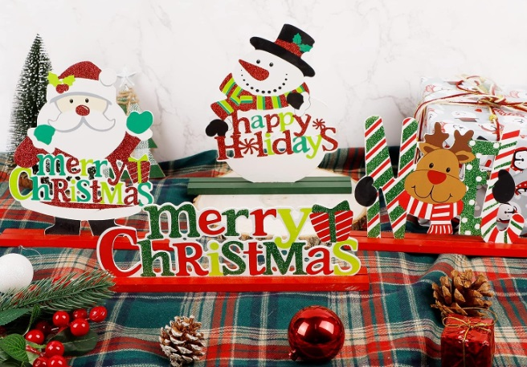

With “Christmas Slogans for Coffee Table Decor,” your coffee table becomes more than just a piece of furniture – it becomes a centerpiece of merriment and a canvas for spreading the magic of Christmas throughout your home.

### **24\.** [**Coffee Table Runner for Farmhouse**](https://www.amazon.com/KadyHoom-Farmhouse-Holiday-Wedding-Kitchen/dp/B0B5GHJW7V)

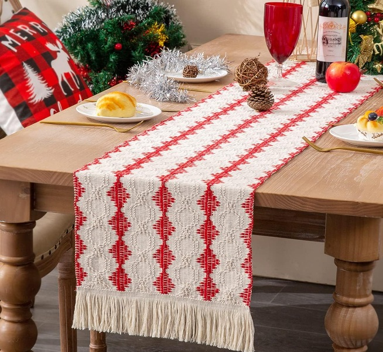

The runner’s design captures the essence of farmhouse living, combining simplicity and sophistication in a harmonious balance. Whether your coffee table is a reclaimed wooden piece or a vintage find, this runner enhances its character and brings warmth to the setting.

### **25\.** [**Christmas Coasters with Holder**](https://www.amazon.com/Ceramic-Christmas-Coasters-Absorbent-Coaster/dp/B09G32W1MT/)

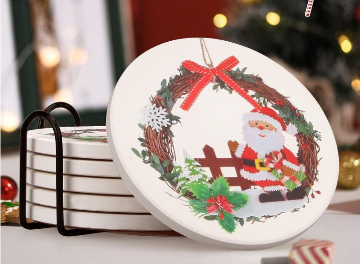

As you gather with loved ones to celebrate the festive season, these coasters become conversation starters, invoking the joy and spirit of Christmas. They also make for thoughtful gifts that bring a dash of seasonal magic to the homes of friends and family.

### **26\.** [**Faux Christmas Coffee with Whipped Cream**](https://www.etsy.com/listing/1332061210/faux-christmas-coffee-with-whipped-cream)

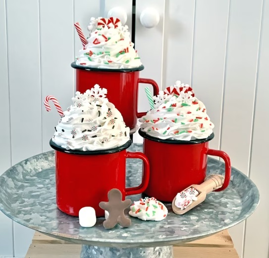

Faux Christmas coffee with whipped cream is a delightful beverage that captures the essence of the holiday season in every sip. This elaborate and indulgent drink is inspired by the traditional flavors of Christmas, combining rich and aromatic coffee with a velvety whipped cream topping.

### **27\.** [**Christmas Candle Holder Centerpiece**](https://www.etsy.com/listing/1318686624/christmas-centerpiece-christmas-candle)

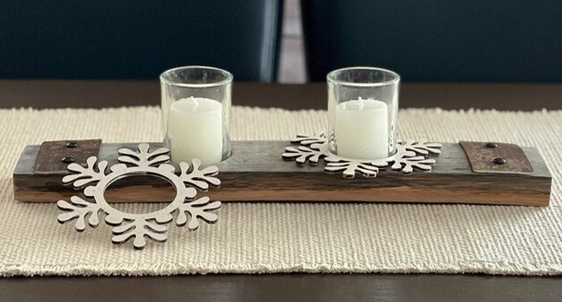

With its snowflake embellishments and Christmas decor, this candle holder centerpiece is ideal for your coffee table. It’s not only a wonderful choice for a women’s gift or for those who adore Boho decor, but it also offers a touch of uniqueness and charm to any space it graces.

### **28\.** [**Christmas Mantle Decor**](https://www.etsy.com/listing/836812102/christmas-mantle-decor-christmas-table)

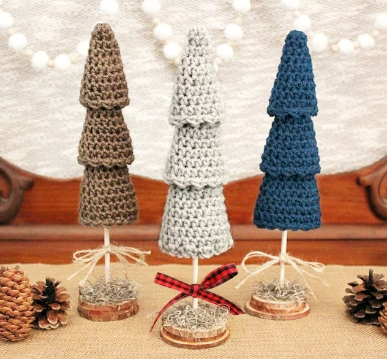

Infuse your holiday season with a hint of rustic allure through these charming and petite miniature trees! Whether you’re captivated by the allure of rustic chic aesthetics or simply adore miniatures, these meticulously crafted trees offer a splendid match for your taste.

### **29\.** [**Holiday Centerpiece in Winter Tin with Red Truck**](https://www.etsy.com/listing/1477084520/holiday-centerpiece-in-winter-tin-with)

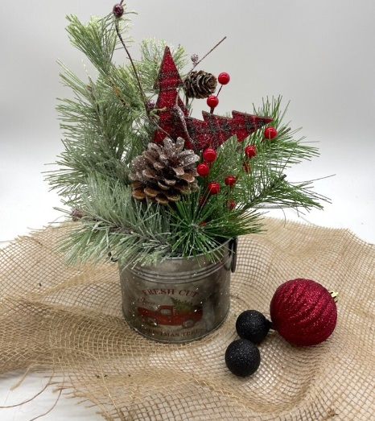

This beautiful centerpiece features a tin container designed in winter, showcasing snowflakes, evergreen branches, and maybe even a touch of sparkly snow. The centerpiece is highlighted by a miniature red truck, complete with intricate detailing and a vintage feel.

### **30\.** [**Christmas Vintage Red Truck Decor**](https://www.amazon.com/Christmas-Vintage-Farmhouse-Artificial-Handcrafted/dp/B09CFY472H)

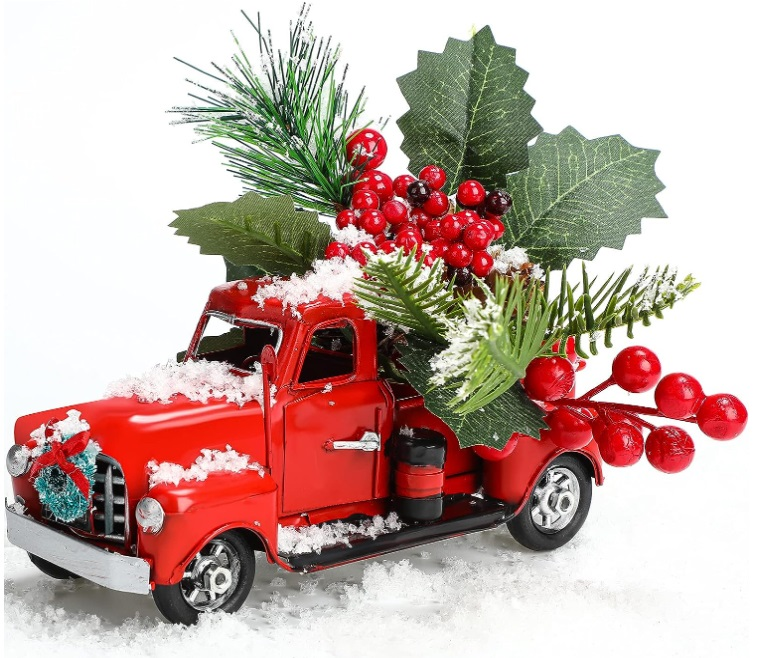

The vintage red truck acts as the centerpiece, often featuring rustic detailing and a retro design that harkens back to a simpler time. It is often loaded with enchanting accents like beautifully wrapped gifts, lush Christmas trees, wreaths, or even jolly Santa Claus figurines. 

### **31\.** [**Christmas Snowflake Signs for Coffee Table Decor**](https://www.amazon.com/Christmas-Wooden-Snowflake-Tabletop-Centerpiece/dp/B0BBGX3WRC/r)

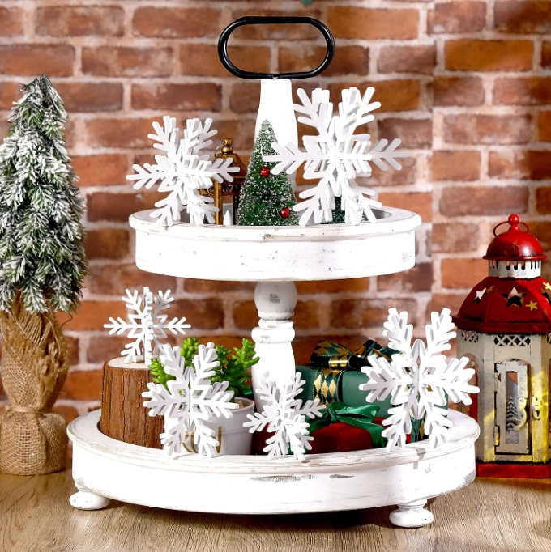

The Christmas snowflake signs for coffee table decor are often adorned with festive elements such as glitter, shimmering sequins, or even LED lights, creating a radiant and eye-catching display. Some signs may also feature elements like ribbons, bows, or other holiday accents, making them even more charming and captivating.

## **Bottom Line**

In conclusion, your coffee table can be a captivating canvas for Christmas creativity. Whether you prefer the glitz of metallics, the warmth of natural elements, or the charm of a miniature village, there’s a style to suit every preference. Elevate your holiday ambiance and make lasting memories with these exquisite **Christmas coffee table decor ideas**. Embrace the festive spirit and let your coffee table shine as a beacon of holiday delight.

- [30+ DIY Christmas Coffee Table Decorations To Make In 2023](https://avada.io/loveable/blog/christmas-coffee-table-decoration/#wp-block-heading-2-2) 
    - [1\. Christmas Coffee Table Decor in A Box](https://avada.io/loveable/blog/christmas-coffee-table-decoration/#wp-block-heading-3-3)
    - [2\. Wooden Tabletop Tree](https://avada.io/loveable/blog/christmas-coffee-table-decoration/#wp-block-heading-3-7)
    - [3\. Tree Votives Christmas Coffee Table Decor](https://avada.io/loveable/blog/christmas-coffee-table-decoration/#wp-block-heading-3-11)
    - [4\. Wooden Box Christmas Table Centerpiece](https://avada.io/loveable/blog/christmas-coffee-table-decoration/#wp-block-heading-3-15)
    - [5\. Mason Jar Luminaries Christmas Centerpiece Idea](https://avada.io/loveable/blog/christmas-coffee-table-decoration/#wp-block-heading-3-19)
    - [6\. Ornament Tree for Coffee Table Decor](https://avada.io/loveable/blog/christmas-coffee-table-decoration/#wp-block-heading-3-23)
    - [7\. Painted Table Runner](https://avada.io/loveable/blog/christmas-coffee-table-decoration/#wp-block-heading-3-27)
    - [8\. Santa’s Sleigh Ride](https://avada.io/loveable/blog/christmas-coffee-table-decoration/#wp-block-heading-3-31)
    - [9\. Christmas Coffee Table Centerpiece](https://avada.io/loveable/blog/christmas-coffee-table-decoration/#wp-block-heading-3-34)
    - [10\. Christmas Tree Box of Sweets](https://avada.io/loveable/blog/christmas-coffee-table-decoration/#wp-block-heading-3-37)
    - [11\. Pine Cones and Red Berry Table Centerpiece](https://avada.io/loveable/blog/christmas-coffee-table-decoration/#wp-block-heading-3-40) 
    - [12\. Reindeer Tea Lights](https://avada.io/loveable/blog/christmas-coffee-table-decoration/#wp-block-heading-3-43)
    - [13\. Cupcake Liner Trees](https://avada.io/loveable/blog/christmas-coffee-table-decoration/#wp-block-heading-3-46)
    - [14\. Crafted Metal Epergne](https://avada.io/loveable/blog/christmas-coffee-table-decoration/#wp-block-heading-3-50)
    - [15\. Thread Christmas Trees](https://avada.io/loveable/blog/christmas-coffee-table-decoration/#wp-block-heading-3-54)
    - [16\. Winter Yarn Trees Farmhouse Tiered Tray](https://avada.io/loveable/blog/christmas-coffee-table-decoration/#wp-block-heading-3-58) 
    - [17\. Christmas Tiered Tray Decor](https://avada.io/loveable/blog/christmas-coffee-table-decoration/#wp-block-heading-3-61)
    - [18\. Hot Cocoa Decorative Book Stack](https://avada.io/loveable/blog/christmas-coffee-table-decoration/#wp-block-heading-3-64)
    - [19\. Christmas Trees Tiered Tray Decoration](https://avada.io/loveable/blog/christmas-coffee-table-decoration/#wp-block-heading-3-67)
    - [20\. Red Snowflake Retro Home Decor for Coffee Table](https://avada.io/loveable/blog/christmas-coffee-table-decoration/#wp-block-heading-3-70)
    - [21\. Christmas Serving Tray with Handles](https://avada.io/loveable/blog/christmas-coffee-table-decoration/#wp-block-heading-3-73)
    - [22\. Snowflake Coffee Spice Blocks](https://avada.io/loveable/blog/christmas-coffee-table-decoration/#wp-block-heading-3-76)
    - [23\. Christmas Slogans for Coffee Table Decor](https://avada.io/loveable/blog/christmas-coffee-table-decoration/#wp-block-heading-3-79)
    - [24\. Coffee Table Runner for Farmhouse](https://avada.io/loveable/blog/christmas-coffee-table-decoration/#wp-block-heading-3-82)
    - [25\. Christmas Coasters with Holder](https://avada.io/loveable/blog/christmas-coffee-table-decoration/#wp-block-heading-3-85)
    - [26\. Faux Christmas Coffee with Whipped Cream](https://avada.io/loveable/blog/christmas-coffee-table-decoration/#wp-block-heading-3-88)
    - [27\. Christmas Candle Holder Centerpiece](https://avada.io/loveable/blog/christmas-coffee-table-decoration/#wp-block-heading-3-91)
    - [28\. Christmas Mantle Decor](https://avada.io/loveable/blog/christmas-coffee-table-decoration/#wp-block-heading-3-94)
    - [29\. Holiday Centerpiece in Winter Tin with Red Truck](https://avada.io/loveable/blog/christmas-coffee-table-decoration/#wp-block-heading-3-97)
    - [30\. Christmas Vintage Red Truck Decor](https://avada.io/loveable/blog/christmas-coffee-table-decoration/#wp-block-heading-3-100)
    - [31\. Christmas Snowflake Signs for Coffee Table Decor](https://avada.io/loveable/blog/christmas-coffee-table-decoration/#wp-block-heading-3-103)
- [Bottom Line](https://avada.io/loveable/blog/christmas-coffee-table-decoration/#wp-block-heading-2-106)

### [Blake Simpson](https://avada.io/loveable/author/blake/)

Hi, I'm Blake from Loveable. I help people find perfect gifts for occasions like anniversaries and weddings. I also write a blog about holidays, sharing insights to make them more meaningful. Let's create unforgettable moments together!

- [Twitter](https://twitter.com/intent/tweet)
- [Facebook](https://www.facebook.com/sharer/sharer.php)
- [instagram](https://avada.io/loveable/blog/christmas-coffee-table-decoration/)
- [pinterest](https://www.pinterest.com/loveablellc/)

## Related Posts

[### 120+ Christian Birthday Wishes To Spread Your Love](https://avada.io/loveable/blog/christian-birthday-wishes/) 

[

### 35 Best 70th Birthday Ideas To Celebrate The Special Milestone

](https://avada.io/loveable/blog/70th-birthday-ideas/)

[

### 50 Best 30th Birthday Decorations for a Remarkable Birthday Bash

](https://avada.io/loveable/blog/30th-birthday-decorations/)

[

### 40 Delicious Vegan Christmas Desserts to Delight Your Palate

](https://avada.io/loveable/blog/vegan-christmas-desserts/)

[

### 60 Christmas Team Building Activities to Boost Workplace Spirit

](https://avada.io/loveable/blog/christmas-team-building-activities/)
