This article has been written and researched by our expert Loveable through a precise methodology. [Learn more about our methodology](https://avada.io/loveable/our-methodological.html)

[Loveable](https://avada.io/loveable/) > [Blog](https://avada.io/loveable/blog/) > [Holiday](https://avada.io/loveable/holiday/)

# 30 Christmas Cookie Recipes: Spread Holiday Joy with Delicious Treats

Written by [Blake Simpson](https://avada.io/loveable/author/blake/) Last Updated on September 07, 2023

- [30 Must-Try Christmas Cookies Recipes](https://avada.io/loveable/blog/christmas-cookie-recipes/#wp-block-heading-2-2)
    - [Spritz Cookies](https://avada.io/loveable/blog/christmas-cookie-recipes/#wp-block-heading-3-3)
    - [Christmas Tree Cookies](https://avada.io/loveable/blog/christmas-cookie-recipes/#wp-block-heading-3-7)
    - [Panettone Cookies](https://avada.io/loveable/blog/christmas-cookie-recipes/#wp-block-heading-3-12)
    - [Snowball Cookies](https://avada.io/loveable/blog/christmas-cookie-recipes/#wp-block-heading-3-16)
    - [Gingerbread Cookies](https://avada.io/loveable/blog/christmas-cookie-recipes/#wp-block-heading-3-20)
    - [Peanut Butter Blossoms](https://avada.io/loveable/blog/christmas-cookie-recipes/#wp-block-heading-3-24)
    - [White Chocolate Cranberry Orange Biscotti](https://avada.io/loveable/blog/christmas-cookie-recipes/#wp-block-heading-3-29)
    - [Snickerdoodles](https://avada.io/loveable/blog/christmas-cookie-recipes/#wp-block-heading-3-33)
    - [The Best Sugar Cookies](https://avada.io/loveable/blog/christmas-cookie-recipes/#wp-block-heading-3-37)
    - [Scottish Shortbread](https://avada.io/loveable/blog/christmas-cookie-recipes/#wp-block-heading-3-41)
    - [Oatmeal Brown Sugar Cookies With Raisins And Pecans](https://avada.io/loveable/blog/christmas-cookie-recipes/#wp-block-heading-3-45)
    - [Double Chocolate Biscotti](https://avada.io/loveable/blog/christmas-cookie-recipes/#wp-block-heading-3-49)
    - [Almond Biscotti](https://avada.io/loveable/blog/christmas-cookie-recipes/#wp-block-heading-3-53)
    - [Coconut Macaroons](https://avada.io/loveable/blog/christmas-cookie-recipes/#wp-block-heading-3-57)
    - [Baileys Chocolate Truffles](https://avada.io/loveable/blog/christmas-cookie-recipes/#wp-block-heading-3-61)
    - [Copycat Chessmen Cookies](https://avada.io/loveable/blog/christmas-cookie-recipes/#wp-block-heading-3-65)
    - [Kolaczki Cream Cheese Cookies](https://avada.io/loveable/blog/christmas-cookie-recipes/#wp-block-heading-3-69)
    - [Polvorones](https://avada.io/loveable/blog/christmas-cookie-recipes/#wp-block-heading-3-73)
    - [Checkerboard Cookies](https://avada.io/loveable/blog/christmas-cookie-recipes/#wp-block-heading-3-77)
    - [Ma’amoul](https://avada.io/loveable/blog/christmas-cookie-recipes/#wp-block-heading-3-81)
    - [Lemon Cookies](https://avada.io/loveable/blog/christmas-cookie-recipes/#wp-block-heading-3-85)
    - [Lemon Shortbread Cookies](https://avada.io/loveable/blog/christmas-cookie-recipes/#wp-block-heading-3-89)
    - [Chocolate Hazelnut Thumbprint Cookies](https://avada.io/loveable/blog/christmas-cookie-recipes/#wp-block-heading-3-93)
    - [Icebox Cookies](https://avada.io/loveable/blog/christmas-cookie-recipes/#wp-block-heading-3-97)
    - [Italian Rainbow Cookies](https://avada.io/loveable/blog/christmas-cookie-recipes/#wp-block-heading-3-101)
    - [Sugar Cookie Trees](https://avada.io/loveable/blog/christmas-cookie-recipes/#wp-block-heading-3-105)
    - [Krinkle Kringle Cookies](https://avada.io/loveable/blog/christmas-cookie-recipes/#wp-block-heading-3-109)
    - [Pinwheel Cookies](https://avada.io/loveable/blog/christmas-cookie-recipes/#wp-block-heading-3-113)
    - [Pizzelle](https://avada.io/loveable/blog/christmas-cookie-recipes/#wp-block-heading-3-117)
    - [Pistachio Star Cookies](https://avada.io/loveable/blog/christmas-cookie-recipes/#wp-block-heading-3-121)
- [Bottom Line](https://avada.io/loveable/blog/christmas-cookie-recipes/#wp-block-heading-2-128)

Get ready to embark on a delightful baking adventure as you whip up a batch of scrumptious Christmas cookies that will fill your home with the heartwarming aroma of the holiday season. Whether you’re making them as festive treats for your loved ones or for a cookie exchange, these cookies are bound to bring smiles and joy to all who indulge. Let’s dive into this wonderful **Christmas cookies recipe** that’s perfect for spreading holiday cheer.

## **30 Must-Try Christmas Cookies Recipes**

### **Spritz Cookies**

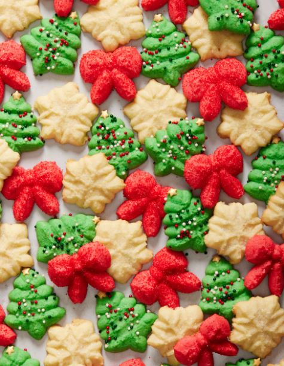

Derived from the German term “spritzen,” signifying “to squirt,” these luscious cookies bear this moniker due to the utilization of a cookie press that imparts their distinctive contours. Spanning from snowflake motifs to charming Christmas trees, spritz cookies manifest in myriad merry designs.

[Get the Spritz Cookies recipe!](https://www.delish.com/cooking/recipe-ideas/a41284039/spritz-cookies-recipe/)

### Christmas Tree Cookies

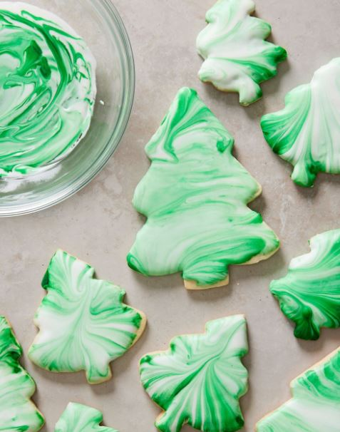

Christmas would be incomplete without cookies, and this season, we kick off the festivities with these tree-shaped treats adorned using an incredibly easy marbling method that’s truly worthy of a TikTok trend.

This technique is ideal for engaging children or for applying to various other holiday cookie forms. Imagine candy canes featuring a charming red and white marble effect, or snowflake figures crafted in a serene blue and white design. The creative opportunities are boundless!

[Get the Christmas Tree Cookies recipe!](https://www.delish.com/cooking/recipe-ideas/a41091947/christmas-tree-cookies-recipe/)

### **Panettone Cookies**

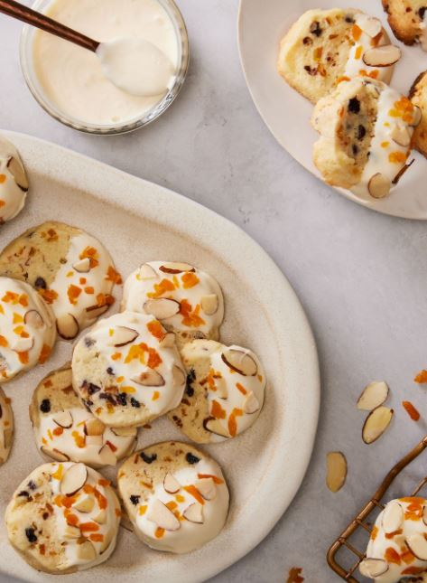

The notion that a soft, enriched bread could metamorphose into a delectable, buttery cookie might appear implausible at first glance. However, we encourage you to continue perusing! These cookies serve as an impeccable foundation for incorporating cherished elements like orange peel, currants, dried apricots, chocolate, and almonds, reminiscent of the original Christmas cookies recipe, all achieved with just half the effort.

[Get the Panettone Cookies recipe!](https://www.delish.com/cooking/a41044937/panettone-cookies-recipe/)

### **Snowball Cookies**

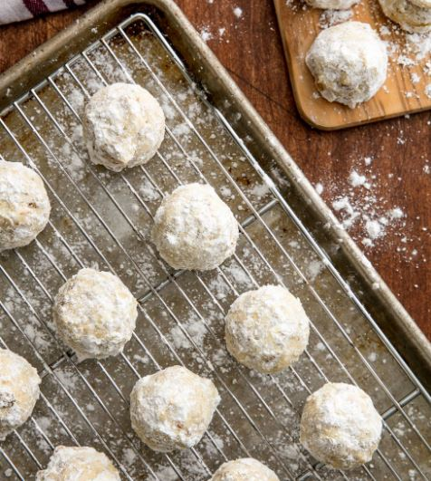

A gentle heads-up: the snowy and delightful factor of these snowballs comes from the powdered confectioner’s sugar, which has the potential to create a sugary sprinkle with each mouthful. It’s wise to have napkins on standby and enjoy them over a plate to capture the wintery ambiance.

[Get the Snowball Cookies recipe!](https://www.delish.com/cooking/recipe-ideas/recipes/a56364/best-snowball-cookies-recipe/)

### **Gingerbread Cookies**

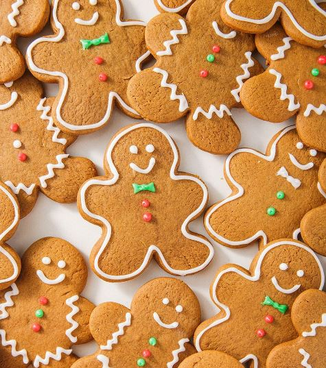

Gingerbread requires a generous portion of ground ginger, a small quantity of cinnamon, and a minimal dash of cloves. This combination creates the ideal formula for a delightful Christmas treat. However, if you don’t have cloves (or strongly dislike them), you have the option to omit them entirely. Regarding ginger, it is an essential ingredient but is open to adjustment. Feel free to use a reduced amount if desired.

[Get the Gingerbread Cookies recipe!](https://www.delish.com/cooking/recipe-ideas/a50468/gingerbread-cookies-recipe/)

### **Peanut Butter Blossoms**

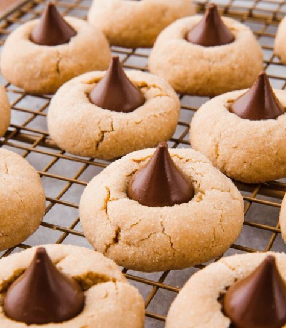

Legend has it that the inception of these cookies traces back to Mrs. Freda F. Smith of Ohio, who crafted the initial recipe for The Grand National Pillsbury Bake-Off contest in 1957.

Although she didn’t clinch victory, her cookies achieved iconic status, notably gaining prominence when Pillsbury established the esteemed Bake-Off Hall of Fame and honored her creation by ranking it 7th among the esteemed recipes. Consider this a fascinating tidbit!

[Get the Peanut Butter Blossoms recipe!](https://www.delish.com/cooking/recipe-ideas/a24883952/peanut-butter-blossoms-recipe/)

### **White Chocolate Cranberry Orange Biscotti**

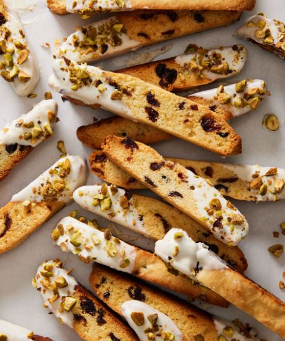

Numerous confections pride themselves on being perfect accompaniments to coffee or tea, yet none can compare to the delightful crispness and crunchiness of the unassuming biscotti. Infused with the timeless blend of cranberry and orange, these biscotti are elevated by a decadent touch – a dip in luscious white chocolate, followed by a generous coating of finely chopped pistachios, creating an additional layer of indulgence.

[Get the White Chocolate Cranberry Orange Biscotti recipe!](https://www.delish.com/cooking/recipe-ideas/a41337783/cranberry-orange-biscotti-recipe/)

### **Snickerdoodles**

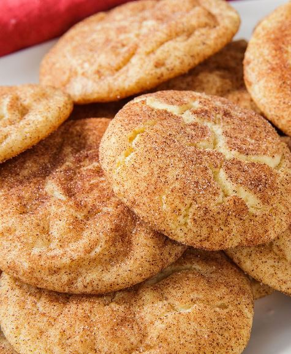

Indulge in the allure of classic snickerdoodles: delectably sweet and buttery sugar cookies, adorned with a dusting of cinnamon-sugar. Crafting these timeless treats presents an ideal opportunity for involving young children; the joy of shaping the pliable dough into spheres and coating them with cinnamon-sugar prior to baking is a delightful experience that little ones adore.

[Get the Snickerdoodles recipe!](https://www.delish.com/cooking/recipe-ideas/a22004581/easy-snickerdoodle-cookie-recipe/)

### **The Best Sugar Cookies**

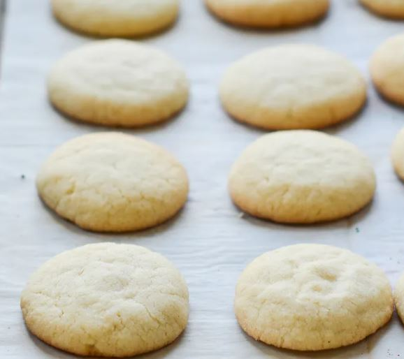

While their appearance might be unassuming, these irresistible cookies boast a luxurious and buttery essence, featuring a delicate balance between a crunchy, sugary outer layer and a tender, chewy inner texture. The hidden components behind their charm? Cream cheese imparts a gentle tenderness to the cookies and a subtle touch of almond extract, enhancing the overall profile with a delightful almond undertone.

[Get the Best Sugar Cookies recipe!](https://www.onceuponachef.com/recipes/crave-worthy-sugar-cookies.html)

### **Scottish Shortbread**

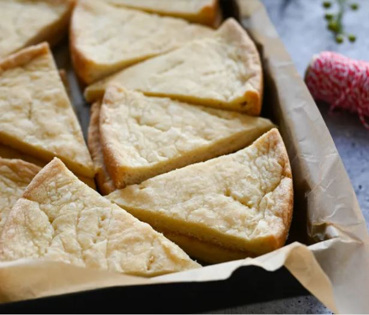

With a delightful crispness, an abundance of rich buttery goodness, and a balanced sweetness, crafting shortbread cookies requires only a handful of ingredients. In the tradition of Scotland, these treats are conventionally baked in substantial rounds and then sliced into wedges, often enjoyed during the winter solstice and festive occasions.

[Get the Scottish Shortbread recipe!](https://www.onceuponachef.com/recipes/scottish-shortbread.html)

### **Oatmeal Brown Sugar Cookies With Raisins And Pecans**

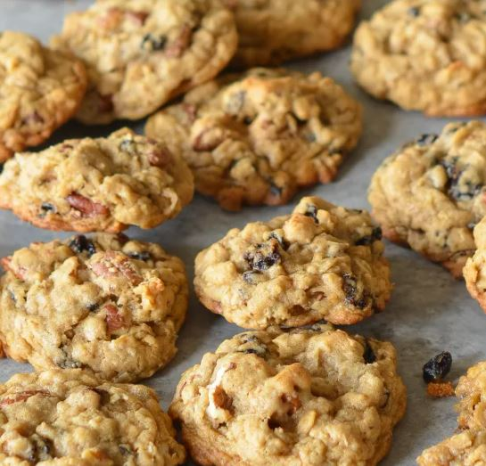

Look no further, for these oatmeal raisin cookies reign supreme. Diverging from the norm, they contain a reduced oat content compared to most Christmas cookie recipes, resulting in oatmeal cookies of exceptional quality. Additionally, their sweetness is exclusively derived from brown sugar, imparting a delightful flavor and texture that truly sets them apart.

[Get the Oatmeal Brown Sugar Cookies With Raisins And Pecans recipe!](https://www.onceuponachef.com/recipes/oatmeal-brown-sugar-cookies-with-raisins-and-pecans.html)

### **Double Chocolate Biscotti**

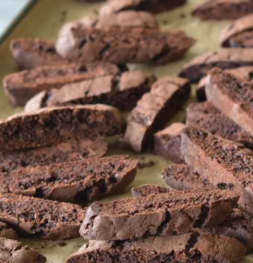

The logic is clear – biscotti, intentionally baked twice to achieve a dry and crispy texture perfect for dipping into tea or coffee, are generously infused with chocolate. While they might exude an air of sophisticated indulgence, these treats also hold a special appeal for children. Pair them with a steaming mug of hot chocolate or warm milk for dipping, and you’ll witness immense delight on the faces of your little ones.

[Get the Double Chocolate Biscotti recipe!](https://www.onceuponachef.com/recipes/double-chocolate-biscotti.html)

### **Almond Biscotti**

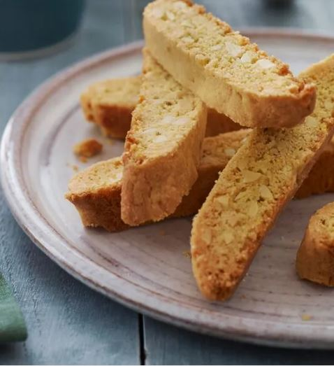

Drawing inspiration from the delectable cookies found at San Francisco’s Zuni Cafe, these biscotti are crafted through a process involving shaping an almond-infused cookie dough into loaves, baking, slicing, and then baking once more. Elegantly balanced in their sweetness, possessing a gentle buttery essence, and delivering a satisfying crunch without being overly hard, these biscotti prove themselves as delightful treat suitable for any moment throughout the day.

[Get the Almond Biscotti recipe!](https://www.onceuponachef.com/recipes/almond-anise-biscotti.html)

### **Coconut Macaroons**

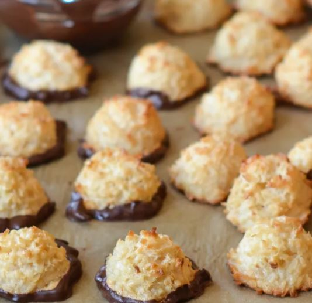

Boasting a tender chewiness within and a delightful golden crispness on the exterior, these coconut macaroons are delightful in their simplicity, yet take on an even more alluring appeal when immersed in velvety melted dark chocolate. Their remarkable longevity allows them to maintain their delectable qualities for an extended period, rendering them an ideal choice for pre-baking or presenting as thoughtful holiday gifts to friends and neighbors.

[Get the Coconut Macaroons recipe!](https://www.onceuponachef.com/recipes/coconut-macaroons.html)

### **Baileys Chocolate Truffles**

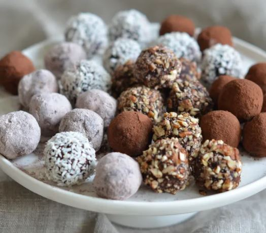

While not strictly cookies, these sumptuous truffles are an exquisite enhancement to any Christmas cookie assortment, presenting a pure realm of chocolate ecstasy. Their chocolate intensity is so pronounced that just one or two truffles suffice to satiate your craving for sweetness. An added perk is their simplicity in preparation, requiring only one bowl and a microwave to create these delectable treats.

[Get the Baileys Chocolate Truffles recipe!](https://www.onceuponachef.com/recipes/baileys-chocolate-truffles.html)

### **Copycat Chessmen Cookies**

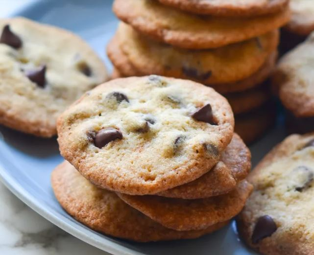

This emulation of the timeless Pepperidge Farm cookie is believed to share lineage with the traditional German springerle cookie, featuring its characteristic ornate imprints. While chessmen cookies typically exhibit patterns resembling chess pieces, you’re welcome to employ any available rolling pin for your creative endeavors.

[Get the Copycat Chessmen Cookies recipe!](https://www.onceuponachef.com/recipes/tates-copycat-thin-crisp-chocolate-chip-cookies.html)

### **Kolaczki Cream Cheese Cookies**

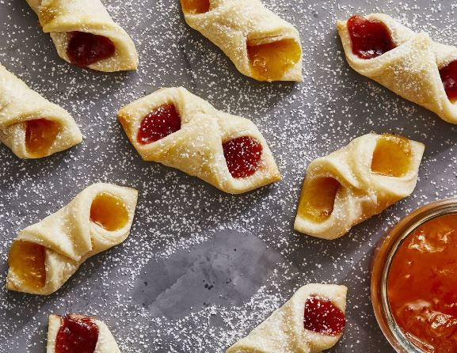

Originating from Poland, Kolaczki cookies are a traditional holiday delight. While certain recipes incorporate canned pie filling, our rendition embraces jam. Feel free to select your preferred flavor, but remember to mix it with cornstarch and water to prevent it from crystallizing into a firm confection while baking.

[Get the Kolaczki Cream Cheese Cookies recipe!](https://www.delish.com/cooking/recipe-ideas/a40935435/kolaczki-cookies-recipe/)

### **Polvorones**

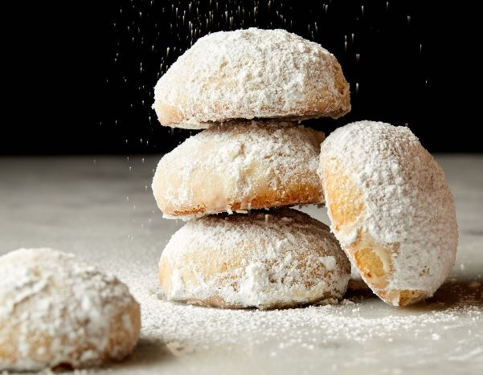

Resembling the beloved snowball cookie, polvorones are frequently referred to as Mexican wedding cookies or Russian tea cakes. What’s unequivocally evident is their exquisite quality, effortlessly melting in your mouth, and deserving a prominent place on any festive array of cookies.

[Get the Polvorones recipe!](https://www.delish.com/cooking/recipe-ideas/a41092246/polvorones-recipe/)

### **Checkerboard Cookies**

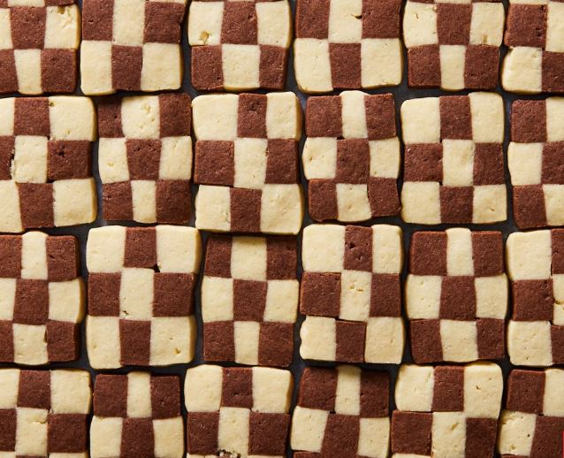

Checkerboard cookies encompass the essence of a timeless treat, featuring a harmonious blend of vanilla and chocolate sugar cookies that present an appearance more intricate than their actual preparation.

[Get the Checkerboard Cookies recipe!](https://www.delish.com/cooking/recipe-ideas/a41300657/checkerboard-cookies-recipe/)

### **Ma’amoul**

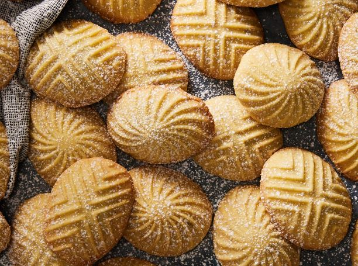

Ma’amoul cookies, hailing from the Middle East, represent a kind of buttery delight often brimming with an array of dried fruits or nuts. Crafted using semolina flour, their outer layer, akin to shortbread, offers a delicate crunch that yields a tender filling.

[Get the Ma’amoul recipe!](https://www.delish.com/cooking/recipe-ideas/a41041620/maamoul-recipe/)

### **Lemon Cookies**

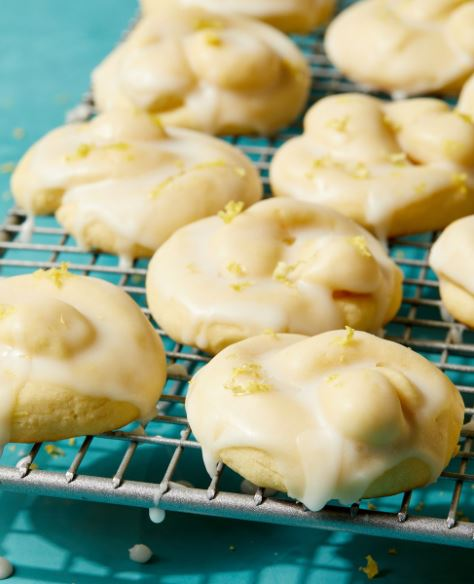

Initially a staple at weddings, symbolizing the act of “tying the knot,” these Italian cookies have expanded their presence to encompass festive holiday gatherings as well. The dough, possessing a balanced blend of softness and resilience, is enriched with the zest and juice of lemon before being meticulously fashioned into charming knots. Following their time in the oven, they undergo a delicate bath in a lemon-infused glaze and receive a final flourish of zest to amplify their citrusy allure.

[Get the Lemon Cookies recipe!](https://www.delish.com/cooking/recipe-ideas/a41411629/italian-lemon-cookies-recipe/)

### **Lemon Shortbread Cookies**

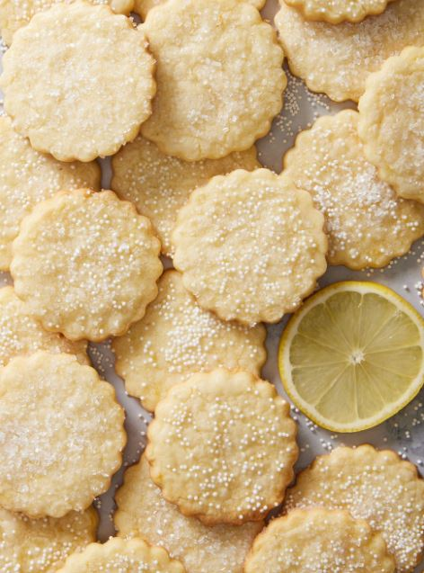

Embodying timeless elegance and simplicity, shortbread takes center stage in a subtle yet sophisticated manner. In this rendition, a delicate touch of lemon elevates the quintessential, buttery melt-in-the-mouth cookie.

[Get the Lemon Shortbread Cookies recipe!](https://www.delish.com/cooking/recipe-ideas/a41091401/lemon-shortbread-cookies-recipe/)

### **Chocolate Hazelnut Thumbprint Cookies**

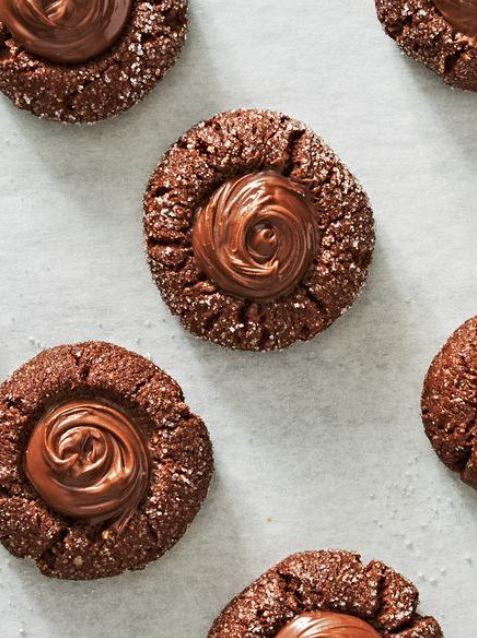

Step aside, peanut butter blossoms, as a fresh flavor sensation takes the spotlight. Prepare to be enamored with the enchanting nuttiness that hazelnut flour bestows upon these gianduja-inspired cookies. A touch of melted chocolate intensifies the cocoa essence of the dough, and the crowning glory comes in the form of velvety Nutella, providing a rich and indulgent finish.

[Get the Chocolate Hazelnut Thumbprint Cookies recipe!](https://www.delish.com/cooking/recipe-ideas/a37532850/chocolate-thumbprint-cookies-recipe/)

### **Icebox Cookies**

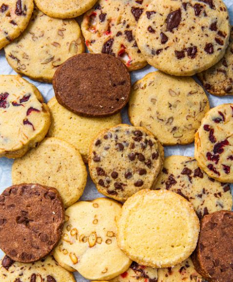

This Christmas cookie recipe serves as an excellent foundation for incorporating mix-ins, and while we’ve shared a selection of our cherished choices, don’t hesitate to let your creativity run wild!

[Get the Icebox Cookie recipe!](https://www.delish.com/holiday-recipes/christmas/a30210300/easy-icebox-cookies-recipe/)

### **Italian Rainbow Cookies**

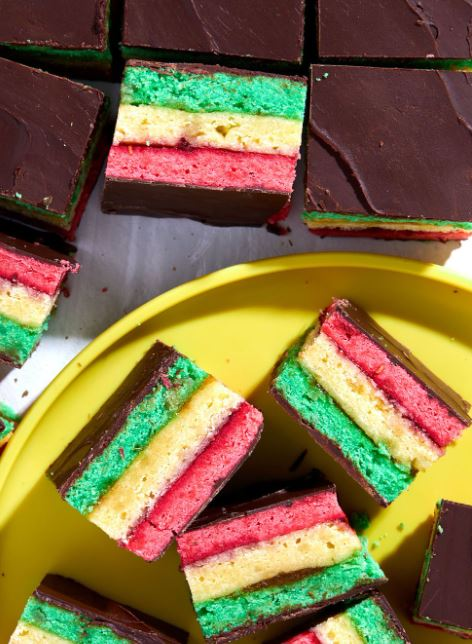

The vibrant allure of Italian rainbow cookies captures our attention whether they are neatly packaged on store shelves or elegantly displayed behind bakery glass counters. Now, the opportunity to create them in the comfort of your own home has arrived. While they lean more towards being cakes than traditional cookies, they remain a delightful addition to any festive Christmas cookie swap.

[Get the Italian Rainbow Cookies recipe!](https://www.delish.com/cooking/recipe-ideas/a35046740/italian-rainbow-cookies/)

### **Sugar Cookie Trees**

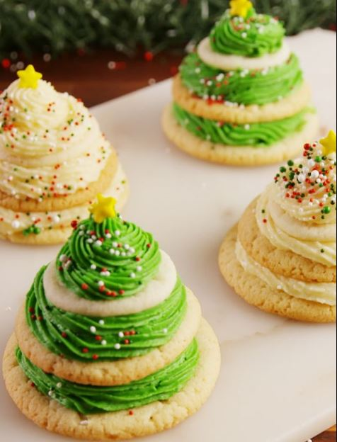

Elevate the appeal of your ordinary store-bought sugar cookies with a touch of enchantment in the form of Sugar Cookie Trees. If you’re seeking to add a delightful twist to your holiday treats, these charming tree-shaped cookies are the answer. Not only do they infuse a festive spirit into your culinary creations, but they also double as an engaging activity, particularly well-suited for a lively kid’s holiday gathering.

[Get the Sugar Cookie Trees recipe!](https://www.delish.com/cooking/recipe-ideas/recipes/a56870/sugar-cookie-trees-recipe/)

### **Krinkle Kringle Cookies**

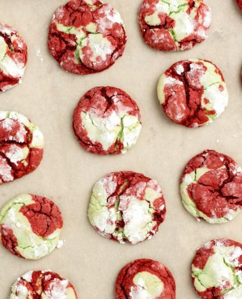

Crafted through an artful blend of two distinct doughs created from cake mix, these cookies exhibit a captivating swirl of flavors: the rich allure of red velvet and the vibrancy of green-tinted vanilla. This cookie will be the best choice for this holiday.

[Get the Krinkle Kringle Cookies recipe!](https://www.delish.com/holiday-recipes/christmas/recipes/a45284/kringle-krinkle-cookies-recipe/)

### **Pinwheel Cookies**

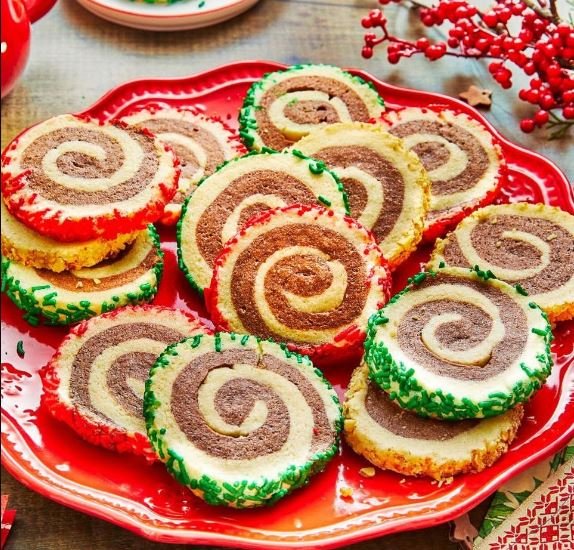

Elevate the charm and wonder of your Christmas dessert selection with the addition of delightful Pinwheel Cookies. These delectable treats, boasting a rich and buttery essence, not only tantalize the taste buds but also serve as a visual masterpiece on your holiday table.

[Get the Pinwheel Cookies recipe!](https://www.thepioneerwoman.com/food-cooking/recipes/a41333530/pinwheel-cookies-recipe/)

### **Pizzelle**

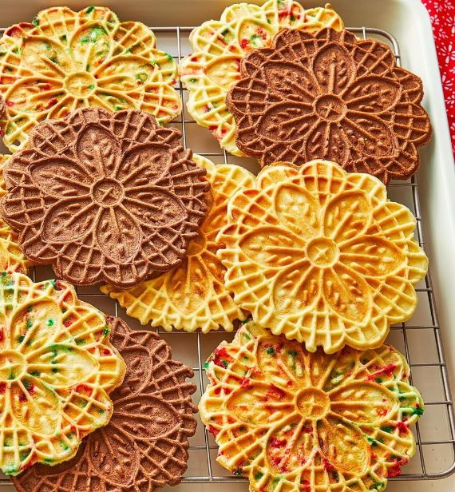

Discover a world of culinary creativity with Pizzelle, a beloved classic that comes to life in three delightful variations. Embark on a journey of taste and texture as you explore the traditional rendition, the festive confetti-infused version, and the indulgent chocolate twist. And why settle for just one when you can indulge in the sheer joy of crafting all three?

[Get the Pizzelle recipe!](https://www.thepioneerwoman.com/food-cooking/recipes/a41533522/pizzelle-recipe/)

### **Pistachio Star Cookies**

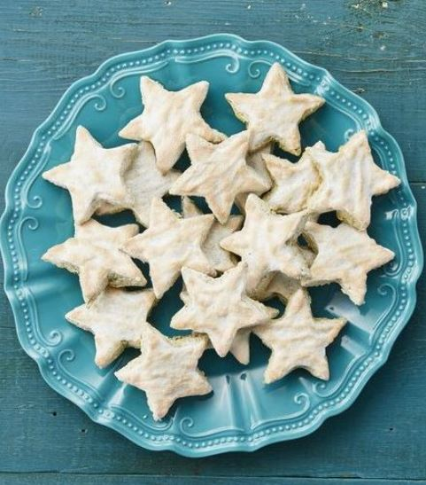

Step into the enchanting world of festive confections with Ralph Smith’s Pistachio Star Cookies. A delightful departure from convention, these cookies offer a playful twist on a cherished German Christmas cookie platter staple. While traditionally adorned with almonds, Ralph Smith invites you to embark on a culinary adventure by embracing the vibrant allure of pistachios.

[Get the Pistachio Star Cookies recipe!](https://www.thepioneerwoman.com/food-cooking/recipes/a34705251/gesine-prado-pistachio-star-cookies/)

_**Check Out:**_

- Delicious [Cookie Gift Baskets](https://avada.io/loveable/cookie-gift-baskets/)

- Creepy [Halloween Cookie Ideas](https://avada.io/loveable/blog/halloween-cookie-ideas/)

## **Bottom Line**

Baking these delightful Christmas cookies is not just about the end result—it’s about creating cherished memories and spreading the joy of the season. So gather your loved ones, put on your aprons, and let the magic of baking unfold in your kitchen. Happy holidays and happy baking!

- [30 Must-Try Christmas Cookies Recipes](https://avada.io/loveable/blog/christmas-cookie-recipes/#wp-block-heading-2-2)
    - [Spritz Cookies](https://avada.io/loveable/blog/christmas-cookie-recipes/#wp-block-heading-3-3)
    - [Christmas Tree Cookies](https://avada.io/loveable/blog/christmas-cookie-recipes/#wp-block-heading-3-7)
    - [Panettone Cookies](https://avada.io/loveable/blog/christmas-cookie-recipes/#wp-block-heading-3-12)
    - [Snowball Cookies](https://avada.io/loveable/blog/christmas-cookie-recipes/#wp-block-heading-3-16)
    - [Gingerbread Cookies](https://avada.io/loveable/blog/christmas-cookie-recipes/#wp-block-heading-3-20)
    - [Peanut Butter Blossoms](https://avada.io/loveable/blog/christmas-cookie-recipes/#wp-block-heading-3-24)
    - [White Chocolate Cranberry Orange Biscotti](https://avada.io/loveable/blog/christmas-cookie-recipes/#wp-block-heading-3-29)
    - [Snickerdoodles](https://avada.io/loveable/blog/christmas-cookie-recipes/#wp-block-heading-3-33)
    - [The Best Sugar Cookies](https://avada.io/loveable/blog/christmas-cookie-recipes/#wp-block-heading-3-37)
    - [Scottish Shortbread](https://avada.io/loveable/blog/christmas-cookie-recipes/#wp-block-heading-3-41)
    - [Oatmeal Brown Sugar Cookies With Raisins And Pecans](https://avada.io/loveable/blog/christmas-cookie-recipes/#wp-block-heading-3-45)
    - [Double Chocolate Biscotti](https://avada.io/loveable/blog/christmas-cookie-recipes/#wp-block-heading-3-49)
    - [Almond Biscotti](https://avada.io/loveable/blog/christmas-cookie-recipes/#wp-block-heading-3-53)
    - [Coconut Macaroons](https://avada.io/loveable/blog/christmas-cookie-recipes/#wp-block-heading-3-57)
    - [Baileys Chocolate Truffles](https://avada.io/loveable/blog/christmas-cookie-recipes/#wp-block-heading-3-61)
    - [Copycat Chessmen Cookies](https://avada.io/loveable/blog/christmas-cookie-recipes/#wp-block-heading-3-65)
    - [Kolaczki Cream Cheese Cookies](https://avada.io/loveable/blog/christmas-cookie-recipes/#wp-block-heading-3-69)
    - [Polvorones](https://avada.io/loveable/blog/christmas-cookie-recipes/#wp-block-heading-3-73)
    - [Checkerboard Cookies](https://avada.io/loveable/blog/christmas-cookie-recipes/#wp-block-heading-3-77)
    - [Ma’amoul](https://avada.io/loveable/blog/christmas-cookie-recipes/#wp-block-heading-3-81)
    - [Lemon Cookies](https://avada.io/loveable/blog/christmas-cookie-recipes/#wp-block-heading-3-85)
    - [Lemon Shortbread Cookies](https://avada.io/loveable/blog/christmas-cookie-recipes/#wp-block-heading-3-89)
    - [Chocolate Hazelnut Thumbprint Cookies](https://avada.io/loveable/blog/christmas-cookie-recipes/#wp-block-heading-3-93)
    - [Icebox Cookies](https://avada.io/loveable/blog/christmas-cookie-recipes/#wp-block-heading-3-97)
    - [Italian Rainbow Cookies](https://avada.io/loveable/blog/christmas-cookie-recipes/#wp-block-heading-3-101)
    - [Sugar Cookie Trees](https://avada.io/loveable/blog/christmas-cookie-recipes/#wp-block-heading-3-105)
    - [Krinkle Kringle Cookies](https://avada.io/loveable/blog/christmas-cookie-recipes/#wp-block-heading-3-109)
    - [Pinwheel Cookies](https://avada.io/loveable/blog/christmas-cookie-recipes/#wp-block-heading-3-113)
    - [Pizzelle](https://avada.io/loveable/blog/christmas-cookie-recipes/#wp-block-heading-3-117)
    - [Pistachio Star Cookies](https://avada.io/loveable/blog/christmas-cookie-recipes/#wp-block-heading-3-121)
- [Bottom Line](https://avada.io/loveable/blog/christmas-cookie-recipes/#wp-block-heading-2-128)

### [Blake Simpson](https://avada.io/loveable/author/blake/)

Hi, I'm Blake from Loveable. I help people find perfect gifts for occasions like anniversaries and weddings. I also write a blog about holidays, sharing insights to make them more meaningful. Let's create unforgettable moments together!

- [Twitter](https://twitter.com/intent/tweet)
- [Facebook](https://www.facebook.com/sharer/sharer.php)
- [instagram](https://avada.io/loveable/blog/christmas-cookie-recipes/)
- [pinterest](https://www.pinterest.com/loveablellc/)

## Related Posts

[### 120+ Christian Birthday Wishes To Spread Your Love](https://avada.io/loveable/blog/christian-birthday-wishes/) 

[

### 35 Best 70th Birthday Ideas To Celebrate The Special Milestone

](https://avada.io/loveable/blog/70th-birthday-ideas/)

[

### 50 Best 30th Birthday Decorations for a Remarkable Birthday Bash

](https://avada.io/loveable/blog/30th-birthday-decorations/)

[

### 40 Delicious Vegan Christmas Desserts to Delight Your Palate

](https://avada.io/loveable/blog/vegan-christmas-desserts/)

[

### 60 Christmas Team Building Activities to Boost Workplace Spirit

](https://avada.io/loveable/blog/christmas-team-building-activities/)
