This article has been written and researched by our expert Loveable through a precise methodology. [Learn more about our methodology](https://avada.io/loveable/our-methodological.html)

[Loveable](https://avada.io/loveable/) > [Blog](https://avada.io/loveable/blog/) > [Holiday](https://avada.io/loveable/holiday/)

# 30+ Classic Christmas Movies Of All Time For This Holiday Season

Written by [Blake Simpson](https://avada.io/loveable/author/blake/) Last Updated on October 03, 2023

- [30+ Classic Christmas Movies You Cannot Miss](https://avada.io/loveable/blog/classic-christmas-movies/#wp-block-heading-2-3)
    - [Miracle on 34th Street (1947)](https://avada.io/loveable/blog/classic-christmas-movies/#wp-block-heading-3-4)
    - [Rudolph the Red-Nosed Reindeer (1964)](https://avada.io/loveable/blog/classic-christmas-movies/#wp-block-heading-3-7)
    - [Holiday Inn (1942)](https://avada.io/loveable/blog/classic-christmas-movies/#wp-block-heading-3-10)
    - [White Christmas (1954)](https://avada.io/loveable/blog/classic-christmas-movies/#wp-block-heading-3-13)
    - [It’s a Wonderful Life (1947)](https://avada.io/loveable/blog/classic-christmas-movies/#wp-block-heading-3-16)
    - [A Charlie Brown Christmas (1965)](https://avada.io/loveable/blog/classic-christmas-movies/#wp-block-heading-3-19)
    - [The Holiday (2006)](https://avada.io/loveable/blog/classic-christmas-movies/#wp-block-heading-3-22)
    - [The Muppet Christmas Carol (1992)](https://avada.io/loveable/blog/classic-christmas-movies/#wp-block-heading-3-25)
    - [A Christmas Carol (1951)](https://avada.io/loveable/blog/classic-christmas-movies/#wp-block-heading-3-28)
    - [The Holly and the Ivy (1952)](https://avada.io/loveable/blog/classic-christmas-movies/#wp-block-heading-3-31)
    - [A Christmas Story (1983)](https://avada.io/loveable/blog/classic-christmas-movies/#wp-block-heading-3-34)
    - [Christmas Lilies of the Field (1979)](https://avada.io/loveable/blog/classic-christmas-movies/#wp-block-heading-3-37)
    - [How the Grinch Stole Christmas (1966)](https://avada.io/loveable/blog/classic-christmas-movies/#wp-block-heading-3-40)
    - [National Lampoon’s Christmas Vacation (1989)](https://avada.io/loveable/blog/classic-christmas-movies/#wp-block-heading-3-43)
    - [Home Alone (1990)](https://avada.io/loveable/blog/classic-christmas-movies/#wp-block-heading-3-46)
    - [Meet Me in St. Louis (1944)](https://avada.io/loveable/blog/classic-christmas-movies/#wp-block-heading-3-49)
    - [Elf (2003)](https://avada.io/loveable/blog/classic-christmas-movies/#wp-block-heading-3-52)
    - [Desk Set (1957)](https://avada.io/loveable/blog/classic-christmas-movies/#wp-block-heading-3-55)
    - [Christmas in Connecticut (1945)](https://avada.io/loveable/blog/classic-christmas-movies/#wp-block-heading-3-58)
    - [The Nightmare Before Christmas (1993)](https://avada.io/loveable/blog/classic-christmas-movies/#wp-block-heading-3-61)
    - [A Norman Rockwell Christmas Story (1996)](https://avada.io/loveable/blog/classic-christmas-movies/#wp-block-heading-3-64)
    - [The Shop Around the Corner (1940)](https://avada.io/loveable/blog/classic-christmas-movies/#wp-block-heading-3-67)
    - [Love Actually (2003)](https://avada.io/loveable/blog/classic-christmas-movies/#wp-block-heading-3-70)
    - [KL Studio Classics Christmas in July (1940)](https://avada.io/loveable/blog/classic-christmas-movies/#wp-block-heading-3-73)
    - [The Snowman (1982)](https://avada.io/loveable/blog/classic-christmas-movies/#wp-block-heading-3-76)
    - [The Apartment (1960)](https://avada.io/loveable/blog/classic-christmas-movies/#wp-block-heading-3-79)
    - [Dr. Seuss’ How The Grinch Stole Christmas (2000)](https://avada.io/loveable/blog/classic-christmas-movies/#wp-block-heading-3-82)
    - [Jingle All the Way (1996)](https://avada.io/loveable/blog/classic-christmas-movies/#wp-block-heading-3-85)
    - [Remember the Night (1940)](https://avada.io/loveable/blog/classic-christmas-movies/#wp-block-heading-3-88)
    - [The Polar Express (2004)](https://avada.io/loveable/blog/classic-christmas-movies/#wp-block-heading-3-91)
    - [A Dream For Christmas (1973)](https://avada.io/loveable/blog/classic-christmas-movies/#wp-block-heading-3-94)
- [Bottom Line](https://avada.io/loveable/blog/classic-christmas-movies/#wp-block-heading-2-98)

As the festive season embraces us once more, there’s nothing quite like the nostalgic charm and heartwarming magic of **classic Christmas movies** to kindle our holiday spirit. These timeless cinematic gems have adorned our screens for generations, becoming cherished traditions that transcend time and age. From the enchanting escapades of “It’s a Wonderful Life” and the whimsical journey aboard the “Polar Express”, to the mischievous antics of “Home Alone” and the heartfelt adventures in “Miracle on 34th Street”, these films bring joy, laughter, and tears of happiness year after year.

As twinkling lights embellish homes and the aroma of gingerbread fills the air, settling in with these time-honored tales becomes a cherished ritual, reminding us that the true meaning of Christmas lies in the warmth of love, the spirit of giving, and the belief in miracles.

## **30+ Classic Christmas Movies You Cannot Miss**

### **[Miracle on 34th Street (1947)](https://www.amazon.com/Miracle-34th-Street-Maureen-OHara/dp/B003CSV7TK)**

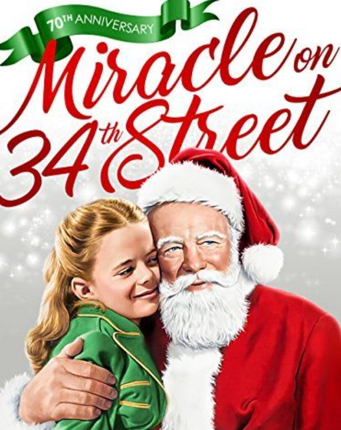

In the original film portraying a man who believed he was Santa Claus, the leading roles were expertly portrayed by Maureen O’Hara and John Payne. This classic Christmas movie, directed by George Seaton in 1947, showcases the tale of New York City authorities sending the man to a mental facility. While some may argue for their preference for the John Hughes version featuring Mara Wilson, it is undeniable that the 1947 prototype laid the foundation for the heartwarming miracle that this story has become.

### **[Rudolph the Red-Nosed Reindeer (1964)](https://www.amazon.com/Rudolph-Red-Nosed-Reindeer-Larry-Mann/dp/B09M699B8F/ref=sr_1_1?keywords=Rudolph+the+Red-Nosed+Reindeer&qid=1690795240&s=instant-video&sr=1-1)**

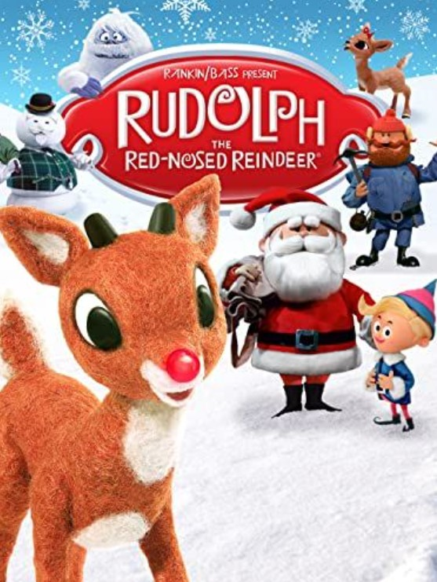

Rudolph and Frosty, along with their companion holiday classics, form a feature-length film that couldn’t have foreseen its popularity for over 50 years. Moreover, no Christmas holiday would be complete without a stop-motion tale narrated by Burl Ives.

### **[Holiday Inn (1942)](https://www.amazon.com/dp/B000M39HB8)**

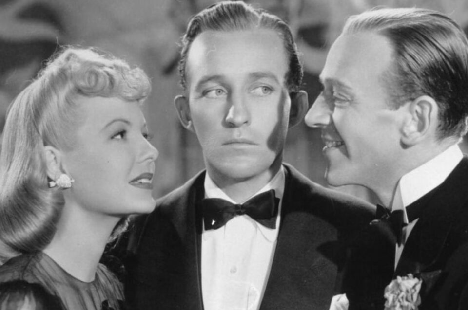

The holidays become even more enchanting with a captivating love triangle! This classic Christmas movie features Bing Crosby and Fred Astaire serenading their respective love interests. The holiday melody “White Christmas” was crafted exclusively for this film, and its success eventually led to another movie inspired by the song.

### **[White Christmas (1954)](https://www.amazon.com/White-Christmas-Bing-Crosby/dp/B00ANLKIIU/ref=sr_1_1?keywords=White+Christmas&qid=1690795441&s=instant-video&sr=1-1)**

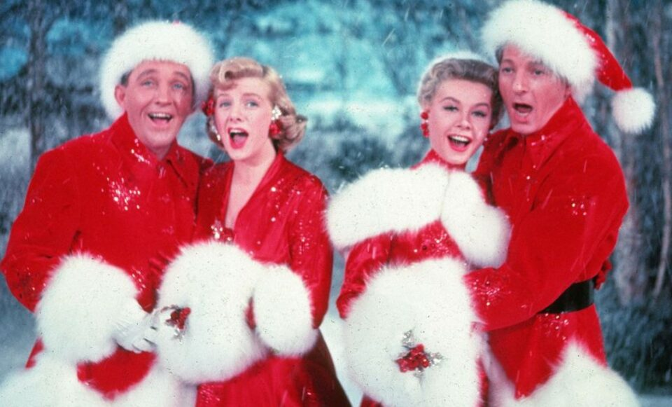

The reason behind having two snowy Irving Berlin tales, both starring Bing Crosby and set in General Waverly’s Inn remains a mystery. Nevertheless, we see it as a delightful present from Cine-Santa, giving us the perfect excuse to enjoy a fantastic double feature. It’s a true [holiday treat](https://avada.io/loveable/christmas-gift-baskets-families/)!

### **[It’s a Wonderful Life (1947)](https://www.amazon.com/Its-Wonderful-Life-James-Stewart/dp/B07JNJQTSX/ref=sr_1_1?crid=2DBQMPCDIUJR4&keywords=It%E2%80%99s+a+Wonderful+Life&qid=1690795481&s=instant-video&sprefix=it+s+a+wonderful+life%2Cinstant-video%2C547&sr=1-1)**

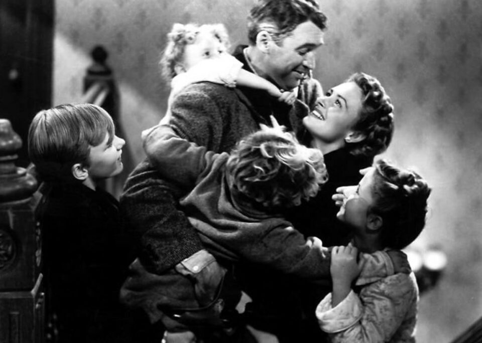

Director Frank Capra’s fantasy drama, with its hard-won uplift and triumph, has retained its power over the decades without diminishing. Portraying the iconic role of George Bailey, a banker who learns the true worth of his life through an encounter with his guardian angel, James Stewart delivers his most memorable performance. According to the American Film Institute, “It’s a Wonderful Life” stands as the most inspiring movie of all time.

### **[A Charlie Brown Christmas (1965)](https://www.amazon.com/Charlie-Brown-Christmas-Ann-Altieri/dp/B015X7G3P0/ref=sr_1_1?keywords=A+Charlie+Brown+Christmas&qid=1690795711&s=instant-video&sr=1-1)**

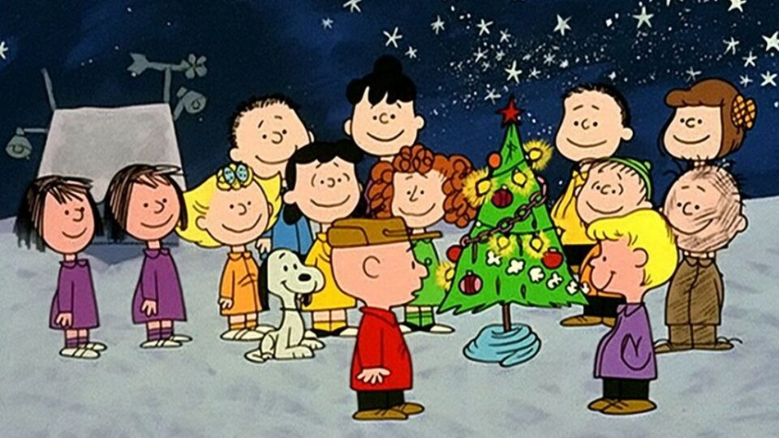

“A Charlie Brown Christmas” is proof that captivating millions doesn’t necessarily demand a lavish budget. This classic Christmas movie, with its jazzy and understated charm, first graced TV screens during the international Peanuts phenomenon in the mid-1960s. Since then, it has become an enduring Yuletide tradition, enchanting audiences year after year.

### **[The Holiday (2006)](https://www.amazon.com/Holiday-Cameron-Diaz/dp/B009NW9QE2/ref=sr_1_1?crid=16UMR1CJZ1EDC&keywords=The+Holiday&qid=1690795728&s=instant-video&sprefix=a+charlie+brown+christmas%2Cinstant-video%2C560&sr=1-1)**

“The Holiday” offers the delightful fusion of two Nancy Meyers rom-com movies packed into a single cinematic experience. With Cameron Diaz and Kate Winslet as the protagonists, the story revolves around their decision to exchange homes during the holiday season, leading to a picturesque switch between a stunning Los Angeles residence and a charming English cottage. Amidst the enchanting ambiance of twinkling lights and wintery atmosphere, both women unexpectedly discover romantic connections across the Atlantic.

### **[The Muppet Christmas Carol (1992)](https://www.amazon.com/Muppet-Christmas-Carol-Dave-Goelz/dp/B008Y7IFSA/ref=sr_1_1?crid=WEHSOWF00PB2&keywords=The+Muppet+Christmas+Carol&qid=1690795902&s=instant-video&sprefix=a+dream+for+christmas%2Cinstant-video%2C1019&sr=1-1)**

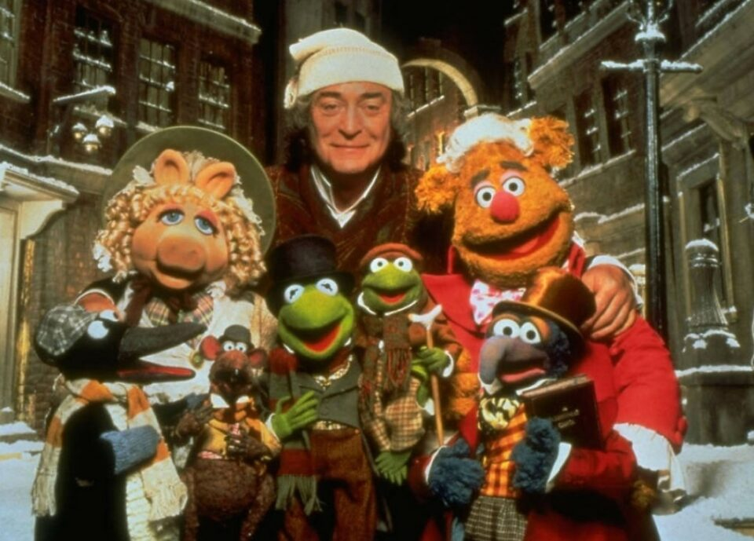

Numerous versions of the Christmas Carols exist, but this Muppets holiday masterpiece unites all your beloved characters, such as Kermit, Miss Piggy, and Gonzo, alongside Academy Award-winning actor Michael Caine. Collectively, they bring to life the timeless Charles Dickens tale, embellished with captivating musical numbers and infused with the joy and hilarity of Jim Henson’s beloved Muppet characters.

### **[A Christmas Carol (1951)](https://www.amazon.com/Christmas-Carol-Alastair-Sim/dp/B0B5PN5BJV/ref=sr_1_3?crid=3S8OX36GYMOAP&keywords=a+christmas+carol&qid=1690796022&s=instant-video&sprefix=A+Christmas+Carol%2Cinstant-video%2C299&sr=1-3)**

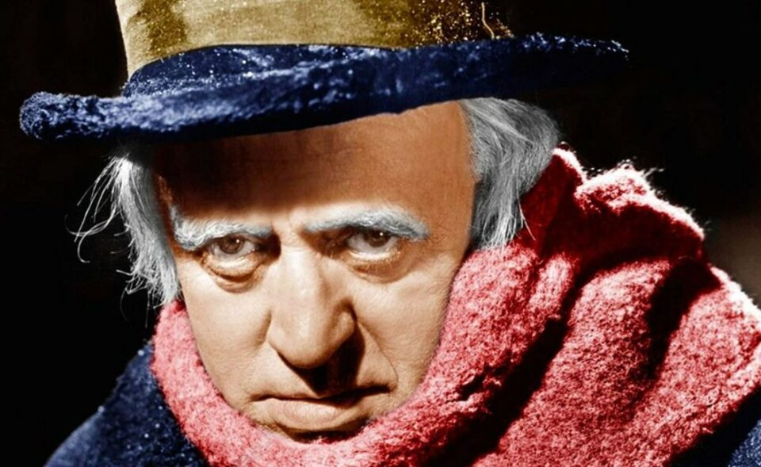

It’s a no-brainer to watch the time-honored Charles Dickens classic, where a miser transforms after encounters with three ghosts. However, selecting the right version from numerous adaptations can be overwhelming. Don’t fret; we’ve got you covered. If you prefer sticking to tradition, opt for the Brian Desmond Hurst/Alistair Sim crowd-pleaser, “A Christmas Carol”.

### **[The Holly and the Ivy (1952)](https://www.amazon.com/dp/B002LZKKZW)**

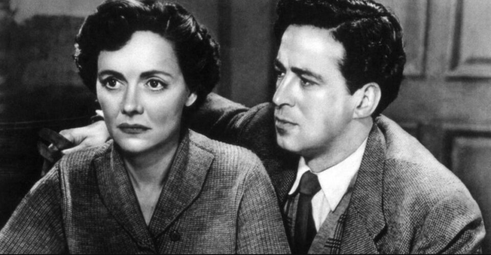

In this heartwarming English tale, a family comes together to celebrate the [Christmas holiday](https://avada.io/loveable/personalized-christmas-ornaments/), only to be pleasantly surprised by the unexpected arrival of their patriarch, who had been distant from his loved ones. The film beautifully captures all the essential elements that define a classic Christmas movie – scenes of heavy snowfall, close-ups of crackling fires, and the enchanting melodies of Christmas carols.

### **[A Christmas Story (1983)](https://www.amazon.com/dp/B009IU78LM)**

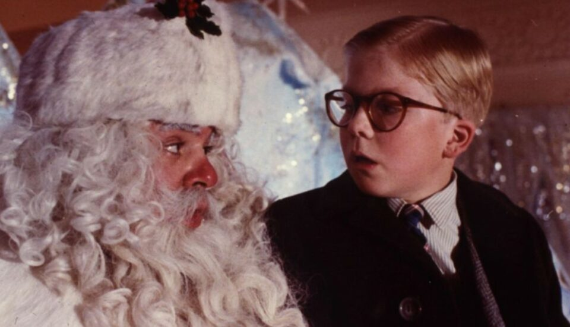

If Ralphie Parker didn’t passionately express his wish for an “official Red Ryder, carbine action, 200-shot, range model air rifle, with a compass in the stock and this thing that tells time”, did Christmas ever come true? This has evolved into an unwritten rule, partly due to its frequent airing on cable networks for 24 hours each year. We all gather to watch Bob Clark’s heartwarming story about a young boy in the 1940s, determined to convince Santa to grant him a BB gun.

### **[Christmas Lilies of the Field (1979)](https://www.amazon.com/dp/B013UGJK42)**

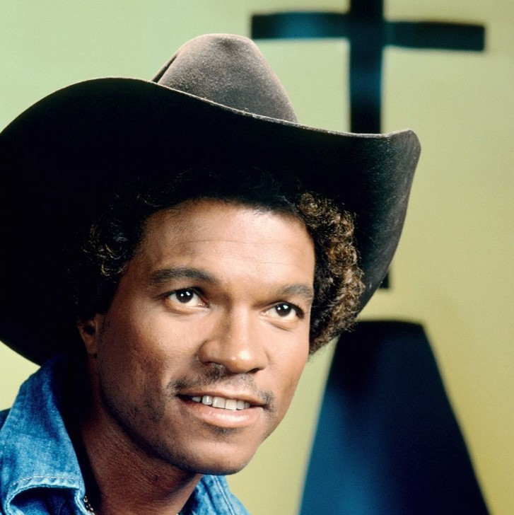

Sidney Poitier may be absent, but this small-screen sequel to the renowned 1963 classic, “Lilies of the Field”, retains its captivating charm. Featuring Billy Dee Williams as Homer, the film continues to enchant audiences even after decades since its release. As Homer revisits the chapel he once assisted in building, he discovers the nuns’ compassionate act of welcoming homeless children. Touched by this gesture, he readily lends a helping hand to the school and orphanage. Truly, this film remains a timeless gift that continues to inspire.

### **[How the Grinch Stole Christmas (1966)](https://www.amazon.com/Grinch-Stole-Christmas-Horton-Hears/dp/B001M6KTM0/ref=sr_1_2?crid=7VD5Q8Z7VEIM&keywords=How+the+Grinch+Stole+Christmas%21+%2F+Horton+Hears+a+Who%21&qid=1690797099&s=instant-video&sprefix=%2Cinstant-video%2C279&sr=1-2)**

Dr. Seuss’ grumpy green monster may be just what you need to warm your heart this winter season if you’ve found yourself with a frigid heart this Christmas. Interestingly, in the original creation, Seuss’s Grinch was depicted in black and white, with pink eyes. However, for the screen adaptation, Chuck Jones transformed himself into the iconic green character we all know and love.

### **[National Lampoon’s Christmas Vacation (1989)](https://www.amazon.com/dp/B000GOU4M4)**

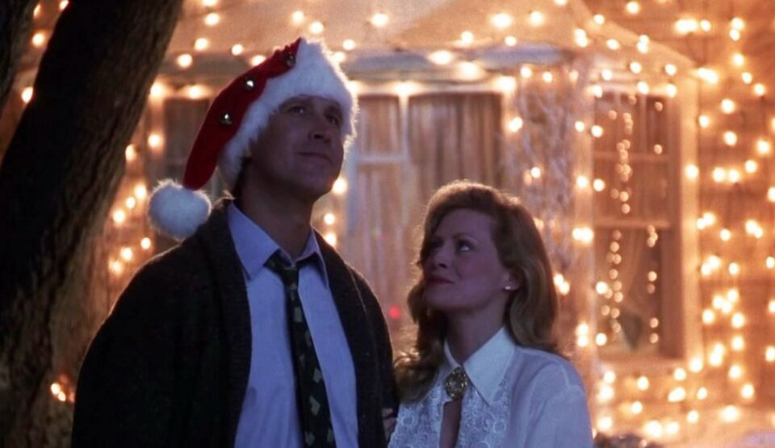

Despite the title featuring the word vacation, the Griswold family, led by patriarch Clark, is not embarking on a leisurely trip in this 1989 classic; instead, they are heading straight for the chaos of Crazy Town. Clark (Chevy Chase) and Ellen (Beverly D’Angelo) are gearing up to host a large family get-together at their Chicago home. They are fully aware of the dysfunction that will accompany the arrival of quirky relatives such as Cousin Eddie, Aunt Bethany, and Snots, a Rottweiler.

### **[Home Alone (1990)](https://www.amazon.com/dp/B0031QNMKK)**

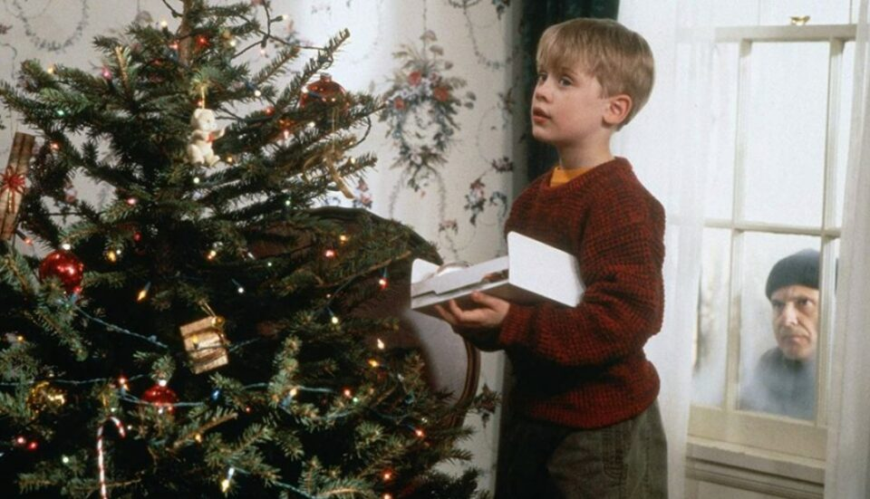

The McCallister family embarks on a journey from Chicago to Paris during the Christmas season. In a hilarious twist of fate, they unintentionally forget their mischievous 8-year-old son at home. Alone and undeterred, he must now protect their expansive three-story house from two inept burglars. This classic Christmas movie catapulted Macaulay Culkin into a household name and solidified John Hughes’s box-office beast as an iconic holiday classic.

### **[Meet Me in St. Louis (1944)](https://www.amazon.com/Meet-St-Louis-Judy-Garland/dp/B008XKZTQE/ref=sr_1_1?keywords=Meet+Me+in+St.+Louis&qid=1690797396&s=instant-video&sr=1-1)**

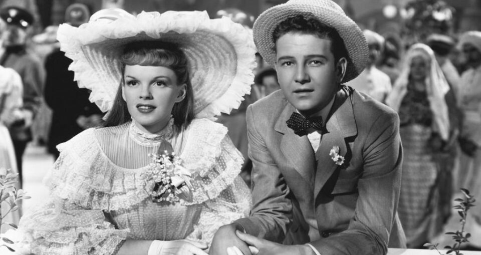

In this Technicolor musical, Judy Garland takes on the role of Esther Smith, the daughter of a family planning to make a permanent move to New York. The movie follows their journey throughout the entire year leading up to the relocation, with Christmas being just a brief segment. However, Garland’s heartfelt rendition of “Have Yourself a Merry Little Christmas” leaves a lasting impression, earning it a well-deserved spot on our list of holiday favorites. Additionally, this film is also featured in another beloved holiday classic, “The Family Stone”.

### **[Elf (2003)](https://www.amazon.com/Elf-Will-Ferrell/dp/B09PQJ6DHK/ref=sr_1_1?crid=JUND8WECHVID&keywords=elf&qid=1690797489&s=instant-video&sprefix=e%2Cinstant-video%2C548&sr=1-1)**

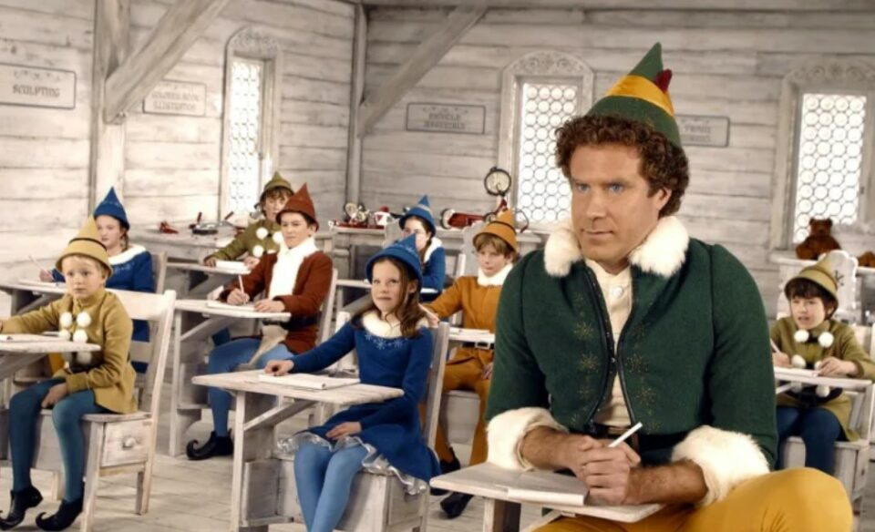

Christmas doesn’t feel complete until Will Ferrell puts on that festive, Kelly-green Buddy tunic and joyfully strolls through the streets in New York, reminiscent of a happy child in a candy store. Playing the role of a spirited man-child on a mission to reconnect with his long-lost biological father, Ferrell takes the lead as Santa’s beloved helper in the classic Christmas movie directed by Jon Favreau and featuring the charming Zooey Deschanel.

### **[Desk Set (1957)](https://www.amazon.com/dp/B002B3ATBE)**

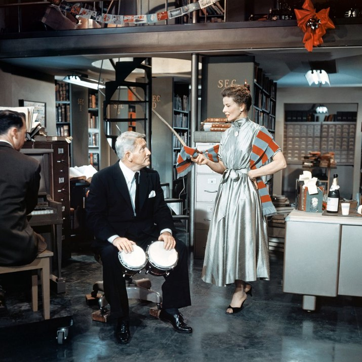

The annual office Christmas party pales compared to the lively escapades showcased in this Walter Lang masterpiece. Streamable in vivid Technicolor, the movie features Spencer Tracy and Katharine Hepburn as two polar opposites, clashing over the fate of their network. Most of the film unfolds within their bustling Manhattan workplace, with the Rockefeller tree making a charming cameo appearance.

### **[Christmas in Connecticut (1945)](https://www.amazon.com/dp/B00316WYGI)**

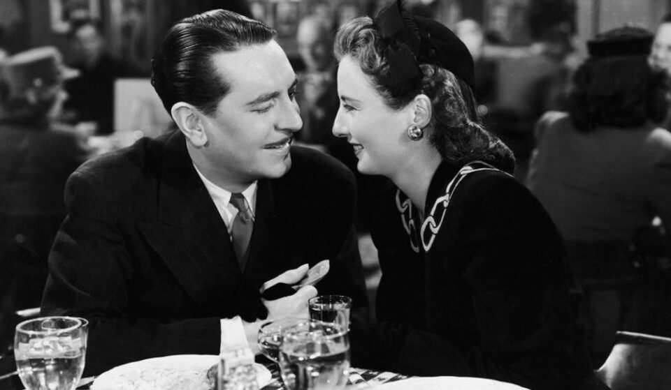

Prepare a fresh cookie batch for a hilarious comedy about a writer who pretends to be Susie Homemaker with oven skills that would impress Dominique Crenn. However, her cover is threatened during a holiday in the Northeast.

### **[The Nightmare Before Christmas (1993)](https://www.amazon.com/Tim-Burtons-Nightmare-Before-Christmas/dp/B003SI05PG/ref=sr_1_1?keywords=The+Nightmare+Before+Christmas&qid=1690798298&s=instant-video&sr=1-1)**

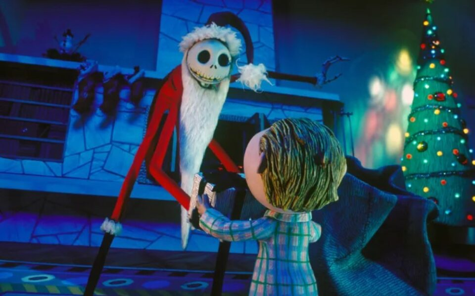

Similar to the classic Christmas movie “Gremlins”, director Tim Burton’s unique creation, “The Nightmare Before Christmas” blends Halloween and Christmas elements to form one of the most chilling movies for children. This stop-motion musical has achieved such iconic status and widespread popularity that it has become a brand itself.

### **[A Norman Rockwell Christmas Story (1996)](https://www.amazon.com/dp/B017VA33MI)**

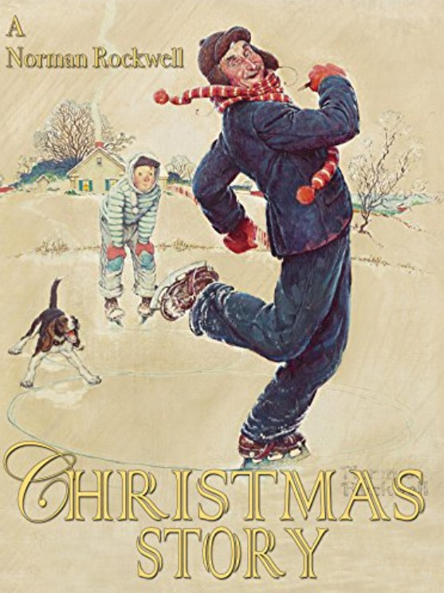

Experience the epitome of classic charm with a Norman Rockwell painting coming to life in this delightful film, embracing the essence of Christmas in all its heartwarming glory. Immerse yourself in the allure of this masterpiece as it captures the joyous spirit of the season, offering an abundance of festive delights that will surely warm your heart.

### **[The Shop Around the Corner (1940)](https://www.amazon.com/dp/B004GAKENI)**

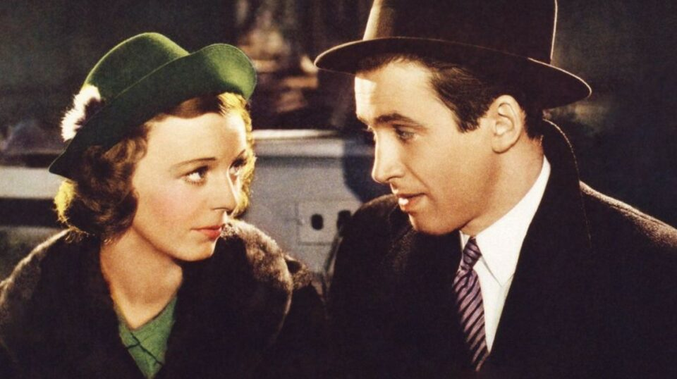

“You’ve Got Mail” drew inspiration from a timeless 1940 classic, which centers around two shop workers engaged in a festive rivalry during holiday sales. Amidst their bickering, enchanting romance blossoms through their letters exchanged as pen pals. This classic Christmas movie captures the allure of mysterious love through the written word. While it may lack a Santa appearance, it boasts the brilliant presence of James Stewart, making it a must-watch for the holiday season.

### **[Love Actually (2003)](https://www.amazon.com/Love-Actually-Bill-Nighy/dp/B001JIES4Q)**

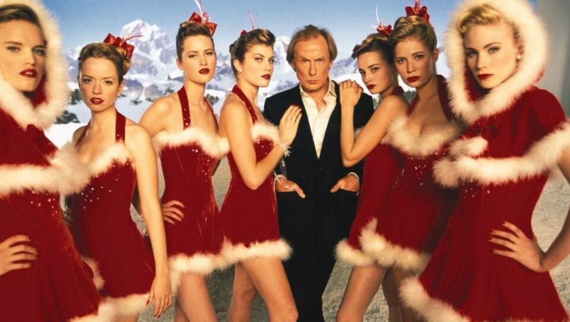

In Richard Curtis’s enchanting British Christmas ensemble film, we find it hard to pick just one favorite aspect. Whether it is Bill Nighy’s captivating performance as a pelvis-swiveling rock star, Colin Firth’s endearing journey through lost translation, or Hugh Grant’s humorous quest to find true love by knocking on residents’ doors, each moment adds charm to this romp. The movie effortlessly blends laughter and warmth with sad moments that tug at our hearts.

### **[KL Studio Classics Christmas in July (1940)](https://www.amazon.com/dp/B07XC9K961)**

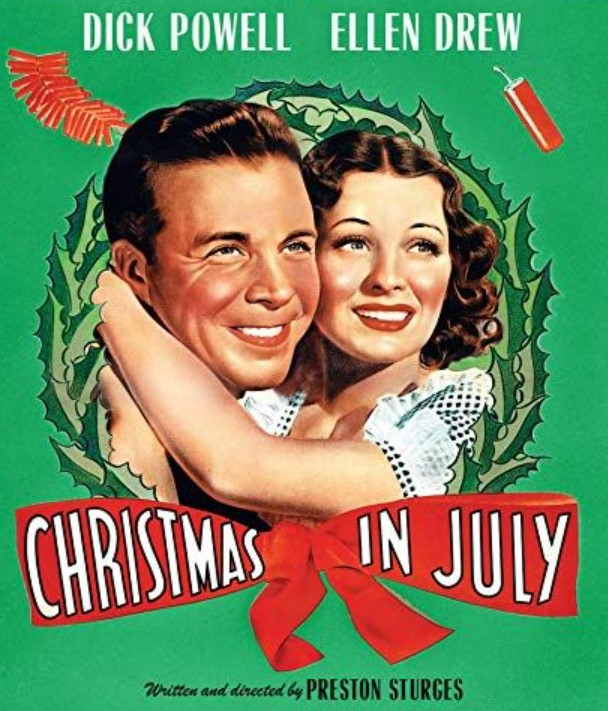

In this classic Christmas movie, let’s follow the journey of a young man who unsuspectingly falls prey to his colleagues’ clever trick, convincing him that he has won a slogan contest. Little does he know that the grand orchestrator of this prank is none other than the President of the company himself. The stage is set for an intriguing twist, and the story delves into the aftermath when the truth inevitably comes to light.

### **[The Snowman (1982)](https://www.amazon.com/Snowman-Dianne-Jackson/dp/B00R62KJAG/)**

Many childhoods were filled with the animated film adaptation of Raymond Briggs’ book, which was broadcast on British television every year. Nominated for an Oscar, this short film tells the story of a young boy whose snowman comes to life through enchantment, though only temporarily. Enhanced by the haunting melody of “Walking In The Air”, it has earned its place as a genuine Christmas classic.

### **[The Apartment (1960)](https://www.amazon.com/dp/B004AUFVU0)**

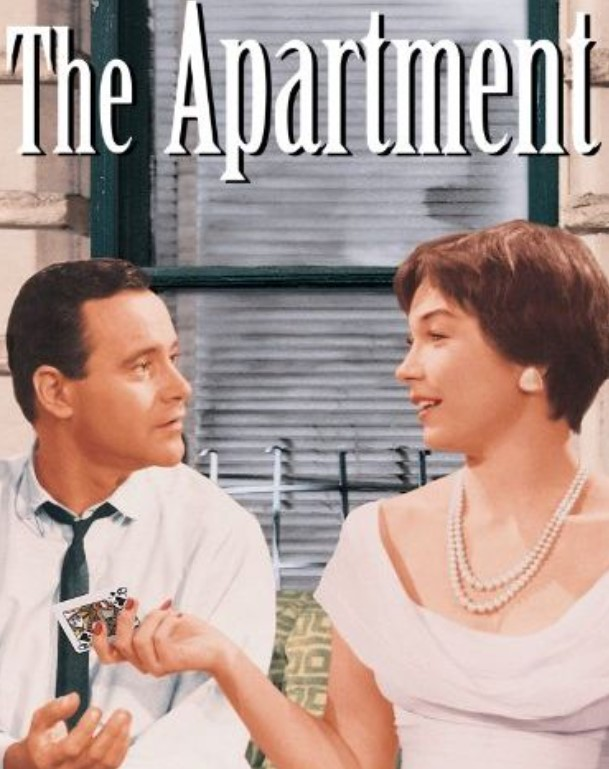

“The Apartment” is a classic Christmas movie that blends romance, comedy, and holiday spirit perfectly. Directed by Billy Wilder, this 1960 gem follows the endearing tale of C.C. Baxter (Jack Lemmon), an office worker whose apartment becomes a covert rendezvous spot for philandering executives. During Christmas, Baxter finds himself smitten with Fran Kubelik (Shirley MacLaine), an elevator girl entangled in an affair with his boss.

### **[Dr. Seuss’ How The Grinch Stole Christmas (2000)](https://www.amazon.com/Dr-Seuss-Grinch-Stole-Christmas/dp/B009CG9LZI)**

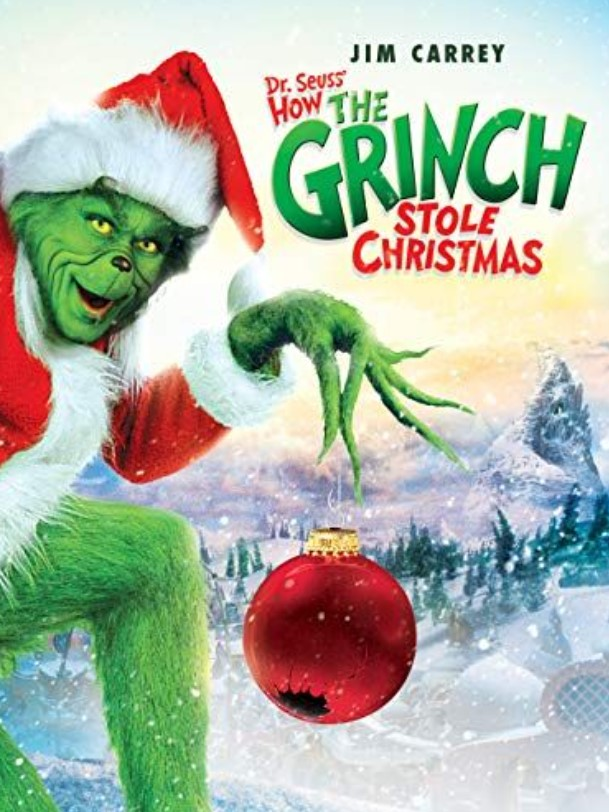

In this film adaptation of the famous Dr. Seuss book and cartoon, award-winning director Ron Howard brings our favorite Christmas grump to life. Jim Carrey delivers a remarkable performance as the cold-hearted Mr. Grinch, who embarks on a mission to wreck Christmas in Whoville. Little does he know that this mischievous endeavor will lead him to an unexpected journey of self-discovery, ultimately finding his heart and embracing the true Christmas spirit.

### **[Jingle All the Way (1996)](https://www.amazon.com/dp/B00A8OW0WO)**

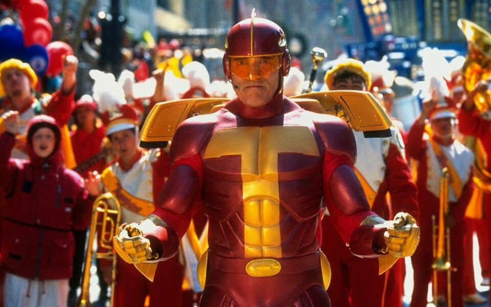

Get ready to smile from ear to ear each holiday season with this classic featuring Arnold Schwarzenegger, Rita Wilson, Sinbad, and Phil Hartman. Meet Howard, the workaholic father portrayed by Schwarzenegger, who often disappoints his family due to his busy schedule. However, everything changes when his young son Jamie, played by Jake Lloyd, desperately begs for a popular action figure for Christmas. Witness Howard embarks on an epic and heartwarming mission to fulfill his son’s dream.

### **[Remember the Night (1940)](https://www.amazon.com/Remember-Night-Barbara-Stanwyck/dp/B0047O2FPI)**

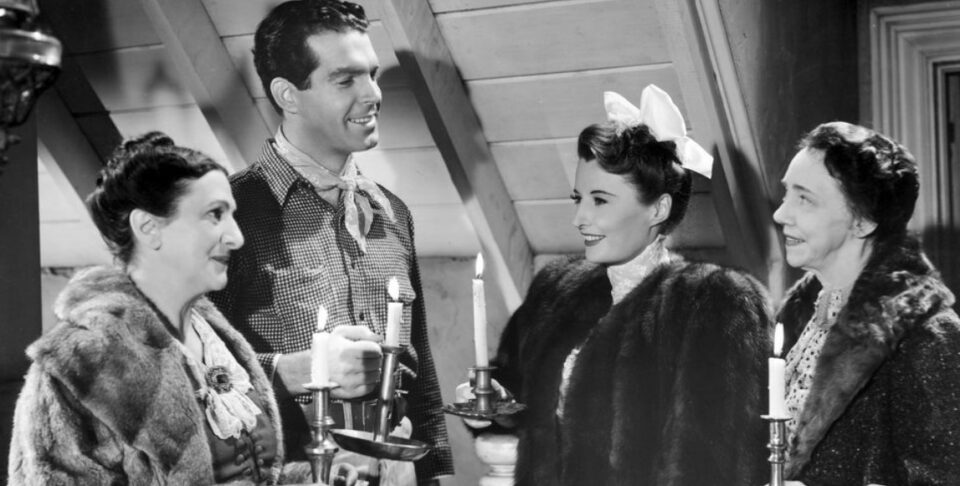

Looking for a heartwarming Christmas-in-the-courtroom film? Mitchell Leisen’s black-and-white rom-com might just be the perfect choice! The story unfolds during a court recess over the festive season, where district attorney John Sargent unexpectedly finds himself falling for the shoplifter he’s prosecuting. Prepare to be charmed by this classic tale of love and holiday magic!

### **[The Polar Express (2004)](https://www.amazon.com/dp/B0011TNVLY)**

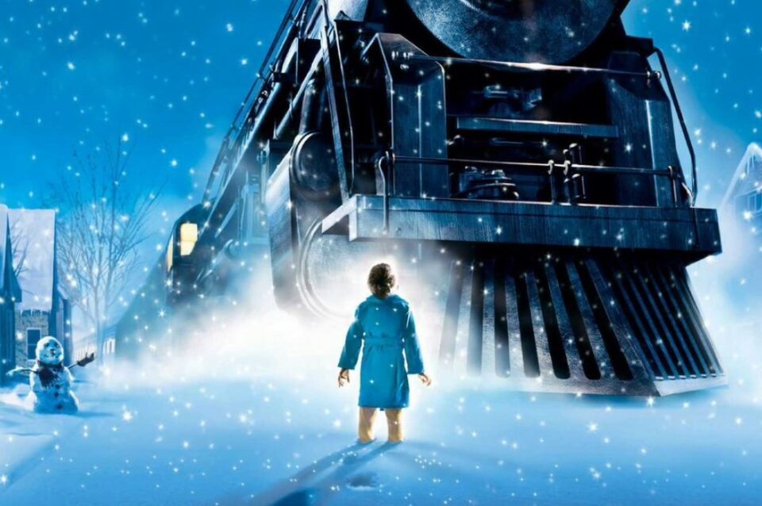

The movie’s animation style serves the story best, brilliantly capturing the freezing ambiance of the North Pole and the magic of the train headed there. ‘The Polar Express’ draws inspiration from Chris Van Allsburg’s beloved picture book, sharing the same name.

### **[A Dream For Christmas (1973)](https://www.amazon.com/Dream-Christmas-VHS-Hari-Rhodes/dp/6302842425)**

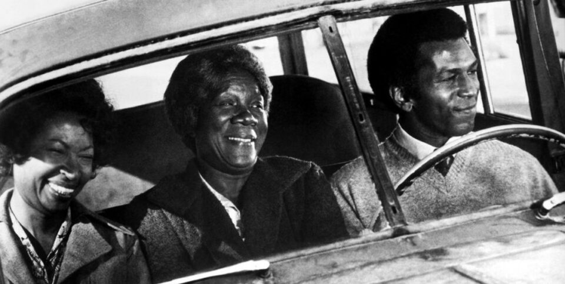

Created during the 1970s but taking place in the 1950s, “A Dream for Christmas” stands as a timeless gem among classic Black holiday films. The film features an exceptional cast, including Hari Rhodes, Beah Richards, and Lynn Hamilton, and narrates the journey of a dedicated Southern minister who moves his family to the West Coast to save a church.

_**Related:**_ [Best Gifts For Movie Lovers](http://avada.io/loveable/gifts-movie-lovers/)

## **Bottom Line**

Christmas films hold a timeless charm that continues to warm hearts and bring joy to audiences of all ages. As the years go by, these classics remain a treasured part of our celebrations, allowing us to relive the magic of Christmas with each passing generation. As we gather around the cozy fireplace glow during the festive season, let us not forget the enduring legacy of these **classic Christmas movies** that have left an indelible mark on our hearts, making Christmas all the more special and memorable.

- [30+ Classic Christmas Movies You Cannot Miss](https://avada.io/loveable/blog/classic-christmas-movies/#wp-block-heading-2-3)
    - [Miracle on 34th Street (1947)](https://avada.io/loveable/blog/classic-christmas-movies/#wp-block-heading-3-4)
    - [Rudolph the Red-Nosed Reindeer (1964)](https://avada.io/loveable/blog/classic-christmas-movies/#wp-block-heading-3-7)
    - [Holiday Inn (1942)](https://avada.io/loveable/blog/classic-christmas-movies/#wp-block-heading-3-10)
    - [White Christmas (1954)](https://avada.io/loveable/blog/classic-christmas-movies/#wp-block-heading-3-13)
    - [It’s a Wonderful Life (1947)](https://avada.io/loveable/blog/classic-christmas-movies/#wp-block-heading-3-16)
    - [A Charlie Brown Christmas (1965)](https://avada.io/loveable/blog/classic-christmas-movies/#wp-block-heading-3-19)
    - [The Holiday (2006)](https://avada.io/loveable/blog/classic-christmas-movies/#wp-block-heading-3-22)
    - [The Muppet Christmas Carol (1992)](https://avada.io/loveable/blog/classic-christmas-movies/#wp-block-heading-3-25)
    - [A Christmas Carol (1951)](https://avada.io/loveable/blog/classic-christmas-movies/#wp-block-heading-3-28)
    - [The Holly and the Ivy (1952)](https://avada.io/loveable/blog/classic-christmas-movies/#wp-block-heading-3-31)
    - [A Christmas Story (1983)](https://avada.io/loveable/blog/classic-christmas-movies/#wp-block-heading-3-34)
    - [Christmas Lilies of the Field (1979)](https://avada.io/loveable/blog/classic-christmas-movies/#wp-block-heading-3-37)
    - [How the Grinch Stole Christmas (1966)](https://avada.io/loveable/blog/classic-christmas-movies/#wp-block-heading-3-40)
    - [National Lampoon’s Christmas Vacation (1989)](https://avada.io/loveable/blog/classic-christmas-movies/#wp-block-heading-3-43)
    - [Home Alone (1990)](https://avada.io/loveable/blog/classic-christmas-movies/#wp-block-heading-3-46)
    - [Meet Me in St. Louis (1944)](https://avada.io/loveable/blog/classic-christmas-movies/#wp-block-heading-3-49)
    - [Elf (2003)](https://avada.io/loveable/blog/classic-christmas-movies/#wp-block-heading-3-52)
    - [Desk Set (1957)](https://avada.io/loveable/blog/classic-christmas-movies/#wp-block-heading-3-55)
    - [Christmas in Connecticut (1945)](https://avada.io/loveable/blog/classic-christmas-movies/#wp-block-heading-3-58)
    - [The Nightmare Before Christmas (1993)](https://avada.io/loveable/blog/classic-christmas-movies/#wp-block-heading-3-61)
    - [A Norman Rockwell Christmas Story (1996)](https://avada.io/loveable/blog/classic-christmas-movies/#wp-block-heading-3-64)
    - [The Shop Around the Corner (1940)](https://avada.io/loveable/blog/classic-christmas-movies/#wp-block-heading-3-67)
    - [Love Actually (2003)](https://avada.io/loveable/blog/classic-christmas-movies/#wp-block-heading-3-70)
    - [KL Studio Classics Christmas in July (1940)](https://avada.io/loveable/blog/classic-christmas-movies/#wp-block-heading-3-73)
    - [The Snowman (1982)](https://avada.io/loveable/blog/classic-christmas-movies/#wp-block-heading-3-76)
    - [The Apartment (1960)](https://avada.io/loveable/blog/classic-christmas-movies/#wp-block-heading-3-79)
    - [Dr. Seuss’ How The Grinch Stole Christmas (2000)](https://avada.io/loveable/blog/classic-christmas-movies/#wp-block-heading-3-82)
    - [Jingle All the Way (1996)](https://avada.io/loveable/blog/classic-christmas-movies/#wp-block-heading-3-85)
    - [Remember the Night (1940)](https://avada.io/loveable/blog/classic-christmas-movies/#wp-block-heading-3-88)
    - [The Polar Express (2004)](https://avada.io/loveable/blog/classic-christmas-movies/#wp-block-heading-3-91)
    - [A Dream For Christmas (1973)](https://avada.io/loveable/blog/classic-christmas-movies/#wp-block-heading-3-94)
- [Bottom Line](https://avada.io/loveable/blog/classic-christmas-movies/#wp-block-heading-2-98)

### [Blake Simpson](https://avada.io/loveable/author/blake/)

Hi, I'm Blake from Loveable. I help people find perfect gifts for occasions like anniversaries and weddings. I also write a blog about holidays, sharing insights to make them more meaningful. Let's create unforgettable moments together!

- [Twitter](https://twitter.com/intent/tweet)
- [Facebook](https://www.facebook.com/sharer/sharer.php)
- [instagram](https://avada.io/loveable/blog/classic-christmas-movies/)
- [pinterest](https://www.pinterest.com/loveablellc/)

## Related Posts

[### 120+ Christian Birthday Wishes To Spread Your Love](https://avada.io/loveable/blog/christian-birthday-wishes/) 

[

### 35 Best 70th Birthday Ideas To Celebrate The Special Milestone

](https://avada.io/loveable/blog/70th-birthday-ideas/)

[

### 50 Best 30th Birthday Decorations for a Remarkable Birthday Bash

](https://avada.io/loveable/blog/30th-birthday-decorations/)

[

### 40 Delicious Vegan Christmas Desserts to Delight Your Palate

](https://avada.io/loveable/blog/vegan-christmas-desserts/)

[

### 60 Christmas Team Building Activities to Boost Workplace Spirit

](https://avada.io/loveable/blog/christmas-team-building-activities/)
