This article has been written and researched by our expert Loveable through a precise methodology. [Learn more about our methodology](https://avada.io/loveable/our-methodological.html)

[Loveable](https://avada.io/loveable/) > [Blog](https://avada.io/loveable/blog/) > [Holiday](https://avada.io/loveable/holiday/)

# 30+ Creative Kids Halloween Party Ideas (Games, Food, Costumes, and More)

Written by [Blake Simpson](https://avada.io/loveable/author/blake/) Last Updated on September 07, 2023

- [4 Essential Tips For Party Planning And Preparation You Should Know About](https://avada.io/loveable/blog/kids-halloween-party/#wp-block-heading-2-4) 
    - [1\. Choosing a Suitable Date, Time, and Location](https://avada.io/loveable/blog/kids-halloween-party/#wp-block-heading-3-5)
    - [2\. Invitations: Creative and Themed Designs](https://avada.io/loveable/blog/kids-halloween-party/#wp-block-heading-3-9)
    - [3\. Organizing Party Themes and Decorations](https://avada.io/loveable/blog/kids-halloween-party/#wp-block-heading-3-14)
    - [4\. Costumes and Dress-Up Ideas for Kids](https://avada.io/loveable/blog/kids-halloween-party/#wp-block-heading-3-19)
- [25 Halloween Party Games for Kids to Create Memorable Holiday](https://avada.io/loveable/blog/kids-halloween-party/#wp-block-heading-2-23)
    - [1\. Witch’s Broom Race Game For Kids](https://avada.io/loveable/blog/kids-halloween-party/#wp-block-heading-3-25) 
    - [2\. Halloween Trivia for Kids](https://avada.io/loveable/blog/kids-halloween-party/#wp-block-heading-3-30) 
    - [3\. Witch Hat Memory Game](https://avada.io/loveable/blog/kids-halloween-party/#wp-block-heading-3-35)
    - [4\. Halloween Bingo For Kids](https://avada.io/loveable/blog/kids-halloween-party/#wp-block-heading-3-39) 
    - [5\. Funny Fizzing Eyeball Game for Kids](https://avada.io/loveable/blog/kids-halloween-party/#wp-block-heading-3-43)
    - [6\. Crossword Puzzle for Halloween](https://avada.io/loveable/blog/kids-halloween-party/#wp-block-heading-3-47) 
    - [7\. Halloween Scavenger Hunt](https://avada.io/loveable/blog/kids-halloween-party/#wp-block-heading-3-51)
    - [8\. Halloween Ring Toss to Play at Night](https://avada.io/loveable/blog/kids-halloween-party/#wp-block-heading-3-55) 
    - [9\. Creepy Sensory Bags for Halloween](https://avada.io/loveable/blog/kids-halloween-party/#wp-block-heading-3-59) 
    - [10\. Wrap the Mummy](https://avada.io/loveable/blog/kids-halloween-party/#wp-block-heading-3-63)
    - [11\. Guess the Food](https://avada.io/loveable/blog/kids-halloween-party/#wp-block-heading-3-67)
    - [12\. Ghost Sack Race](https://avada.io/loveable/blog/kids-halloween-party/#wp-block-heading-3-71)
    - [13\. Ghosts on a String](https://avada.io/loveable/blog/kids-halloween-party/#wp-block-heading-3-75)
    - [14\. Candy Corn Relay Game](https://avada.io/loveable/blog/kids-halloween-party/#wp-block-heading-3-79)
    - [15\. Cute Tic-Tac-Toe for Kids](https://avada.io/loveable/blog/kids-halloween-party/#wp-block-heading-3-83) 
    - [16\. Eyeball Pong Game](https://avada.io/loveable/blog/kids-halloween-party/#wp-block-heading-3-87) 
    - [17\. Halloween Forehead Detective](https://avada.io/loveable/blog/kids-halloween-party/#wp-block-heading-3-92)
    - [18\. Apple Bushel Basket Toss](https://avada.io/loveable/blog/kids-halloween-party/#wp-block-heading-3-96)
    - [19\. Pumpkin Drop Game](https://avada.io/loveable/blog/kids-halloween-party/#wp-block-heading-3-99)
    - [20\. Spider Walking Game](https://avada.io/loveable/blog/kids-halloween-party/#wp-block-heading-3-103)
    - [21\. Zombie Eyeball Toss](https://avada.io/loveable/blog/kids-halloween-party/#wp-block-heading-3-107)
    - [22\. Pin the Spider on the Web](https://avada.io/loveable/blog/kids-halloween-party/#wp-block-heading-3-111) 
    - [23\. Newspaper Eating Monster Toss](https://avada.io/loveable/blog/kids-halloween-party/#wp-block-heading-3-115)
    - [24\. Pumpkin Bowling](https://avada.io/loveable/blog/kids-halloween-party/#wp-block-heading-3-119)
    - [25\. Halloween Can Bowling Game](https://avada.io/loveable/blog/kids-halloween-party/#wp-block-heading-3-122) 
- [Spooktacular Food Ideas for Kids Halloween Party](https://avada.io/loveable/blog/kids-halloween-party/#wp-block-heading-2-126)
- [Some Final Words](https://avada.io/loveable/blog/kids-halloween-party/#wp-block-heading-2-133) 

As we eagerly await the arrival of the spookiest month of the year, we can’t help but feel the excitement building up. With October just around the corner, it’s time to unleash our inner witches, wizards, and creatures of the night. And guess what? We’ve got something special in store for you and your little ones!

Together, let’s embark on a thrilling adventure through our carefully crafted list of 30+ creative **kids’ Halloween party** ideas for the upcoming October. Yes, you heard it right; we’re all set to make this Halloween the most unforgettable one yet for your kids and their friends. Imagine the joy on their faces as they enter a world of enchantment and mystery, surrounded by the magic of Halloween.

From cleverly themed decorations to spine-chilling music, from scrumptious treats to hair-raising games, we’ve got you covered with a treasure trove of ideas that will make your Halloween party the talk of the town. Whether you’re planning a small gathering at home or hosting a larger event, we’ve got easy-peasy ideas that will fit your needs perfectly.

## **4 Essential Tips For Party Planning And Preparation You Should Know About** 

### **1\. Choosing a Suitable Date, Time, and Location**

First things first, picking the perfect date, time, and location is essential. You want to make sure the party falls around Halloween, so consider going for the weekend before or after the big day to keep that spooky vibe alive.

Now, think about the young partygoers and their parents. Opt for a time that works well for both, like early afternoon or early evening. This way, the kids can have a blast, and the parents won’t have to worry about staying up too late.

Regarding the location, you have a few options to consider. If you have enough space and prefer a more intimate gathering, hosting the party at home could be a great idea. But if you’re expecting a larger crowd or need extra facilities, you might want to look into local community centers or even nearby parks, weather permitting. Just make sure the venue is safe and easily accessible for everyone, especially the little ones.

### **2\. Invitations: Creative and Themed Designs**

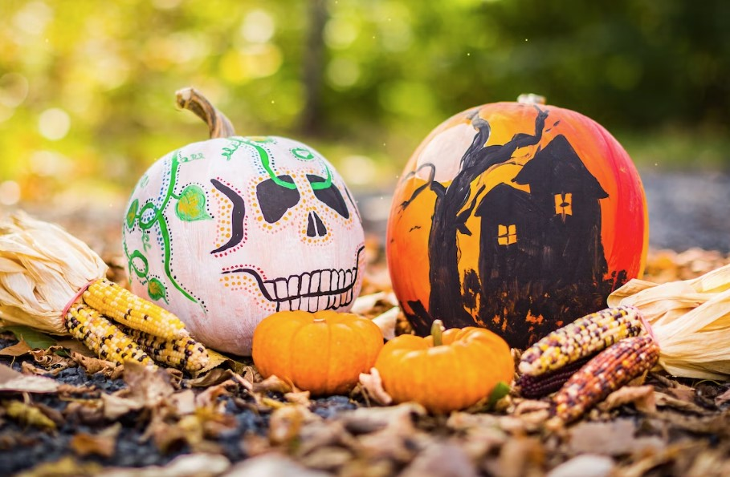

Halloween is all about imagination and fun, so why not reflect that in your invitations? Go for themed designs featuring iconic Halloween elements like pumpkins, ghosts, witches, and black cats. You can whip up digital invites or, if you’re feeling crafty, make handcrafted ones with spooky stickers, glitter, and themed paper.

Make sure to include all the essential details in the invitations: the date, time, and location, and don’t forget to mention whether it’s a costume party. After all, you want your guests to come dressed in their spookiest or most [creative outfits](https://avada.io/loveable/creative-halloween-costumes/)!

If you need specific pictures and step-by-step guides for your special invitations, you can refer to the [DIY Halloween invitation templates and ideas on Pinterest](https://www.pinterest.com/GoForthAndThrive/halloween-party-invitations/). There, you’ll find a treasure trove of ideas from talented artists and creators that are sure to impress. And if you’re short on time and prefer not to make the invitations yourself, fear not! The [Halloween invitation ideas on Amazon](https://www.amazon.com/halloween-invitations/s?k=halloween+invitations) are also an excellent option worth considering. You won’t be disappointed with the selection available there!

### **3\. Organizing Party Themes and Decorations**

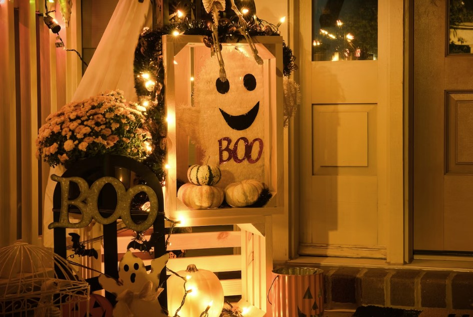

Let’s take this party to the next level with a thrilling Halloween theme! Themes like “Haunted House Adventure,” “Monster Mash Dance Party,” or “Enchanted Forest” can bring the whole event to life and get the kids buzzing with excitement.

Once you’ve settled on a theme, it’s time to get those decorations on point. Spider webs, bats, skeletons, and eerie lighting are your best friends here. Create a spine-chilling ambiance with themed tablecloths, plates, cups, and napkins. And hey, how about setting up a Halloween craft station where the little ones can make their own decorations, like paper ghosts or pumpkin lanterns?

You have a plethora of choices when it comes to decorations and themes for your Halloween party. We have curated an entirely unique collection to bring you the most fantastic [decorating ideas for this Halloween](https://avada.io/loveable/halloween-decoration-ideas/). These ideas aren’t just from Loveable; they are carefully selected from various talented artists and Pinterest users. Rest assured; these ideas will spark your creativity and make your Halloween party truly special.

### **4\. Costumes and Dress-Up Ideas for Kids**

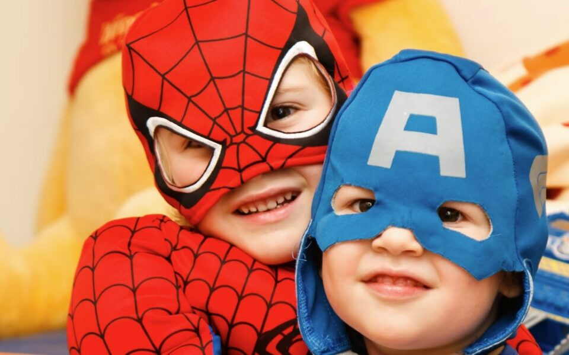

What’s a Halloween party without fabulous costumes? Encourage all the young partygoers to don their most creative and [spooktacular outfits for kids](https://avada.io/loveable/halloween-costumes-for-kids/). In fact, you can even turn it into a fun costume contest! Get ready to award prizes for “Scariest Costume,” “Most Creative Costume,” and “Best Group Costume.” It’s all about igniting their imaginations and having a blast!

To give kids and their parents some inspiration, throw out a few [Halloween costume ideas](https://avada.io/loveable/halloween-costume-ideas/) that fit your party theme or are popular Halloween favorites. From wicked witches to daring superheroes and everything in between, the choices are endless! And remember, comfort and safety are crucial, so make sure the costumes won’t cause any vision issues or trip hazards.

## **25 Halloween Party Games for Kids to Create Memorable Holiday**

A Halloween party for kids is never complete without a dose of fun and creativity through exciting games. That’s why, right here, right now, we’re bringing you the most enjoyable and innovative Halloween games for kids, perfect for any Halloween celebration. Some are classic favorites, while others are fresh discoveries we’ve unearthed and learned in 2023, promising a whole new level of excitement. 

### **1\. Witch’s Broom Race Game For Kids** 

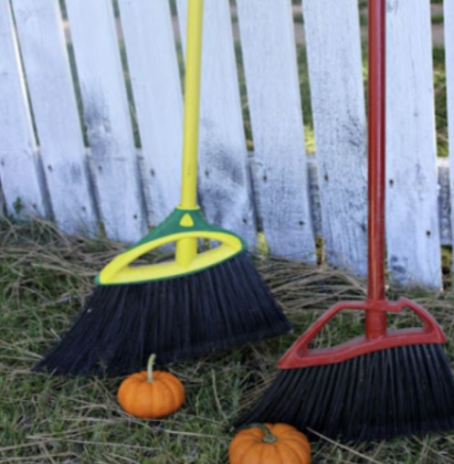

Get ready to bewitch and entertain all your party guests with a captivating game! Let’s divide everyone into two teams, and each team gets their own broom and mini pumpkin. The enchanting challenge begins as each witch (also known as a player) uses their broom to propel their pumpkin to the finish line and back to the next witch in line to keep the race going. The team that completes the race first will emerge as the ultimate winners of this thrilling broomstick and pumpkin relay!

Check out the full guide to play [Witch’s Broom Race](https://www.idigpinterest.com/three-fun-halloween-family-games/)  

Buy a [mini pumpkin](https://www.amazon.com/s?k=MINI+PUMPKINS&crid=2I24KTQOBFGRJ&sprefix=mini+pumpkins%2Caps%2C140&ref=nb_sb_noss_1&linkCode=ogi&tag=pioneerwoman-auto-append-20&ascsubtag=%5Bartid%7C2164.g.32214913%5Bsrc%7Cwww.google.com%5Bch%7C%5Blt%7C%5Bpid%7C071fa350-e476-4075-aea1-fee627fafcc7) for the game

### **2\. Halloween Trivia for Kids** 

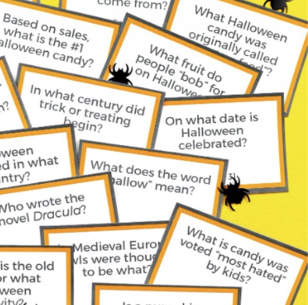

Get ready for some brainy fun as we put your spooky knowledge to the test with this exciting trivia game! We’ve got a fantastic array of questions covering everything from candy and scary movies to historical facts and beyond. So, gather your wits and dive into this thrilling challenge to see how much you really know about all things spooky!

Check out the printable trivia template at [Hey, Let’s Make Stuff!](https://heyletsmakestuff.com/printable-halloween-trivia/)

Or you can check out the list of [Halloween Trivia](https://www.today.com/life/holidays/halloween-trivia-rcna37519) here

### **3\. Witch Hat Memory Game**

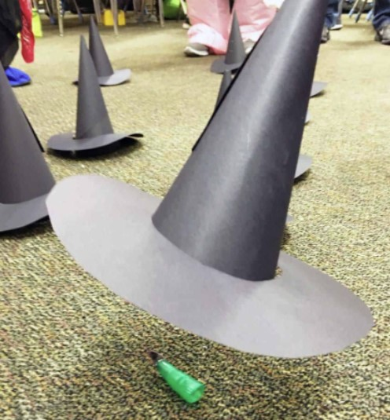

If you’re a teacher looking for a Halloween game to liven up the classroom atmosphere, then this is the perfect choice for you! We’ll use witch hats to conceal silly Halloween trinkets, and then it’s time to put your memory to the test. See how much you can remember as you uncover the hidden treats and delights lurking beneath those enchanting witch hats! It’s a Halloween memory game like no other, guaranteed to add a touch of magic to your festivities.

You can get the full guide at [Skip to My Lou.](https://www.skiptomylou.org/halloween-party-games/) and you will need a [DIY witch hat for this game](https://www.youtube.com/watch?v=v56k0WU5Eco)

### **4\. Halloween Bingo For Kids** 

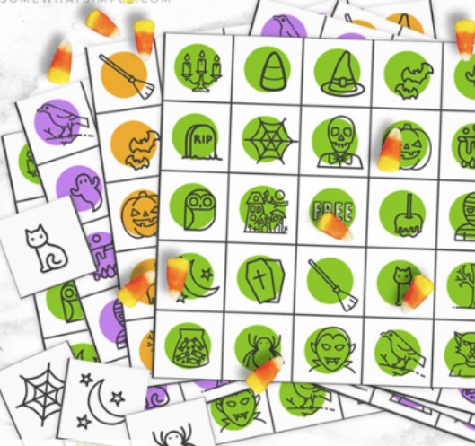

This game is as simple as printing it out and getting ready for some fun and friendly competition! Just grab the printed materials, and you’re all set to enjoy this delightful activity. 

You can get creative and design a Halloween-themed bingo board of your choice or simply download a printable template from [Somewhat Simple](https://www.somewhatsimple.com/free-halloween-printables/).

### **5\. Funny Fizzing Eyeball Game for Kids**

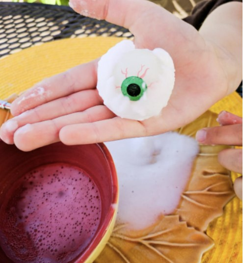

Encourage them to tap into their inner mad scientist through this fun and eccentric activity. The entertaining result of vinegar bubbling and interacting with the baking soda eyeballs will bring smiles to both children and parents!

Get guidance on how to do it at [Merriment Design](https://www.merrimentdesign.com/fun-kids-halloween-party-game-eyeball-surprise.php)

### **6\. Crossword Puzzle for Halloween** 

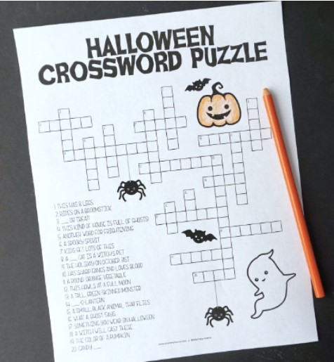

Print a couple of copies of this Halloween crossword for your children to enjoy while having dinner before heading out for trick-or-treating. Additionally, you can discover a complete printable Halloween activity bundle through the link below, providing hours of entertainment.

Check out the tutorial and download the printable at [Artsy-Fartsy Mama](https://www.artsyfartsymama.com/2017/10/free-printable-halloween-activity-pack.html).

### **7\. Halloween Scavenger Hunt**

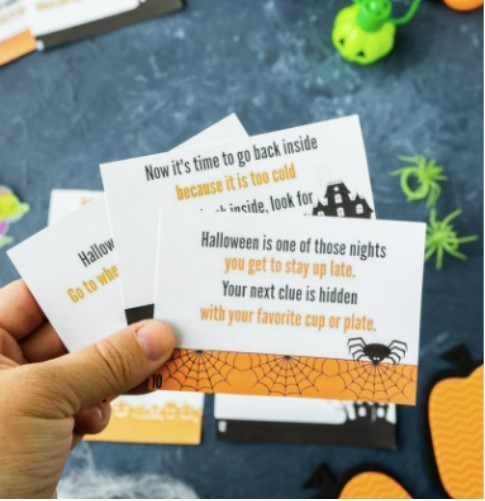

Halloween offers a great opportunity for a scavenger hunt! Arrange clever clues throughout the house and delight in seeing the kids excitedly hunt them down. To elevate the fun, consider including a reward at the conclusion, such as Halloween stickers.

Check out the game rules at [Play Party Plan.](https://www.playpartyplan.com/free-printable-halloween-scavenger-hunt/)

### **8\. Halloween Ring Toss to Play at Night** 

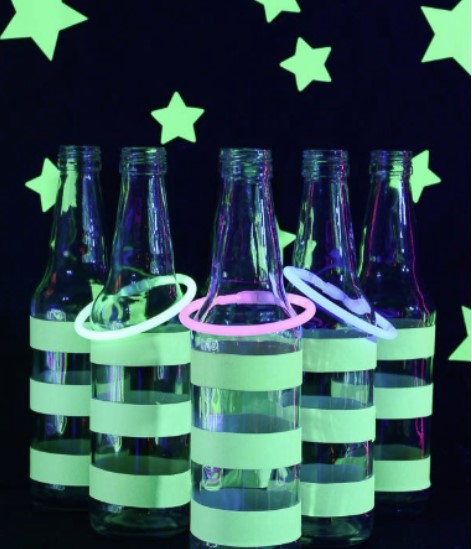

It’s amazing how versatile duct tape can be! Simply wind a couple of layers of glow-in-the-dark duct tape around glass bottles, shape some glow sticks into rings, and you’ve got a game perfect for playing in the depths of the night.

Check out the guide at [A Pumpkin and a Princess](https://go.skimresources.com/?id=74968X1616970&isjs=1&jv=15.4.2-stackpath&sref=https%3A%2F%2Fwww.thepioneerwoman.com%2Fholidays-celebrations%2Fg32214913%2Fhalloween-party-games%2F%3Fslide%3D23&url=https%3A%2F%2Fapumpkinandaprincess.com%2Fglow-in-the-dark-party&xs=1&xtz=-420&xuuid=f04f216b41a9c7d503f82e5052bf425c&xjsf=other_click__auxclick%20%5B2%5D)

### **9\. Creepy Sensory Bags for Halloween** 

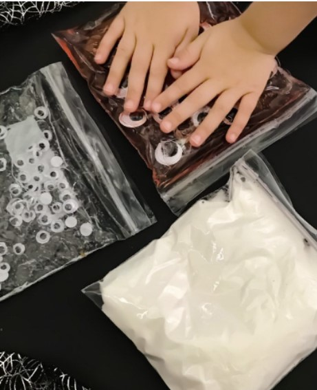

Ideal for preschoolers, these sensory bags offer a fantastic option. Fill them with Halloween-themed elements, such as spooky shaving cream adorned with googly eyes. Just remember to securely seal the bags with glue before diving into the fun activities.

Check out the guide at [A Night Owl](https://www.anightowlblog.com/diy-halloween-sensory-activities/)

### **10\. Wrap the Mummy**

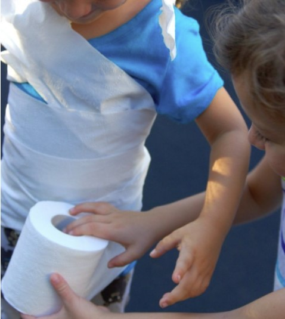

Get ready for a hilariously wrapped adventure! Gather the kids into two or more teams and pick a lucky child from each crew to take on the role of the “mummy.” Armed with toilet paper rolls, the teams will embark on a race to expertly wrap their mummy. The team that manages to completely wrap their mummy first emerges as the triumphant tape conquerors!

Check out the game guide at [Kids Activities Blog](https://kidsactivitiesblog.com/19941/halloween-game/)

### **11\. Guess the Food**

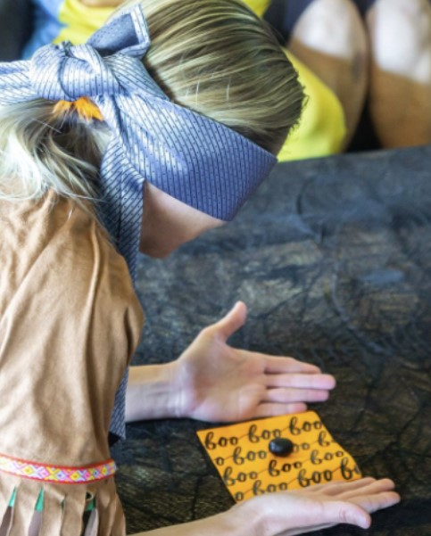

Ah, what’s Halloween without a touch of delightfully icky fun? Enter a world of giggles and shivers with this game. Brace yourselves as players are tantalizingly served “eyeballs,” and the daring soul who accurately deduces the true identity (revealed as peeled grapes in this round) clinches the crown of victory!

Check out the game tutorial at [Play Party Plan.](https://www.playpartyplan.com/halloween-guess-the-food-game/)

### **12\. Ghost Sack Race**

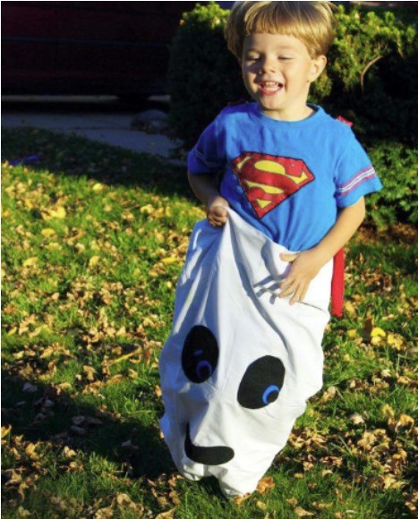

Elevate the ordinary sack race into a spooktacular spectacle by transforming it into a hauntingly fun game! Grab those white pillowcases and give them ghostly charm by affixing eerie eyes and a mischievous mouth. Now, watch as the race track becomes a spirited runway for these ghostly competitors!

Get the tutorial at [Fireflies and Mud Pies](https://go.skimresources.com/?id=74968X1616970&isjs=1&jv=15.4.2-stackpath&sref=https%3A%2F%2Fwww.thepioneerwoman.com%2Fholidays-celebrations%2Fg32214913%2Fhalloween-party-games%2F%3Fslide%3D43&url=https%3A%2F%2Fwww.firefliesandmudpies.com%2F5-family-halloween-games%2F&xs=1&xtz=-420&xuuid=f04f216b41a9c7d503f82e5052bf425c&xjsf=other_click__auxclick%20%5B2%5D).

### **13\. Ghosts on a String**

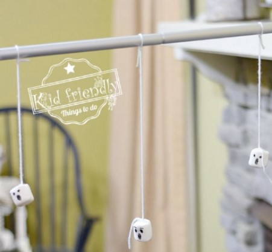

The classic bobbing for apples, a Halloween party staple! But hold onto your witch’s hat because we’ve conjured up a ghostly twist that might just steal the show. Picture this: instead of apples, you’re diving into the ethereal realm of jumbo marshmallows. Not only do they up the ante in the challenge department, but they also morph into blank canvases of sugary artistry. 

Check out the tutorial at [Kid Friendly Things To Do.](https://kidfriendlythingstodo.com/marshmallow-ghosts-on-a-string-halloween-game-to-play-kid-friendly-things-to-do/)

### **14\. Candy Corn Relay Game**

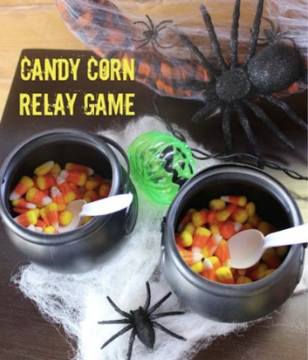

Candy corn skeptics, rejoice! The candy corn relay game, a delightful twist that’s bound to tickle everyone’s taste for fun. Summon the kiddos into teams and set the stage for sugary showdown. Their mission: transport spoonfuls of candy corn to mini cauldrons without a single sugary sentinel falling astray. The team boasting the most triumphant cornucopia of candy corn in their cauldron shall emerge victorious and reign supreme in the realm of sweet victory!

Check out the tutorial at [I Dig Pinterest.](https://www.idigpinterest.com/three-fun-halloween-family-games/)

### **15\. Cute Tic-Tac-Toe for Kids** 

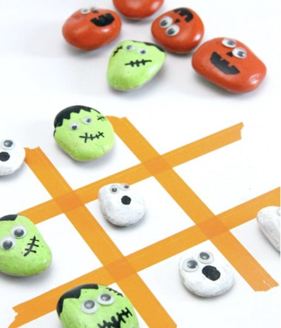

Gather ’round, for we’re about to embark on a journey of transformation, turning ordinary stones into the heroes of a thrilling tic-tac-toe saga. With googly eyes, glue, and the magic touch of paint pens, watch as these unassuming pebbles morph into enchanting game pieces, poised to dazzle the board and capture hearts. 

Check out the tutorial at [Smashed Peas and Carrots.](https://go.skimresources.com/?id=74968X1616970&isjs=1&jv=15.4.2-stackpath&sref=https%3A%2F%2Fwww.thepioneerwoman.com%2Fholidays-celebrations%2Fg32214913%2Fhalloween-party-games%2F%3Fslide%3D49&url=http%3A%2F%2Fsmashedpeasandcarrots.com%2Fspooky-tic-tac-toe-game-with-halloween-painted-rocks%2F&xs=1&xtz=-420&xuuid=f04f216b41a9c7d503f82e5052bf425c&xjsf=other_click__auxclick%20%5B2%5D)

### **16\. Eyeball Pong Game** 

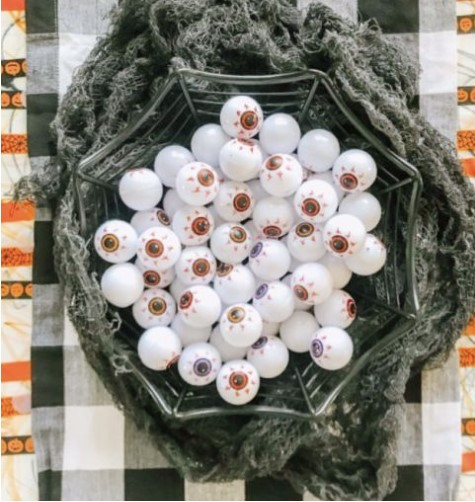

Get ready to bounce, roll, and have a monstrous ball of a time with a game that’s like the spirited sibling of beer pong (sans the spirits, if you prefer). Kids and adults stepping up to the challenge, orchestrating the art of precision as they propel eerie “eyeballs” across the table, aiming for the elusive cups. 

And there’s more! Imagine a relay game that gives “eyeballs” a starring role in a thrilling race. Both games, a double dose of delight, are bound to summon endless giggles and ghoulish fun!

Check out the tutorial at [Productive Pete.](https://productivepete.com/eyeball-pong-halloween-game-kids/)

### **17\. Halloween Forehead Detective**

Equip each party guest with a sticky note showcasing a well-known Halloween word or costume concept, and have them affix it to their forehead. The challenge? Engage fellow revelers in a game of questions, unraveling the mystery of their own identity. This delightful activity doubles as an excellent icebreaker, guaranteed to spark conversations and laughter all around!

You will need [ORANGE STICKY NOTES](https://www.amazon.com/Sticky-Self-Stick-Bright-Colors-Office/dp/B08H5HN8V7) for this gameplay 

### **18\. Apple Bushel Basket Toss**

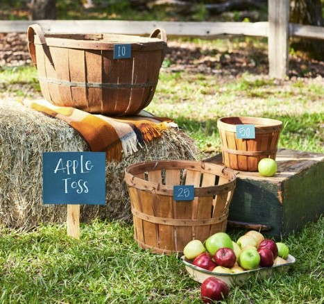

Begin by gathering apple bushels of different sizes and allocate points according to their level of difficulty (with smaller bushels receiving higher point values). Distribute a specific number of apples to each player. The winner is the one who can accumulate the highest number of points through their assigned apples.

### **19\. Pumpkin Drop Game**

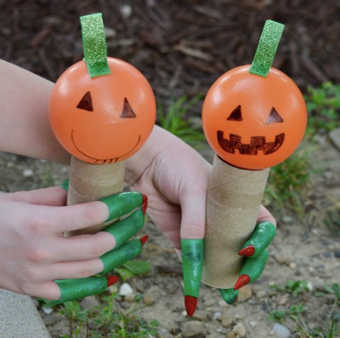

There’s really nothing quite like a Halloween party game that gets kids out in the fresh air, moving around, and having a blast. This particular game will have them all energized and ready to enjoy their Halloween treats to the fullest.

Get the game rules at [Get Your Holiday On](https://www.getyourholidayon.com/pumpkin-drop-game/)

### **20\. Spider Walking Game**

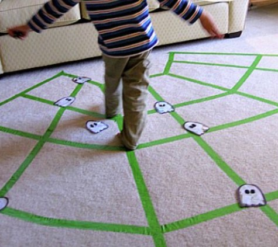

Challenge their balance and problem-solving abilities with this fun twist. In this Halloween game, your little ones will need to gather up all the spiders or ghosts scattered around the makeshift “web,” all while staying within the lines. Let the games begin!

Get the tutorial and game rules at [No Time for Flash Cards](https://go.skimresources.com/?id=74968X1525072&isjs=1&jv=15.4.2-stackpath&sref=https%3A%2F%2Fwww.countryliving.com%2Fdiy-crafts%2Fg3476%2Fhalloween-party-games%2F&url=https%3A%2F%2Fwww.notimeforflashcards.com%2F2011%2F10%2Fspider-web-gross-motor-activity.html&xs=1&xtz=-420&xuuid=3270fdd4436ae2b784522d03d07ad432&xjsf=other_click__auxclick%20%5B2%5D)

### **21\. Zombie Eyeball Toss**

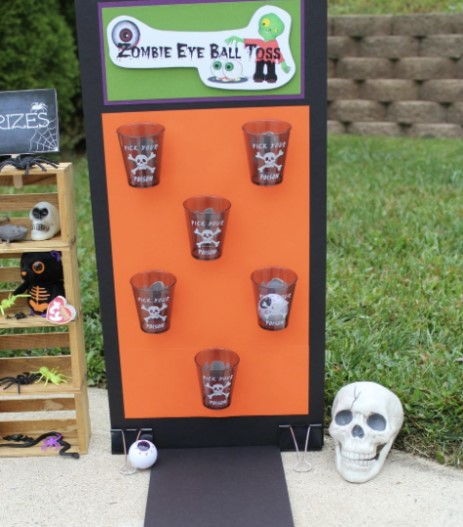

Grab some eerie Halloween-themed cups from your nearby convenience store, and then scatter them across a poster board. It’s time for the kids to take aim, using zombie eyeballs, of course!

Get the tutorial and game rules at [Brandy’s Happy Home](http://brandyshappyhome.com/dolloween-carnival-part-2-carnival-games/)

### **22\. Pin the Spider on the Web** 

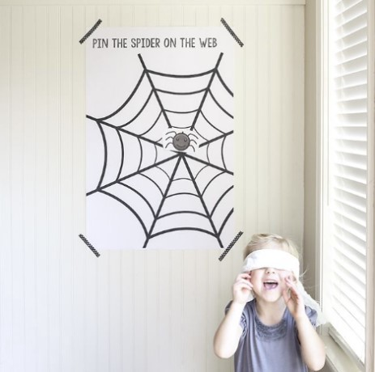

Delight the crowd with a clever twist on the classic “Pin the Tail on the Donkey.” Setting it up is a breeze – just swing by your local copy shop to print everything out, then add a touch of charm by affixing it to the wall with adorable washi tape. 

Get the tutorial and game rules at [Ella Claire & Co](https://go.skimresources.com/?id=74968X1525072&isjs=1&jv=15.4.2-stackpath&sref=https%3A%2F%2Fwww.countryliving.com%2Fdiy-crafts%2Fg3476%2Fhalloween-party-games%2F&url=http%3A%2F%2Fwww.ellaclaireinspired.com%2Fpin-spider-web-free-printable%2F&xs=1&xtz=-420&xuuid=3270fdd4436ae2b784522d03d07ad432&xjsf=other_click__auxclick%20%5B2%5D)

### **23\. Newspaper Eating Monster Toss**

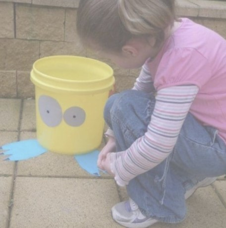

Here’s another simple yet entertaining tossing game that you can add to your upcoming Halloween gathering. This one’s perfect for the little ones, including preschoolers as young as three, kindergarteners, and kids in grades one and two. 

With just a few easy tweaks and a trusty bucket, you’ll have them squealing with delight as they play the “feeding a monster” game. Don’t toss those old newspapers just yet – they’re the key ingredient for this exciting newspaper-eating monster toss activity. 

### **24\. Pumpkin Bowling**

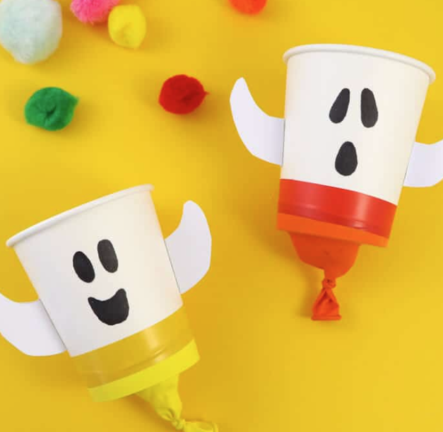

Introducing the starring duo: Toilet Paper as the Ghost and Pumpkin as the Ball! This simple game has the power to keep the little ones entertained for hours on end. And guess what? You probably already have everything you need to set up this bowling game. Just grab a black sharpie marker to draw the faces on the toilet paper and pumpkin, and then let the kids have a blast with their very own round of “bowling.”

### **25\. Halloween Can Bowling Game** 

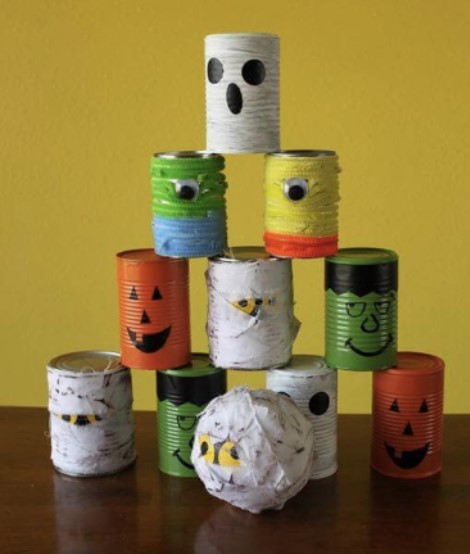

Transform a handful of empty tin cans into charming Halloween characters, and you’ve got yourself an exciting knock ’em down game that’s sure to be a hit. Even kids in the 10-12 year age range will find this activity enjoyable. Just give those old soup cans a good cleaning and let your creativity shine as you decorate them for this delightful game. 

Some cans can be painted, others adorned with felt pipe cleaners, and a few even swathed in fabric. Add quirky faces and googly eyes to complete the look, and then it’s time to jump into the action. 

## **Spooktacular Food Ideas for Kids Halloween Party**

Of course, a perfect party is never complete without delicious food, especially for kids. Luckily, we’re searching for Halloween ideas, a time when creativity seems endless. With the goal of creating a memorable Halloween party for the kids, we have gathered here some fantastic food recipes that you can make at home. These recipes are specially designed to be decorated and crafted with elements of the Halloween holiday.

We’ve grouped the dishes into themes and collections so you can easily choose according to your preferences. From spine-chilling and creative Halloween dips to chocolate-covered desserts that every kid adores, and certainly not forgetting those spooky drinks for the occasion. Check out our collection right away to find ideas for this joyful and special celebration.

**_See More:_**

- Best [Halloween Punch Ideas](https://avada.io/loveable/halloween-punch/) for Any Spooky Party
- [Halloween Dinner Ideas](https://avada.io/loveable/halloween-dinner-ideas/) for 2023 Holiday
- Best [Halloween Cake](https://avada.io/loveable/halloween-cake/) that’s Scary-Good for a Spooky Party

## **Some Final Words** 

The realm of imaginative possibilities for an unforgettable **kids’ Halloween part**y knows no bounds, with these creative ideas. From spine-tingling games that spark laughter and friendly competition, to delectable and eerie treats that awaken taste buds, this array of suggestions ensures a ghoulishly good time for all. The carefully curated costume concepts promise to transform little ones into their wildest fantasies, while decorations and crafts elevate the ambiance to a whole new level of spooky delight. With these innovative and diverse ideas at your disposal, crafting a memorable and captivating Halloween party for kids becomes an exciting endeavor that celebrates fun, imagination, and the spirit of the season.

- [4 Essential Tips For Party Planning And Preparation You Should Know About](https://avada.io/loveable/blog/kids-halloween-party/#wp-block-heading-2-4) 
    - [1\. Choosing a Suitable Date, Time, and Location](https://avada.io/loveable/blog/kids-halloween-party/#wp-block-heading-3-5)
    - [2\. Invitations: Creative and Themed Designs](https://avada.io/loveable/blog/kids-halloween-party/#wp-block-heading-3-9)
    - [3\. Organizing Party Themes and Decorations](https://avada.io/loveable/blog/kids-halloween-party/#wp-block-heading-3-14)
    - [4\. Costumes and Dress-Up Ideas for Kids](https://avada.io/loveable/blog/kids-halloween-party/#wp-block-heading-3-19)
- [25 Halloween Party Games for Kids to Create Memorable Holiday](https://avada.io/loveable/blog/kids-halloween-party/#wp-block-heading-2-23)
    - [1\. Witch’s Broom Race Game For Kids](https://avada.io/loveable/blog/kids-halloween-party/#wp-block-heading-3-25) 
    - [2\. Halloween Trivia for Kids](https://avada.io/loveable/blog/kids-halloween-party/#wp-block-heading-3-30) 
    - [3\. Witch Hat Memory Game](https://avada.io/loveable/blog/kids-halloween-party/#wp-block-heading-3-35)
    - [4\. Halloween Bingo For Kids](https://avada.io/loveable/blog/kids-halloween-party/#wp-block-heading-3-39) 
    - [5\. Funny Fizzing Eyeball Game for Kids](https://avada.io/loveable/blog/kids-halloween-party/#wp-block-heading-3-43)
    - [6\. Crossword Puzzle for Halloween](https://avada.io/loveable/blog/kids-halloween-party/#wp-block-heading-3-47) 
    - [7\. Halloween Scavenger Hunt](https://avada.io/loveable/blog/kids-halloween-party/#wp-block-heading-3-51)
    - [8\. Halloween Ring Toss to Play at Night](https://avada.io/loveable/blog/kids-halloween-party/#wp-block-heading-3-55) 
    - [9\. Creepy Sensory Bags for Halloween](https://avada.io/loveable/blog/kids-halloween-party/#wp-block-heading-3-59) 
    - [10\. Wrap the Mummy](https://avada.io/loveable/blog/kids-halloween-party/#wp-block-heading-3-63)
    - [11\. Guess the Food](https://avada.io/loveable/blog/kids-halloween-party/#wp-block-heading-3-67)
    - [12\. Ghost Sack Race](https://avada.io/loveable/blog/kids-halloween-party/#wp-block-heading-3-71)
    - [13\. Ghosts on a String](https://avada.io/loveable/blog/kids-halloween-party/#wp-block-heading-3-75)
    - [14\. Candy Corn Relay Game](https://avada.io/loveable/blog/kids-halloween-party/#wp-block-heading-3-79)
    - [15\. Cute Tic-Tac-Toe for Kids](https://avada.io/loveable/blog/kids-halloween-party/#wp-block-heading-3-83) 
    - [16\. Eyeball Pong Game](https://avada.io/loveable/blog/kids-halloween-party/#wp-block-heading-3-87) 
    - [17\. Halloween Forehead Detective](https://avada.io/loveable/blog/kids-halloween-party/#wp-block-heading-3-92)
    - [18\. Apple Bushel Basket Toss](https://avada.io/loveable/blog/kids-halloween-party/#wp-block-heading-3-96)
    - [19\. Pumpkin Drop Game](https://avada.io/loveable/blog/kids-halloween-party/#wp-block-heading-3-99)
    - [20\. Spider Walking Game](https://avada.io/loveable/blog/kids-halloween-party/#wp-block-heading-3-103)
    - [21\. Zombie Eyeball Toss](https://avada.io/loveable/blog/kids-halloween-party/#wp-block-heading-3-107)
    - [22\. Pin the Spider on the Web](https://avada.io/loveable/blog/kids-halloween-party/#wp-block-heading-3-111) 
    - [23\. Newspaper Eating Monster Toss](https://avada.io/loveable/blog/kids-halloween-party/#wp-block-heading-3-115)
    - [24\. Pumpkin Bowling](https://avada.io/loveable/blog/kids-halloween-party/#wp-block-heading-3-119)
    - [25\. Halloween Can Bowling Game](https://avada.io/loveable/blog/kids-halloween-party/#wp-block-heading-3-122) 
- [Spooktacular Food Ideas for Kids Halloween Party](https://avada.io/loveable/blog/kids-halloween-party/#wp-block-heading-2-126)
- [Some Final Words](https://avada.io/loveable/blog/kids-halloween-party/#wp-block-heading-2-133) 

### [Blake Simpson](https://avada.io/loveable/author/blake/)

Hi, I'm Blake from Loveable. I help people find perfect gifts for occasions like anniversaries and weddings. I also write a blog about holidays, sharing insights to make them more meaningful. Let's create unforgettable moments together!

- [Twitter](https://twitter.com/intent/tweet)
- [Facebook](https://www.facebook.com/sharer/sharer.php)
- [instagram](https://avada.io/loveable/blog/kids-halloween-party/)
- [pinterest](https://www.pinterest.com/loveablellc/)

## Related Posts

[### 120+ Christian Birthday Wishes To Spread Your Love](https://avada.io/loveable/blog/christian-birthday-wishes/) 

[

### 35 Best 70th Birthday Ideas To Celebrate The Special Milestone

](https://avada.io/loveable/blog/70th-birthday-ideas/)

[

### 50 Best 30th Birthday Decorations for a Remarkable Birthday Bash

](https://avada.io/loveable/blog/30th-birthday-decorations/)

[

### 40 Delicious Vegan Christmas Desserts to Delight Your Palate

](https://avada.io/loveable/blog/vegan-christmas-desserts/)

[

### 60 Christmas Team Building Activities to Boost Workplace Spirit

](https://avada.io/loveable/blog/christmas-team-building-activities/)
