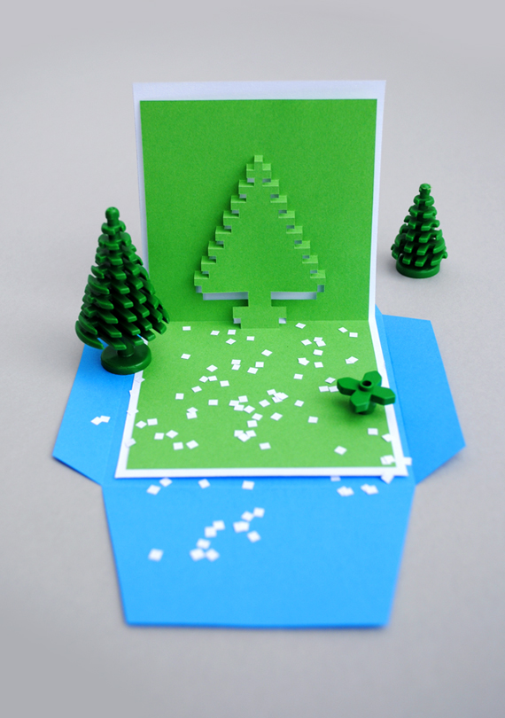

This article has been written and researched by our expert Loveable through a precise methodology. [Learn more about our methodology](https://avada.io/loveable/our-methodological.html)

[Loveable](https://avada.io/loveable/) > [Blog](https://avada.io/loveable/blog/) > [Holiday](https://avada.io/loveable/holiday/)

# 30 Enchanting DIY Christmas Card Ideas to Spread Joy

Written by [Blake Simpson](https://avada.io/loveable/author/blake/) Last Updated on September 20, 2023

- [30 Creative DIY Christmas Card for a Jolly and Memorable Holiday](https://avada.io/loveable/blog/diy-christmas-card/#wp-block-heading-2-2)
    - [1\. Elf Christmas card](https://avada.io/loveable/blog/diy-christmas-card/#wp-block-heading-3-3)
    - [2\. Paper cut Christmas card](https://avada.io/loveable/blog/diy-christmas-card/#wp-block-heading-3-7)
    - [3\. Folding scenery card](https://avada.io/loveable/blog/diy-christmas-card/#wp-block-heading-3-11)
    - [4\. Sponge printed Christmas card](https://avada.io/loveable/blog/diy-christmas-card/#wp-block-heading-3-15)
    - [5\. Christmas tree card](https://avada.io/loveable/blog/diy-christmas-card/#wp-block-heading-3-19)
    - [6\. Watercolor tree card](https://avada.io/loveable/blog/diy-christmas-card/#wp-block-heading-3-23)
    - [7\. Pop-Up Christmas cards](https://avada.io/loveable/blog/diy-christmas-card/#wp-block-heading-3-27)
    - [8\. Reindeer card](https://avada.io/loveable/blog/diy-christmas-card/#wp-block-heading-3-31)
    - [9\. Fingerprint light Christmas card](https://avada.io/loveable/blog/diy-christmas-card/#wp-block-heading-3-35)
    - [10\. Paper wreath card](https://avada.io/loveable/blog/diy-christmas-card/#wp-block-heading-3-39)
    - [11\. Melted snowman tea light card](https://avada.io/loveable/blog/diy-christmas-card/#wp-block-heading-3-43)
    - [12\. Button snowman card](https://avada.io/loveable/blog/diy-christmas-card/#wp-block-heading-3-47)
    - [13\. Pipe cleaner card](https://avada.io/loveable/blog/diy-christmas-card/#wp-block-heading-3-51)
    - [14\. Unicorn Christmas card](https://avada.io/loveable/blog/diy-christmas-card/#wp-block-heading-3-55)
    - [15\. Photo bunting card](https://avada.io/loveable/blog/diy-christmas-card/#wp-block-heading-3-59)
    - [16\. Confetti snow globe card](https://avada.io/loveable/blog/diy-christmas-card/#wp-block-heading-3-63)
    - [17\. Sweet stocking card](https://avada.io/loveable/blog/diy-christmas-card/#wp-block-heading-3-67)
    - [18\. Gift box Christmas card](https://avada.io/loveable/blog/diy-christmas-card/#wp-block-heading-3-71)
    - [19\. Repurposed book card](https://avada.io/loveable/blog/diy-christmas-card/#wp-block-heading-3-75)
    - [20\. Stamped scenery card](https://avada.io/loveable/blog/diy-christmas-card/#wp-block-heading-3-79)
    - [21\. Stitched Christmas card](https://avada.io/loveable/blog/diy-christmas-card/#wp-block-heading-3-83)
    - [22\. Pom pom Christmas card](https://avada.io/loveable/blog/diy-christmas-card/#wp-block-heading-3-87)
    - [23\. Eraser-stamped card](https://avada.io/loveable/blog/diy-christmas-card/#wp-block-heading-3-92)
    - [24\. Pop-up gingerbread man Christmas card](https://avada.io/loveable/blog/diy-christmas-card/#wp-block-heading-3-96)
    - [25\. Circular Christmas card](https://avada.io/loveable/blog/diy-christmas-card/#wp-block-heading-3-100)
    - [26\. Pixel pop-up card](https://avada.io/loveable/blog/diy-christmas-card/#wp-block-heading-3-104)
    - [27\. Handprint grinch Christmas card](https://avada.io/loveable/blog/diy-christmas-card/#wp-block-heading-3-108)
    - [28\. Button ornament Christmas card](https://avada.io/loveable/blog/diy-christmas-card/#wp-block-heading-3-112)
    - [29\. Doily tree Christmas cards](https://avada.io/loveable/blog/diy-christmas-card/#wp-block-heading-3-116)
    - [30\. Yarn art card](https://avada.io/loveable/blog/diy-christmas-card/#wp-block-heading-3-120)
- [Bottom line](https://avada.io/loveable/blog/diy-christmas-card/#wp-block-heading-2-127)

This Christmas, unwrap the magic of heartfelt giving and creative expression with the compilation of 30 enchanting **DIY Christmas card ideas.** With over 30 innovative and charming designs, you’re invited to infuse your holiday season with a touch of homemade magic. From elegant calligraphy to whimsical winter scenes, these cards are more than just paper; they’re a conduit for spreading cheer and love. Delve into this article to unlock the secrets of DIY Christmas cards that will have you creating memories as beautiful as your crafts.

## **30 Creative DIY Christmas Card for a Jolly and Memorable Holiday**

### **1\. Elf Christmas card**

What better way to celebrate as the holiday spirit fills the air than crafting your adorable elf-themed cards? With just a handful of supplies you probably already have at home, like colored papers and markers, you can create craft heartfelt cards that will bring smiles to everyone’s faces. 

Explore the tutorial from [Non Toy Gifts](https://nontoygifts.com/paper-elf-craft-kids/)

### **2\. Paper cut Christmas card**

A magical time of year is coming again, and snowflakes fall like confetti. So, this Paper-Cut Christmas Card is the key to sending holiday happiness with a unique touch. Armed with colorful paper, scissors, and a touch of holiday magic, your little ones can craft their winter wonderlands.

Explore the tutorial from [Persia Lou](https://persialou.com/diy-paper-cut-christmas-cards-free-svg-cut-files/)

### **3\. Folding scenery card**

The spirit of Christmas is about to burst forth from your hands with the magic of a Folding Scenery Christmas Card! This ain’t your grandma’s traditional card, oh no. Now, grab your crafty arsenal because we’ll need scissors, glue, glitter, and all that jazz to whip up this masterpiece.

Explore the tutorial from [Krokotak](https://krokotak.com/2016/12/easy-holiday-cards/)

### **4\. Sponge printed Christmas card**

This holiday season – let’s roll up our sleeves and create a masterpiece that’ll make Santa himself proud. Your kids can transform plain cards into festive masterpieces with simple supplies and a sprinkle of holiday cheer.

Explore the tutorial from [Emma Owl](https://emmaowl.com/easy-sponge-printed-christmas-card/)

### **5\. Christmas tree card**

As the festive season wraps us in its warm embrace, gather your little ones on a creative journey to craft these adorable cards that bring joy to young and old hearts. With a sprinkle of glitter and a dash of creativity, this crafting adventure is the perfect way to immerse your young ones in the season’s wonders.

Explore the tutorial from [The Best Ideas for Kids](https://www.thebestideasforkids.com/christmas-tree-card/)

### **6\. Watercolor tree card**

Whether an art lover or just dabbling in creativity, the Watercolor Christmas Card is your golden ticket to spreading joy, one stroke at a time. Grab a white gel pen, a white wax crayon, or some masking fluid, and let your imagination roam as you sketch intricate designs onto the cards.

Explore the tutorial from [MarenaART](https://www.youtube.com/watch?v=C5aUbptpapg)

### **7\. Pop-Up Christmas cards**

Taking the time to send a pop-up card is like standing out in a crowd of elves. These little pieces of folded art aren’t just your ordinary cards; they’re like a present wrapped in paper with glittering holiday enchantment. All you need are basic art supplies, a dash of creativity, and a playlist of classic carols to set the mood.

Explore the tutorial from [Sweet Teal](https://sweetteal.com/2018/11/diy-pop-up-christmas-cards/)

### **8\. Reindeer card**

This whimsical and delightful card brings the magic of the North Pole right to your child’s hands. With a charming illustration of a friendly reindeer adorned with a glistening red nose, it’s a perfect way to spread holiday joy!

Explore the tutorial from [Simple Everyday Mom](https://www.simpleeverydaymom.com/handprint-reindeer-card/) 

### **9\. Fingerprint light Christmas card**

The jingle bells are ringing, and the air is filled with that heartwarming spirit of Christmas! So what better way to wrap your loved ones in that festive embrace than with a Fingerprint Lights Christmas Card? Gather your art supplies – vibrant ink pads and a blank card- and prepare to spread Christmas cheer like confetti.

Explore the tutorial from [The Joy of Sharing](https://www.thejoysharing.com/2020/12/fingerprint-lights-christmas-card.html)

### **10\. Paper wreath card**

This thing’s like a burst of holiday magic, with its colorful paper loops forming a rad wreath shape. So, if you wanna give your kiddos a jolly craft time and make ’em feel like Christmas bosses, this Paper Wreath Card is the way to roll!

Explore the tutorial from [Chatelaine](https://chatelaine.com/holiday/diy-paper-wreath-holiday-cards/)

### **11\. Melted snowman tea light card**

Why not add an extra dash of coziness and creativity to your festivities? The Melted Snowman Tea Light Card is about melting hearts and spreading holiday cheer. You’ll need sturdy cardstock for the card base, colorful markers to infuse life into your snowman, and cotton for that realistic melting effect. 

Explore the tutorial from [I Heart Arts and Crafts](https://www.iheartartsncrafts.com/melted-snowman-tea-light-ornament/)

### **12\. Button snowman card**

Christmas isn’t just a day; it’s a feeling, a jolly whirlwind of joy that sweeps us off our feet. And what better way to capture this enchanting essence than crafting your own Button Snowman Card? To create this tiny winter wonderland, you’ll need assorted buttons, some glue, a blank card, and a sparkly imagination!

Explore the tutorial from [Scrappin’ with DeeDee](https://deedeecampbell.blogspot.com/2012/12/3-button-snowman-card-and-christmas.html)

### **13\. Pipe cleaner card**

The Pipe Cleaner Card is like a big, cozy hug trapped inside an envelope, waiting to burst out and make someone’s day merry and bright. With just a handful of simple materials – colorful pipe cleaners, shiny beads, and a sprinkle of creativity – you’ll be crafting a mini holiday miracle.

Explore the tutorial from [Crafty Morning](https://www.craftymorning.com/pipe-cleaner-christmas-tree-craft-cards/)

### **14\. Unicorn Christmas card**

Christmas is here, and it’s time to unleash the enchanting charm of the season! That’s where the Unicorn Christmas Card comes galloping in. Preparing some simple materials, you’ll be well on your way to creating a masterpiece that radiates holiday cheer.

Explore the tutorial from [Red Ted Art](https://www.redtedart.com/3d-unicorn-card-diy/)

### **15\. Photo bunting card**

This card is a total game-changer with vibrant colors, playful designs, and cute AF bunting holding your precious pics.  All you need are your favorite festive photos and some basic crafting goodies: scissors, colorful cardstock, twine, and your artistic flair!

Explore the tutorial from [Delia Creates](https://www.deliacreates.com/family-bunting-christmas-card/)

### **16\. Confetti snow globe card**

As you hand out these cute little globes of happiness, you’re not just giving a card – you’re giving the gift of a winter wonderland escape. You’re ready to roll with basic materials like a transparent card sleeve, some confetti, a dash of glitter, and a pinch of imagination!

Explore the tutorial from [Mayholicraft](https://mayholicraft.wordpress.com/2014/09/12/waffle-flower-snow-globe-shaker-cards/)

### **17\. Sweet stocking card**

The air is filled with warmth and kindness, and we all know it’s not just about the presents, but the joy of giving and spreading cheer. That’s where the “Sweet Stocking Card” comes into play. Have some colorful paper, a dash of glitter, glue, and a bit of patience, then mix them all up!

Explore the tutorial from [Life-athon](https://life-athon.com/2015/12/diy-watercolor-christmas-socks-card/)

### **18\. Gift box Christmas card**

With this lovely Gift Box Christmas Card, you can make this season exceptional rather than settling for the mundane. You will create a tiny package of happiness with just a little effort that will make even Santa envy your gift-giving abilities!

Explore the tutorial from [The Joy Sharing](https://www.thejoysharing.com/2020/12/gift-box-card.html)

### **19\. Repurposed book card**

The Repurposed Book Christmas Card is like giving your old tomes a VIP holiday makeover – they’re turning from “literary leftovers” to “upcycled yuletide wonders.”  So, grab the glue, sprinkle some Christmas magic, and let your inner bookworm-turned-elf shine! 

Explore the tutorial from [Aunt Peaches](http://www.auntpeaches.com/2012/12/go-tell-it-on-mountain.html)

### **20\. Stamped scenery card**

It’s that time of the year when even snowflakes are doing the cha-cha in the frosty breeze! So why not sprinkle some extra joy by sending out some good ol’ love via a “Stamped Scenery Christmas Card”? Get your favorite colored paper and some snazzy stamps that twirl your heart. Don’t forget the inks that bring those holiday hues to life! 

Explore the tutorial from [France Martin](https://youtu.be/LWZGNPuOdwU)

### **21\. Stitched Christmas card**

With Stitched Christmas Cards, you’re not just sending a card; you’re sending a piece of your heart – neatly stitched with joy and sealed with a glittery flourish. So get your festive groove on, gather your supplies, and let’s stitch up some holiday happiness.

Explore the tutorial from [Woman’s day Tutorial](https://www.womansday.com/home/crafts-projects/how-to/a5256/christmas-craft-stitched-cards-111778/) 

### **22\. Pom pom Christmas card**

Whether you’re celebrating with family, friends, or fur babies, get your craft on and send those Pom Pom Christmas Cards out into the world. To make this cute card, you need some snazzy materials like colorful pom poms, sparkly glue, and a dash of imagination.  

Explore the tutorial from [The Joy Sharing Tutorial](https://www.thejoysharing.com/2019/12/pom-pom-christmas-diy-cards.html)

**_Check Out:_** [Funny Family Christmas Card Ideas](https://avada.io/loveable/blog/funny-family-christmas-card/)

### **23\. Eraser-stamped card**

The Eraser-Stamped Card is a wicked cool craft for kids to jazz up their creativity. To start off, snag some plain cards, snazzy erasers, and ink pads. It’s a piece of cake, and you’ll be chuffed with the results, mate!

Explore the tutorial from [Lia Griffit Tutorial](https://liagriffith.com/eraser-stamp-holiday-card-for-kids/?sscid=81k7_hsl2d)

### **24\. Pop-up gingerbread man Christmas card**

These cards are like a warm hug in paper form, a tangible reminder that someone cares enough to put in the time to craft something unique. You only need some sturdy paper, colorful cardstock, markers, and glue. Follow the step-by-step instructions, and you’ll have a card to knock Santa’s socks off! 

Explore the tutorial from [Red Ted Art](https://www.redtedart.com/pop-up-gingerbread-man-card-for-3d-christmas-fun/)

### **25\. Circular Christmas card**

This Christmas season is about spreading warmth, love, and pleasure. Making your own one-of-a-kind card masterpiece would be fantastic, right? Grab your crafty gear – scissors, glitter, glue, and more – and follow these simple steps to create a cooler circular card than the North Pole. 

Explore the tutorial from [The Postman’s Knock](https://thepostmansknock.com/circular-diy-christmas-card-tutorial/)

### **26\. Pixel pop-up card**

Christmas isn’t just about the presents under the tree; it’s about sharing joy, love, and creativity with those who matter most. And that’s where the Pixel Pop-Up Card comes into play! Just round up some glitter paper, scissors sharper, and let the holiday vibes guide your hands.

Explore the tutorial from [MinieCo](http://www.minieco.co.uk/christmas-pixel-popup-cards/)

### **27\. Handprint grinch Christmas card**

Whether you’re an artsy extraordinaire or your DIY skills are a work in progress, fear not! This Handprint Grinch Christmas Card is all about the experience and the love poured into it.  You’ll need colorful cardstock, paints, and brushes, and let’s craft this heartfelt card that sleighs the holiday DIY game!

Explore the tutorial from [Non-Toy Gifts](https://nontoygifts.com/handprint-grinch-card/)

### **28\. Button ornament Christmas card**

Christmas isn’t just about gifts but spreading joy like confetti and cherishing moments with loved ones. Let’s gather blank cards, buttons of all sizes, glue, and jingles to create this Christmas card!

Explore the tutorial from [Doodlecraft](https://www.doodlecraftblog.com/2014/12/button-ornament-christmas-cards.html)

### **29\. Doily tree Christmas cards**

These cards are like a dash of holiday magic – a mix of creativity and tradition that’ll have you grinning like a kid on Santa’s lap. All you need are some basic materials that are probably just chillin’ in your craft corner: colorful paper doilies, sturdy cardstock, and glue.

Explore the tutorial from [Happyhooligans](https://happyhooligans.ca/doily-christmas-tree-cards-for-kids-to-make/)

### **30\. Yarn art card**

In a world saturated with digital greetings, the Yarn Art Card allows you to channel your creativity while connecting with loved ones in a deeply personal manner. Gathering a handful of simple materials – colorful yarn, sturdy cardstock, a trusty pair of scissors and let your hands work!

Explore the tutorial from [Lia Griffith](https://liagriffith.com/christmas-yarn-art-kids-craft/?sscid=81k7_qj4ac)

**_See More:_**

- Heartfelt [Christmas Card Quotes](https://avada.io/loveable/blog/christmas-card-quotes/)

- [Short Christmas Card Messages](https://avada.io/loveable/blog/short-christmas-card-messages/)

## **Bottom line**

Amid the hectic holiday season as preparing lots of things, pause and immerse yourself in crafting with our curated assortment of **30 Enchanting DIY Christmas Card Ideas**. These imaginative projects hold the power to evoke cherished memories and strengthen connections.

And guess what? The product we recommend on this blog takes cues from these cards, allowing you to infuse the same charm into your festive decorations and gifts. Experience the joy of DIY and make your Christmas celebrations unforgettable.

- [30 Creative DIY Christmas Card for a Jolly and Memorable Holiday](https://avada.io/loveable/blog/diy-christmas-card/#wp-block-heading-2-2)
    - [1\. Elf Christmas card](https://avada.io/loveable/blog/diy-christmas-card/#wp-block-heading-3-3)
    - [2\. Paper cut Christmas card](https://avada.io/loveable/blog/diy-christmas-card/#wp-block-heading-3-7)
    - [3\. Folding scenery card](https://avada.io/loveable/blog/diy-christmas-card/#wp-block-heading-3-11)
    - [4\. Sponge printed Christmas card](https://avada.io/loveable/blog/diy-christmas-card/#wp-block-heading-3-15)
    - [5\. Christmas tree card](https://avada.io/loveable/blog/diy-christmas-card/#wp-block-heading-3-19)
    - [6\. Watercolor tree card](https://avada.io/loveable/blog/diy-christmas-card/#wp-block-heading-3-23)
    - [7\. Pop-Up Christmas cards](https://avada.io/loveable/blog/diy-christmas-card/#wp-block-heading-3-27)
    - [8\. Reindeer card](https://avada.io/loveable/blog/diy-christmas-card/#wp-block-heading-3-31)
    - [9\. Fingerprint light Christmas card](https://avada.io/loveable/blog/diy-christmas-card/#wp-block-heading-3-35)
    - [10\. Paper wreath card](https://avada.io/loveable/blog/diy-christmas-card/#wp-block-heading-3-39)
    - [11\. Melted snowman tea light card](https://avada.io/loveable/blog/diy-christmas-card/#wp-block-heading-3-43)
    - [12\. Button snowman card](https://avada.io/loveable/blog/diy-christmas-card/#wp-block-heading-3-47)
    - [13\. Pipe cleaner card](https://avada.io/loveable/blog/diy-christmas-card/#wp-block-heading-3-51)
    - [14\. Unicorn Christmas card](https://avada.io/loveable/blog/diy-christmas-card/#wp-block-heading-3-55)
    - [15\. Photo bunting card](https://avada.io/loveable/blog/diy-christmas-card/#wp-block-heading-3-59)
    - [16\. Confetti snow globe card](https://avada.io/loveable/blog/diy-christmas-card/#wp-block-heading-3-63)
    - [17\. Sweet stocking card](https://avada.io/loveable/blog/diy-christmas-card/#wp-block-heading-3-67)
    - [18\. Gift box Christmas card](https://avada.io/loveable/blog/diy-christmas-card/#wp-block-heading-3-71)
    - [19\. Repurposed book card](https://avada.io/loveable/blog/diy-christmas-card/#wp-block-heading-3-75)
    - [20\. Stamped scenery card](https://avada.io/loveable/blog/diy-christmas-card/#wp-block-heading-3-79)
    - [21\. Stitched Christmas card](https://avada.io/loveable/blog/diy-christmas-card/#wp-block-heading-3-83)
    - [22\. Pom pom Christmas card](https://avada.io/loveable/blog/diy-christmas-card/#wp-block-heading-3-87)
    - [23\. Eraser-stamped card](https://avada.io/loveable/blog/diy-christmas-card/#wp-block-heading-3-92)
    - [24\. Pop-up gingerbread man Christmas card](https://avada.io/loveable/blog/diy-christmas-card/#wp-block-heading-3-96)
    - [25\. Circular Christmas card](https://avada.io/loveable/blog/diy-christmas-card/#wp-block-heading-3-100)
    - [26\. Pixel pop-up card](https://avada.io/loveable/blog/diy-christmas-card/#wp-block-heading-3-104)
    - [27\. Handprint grinch Christmas card](https://avada.io/loveable/blog/diy-christmas-card/#wp-block-heading-3-108)
    - [28\. Button ornament Christmas card](https://avada.io/loveable/blog/diy-christmas-card/#wp-block-heading-3-112)
    - [29\. Doily tree Christmas cards](https://avada.io/loveable/blog/diy-christmas-card/#wp-block-heading-3-116)
    - [30\. Yarn art card](https://avada.io/loveable/blog/diy-christmas-card/#wp-block-heading-3-120)
- [Bottom line](https://avada.io/loveable/blog/diy-christmas-card/#wp-block-heading-2-127)

### [Blake Simpson](https://avada.io/loveable/author/blake/)

Hi, I'm Blake from Loveable. I help people find perfect gifts for occasions like anniversaries and weddings. I also write a blog about holidays, sharing insights to make them more meaningful. Let's create unforgettable moments together!

- [Twitter](https://twitter.com/intent/tweet)
- [Facebook](https://www.facebook.com/sharer/sharer.php)
- [instagram](https://avada.io/loveable/blog/diy-christmas-card/)
- [pinterest](https://www.pinterest.com/loveablellc/)

## Related Posts

[### 120+ Christian Birthday Wishes To Spread Your Love](https://avada.io/loveable/blog/christian-birthday-wishes/) 

[

### 35 Best 70th Birthday Ideas To Celebrate The Special Milestone

](https://avada.io/loveable/blog/70th-birthday-ideas/)

[

### 50 Best 30th Birthday Decorations for a Remarkable Birthday Bash

](https://avada.io/loveable/blog/30th-birthday-decorations/)

[

### 40 Delicious Vegan Christmas Desserts to Delight Your Palate

](https://avada.io/loveable/blog/vegan-christmas-desserts/)

[

### 60 Christmas Team Building Activities to Boost Workplace Spirit

](https://avada.io/loveable/blog/christmas-team-building-activities/)
