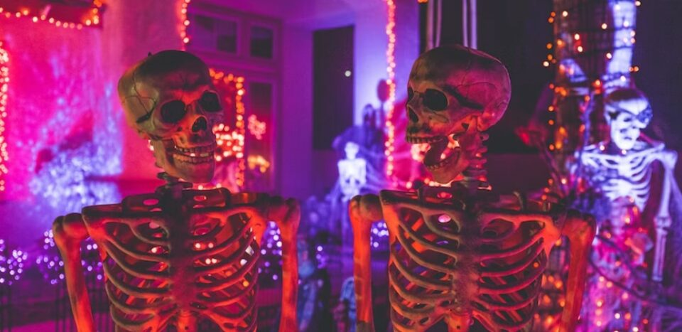
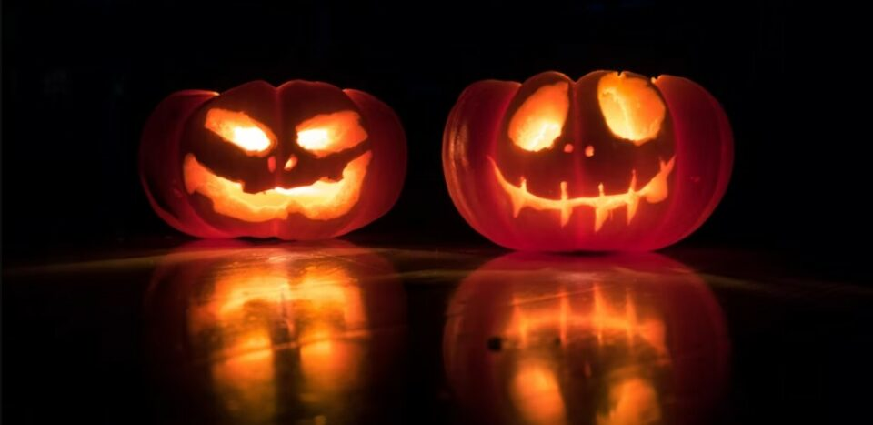
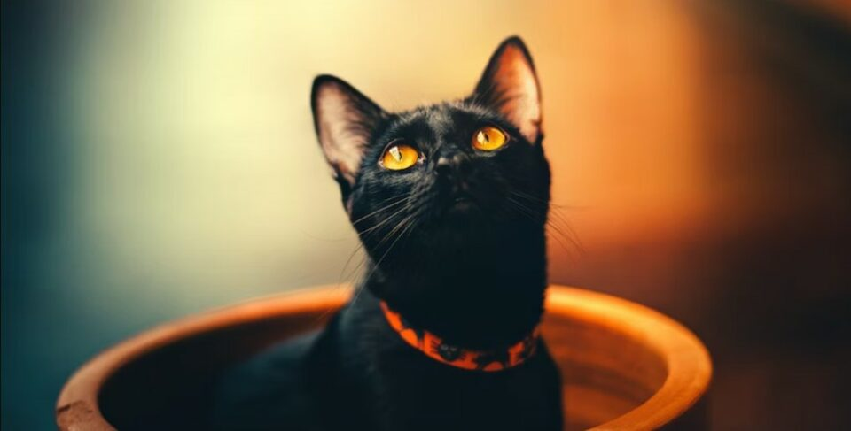
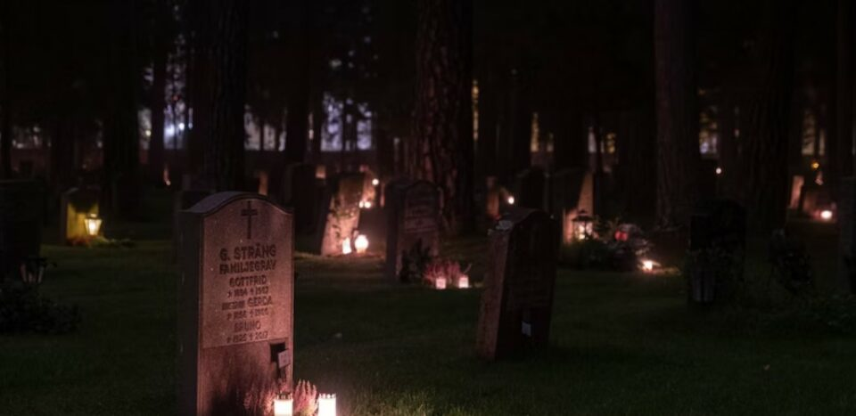
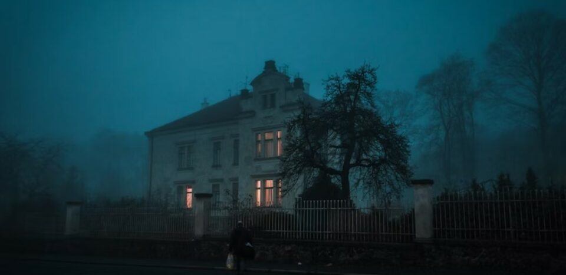
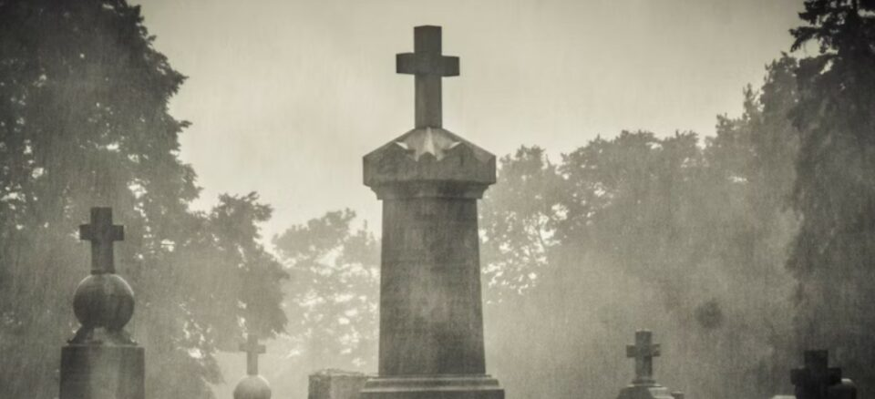
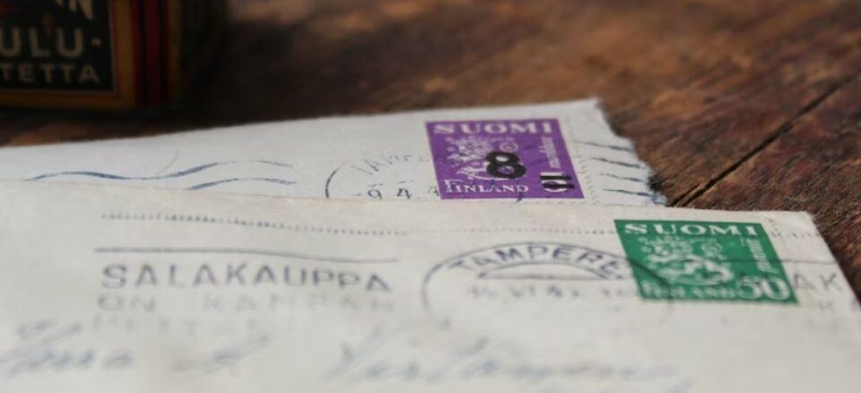
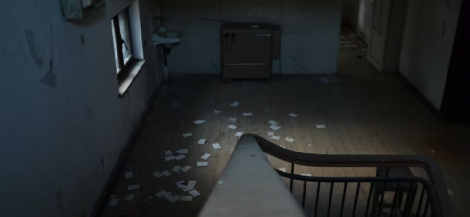
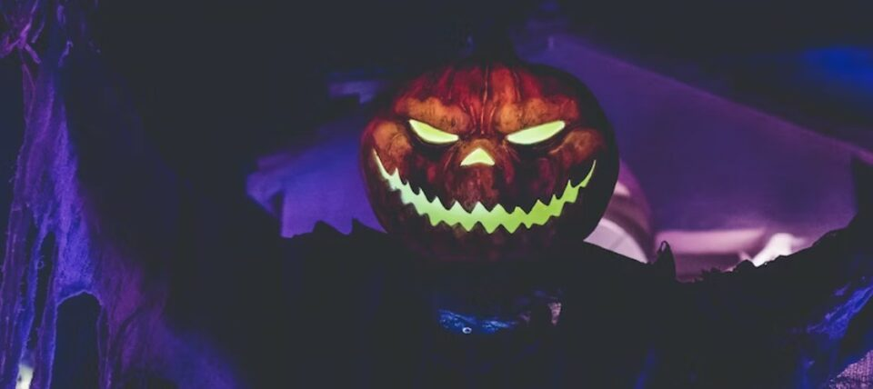
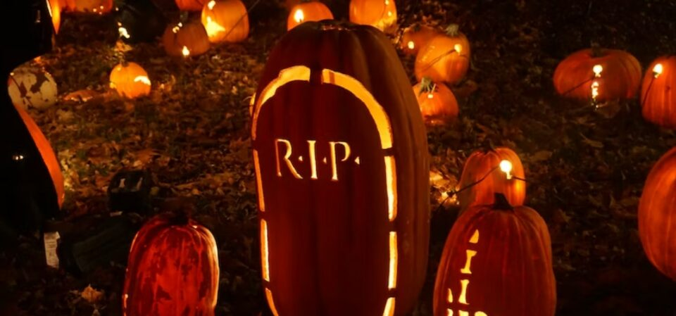

This article has been written and researched by our expert Loveable through a precise methodology. [Learn more about our methodology](https://avada.io/loveable/our-methodological.html)

[Loveable](https://avada.io/loveable/) > [Blog](https://avada.io/loveable/blog/) > [Holiday](https://avada.io/loveable/holiday/)

# 30 Spooky Halloween Riddles and Jokes (with Answers) that’ll Make Your Boo

Written by [Blake Simpson](https://avada.io/loveable/author/blake/) Last Updated on September 26, 2023

- [Top 30 Halloween Riddles and Jokes To Celebrate Spooky Season](https://avada.io/loveable/blog/halloween-riddles/#wp-block-heading-2-4)
    - [All Ears](https://avada.io/loveable/blog/halloween-riddles/#wp-block-heading-3-6)
    - [Damaged Pumpkin](https://avada.io/loveable/blog/halloween-riddles/#wp-block-heading-3-9)
    - [Musical Mummy Halloween Riddle](https://avada.io/loveable/blog/halloween-riddles/#wp-block-heading-3-13)
    - [Sleepy Vampire](https://avada.io/loveable/blog/halloween-riddles/#wp-block-heading-3-16)
    - [Dessert Time Halloween Riddle](https://avada.io/loveable/blog/halloween-riddles/#wp-block-heading-3-20)
    - [Traveling Witch](https://avada.io/loveable/blog/halloween-riddles/#wp-block-heading-3-23)
    - [Musical Skeleton](https://avada.io/loveable/blog/halloween-riddles/#wp-block-heading-3-27)
    - [Shattered Glass Halloween Riddle](https://avada.io/loveable/blog/halloween-riddles/#wp-block-heading-3-30)
    - [Black Cat](https://avada.io/loveable/blog/halloween-riddles/#wp-block-heading-3-37)
    - [Naked And Bare Halloween Riddle](https://avada.io/loveable/blog/halloween-riddles/#wp-block-heading-3-41)
    - [Night Creatures](https://avada.io/loveable/blog/halloween-riddles/#wp-block-heading-3-44)
    - [Neat In A Chamber](https://avada.io/loveable/blog/halloween-riddles/#wp-block-heading-3-47)
    - [Grave Men Halloween Riddle](https://avada.io/loveable/blog/halloween-riddles/#wp-block-heading-3-50)
    - [Roam At Night](https://avada.io/loveable/blog/halloween-riddles/#wp-block-heading-3-54)
    - [Haunted House Halloween Riddle](https://avada.io/loveable/blog/halloween-riddles/#wp-block-heading-3-58)
    - [Cruising Vampire](https://avada.io/loveable/blog/halloween-riddles/#wp-block-heading-3-63)
    - [A Novel Spot](https://avada.io/loveable/blog/halloween-riddles/#wp-block-heading-3-66)
    - [Honest Ghost Halloween Riddle](https://avada.io/loveable/blog/halloween-riddles/#wp-block-heading-3-70)
    - [Creepy Address](https://avada.io/loveable/blog/halloween-riddles/#wp-block-heading-3-73)
    - [Slow-Poke](https://avada.io/loveable/blog/halloween-riddles/#wp-block-heading-3-77)
    - [Beach Babe Halloween Riddle](https://avada.io/loveable/blog/halloween-riddles/#wp-block-heading-3-80)
    - [Home Spooky Home](https://avada.io/loveable/blog/halloween-riddles/#wp-block-heading-3-83)
    - [In The Bank](https://avada.io/loveable/blog/halloween-riddles/#wp-block-heading-3-87)
    - [Fixing Up Pumpkin Halloween Riddle](https://avada.io/loveable/blog/halloween-riddles/#wp-block-heading-3-91)
    - [Strange Noises](https://avada.io/loveable/blog/halloween-riddles/#wp-block-heading-3-95)
    - [Halloween Heist](https://avada.io/loveable/blog/halloween-riddles/#wp-block-heading-3-98)
    - [Poisoned Ice](https://avada.io/loveable/blog/halloween-riddles/#wp-block-heading-3-102)
    - [Jack-o’-Lantern Halloween Riddle](https://avada.io/loveable/blog/halloween-riddles/#wp-block-heading-3-107)
    - [Bloodhound](https://avada.io/loveable/blog/halloween-riddles/#wp-block-heading-3-111)
    - [Frankenstein Halloween Riddle](https://avada.io/loveable/blog/halloween-riddles/#wp-block-heading-3-114)
- [Bottom Line](https://avada.io/loveable/blog/halloween-riddles/#wp-block-heading-2-121)

Annually celebrated on October 31st, Halloween brings ghosts, ghouls, friends, and families together to have fun dressing up, trick-or-treating, and solving mystery Halloween riddles. 

If you are not a fan of ghost stories, try these funny Halloween riddles instead. They are a great way to lighten the mood at parties and other gatherings in this spooky season ahead. Once you’ve mastered all of them, challenge your friends and family to answer them correctly.

  
As you try to solve these **30 best Halloween riddles** and jokes, beware of vampires, zombies, ghosts, and endless laughter! Even if these don’t have you howling, you are sure to find at least one on the list that will crack you up.

## Top **30 Halloween Riddles and Jokes To Celebrate Spooky Season**

### **All Ears**

I have hundreds of ears, but I can’t hear anything. What am I?

Answer: A cornfield.

### **Damaged Pumpkin**

How do you fix a damaged Jack-o’-Lantern?

Answer: You use a pumpkin patch.

### **Musical Mummy Halloween Riddle**

What is a mummy’s favorite type of music?

Answer: Wrap music.

### **Sleepy Vampire**

How are vampires like false teeth?

Answer: They both come out at night.

If you can love these Halloween riddles, try these funniest [Halloween jokes](https://avada.io/loveable/halloween-jokes/) to dive right into the laughter world.

### **Dessert Time Halloween Riddle**

What do ghosts like for dessert?

Answer: I-scream.

### **Traveling Witch**

What does a witch order when staying at a hotel?

Answer: Broom service.

### **Musical Skeleton**

What’s a skeleton’s favorite instrument?

Answer: A trombone.

### **Shattered Glass Halloween Riddle**

The Smith is a wealthy family that lives in a large circular house. One morning, Mr. Smith woke up and found his mirror shattered. He knew one of his employees was responsible for this. Therefore, he asked them what they were doing in the morning and got these replies.

“I was washing the car back then.”, said the driver.

“I was at the corner cleaning the house.”, said the maid.

“I was about to make lunch for later .”, said the cook.

From the replies, he knew who it was. Can you guess who it was?

Answer: The maid. The house was circular, so it didn’t have any corners.

### **Black Cat**

When is it considered bad luck to see a black cat?

Answer: When you’re a mouse.

### **Naked And Bare Halloween Riddle**

I am a body with a leg, an arm, and a head, but no flesh or eyeballs. How is that possible?

Answer: I’m a skeleton.

### **Night Creatures**

You should be careful if you see one flying around at night, as some can turn into vampires and bite your neck. What are they?

Answer: Bats.

### **Neat In A Chamber**

I am wrapped, but not as a gift. I am kept neatly in a chamber, and archeologists see me as a great treasure. What am I?

Answer: A mummy.

### **Grave Men Halloween Riddle**

Two men are walking in a graveyard. The first man walks to a grave. The second man says, “Whose grave is that?” The first man points to the grave and says, “I don’t have any brothers or sisters, but my father’s son is that man’s father.” Whose grave is it?

Answer: The man who points to the grave.

### **Roam At Night**

Some people believe in me, others don’t. I roam around at night and maybe float, too. If you suddenly hear a weird noise coming from the ground, run and hide from my creepy sound. What am I?

Answer: A ghost.

These Halloween riddles are kind of scary, right? So are these [Halloween movies](https://avada.io/loveable/best-halloween-movies/).

### **Haunted House Halloween Riddle**

Darkness, dust, cobwebs, and creaking floors.

Spirits, secrets, strange noises, and occasional slamming doors. What am I?

Answer: A haunted house.

### **Cruising Vampire**

What do vampires use to travel in?

Answer: A blood vessel.

### **A Novel Spot**

Why should writers write stories in a cemetery?

Answer: Because it’s filled with plots.

### **Honest Ghost Halloween Riddle**

Why are ghosts terrible at lying?

Answer: You can see right through them.

### **Creepy Address**

Where do zombies live?

Answer: On a dead-end street.

### **Slow-Poke**

What do you call skeletons that don’t work?

Answer: Lazy bones.

### **Beach Babe Halloween Riddle**

What do you call a witch tanning at the beach?

Answer: A sand-witch.

### **Home Spooky Home**

A zombie, a ghost, and a mummy bought a house. It has all the rooms except for one. What room is it?

Answer: A living room. 

### **In The Bank**

Dracula loves drawing and putting this in the bank. What is it?

Answer: Blood.

If you are a Halloween lover, check out these [Halloween hairstyles](https://avada.io/loveable/halloween-hairstyles/) to get into your spooky spirit.

### **Fixing Up Pumpkin Halloween Riddle**

You can get your Jack-o’-Lantern here or use it to fix a hole in your pumpkin. What is it?

Answer: A pumpkin patch.

### **Strange Noises**

This place has hardly any lights and lots of creaking floors. There are also strange noises and random slamming doors. What is it?

Answer: A haunted house.

### **Halloween Heist**

A priceless mirror with a beautiful silver frame was stolen from a haunted house. The suspects are three Halloween monsters that were last seen in the house: a witch, a werewolf, and a vampire. Who stole the mirror?

Answer: The witch. As silver is known to kill werewolves, the werewolf wouldn’t have touched it. Vampires can’t see their reflections, so the vampire wouldn’t need the mirror.

Witches are always an excellent choice for [Halloween costumes](https://avada.io/loveable/coolest-halloween-costumes/), you know.

### **Poisoned Ice**

Two girls ate dinner together. They both ordered iced tea. One girl drank them fast and finished five, while the other drank just one. The girl who drank only one died while the other survived.

All of the drinks were poisoned. How is that possible?

Answer: The poison was in the ice.

### **Jack-o’-Lantern Halloween Riddle**

I have no head nor body. My smile lights up in the night. What am I?

Answer: Jack-o’-Lantern.

### **Bloodhound**

If the witch has a broom and the Jack-o’-Lantern has a candle, then what does a vampire have?

Answer: A bloodhound.

### **Frankenstein Halloween Riddle**

Made out of different body parts

Brought to life by electricity

Bolts in my neck and yellowish skin

Why can’t people show me some pity?

Who am I?

Answer: [Frankenstein](https://en.wikipedia.org/wiki/Frankenstein).

## **Bottom Line**

Think that Halloween riddles and jokes are just for kids? Think again. You would be surprised to learn how confusing some of these spooky Halloween riddles are, even to the most mature brains. Come fight the zombies with our list of Halloween riddles and wake up your inner brainiac!

- [Top 30 Halloween Riddles and Jokes To Celebrate Spooky Season](https://avada.io/loveable/blog/halloween-riddles/#wp-block-heading-2-4)
    - [All Ears](https://avada.io/loveable/blog/halloween-riddles/#wp-block-heading-3-6)
    - [Damaged Pumpkin](https://avada.io/loveable/blog/halloween-riddles/#wp-block-heading-3-9)
    - [Musical Mummy Halloween Riddle](https://avada.io/loveable/blog/halloween-riddles/#wp-block-heading-3-13)
    - [Sleepy Vampire](https://avada.io/loveable/blog/halloween-riddles/#wp-block-heading-3-16)
    - [Dessert Time Halloween Riddle](https://avada.io/loveable/blog/halloween-riddles/#wp-block-heading-3-20)
    - [Traveling Witch](https://avada.io/loveable/blog/halloween-riddles/#wp-block-heading-3-23)
    - [Musical Skeleton](https://avada.io/loveable/blog/halloween-riddles/#wp-block-heading-3-27)
    - [Shattered Glass Halloween Riddle](https://avada.io/loveable/blog/halloween-riddles/#wp-block-heading-3-30)
    - [Black Cat](https://avada.io/loveable/blog/halloween-riddles/#wp-block-heading-3-37)
    - [Naked And Bare Halloween Riddle](https://avada.io/loveable/blog/halloween-riddles/#wp-block-heading-3-41)
    - [Night Creatures](https://avada.io/loveable/blog/halloween-riddles/#wp-block-heading-3-44)
    - [Neat In A Chamber](https://avada.io/loveable/blog/halloween-riddles/#wp-block-heading-3-47)
    - [Grave Men Halloween Riddle](https://avada.io/loveable/blog/halloween-riddles/#wp-block-heading-3-50)
    - [Roam At Night](https://avada.io/loveable/blog/halloween-riddles/#wp-block-heading-3-54)
    - [Haunted House Halloween Riddle](https://avada.io/loveable/blog/halloween-riddles/#wp-block-heading-3-58)
    - [Cruising Vampire](https://avada.io/loveable/blog/halloween-riddles/#wp-block-heading-3-63)
    - [A Novel Spot](https://avada.io/loveable/blog/halloween-riddles/#wp-block-heading-3-66)
    - [Honest Ghost Halloween Riddle](https://avada.io/loveable/blog/halloween-riddles/#wp-block-heading-3-70)
    - [Creepy Address](https://avada.io/loveable/blog/halloween-riddles/#wp-block-heading-3-73)
    - [Slow-Poke](https://avada.io/loveable/blog/halloween-riddles/#wp-block-heading-3-77)
    - [Beach Babe Halloween Riddle](https://avada.io/loveable/blog/halloween-riddles/#wp-block-heading-3-80)
    - [Home Spooky Home](https://avada.io/loveable/blog/halloween-riddles/#wp-block-heading-3-83)
    - [In The Bank](https://avada.io/loveable/blog/halloween-riddles/#wp-block-heading-3-87)
    - [Fixing Up Pumpkin Halloween Riddle](https://avada.io/loveable/blog/halloween-riddles/#wp-block-heading-3-91)
    - [Strange Noises](https://avada.io/loveable/blog/halloween-riddles/#wp-block-heading-3-95)
    - [Halloween Heist](https://avada.io/loveable/blog/halloween-riddles/#wp-block-heading-3-98)
    - [Poisoned Ice](https://avada.io/loveable/blog/halloween-riddles/#wp-block-heading-3-102)
    - [Jack-o’-Lantern Halloween Riddle](https://avada.io/loveable/blog/halloween-riddles/#wp-block-heading-3-107)
    - [Bloodhound](https://avada.io/loveable/blog/halloween-riddles/#wp-block-heading-3-111)
    - [Frankenstein Halloween Riddle](https://avada.io/loveable/blog/halloween-riddles/#wp-block-heading-3-114)
- [Bottom Line](https://avada.io/loveable/blog/halloween-riddles/#wp-block-heading-2-121)

### [Blake Simpson](https://avada.io/loveable/author/blake/)

Hi, I'm Blake from Loveable. I help people find perfect gifts for occasions like anniversaries and weddings. I also write a blog about holidays, sharing insights to make them more meaningful. Let's create unforgettable moments together!

- [Twitter](https://twitter.com/intent/tweet)
- [Facebook](https://www.facebook.com/sharer/sharer.php)
- [instagram](https://avada.io/loveable/blog/halloween-riddles/)
- [pinterest](https://www.pinterest.com/loveablellc/)

## Related Posts

[### 120+ Christian Birthday Wishes To Spread Your Love](https://avada.io/loveable/blog/christian-birthday-wishes/) 

[

### 35 Best 70th Birthday Ideas To Celebrate The Special Milestone

](https://avada.io/loveable/blog/70th-birthday-ideas/)

[

### 50 Best 30th Birthday Decorations for a Remarkable Birthday Bash

](https://avada.io/loveable/blog/30th-birthday-decorations/)

[

### 40 Delicious Vegan Christmas Desserts to Delight Your Palate

](https://avada.io/loveable/blog/vegan-christmas-desserts/)

[

### 60 Christmas Team Building Activities to Boost Workplace Spirit

](https://avada.io/loveable/blog/christmas-team-building-activities/)
