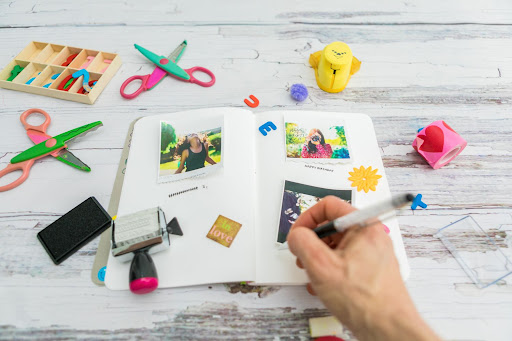
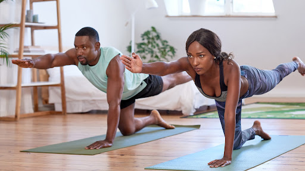
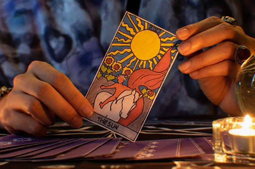
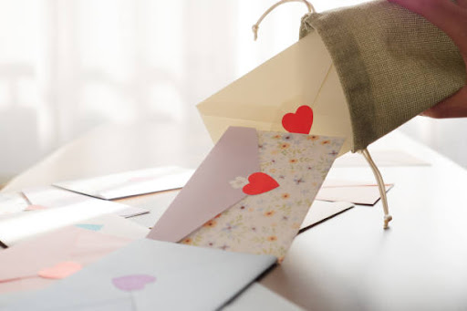

This article has been written and researched by our expert Loveable through a precise methodology. [Learn more about our methodology](https://avada.io/loveable/our-methodological.html)

[Loveable](https://avada.io/loveable/) > [Blog](https://avada.io/loveable/blog/) > [Holiday](https://avada.io/loveable/holiday/)

# 30+ Things to Do on Valentine Day to Store Memorable Moments

Written by [Blake Simpson](https://avada.io/loveable/author/blake/) Last Updated on August 21, 2023

- [1\. Make something delicious](https://avada.io/loveable/blog/things-to-do-on-valentine-day/#wp-block-heading-2-4)
- [2\. Make a game](https://avada.io/loveable/blog/things-to-do-on-valentine-day/#wp-block-heading-2-6)
- [3\. Create playlists for one another](https://avada.io/loveable/blog/things-to-do-on-valentine-day/#wp-block-heading-2-8)
- [4\. Volunteer as a group](https://avada.io/loveable/blog/things-to-do-on-valentine-day/#wp-block-heading-2-11)
- [5\. Go stargazing](https://avada.io/loveable/blog/things-to-do-on-valentine-day/#wp-block-heading-2-13)
- [6\. Act as a tourist in your own town](https://avada.io/loveable/blog/things-to-do-on-valentine-day/#wp-block-heading-2-15)
- [7\. Make a scrapbook of your relationship memories](https://avada.io/loveable/blog/things-to-do-on-valentine-day/#wp-block-heading-2-17)
- [8\. Having a meal in bed](https://avada.io/loveable/blog/things-to-do-on-valentine-day/#wp-block-heading-2-21)
- [9\. Prepare supper together](https://avada.io/loveable/blog/things-to-do-on-valentine-day/#wp-block-heading-2-23)
- [10\. Enjoy a romantic film](https://avada.io/loveable/blog/things-to-do-on-valentine-day/#wp-block-heading-2-26)
- [11\. Send your companion on a treasure quest](https://avada.io/loveable/blog/things-to-do-on-valentine-day/#wp-block-heading-2-29)
- [12\. Take a vacation](https://avada.io/loveable/blog/things-to-do-on-valentine-day/#wp-block-heading-2-31)
- [13\. Take a hot bath](https://avada.io/loveable/blog/things-to-do-on-valentine-day/#wp-block-heading-2-33)
- [14\. Yoga together](https://avada.io/loveable/blog/things-to-do-on-valentine-day/#wp-block-heading-2-35)
- [15\. Massage each other](https://avada.io/loveable/blog/things-to-do-on-valentine-day/#wp-block-heading-2-38)
- [16\. Make a wish list](https://avada.io/loveable/blog/things-to-do-on-valentine-day/#wp-block-heading-2-40) 
- [17\. Attend a class together](https://avada.io/loveable/blog/things-to-do-on-valentine-day/#wp-block-heading-2-42)
- [18\. Highlight Your Favorite Features of Your Partner](https://avada.io/loveable/blog/things-to-do-on-valentine-day/#wp-block-heading-2-45)
- [19\. Reenact Your First Date](https://avada.io/loveable/blog/things-to-do-on-valentine-day/#wp-block-heading-2-48)
- [20\. Hire a Massage Therapist to Come to Your Home](https://avada.io/loveable/blog/things-to-do-on-valentine-day/#wp-block-heading-2-50)
- [21\. Make Your Own Wine Bottles](https://avada.io/loveable/blog/things-to-do-on-valentine-day/#wp-block-heading-2-53)
- [22\. Chase The Sun](https://avada.io/loveable/blog/things-to-do-on-valentine-day/#wp-block-heading-2-55)
- [23\. Make a Karaoke Night](https://avada.io/loveable/blog/things-to-do-on-valentine-day/#wp-block-heading-2-57)
- [24\. Read a Romance Novel](https://avada.io/loveable/blog/things-to-do-on-valentine-day/#wp-block-heading-2-59)
- [25\. View Your Wedding Video](https://avada.io/loveable/blog/things-to-do-on-valentine-day/#wp-block-heading-2-63)
- [26\. Make a Bonfire](https://avada.io/loveable/blog/things-to-do-on-valentine-day/#wp-block-heading-2-65)
- [27\. Consider a Tarot Reading](https://avada.io/loveable/blog/things-to-do-on-valentine-day/#wp-block-heading-2-67)
- [28\. Attend a Concert](https://avada.io/loveable/blog/things-to-do-on-valentine-day/#wp-block-heading-2-70)
- [29\. Take a Beautiful Drive](https://avada.io/loveable/blog/things-to-do-on-valentine-day/#wp-block-heading-2-72)
- [30\. Send Love Letters](https://avada.io/loveable/blog/things-to-do-on-valentine-day/#wp-block-heading-2-74)
- [31\. Create Some Crafts](https://avada.io/loveable/blog/things-to-do-on-valentine-day/#wp-block-heading-2-78)
- [32\. Rent a Comfortable Cabin in the Woods](https://avada.io/loveable/blog/things-to-do-on-valentine-day/#wp-block-heading-2-80)
- [33\. Drawing together](https://avada.io/loveable/blog/things-to-do-on-valentine-day/#wp-block-heading-2-82)
- [The bottom line](https://avada.io/loveable/blog/things-to-do-on-valentine-day/#wp-block-heading-2-85)

To commemorate love and devotion – [Valentine’s day](https://avada.io/loveable/what-is-valentines-day/) is formed, and it is getting more and more responses from people globally, especially from the youth. Thanks to its quick popularity, it is not only enjoyed by the young but also by all ages. As a result,  it’s so much that many playgrounds, restaurants, and cafeterias are even overloaded to meet a large number of customers, primarily couples.

Valentine’s Day supports lovers in [expressing their feelings](https://avada.io/loveable/love-paragraphs-for-her/) for one another. It is well known that individuals plan hidden presents in order to surprise their beloved. There are also many events to do on this day. 

Valentine’s Day will be coming soon, next Feb. Do you have a good plan to enjoy this festival? First, you are supposed to have a fundamental understanding of this day, and then, this article will leave you with some interesting **things to do on Valentine day**. Let’s see what they are. 

## **1\. Make something delicious**

Remember that the fastest way to someone’s heart is through their stomach. It’s really nothing to reject nice food. Go to the kitchen and make some favorite dishes to taste. You can also test with some new recipes that you have never tried before. Don’t worry whether it’s nice or not. The most important is the experiences learned from this time; it is believed to be unforgettable knowledge for you. If you can serve it for someone, you love to enjoy it together.

## **2\. Make a game**

How long haven’t you played a game? For a long time, don’t be concerned about games; there are many revolutions in this industry. You have many ways to connect with your friends through social media platforms. Therefore, it isn’t hard to enjoy [fun times together](https://avada.io/loveable/family-indoor-activities/) with some types of multi-player games such as strategy ones. It’s even better to have a partner to play games like Truth or Dare or some to stimulate her/his lust. 

## **3\. Create playlists for one another**

Create playlists for one another

It is impossible to say that there is someone who hates music. We all [love songs](https://avada.io/loveable/music-gifts/). They are an important part of making life vibrant and colorful. We maybe don’t have the same types of favorite music lists, but we all certainly love music. So this Valentine’s, think about preparing a playlist that can be enjoyed together. A top-trending song, a favorite one, or Valentine’s theme song, anything as long as you have time with each other, and the music will enhance romantic feelings.

## **4\. Volunteer as a group**

It’s fantastic to share with others, to do something that, when recalling, we feel proud of ourselves. The luxurious trip and costly spending for glamorous is meaningless. Why do you consider to do volunteering together? When sharing happiness with someone, you also get it. To see naive smiles, to see how better life you get, it deserves to take a trip. Many social media sources for signing up to volunteer. Don’t be hesitated, don’t be worried, it’s believed to leave beautiful moments together.

## **5\. Go stargazing**

It is a romantic idea to enjoy even if you are single or going with someone. After long working days, you need peacetime to meditate and take a rest. Quiet and peaceful is what we get from the beautiful sky. Not cloud or smoke, the vague light from night stars along with the black cover at night, is perfect space. A telescope is not too important; the feeling is even stronger to be experienced by the naked eye. Choosing a nice location to have a full view, mountain peaks, backyard, or roof, they all are good for creating satisfaction. 

## **6\. Act as a tourist in your own town**

Witness visitors are coming to your hometown and their surprised facial expression many times. Are there some well-known or magnificent tourist attractions in your hometown? They may be in your grasp, but pretending like an amateur is quite fun. Camping in the hometown,  visiting a familiar museum, and snapping many photos like having an amazing trip. See the place where you grew up from a third-person perspective even though you remember every nook and cranny.

## **7\. Make a scrapbook of your relationship memories**

Make a scrapbook of your relationship memories

Back to the warehouse and find anything necessary to make this one. Can your clumsy hands create [wonderful artwork](https://avada.io/loveable/gifts-for-art-lovers/)? Just kidding. Even being grown, crafts are always good activities to do. It’s hard to find printed pictures now because people prefer digital photos more. It’s easy to understand, easy to take, and saves memories. Maybe you still hold some printed pictures from the past that contain your memories of your relationships, take them out to make a personalized keepsake. It will be a day to re-read the book and look back on awesome scenes of life. 

**_Related_**: [33 Best Personalized Book For Everyone You Love](https://avada.io/loveable/personalized-book/)

## **8\. Having a meal in bed**

Prepare for breakfast soon to eat in bed on the early morning Valentine. Don’t have to rush as usual; instead of having to run errands in the morning, calm down and drink some coffee or smoothies along with a light meal. Eat and watch the warmth shining through the window. It’s even more admirable to wake up together when being with your mate.

## **9\. Prepare supper together**

Prepare supper together

A lovely supper might be far more romantic than being at a luxurious crowded restaurant. Don’t worry; even if neither of you is a cook, you can create a spectacular supper that you will both love. The happiness here doesn’t come from its taste, but it is the time the two spending time together. The one cook, the one vice-cook, this beautiful memory will appear when backing to the kitchen to remind a half of another one. Cooking is just a reasonable reason to be together.

## **10\. Enjoy a romantic film**

Enjoy a romantic film

It is always the best [destination for couples to date](https://avada.io/loveable/fall-dates-ideas/). No men bring his women to watch a superhero film; it’s ridiculous. A romantic film will be better for enjoying the moment, and you can whisper in your partner’s ears sweet words. The emotion conveyed by the drama will bring the two of you closer. Hold the hand and slowly give a lovely kiss. You can enjoy the film in any space, home or cinema as long as finding comfortable. If the one feels shy to cuddle in public, the two can watch at home to ready before taking a romantic night.

## **11\. Send your companion on a treasure quest**

Gifts are certainly indispensable for Valentine’s day to represent love messages. However, it’s tasteless to get a gift easily without any trouble. Do you think about what you would do after giving presents and some love words? The conversation will be over if you don’t have a good plan. Make it more attractive and secret with a treasure hunt game. What is difficult to get will be more valuable. 

## **12\. Take a vacation**

You deserve a trip to rest after stressful days. A new trip, new experiences to welcome life, to learn more things. If you are getting exhausted by the hustle and bustle of the city, a natural place is a good choice for a day off. On the other hand, get bored with the countryside and want to find somewhere vibrant and crowded, the center of town is a suggestion. An overwhelming or peaceful place, alone or with someone, is up to you as long as you can recharge energy. 

## **13\. Take a hot bath**

Yes. It’s not a joke. You think about taking a shower as usual when reading this title, don’t you? No. It means a perfect bathtub equipped with some things like rose leaves and candles surrounding it and ballad music to create a fanciful atmosphere. You even can put some snacks and Champagne beside to look royal. You will get into the role of an aristocrat. Enjoying with your partner is not a bad idea on Valentine’s Day.

## **14\. Yoga together**

Yoga together

Movement is never redundant. Do some [yoga](https://avada.io/loveable/gifts-yoga-lovers/) practices to relax your muscles. Much research shows that doing yoga doesn’t only help to improve physical health conditions but also mental strength. Therefore, no matter whether you are a boy or a girl, take up this healthy habit of saying no disease. Remember that money is nothing if you are sick, so don’t spend all your time earning money for the most expensive bed in the hospital. 

## **15\. Massage each other**

It’s wonderful to give your lover a massage for relaxing. In only 30 minutes, massage therapy methods could bring you to heaven, where being in the most comfortable state. This method is always if you have time to be with someone, the two should spend time to satisfy each other. In case of making good preparation, some scented candles should be added to level up the background. Moreover, a bottle of body oil is indispensable to complete perfect progress. 

## **16\. Make a wish list** 

Don’t say that you don’t have any dreams. It’s actually nonsense because a life without wishes is a failure. Maybe you get shy when talking about dreams for fear of being ridiculed. You have a terrible voice but want to be a singer, for example. It’s fine, and nothing is impossible if you don’t try your best. First and foremost, plan a detailed ideal to-do list that you have never done before. When getting older, you will regret due to the hesitates, so don’t waste your youth.

## **17\. Attend a class together**

Attend a class together.

Many extra classes provide useful knowledge for daily life, job, and health. They are all valuable to have a better life (except for some kinds of gambling), so take one in case of having time. On Valentine’s day, it will be an awesome idea to enjoy ourselves together. Find out whether you and yours have any mutual habits, demands, or hobbies. Connect them to determine the same ones, and then enjoy an interesting class together.

## **18\. Highlight Your Favorite Features of Your Partner**

Remember that Valentine’s day is the time to express love to others, so you must show your sincerity. What you truly love about them, jot them down in a letter and send it with gifts. In this way, you will impress receivers. One more important thing is that everyone loves to get comments from others to improve themselves, but they obviously don’t hope to get bad ones, which depress them too much. Therefore, be subtle and polite in what you say. 

For example, you love their passion for life. So give some compliments to encourage them, like always making sure life is to the fullest and enjoying every moment.

## **19\. Reenact Your First Date**

We often have some Anniversary for [the first meeting](https://avada.io/loveable/what-to-talk-about-on-first-date/), the first date, marriage, etc. Reenacting this important event in life is an excellent idea for Valentine’s day. Did you meet in the bar, restaurant, or school? Remake the shyness of this time for each other like actors. It will recall the reason why you are still together and what was the first sight. Not only for couples but also for friends. Turn this romantic occasion into a funny group party.

## **20\. Hire a Massage Therapist to Come to Your Home**

Hire a Massage Therapist to Come to Your Home

In case you have good conditions, you can think of a professional massage therapist to satisfy. Massage is not just simple like you see; you have to be careful when performing with the muscles and nerves of the body. An incident is completely possible if done in the wrong way leading to dangerous consequences. You can call them through social media platforms and remember to check practicing certificates as well as feedback from old customers. With their workmanship, you will get amazing experiences to relax. 

## **21\. Make Your Own Wine Bottles**

Wine has been a traditional product in parties, meetings, or giving on special days. There are many types of wine in the market to meet the customer’s demands for taste, color, and origin. If there are no products that can satisfy you, consider a DIY bottle. The progress of making a bottle of wine is extremely complicated and requires high care and professionalism. To make the best one, it even has to be done in manufacture. However, you can refer to some online websites that allow you to create one with just a few clicks such as “[The wine foundry](https://thewinefoundry.com/make-wine/).” Do something special on a special day.

## **22\. Chase The Sun**

Chasing the sun is a very romantic experience that you can enjoy with someone through the window or even camping. The sunlight shines lightly when it is going up or down. The mixed warm colors, including red, orange, and yellow, create a peaceful space to comfort anyone. You have secret stories and stressful worries – This is the time to take a short break to listen to the heart’s desire. It’s great to have someone by your side right now.

## **23\. Make a Karaoke Night**

As mentioned above, everyone has their own playlist for themselves, and it’s great to sing out loud favorite songs. Don’t be shy, even if your voice is awesome or not. Songs are always the best replacement for confession. The song you choose to sing will reveal your mood at this moment. Play a love song to thank your sweetie for being by your side. Play a breakup song to express the sadness that you have gotten through. Worry about the crowd in the karaoke bar, no problem. Many karaoke apps in the online market help to turn your home into a vibrant bar. 

## **24\. Read a Romance Novel**

Read a Romance Novel

Reading is never underrated, thanks to many benefits for readers. It is a good habit always encouraged by family and professors to improve your knowledge as well as soft skills. However, Valentine’s day represents love, so you are supposed to take a love book to enjoy the sweet feeling of love. This is an opportunity to enhance love knowledge while you are tasteless. After practicing with some books like that, you will have more things to show off to your partner. Who doesn’t into romance in love, right?

## **25\. View Your Wedding Video**

Did you get married? It is one of the most important landmarks of your life. The time you decide to choose the person who will be with you till the end of your life. It’s certain that some beautiful moments were saved in the footage and photos. Find them in your messy warehouse to take them out. Rewatch the happiest moment – the destiny with your mate to relive that time. Remind your mate of how the two used to be – a warm atmosphere for a cool day on Valentine’s. 

## **26\. Make a Bonfire**

Burn a fire up to keep warm on a cold day on Valentine’s. The orange lights will close members together, so make a plan for camping on the beach, mountain, or even the backyard and bring your friends here for a fiery party. With the fire, you can even think of a barbecue or some kind of tubers such as potatoes, dried or all of them. The parties will be the most beautiful memories to recall with friends. If there is your partner here, cuddle in front of the flame of love.

## **27\. Consider a Tarot Reading**

Consider a Tarot Reading

Tarot is getting more and more popular nowadays because of its attraction. Many people even get addicted to this game to satisfy their curiosity. No matter if it’s correct or not, it’s worth a try with your friends or partner. Will the cards you draw say anything about who you are? Find some reputable shops to discover yourself.

## **28\. Attend a Concert**

The fact that Valentine’s is a big festival globally even if whether it is recognized by you or not. On that day, plenty of event organizers will spend money to organize fire concerts to attract people to participate. Blend in with the crowd, and you’ll be energized by a flamboyant atmosphere to enjoy the music and have fun together. So you don’t have to worry about being lonely on Valentine’s Day anymore, maybe you will make many new friends there.

## **29\. Take a Beautiful Drive**

Going sightseeing is also the best way to relieve stress. Natural beauty is believed to comfort you. Let’s see what nature leaves behind. It seems like the way God gives you to the World. Life is a gift, not a punishment. Open the door and enjoy some fresh air; you will find better. That is why it is put on the list of things to do on Valentine’s day. 

## **30\. Send Love Letters**

Send Love Letters

Surely, Valentine’s day is the day for love, so [love messages](https://avada.io/loveable/love-paragraphs-for-her/) are a indispensable part of expressing sincerity. However, some people find it difficult to directly heart to others. In the worst case, they even cannot convey exactly what they think, so unexpected misunderstandings can happen. To avoid this awful situation, love letters are the perfect replacement. A handwritten message represents your genuine through your handwriting, and don’t be afraid because your handwriting is not so beautiful. 

**_Related_**: [How To Write A Love Letter to Your Crush](https://avada.io/loveable/write-a-love-letter/)

## **31\. Create Some Crafts**

Enjoy Valentine’s Day with craft packed with some drinks, refreshments, and a ton of entertainment. When you were a child, you probably liked to play with paper and scissors but got against from parents. Now you are grown up, why don’t you rediscover your childhood? You may make DIY Valentine’s Day gifts for each other or even make a competition to see who can construct the most imaginative craft!

## **32\. Rent a Comfortable Cabin in the Woods**

Go to the wild and escape from the crowded city. Living in a wooden cabin in the jungle to view nature probably used to be a dream for children. Especially when getting older, a peaceful place like that is desired more after immersing in the factory smoke and pollution. Bring warm clothes and hot coffee or wine, or the suitable choice for Valentine’s day – Hot chocolate to enjoy beside the campfire. 

## **33\. Drawing together**

Drawing together

Artistic creation is a wonderful idea to enjoy Valentine’s day together. It is said that art contributes to fostering the personality of and nurturing spiritual nobility and beauty. How it is amazing to create a [special artwork](https://avada.io/loveable/gifts-for-art-lovers/) on a special day. There are many channels on Youtube for the beginner to take up this, so don’t worry to being judged. Keep in mind that the value of a painting is not in its price but in the painters.

## **The bottom line**

Valentine’s day is the day of love – a global festival is welcomed globally. There are many arguments on whether the existence of this day is sacred or not. Anyway, it is a good reason to celebrate, to express, to enjoy, to have fun. The tradition of Valentine’s Day is for couples, but it’s nonsense right now. All are allowed to enjoy amazing times together. 

This article provides everyone with **30+ things to do on Valentine’s day to store memorable moments**. Read it as a reference to having a great celebration next time.

- [1\. Make something delicious](https://avada.io/loveable/blog/things-to-do-on-valentine-day/#wp-block-heading-2-4)
- [2\. Make a game](https://avada.io/loveable/blog/things-to-do-on-valentine-day/#wp-block-heading-2-6)
- [3\. Create playlists for one another](https://avada.io/loveable/blog/things-to-do-on-valentine-day/#wp-block-heading-2-8)
- [4\. Volunteer as a group](https://avada.io/loveable/blog/things-to-do-on-valentine-day/#wp-block-heading-2-11)
- [5\. Go stargazing](https://avada.io/loveable/blog/things-to-do-on-valentine-day/#wp-block-heading-2-13)
- [6\. Act as a tourist in your own town](https://avada.io/loveable/blog/things-to-do-on-valentine-day/#wp-block-heading-2-15)
- [7\. Make a scrapbook of your relationship memories](https://avada.io/loveable/blog/things-to-do-on-valentine-day/#wp-block-heading-2-17)
- [8\. Having a meal in bed](https://avada.io/loveable/blog/things-to-do-on-valentine-day/#wp-block-heading-2-21)
- [9\. Prepare supper together](https://avada.io/loveable/blog/things-to-do-on-valentine-day/#wp-block-heading-2-23)
- [10\. Enjoy a romantic film](https://avada.io/loveable/blog/things-to-do-on-valentine-day/#wp-block-heading-2-26)
- [11\. Send your companion on a treasure quest](https://avada.io/loveable/blog/things-to-do-on-valentine-day/#wp-block-heading-2-29)
- [12\. Take a vacation](https://avada.io/loveable/blog/things-to-do-on-valentine-day/#wp-block-heading-2-31)
- [13\. Take a hot bath](https://avada.io/loveable/blog/things-to-do-on-valentine-day/#wp-block-heading-2-33)
- [14\. Yoga together](https://avada.io/loveable/blog/things-to-do-on-valentine-day/#wp-block-heading-2-35)
- [15\. Massage each other](https://avada.io/loveable/blog/things-to-do-on-valentine-day/#wp-block-heading-2-38)
- [16\. Make a wish list](https://avada.io/loveable/blog/things-to-do-on-valentine-day/#wp-block-heading-2-40) 
- [17\. Attend a class together](https://avada.io/loveable/blog/things-to-do-on-valentine-day/#wp-block-heading-2-42)
- [18\. Highlight Your Favorite Features of Your Partner](https://avada.io/loveable/blog/things-to-do-on-valentine-day/#wp-block-heading-2-45)
- [19\. Reenact Your First Date](https://avada.io/loveable/blog/things-to-do-on-valentine-day/#wp-block-heading-2-48)
- [20\. Hire a Massage Therapist to Come to Your Home](https://avada.io/loveable/blog/things-to-do-on-valentine-day/#wp-block-heading-2-50)
- [21\. Make Your Own Wine Bottles](https://avada.io/loveable/blog/things-to-do-on-valentine-day/#wp-block-heading-2-53)
- [22\. Chase The Sun](https://avada.io/loveable/blog/things-to-do-on-valentine-day/#wp-block-heading-2-55)
- [23\. Make a Karaoke Night](https://avada.io/loveable/blog/things-to-do-on-valentine-day/#wp-block-heading-2-57)
- [24\. Read a Romance Novel](https://avada.io/loveable/blog/things-to-do-on-valentine-day/#wp-block-heading-2-59)
- [25\. View Your Wedding Video](https://avada.io/loveable/blog/things-to-do-on-valentine-day/#wp-block-heading-2-63)
- [26\. Make a Bonfire](https://avada.io/loveable/blog/things-to-do-on-valentine-day/#wp-block-heading-2-65)
- [27\. Consider a Tarot Reading](https://avada.io/loveable/blog/things-to-do-on-valentine-day/#wp-block-heading-2-67)
- [28\. Attend a Concert](https://avada.io/loveable/blog/things-to-do-on-valentine-day/#wp-block-heading-2-70)
- [29\. Take a Beautiful Drive](https://avada.io/loveable/blog/things-to-do-on-valentine-day/#wp-block-heading-2-72)
- [30\. Send Love Letters](https://avada.io/loveable/blog/things-to-do-on-valentine-day/#wp-block-heading-2-74)
- [31\. Create Some Crafts](https://avada.io/loveable/blog/things-to-do-on-valentine-day/#wp-block-heading-2-78)
- [32\. Rent a Comfortable Cabin in the Woods](https://avada.io/loveable/blog/things-to-do-on-valentine-day/#wp-block-heading-2-80)
- [33\. Drawing together](https://avada.io/loveable/blog/things-to-do-on-valentine-day/#wp-block-heading-2-82)
- [The bottom line](https://avada.io/loveable/blog/things-to-do-on-valentine-day/#wp-block-heading-2-85)

### [Blake Simpson](https://avada.io/loveable/author/blake/)

Hi, I'm Blake from Loveable. I help people find perfect gifts for occasions like anniversaries and weddings. I also write a blog about holidays, sharing insights to make them more meaningful. Let's create unforgettable moments together!

- [Twitter](https://twitter.com/intent/tweet)
- [Facebook](https://www.facebook.com/sharer/sharer.php)
- [instagram](https://avada.io/loveable/blog/things-to-do-on-valentine-day/)
- [pinterest](https://www.pinterest.com/loveablellc/)

## Related Posts

[### 120+ Christian Birthday Wishes To Spread Your Love](https://avada.io/loveable/blog/christian-birthday-wishes/) 

[

### 35 Best 70th Birthday Ideas To Celebrate The Special Milestone

](https://avada.io/loveable/blog/70th-birthday-ideas/)

[

### 50 Best 30th Birthday Decorations for a Remarkable Birthday Bash

](https://avada.io/loveable/blog/30th-birthday-decorations/)

[

### 40 Delicious Vegan Christmas Desserts to Delight Your Palate

](https://avada.io/loveable/blog/vegan-christmas-desserts/)

[

### 60 Christmas Team Building Activities to Boost Workplace Spirit

](https://avada.io/loveable/blog/christmas-team-building-activities/)
