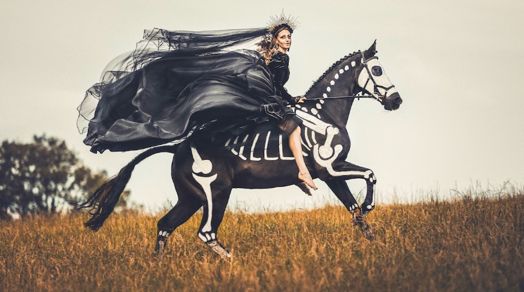

This article has been written and researched by our expert Loveable through a precise methodology. [Learn more about our methodology](https://avada.io/loveable/our-methodological.html)

[Loveable](https://avada.io/loveable/) > [Blog](https://avada.io/loveable/blog/) > [Holiday](https://avada.io/loveable/holiday/)

# 31 Creative and Spooky Halloween Photoshoot Ideas for Adults

Written by [Blake Simpson](https://avada.io/loveable/author/blake/) Last Updated on September 26, 2023

- [31 Spooky Halloween Photoshoot Ideas](https://avada.io/loveable/blog/halloween-photoshoot-ideas/#wp-block-heading-2-3) 
    - [1\. Witch-Theme Photoshoot](https://avada.io/loveable/blog/halloween-photoshoot-ideas/#wp-block-heading-3-4) 
    - [2\. Baby & a Pumpkin Photoshoot Ideas](https://avada.io/loveable/blog/halloween-photoshoot-ideas/#wp-block-heading-3-7) 
    - [3\. Halloween Photoshoot Idea for Pet](https://avada.io/loveable/blog/halloween-photoshoot-ideas/#wp-block-heading-3-12) 
    - [4\. A Spooky Still Life Photo](https://avada.io/loveable/blog/halloween-photoshoot-ideas/#wp-block-heading-3-17)
    - [5\. Baby in a Pumpkin](https://avada.io/loveable/blog/halloween-photoshoot-ideas/#wp-block-heading-3-20)
    - [6\. Colorful Backdrops](https://avada.io/loveable/blog/halloween-photoshoot-ideas/#wp-block-heading-3-23)
    - [7\. Catchy Accents with Footwear](https://avada.io/loveable/blog/halloween-photoshoot-ideas/#wp-block-heading-3-26)
    - [8\. Ghostly Feel in Photos](https://avada.io/loveable/blog/halloween-photoshoot-ideas/#wp-block-heading-3-30)
    - [9\. Head on a Platter](https://avada.io/loveable/blog/halloween-photoshoot-ideas/#wp-block-heading-3-34)
    - [10\. Photo Session in the Forest](https://avada.io/loveable/blog/halloween-photoshoot-ideas/#wp-block-heading-3-38)
    - [11\. Use Special Presets](https://avada.io/loveable/blog/halloween-photoshoot-ideas/#wp-block-heading-3-41)
    - [12\. Add Dynamics to the Frame](https://avada.io/loveable/blog/halloween-photoshoot-ideas/#wp-block-heading-3-44)
    - [13\. Halloween-style Wedding](https://avada.io/loveable/blog/halloween-photoshoot-ideas/#wp-block-heading-3-47)
    - [14\. Costumed kids](https://avada.io/loveable/blog/halloween-photoshoot-ideas/#wp-block-heading-3-51)
    - [15\. Find the spookiest buildings.](https://avada.io/loveable/blog/halloween-photoshoot-ideas/#wp-block-heading-3-54)
    - [16\. Creepy trees and forests](https://avada.io/loveable/blog/halloween-photoshoot-ideas/#wp-block-heading-3-58)
    - [17\. Levitate your subjects](https://avada.io/loveable/blog/halloween-photoshoot-ideas/#wp-block-heading-3-62)
    - [18\. Eerie self-portraits doing multiple exposures](https://avada.io/loveable/blog/halloween-photoshoot-ideas/#wp-block-heading-3-65)
    - [19\. Spooky but romantic date](https://avada.io/loveable/blog/halloween-photoshoot-ideas/#wp-block-heading-3-69)
    - [20\. TikTok pumpkin head](https://avada.io/loveable/blog/halloween-photoshoot-ideas/#wp-block-heading-3-74)
    - [21\. Spooky Silhouettes](https://avada.io/loveable/blog/halloween-photoshoot-ideas/#wp-block-heading-3-77)
    - [22\. Trick or treat](https://avada.io/loveable/blog/halloween-photoshoot-ideas/#wp-block-heading-3-81)
- [Tips for Shooting Halloween Photography](https://avada.io/loveable/blog/halloween-photoshoot-ideas/#wp-block-heading-2-86)
    - [1\. Use Appropriate Lighting](https://avada.io/loveable/blog/halloween-photoshoot-ideas/#wp-block-heading-3-87) 
    - [2\. Capture Details](https://avada.io/loveable/blog/halloween-photoshoot-ideas/#wp-block-heading-3-90) 
    - [3\. Experiment with Angles](https://avada.io/loveable/blog/halloween-photoshoot-ideas/#wp-block-heading-3-92) 
    - [4\. Incorporate the Environment](https://avada.io/loveable/blog/halloween-photoshoot-ideas/#wp-block-heading-3-94) 
    - [5\. Use Props and Accessories](https://avada.io/loveable/blog/halloween-photoshoot-ideas/#wp-block-heading-3-97) 
    - [6\. Candid Moments](https://avada.io/loveable/blog/halloween-photoshoot-ideas/#wp-block-heading-3-99)
    - [7\. Experiment with Editing](https://avada.io/loveable/blog/halloween-photoshoot-ideas/#wp-block-heading-3-102)
    - [8\. Safety First](https://avada.io/loveable/blog/halloween-photoshoot-ideas/#wp-block-heading-3-104)
    - [9\. Have Fun and Be Creative](https://avada.io/loveable/blog/halloween-photoshoot-ideas/#wp-block-heading-3-106)
- [Final Thoughts](https://avada.io/loveable/blog/halloween-photoshoot-ideas/#wp-block-heading-2-109)

With Halloween just around the corner, it’s time to start planning for a spooktacular celebration. One popular way to capture the essence of this haunting holiday is through Halloween photoshoots. Whether you’re a professional photographer or simply looking to preserve cherished memories with loved ones, we’ve gathered a collection of the 30 best **Halloween photoshoot ideas** for this 2023 Halloween season. 

From eerie costumes and spooky settings to imaginative poses and props, these ideas will ignite your creativity and help you capture mesmerizing and unforgettable images. Get ready to immerse yourself in a world of ghosts, witches, pumpkins, and everything Halloween as we delve into these thrilling photoshoot concepts.

## **31 Spooky Halloween Photoshoot Ideas** 

### **1\. Witch-Theme Photoshoot** 

Embrace the enchanting hues of autumn and embrace your inner witch in all its glory. Unleashing your witchy side is as easy as pie. Slip into a long, flowing black witch costume and top it off with a pointed hat. A touch of dark makeup and a few bewitching props will complete the spellbinding look. This idea works wonders when you have a coven of friends to join the photoshoot. Just remember, if you decide to venture into the mystical forest with candles, opt for LED ones to ensure safety and prevent any unexpected mishaps during the shoot. A unique Halloween photoshoot ideas for adults.

### **2\. Baby & a Pumpkin Photoshoot Ideas** 

Halloween is a delightful holiday that [brings joy to the entire family](https://avada.io/loveable/halloween-family-costumes/), including the littlest members. If you have a baby, you’re in for a treat with an abundance of adorable Halloween photography ideas to spark your creativity. One timeless and utterly cute concept is to capture your baby nestled inside a pumpkin, reminiscent of the iconic Anne Geddes style. Prepare a generously-sized pumpkin and, of course, your precious little one!

If the thought of a messy pumpkin isn’t your cup of tea, let your children engage in playful pumpkin exploration in a captivating setting. The vibrant orange hue of the pumpkin will add a captivating pop to your photos, whether you choose an indoor or outdoor Halloween-themed backdrop.

These precious Halloween baby photos will undoubtedly become cherished keepsakes for years to come, encapsulating the spirit of this magical holiday.

### **3\. Halloween Photoshoot Idea for Pet** 

If you’re looking to capture [cute Halloween](https://avada.io/loveable/halloween-costume-for-cat/) pictures but don’t have babies or kids to photograph, don’t worry! Your furry friends can join in on the fun for a delightful themed photo session. Dress up your adorable fur baby in a cute or creepy costume and explore a variety of Halloween photoshoot ideas.

Let your imagination run wild as you experiment with different poses, props, and settings to create captivating images.

Whether your furry friend becomes a witch’s familiar, a pumpkin-loving pup, or a mischievous black cat, their participation will add an extra dose of charm to your Halloween photos.

### **4\. A Spooky Still Life Photo**

If you want to capture the Halloween vibe in your photos, you don’t necessarily have to include people. Just gather some fun props, dim the lights, [carve a pumpkin](https://avada.io/loveable/blog/halloween-pumpkin/), and let the jack-o’-lanterns shine! There are plenty of ideas you can experiment with in this shot. For example, you might want to choose a specific theme for your Halloween still-life photo.

### **5\. Baby in a Pumpkin**

Capture precious moments of your baby’s childhood by having a Halloween photoshoot. Use pumpkins as props to create adorable baby pumpkin pictures. Find a large pumpkin to bring this idea to life, or simply let your kids play with pumpkins in a thematic location. The orange elements in the scene will add a special appeal to your shots.

### **6\. Colorful Backdrops**

Autumn provides numerous picturesque locations for your baby’s photoshoot. Pumpkin patches, backyard leaf piles, and farm fields make excellent backgrounds. The beauty of this idea is that it requires no prior preparation. Just ensure your baby is warm and cozy before heading out.

### **7\. Catchy Accents with Footwear**

During Halloween, many designers cater to the needs of those who enjoy the spooky festivities. For instance, Alexander McQueen designed Armadillo shoes that resemble extraterrestrial footwear. Iris van Herpen collaborated with the renowned footwear brand United Nude to create “Fang” shoes, featuring monstrous mouths as the heels.

If you’re having a photo session in a studio, you can showcase Halloween-themed socks, such as those adorned with pumpkins, skeletons, or black and orange stripes. Removing your footwear allows you to liven up the frame with the addition of Halloween-inspired shoes and socks.

### **8\. Ghostly Feel in Photos**

This idea is incredibly simple to execute, and you don’t have to spend a lot on thematic props and decorations. There are a few shooting techniques you should master to achieve realistic shots. To begin, locate a plain wall that can be used as a backdrop. Then, adjust the shutter speed to a slower setting and capture a person moving alongside the wall.

If you’re planning to photograph yourself, a tripod is essential. It provides stability to ensure sharp and detailed images while capturing a moving person as a ghostly figure. Utilizing the motion blur technique will result in chilling and eerie images.

### **9\. Head on a Platter**

This classic yet timeless trick definitely deserves a spot on the list of the best halloween photoshoot ideas for adults. To capture such images, you’ll need a cardboard box with a hole cut out for the neck on one side.

Repeat the process with a paper plate, and wrap the hole with a piece of material, like a tablecloth. Arrange LED candles and complementary props around it. Then, have someone place their head through the neck hole while concealing the lower part of their body under the box.

### **10\. Photo Session in the Forest**

This location is perfect for a Halloween photoshoot, particularly during the early morning when the ground is enveloped in the dense mist that gradually ascends.

### **11\. Use Special Presets**

By utilizing free Lightroom presets designed for dark photos, you can effortlessly imbue your images with an eerie and enigmatic ambiance. These tools automatically fine-tune lighting, colors, and saturation. Thus, even if something didn’t go as planned during the shoot, you can still salvage your photos and provide them with a polished and professional touch.

### **12\. Add Dynamics to the Frame**

You or someone else can strike a pose in a vintage car or on a horse, adorned in Halloween attire. The key aspect here is capturing movement. If you successfully photograph a flowing dress or a black veil, the results will be truly impressive. To bring this Halloween photo idea to life, use fast shutter speeds (1/500 or even 1/1,000) and keep your lens aperture wide open, such as f/4 or f/2.8. If your lens doesn’t allow these settings, you can begin with f/5.6 or f/8.

### **13\. Halloween-style Wedding**

This idea might be seen as daring, but if you embrace such a celebration, go ahead and pursue it. It’s important to note that you’re not obligated to wear orange and black costumes or limit yourself to traditional [Halloween decorations](https://avada.io/loveable/cool-halloween-decorations/). You have the freedom to explore alternatives like black wedding dresses or even plan a cemetery ceremony if both you and your partner appreciate the concept.

To set the right mood, consider using painted pumpkins, moody floral centerpieces, bouquets, skull-shaped candles, and other elements. Don’t forget to prepare [Halloween-themed cocktails](https://avada.io/loveable/blog/halloween-drinks/) and food to create a harmonious composition. If you’re willing to invest more, you can purchase moody chandeliers and drape the tables with luxurious black velvet linens.

### **14\. Costumed kids**

Capture the essence of Halloween by photographing [children in their costumes](https://avada.io/loveable/halloween-costumes-for-kids/). Offer portrait sessions in advance, attracting parents who plan costumes early. Set up a pop-up studio in a family-friendly neighborhood on Halloween, drawing families in for memorable portraits. As families go door to door, they will be enticed by a themed backdrop and fun props, making them more likely to come and have their portraits taken.

### **15\. Find the spookiest buildings.**

Choosing the right location for your Halloween-themed photo sessions is crucial. Opt for isolated locations without people or props to start with.

Abandoned churches, houses, or dilapidated buildings are ideal, and the more decrepit, the better. Even the silhouette of a classic building can appear eerie when framed against a moody sky with captivating lighting. To enhance the dramatic effect, use flash or LED lights along with long exposures.

### **16\. Creepy trees and forests**

Old, gnarled trees surrounded by dead leaves are ideal subjects and backgrounds for Halloween photoshoots. Whether standing alone or within a forest, there’s a certain spookiness in the texture and form of aged trees.

Capture their essence when the lighting is optimal. Scout the area during the “blue hour,” which occurs just before sunrise or just after sunset. During this time, the light is soft, with a bluish tone, creating an eerie atmosphere that adds to the mood of the photos. A scary Halloween photoshoot ideas for adults you should try.

### **17\. Levitate your subjects**

Create spooky Halloween photos with levitation photography. Dress up in costumes, gather cool props, and find a location with a suitable backdrop. Take a base photo of the scene without people or props. Use a stool or ladder for your subject, capturing a series of photos. Combine these images with the base photo using editing software to create the illusion of levitation.

### **18\. Eerie self-portraits doing multiple exposures**

Leave behind the traditional sheet ghost and opt for a ghostly appearance in your Halloween photoshoots with the multiple exposure technique. Many DSLR and mirrorless cameras offer this feature, allowing you to stack multiple images in a single frame by adjusting the desired number of shots.

If your camera lacks this feature, you can achieve a similar effect through faux double exposure during post-processing.

### **19\. Spooky but romantic date**

Halloween photoshoot for couples can be both fun and romantic, especially for couples. Consider these creative suggestions for hosting a couple’s photoshoot on this spooky holiday. Dress up as renowned historical couples such as Cleopatra and Mark Antony, or embrace fictional characters like Morticia and Gomez Addams.

Next, create your ideal setting in an abandoned location to enhance the spooky atmosphere. However, add a touch of romance by incorporating candlelight at the table and using other appropriate props.

**Suggestion for You:** Best [Couples Halloween Costumes](https://avada.io/loveable/couples-halloween-costumes/) That Are Trendy This Year

### **20\. TikTok pumpkin head**

Whether you’re [active on TikTok](https://avada.io/loveable/tiktok-gifts/) or not, this challenge makes for an excellent halloween photoshoot ideas for couples. Start by carving a large pumpkin to wear on your head. Then, get creative and act out various situations and scenarios as this anthropomorphic pumpkin character. Let your imagination run wild!

### **21\. Spooky Silhouettes**

For a Halloween photoshoot using natural light, plan your session during sunrise or sunset. Position the sun behind your subject to create the desired effect. Alternatively, you can utilize artificial lighting.

With this setup, you have a plethora of Halloween photography ideas to explore. Capture a werewolf howling at the moon or create classic ghost silhouettes by draping a white sheet. Let your imagination run wild with the possibilities!

### **22\. Trick or treat**

Trick-or-treating serves as inspiration for many Halloween photoshoot ideas for couples. Incorporate candies as props, or have fun launching toilet paper rolls in your garden.

Whether you’re indulging in treats or pulling off tricks, this photoshoot promises loads of fun. Don’t forget to dress up in your favorite costumes to complete the festive atmosphere!

**You may also like:** _[Spooky Halloween Gifts For Kids](https://avada.io/loveable/halloween-gifts-kids/) That Treat Them Longer than Candy_

## **Tips for Shooting Halloween Photography**

### **1\. Use Appropriate Lighting** 

Halloween is all about creating an eerie and spooky atmosphere. Experiment with low-key lighting techniques to enhance the dramatic effect. Play with shadows and use strategic lighting to highlight certain elements in your photos.

### **2\. Capture Details** 

Pay attention to the small details that make Halloween special. This could include close-up shots of costume accessories, decorations, or even the texture of a pumpkin. Details can often add depth and interest to your photos.

### **3\. Experiment with Angles** 

Don’t be afraid to try different angles and perspectives. Shooting from a low angle can make subjects appear more imposing and intimidating while shooting from above can create a sense of vulnerability. Experiment with different angles to convey the mood you want to capture.

### **4\. Incorporate the Environment** 

Halloween is often associated with outdoor settings and haunted houses. Include the surrounding environment in your photos to set the scene. Utilize fog machines, cobwebs, or even fallen leaves to add an extra layer of atmosphere to your shots.

### **5\. Use Props and Accessories** 

Props and accessories can add a playful or spooky element to your Halloween photos. Consider incorporating items such as masks, candles, cauldrons, or fake spiders to enhance the theme. These elements can help tell a story and make your photos more engaging.

### **6\. Candid Moments**

Capture candid moments during [Halloween parties](https://www.goodhousekeeping.com/holidays/halloween-ideas/g565/halloween-party-ideas/) or trick-or-treating. These genuine expressions and interactions can be incredibly valuable in conveying the spirit of the occasion. Be ready to capture spontaneous moments and emotions.

### **7\. Experiment with Editing**

Post-processing is an essential part of photography. Play with color grading, contrast, and saturation to enhance the mood of your Halloween photos. Experiment with filters or presets that align with the spooky theme.

### **8\. Safety First**

Halloween can be a busy and crowded time, especially in public spaces. Ensure you and your subjects are safe while shooting. Be aware of your surroundings, and consider using a camera strap to prevent accidental drops. Respect people’s boundaries and ask for permission before taking someone’s photo.

### **9\. Have Fun and Be Creative**

Halloween is a time for creativity and imagination. Don’t be afraid to try new ideas and techniques. Think outside the box and let your creativity flow. Experiment with long exposures, double exposures, or even incorporate props and costumes into unconventional settings.

## **Final Thoughts**

The 30 bes**t Halloween photoshoot idea**s for 2023 offer a diverse range of creative options to capture the spirit of Halloween. With imaginative costumes, makeup, and atmospheric settings, these ideas provide ample inspiration for photographers of all skill levels. Whether you prefer spooky or whimsical themes, these concepts will help you create memorable and visually stunning photographs that embody the magic of Halloween. Get ready to unleash your creativity and make this Halloween a truly unforgettable experience.

- [31 Spooky Halloween Photoshoot Ideas](https://avada.io/loveable/blog/halloween-photoshoot-ideas/#wp-block-heading-2-3) 
    - [1\. Witch-Theme Photoshoot](https://avada.io/loveable/blog/halloween-photoshoot-ideas/#wp-block-heading-3-4) 
    - [2\. Baby & a Pumpkin Photoshoot Ideas](https://avada.io/loveable/blog/halloween-photoshoot-ideas/#wp-block-heading-3-7) 
    - [3\. Halloween Photoshoot Idea for Pet](https://avada.io/loveable/blog/halloween-photoshoot-ideas/#wp-block-heading-3-12) 
    - [4\. A Spooky Still Life Photo](https://avada.io/loveable/blog/halloween-photoshoot-ideas/#wp-block-heading-3-17)
    - [5\. Baby in a Pumpkin](https://avada.io/loveable/blog/halloween-photoshoot-ideas/#wp-block-heading-3-20)
    - [6\. Colorful Backdrops](https://avada.io/loveable/blog/halloween-photoshoot-ideas/#wp-block-heading-3-23)
    - [7\. Catchy Accents with Footwear](https://avada.io/loveable/blog/halloween-photoshoot-ideas/#wp-block-heading-3-26)
    - [8\. Ghostly Feel in Photos](https://avada.io/loveable/blog/halloween-photoshoot-ideas/#wp-block-heading-3-30)
    - [9\. Head on a Platter](https://avada.io/loveable/blog/halloween-photoshoot-ideas/#wp-block-heading-3-34)
    - [10\. Photo Session in the Forest](https://avada.io/loveable/blog/halloween-photoshoot-ideas/#wp-block-heading-3-38)
    - [11\. Use Special Presets](https://avada.io/loveable/blog/halloween-photoshoot-ideas/#wp-block-heading-3-41)
    - [12\. Add Dynamics to the Frame](https://avada.io/loveable/blog/halloween-photoshoot-ideas/#wp-block-heading-3-44)
    - [13\. Halloween-style Wedding](https://avada.io/loveable/blog/halloween-photoshoot-ideas/#wp-block-heading-3-47)
    - [14\. Costumed kids](https://avada.io/loveable/blog/halloween-photoshoot-ideas/#wp-block-heading-3-51)
    - [15\. Find the spookiest buildings.](https://avada.io/loveable/blog/halloween-photoshoot-ideas/#wp-block-heading-3-54)
    - [16\. Creepy trees and forests](https://avada.io/loveable/blog/halloween-photoshoot-ideas/#wp-block-heading-3-58)
    - [17\. Levitate your subjects](https://avada.io/loveable/blog/halloween-photoshoot-ideas/#wp-block-heading-3-62)
    - [18\. Eerie self-portraits doing multiple exposures](https://avada.io/loveable/blog/halloween-photoshoot-ideas/#wp-block-heading-3-65)
    - [19\. Spooky but romantic date](https://avada.io/loveable/blog/halloween-photoshoot-ideas/#wp-block-heading-3-69)
    - [20\. TikTok pumpkin head](https://avada.io/loveable/blog/halloween-photoshoot-ideas/#wp-block-heading-3-74)
    - [21\. Spooky Silhouettes](https://avada.io/loveable/blog/halloween-photoshoot-ideas/#wp-block-heading-3-77)
    - [22\. Trick or treat](https://avada.io/loveable/blog/halloween-photoshoot-ideas/#wp-block-heading-3-81)
- [Tips for Shooting Halloween Photography](https://avada.io/loveable/blog/halloween-photoshoot-ideas/#wp-block-heading-2-86)
    - [1\. Use Appropriate Lighting](https://avada.io/loveable/blog/halloween-photoshoot-ideas/#wp-block-heading-3-87) 
    - [2\. Capture Details](https://avada.io/loveable/blog/halloween-photoshoot-ideas/#wp-block-heading-3-90) 
    - [3\. Experiment with Angles](https://avada.io/loveable/blog/halloween-photoshoot-ideas/#wp-block-heading-3-92) 
    - [4\. Incorporate the Environment](https://avada.io/loveable/blog/halloween-photoshoot-ideas/#wp-block-heading-3-94) 
    - [5\. Use Props and Accessories](https://avada.io/loveable/blog/halloween-photoshoot-ideas/#wp-block-heading-3-97) 
    - [6\. Candid Moments](https://avada.io/loveable/blog/halloween-photoshoot-ideas/#wp-block-heading-3-99)
    - [7\. Experiment with Editing](https://avada.io/loveable/blog/halloween-photoshoot-ideas/#wp-block-heading-3-102)
    - [8\. Safety First](https://avada.io/loveable/blog/halloween-photoshoot-ideas/#wp-block-heading-3-104)
    - [9\. Have Fun and Be Creative](https://avada.io/loveable/blog/halloween-photoshoot-ideas/#wp-block-heading-3-106)
- [Final Thoughts](https://avada.io/loveable/blog/halloween-photoshoot-ideas/#wp-block-heading-2-109)

### [Blake Simpson](https://avada.io/loveable/author/blake/)

Hi, I'm Blake from Loveable. I help people find perfect gifts for occasions like anniversaries and weddings. I also write a blog about holidays, sharing insights to make them more meaningful. Let's create unforgettable moments together!

- [Twitter](https://twitter.com/intent/tweet)
- [Facebook](https://www.facebook.com/sharer/sharer.php)
- [instagram](https://avada.io/loveable/blog/halloween-photoshoot-ideas/)
- [pinterest](https://www.pinterest.com/loveablellc/)

## Related Posts

[### 120+ Christian Birthday Wishes To Spread Your Love](https://avada.io/loveable/blog/christian-birthday-wishes/) 

[

### 35 Best 70th Birthday Ideas To Celebrate The Special Milestone

](https://avada.io/loveable/blog/70th-birthday-ideas/)

[

### 50 Best 30th Birthday Decorations for a Remarkable Birthday Bash

](https://avada.io/loveable/blog/30th-birthday-decorations/)

[

### 40 Delicious Vegan Christmas Desserts to Delight Your Palate

](https://avada.io/loveable/blog/vegan-christmas-desserts/)

[

### 60 Christmas Team Building Activities to Boost Workplace Spirit

](https://avada.io/loveable/blog/christmas-team-building-activities/)
