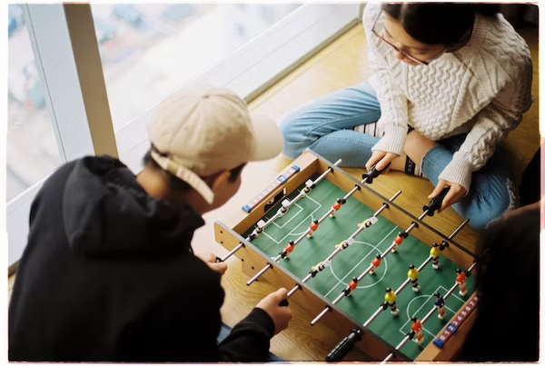

This article has been written and researched by our expert Loveable through a precise methodology. [Learn more about our methodology](https://avada.io/loveable/our-methodological.html)

[Loveable](https://avada.io/loveable/) > [Blog](https://avada.io/loveable/blog/) > [Relationship](https://avada.io/loveable/relationship/)

# 31 Fun Things to Do at Sleepovers: Ideas for a Memorable Night with Friends

Written by [Luna Miller](https://avada.io/loveable/author/luna/) Last Updated on August 22, 2023

- [31 Fun Things to Do at Sleepovers that You Have to Try Once](https://avada.io/loveable/blog/fun-things-at-sleepovers/#wp-block-heading-2-3) 
- [Bottom Line](https://avada.io/loveable/blog/fun-things-at-sleepovers/#wp-block-heading-2-71) 

The ideal setting for making enduring memories and spending quality time with your pals is a sleepover. Sleepovers occupy a particular place in our hearts because of the late-night giggles, secrets shared, and fun activities we may participate in. We have suggestions for making your next sleepover special if you are seeking inspiration. This post will go through **34 fun things to do at sleepove**r that will make for a night full of hilarity, friendship, and pure enjoyment.

There are countless options for fun things to do at sleepovers. There is something to satisfy every taste and make a special night with your friends, from traditional games to imaginative pursuits. As we plunge into a world of thrill and entertainment, be ready to set out on an adventure-filled voyage. So gather your closest friends, grab your sleeping bags, and let the fun begin as we explore a variety of activities that will make your sleepover a night to remember.

## **31 Fun Things to Do at Sleepovers that You Have to Try Once** 

1. **Living Room Camping** 

Transform your cozy space into a campsite, complete with tents, sleeping bags, and a simulated campfire ambiance. Immerse yourselves in the thrill of the great indoors, sharing stories, roasting marshmallows, and creating lasting memories.

2. **Movie Bingo**

Enhance the fun of watching films by playing a game of bingo with movie-themed cards. Mark off squares as you spot specific scenes or themes, and enjoy the friendly competition of being the first to call out “Bingo!”

3. **Truth or Dare**

Get ready for laughter, surprises, and the occasional dose of bravery as you reveal secrets and take on daring challenges. Let the fun and excitement of this game create unforgettable moments during your sleepover. Check out some best [truth-or-dare questions](https://avada.io/loveable/truth-or-dare-questions/) to make your sleepovers more interesting.

4. **Water Balloon Fight**

Fill up colorful balloons with water and engage in a thrilling battle, dodging and splashing each other in a friendly contest of soaking fun. Feel the refreshing bursts of water as you create an unforgettable water-filled adventure.

5. **Tattoos Each Other** 

Use washable tattoo designs to decorate and personalize your skin. Let your artistic flair shine as you adorn each other with unique and eye-catching designs.

6. **Blacklight dance party**

Set the stage with neon decorations, turn on blacklights, and let the glow-in-the-dark fun begin. Dance to your favorite tunes, showcasing your moves under the captivating fluorescent lights.

7. **Pillow Fight**

Grab your pillows, and let the soft and playful battle begin. Jump, swing, and dodge as you release your energy and laughter, making this simple activity a highlight of your sleepover.

8. **Ghost Stories Telling** 

Dim the lights, gather around, and take turns sharing spine-tingling tales that send shivers down your spine. Let the storytelling atmosphere create an eerie yet thrilling experience.

9. **Board Games or Card Games**

Unleash your strategic skills, engage in exciting challenges, and bond with your friends over the joy of playing together. From classic [board games](https://avada.io/loveable/gifts-board-game-lovers/) to fast-paced card games, the options are endless.

10. **Indoor Snowball Fight**

Use soft and fluffy materials like cotton balls or rolled-up socks to engage in a lively snowball battle. Experience the joy and laughter of a snowball fight, regardless of the weather outside.

11. **Play Trampoline** 

Jump and bounce on a trampoline for hours of laughter and energetic fun. Feel the thrill of defying gravity as you leap high into the air, creating memories that will make you smile for years to come.

12. **Hot Chocolate Bar**

Indulge in a delightful hot chocolate bar, where you can customize your warm, chocolaty drink with an array of toppings. From marshmallows to whipped cream and sprinkles, create a personalized concoction that satisfies your sweet cravings.

13. **Make Popcorn**

Enjoy the satisfying aroma and taste of freshly made popcorn. Gather around with [your friends who love popcorn](https://avada.io/loveable/gifts-for-popcorn-lovers/) as you pop the kernels and sprinkle them with butter and salt. Share this timeless snack while enjoying each other’s company and the excitement of the sleepover.

14. **Mad Libs**

Let your creativity shine by engaging in the hilarity of Mad Libs. Fill in the blanks with wacky nouns, adjectives, and verbs, creating outrageous and laughter-inducing stories that are unique to your sleepover.

15. **Make Sundaes**

Experience the joy of crafting your own sundaes. Set up a delicious ice cream bar with various flavors and toppings. Let each person design their dream dessert, adding layers of flavors and textures that are sure to delight the taste buds.

16. **Make Hand-Made Jewelry**

Unleash your artistic skills by making hand-made jewelry. Use colorful beads, strings, and charms to create unique and personalized accessories. Share your creations with each other and showcase your talent during the sleepover.

17. **Bedroom Talent Show**

Showcase your hidden talents with a bedroom talent show. Take turns performing acts, whether it’s singing, dancing, or even telling jokes. Encourage each other’s skills and applaud the bravery it takes to share your talents.

18. **DIY Spa Night**

Pamper yourselves with a DIY spa night. Set up a relaxation station with face masks, nail polishes, and soothing music. Indulge in self-care activities, like facials and manicures, as you unwind and enjoy the tranquil ambiance of the sleepover.

19. **Tye dye Shirts**

Explore the art of tie-dye by creating vibrant and eye-catching shirts. Use fabric dyes and simple folding techniques to achieve unique patterns and designs. Admire each other’s colorful creations as you rock your tie-dye shirts with pride.

20. **Personalized Pillowcases**

Add a personal touch to your sleepover by making personalized pillowcases. Use fabric markers or paints to write your names, draw designs, or share inside jokes. Rest your head on these special pillowcases, reminding you of the fun-filled sleepover.

**_Related_**: [Personalized Pillows](https://avada.io/loveable/personalized-pillows/) To Brighten Up Your Room

21. **Play Celebrity**

Play the exciting game of Celebrity, where you take turns acting out or describing famous people or characters for others to guess. Laugh at the hilarious attempts to impersonate celebrities and enjoy the friendly competition.

22. **Make Pizzas**

Get your hands messy and have fun making pizzas from scratch. Roll out the dough, choose your favorite toppings, and create mouthwatering combinations. Share your culinary creations as you savor the deliciousness of homemade pizzas.

23. **Blindfolded Makeovers**

Challenge your creativity with blindfolded makeovers. Pair up and take turns blindfolding each other while applying makeup or styling hair. Embrace the unpredictable results and laugh at the transformed appearances, showcasing your ability to have fun and not take yourselves too seriously.

24. **Star Gazing**

Lay back and gaze at the stars during a serene star-gazing session. Set up blankets or sleeping bags in the backyard or near a window. Identify constellations, share stories, and marvel at the vastness of the night sky.

25. **Karaoke** 

Turn up the volume and unleash your inner rock star with karaoke. Sing your hearts out to your favorite songs, channeling your inner diva or crooner. Enjoy the laughter and applause as you take turns performing and embracing the spotlight.

26. **Funny Response from Siri**

Get ready for a hilarious experience with a funny response from Siri. Ask Siri silly questions or engage in entertaining conversations, and let the virtual assistant surprise you with witty and unexpected responses. Prepare to laugh out loud as you discover Siri’s playful side.

27. **Create a New Soda Flavor**

Unleash your creativity by creating a new soda flavor. Mix various sodas, juices, and syrups to concoct unique and delicious combinations. Experiment with different flavors and proportions, and taste-test your creations to find the perfect balance that tickles your taste buds.

28. **Different Hair Cuts**

Channel your inner hairstylist and have a blast giving each other different haircuts. Use safe and playful tools like hair clips, colorful hair extensions, or temporary hair color sprays to transform your hairstyles. Embrace the fun and laughter as you experiment with funky, daring, or whimsical hairdos.

29. **Blind Taste Test Game**

Engage in a blind taste test game and challenge your taste buds. Prepare a variety of foods or beverages, cover them, and take turns guessing what they are solely based on taste. Delight in the surprises and the laughter that comes with mistaking flavors and discovering your hidden food preferences.

30. **Homemade Slushies**

Cool down with refreshing homemade slushies. Blend ice, fruit juices, and a touch of sweetness to create icy concoctions perfect for quenching your thirst. Experiment with different flavors and combinations, and enjoy the icy treats together as you savor the chilly delights.

31. **Virtual Ghost House Tour**

Embark on a virtual ghost house tour for a thrilling and spine-tingling experience. Explore haunted locations through online platforms or virtual reality apps. Brace yourselves for ghostly encounters, eerie stories, and the thrill of the unknown as you navigate through the virtual haunted house.

## **Bottom Line** 

Those tips above are some of the **fun things to do at sleepovers** to make each night truly special. Sleepovers are the ideal setting for forming lifelong friendships. There are countless ways to have a wonderful time on a night out, from taking part in entertaining activities like hilarious Siri responses and blind taste tests to letting your imagination run wild by creating new drink flavors and donning new haircuts. So gather your pals, prepare for a great evening, and let the enjoyable sleepover activities produce memories that will be treasured for years to come.

Always keep in mind that having an open mind, embracing silliness, and letting go of inhibitions are essential for a great overnight. The thing you must remember when doing any things at sleepover is the connection and laughter shared with friends. Enjoy the magic of friendship, and let the memories made on these memorable evenings fill your heart with warmth for the rest of your life.

- [31 Fun Things to Do at Sleepovers that You Have to Try Once](https://avada.io/loveable/blog/fun-things-at-sleepovers/#wp-block-heading-2-3) 
- [Bottom Line](https://avada.io/loveable/blog/fun-things-at-sleepovers/#wp-block-heading-2-71) 

### [Luna Miller](https://avada.io/loveable/author/luna/)

I'm Luna Miller, a helpful employee at Loveable. I excel at giving great advice on birthday gifts. I love suggesting memorable experiences like concerts, spas, and getaways. As a reliable and supportive colleague, I'm always there to assist.

- [Twitter](https://twitter.com/intent/tweet)
- [Facebook](https://www.facebook.com/sharer/sharer.php)
- [instagram](https://avada.io/loveable/blog/fun-things-at-sleepovers/)
- [pinterest](https://www.pinterest.com/loveablellc/)

## Related Posts

[

### 35 Unforgettable Exciting Adult Birthday Party Ideas

](https://avada.io/loveable/blog/adult-birthday-party-ideas/)

[

### 42 Best 21st Birthday Outfits to Rock the Party

](https://avada.io/loveable/blog/21st-birthday-outfits/)

[

### 50+ Happy 40th Anniversary Quotes, Messages, and Wishes

](https://avada.io/loveable/blog/happy-40th-anniversary-quotes/)

[

### 100+ Heartwarming Happy 30th Anniversary Quotes, Messages, and Wishes

](https://avada.io/loveable/blog/happy-30th-anniversary-quotes/)

[

### 120+ Heartfelt Thank You Messages for The Birthday Wishes

](https://avada.io/loveable/blog/thank-you-messages-birthday-wishes/)
