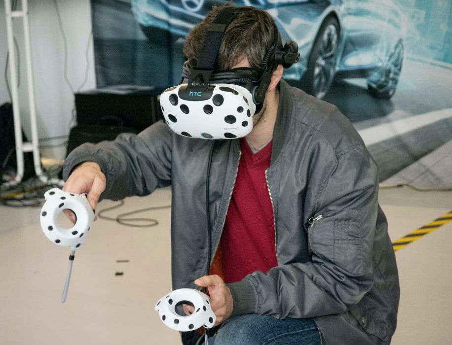
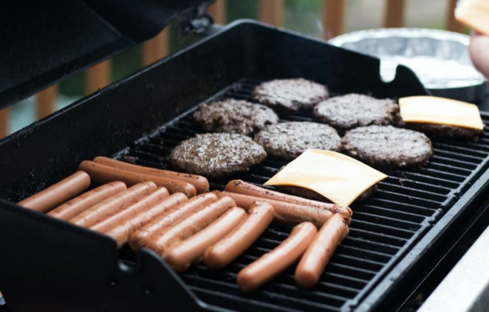

This article has been written and researched by our expert Loveable through a precise methodology. [Learn more about our methodology](https://avada.io/loveable/our-methodological.html)

[Loveable](https://avada.io/loveable/) > [Blog](https://avada.io/loveable/blog/) > [Family](https://avada.io/loveable/family/)

# 32 Best 18th Birthday Ideas Ever To Celebrate Special Milestone

Written by [Rose Bryne](https://avada.io/loveable/author/rose/) Last Updated on September 18, 2023

- [10 Unusual 18th Birthday Ideas For A Brand New Experience](https://avada.io/loveable/blog/18th-birthday-ideas/#wp-block-heading-2-4) 
    - [1\. Escape Room Adventure](https://avada.io/loveable/blog/18th-birthday-ideas/#wp-block-heading-3-5)
    - [2\. Trampoline Park](https://avada.io/loveable/blog/18th-birthday-ideas/#wp-block-heading-3-8)
    - [3\. Skydiving Simulation](https://avada.io/loveable/blog/18th-birthday-ideas/#wp-block-heading-3-11) 
    - [4\. Virtual Reality Gaming](https://avada.io/loveable/blog/18th-birthday-ideas/#wp-block-heading-3-14)
    - [5\. Cooking Class](https://avada.io/loveable/blog/18th-birthday-ideas/#wp-block-heading-3-17)
    - [6\. Hot Air Balloon Ride](https://avada.io/loveable/blog/18th-birthday-ideas/#wp-block-heading-3-20)
    - [7\. Indoor Rock Climbing](https://avada.io/loveable/blog/18th-birthday-ideas/#wp-block-heading-3-23) 
    - [8\. Photography Scavenger Hunt](https://avada.io/loveable/blog/18th-birthday-ideas/#wp-block-heading-3-26) 
    - [9\. Sushi-Making Workshop](https://avada.io/loveable/blog/18th-birthday-ideas/#wp-block-heading-3-29)
    - [10\. Museum Night](https://avada.io/loveable/blog/18th-birthday-ideas/#wp-block-heading-3-32)
- [Cool 18th Birthday Ideas For Guys](https://avada.io/loveable/blog/18th-birthday-ideas/#wp-block-heading-2-35)
    - [11\. Outdoor Adventure](https://avada.io/loveable/blog/18th-birthday-ideas/#wp-block-heading-3-36)
    - [12\. Game Night](https://avada.io/loveable/blog/18th-birthday-ideas/#wp-block-heading-3-39)
    - [13\. Sports Spectacular](https://avada.io/loveable/blog/18th-birthday-ideas/#wp-block-heading-3-42)
    - [14\. Movie Marathon](https://avada.io/loveable/blog/18th-birthday-ideas/#wp-block-heading-3-45)
    - [15\. Road Trip](https://avada.io/loveable/blog/18th-birthday-ideas/#wp-block-heading-3-48)
- [18th Birthday Party Ideas for Girls](https://avada.io/loveable/blog/18th-birthday-ideas/#wp-block-heading-2-51)
    - [16\. Glamourous Hollywood Night](https://avada.io/loveable/blog/18th-birthday-ideas/#wp-block-heading-3-52)
    - [17\. Boho-Chic Picnic](https://avada.io/loveable/blog/18th-birthday-ideas/#wp-block-heading-3-55)
    - [18\. Spa Retreat at Home](https://avada.io/loveable/blog/18th-birthday-ideas/#wp-block-heading-3-58)
    - [19\. Masquerade Ball](https://avada.io/loveable/blog/18th-birthday-ideas/#wp-block-heading-3-61)
    - [20\. Beach Bonfire Party](https://avada.io/loveable/blog/18th-birthday-ideas/#wp-block-heading-3-64)
    - [21\. Carnival Carnival](https://avada.io/loveable/blog/18th-birthday-ideas/#wp-block-heading-3-67)
    - [22\. Roaring ’20s Gatsby Soiree](https://avada.io/loveable/blog/18th-birthday-ideas/#wp-block-heading-3-70)
- [18th Birthday Party Ideas To Celebrate with Family](https://avada.io/loveable/blog/18th-birthday-ideas/#wp-block-heading-2-73) 
    - [23\. Family Game Night](https://avada.io/loveable/blog/18th-birthday-ideas/#wp-block-heading-3-74)
    - [24\. Backyard BBQ Bash](https://avada.io/loveable/blog/18th-birthday-ideas/#wp-block-heading-3-77)
    - [25\. Movie Marathon at Home](https://avada.io/loveable/blog/18th-birthday-ideas/#wp-block-heading-3-80)
    - [26\. Family Potluck Dinner](https://avada.io/loveable/blog/18th-birthday-ideas/#wp-block-heading-3-83)
    - [27\. Cooking Together](https://avada.io/loveable/blog/18th-birthday-ideas/#wp-block-heading-3-86)
    - [28\. Outdoor Adventure Day](https://avada.io/loveable/blog/18th-birthday-ideas/#wp-block-heading-3-89)
    - [29\. DIY Craft Party](https://avada.io/loveable/blog/18th-birthday-ideas/#wp-block-heading-3-92)
    - [30\. Family Karaoke Night](https://avada.io/loveable/blog/18th-birthday-ideas/#wp-block-heading-3-95)
    - [31\. Memory Lane Photo Party](https://avada.io/loveable/blog/18th-birthday-ideas/#wp-block-heading-3-98)
    - [32\. Themed Movie Night](https://avada.io/loveable/blog/18th-birthday-ideas/#wp-block-heading-3-101)
- [18th Birthday Ideas, In Conclusion](https://avada.io/loveable/blog/18th-birthday-ideas/#wp-block-heading-2-104) 

Are you ready to transform the journey into adulthood into an unforgettable experience? Turning 18 is a major milestone, and finding the perfect way to celebrate it can be quite a task. Don’t worry, we’ve got you covered! In this article, we’ve curated the **40 best 18th birthday ideas** that will make this momentous occasion truly remarkable. From adventurous escapades to heartfelt gatherings, there’s something for everyone. Get ready to discover unique ways to mark this special transition!

From throwing a spectacular rooftop party under the stars to embarking on an exhilarating road trip with friends, our list of the top 40 18th birthday ideas is your ultimate guide to planning an extraordinary celebration. Whether you’re into arts and culture or seeking an adrenaline rush, we’ve handpicked diverse suggestions to suit your preferences. Explore thrilling experiences and meaningful get-togethers that will create memories to last a lifetime.

As you explore these creative ways to celebrate, don’t forget to also discover meaningful gift ideas that express your love and affection in our accompanying guide: [Memorable 18th Birthday Gift Ideas To Show Your Love.](https://avada.io/loveable/18th-birthday-gifts-ideas/)

## **10 Unusual 18th Birthday Ideas For A Brand New Experience** 

### **1\. Escape Room Adventure**

How about challenging yourself with an escape room adventure? Gather your friends and dive into a thrilling mystery. Work together to solve challenge, decode clues, and beat the clock to “escape.” It’s a fantastic way to test your teamwork and have a lot of fun.

### **2\. Trampoline Park**

If you’re up for some energetic fun, consider a trip to a trampoline park. Bounce, flip, and play games on interconnected trampolines. Many parks also offer foam pits and dodgeball areas for added excitement.

### **3\. Skydiving Simulation** 

Want an adrenaline rush without actual skydiving? Try indoor skydiving in a vertical wind tunnel. Feel the sensation of freefalling and floating in mid-air. It’s a thrilling and safe adventure for your 18th birthday.

### **4\. Virtual Reality Gaming**

Dive into the world of virtual reality gaming by visiting a VR arcade. Immerse yourself in different virtual worlds, from battling zombies to solving puzzles or racing futuristic tracks. It’s a chance to experience the latest technology and enjoy unique gaming.

### **5\. Cooking Class**

Take your culinary interests to a new level with a cooking class. Find a local culinary school or chef offering hands-on workshops. Learn to prepare a specific cuisine or master cooking techniques. It’s a fun way to cook and enjoy great food.

### **6\. Hot Air Balloon Ride**

Experience a serene and breathtaking birthday with a hot air balloon ride. Float above the landscape, taking in panoramic views while enjoying a sense of tranquility. It’s a romantic and picturesque way to celebrate your special day.

### **7\. Indoor Rock Climbing** 

If you love physical challenges, indoor rock climbing could be perfect. Visit a climbing gym with various routes for different skill levels. Climbing is a great workout and gives a sense of accomplishment as you reach the top.

### **8\. Photography Scavenger Hunt** 

Combine creativity and exploration with a photography scavenger hunt. Capture unique objects, places, or scenes on camera based on a list. Compete with friends to complete the list and share your findings at the end.

### **9\. Sushi-Making Workshop**

Embrace your love for sushi with a sushi-making workshop. Learn how to roll sushi from chefs and enjoy the delicious results afterward. It’s a hands-on activity that’s both fun and tasty.

### **10\. Museum Night**

Opt for a cultured celebration by hosting a museum night. Choose a museum that interests you, whether it’s art, history, science, or technology. Some museums even have special after-hours events for a unique and enriching birthday experience.

## **Cool 18th Birthday Ideas For Guys**

### **11\. Outdoor Adventure**

Gather a group of friends and head out for a day of hiking in a scenic trail or camping under the stars. You could even organize a paintball game for some adrenaline-pumping action. Exploring the outdoors is a fantastic way to bond with friends and create beautiful memories while enjoying the beauty of nature.

### **12\. Game Night**

Host an epic game night that’s sure to be a hit. Create a gaming marathon with a mix of video games, classic board games, and card games. Set up different gaming stations and organize friendly competitions with cool prizes for winners. Whether it’s battling in a virtual world or engaging in strategic board game showdowns, a game night will provide hours of entertainment and loads of laughter.

### **13\. Sports Spectacular**

If the birthday guy loves sports, a sports-themed day is the way to go. Arrange a day filled with various sports activities. Play a friendly game of basketball or soccer at a local park or sports facility. You could even try out some less common sports like archery, rock climbing, or even mini golf. It’s a chance to stay active, enjoy friendly competition, and try new things together.

### **14\. Movie Marathon**

Set up a cozy outdoor or indoor screening area with comfy seating and blankets. Select his favorite movies or an entire movie series to watch back-to-back. Prepare a variety of movie snacks, from popcorn and candy to nachos and drinks. It’s a relaxing and enjoyable way to spend quality time with friends while enjoying great films.

### **15\. Road Trip**

Celebrate his transition into adulthood with an unforgettable road trip. Plan a mini adventure to a nearby city or attraction that you’ve all been wanting to explore. Pack up the car with snacks, good music, and your sense of adventure. Along the way, stop at interesting spots, indulge in local cuisine, and capture fun moments.

## **18th Birthday Party Ideas for Girls**

### **16\. Glamourous Hollywood Night**

Roll out the red carpet for a Hollywood-themed celebration. Invite guests to dress up as their favorite movie stars, and set up a photo booth with props for glamorous snapshots. Create a mini “awards ceremony” to honor your friends with fun awards and celebrate in true Hollywood style.

### **17\. Boho-Chic Picnic**

Arrange a bohemian-inspired picnic in a picturesque park or garden. Decorate with dreamy fabrics, cushions, and fairy lights. Set up low tables with a variety of finger foods, desserts, and refreshing drinks. Activities like flower crown making or tie-dye crafts can add to the laid-back and whimsical atmosphere.

### **18\. Spa Retreat at Hom**e

Transform your living space into a relaxing spa oasis. Provide comfy robes, soothing music, and a selection of DIY spa treatments like facials, manicures, and pedicures. Set up stations for each treatment and pamper yourselves for a day of ultimate relaxation.

### **19\. Masquerade Ball**

Host an enchanting masquerade ball where everyone wears elegant masks and dresses up in their finest attire. Create a luxurious ambiance with dim lighting, rich decorations, and a dance floor. Play classical music and modern hits to keep the dance floor alive.

### **20\. Beach Bonfire Party**

If you’re near a beach or lake, consider a beach bonfire celebration. Enjoy the sunset, build a bonfire, roast marshmallows, and have a cozy and memorable evening with your closest friends.

### **21\. Carnival Carnival**

Transform your space into a carnival with various games, carnival food stands, and colorful decorations. Set up classic games like ring toss, bean bag toss, and mini bowling. Offer treats like cotton candy, popcorn, and funnel cakes for a nostalgic and fun-filled atmosphere.

### **22\. Roaring ’20s Gatsby Soiree**

Travel back in time to the glamorous era of the 1920s. Invite your friends to dress in flapper dresses and dapper suits. Decorate with art deco-inspired elements, serve vintage cocktails, and dance the night away to jazz music.

## **18th Birthday Party Ideas To Celebrate with Family** 

### **23\. Family Game Night**

Gather your family for an entertaining game night extravaganza. Arrange a selection of [classic board games](https://avada.io/loveable/gifts-board-game-lovers/), card games, and trivia challenges. Set up cozy seating, provide snacks and drinks, and immerse yourselves in hours of friendly competition and laughter. It’s a perfect way to strengthen family bonds while enjoying timeless games that everyone loves.

### **24\. Backyard BBQ Bash**

Create a vibrant backyard barbecue celebration that brings the whole family together. Fire up the grill and prepare mouthwatering dishes like juicy burgers, marinated kebabs, and grilled veggies. Set up comfortable seating, add some lively music, and engage in outdoor games like cornhole or horseshoes. It’s a delightful way to enjoy delicious food and create cherished memories under the open sky.

### **25\. Movie Marathon at Home**

Transform your living room into a cozy home theater for a family movie marathon. Curate a lineup of beloved films, prepare an assortment of popcorn flavors, candy, and drinks, and arrange blankets and cushions for ultimate comfort. Whether you choose a theme or a mix of genres, this cinematic experience will surely be a hit with your family.

### **26\. Family Potluck Dinner**

Embrace a sense of togetherness by hosting a family potluck dinner. Each family member contributes their favorite dish, resulting in a diverse spread of appetizers, main courses, and desserts. Share stories behind the recipes and enjoy a communal feast that reflects the diverse tastes and talents within your family.

### **27\. Cooking Together**

Spend quality time in the kitchen with your family by embarking on a culinary adventure together. Choose recipes that cater to everyone’s interests and skill levels, from appetizers to desserts. Collaborate on cooking and baking tasks, exchange cooking tips, and savor the delectable results of your combined efforts.

### **28\. Outdoor Adventure Day**

Connect with nature and your family by planning an outdoor adventure day. Head to a nearby park or nature reserve for a day of hiking, picnicking, and outdoor activities. Bring along sports equipment for a game of frisbee, soccer, or a nature-themed scavenger hunt. This shared outdoor experience will allow you to create lasting memories while enjoying the beauty of the outdoors.

### **29\. DIY Craft Party**

Cultivate creativity within your family through a [DIY craft party](https://avada.io/loveable/gifts-crafters/). Choose a craft project that suits various skill levels and interests, such as painting, jewelry making, or decorating flower pots. Set up a crafting station with all the necessary materials, and encourage family members to express themselves through artistic creations.

### **30\. Family Karaoke Night**

Turn your living room into a lively karaoke stage for an unforgettable family karaoke night. Set up a karaoke machine or use a karaoke app, provide an array of song choices, and take turns showcasing your vocal talents. Sing along with your family members to favorite tunes and revel in the joy of musical performances.

### **31\. Memory Lane Photo Party**

Take a nostalgic journey down memory lane with a photo-themed celebration. Gather old family photo albums and sit together to reminisce about cherished moments from the past. Share stories, anecdotes, and laughter as you flip through the pages, reliving your family’s journey through the years.

### **32\. Themed Movie Night**

Immerse your family in a themed movie night experience. Choose a specific theme, whether it’s a favorite movie genre, era, or actor, and select a lineup of films that align with the theme. Create a cozy atmosphere with dimmed lights, themed decorations, and comfortable seating, and enjoy an evening of cinematic immersion and family togetherness.

## **18th Birthday Ideas, In Conclusion** 

These 35 ideas provide a diverse range of ways to celebrate the significant milestone of the 18th birthday. From thrilling adventures to heartfelt family gatherings and memorable moments with friends, there’s something for everyone. Each idea offers a chance to create lasting memories and mark this transition into adulthood in a special and unique way.

- [10 Unusual 18th Birthday Ideas For A Brand New Experience](https://avada.io/loveable/blog/18th-birthday-ideas/#wp-block-heading-2-4) 
    - [1\. Escape Room Adventure](https://avada.io/loveable/blog/18th-birthday-ideas/#wp-block-heading-3-5)
    - [2\. Trampoline Park](https://avada.io/loveable/blog/18th-birthday-ideas/#wp-block-heading-3-8)
    - [3\. Skydiving Simulation](https://avada.io/loveable/blog/18th-birthday-ideas/#wp-block-heading-3-11) 
    - [4\. Virtual Reality Gaming](https://avada.io/loveable/blog/18th-birthday-ideas/#wp-block-heading-3-14)
    - [5\. Cooking Class](https://avada.io/loveable/blog/18th-birthday-ideas/#wp-block-heading-3-17)
    - [6\. Hot Air Balloon Ride](https://avada.io/loveable/blog/18th-birthday-ideas/#wp-block-heading-3-20)
    - [7\. Indoor Rock Climbing](https://avada.io/loveable/blog/18th-birthday-ideas/#wp-block-heading-3-23) 
    - [8\. Photography Scavenger Hunt](https://avada.io/loveable/blog/18th-birthday-ideas/#wp-block-heading-3-26) 
    - [9\. Sushi-Making Workshop](https://avada.io/loveable/blog/18th-birthday-ideas/#wp-block-heading-3-29)
    - [10\. Museum Night](https://avada.io/loveable/blog/18th-birthday-ideas/#wp-block-heading-3-32)
- [Cool 18th Birthday Ideas For Guys](https://avada.io/loveable/blog/18th-birthday-ideas/#wp-block-heading-2-35)
    - [11\. Outdoor Adventure](https://avada.io/loveable/blog/18th-birthday-ideas/#wp-block-heading-3-36)
    - [12\. Game Night](https://avada.io/loveable/blog/18th-birthday-ideas/#wp-block-heading-3-39)
    - [13\. Sports Spectacular](https://avada.io/loveable/blog/18th-birthday-ideas/#wp-block-heading-3-42)
    - [14\. Movie Marathon](https://avada.io/loveable/blog/18th-birthday-ideas/#wp-block-heading-3-45)
    - [15\. Road Trip](https://avada.io/loveable/blog/18th-birthday-ideas/#wp-block-heading-3-48)
- [18th Birthday Party Ideas for Girls](https://avada.io/loveable/blog/18th-birthday-ideas/#wp-block-heading-2-51)
    - [16\. Glamourous Hollywood Night](https://avada.io/loveable/blog/18th-birthday-ideas/#wp-block-heading-3-52)
    - [17\. Boho-Chic Picnic](https://avada.io/loveable/blog/18th-birthday-ideas/#wp-block-heading-3-55)
    - [18\. Spa Retreat at Home](https://avada.io/loveable/blog/18th-birthday-ideas/#wp-block-heading-3-58)
    - [19\. Masquerade Ball](https://avada.io/loveable/blog/18th-birthday-ideas/#wp-block-heading-3-61)
    - [20\. Beach Bonfire Party](https://avada.io/loveable/blog/18th-birthday-ideas/#wp-block-heading-3-64)
    - [21\. Carnival Carnival](https://avada.io/loveable/blog/18th-birthday-ideas/#wp-block-heading-3-67)
    - [22\. Roaring ’20s Gatsby Soiree](https://avada.io/loveable/blog/18th-birthday-ideas/#wp-block-heading-3-70)
- [18th Birthday Party Ideas To Celebrate with Family](https://avada.io/loveable/blog/18th-birthday-ideas/#wp-block-heading-2-73) 
    - [23\. Family Game Night](https://avada.io/loveable/blog/18th-birthday-ideas/#wp-block-heading-3-74)
    - [24\. Backyard BBQ Bash](https://avada.io/loveable/blog/18th-birthday-ideas/#wp-block-heading-3-77)
    - [25\. Movie Marathon at Home](https://avada.io/loveable/blog/18th-birthday-ideas/#wp-block-heading-3-80)
    - [26\. Family Potluck Dinner](https://avada.io/loveable/blog/18th-birthday-ideas/#wp-block-heading-3-83)
    - [27\. Cooking Together](https://avada.io/loveable/blog/18th-birthday-ideas/#wp-block-heading-3-86)
    - [28\. Outdoor Adventure Day](https://avada.io/loveable/blog/18th-birthday-ideas/#wp-block-heading-3-89)
    - [29\. DIY Craft Party](https://avada.io/loveable/blog/18th-birthday-ideas/#wp-block-heading-3-92)
    - [30\. Family Karaoke Night](https://avada.io/loveable/blog/18th-birthday-ideas/#wp-block-heading-3-95)
    - [31\. Memory Lane Photo Party](https://avada.io/loveable/blog/18th-birthday-ideas/#wp-block-heading-3-98)
    - [32\. Themed Movie Night](https://avada.io/loveable/blog/18th-birthday-ideas/#wp-block-heading-3-101)
- [18th Birthday Ideas, In Conclusion](https://avada.io/loveable/blog/18th-birthday-ideas/#wp-block-heading-2-104) 

### [Rose Bryne](https://avada.io/loveable/author/rose/)

Hi, I'm Rose! I love animals and spending time with kids. At Loveable, I help people find unique gifts for special occasions like Valentine's Day, housewarmings, and graduations. I enjoy finding gifts for kids, teens, and animal lovers that match their interests and personalities. Making gift-giving a pleasant experience is my priority. Let me assist you in finding the perfect gift!

- [Twitter](https://twitter.com/intent/tweet)
- [Facebook](https://www.facebook.com/sharer/sharer.php)
- [instagram](https://avada.io/loveable/blog/18th-birthday-ideas/)
- [pinterest](https://www.pinterest.com/loveablellc/)

## Related Posts

[### 30 Best 4 Year Old Birthday Party Ideas For A Memorable Celebration](https://avada.io/loveable/blog/4-year-old-birthday-party-ideas/) 

[

### 16th Birthday Party Ideas to Make an Unforgettable Day

](https://avada.io/loveable/blog/16th-birthday-party-ideas/)

[

### 150+ Inspirational Birthday Quotes to Spread Joy on Special Day

](https://avada.io/loveable/blog/inspirational-birthday-quotes/)

[

### 160+ Birthday Wishes for Wife to Express Eternal Love

](https://avada.io/loveable/blog/birthday-wishes-for-wife/)

[### 90+ Heart Touching Birthday Wishes for Niece to Make Her Day Extra Special](https://avada.io/loveable/blog/birthday-wishes-for-niece/)
