This article has been written and researched by our expert Loveable through a precise methodology. [Learn more about our methodology](https://avada.io/loveable/our-methodological.html)

[Loveable](https://avada.io/loveable/) > [Blog](https://avada.io/loveable/blog/) > [Family](https://avada.io/loveable/family/)

# 35 Best 13th Birthday Party Ideas To Mark An Important Day

Written by [Rose Bryne](https://avada.io/loveable/author/rose/) Last Updated on September 26, 2023

- [Heartwarming Ideas to Surprise Your Son/Daughter on Their 13th Birthday Party](https://avada.io/loveable/blog/13th-birthday-party-ideas/#wp-block-heading-2-3)
    - [1\. Memory Lane Video](https://avada.io/loveable/blog/13th-birthday-party-ideas/#wp-block-heading-3-6)
    - [2\. Yearbook of Memories](https://avada.io/loveable/blog/13th-birthday-party-ideas/#wp-block-heading-3-9)
    - [3\. Letters from Loved Ones](https://avada.io/loveable/blog/13th-birthday-party-ideas/#wp-block-heading-3-12)
    - [4\. Wishing Tree](https://avada.io/loveable/blog/13th-birthday-party-ideas/#wp-block-heading-3-15)
    - [5\. Personalized Gift](https://avada.io/loveable/blog/13th-birthday-party-ideas/#wp-block-heading-3-18)
- [Unmissable 13th Birthday Party Ideas for Girls](https://avada.io/loveable/blog/13th-birthday-party-ideas/#wp-block-heading-2-21)
    - [6\. Spa Day Party](https://avada.io/loveable/blog/13th-birthday-party-ideas/#wp-block-heading-3-24)
    - [7\. Karaoke Party](https://avada.io/loveable/blog/13th-birthday-party-ideas/#wp-block-heading-3-27)
    - [8\. Crafting Party](https://avada.io/loveable/blog/13th-birthday-party-ideas/#wp-block-heading-3-30)
    - [9\. Beach Bonfire Party](https://avada.io/loveable/blog/13th-birthday-party-ideas/#wp-block-heading-3-33)
    - [10\. Cooking or Baking Party](https://avada.io/loveable/blog/13th-birthday-party-ideas/#wp-block-heading-3-36)
    - [11\. Fashion Show Party](https://avada.io/loveable/blog/13th-birthday-party-ideas/#wp-block-heading-3-39)
    - [12\. Pool Party](https://avada.io/loveable/blog/13th-birthday-party-ideas/#wp-block-heading-3-42)
    - [13\. Dance Party](https://avada.io/loveable/blog/13th-birthday-party-ideas/#wp-block-heading-3-45)
    - [14\. Outdoor Water Party](https://avada.io/loveable/blog/13th-birthday-party-ideas/#wp-block-heading-3-48)
    - [15\. Book Party](https://avada.io/loveable/blog/13th-birthday-party-ideas/#wp-block-heading-3-51)
- [Exciting 13th Birthday Party Ideas for Boys](https://avada.io/loveable/blog/13th-birthday-party-ideas/#wp-block-heading-2-54)
    - [16\. Outdoor Adventure Party](https://avada.io/loveable/blog/13th-birthday-party-ideas/#wp-block-heading-3-57)
    - [17\. Sports Tournament Party](https://avada.io/loveable/blog/13th-birthday-party-ideas/#wp-block-heading-3-60)
    - [18\. Video Game Party](https://avada.io/loveable/blog/13th-birthday-party-ideas/#wp-block-heading-3-63)
    - [19\. Gaming Center Party](https://avada.io/loveable/blog/13th-birthday-party-ideas/#wp-block-heading-3-66)
    - [20\. Board Game Night](https://avada.io/loveable/blog/13th-birthday-party-ideas/#wp-block-heading-3-69)
    - [21\. Skateboarding or BMX Party](https://avada.io/loveable/blog/13th-birthday-party-ideas/#wp-block-heading-3-72)
    - [22\. Glow-in-the-Dark Party](https://avada.io/loveable/blog/13th-birthday-party-ideas/#wp-block-heading-3-75)
    - [23\. Nerf War Party](https://avada.io/loveable/blog/13th-birthday-party-ideas/#wp-block-heading-3-78)
    - [24\. Trampoline Park Party](https://avada.io/loveable/blog/13th-birthday-party-ideas/#wp-block-heading-3-81)
    - [25\. Mystery or Detective Party](https://avada.io/loveable/blog/13th-birthday-party-ideas/#wp-block-heading-3-84)
- [Ideal Ways to Celebrate 13th Birthday Party with Friends](https://avada.io/loveable/blog/13th-birthday-party-ideas/#wp-block-heading-2-87)
    - [26\. Cooking or BBQ Party](https://avada.io/loveable/blog/13th-birthday-party-ideas/#wp-block-heading-3-88)
    - [27\. Outdoor Camping Party](https://avada.io/loveable/blog/13th-birthday-party-ideas/#wp-block-heading-3-91)
    - [28\. Outdoor Picnic Party](https://avada.io/loveable/blog/13th-birthday-party-ideas/#wp-block-heading-3-94)
    - [29\. Themed Costume Party](https://avada.io/loveable/blog/13th-birthday-party-ideas/#wp-block-heading-3-97)
    - [30\. Recreation Center](https://avada.io/loveable/blog/13th-birthday-party-ideas/#wp-block-heading-3-100)
- [Sleepover 13th Birthday Party Ideas](https://avada.io/loveable/blog/13th-birthday-party-ideas/#wp-block-heading-2-103)
    - [31\. Movie Marathon Night](https://avada.io/loveable/blog/13th-birthday-party-ideas/#wp-block-heading-3-104)
    - [32\. Scavenger Hunt](https://avada.io/loveable/blog/13th-birthday-party-ideas/#wp-block-heading-3-107)
    - [33\. Campfire Stories](https://avada.io/loveable/blog/13th-birthday-party-ideas/#wp-block-heading-3-110)
    - [34\. Truth or Dare](https://avada.io/loveable/blog/13th-birthday-party-ideas/#wp-block-heading-3-113)
    - [35\. Pajama Fashion Show](https://avada.io/loveable/blog/13th-birthday-party-ideas/#wp-block-heading-3-116)
- [Bottom Line](https://avada.io/loveable/blog/13th-birthday-party-ideas/#wp-block-heading-2-119)

Turning 13 is a significant milestone that marks the transition from childhood to adolescence. Celebrating this special occasion with a memorable party is a must! To make the 13th birthday party truly unforgettable, consider unique and exciting themes and activities. In this article, we’ll explore a variety of creative **13th birthday party ideas** that will ensure the birthday boy or girl and their guests have a fantastic time.

If your child is turning 13, in addition to birthday party ideas, don’t forget about special gifts you can give to the young lady on this occasion. Check out [birthday gift ideas for 13 year olds girls](https://avada.io/loveable/gifts-for-13-year-olds-girls/) for some fantastic inspiration!

## **Heartwarming Ideas to Surprise Your Son/Daughter on Their 13th Birthday Party**

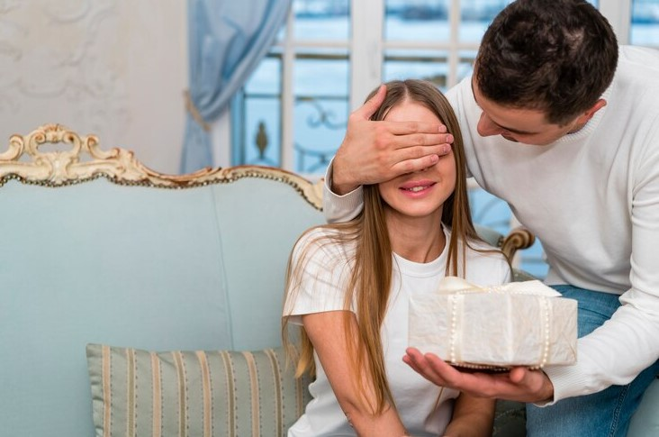

As your son/daughter turns thirteen, you can make their birthday special with heartwarming surprises. You can plan a cake with their favorite flavors, and invite their friends for a fun-filled celebration. But, no matter the choice, this milestone is a perfect opportunity to create cherished memories together. 

### **1\. Memory Lane Video**

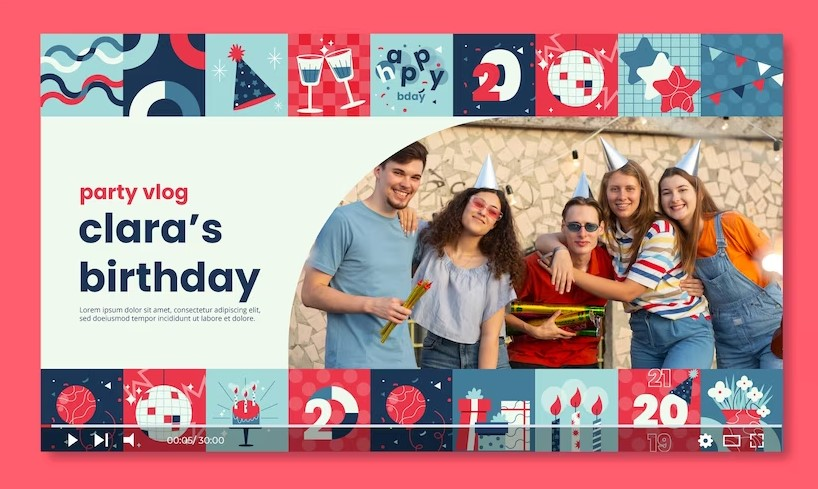

Parents, if you’re searching for delightful 13th birthday ideas, look no further than Memory Lane Video. You can treat your child to a memorable celebration. There are many online platforms to help you with personalized video montages and interactive games; their services are a fantastic way to make your son/daughter feel special. 

### **2\. Yearbook of Memories**

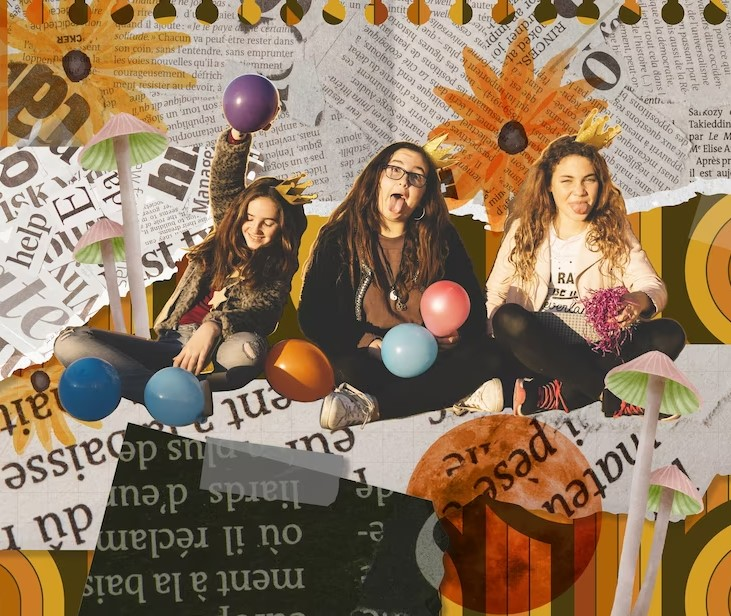

For parents seeking charming 13th birthday ideas, Yearbook of Memories offers a fantastic option. You can give your child a unique and heartwarming celebration. With personalized yearbooks, fun photo booths, and creative themes, their services provide lasting memories. Now, to surprise them, Let’s start to hunt desired themes for your son/daughter’s yearbooks. 

### **3\. Letters from Loved Ones**

Letters from Loved Ones is a wonderful choice for you. This option allows you to create a touching and personal celebration for your child. It gathers heartfelt letters from family and friends and lets you craft a beautiful memory that your son/daughter will treasure.

### **4\. Wishing Tree**

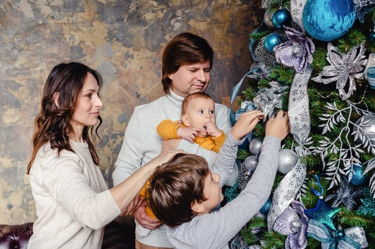

Make a wish with the idea of a Wishing Tree for your children’s 13th birthday party. You’re crafting a beautiful memory by inviting family and friends to write heartfelt wishes and hang them on the tree. This unique way ensures your son/daughter feels surrounded by love and warm wishes. Life is short, so let’s take advantage of any chance to comfort your kids, right? 

### **5\. Personalized Gift**

“Gifts speak volumes of love,” and for your child’s 13th birthday, a personalized gift is a wonderful choice. You have a range of options, such as custom jewelry, personalized cards, and engraved keepsakes. Via purchasing a gift to your kid’s interests, you’re offering a keepsake that resonates with their individuality.

## **Unmissable 13th Birthday Party Ideas for Girls**

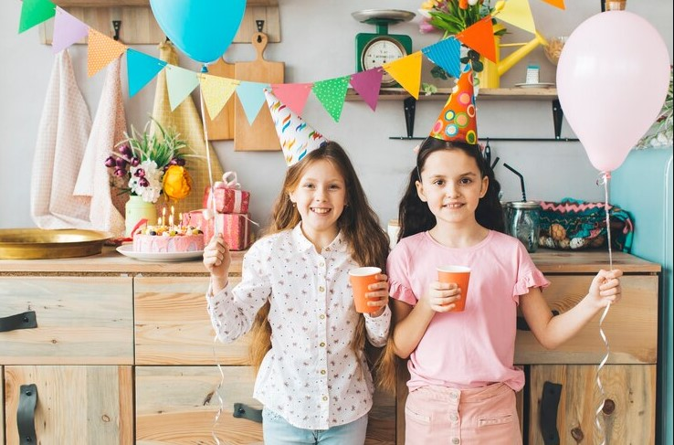

Let’s make your daughter’s 13th birthday truly unforgettable with our unmissable party ideas. With these well-being ideas below, you will perfectly find inspiration that will delight her and her friends. Also, they will help you plan a celebration that she’ll treasure forever. Scratch off the secret right here now!

### **6\. Spa Day Party**

Start your discovery with a Spa Day Party! Why not Treat her and her friends to a day of relaxation and pampering? She’ll feel cherished and celebrated with facials, manicures, and soothing treatments. This Party ensures she has a memorable birthday filled with joy and luxury, creating lasting memories with her friends.

### **7\. Karaoke Party**

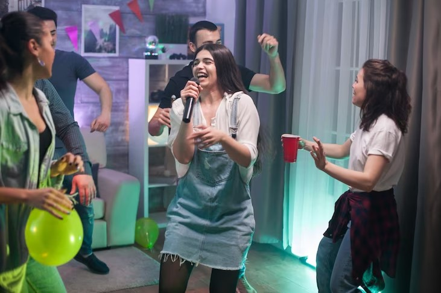

Here is an exciting way to celebrate your daughter’s 13th birthday, a Karaoke Party. You can create a vibrant atmosphere where she and her friends can sing their hearts out. With lively music and fun performances, the party will be full of laughter. This idea guarantees a birthday bash that she and her friends will discuss for years.

### **8\. Crafting Party**

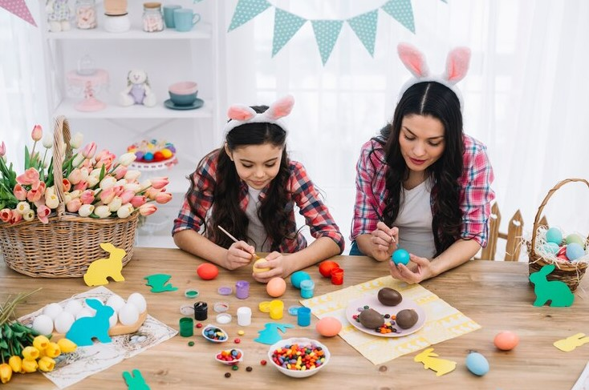

If your daughter loves meticulous work, the 13th birthday party ideas of a Crafting Party may perfectly attract her. You can offer her and her friends a chance to unleash their artistic talents through various craft projects and materials. They can have fun while creating unique keepsakes to recall in the future. 

### **9\. Beach Bonfire Party**

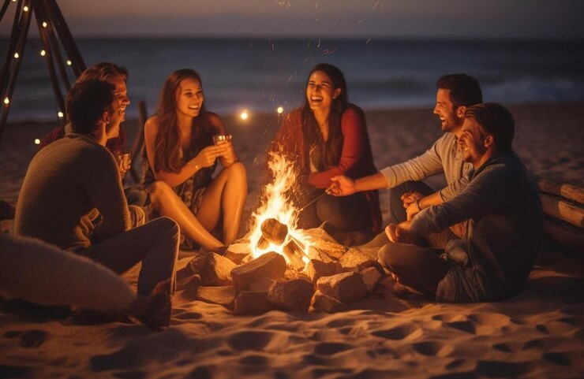

Now, if your daughter falls in love with the outdoors and the beauty of the beach, a Beach Bonfire Party is an ideal way to celebrate her 13th birthday. She and her friends gathered around a cozy fire, enjoying the waves and sharing laughter. Adding beach games and marshmallow roasting to create fun and relaxation, would lift up this experience. 

### **10\. Cooking or Baking Party**

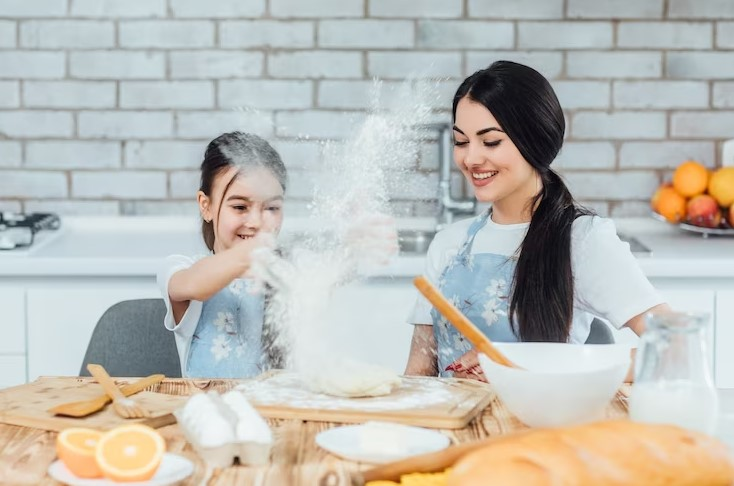

Cooking or baking might be a forever passion of all girls. Therefore, a Cooking or Baking Party would be a cheerful idea for you to hold a 13th birthday party for your daughter. Let her and her friends put on aprons and create delicious treats together. With hands-on activities, tasty results, and lots of fun, this choice offers a delightful blend of creativity and excitement.

### **11\. Fashion Show Party**

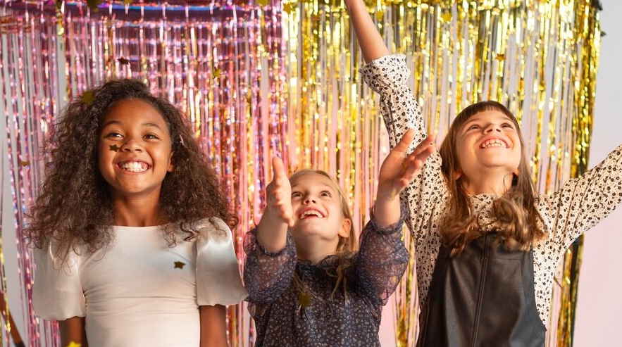

“Style is a way to express yourself,” and for your daughter’s 13th birthday, a Fashion Show Party is a fabulous idea. Through this approach, you can watch her and her friends strut their stuff on the runway, showcasing their unique fashion sense. The excitement of choosing an outfit, dressing up, and making a catwalk would be a valuable memory for her when she mature. 

### **12\. Pool Party**

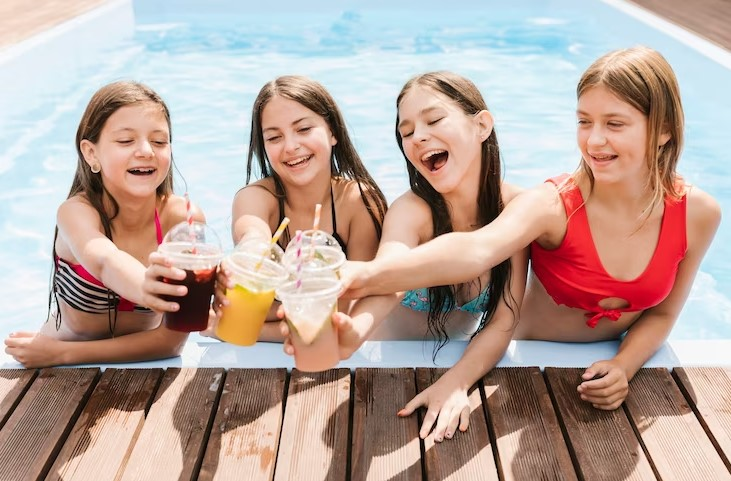

Your house has a pool, so why not use this facility to make a Pool Party for your daughter when she turns 13? You can turn your backyard into a fun-filled oasis for her and her friends. And then, organizing some water games, this plan will make a birthday filled with laughter, sunshine, and unforgettable memories by the water for your kid. 

### **13\. Dance Party**

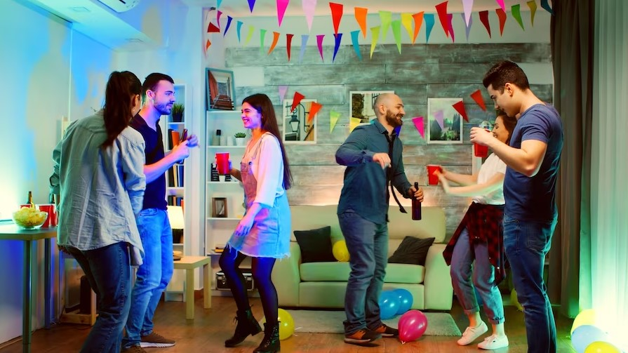

Do you have any 13th birthday party ideas for your loved daughter? Let’s try a Dance Party. You can set up some upbeat music songs and vibrant decorations. Then, let her and her friends dance to their favorite tunes. Teenage is very beautiful and treasure so doing something special on these occasions is a smart way to teach your kid how to value life. 

### **14\. Outdoor Water Party**

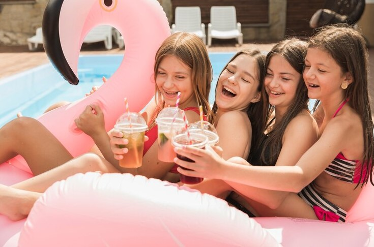

The Outdoor Water Party is an amazing idea for you to celebrate your daughter’s 13th birthday in the summer. With many fun water-based activities like water balloon fights and slip ‘n’ slide races, your daughter and her friends will have a blast staying active and cool. The party setup is easy, and the friendly staff ensures a safe and enjoyable experience.

### **15\. Book Party**

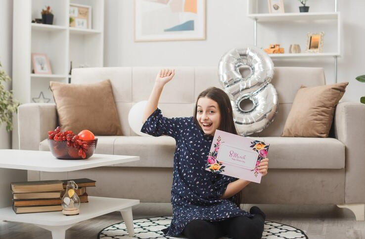

As the saying goes ‘A book is a magical present you can open again and again.’ Let’s treat your daughter to a captivating 13th birthday Book Party. You can build a list of book gifts with different kinds of books and invite her and friends to play a book-related game to get these books.

## **Exciting 13th Birthday Party Ideas for Boys**

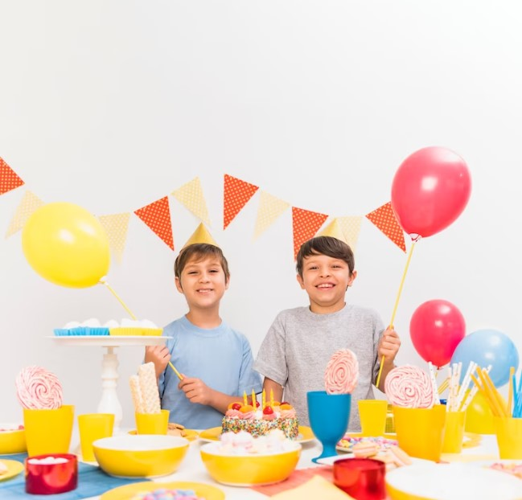

Very different from girls, boys love something packed with action and thrilling activities. Therefore, we have come up with some exciting 13th Birthday Party Ideas to support you in planning a celebration that he’ll remember for years. Let’s explore right now!

### **16\. Outdoor Adventure Party**

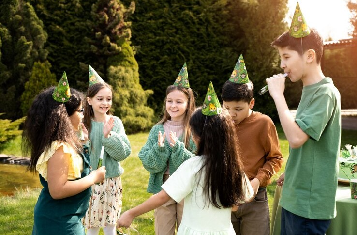

If you aim to make your son’s 13th birthday an unforgettable adventure, consider an Outdoor Adventure Party. With options like hiking, treasure hunts, and camping, this choice offers an action-packed celebration he’ll love. This idea guarantees a birthday filled with adrenaline, camaraderie, and memories that will last a lifetime. So, don’t miss it!

### **17\. Sports Tournament Party**

Are you searching for an exciting way to celebrate your son’s 13th birthday? Look no further than a Sports Tournament Party! You can transform your backyard into a mini stadium, with soccer, basketball, and more. You’ll witness endless smiles as they compete with friends. Plus, you can arrange medals for all, fostering a sense of accomplishment.

### **18\. Video Game Party**

How about a Video Game Party such as Mario or Minecraft for your son’s birthday party? You can create a gaming haven right at home, complete with his favorite games and snacks. Or even surprise him with cool [birthday gifts for your 13-year-old boy](https://avada.io/loveable/birthday-gifts-13-year-old-boys/) to make it extra special. It would be that the excitement will be non-stop, right?

### **19\. Gaming Center Party**

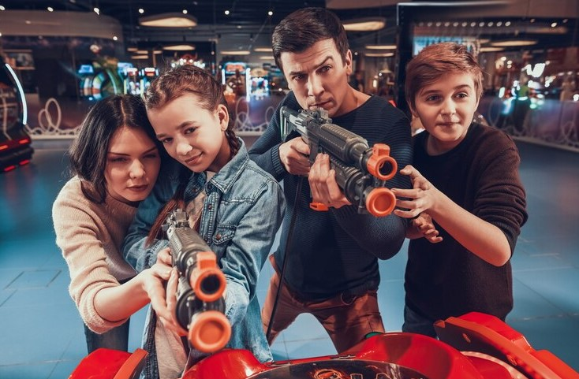

You want an epic way to celebrate your son’s 13th birthday. Take into account a Gaming Center Party. Via this idea, you can transform a space into a gaming paradise, packed with consoles and thrilling challenges. Your boy and his friends will have a blast playing and competing together. 

### **20\. Board Game Night**

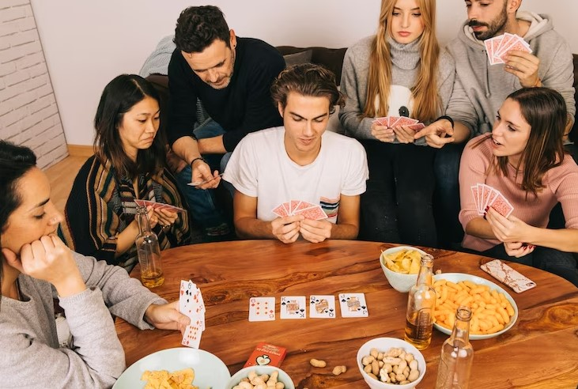

If you are worried about too much screen time, how about amazing 13th-birthday ideas to delight your son? Try a Board Game Night! You can gather his pals for hours of classic board game fun. No need to stress – it’s a perfect break from screens. Plus, it is an educational gift to train his mind and personality.

### **21\. Skateboarding or BMX Party**

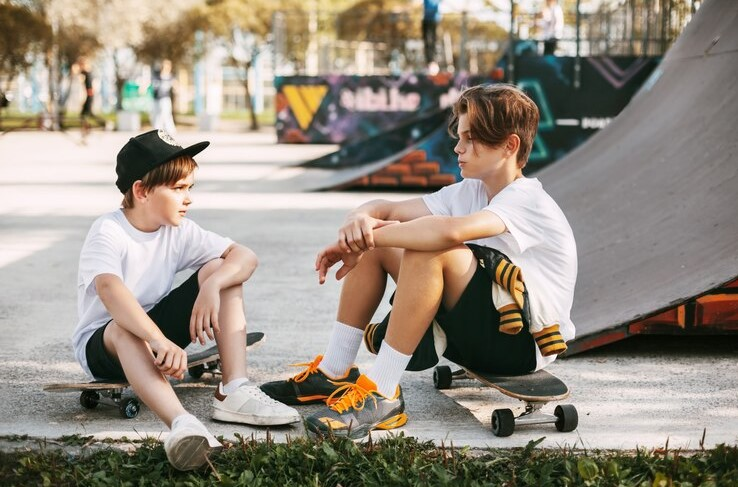

We know your son is a thrill-seeking kid. We suggest you hold the upcoming 13th birthday party with Skateboarding or BMX idea. You can set up ramps and obstacles for heart-pounding fun. Then, inviting his friends to cheer him on, he’ll feel like a true champion.

### **22\. Glow-in-the-Dark Party**

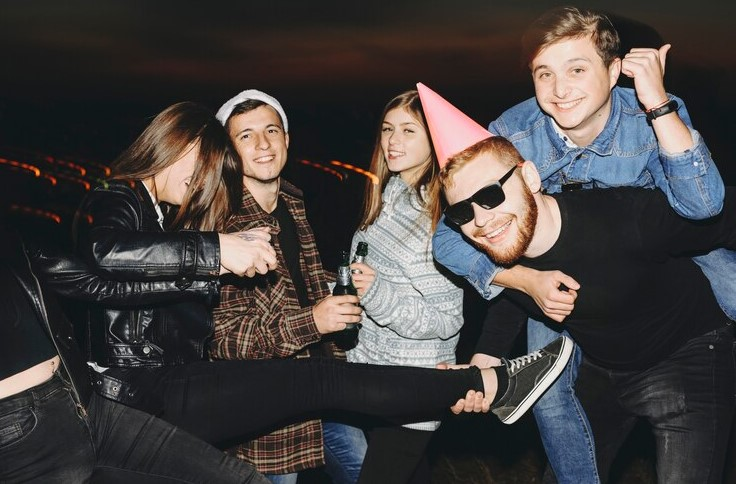

Parents, prepare to make your son’s 13th birthday unforgettable with a Glow-in-the-Dark Party! This unique celebration offers a mesmerizing atmosphere with neon decorations and glow-in-the-dark accessories. From that, he and his friends will have a blast in this unique setting. 

### **23\. Nerf War Party**

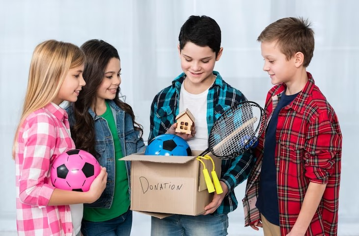

Let’s prepare to enjoy the Nerf War Party, an action-packed way to celebrate your son’s 13th birthday.  Setting up the party is a breeze, and safety is a priority with trained staff. Then, this idea features thrilling foam dart battles, team strategies, and obstacle courses. These elements will send your son and his friends to an absolute blast. 

### **24\. Trampoline Park Party**

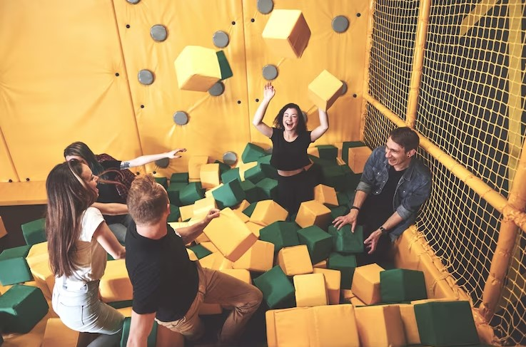

The Trampoline Park Party bursts with high-flying fun to create memories for your son on his 13th birthday. This party promises thrilling jumps, exciting games, and a safe environment for your son and his friends.  If you want to give your son a day filled with laughter, energy, and non-stop excitement, there is nothing other than this suggestion. 

### **25\. Mystery or Detective Party**

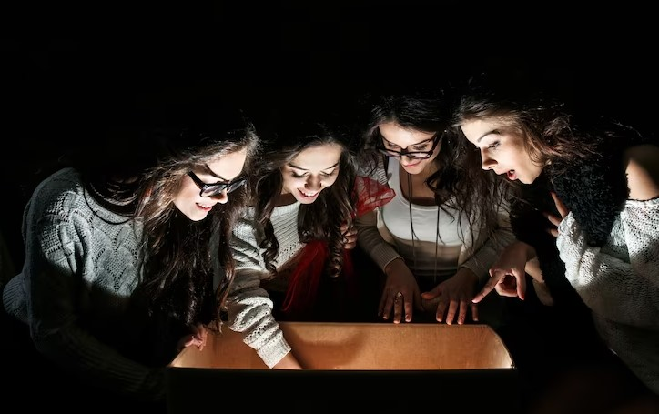

The Mystery or Detective Party is the perfect fit to inspire your son with an adventurous spirit. The idea will spark his curiosity and love for puzzles to dive into this excitement. He and his friends will enjoy this journey with clues, challenges, and teamwork. That’s why don’t think more, let’s get started with a detailed plan for this party.

## **Ideal Ways to Celebrate 13th Birthday Party with Friends**

### **26\. Cooking or BBQ Party**

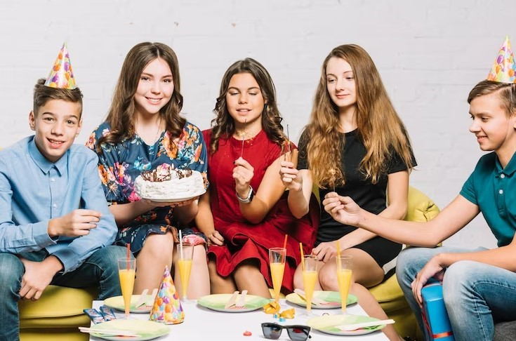

You can bring together their friends and let them have a blast while they learn to cook or grill tasty treats such as burgers and cookies. Besides, you can invite your relatives and your kid’s friend’s parents to come here and enjoy these dishes together. 

### **27\. Outdoor Camping Party**

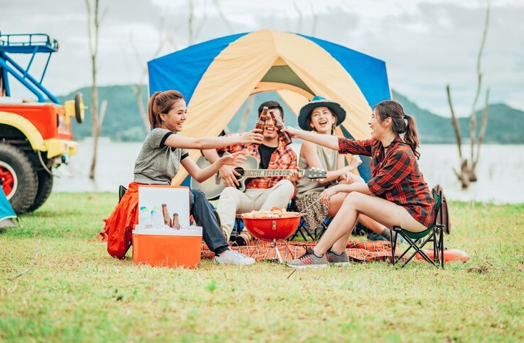

An Outdoor Camping Party is an attractive 13th birthday party idea for your kid in summer. You only invite your child’s pals and let them experience the thrill of camping under the stars. Remember to prepare marshmallows and meat to toast enough for them to talk all night. With nature as their backdrop, it’s a chance to foster a deeper connection with friends 

### **28\. Outdoor Picnic Party**

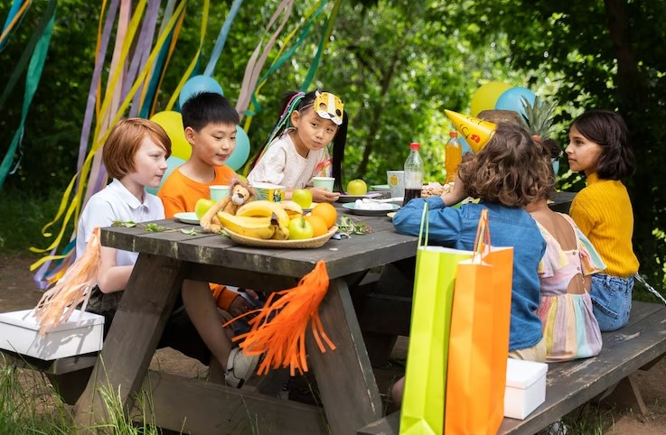

If your house features a generous garden with green grass and a picturesque landscape, don’t think more and head to an Outdoor Picnic Party. On your kid’s 13th birthday, he/she can enjoy a day in the sun, surrounded by nature’s beauty with their friends. You should also prepare some food such as sandwiches, pizza, and games to level up this joy. 

### **29\. Themed Costume Party**

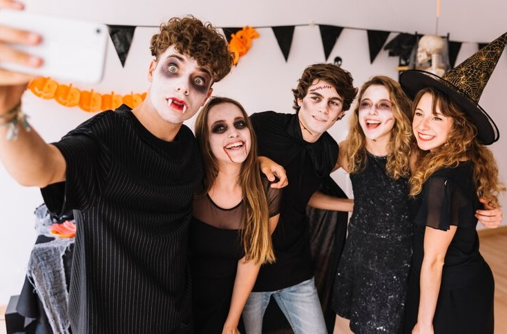

Themed Costume Party sounds traditional and classic but is never outdated. You can create an imaginative world by dressing up as some characters from your child’s tale or his/her favorite movie. Companying with games and activities to match, it is perfect to warm up your party! 

### **30\. Recreation Center**

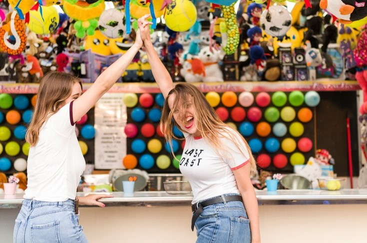

When considering ideas for your child’s 13th birthday celebration, you’ll be pleased to discover the Recreation Center as a fantastic option. This place offers a range of exciting activities, from basketball and indoor soccer to roller skating. With a dynamic ambiance and engaging games, this ensures a delightful experience for your child and their friends

## **Sleepover 13th Birthday Party Ideas**

### **31\. Movie Marathon Night**

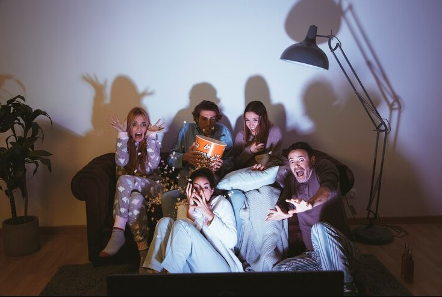

Let your child enjoy his/her 13th birthday party with a Movie Marathon Night idea. You only prepare plenty of popcorn and let them choose their favorite movies. Your child and friend will enjoy the movies together. And they will create lasting memories and share moments of joy. It is truly a great idea, right?

### **32\. Scavenger Hunt**

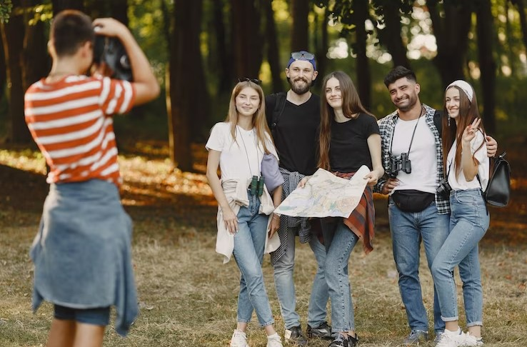

Let’s organize a thrilling adventure at home with a Scavenger Hunt game to surprise your kid on his/her 13th birthday. They will follow clues, solve puzzles, and embark on a treasure-hunting journey with their friends. As you watch them work together and conquer challenges, you’ll witness their camaraderie grow. 

### **33\. Campfire Stories**

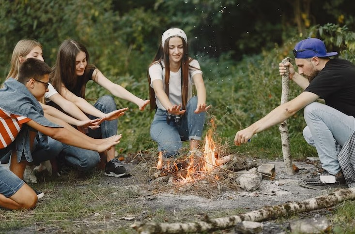

Gather your child’s friends for a cozy evening of storytelling around a flickering fire. This is a unique 13th birthday party idea for you to delight your daughter/son. With some magic tale, you’ll witness their laughter and wonder. Moreover, your kid will share their emotion and feelings with their friends.

### **34\. Truth or Dare**

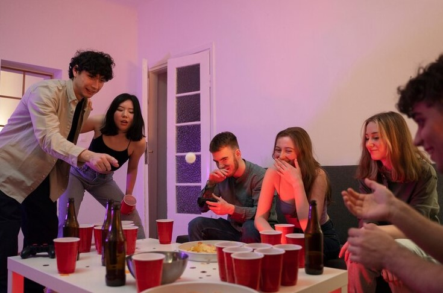

Truth or Dare may be desirable for your daughter/son’s 13th birthday to connect with their friends. The excitement will be spread Through funny questions and amusing dares. Your kid and friends will gather in a circle and spin the bottle to find a person to answer a question.

### **35\. Pajama Fashion Show**

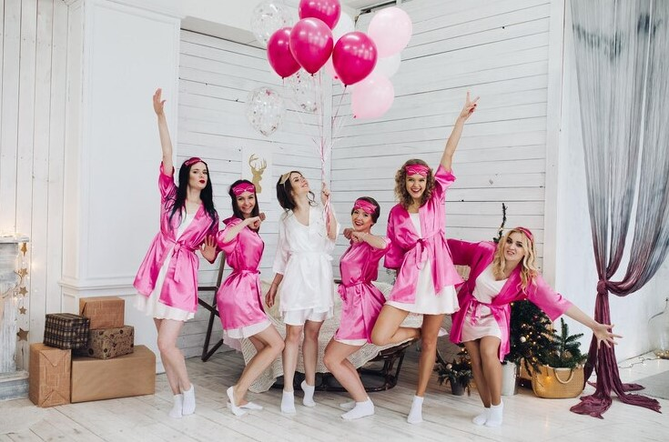

If your kid is a big fashion fan, the Pajama Fashion Show is a magic option to add to a sleepover 13th birthday party. With a makeshift runway and fun music, your teen and friends will strut their stuff and step into some hilarious sleepwear outfits.

## **Bottom Line**

The **13th birthday party ideas** have come to an end. It is time to officially say goodbye to you. Via exploring these creative and happy ideas for your kid on his/her birthday. You have gone through a lot, and each option may be a magic way for you to have a perfect birthday for your kid and create cherished memories. These ideas are fun and give your child a happy childhood, but they also suggest that you teach your kid some life lessons to value. After, we hope that you will find these ideas festive and useful to plan a birthday for your loved kid.

- [Heartwarming Ideas to Surprise Your Son/Daughter on Their 13th Birthday Party](https://avada.io/loveable/blog/13th-birthday-party-ideas/#wp-block-heading-2-3)
    - [1\. Memory Lane Video](https://avada.io/loveable/blog/13th-birthday-party-ideas/#wp-block-heading-3-6)
    - [2\. Yearbook of Memories](https://avada.io/loveable/blog/13th-birthday-party-ideas/#wp-block-heading-3-9)
    - [3\. Letters from Loved Ones](https://avada.io/loveable/blog/13th-birthday-party-ideas/#wp-block-heading-3-12)
    - [4\. Wishing Tree](https://avada.io/loveable/blog/13th-birthday-party-ideas/#wp-block-heading-3-15)
    - [5\. Personalized Gift](https://avada.io/loveable/blog/13th-birthday-party-ideas/#wp-block-heading-3-18)
- [Unmissable 13th Birthday Party Ideas for Girls](https://avada.io/loveable/blog/13th-birthday-party-ideas/#wp-block-heading-2-21)
    - [6\. Spa Day Party](https://avada.io/loveable/blog/13th-birthday-party-ideas/#wp-block-heading-3-24)
    - [7\. Karaoke Party](https://avada.io/loveable/blog/13th-birthday-party-ideas/#wp-block-heading-3-27)
    - [8\. Crafting Party](https://avada.io/loveable/blog/13th-birthday-party-ideas/#wp-block-heading-3-30)
    - [9\. Beach Bonfire Party](https://avada.io/loveable/blog/13th-birthday-party-ideas/#wp-block-heading-3-33)
    - [10\. Cooking or Baking Party](https://avada.io/loveable/blog/13th-birthday-party-ideas/#wp-block-heading-3-36)
    - [11\. Fashion Show Party](https://avada.io/loveable/blog/13th-birthday-party-ideas/#wp-block-heading-3-39)
    - [12\. Pool Party](https://avada.io/loveable/blog/13th-birthday-party-ideas/#wp-block-heading-3-42)
    - [13\. Dance Party](https://avada.io/loveable/blog/13th-birthday-party-ideas/#wp-block-heading-3-45)
    - [14\. Outdoor Water Party](https://avada.io/loveable/blog/13th-birthday-party-ideas/#wp-block-heading-3-48)
    - [15\. Book Party](https://avada.io/loveable/blog/13th-birthday-party-ideas/#wp-block-heading-3-51)
- [Exciting 13th Birthday Party Ideas for Boys](https://avada.io/loveable/blog/13th-birthday-party-ideas/#wp-block-heading-2-54)
    - [16\. Outdoor Adventure Party](https://avada.io/loveable/blog/13th-birthday-party-ideas/#wp-block-heading-3-57)
    - [17\. Sports Tournament Party](https://avada.io/loveable/blog/13th-birthday-party-ideas/#wp-block-heading-3-60)
    - [18\. Video Game Party](https://avada.io/loveable/blog/13th-birthday-party-ideas/#wp-block-heading-3-63)
    - [19\. Gaming Center Party](https://avada.io/loveable/blog/13th-birthday-party-ideas/#wp-block-heading-3-66)
    - [20\. Board Game Night](https://avada.io/loveable/blog/13th-birthday-party-ideas/#wp-block-heading-3-69)
    - [21\. Skateboarding or BMX Party](https://avada.io/loveable/blog/13th-birthday-party-ideas/#wp-block-heading-3-72)
    - [22\. Glow-in-the-Dark Party](https://avada.io/loveable/blog/13th-birthday-party-ideas/#wp-block-heading-3-75)
    - [23\. Nerf War Party](https://avada.io/loveable/blog/13th-birthday-party-ideas/#wp-block-heading-3-78)
    - [24\. Trampoline Park Party](https://avada.io/loveable/blog/13th-birthday-party-ideas/#wp-block-heading-3-81)
    - [25\. Mystery or Detective Party](https://avada.io/loveable/blog/13th-birthday-party-ideas/#wp-block-heading-3-84)
- [Ideal Ways to Celebrate 13th Birthday Party with Friends](https://avada.io/loveable/blog/13th-birthday-party-ideas/#wp-block-heading-2-87)
    - [26\. Cooking or BBQ Party](https://avada.io/loveable/blog/13th-birthday-party-ideas/#wp-block-heading-3-88)
    - [27\. Outdoor Camping Party](https://avada.io/loveable/blog/13th-birthday-party-ideas/#wp-block-heading-3-91)
    - [28\. Outdoor Picnic Party](https://avada.io/loveable/blog/13th-birthday-party-ideas/#wp-block-heading-3-94)
    - [29\. Themed Costume Party](https://avada.io/loveable/blog/13th-birthday-party-ideas/#wp-block-heading-3-97)
    - [30\. Recreation Center](https://avada.io/loveable/blog/13th-birthday-party-ideas/#wp-block-heading-3-100)
- [Sleepover 13th Birthday Party Ideas](https://avada.io/loveable/blog/13th-birthday-party-ideas/#wp-block-heading-2-103)
    - [31\. Movie Marathon Night](https://avada.io/loveable/blog/13th-birthday-party-ideas/#wp-block-heading-3-104)
    - [32\. Scavenger Hunt](https://avada.io/loveable/blog/13th-birthday-party-ideas/#wp-block-heading-3-107)
    - [33\. Campfire Stories](https://avada.io/loveable/blog/13th-birthday-party-ideas/#wp-block-heading-3-110)
    - [34\. Truth or Dare](https://avada.io/loveable/blog/13th-birthday-party-ideas/#wp-block-heading-3-113)
    - [35\. Pajama Fashion Show](https://avada.io/loveable/blog/13th-birthday-party-ideas/#wp-block-heading-3-116)
- [Bottom Line](https://avada.io/loveable/blog/13th-birthday-party-ideas/#wp-block-heading-2-119)

### [Rose Bryne](https://avada.io/loveable/author/rose/)

Hi, I'm Rose! I love animals and spending time with kids. At Loveable, I help people find unique gifts for special occasions like Valentine's Day, housewarmings, and graduations. I enjoy finding gifts for kids, teens, and animal lovers that match their interests and personalities. Making gift-giving a pleasant experience is my priority. Let me assist you in finding the perfect gift!

- [Twitter](https://twitter.com/intent/tweet)
- [Facebook](https://www.facebook.com/sharer/sharer.php)
- [instagram](https://avada.io/loveable/blog/13th-birthday-party-ideas/)
- [pinterest](https://www.pinterest.com/loveablellc/)

## Related Posts

[### 30 Best 4 Year Old Birthday Party Ideas For A Memorable Celebration](https://avada.io/loveable/blog/4-year-old-birthday-party-ideas/) 

[

### 16th Birthday Party Ideas to Make an Unforgettable Day

](https://avada.io/loveable/blog/16th-birthday-party-ideas/)

[

### 150+ Inspirational Birthday Quotes to Spread Joy on Special Day

](https://avada.io/loveable/blog/inspirational-birthday-quotes/)

[

### 160+ Birthday Wishes for Wife to Express Eternal Love

](https://avada.io/loveable/blog/birthday-wishes-for-wife/)

[### 90+ Heart Touching Birthday Wishes for Niece to Make Her Day Extra Special](https://avada.io/loveable/blog/birthday-wishes-for-niece/)
