This article has been written and researched by our expert Loveable through a precise methodology. [Learn more about our methodology](https://avada.io/loveable/our-methodological.html)

[Loveable](https://avada.io/loveable/) > [Blog](https://avada.io/loveable/blog/) > [Holiday](https://avada.io/loveable/holiday/)

# 35 Best 70th Birthday Ideas To Celebrate The Special Milestone

Written by [Luna Miller](https://avada.io/loveable/author/luna/) Last Updated on October 05, 2023

Researched by [David Flynn](https://avada.io/loveable/author/david-flynn/) FROM LOVEABLE LAB

- [36 Best 70th Birthday Ideas to Try in 2023](https://avada.io/loveable/blog/70th-birthday-ideas/#wp-block-heading-2-4) 
    - [1\. Back to the 1970s](https://avada.io/loveable/blog/70th-birthday-ideas/#wp-block-heading-3-5)
    - [2\. Global Cuisine Fest](https://avada.io/loveable/blog/70th-birthday-ideas/#wp-block-heading-3-9)
    - [3\. Wonderful Destination Party](https://avada.io/loveable/blog/70th-birthday-ideas/#wp-block-heading-3-13)
    - [4\. Create a Quiz Based on the Celebrant](https://avada.io/loveable/blog/70th-birthday-ideas/#wp-block-heading-3-16)
    - [5\. Birthday Photo Booth](https://avada.io/loveable/blog/70th-birthday-ideas/#wp-block-heading-3-20)
    - [6\. A Spa Day for 70-year-old Women](https://avada.io/loveable/blog/70th-birthday-ideas/#wp-block-heading-3-24) 
    - [7\. Have A Delightful Potluck Picnic!](https://avada.io/loveable/blog/70th-birthday-ideas/#wp-block-heading-3-27)
    - [8\. Eat Out at a New Restaurant](https://avada.io/loveable/blog/70th-birthday-ideas/#wp-block-heading-3-30)
    - [9\. Host a Children’s Party for 70th Birthday.](https://avada.io/loveable/blog/70th-birthday-ideas/#wp-block-heading-3-33)
    - [10\. Take a Desserts Tour](https://avada.io/loveable/blog/70th-birthday-ideas/#wp-block-heading-3-37) 
    - [11\. Memory Sharing Time](https://avada.io/loveable/blog/70th-birthday-ideas/#wp-block-heading-3-40) 
    - [12\. Art and Craft Workshop](https://avada.io/loveable/blog/70th-birthday-ideas/#wp-block-heading-3-43)
    - [13\. Charity Fundraiser](https://avada.io/loveable/blog/70th-birthday-ideas/#wp-block-heading-3-46)
    - [14\. Live Entertainment](https://avada.io/loveable/blog/70th-birthday-ideas/#wp-block-heading-3-49)
    - [15\. Picnic on the Beach](https://avada.io/loveable/blog/70th-birthday-ideas/#wp-block-heading-3-52)
    - [16\. Join Mixology Classes](https://avada.io/loveable/blog/70th-birthday-ideas/#wp-block-heading-3-55)
    - [17\. Visit a Brewery](https://avada.io/loveable/blog/70th-birthday-ideas/#wp-block-heading-3-58)
    - [18\. Rent a Movie Theatre](https://avada.io/loveable/blog/70th-birthday-ideas/#wp-block-heading-3-61)
    - [19\. Karaoke Night](https://avada.io/loveable/blog/70th-birthday-ideas/#wp-block-heading-3-64)
    - [20\. Dinner Party](https://avada.io/loveable/blog/70th-birthday-ideas/#wp-block-heading-3-67) 
    - [21\. Make 70th Birthday Cake](https://avada.io/loveable/blog/70th-birthday-ideas/#wp-block-heading-3-69) 
    - [22\. Make a Birthday Video](https://avada.io/loveable/blog/70th-birthday-ideas/#wp-block-heading-3-72)
    - [23\. Memory Scrapbook](https://avada.io/loveable/blog/70th-birthday-ideas/#wp-block-heading-3-75)
    - [24\. Air Balloon Ride](https://avada.io/loveable/blog/70th-birthday-ideas/#wp-block-heading-3-78)
    - [25\. Flower Shower](https://avada.io/loveable/blog/70th-birthday-ideas/#wp-block-heading-3-82)
    - [26\. Set up Vintage Theme](https://avada.io/loveable/blog/70th-birthday-ideas/#wp-block-heading-3-86)
    - [27\. Photos Through the Years SlideShow](https://avada.io/loveable/blog/70th-birthday-ideas/#wp-block-heading-3-89) 
    - [28\. Family Reunion](https://avada.io/loveable/blog/70th-birthday-ideas/#wp-block-heading-3-92)
    - [29\. Have a Bingo Night](https://avada.io/loveable/blog/70th-birthday-ideas/#wp-block-heading-3-96)
    - [30\. Host a Pool Party](https://avada.io/loveable/blog/70th-birthday-ideas/#wp-block-heading-3-99)
    - [31\. Tea Party](https://avada.io/loveable/blog/70th-birthday-ideas/#wp-block-heading-3-102)
    - [32\. Dance Session For Old People](https://avada.io/loveable/blog/70th-birthday-ideas/#wp-block-heading-3-105) 
    - [33\. Play Would You Rather Game](https://avada.io/loveable/blog/70th-birthday-ideas/#wp-block-heading-3-108)
    - [34\. Story Game](https://avada.io/loveable/blog/70th-birthday-ideas/#wp-block-heading-3-111)
    - [35\. Memory Jars](https://avada.io/loveable/blog/70th-birthday-ideas/#wp-block-heading-3-114)
- [Best 70 Birthday Gift Ideas for a Memorable Milestone](https://avada.io/loveable/blog/70th-birthday-ideas/#wp-block-heading-2-117) 
- [Bottom Line](https://avada.io/loveable/blog/70th-birthday-ideas/#wp-block-heading-2-120) 

Turning seventy is a milestone that comes around only once in a lifetime, so it’s time to brainstorm some fantastic **70th birthday party ideas** for your loved one! As the big day approaches, you might ponder questions like, “What holds symbolic meaning for a 70th birthday?” or “How can we make a 70-year-old’s celebration truly special?”

While the classic 70th birthday party with friends, family, and a cake is always a great choice, there’s a world of unique and imaginative ways to mark this special occasion.

Whether you’re searching for [70th birthday ideas for your mom](https://avada.io/loveable/70th-birthday-gift-ideas-mom/), dad, grandparent, spouse, friends, or even yourself, we’ve got you covered with this list of unforgettable activities and experiences!

## **36 Best 70th Birthday Ideas to Try in 2023** 

### **1\. Back to the 1970s**

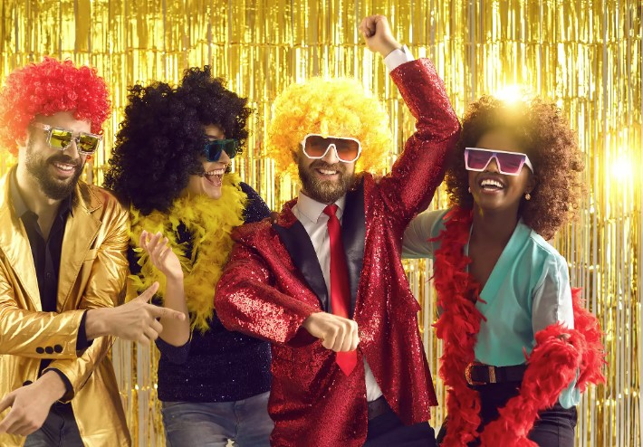

Your 70-year-old grandparent likely has fond memories of the 1970s, back to the time when they were a young lady/man! They’ll enjoy a trip down memory lane to a decade known for its wild fashion and incredible music scene.

Wear the ’70s spirit with bell-bottom jeans, wide-collar shirts, peasant blouses, and disco dresses. Don’t forget to serve popular cocktails, mini quiche Lorraines, and cocktail sausages. To top it off, hiring a ’70s disco and funk band will ensure your themed party is a hit!

### **2\. Global Cuisine Fest**

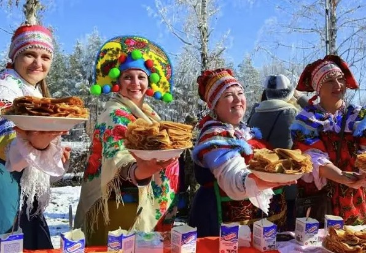

Select a cuisine from around the world that the 70th birthday lady or man absolutely loves, whether it’s Chinese, Italian, or Spanish, and prepare a delightful feast featuring traditional dishes from that culture.

The dishes you whip up could be their personal favorites from their global adventures or even a nod to their place of birth and upbringing. The goal is to enjoy a culinary journey, relish delectable flavors, and take your taste buds on an exotic voyage.

### **3\. Wonderful Destination Party**

Choose a city that’s been on your travel wishlist and make it the destination for your party. Invite your guests to jet off and rendezvous with you in this exotic locale, creating an unforgettable blend of travel and celebration.

### **4\. Create a Quiz Based on the Celebrant**

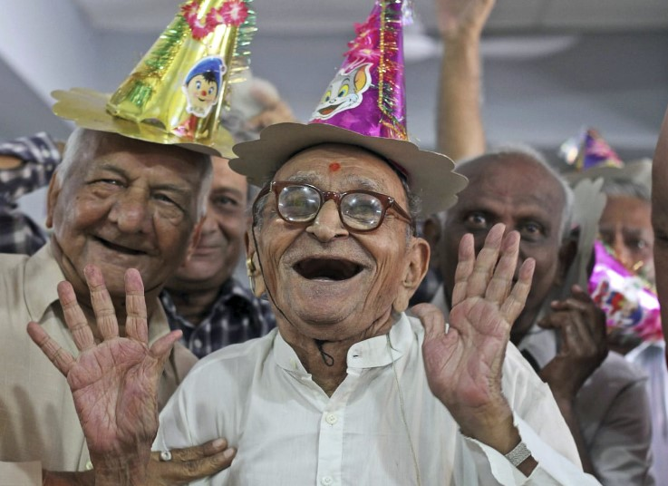

You’re all gathered here to celebrate your loved one’s 70th birthday, but who knows them the best? With the birthday person’s help, you can become the quizmaster and create a quiz about their life, experiences, likes, and more.

Some questions can be simple, like their zodiac sign or their kids’ and grandkids’ names and birthdays. Others can be a bit more specific, like their favorite teacher from school or something that really annoys them. After you’ve checked the answers together, the birthday person can announce the quiz winner. 

### **5\. Birthday Photo Booth**

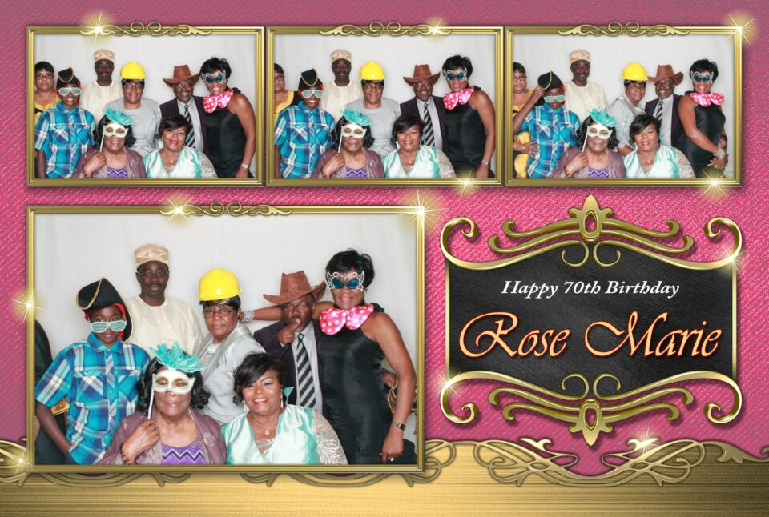

The top ideas for a 70th birthday party are all about creating special memories. To celebrate 70 years of life, love, family, and friends, you can make your own photo booth at home and take funny pictures.

Just put up a cool background and offer playful stuff like hats, beads, scarves, and sunglasses for everyone to use. It’s a great way to have fun and capture the moment!

### **6\. A Spa Day for 70-year-old Women** 

Consider giving a spa day to celebrate her 70th birthday. It’s a day of pampering and relaxation that she truly deserves. You can choose a professional spa or create a serene atmosphere at home with massages, facials, and soothing music. Add a personal touch with her favorite treatments, snacks, and thoughtful spa-related gifts. It’s a heartfelt way to make her milestone birthday extra special.

### **7\. Have A Delightful Potluck Picnic!**

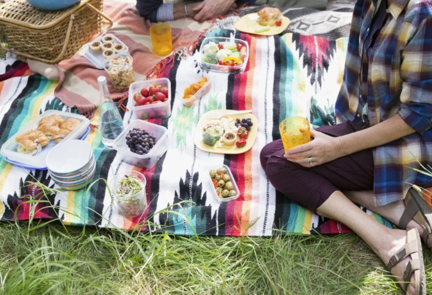

70th birthday parties are great when they bring folks closer; there’s nothing like gathering over many homemade dishes. Arrange a picnic with blankets, chairs, outdoor games, and drinks at a nearby park. Invite her/his friend to bring a dish they like, and let’s savor the meal together in the open air.

### **8\. Eat Out at a New Restaurant**

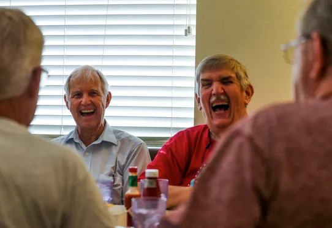

On this special day, the older can book a table at a restaurant you’ve never tried before. Embrace the adventure and explore new flavors in the luxurious/cozy restaurant that you’ve never encountered.

### **9\. Host a Children’s Party for 70th Birthday.**

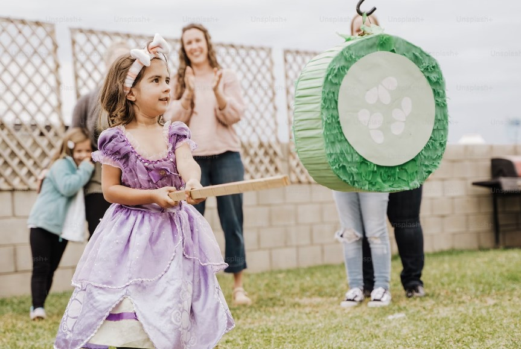

Even at 70, there’s no reason not to let out your inner child and have a fun, youthful party. From donning party hats to classic games like pin the tail on the donkey, enjoying jelly and ice cream, or even trying to make balloon animals – no rule says 70th birthday celebrations can’t be a bit playful.

As people approach their 60s and 70s, nostalgia for their childhood often grows. That’s why a 70th birthday is a wonderful chance to embrace that nostalgia and throw a party the younger version of your loved one would have adored.

### **10\. Take a Desserts Tour** 

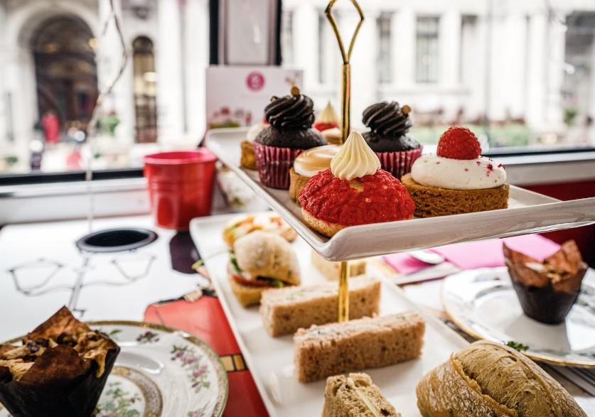

One of the perks of being an adult? You can skip straight to dessert without finishing your dinner! To mark the 70th birthday of someone dear, go on a sweet adventure to your neighborhood bakeries, ice cream parlors, or chocolate shops and savor all the delicious treats they crave.

### **11\. Memory Sharing Time** 

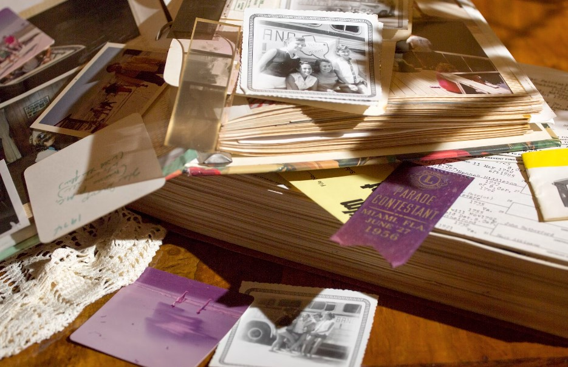

Create a heartfelt session where friends and family can share their cherished memories and stories about the birthday honoree. This can be an emotional and touching way to celebrate seven decades of life and create lasting memories of the celebration. Among all the fun activities, this is what makes a meaningful 70th birthday.

### **12\. Art and Craft Workshop**

Who says elderly people can’t be creative? Host an art or craft workshop where guests can unleash their creativity. You have to provide painting, pottery, and crafting materials, and encourage everyone to create their masterpiece. It’s a fantastic opportunity to bond, share stories, and take home unique souvenirs from the celebration.

### **13\. Charity Fundraiser**

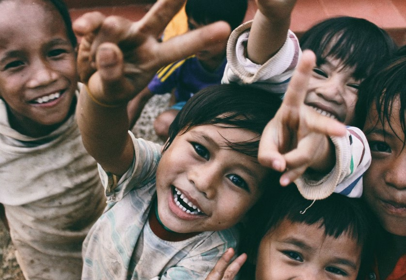

Celebrate the 70th birthday person’s values and commitment to giving back by organizing a charity fundraiser. You can choose a cause that resonates with them, and invite guests to contribute. It’s a meaningful way to mark the occasion while positively impacting the community or a cause close to the honoree’s heart.

### **14\. Live Entertainment**

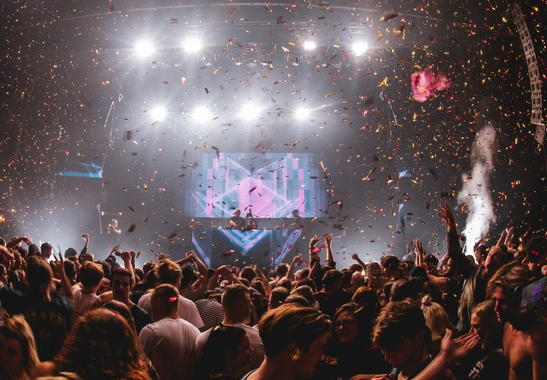

Who says a 70-year-old man/woman cannot go to a live concert? Another option for you is to elevate the atmosphere with live entertainment. Consider hiring a local band, singer, or DJ who can play the birthday person’s favorite tunes. Guests can dance the night away and revel in the joyous melodies.

### **15\. Picnic on the Beach**

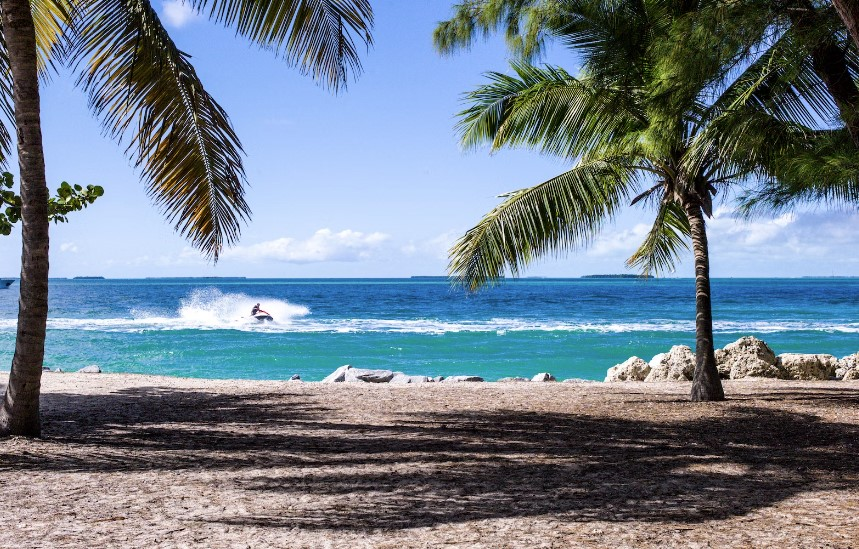

A picnic on the beach is a wonderful way to spend a 70th birthday day. The sound of waves crashing on the shore, the warm sand beneath your feet, and the gentle breeze create the perfect backdrop for a relaxing outdoor meal. Spread out a blanket, unpack your favorite snacks, sandwiches, and refreshing drinks, and enjoy a leisurely feast while enjoying the beautiful ocean views. Whether you’re with family or friends, a beach picnic is a delightful experience.

### **16\. Join Mixology Classes**

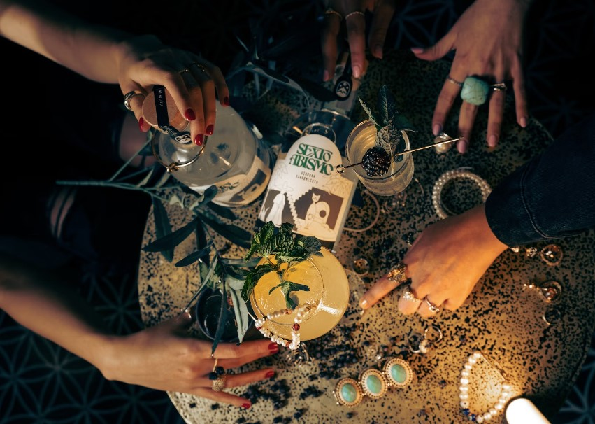

If your 70-year-old friend or family member enjoys hosting gatherings, consider the excitement and satisfaction they’ll get from online mixology classes. You can either participate in a class to celebrate their special day or gift them this experience. Either way, they’ll relish discovering the art of crafting delightful cocktails and mocktails. It’s a gift that combines fun and learning, and it is sure to be a hit!

### **17\. Visit a Brewery**

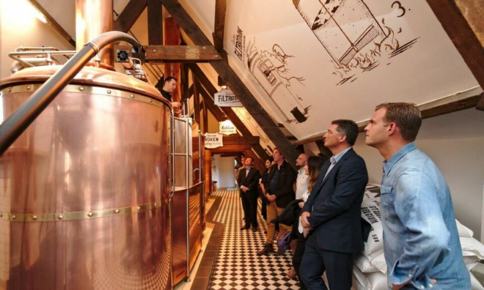

Savor the experience of witnessing the preparation of one of your beloved beverages, and invite a few friends to join and drink the fresh beer. It is indeed a fresh and interesting activity to try on his/her 70th birthday, isn’t it? A beer lover would fall in love with being in the brewery!

### **18\. Rent a Movie Theatre**

Elevate the 70th birthday celebration by reserving a movie theater for an exclusive screening. Why not treat them and their nearest and dearest to a trip down memory lane with a beloved classic film? You could make it even more special by featuring a slideshow or screening some home videos, sharing cherished moments from their life.

### **19\. Karaoke Night**

The 1950s to the 1970s was an incredible era for music. If you play tunes by legends like Elvis Presley or Chuck Berry, you can bet your dad will join right in, singing along. Make sure to set up that karaoke playlist with all the popular hits, some fun and funny songs, and those classic numbers from the 1950s to the 1970s. Be sure to let your guests in on the plan and have that list of karaoke songs ready ahead of time. It’s going to be a musical blast!

### **20\. Dinner Party** 

Enhance the experience of a plated dinner with the magic of uplighting, luxurious gold decor, and a captivating ambiance. Let style and elegance take center stage as the true stars of this gathering.

### **21\. Make 70th Birthday Cake** 

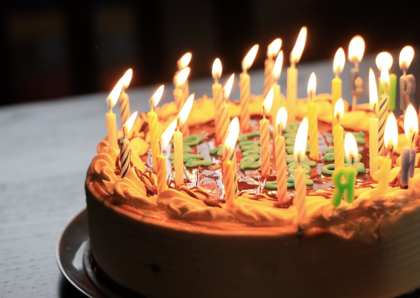

While lighting seventy candles might pose a fire hazard, you can still celebrate their milestone age by baking (or ordering) a cake in the shape of the number 70. Not only will this unique cake make for stunning photos, but a larger cake also ensures there’s enough to go around for all the guests on your loved one’s extensive party list to enjoy a slice.

### **22\. Make a Birthday Video**

Invite your family and friends to capture brief video messages sharing their cherished memories of your dad. Later, play these heartfelt messages on a large screen after the cake-cutting ceremony for a touching surprise. Alternatively, consider arranging a live video call where everyone can collectively wish your dad a happy occasion.

### **23\. Memory Scrapbook**

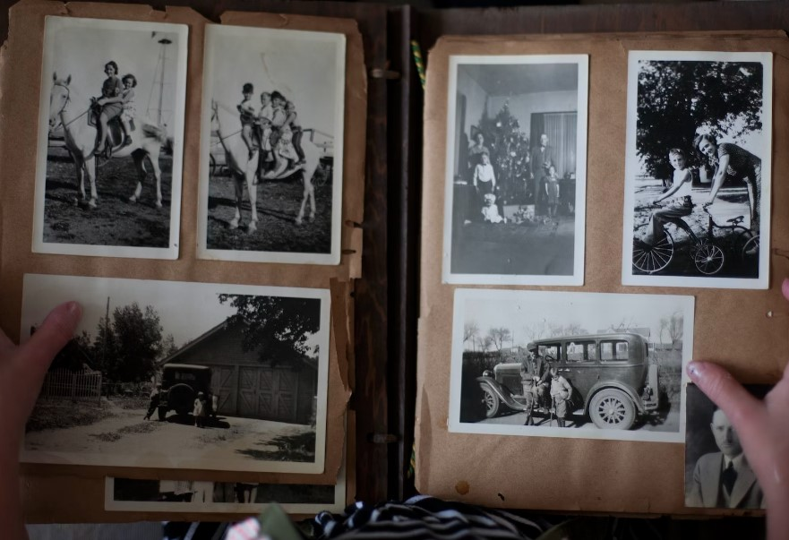

Craft a meaningful scrapbook comprising 70 pages, each summarizing significant moments from each of your dad’s seven decades of life. In addition to photographs, consider including heartfelt letters from friends and family expressing how much your birthday honoree is cherished. A scrapbook that reminisces over 70 golden years makes for one of the most heartwarming and cherished birthday gifts he could receive!

### **24\. Air Balloon Ride**

If your birthday celebrant has longed for a hot air balloon ride on their bucket list, why not elevate their 70th birthday celebration to new heights by making it a reality?

Drift above stunning landscapes, with the honored guest and their loved ones, savoring awe-inspiring views and creating unforgettable memories.

### **25\. Flower Shower**

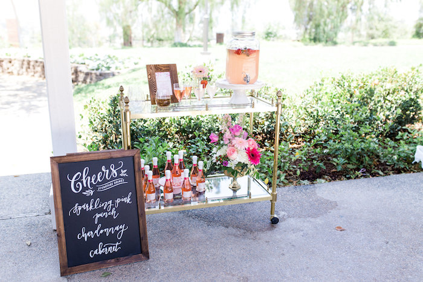

Surprise her on her 70th birthday by sending her a bouquet of her favorite flowers. Flowers are a timeless and thoughtful way to convey your love and appreciation. Accompany the floral gift with a heartfelt card, toasting her life’s achievements and making her feel truly special.

Consider gifting a potted plant or a beautiful bouquet of her favorite flowers; she’ll surely appreciate these excellent gift ideas. If she takes pride in her garden or it could use a little sprucing up, consider hiring a gardener to add some fresh blooms and rejuvenate her garden space.

### **26\. Set up Vintage Theme**

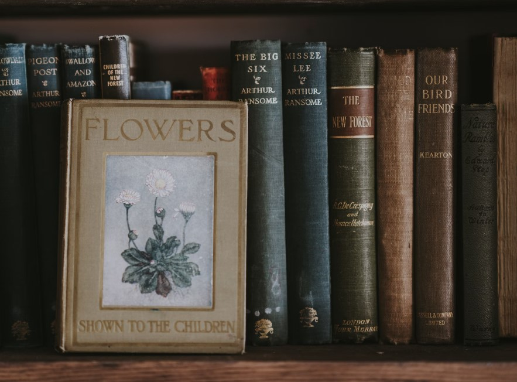

One good decoration idea is to take a trip down memory lane with a fun vintage-themed party. Set the scene with decorations from the chosen decade – think old-fashioned furniture, retro signs, and vintage dishes. Tell your guests to get into the spirit by wearing clothes from that period. And be sure to serve up some classic dishes and drinks to remind the birthday person of their younger years. It’s a great way to celebrate and reminisce together!

### **27\. Photos Through the Years SlideShow** 

Make a special timeline wall with pictures from throughout the years, and hang them up using lighted clips. Add interesting facts about the person being celebrated right next to the photos to make it even more fun. You can hang these on helium balloons for a floating effect, or place them along the entrance path on the lawn. Include important moments like graduations, weddings, the arrival of children, and more. 

### **28\. Family Reunion**

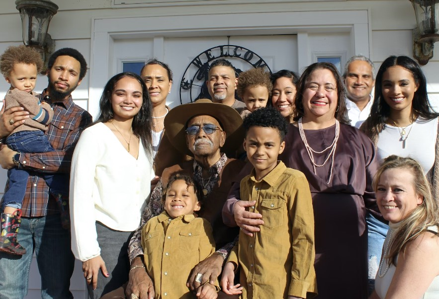

Turning 70 is a great reason to have a big family get-together. Send invitations to relatives from everywhere, no matter where they live.

And if kids are coming, make sure they have fun activities to do. You can have face painting or even bring in someone who can twist balloons into cool shapes. It’ll be a party for all ages!

### **29\. Have a Bingo Night**

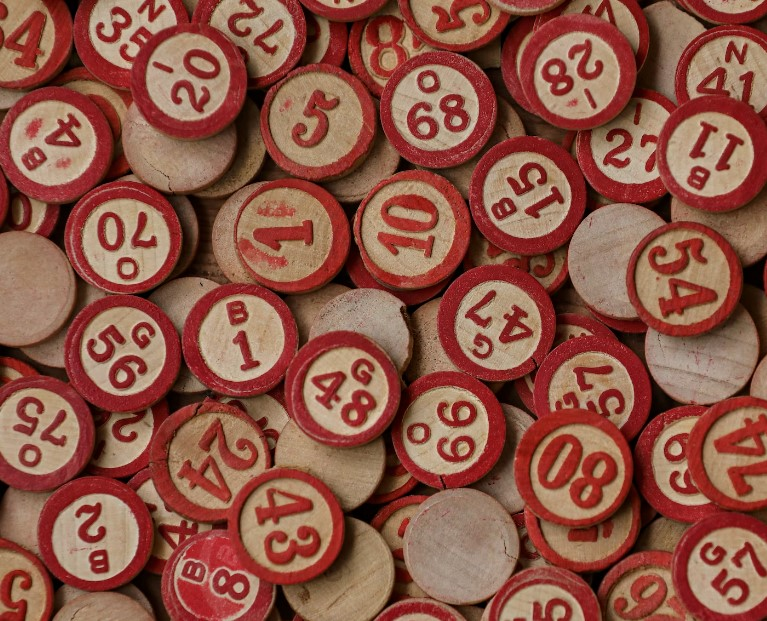

Make bingo cards and print them with the guest of honor’s name. Write their name and numbers from 1 to 90 on the cards. Then, call out random numbers, and the first player who marks all the numbers on their card or in a straight line shouts “Bingo.” Don’t forget to have some little prizes for the bingo winners to add to the enjoyment. Classic games like these can be played at any birthday party, including a 70th birthday celebration.

### **30\. Host a Pool Party**

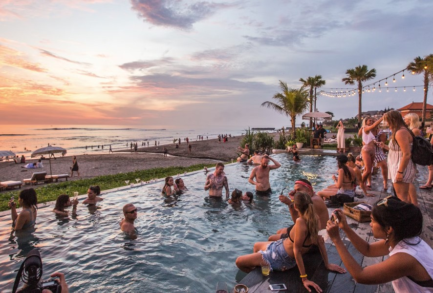

If your dad’s 70th birthday happens during the summer months, consider throwing a casual gathering by the pool. You can arrange some fun games, and serve delicious food and cocktails poolside. Grilling up some barbecue by the pool is another exciting option to explore. A poolside celebration offers plenty of chances for socializing and relaxation.

### **31\. Tea Party**

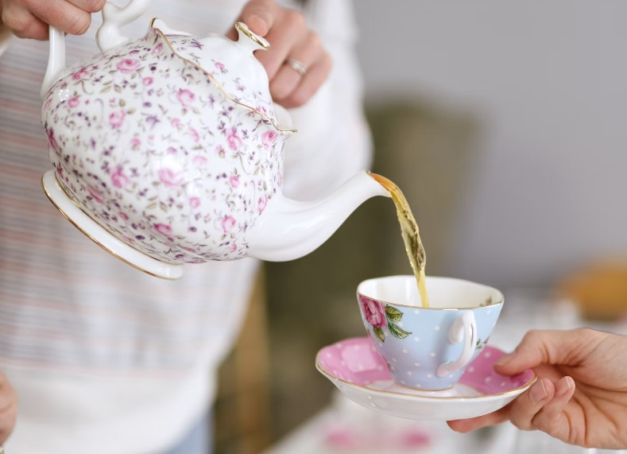

Aside from a flower shower party, you can consider preparing a delightful assortment of tea for your mom and your guests. To add some extra flair, consider getting a birthday sash for her and set up a spread of appetizers and finger foods to accompany the tea.

### **32\. Dance Session For Old People** 

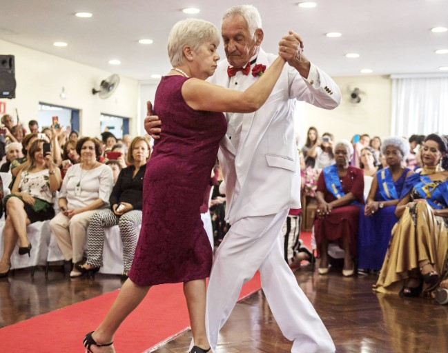

Your guest of honor might be 70, but that doesn’t mean they’ve lost their zest for engaging in enjoyable activities. Consider arranging a relaxed dance session in the living room, featuring some beloved old songs, and watch as their inner child comes alive.

### **33\. Play Would You Rather Game**

This timeless party game fosters interaction, especially when your guests span various age groups. Simply pose a series of “Would you rather” questions, such as “Would you rather swim or fly?” The person with the most amusing answer takes home the prize.

### **34\. Story Game**

Plan a creative storytelling game that’s bound to spark laughter for special 70-year-old party. Locate a captivating short story online and employ an editing app to delete specific words scattered throughout the narrative. Then, invite your guests to fill these gaps with imaginative lines. The outcome? It’s a delightfully quirky and entertaining story that’s sure to be a hit.

### **35\. Memory Jars**

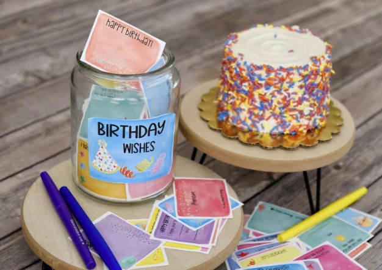

Provide your guests with photos, jars, and various enjoyable materials, allowing them to craft their own unique keepsakes. Once the party wraps up, they can proudly take home these creations as heartfelt mementos honoring the remarkable person they’ve just celebrated.

## **Best 70 Birthday Gift Ideas for a Memorable Milestone** 

As we commemorate a 70th birthday, the quest for the perfect gift to mark this significant milestone takes center stage. In tandem with exploring the best 70th birthday ideas to celebrate the special milestone, we have taken the extra step to curate a comprehensive collection of the best [70th birthday gift ideas](https://avada.io/loveable/70th-birthday-gift/) for a memorable milestone.

If you’re the guest of honor, reveling in the joy of seven decades of life, or a devoted friend or family member in search of a truly special gift, our curated ideas are here to complement the celebratory atmosphere and create unforgettable memories. Let us guide you through gorgeous and thoughtful gifts, ensuring that this 70th birthday becomes a cherished occasion for all involved.

## **Bottom Line** 

As we draw the curtain on this compilation of the best **70th birthday ideas** to celebrate the special milestone for the year 2023, we hope it has served as a source of inspiration and guidance for those planning to commemorate this extraordinary milestone. Turning 70 is a testament to a life well-lived, and the celebrations should reflect the significance of this achievement. Whether you opt for a grand soirée or a more intimate gathering, the key is to honor the person and their journey. From sentimental gifts to creative party themes, there are countless ways to make this milestone birthday a cherished memory.

- [36 Best 70th Birthday Ideas to Try in 2023](https://avada.io/loveable/blog/70th-birthday-ideas/#wp-block-heading-2-4) 
    - [1\. Back to the 1970s](https://avada.io/loveable/blog/70th-birthday-ideas/#wp-block-heading-3-5)
    - [2\. Global Cuisine Fest](https://avada.io/loveable/blog/70th-birthday-ideas/#wp-block-heading-3-9)
    - [3\. Wonderful Destination Party](https://avada.io/loveable/blog/70th-birthday-ideas/#wp-block-heading-3-13)
    - [4\. Create a Quiz Based on the Celebrant](https://avada.io/loveable/blog/70th-birthday-ideas/#wp-block-heading-3-16)
    - [5\. Birthday Photo Booth](https://avada.io/loveable/blog/70th-birthday-ideas/#wp-block-heading-3-20)
    - [6\. A Spa Day for 70-year-old Women](https://avada.io/loveable/blog/70th-birthday-ideas/#wp-block-heading-3-24) 
    - [7\. Have A Delightful Potluck Picnic!](https://avada.io/loveable/blog/70th-birthday-ideas/#wp-block-heading-3-27)
    - [8\. Eat Out at a New Restaurant](https://avada.io/loveable/blog/70th-birthday-ideas/#wp-block-heading-3-30)
    - [9\. Host a Children’s Party for 70th Birthday.](https://avada.io/loveable/blog/70th-birthday-ideas/#wp-block-heading-3-33)
    - [10\. Take a Desserts Tour](https://avada.io/loveable/blog/70th-birthday-ideas/#wp-block-heading-3-37) 
    - [11\. Memory Sharing Time](https://avada.io/loveable/blog/70th-birthday-ideas/#wp-block-heading-3-40) 
    - [12\. Art and Craft Workshop](https://avada.io/loveable/blog/70th-birthday-ideas/#wp-block-heading-3-43)
    - [13\. Charity Fundraiser](https://avada.io/loveable/blog/70th-birthday-ideas/#wp-block-heading-3-46)
    - [14\. Live Entertainment](https://avada.io/loveable/blog/70th-birthday-ideas/#wp-block-heading-3-49)
    - [15\. Picnic on the Beach](https://avada.io/loveable/blog/70th-birthday-ideas/#wp-block-heading-3-52)
    - [16\. Join Mixology Classes](https://avada.io/loveable/blog/70th-birthday-ideas/#wp-block-heading-3-55)
    - [17\. Visit a Brewery](https://avada.io/loveable/blog/70th-birthday-ideas/#wp-block-heading-3-58)
    - [18\. Rent a Movie Theatre](https://avada.io/loveable/blog/70th-birthday-ideas/#wp-block-heading-3-61)
    - [19\. Karaoke Night](https://avada.io/loveable/blog/70th-birthday-ideas/#wp-block-heading-3-64)
    - [20\. Dinner Party](https://avada.io/loveable/blog/70th-birthday-ideas/#wp-block-heading-3-67) 
    - [21\. Make 70th Birthday Cake](https://avada.io/loveable/blog/70th-birthday-ideas/#wp-block-heading-3-69) 
    - [22\. Make a Birthday Video](https://avada.io/loveable/blog/70th-birthday-ideas/#wp-block-heading-3-72)
    - [23\. Memory Scrapbook](https://avada.io/loveable/blog/70th-birthday-ideas/#wp-block-heading-3-75)
    - [24\. Air Balloon Ride](https://avada.io/loveable/blog/70th-birthday-ideas/#wp-block-heading-3-78)
    - [25\. Flower Shower](https://avada.io/loveable/blog/70th-birthday-ideas/#wp-block-heading-3-82)
    - [26\. Set up Vintage Theme](https://avada.io/loveable/blog/70th-birthday-ideas/#wp-block-heading-3-86)
    - [27\. Photos Through the Years SlideShow](https://avada.io/loveable/blog/70th-birthday-ideas/#wp-block-heading-3-89) 
    - [28\. Family Reunion](https://avada.io/loveable/blog/70th-birthday-ideas/#wp-block-heading-3-92)
    - [29\. Have a Bingo Night](https://avada.io/loveable/blog/70th-birthday-ideas/#wp-block-heading-3-96)
    - [30\. Host a Pool Party](https://avada.io/loveable/blog/70th-birthday-ideas/#wp-block-heading-3-99)
    - [31\. Tea Party](https://avada.io/loveable/blog/70th-birthday-ideas/#wp-block-heading-3-102)
    - [32\. Dance Session For Old People](https://avada.io/loveable/blog/70th-birthday-ideas/#wp-block-heading-3-105) 
    - [33\. Play Would You Rather Game](https://avada.io/loveable/blog/70th-birthday-ideas/#wp-block-heading-3-108)
    - [34\. Story Game](https://avada.io/loveable/blog/70th-birthday-ideas/#wp-block-heading-3-111)
    - [35\. Memory Jars](https://avada.io/loveable/blog/70th-birthday-ideas/#wp-block-heading-3-114)
- [Best 70 Birthday Gift Ideas for a Memorable Milestone](https://avada.io/loveable/blog/70th-birthday-ideas/#wp-block-heading-2-117) 
- [Bottom Line](https://avada.io/loveable/blog/70th-birthday-ideas/#wp-block-heading-2-120) 

### [Luna Miller](https://avada.io/loveable/author/luna/)

I'm Luna Miller, a helpful employee at Loveable. I excel at giving great advice on birthday gifts. I love suggesting memorable experiences like concerts, spas, and getaways. As a reliable and supportive colleague, I'm always there to assist.

- [Twitter](https://twitter.com/intent/tweet)
- [Facebook](https://www.facebook.com/sharer/sharer.php)
- [instagram](https://avada.io/loveable/blog/70th-birthday-ideas/)
- [pinterest](https://www.pinterest.com/loveablellc/)

## Related Posts

[### 120+ Christian Birthday Wishes To Spread Your Love](https://avada.io/loveable/blog/christian-birthday-wishes/) 

[

### 35 Best 70th Birthday Ideas To Celebrate The Special Milestone

](https://avada.io/loveable/blog/70th-birthday-ideas/)

[

### 50 Best 30th Birthday Decorations for a Remarkable Birthday Bash

](https://avada.io/loveable/blog/30th-birthday-decorations/)

[

### 40 Delicious Vegan Christmas Desserts to Delight Your Palate

](https://avada.io/loveable/blog/vegan-christmas-desserts/)

[

### 60 Christmas Team Building Activities to Boost Workplace Spirit

](https://avada.io/loveable/blog/christmas-team-building-activities/)
