This article has been written and researched by our expert Loveable through a precise methodology. [Learn more about our methodology](https://avada.io/loveable/our-methodological.html)

[Loveable](https://avada.io/loveable/) > [Blog](https://avada.io/loveable/blog/) > [Holiday](https://avada.io/loveable/holiday/)

# 35+ Best Halloween Party Games For Adults To Try In 2023 

Written by [Blake Simpson](https://avada.io/loveable/author/blake/) Last Updated on September 07, 2023

- [35+ Fun Halloween Party Games For Adults To Create Lasting Memories](https://avada.io/loveable/blog/halloween-party-games-adults/#wp-block-heading-2-4)
    - [1\. Haunted Treasure Hunt](https://avada.io/loveable/blog/halloween-party-games-adults/#wp-block-heading-3-5)
    - [2\. Costume Contest](https://avada.io/loveable/blog/halloween-party-games-adults/#wp-block-heading-3-8)
    - [3\. Pumpkin Carving Contest](https://avada.io/loveable/blog/halloween-party-games-adults/#wp-block-heading-3-10)
    - [4\. Monster Mash Dance-Off](https://avada.io/loveable/blog/halloween-party-games-adults/#wp-block-heading-3-13)
    - [5\. Kiss, Marry, Kill](https://avada.io/loveable/blog/halloween-party-games-adults/#wp-block-heading-3-15)
    - [6\. Witch’s Brew Tasting](https://avada.io/loveable/blog/halloween-party-games-adults/#wp-block-heading-3-18)
    - [7\. Escape the Haunted Room](https://avada.io/loveable/blog/halloween-party-games-adults/#wp-block-heading-3-20)
    - [8\. Murder Mystery Dinner](https://avada.io/loveable/blog/halloween-party-games-adults/#wp-block-heading-3-23)
    - [9\. Horror Movie Trivia](https://avada.io/loveable/blog/halloween-party-games-adults/#wp-block-heading-3-25)
    - [10\. Spider Races](https://avada.io/loveable/blog/halloween-party-games-adults/#wp-block-heading-3-28)
    - [11\. Bobbing for Apples with a Twist](https://avada.io/loveable/blog/halloween-party-games-adults/#wp-block-heading-3-30)
    - [12\. Potion-Making Station](https://avada.io/loveable/blog/halloween-party-games-adults/#wp-block-heading-3-33)
    - [13\. Tarot Card Readings](https://avada.io/loveable/blog/halloween-party-games-adults/#wp-block-heading-3-35)
    - [14\. Halloween Bingo](https://avada.io/loveable/blog/halloween-party-games-adults/#wp-block-heading-3-38)
    - [15\. Mummy Wrap](https://avada.io/loveable/blog/halloween-party-games-adults/#wp-block-heading-3-40)
    - [16\. Halloween Karaoke](https://avada.io/loveable/blog/halloween-party-games-adults/#wp-block-heading-3-43)
    - [17\. Ghost Story Circle](https://avada.io/loveable/blog/halloween-party-games-adults/#wp-block-heading-3-45)
    - [18\. Fortune Telling Booth](https://avada.io/loveable/blog/halloween-party-games-adults/#wp-block-heading-3-48)
    - [19\. Halloween Charades](https://avada.io/loveable/blog/halloween-party-games-adults/#wp-block-heading-3-50)
    - [20\. Halloween Pictionary](https://avada.io/loveable/blog/halloween-party-games-adults/#wp-block-heading-3-53)
    - [21\. Costume Relay Race](https://avada.io/loveable/blog/halloween-party-games-adults/#wp-block-heading-3-55)
    - [22\. Halloween Photo Booth](https://avada.io/loveable/blog/halloween-party-games-adults/#wp-block-heading-3-58) 
    - [23\. Witch Hat Ring Toss](https://avada.io/loveable/blog/halloween-party-games-adults/#wp-block-heading-3-60)
    - [24\. Halloween Trivia Quiz](https://avada.io/loveable/blog/halloween-party-games-adults/#wp-block-heading-3-63)
    - [25\. Pin the Nose on the Jack-O’-Lantern](https://avada.io/loveable/blog/halloween-party-games-adults/#wp-block-heading-3-65)
    - [26\. Halloween Mad Libs](https://avada.io/loveable/blog/halloween-party-games-adults/#wp-block-heading-3-68)
    - [27\. Halloween Piñata](https://avada.io/loveable/blog/halloween-party-games-adults/#wp-block-heading-3-70)
    - [28\. Candy Corn Guessing Game](https://avada.io/loveable/blog/halloween-party-games-adults/#wp-block-heading-3-73)
    - [29\. Spooky Balloon Pop](https://avada.io/loveable/blog/halloween-party-games-adults/#wp-block-heading-3-75)
    - [30\. Halloween-Themed Beer Pong](https://avada.io/loveable/blog/halloween-party-games-adults/#wp-block-heading-3-78)
    - [31\. Glow-in-the-Dark Dance Party](https://avada.io/loveable/blog/halloween-party-games-adults/#wp-block-heading-3-80) 
    - [32\. Halloween Battle of the Balloons](https://avada.io/loveable/blog/halloween-party-games-adults/#wp-block-heading-3-83)
    - [33\. Halloween Movie Master Game](https://avada.io/loveable/blog/halloween-party-games-adults/#wp-block-heading-3-85)
    - [34\. Hide-and-Seek for Adult](https://avada.io/loveable/blog/halloween-party-games-adults/#wp-block-heading-3-88) 
    - [35\. Head Waiter Game](https://avada.io/loveable/blog/halloween-party-games-adults/#wp-block-heading-3-92) 
    - [36\. Halloween Charades](https://avada.io/loveable/blog/halloween-party-games-adults/#wp-block-heading-3-96)
    - [37\. The Grave Keeper](https://avada.io/loveable/blog/halloween-party-games-adults/#wp-block-heading-3-99)
- [Bottom Line](https://avada.io/loveable/blog/halloween-party-games-adults/#wp-block-heading-2-101) 

Are you ready to take your Halloween party to the next level this year? If you want your guests to have a spooktacular time, you’ll need some Halloween party games that are bound to bring out the ghoul in everyone. Whether you’re hosting a haunted house party or a costume bash, we’ve got you covered with the best adult Halloween games for 2023 that will keep the eerie excitement alive all night long.

We’ll unveil the top picks for the most thrilling **Halloween party games for adult**. From bone-chilling scavenger hunts to ghostly trivia challenges, these games are sure to keep your guests on their toes and make your party the talk of the town. So, get ready for a wickedly good time with these carefully curated Halloween games that will have your guests howling for more.

Get your costumes ready and mark your calendar for the most sensational Halloween party of 2023. With the best adult games at your fingertips and insider insights from the Halloween aficionado himself, this year’s bash is destined to be legendary. Let the haunting begin! Don’t you think it’s time to create unforgettable memories and experience the ultimate Halloween thrill?

## **35+ Fun Halloween Party Games For Adults To Create Lasting Memories**

### **1\. Haunted Treasure Hunt**

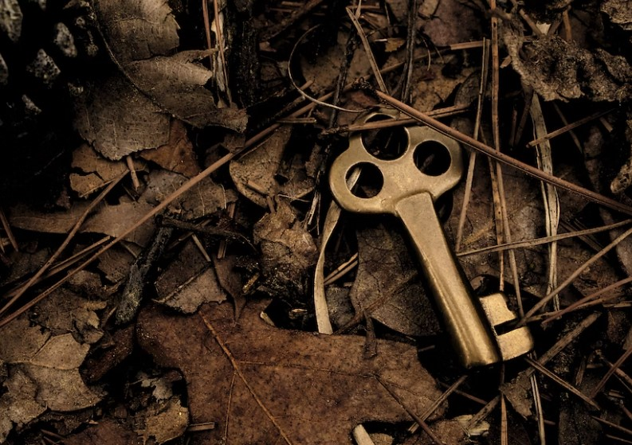

Bring out the thrill-seeker in your guests by setting up a spine-chilling haunted treasure hunt. Create a series of creepy clues leading to hidden treasures scattered around your party venue. Dim the lights and add eerie decorations to create an immersive atmosphere. As the night unfolds, adults will love exploring dark corners, deciphering riddles, and unearthing spooky surprises. Don’t forget to reward the intrepid treasure hunters with Halloween-themed treats or small trinkets to make the experience even more rewarding.

### **2\. Costume Contest**

Unleash your guests’ creativity with a wickedly entertaining costume contest. Encourage everyone to go all out and showcase their most imaginative Halloween get-ups. Create categories such as “Most Creative,” “Scariest,” “Funniest,” and even “Best Couple’s Costume.” Host a mini-fashion show where each participant can flaunt their costumes, and let the guests vote for the winners. Award the victors with spooky trophies or prizes, and revel in the unforgettable spectacle of remarkable costumes.

### **3\. Pumpkin Carving Contest**

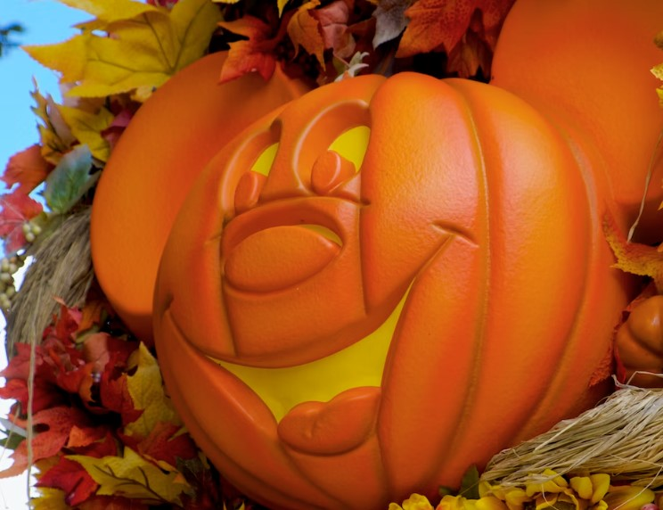

Engage your guests in a friendly and competitive pumpkin carving contest. Provide each participant with a pumpkin and the necessary carving tools. Watch as they channel their inner artists to bring their spookiest or most imaginative designs to life. Set up a designated area for pumpkin displays, and have a panel of judges rate each creation based on creativity, intricacy, and overall impact. Be prepared for the room to be filled with laughter, concentration, and a whole lot of [Halloween pumpkin](https://avada.io/loveable/halloween-pumpkin/) guts!

### **4\. Monster Mash Dance-Off**

Get the Halloween party moving and grooving with a hair-raising Monster Mash dance-off. Create a playlist of classic Halloween tunes or remixes of spooky songs to set the mood. Organize a dance competition where guests can showcase their spookiest, silliest, or most bewitching moves. Provide a dance floor with dim lighting and fog effects to add to the ambiance. Whether it’s a werewolf waltz or a ghostly groove, this dance-off is sure to be a howling success!

### **5\. Kiss, Marry, Kill**

In this fun game, for each round, you’ll toss out the names of three people, whether they are fictional characters or real individuals. The player who’s up must then make a decision on which of the three they’d prefer to kiss, marry, or “kill” (figuratively, of course!). It’s a lighthearted and entertaining way to spark some interesting discussions and reveal everyone’s preferences in a playful manner. 

### **6\. Witch’s Brew Tasting**

Cast a magical spell on your guests with a spellbinding Witch’s Brew tasting experience. Set up a Halloween-themed bar with an array of eerie elixirs, including spooky cocktails and mystical mocktails. Label each concoction with creative and intriguing names, such as “Witches’ Elixir” or “Vampire’s Venom.” Challenge your guests to taste and guess the ingredients of each brew, adding a fun and interactive element to the party. Don’t forget to include some dry ice for a mesmerizing bubbling effect that will leave your guests enchanted.

### **7\. Escape the Haunted Room**

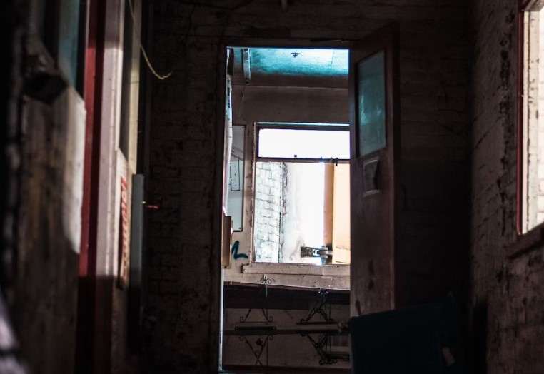

Take your Halloween party to the next level with an immersive haunted escape room experience. Transform a room into a chilling scenario filled with hidden clues, spooky puzzles, and haunting mysteries. Divide your guests into small teams and challenge them to work together to solve the puzzles and “escape” the room before time runs out. As the tension builds, watch as friendships are tested, and the adrenaline-fueled excitement reaches its peak. This thrilling and unforgettable activity will leave your guests talking about your Halloween party for years to come.

### **8\. Murder Mystery Dinner**

Set the stage for a night of intrigue, suspense, and delicious food with a murder mystery dinner. Choose a Halloween-themed murder mystery kit or create your own plot. Assign each guest a role, such as suspects, detectives, or victims, and provide them with character descriptions and clues. As the night unfolds, watch your guests immerse themselves in their roles, interrogating one another, and trying to solve the thrilling whodunit. With secrets and surprises around every corner, this Halloween party game will keep everyone on the edge of their seats.

### **9\. Horror Movie Trivia**

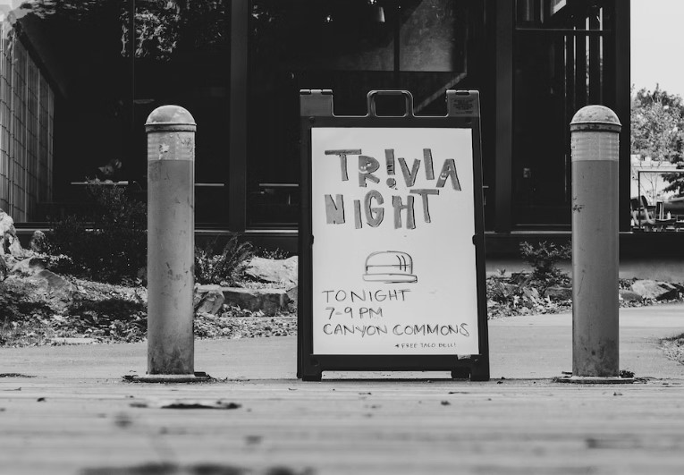

Test your guests’ knowledge of the silver screen’s spookiest tales with a bone-chilling [horror Halloween movie](https://avada.io/loveable/best-halloween-movies/) trivia game. Prepare a list of questions covering classic and contemporary horror films, from slasher flicks to supernatural thrillers. Divide your guests into teams or have a “last person standing” format to add some excitement. The intense competition and friendly banter will make this trivia game a killer addition to your Halloween party.

### **10\. Spider Races**

Inject some laughter and hilarity into your Halloween festivities with a quirky spider race. Create a race track, either on a table or the floor, and place plastic spiders at the starting line. Guests must use straws to blow their spiders across the finish line. The first spider to reach the end wins! Prepare for a spectacle of funny faces, puffing cheeks, and cheering as the creepy crawlies scuttle their way to victory.

### **11\. Bobbing for Apples with a Twist**

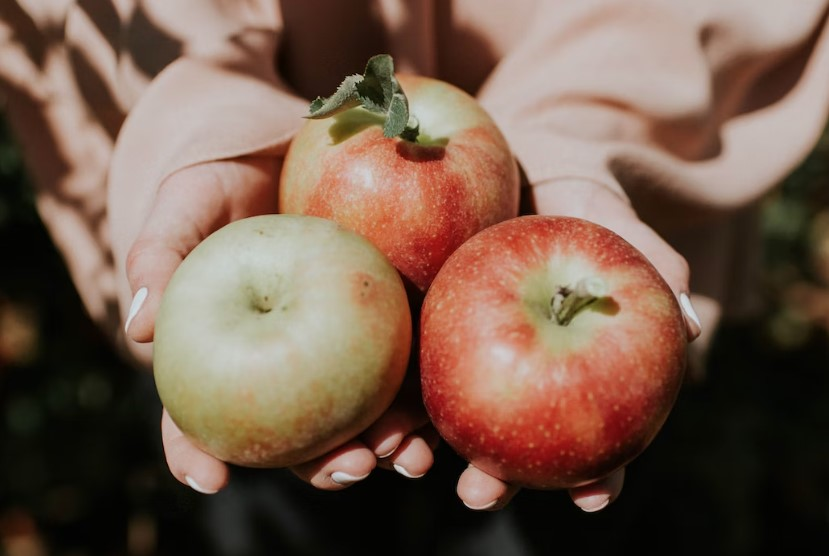

Put a spooky spin on the classic game of bobbing for apples. Fill a large basin or tub with apple-flavored alcoholic beverages, such as apple cider with a splash of rum or apple-flavored schnapps. Guests must use their mouths to try and retrieve the floating apples without using their hands. Not only is it entertaining to watch, but it also adds a tipsy twist to this traditional Halloween activity.

### **12\. Potion-Making Station**

Delight your guests with a magical potion-making station. Set up a table with various colorful ingredients like food coloring, glitter, and dry ice. Provide beakers, cauldrons, and stirring rods to let guests concoct their own spooky elixirs. They can mix and match ingredients to create potions with names like “Witch’s Brew” or “Ghoul’s Gulp.” The hands-on experience will have everyone feeling like a true sorcerer or sorceress!

### **13\. Tarot Card Readings**

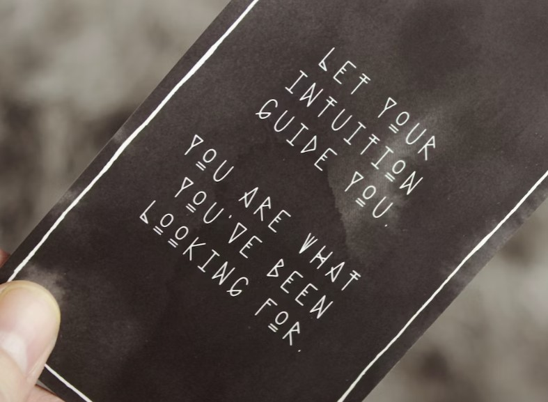

Add an aura of mystery to your Halloween party by hiring a tarot card reader. Guests can take turns having their fortunes read, exploring themes of love, wealth, and spooky encounters. The tarot readings will provide fascinating insights and intriguing conversation topics throughout the night.

### **14\. Halloween Bingo**

Play a Halloween-themed bingo game with custom cards featuring spooky images or words like “witch,” “ghost,” or “candy corn.” Prepare small Halloween-themed prizes for the winners, and watch as the suspense builds with each call of “Bingo!”

### **15\. Mummy Wrap**

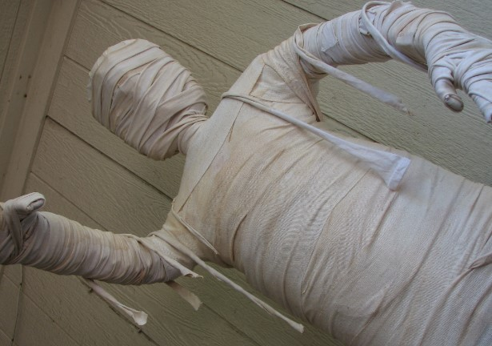

Divide your guests into different teams and challenge them to a mummy wrap contest. Each team must select one member to be the “mummy,” while the rest of the team wraps them in toilet paper to create a spooky-looking mummy. The team with the best-wrapped mummy wins the eerie admiration of all party-goers!

### **16\. Halloween Karaoke**

Bring out the singing spirits with a Halloween-themed karaoke session. Prepare a selection of spooky tunes, like “Thriller” by Michael Jackson or “Monster Mash” by Bobby Pickett. Guests can take turns belting out their favorite Halloween hits and enjoying some ghoulishly good entertainment.

### **17\. Ghost Story Circle**

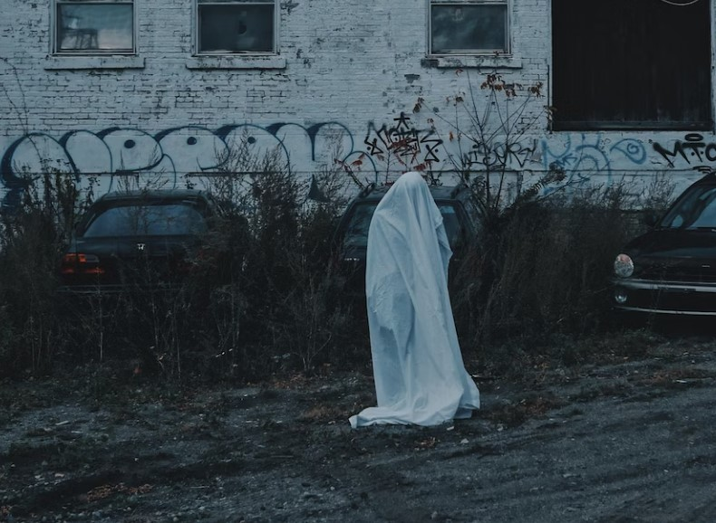

Gather your guests around a dimly lit room and have a ghost story circle. Each person can take turns sharing their scariest or most unsettling ghost stories. For added effect, you can play eerie sound effects or use a flashlight to cast spooky shadows while the stories are being told.

### **18\. Fortune Telling Booth**

Create an alluring fortune-telling booth at your party. Decorate the area with mystical symbols and dim lighting. You can offer palm readings, tarot card readings, or even crystal ball gazing. Guests will love the chance to have their futures foretold and leave with an air of mystery surrounding them.

### **19\. Halloween Charades**

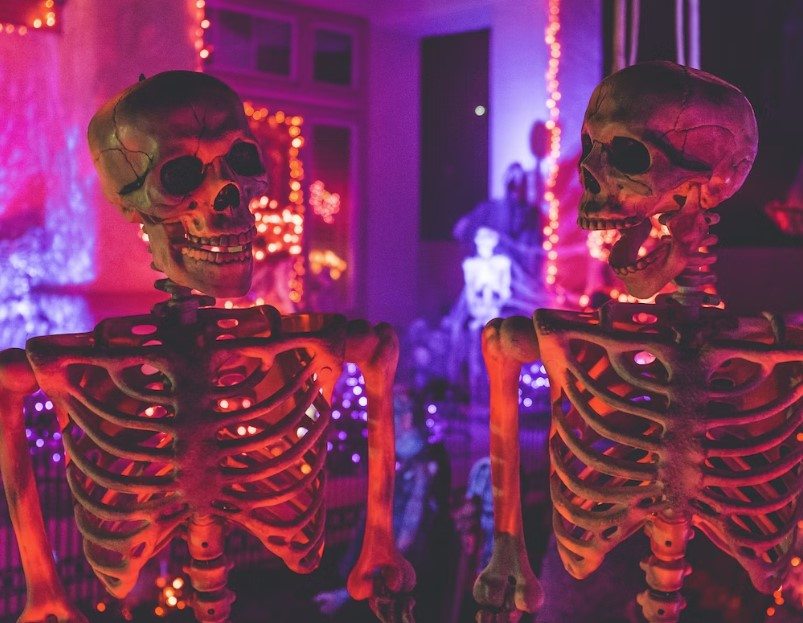

Put a Halloween twist on the classic game of charades by using only spooky movie titles, Halloween-themed words, or iconic monsters and creatures. Watching guests act out their favorite spooky characters will be entertaining for all.

### **20\. Halloween Pictionary**

Keep the artistic spirits alive with a Halloween-themed game of Pictionary. Divide guests into teams, and provide them with drawing boards and markers. Guests must illustrate Halloween-related words or phrases while their teammates try to guess what they’re depicting. Expect a lot of laughter and some unexpected artistic masterpieces!

### **21\. Costume Relay Race**

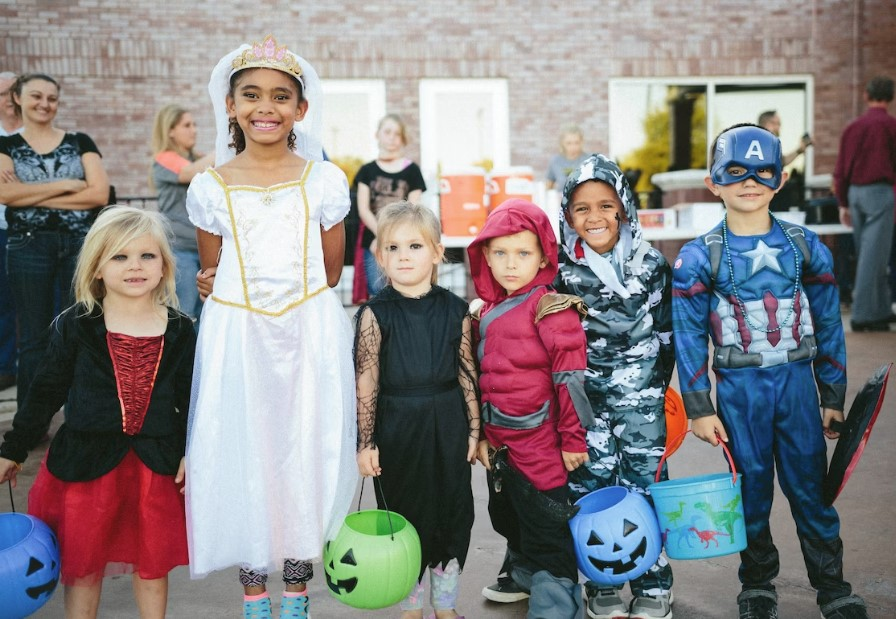

Host a costume relay race that involves quick costume changes. Divide guests into teams and set up stations with different [DIY Halloween costumes](https://avada.io/loveable/blog/diy-halloween-costume-ideas/). The first member of each team must don a costume, run to a designated spot and back, then remove the costume before the next teammate can go. It’s a hilarious race against the clock!

### **22\. Halloween Photo Booth** 

Set up a photo booth area with spooky props, backdrops, and themed accessories for guests to take fun and memorable Halloween-themed pictures. Provide printed copies or digital downloads as keepsakes, so everyone can relive the hauntingly good times.

### **23\. Witch Hat Ring Toss**

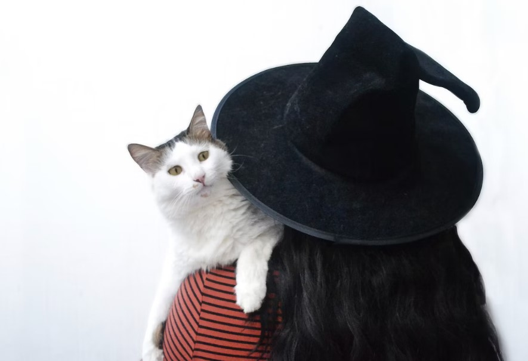

Stack pointed witch hats and challenge guests to a ring toss game. They must toss rings onto the hats’ tips to score points. Add Halloween-themed music and decorations to make it even more enchanting.

### **24\. Halloween Trivia Quiz**

Test your guests’ knowledge of Halloween traditions, myths, and history with a quiz that’s sure to entertain and educate. Prepare a mix of easy and challenging questions, and keep score to declare the ultimate Halloween trivia champion.

### **25\. Pin the Nose on the Jack-O’-Lantern**

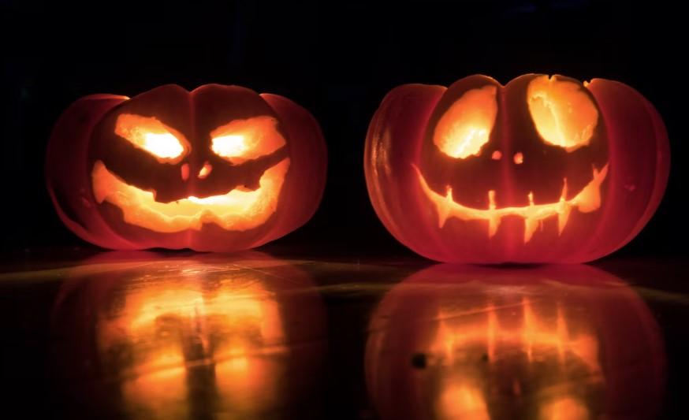

Give the classic “Pin the Tail on the Donkey” game a spooky twist by creating a large Jack-O’-Lantern cutout. Blindfolded guests must try to pin their nose on the Jack-O’-Lantern while their friends cheer them on.

### **26\. Halloween Mad Libs**

Create your own Halloween-themed Mad Libs game for some hilarious and unexpected storytelling. Guests provide random words to fill in the blanks of a spooky story, resulting in comical and unique narratives.

### **27\. Halloween Piñata**

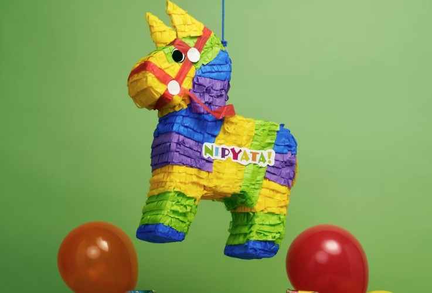

Fill a Halloween-themed piñata with candy and treats, and let guests take turns trying to break it open. Make it even more thrilling by using a blindfold and a broomstick for the swinging action.

### **28\. Candy Corn Guessing Game**

Fill a large jar with delicious candy corn and have guests guess the number of pieces inside. The person with the closest guess wins the jar of candy corn to enjoy or share.

### **29\. Spooky Balloon Pop**

Fill black balloons with Halloween-themed confetti or candy. Guests can take turns popping the balloons for surprises. You can even hide special prizes in a few balloons for extra excitement.

### **30\. Halloween-Themed Beer Pong**

Transform the classic beer pong game with Halloween-themed cups and spooky decorations. Guests will have a blast trying to sink the pong balls into the creepy cups.

### **31\. Glow-in-the-Dark Dance Party** 

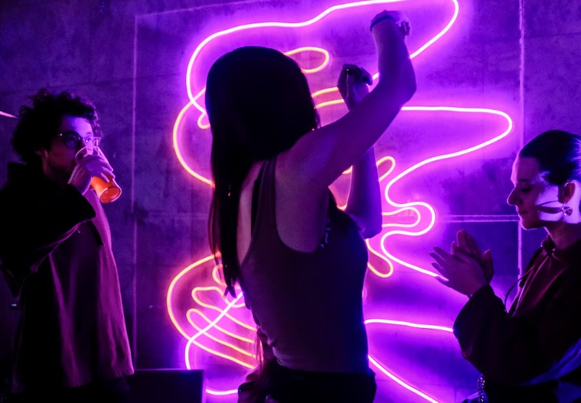

End the night with a bang by turning off the lights, providing glow-in-the-dark accessories, and dancing the night away to eerie tunes. Guests will love the glow-in-the-dark ambiance and the chance to show off their best dance moves under blacklight.

### **32\. Halloween Battle of the Balloons**

Get ready for some laughter-filled fun with this uproarious adult party game! Your friends will engage in a lively race to burst the balloons fastened to each other’s ankles. The catch? You can only use your feet – no hands allowed! And if you’re donning a cumbersome Halloween costume, brace yourself for an extra layer of hilarity and difficulty. The ultimate champion is the one who skillfully safeguards their balloon until the very end.

### **33\. Halloween Movie Master Game**

Get ready to dive into the spooky spirit with this Halloween movie scene recreation game designed for adults. Get your creative juices flowing as you put in a little effort to set the stage. Transform a corner of your house into a scene straight out of a well-known Halloween or horror flick. As your guests step into this eerie ambiance, challenge them to unravel the mystery and guess which iconic movie you’ve brought to life. It’s a spine-tingling experience that adds extra excitement to your Halloween festivities!

### **34\. Hide-and-Seek for Adult** 

Elevate the excitement with a spine-chilling spin on the traditional hide-and-seek, tailor-made for adults. Begin by orchestrating a classic hide-and-seek session, where you take on the role of the eager seeker. Now, here comes the hair-raising twist – don an exceptionally eerie costume that’s bound to send shivers down your guests’ spines once you track them down.

Dim the lights for an added layer of suspense, and one by one, armed with a flashlight, embark on the quest to uncover the cleverly concealed players. As you reveal each hiding guest, escort them to a designated room dubbed “the graveyard,” where they’ll stretch out like eerily lifelike corpses. And to sweeten the suspense, reserve a special prize for the ultimate champion – the very last person to be discovered.

### **35\. Head Waiter Game** 

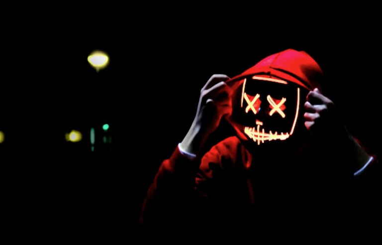

Divide your guests into two teams, setting the stage for a thrilling showdown. Equip each team with a balloon, cleverly transformed into a “head,” perched atop a plate like a diligent waiter’s serving. Picture this: an obstacle course brimming with suspense awaits!

As the relay unfolds, each participant skillfully navigates the course, all while ensuring the precarious balloon “head” remains steady upon the plate. But here’s where it gets intriguingly eerie: at specific junctures along the course, the baton – or in this case, the balloon plate – is passed on to a fellow teammate, akin to a chilling torchbearer.

### **36\. Halloween Charades**

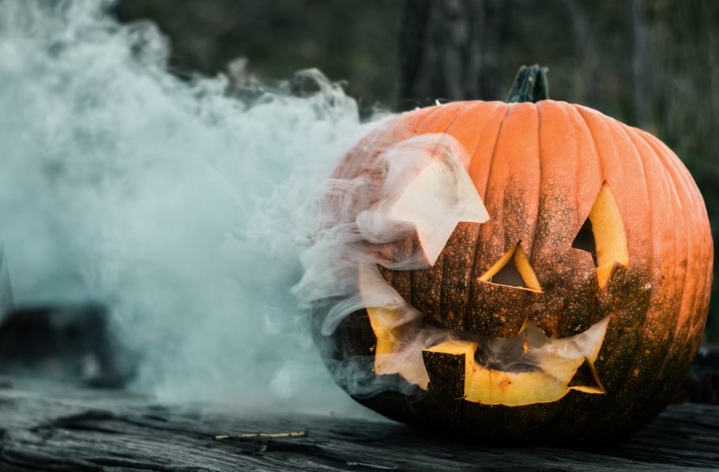

Elevate your Halloween gathering with a ghoulishly entertaining charades game! This eerie variation of the classic charades involves the clever incorporation of Halloween-themed phrases. But here’s where the fun intensifies – participants can also delve into the realm of chilling cinema by acting out iconic Halloween movie titles. Imagine the thrill as your costumed guests bring these eerie scenes to life through their imaginative gestures and clues.

### **37\. The Grave Keeper**

If there are zombie fans at your Halloween party, they’ll enjoy the Grave Keeper game. Choose one guest as the keeper, others pretend to be undead. Don’t move when the keeper looks, but move when they’re not. Goal: stand up without getting caught by the keeper.

## **Bottom Line** 

In 2023, these top **Halloween party games for adults** guarantee a spook-tacular time. From eerie challenges to creative relays, laughter, and suspense are in store. Get ready to elevate your celebration with hauntingly delightful memories that will linger long after the night is over.

- [35+ Fun Halloween Party Games For Adults To Create Lasting Memories](https://avada.io/loveable/blog/halloween-party-games-adults/#wp-block-heading-2-4)
    - [1\. Haunted Treasure Hunt](https://avada.io/loveable/blog/halloween-party-games-adults/#wp-block-heading-3-5)
    - [2\. Costume Contest](https://avada.io/loveable/blog/halloween-party-games-adults/#wp-block-heading-3-8)
    - [3\. Pumpkin Carving Contest](https://avada.io/loveable/blog/halloween-party-games-adults/#wp-block-heading-3-10)
    - [4\. Monster Mash Dance-Off](https://avada.io/loveable/blog/halloween-party-games-adults/#wp-block-heading-3-13)
    - [5\. Kiss, Marry, Kill](https://avada.io/loveable/blog/halloween-party-games-adults/#wp-block-heading-3-15)
    - [6\. Witch’s Brew Tasting](https://avada.io/loveable/blog/halloween-party-games-adults/#wp-block-heading-3-18)
    - [7\. Escape the Haunted Room](https://avada.io/loveable/blog/halloween-party-games-adults/#wp-block-heading-3-20)
    - [8\. Murder Mystery Dinner](https://avada.io/loveable/blog/halloween-party-games-adults/#wp-block-heading-3-23)
    - [9\. Horror Movie Trivia](https://avada.io/loveable/blog/halloween-party-games-adults/#wp-block-heading-3-25)
    - [10\. Spider Races](https://avada.io/loveable/blog/halloween-party-games-adults/#wp-block-heading-3-28)
    - [11\. Bobbing for Apples with a Twist](https://avada.io/loveable/blog/halloween-party-games-adults/#wp-block-heading-3-30)
    - [12\. Potion-Making Station](https://avada.io/loveable/blog/halloween-party-games-adults/#wp-block-heading-3-33)
    - [13\. Tarot Card Readings](https://avada.io/loveable/blog/halloween-party-games-adults/#wp-block-heading-3-35)
    - [14\. Halloween Bingo](https://avada.io/loveable/blog/halloween-party-games-adults/#wp-block-heading-3-38)
    - [15\. Mummy Wrap](https://avada.io/loveable/blog/halloween-party-games-adults/#wp-block-heading-3-40)
    - [16\. Halloween Karaoke](https://avada.io/loveable/blog/halloween-party-games-adults/#wp-block-heading-3-43)
    - [17\. Ghost Story Circle](https://avada.io/loveable/blog/halloween-party-games-adults/#wp-block-heading-3-45)
    - [18\. Fortune Telling Booth](https://avada.io/loveable/blog/halloween-party-games-adults/#wp-block-heading-3-48)
    - [19\. Halloween Charades](https://avada.io/loveable/blog/halloween-party-games-adults/#wp-block-heading-3-50)
    - [20\. Halloween Pictionary](https://avada.io/loveable/blog/halloween-party-games-adults/#wp-block-heading-3-53)
    - [21\. Costume Relay Race](https://avada.io/loveable/blog/halloween-party-games-adults/#wp-block-heading-3-55)
    - [22\. Halloween Photo Booth](https://avada.io/loveable/blog/halloween-party-games-adults/#wp-block-heading-3-58) 
    - [23\. Witch Hat Ring Toss](https://avada.io/loveable/blog/halloween-party-games-adults/#wp-block-heading-3-60)
    - [24\. Halloween Trivia Quiz](https://avada.io/loveable/blog/halloween-party-games-adults/#wp-block-heading-3-63)
    - [25\. Pin the Nose on the Jack-O’-Lantern](https://avada.io/loveable/blog/halloween-party-games-adults/#wp-block-heading-3-65)
    - [26\. Halloween Mad Libs](https://avada.io/loveable/blog/halloween-party-games-adults/#wp-block-heading-3-68)
    - [27\. Halloween Piñata](https://avada.io/loveable/blog/halloween-party-games-adults/#wp-block-heading-3-70)
    - [28\. Candy Corn Guessing Game](https://avada.io/loveable/blog/halloween-party-games-adults/#wp-block-heading-3-73)
    - [29\. Spooky Balloon Pop](https://avada.io/loveable/blog/halloween-party-games-adults/#wp-block-heading-3-75)
    - [30\. Halloween-Themed Beer Pong](https://avada.io/loveable/blog/halloween-party-games-adults/#wp-block-heading-3-78)
    - [31\. Glow-in-the-Dark Dance Party](https://avada.io/loveable/blog/halloween-party-games-adults/#wp-block-heading-3-80) 
    - [32\. Halloween Battle of the Balloons](https://avada.io/loveable/blog/halloween-party-games-adults/#wp-block-heading-3-83)
    - [33\. Halloween Movie Master Game](https://avada.io/loveable/blog/halloween-party-games-adults/#wp-block-heading-3-85)
    - [34\. Hide-and-Seek for Adult](https://avada.io/loveable/blog/halloween-party-games-adults/#wp-block-heading-3-88) 
    - [35\. Head Waiter Game](https://avada.io/loveable/blog/halloween-party-games-adults/#wp-block-heading-3-92) 
    - [36\. Halloween Charades](https://avada.io/loveable/blog/halloween-party-games-adults/#wp-block-heading-3-96)
    - [37\. The Grave Keeper](https://avada.io/loveable/blog/halloween-party-games-adults/#wp-block-heading-3-99)
- [Bottom Line](https://avada.io/loveable/blog/halloween-party-games-adults/#wp-block-heading-2-101) 

### [Blake Simpson](https://avada.io/loveable/author/blake/)

Hi, I'm Blake from Loveable. I help people find perfect gifts for occasions like anniversaries and weddings. I also write a blog about holidays, sharing insights to make them more meaningful. Let's create unforgettable moments together!

- [Twitter](https://twitter.com/intent/tweet)
- [Facebook](https://www.facebook.com/sharer/sharer.php)
- [instagram](https://avada.io/loveable/blog/halloween-party-games-adults/)
- [pinterest](https://www.pinterest.com/loveablellc/)

## Related Posts

[### 120+ Christian Birthday Wishes To Spread Your Love](https://avada.io/loveable/blog/christian-birthday-wishes/) 

[

### 35 Best 70th Birthday Ideas To Celebrate The Special Milestone

](https://avada.io/loveable/blog/70th-birthday-ideas/)

[

### 50 Best 30th Birthday Decorations for a Remarkable Birthday Bash

](https://avada.io/loveable/blog/30th-birthday-decorations/)

[

### 40 Delicious Vegan Christmas Desserts to Delight Your Palate

](https://avada.io/loveable/blog/vegan-christmas-desserts/)

[

### 60 Christmas Team Building Activities to Boost Workplace Spirit

](https://avada.io/loveable/blog/christmas-team-building-activities/)
