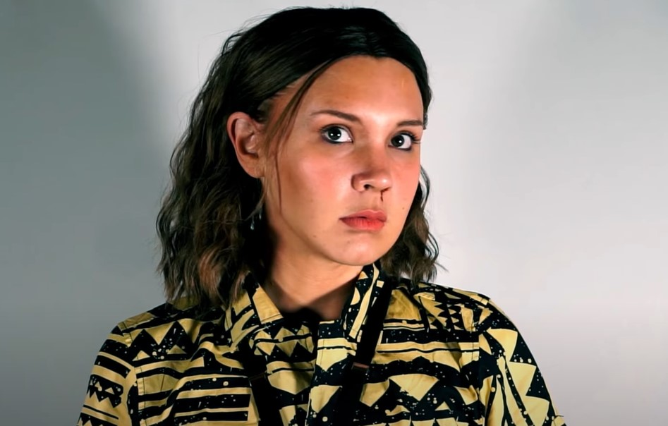
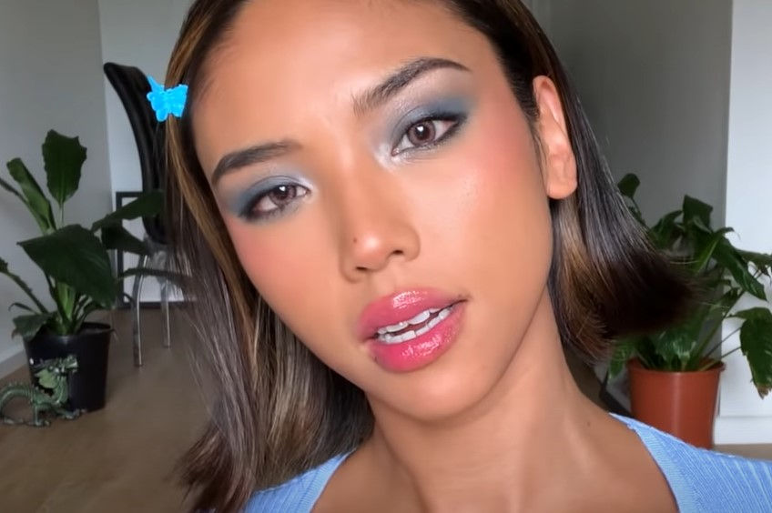

This article has been written and researched by our expert Loveable through a precise methodology. [Learn more about our methodology](https://avada.io/loveable/our-methodological.html)

[Loveable](https://avada.io/loveable/) > [Blog](https://avada.io/loveable/blog/) > [Holiday](https://avada.io/loveable/holiday/)

# 35 Easy Halloween Makeup Ideas To Try For 2023

Written by [Blake Simpson](https://avada.io/loveable/author/blake/) Last Updated on October 03, 2023

- [35 Easy Halloween Makeup Ideas For A Fancy Halloween Look](https://avada.io/loveable/blog/easy-halloween-makeup-ideas/#wp-block-heading-2-3)
    - [Mad Scientist Makeup](https://avada.io/loveable/blog/easy-halloween-makeup-ideas/#wp-block-heading-3-4)
    - [David Bowie Halloween Makeup Idea](https://avada.io/loveable/blog/easy-halloween-makeup-ideas/#wp-block-heading-3-7)
    - [Carmen San Diego Makeup](https://avada.io/loveable/blog/easy-halloween-makeup-ideas/#wp-block-heading-3-10)
    - [Eleven from Stranger Things Makeup](https://avada.io/loveable/blog/easy-halloween-makeup-ideas/#wp-block-heading-3-13)
    - [Spider-Eye Halloween Makeup Idea](https://avada.io/loveable/blog/easy-halloween-makeup-ideas/#wp-block-heading-3-16)
    - [Bridgerton Makeup](https://avada.io/loveable/blog/easy-halloween-makeup-ideas/#wp-block-heading-3-19)
    - [Comic Book Effect Makeup](https://avada.io/loveable/blog/easy-halloween-makeup-ideas/#wp-block-heading-3-22)
    - [Skull Halloween Makeup Idea](https://avada.io/loveable/blog/easy-halloween-makeup-ideas/#wp-block-heading-3-25)
    - [Black Swan Makeup](https://avada.io/loveable/blog/easy-halloween-makeup-ideas/#wp-block-heading-3-28)
    - [Fairy Makeup](https://avada.io/loveable/blog/easy-halloween-makeup-ideas/#wp-block-heading-3-31) 
    - [Scarecrow Halloween Makeup Idea](https://avada.io/loveable/blog/easy-halloween-makeup-ideas/#wp-block-heading-3-34)
    - [Violet Makeup from Charlie and the Chocolate Factory](https://avada.io/loveable/blog/easy-halloween-makeup-ideas/#wp-block-heading-3-37)
    - [Queen Of Hearts Makeup](https://avada.io/loveable/blog/easy-halloween-makeup-ideas/#wp-block-heading-3-40)
    - [Barbie Halloween Makeup Idea](https://avada.io/loveable/blog/easy-halloween-makeup-ideas/#wp-block-heading-3-43)
    - [Mermaid Halloween Makeup Idea](https://avada.io/loveable/blog/easy-halloween-makeup-ideas/#wp-block-heading-3-46)
    - [Cupid Makeup](https://avada.io/loveable/blog/easy-halloween-makeup-ideas/#wp-block-heading-3-49)
    - [Marilyn Monroe Makeup](https://avada.io/loveable/blog/easy-halloween-makeup-ideas/#wp-block-heading-3-52)
    - [Zombie Halloween Makeup Idea](https://avada.io/loveable/blog/easy-halloween-makeup-ideas/#wp-block-heading-3-55)
    - [Vampire Makeup](https://avada.io/loveable/blog/easy-halloween-makeup-ideas/#wp-block-heading-3-58)
    - [Emma Stone’s Cruella Makeup](https://avada.io/loveable/blog/easy-halloween-makeup-ideas/#wp-block-heading-3-61)
    - [Cheetah Makeup](https://avada.io/loveable/blog/easy-halloween-makeup-ideas/#wp-block-heading-3-64)
    - [Sunflower Halloween Makeup Idea](https://avada.io/loveable/blog/easy-halloween-makeup-ideas/#wp-block-heading-3-67)
    - [Angel Makeup](https://avada.io/loveable/blog/easy-halloween-makeup-ideas/#wp-block-heading-3-70)
    - [‘90s Pamela Anderson Makeup](https://avada.io/loveable/blog/easy-halloween-makeup-ideas/#wp-block-heading-3-73)
    - [Werewolf Halloween Makeup Idea](https://avada.io/loveable/blog/easy-halloween-makeup-ideas/#wp-block-heading-3-76)
    - [Y2K Makeup](https://avada.io/loveable/blog/easy-halloween-makeup-ideas/#wp-block-heading-3-79)
    - [Bratz Doll Halloween Makeup Idea](https://avada.io/loveable/blog/easy-halloween-makeup-ideas/#wp-block-heading-3-82)
    - [Space Cowboy Makeup](https://avada.io/loveable/blog/easy-halloween-makeup-ideas/#wp-block-heading-3-85)
    - [Poison Ivy Halloween Makeup Idea](https://avada.io/loveable/blog/easy-halloween-makeup-ideas/#wp-block-heading-3-88)
    - [Cat Makeup](https://avada.io/loveable/blog/easy-halloween-makeup-ideas/#wp-block-heading-3-91)
    - [Frankenstein Halloween Makeup Idea](https://avada.io/loveable/blog/easy-halloween-makeup-ideas/#wp-block-heading-3-94)
    - [The Mad Hatter Makeup](https://avada.io/loveable/blog/easy-halloween-makeup-ideas/#wp-block-heading-3-97)
    - [Blood-Splatter Makeup](https://avada.io/loveable/blog/easy-halloween-makeup-ideas/#wp-block-heading-3-100)
    - [Dead Barbie Makeup](https://avada.io/loveable/blog/easy-halloween-makeup-ideas/#wp-block-heading-3-103)
    - [Carrie’s Halloween Makeup Idea](https://avada.io/loveable/blog/easy-halloween-makeup-ideas/#wp-block-heading-3-106)
    - [Joker Makeup](https://avada.io/loveable/blog/easy-halloween-makeup-ideas/#wp-block-heading-3-109)
- [Bottom Line](https://avada.io/loveable/blog/easy-halloween-makeup-ideas/#wp-block-heading-2-115)

It takes a lot of time and effort to put together a costume and makeup for the spooky season, which is why we suggest keeping things simple with fun and easy Halloween makeup ideas. For your [perfect outfit this October](https://avada.io/loveable/halloween-costume-ideas/), we’ve rounded up **35 easy Halloween makeup ideas** that are sure to make you stand out from the crowd. Whether you want to be a witch, a zombie, or a clown, these makeup ideas are an ideal way to get creative and make your Halloween look truly special.

To those naysayers who insist you cannot pull off a cheap Halloween costume within a few hours, these easy Halloween makeup ideas will make them regret their words. The best thing is…? You may already have all the products on hand.

## **35 Easy Halloween Makeup Ideas For A Fancy Halloween Look**

### **Mad Scientist Makeup**

In this easy Halloween makeup idea from YouTuber [Cydnee Black](https://www.youtube.com/c/CydneeBlack), you will look like a creepy scientist after an experiment has gone wrong. You will need a pair of protective glasses to achieve this look. First, trace black eyeshadow along the outside rim of your glasses and blend the lines out using a brush. You can add darker smoke around your face to create a haphazard effect.

### **David Bowie Halloween Makeup Idea**

[Ziggy Stardust](https://www.youtube.com/watch?v=vvZ5fLjLy0Y), David Bowie’s alter-ego, is ideal for [last-minute Halloween costumes](https://avada.io/loveable/last-minute-halloween-costumes-women/) since it does not really require clothes. For a classic Bowie look, powder your face before applying the face paint, then use water-based paints that will stay glossy all night long.

### **Carmen San Diego Makeup**

A strong [black liquid eyeliner](https://ulta.ztk5.net/c/3006986/164999/3037?u=https%3A%2F%2Fwww.ulta.com%2Fstay-all-day-waterproof-liquid-eyeliner%3FproductId%3DxlsImpprod1840049&subId1=cos&subid3=xid:fr1689340804780fnh) is the basics you need for this easy Halloween makeup idea by drag queen [Krisa Gonna](https://www.youtube.com/watch?v=iPnpH4FIPvY). For your black Carmen brows, cover your brows with concealer and blend them into your skin tone with a spoolie. The minute you walk into their midst with this costume, everyone will start singing the theme song for sure. Be prepared!

### **Eleven from Stranger Things Makeup**

Still can’t get enough of Stranger Things 4? With this simple [Eleven makeup](https://www.youtube.com/watch?v=LVtlliN5g6U) from season 3, you just need fake blood under your nose. The rest of your makeup should be as natural as possible; just add clear brow gel to your eyebrows and a little brown mascara to your top lashes. You can make a huge style statement with an 80s-printed button-down and beach waves.

### **Spider-Eye Halloween Makeup Idea**

If you are not afraid of spiders, this easy Halloween makeup idea is perfect for some drama on Halloween night. It is super easy to achieve this [creepy-crawly eye](https://www.youtube.com/watch?v=gvrnA-v0mjU) using all the liquid [eye liners](https://avada.io/loveable/blog/halloween-eyeliner/) you have at home. And with some patience, of course. Free-hand stroke lines across your lid will be required, along with fanned-out lashes.

### **Bridgerton Makeup**

Lady Whistledown would absolutely go wow for this pink-toned makeup look. For the Bridgerton ladies’ sweet and natural look like YouTuber [Sophie Schumann](https://www.youtube.com/watch?v=np1eejqOw4U), blend some rose-toned eyeshadows all over your eyes and cheeks. Use a luminous primer and lots of highlighter on your cheekbones to keep your skin glowy.

### **Comic Book Effect Makeup**

Make the most of the spooky season with this pop-art look from [MaggieA](https://www.youtube.com/watch?v=gtSFpArx0pw). If you want your comic-book makeup to look animated, use black [face paint](https://avada.io/loveable/blog/halloween-face-paint-ideas/) to outline certain parts of your face and white dots on others. When the white dots are adorned with rhinestones, the effect will be like a comic-book page coming to life.

### **Skull Halloween Makeup Idea**

You can never go wrong with a skull look for an easy Halloween makeup idea. To make your skully look more realistic, this creator recommends using white foundation or face paint after creating the outline of the mouth and teeth.

### **Black Swan Makeup**

12 years later, is Black Swan still roaming your mind rent-free? Get in the Halloween spirit with black eyeliner-only Halloween makeup from Youtuber [Courtney Little Makeup](https://www.youtube.com/watch?v=hUwW2DfvPKU). With this costume, you will not have to worry about doing your brows since you’ll be drawing over them with black liner. Using a liquid eyeliner pen to outline the shape, then a flat brush and gel eyeliner pot to fill in large areas will save you a lot of time.

### **Fairy Makeup** 

Bringing it back to basics, shall we? There is nothing more classic than a fairy costume. Try something a bit different with your glam than just popping on a pair of Amazon wings. Get yourself inspired with this fairy makeup look from Youtuber [Mei Yan](https://www.youtube.com/watch?v=CPhyERPn20E). You will need a bunch of shimmers and some floral appliques, if you really want to go the extra mile.

### **Scarecrow Halloween Makeup Idea**

Creator [Suezochan](https://www.youtube.com/watch?v=HSCGgS7caBE)‘s scarecrow is not the typical warm-toned guy you would see at a pumpkin patch. You can make your Halloween look more dramatic with the usage of light oranges and blues since she recommends going a bit more messy when applying makeup. Any eyeshadow you have at home will do.

### **Violet Makeup from Charlie and the Chocolate Factory**

This easy Halloween makeup idea from [Julia Salvia](https://www.youtube.com/watch?v=J56f4AXijKc) only requires blue makeup on the center of your face. As Violet’s face is almost completely blue in Charlie and the Chocolate Factory, you can do the toned-down version and pair it with any makeup look that you like. To create the same effect, use colored eyeliner or cream eyeshadow and blend it all over your nose.

### **Queen Of Hearts Makeup**

This look from Youtuber [MASKARA](https://www.youtube.com/watch?v=SrJQjuk6ZeU) involves a bit of arts and [crafts expertise](https://avada.io/loveable/blog/easy-halloween-craft-ideas/), as well as some makeup skills. The tutorial is perfect, but it can be customized to suit your style. You can cut the fake blood and ditch the décolletage makeup if you wish. However, the deck of cards headband is essential for a complete look. 

### **Barbie Halloween Makeup Idea**

Halloween is the perfect time to rock Barbie’s adorable look. Put on a blonde wig, wear a pink dress, and follow this step-by-step pink eye makeup tutorial from Lashay’s Glamz. You can also have your other half dress up as a very spray-tanned Ryan Gosling for a couple Halloween costumes.

### **Mermaid Halloween Makeup Idea**

Get this Halloween look from [Amy-Rose Walker](https://www.youtube.com/watch?v=YtQL9tUgVRw&t=4s) by starting with a glam makeup routine. After applying a thin line of blue eyeshadow under your eyes, apply blue and green glitter around the eyeshadow and upward toward your temples.

### **Cupid Makeup**

In this easy Halloween makeup idea, red is the color of choice: red lipstick, red blush, and red eyeliner. You can also add your own touch with a white graphic line above your crease with a red heart on one side, as [Glownicky](https://www.youtube.com/watch?v=98MXj_ZZv2E) did above.

### **Marilyn Monroe Makeup**

As a result of the film Blonde starring Ana De Armas, Marilyn will be everywhere this Halloween. Make it Marilyn’s way this October with red lipstick, winged eyeliner, contour, neutral eyeshadow, and her iconic beauty mark. Do not worry if this makeup appears a bit harsh: Makeup artist Jordi of itslikelymakeup suggests using a translucent powder all over the face to soften the edges.

### **Zombie Halloween Makeup Idea**

The zombie look is all about intense shadows and highlights, so it is time to pull out that contour palette you barely use. To get that monstrous look, apply a full-coverage foundation two to three shades lighter than your natural skin tone, then contour your nose, cheekbones, and temples with a cool-toned contour. To finish off the look, Youtuber [Melissa Alatorre](https://www.youtube.com/watch?v=ptx7iNE_gU8) used red lipstick and smokey eyeshadow to mimic blood around her mouth.

### **Vampire Makeup**

Is Halloween wouldn’t be Halloween without some vampire makeup? Creator [Layla Rose](https://www.youtube.com/watch?v=Kit-LcMg3cg) shows us how to make this Halloween makeup idea even scarier with thick, smudged, smoky eyes and red novelty contacts.

### **Emma Stone’s Cruella Makeup**

Thanks to Emma Stone’s Cruella, Cruella de Vil makeup tutorials are everywhere online, but most are complicated to recreate if you are a makeup beginner. To cash in on Cruella vibes, YouTuber [Laura Gilbert](https://www.youtube.com/watch?v=iSaHK58-aeM) displays red lips, smokey eyes, and powdered skin, all without having to glue on your eyebrows.

### **Cheetah Makeup**

Cheetah makeup is sensational for Halloween. With this easy Halloween makeup idea from [Kayla Marie](https://www.youtube.com/watch?v=EL74osaAv2c), ears are totally optional. You can make some squiggles around your temples using a no-smudge eyeliner. Put on a black lip, fill in the spots with champagne eyeshadow, and you’re all set!

### **Sunflower Halloween Makeup Idea**

If you are looking for something cute this Halloween, Alexandra Anele’s sunflower-themed eye look is the one for you. Use yellow eyeliner to sketch out the flower petals after applying an eye primer (a must to keep this look intact til midnight). Then, apply yellow eye paint to each petal and deepen it using a brown eyeshadow stick.

### **Angel Makeup**

Make yourself an angel in this easy Halloween makeup idea from Youtuber [Tracey Does Makeup](https://www.youtube.com/watch?v=i3uD8P2BRaE) this October. You can apply eyeliner within minutes, and it works for all eye shapes. Besides, who can resist the opportunity to dress up with sparkles?

### **‘90s Pamela Anderson Makeup**

The beauty icon Pamela Anderson makes an excellent ’90s bombshell costume, whether you watched Pam and Tommy or not. You can DIY skinny brows by covering them first with the glue stick method (watch [Jackie Wyers’ tutorial](https://www.youtube.com/watch?v=92Exu4CeZ7E) for inspiration) or by drawing a thin line through the brow’s tail. Also, it wouldn’t be complete without the blonde wig!

### **Werewolf Halloween Makeup Idea**

This easy Halloween makeup idea is for all Twilight fans out there! For the lifted eye look like Youtuber [Kelsie Kristine](https://www.youtube.com/watch?v=HYX7C3HALkI), you will need concealer and powder to conceal the tail of your natural brows. Then, use a dark eyebrow pencil to draw straight and thick eyebrows. Adding a widow’s peak with a brow pomade will also intensify the wolf vibes.

### **Y2K Makeup**

Rachel Tee Tyler’s tutorial, inspired by early 2000s makeup trends, will give you the shimmeriest Halloween makeup look ever. Put on those tube tops, and Hollister tiered skirts if you still have them in your closet! Finish off the look with a glossy lip, and you’ll be sure to turn heads this Halloween.

### **Bratz Doll Halloween Makeup Idea**

It seems as if there are two types of people in this world: those who grew up playing with Barbies and those who grew up playing with Bratz dolls. Try this makeup look from [TianaCosmetics](https://www.youtube.com/watch?v=ocHE8NBMuVU) to pay tribute to the most fashionable group of dolls of all time. Choose bold colors for your eyeshadow, and do not be afraid to mix and match. Finish off the look with a glossy lip color and you are ready to take on the world like the Bratz dolls.

### **Space Cowboy Makeup**

A Western glam cowboy meets an out-of-this-world alien with this easy Halloween makeup idea. Youtuber [Amy Serrano](https://www.youtube.com/watch?v=k9bHF4hKzAA) shows how to make your look pop with glittery eyeshadow shades and shiny lipgloss. Add a cowboy hat and a bandana to complete the costume.

### **Poison Ivy Halloween Makeup Idea**

There’s nothing more Halloween-y than an over-the-top brow moment. Making poison ivy is the perfect excuse to smudge a bright green all over your brows. With reds and yellows, [Charisma Star](https://www.youtube.com/watch?v=aBJfnQXLWn4) gives the iconic Gotham a new twist away from its usual greens.

### **Cat Makeup**

In [Lucy Oriole](https://www.youtube.com/watch?v=H6pL2F5Suec)‘s makeup tutorial, three whiskers are taken to the next level. With her purr-fect cat eye makeup, she also adds jet-black lips and freckles for a complete look. Finally, don’t forget to grab those cat ears from middle school!

### **Frankenstein Halloween Makeup Idea**

Even though you forgot to get your Halloween costume, you can still look like you put a great deal of effort into your look with face paint. This easy Halloween makeup idea from [Marjory Adelaida](https://www.youtube.com/watch?v=TAfalCxDB20) shows how to create your Frankenstein look in no time. The result will be dramatic, with green face paint, fake blood, and stitches.

### **The Mad Hatter Makeup**

If you enjoy playing with colors, now is your chance. To achieve this breathtaking Mad Hatter look like Youtuber [Victoria Lyn](https://www.youtube.com/watch?v=Ie1-dqtvoXI), use white face paint and blend your favorite eyeshadow around the cheekbones and eyes. Applying fake eyelashes and glitter under the eyes will give your eyes a little drama.

### **Blood-Splatter Makeup**

Those who binge-watched Dexter will love this easy Halloween makeup idea from [Giulianna Maria](https://www.youtube.com/watch?v=vEpK64sXiqA). First, apply white eyeliner all over your eyelid, then use a white setting powder to set the makeup in place. Use a paper towel with a hole cut out to create a shield around your eye if you do not want to ruin the makeup elsewhere. After mixing some water into the red pigment, use a small eyeshadow brush to flick the wet mixture onto the eye area.

### **Dead Barbie Makeup**

Wouldn’t this scary, RIP Barbie version be more your style? By combining liquid latex and special effects makeup, [Roxette Arisa](https://www.youtube.com/watch?v=LAbsKf47v2A) brought the classic pink Barbie look to a whole new level. For a last-minute version, you can easily achieve this look by smearing red and black face paint around your mouth.

### **Carrie’s Halloween Makeup Idea**

You would need to order at least a vat of fake blood on Amazon for a Carrie costume this Halloween. Rather than dousing your whole face in blood, YouTuber [LesleyMarie1213](https://www.youtube.com/watch?v=wkExc_KFxHk) created realistic blood splatters with only red liquid lipstick and a toothbrush. This technique is a great way to create a terrifying Carrie look without having to spend a lot of money.

### **Joker Makeup**

When it comes to Halloween, if you want to look creepy without being too creepy, this is the look you are looking for. With face jewels on the eyelid, YouTuber [Jasmine Brown](https://www.youtube.com/watch?v=eovz97RX17U) recreates the look of the infamous Joker in an entirely new way.

**Related:**

- [Halloween Eyeliner](https://avada.io/loveable/halloween-eyeliner/)

- [Halloween Hairstyles](https://avada.io/loveable/halloween-hairstyles/)

## **Bottom Line**

Anyone looking to get creative without spending too much time on complicated makeup looks will love these **easy Halloween makeup ideas**. So this year, why not experiment with one of these ideas and elevate your Halloween costume to the next level? With a little bit of makeup and a lot of imagination, you’ll be ready to haunt the night in style.

- [35 Easy Halloween Makeup Ideas For A Fancy Halloween Look](https://avada.io/loveable/blog/easy-halloween-makeup-ideas/#wp-block-heading-2-3)
    - [Mad Scientist Makeup](https://avada.io/loveable/blog/easy-halloween-makeup-ideas/#wp-block-heading-3-4)
    - [David Bowie Halloween Makeup Idea](https://avada.io/loveable/blog/easy-halloween-makeup-ideas/#wp-block-heading-3-7)
    - [Carmen San Diego Makeup](https://avada.io/loveable/blog/easy-halloween-makeup-ideas/#wp-block-heading-3-10)
    - [Eleven from Stranger Things Makeup](https://avada.io/loveable/blog/easy-halloween-makeup-ideas/#wp-block-heading-3-13)
    - [Spider-Eye Halloween Makeup Idea](https://avada.io/loveable/blog/easy-halloween-makeup-ideas/#wp-block-heading-3-16)
    - [Bridgerton Makeup](https://avada.io/loveable/blog/easy-halloween-makeup-ideas/#wp-block-heading-3-19)
    - [Comic Book Effect Makeup](https://avada.io/loveable/blog/easy-halloween-makeup-ideas/#wp-block-heading-3-22)
    - [Skull Halloween Makeup Idea](https://avada.io/loveable/blog/easy-halloween-makeup-ideas/#wp-block-heading-3-25)
    - [Black Swan Makeup](https://avada.io/loveable/blog/easy-halloween-makeup-ideas/#wp-block-heading-3-28)
    - [Fairy Makeup](https://avada.io/loveable/blog/easy-halloween-makeup-ideas/#wp-block-heading-3-31) 
    - [Scarecrow Halloween Makeup Idea](https://avada.io/loveable/blog/easy-halloween-makeup-ideas/#wp-block-heading-3-34)
    - [Violet Makeup from Charlie and the Chocolate Factory](https://avada.io/loveable/blog/easy-halloween-makeup-ideas/#wp-block-heading-3-37)
    - [Queen Of Hearts Makeup](https://avada.io/loveable/blog/easy-halloween-makeup-ideas/#wp-block-heading-3-40)
    - [Barbie Halloween Makeup Idea](https://avada.io/loveable/blog/easy-halloween-makeup-ideas/#wp-block-heading-3-43)
    - [Mermaid Halloween Makeup Idea](https://avada.io/loveable/blog/easy-halloween-makeup-ideas/#wp-block-heading-3-46)
    - [Cupid Makeup](https://avada.io/loveable/blog/easy-halloween-makeup-ideas/#wp-block-heading-3-49)
    - [Marilyn Monroe Makeup](https://avada.io/loveable/blog/easy-halloween-makeup-ideas/#wp-block-heading-3-52)
    - [Zombie Halloween Makeup Idea](https://avada.io/loveable/blog/easy-halloween-makeup-ideas/#wp-block-heading-3-55)
    - [Vampire Makeup](https://avada.io/loveable/blog/easy-halloween-makeup-ideas/#wp-block-heading-3-58)
    - [Emma Stone’s Cruella Makeup](https://avada.io/loveable/blog/easy-halloween-makeup-ideas/#wp-block-heading-3-61)
    - [Cheetah Makeup](https://avada.io/loveable/blog/easy-halloween-makeup-ideas/#wp-block-heading-3-64)
    - [Sunflower Halloween Makeup Idea](https://avada.io/loveable/blog/easy-halloween-makeup-ideas/#wp-block-heading-3-67)
    - [Angel Makeup](https://avada.io/loveable/blog/easy-halloween-makeup-ideas/#wp-block-heading-3-70)
    - [‘90s Pamela Anderson Makeup](https://avada.io/loveable/blog/easy-halloween-makeup-ideas/#wp-block-heading-3-73)
    - [Werewolf Halloween Makeup Idea](https://avada.io/loveable/blog/easy-halloween-makeup-ideas/#wp-block-heading-3-76)
    - [Y2K Makeup](https://avada.io/loveable/blog/easy-halloween-makeup-ideas/#wp-block-heading-3-79)
    - [Bratz Doll Halloween Makeup Idea](https://avada.io/loveable/blog/easy-halloween-makeup-ideas/#wp-block-heading-3-82)
    - [Space Cowboy Makeup](https://avada.io/loveable/blog/easy-halloween-makeup-ideas/#wp-block-heading-3-85)
    - [Poison Ivy Halloween Makeup Idea](https://avada.io/loveable/blog/easy-halloween-makeup-ideas/#wp-block-heading-3-88)
    - [Cat Makeup](https://avada.io/loveable/blog/easy-halloween-makeup-ideas/#wp-block-heading-3-91)
    - [Frankenstein Halloween Makeup Idea](https://avada.io/loveable/blog/easy-halloween-makeup-ideas/#wp-block-heading-3-94)
    - [The Mad Hatter Makeup](https://avada.io/loveable/blog/easy-halloween-makeup-ideas/#wp-block-heading-3-97)
    - [Blood-Splatter Makeup](https://avada.io/loveable/blog/easy-halloween-makeup-ideas/#wp-block-heading-3-100)
    - [Dead Barbie Makeup](https://avada.io/loveable/blog/easy-halloween-makeup-ideas/#wp-block-heading-3-103)
    - [Carrie’s Halloween Makeup Idea](https://avada.io/loveable/blog/easy-halloween-makeup-ideas/#wp-block-heading-3-106)
    - [Joker Makeup](https://avada.io/loveable/blog/easy-halloween-makeup-ideas/#wp-block-heading-3-109)
- [Bottom Line](https://avada.io/loveable/blog/easy-halloween-makeup-ideas/#wp-block-heading-2-115)

### [Blake Simpson](https://avada.io/loveable/author/blake/)

Hi, I'm Blake from Loveable. I help people find perfect gifts for occasions like anniversaries and weddings. I also write a blog about holidays, sharing insights to make them more meaningful. Let's create unforgettable moments together!

- [Twitter](https://twitter.com/intent/tweet)
- [Facebook](https://www.facebook.com/sharer/sharer.php)
- [instagram](https://avada.io/loveable/blog/easy-halloween-makeup-ideas/)
- [pinterest](https://www.pinterest.com/loveablellc/)

## Related Posts

[### 120+ Christian Birthday Wishes To Spread Your Love](https://avada.io/loveable/blog/christian-birthday-wishes/) 

[

### 35 Best 70th Birthday Ideas To Celebrate The Special Milestone

](https://avada.io/loveable/blog/70th-birthday-ideas/)

[

### 50 Best 30th Birthday Decorations for a Remarkable Birthday Bash

](https://avada.io/loveable/blog/30th-birthday-decorations/)

[

### 40 Delicious Vegan Christmas Desserts to Delight Your Palate

](https://avada.io/loveable/blog/vegan-christmas-desserts/)

[

### 60 Christmas Team Building Activities to Boost Workplace Spirit

](https://avada.io/loveable/blog/christmas-team-building-activities/)
