This article has been written and researched by our expert Loveable through a precise methodology. [Learn more about our methodology](https://avada.io/loveable/our-methodological.html)

[Loveable](https://avada.io/loveable/) > [Blog](https://avada.io/loveable/blog/) > [Family](https://avada.io/loveable/family/)

# 35+ Easy Science Experiments for Kids to Try at Home

Written by [Rose Bryne](https://avada.io/loveable/author/rose/) Last Updated on August 28, 2023

- [Easy and Fun Science Experiments for Kids That Help Them Mentally Develop](https://avada.io/loveable/blog/science-experiments-kids/#wp-block-heading-2-4)
    - [1\. Floating Fish](https://avada.io/loveable/blog/science-experiments-kids/#wp-block-heading-3-6)
    - [2\. Brush, Brush!](https://avada.io/loveable/blog/science-experiments-kids/#wp-block-heading-3-9)
    - [3\. Grow an Avocado Tree](https://avada.io/loveable/blog/science-experiments-kids/#wp-block-heading-3-12)
    - [4\. Milk Bottle Xylophone](https://avada.io/loveable/blog/science-experiments-kids/#wp-block-heading-3-16)
    - [5\. “Elephant Toothpaste”](https://avada.io/loveable/blog/science-experiments-kids/#wp-block-heading-3-19)
    - [6\. DIY Compass](https://avada.io/loveable/blog/science-experiments-kids/#wp-block-heading-3-23)
    - [7\. Glitter Germ Hands](https://avada.io/loveable/blog/science-experiments-kids/#wp-block-heading-3-27)
    - [8\. Craft Stick Chain Reaction](https://avada.io/loveable/blog/science-experiments-kids/#wp-block-heading-3-31)
    - [9\. Sink or Float?](https://avada.io/loveable/blog/science-experiments-kids/#wp-block-heading-3-35)
    - [10\. Color-Changing Invisible Ink](https://avada.io/loveable/blog/science-experiments-kids/#wp-block-heading-3-39)
    - [11\. Paper Bridge](https://avada.io/loveable/blog/science-experiments-kids/#wp-block-heading-3-43)
    - [12\. Sticky Ice](https://avada.io/loveable/blog/science-experiments-kids/#wp-block-heading-3-47)
    - [13\. Marshmallow Catapult](https://avada.io/loveable/blog/science-experiments-kids/#wp-block-heading-3-51)
    - [14\. Leaf Breathing](https://avada.io/loveable/blog/science-experiments-kids/#wp-block-heading-3-55)
    - [15\. Hoop-and-Straw Airplane](https://avada.io/loveable/blog/science-experiments-kids/#wp-block-heading-3-59)
    - [16\. Film Canister Rocket](https://avada.io/loveable/blog/science-experiments-kids/#wp-block-heading-3-63)
    - [17\. Coin Inertia](https://avada.io/loveable/blog/science-experiments-kids/#wp-block-heading-3-67)
    - [18\. Apple Oxidation](https://avada.io/loveable/blog/science-experiments-kids/#wp-block-heading-3-71)
    - [19\. Coffee Ground Fossils](https://avada.io/loveable/blog/science-experiments-kids/#wp-block-heading-3-75)
    - [20\. Chromatography Flowers](https://avada.io/loveable/blog/science-experiments-kids/#wp-block-heading-3-79)
    - [21\. Water Walking](https://avada.io/loveable/blog/science-experiments-kids/#wp-block-heading-3-83)
    - [22\. Sunscreen Test](https://avada.io/loveable/blog/science-experiments-kids/#wp-block-heading-3-87)
    - [23\. Magic Milk](https://avada.io/loveable/blog/science-experiments-kids/#wp-block-heading-3-91)
    - [24\. Grow Crystals](https://avada.io/loveable/blog/science-experiments-kids/#wp-block-heading-3-95)
    - [25\. Solar Oven](https://avada.io/loveable/blog/science-experiments-kids/#wp-block-heading-3-99)
    - [26\. Gravity-Defying Magnets](https://avada.io/loveable/blog/science-experiments-kids/#wp-block-heading-3-103)
    - [27\. Pencils Through a Bag of Water](https://avada.io/loveable/blog/science-experiments-kids/#wp-block-heading-3-107)
- [Best Science Toys for Kids and Curious Minds Alike](https://avada.io/loveable/blog/science-experiments-kids/#wp-block-heading-2-111)
    - [1\. Solar Power Kit](https://avada.io/loveable/blog/science-experiments-kids/#wp-block-heading-3-113)
    - [2\. DIY Engineering Kit](https://avada.io/loveable/blog/science-experiments-kids/#wp-block-heading-3-116)
    - [3\. Microscope For Kids](https://avada.io/loveable/blog/science-experiments-kids/#wp-block-heading-3-119)
    - [4\. Premium Microscope](https://avada.io/loveable/blog/science-experiments-kids/#wp-block-heading-3-122)
    - [5\. Binocular For Kids](https://avada.io/loveable/blog/science-experiments-kids/#wp-block-heading-3-125)
- [Bottom Line](https://avada.io/loveable/blog/science-experiments-kids/#wp-block-heading-2-129)

Engaging children in a fun and educational science experiments at home is a fantastic way to foster their natural curiosity and ignite a passion for learning. These hands-on activities provide a gateway to the wonders of the scientific world, enabling kids to explore and understand various scientific concepts in an interactive and enjoyable manner. Whether it’s concocting color-changing invisible ink, building sturdy paper bridges, witnessing the magic of crystals, or exploring the power of magnets, these science experiments for kids promise to spark excitement and mental development.

Science experiments for kids at home offer more than just entertainment; they provide valuable learning experiences that cultivate critical thinking, problem-solving skills, and a deeper appreciation for the natural world. As children explore these experiments, they gain a better understanding of fundamental scientific principles, such as the properties of matter, the laws of motion, chemical reactions, and the interaction of forces. With each experiment, they embark on exciting journeys of discovery, allowing them to make observations, form hypotheses, and draw conclusions – all essential skills for budding scientists.

Now, do not hesitate to go with us on this piece of article in order to explore the best fun and educational **science experiments for kids** to try at home.

## Easy and Fun Science Experiments for Kids That Help Them Mentally Develop

With these fun and educational science experiments for kids, you can nurture your children’s scientific curiosity and help them mentally develop as they explore the wonders of the natural world. Let the young scientists in your life embark on exciting journeys of discovery and learning, all while having a blast with hands-on experiments!

### **1\. [Floating Fish](https://www.amazon.com/dp/1950785890?ots=1&slotNum=1&imprToken=4cc4c0c8-30a0-c7fc-0d3&linkCode=ogi&tag=goodhousekeeping_auto-append-20&ascsubtag=%5Bartid%7C10055.g.32176446%5Bsrc%7C%5Bch%7C%5Blt%7Csale%5Bpid%7C00736ccb-e9fe-47a6-bc3e-1c1aee4f22e8)**

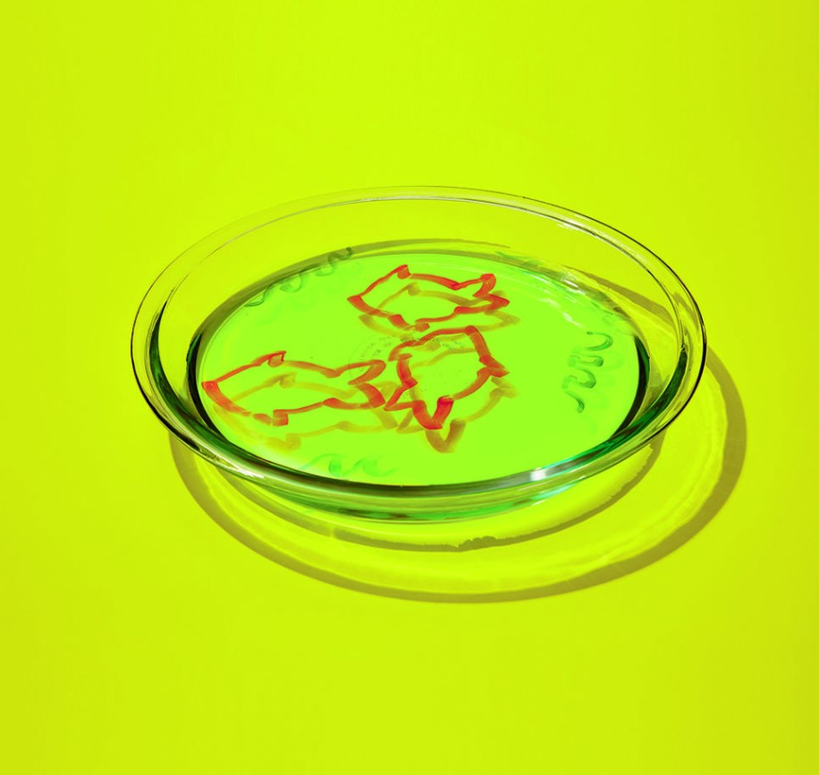

In this delightful experiment, kids get to explore the fascinating world of buoyancy and density. With just a few simple materials like a clear container filled with water, crafting foam, and a pair of googly eyes, children can create their very own “floating fish.” As they cut and mold the foam to resemble a fish, they’ll learn about the principles of buoyancy and how objects can stay afloat due to their density compared to the surrounding liquid. The joy of seeing their fish gently floating in the water will spark their curiosity and encourage them to delve deeper into the science of objects’ behavior in liquids.

### **2\. [Brush, Brush!](https://www.amazon.com/dp/1950785890?ots=1&slotNum=2&imprToken=4cc4c0c8-30a0-c7fc-0d3&linkCode=ogi&tag=goodhousekeeping_auto-append-20&ascsubtag=%5Bartid%7C10055.g.32176446%5Bsrc%7C%5Bch%7C%5Blt%7Csale%5Bpid%7C00736ccb-e9fe-47a6-bc3e-1c1aee4f22e8)**

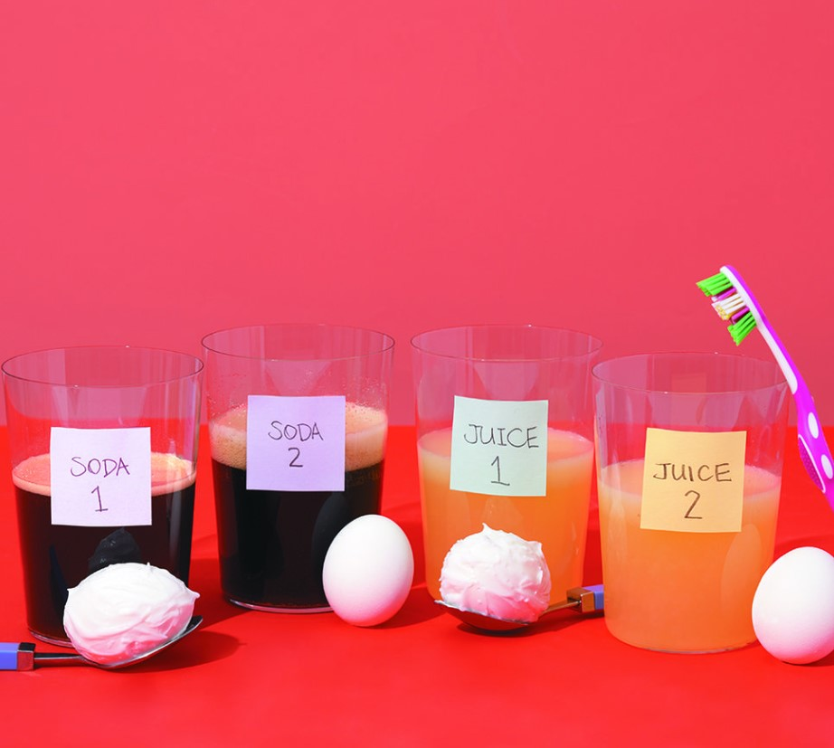

Teaching kids about dental hygiene has never been more enjoyable than this interactive and educational experiment. By using a special disclosing solution that highlights plaque and bacteria, kids can visually see the impact of not brushing their teeth properly. As they brush their teeth and then apply the solution, they’ll witness the areas they missed turning bright, indicating where they need to brush more effectively. This engaging activity not only emphasizes the importance of brushing regularly but also educates them about dental health and the significance of maintaining a healthy smile.

### **3\. Grow an Avocado Tree**

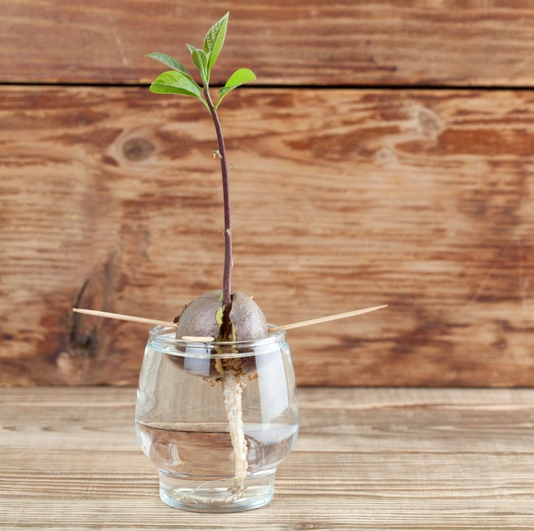

Nurture your child’s love for nature and botany with this hands-on experiment of growing an avocado tree. It all starts with a single avocado seed suspended in water using toothpicks. Over time, kids will observe the seed germinate and sprout into a tiny avocado tree with green leaves. This experiment fosters patience and understanding as they witness the stages of plant growth, helping them grasp the concept of seed germination and photosynthesis. Plus, as they nurture their little avocado tree, they’ll develop a sense of responsibility for caring for living things.

Check out the tutorial [here](https://www.goodhousekeeping.com/home/gardening/a26064095/how-to-grow-avocado-tree/)

### **4\. [Milk Bottle Xylophone](https://www.amazon.com/dp/1950785890?ots=1&slotNum=3&imprToken=4cc4c0c8-30a0-c7fc-0d3&linkCode=ogi&tag=goodhousekeeping_auto-append-20&ascsubtag=%5Bartid%7C10055.g.32176446%5Bsrc%7C%5Bch%7C%5Blt%7Csale%5Bpid%7C00736ccb-e9fe-47a6-bc3e-1c1aee4f22e8)**

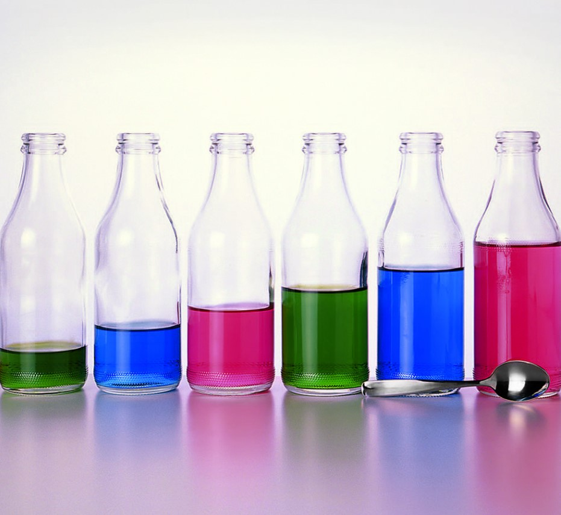

Introduce the enchanting world of music and sound waves to your kids with this delightful milk bottle xylophone experiment. By filling empty milk bottles with varying amounts of water, kids can create a set of musical notes. When they tap the bottles with a spoon, they’ll observe the differences in pitch and sound. This experiment teaches them about the physics of sound waves and how the amount of water affects the pitch of the musical notes produced. Your budding musicians will be delighted to compose their own “water-based” melodies and may even develop a newfound passion for music.  

### **5\. “Elephant Toothpaste”**

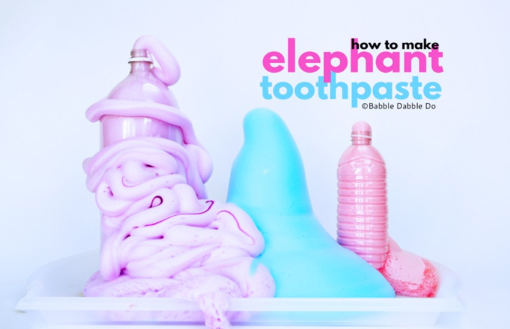

  
Prepare for an explosive and visually stunning chemistry demonstration that will leave kids in awe. The “elephant toothpaste” experiment showcases a rapid chemical reaction that produces a frothy eruption resembling toothpaste for an imaginary elephant! As they mix hydrogen peroxide, dish soap, and yeast, they’ll witness the release of oxygen gas and the decomposition of hydrogen peroxide. This experiment is a fantastic introduction to catalysts and the concept of exothermic reactions.

Check out the tutorial at [babbledabbledo](https://babbledabbledo.com/amazing-science-how-to-make-elephant-toothpaste/)

### **6\. DIY Compass**

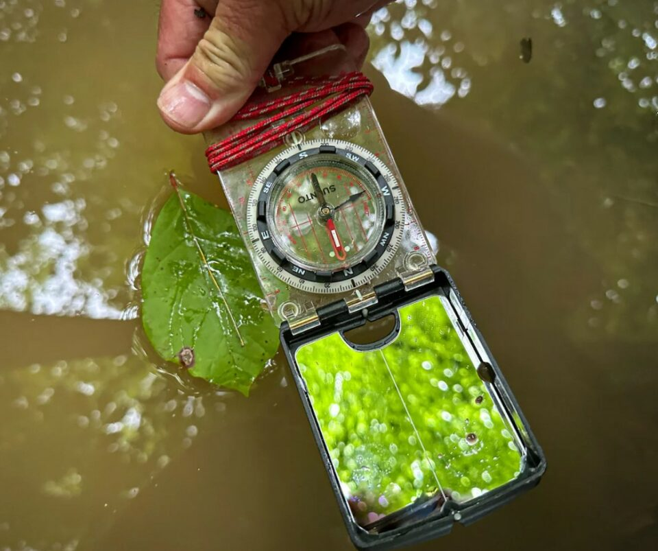

In this captivating experiment, children get the chance to become little navigators as they delve into the fascinating world of magnetism and the Earth’s magnetic field. With just a few simple materials like a magnet, a needle, and a bowl of water, kids can construct their very own functional compass. As they carefully magnetize the needle and suspend it in the water, they’ll observe the needle aligning itself with the Earth’s magnetic field, pointing north.

Check out the tutorial at [steampoweredfamily](https://www.steampoweredfamily.com/how-to-make-a-compass/)

### **7\. Glitter Germ Hands**

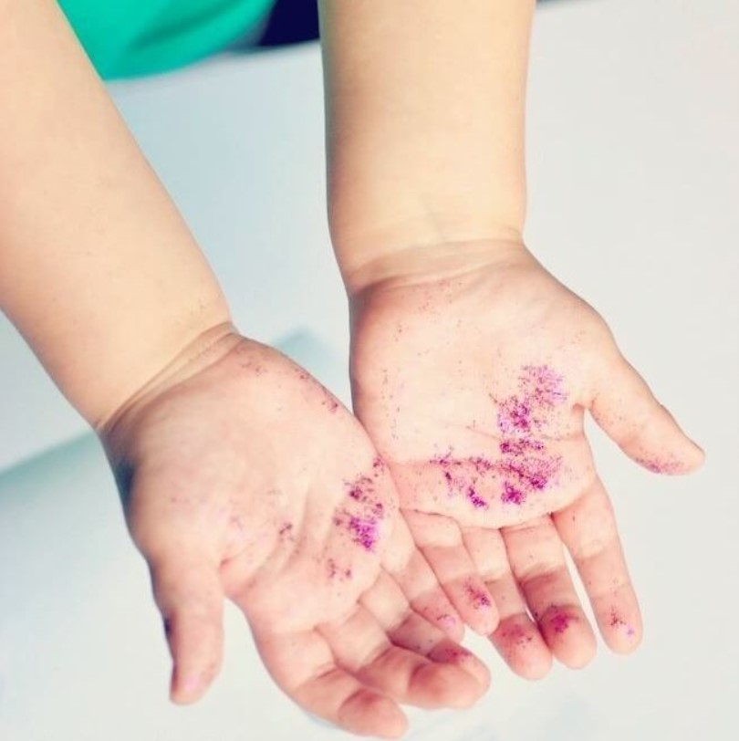

Encourage your child’s passion for science exploration with glitter hand, a treasure trove of science experiment ideas specially curated for kids. From captivating chemical reactions that seem like magic to exhilarating physics demonstrations, this resource offers a wide range of engaging and educational experiments that cater to various interests and age groups. With step-by-step instructions and clear explanations, kids can embark on exciting scientific journeys from the comfort of their homes or classrooms.

Check out the tutorial at [thesoccermomblog](https://thesoccermomblog.com/glitter-germy-hands-experiment/)

### **8\. Craft Stick Chain Reaction**

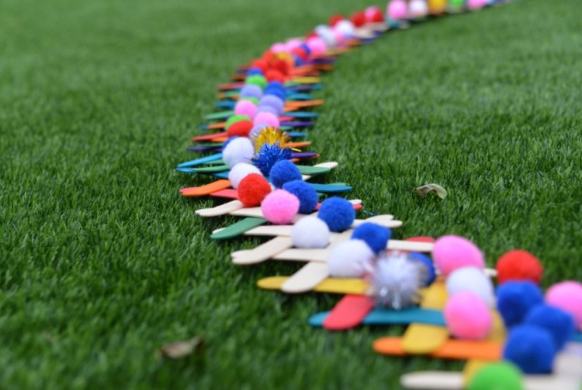

Prepare to be amazed as your kids witness the sheer magic of chain reactions with the craft stick chain reaction experiment. This captivating activity involves arranging craft sticks in a specific pattern, creating a chain of potential energy. When the first stick is released, it triggers a mesmerizing cascade as the potential energy is transferred into kinetic energy, causing each stick to topple over one after the other in a mesmerizing display of movement.

Check out the tutorial at [science-spark](https://www.science-sparks.com/make-craft-stick-chain-reaction/)

### **9\. Sink or Float?**

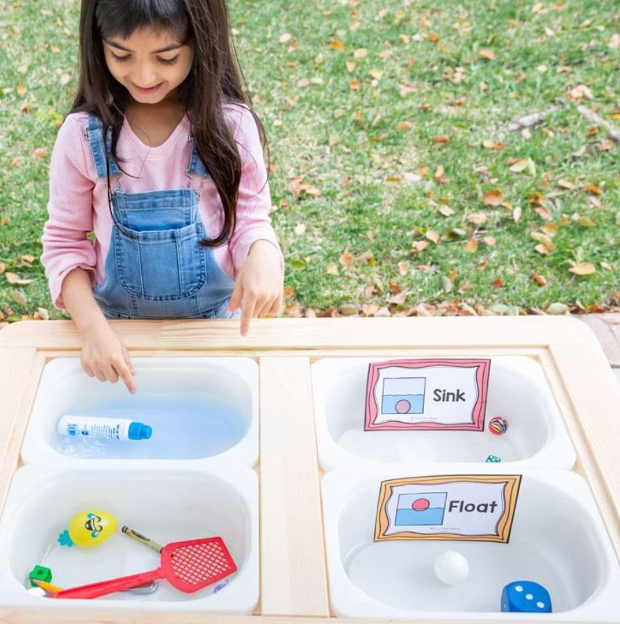

Discover a wealth of science experiment ideas at RESEARCH PARENT, a comprehensive resource designed to cater to the inquisitive minds of young scientists. From simple and beginner-friendly experiments to more complex and challenging ones, RESEARCH PARENT offers a diverse range of hands-on activities that cover various scientific concepts. With detailed instructions and explanations, kids can explore the wonders of chemistry, physics, biology, and more.

Check out the tutorial at [funwithmama](https://www.funwithmama.com/sink-or-float-experiment-worksheet/)

### **10\. Color-Changing Invisible Ink**

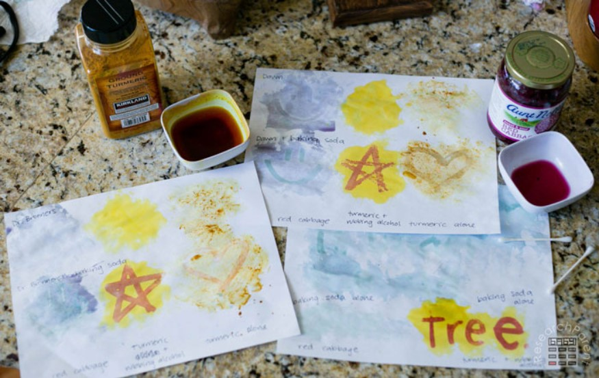

Using household items like baking soda and grape juice, kids can create their own invisible ink. As they write hidden messages on paper, they’ll be thrilled to find that the messages reveal their true colors when exposed to heat or acidic substances. This chemistry experiment introduces young learners to the concept of acids and bases, as well as the science of chemical reactions. It sparks their curiosity and creativity as they play the role of secret agents, deciphering hidden codes and exploring the magic of chemistry.

Check out the tutorial at [researchparent](https://researchparent.com/color-changing-invisible-ink/)

### **11\. Paper Bridge**

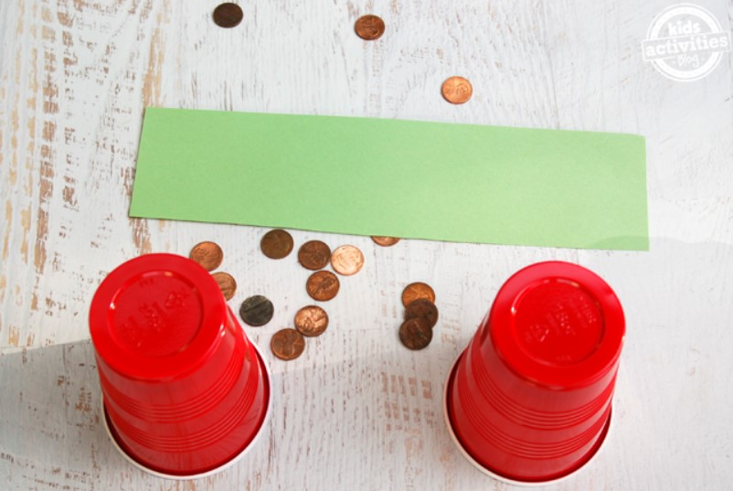

Inspire the budding engineers in your kids with the paper bridge experiment. Armed with just paper and tape, they embark on an exciting journey to construct a sturdy bridge that can support small objects. This hands-on activity introduces them to the principles of stability and structure in engineering. They’ll learn to plan, design, and test their paper bridges, developing problem-solving skills and critical thinking. This experiment encourages creativity and teamwork as they work together to build the most efficient bridge possible.

Check out the tutorial at [kidsactivitiesblog](https://kidsactivitiesblog.com/26605/build-a-bridge/)

### **12\. Sticky Ice**

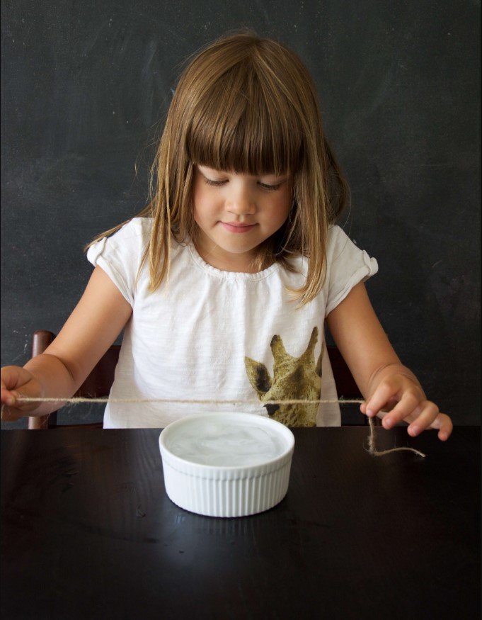

Cool down with the mesmerizing sticky ice experiment that explores the science of freezing and melting points. Kids will be fascinated as they observe the effects of salt on ice, causing it to melt more rapidly and create a sticky surface. This interactive activity helps children grasp the concept of phase changes in matter and the role of external factors in altering physical properties. They’ll understand why salt is commonly used to melt ice on roads during winter. This experiment also provides an opportunity to discuss environmental impacts and solutions related to de-icing practices.

Check out the tutorial at [playdoughtoplato](https://www.playdoughtoplato.com/sticky-ice-science-exp/)

### **13\. Marshmallow Catapult**

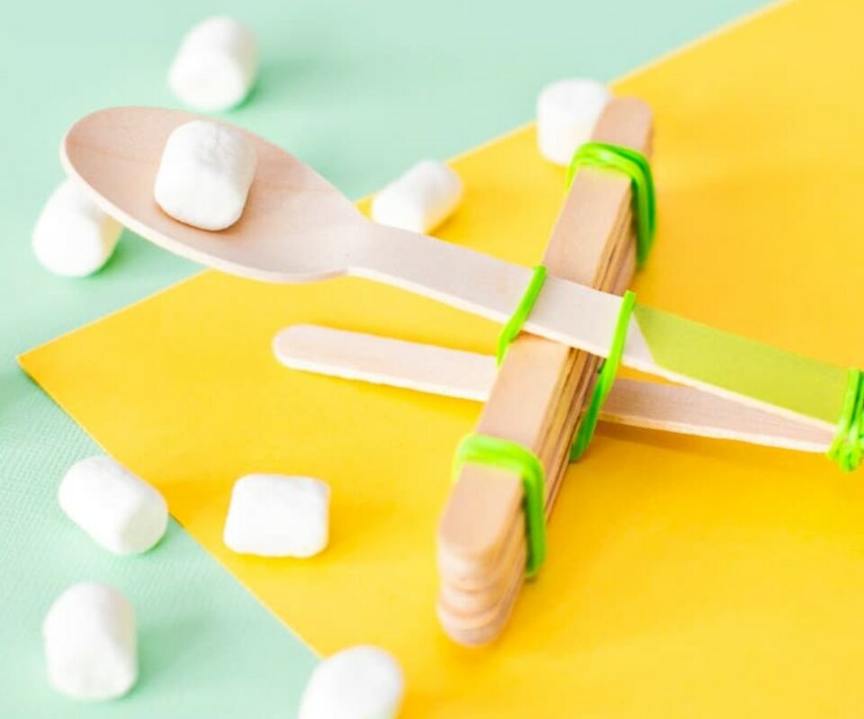

Merge physics and engineering in a thrilling marshmallow catapult experiment. Kids will have a blast constructing their catapults using popsicle sticks, rubber bands, and a spoon. They’ll learn about force, motion, and angles as they launch marshmallows through the air. This hands-on activity encourages exploration and problem-solving, as they adjust their catapult designs to optimize distance and accuracy. It’s an entertaining way to introduce children to the principles of physics and the fun of building and testing their own inventions.

Check out the tutorial at [hellowonderful](https://www.hellowonderful.co/post/diy-marshmallow-catapult/)

### **14\. Leaf Breathing**

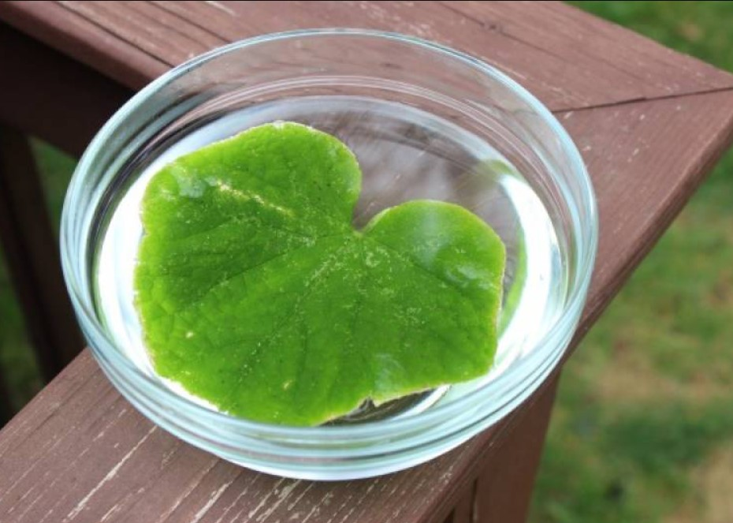

Immerse kids in the wonders of plant biology with the enchanting leaf-breathing experiment. By placing a leafy plant in a sealed clear plastic bag, they’ll observe tiny droplets forming on the inside over time. This phenomenon is a result of transpiration, the process by which plants absorb water through their roots and release water vapor through small openings called stomata on their leaves. This experiment offers a captivating insight into how plants interact with their environment. It introduces children to the essential process of transpiration and its role in nutrient transport and water uptake in plants.

Check out the tutorial at [kcedventures](https://www.kcedventures.com/how-do-leaves-breathe-a-simple-science-experiment-for-kids/)

### **15\. Hoop-and-Straw Airplane**

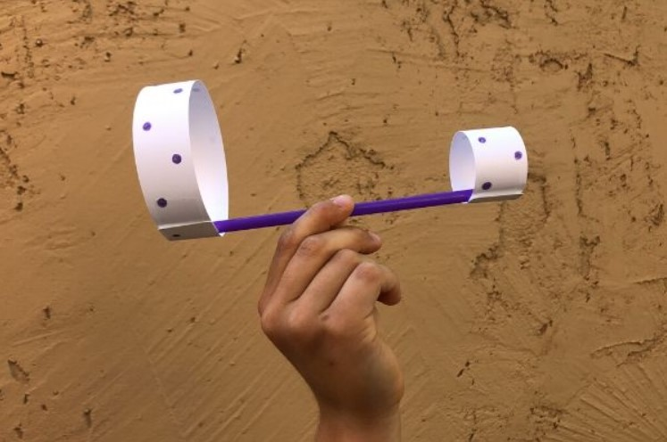

Elevate kids’ imaginations and introduce them to aerodynamics with the hoop-and-straw airplane experiment. They’ll construct paper airplanes using straws and hoops and then launch their creations into the air. As they watch the airplanes soar, they’ll explore the principles of lift and drag, understanding how the shape and design of an airplane impact its flight.

Check out the tutorial at [mombrite](https://www.mombrite.com/how-to-make-a-straw-airplane/)

### **16\. Film Canister Rocket**

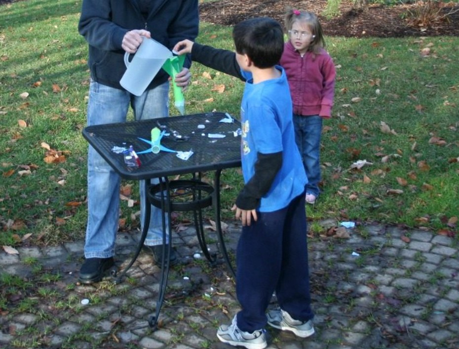

  
Kids can create their mini rockets using film canisters, water, and effervescent tablets. As they mix the ingredients and quickly snap the lid shut, the pressure inside the canister builds up until the lid pops off, launching the canister into the air with a satisfying “pop!” This experiment showcases the power of chemical reactions and the rapid release of gas that generates pressure. Children will be fascinated by the principles of propulsion and combustion in a safe and exciting manner.

Check out the tutorial at [raisinglifelonglearners](https://raisinglifelonglearners.com/film-canister-rockets/)

### **17\. Coin Inertia**

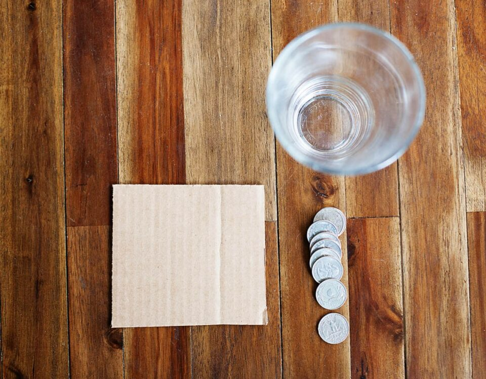

Explore the intriguing world of inertia with the coin inertia experiment. Kids will observe the concept of inertia in action as they experiment with the movement of coins on different surfaces. They’ll notice that a coin at rest tends to stay at rest, and a coin in motion tends to stay in motion, demonstrating the fundamental property of matter. This experiment fosters an understanding of Newton’s first law of motion and offers a fun and engaging way to learn about inertia and its effects on everyday objects.

Check out the tutorial at [engineeringemily](https://www.engineeringemily.com/easy-coin-trick-to-learn-about-inertia-and-newtons-first-law-of-motion-steam-activity-for-kids/)

### **18\. Apple Oxidation**

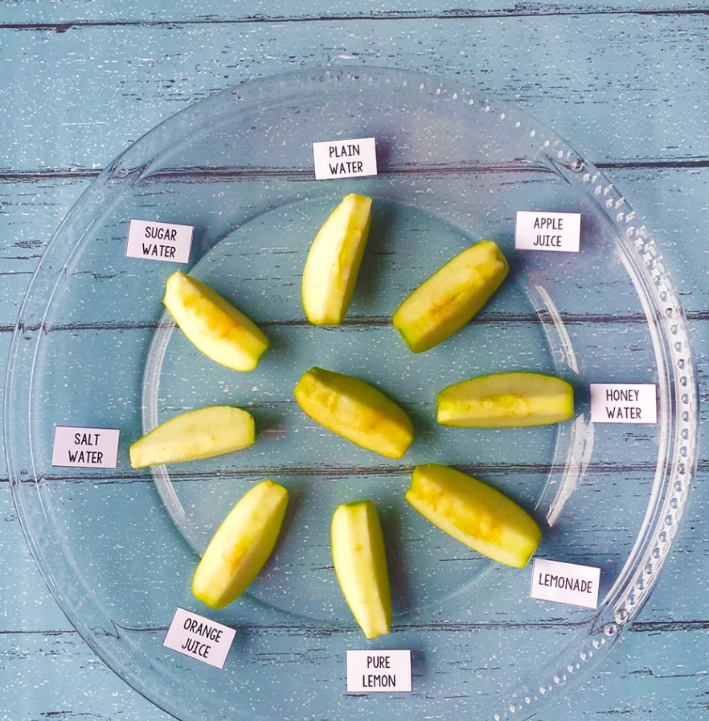

Discover the science behind browning apples with the engaging apple oxidation experiment. Kids will observe the process of oxidation as they expose apple slices to air. They’ll understand the role of oxygen in chemical reactions and how it causes the apples to turn brown. This experiment provides an excellent opportunity to discuss the significance of antioxidants and preservation methods to prevent oxidation in fruits and vegetables.

Check out the tutorial at [jenniferfindley](https://jenniferfindley.com/apple-oxidation-science-experiment-free-science-reading-activity/)

### **19\. Coffee Ground Fossils**

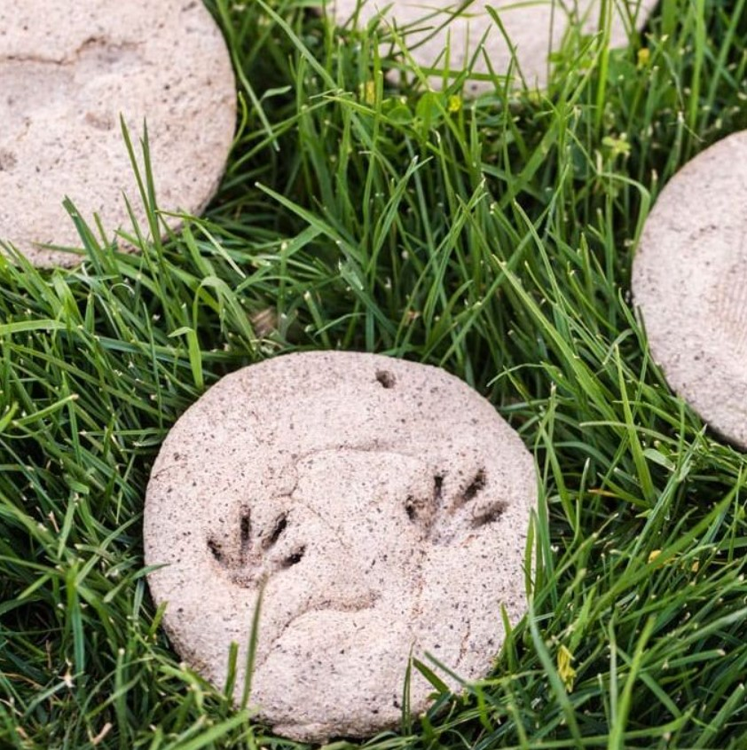

Take a thrilling journey back in time with the coffee ground fossils experiment. Children will learn about fossils and the process of fossilization as they create their own “fossils” using coffee grounds and common household materials. This paleontology-inspired activity encourages creativity and introduces them to the concept of fossil formation. They’ll understand the significance of fossils in understanding the history of life on Earth.

Check out the tutorial at [craftsbyamanda](https://craftsbyamanda.com/coffee-ground-fossils/)

### **20\. Chromatography Flowers**

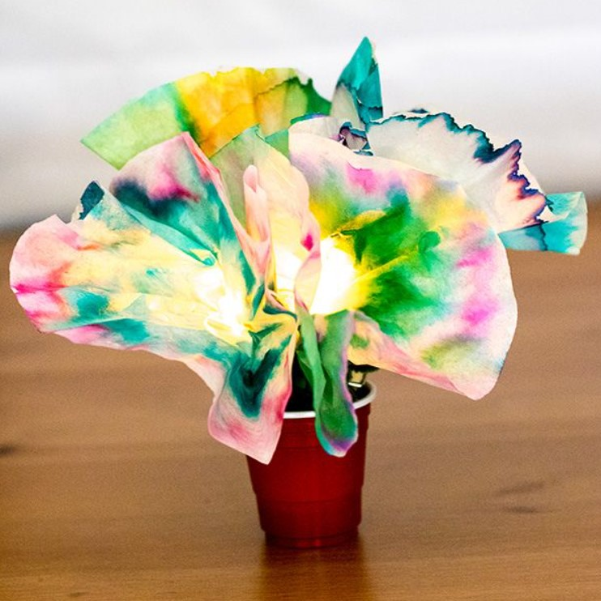

Unleash a burst of color with the mesmerizing chromatography flowers experiment. Kids will learn about the separation of pigments as they create beautiful chromatography flowers using simple household items. This hands-on activity introduces them to the concept of chromatography and the science behind the vibrant colors seen in nature. It’s an excellent opportunity to foster artistic expression while exploring the principles of chemistry.

Check out the tutorial at [steampoweredfamily](https://www.steampoweredfamily.com/build-a-circuit-flower/)

### **21\. Water Walking**

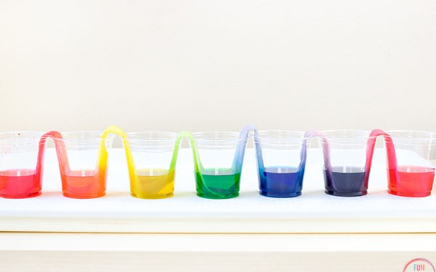

Defy gravity with the captivating water walking experiment. Kids will explore the concept of surface tension and how it enables small insects to seemingly walk on water. This interactive activity introduces them to the unique properties of water molecules and showcases the wonders of nature. They’ll be amazed by the science behind water tension and its impact on certain organisms.

Check out the tutorial at [funlearningforkids](https://funlearningforkids.com/rainbow-walking-water-science-experiment-kids/)

### **22\. Sunscreen Test**

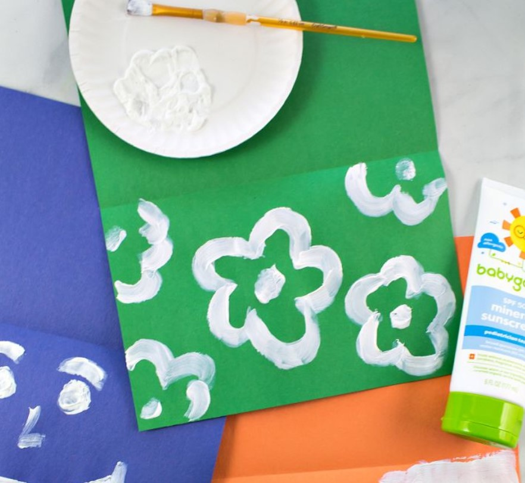

Discover the importance of sun protection with the informative sunscreen test experiment. Children will learn about the significance of sunscreen in shielding against harmful UV rays. Using UV-sensitive beads, they can observe the effectiveness of sunscreen in blocking UV light. This experiment reinforces the importance of sun protection and encourages them to practice safe sun habits.

Check out the tutorial at [tonyastaab](https://www.tonyastaab.com/science-experiments-and-steam-projects-for-kids/)

### **23\. Magic Milk**

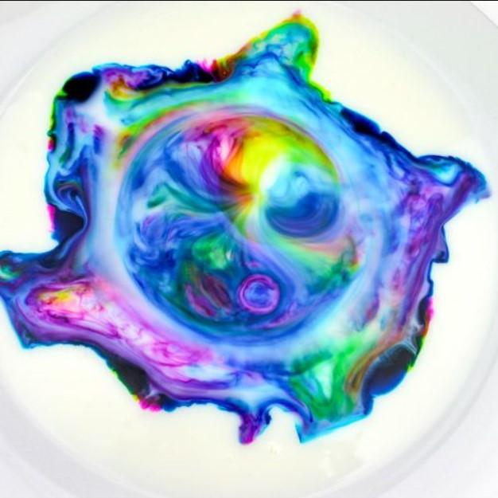

Witness a mesmerizing display of colors with the enchanting magic milk experiment. Kids will learn about the properties of molecules and surface tension as they create vibrant patterns on the surface of milk using simple household ingredients. This visually stunning experiment offers a playful introduction to chemical reactions and their impact on the world around us.

Check out the tutorial at [livinglifeandlearning](https://www.livinglifeandlearning.com/cool-magic-milk-experiment-you-have-to-try.html)

### **24\. Grow Crystals**

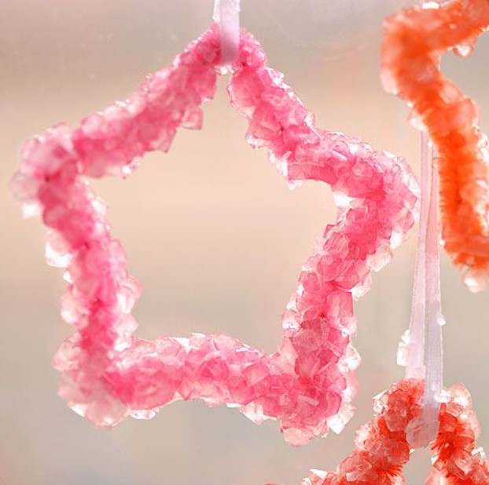

Spark an interest in geology and chemistry with the captivating grow crystals experiment. Kids will be amazed as they watch beautiful crystals form before their eyes. This activity introduces them to the process of crystallization and the unique structures of different crystals. Through this experiment, children will discover the beauty and wonder of minerals and the science behind crystal growth.

Check out the tutorial at [onelittleproject](https://onelittleproject.com/how-to-make-crystal-stars/)

### **25\. Solar Oven**

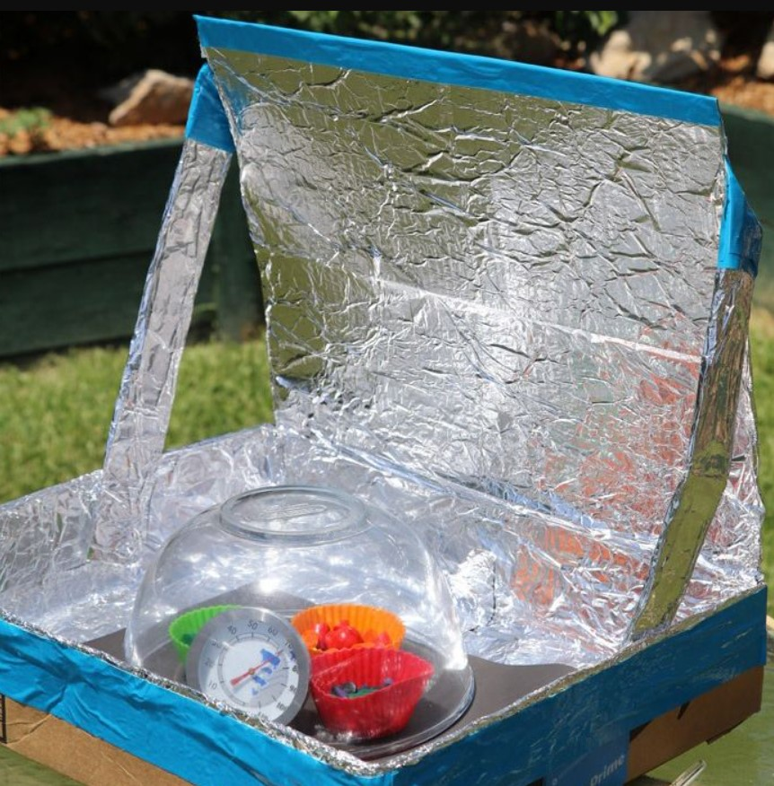

Harness the power of the sun to cook food with the eco-friendly solar oven experiment. Kids will learn about renewable energy and its practical applications. As they build their solar oven using simple materials, they’ll discover the potential of harnessing solar energy for cooking and other purposes. This experiment promotes sustainability and inspires them to think about innovative.

Check out the tutorial at [thecrafttrain](https://www.thecrafttrain.com/diy-solar-oven/)

### **26\. Gravity-Defying Magnets**

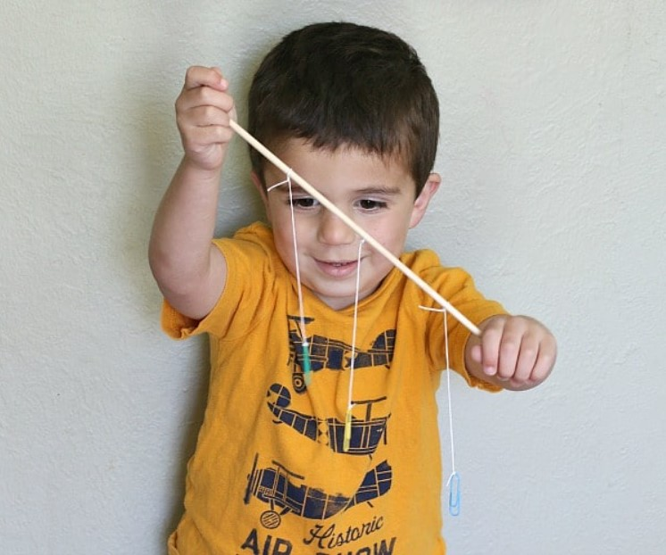

Let your kids discover the mesmerizing world of magnets with the gravity-defying magnets experiment. Using simple materials like magnets and paper clips, children will explore the mysterious force of magnetism and its ability to defy gravity. By suspending paper clips in mid-air using magnetic force, they’ll witness the invisible power that attracts and repels objects.

Check out the tutorial at [buggyandbuddy](https://buggyandbuddy.com/gravity/)

### **27\. Pencils Through a Bag of Water**

Prepare for a mind-bending optical illusion with the fascinating pencils through a bag of water experiment. Using a plastic bag filled with water, kids will witness the intriguing phenomenon of light refraction. When they insert pencils into the bag, the pencils appear to bend and change direction due to the bending of light as it passes through different mediums.

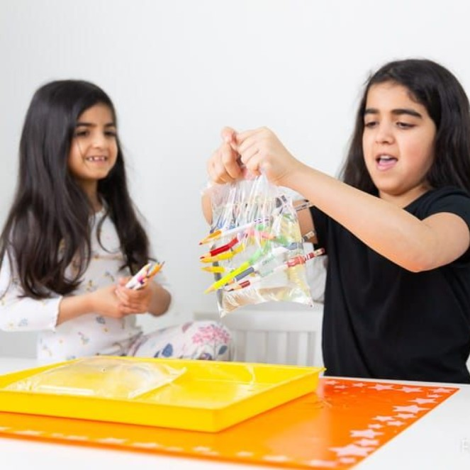

Check out the tutorial at [funwithmama](https://www.funwithmama.com/water-in-a-bag-pencil-experiment-water-experiment-for-kids/)

## Best Science Toys for Kids and Curious Minds Alike

These best [science toys](https://avada.io/loveable/science-toys/) for kids are more than just playthings; they are valuable tools for nurturing scientific curiosity, promoting hands-on learning, and inspiring young minds to explore the wonders of the natural world. From solar-powered gadgets to microscopic investigations, robotics, and astronomy, these toys offer a diverse range of educational experiences that spark a lifelong love for science and learning. Whether your child dreams of becoming an engineer, biologist, or astronomer, these toys are sure to cultivate their passion for discovery and creativity.

### **1\. [Solar Power Kit](https://www.amazon.com/Butterfly-EduFields-Best-Gift-Girls/dp/B08LNVDN37/?ie=UTF8&tag=loveable08-20)**

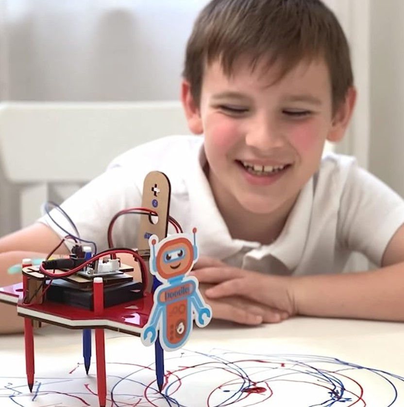

Ignite your child’s fascination with renewable energy through the Solar Power Kit. This engaging science toy allows kids to build their own solar-powered gadgets and experiment with harnessing the power of the sun. With step-by-step instructions, they can construct solar cars, boats, and fans, learning about solar energy and its practical applications. This kit not only promotes an understanding of green energy but also encourages problem-solving and critical thinking skills as they explore the science behind solar panels and electricity generation.

### **2\. [DIY Engineering Kit](https://www.amazon.com/Geeek-Club-Space-DIY-Engineering/dp/B0BLZQV1QS/?ie=UTF8&tag=loveable08-20)**

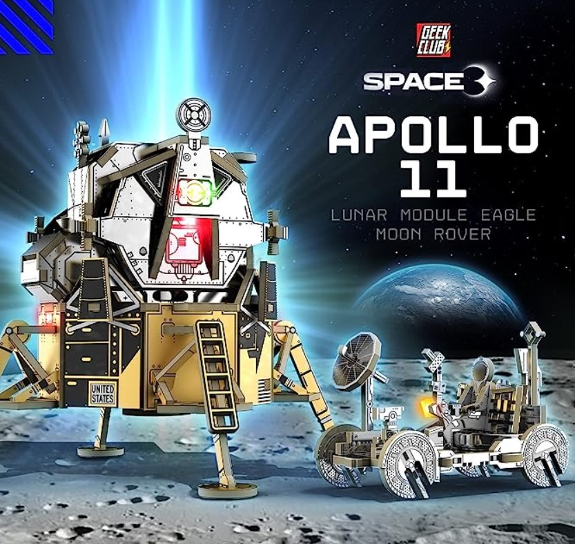

Encourage your little engineers to unleash their creativity with the DIY Engineering Kit. Packed with various building materials like nuts, bolts, and connectors, this toy empowers kids to construct their own imaginative structures and machines. From simple bridges and towers to more complex structures, this kit fosters a love for engineering and hands-on learning. As children experiment with different designs and troubleshoot construction challenges, they develop problem-solving skills and an appreciation for the principles of physics and mechanics.

### **3\. [Microscope For Kids](https://www.amazon.com/dp/B00669JMKS?ie=UTF8&tag=loveable08-20)**

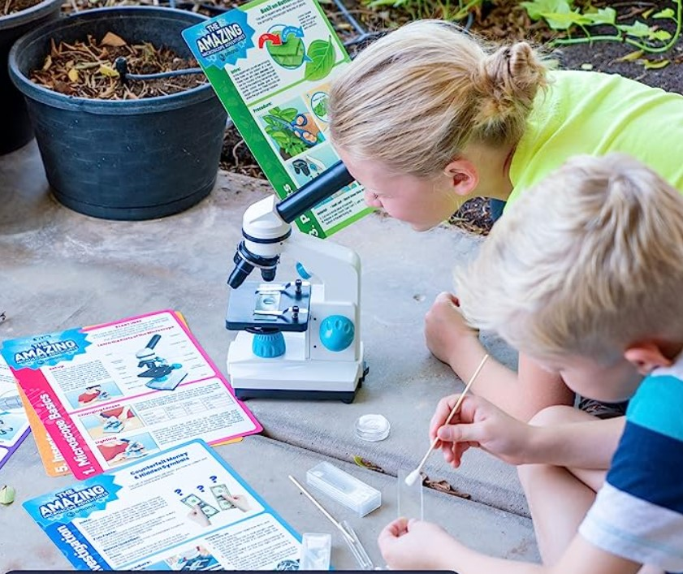

Open up a world of microscopic wonders with the Microscope For Kids. This user-friendly microscope allows young scientists to explore tiny organisms, plant cells, and everyday objects up close. With adjustable magnification and easy-to-use controls, kids can embark on their own scientific investigations and discover the hidden beauty of the microscopic world. This toy sparks curiosity and cultivates a love for biology and scientific inquiry as kids observe and analyze the intricate details of various specimens.

### **4\. [Premium Microscope](https://www.amazon.com/AmScope-M40-K-MDM35-Microscope-Interactive-Friendly/dp/B08H7114SF/r?ie=UTF8&tag=loveable08-20)**

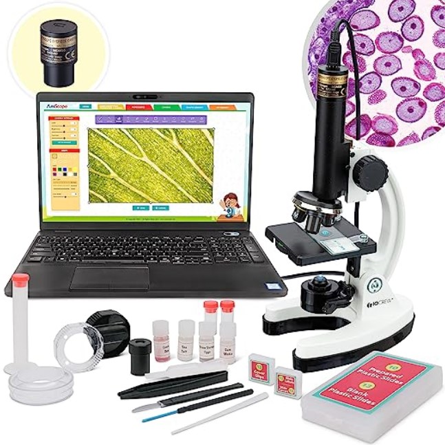

Take scientific exploration to the next level with the Premium Microscope. Ideal for older kids and advanced young scientists, this microscope offers higher magnification and superior optics for more in-depth observations. With features like LED illumination and interchangeable lenses, kids can delve into the realm of cellular biology, bacteria studies, and even mineralogy. The Premium Microscope is a fantastic tool for aspiring biologists, chemists, and researchers, providing a gateway to advanced science experiments for kids.

### **5\. [Binocular For Kids](https://www.amazon.com/dp/B07MYVKPV6?ie=UTF8&tag=loveable08-20)**

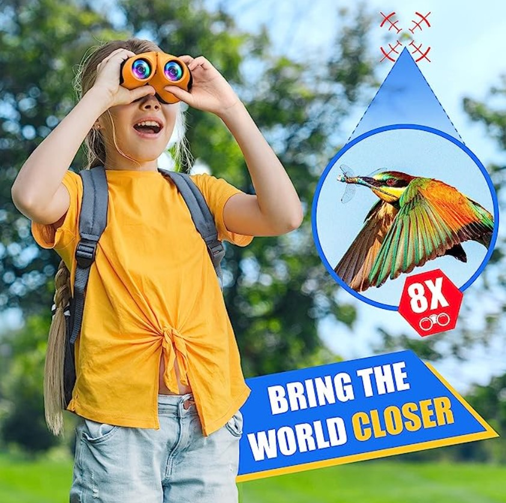

Encourage outdoor exploration and birdwatching with the Binocular For Kids. Designed specifically for young hands and eyes, these binoculars offer clear and easy-to-use optics. Kids can embark on nature walks, observe wildlife, and engage in birdwatching adventures with these lightweight and durable binoculars. This toy promotes an appreciation for nature and the environment while stimulating a sense of wonder and curiosity about the world around them.

**CHECK OUT:** [Science Gifts](https://avada.io/loveable/science-gifts/)

## Bottom Line

In conclusion, fun and educational **science experiments for kids** at home are an excellent way to stimulate young minds and instill a love for science from an early age. These hands-on activities provide opportunities for children to explore, question, and discover, all while having a blast with interactive experiments. They can choose experiments that align with their interests, allowing them to pursue topics they are genuinely curious about. This autonomy and agency in their learning process promote a sense of ownership and enthusiasm for education that can have long-lasting positive effects on their academic performance and overall confidence in learning new concepts.

By engaging in science experiments at home, kids develop essential skills, curiosity, and a sense of wonder that will serve them well throughout their lives. So, grab your lab coats and safety goggles, and let the young scientists in your home embark on an exciting journey of exploration and learning through these captivating science experiments.

- [Easy and Fun Science Experiments for Kids That Help Them Mentally Develop](https://avada.io/loveable/blog/science-experiments-kids/#wp-block-heading-2-4)
    - [1\. Floating Fish](https://avada.io/loveable/blog/science-experiments-kids/#wp-block-heading-3-6)
    - [2\. Brush, Brush!](https://avada.io/loveable/blog/science-experiments-kids/#wp-block-heading-3-9)
    - [3\. Grow an Avocado Tree](https://avada.io/loveable/blog/science-experiments-kids/#wp-block-heading-3-12)
    - [4\. Milk Bottle Xylophone](https://avada.io/loveable/blog/science-experiments-kids/#wp-block-heading-3-16)
    - [5\. “Elephant Toothpaste”](https://avada.io/loveable/blog/science-experiments-kids/#wp-block-heading-3-19)
    - [6\. DIY Compass](https://avada.io/loveable/blog/science-experiments-kids/#wp-block-heading-3-23)
    - [7\. Glitter Germ Hands](https://avada.io/loveable/blog/science-experiments-kids/#wp-block-heading-3-27)
    - [8\. Craft Stick Chain Reaction](https://avada.io/loveable/blog/science-experiments-kids/#wp-block-heading-3-31)
    - [9\. Sink or Float?](https://avada.io/loveable/blog/science-experiments-kids/#wp-block-heading-3-35)
    - [10\. Color-Changing Invisible Ink](https://avada.io/loveable/blog/science-experiments-kids/#wp-block-heading-3-39)
    - [11\. Paper Bridge](https://avada.io/loveable/blog/science-experiments-kids/#wp-block-heading-3-43)
    - [12\. Sticky Ice](https://avada.io/loveable/blog/science-experiments-kids/#wp-block-heading-3-47)
    - [13\. Marshmallow Catapult](https://avada.io/loveable/blog/science-experiments-kids/#wp-block-heading-3-51)
    - [14\. Leaf Breathing](https://avada.io/loveable/blog/science-experiments-kids/#wp-block-heading-3-55)
    - [15\. Hoop-and-Straw Airplane](https://avada.io/loveable/blog/science-experiments-kids/#wp-block-heading-3-59)
    - [16\. Film Canister Rocket](https://avada.io/loveable/blog/science-experiments-kids/#wp-block-heading-3-63)
    - [17\. Coin Inertia](https://avada.io/loveable/blog/science-experiments-kids/#wp-block-heading-3-67)
    - [18\. Apple Oxidation](https://avada.io/loveable/blog/science-experiments-kids/#wp-block-heading-3-71)
    - [19\. Coffee Ground Fossils](https://avada.io/loveable/blog/science-experiments-kids/#wp-block-heading-3-75)
    - [20\. Chromatography Flowers](https://avada.io/loveable/blog/science-experiments-kids/#wp-block-heading-3-79)
    - [21\. Water Walking](https://avada.io/loveable/blog/science-experiments-kids/#wp-block-heading-3-83)
    - [22\. Sunscreen Test](https://avada.io/loveable/blog/science-experiments-kids/#wp-block-heading-3-87)
    - [23\. Magic Milk](https://avada.io/loveable/blog/science-experiments-kids/#wp-block-heading-3-91)
    - [24\. Grow Crystals](https://avada.io/loveable/blog/science-experiments-kids/#wp-block-heading-3-95)
    - [25\. Solar Oven](https://avada.io/loveable/blog/science-experiments-kids/#wp-block-heading-3-99)
    - [26\. Gravity-Defying Magnets](https://avada.io/loveable/blog/science-experiments-kids/#wp-block-heading-3-103)
    - [27\. Pencils Through a Bag of Water](https://avada.io/loveable/blog/science-experiments-kids/#wp-block-heading-3-107)
- [Best Science Toys for Kids and Curious Minds Alike](https://avada.io/loveable/blog/science-experiments-kids/#wp-block-heading-2-111)
    - [1\. Solar Power Kit](https://avada.io/loveable/blog/science-experiments-kids/#wp-block-heading-3-113)
    - [2\. DIY Engineering Kit](https://avada.io/loveable/blog/science-experiments-kids/#wp-block-heading-3-116)
    - [3\. Microscope For Kids](https://avada.io/loveable/blog/science-experiments-kids/#wp-block-heading-3-119)
    - [4\. Premium Microscope](https://avada.io/loveable/blog/science-experiments-kids/#wp-block-heading-3-122)
    - [5\. Binocular For Kids](https://avada.io/loveable/blog/science-experiments-kids/#wp-block-heading-3-125)
- [Bottom Line](https://avada.io/loveable/blog/science-experiments-kids/#wp-block-heading-2-129)

### [Rose Bryne](https://avada.io/loveable/author/rose/)

Hi, I'm Rose! I love animals and spending time with kids. At Loveable, I help people find unique gifts for special occasions like Valentine's Day, housewarmings, and graduations. I enjoy finding gifts for kids, teens, and animal lovers that match their interests and personalities. Making gift-giving a pleasant experience is my priority. Let me assist you in finding the perfect gift!

- [Twitter](https://twitter.com/intent/tweet)
- [Facebook](https://www.facebook.com/sharer/sharer.php)
- [instagram](https://avada.io/loveable/blog/science-experiments-kids/)
- [pinterest](https://www.pinterest.com/loveablellc/)

## Related Posts

[### 30 Best 4 Year Old Birthday Party Ideas For A Memorable Celebration](https://avada.io/loveable/blog/4-year-old-birthday-party-ideas/) 

[

### 16th Birthday Party Ideas to Make an Unforgettable Day

](https://avada.io/loveable/blog/16th-birthday-party-ideas/)

[

### 150+ Inspirational Birthday Quotes to Spread Joy on Special Day

](https://avada.io/loveable/blog/inspirational-birthday-quotes/)

[

### 160+ Birthday Wishes for Wife to Express Eternal Love

](https://avada.io/loveable/blog/birthday-wishes-for-wife/)

[### 90+ Heart Touching Birthday Wishes for Niece to Make Her Day Extra Special](https://avada.io/loveable/blog/birthday-wishes-for-niece/)
