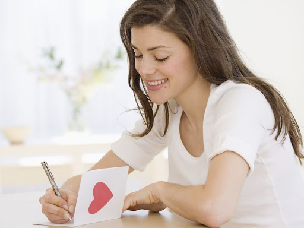

This article has been written and researched by our expert Loveable through a precise methodology. [Learn more about our methodology](https://avada.io/loveable/our-methodological.html)

[Loveable](https://avada.io/loveable/) > [Blog](https://avada.io/loveable/blog/) > [Holiday](https://avada.io/loveable/holiday/)

# 35+ Perfect Ideas to Do for Being Single on Valentine’s Day

Written by [Blake Simpson](https://avada.io/loveable/author/blake/) Last Updated on August 21, 2023

- [35+ Things to do if you are single on Valentine’s day](https://avada.io/loveable/blog/single-on-valentines-day/#wp-block-heading-2-4) 
    - [1\. Pamper yourself at a spa](https://avada.io/loveable/blog/single-on-valentines-day/#wp-block-heading-3-5)
    - [2\. Attempt a New Food Recipe](https://avada.io/loveable/blog/single-on-valentines-day/#wp-block-heading-3-8)
    - [3\. Go out with friends](https://avada.io/loveable/blog/single-on-valentines-day/#wp-block-heading-3-10)
    - [4\. Rewatch your favorite movie](https://avada.io/loveable/blog/single-on-valentines-day/#wp-block-heading-3-12)
    - [5\. Go to a concert](https://avada.io/loveable/blog/single-on-valentines-day/#wp-block-heading-3-15)
    - [6\. Take up drawing](https://avada.io/loveable/blog/single-on-valentines-day/#wp-block-heading-3-17)
    - [7\. Do a karaoke night](https://avada.io/loveable/blog/single-on-valentines-day/#wp-block-heading-3-19)
    - [8\. Explore a new eatery](https://avada.io/loveable/blog/single-on-valentines-day/#wp-block-heading-3-22)
    - [9\. Take a Fun Class](https://avada.io/loveable/blog/single-on-valentines-day/#wp-block-heading-3-24)
    - [10\. Have a Long Facetime Catch-Up With Another Single](https://avada.io/loveable/blog/single-on-valentines-day/#wp-block-heading-3-26)
    - [11\. Focus on Your New Year’s target](https://avada.io/loveable/blog/single-on-valentines-day/#wp-block-heading-3-29)
    - [12\. Have Some Photos Shoot](https://avada.io/loveable/blog/single-on-valentines-day/#wp-block-heading-3-31)
    - [13\. Have a Regular Day](https://avada.io/loveable/blog/single-on-valentines-day/#wp-block-heading-3-34)
    - [14\. Write a Love Letter to Yourself](https://avada.io/loveable/blog/single-on-valentines-day/#wp-block-heading-3-36) 
    - [15\. Sleep all-day](https://avada.io/loveable/blog/single-on-valentines-day/#wp-block-heading-3-39)
    - [16\. Take a hot bath](https://avada.io/loveable/blog/single-on-valentines-day/#wp-block-heading-3-41)
    - [17\. Participate in Volunteering](https://avada.io/loveable/blog/single-on-valentines-day/#wp-block-heading-3-43)
    - [18\. Tarot Reading Test](https://avada.io/loveable/blog/single-on-valentines-day/#wp-block-heading-3-46)
    - [19\. Have a full-day game](https://avada.io/loveable/blog/single-on-valentines-day/#wp-block-heading-3-48)
    - [20\. Make your own chocolate](https://avada.io/loveable/blog/single-on-valentines-day/#wp-block-heading-3-51)
    - [21\. Make time to watch a new program](https://avada.io/loveable/blog/single-on-valentines-day/#wp-block-heading-3-53)
    - [22\. Reading book](https://avada.io/loveable/blog/single-on-valentines-day/#wp-block-heading-3-55) 
    - [23\. Puzzle-solving](https://avada.io/loveable/blog/single-on-valentines-day/#wp-block-heading-3-58)
    - [24\. Health check](https://avada.io/loveable/blog/single-on-valentines-day/#wp-block-heading-3-60)
    - [25\. Clean your home](https://avada.io/loveable/blog/single-on-valentines-day/#wp-block-heading-3-62)
    - [26\. Write Valentine’s letter for your lovers](https://avada.io/loveable/blog/single-on-valentines-day/#wp-block-heading-3-65)
    - [27\. Go sightseeing](https://avada.io/loveable/blog/single-on-valentines-day/#wp-block-heading-3-68)
    - [28\. Revamp your closet](https://avada.io/loveable/blog/single-on-valentines-day/#wp-block-heading-3-70)
    - [29\. Try out a new fitness routine](https://avada.io/loveable/blog/single-on-valentines-day/#wp-block-heading-3-73)
    - [30\. Making money](https://avada.io/loveable/blog/single-on-valentines-day/#wp-block-heading-3-75)
    - [31\. Go on a shopping sale](https://avada.io/loveable/blog/single-on-valentines-day/#wp-block-heading-3-77)
    - [32\. Do something that you hated](https://avada.io/loveable/blog/single-on-valentines-day/#wp-block-heading-3-80)
    - [33\. Have a night camping](https://avada.io/loveable/blog/single-on-valentines-day/#wp-block-heading-3-82)
    - [34\. Celebrate Galentine’s Day](https://avada.io/loveable/blog/single-on-valentines-day/#wp-block-heading-3-84)
    - [35\. Renew your appearance](https://avada.io/loveable/blog/single-on-valentines-day/#wp-block-heading-3-87)
    - [36\. Listen to music](https://avada.io/loveable/blog/single-on-valentines-day/#wp-block-heading-3-89)
    - [37\. Find a new mate](https://avada.io/loveable/blog/single-on-valentines-day/#wp-block-heading-3-92)
- [The bottom line](https://avada.io/loveable/blog/single-on-valentines-day/#wp-block-heading-2-94)

Valentine’s Day is known as a day for couples falling in love. This special occasion is a wonderful day to express your love and care for your significant other, but single folks can also celebrate! There is no rule that single ones have to stay in the house to make friends with loneliness. Get out of your comfort zone and work on the crazy ideas you want to make.

There are several ways to make the best of being alone on Valentine’s Day. There is something for everyone, whether you want to do something new to relax or have some fun, or perhaps pursue love. If you prefer a more conventional Valentine’s Day, you may send emotional cards to your friends, family, and even yourself! 

There is a list of wonderful things to do for being **single on Valentine’s day** for reference. So, don’t be sad if you’re alone on Valentine’s Day; there are plenty of great ways to make it a memorable day!

## **35+ Things to do if you are single on Valentine’s day** 

### **1\. Pamper yourself at a spa**

Pamper yourself at a spa

You should take better care of yourself; taking care of yourself is never enough. When you become better, there are many people waiting for you. So, [love yourself first](https://avada.io/loveable/how-to-love-yourself/) before loving someone else. Keep it in mind to never hurt yourself. Schedule a massage at a nearby spa or get some high-quality skincare for some alone time at home.

### **2\. Attempt a New Food Recipe**

A great meal may be considerably more romantic than being single in a luxuriously filled restaurant. Don’t worry; even if neither of you is a chef, you can make a delicious meal using culinary recipes found on the Internet or in the cooking Book. It is believed that you are not strict in judging your dishes because it is your full enthusiasm and meticulousness. Pack a few recipes and prepare the great dish you will make. Who knows, it could become your hobby or future job. 

### **3\. Go out with friends**

Being single here means that you don’t have a boy or girlfriend, and you don’t have a cuddling relationship with a heterosexual lover. Sometimes, it is fun and exciting that no one has a sweetheart in your group, so all members can enjoy any occasion together no matter what they are. When being with your friend, you are who you are, do not be shy to show off your insane; it’s better than pretending to be an ideal lover. Therefore, why don’t you prioritize your friends instead of embarrassing feelings for that person?

### **4\. Rewatch your favorite movie**

Rewatch your favorite movie

Are there some movies you have seen and found interesting? If you have free time to be alone, review them once to recall how you felt when you first watched them. It could be a romantic film or an action movie or even a horror one. Don’t be lazy to think that it is a waste of time. For some people, it’s often more enjoyable to watch a review than to watch a new one. Relive the real feeling when watching; maybe you will shed tears once if it is an emotional melodrama.

### **5\. Go to a concert**

The fact that Valentine’s Day is a worldwide celebration, whether you acknowledge it or not. On that day, many event organizers will invest money to arrange fire shows in order to attract participants. Blend in with the throng, and the flamboyant environment will motivate you to chill the music and have enjoyment collectively. So you don’t have to worry about being alone on Valentine’s Day; perhaps you’ll meet a lot of acquaintances and new mates there.

### **6\. Take up drawing**

Did you use to draw in the past? Just an open-ended question. We all had the subject of the arts when being at school, even if you don’t go to school, it is nonsense to say never drew before. A creative endeavor is a lovely way to celebrate Valentine’s Day. It’s fantastic to produce a particular artwork on a special day. Don’t worry about being judged because there are numerous channels on YouTube for beginners to take up this. It is claimed that art helps the development of personality and the cultivation of spiritual dignity and beauty. Remember that the worth of a picture is not in its price but in the artist.

### **7\. Do a karaoke night**

Do a karaoke night

It’s fun to sing along to favorite tunes. Songs are always the finest way to express yourself. The song you pick to sing will reflect your current mood. Singing a ballad song to convey your despair or a cheerful track to celebrate your celibacy. No need to be concerned about the throng at the karaoke bar. Many karaoke applications available on the internet may help you transform your house into a lively bar. Let us burn this night with your song and voice. Don’t be bashful; whether your voice is great or not, no one cares.

### **8\. Explore a new eatery**

Don’t tell me that you have tried all the eateries. It would be a ridiculous joke. There are more and more restaurants opening, from new ones to franchise ones to taste. It is recognized that the fastest way to be happy is through the stomach. Surely, to reward yourself after stressful working days, let’s try some strange dishes to discover what’s new in your city.

### **9\. Take a Fun Class**

Many supplementary classes give useful knowledge for everyday life, work, and health. They are all useful for a better life (except for some types of gambling), so choose one if you have time. If you are alone on Valentine’s Day, it would be a fantastic idea to learn something new. Discover hidden abilities in some fields that can be dance, cooking, or singing. Check them out to determine what interests you. Laziness is inevitable at first, but you will be very happy in case of picking a suitable one.

### **10\. Have a Long Facetime Catch-Up With Another Single**

Have a Long Facetime Catch-Up With Another Single

Chatting is not a bad idea to enjoy a noisy Valentine’s Day. Introverts like that, to be at home and call facetime their acquaintances. Now, we have many social media platforms to be with others over a long distance. It is certain that there is also someone single feeling alone on Valentine’s night. They also expect to get an invitation, why you don’t do that? Let’s make them a surprise and kill leisure time with stories. If you find a like-minded person, the conversation can last until the next day. 

### **11\. Focus on Your New Year’s target**

Valentine’s day is also the early beginning of the new year. Look back to the last year to be proud of your achievement and be disappointed about what couldn’t be done. Make a list of target things you want to do this year to have a good plan. Otherwise, make a wish list, doing it as soon as possible. It will be a day to regret because of missing chances to be who you want to be. A life devoid of desires is a failure, therefore, don’t squander your youth.

### **12\. Have Some Photos Shoot**

Have Some Photos Shoot

Having photos is the most effective way to save beautiful moments in life. You can think of somewhere gorgeous or even your own ornately decorated room for impressive photos. Post them to your own social media account to share your experiences that how you are happy despite being alone. On the other hand, whenever you have free time, look back at your saved photos to smile at what you’ve been through.

### **13\. Have a Regular Day**

It sounds weird. However, if you just consider Valentine’s day as a normal day, it’s nothing. Valentine’s day is recognized just because people want to have time to express love to their beloved. You are single, so it doesn’t matter. Get up, brush your teeth, have breakfast, go to work, come home, and end up a day as normal. Don’t force yourself to be the same as others; your life, your choice, keep in mind that. Do whatever you believe is comfortable.

### **14\. Write a Love Letter to Yourself** 

Write a Love Letter to Yourself 

Surely, Valentine’s day is the day for love, so love messages are an indispensable part of expressing sincerity. However, what would you do if there was no one to send this letter to? No matter, give it yourself. It seems like you write your diary because you do it for yourself, but the difference is that it’s not a narrative, it’s compliments and encouragement. Sending sincere thanks for always trying your best and overcoming difficulties in life. Have you ever given yourself appreciation? You deserve it. 

### **15\. Sleep all-day**

Not crazy. Think about how amazing it is. Maybe you are not concerned about this because of its regularity, but it is believed to be the best activity. If you want to relieve stress – go to sleep; if you want to rest – go to sleep; and if you want to forget the terrible things – go to sleep. Sleep is for enjoyment; never underrate it. Especially maximum efficiency for those addicted to social media, get out of Facebook, Insta, and Twitter and enjoy relaxation in your cozy bed.

### **16\. Take a hot bath**

When you read this headline, you probably think about having a shower, don’t you? No. It refers to a wonderful bathtub with rose leaves and candles surrounding it, as well as ballad music to create a fancy ambiance. You may also place some food and Champagne around to be luxurious. You can immerse in this feeling for hours without wanting to get out because of its high level of relaxation. It is always more comfortable to feel clean after bathing. On Valentine’s Day, having fun is a good idea.

### **17\. Participate in Volunteering**

Participate in Volunteering

It’s wonderful to be able to share with others, to be able to achieve something that makes us feel pleased with ourselves in hindsight. There are several social media sites where you may join in volunteering. Do not be afraid, and know that we will treasure lovely times together. Luxury vacations and extravagant expenditures on flashy items are meaningless. Why do you think about volunteering? When you give someone happiness, you receive it as well. A journey is certainly worth it to witness the innocent grins of the poor and to realize how our lives have been great. 

### **18\. Tarot Reading Test**

Tarot card reading is a new type of cartomancy in which participants choose tarot cards to gather information about the past, present, or future. Tarot is becoming increasingly popular due to its allure. Many people become addicted to this game in order to quench their curiosity. Are you curious about your future life? It’s worth testing your hidden skills. Right or wrong, do the cards you draw reveal anything about your personality? Let’s check.

### **19\. Have a full-day game**

Have a full-day game

The game industry is undergoing several revolutions. You may easily interact with your pals in a variety of ways using social media networks. It’s believed to be the most important to release Dopamine for the youth nowadays. As a result, it’s not difficult to have a good time with various multi-player games, such as strategy games. It’s much better to play games like Truth or Dare with pals. Do you want to play some lonely games or organize a big game with your buddies? We have it all.

### **20\. Make your own chocolate**

Chocolate is one of the symbols that forever represent Valentine’s Day. Surely, whenever you mention Valentine’s gift, everyone immediately thinks of Chocolate. A sweet candy bar to express love and to remind beloved ones of your existence is indispensable on this Occasion. It’s even more special when you do it yourself. Valentine without chocolate is an omission, right? So, make special ones with your unique ingredients and exquisite design to give your loved ones and yourself!

### **21\. Make time to watch a new program**

Besides playing games, new movies are also good for releasing Dopamine that helps you comfortably relax. There are plenty of new movies released every month on both cinemas and Netflix. Bring your blankets and pillows to the Sofa for hours of enjoyment or buy some popcorn and drinks to get in the air with others in the cinema. On this Valentine’s day, consider it a good activity to overcome your loneliness.  

### **22\. Reading book** 

Man sitting on sofa reading a book in a cozy loft apartment

Knowledge is never enough to collect for sure. The more you learn, the more you know. Know how the world works, know about amazing things around us, know about human religions. Don’t force yourself to cram things you don’t like, get a book with a topic you’re interested in. During spare time, as on Valentine’s night, take a cooking book, an animal book, or even a love story book to enjoy it yourself. It’s nice to realize that you’ve [learned something new.](https://avada.io/loveable/learning-new-skill/)

### **23\. Puzzle-solving**

Puzzle solving is the best game for smart people. No matter how intelligent you are, solving a difficult puzzle can take hours and make you forget everything around you, even the boring Valentine. Rubik’s cubes, jigsaw puzzles, and detective games are some suggestions for you to spend time with. If you cannot address them for a session, complete them the next day. Believe you won’t even care about Valentine anymore, that’s the charm of [puzzle games](https://avada.io/loveable/personalized-puzzles/).

### **24\. Health check**

No ridiculous. Don’t make fun. It is one of the most important things on a to-do list but is often overlooked. On Valentine’s day, couples spend time taking care of each other, but you are single. Therefore, take care of yourself. Regular health checking is necessary to ensure your health condition. Do not be subjective because you are very healthy; deadly diseases often incubate inside and appear to hurt you at any time. This occasion is for expressing love, OK, love yourself.

### **25\. Clean your home**

Clean your home

How long don’t you clean your living space? At the beginning of the new year or before? Cleaning is never superfluous; you can’t be comfortable if you’re in a dusty and polluted area. It is also chosen to relieve stress thanks to the feeling of [doing something clean](https://avada.io/loveable/cleaning-gifts/). Everything is neatly arranged and new always makes people feel much more comfortable when staying. Don’t let dirt ruin your mood.

### **26\. Write Valentine’s letter for your lovers**

Valentine’s Day is, without a doubt, the day for love, thus love messages are an essential gift of showing sincerity; they might be delivered to your acquaintances or family members. A handwritten note demonstrates your genuineness via your handwriting, and don’t be frightened if your handwriting isn’t very lovely. For some people, it is difficult to express their feelings to others. In the worst-case scenario, individuals are unable to express exactly what they are thinking, which might lead to unanticipated misunderstandings. To prevent this unexpected situation, love letters are the ideal substitute. 

**_Related_**: [How To Write A Love Letter for Your Lovers](https://avada.io/loveable/write-a-love-letter/)

### **27\. Go sightseeing**

Going sightseeing is also an excellent method to de-stress. Natural beauty is said to provide comfort. Let us observe what nature has left behind. Open the door and take in some fresh air; you’ll feel better. After a long day of work, you deserve to relax. A fresh journey, new experiences to greet life and learning more. If you get bored with the high pace of life in the city, a day trip to a natural area is an excellent way to unwind. It’s up to you whether you want to go somewhere vibrant or serene, alone or with someone, as long as you can recharge your batteries.

### **28\. Revamp your closet**

Revamp your closet

Check out your closet to see whether it is messy. Many people store items that they never use again but don’t take them out. For this time, rearrange your wardrobe and consider what you don’t wear anymore, then give them to the poor as volunteers. Otherwise, do the shopping for new ones; on the big occasion like Valentine’s day, there will be many sale-off to stimulate huge buying demand. Treat yourself to a new gift!

### **29\. Try out a new fitness routine**

Busy life makes you form many bad habits, such as having night baths and staying up late. It would be OK now, but it will gradually ruin your health if you keep it on. Realize the importance of health soon and make a promise this new year to take up a new fitness routine. Are you overweight? Do you have back pain? It’s too dangerous. Take a little time each day to jog or do yoga, you’ll feel so much better.

### **30\. Making money**

It is a great idea that no one thought of anymore on Valentine’s day. People prefer to have a fun day on special occasions instead of working, so it leads to a shortage of staff. These days, you have an opportunity to make more money than usual with temporary jobs such as service staff, security guards, or babysitters are in high demand. Save money as much as possible for the next time, the time you will no longer be single on Valentine’s day.

### **31\. Go on a shopping sale**

Go on a shopping sale

There will be several sales to promote massive buying desire on Valentine’s day. It’s your time to get expensive things you are unable to buy before, especially for girls who save money for a year to wait for flash-sale sessions. Gorgeous dresses or luxurious wallets and Jewelry were already displayed through the glass doors. Waiting for this day coming, don’t hesitate anymore; go out and rummage through cities in search of your favorite items. 

### **32\. Do something that you hated**

Do you laugh out loud while reading this? You would think that “how can I do what I hate”, right? However, what you hate is not always bad as your thought. If you don’t have a specific plan to do anything on Valentine’s, don’t be scared to experiment once. Do you have acrophobia? Go climbing. It’s possible that you can overcome your fear and become interested in this by seeing the magnificent sights from above. Even if you hate books, you might become a bookworm after trying. 

### **33\. Have a night camping**

Go somewhere isolated for smoke-free peace in the city. Prepare your favorite food along with some survival equipment to take on an adventure. You can organize a [camping trip](https://avada.io/loveable/gifts-campers/) on the beach, mountain, or even your own garden. Turn on the music and make a fire to keep warm on a cold Valentine’s Day. The magical night and the starry sky will be great to bring you into a state of stillness, a pleasant feeling of tenderness.

### **34\. Celebrate Galentine’s Day**

Celebrate Galentine’s Day

[Galentine’s Day](https://avada.io/loveable/galentine-gifts/), celebrated on February 13, before Valentines a day, honors platonic friendships. It first appeared on the program Parks and Recreation. After its presence, it is even more expected than Valentine’s day to have fun. Having fully comfortable smiles with others, except for buddies, is often difficult. Galentines is the ultimate gift for singles looking forward to a special occasion of the year for entertainment.

### **35\. Renew your appearance**

People must always be renewed, renewing not only knowledge but also appearance. It is said that “What a person looks like is not really important”. This is a damn lie. You have to accept that a good-looking easily gets many opportunities in life both at work and in love. It’s also understandable that if you don’t take good care of yourself, you can’t take care of anyone else. Therefore, high-end cosmetics or fashion clothes, take it all.

### **36\. Listen to music**

Listen to music

Who doesn’t love [music](https://avada.io/loveable/music-gifts/)? Music is a spiritual gift that plays a significant role in bringing color and vibrancy to life. Not everyone has the same music taste, so the playlist is also different to suit each person’s style. The music you listen to reflects your personality and your mood at this moment. This Valentine’s day, spend all your leisure time reveling in your playlist and immerse yourself in your favorite sounds for a sense of peace. It could be love songs or ballads, whichever you choose, as long as you feel better. 

### **37\. Find a new mate**

Exactly the most important thing to do if you are single on Valentine’s day. Do you tend to be single forever? No, right? It’s heartbreaking to see happy couples together, so find a loving half to share the ups and downs. Not only you alone, but many more. Take action, take care of yourself more, hang out more, and be confident about striking up a conversation with the opposite sex. Make a promise to yourself that the next Valentine’s won’t be lonely anymore. 

## **The bottom line**

Spending Valentine’s Day as a single person may be intimidating, especially when everyone else seems to be celebrating with their love. But there’s no reason to despair! Valentine’s Day doesn’t have to be about being in a relationship; Valentine’s Day doesn’t have to be a day of misery and loneliness. Valentine’s Day is a day for everyone to celebrate the love in their lives, so make an effort to do something that will make you feel unique and cherished. 

Being single isn’t that bad, at least you’re alive to enjoy the fun things in life. You would be alone but not lonely. 

This is a list of **35+ Perfect Ideas to Do for Being Single on Valentine’s Day**. There are many enjoyable activities to choose from, regardless of your relationship status. Don’t let yourself be negative during this global occasion.

- [35+ Things to do if you are single on Valentine’s day](https://avada.io/loveable/blog/single-on-valentines-day/#wp-block-heading-2-4) 
    - [1\. Pamper yourself at a spa](https://avada.io/loveable/blog/single-on-valentines-day/#wp-block-heading-3-5)
    - [2\. Attempt a New Food Recipe](https://avada.io/loveable/blog/single-on-valentines-day/#wp-block-heading-3-8)
    - [3\. Go out with friends](https://avada.io/loveable/blog/single-on-valentines-day/#wp-block-heading-3-10)
    - [4\. Rewatch your favorite movie](https://avada.io/loveable/blog/single-on-valentines-day/#wp-block-heading-3-12)
    - [5\. Go to a concert](https://avada.io/loveable/blog/single-on-valentines-day/#wp-block-heading-3-15)
    - [6\. Take up drawing](https://avada.io/loveable/blog/single-on-valentines-day/#wp-block-heading-3-17)
    - [7\. Do a karaoke night](https://avada.io/loveable/blog/single-on-valentines-day/#wp-block-heading-3-19)
    - [8\. Explore a new eatery](https://avada.io/loveable/blog/single-on-valentines-day/#wp-block-heading-3-22)
    - [9\. Take a Fun Class](https://avada.io/loveable/blog/single-on-valentines-day/#wp-block-heading-3-24)
    - [10\. Have a Long Facetime Catch-Up With Another Single](https://avada.io/loveable/blog/single-on-valentines-day/#wp-block-heading-3-26)
    - [11\. Focus on Your New Year’s target](https://avada.io/loveable/blog/single-on-valentines-day/#wp-block-heading-3-29)
    - [12\. Have Some Photos Shoot](https://avada.io/loveable/blog/single-on-valentines-day/#wp-block-heading-3-31)
    - [13\. Have a Regular Day](https://avada.io/loveable/blog/single-on-valentines-day/#wp-block-heading-3-34)
    - [14\. Write a Love Letter to Yourself](https://avada.io/loveable/blog/single-on-valentines-day/#wp-block-heading-3-36) 
    - [15\. Sleep all-day](https://avada.io/loveable/blog/single-on-valentines-day/#wp-block-heading-3-39)
    - [16\. Take a hot bath](https://avada.io/loveable/blog/single-on-valentines-day/#wp-block-heading-3-41)
    - [17\. Participate in Volunteering](https://avada.io/loveable/blog/single-on-valentines-day/#wp-block-heading-3-43)
    - [18\. Tarot Reading Test](https://avada.io/loveable/blog/single-on-valentines-day/#wp-block-heading-3-46)
    - [19\. Have a full-day game](https://avada.io/loveable/blog/single-on-valentines-day/#wp-block-heading-3-48)
    - [20\. Make your own chocolate](https://avada.io/loveable/blog/single-on-valentines-day/#wp-block-heading-3-51)
    - [21\. Make time to watch a new program](https://avada.io/loveable/blog/single-on-valentines-day/#wp-block-heading-3-53)
    - [22\. Reading book](https://avada.io/loveable/blog/single-on-valentines-day/#wp-block-heading-3-55) 
    - [23\. Puzzle-solving](https://avada.io/loveable/blog/single-on-valentines-day/#wp-block-heading-3-58)
    - [24\. Health check](https://avada.io/loveable/blog/single-on-valentines-day/#wp-block-heading-3-60)
    - [25\. Clean your home](https://avada.io/loveable/blog/single-on-valentines-day/#wp-block-heading-3-62)
    - [26\. Write Valentine’s letter for your lovers](https://avada.io/loveable/blog/single-on-valentines-day/#wp-block-heading-3-65)
    - [27\. Go sightseeing](https://avada.io/loveable/blog/single-on-valentines-day/#wp-block-heading-3-68)
    - [28\. Revamp your closet](https://avada.io/loveable/blog/single-on-valentines-day/#wp-block-heading-3-70)
    - [29\. Try out a new fitness routine](https://avada.io/loveable/blog/single-on-valentines-day/#wp-block-heading-3-73)
    - [30\. Making money](https://avada.io/loveable/blog/single-on-valentines-day/#wp-block-heading-3-75)
    - [31\. Go on a shopping sale](https://avada.io/loveable/blog/single-on-valentines-day/#wp-block-heading-3-77)
    - [32\. Do something that you hated](https://avada.io/loveable/blog/single-on-valentines-day/#wp-block-heading-3-80)
    - [33\. Have a night camping](https://avada.io/loveable/blog/single-on-valentines-day/#wp-block-heading-3-82)
    - [34\. Celebrate Galentine’s Day](https://avada.io/loveable/blog/single-on-valentines-day/#wp-block-heading-3-84)
    - [35\. Renew your appearance](https://avada.io/loveable/blog/single-on-valentines-day/#wp-block-heading-3-87)
    - [36\. Listen to music](https://avada.io/loveable/blog/single-on-valentines-day/#wp-block-heading-3-89)
    - [37\. Find a new mate](https://avada.io/loveable/blog/single-on-valentines-day/#wp-block-heading-3-92)
- [The bottom line](https://avada.io/loveable/blog/single-on-valentines-day/#wp-block-heading-2-94)

### [Blake Simpson](https://avada.io/loveable/author/blake/)

Hi, I'm Blake from Loveable. I help people find perfect gifts for occasions like anniversaries and weddings. I also write a blog about holidays, sharing insights to make them more meaningful. Let's create unforgettable moments together!

- [Twitter](https://twitter.com/intent/tweet)
- [Facebook](https://www.facebook.com/sharer/sharer.php)
- [instagram](https://avada.io/loveable/blog/single-on-valentines-day/)
- [pinterest](https://www.pinterest.com/loveablellc/)

## Related Posts

[### 120+ Christian Birthday Wishes To Spread Your Love](https://avada.io/loveable/blog/christian-birthday-wishes/) 

[

### 35 Best 70th Birthday Ideas To Celebrate The Special Milestone

](https://avada.io/loveable/blog/70th-birthday-ideas/)

[

### 50 Best 30th Birthday Decorations for a Remarkable Birthday Bash

](https://avada.io/loveable/blog/30th-birthday-decorations/)

[

### 40 Delicious Vegan Christmas Desserts to Delight Your Palate

](https://avada.io/loveable/blog/vegan-christmas-desserts/)

[

### 60 Christmas Team Building Activities to Boost Workplace Spirit

](https://avada.io/loveable/blog/christmas-team-building-activities/)
