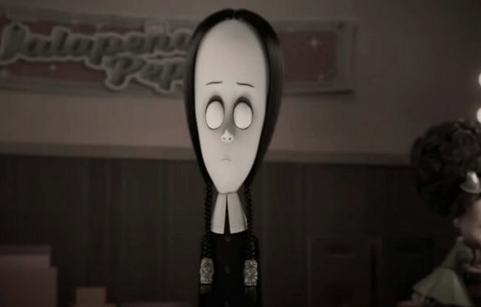

This article has been written and researched by our expert Loveable through a precise methodology. [Learn more about our methodology](https://avada.io/loveable/our-methodological.html)

[Loveable](https://avada.io/loveable/) > [Blog](https://avada.io/loveable/blog/) > [Holiday](https://avada.io/loveable/holiday/)

# 39 Most Famous Halloween Cartoon Characters of All Time

Written by [Blake Simpson](https://avada.io/loveable/author/blake/) Last Updated on September 11, 2023

- [1\. Famous Halloween Cartoon Character: Casper The Ghost](https://avada.io/loveable/blog/famous-halloween-cartoon-characters/#wp-block-heading-2-5)
- [2\. Scooby-Doo (The Scooby-Doo)](https://avada.io/loveable/blog/famous-halloween-cartoon-characters/#wp-block-heading-2-8)
- [3\. Jack Skellington (The Nightmare Before Christmas)](https://avada.io/loveable/blog/famous-halloween-cartoon-characters/#wp-block-heading-2-11)
- [4\. Witch Hazel (Looney Tunes)](https://avada.io/loveable/blog/famous-halloween-cartoon-characters/#wp-block-heading-2-14)
- [5\. Shaggy Rogers (Scooby-Doo)](https://avada.io/loveable/blog/famous-halloween-cartoon-characters/#wp-block-heading-2-17)
- [6\. Winnie the Pooh (as a bee)](https://avada.io/loveable/blog/famous-halloween-cartoon-characters/#wp-block-heading-2-20)
- [7\. Broom-Hilda](https://avada.io/loveable/blog/famous-halloween-cartoon-characters/#wp-block-heading-2-23)
- [8\. Grim (The Grim Adventures of Billy & Mandy)](https://avada.io/loveable/blog/famous-halloween-cartoon-characters/#wp-block-heading-2-26)
- [9\. Charlie Brown (It’s the Great Pumpkin, Charlie Brown)](https://avada.io/loveable/blog/famous-halloween-cartoon-characters/#wp-block-heading-2-29)
- [10\. Wile E. Coyote (Looney Tunes)](https://avada.io/loveable/blog/famous-halloween-cartoon-characters/#wp-block-heading-2-32)
- [11\. Count Duckula](https://avada.io/loveable/blog/famous-halloween-cartoon-characters/#wp-block-heading-2-35)
- [12\. The Grinch (The Grinch Who Stole Christmas)](https://avada.io/loveable/blog/famous-halloween-cartoon-characters/#wp-block-heading-2-38)
- [13\. The Ghostbusters](https://avada.io/loveable/blog/famous-halloween-cartoon-characters/#wp-block-heading-2-42)
- [14\. Slimer (Ghostbusters)](https://avada.io/loveable/blog/famous-halloween-cartoon-characters/#wp-block-heading-2-45)
- [15\. Ichabod Crane (The Legend of Sleepy Hollow)](https://avada.io/loveable/blog/famous-halloween-cartoon-characters/#wp-block-heading-2-48)
- [16\. Papa Smurf (as a wizard)](https://avada.io/loveable/blog/famous-halloween-cartoon-characters/#wp-block-heading-2-51)
- [17\. Beetlejuice](https://avada.io/loveable/blog/famous-halloween-cartoon-characters/#wp-block-heading-2-54)
- [18\. The Wicked Witch of the West (The Wizard of Oz)](https://avada.io/loveable/blog/famous-halloween-cartoon-characters/#wp-block-heading-2-57)
- [19\. Garfield](https://avada.io/loveable/blog/famous-halloween-cartoon-characters/#wp-block-heading-2-60)
- [20\. Mr. Burns (The Simpsons)](https://avada.io/loveable/blog/famous-halloween-cartoon-characters/#wp-block-heading-2-63)
- [21\. Monsters Inc](https://avada.io/loveable/blog/famous-halloween-cartoon-characters/#wp-block-heading-2-66)
- [22\. Corpse Bride](https://avada.io/loveable/blog/famous-halloween-cartoon-characters/#wp-block-heading-2-69)
- [23\. Morticia Addams (The Adams Family)](https://avada.io/loveable/blog/famous-halloween-cartoon-characters/#wp-block-heading-2-72)
- [24\. Wednesday (The Adams Family)](https://avada.io/loveable/blog/famous-halloween-cartoon-characters/#wp-block-heading-2-75)
- [25\. Beetlejuice](https://avada.io/loveable/blog/famous-halloween-cartoon-characters/#wp-block-heading-2-78) 
- [26\. Witch in Snow White (The Evil Queen)](https://avada.io/loveable/blog/famous-halloween-cartoon-characters/#wp-block-heading-2-81)
- [27\. Lucifer Morningstar (Lucifer)](https://avada.io/loveable/blog/famous-halloween-cartoon-characters/#wp-block-heading-2-84)
- [28\. Eustace Bagge (Courage the Cowardly Dog)](https://avada.io/loveable/blog/famous-halloween-cartoon-characters/#wp-block-heading-2-88)
- [29\. Di Lung (Courage the Cowardly Dog)](https://avada.io/loveable/blog/famous-halloween-cartoon-characters/#wp-block-heading-2-91)
- [30\. Maleficent (Sleeping Beauty)](https://avada.io/loveable/blog/famous-halloween-cartoon-characters/#wp-block-heading-2-94)
- [31\. Jafar (Alladin)](https://avada.io/loveable/blog/famous-halloween-cartoon-characters/#wp-block-heading-2-97)
- [32\. Ursula (The Little Mermaid)](https://avada.io/loveable/blog/famous-halloween-cartoon-characters/#wp-block-heading-2-100)
- [33\. Cruella De Vil (101 Dalmatians)](https://avada.io/loveable/blog/famous-halloween-cartoon-characters/#wp-block-heading-2-103)
- [34\. Scar (Lion King)](https://avada.io/loveable/blog/famous-halloween-cartoon-characters/#wp-block-heading-2-106)
- [35\. Captain Hook (Peter Pan)](https://avada.io/loveable/blog/famous-halloween-cartoon-characters/#wp-block-heading-2-109)
- [36\. Gaston (Beauty and the Beast)](https://avada.io/loveable/blog/famous-halloween-cartoon-characters/#wp-block-heading-2-113)
- [37\. Voldemort (Harry Potter series)](https://avada.io/loveable/blog/famous-halloween-cartoon-characters/#wp-block-heading-2-116)
- [38\. Hannibal Lecter (The Silence Of The Lambs)](https://avada.io/loveable/blog/famous-halloween-cartoon-characters/#wp-block-heading-2-119)
- [39\. The Joker (The Joker)](https://avada.io/loveable/blog/famous-halloween-cartoon-characters/#wp-block-heading-2-122)
- [Bottom Line](https://avada.io/loveable/blog/famous-halloween-cartoon-characters/#wp-block-heading-2-126) 

Welcome to our spooky exploration of Halloween’s most famous characters! Get ready to meet the chilling icons that have haunted this holiday for ages. From classic tales to modern tales, these characters embody the true spirit of Halloween and have been thrilling and chilling us for years.

We’ll take you on a journey through their origins and how they’ve evolved over time. Whether it’s ghosts, mischievous creatures, or mystical beings, these Halloween characters have captured our imagination and made this season truly special.

So, gather ’round and get ready for a fun and eerie ride as we uncover the secrets behind the “41 Most Famous **Halloween Cartoon Characters** of All Time.” But remember, things might get a little spooky, so brace yourself for a delightful scare! Let’s dive in and have a howling good time!

These characters will definitely be great ideas for [**kids’ Halloween costumes**](https://avada.io/loveable/halloween-costumes-for-kids/) this year!

## **1\. Famous Halloween Cartoon Character: Casper The Ghost**

The Friendly Ghost, is an absolute classic in the world of Halloween cartoons. With his adorable, innocent demeanor and desire to make friends rather than scare people, Casper has stolen the hearts of both young and old. Growing up, I always looked forward to watching his heartwarming adventures, and even now, I find myself revisiting those episodes for a delightful trip down memory lane. Casper’s ability to blend spooky elements with a heartwarming message of friendship is what makes him timeless.

## **2\. Scooby-Doo (The Scooby-Doo)**

Mystery-solving has never been as entertaining and humorous as when Scooby-Doo and the gang get involved. The animated series has been a staple in my Halloween traditions for years. From unmasking villains to running from ghosts in comical fashion, Scooby-Doo never fails to make me laugh. As an avid fan, I appreciate the show’s ability to balance suspense and humor while teaching the value of teamwork and courage.

## **3\. Jack Skellington (The Nightmare Before Christmas)**

Jack Skellington, the Pumpkin King, is a character that has successfully blurred the lines between Halloween and Christmas. Tim Burton’s masterpiece, “The Nightmare Before Christmas,” showcases Jack’s yearning for something more, and his adventures in the world of both holidays are captivating. Jack’s struggle to find his place and his genuine curiosity about the unknown resonates with audiences on a deeper level, making him one of my all-time favorite Halloween characters.

## **4\. Witch Hazel (Looney Tunes)**

Witch Hazel, with her zany antics and quirky spells, is a standout character in Looney Tunes’ Halloween episodes. Her ability to create chaos with good intentions is both amusing and endearing. Watching her interact with Bugs Bunny or any other Looney Tunes character brings an extra layer of fun to the Halloween festivities.

## **5\. Shaggy Rogers (Scooby-Doo)**

Shaggy Rogers, the food-loving, cowardly member of the Mystery Inc. gang, is one of the most iconic Halloween cartoon characters. His constant fear of ghosts and monsters, paired with his hilarious and insatiable appetite for Scooby snacks, never fails to crack me up. Shaggy’s lighthearted and carefree personality adds a sense of ease to the spookier adventures, making him a relatable and lovable character for all ages.

## **6\. Winnie the Pooh (as a bee)**

Seeing the ever-so-sweet Winnie the Pooh dressed as a bee for Halloween is simply adorable. Pooh’s childlike innocence and kind-hearted nature make him an endearing character throughout the year, but his cute bee costume adds an extra touch of joy to the Halloween season. It reminds me of the simple joys of dressing up and collecting candy during my childhood.

## **7\. Broom-Hilda**

Broom-Hilda, the no-nonsense witch from comic strips, brings a refreshing perspective to Halloween cartoons. Her witty humor and distinct personality make her stand out among the witch characters. I’ve always admired her for breaking stereotypes and showing that witches can be strong, independent, and hilarious.

## **8\. Grim (The Grim Adventures of Billy & Mandy)**

Grim, the skeletal Reaper, might seem like an unlikely candidate for a fun Halloween character, but “The Grim Adventures of Billy & Mandy” proves otherwise. Grim’s interactions with the quirky and mischievous kids, Billy and Mandy, never fail to bring a smile to my face. The show’s blend of darkness, comedy, and even life lessons makes it a must-watch during the Halloween season.

## **9\. Charlie Brown (It’s the Great Pumpkin, Charlie Brown)**

Charlie Brown’s sincere longing for a meaningful Halloween experience in “It’s the Great Pumpkin, Charlie Brown” is both heartwarming and relatable. Watching him navigate through disappointments and triumphs during the holiday season is a poignant reminder of the importance of hope and friendship, even amidst Halloween hilarity.

## **10\. Wile E. Coyote (Looney Tunes)**

While not exclusively a Halloween character, Wile E. Coyote’s relentless pursuit of the Road Runner fits perfectly with the spirit of the season. His comical and elaborate traps never cease to entertain me, and I can’t help but root for him, even though I know he’ll never catch that elusive bird. Wile E. Coyote’s perseverance is a reminder to never give up, no matter the odds.

## **11\. Count Duckula**

Count Duckula, the vegetarian vampire duck, is a unique and humorous take on the traditional vampire character. His quirky adventures and offbeat humor make him a standout Halloween character that always leaves me chuckling. I appreciate how the show turns typical vampire tropes on its head, offering a fresh and amusing perspective.

## **12\. The Grinch (The Grinch Who Stole Christmas)**

Although primarily associated with Christmas, the Grinch’s mischievous and spooky nature makes him a fitting character for Halloween as well. Dr. Seuss’s creation showcases how even a creature initially grumpy and mean can find a heartwarming transformation, reinforcing the message of love and kindness during the holiday season.

**Related:** _Best [Grinch Christmas Gifts](https://avada.io/loveable/grinch-christmas-gifts/) To Make Your Holiday More Special_

## **13\. The Ghostbusters**

The Ghostbusters bring a unique blend of action, humor, and spookiness to the screen, making them a Halloween favorite for many. I have fond memories of watching the Ghostbusters tackle ghosts and spirits with their proton packs and witty banter. Their courage and camaraderie inspire viewers to face their fears head-on.

## **14\. Slimer (Ghostbusters)**

Slimer, the friendly green ghost, adds an element of playfulness to the Ghostbusters’ adventures. His humorous interactions with the team, along with his insatiable appetite for food, make him an endearing and unforgettable Halloween cartoon character.

## **15\. Ichabod Crane (The Legend of Sleepy Hollow)**

Ichabod Crane’s encounter with the Headless Horseman in “The Legend of Sleepy Hollow” is a classic Halloween tale that never loses its allure. The suspense and eerie atmosphere surrounding the story continue to captivate audiences, making Ichabod Crane a memorable character in Halloween folklore.

## **16\. Papa Smurf (as a wizard)**

Seeing Papa Smurf dressed as a wizard during Halloween episodes adds a touch of magic to the beloved Smurf village. His wisdom, care, and fatherly nature are beautifully represented through his whimsical costume, reminding us of the importance of nurturing and guidance during festive times.

## **17\. Beetlejuice**

Beetlejuice, the mischievous and quirky spirit from the movie of the same name, brings a darker and edgier side to Halloween-themed cartoons. Despite his antics and unconventional methods, Beetlejuice manages to charm audiences with his unique personality.

## **18\. The Wicked Witch of the West (The Wizard of Oz)**

The Wicked Witch of the West is a classic Halloween villain, adding a touch of darkness to the otherwise colorful and magical world of “The Wizard of Oz.” Her cackles and sinister schemes make her an iconic character that stands the test of time.

## **19\. Garfield**

Garfield’s love for lasagna, his aversion to work, and his humorous approach to life make him a delightful character to watch during Halloween. His laid-back attitude and wit bring a sense of relaxation to the holiday season, reminding us to enjoy the simple pleasures of life.

## **20\. Mr. Burns (The Simpsons)**

Though not exclusively focused on Halloween, Mr. Burns’ villainous and eccentric personality often features in the “Treehouse of Horror” episodes of “The Simpsons.” His presence adds a hint of eerie and dark humor to the beloved animated series, making these Halloween specials an anticipated annual tradition for many fans.

## **21\. Monsters Inc**

Monsters Inc, the delightful computer-animated movie from Pixar and Disney, centers around two best friends, Mike and Sulley, who happen to be monsters. Working at Monsters Inc, they generate power by scaring children and collecting their screams. But everything takes a delightful turn when a young girl named Boo sneaks into their factory and completely changes the monsters’ perception of children.

## **22\. Corpse Bride**

Corpse Bride, the enchanting stop-motion animation movie by the masterful Tim Burton, tells a captivating tale. As a soft-spoken groom rehearses his wedding vows in the woods, a remarkable event unfolds. A young woman, rising from her grave, believes he has unwittingly married her. This unexpected encounter leads to an extraordinary adventure filled with love, mystery, and the supernatural. Get ready to be whisked away into a world where the boundaries between life and death blur, and a heartfelt story awaits to capture your imagination.

## **23\. Morticia Addams (The Adams Family)**

Morticia Addams, the mother of Wednesday and Pugsley, is married to Gomez and towers over him in height. A versatile and talented woman, she’s portrayed playing musical instruments and speaking multiple languages, adding depth to her character in the Addams Family series.

## **24\. Wednesday (The Adams Family)**

Wednesday Addams, the daughter of Gomez and Morticia, holds a fascination with all things related to death. As the older sibling to her brother Pugsley, she often subjects him to her curious experiments. With her unique and morbid interests, Wednesday adds an intriguing and delightfully dark element to the Addams Family dynamic.

## **25\. Beetlejuice** 

[Beetlejuice](https://www.imdb.com/title/tt0094721/), the mischievous ghost from the eponymous cartoon show, takes pleasure in devouring bugs and playing tricks on others. His distinctive appearance includes a black and white striped suit, red nails, green jagged teeth, and wild blonde hair, making him an unforgettable and iconic character in the series.

## **26\. Witch in Snow White (The Evil Queen)**

In Snow White, the Evil Queen adopts the guise of an old witch to deceive and deliver a poisoned apple to Snow White in the forest. Gaining the princess’s trust, she tricks her into eating the deadly fruit. However, her wicked plans are thwarted when the seven dwarfs pursue her to a cliff’s edge, leading to her ultimate demise.

## **27\. Lucifer Morningstar (Lucifer)**

Lucifer Morningstar, as a Halloween character, brings a unique and captivating twist to the spooky season. Inspired by DC Comics and popularized by the television series “Lucifer,” this character is a fascinating portrayal of the devil himself, exploring his life in Los Angeles after retiring from Hell.

What sets Lucifer Morningstar apart as a Halloween character is his charm, wit, and moral ambiguity. Instead of being a purely menacing figure, he is portrayed as a complex and charismatic being with a penchant for indulgence and desire.

## **28\. Eustace Bagge (Courage the Cowardly Dog)**

Living in the middle of Nowhere, Kansas, Eustace Bagge is a farmer accompanied by his wife Muriel and her loyal dog Courage. While often antagonistic towards Courage, Eustace’s life takes unexpected turns as he finds himself both allying with and being rescued by the courageous canine. These experiences occasionally lead to moments of respect towards Courage.

## **29\. Di Lung (Courage the Cowardly Dog)**

Di Lung is a recurring character and antagonist in the animated series Courage the Cowardly Dog. He often functions as a plot device, playing various antagonistic roles throughout the show. For instance, he once turned Courage into a fly in an episode titled “Courage the Fly.” Additionally, he created Mecha-Courage to replace the titular character in the episode “Courage vs. Mecha-Courage.” Di Lung’s appearances add complexity and challenges to Courage’s adventures, making him a compelling and formidable presence in the series.

## **30\. Maleficent (Sleeping Beauty)**

Maleficent, Disney’s main antagonist in Sleeping Beauty, embodies pure evil, wreaking havoc in King Stefan’s kingdom. Enraged by not being invited to Princess Aurora’s christening, she curses her to a dreadful fate. Her dark, elegant design, flamboyant animation, and formidable magic powers make her an iconic and beloved Disney Villain, holding a significant place in the franchise. Accompanied by her pet raven, Diablo, Maleficent remains a memorable and powerful presence throughout the classic animated film.

## **31\. Jafar (Alladin)**

Jafar, the main antagonist in Disney’s Aladdin, starts as the Sultan’s trusted advisor but secretly harbors a deep disdain for him. He becomes obsessed with obtaining a magic lamp housing a powerful genie, intending to seize control over the throne and the world. Loosely inspired by the wicked sorcerer and vizier from the Aladdin folk tale, Jafar exudes elegance, cheekiness, and a menacing sense of humor. With these captivating qualities, he has earned a spot as one of Disney’s most iconic and renowned villains, making him a prominent figure in the Disney Villains franchise.

## **32\. Ursula (The Little Mermaid)**

Ursula, also known as the Sea Witch, takes on the role of the main antagonist in Disney’s The Little Mermaid (1989). As a villainous Cecaelia, she cunningly strikes deals with merfolk, promising to fulfill their dreams, but her contracts serve her own wicked ambitions, causing misery in return. Banished from King Triton’s palace in the past, she seeks vengeance by harnessing the king’s trident and aspiring to rule the entire ocean. Notably, Ursula stands out as a prominent member of the Disney Villains lineup, leaving a lasting impact on audiences worldwide.

## **33\. Cruella De Vil (101 Dalmatians)**

Cruella De Vil, the main antagonist of Disney’s 1961 animated feature film 101 Dalmatians, is an eccentric and fashion-obsessed heiress with a sinister obsession for fur coats made from Dalmatian puppies. Her mania drives her to commit immoral acts, such as kidnapping and slaughter, as she is aided by her henchmen, Jasper and Horace. Cruella’s striking appearance and murderous intentions have solidified her place as one of Disney’s most iconic and feared villains, making her a primary member of the Disney Villains franchise.

## **34\. Scar (Lion King)**

Scar, the main antagonist in Disney’s 1994 animated film The Lion King, is the envious brother of Mufasa and the second-born Prince of the Pride Lands. Fueled by jealousy and a sense of entitlement when Simba is born, Scar hatches a treacherous plot to usurp the throne, with the help of his hyena minions. Infamous for murdering Mufasa, Scar has earned a place as one of Disney’s most notorious villains, securing his spot as a primary member of the Disney Villains franchise.

## **35\. Captain Hook (Peter Pan)**

Captain Hook serves as the main antagonist in Disney’s 1953 animated film, Peter Pan. As an elegant yet bloodthirsty pirate, he commands The Jolly Roger in Neverland, seeking revenge on Peter Pan for cutting off his left hand and feeding it to a crocodile, which now relentlessly pursues him. 

Despite his efforts, Hook is often foiled by Peter’s flying abilities and the bumbling incompetence of his first mate, Mr. Smee. Despite his villainous nature, Hook’s frustrations and sympathetic qualities make him one of Disney’s most recognizable and beloved villains, with his comical interactions with the crocodile being among Disney’s funniest animated scenes.

## **36\. Gaston (Beauty and the Beast)**

Gaston, the main antagonist in Disney’s 1991 animated film Beauty and the Beast, is an arrogant and chauvinistic hunter. He becomes consumed by the desire to marry Belle, even resorting to force if needed. His relentless obsession transforms him into a ruthless and treacherous villain, particularly when he learns that Belle’s heart belongs to the Beast instead of him. Gaston’s toxic behavior and unyielding pursuit of Belle make him a formidable and memorable Disney villain in the beloved classic.

## **37\. Voldemort (Harry Potter series)**

Some believe Voldemort’s name was inspired by Edgar Allan Poe’s decaying character, M. Valdemar, but the truth lies in J.K. Rowling’s love for French, resulting in the moniker meaning “flight of death.” Rowling wanted a name that conveyed power and exoticism for the formidable Death Eater Supreme. Voldemort indeed lives up to these descriptions, being a chilling blend of man and snake, with a slit nose and cold-blooded nature. His mastery of dark magic is so complete that he can fly without a broomstick, and his presence looms in every shadow.

## **38\. Hannibal Lecter (The Silence Of The Lambs)**

While most great villains are defined by their actions, it’s Hopkins’ stillness that makes him truly unsettling. When staring at Jodie Foster’s Starling through toughened glass, he unnervingly peels away her layers with softly spoken words. Lecter’s horrific acts are more implied than shown, yet his tongue proves as deadly as a blade or bullet. Though somewhat diluted by later adaptations, Lecter remains a captivating and formidable foe.

## **39\. The Joker (The Joker)**

The Joker, originating as a maniac in comic books, evolved through various portrayals, from Cesar Romero’s campy version on screens to Mark Hamill’s animated take. Tim Burton and Jack Nicholson brought darker shades in the 1989 movie re-invention. However, Chris Nolan and Heath Ledger found the perfect form for the character in The Dark Knight (2008), grounding him in a more realistic film universe. 

Ledger’s Joker is a captivating embodiment of ugly beauty, relentless in achieving his aims, and as Michael Caine’s Alfred puts it, he just wants to watch the world burn. Joaquin Phoenix’s portrayal in Todd Phillips’ Joker showcased the character independently, without the presence of Batman, earning him an Oscar-winning performance

## **Bottom Line** 

The captivating world of **Halloween cartoon characters** has left an enduring impression on our hearts and minds. From mischievous pranks to heartwarming adventures, these animated icons have become an integral part of the Halloween festivities, sparking joy and nostalgia among audiences of all ages. As we gather each year to celebrate this spooky season, we can’t help but be reminded of the timeless appeal and imaginative spirit these characters bring to our lives. With their playful presence, they continue to weave their magic, making Halloween an enchanting and delightful experience for generations to come.

- [1\. Famous Halloween Cartoon Character: Casper The Ghost](https://avada.io/loveable/blog/famous-halloween-cartoon-characters/#wp-block-heading-2-5)
- [2\. Scooby-Doo (The Scooby-Doo)](https://avada.io/loveable/blog/famous-halloween-cartoon-characters/#wp-block-heading-2-8)
- [3\. Jack Skellington (The Nightmare Before Christmas)](https://avada.io/loveable/blog/famous-halloween-cartoon-characters/#wp-block-heading-2-11)
- [4\. Witch Hazel (Looney Tunes)](https://avada.io/loveable/blog/famous-halloween-cartoon-characters/#wp-block-heading-2-14)
- [5\. Shaggy Rogers (Scooby-Doo)](https://avada.io/loveable/blog/famous-halloween-cartoon-characters/#wp-block-heading-2-17)
- [6\. Winnie the Pooh (as a bee)](https://avada.io/loveable/blog/famous-halloween-cartoon-characters/#wp-block-heading-2-20)
- [7\. Broom-Hilda](https://avada.io/loveable/blog/famous-halloween-cartoon-characters/#wp-block-heading-2-23)
- [8\. Grim (The Grim Adventures of Billy & Mandy)](https://avada.io/loveable/blog/famous-halloween-cartoon-characters/#wp-block-heading-2-26)
- [9\. Charlie Brown (It’s the Great Pumpkin, Charlie Brown)](https://avada.io/loveable/blog/famous-halloween-cartoon-characters/#wp-block-heading-2-29)
- [10\. Wile E. Coyote (Looney Tunes)](https://avada.io/loveable/blog/famous-halloween-cartoon-characters/#wp-block-heading-2-32)
- [11\. Count Duckula](https://avada.io/loveable/blog/famous-halloween-cartoon-characters/#wp-block-heading-2-35)
- [12\. The Grinch (The Grinch Who Stole Christmas)](https://avada.io/loveable/blog/famous-halloween-cartoon-characters/#wp-block-heading-2-38)
- [13\. The Ghostbusters](https://avada.io/loveable/blog/famous-halloween-cartoon-characters/#wp-block-heading-2-42)
- [14\. Slimer (Ghostbusters)](https://avada.io/loveable/blog/famous-halloween-cartoon-characters/#wp-block-heading-2-45)
- [15\. Ichabod Crane (The Legend of Sleepy Hollow)](https://avada.io/loveable/blog/famous-halloween-cartoon-characters/#wp-block-heading-2-48)
- [16\. Papa Smurf (as a wizard)](https://avada.io/loveable/blog/famous-halloween-cartoon-characters/#wp-block-heading-2-51)
- [17\. Beetlejuice](https://avada.io/loveable/blog/famous-halloween-cartoon-characters/#wp-block-heading-2-54)
- [18\. The Wicked Witch of the West (The Wizard of Oz)](https://avada.io/loveable/blog/famous-halloween-cartoon-characters/#wp-block-heading-2-57)
- [19\. Garfield](https://avada.io/loveable/blog/famous-halloween-cartoon-characters/#wp-block-heading-2-60)
- [20\. Mr. Burns (The Simpsons)](https://avada.io/loveable/blog/famous-halloween-cartoon-characters/#wp-block-heading-2-63)
- [21\. Monsters Inc](https://avada.io/loveable/blog/famous-halloween-cartoon-characters/#wp-block-heading-2-66)
- [22\. Corpse Bride](https://avada.io/loveable/blog/famous-halloween-cartoon-characters/#wp-block-heading-2-69)
- [23\. Morticia Addams (The Adams Family)](https://avada.io/loveable/blog/famous-halloween-cartoon-characters/#wp-block-heading-2-72)
- [24\. Wednesday (The Adams Family)](https://avada.io/loveable/blog/famous-halloween-cartoon-characters/#wp-block-heading-2-75)
- [25\. Beetlejuice](https://avada.io/loveable/blog/famous-halloween-cartoon-characters/#wp-block-heading-2-78) 
- [26\. Witch in Snow White (The Evil Queen)](https://avada.io/loveable/blog/famous-halloween-cartoon-characters/#wp-block-heading-2-81)
- [27\. Lucifer Morningstar (Lucifer)](https://avada.io/loveable/blog/famous-halloween-cartoon-characters/#wp-block-heading-2-84)
- [28\. Eustace Bagge (Courage the Cowardly Dog)](https://avada.io/loveable/blog/famous-halloween-cartoon-characters/#wp-block-heading-2-88)
- [29\. Di Lung (Courage the Cowardly Dog)](https://avada.io/loveable/blog/famous-halloween-cartoon-characters/#wp-block-heading-2-91)
- [30\. Maleficent (Sleeping Beauty)](https://avada.io/loveable/blog/famous-halloween-cartoon-characters/#wp-block-heading-2-94)
- [31\. Jafar (Alladin)](https://avada.io/loveable/blog/famous-halloween-cartoon-characters/#wp-block-heading-2-97)
- [32\. Ursula (The Little Mermaid)](https://avada.io/loveable/blog/famous-halloween-cartoon-characters/#wp-block-heading-2-100)
- [33\. Cruella De Vil (101 Dalmatians)](https://avada.io/loveable/blog/famous-halloween-cartoon-characters/#wp-block-heading-2-103)
- [34\. Scar (Lion King)](https://avada.io/loveable/blog/famous-halloween-cartoon-characters/#wp-block-heading-2-106)
- [35\. Captain Hook (Peter Pan)](https://avada.io/loveable/blog/famous-halloween-cartoon-characters/#wp-block-heading-2-109)
- [36\. Gaston (Beauty and the Beast)](https://avada.io/loveable/blog/famous-halloween-cartoon-characters/#wp-block-heading-2-113)
- [37\. Voldemort (Harry Potter series)](https://avada.io/loveable/blog/famous-halloween-cartoon-characters/#wp-block-heading-2-116)
- [38\. Hannibal Lecter (The Silence Of The Lambs)](https://avada.io/loveable/blog/famous-halloween-cartoon-characters/#wp-block-heading-2-119)
- [39\. The Joker (The Joker)](https://avada.io/loveable/blog/famous-halloween-cartoon-characters/#wp-block-heading-2-122)
- [Bottom Line](https://avada.io/loveable/blog/famous-halloween-cartoon-characters/#wp-block-heading-2-126) 

### [Blake Simpson](https://avada.io/loveable/author/blake/)

Hi, I'm Blake from Loveable. I help people find perfect gifts for occasions like anniversaries and weddings. I also write a blog about holidays, sharing insights to make them more meaningful. Let's create unforgettable moments together!

- [Twitter](https://twitter.com/intent/tweet)
- [Facebook](https://www.facebook.com/sharer/sharer.php)
- [instagram](https://avada.io/loveable/blog/famous-halloween-cartoon-characters/)
- [pinterest](https://www.pinterest.com/loveablellc/)

## Related Posts

[### 120+ Christian Birthday Wishes To Spread Your Love](https://avada.io/loveable/blog/christian-birthday-wishes/) 

[

### 35 Best 70th Birthday Ideas To Celebrate The Special Milestone

](https://avada.io/loveable/blog/70th-birthday-ideas/)

[

### 50 Best 30th Birthday Decorations for a Remarkable Birthday Bash

](https://avada.io/loveable/blog/30th-birthday-decorations/)

[

### 40 Delicious Vegan Christmas Desserts to Delight Your Palate

](https://avada.io/loveable/blog/vegan-christmas-desserts/)

[

### 60 Christmas Team Building Activities to Boost Workplace Spirit

](https://avada.io/loveable/blog/christmas-team-building-activities/)
