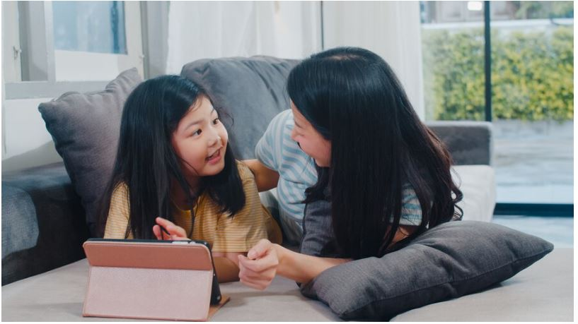
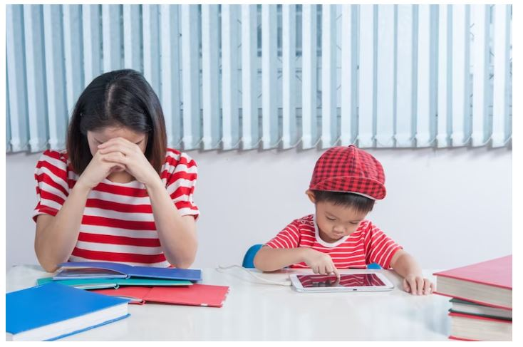

This article has been written and researched by our expert Loveable through a precise methodology. [Learn more about our methodology](https://avada.io/loveable/our-methodological.html)

[Loveable](https://avada.io/loveable/) > [Blog](https://avada.io/loveable/blog/) > [Parenting](https://avada.io/loveable/parenting/)

# 4 Types Of Parenting Styles And Effects On Children | According To Psychologists

Written by [Benjamin Collins](https://avada.io/loveable/author/benjamin/) Last Updated on August 25, 2023

- [4 Different Types Of Parenting Styles](https://avada.io/loveable/blog/types-of-parenting-styles/#wp-block-heading-2-3)
    - [Authoritative Parenting Style](https://avada.io/loveable/blog/types-of-parenting-styles/#wp-block-heading-3-4)
    - [Authoritarian Parenting Style](https://avada.io/loveable/blog/types-of-parenting-styles/#wp-block-heading-3-15)
    - [Permissive Parenting Style](https://avada.io/loveable/blog/types-of-parenting-styles/#wp-block-heading-3-27)
    - [Neglectful Parenting Style](https://avada.io/loveable/blog/types-of-parenting-styles/#wp-block-heading-3-39)
- [What parenting style works best for you?](https://avada.io/loveable/blog/types-of-parenting-styles/#wp-block-heading-2-51)
- [Final Words](https://avada.io/loveable/blog/types-of-parenting-styles/#wp-block-heading-2-62)

Each parenting style has its own unique methods for raising kids, as well as advantages and disadvantages that are unique to it. Individuals frequently want to know which parenting approach they are employing—and which is the best. Although there isn’t a single best way to raise a child, the majority of professionals, including the [American Academy of Pediatrics](https://www.aap.org/) (AAP), advocate an authoritative style of parenting.

Find out more about the four main **types of parenting styles**, their importance, how to identify your own parenting style, and when and how to modify it if necessary.

## 4 Different Types Of Parenting Styles

### Authoritative Parenting Style

In addition to enforcing rules and administering punishments, authoritative parents also take into account their children’s opinions. Although they recognize their children’s feelings, they also stress that, in the end, it is the adults who have the final say. The most effective and developmentally appropriate parenting approach is this one, according to science and experts.

Authoritative parents often put time and effort into avoiding behavioral issues before they arise. Moreover, they employ positive disciplinary techniques like reward and praise systems to promote good conduct.

Authoritative parents also take into account their children’s opinions

Typical characteristics:

- Gives high responsiveness and demandingness
- Applies to their kids with clear rules and expectations while expressing adaptability and understanding
- Communicates regularly; understands and considers the ideas, feelings, and views of their children
- Allows natural consequences to happen, but makes use of the chance to have them reflect and learn

Studies have shown that children with authoritative parents are more likely to grow up to be responsible individuals who are at ease advocating for themselves and expressing their thoughts and feelings.

Children who are raised in an authoritative manner are more likely to be successful and happy. Also, they are more likely to be capable decision-makers who work independently and identify safety risks.

### Authoritarian Parenting Style

Authoritarian parents feel that their children must always follow the rules. These parents are famous for stating, “Because I said so,” when a youngster asks the reasoning for a regulation. Instead of communicating, they are more focused on obeying. 

Also, they forbid youngsters from participating in hurdles or tasks that require problem-solving. Instead, they set the rules and impose the punishments without taking into account a child’s perspective.

Punishments may be used as a substitute for discipline in these types of parenting styles. So, they are interested in making youngsters feel bad about their mistakes rather than teaching them how to make better decisions. When their parents are stern and authoritarian, children have a tendency to obey the rules most of the time. Yet there is a cost to their compliance.

Authoritarian parents feel that their children must always follow the rules

Typical characteristics:

- High expectations, poor response
- Enforces tight rules without much regard for the concerns of their child’s social, emotional, or behavioral issues.
- Often responds “because I said so” when their child asks why a rule or penalty is in place.
- The majority of communication is from a parent to a child.

Due to their lack of respect, children of authoritarian parents are more likely to experience issues with their self-esteem.

Moreover, they could get angry or violent. They frequently concentrate on the rage they feel against their parents or themselves for not living up to parental expectations rather than on how to do things better in the future. Authoritarian parents are frequently stern, which may cause their kids to develop strong lying skills in an effort to escape punishment.

### Permissive Parenting Style

Among, the types of [different parenting styles](https://avada.io/loveable/blog/different-parenting-styles/), permissive parents are accommodating. They typically wait until there is a serious problem before getting involved.

They take a “kids will be kids” approach and are generally tolerant. Even if they do impose fines, they might not make them persist. If a youngster pleads for their privileges, they might return them, and if they promise to behave well, they might let them out of time-out early.

Parents that are liberal with their children typically act more like friends than parents. They frequently urge their kids to talk to them about their issues, but they typically don’t make an attempt to prevent wrong decisions or bad conduct.

They take a “kids will be kids” approach and are generally tolerant

Typical characteristics:

- Good response, minimal demand
- Readily shares information and frequently defer to their children’s decisions rather than dictating what to do.
- Regulations and standards are either not established or infrequently upheld.
- Usually, goes to tremendous measures to please their children, often at the sacrifice of themselves.

Children who have lenient parents are more likely to have scholastic difficulties as adults. Because they don’t respect authority and norms, they could have greater behavioral issues. They frequently exhibit poor self-esteem and may express great melancholy.

Also, they are more susceptible to health issues like obesity since permissive parents find it difficult to encourage regular exercise, healthy eating, or good sleep hygiene. Because lax parents sometimes don’t enforce beneficial behaviors, including making sure a child washes their teeth, they are even more likely to have dental cavities.

### Neglectful Parenting Style

Negligent parents frequently don’t know what their kids are up to. There are often not many regulations in the home. There could not be enough parental guidance, consideration, and care for the children.

Careless parents anticipate raising their children independently. They don’t put much effort or time into providing for the fundamental necessities of children. Although neglect by absent parents might occur, it’s not usually on purpose. 

For instance, a parent struggling with mental health concerns or drug addiction disorders might not be able to consistently meet a child’s physical or emotional requirements.

Other times, parents who aren’t interested don’t know much about how kids develop, or they could think their kid would do better without their supervision. However, there are instances when people are just overburdened by other issues like employment, household management, and bill-paying.

There could not be enough parental guidance, consideration, and care for the children.

Typical characteristics:

- Low demand and low response
- Mostly leaves their children to care for themselves, either because they are unconcerned with their needs or occupied/overwhelmed with other things.
- Less care, instruction, and nurturing are provided.
- Often suffers from their own concerns with self-worth and find it difficult to establish deep relationships.

Children with negligent parents are more prone to experience problems with self-esteem. They frequently perform badly academically. Also, they consistently display behavioral issues and are not very happy.

## What parenting style works best for you?

Independent, self-sufficient, and socially adept children are more likely to be raised by authoritarian parents, according to research.

Even though children of authoritative parents are not exempt from mental health problems, relationship issues, substance abuse, poor self-regulation, or low self-esteem, these components are more frequently observed in kids of parents who strictly follow authoritarian, permissive, or uninvolved parenting styles.

There is no “one size fits all” approach to how parents should educate their children, of course. Instead, you need to utilize a variety of types of parenting styles, but only in moderation, so you don’t have to adhere to just one sort.

What parenting style works best for you?

The most excellent parents are aware of when to adapt their approach based on the circumstance. When a child is sick, an authoritarian parent might wish to loosen some of their control while still being warm and nurturing. For example, allow them to enjoy ice cream for both lunch and dinner.

Moreover, if a child’s safety is in jeopardy, such as while crossing a busy roadway, a permissive parent may become more rigid. You will grasp my hand, for instance, whether you want to or not.

Use your best judgment, and always keep in mind that you should utilize the parenting approach that is most effective for your family at the moment. You can keep a pleasant connection with your younger while still getting your authority in a healthy manner if you are dedicated and committed to being the best parent as possible. And your youngster will benefit from your authoritative manner over time.

**_See More:_**

- [Attachment Parenting](https://avada.io/loveable/blog/attachment-parenting/) and Things You Need to Know 

- [Helicopter Parenting](https://avada.io/loveable/blog/helicopter-parenting/): Understanding the Pros, Cons, and Impact on Children

## Final Words

The majority of these parenting studies simply uncover associations between parenting practices and results, which should be taken into consideration when evaluating the findings. In other words, the outcomes are just correlated, not causal.

  
The ultimate aim of most parents is to bring up a child who will grow up to love them and their family and be a healthy, happy, kind, and responsible person. Also, they want to genuinely enjoy the parenting process.

- [4 Different Types Of Parenting Styles](https://avada.io/loveable/blog/types-of-parenting-styles/#wp-block-heading-2-3)
    - [Authoritative Parenting Style](https://avada.io/loveable/blog/types-of-parenting-styles/#wp-block-heading-3-4)
    - [Authoritarian Parenting Style](https://avada.io/loveable/blog/types-of-parenting-styles/#wp-block-heading-3-15)
    - [Permissive Parenting Style](https://avada.io/loveable/blog/types-of-parenting-styles/#wp-block-heading-3-27)
    - [Neglectful Parenting Style](https://avada.io/loveable/blog/types-of-parenting-styles/#wp-block-heading-3-39)
- [What parenting style works best for you?](https://avada.io/loveable/blog/types-of-parenting-styles/#wp-block-heading-2-51)
- [Final Words](https://avada.io/loveable/blog/types-of-parenting-styles/#wp-block-heading-2-62)

### [Benjamin Collins](https://avada.io/loveable/author/benjamin/)

I'm Benjamin Collins, a gift ideas creator at Loveable. We specialize in unique and personalized gifts for any occasion. With my honed skills, I recommend gifts tailored to the recipient's personality and interests, whether it's Halloween, Christmas, or any other celebration.

- [Twitter](https://twitter.com/intent/tweet)
- [Facebook](https://www.facebook.com/sharer/sharer.php)
- [instagram](https://avada.io/loveable/blog/types-of-parenting-styles/)
- [pinterest](https://www.pinterest.com/loveablellc/)

## Related Posts

[

### 79 Heartfelt Missing Mom Quotes for Expressing Love and Longing

](https://avada.io/loveable/blog/missing-mom-quotes/)

[

### Parenting with Depression: Strategies for Coping, Seeking Help, and Building Resilience

](https://avada.io/loveable/blog/parenting-with-depression/)

[

### 100 Empowering Single Mom Quotes: Inspirational Words for Strong Mothers

](https://avada.io/loveable/blog/single-mom-quotes/)

[

### 99+ Heartfelt Quotes And Wishes: Happy Anniversary to Mom and Dad!

](https://avada.io/loveable/blog/quotes-happy-anniversary-mom-dad/)

[

### 5 Ways to Foster a Positive Parent-Teacher Relationship

](https://avada.io/loveable/blog/parent-teacher-relationship/)
