This article has been written and researched by our expert Loveable through a precise methodology. [Learn more about our methodology](https://avada.io/loveable/our-methodological.html)

[Loveable](https://avada.io/loveable/) > [Blog](https://avada.io/loveable/blog/) > [Holiday](https://avada.io/loveable/holiday/)

# 40+ Baby Halloween Costumes that’ll Steal the Spotlight

Written by  Last Updated on October 03, 2023

- [40+ Baby Halloween Costumes That Are Too Cute to Scare](https://avada.io/loveable/blog/baby-halloween-costumes/#wp-block-heading-2-2)
    - [1.  No-Sew Elmo Costume](https://avada.io/loveable/blog/baby-halloween-costumes/#wp-block-heading-3-3) 
    - [2\. Olaf Halloween Costume](https://avada.io/loveable/blog/baby-halloween-costumes/#wp-block-heading-3-7)
    - [3\. Panda Bear Baby Costume](https://avada.io/loveable/blog/baby-halloween-costumes/#wp-block-heading-3-11)
    - [4\. No-Sew Bee Costume](https://avada.io/loveable/blog/baby-halloween-costumes/#wp-block-heading-3-15)
    - [5.  Baby Witch Costume](https://avada.io/loveable/blog/baby-halloween-costumes/#wp-block-heading-3-19)
    - [6\. Crochet Mesh Bonnet](https://avada.io/loveable/blog/baby-halloween-costumes/#wp-block-heading-3-23)
    - [7\. Dobby the House Elf Costume](https://avada.io/loveable/blog/baby-halloween-costumes/#wp-block-heading-3-27)
    - [8.  Yoda Jedi Grand Master](https://avada.io/loveable/blog/baby-halloween-costumes/#wp-block-heading-3-31)
    - [9\. Princess Leia Costume](https://avada.io/loveable/blog/baby-halloween-costumes/#wp-block-heading-3-35)
    - [10. Baby Cow Costume](https://avada.io/loveable/blog/baby-halloween-costumes/#wp-block-heading-3-39)
    - [11\. Baby Pumpkin Costume](https://avada.io/loveable/blog/baby-halloween-costumes/#wp-block-heading-3-43)
    - [12\. Baby Ewok Costume](https://avada.io/loveable/blog/baby-halloween-costumes/#wp-block-heading-3-46)
    - [13\. Baby Disney Princess Costume](https://avada.io/loveable/blog/baby-halloween-costumes/#wp-block-heading-3-49)
    - [14\. Baby Fluffy Chicken Costume](https://avada.io/loveable/blog/baby-halloween-costumes/#wp-block-heading-3-52)
    - [15\. Baby Skunk Costume](https://avada.io/loveable/blog/baby-halloween-costumes/#wp-block-heading-3-55)
    - [16\. Baby Fox Costume](https://avada.io/loveable/blog/baby-halloween-costumes/#wp-block-heading-3-58)
    - [17\. Fun World Lil’ Lobster Costume](https://avada.io/loveable/blog/baby-halloween-costumes/#wp-block-heading-3-61)
    - [18\. Lion Infant & Toddler Costumes](https://avada.io/loveable/blog/baby-halloween-costumes/#wp-block-heading-3-64)
    - [19\. Baby Penguin Costume](https://avada.io/loveable/blog/baby-halloween-costumes/#wp-block-heading-3-67)
    - [20\. Baby Bat Costume](https://avada.io/loveable/blog/baby-halloween-costumes/#wp-block-heading-3-70)
    - [21\. Monster-Boo Costume](https://avada.io/loveable/blog/baby-halloween-costumes/#wp-block-heading-3-73)
    - [22\. Child’s Star Wars Classic Yoda Costume](https://avada.io/loveable/blog/baby-halloween-costumes/#wp-block-heading-3-76)
    - [23\. Tinker Bell Costume](https://avada.io/loveable/blog/baby-halloween-costumes/#wp-block-heading-3-79)
    - [24\. Red Racer Long Jumpsuit](https://avada.io/loveable/blog/baby-halloween-costumes/#wp-block-heading-3-82)
    - [25\. Baby Astronaut Costume](https://avada.io/loveable/blog/baby-halloween-costumes/#wp-block-heading-3-85)
    - [26\. Baby Born to Be Wild Costume](https://avada.io/loveable/blog/baby-halloween-costumes/#wp-block-heading-3-88)
    - [27\. Baby Harry Potter Costume](https://avada.io/loveable/blog/baby-halloween-costumes/#wp-block-heading-3-91)
    - [28\. Baby Jack-Jack Costume](https://avada.io/loveable/blog/baby-halloween-costumes/#wp-block-heading-3-94)
    - [29\. Boy American Football Costume](https://avada.io/loveable/blog/baby-halloween-costumes/#wp-block-heading-3-97)
    - [30\. Gizmo Halloween Costume](https://avada.io/loveable/blog/baby-halloween-costumes/#wp-block-heading-3-100)
    - [31\. Baby Little Red Riding Hood Costume](https://avada.io/loveable/blog/baby-halloween-costumes/#wp-block-heading-3-103)
    - [32\. Nightmare Before Christmas Jack Skellington](https://avada.io/loveable/blog/baby-halloween-costumes/#wp-block-heading-3-106)
    - [33\. McDonald’s French Fries Costume](https://avada.io/loveable/blog/baby-halloween-costumes/#wp-block-heading-3-109) 
    - [34\. Baby Cuddly Cappuccino Costume](https://avada.io/loveable/blog/baby-halloween-costumes/#wp-block-heading-3-112)
    - [35\. Marvel Avengers Costumes](https://avada.io/loveable/blog/baby-halloween-costumes/#wp-block-heading-3-115)
    - [36\. Grey Wolf Costume](https://avada.io/loveable/blog/baby-halloween-costumes/#wp-block-heading-3-118)
    - [37\. Baby Woody Costume](https://avada.io/loveable/blog/baby-halloween-costumes/#wp-block-heading-3-121)
    - [38\. Buzz Lightyear Costume](https://avada.io/loveable/blog/baby-halloween-costumes/#wp-block-heading-3-124)
    - [39\. Expert Diver & Squirmy Octopus](https://avada.io/loveable/blog/baby-halloween-costumes/#wp-block-heading-3-127)
    - [40\. Baby Blue Narwhal Costume](https://avada.io/loveable/blog/baby-halloween-costumes/#wp-block-heading-3-130)
    - [41\. Where The Wild Things Are Halloween Costume](https://avada.io/loveable/blog/baby-halloween-costumes/#wp-block-heading-3-133)
- [Final thoughts,](https://avada.io/loveable/blog/baby-halloween-costumes/#wp-block-heading-2-140)

Halloween is just around the corner, and that means it’s time to get your little one ready for some spooky fun! Dressing up your baby in a pretty Halloween costume is a tradition that brings joy to parents and creates lasting memories. In this article, we will explore **40+ baby Halloween costume ideas** that are not only cute but also safe and comfortable for your precious bundle of joy.

## **40+ Baby Halloween Costumes That Are Too Cute to Scare**

### **1.  No-Sew Elmo Costume** 

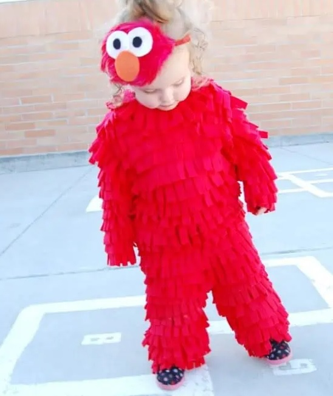

This charming baby Halloween costume is ideal for both boys and girls. By tacking red felt fringe on red sweatpants, it’s a simple no-sew craft.

Get the tutorial at [Girl Loves Glam](https://www.girllovesglam.com/diy-sew-elmo-halloween-costume)

### **2\. Olaf Halloween Costume**

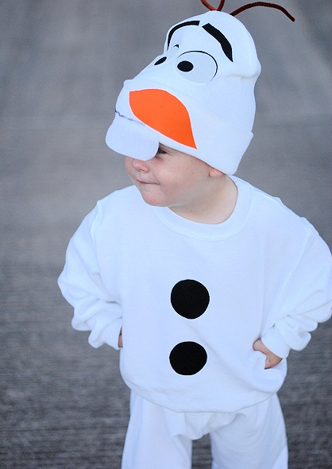

Olaf is incredibly charming, and your child will look even more adorable when they put on this simple, no-sew Olaf costume for Halloween! This delightful snowman outfit is effortless to create and comfortable to wear!

Get the tutorial at [Crazy Little Projects](https://crazylittleprojects.com/easy-olaf-costume/)

### **3\. Panda Bear Baby Costume**

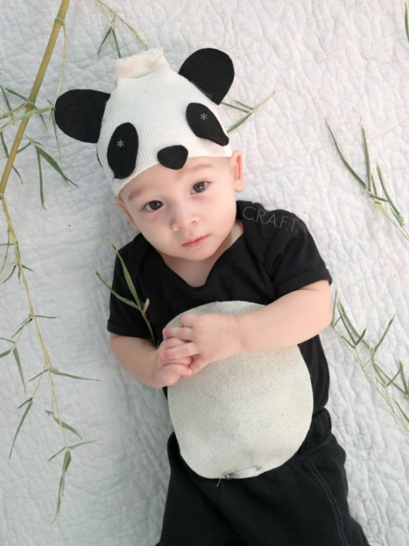

You can easily create this panda bear costume with plain black cotton pants and a onesie. Instead of damaging the onesie, you can attach the white felt belly with pins. It’s such a clever concept for a baby Halloween costume, don’t you think?

Get the tutorial at [Creating Really Awesome Fun Things](https://www.creatingreallyawesomefunthings.com/cute-baby-costumes-2/)

### **4\. No-Sew Bee Costume**

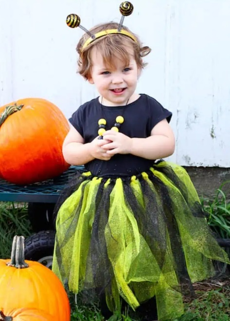

A “no-sew bee costume” is a creative and easy-to-make baby Halloween costume inspired by a cute little bee. Perfect for busy parents wanting to dress up their baby for Halloween without requiring any sewing skills or extensive crafting experience.

Get the tutorial at [Sugar Bee Crafts](https://sugarbeecrafts.com/no-sew-bumble-bee-costume)

### **5.  Baby Witch Costume**

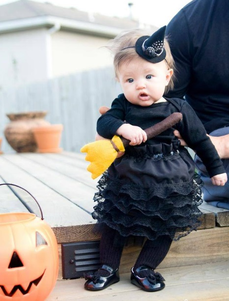

Witch-themed costumes are a topic not to be missed this Halloween, right? Your baby will have a great costume with just a black dress and an extremely adorable hat. What a perfect baby Halloween costume!

Read more at [The Makerista](https://www.themakerista.com/to-make-or-to-buy-halloween-costumes/)

### **6\. Crochet Mesh Bonnet**

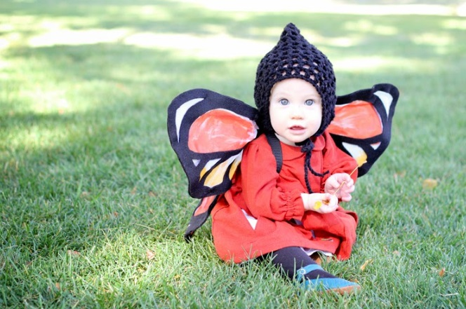

Here’s a free pattern to create this lovely Crochet Mesh Bonnet, which makes a perfect addition to a butterfly costume. Express your love for your child with this adorable baby Halloween costume!

Get the tutorial at [Delia Creates](https://www.deliacreates.com/crochet-mesh-bonnet-free-pattern/)

### **7\. Dobby the House Elf Costume**

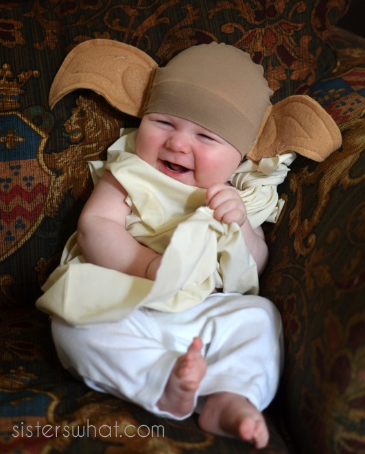

Dobby the House Elf costume is an adorable and enchanting choice for a baby Halloween costume. Inspired by the beloved character in the Harry Potter film series, this outfit captures the unique features of Dobby’s appearance, notably the hat with two ears. However, not as scary as in the movie, this costume also brings cuteness to your child.

Get the tutorial at [Sister what](https://www.sisterswhat.com/2014/10/baby-dobby-house-elf-harry-potter.html?utm_source=bp_recent&utm-medium=gadget&utm_campaign=bp_recent)

### **8.  Yoda Jedi Grand Master**

This Star Wars costume is truly incredible! You can transform an old white T-shirt and beanie with some dye. You can find the entire Jedi gang tutorials, including Princess Leia, Darth Vader, R2D2, Jedi Knights, and Yoda.

Get the tutorial at [Under the Sycamore](https://www.ashleyannphotography.com/blog/2010/11/01/diy-star-wars-costumes/)

### **9\. Princess Leia Costume**

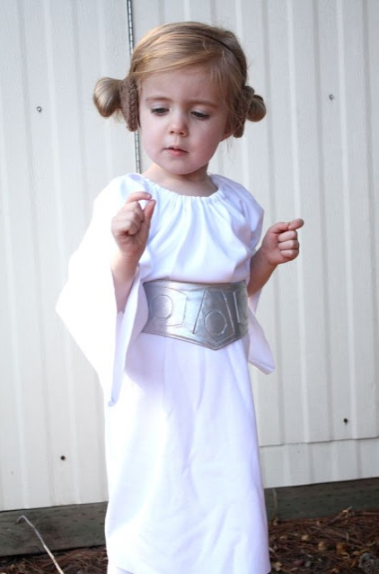

We used a basic peasant dress pattern to create this baby girl’s Halloween costume. You can craft your very own Princess Leia buns using brown yarn.

See the tutorial at [Craftiness Is Not Optional](https://www.craftinessisnotoptional.com/2011/10/princess-leia-costumebelt-tutorial.html)

### **10. Baby Cow Costume**

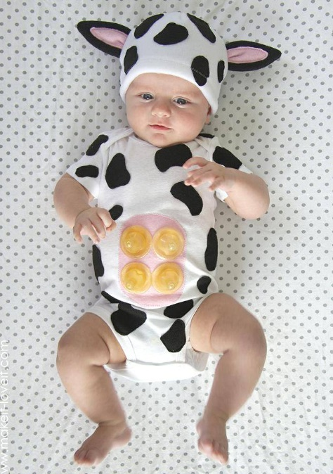

This adorable ensemble captures the essence of a baby cow, with its soft and cuddly materials that provide optimal comfort for infants and toddlers. Perfect for both boys and girls, this baby Halloween costume will make your little one the center at any Halloween party.

Get the tutorial at [Make It & Love It](https://makeit-loveit.com/a-simple-diy-baby-cow-costume-with-an-udder)

### **11\. [Baby Pumpkin Costume](https://www.amazon.com/Lamuusaa-Halloween-Costumes-Sleeveless-Bodysuit/dp/B0B8RCKY8Y)**

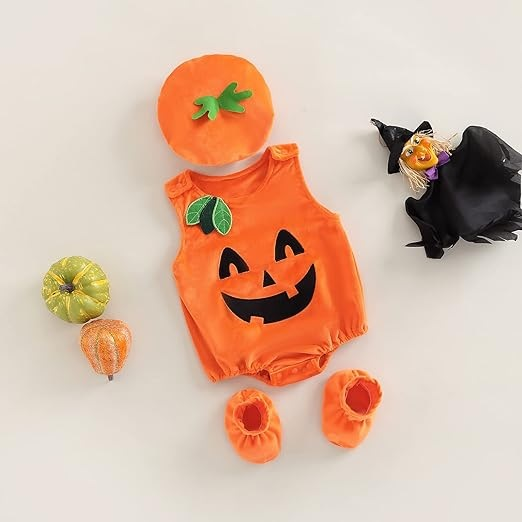

Is there anything more timeless than a chubby-cheeked baby dressing up as an adorable jack-o’lantern for Halloween? This outfit includes a bodysuit, booties, and a matching hat, but you could also consider adding some striped baby leg warmers to complete the look.

### **12\.** [**Baby Ewok Costume**](https://www.halloweencostumes.com/infant-star-wars-ewok-costume.html)

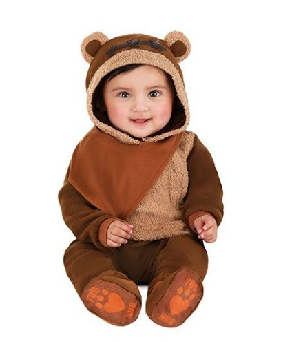

It’s quite adorable to dress your babies up as Ewoks. Your little one will be excited to go on an intergalactic adventure! It’s helpful to exude cuteness and capture the hearts of fellow Star Wars fans with this adorable baby Ewok ensemble. The costume includes the romper, the headpiece, and the booties.

### **13\. [Baby Disney Princess Costume](https://www.amazon.com/dp/B07T1GN672)**

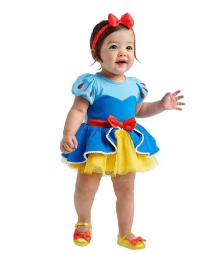

Do you have a favorite Disney princess? There are tutu versions of classic and modern Disney princess dresses that would make adorable baby Halloween costumes, including Snow White, Sleeping Beauty, Cinderella, Rapunzel, Elsa, and Tiana.

### **14\. [Baby Fluffy Chicken Costume](https://www.amazon.com/dp/B0BK7HPW33)**

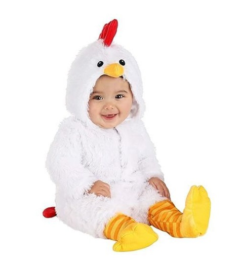

Now that your little one has hatched, why not celebrate their first Halloween with this fluffy chicken costume? It’s crafted from soft faux fur. All you need are some overalls and a flannel shirt, and you can join in the fun as the farmer.

### **15\. [Baby Skunk Costume](https://www.amazon.com/Yourself-Stinker-Costume-Jumpsuit-Booties/dp/B07RLRTHD8/)**

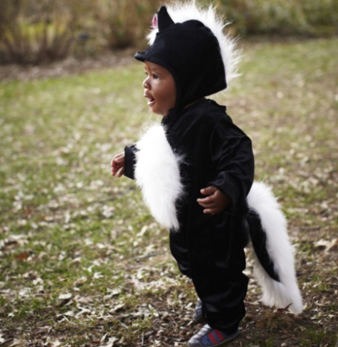

Dressing your adorable little one as a cute skunk is particularly amusing, especially if they’ve been a bit gassy lately. This baby Halloween costume is a one-piece romper, making it incredibly easy to put on.

### **16\. [Baby Fox Costume](https://www.amazon.com/InCharacter-Infant-Costume-Medium-12-18/dp/B09ZGKD7M6)**

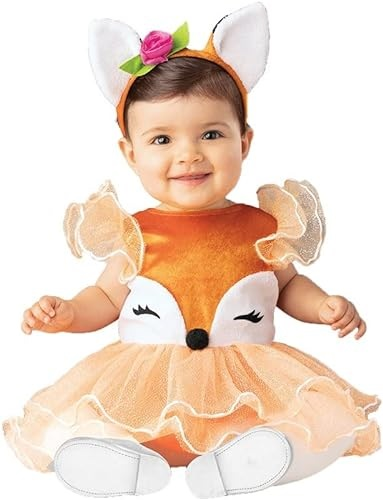

This baby Halloween costume is incredibly adorable, just like your precious baby. It includes the tutu dress and a charming fox-ear headpiece.

### **17\. [Fun World Lil’ Lobster Costume](https://www.walmart.com/ip/Infant-Lil-Lobster-Costume-Toddler/21863873)**

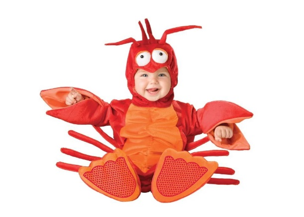

This baby lobster costume is a Halloween classic and perfect for little ones who are starting to enjoy tummy time. They’ll look adorable as a little lobster roll. Those tiny claws are perfect for grabbing some extra candy for Mom and Dad too!

### **18\. [Lion Infant & Toddler Costumes](https://www.amazon.com/dp/B003IBNYRE)**

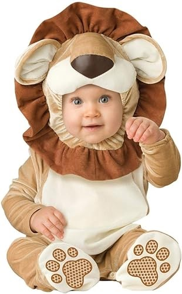

It’s been nearly 30 years since The Lion King was released, but the meme of holding your baby over your head while singing “The Circle of Life” is as popular as ever. Elevate the fun with this charming baby Halloween costume.

### **19\. [Baby Penguin Costume](https://www.amazon.com/Halloween-Costumes-Penguin-Costume-Toddler/dp/B0BCQ8M9K1)**

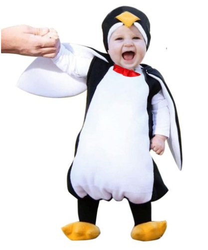

Whether your baby is already waddling like a little penguin or you know it’s just a matter of time, you can’t find a better choice than this adorable Halloween costume. Made from water-resistant material, it’s ideal for the unpredictable late-October weather. Plus, it even features those cute little penguin feet!

### **20\. [Baby Bat Costume](https://www.amazon.com/Newborn-Halloween-Playsuit-Jumpsuits-Clothing/dp/B08GC8CN8R)**

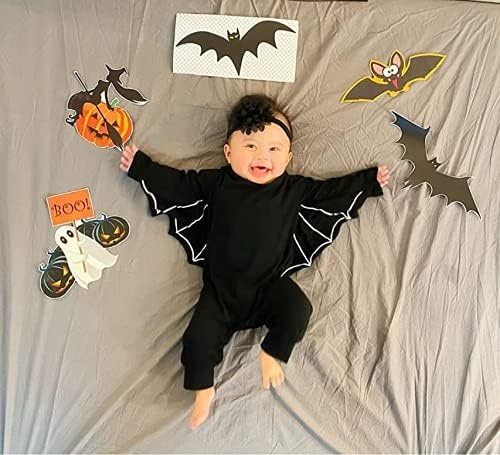

Imagine how cute this baby Halloween costume will be when your little one wears it. The highlight is the bat wings attached to the sleeves. Just open your arms and your little one will turn into a mischievous bat. What a perfect costume!

### **21\. [Monster-Boo Costume](https://www.walmart.com/ip/Monster-Boo-Toddler-Halloween-Costume/29297459)**

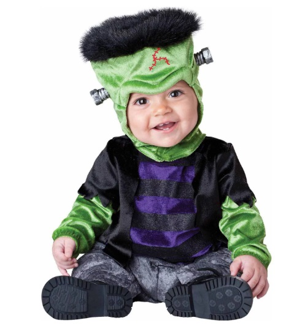

Was Frankenstein the monster or the doctor? Either way, your little one will be hilariously cute in this whimsical monster costume. It’s bound to become one of your all-time favorite Halloween outfits for your baby.

### **22\. [Child’s Star Wars Classic Yoda Costume](https://www.amazon.com/dp/B07TCCWZJP)**

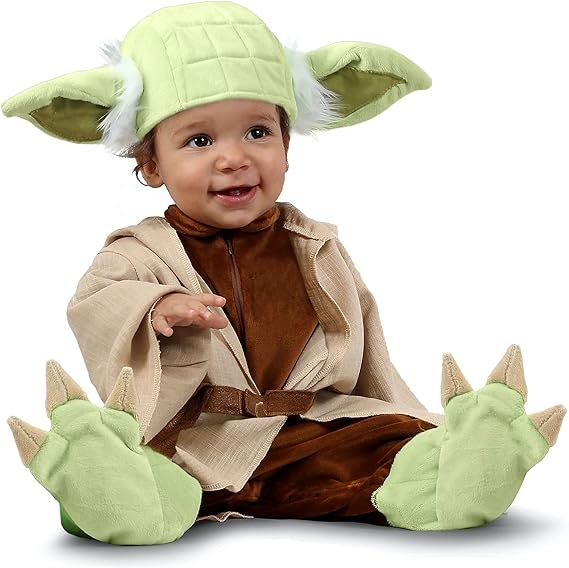

Baby Yoda has captured the hearts of everyone, and you can expect that endearing little face to be a huge hit with this baby Halloween costume. The design of the robe and hat ensures it’s super comfy for your little spooky sweetheart as well.

### **23\. [Tinker Bell Costume](https://www.amazon.com/dp/B00T43OK6E)**

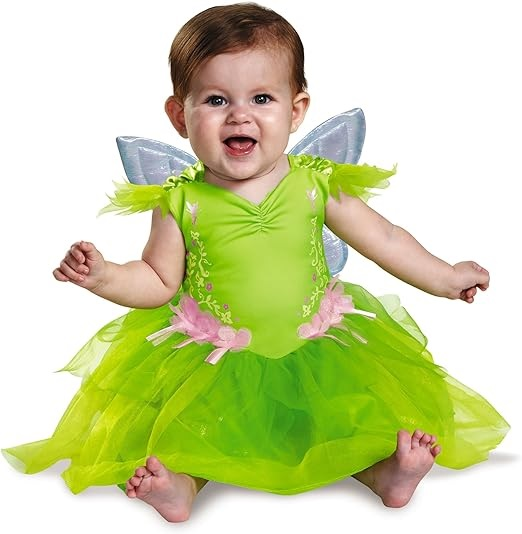

Tinker Bell is the true star of the Disney movie, and her enchanting dress makes for the perfect baby Halloween costume for your little fairy. Your darling will resemble the ruler of Neverland in this dress adorned with glitter, shimmer, and layers.

### **24\. [Red Racer Long Jumpsuit](https://www.etsy.com/listing/1282389748/personalized-red-racer-long-jumpsuit)**

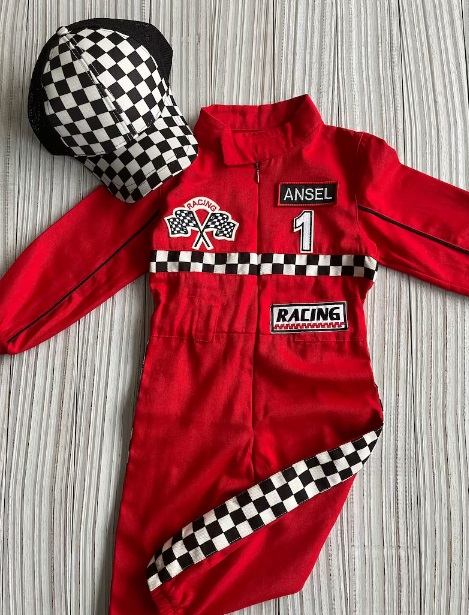

The Red Racer Long Jumpsuit is an excellent option for parents to infuse their baby’s Halloween outfit with a sporty touch. It guarantees both comfort and cuteness throughout the night.

### **25\. [Baby Astronaut Costume](https://www.amazon.com/dp/B0015MDVLW)**

To the moon! Your baby will experience floating in space with this baby Halloween costume. It even features diaper snaps for convenient changes and is also available in pink.

### **26\. [Baby Born to Be Wild Costume](https://www.amazon.com/dp/B00DOE9PVO)**

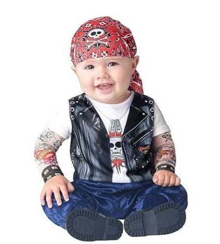

If you want your baby to look like he’s got two full-sleeve tattoos at his Halloween party, this shirt is a perfect choice. It makes people do a double-take and adds a unique touch to their costumes! The vest is printed onto the jumpsuit as well, and the costume even includes a headbandana.

### **27\. [Baby Harry Potter Costume](https://www.amazon.com/dp/B09ZQ1KPRR)**

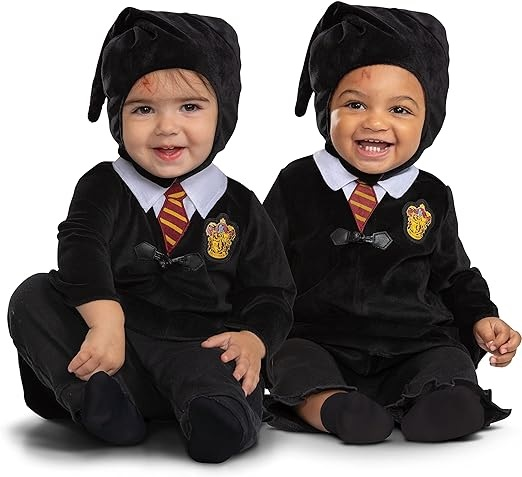

Your little one has been sorted into Gryffindor with this baby Halloween costume! Let them proudly display their house pride in these school robes, complete with a hat, robe with a faux collar, and a tie.

### **28\. [Baby Jack-Jack Costume](https://www.amazon.com/dp/B079M2YVRW)**

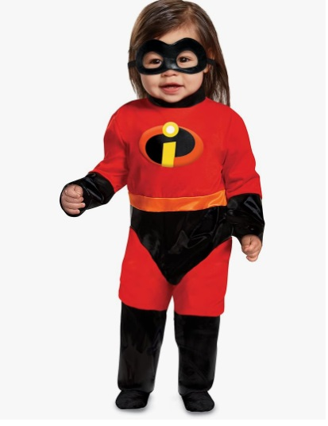

You can outfit a baby as a superhero or dress them up as a baby with superpowers, just like this baby Halloween costume! While it’s still a mystery how many abilities Jack-Jack possesses, we do know that looking adorable is definitely one of them.

### **29\. [Boy American Football Costume](https://www.etsy.com/listing/1560463813/2-piece-baby-boy-american-football)**

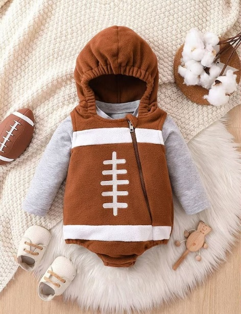

The costume typically includes a onesie or jumpsuit featuring a faux jersey with bold numbers and a team logo, often combined with matching pants or shorts. It allows parents to capture precious moments through photographs, creating lasting memories of their baby’s first Halloween.

### **30\. [Gizmo Halloween Costume](https://www.amazon.com/dp/B08BGB2899)**

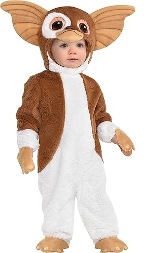

Mischievous Gremlins and your little one share a few things in common. They both enjoy late-night snacks and occasionally find themselves in playful trouble. Dress your tot in this Gremlins onesie for Halloween, allowing them to embrace their mischievous side. 

### **31\. [Baby Little Red Riding Hood Costume](https://www.amazon.com/dp/B082PX2M4M)**

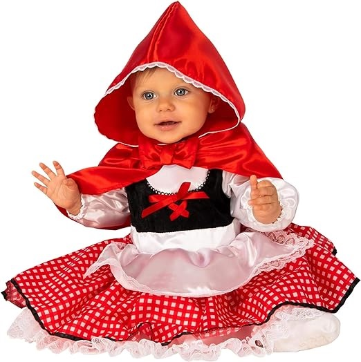

What big eyes your baby has! Whether you’re headed to Granny’s house or not, this baby Halloween costume truly stands out with its vibrant and bold style. The costume includes a dress and cape, which can be worn separately or together.

### **32\. [Nightmare Before Christmas Jack Skellington](https://www.amazon.com/dp/B07Q58P48Q)**

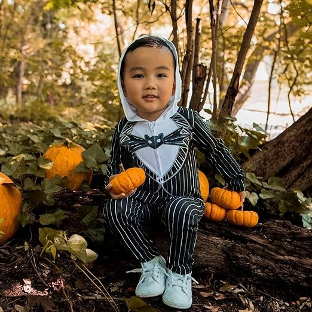

Tim Burton enthusiasts will adore this uncomplicated yet utterly charming Jack Skellington costume, resembling a direct import from Halloween Town. The one-piece outfit boasts a zippered front for effortless dressing, and a snug embroidered cap will keep those little ears toasty on a cool October evening.

### **33\. [McDonald’s French Fries Costume](https://www.etsy.com/listing/1557113888/mcdonalds-french-fries-baby-halloween)** 

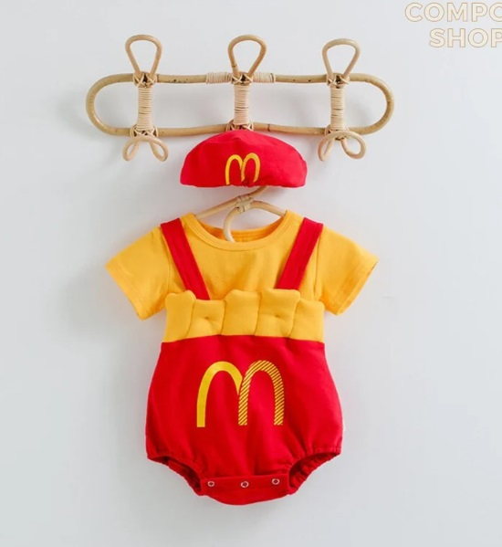

The McDonald’s French Fries Costume is a delightful and fun baby Halloween costume that brings one of the most beloved fast food items to life. With its distinctive shape, this unique costume is perfect for capturing priceless memories and turning heads at any Halloween party.

### **34\. [Baby Cuddly Cappuccino Costume](https://www.amazon.com/dp/B06XRP4HXZ)**

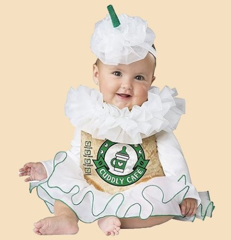

If you can’t go through autumn without your beloved PSL, why not have your baby carry this adorable coffee drink on Halloween? This baby Halloween costume includes a bodysuit with an attached skirt, collar, and headpiece.

### **35\. [Marvel Avengers Costumes](https://www.amazon.com/dp/B08CP9H8NJ)**

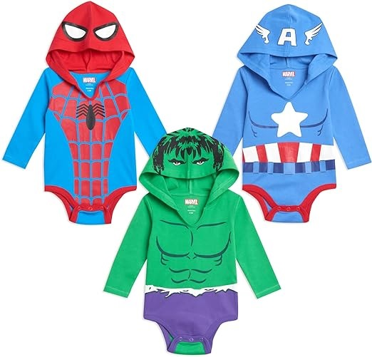

This baby Halloween costume set includes three hooded bodysuits, each themed around a favorite Avenger: Spider-Man, Captain America, and the Hulk. Plus, if they become a part of your everyday-wear collection after Halloween, that’s perfectly acceptable.

### **36\.** [**Grey Wolf Costume**](https://www.etsy.com/listing/267258019/grey-wolf-costume-toddler-boy-halloween)

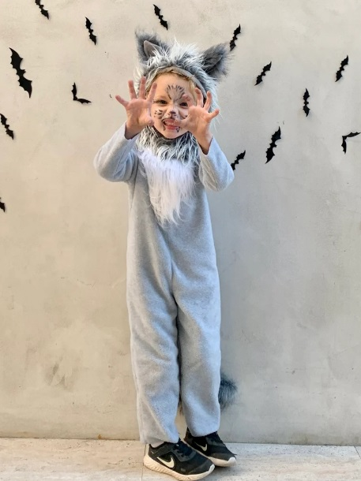

The gray wolf costume provides a cute and playful option for parents looking to dress their little ones in an animal-themed costume for Halloween festivities. It allows them to embody a wolf’s wild and mysterious nature while maintaining a delightful and amusing appearance.

### **37\. [Baby Woody Costume](https://www.halloweencostumes.com/infant-deluxe-woody-costume.html)**

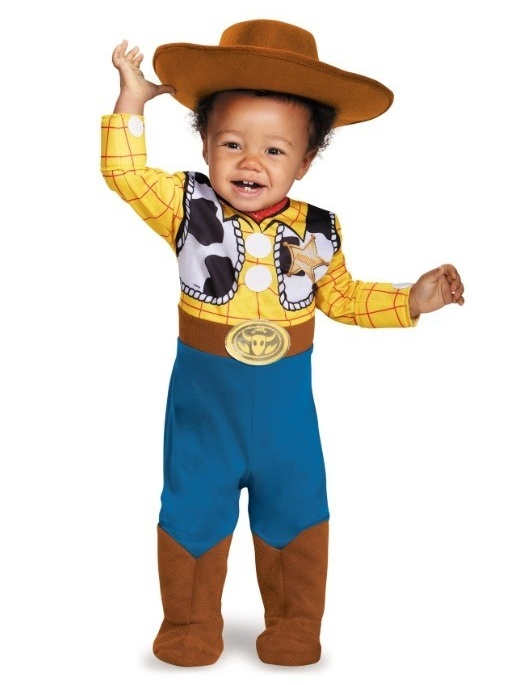

Before you know it, your kids will be all grown up and might want to pass on their toys to the next generation. So, why not celebrate their childhood by dressing them up as one of their beloved Toy Story characters this Halloween?

### **38\. [Buzz Lightyear Costume](https://www.shopdisney.com/buzz-lightyear-costume-for-baby-toy-story-2845041619038M.html)**

The buzz from Toy Story is a timeless space hero from the big screen, so it’s only natural that this cozy costume tops the list of baby Halloween costumes.

### **39\. [Expert Diver & Squirmy Octopus](https://www.maisonette.com/product/expert-diver-squirmy-octopus-blue)**

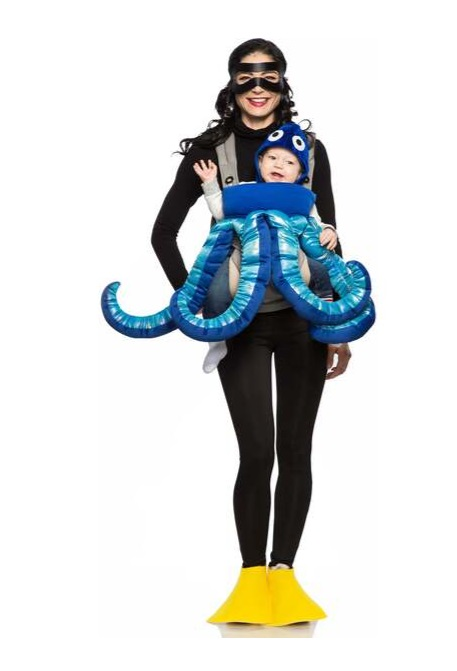

With this baby Halloween costume, you can embark on a delightful and festive oceanic adventure with your little one, complete with twirling tentacles!

### **40\. [Baby Blue Narwhal Costume](https://www.potterybarnkids.com/products/baby-blue-narwhal-costume/)**

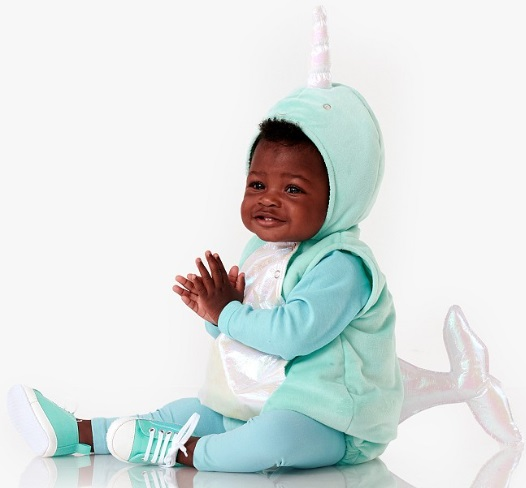

Perhaps your little one adores reading “Not Quite Narwhal” at bedtime, or you simply can’t resist the sheer cuteness of this baby narwhal costume. Either way, it’s a delightful choice for your baby’s first Halloween.

### **41\. [Where The Wild Things Are Halloween Costume](https://www.etsy.com/listing/1074455335/where-the-wild-things-are-halloween)**

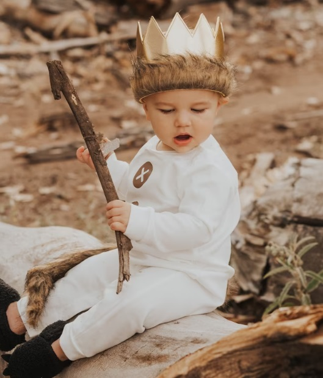

Where the Wild Things Are Halloween costumes for babies is a whimsical and adorable option inspired by the beloved children’s book by Maurice Sendak. This unique and enchanting costume allows babies to transform into one of the iconic wild creatures from the story. 

_**See More:**_

- [Easy Halloween Costumes](https://avada.io/loveable/blog/easy-halloween-costumes/)

- [DIY Halloween Costume Ideas](https://avada.io/loveable/blog/diy-halloween-costume-ideas/)

- [Last-Minute Halloween Costume Ideas](https://avada.io/loveable/blog/last-minute-halloween-costume-ideas/)

## **Final thoughts,**

The world of **baby Halloween costumes** offers an enchanting opportunity to ignite your imagination and celebrate the spookiest season with your little ones. From adorable animal costumes that will make even the grumpiest ghouls smile, to clever pop culture references, there is no shortage of options available for dressing up your babies. Whether it’s a tiny pumpkin, a mischievous witch, or a cuddly monster, these costumes not only bring joy and laughter, but also create lasting memories for families to cherish. So, let your imagination run wild and enjoy this magical time when even the tiniest trick-or-treaters can participate in the Halloween spirit!

- [40+ Baby Halloween Costumes That Are Too Cute to Scare](https://avada.io/loveable/blog/baby-halloween-costumes/#wp-block-heading-2-2)
    - [1.  No-Sew Elmo Costume](https://avada.io/loveable/blog/baby-halloween-costumes/#wp-block-heading-3-3) 
    - [2\. Olaf Halloween Costume](https://avada.io/loveable/blog/baby-halloween-costumes/#wp-block-heading-3-7)
    - [3\. Panda Bear Baby Costume](https://avada.io/loveable/blog/baby-halloween-costumes/#wp-block-heading-3-11)
    - [4\. No-Sew Bee Costume](https://avada.io/loveable/blog/baby-halloween-costumes/#wp-block-heading-3-15)
    - [5.  Baby Witch Costume](https://avada.io/loveable/blog/baby-halloween-costumes/#wp-block-heading-3-19)
    - [6\. Crochet Mesh Bonnet](https://avada.io/loveable/blog/baby-halloween-costumes/#wp-block-heading-3-23)
    - [7\. Dobby the House Elf Costume](https://avada.io/loveable/blog/baby-halloween-costumes/#wp-block-heading-3-27)
    - [8.  Yoda Jedi Grand Master](https://avada.io/loveable/blog/baby-halloween-costumes/#wp-block-heading-3-31)
    - [9\. Princess Leia Costume](https://avada.io/loveable/blog/baby-halloween-costumes/#wp-block-heading-3-35)
    - [10. Baby Cow Costume](https://avada.io/loveable/blog/baby-halloween-costumes/#wp-block-heading-3-39)
    - [11\. Baby Pumpkin Costume](https://avada.io/loveable/blog/baby-halloween-costumes/#wp-block-heading-3-43)
    - [12\. Baby Ewok Costume](https://avada.io/loveable/blog/baby-halloween-costumes/#wp-block-heading-3-46)
    - [13\. Baby Disney Princess Costume](https://avada.io/loveable/blog/baby-halloween-costumes/#wp-block-heading-3-49)
    - [14\. Baby Fluffy Chicken Costume](https://avada.io/loveable/blog/baby-halloween-costumes/#wp-block-heading-3-52)
    - [15\. Baby Skunk Costume](https://avada.io/loveable/blog/baby-halloween-costumes/#wp-block-heading-3-55)
    - [16\. Baby Fox Costume](https://avada.io/loveable/blog/baby-halloween-costumes/#wp-block-heading-3-58)
    - [17\. Fun World Lil’ Lobster Costume](https://avada.io/loveable/blog/baby-halloween-costumes/#wp-block-heading-3-61)
    - [18\. Lion Infant & Toddler Costumes](https://avada.io/loveable/blog/baby-halloween-costumes/#wp-block-heading-3-64)
    - [19\. Baby Penguin Costume](https://avada.io/loveable/blog/baby-halloween-costumes/#wp-block-heading-3-67)
    - [20\. Baby Bat Costume](https://avada.io/loveable/blog/baby-halloween-costumes/#wp-block-heading-3-70)
    - [21\. Monster-Boo Costume](https://avada.io/loveable/blog/baby-halloween-costumes/#wp-block-heading-3-73)
    - [22\. Child’s Star Wars Classic Yoda Costume](https://avada.io/loveable/blog/baby-halloween-costumes/#wp-block-heading-3-76)
    - [23\. Tinker Bell Costume](https://avada.io/loveable/blog/baby-halloween-costumes/#wp-block-heading-3-79)
    - [24\. Red Racer Long Jumpsuit](https://avada.io/loveable/blog/baby-halloween-costumes/#wp-block-heading-3-82)
    - [25\. Baby Astronaut Costume](https://avada.io/loveable/blog/baby-halloween-costumes/#wp-block-heading-3-85)
    - [26\. Baby Born to Be Wild Costume](https://avada.io/loveable/blog/baby-halloween-costumes/#wp-block-heading-3-88)
    - [27\. Baby Harry Potter Costume](https://avada.io/loveable/blog/baby-halloween-costumes/#wp-block-heading-3-91)
    - [28\. Baby Jack-Jack Costume](https://avada.io/loveable/blog/baby-halloween-costumes/#wp-block-heading-3-94)
    - [29\. Boy American Football Costume](https://avada.io/loveable/blog/baby-halloween-costumes/#wp-block-heading-3-97)
    - [30\. Gizmo Halloween Costume](https://avada.io/loveable/blog/baby-halloween-costumes/#wp-block-heading-3-100)
    - [31\. Baby Little Red Riding Hood Costume](https://avada.io/loveable/blog/baby-halloween-costumes/#wp-block-heading-3-103)
    - [32\. Nightmare Before Christmas Jack Skellington](https://avada.io/loveable/blog/baby-halloween-costumes/#wp-block-heading-3-106)
    - [33\. McDonald’s French Fries Costume](https://avada.io/loveable/blog/baby-halloween-costumes/#wp-block-heading-3-109) 
    - [34\. Baby Cuddly Cappuccino Costume](https://avada.io/loveable/blog/baby-halloween-costumes/#wp-block-heading-3-112)
    - [35\. Marvel Avengers Costumes](https://avada.io/loveable/blog/baby-halloween-costumes/#wp-block-heading-3-115)
    - [36\. Grey Wolf Costume](https://avada.io/loveable/blog/baby-halloween-costumes/#wp-block-heading-3-118)
    - [37\. Baby Woody Costume](https://avada.io/loveable/blog/baby-halloween-costumes/#wp-block-heading-3-121)
    - [38\. Buzz Lightyear Costume](https://avada.io/loveable/blog/baby-halloween-costumes/#wp-block-heading-3-124)
    - [39\. Expert Diver & Squirmy Octopus](https://avada.io/loveable/blog/baby-halloween-costumes/#wp-block-heading-3-127)
    - [40\. Baby Blue Narwhal Costume](https://avada.io/loveable/blog/baby-halloween-costumes/#wp-block-heading-3-130)
    - [41\. Where The Wild Things Are Halloween Costume](https://avada.io/loveable/blog/baby-halloween-costumes/#wp-block-heading-3-133)
- [Final thoughts,](https://avada.io/loveable/blog/baby-halloween-costumes/#wp-block-heading-2-140)

### [Alex Smith](https://avada.io/loveable/author/alex/)

I'm Alex from Loveable. I excel at giving thoughtful gifts that bring joy. I offer personalized, budget-friendly ideas like concerts, getaways, and spa treatments. I'm a compassionate colleague who volunteers at local charities. I'm proud to be part of the Loveable team and a trusted gift advisor.

- [Twitter](https://twitter.com/intent/tweet)
- [Facebook](https://www.facebook.com/sharer/sharer.php)
- [instagram](https://avada.io/loveable/blog/baby-halloween-costumes/)
- [pinterest](https://www.pinterest.com/loveablellc/)

## Related Posts

[### 120+ Christian Birthday Wishes To Spread Your Love](https://avada.io/loveable/blog/christian-birthday-wishes/) 

[

### 35 Best 70th Birthday Ideas To Celebrate The Special Milestone

](https://avada.io/loveable/blog/70th-birthday-ideas/)

[

### 50 Best 30th Birthday Decorations for a Remarkable Birthday Bash

](https://avada.io/loveable/blog/30th-birthday-decorations/)

[

### 40 Delicious Vegan Christmas Desserts to Delight Your Palate

](https://avada.io/loveable/blog/vegan-christmas-desserts/)

[

### 60 Christmas Team Building Activities to Boost Workplace Spirit

](https://avada.io/loveable/blog/christmas-team-building-activities/)
