This article has been written and researched by our expert Loveable through a precise methodology. [Learn more about our methodology](https://avada.io/loveable/our-methodological.html)

[Loveable](https://avada.io/loveable/) > [Blog](https://avada.io/loveable/blog/) > [Holiday](https://avada.io/loveable/holiday/)

# 40+ Best 12 Days of Christmas Activities to Make Your Holiday Season Merry and Bright

Written by [Blake Simpson](https://avada.io/loveable/author/blake/) Last Updated on September 27, 2023

- [12 Days of Christmas Activities for Adults](https://avada.io/loveable/blog/12-days-of-christmas-activities/#wp-block-heading-2-3)
    - [1\. Attend a Christmas Parade](https://avada.io/loveable/blog/12-days-of-christmas-activities/#wp-block-heading-3-4)
    - [2\. Max Fun Antler Ring Toss](https://avada.io/loveable/blog/12-days-of-christmas-activities/#wp-block-heading-3-7)
    - [3\. Naughty or Nice Christmas Edition](https://avada.io/loveable/blog/12-days-of-christmas-activities/#wp-block-heading-3-10)
    - [4\. Holiday Movie Drinking Game](https://avada.io/loveable/blog/12-days-of-christmas-activities/#wp-block-heading-3-13)
    - [5\. Ugly Christmas Sweater Contest](https://avada.io/loveable/blog/12-days-of-christmas-activities/#wp-block-heading-3-16) 
    - [6\. Funko Christmas Story Card Game](https://avada.io/loveable/blog/12-days-of-christmas-activities/#wp-block-heading-3-19)
    - [7\. Christmas Movie Bingo](https://avada.io/loveable/blog/12-days-of-christmas-activities/#wp-block-heading-3-22)
    - [8\. Gift Wrap Physical Challenge](https://avada.io/loveable/blog/12-days-of-christmas-activities/#wp-block-heading-3-25) 
    - [9\. The Caroling Challenge](https://avada.io/loveable/blog/12-days-of-christmas-activities/#wp-block-heading-3-29)
    - [10\. Christmas Pictionary Cards](https://avada.io/loveable/blog/12-days-of-christmas-activities/#wp-block-heading-3-33)
- [12 Days Of Christmas Activities For Work](https://avada.io/loveable/blog/12-days-of-christmas-activities/#wp-block-heading-2-36)
    - [11\. Have a Christmas Photocall](https://avada.io/loveable/blog/12-days-of-christmas-activities/#wp-block-heading-3-37)
    - [12\. Merry Murder Mystery](https://avada.io/loveable/blog/12-days-of-christmas-activities/#wp-block-heading-3-40)
    - [13\. Host a Department Decoration Contest](https://avada.io/loveable/blog/12-days-of-christmas-activities/#wp-block-heading-3-44)
    - [14\. White Elephant Exchange](https://avada.io/loveable/blog/12-days-of-christmas-activities/#wp-block-heading-3-49)
    - [15\. Hidden Snowmen](https://avada.io/loveable/blog/12-days-of-christmas-activities/#wp-block-heading-3-53)
    - [16\. Holiday Movie Marathon](https://avada.io/loveable/blog/12-days-of-christmas-activities/#wp-block-heading-3-56)
    - [17\. Host an Awards Ceremony](https://avada.io/loveable/blog/12-days-of-christmas-activities/#wp-block-heading-3-59)
    - [18\. Host a Holiday Bake-Off](https://avada.io/loveable/blog/12-days-of-christmas-activities/#wp-block-heading-3-62)
    - [19\. Christmas Karaoke](https://avada.io/loveable/blog/12-days-of-christmas-activities/#wp-block-heading-3-65)
    - [20\. Host an Ugly Sweater Contest](https://avada.io/loveable/blog/12-days-of-christmas-activities/#wp-block-heading-3-69)
- [12 Days of Christmas Family Activities](https://avada.io/loveable/blog/12-days-of-christmas-activities/#wp-block-heading-2-72)
    - [21\. Decorate the House](https://avada.io/loveable/blog/12-days-of-christmas-activities/#wp-block-heading-3-73)
    - [22\. Take the Family Ice Skating](https://avada.io/loveable/blog/12-days-of-christmas-activities/#wp-block-heading-3-76)
    - [23\. Read Christmas Book](https://avada.io/loveable/blog/12-days-of-christmas-activities/#wp-block-heading-3-79) 
    - [24\. Make and Send Some Christmas Cards](https://avada.io/loveable/blog/12-days-of-christmas-activities/#wp-block-heading-3-82)
    - [25\. Donate Christmas Season](https://avada.io/loveable/blog/12-days-of-christmas-activities/#wp-block-heading-3-86)
    - [26\. Have a Lights Tour](https://avada.io/loveable/blog/12-days-of-christmas-activities/#wp-block-heading-3-89)
    - [27.  Plan a Family Photoshoot](https://avada.io/loveable/blog/12-days-of-christmas-activities/#wp-block-heading-3-92) 
    - [28\. Have a Video Call with Santa Claus](https://avada.io/loveable/blog/12-days-of-christmas-activities/#wp-block-heading-3-95)
    - [29\. Light A Fire and Have a S’mores Night](https://avada.io/loveable/blog/12-days-of-christmas-activities/#wp-block-heading-3-99)
    - [30\. Create a Gingerbread House Village](https://avada.io/loveable/blog/12-days-of-christmas-activities/#wp-block-heading-3-102)
    - [31\. Make Sugar Cookies](https://avada.io/loveable/blog/12-days-of-christmas-activities/#wp-block-heading-3-105)
    - [32\. Play Christmas Song Bingo](https://avada.io/loveable/blog/12-days-of-christmas-activities/#wp-block-heading-3-108)
- [12 Days of Christmas Advent Activities & Games for Kids](https://avada.io/loveable/blog/12-days-of-christmas-activities/#wp-block-heading-2-112) 
    - [33\. Christmas Tree Ball Sort Game](https://avada.io/loveable/blog/12-days-of-christmas-activities/#wp-block-heading-3-113)
    - [34\. Lump of Coal Saran Wrap Game](https://avada.io/loveable/blog/12-days-of-christmas-activities/#wp-block-heading-3-117)
    - [35\. Build a Snowman](https://avada.io/loveable/blog/12-days-of-christmas-activities/#wp-block-heading-3-121)
    - [36\. Christmas Tree Bowling Game](https://avada.io/loveable/blog/12-days-of-christmas-activities/#wp-block-heading-3-125)
    - [37\. Christmas Scavenger Hunt](https://avada.io/loveable/blog/12-days-of-christmas-activities/#wp-block-heading-3-129)
    - [38\. Have an Indoor Snowball Fight](https://avada.io/loveable/blog/12-days-of-christmas-activities/#wp-block-heading-3-133)
    - [39\. Craft Your Own Wrapping Paper](https://avada.io/loveable/blog/12-days-of-christmas-activities/#wp-block-heading-3-136)
    - [40\. Santa Photo Booth Accessories](https://avada.io/loveable/blog/12-days-of-christmas-activities/#wp-block-heading-3-140)
    - [41\. The Christmas Present Game](https://avada.io/loveable/blog/12-days-of-christmas-activities/#wp-block-heading-3-144)
    - [42\. Read ‘A Christmas Carol’ Out Loud](https://avada.io/loveable/blog/12-days-of-christmas-activities/#wp-block-heading-3-148)
    - [43\. Hit the Grinch Game](https://avada.io/loveable/blog/12-days-of-christmas-activities/#wp-block-heading-3-151)
    - [44\. Host a White Elephant Gift Exchange](https://avada.io/loveable/blog/12-days-of-christmas-activities/#wp-block-heading-3-155)
- [Bottom line](https://avada.io/loveable/blog/12-days-of-christmas-activities/#wp-block-heading-2-159)

The **12 days of Christmas activities** is a festive and joyous tradition that brings the spirit of the holiday season to life. Inspired by the classic Christmas carol, this beloved celebration extends the merriment far beyond just a single day. Over 12 days leading up to Christmas, families, and friends come together to engage in various delightful and memorable activities. From decorating gingerbread houses to singing carols, each day is filled with laughter, love, and cherished moments.

This blog will guide you through creative and heartwarming ideas for celebrating Christmas activities in 12 days to make this holiday season special.

## **12 Days of Christmas Activities for Adults**

### **1\. Attend a Christmas Parade**

There’s nothing more cheerful and festive than a Christmas parade! Watching everyone don their most joyful outfits while floats and holiday characters go by is truly a delightful sight during this season of celebration.

### **2\. [Max Fun Antler Ring Toss](https://www.amazon.com/Max-Fun-Christmas-Inflatable-Reindeer/dp/B07YR3ZZSF)**

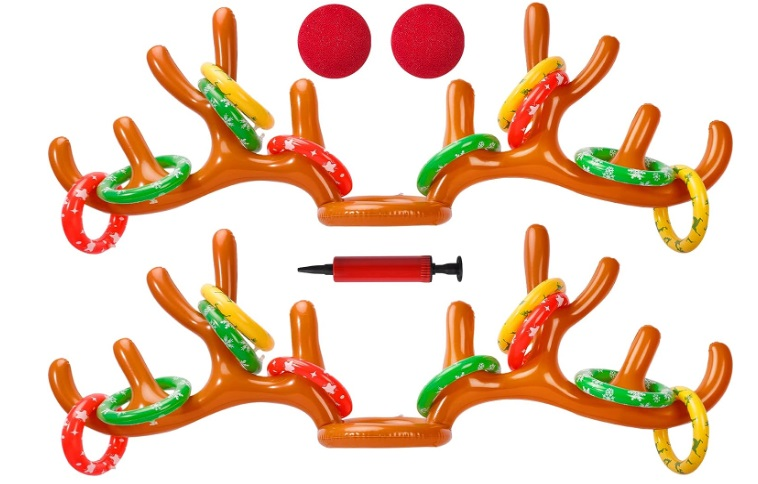

This game is a surefire way to leave no one with their dignity untouched. One player is tasked with donning the reindeer headgear, while another takes on the challenge of tossing rings onto the antlers. Ultimately, everyone ends up laughing, shaking with mirth, just like a bowl full of jelly.

### **3\.** [**Naughty or Nice Christmas Edition**](https://www.etsy.com/listing/761207829/adult-christmas-party-game-naughty-or)

This printable allows guests to mark off the “nice” and “naughty” deeds they’ve done throughout the holiday season. Whoever checks off the most in each category wins a prize, although the winner of the “naughty” category might humorously receive a lump of coal instead.

### **4\. Holiday Movie Drinking Game**

Select a Christmas film and then pinpoint specific expressions, terms, or behaviors that will serve as cues for everyone to take a drink. If you lack ideas, you can find pre-established drinking games for Hallmark holiday movies and “Elf.” To boost everyone’s enthusiasm for sipping, substitute harsh shots with servings of eggnog, sparkling ginger sangria, or other delightful Christmas-themed cocktails.

### **5\.** [**Ugly Christmas Sweater Contest**](https://www.amazon.com/stores/page/BBA20B90-53BE-4248-B6BE-1E13B6BF5DED) 

It’s a real classic that everyone loves! Here’s how it works: we all gather in our silliest, most outlandish Christmas sweaters, and the person wearing the absolute wackiest one wins a fantastic prize (maybe even a super cool addition to their Christmas stocking?).

### **6\.** [**Funko Christmas Story Card Game**](https://www.amazon.com/Christmas-Story-Major-Card-Game/dp/B0863FPRTD/)

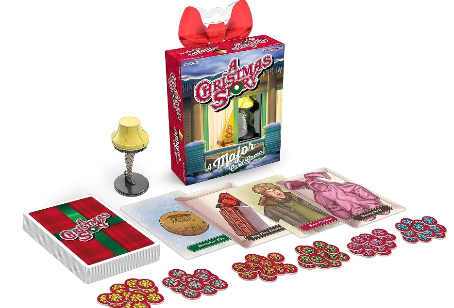

Hey there! I’ve got this super fun game about those awesome Christmas movies we love. It’s based on Ralphie’s adventure to snag his dream BB gun and that cool decoder ring he’s been eyeing for Christmas.

### **7\.** [**Christmas Movie Bingo**](https://www.etsy.com/listing/583644235/digital-christmas-movie-bingo-card-party)

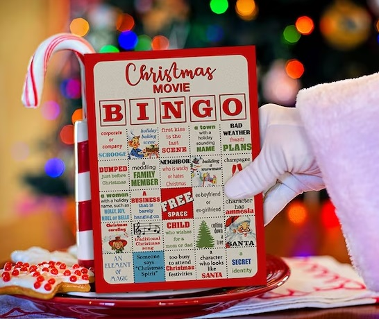

This card features squares with common Christmas movie tropes such as “snowball fights” or “someone wearing a Santa hat.” As you watch Christmas films as a group, the first person to complete five in a row on their Bingo card earns the coveted title of Christmas Movie Champion.

### **8\. Gift Wrap Physical Challenge** 

Here’s a fun activity that will put family bonds to the test: Divide into teams of two and determine who can wrap a gift neatly and quickly. The catch? Each person must have one arm behind their back, making it a true test of teamwork!

Get the tutorial at [Good Housekeeping](https://www.goodhousekeeping.com/holidays/gift-ideas/tips/g1775/diy-holiday-gift-wrap/)

### **9\. The Caroling Challenge**

Choose from the classics like “Jingle Bells” or give a more modern holiday hit like Mariah Carey’s “All I Want For Christmas is You” a shot. You might be familiar with the first few lines of these songs, but it becomes quite challenging as you go along!

Pick a song from [Good Housekeeping](https://www.goodhousekeeping.com/holidays/christmas-ideas/g2680/christmas-songs/)

### **10\.** [**Christmas Pictionary Cards**](https://www.etsy.com/listing/894891252/christmas-pictionary-cards-holiday-party)

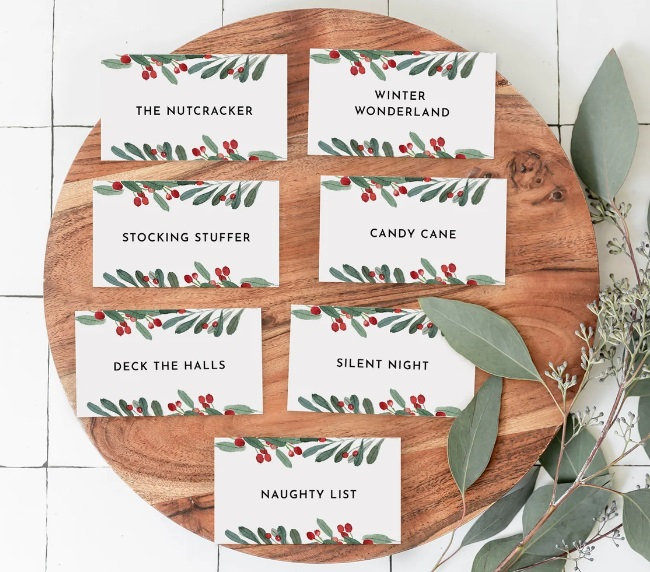

Let’s see how creative you can be in a fun game! It’s called “Draw and Guess Holiday Words.” The rules are simple: you draw your favorite holiday words and phrases, and your team tries to guess them. The more correct guesses your team makes in just 2 minutes, the more points you score. 

## **12 Days Of Christmas Activities For Work**

### **11\. Have a Christmas Photocall**

Why not capture the festive spirit at work by arranging a Christmas photocall? To have more excitement, consider turning it into a contest with small incentives to motivate participation. When your colleagues return from the holidays, they’ll be able to see that you all had a fantastic time celebrating together.

### **12\. Merry Murder Mystery**

Murder mysteries are a great choice for small office Christmas parties. Start by choosing a captivating mystery theme like a New Year’s Eve party murder, Santa Claus’s demise, or an ugly sweater party murder. Encourage attendees to dress accordingly or bring relevant props for added immersion. Assign unique roles to everyone and dive into the script. Participants will eagerly listen, hunt for clues, and aim to solve the mystery first.

Check out this guide at [Team Building](https://teambuilding.com/blog/virtual-murder-mystery)

### **13\. Host a Department Decoration Contest**

To make a holiday decoration more energetic, why not turn it into a spirited competition? You should think of organizing a department decoration contest, where each individual has the creative freedom to adorn their cubicle or desk based on their style. 

Foster teamwork by allowing departments to collaborate and decorate their shared spaces together. This friendly competition can infuse the workplace with a festive spirit and showcase the unique creativity of your colleagues.

Check out this guide at [Career Trend](https://careertrend.com/how-4674966-run-office-cubicle-decoration-contest.html)

### **14\. White Elephant Exchange**

White Elephant Exchanges are workplace Christmas highlights. Unlike traditional Secret Santa, they feature funny and [novelty gifts](https://avada.io/loveable/funny-novelty-gifts/). What makes it special is the fun of gift theft, adding excitement to the festivities. In this game, participants set an order for the gift exchange. They can either receive a gift from their assigned partner or pick one randomly from the pile. The next player can choose a new gift or steal from the previous one.

Check out more tips at [Team Building](https://teambuilding.com/blog/virtual-white-elephant) 

### **15\. Hidden Snowmen**

“Hidden Snowmen” is a delightful game that will challenge employees’ observation skills and add a touch of festive fun to your party. You can place these snowmen in creative spots like on platters/buffet tables, among balloons near the entrance, within floral centerpieces, or nestled among presents under the tree. Given that the snowman symbol consists of three circles, it’s a straightforward yet entertaining task to hide them throughout the venue.

### **16\. Holiday Movie Marathon**

Get ready to indulge in your cherished Christmas classics for a joyful time! For an inclusive twist, consider hosting this event virtually and extending an invitation to your remote employees. It’s a fantastic way to ensure everyone can partake in the fun, regardless of their location.

### **17\. Host an Awards Ceremony**

Christmas is the season of merriment and gratitude, making it the perfect occasion to host an awards ceremony for your colleagues. It is crucial to recognize and reward colleagues for their unwavering commitment and dedication, even during holiday breaks. It helps to show the company’s genuine appreciation and value for their efforts.

### **18\. Host a Holiday Bake-Off**

Inspire everyone to contribute by bringing their beloved holiday treats and ignite a friendly bake-off competition! The level of complexity is entirely up to you – from playful cookie decorating contests to full-blown Iron Chef-style challenges, complete with a panel of discerning judges. This activity is a delightful way to usher in the festive season with a dash of culinary creativity and a lot of fun!

### **19\. Christmas Karaoke**

The office Christmas party cannot miss the karaoke stage, allowing colleagues to showcase their vibrant, expressive side! While singing with friends and family is enjoyable, singing alongside colleagues can be a challenge. It can become a colossal embarrassment and potentially lead to a transfer to another state after the holiday season.

Read more at [Find A Karaoke](https://www.findakaraoke.com/office-christmas-party.html)

### **20\. [Host an Ugly Sweater Contest](https://www.amazon.com/s?k=Christmas+ugly+sweater&crid=RC6VOIWBQLQW&sprefix=christmas+ugly+sweater+%2Caps%2C366&ref=nb_sb_noss_2)**

There’s no better way to spread the holiday cheer than with a wacky Christmas sweater. Bring your coworkers into the festive mood by inviting them to join the Ugly Sweater Christmas contest. They’ll enjoy getting dressed up in their most hilariously bad outfits and checking out each other’s creative ensembles.

## **12 Days of Christmas Family Activities**

### **21\. Decorate the House**

Engaging children in decorating the house with twinkling lights, stockings, garlands, and a tree creates a magical experience. Crafting popcorn garland and shimmering ornaments allows them to actively participate in creating holiday decor. This fosters a sense of contribution and makes the festive season even more special.

### **22\. Take the Family Ice Skating**

Ice skating is a cherished Christmas tradition for a good reason. It offers an active, enjoyable experience and allows you to glide gracefully on the ice, even if you reside in a region where snow is a rarity.

### **23\. Read Christmas Book** 

There’s an abundance of wonderful classic holiday books that you can enjoy as a family tradition! Consider reading the same book every year around this time with your little ones. Some of our cherished favorites include “Twas the Night Before Christmas,” “How the Grinch Stole Christmas,” and “The Polar Express.”

### **24\. Make and Send Some Christmas Cards**

Another wonderful way to bond with friends and family is by crafting your own Christmas cards. You can dress up and capture a lovely family photo – a thoughtful keepsake for relatives to see how everyone is faring. Alternatively, you can involve your pet in the process and coax them into posing for a photo (with a few treats as incentives, of course!). Alternatively, gather your art supplies and let your creative instincts run wild!

Get the tutorial at [Penguin](https://www.penguin.co.uk/articles/childrens-article/make-a-personalised-wimpy-kid-christmas-card)

### **25\. Donate Christmas Season**

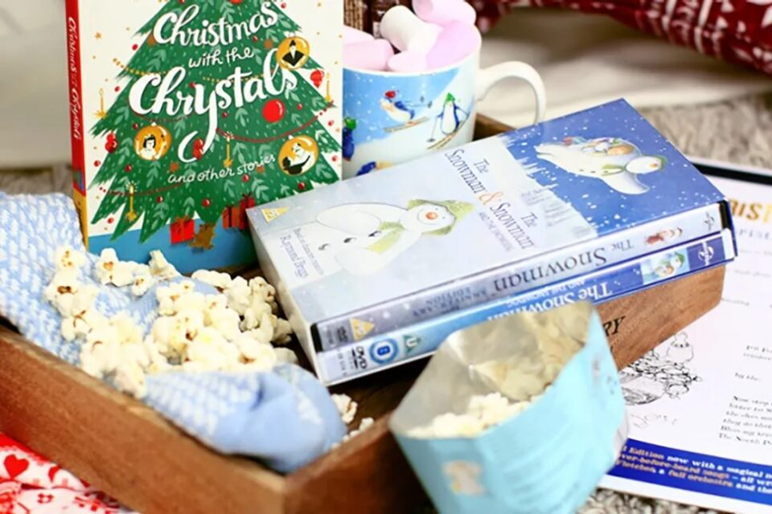

During Christmas, it’s a great time to give back. Sort through your unwanted items and donate them to organizations like The Salvation Army’s Christmas Present Appeal. Support initiatives like “Feeding Families” by donating food items or assembling a hamper for a family in need. These acts of kindness can brighten someone’s holiday season and help families facing financial challenges.

### **26\. Have a Lights Tour**

With any luck, by the sixth day of Christmas, your neighbors will have had ample time to decorate their homes with festive lights! To make it an even more memorable experience, consider packing some snacks for the journey and encourage each child to rate the decorated houses on a scale from 1 to 10.

### **27.  Plan a Family Photoshoot** 

How about organizing a delightful family photoshoot? It’s an activity that you’ll cherish in your memories for years to come. Remember to bring some hot cocoa and treats to ensure those smiles last throughout the session. 

### **28\. Have a Video Call with Santa Claus**

If you find yourself short on time or feeling a bit apprehensive about in-person visits, thanks to the marvels of technology, you can opt for a video call instead. Services like “Santa’s Calling You” offer the chance to schedule a private Zoom call with Santa, Mrs. Claus, or one of Santa’s trusty elves. You can even request them to read you a heartwarming story. All it takes is picking a suitable time and date!

Get the service at [Santa’s Calling You](https://www.santascallingyou.co.uk/)

### **29\. Light A Fire and Have a S’mores Night**

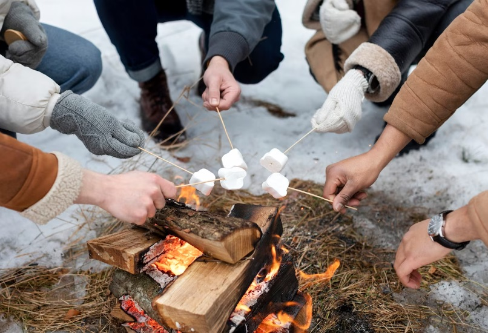

If you have an indoor or outdoor fireplace, consider lighting a fire and roasting marshmallows over it! This cozy activity provides a great opportunity to engage in a family discussion about your goals for the upcoming year.

### **30\. Create a Gingerbread House Village**

It is great for families to hold an annual gingerbread house contest, where each member creates their own house. This activity was enjoyable and creative, sparking imagination and creativity. You can create smaller houses or create a whole gingerbread village. Encouraging children to construct their own edible houses is also beneficial.

### **31\. Make Sugar Cookies**

What better way to evoke the holiday spirit than with delightful, creatively shaped cookies? Your children will thoroughly enjoy getting messy in the kitchen while adding colorful icing to their creations. If you’re looking for some exciting ideas, here are three unique cookie suggestions!

### **32\. Play Christmas Song Bingo**

When you’re having a holiday get-together or spending hours wrapping gifts with friends, why not add some festive fun with Christmas song bingo? You can use candy pieces as markers and prepare prizes for the first five winners to make it even more enjoyable!

Get the tutorial at [The House That Lars Built](https://thehousethatlarsbuilt.com/2018/11/printable-christmas-song-bingo.html/)

## **12 Days of Christmas Advent Activities & Games for Kids** 

### **33\. Christmas Tree Ball Sort Game**

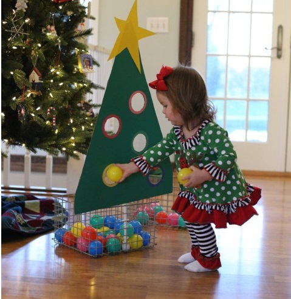

Your toddlers will absolutely love this Christmas sorting game created from cardboard, poster board, a yardstick, zip ties, construction paper, ball pit balls, and a basket.

Get the tutorial at [I Can Teach My Child](http://www.icanteachmychild.com/christmas-tree-ball-sort-for-toddlers/)

### **34\. Lump of Coal Saran Wrap Game**

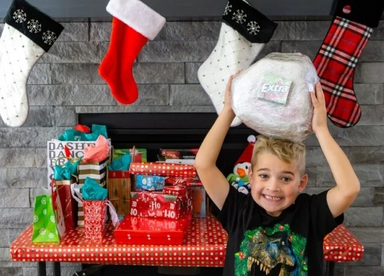

Children will thoroughly enjoy unwrapping each layer of this enormous ball to discover what’s hidden inside. And the inclusion of “coal cards” with humorous instructions is certain to spark lots of giggles along the way.

Get the tutorial at [Play Party Plan](https://www.playpartyplan.com/christmas-saran-wrap-game/)

### **35\. Build a Snowman**

We don’t even have to inquire if you’d like to build a snowman… because the answer is always a resounding yes! When the weather permits, crafting your very own frosty friend is an absolute blast.

Get the tutorial at [The Pioneer Women](https://www.thepioneerwoman.com/home-lifestyle/crafts-diy/a42202938/how-to-build-a-snowman/)

### **36\. Christmas Tree Bowling Game**

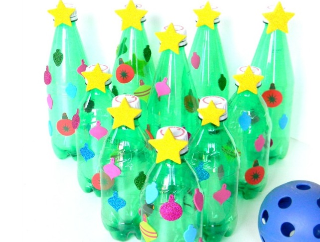

This bowling game with a holiday theme is the perfect way to reuse your soda bottles. Simply adorn them with a star and foam shapes to craft mini Christmas trees.

Get the tutorial at [Stir the Wonder](http://www.stirthewonder.com/christmas-tree-bowling-gross-motor-activity/)

### **37\. Christmas Scavenger Hunt**

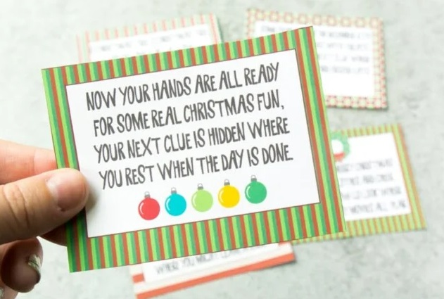

With this printable holiday-themed scavenger hunt, young ones will delight in scouring the house for clues and treats.

Get the tutorial at [Play Party Plan](https://www.playpartyplan.com/christmas-scavenger-hunt/)

### **38\.** [**Have an Indoor Snowball Fight**](https://www.amazon.com/Floof-Modeling-Clay-Reuseable-Accessories/dp/B01DMBEKJU)

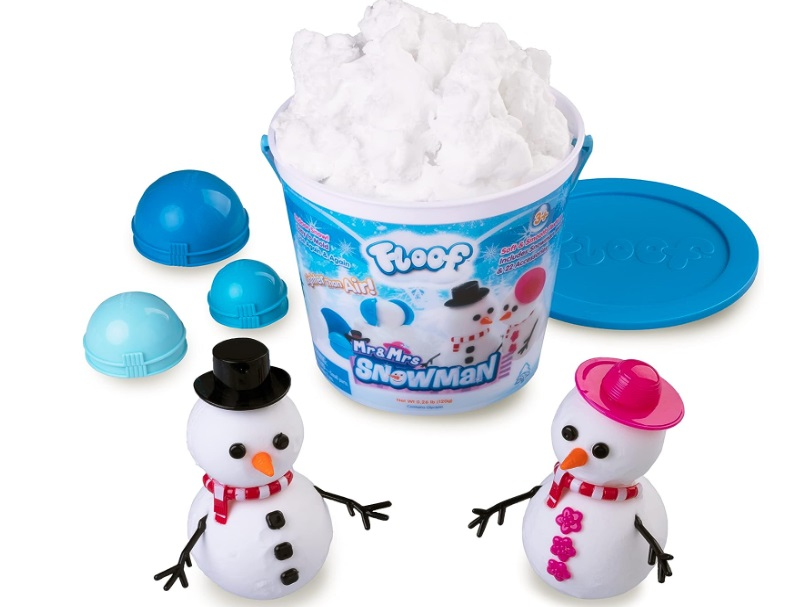

You don’t necessarily need a winter wonderland outside your window to relish a classic snowball fight. In fact, you can have one indoors without stepping outside by using Floof, a mysterious, snow-like modeling substance that offers both enjoyable playtime and easy cleanup.

### **39\. Craft Your Own Wrapping Paper**

Why not skip the store this year and create your own wrapping paper? It’s an enjoyable activity your little ones can join in on, and your friends and family will appreciate the creative touch.

Get the tutorial at [First Day of Home](https://www.firstdayofhome.com/diy-wrapping-paper/)

### **40\. Santa Photo Booth Accessories**

Let’s set up a special spot for photos and fill it with exciting and playful costumes you can wear for pictures. Here’s a handy tip: You can also take your family picture for your Christmas card right here!

Get the tutorial at [Hostess with the Mostess](https://www.hwtm.com/printable-holiday-photo-booth-accessories/)

### **41\. The Christmas Present Game**

In this Christmas guessing game, participants seek to uncover the finest gifts concealed within the boxes (be aware, some might contain hilarious gag gifts!). Everyone has an opportunity to pilfer the most desirable presents. While it may appear similar to a [Secret Santa gift](https://avada.io/loveable/secret-santa-gift-ideas/) exchange, it offers an exciting twist to delight your friends and family.

Get the tutorial at [Let’s Get Together](https://lets-get-together.com/2014/11/17/the-christmas-game/#_a5y_p=2860784)

### **42\.** [**Read ‘A Christmas Carol’ Out Loud**](https://www.amazon.com/Christmas-Carol-Charles-Dickens/dp/1503212831/)

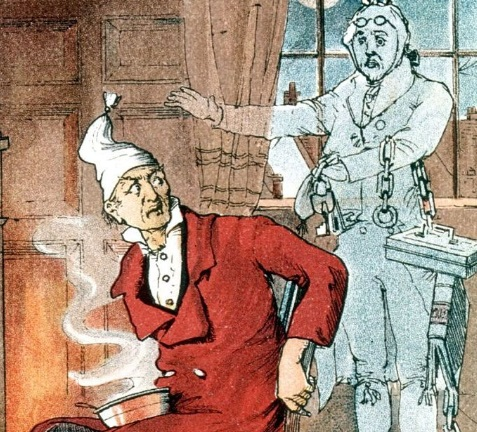

Charles Dickens’s timeless novella is a strong reminder of how redemption and understanding matter. Share it with your children by a warm fire, enjoying a cup of hot cocoa together.

### **43\. Hit the Grinch Game**

Don’t allow the Grinch to dampen your festive mood! In this game, you and your littlest guests can team up to target the notorious character who swiped Christmas by using Nerf guns and green balloons.

Get the tutorial at [A Girl & A Glue Gun](https://www.agirlandagluegun.com/2016/12/hit-grinch-game-perfect-classroom-parties.html)

### **44\. Host a White Elephant Gift Exchange**

It’s just like a regular gift exchange, but with a twist – the participants are kids, and the gifts they trade are carefully chosen toys. Need some toy ideas? Check them out here! (Hint: This works better with slightly older kids, as younger ones might not enjoy seeing their presents traded by their friends.)

**_See More:_** [25 Days of Christmas Activities](https://avada.io/loveable/blog/25-days-of-christmas-activities/)

## **Bottom line**

The **12 days of Christmas activities** offer a delightful blend of tradition and creativity, immersing participants in the season’s festive spirit. Whether it is crafting, singing, baking, or storytelling, each activity serves as a reminder of the joy and togetherness that the holiday season embodies. By engaging in these time-honored practices, individuals can create cherished memories, fostering a deeper appreciation for the magic and wonder of Christmas.

- [12 Days of Christmas Activities for Adults](https://avada.io/loveable/blog/12-days-of-christmas-activities/#wp-block-heading-2-3)
    - [1\. Attend a Christmas Parade](https://avada.io/loveable/blog/12-days-of-christmas-activities/#wp-block-heading-3-4)
    - [2\. Max Fun Antler Ring Toss](https://avada.io/loveable/blog/12-days-of-christmas-activities/#wp-block-heading-3-7)
    - [3\. Naughty or Nice Christmas Edition](https://avada.io/loveable/blog/12-days-of-christmas-activities/#wp-block-heading-3-10)
    - [4\. Holiday Movie Drinking Game](https://avada.io/loveable/blog/12-days-of-christmas-activities/#wp-block-heading-3-13)
    - [5\. Ugly Christmas Sweater Contest](https://avada.io/loveable/blog/12-days-of-christmas-activities/#wp-block-heading-3-16) 
    - [6\. Funko Christmas Story Card Game](https://avada.io/loveable/blog/12-days-of-christmas-activities/#wp-block-heading-3-19)
    - [7\. Christmas Movie Bingo](https://avada.io/loveable/blog/12-days-of-christmas-activities/#wp-block-heading-3-22)
    - [8\. Gift Wrap Physical Challenge](https://avada.io/loveable/blog/12-days-of-christmas-activities/#wp-block-heading-3-25) 
    - [9\. The Caroling Challenge](https://avada.io/loveable/blog/12-days-of-christmas-activities/#wp-block-heading-3-29)
    - [10\. Christmas Pictionary Cards](https://avada.io/loveable/blog/12-days-of-christmas-activities/#wp-block-heading-3-33)
- [12 Days Of Christmas Activities For Work](https://avada.io/loveable/blog/12-days-of-christmas-activities/#wp-block-heading-2-36)
    - [11\. Have a Christmas Photocall](https://avada.io/loveable/blog/12-days-of-christmas-activities/#wp-block-heading-3-37)
    - [12\. Merry Murder Mystery](https://avada.io/loveable/blog/12-days-of-christmas-activities/#wp-block-heading-3-40)
    - [13\. Host a Department Decoration Contest](https://avada.io/loveable/blog/12-days-of-christmas-activities/#wp-block-heading-3-44)
    - [14\. White Elephant Exchange](https://avada.io/loveable/blog/12-days-of-christmas-activities/#wp-block-heading-3-49)
    - [15\. Hidden Snowmen](https://avada.io/loveable/blog/12-days-of-christmas-activities/#wp-block-heading-3-53)
    - [16\. Holiday Movie Marathon](https://avada.io/loveable/blog/12-days-of-christmas-activities/#wp-block-heading-3-56)
    - [17\. Host an Awards Ceremony](https://avada.io/loveable/blog/12-days-of-christmas-activities/#wp-block-heading-3-59)
    - [18\. Host a Holiday Bake-Off](https://avada.io/loveable/blog/12-days-of-christmas-activities/#wp-block-heading-3-62)
    - [19\. Christmas Karaoke](https://avada.io/loveable/blog/12-days-of-christmas-activities/#wp-block-heading-3-65)
    - [20\. Host an Ugly Sweater Contest](https://avada.io/loveable/blog/12-days-of-christmas-activities/#wp-block-heading-3-69)
- [12 Days of Christmas Family Activities](https://avada.io/loveable/blog/12-days-of-christmas-activities/#wp-block-heading-2-72)
    - [21\. Decorate the House](https://avada.io/loveable/blog/12-days-of-christmas-activities/#wp-block-heading-3-73)
    - [22\. Take the Family Ice Skating](https://avada.io/loveable/blog/12-days-of-christmas-activities/#wp-block-heading-3-76)
    - [23\. Read Christmas Book](https://avada.io/loveable/blog/12-days-of-christmas-activities/#wp-block-heading-3-79) 
    - [24\. Make and Send Some Christmas Cards](https://avada.io/loveable/blog/12-days-of-christmas-activities/#wp-block-heading-3-82)
    - [25\. Donate Christmas Season](https://avada.io/loveable/blog/12-days-of-christmas-activities/#wp-block-heading-3-86)
    - [26\. Have a Lights Tour](https://avada.io/loveable/blog/12-days-of-christmas-activities/#wp-block-heading-3-89)
    - [27.  Plan a Family Photoshoot](https://avada.io/loveable/blog/12-days-of-christmas-activities/#wp-block-heading-3-92) 
    - [28\. Have a Video Call with Santa Claus](https://avada.io/loveable/blog/12-days-of-christmas-activities/#wp-block-heading-3-95)
    - [29\. Light A Fire and Have a S’mores Night](https://avada.io/loveable/blog/12-days-of-christmas-activities/#wp-block-heading-3-99)
    - [30\. Create a Gingerbread House Village](https://avada.io/loveable/blog/12-days-of-christmas-activities/#wp-block-heading-3-102)
    - [31\. Make Sugar Cookies](https://avada.io/loveable/blog/12-days-of-christmas-activities/#wp-block-heading-3-105)
    - [32\. Play Christmas Song Bingo](https://avada.io/loveable/blog/12-days-of-christmas-activities/#wp-block-heading-3-108)
- [12 Days of Christmas Advent Activities & Games for Kids](https://avada.io/loveable/blog/12-days-of-christmas-activities/#wp-block-heading-2-112) 
    - [33\. Christmas Tree Ball Sort Game](https://avada.io/loveable/blog/12-days-of-christmas-activities/#wp-block-heading-3-113)
    - [34\. Lump of Coal Saran Wrap Game](https://avada.io/loveable/blog/12-days-of-christmas-activities/#wp-block-heading-3-117)
    - [35\. Build a Snowman](https://avada.io/loveable/blog/12-days-of-christmas-activities/#wp-block-heading-3-121)
    - [36\. Christmas Tree Bowling Game](https://avada.io/loveable/blog/12-days-of-christmas-activities/#wp-block-heading-3-125)
    - [37\. Christmas Scavenger Hunt](https://avada.io/loveable/blog/12-days-of-christmas-activities/#wp-block-heading-3-129)
    - [38\. Have an Indoor Snowball Fight](https://avada.io/loveable/blog/12-days-of-christmas-activities/#wp-block-heading-3-133)
    - [39\. Craft Your Own Wrapping Paper](https://avada.io/loveable/blog/12-days-of-christmas-activities/#wp-block-heading-3-136)
    - [40\. Santa Photo Booth Accessories](https://avada.io/loveable/blog/12-days-of-christmas-activities/#wp-block-heading-3-140)
    - [41\. The Christmas Present Game](https://avada.io/loveable/blog/12-days-of-christmas-activities/#wp-block-heading-3-144)
    - [42\. Read ‘A Christmas Carol’ Out Loud](https://avada.io/loveable/blog/12-days-of-christmas-activities/#wp-block-heading-3-148)
    - [43\. Hit the Grinch Game](https://avada.io/loveable/blog/12-days-of-christmas-activities/#wp-block-heading-3-151)
    - [44\. Host a White Elephant Gift Exchange](https://avada.io/loveable/blog/12-days-of-christmas-activities/#wp-block-heading-3-155)
- [Bottom line](https://avada.io/loveable/blog/12-days-of-christmas-activities/#wp-block-heading-2-159)

### [Blake Simpson](https://avada.io/loveable/author/blake/)

Hi, I'm Blake from Loveable. I help people find perfect gifts for occasions like anniversaries and weddings. I also write a blog about holidays, sharing insights to make them more meaningful. Let's create unforgettable moments together!

- [Twitter](https://twitter.com/intent/tweet)
- [Facebook](https://www.facebook.com/sharer/sharer.php)
- [instagram](https://avada.io/loveable/blog/12-days-of-christmas-activities/)
- [pinterest](https://www.pinterest.com/loveablellc/)

## Related Posts

[### 120+ Christian Birthday Wishes To Spread Your Love](https://avada.io/loveable/blog/christian-birthday-wishes/) 

[

### 35 Best 70th Birthday Ideas To Celebrate The Special Milestone

](https://avada.io/loveable/blog/70th-birthday-ideas/)

[

### 50 Best 30th Birthday Decorations for a Remarkable Birthday Bash

](https://avada.io/loveable/blog/30th-birthday-decorations/)

[

### 40 Delicious Vegan Christmas Desserts to Delight Your Palate

](https://avada.io/loveable/blog/vegan-christmas-desserts/)

[

### 60 Christmas Team Building Activities to Boost Workplace Spirit

](https://avada.io/loveable/blog/christmas-team-building-activities/)
