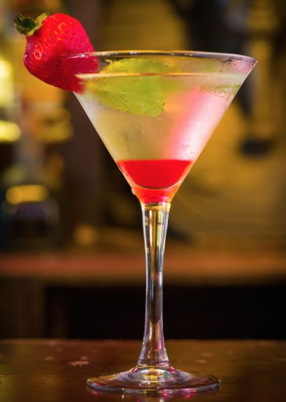

This article has been written and researched by our expert Loveable through a precise methodology. [Learn more about our methodology](https://avada.io/loveable/our-methodological.html)

[Loveable](https://avada.io/loveable/) > [Blog](https://avada.io/loveable/blog/) > [Holiday](https://avada.io/loveable/holiday/)

# 40 Best Halloween Drinks and Cocktail to Try in 2023

Written by [Blake Simpson](https://avada.io/loveable/author/blake/) Last Updated on August 31, 2023

- [40 Creepy and Delicious Halloween Drinks to Try](https://avada.io/loveable/blog/halloween-drinks/#wp-block-heading-2-4)
    - [1\. Poison Apple Cocktails](https://avada.io/loveable/blog/halloween-drinks/#wp-block-heading-3-5)
    - [2\. Black Magic Jell-O Shots](https://avada.io/loveable/blog/halloween-drinks/#wp-block-heading-3-9)
    - [3\. Jekyll & Gin](https://avada.io/loveable/blog/halloween-drinks/#wp-block-heading-3-13)
    - [4\. Witches’ Brew Lemonade](https://avada.io/loveable/blog/halloween-drinks/#wp-block-heading-3-17)
    - [5\. Washington Apple Shot](https://avada.io/loveable/blog/halloween-drinks/#wp-block-heading-3-21)
    - [6\. Harvest Punch](https://avada.io/loveable/blog/halloween-drinks/#wp-block-heading-3-25)
    - [7\. Apple Cider Sangria](https://avada.io/loveable/blog/halloween-drinks/#wp-block-heading-3-29)
    - [8\. Sweet Poison Cocktail](https://avada.io/loveable/blog/halloween-drinks/#wp-block-heading-3-33)
    - [9\. Apple Cider Mimosas](https://avada.io/loveable/blog/halloween-drinks/#wp-block-heading-3-37)
    - [10\. The Zombie Cocktail](https://avada.io/loveable/blog/halloween-drinks/#wp-block-heading-3-41)
    - [11\. Bourbon Milk Punch](https://avada.io/loveable/blog/halloween-drinks/#wp-block-heading-3-46)
    - [12\. Hot Buttered Rum](https://avada.io/loveable/blog/halloween-drinks/#wp-block-heading-3-51)
    - [13\. Salted Caramel-Apple Cider](https://avada.io/loveable/blog/halloween-drinks/#wp-block-heading-3-55)
    - [14\. J-E-L-L-Glow Shots](https://avada.io/loveable/blog/halloween-drinks/#wp-block-heading-3-60)
    - [15\. Transformation Cocktail](https://avada.io/loveable/blog/halloween-drinks/#wp-block-heading-3-64)
    - [16\. Mudslide Cocktail](https://avada.io/loveable/blog/halloween-drinks/#wp-block-heading-3-68)
    - [17\. Sparkling Apple Cider Sangria](https://avada.io/loveable/blog/halloween-drinks/#wp-block-heading-3-72)
    - [18\. Fireball Apple Jell-O Shots](https://avada.io/loveable/blog/halloween-drinks/#wp-block-heading-3-76)
    - [19\. Apple Cider Old Fashioneds](https://avada.io/loveable/blog/halloween-drinks/#wp-block-heading-3-81)
    - [20\. Fireball Sangria](https://avada.io/loveable/blog/halloween-drinks/#wp-block-heading-3-85)
    - [21\. Pumpkin Spice White Russians](https://avada.io/loveable/blog/halloween-drinks/#wp-block-heading-3-89)
    - [22\. Apple Cider Margaritas](https://avada.io/loveable/blog/halloween-drinks/#wp-block-heading-3-93)
    - [23\. Boozy Witch’s Brew](https://avada.io/loveable/blog/halloween-drinks/#wp-block-heading-3-97)
    - [24\. Witches Brew Drink](https://avada.io/loveable/blog/halloween-drinks/#wp-block-heading-3-101)
    - [25\. Vampire’s Kiss Cocktail](https://avada.io/loveable/blog/halloween-drinks/#wp-block-heading-3-105)
    - [26\. Halloween Punch](https://avada.io/loveable/blog/halloween-drinks/#wp-block-heading-3-109)
    - [27\. Pumpkin Martini](https://avada.io/loveable/blog/halloween-drinks/#wp-block-heading-3-113)
    - [28\. Pumpkin Old Fashioned](https://avada.io/loveable/blog/halloween-drinks/#wp-block-heading-3-118)
    - [29\. Corpse Reviver](https://avada.io/loveable/blog/halloween-drinks/#wp-block-heading-3-122)
    - [30\. Death in the Afternoon Cocktail](https://avada.io/loveable/blog/halloween-drinks/#wp-block-heading-3-127)
    - [31\. Haunted Pumpkin Patch Margarita](https://avada.io/loveable/blog/halloween-drinks/#wp-block-heading-3-131)
    - [32\. The Zombie](https://avada.io/loveable/blog/halloween-drinks/#wp-block-heading-3-135)
    - [33\. Bloody Mary](https://avada.io/loveable/blog/halloween-drinks/#wp-block-heading-3-139)
    - [34\. Nightmare on Bourbon Street](https://avada.io/loveable/blog/halloween-drinks/#wp-block-heading-3-144)
    - [35\. Black Charcoal Lemonade Halloween Cocktail](https://avada.io/loveable/blog/halloween-drinks/#wp-block-heading-3-148)
    - [36\. Color-Changing Margaritas](https://avada.io/loveable/blog/halloween-drinks/#wp-block-heading-3-152)
    - [37\. Mulled Apple Cider](https://avada.io/loveable/blog/halloween-drinks/#wp-block-heading-3-156)
    - [38\. The Risen From the Grave Cocktail](https://avada.io/loveable/blog/halloween-drinks/#wp-block-heading-3-160)
    - [39\. Apple Cider Slushies](https://avada.io/loveable/blog/halloween-drinks/#wp-block-heading-3-164)
    - [40\. Aviation Cocktail](https://avada.io/loveable/blog/halloween-drinks/#wp-block-heading-3-168)
- [To Wrap Up,](https://avada.io/loveable/blog/halloween-drinks/#wp-block-heading-2-174)

What takes a Halloween party to the next level? **Halloween drinks**! Themed cocktails add a delightful touch to any gathering, and these particular [Halloween punch drinks](https://avada.io/loveable/blog/halloween-punch/) perfectly embody the spooky and neon-colored essence. 

To enhance the experience, some of these beverages even bubble and smoke! While we appreciate the art of traditional cocktails, we couldn’t resist including some of our all-time favorites that align perfectly with the eerie theme, such as Corpse Reviver, Death in the Afternoon, and Zombie, all of which hail from the 1920s. Additionally, we’ve curated a selection of fantastic concoctions from our beloved recipe sources on the web. 

Are you excited to begin the Halloween festivities? Let’s dive in!

## **40 Creepy and Delicious Halloween Drinks to Try**

### **1\. Poison Apple Cocktails**

This beverage is entirely focused on the mesmerizing allure of edible glitter (and trust us, we are absolutely obsessed with it!). However, a word of caution: to achieve the fantastic swirling effect, the glitter requires thorough mixing. If you don’t have a cocktail shaker at your disposal, consider using a blender instead!

[Get the Poison Apple Cocktails recipe!](https://www.delish.com/cooking/recipe-ideas/a23878264/poison-apple-cocktails-recipe/)

### **2\. Black Magic Jell-O Shots**

These shots, featuring two eerie layers—one purple and one black—are an ideal addition to elevate your upcoming [Halloween party](https://avada.io/loveable/blog/halloween-party-games-adults/). If you’re looking for a delightful accompaniment to enjoy with these shots, you must try making the ridiculously adorable mummy brie. It’s the perfect snack to complement the spooky ambiance!

[Get the Black Magic Jell-O Shots recipe!](https://www.delish.com/cooking/recipe-ideas/a23876979/black-magic-jell-o-shots-recipe/)

### **3\. Jekyll & Gin**

Prepare yourself for a mind-bending experience with this drink, and that’s even before the alcohol takes effect. Inspired by a Gin Daisy, this cocktail has a fascinating twist: it appears coral in regular daylight but transforms into a glowing white spectacle under a black light, all thanks to the magical properties of tonic water!

[Get the Jekyll & Gin recipe!](https://www.delish.com/cooking/recipe-ideas/recipes/a44311/jekyll-gin-glowing-cocktails-glow-party-ideas/)

### **4\. Witches’ Brew Lemonade**

Achieving an eerie glow reminiscent of something concocted in a cauldron was no simple feat. By skillfully layering sparkling lemonade with Blue Curacao and purple gin, we’ve created a chilling and mesmerizing effect. The best part? The results are not only visually striking but also incredibly delicious.

[Get the Witches’ Brew Lemonade recipe!](https://www.delish.com/holiday-recipes/halloween/a29178988/witches-brew-lemonade-recipe/)

### **5\. Washington Apple Shot**

Derived from the classic Washington Apple Cocktail, the Washington Apple Shot brings together whiskey, usually of the Canadian variety, apple schnapps, and cranberry juice. To elevate its flavor profile, we introduced a touch of pomegranate for an added twist! The resulting drink is crisp, aromatic, and rejuvenating—a perfect choice for leisurely sipping and savoring.

[Get the Washington Apple Shot recipe!](https://www.delish.com/cooking/recipe-ideas/a40515769/washington-apple-shot-recipe/)

### **6\. Harvest Punch**

Though cider and ginger beer might initially strike you as an unusual combination, don’t let that deter you. When blended with fresh fruit and cinnamon, and topped with delightful bubbles, we assure you it’s a winning concoction. However, if you’re planning a smaller but equally lively brunch gathering, our caramel apple mimosas would be the perfect alternative choice.

[Get the Harvest Punch recipe!](https://www.delish.com/cooking/recipe-ideas/recipes/a55182/harvest-punch-recipe/)

### **7\. Apple Cider Sangria**

While Sangria often evokes memories of warm summer nights and tropical fruits, this apple-based cocktail will effortlessly transition you into the cozy embrace of fall. Embracing the spirit of the season, we crafted a delightful white wine sangria, perfectly complemented by the addition of spicy ginger beer and sweet apple cider. Get ready to embrace the autumn vibes with every sip!

[Get the Apple Cider Sangria recipe!](https://www.delish.com/cooking/recipe-ideas/a22877349/sparkling-apple-cider-sangria-recipe/)

### **8\. Sweet Poison Cocktail**

The Jekyll and Hyde Club in New York City maintains an eternal Halloween atmosphere, but on October 31st, it becomes one of the trendiest destinations in Manhattan. Among their array of popular Halloween drinks, their scary-good tropical rum cocktail stands out as a favorite. Its irresistible appeal has us yearning for Halloween vibes every single day!

[Get the Sweet Poison Cocktail recipe!](https://www.delish.com/cooking/recipe-ideas/recipes/a43892/sweet-poison-cocktail/)

### **9\. Apple Cider Mimosas**

Mimosas have long been the go-to brunch cocktail, but as the weather turns colder and our taste preferences shift towards cozy, autumn-inspired flavors, sipping on a bright and citrusy drink feels a bit unusual. Enter the perfect solution: a fall twist on the classic mimosa that embraces the comforting essence of the season. It’s a delightful way to toast and celebrate the beauty of autumn!

[Get the Apple Cider Mimosas recipe!](https://www.delish.com/cooking/recipe-ideas/recipes/a46963/apple-cider-mimosas-recipe/)

### **10\. The Zombie Cocktail**

Despite its spooky name, the Zombie is actually a refreshing and citrus-forward tiki cocktail that will transport your mind to a sunny day at the beach rather than an invasion of the undead.

 According to legend, the first person to try this potent concoction felt like a zombie for days afterward. However, when we indulge in a Zombie, our main desire is to head straight to the nearest pool party, feeling revitalized and ready for some fun in the sun!

[Get the Zombie Cocktail recipe!](https://www.delish.com/cooking/recipe-ideas/recipes/a43896/halloween-cocktail-ideas-zombie-cocktail-recipe/)

### **11\. Bourbon Milk Punch**

Indulge in this boozy milkshake, elegantly adorned with caramel-rimmed glass. While it may give the impression of being mild, don’t be deceived, as it packs a powerful punch. 

Infused with the delightful combination of bourbon and honey, this cocktail is a luxurious and creamy dream. Once you’ve savored this delightful creation, be sure to explore the realm of our red wine milkshakes for another enticing and unique experience!

[Get the Bourbon Milk Punch recipe!](https://www.delish.com/cooking/recipe-ideas/recipes/a52301/bourbon-milk-punch-recipe/)

### **12\. Hot Buttered Rum**

Hot buttered rum can be considered the original version of butter beer. Both share the characteristics of a golden hue, delectable sweetness, and a frothy head that might leave you with a whimsical mustache after each sip. Combining rum, butter, sugar, ice cream, and a generous sprinkling of cinnamon results in a heartwarming wintertime concoction that exudes pure magic in every single glass.

[Get the Hot Buttered Rum recipe!](https://www.delish.com/cooking/recipes/a50396/hot-buttered-rum-recipe/)

### **13\. Salted Caramel-Apple Cider**

This delightful concoction brings together two cherished fall flavors: the irresistible combination of salted caramel and apple. For an extra special touch, consider serving them in apple cups to elevate the presentation. 

If you can’t get your hands on caramel vodka, don’t worry! Regular vodka works just as well, and you can enhance the drink’s appeal with a luscious caramel drizzle garnish. Cheers to enjoying the best of autumn in each sip!

[Get the Salted Caramel-Apple Cider recipe!](https://www.delish.com/cooking/recipe-ideas/recipes/a44176/spiked-salted-caramel-apple-cider-recipe/)

### **14\. J-E-L-L-Glow Shots**

Prepare to be amazed by the incredible innovation of light-up Jell-O shots, and the best part is, you probably already have the key ingredient in your pantry: tonic water! To achieve the mesmerizing glow effect, ensure you use pure tonic water, without diluting it with tap water. However, be aware that this choice might result in slightly bitter shots. Get ready for a luminous and thrilling Jell-O shot experience!

[Get the J-E-L-L-Glow Shots recipe!](https://www.delish.com/cooking/recipe-ideas/recipes/a44347/glowing-jell-o-shots-glow-party-foods/)

### **15\. Transformation Cocktail**

This cocktail is an enchanting blend of blackberry brandy, rum, strawberries, and orange juice, creating a truly magical and transformative drink. However, a word of caution: the delightfully fruity and frozen concoction might make you forget you’re actually sipping on alcohol!

[Get the Transformation Cocktail recipe!](https://www.delish.com/cooking/recipe-ideas/recipes/a43893/halloween-cocktail-ideas-transformation-cocktail-recipe/)

### **16\. Mudslide Cocktail**

Indulge in the ultimate dessert cocktail experience with a glass adorned with a delectable chocolate rim, containing a creamy blend of vodka, Baileys, and Kahlua. This delightful concoction goes beyond merely incorporating booze into [Halloween dessert](https://avada.io/loveable/blog/halloween-dessert-recipes/); it becomes an irresistible treat in itself—no further justification is necessary. For a perfect pairing, savor this cocktail alongside our mini Baileys cheesecakes for an unforgettable taste sensation!

[Get the Mudslide Cocktail recipe!](https://www.delish.com/cooking/recipe-ideas/a30212606/mudslide-cocktail-recipe/)

### **17\. Sparkling Apple Cider Sangria**

For ideal post-apple picking, fall leaf-crunching, or [pumpkin-carving Halloween](https://avada.io/loveable/blog/halloween-pumpkin/) drinks, look no further than this delightful sangria. It brings together sparkling wine, apple cider, and fireball whiskey in perfect harmony. And if you happen to have some fireball whiskey left, be sure to explore our finest Fireball recipes to make the most of every drop!

[Get the Sparkling Apple Cider Sangria recipe!](https://www.delish.com/cooking/recipe-ideas/a22877349/sparkling-apple-cider-sangria-recipe/)

### **18\. Fireball Apple Jell-O Shots**

In our opinion, no good party is complete without a Jell-O shot, and these Fireball apple shots are sure to be a crowd-pleaser with everyone—friends, cousins, coworkers, and even Grandma. 

Here’s a crucial tip: make sure not to skip the lemon juice! It plays a vital role in keeping the apples from browning while the Jell-O perfectly sets up in the fridge. Get ready to enjoy a fantastic treat that will impress all your guests!

[Get the Fireball Apple Jell-O Shots recipe!](https://www.delish.com/cooking/recipe-ideas/a23460619/fireball-apple-jell-o-shots-recipe/)

### **19\. Apple Cider Old Fashioneds**

Our love affair with apple cider knows no bounds. From delightful apple cider sangria to refreshing apple cider mimosas, it effortlessly elevates various cocktails. As autumn approaches, we find ourselves incorporating it into every possible concoction, especially this exciting twist on the classic Old Fashioned. The enchanting flavors of apple cider add a whole new dimension to this beloved cocktail.

[Get the Apple Cider Old Fashioneds recipe!](https://www.delish.com/cooking/recipe-ideas/recipes/a56767/apple-cider-old-fashioned-recipe/)

### **20\. Fireball Sangria**

Elevate your red wine sangria by adding a touch of Fireball. This cinnamon-infused whiskey serves as a perfect gateway into the realm of fall cocktails. In case you can’t get your hands on blood oranges, feel free to use cara cara or navel oranges as delightful substitutes!

[Get the Fireball Sangria recipe!](https://www.delish.com/cooking/recipe-ideas/recipes/a46778/fireball-sangria-recipe/)

### **21\. Pumpkin Spice White Russians**

Behold, your pumpkin spice latte, now with a mature twist! Whether you’re seeking a delightful nightcap or aiming to impress with a signature cocktail on Thanksgiving, this creation is guaranteed to win over the crowd. Cheers to a crowd-pleasing and elevated pumpkin spice experience!

[Get the Pumpkin Spice White Russians recipe!](https://www.delish.com/cooking/recipe-ideas/recipes/a56718/pumpkin-spice-white-russians/)

### **22\. Apple Cider Margaritas**

Combining the best elements of summery margaritas with the spiciness and seasonal charm of apple cider, they offer a perfect fusion to toast the joys of autumn. Cheers to a wonderful fall season filled with delicious sips and cherished moments!

[Get the Apple Cider Margaritas recipe!](https://www.delish.com/cooking/recipe-ideas/recipes/a55800/apple-cider-margaritas-recipe/)

### **23\. Boozy Witch’s Brew**

The guy at your Halloween party who’s dedicated to being Captain Jack Sparrow will finally have the perfect opportunity to exclaim, “Where’s all the rum gone?” With this spiked pomegranate-pineapple punch, it’s no wonder the drink always vanishes swiftly, leaving everyone enchanted by its irresistible flavor.

[Get the Boozy Witch’s Brew recipe!](https://www.delish.com/cooking/recipe-ideas/videos/a44091/boozy-witchs-brew-is-the-drink/)

### **24\. Witches Brew Drink**

On the hunt for a hauntingly impressive Halloween cocktail? Look no further than the Witches Brew! While its neon green hue may appear menacing, one sip reveals a bright and delightfully sweet-tart concoction, infused with melon and citrus flavors. 

[Get the Witches Brew Drink recipe!](https://www.acouplecooks.com/witches-brew-drink/)

### **25\. Vampire’s Kiss Cocktail**

Indulge in the spookiness of Halloween with another eerie concoction: the Vampire’s Kiss! The blood-red Halloween drinks are no more than a berry-flavored vodka martini, cleverly disguising itself as a sinister Halloween delight. 

[Get the Vampire’s Kiss Cocktail recipe!](https://www.acouplecooks.com/vampires-kiss-cocktail/)

### **26\. Halloween Punch**

This blood-red cauldron concoction possesses the magical ability to bubble and boil, sending wisps of smoke swirling throughout the room. It’s an impressive sight to behold! Initially, it’s a delightful fruity Halloween punch suitable for kids. However, if you desire an adult version, simply add aged rum to transform it into a captivating Halloween alcoholic punch.

[Get the Halloween Punch recipe!](https://www.acouplecooks.com/halloween-punch/)

### **27\. Pumpkin Martini**

For Halloween festivities, nothing beats a Pumpkin Martini! Indulge in this creamy concoction, crafted with real pumpkin to ensure the finest natural flavor. 

To take it up a notch, adorn the glass rim with crushed graham crackers, imparting a delightful hint of crunchy sweetness with every sip. This cocktail is the ultimate showstopper, perfect for impressing your friends and making your Halloween celebration truly memorable.

[Get the Pumpkin Martini recipe!](https://www.acouplecooks.com/pumpkin-martini/)

### **28\. Pumpkin Old Fashioned**

Calling all bourbon-lovers, this one’s for you: a sophisticated and nuanced slow sipper, adorned with delightful notes of vanilla, maple, and spice. This beverage offers a balanced touch of sweetness, allowing the robust bourbon flavors to shine through. It’s the perfect companion for cozy fireside sipping or any autumnal gathering. 

[Get the Pumpkin Old Fashioned recipe!](https://www.acouplecooks.com/pumpkin-old-fashioned-cocktail/)

### **29\. Corpse Reviver**

Although this drink lacks any spooky or ghoulish elements, it remains an impeccable choice for Halloween – and trust us, it’s absolutely delicious. This classic gin sour cocktail from the 1930s tantalizes your taste buds with its tart and zingy combination of lemon juice and orange liqueur, concluding with a subtle touch of licorice on the finish. 

Undoubtedly, it’s a stunning beverage that will leave a lasting impression on anyone who takes a sip.

[Get the Corpse Reviver recipe!](https://www.acouplecooks.com/corpse-reviver/)

### **30\. Death in the Afternoon Cocktail**

In the spotlight is an enchanting iridescent green cocktail, featuring a captivating blend of absinthe and sparkling wine that offers a delightfully intriguing flavor profile. Effervescent and spirited, it culminates in a black licorice finish that lingers on the palate. 

[Get the Death in the Afternoon Cocktail recipe!](https://www.acouplecooks.com/death-in-the-afternoon-cocktail/)

### **31\. Haunted Pumpkin Patch Margarita**

Indulge in the essence of Halloween with this delightful sweet and spiced pumpkin margarita! A bewitching blend of pumpkin butter, apple cider, tequila, and ginger beer comes together to create pure magic in every sip. It’s the perfect cocktail to infuse your Halloween celebrations with a touch of enchantment and delight.

[Get the Haunted Pumpkin Patch Margarita recipe!](https://www.halfbakedharvest.com/pumpkin-patch-margarita/)

### **32\. The Zombie**

Introducing an extravagant Halloween cocktail that’s sure to captivate adventurous home bartenders: the Zombie! This classic concoction is not for the faint of heart, as it boasts a powerful blend of four types of rum, three fruit juices, and two fruit syrups. 

[Get the Zombie recipe!](https://www.acouplecooks.com/zombie-cocktail/)

### **33\. Bloody Mary**

Presenting another timeless Halloween cocktail: the ever-familiar Bloody Mary! This classic libation originated in the 1920s and has since become one of the world’s most beloved combinations, blending vodka and tomato juice. 

For the spooky season, get creative and add eerie garnishes like pickled onion eyeballs to take this iconic drink right into the Halloween spirit!

[Get the Bloody Mary recipe!](https://www.acouplecooks.com/bloody-mary-recipe/)

### **34\. Nightmare on Bourbon Street**

Next in our lineup of Halloween cocktails is the bewitching “Nightmare on Bourbon Street!” This enchanting concoction embraces the sweetness, spice, and comforting warmth, featuring everyone’s beloved fall liquor. It’s the ultimate haunted cocktail to curl up with on Halloween Night, promising a delightfully cozy and spirited experience! Courtesy of Half Baked Harvest.

[Get the Nightmare on Bourbon Street recipe!](https://www.halfbakedharvest.com/nightmare-on-bourbon-street/)

### **35\. Black Charcoal Lemonade Halloween Cocktail**

Elevate this childhood favorite for Halloween with a touch of activated charcoal. For an extra thrilling twist, add a splash of vodka to transform this innocent drink into something a little more “deadly.”

[Get the Black Charcoal Lemonade Halloween Cocktail recipe!](https://www.goodhousekeeping.com/food-recipes/a28552458/black-charcoal-lemonade-recipe/)

### **36\. Color-Changing Margaritas**

Unveiling the mystery behind these color-changing margaritas is an unexpected secret ingredient that will surely surprise your Halloween guests: cabbage!

[Get the Color-Changing Margaritas recipe!](https://www.delish.com/cooking/recipe-ideas/a27183454/color-changing-margaritas-recipe/)

### **37\. Mulled Apple Cider**

Ensure your Halloween party guests stay warm and cozy by keeping a large pot of this delightful cider simmering on the stove. Its comforting aroma and delicious taste will be enjoyed by both kids and adults alike.

[Get the Mulled Apple Cider recipe!](https://www.thepioneerwoman.com/food-cooking/recipes/a10425/mulled-apple-cider/)

### **38\. The Risen From the Grave Cocktail**

Among Halloween drinks, this will perfectly complement your zombie costume! However, even if you’re not going for the undead look, you’ll still relish the delightful taste of this strawberry and vodka puree concoction.

[Get The Risen From the Grave Cocktail recipe](https://www.delish.com/cooking/recipe-ideas/recipes/a43890/the-risen-from-the-grave-cocktail-recipe/)

### **39\. Apple Cider Slushies**

Amidst the abundance of apple ciders this season, why not try something unique: apple cider slushies! This refreshing twist on a classic beverage offers a chilling and delightful way to enjoy your Halloween celebrations.

[Get the Apple Cider Slushies recipe](https://www.delish.com/cooking/recipes/a49600/apple-cider-slushies-recipe/)

### **40\. Aviation Cocktail**

Created by New York bartender Hugo Ensslin over a century ago, the Aviation cocktail has experienced periods of popularity and obscurity over the years. Unfortunately, when crème de violette, the essential violet liqueur responsible for its signature purple hue and floral taste, was discontinued in the 1960s, crafting a classic Aviation at home became a near-impossible task. 

However, the cocktail enthusiasts’ prayers were answered when it made a comeback in the mid-2000s. While still challenging to find, devoted fans of this floral delight understand that the effort to locate it is undoubtedly worthwhile.

[Get the Aviation Cocktail recipe!](https://www.delish.com/cooking/recipe-ideas/a36940314/aviation-cocktail-recipe/)

**Related:** Best [Halloween Food Ideas](https://avada.io/loveable/halloween-food-ideas/) For A Spooky Party

## **To Wrap Up,**

In conclusion, this list of the **Top 40 Creepy and Delicious Halloween Drinks for 2023** promises an unforgettable and spine-chilling experience. From wickedly colorful concoctions to enchanting potions, there’s a drink to suit every Halloween celebration. Whether you’re hosting a hauntingly festive party or simply seeking to elevate your fall gatherings, these bewitching beverages will surely delight both kids and adults alike. 

So, gather your cauldrons and cocktail shakers, and embark on a thrilling journey of taste and excitement this Halloween season! Cheers to an unforgettable and spook-tacular time with these devilishly delightful drinks. Happy Halloween! 🎃🍹

- [40 Creepy and Delicious Halloween Drinks to Try](https://avada.io/loveable/blog/halloween-drinks/#wp-block-heading-2-4)
    - [1\. Poison Apple Cocktails](https://avada.io/loveable/blog/halloween-drinks/#wp-block-heading-3-5)
    - [2\. Black Magic Jell-O Shots](https://avada.io/loveable/blog/halloween-drinks/#wp-block-heading-3-9)
    - [3\. Jekyll & Gin](https://avada.io/loveable/blog/halloween-drinks/#wp-block-heading-3-13)
    - [4\. Witches’ Brew Lemonade](https://avada.io/loveable/blog/halloween-drinks/#wp-block-heading-3-17)
    - [5\. Washington Apple Shot](https://avada.io/loveable/blog/halloween-drinks/#wp-block-heading-3-21)
    - [6\. Harvest Punch](https://avada.io/loveable/blog/halloween-drinks/#wp-block-heading-3-25)
    - [7\. Apple Cider Sangria](https://avada.io/loveable/blog/halloween-drinks/#wp-block-heading-3-29)
    - [8\. Sweet Poison Cocktail](https://avada.io/loveable/blog/halloween-drinks/#wp-block-heading-3-33)
    - [9\. Apple Cider Mimosas](https://avada.io/loveable/blog/halloween-drinks/#wp-block-heading-3-37)
    - [10\. The Zombie Cocktail](https://avada.io/loveable/blog/halloween-drinks/#wp-block-heading-3-41)
    - [11\. Bourbon Milk Punch](https://avada.io/loveable/blog/halloween-drinks/#wp-block-heading-3-46)
    - [12\. Hot Buttered Rum](https://avada.io/loveable/blog/halloween-drinks/#wp-block-heading-3-51)
    - [13\. Salted Caramel-Apple Cider](https://avada.io/loveable/blog/halloween-drinks/#wp-block-heading-3-55)
    - [14\. J-E-L-L-Glow Shots](https://avada.io/loveable/blog/halloween-drinks/#wp-block-heading-3-60)
    - [15\. Transformation Cocktail](https://avada.io/loveable/blog/halloween-drinks/#wp-block-heading-3-64)
    - [16\. Mudslide Cocktail](https://avada.io/loveable/blog/halloween-drinks/#wp-block-heading-3-68)
    - [17\. Sparkling Apple Cider Sangria](https://avada.io/loveable/blog/halloween-drinks/#wp-block-heading-3-72)
    - [18\. Fireball Apple Jell-O Shots](https://avada.io/loveable/blog/halloween-drinks/#wp-block-heading-3-76)
    - [19\. Apple Cider Old Fashioneds](https://avada.io/loveable/blog/halloween-drinks/#wp-block-heading-3-81)
    - [20\. Fireball Sangria](https://avada.io/loveable/blog/halloween-drinks/#wp-block-heading-3-85)
    - [21\. Pumpkin Spice White Russians](https://avada.io/loveable/blog/halloween-drinks/#wp-block-heading-3-89)
    - [22\. Apple Cider Margaritas](https://avada.io/loveable/blog/halloween-drinks/#wp-block-heading-3-93)
    - [23\. Boozy Witch’s Brew](https://avada.io/loveable/blog/halloween-drinks/#wp-block-heading-3-97)
    - [24\. Witches Brew Drink](https://avada.io/loveable/blog/halloween-drinks/#wp-block-heading-3-101)
    - [25\. Vampire’s Kiss Cocktail](https://avada.io/loveable/blog/halloween-drinks/#wp-block-heading-3-105)
    - [26\. Halloween Punch](https://avada.io/loveable/blog/halloween-drinks/#wp-block-heading-3-109)
    - [27\. Pumpkin Martini](https://avada.io/loveable/blog/halloween-drinks/#wp-block-heading-3-113)
    - [28\. Pumpkin Old Fashioned](https://avada.io/loveable/blog/halloween-drinks/#wp-block-heading-3-118)
    - [29\. Corpse Reviver](https://avada.io/loveable/blog/halloween-drinks/#wp-block-heading-3-122)
    - [30\. Death in the Afternoon Cocktail](https://avada.io/loveable/blog/halloween-drinks/#wp-block-heading-3-127)
    - [31\. Haunted Pumpkin Patch Margarita](https://avada.io/loveable/blog/halloween-drinks/#wp-block-heading-3-131)
    - [32\. The Zombie](https://avada.io/loveable/blog/halloween-drinks/#wp-block-heading-3-135)
    - [33\. Bloody Mary](https://avada.io/loveable/blog/halloween-drinks/#wp-block-heading-3-139)
    - [34\. Nightmare on Bourbon Street](https://avada.io/loveable/blog/halloween-drinks/#wp-block-heading-3-144)
    - [35\. Black Charcoal Lemonade Halloween Cocktail](https://avada.io/loveable/blog/halloween-drinks/#wp-block-heading-3-148)
    - [36\. Color-Changing Margaritas](https://avada.io/loveable/blog/halloween-drinks/#wp-block-heading-3-152)
    - [37\. Mulled Apple Cider](https://avada.io/loveable/blog/halloween-drinks/#wp-block-heading-3-156)
    - [38\. The Risen From the Grave Cocktail](https://avada.io/loveable/blog/halloween-drinks/#wp-block-heading-3-160)
    - [39\. Apple Cider Slushies](https://avada.io/loveable/blog/halloween-drinks/#wp-block-heading-3-164)
    - [40\. Aviation Cocktail](https://avada.io/loveable/blog/halloween-drinks/#wp-block-heading-3-168)
- [To Wrap Up,](https://avada.io/loveable/blog/halloween-drinks/#wp-block-heading-2-174)

### [Blake Simpson](https://avada.io/loveable/author/blake/)

Hi, I'm Blake from Loveable. I help people find perfect gifts for occasions like anniversaries and weddings. I also write a blog about holidays, sharing insights to make them more meaningful. Let's create unforgettable moments together!

- [Twitter](https://twitter.com/intent/tweet)
- [Facebook](https://www.facebook.com/sharer/sharer.php)
- [instagram](https://avada.io/loveable/blog/halloween-drinks/)
- [pinterest](https://www.pinterest.com/loveablellc/)

## Related Posts

[### 120+ Christian Birthday Wishes To Spread Your Love](https://avada.io/loveable/blog/christian-birthday-wishes/) 

[

### 35 Best 70th Birthday Ideas To Celebrate The Special Milestone

](https://avada.io/loveable/blog/70th-birthday-ideas/)

[

### 50 Best 30th Birthday Decorations for a Remarkable Birthday Bash

](https://avada.io/loveable/blog/30th-birthday-decorations/)

[

### 40 Delicious Vegan Christmas Desserts to Delight Your Palate

](https://avada.io/loveable/blog/vegan-christmas-desserts/)

[

### 60 Christmas Team Building Activities to Boost Workplace Spirit

](https://avada.io/loveable/blog/christmas-team-building-activities/)
