This article has been written and researched by our expert Loveable through a precise methodology. [Learn more about our methodology](https://avada.io/loveable/our-methodological.html)

[Loveable](https://avada.io/loveable/) > [Blog](https://avada.io/loveable/blog/) > [Holiday](https://avada.io/loveable/holiday/)

# 40+ Best Halloween Food Ideas for Spooky Party in 2023

Written by [Blake Simpson](https://avada.io/loveable/author/blake/) Last Updated on August 31, 2023

- [Easy Halloween Food Recipe](https://avada.io/loveable/blog/halloween-food-ideas/#wp-block-heading-2-4)
    - [1\. Ghostly Pizza](https://avada.io/loveable/blog/halloween-food-ideas/#wp-block-heading-3-6)
    - [2\. Mummy Hot Dogs](https://avada.io/loveable/blog/halloween-food-ideas/#wp-block-heading-3-10)
    - [3\. Spider Web Dip](https://avada.io/loveable/blog/halloween-food-ideas/#wp-block-heading-3-14)
    - [4\. Monster Popcorn](https://avada.io/loveable/blog/halloween-food-ideas/#wp-block-heading-3-18)
    - [5\. Witch Finger Cookies](https://avada.io/loveable/blog/halloween-food-ideas/#wp-block-heading-3-22)
    - [6\. Graveyard Pudding Cups](https://avada.io/loveable/blog/halloween-food-ideas/#wp-block-heading-3-26)
    - [7\. Bloody Shirley Temples](https://avada.io/loveable/blog/halloween-food-ideas/#wp-block-heading-3-30)
    - [8\. Spooky Green Eyeball Soup](https://avada.io/loveable/blog/halloween-food-ideas/#wp-block-heading-3-34)
    - [9\. Slow-Cooked Corn Chowder](https://avada.io/loveable/blog/halloween-food-ideas/#wp-block-heading-3-38)
    - [10\. Chipotle Chicken Soup with Cornmeal Dumplings](https://avada.io/loveable/blog/halloween-food-ideas/#wp-block-heading-3-42)
    - [11\. Tomato Soup with Cheesy Ghost Croutons](https://avada.io/loveable/blog/halloween-food-ideas/#wp-block-heading-3-46)
    - [12\. Bloody Mary Soup](https://avada.io/loveable/blog/halloween-food-ideas/#wp-block-heading-3-50)
    - [13\. Easy Butternut Squash Soup](https://avada.io/loveable/blog/halloween-food-ideas/#wp-block-heading-3-54)
    - [14\. Beer-Cheese Velvet Soup](https://avada.io/loveable/blog/halloween-food-ideas/#wp-block-heading-3-58)
    - [15\. Beefy Minestrone](https://avada.io/loveable/blog/halloween-food-ideas/#wp-block-heading-3-62)
    - [16\. Chicken & Vegetable Wild Rice Soup](https://avada.io/loveable/blog/halloween-food-ideas/#wp-block-heading-3-66)
    - [17\. Pumpkin-Coconut Soup](https://avada.io/loveable/blog/halloween-food-ideas/#wp-block-heading-3-70)
- [Special Halloween-themed cake ideas](https://avada.io/loveable/blog/halloween-food-ideas/#wp-block-heading-2-74)
    - [1\. Spider Cupcakes](https://avada.io/loveable/blog/halloween-food-ideas/#wp-block-heading-3-76)
    - [2\. Monster Wraps](https://avada.io/loveable/blog/halloween-food-ideas/#wp-block-heading-3-80)
    - [3\. Halloween Cheese Balls](https://avada.io/loveable/blog/halloween-food-ideas/#wp-block-heading-3-84)
    - [4\. Pumpkin Burger](https://avada.io/loveable/blog/halloween-food-ideas/#wp-block-heading-3-88)
    - [5\. Marshmallow Heads](https://avada.io/loveable/blog/halloween-food-ideas/#wp-block-heading-3-92)
    - [6\. Black Chocolate Witch Cake](https://avada.io/loveable/blog/halloween-food-ideas/#wp-block-heading-3-96)
    - [7\. Pumpkin Cheesecake Ghosts](https://avada.io/loveable/blog/halloween-food-ideas/#wp-block-heading-3-100)
    - [8\. Candy Apples with Gummy Worms](https://avada.io/loveable/blog/halloween-food-ideas/#wp-block-heading-3-104)
    - [9\. Black Cat, Bat, Spider, and Mice Doughnuts](https://avada.io/loveable/blog/halloween-food-ideas/#wp-block-heading-3-107)
    - [10\. Coffin Cake](https://avada.io/loveable/blog/halloween-food-ideas/#wp-block-heading-3-111)
    - [11\. Pumpkin Chocolate Chip Cake](https://avada.io/loveable/blog/halloween-food-ideas/#wp-block-heading-3-115)
    - [12\. Graveyard Cookie Jar](https://avada.io/loveable/blog/halloween-food-ideas/#wp-block-heading-3-119)
    - [13\. Banana Mummy Pups](https://avada.io/loveable/blog/halloween-food-ideas/#wp-block-heading-3-123)
    - [14\. Candy Cobwebs](https://avada.io/loveable/blog/halloween-food-ideas/#wp-block-heading-3-127)
    - [15\. Frankenstein and His Bride Cupcakes](https://avada.io/loveable/blog/halloween-food-ideas/#wp-block-heading-3-131)
    - [16\. Candy-Covered Apples](https://avada.io/loveable/blog/halloween-food-ideas/#wp-block-heading-3-135)
    - [17\. Halloween Cat Cake](https://avada.io/loveable/blog/halloween-food-ideas/#wp-block-heading-3-139)
    - [18\. Chocolate Apple Cat Faces](https://avada.io/loveable/blog/halloween-food-ideas/#wp-block-heading-3-143)
    - [19\. Decorated Cookies](https://avada.io/loveable/blog/halloween-food-ideas/#wp-block-heading-3-147)
    - [20\. Ghost Cupcakes](https://avada.io/loveable/blog/halloween-food-ideas/#wp-block-heading-3-151)
    - [21\. Mini Cauldrons](https://avada.io/loveable/blog/halloween-food-ideas/#wp-block-heading-3-155)
    - [22\. Halloween Graveyard Pudding Cups](https://avada.io/loveable/blog/halloween-food-ideas/#wp-block-heading-3-159)
- [Ghoulish Halloween-themed snack ideas](https://avada.io/loveable/blog/halloween-food-ideas/#wp-block-heading-2-163)
    - [1\. Tombstone Biscuits](https://avada.io/loveable/blog/halloween-food-ideas/#wp-block-heading-3-165)
    - [2\. Day of The Dead Biscuits](https://avada.io/loveable/blog/halloween-food-ideas/#wp-block-heading-3-169)
    - [3\. Gingerbread men](https://avada.io/loveable/blog/halloween-food-ideas/#wp-block-heading-3-173)
    - [4\. Blood and Bone Meringues](https://avada.io/loveable/blog/halloween-food-ideas/#wp-block-heading-3-177)
    - [5\. Brain Cupcakes](https://avada.io/loveable/blog/halloween-food-ideas/#wp-block-heading-3-181)
    - [6\. Mallow-een Skull Pops](https://avada.io/loveable/blog/halloween-food-ideas/#wp-block-heading-3-185)
    - [7\. Slithering Snake and Extra Pear-estrials](https://avada.io/loveable/blog/halloween-food-ideas/#wp-block-heading-3-189)
    - [8\. Rogspawn Crush](https://avada.io/loveable/blog/halloween-food-ideas/#wp-block-heading-3-193)
    - [9\. Stuffed Mummy Peppers](https://avada.io/loveable/blog/halloween-food-ideas/#wp-block-heading-3-197)
    - [10\. Mozzarella and Olive Eyeballs](https://avada.io/loveable/blog/halloween-food-ideas/#wp-block-heading-3-201)
- [Bottom line](https://avada.io/loveable/blog/halloween-food-ideas/#wp-block-heading-2-208)

 Halloween is a time for ghoulish costumes, [spooky Halloween decorations](https://avada.io/loveable/blog/halloween-decoration-ideas/), and of course, deliciously eerie treats. If you’re planning a costume party for adults and want to impress your guests with some creative and fun Halloween food ideas, you’re in for a treat! Whether you’re hosting a haunted house party, a creepy cocktail soirée, or just a casual gathering, serving spooky and tasty food will add an extra element of fun to your event.

When it comes to Halloween food, the options are endless. From creepy finger foods to monstrous [Halloween desserts](https://avada.io/loveable/blog/halloween-dessert-recipes/), there are plenty of ideas that will make your guests shriek with delight. To get you started, we’ve compiled a list of **40+ fun Halloween food ideas** that are sure to be a hit at your costume party.

No matter what theme or style you choose for your Halloween party, incorporating these fun food ideas will definitely make it a memorable event. So get your cauldron ready, put on your witch’s hat, and start planning a spooktacular menu that will have your guests screaming for more!

## **Easy Halloween Food Recipe**

These easy Halloween food recipes are not only simple to make but also bring a playful and spooky element to your celebration. With their creative and delicious twists, they are sure to impress your guests and create a memorable Halloween experience.

### **1\. Ghostly Pizza**

Turn your regular pizza into a delightful yet eerie creation with Ghostly Pizza. Start by preparing your favorite pizza dough or using a pre-made crust. Once the pizza is topped with sauce and cheese, it’s time to create the ghostly figures. Take slices of mozzarella cheese and cut them into ghost shapes using a sharp knife or cookie cutter. Place the ghost-shaped cheese on top of the pizza. For the eyes, use slices of black olives or even small pieces of pepperoni. Bake the pizza according to the dough instructions until the cheese is melted and the crust is golden brown. The result is a hauntingly delicious treat that will surely be a hit at your Halloween gathering.

Check out the recipe at [Woman’s Day](https://www.womansday.com/food-recipes/a33564112/ghostly-pizza-recipe/)

### **2\. Mummy Hot Dogs**

Give ordinary hot dogs a spooky makeover with Mummy Hot Dogs. Start by preheating your oven and wrapping each hot dog with strips of pre-made crescent roll dough, leaving a small gap for the eyes. Bake the mummy-wrapped hot dogs until the dough is golden brown and the hot dogs are heated through. Once they’re out of the oven, use mustard or ketchup to add eyes to each mummy. The contrast between the golden-brown mummy wrapping and the bright eyes creates a playful yet creepy effect. These Mummy Hot Dogs are not only easy to make but also fun to eat, making them a perfect addition to your Halloween party spread.

Check out the recipe at [homemadeinterest](https://www.homemadeinterest.com/mummy-dogs/)

### **3\. Spider Web Dip**

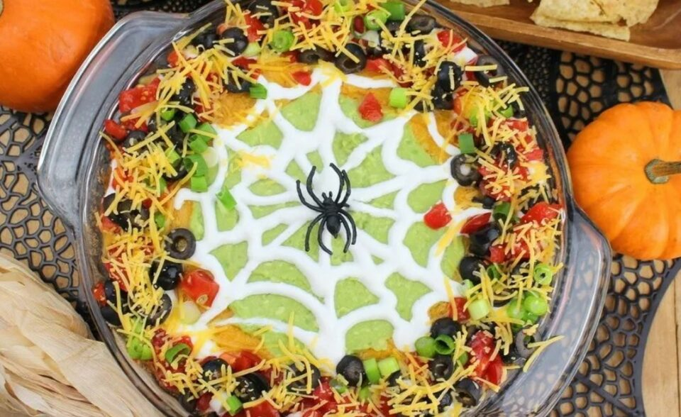

Add a touch of spookiness to your [Halloween appetizer](https://avada.io/loveable/blog/halloween-party-appetizers/) table with Spider Web Dip. Start by preparing a creamy spinach and artichoke dip or any dip of your choice. Spread the dip in a circular shape on a platter to resemble a spider web. To create the spider web pattern, use black food coloring or black bean paste and pipe it onto the dip in a spiral shape. Then, use a toothpick or a skewer to drag lines from the center to the outer edges, creating a web-like design. Serve the Spider Web Dip with tortilla chips or breadsticks for dipping. The combination of the delicious dip and the visually striking spider web design is sure to impress your guests and set the spooky mood for your Halloween gathering.

Check out the recipe at [landolakes](https://www.landolakes.com/recipe/19970/spider-web-dip/)

### **4\. Monster Popcorn**

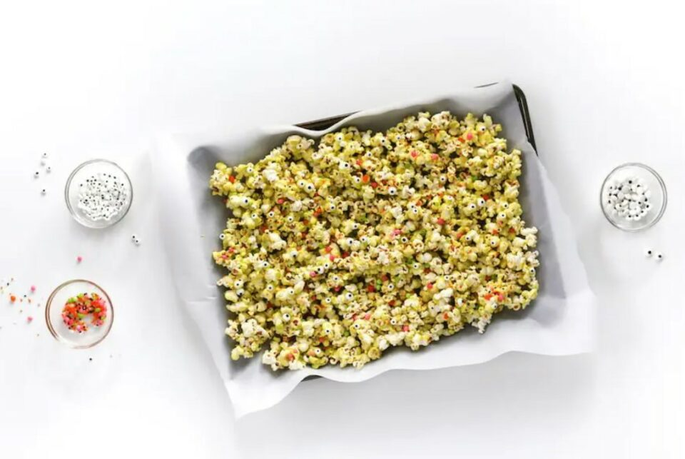

Add a pop of color and crunch to your Halloween snacks with Monster Popcorn. Start by popping a batch of popcorn using your preferred method. Melt white chocolate in a microwave-safe bowl and add the food coloring of your choice to create vibrant, monstrous hues. Drizzle the colored chocolate over the popcorn and toss it until evenly coated. To make it even more fun, add candy eyes or gummy worms to the mix. Spread the Monster Popcorn on a baking sheet to let the chocolate set before serving. This colorful and crunchy snack will not only satisfy your guests’ taste buds but also add a festive touch to your Halloween celebration.

Check out the recipe at [saltycanary](https://www.saltycanary.com/halloween-monster-popcorn/)

### **5\. Witch Finger Cookies**

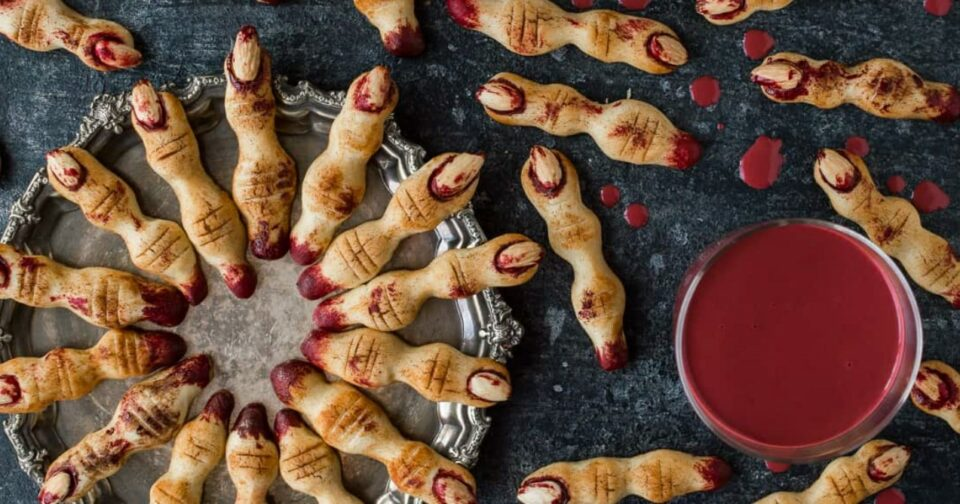

Create a spine-chilling treat with Witch Finger Cookies. Begin by preparing sugar cookie dough according to your favorite recipe or by using store-bought dough. Shape the dough into finger-like shapes, tapering one end to resemble the tip of a finger. Use a knife or the back of a spoon to create knuckle lines on each finger. For a realistic touch, press an almond slice at one end to resemble a fingernail. Bake the cookies until they turn a golden brown color. Once they’ve cooled, use red food coloring or strawberry jam to create a bloody effect on the end where the almond slice is placed. The result is a creepy and delicious treat that will have your guests reaching for more if they dare!

Check out the recipe at [texanerin](https://www.texanerin.com/whole-wheat-witch-fingers/)

### **6\. Graveyard Pudding Cups**

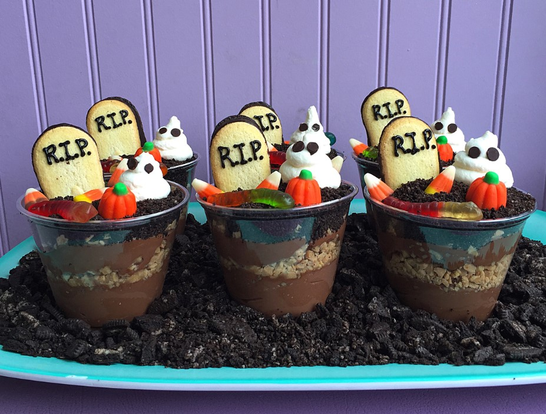

Transport your guests to a spooky graveyard with Graveyard Pudding Cups. Start by layering chocolate pudding and crushed chocolate cookies in clear cups to create a dirt-like base. Next, insert a tombstone-shaped cookie into each cup, positioning it in the middle of the pudding. You can make tombstone cookies by cutting rectangular shapes from sugar cookie dough and using black icing or food coloring to write RIP or other spooky messages on them. For an added touch, decorate the cups with gummy worms or candy bones sticking out of the “dirt.” These individual desserts not only look hauntingly beautiful but also offer a delightful combination of creamy pudding and crunchy cookie layers.

Check out the recipe at [mynameissnickerdoodle](https://www.mynameissnickerdoodle.com/graveyard-pudding-cookie-cups/)

### **7\. Bloody Shirley Temples**

Quench your guests’ thirst with a creepy yet refreshing beverage – Bloody Shirley Temples. Start by preparing the classic Shirley Temple drink by combining lemon-lime soda and a splash of grenadine syrup for the “blood” effect. The grenadine syrup sinks to the bottom of the glass, creating a blood-like appearance. Garnish each drink with a cherry, and for an extra spooky touch, use red food coloring or edible red gel to create blood splatters on the glass. Serve these chilling beverages in blood-spattered glasses, and watch your guests sip their way into the Halloween spirit.

Check out the recipe at [momsdinner](https://momsdinner.net/bloody-shirley-temples/)

### **8\. Spooky Green Eyeball Soup**

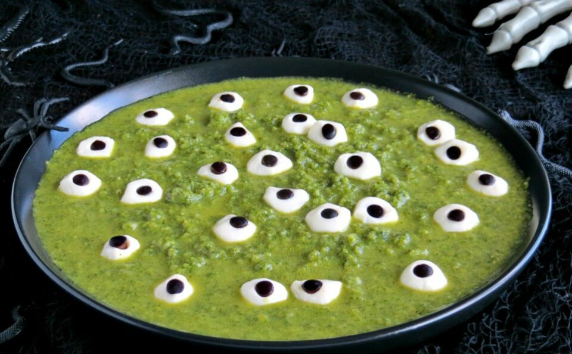

Get into the Halloween spirit with Spooky Green Eyeball Soup. This vibrant and flavorful soup features a smooth and creamy base made from green vegetables. To add a spooky touch, garnish with mozzarella balls or olives to resemble eyeballs floating in the soup. This eerie and delicious soup will be a hit at your [Halloween-themed party](https://avada.io/loveable/blog/halloween-party-games-adults/).

Check out the recipe at [annmariejohn](https://www.annmariejohn.com/spooky-green-eyeball-soup)

### **9\. Slow-Cooked Corn Chowder**

Warm up your guests with Slow-Cooked Corn Chowder. This comforting soup is packed with the flavors of sweet corn, potatoes, and bacon. Slow-cooked to perfection, it’s a hearty and satisfying dish that will please both kids and adults at your Halloween gathering.

Check out the recipe at [southernliving](https://www.southernliving.com/recipes/slow-cooker-corn-chowder-recipe)

### **10\. Chipotle Chicken Soup with Cornmeal Dumplings**

Spice up your Halloween party with Chipotle Chicken Soup with Cornmeal Dumplings. This smoky and flavorful soup features tender chicken, vegetables, and a kick of chipotle heat. The cornmeal dumplings add a delightful texture to the soup. Serve this zesty and comforting soup for a memorable Halloween meal.

Check out the recipe at [tasteofhome](https://www.tasteofhome.com/recipes/chipotle-chicken-soup-with-cornmeal-dumplings/)

### **11\. Tomato Soup with Cheesy Ghost Croutons**

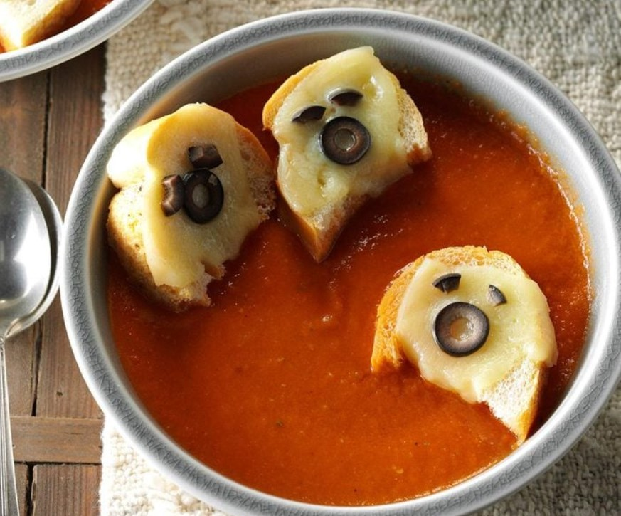

Add a touch of whimsy to a classic soup with Tomato Soup with Cheesy Ghost Croutons. Prepare a velvety tomato soup and serve it with ghost-shaped croutons made from melted cheese. These cute and cheesy croutons will bring a playful and spooky element to your [Halloween dinner](https://avada.io/loveable/blog/halloween-dinner-ideas/) table.

Check out the recipe at [tasteofhome](https://www.tasteofhome.com/recipes/tomato-soup-with-cheesy-ghost-croutons/)

### **12\. Bloody Mary Soup**

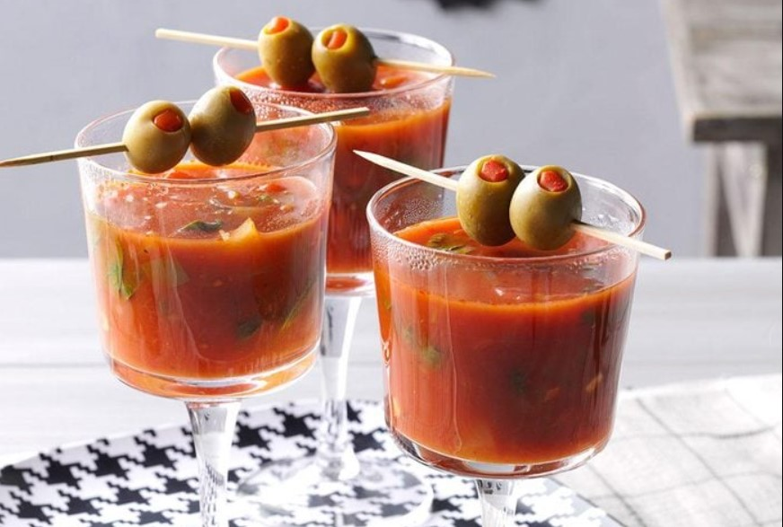

Put a twist on a classic cocktail with Bloody Mary Soup. This unique and flavorful soup combines the savory flavors of a Bloody Mary cocktail, including tomato juice, Worcestershire sauce, and hot sauce. Serve it chilled or slightly warmed, and garnish with celery or pickled vegetables for a tangy and refreshing Halloween appetizer.

Check out the recipe at [tasteofhome](https://www.tasteofhome.com/recipes/bloody-mary-soup/)

### **13\. Easy Butternut Squash Soup**

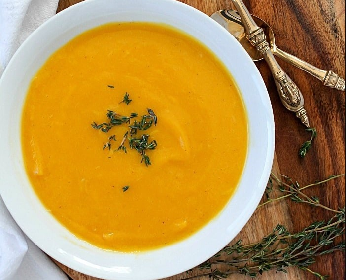

Enjoy the flavors of fall with Easy Butternut Squash Soup. This creamy and velvety soup is made with roasted butternut squash, aromatic spices, and a touch of sweetness. It’s a simple yet elegant dish that will warm both hearts and bellies at your Halloween gathering.

Check out the recipe at [yummyhealthyeasy](https://www.yummyhealthyeasy.com/easy-butternut-squash-soup/)

### **14\. Beer-Cheese Velvet Soup**

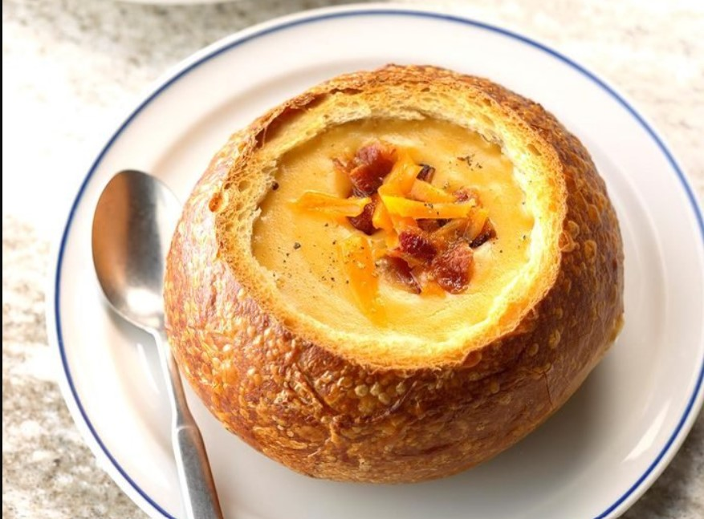

Indulge in a rich and decadent soup with Beer-Cheese Velvet Soup. This comforting soup combines the flavors of beer and cheese to create a luscious and velvety texture. Serve it with crusty bread or pretzels for [Halloween dipping](https://avada.io/loveable/blog/halloween-dip-recipes/). This deliciously cheesy soup will be a crowd-pleaser at your Halloween party.

Check out the recipe at [tasteofhome](https://www.tasteofhome.com/recipes/beer-cheese-velvet-soup/)

### **15\. Beefy Minestrone**

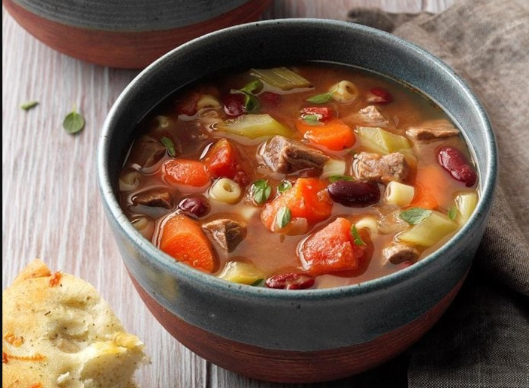

Satisfy your guests with a hearty and flavorful Beefy Minestrone. This robust soup is packed with tender beef, an array of vegetables, and aromatic herbs and spices. It’s a filling and nutritious option that will keep everyone warm and satisfied during your Halloween celebration.

Check out the recipe at [tasteofhome](https://www.tasteofhome.com/recipes/beefy-minestrone/)

### **16\. Chicken & Vegetable Wild Rice Soup**

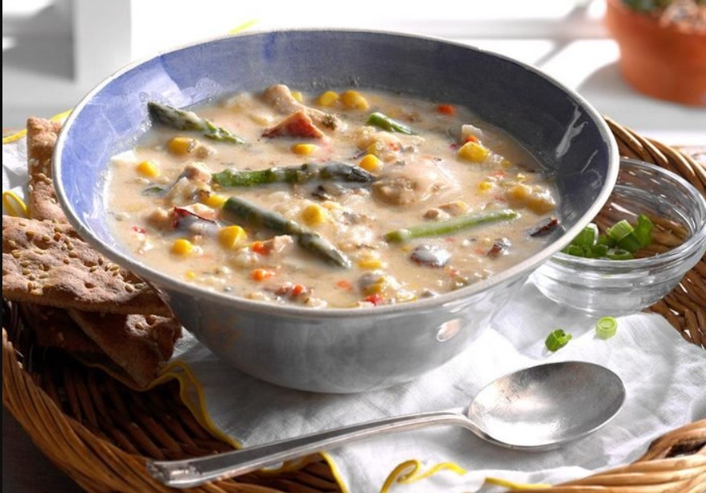

Warm up with a comforting bowl of Chicken & Vegetable Wild Rice Soup. This wholesome soup features tender chicken, hearty vegetables, and nutty wild rice. The combination of flavors creates a delicious and nutritious soup that will be a hit among your Halloween party attendees.

Check out the recipe at [tasteofhome](https://www.tasteofhome.com/recipes/chicken-vegetable-wild-rice-soup/)

### **17\. Pumpkin-Coconut Soup**

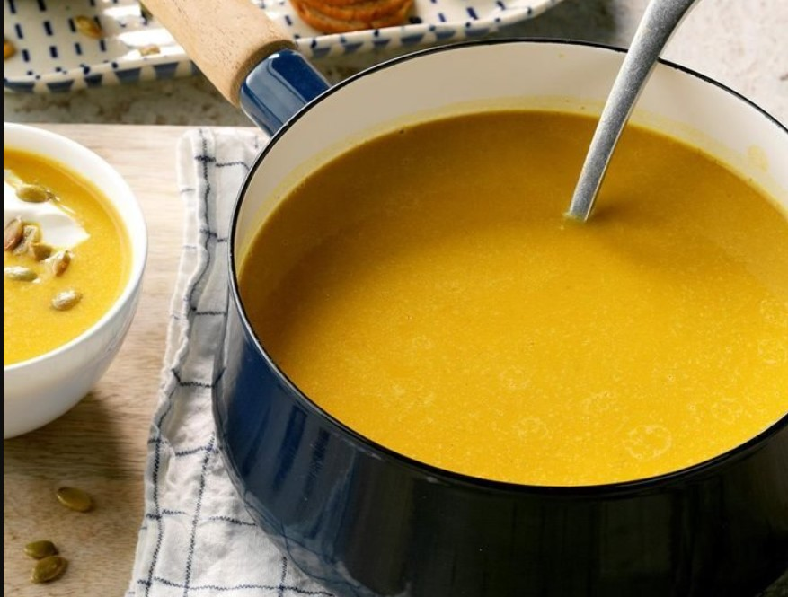

Embrace the flavors of the season with Pumpkin-Coconut Soup. This creamy and aromatic soup combines the natural sweetness of pumpkin with the rich and tropical taste of coconut. The result is a velvety and comforting soup that embodies the essence of autumn. Serve this delightful soup for a Halloween meal that will warm both hearts and taste buds.

Check out the recipe at [tasteofhome](https://www.tasteofhome.com/recipes/pumpkin-coconut-soup/)

## **Special Halloween-themed cake ideas**

These special Halloween-themed cake ideas offer a range of creative and delicious treats to enhance your Halloween celebration. Whether you’re hosting a party or simply looking for fun treats to enjoy, these recipes will bring a spooky and festive flair to your festivities. From spooky cupcakes and monstrous wraps to ghostly cheesecakes and candy-coated apples, there’s something for everyone to enjoy. So get ready to indulge in these delightfully creepy and tasty creations that will leave a lasting impression on your guests.

### **1\. Spider Cupcakes**

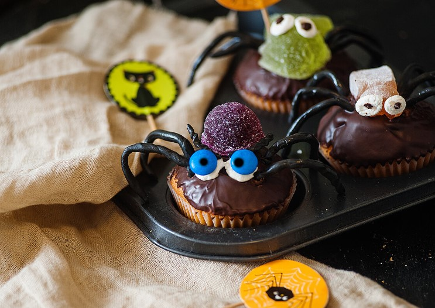

These Spider Cupcakes are a spooky twist on a classic treat. Top moist and fluffy cupcakes with chocolate frosting and create spider legs using black licorice or black icing. Add candy eyes for an extra creepy touch. These delicious and frightful treats will be a hit at your Halloween party.

Check out the recipe at [allrecipes](https://www.allrecipes.com/recipe/22684/spider-cupcakes/)

### **2\. Monster Wraps**

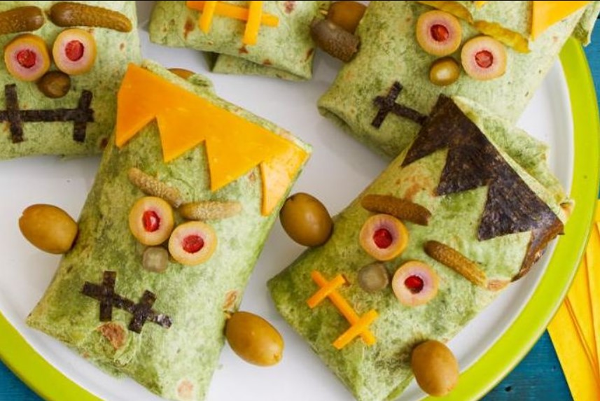

Make your wraps monstrous with this Halloween-themed recipe. Fill tortilla wraps with your choice of fillings, such as deli meats, cheese, and vegetables. Then, use black olives or sliced peppers to create scary monster faces on the outside. These Monster Wraps are both tasty and entertaining.

Check out the recipe at [womansday](https://www.womansday.com/food-recipes/a33564111/monster-wraps-recipe/)

### **3\. Halloween Cheese Balls**

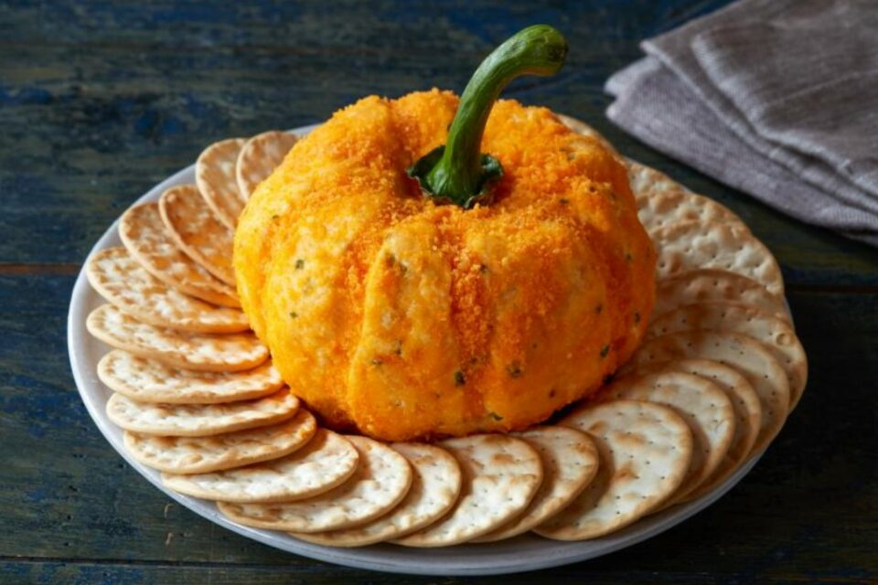

Serve up some ghoulishly delightful snacks with Halloween Cheese Balls. Combine cream cheese, shredded cheese, and seasonings to form a mixture. Shape the mixture into balls and roll them in crushed black tortilla chips or black sesame seeds for a spooky appearance. Serve with crackers or vegetable sticks for a cheesy treat.

Check out the recipe at [foodnetwork](https://www.foodnetwork.com/recipes/pumpkin-cheese-ball-recipe-2108927)

### **4\. Pumpkin Burger**

Get into the Halloween spirit with a Pumpkin Burger. Carve jack-o’-lantern faces into mini pumpkins, roast them, and use them as buns for your burgers. Fill the pumpkin buns with juicy beef patties, cheese, and your favorite toppings. These festive and flavorful burgers will add a touch of Halloween to your meal.

Check out the recipe at [tasteofhome](https://www.tasteofhome.com/recipes/pumpkin-burgers/)

### **5\. Marshmallow Heads**

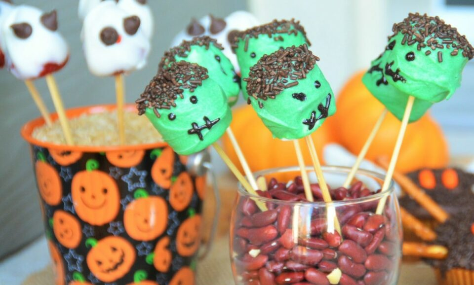

Create a sweet and spooky treat with Marshmallow Heads. Skewer large marshmallows onto wooden sticks and use black icing to draw eerie faces. Dip the marshmallows in melted chocolate or caramel and let them cool. These ghostly delights are a simple and tasty addition to any Halloween celebration.

Check out the recipe at [womansday](https://www.womansday.com/food-recipes/food-drinks/recipes/a11873/marshmallow-heads-recipe-123439/)

### **6\. Black Chocolate Witch Cake**

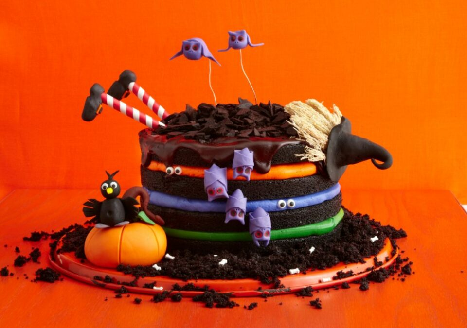

Indulge in a bewitching dessert with the Black Chocolate Witch Cake. Bake a rich and decadent chocolate cake and cover it in black icing. Decorate the cake with witch-themed edible decorations, such as fondant witches’ hats and broomsticks. This wickedly delicious cake will be the centerpiece of your Halloween party.

Check out the recipe at [womansday](https://www.womansday.com/food-recipes/food-drinks/recipes/a51843/black-chocolate-cake/)

### **7\. Pumpkin Cheesecake Ghosts**

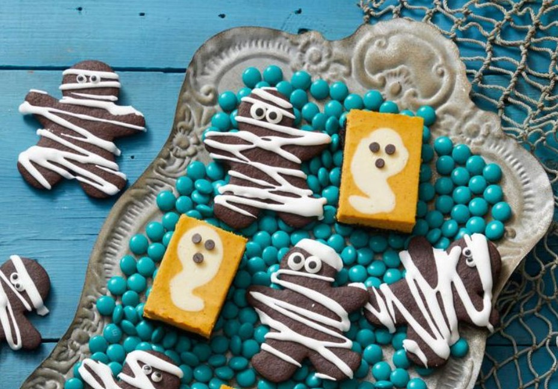

Delight your guests with adorable and delicious Pumpkin Cheesecake Ghosts. Prepare a creamy pumpkin cheesecake mixture and pipe it into ghost shapes using a pastry bag. Use mini chocolate chips or black icing to create ghostly eyes and mouths. These mini cheesecakes are spooktacular scrumptious.

Check out the recipe at [womansday](https://www.womansday.com/food-recipes/a33562053/pumpkin-cheesecake-ghosts-recipe/)

### **8\. Candy Apples with Gummy Worms**

Take the classic candy apple to the next level with Candy Apples with Gummy Worms. Dip apples into a sticky caramel or candy coating, then roll them in crushed cookies or sprinkles. Insert gummy worms into the top of each apple for a creepy and delectable treat.

Check out the recipe at [womansday](https://www.womansday.com/food-recipes/food-drinks/a28858378/candy-apples-with-gummy-worms-recipe/)

### **9\. Black Cat, Bat, Spider, and Mice Doughnuts**

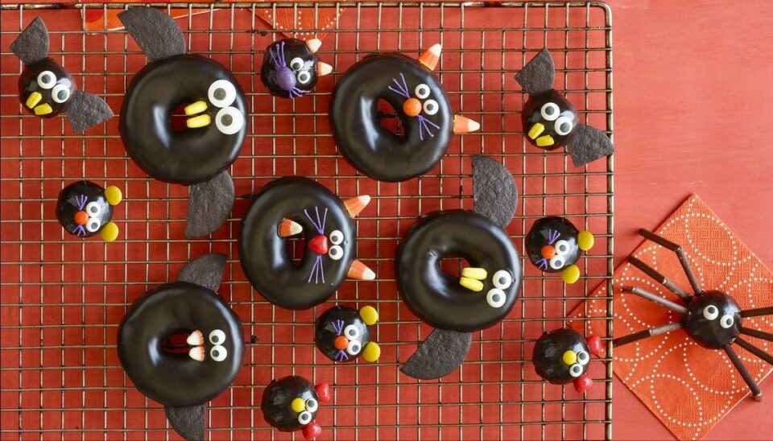

Add a touch of whimsy to your Halloween breakfast or dessert table with Black Cat, Bat, Spider, and Mice Doughnuts. Decorate chocolate or glazed doughnuts with edible decorations shaped like black cats, bats, spiders, or mice. These delightful treats are sure to bring smiles and satisfy sweet cravings.

Check out the recipe at [womansday](https://www.womansday.com/food-recipes/food-drinks/a23460042/black-cat-bat-spider-and-mice-doughnuts-recipe/)

### **10\. Coffin Cake**

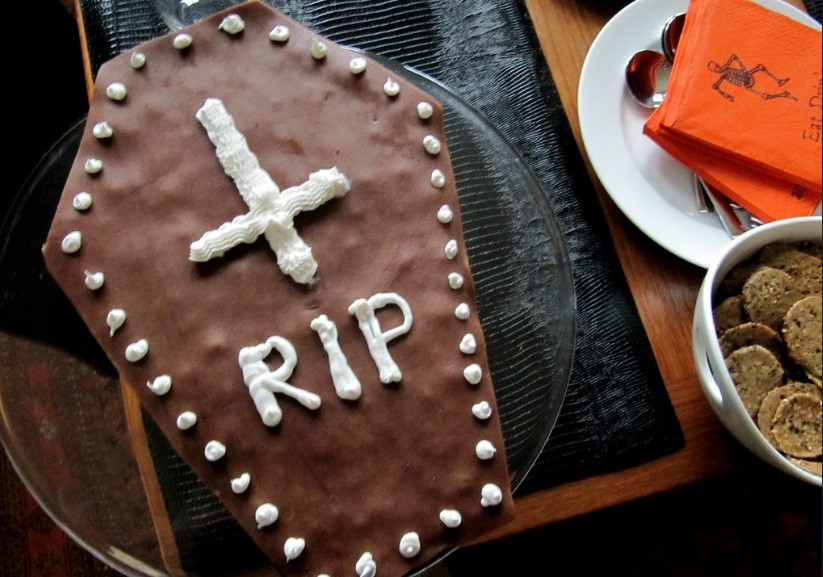

Unleash your creativity with a Coffin Cake. Bake a rectangular cake and carve it into the shape of a coffin. Decorate the cake with black icing to create a spooky coffin design. Add fondants or edible decorations, such as tombstones or skeletons, for an extra eerie touch. This coffin-shaped cake will be a hauntingly delicious centerpiece.

Check out the recipe at [womansday](https://www.womansday.com/food-recipes/food-drinks/recipes/a11307/coffin-cake-recipe-122711/)

### **11\. Pumpkin Chocolate Chip Cake**

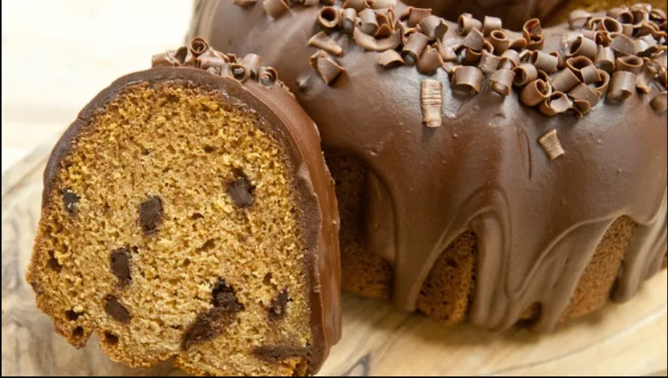

Indulge in the flavors of fall with a Pumpkin Chocolate Chip Cake. Combine pumpkin puree, warm spices, and chocolate chips into a moist and flavorful cake batter. Bake until golden and fragrant. Serve slices of this pumpkin-infused delight at your Halloween gathering.

Check out the recipe at [averiecooks](https://www.averiecooks.com/pumpkin-chocolate-chip-cake/)

### **12\. Graveyard Cookie Jar**

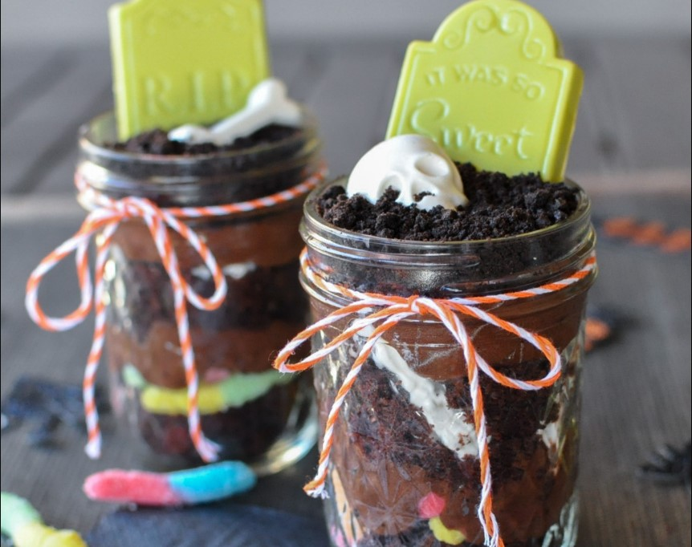

Create a spooky yet sweet treat with a Graveyard Cookie Jar. Layer chocolate sandwich cookies, chocolate pudding, and crushed chocolate cookies in a clear jar to resemble layers of dirt and graves. Add gummy worms or candy bones as tombstone decorations. This graveyard-inspired dessert is both visually appealing and delicious.

Check out the recipe at [awesomewithsprinkles](http://www.awesomewithsprinkles.com/ghostly-graveyard-pudding-dirt-cups-mason-jar/)

### **13\. Banana Mummy Pups**

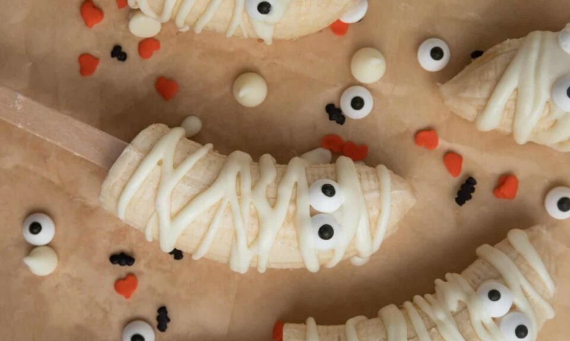

Make snack time adorable and fun with Banana Mummy Pups. Peel bananas and wrap them in strips of white fondant or white icing to create mummy-like appearances. Use chocolate chips or edible googly eyes for eyes. These cute and healthy treats are perfect for little ones and adults alike.

Check out the recipe at [lemonsandzest](https://lemonsandzest.com/halloween-banana-mummy-pops/)

### **14\. Candy Cobwebs**

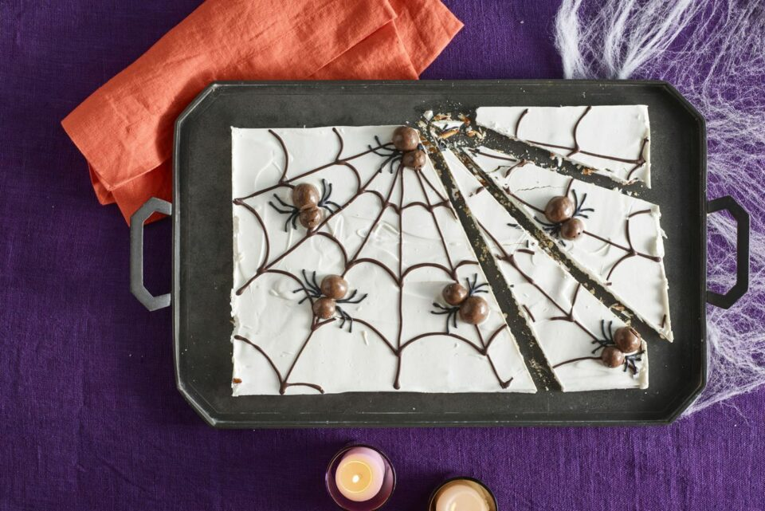

Create a spooky and sweet decoration with Candy Cobwebs. Melt white chocolate and pipe it onto parchment paper in a spiderweb design. Let it cool and harden. Once set, carefully peel off the parchment paper and place the candy cobwebs on cakes, cupcakes, or as standalone decorations. These edible cobwebs will add a creepy touch to your Halloween treats.

Check out the recipe at [womansday](https://www.womansday.com/food-recipes/food-drinks/recipes/a60166/candy-cobwebs-recipe/)

### **15\. Frankenstein and His Bride Cupcakes**

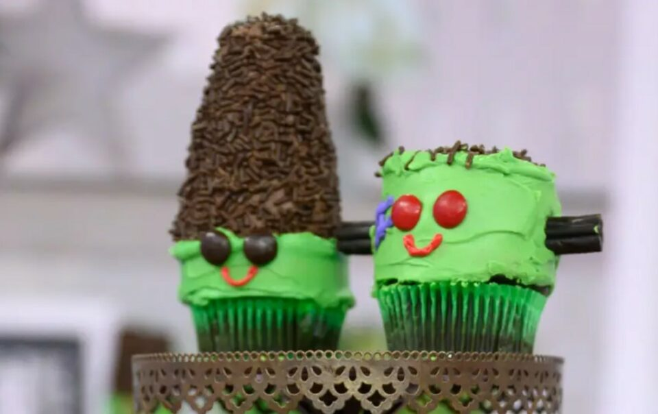

Bring the iconic monsters to life with Frankenstein and His Bride Cupcakes. Bake chocolate cupcakes, frost them with green icing, and use black icing to create Frankenstein’s hair, eyes, and mouth. For his bride, use white icing, black icing, and red edible decorations to create a spookily romantic look. These cupcakes will be the talk of the town.

Check out the recipe at [womansday](https://www.womansday.com/food-recipes/food-drinks/a23570068/frankenstein-and-his-bride-cupcakes-recipe/)

### **16\. Candy-Covered Apples**

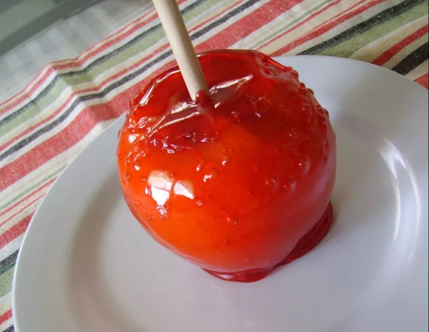

Add a colorful and festive touch to traditional candy apples with Candy-Covered Apples. Dip apples into melted chocolate or caramel, then roll them in crushed candies, sprinkles, or chopped nuts. Let them cool and harden before serving. These vibrant and crunchy treats are sure to be a hit at any Halloween gathering.

Check out the recipe at [allrecipes](https://www.allrecipes.com/recipe/21134/candied-apples-ii/)

### **17\. Halloween Cat Cake**

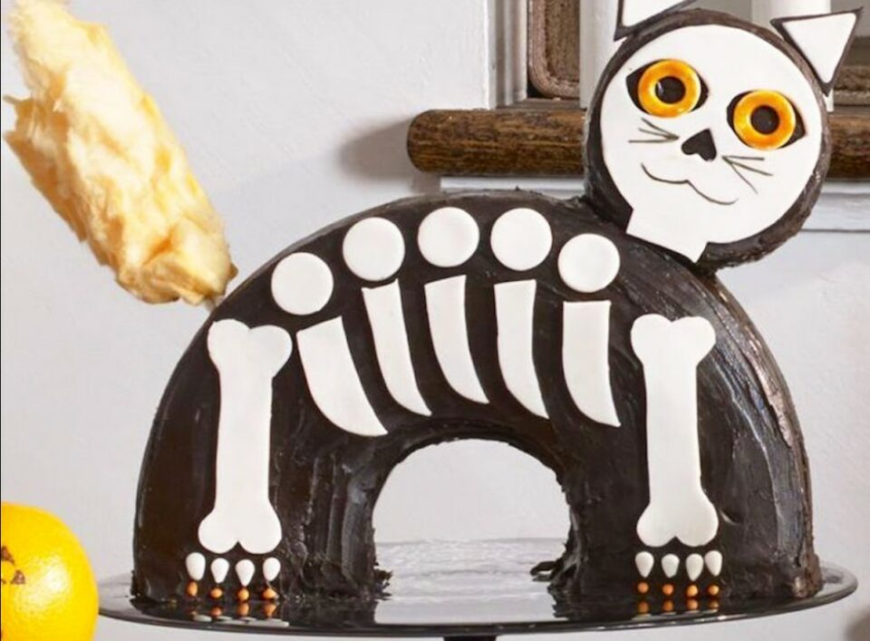

Celebrate Halloween with a cute and charming Halloween Cat Cake. Bake a round cake, frost it with black icing, and use colored fondant to create cat ears, eyes, and whiskers. Pipe on additional details using colored icing or melted chocolate. This cake will bring a touch of whimsy to your Halloween celebration.

Check out the recipe at [womansday](https://www.womansday.com/food-recipes/food-drinks/a23460699/halloween-cat-cake-recipe/)

### **18\. Chocolate Apple Cat Faces**

Combine the flavors of chocolate and apple with Chocolate Apple Cat Faces. Dip apples into melted chocolate, leaving a portion exposed for the cat’s face. Use colored icing or melted chocolate to create cat ears, eyes, and whiskers. These delightful treats are perfect for kids and adults who love a combination of fruity and chocolate flavors.

Check out the recipe at [hungryhappenings](https://hungryhappenings.com/chocolate-caramel-apple-cats-for-any/)

### **19\. Decorated Cookies**

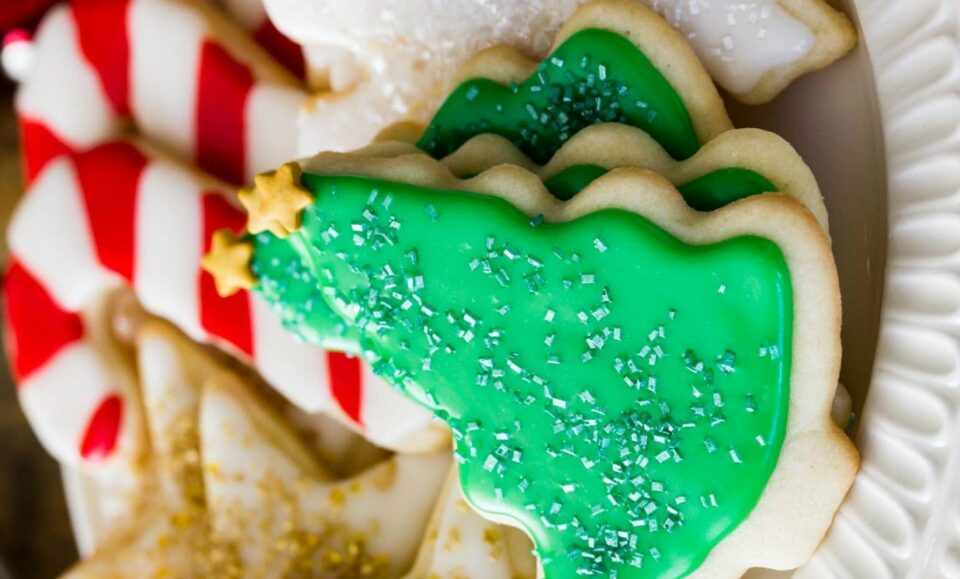

Let your creativity shine with Decorated Cookies. Bake a batch of sugar cookies and decorate them with Halloween-themed designs using colored icing, edible decorations, or sprinkles. Create shapes like ghosts, pumpkins, bats, or witches’ hats. These personalized treats are a fun activity and a delicious addition to your Halloween festivities.

Check out the recipe at [sugarspunrun](https://sugarspunrun.com/easy-sugar-cookie-recipe/)

### **20\. Ghost Cupcakes**

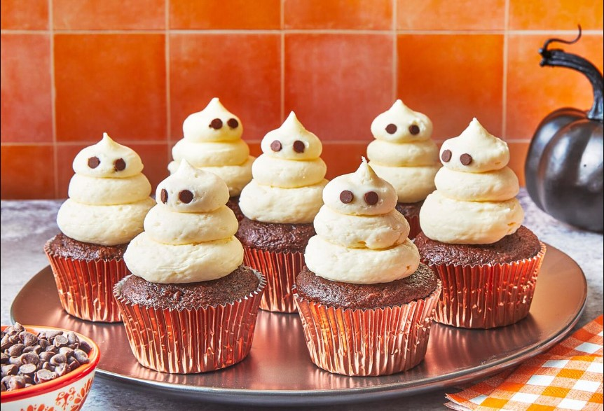

Whip up some ghostly treats with Ghost Cupcakes. Bake vanilla cupcakes, frost them with white icing, and use black icing or edible googly eyes to create adorable ghost faces. These cute and delicious cupcakes are perfect for any Halloween party or spooky celebration.

Check out the recipe at [thepioneerwoman](https://www.thepioneerwoman.com/food-cooking/recipes/a40641159/ghost-cupcakes-recipe/)

### **21\. Mini Cauldrons**

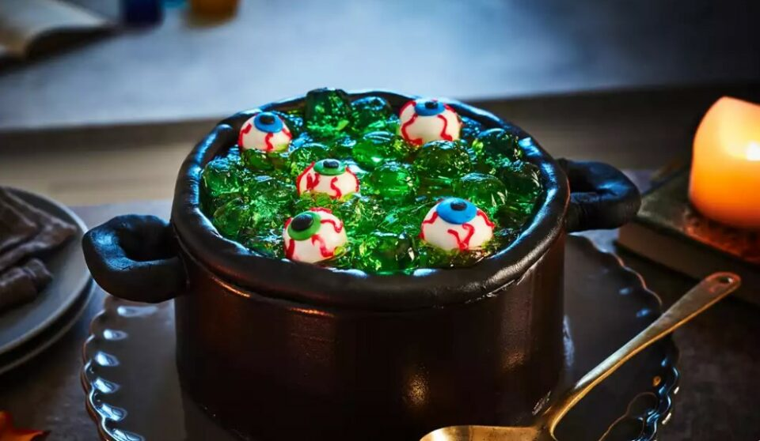

Serve up a magical treat with Mini Cauldrons. Fill small black cauldron-shaped cups or containers with layers of chocolate mousse, crushed chocolate cookies, and gummy worms. Top with green-colored whipped cream or icing for a witchy touch. These mini desserts will cast a spell on your taste buds.

Check out the recipe at [oetker](https://www.oetker.ie/recipes/r/cauldron-cake)

### **22\. Halloween Graveyard Pudding Cups**

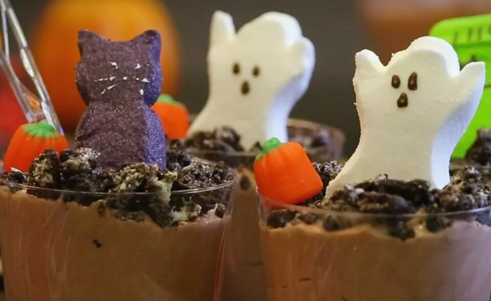

Create a hauntingly delicious dessert with Halloween Graveyard Pudding Cups. Layer chocolate pudding, crushed chocolate cookies, and edible tombstone decorations in clear cups or jars to resemble a graveyard scene. Add candy bones or gummy worms for an eerie touch. These individual pudding cups are both visually appealing and delectable, making them a perfect addition to your Halloween spread.

Check out the recipe at [mychinet](https://www.mychinet.com/ideas/recipes/graveyard-pudding-cups/)

## **Ghoulish Halloween-themed snack ideas**

These ghoulish Halloween-themed snack ideas will bring a fun and spooky vibe to your themed party. From tombstone biscuits and brain cupcakes to mallow-een skull pops and stuffed mummy peppers, these snacks offer a range of flavors and visual appeal. They are perfect for impressing your guests and creating a memorable Halloween celebration.

### **1\. Tombstone Biscuits**

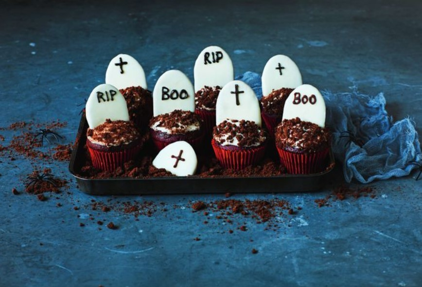

Create a spooky delight with Tombstone Biscuits. These themed biscuits are perfect for a Halloween party. Decorate rectangular-shaped biscuits with black icing to resemble tombstones. These eerie treats will add a fun and chilling touch to your Halloween spread.

Check out the recipe at [taste](https://www.taste.com.au/recipes/tombstone-red-velvet-cupcakes-recipe/vqh1cpfu)

### **2\. Day of The Dead Biscuits**

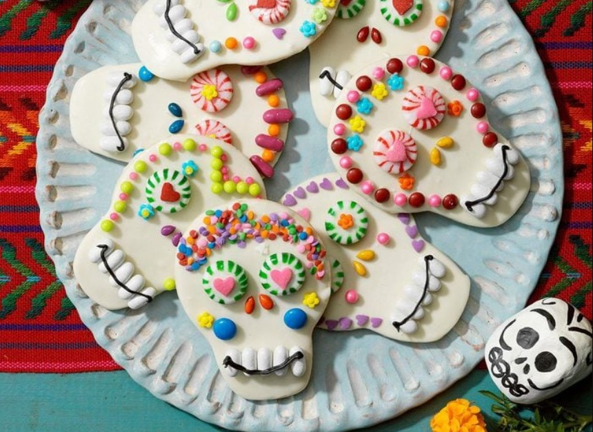

Celebrate the vibrant Mexican festival with Day of The Dead Biscuits. These intricately decorated biscuits are inspired by colorful sugar skulls. Decorate round biscuits with colorful icing and create festive designs. These biscuits are not only visually stunning but also delicious, making them a perfect addition to your Halloween party.

Check out the recipe at [tasteofhome](https://www.tasteofhome.com/recipes/day-of-the-dead-cookies/)

### **3\. Gingerbread men**

Give a gruesome twist to traditional gingerbread men with Gingerbread men. Decorate gingerbread men with red icing to create wounds and scars, giving them a ghoulish appearance. These tasty treats will be a hit at your themed Halloween party, adding a touch of creepy fun.

Check out the recipe at [onceuponachef](https://www.onceuponachef.com/recipes/gingerbread-cookies.html)

### **4\. Blood and Bone Meringues**

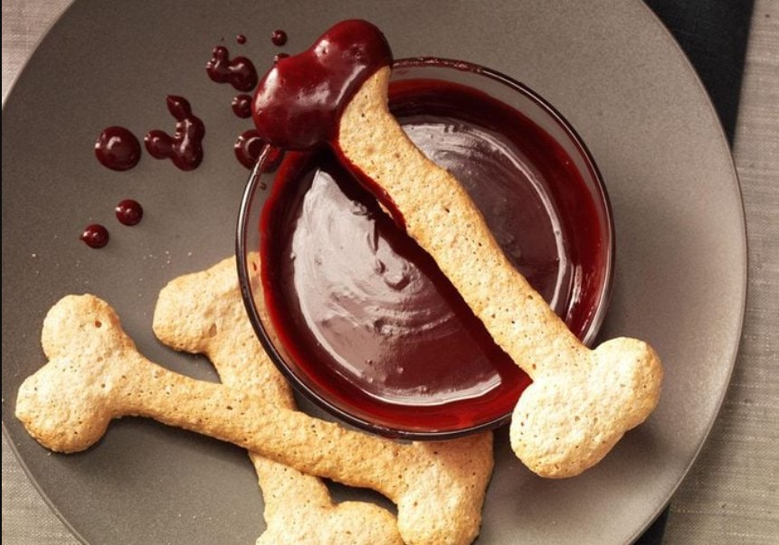

Serve up a spooky and sweet treat with Blood and Bone Meringues. Shape meringue mixture into bone-like shapes and bake until crisp. Drizzle with red-colored syrup or icing to resemble blood splatters. These meringues are both delicious and visually striking, perfect for a Halloween-themed party.

Check out the recipe at [tasteofhome](https://www.tasteofhome.com/recipes/bones-blood/)

### **5\. Brain Cupcakes**

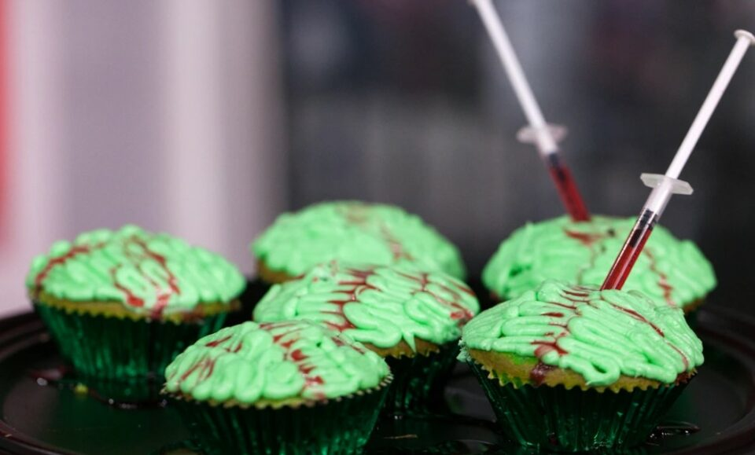

Unleash your creativity with Brain Cupcakes. Bake cupcakes, swirl pink frosting on top, and use red gel icing to create brain-like patterns. These gory yet delicious cupcakes will be a spooky addition to your Halloween dessert table.

Check out the recipe at [today](https://www.today.com/recipes/zombie-brain-cupcakes-halloween-t104388)

### **6\. Mallow-een Skull Pops**

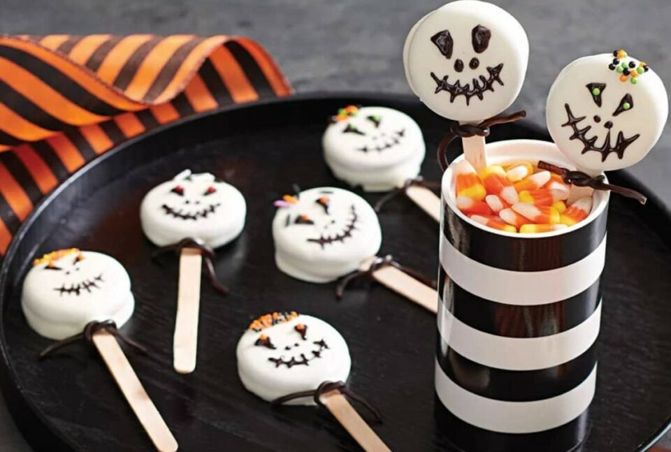

Indulge in some Mallow-een Skull Pops for a delightful and spooky treat. Dip marshmallows into white chocolate or candy melts and decorate them to resemble skulls using black icing. These skull pops are a fun and easy Halloween snack that will satisfy both kids and adults.

Check out the recipe at [dessertscorner](https://www.dessertscorner.com/recipe/oreo-halloween-skull-pops.html)

### **7\. Slithering Snake and Extra Pear-estrials**

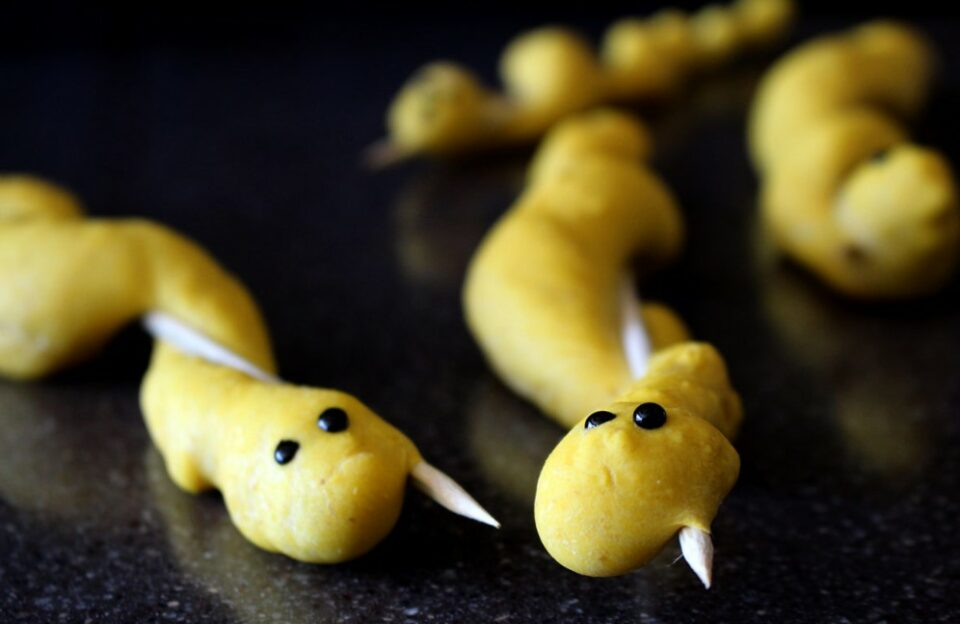

Add some creepy-crawly fun with Slithering Snake and Extra Pear-estrials. Create snake-shaped breadsticks or twists by shaping bread dough and adding sesame seeds for the eyes. For the Pear-estrials, shape pears into alien-like figures and use edible decorations for eyes and mouths. These playful snacks will add a touch of whimsy to your Halloween party.

Check out the recipe at [eatwheat](https://eatwheat.org/inspiration/slithery-snakes/)

### **8\. Rogspawn Crush**

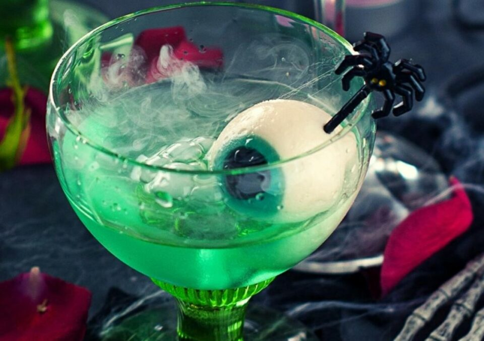

Satisfy your cravings with a Rogspawn Crush. Prepare a delicious fruit punch and add gummy worms or insects for a creepy touch. This refreshing and spooky drink will be a hit among your guests, especially during a Halloween-themed party.

Check out the recipe at [themixer](https://www.themixer.com/en-us/recipes/green-monster-cocktail/#ingredients)

### **9\. Stuffed Mummy Pepper**s

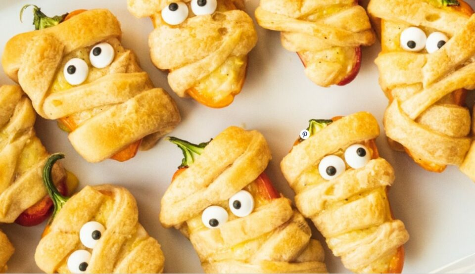

Get creative with Stuffed Mummy Peppers. Fill hollowed-out bell peppers with a savory filling of your choice, such as rice or cheese. Wrap strips of puff pastry or dough around the peppers to resemble mummy bandages. Bake until golden and serve these adorable and tasty mummy-themed snacks at your Halloween gathering.

Check out the recipe at [Nelliesfreerange](https://www.nelliesfreerange.com/egg-recipes/mini-stuffed-pepper-mummies)

### **10\. Mozzarella and Olive Eyeballs**

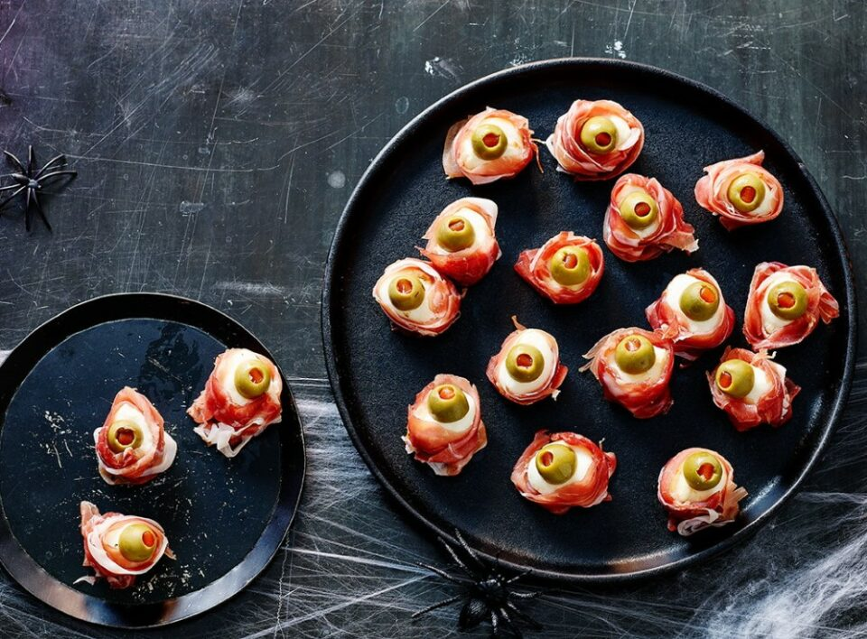

Create eerie yet tasty Mozzarella and Olive Eyeballs. Skewer mozzarella balls with pitted black olives to resemble eyeballs. These creepy yet delicious treats are quick and easy to make and will add a spooky element to your Halloween party spread.

Check out the recipe at [realfood](https://realfood.tesco.com/recipes/platter-of-eyeballs.html)

**SEE MORE:**

- Creepy and Cute [Halloween Cookie Ideas](https://avada.io/loveable/halloween-cookie-ideas/)

- How to Make [Halloween Popcorn Balls](https://avada.io/loveable/halloween-popcorn-balls/)

## **Bottom line**

Hosting a costume party for Halloween becomes even more exciting and memorable when you serve fun and spooky-themed food. The wide range of **creative Halloween food ideas** allows you to bring a playful and eerie touch to your party menu. From spider cupcakes and mummy hot dogs to pumpkin burgers and marshmallow heads, these delightful treats are sure to impress your guests and add an extra element of fun to your Halloween celebration.

By incorporating Halloween-themed food, you create an immersive experience for your guests, transporting them into a world of ghouls, ghosts, and deliciously eerie delights. The variety of savory and sweet options cater to different tastes and preferences, ensuring that everyone can indulge in the Halloween spirit. From simple recipes that require minimal effort to more elaborate creations, there are Halloween food ideas for every skill level and time constraint.

- [Easy Halloween Food Recipe](https://avada.io/loveable/blog/halloween-food-ideas/#wp-block-heading-2-4)
    - [1\. Ghostly Pizza](https://avada.io/loveable/blog/halloween-food-ideas/#wp-block-heading-3-6)
    - [2\. Mummy Hot Dogs](https://avada.io/loveable/blog/halloween-food-ideas/#wp-block-heading-3-10)
    - [3\. Spider Web Dip](https://avada.io/loveable/blog/halloween-food-ideas/#wp-block-heading-3-14)
    - [4\. Monster Popcorn](https://avada.io/loveable/blog/halloween-food-ideas/#wp-block-heading-3-18)
    - [5\. Witch Finger Cookies](https://avada.io/loveable/blog/halloween-food-ideas/#wp-block-heading-3-22)
    - [6\. Graveyard Pudding Cups](https://avada.io/loveable/blog/halloween-food-ideas/#wp-block-heading-3-26)
    - [7\. Bloody Shirley Temples](https://avada.io/loveable/blog/halloween-food-ideas/#wp-block-heading-3-30)
    - [8\. Spooky Green Eyeball Soup](https://avada.io/loveable/blog/halloween-food-ideas/#wp-block-heading-3-34)
    - [9\. Slow-Cooked Corn Chowder](https://avada.io/loveable/blog/halloween-food-ideas/#wp-block-heading-3-38)
    - [10\. Chipotle Chicken Soup with Cornmeal Dumplings](https://avada.io/loveable/blog/halloween-food-ideas/#wp-block-heading-3-42)
    - [11\. Tomato Soup with Cheesy Ghost Croutons](https://avada.io/loveable/blog/halloween-food-ideas/#wp-block-heading-3-46)
    - [12\. Bloody Mary Soup](https://avada.io/loveable/blog/halloween-food-ideas/#wp-block-heading-3-50)
    - [13\. Easy Butternut Squash Soup](https://avada.io/loveable/blog/halloween-food-ideas/#wp-block-heading-3-54)
    - [14\. Beer-Cheese Velvet Soup](https://avada.io/loveable/blog/halloween-food-ideas/#wp-block-heading-3-58)
    - [15\. Beefy Minestrone](https://avada.io/loveable/blog/halloween-food-ideas/#wp-block-heading-3-62)
    - [16\. Chicken & Vegetable Wild Rice Soup](https://avada.io/loveable/blog/halloween-food-ideas/#wp-block-heading-3-66)
    - [17\. Pumpkin-Coconut Soup](https://avada.io/loveable/blog/halloween-food-ideas/#wp-block-heading-3-70)
- [Special Halloween-themed cake ideas](https://avada.io/loveable/blog/halloween-food-ideas/#wp-block-heading-2-74)
    - [1\. Spider Cupcakes](https://avada.io/loveable/blog/halloween-food-ideas/#wp-block-heading-3-76)
    - [2\. Monster Wraps](https://avada.io/loveable/blog/halloween-food-ideas/#wp-block-heading-3-80)
    - [3\. Halloween Cheese Balls](https://avada.io/loveable/blog/halloween-food-ideas/#wp-block-heading-3-84)
    - [4\. Pumpkin Burger](https://avada.io/loveable/blog/halloween-food-ideas/#wp-block-heading-3-88)
    - [5\. Marshmallow Heads](https://avada.io/loveable/blog/halloween-food-ideas/#wp-block-heading-3-92)
    - [6\. Black Chocolate Witch Cake](https://avada.io/loveable/blog/halloween-food-ideas/#wp-block-heading-3-96)
    - [7\. Pumpkin Cheesecake Ghosts](https://avada.io/loveable/blog/halloween-food-ideas/#wp-block-heading-3-100)
    - [8\. Candy Apples with Gummy Worms](https://avada.io/loveable/blog/halloween-food-ideas/#wp-block-heading-3-104)
    - [9\. Black Cat, Bat, Spider, and Mice Doughnuts](https://avada.io/loveable/blog/halloween-food-ideas/#wp-block-heading-3-107)
    - [10\. Coffin Cake](https://avada.io/loveable/blog/halloween-food-ideas/#wp-block-heading-3-111)
    - [11\. Pumpkin Chocolate Chip Cake](https://avada.io/loveable/blog/halloween-food-ideas/#wp-block-heading-3-115)
    - [12\. Graveyard Cookie Jar](https://avada.io/loveable/blog/halloween-food-ideas/#wp-block-heading-3-119)
    - [13\. Banana Mummy Pups](https://avada.io/loveable/blog/halloween-food-ideas/#wp-block-heading-3-123)
    - [14\. Candy Cobwebs](https://avada.io/loveable/blog/halloween-food-ideas/#wp-block-heading-3-127)
    - [15\. Frankenstein and His Bride Cupcakes](https://avada.io/loveable/blog/halloween-food-ideas/#wp-block-heading-3-131)
    - [16\. Candy-Covered Apples](https://avada.io/loveable/blog/halloween-food-ideas/#wp-block-heading-3-135)
    - [17\. Halloween Cat Cake](https://avada.io/loveable/blog/halloween-food-ideas/#wp-block-heading-3-139)
    - [18\. Chocolate Apple Cat Faces](https://avada.io/loveable/blog/halloween-food-ideas/#wp-block-heading-3-143)
    - [19\. Decorated Cookies](https://avada.io/loveable/blog/halloween-food-ideas/#wp-block-heading-3-147)
    - [20\. Ghost Cupcakes](https://avada.io/loveable/blog/halloween-food-ideas/#wp-block-heading-3-151)
    - [21\. Mini Cauldrons](https://avada.io/loveable/blog/halloween-food-ideas/#wp-block-heading-3-155)
    - [22\. Halloween Graveyard Pudding Cups](https://avada.io/loveable/blog/halloween-food-ideas/#wp-block-heading-3-159)
- [Ghoulish Halloween-themed snack ideas](https://avada.io/loveable/blog/halloween-food-ideas/#wp-block-heading-2-163)
    - [1\. Tombstone Biscuits](https://avada.io/loveable/blog/halloween-food-ideas/#wp-block-heading-3-165)
    - [2\. Day of The Dead Biscuits](https://avada.io/loveable/blog/halloween-food-ideas/#wp-block-heading-3-169)
    - [3\. Gingerbread men](https://avada.io/loveable/blog/halloween-food-ideas/#wp-block-heading-3-173)
    - [4\. Blood and Bone Meringues](https://avada.io/loveable/blog/halloween-food-ideas/#wp-block-heading-3-177)
    - [5\. Brain Cupcakes](https://avada.io/loveable/blog/halloween-food-ideas/#wp-block-heading-3-181)
    - [6\. Mallow-een Skull Pops](https://avada.io/loveable/blog/halloween-food-ideas/#wp-block-heading-3-185)
    - [7\. Slithering Snake and Extra Pear-estrials](https://avada.io/loveable/blog/halloween-food-ideas/#wp-block-heading-3-189)
    - [8\. Rogspawn Crush](https://avada.io/loveable/blog/halloween-food-ideas/#wp-block-heading-3-193)
    - [9\. Stuffed Mummy Peppers](https://avada.io/loveable/blog/halloween-food-ideas/#wp-block-heading-3-197)
    - [10\. Mozzarella and Olive Eyeballs](https://avada.io/loveable/blog/halloween-food-ideas/#wp-block-heading-3-201)
- [Bottom line](https://avada.io/loveable/blog/halloween-food-ideas/#wp-block-heading-2-208)

### [Blake Simpson](https://avada.io/loveable/author/blake/)

Hi, I'm Blake from Loveable. I help people find perfect gifts for occasions like anniversaries and weddings. I also write a blog about holidays, sharing insights to make them more meaningful. Let's create unforgettable moments together!

- [Twitter](https://twitter.com/intent/tweet)
- [Facebook](https://www.facebook.com/sharer/sharer.php)
- [instagram](https://avada.io/loveable/blog/halloween-food-ideas/)
- [pinterest](https://www.pinterest.com/loveablellc/)

## Related Posts

[### 120+ Christian Birthday Wishes To Spread Your Love](https://avada.io/loveable/blog/christian-birthday-wishes/) 

[

### 35 Best 70th Birthday Ideas To Celebrate The Special Milestone

](https://avada.io/loveable/blog/70th-birthday-ideas/)

[

### 50 Best 30th Birthday Decorations for a Remarkable Birthday Bash

](https://avada.io/loveable/blog/30th-birthday-decorations/)

[

### 40 Delicious Vegan Christmas Desserts to Delight Your Palate

](https://avada.io/loveable/blog/vegan-christmas-desserts/)

[

### 60 Christmas Team Building Activities to Boost Workplace Spirit

](https://avada.io/loveable/blog/christmas-team-building-activities/)
