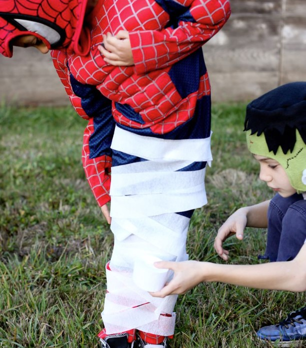

This article has been written and researched by our expert Loveable through a precise methodology. [Learn more about our methodology](https://avada.io/loveable/our-methodological.html)

[Loveable](https://avada.io/loveable/) > [Blog](https://avada.io/loveable/blog/) > [Holiday](https://avada.io/loveable/holiday/)

# 40 Best Halloween Games for All Age In 2023

Written by [Blake Simpson](https://avada.io/loveable/author/blake/) Last Updated on August 24, 2023

- [Funny Halloween Games for Kids](https://avada.io/loveable/blog/halloween-games/#wp-block-heading-2-3) 
    - [Murder Mystery Party Game](https://avada.io/loveable/blog/halloween-games/#wp-block-heading-3-4)
    - [Halloween Family Feud](https://avada.io/loveable/blog/halloween-games/#wp-block-heading-3-7)
    - [Quick Draw!](https://avada.io/loveable/blog/halloween-games/#wp-block-heading-3-10)
    - [Musical Pumpkins](https://avada.io/loveable/blog/halloween-games/#wp-block-heading-3-14)
    - [Apple Bobbing](https://avada.io/loveable/blog/halloween-games/#wp-block-heading-3-18)
    - [Spider Race](https://avada.io/loveable/blog/halloween-games/#wp-block-heading-3-21)
    - [Punch Board Game](https://avada.io/loveable/blog/halloween-games/#wp-block-heading-3-24)
    - [Pumpkin and Witch’s Broom Race](https://avada.io/loveable/blog/halloween-games/#wp-block-heading-3-27)
    - [Skeleton Bone Race](https://avada.io/loveable/blog/halloween-games/#wp-block-heading-3-30)
    - [Pumpkin Catapult](https://avada.io/loveable/blog/halloween-games/#wp-block-heading-3-33)
    - [Newspaper Eating Monster Toss](https://avada.io/loveable/blog/halloween-games/#wp-block-heading-3-36)
    - [Witch Hat Ring Toss](https://avada.io/loveable/blog/halloween-games/#wp-block-heading-3-39)
    - [Pumpkin Putt-Putt](https://avada.io/loveable/blog/halloween-games/#wp-block-heading-3-42)
    - [Spider Web Walking](https://avada.io/loveable/blog/halloween-games/#wp-block-heading-3-45) 
    - [Pumpkin Tic-Tac-Toe](https://avada.io/loveable/blog/halloween-games/#wp-block-heading-3-48)
    - [Halloween Forehead Detective](https://avada.io/loveable/blog/halloween-games/#wp-block-heading-3-51)
    - [‘Shoot the Skeleton’ Game](https://avada.io/loveable/blog/halloween-games/#wp-block-heading-3-54)
    - [Marshmallows on a String](https://avada.io/loveable/blog/halloween-games/#wp-block-heading-3-58)
    - [Death Charades](https://avada.io/loveable/blog/halloween-games/#wp-block-heading-3-61)
    - [Black Light Halloween Candy Game](https://avada.io/loveable/blog/halloween-games/#wp-block-heading-3-65)
    - [Spooky Musical Chairs](https://avada.io/loveable/blog/halloween-games/#wp-block-heading-3-68)
    - [Spooky Bean Bag Toss](https://avada.io/loveable/blog/halloween-games/#wp-block-heading-3-71)
    - [Halloween Trivia](https://avada.io/loveable/blog/halloween-games/#wp-block-heading-3-74)
    - [Pumpkin Sweep](https://avada.io/loveable/blog/halloween-games/#wp-block-heading-3-77)
    - [Mummy Sack Race](https://avada.io/loveable/blog/halloween-games/#wp-block-heading-3-80)
    - [Witch Hat Memory Game](https://avada.io/loveable/blog/halloween-games/#wp-block-heading-3-83)
    - [Pumpkin Twister](https://avada.io/loveable/blog/halloween-games/#wp-block-heading-3-86)
    - [Bean Bag Toss](https://avada.io/loveable/blog/halloween-games/#wp-block-heading-3-89)
    - [Halloween ‘I Spy’ Game](https://avada.io/loveable/blog/halloween-games/#wp-block-heading-3-92)
    - [Printable Halloween Bingo](https://avada.io/loveable/blog/halloween-games/#wp-block-heading-3-94)
- [Halloween Games for Adults](https://avada.io/loveable/blog/halloween-games/#wp-block-heading-2-98) 
    - [Spooky Telephone](https://avada.io/loveable/blog/halloween-games/#wp-block-heading-3-99)
    - [Cookie Decorating](https://avada.io/loveable/blog/halloween-games/#wp-block-heading-3-102)
    - [Ghost Stories](https://avada.io/loveable/blog/halloween-games/#wp-block-heading-3-105)
    - [Halloween Guess Who](https://avada.io/loveable/blog/halloween-games/#wp-block-heading-3-108)
    - [Wreath-Making Party](https://avada.io/loveable/blog/halloween-games/#wp-block-heading-3-111)
    - [Name the Halloween Tune](https://avada.io/loveable/blog/halloween-games/#wp-block-heading-3-114)
    - [Pumpkin Bowling](https://avada.io/loveable/blog/halloween-games/#wp-block-heading-3-117)
    - [Halloween Candy Jenga](https://avada.io/loveable/blog/halloween-games/#wp-block-heading-3-120)
    - [Tarot Card Reading](https://avada.io/loveable/blog/halloween-games/#wp-block-heading-3-122)
    - [Spin the Plastic Pitchfork](https://avada.io/loveable/blog/halloween-games/#wp-block-heading-3-124)
- [Bottom Line](https://avada.io/loveable/blog/halloween-games/#wp-block-heading-2-128) 

Step into a world where ghosts, goblins, and witches come to life through thrilling games that will enchant and entertain both the young and the young at heart. Welcome to our curated collection of the **40+ Best Halloween Games for All Ages** in 2023! Whether you’re hosting a spooktacular party, organizing a family gathering, or simply seeking some eerie amusement, we’ve got you covered. 

From classic favorites with a haunting twist to exciting new ventures that capture the essence of Halloween, these games are sure to [ignite your imagination](https://avada.io/loveable/gifts-for-art-lovers/) and create unforgettable memories. So grab your broomsticks, don your costumes, and get ready for a thrilling journey into the world of Halloween gaming fun!

## **Funny Halloween Games for Kids** 

### **Murder Mystery Party Game**

Enter a world of suspense and intrigue as an eerie display of clocks sets the stage. A shocking crime has occurred among your party guests, and it’s now up to the rest of the crew to unravel the mystery. Get ready for a thrilling challenge as you race against time to uncover the truth and bring justice to this enigmatic scene.

### **Halloween Family Feud**

Give Family Feud a spooky Halloween makeover by challenging two teams to guess ghostly answers before time runs out. Follow blogger Britni’s DIY board for a customized touch, and check out her question template to save time. Get ready for a thrilling competition that will keep everyone on their toes!

### **Quick Draw!**

Introducing an incredibly enjoyable Halloween game suitable for all ages, with a special appeal to kids! Get ready to dive into the world of Halloween Pictionary, where players engage in a thrilling quest to [decipher characters](https://avada.io/loveable/blog/famous-halloween-cartoon-characters/) based on clever clues, followed by a race against the clock to sketch them with speed and skill. 

This game promises laughter and amusement for both children and adults alike. Whether played in person or online, its simplicity and hilarity make it an undeniable hit. Gather your friends, family, or colleagues, and prepare for an uproarious experience that will leave everyone wanting more!

### **Musical Pumpkins**

Get ready for a thrilling Halloween game that combines multiple activities into one! Roll the dice, and those standing on matching pumpkins must complete corresponding tasks. It’s a dynamic and exciting experience that guarantees Halloween fun for everyone involved. Let the games begin!

[Game Rules](https://grandmaideas.com/musical-pumpkins) 

### **Apple Bobbing**

A beloved Halloween tradition, apple bobbing brings excitement as children eagerly compete to collect as many apples as possible from a water-filled pail, using only their teeth. With the clock ticking, the thrill of the game intensifies as they strive to gather as many apples as they can before time elapses. It’s a delightful and memorable activity that adds a touch of whimsy to [Halloween celebrations.](https://avada.io/loveable/halloween-symbols-explained/) 

### **Spider Race**

And the race begins! Watch in anticipation as participants unleash their handmade spiders, propelling them across the yard with all their might. The challenge? To determine who can guide their creepy crawlers to the finish line in record time. It’s a thrilling competition that combines creativity and skill, leaving spectators on the edge of their seats.

### **Punch Board Game**

Elevate the excitement at your Halloween party with a thrilling DIY Ghost Punch Board! Crafted using cups, tissue paper, and rubber bands, this game will have players shooting Nerf guns to break through the ghosts and claim their prizes. Instructions for creating this entertaining activity can be found here. For a teen or adult twist, increase the shooting distance or incorporate Halloween trivia questions to earn a chance to shoot. Get ready to make unforgettable memories with this beloved Halloween game that always steals the show at our parties!

### **Pumpkin and Witch’s Broom Race**

Get ready to be enchanted by a spellbinding game that will captivate every partygoer! Begin by dividing the participants into two teams, equipping each with a broom and a mini pumpkin. Here’s how it works: Each witch (aka player) must skillfully use their broom to propel their pumpkin to the finish line and then swiftly return it to the next witch in line, keeping the race going. The team that completes the race first emerges as the victorious coven!

### **Skeleton Bone Race**

Prepare for a bone-chilling race as teams of four or more compete to connect yarn, with the last player holding the bone. The more teams, the longer the game! Get ready for an exhilarating and suspenseful challenge that will keep everyone on the edge of their seats!

### **Pumpkin Catapult**

For parents seeking educational fun, this game offers a perfect blend of excitement and [STEM learning](https://avada.io/loveable/science-toys/). Kids can create catapults using craft sticks, rubber bands, and bottle caps, then enjoy launching candy pumpkins into a bucket. It’s an engaging activity that fosters creativity and problem-solving skills. Get ready for a thrilling adventure that combines [play and education](https://avada.io/loveable/educational-games-and-toys-kids/)!

### **Newspaper Eating Monster Toss**

Add excitement to your Halloween party with this fun and easy toss game. Perfect for preschoolers, kindergarteners, and students up to grade two, it’s called “Feeding a Monster.” Use old newspapers to create a thrilling newspaper-eating monster toss game. Whether at home, school, or a carnival, this game guarantees laughter and delight. Get ready for a memorable experience of toss and catch!

### **Witch Hat Ring Toss**

Looking for a simple and entertaining game for the little ones? Look no further! Create a delightful ring toss activity by using witch hats as cones. DIY your own rings by cutting out the centers of paper plates. This charming game will keep the children engaged and entertained, providing hours of Halloween fun. Get ready for laughter and excitement as they aim to toss the rings onto the witch hats.

### **Pumpkin Putt-Putt**

Transform your backyard into a Halloween-inspired mini golf paradise with the help of carved real or plastic pumpkins. Get ready for a spooktacular experience as you aim for a “hole in one” amidst the eerie ambiance. This DIY mini golf course is bound to bring laughter and excitement to players of all ages. Unleash your creativity and design a course that combines the thrill of golf with the festive spirit of Halloween.

### **Spider Web Walking** 

Get ready for a thrilling game that turns “searching the web” into a balancing and problem-solving challenge. Create a web on the floor using painter’s tape and scatter plastic spiders and a prize around it. The objective? Kids must stay on the web, collect all the items, and make it back to home base to win. It’s a test of skill and strategy that will keep them engaged and excited. 

### **Pumpkin Tic-Tac-Toe**

Grab some little pumpkins and draw Xs and Os on them. Create a tic-tac-toe board on a small table using masking tape. To determine who gets to be the X, you can even play Rock, Paper, Scissors. It’s a simple yet entertaining game that will bring laughter and friendly competition to your Halloween gathering.

### **Halloween Forehead Detective**

Ignite the Halloween spirit at your party with an entertaining ice-breaker game! Provide each attendee with a sticky note adorned with a popular Halloween word or costume idea, instructing them to place it on their forehead without looking. The challenge? They must engage with other party-goers and ask questions to unravel their mysterious identity. It’s a delightful and interactive game that will have everyone mingling and guessing in no time. 

### **‘Shoot the Skeleton’ Game**

Get ready for a spine-tingling and thrilling experience! This game is as easy as it gets. Simply hot glue mini skeletons onto a foam board and let your little ones unleash their aim using mini squirt guns. It’s a bone-rattling good time that combines target practice with Halloween-themed fun. Watch as they take aim and try to soak the skeletons with their squirt guns.

Watch the full tutorial [here](http://brandyshappyhome.com/dolloween-carnival-part-2-carnival-games/)

### **Marshmallows on a String**

Add a playful twist to your Halloween festivities with this whimsical game! Grab some marshmallows and use a food marker to draw ghost faces on them. Next, tie the marshmallows to a string and suspend them from an elevated broomstick. The challenge? Players must attempt to eat the ghostly marshmallows with their hands behind their backs, testing their coordination and aiming skills. It’s a hilarious and entertaining activity that guarantees laughter and fun. 

### **Death Charades**

Get ready for a spooktacular adults-only Halloween party game that’s as straightforward as it sounds: “Kick the Can” with a Halloween twist! In this game, participants will act out various creative ways to kick the can, adding a touch of Halloween flair to the classic game. It’s an opportunity for laughter, creativity, and friendly competition as players showcase their unique kicking styles.

Buying [Death Charade Game](https://www.amazon.com/dp/B092MT1KQL?ots=1&slotNum=43&imprToken=3ec45f05-b875-6f3a-713&linkCode=ogi&tag=countryliving_auto-append-20&ascsubtag=%5Bartid%7C10050.g.3476%5Bsrc%7Cwww.google.com%5Bch%7C%5Blt%7C%5Bpid%7C3fc3a957-5335-4d47-97e1-a472dd76a919) 

### **Black Light Halloween Candy Game**

Looking for a delightful alternative to traditional trick-or-treating? Try this fun game that will have your little ghouls and goblins on a thrilling sweet treat hunt! All you need is a black light, scrap paper, and some candy. Dim the lights and let the adventure begin as they search for hidden goodies using the magical glow of the black light. It’s a mesmerizing and exciting activity that adds an element of mystery to their Halloween experience. Get ready for a memorable candy hunt filled with laughter and excitement.

### **Spooky Musical Chairs**

Create a spooky ambiance at your Halloween gathering by placing skeletons on seats. Set the stage for a thrilling game where your kids walk around a circle immersed in classic Halloween tunes. The challenge? When the music stops, they must resist sitting on their bony friends, feeling a delightful shiver down their spines. It’s a game of suspense and excitement that adds a touch of Halloween magic to the atmosphere. 

### **Spooky Bean Bag Toss**

Get ready for a Halloween-themed challenge with cans that will put your aim to the test! Each of these specially designed cans is assigned a point value on the back. Take aim and knock down as many cans as you can to accumulate points and aim for a high score. It’s a game of precision and skill that will have you honing your throwing abilities while immersed in the festive Halloween spirit.

### **Halloween Trivia**

Get ready for a thrilling test of your knowledge with this brainy and entertaining trivia game! Dive into the realm of all things spooky as you tackle questions about candy, scary movies, historical facts, and more. Challenge yourself and your friends to see who knows the most about the Halloween season. From mysterious legends to iconic characters, this trivia game covers it all. 

### **Pumpkin Sweep**

Gather the kids and divide them into teams, equipping each team with a broom. It’s time to play “Pumpkin Sweep”! The objective is simple: the first player in each team must use their broom to sweep their pumpkins all the way to the finish line and swiftly bring them back to the next player in line. The team with the fastest sweepers emerges victorious in this thrilling race of skill and coordination. 

### **Mummy Sack Race**

In this thrilling version, wrap everyone’s legs with white crepe paper, adding a ghostly touch to the classic game. The challenge? Race to the finish line without ripping the paper! It’s a test of agility, balance, and careful footwork as participants strive to keep their crepe paper intact. The first person to cross the finish line with their paper unscathed claims the victory. 

### **Witch Hat Memory Game**

Ignite the spooky spirit with a bewitching twist on the classic memory game! Engage in an activity that will captivate and delight you as you hide silly Halloween trinkets under witch hats. Challenge your memory skills as you try to recall the whereabouts of these hidden treasures. Lift the hats and see what you can remember! It’s a magical and entertaining way to test your powers of recollection while embracing the Halloween ambiance. 

### **Pumpkin Twister**

Instead of the traditional colorful circles, bring in the Halloween spirit by using printable paper pumpkins. Test their knowledge of colors and challenge their ability to follow directions as they twist and turn to match their hands and feet to the corresponding pumpkin shapes. It’s a delightful way to engage their minds and bodies while immersing themselves in the festive Halloween atmosphere.

### **Bean Bag Toss**

Transform your pumpkins into a fun-filled bean bag toss game. Carve openings of various sizes and shapes on the pumpkins and challenge your skills as you aim to toss bean bags through the openings. It’s a delightful way to engage in friendly competition and test your tossing accuracy. And once the game is done, these versatile pumpkins can be easily transformed into charming jack-o’-lanterns by adding tea lights inside. 

### **Halloween ‘I Spy’ Game**

Get ready for a party planning breeze with a delightfully simple and festively fun activity: the printable “I Spy” game! This engaging game is perfect for all ages and will keep everyone entertained. Print out the “I Spy” game sheets and let the excitement begin. Challenge your observation skills as you spy and identify various Halloween-themed objects within the vibrant illustrations.

### **Printable Halloween Bingo**

All you need to do is print and play, making it incredibly convenient and accessible for everyone. Gather your friends, family, or colleagues, and prepare for a fantastic time filled with laughter and excitement. With minimal setup and maximum enjoyment, this game is perfect for any occasion.

**_Related_**: Best [Halloween Gift Tags Printable](https://avada.io/loveable/halloween-gift-tags-printable/) That’ll Make Your Holiday More Fun

## **Halloween Games for Adults** 

### **Spooky Telephone**

Start by brainstorming a Halloween-themed phrase, such as “My favorite Halloween costume is…” Then, the fun begins as each guest takes turns repeating what the previous person said, adding their own contribution, and passing it on to the next player. Watch as the phrase transforms and takes unexpected twists along the way. It’s a recipe for laughter and surprises as the message gets creatively distorted.

### **Cookie Decorating**

Grab your baking supplies and prepare to whip up delicious cookies that are perfect for decorating. Let your imagination run wild as you adorn the cookies with spooky designs and eerie faces. Alternatively, you can opt to purchase pre-made cookies and provide your guests with the opportunity to unleash their artistic skills by designing their own spooky creations. Once the cookies are decorated, gather everyone for a friendly competition and vote for the best design.

### **Ghost Stories**

Sit back, get cozy, and take turns sharing your spookiest tales. Let the atmosphere grow with each person’s story as they weave their own unique brand of fright. From haunted houses to mysterious creatures, let the chilling narratives unfold. As the stories unravel, anticipation builds, and the suspense reaches its peak.

### **Halloween Guess Who**

As each guest arrives, affix a piece of paper to their back bearing the name of a Halloween character. The fun begins as everyone mingles, eager to uncover their mysterious identity. By striking up conversations and posing clever questions, they’ll gather clues from fellow guests to piece together the puzzle.

### **Wreath-Making Party**

Take inspiration from this floral crescent design to kickstart the festivities. Provide a variety of materials, such as faux flowers, ribbons, and decorative elements, allowing guests to personalize their wreaths to their heart’s content. With a touch of imagination and a dash of Halloween spirit, each guest can create a one-of-a-kind masterpiece.

### **Name the Halloween Tune**

Set the eerie mood at your Halloween party with a bone-chilling playlist filled with the spookiest tunes. From Michael Jackson’s iconic “Thriller” to haunting classics, create a collection of hair-raising melodies that will send shivers down your guests’ spines. Challenge them to a thrilling game of musical knowledge by asking them to name as many songs from the playlist as they can. 

### **Pumpkin Bowling**

Bowling with mini pumpkins sounds like a unique and fun twist to the traditional game! With their smaller size, throwing and rolling them would certainly add an exciting element. Imagine the delightful sound of pumpkins rolling across the floor or grass as you aim for the pins. 

### **Halloween Candy Jenga**

Indulge in some Halloween-themed Jenga by using flat candies such as Hershey’s bars or Kit-Kats. Take turns stacking them, and be careful not to knock down the tower! If you’re the one who causes the candies to tumble, you lose the game. And, of course, the winners get to enjoy and share the delicious candy stash.

### **Tarot Card Reading**

Create an enchanting atmosphere by dimming the lights, illuminating the space with flickering candles, and embark on a journey of self-discovery using a stack of tarot cards. Whether you seek insight into your past, present, or future, let the cards guide you. If you’re unsure about performing readings yourself, consider hiring a psychic for the night to ensure accurate and insightful interpretations. 

### **Spin the Plastic Pitchfork**

Transport yourself back to your junior high days with a Halloween twist on the classic game of Spin the Bottle. Gather your friends in a circle and give a Halloween-themed pitchfork a spin. Whoever the pitchfork points to, they must pucker up for a spooky kiss! Let the laughter and Halloween spirit fill the air as you enjoy this playful game with your friends.

**_Check Out_**: [Spook-tacular Halloween Gifts For Teens](https://avada.io/loveable/halloween-gifts-teens/) Who Love This Holiday

## **Bottom Line** 

The list of **40+ best Halloween games for 2023** offers a wide range of options to celebrate this festive season. These games cater to all ages, fostering creativity, laughter, and friendly competition. Whether you’re indoors or outdoors, these games create memorable experiences and bring people together in the spirit of Halloween.

- [Funny Halloween Games for Kids](https://avada.io/loveable/blog/halloween-games/#wp-block-heading-2-3) 
    - [Murder Mystery Party Game](https://avada.io/loveable/blog/halloween-games/#wp-block-heading-3-4)
    - [Halloween Family Feud](https://avada.io/loveable/blog/halloween-games/#wp-block-heading-3-7)
    - [Quick Draw!](https://avada.io/loveable/blog/halloween-games/#wp-block-heading-3-10)
    - [Musical Pumpkins](https://avada.io/loveable/blog/halloween-games/#wp-block-heading-3-14)
    - [Apple Bobbing](https://avada.io/loveable/blog/halloween-games/#wp-block-heading-3-18)
    - [Spider Race](https://avada.io/loveable/blog/halloween-games/#wp-block-heading-3-21)
    - [Punch Board Game](https://avada.io/loveable/blog/halloween-games/#wp-block-heading-3-24)
    - [Pumpkin and Witch’s Broom Race](https://avada.io/loveable/blog/halloween-games/#wp-block-heading-3-27)
    - [Skeleton Bone Race](https://avada.io/loveable/blog/halloween-games/#wp-block-heading-3-30)
    - [Pumpkin Catapult](https://avada.io/loveable/blog/halloween-games/#wp-block-heading-3-33)
    - [Newspaper Eating Monster Toss](https://avada.io/loveable/blog/halloween-games/#wp-block-heading-3-36)
    - [Witch Hat Ring Toss](https://avada.io/loveable/blog/halloween-games/#wp-block-heading-3-39)
    - [Pumpkin Putt-Putt](https://avada.io/loveable/blog/halloween-games/#wp-block-heading-3-42)
    - [Spider Web Walking](https://avada.io/loveable/blog/halloween-games/#wp-block-heading-3-45) 
    - [Pumpkin Tic-Tac-Toe](https://avada.io/loveable/blog/halloween-games/#wp-block-heading-3-48)
    - [Halloween Forehead Detective](https://avada.io/loveable/blog/halloween-games/#wp-block-heading-3-51)
    - [‘Shoot the Skeleton’ Game](https://avada.io/loveable/blog/halloween-games/#wp-block-heading-3-54)
    - [Marshmallows on a String](https://avada.io/loveable/blog/halloween-games/#wp-block-heading-3-58)
    - [Death Charades](https://avada.io/loveable/blog/halloween-games/#wp-block-heading-3-61)
    - [Black Light Halloween Candy Game](https://avada.io/loveable/blog/halloween-games/#wp-block-heading-3-65)
    - [Spooky Musical Chairs](https://avada.io/loveable/blog/halloween-games/#wp-block-heading-3-68)
    - [Spooky Bean Bag Toss](https://avada.io/loveable/blog/halloween-games/#wp-block-heading-3-71)
    - [Halloween Trivia](https://avada.io/loveable/blog/halloween-games/#wp-block-heading-3-74)
    - [Pumpkin Sweep](https://avada.io/loveable/blog/halloween-games/#wp-block-heading-3-77)
    - [Mummy Sack Race](https://avada.io/loveable/blog/halloween-games/#wp-block-heading-3-80)
    - [Witch Hat Memory Game](https://avada.io/loveable/blog/halloween-games/#wp-block-heading-3-83)
    - [Pumpkin Twister](https://avada.io/loveable/blog/halloween-games/#wp-block-heading-3-86)
    - [Bean Bag Toss](https://avada.io/loveable/blog/halloween-games/#wp-block-heading-3-89)
    - [Halloween ‘I Spy’ Game](https://avada.io/loveable/blog/halloween-games/#wp-block-heading-3-92)
    - [Printable Halloween Bingo](https://avada.io/loveable/blog/halloween-games/#wp-block-heading-3-94)
- [Halloween Games for Adults](https://avada.io/loveable/blog/halloween-games/#wp-block-heading-2-98) 
    - [Spooky Telephone](https://avada.io/loveable/blog/halloween-games/#wp-block-heading-3-99)
    - [Cookie Decorating](https://avada.io/loveable/blog/halloween-games/#wp-block-heading-3-102)
    - [Ghost Stories](https://avada.io/loveable/blog/halloween-games/#wp-block-heading-3-105)
    - [Halloween Guess Who](https://avada.io/loveable/blog/halloween-games/#wp-block-heading-3-108)
    - [Wreath-Making Party](https://avada.io/loveable/blog/halloween-games/#wp-block-heading-3-111)
    - [Name the Halloween Tune](https://avada.io/loveable/blog/halloween-games/#wp-block-heading-3-114)
    - [Pumpkin Bowling](https://avada.io/loveable/blog/halloween-games/#wp-block-heading-3-117)
    - [Halloween Candy Jenga](https://avada.io/loveable/blog/halloween-games/#wp-block-heading-3-120)
    - [Tarot Card Reading](https://avada.io/loveable/blog/halloween-games/#wp-block-heading-3-122)
    - [Spin the Plastic Pitchfork](https://avada.io/loveable/blog/halloween-games/#wp-block-heading-3-124)
- [Bottom Line](https://avada.io/loveable/blog/halloween-games/#wp-block-heading-2-128) 

### [Blake Simpson](https://avada.io/loveable/author/blake/)

Hi, I'm Blake from Loveable. I help people find perfect gifts for occasions like anniversaries and weddings. I also write a blog about holidays, sharing insights to make them more meaningful. Let's create unforgettable moments together!

- [Twitter](https://twitter.com/intent/tweet)
- [Facebook](https://www.facebook.com/sharer/sharer.php)
- [instagram](https://avada.io/loveable/blog/halloween-games/)
- [pinterest](https://www.pinterest.com/loveablellc/)

## Related Posts

[### 120+ Christian Birthday Wishes To Spread Your Love](https://avada.io/loveable/blog/christian-birthday-wishes/) 

[

### 35 Best 70th Birthday Ideas To Celebrate The Special Milestone

](https://avada.io/loveable/blog/70th-birthday-ideas/)

[

### 50 Best 30th Birthday Decorations for a Remarkable Birthday Bash

](https://avada.io/loveable/blog/30th-birthday-decorations/)

[

### 40 Delicious Vegan Christmas Desserts to Delight Your Palate

](https://avada.io/loveable/blog/vegan-christmas-desserts/)

[

### 60 Christmas Team Building Activities to Boost Workplace Spirit

](https://avada.io/loveable/blog/christmas-team-building-activities/)
