This article has been written and researched by our expert Loveable through a precise methodology. [Learn more about our methodology](https://avada.io/loveable/our-methodological.html)

[Loveable](https://avada.io/loveable/) > [Blog](https://avada.io/loveable/blog/) > [Holiday](https://avada.io/loveable/holiday/)

# 40+ Creative Christmas Activities for Toddlers to Keep Them Engaged

Written by [Blake Simpson](https://avada.io/loveable/author/blake/) Last Updated on September 27, 2023

- [Easy Christmas Arts and Crafts](https://avada.io/loveable/blog/christmas-activities-for-toddlers/#wp-block-heading-2-3)
    - [1\. Christmas Pom Pom Push](https://avada.io/loveable/blog/christmas-activities-for-toddlers/#wp-block-heading-3-4)
    - [2\. Sticker Christmas Tree Craft](https://avada.io/loveable/blog/christmas-activities-for-toddlers/#wp-block-heading-3-8) 
    - [3\. Montessori DIY Button Christmas Tree](https://avada.io/loveable/blog/christmas-activities-for-toddlers/#wp-block-heading-3-12)
    - [4\. Cork Board Christmas Tree](https://avada.io/loveable/blog/christmas-activities-for-toddlers/#wp-block-heading-3-16)
    - [5\. Christmas Matching Game](https://avada.io/loveable/blog/christmas-activities-for-toddlers/#wp-block-heading-3-20)
    - [6\. Christmas Sweater Sticky Wall](https://avada.io/loveable/blog/christmas-activities-for-toddlers/#wp-block-heading-3-24)
    - [7\. Potato Stamped Christmas Lights Activity](https://avada.io/loveable/blog/christmas-activities-for-toddlers/#wp-block-heading-3-28)
    - [8\. Ripping Paper Christmas Activity](https://avada.io/loveable/blog/christmas-activities-for-toddlers/#wp-block-heading-3-32)
    - [9\. Easy Christmas Spin Art for Toddlers](https://avada.io/loveable/blog/christmas-activities-for-toddlers/#wp-block-heading-3-36) 
    - [10\. Simple Handprint Christmas Wreath](https://avada.io/loveable/blog/christmas-activities-for-toddlers/#wp-block-heading-3-40)
    - [11\. Felt Christmas Tree](https://avada.io/loveable/blog/christmas-activities-for-toddlers/#wp-block-heading-3-44)
    - [12.  Holiday Sticker Cups](https://avada.io/loveable/blog/christmas-activities-for-toddlers/#wp-block-heading-3-48)
- [Literacy Christmas Activities for Toddlers](https://avada.io/loveable/blog/christmas-activities-for-toddlers/#wp-block-heading-2-52)
    - [13\. Reindeer Alphabet Bingo](https://avada.io/loveable/blog/christmas-activities-for-toddlers/#wp-block-heading-3-53)
    - [14\. Christmas Story Sequencing](https://avada.io/loveable/blog/christmas-activities-for-toddlers/#wp-block-heading-3-57)
    - [15\. Christmas Color Words and Item Match](https://avada.io/loveable/blog/christmas-activities-for-toddlers/#wp-block-heading-3-61)
    - [16\. Queen of Christmas List Activity](https://avada.io/loveable/blog/christmas-activities-for-toddlers/#wp-block-heading-3-65)
    - [17\. Gingerbread House Letter Recognition Activity](https://avada.io/loveable/blog/christmas-activities-for-toddlers/#wp-block-heading-3-68)
    - [18\. Christmas Letter Maze Worksheets](https://avada.io/loveable/blog/christmas-activities-for-toddlers/#wp-block-heading-3-72)
    - [19\. Christmas Tree Beginning Sound Puzzles](https://avada.io/loveable/blog/christmas-activities-for-toddlers/#wp-block-heading-3-76)
    - [20\. Pirate’s Twelve Days Of Christmas Sequencing Activity](https://avada.io/loveable/blog/christmas-activities-for-toddlers/#wp-block-heading-3-80)
    - [21\. Alphabet Christmas Tree](https://avada.io/loveable/blog/christmas-activities-for-toddlers/#wp-block-heading-3-84)
    - [22\. Roll & Match Christmas Tree Game](https://avada.io/loveable/blog/christmas-activities-for-toddlers/#wp-block-heading-3-88)
- [Christmas Sensory Activities](https://avada.io/loveable/blog/christmas-activities-for-toddlers/#wp-block-heading-2-92)
    - [23\. Candy Cane Sensory Bin](https://avada.io/loveable/blog/christmas-activities-for-toddlers/#wp-block-heading-3-93)
    - [24\. Fluffy Candy Cane Shaving Cream Slime](https://avada.io/loveable/blog/christmas-activities-for-toddlers/#wp-block-heading-3-97)
    - [25\. Candy Cane Slime](https://avada.io/loveable/blog/christmas-activities-for-toddlers/#wp-block-heading-3-101)
    - [26\. Lights on the Tree Sensory Activity](https://avada.io/loveable/blog/christmas-activities-for-toddlers/#wp-block-heading-3-105)
    - [27\. Christmas Sensory Bin](https://avada.io/loveable/blog/christmas-activities-for-toddlers/#wp-block-heading-3-109)
    - [28\. Christmas Sparkly Play Dough](https://avada.io/loveable/blog/christmas-activities-for-toddlers/#wp-block-heading-3-113)
    - [29\. Christmas Cutting Box](https://avada.io/loveable/blog/christmas-activities-for-toddlers/#wp-block-heading-3-117)
    - [30\. Peppermint Water Play](https://avada.io/loveable/blog/christmas-activities-for-toddlers/#wp-block-heading-3-121)
    - [31\. Play Dough Christmas Trees](https://avada.io/loveable/blog/christmas-activities-for-toddlers/#wp-block-heading-3-125)
    - [32\. Christmas Sensory Box](https://avada.io/loveable/blog/christmas-activities-for-toddlers/#wp-block-heading-3-129)
    - [33\. Christmas Gift Wrap Sensory Bin](https://avada.io/loveable/blog/christmas-activities-for-toddlers/#wp-block-heading-3-133)
    - [34\. Jingle Bells Sensory Bottle](https://avada.io/loveable/blog/christmas-activities-for-toddlers/#wp-block-heading-3-137)
- [Math and Science Christmas Ideas for Toddlers](https://avada.io/loveable/blog/christmas-activities-for-toddlers/#wp-block-heading-2-141)
    - [35\. Sparkly Christmas Engineering Activity](https://avada.io/loveable/blog/christmas-activities-for-toddlers/#wp-block-heading-3-142)
    - [36\. Preschool Magnet Science with Jingle Bells](https://avada.io/loveable/blog/christmas-activities-for-toddlers/#wp-block-heading-3-146)
    -  [37. Christmas Fizzy Drips Science](https://avada.io/loveable/blog/christmas-activities-for-toddlers/#wp-block-heading-3-150) 
    - [38\. Jingle Bell Christmas Math Game](https://avada.io/loveable/blog/christmas-activities-for-toddlers/#wp-block-heading-3-154)
    - [39\. Christmas Book Countdown](https://avada.io/loveable/blog/christmas-activities-for-toddlers/#wp-block-heading-3-158)
    - [40\. Christmas Pictures Using Duplo Blocks](https://avada.io/loveable/blog/christmas-activities-for-toddlers/#wp-block-heading-3-162)
    - [41\. Jingle Bell Threading](https://avada.io/loveable/blog/christmas-activities-for-toddlers/#wp-block-heading-3-166)
    - [42\. Christmas Lava Lamp Science Experiment](https://avada.io/loveable/blog/christmas-activities-for-toddlers/#wp-block-heading-3-170)
- [Bottom line](https://avada.io/loveable/blog/christmas-activities-for-toddlers/#wp-block-heading-2-175)

The holiday season is upon us, and there’s no better way to make it magical than by creating memorable **Christmas activities for your energetic toddlers**. As parents, we all want to see the wonder and joy in our children’s eyes during this special time of year.

In this article, we will explore a treasure trove of delightful and age-appropriate activities that will keep your toddlers entertained and help them embrace the true spirit of Christmas. From festive crafts to cozy reading sessions, we’ve got you covered with a range of ideas that will make this holiday season one to remember for your little ones. Without any hesitation, let’s explore the magical world of Christmas activities created specifically for toddlers.

## **Easy Christmas Arts and Crafts**

### **1\. Christmas Pom Pom Push**

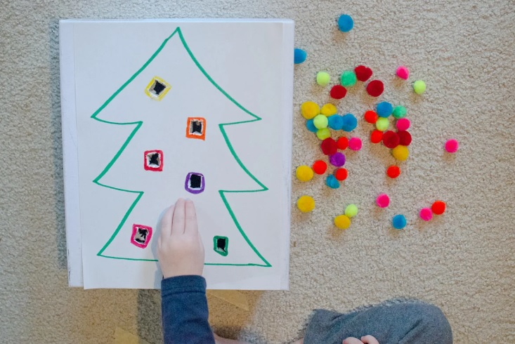

For this toddler activity, Pom Pom Push is a super simple activity that we’ve been enjoying for months around here, and it was perfect for a holiday-themed version.

Get the tutorial at [Busy Toddler](https://busytoddler.com/holiday-pom-pom-push/)

### **2\. Sticker Christmas Tree Craft** 

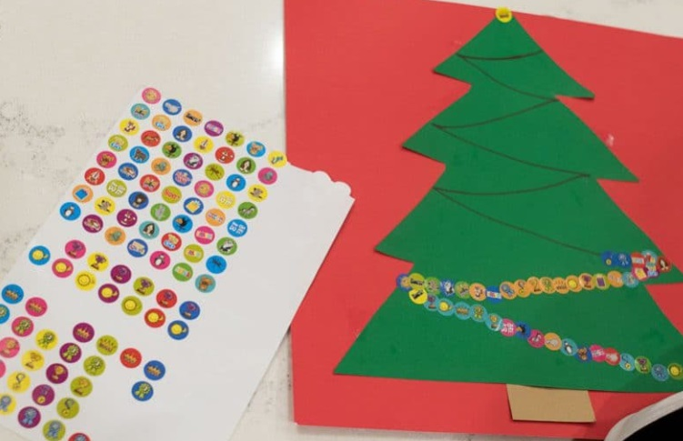

This sticker tree is totally mess-free. No glitter or glue is involved, making it easy and clean to work with. It might seem simple, but it’s fantastic for improving those fine motor skills – and honestly, anything involving stickers is! Go ahead and let the toddlers enjoy them!

Get the tutorial at [Hands on as We Grow](https://handsonaswegrow.com/sticker-christmas-tree-craft-kids/)

### **3\. Montessori DIY Button Christmas Tree**

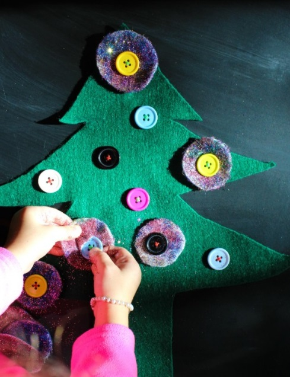

Are you searching for a fun and simple Christmas activity for your toddlers that also teaches practical life skills? Well, you’re in luck because here’s an idea: Try making your own Montessori-inspired DIY Button Christmas Tree! This project is a fantastic way to put those extra buttons to good use. Let’s get started!

Get the tutorial at [Natural Beach Living](https://www.naturalbeachliving.com/montessori-diy-button-christmas-tree/)

### **4\. Cork Board Christmas Tree**

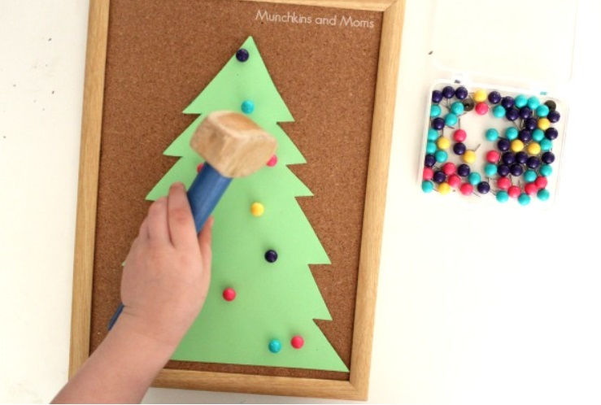

Christmas vacation is just around the corner, which means many toddlers will be at home, eager for crafts and activities to keep them entertained. Stay tuned for next week as we prepare to share it on the blog, complete with a special giveaway!

Get the tutorial at [Play, Teach, Repeat](https://playteachrepeat.com/cork-board-christmas-tree/)

### **5\. Christmas Matching Game**

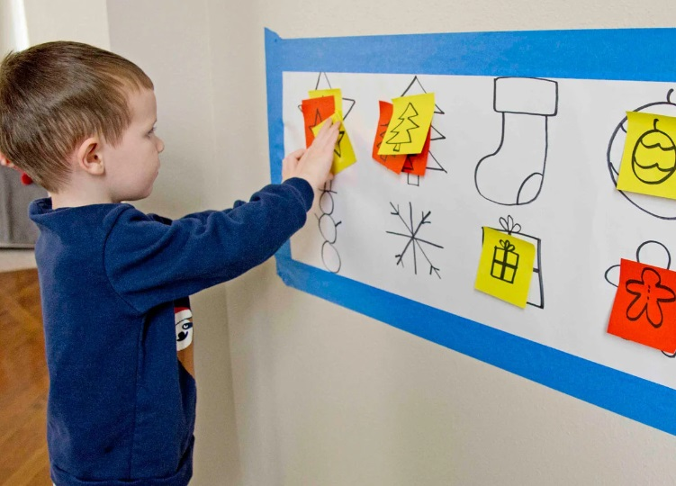

Try creating a Christmas matching game using sticky notes – it’s a perfect activity for toddlers and preschoolers. This easy indoor activity will keep your kids happily occupied throughout Christmas time.

Get the tutorial at [Busy Toddler](https://busytoddler.com/christmas-post-it-match-activity/)

### **6\. Christmas Sweater Sticky Wall**

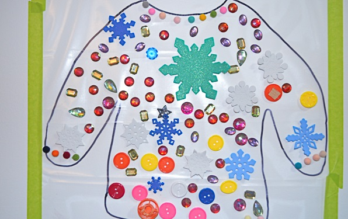

Ugly Christmas sweaters have become a must-have during the holiday season. Wearing one is a blast, but making your own is even more enjoyable! Here’s a delightful sticky wall activity perfect for your toddlers at Christmas.

Get the tutorial at [Happy Toddler Playtime](https://happytoddlerplaytime.com/christmas-sweater-sticky-wall/)

### **7\. Potato Stamped Christmas Lights Activity**

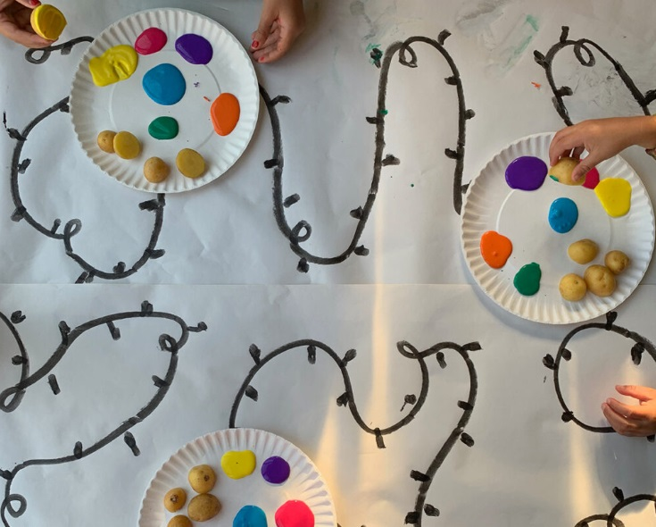

Get some white Kraft paper and lay it out on your table or floor. Then, take your black paint stick (or you can use a black Sharpie) to draw a string of Christmas lights. Make sure to include small sockets along the string where your kids can stamp mini potatoes, pom poms, fingerprints, or wine corks.

Get the tutorial at [Happy Toddler Playtime](https://happytoddlerplaytime.com/potato-stamped-christmas-lights-art-activity-for-kids/)

### **8\. Ripping Paper Christmas Activity**

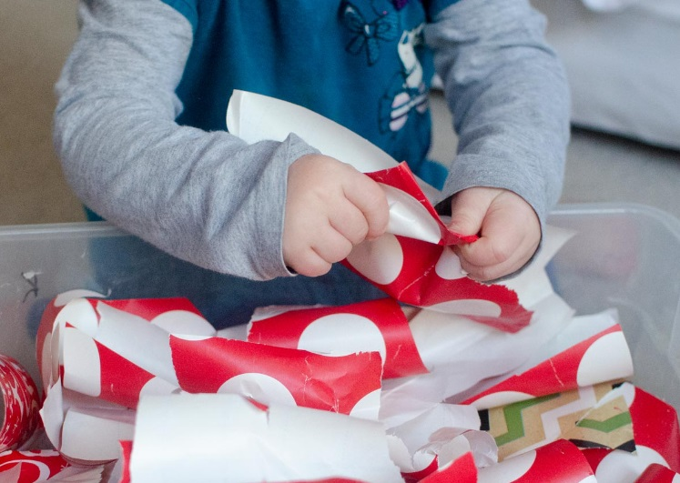

This toddler Christmas activity is incredibly simple: make a wrapping paper ripping bin. Use leftover gift wrap scraps to create a straightforward, eco-friendly fine motor activity for babies and toddlers. You’ll be surprised how long this activity keeps their little hands busy.

Get the tutorial at [Busy Toddler](https://busytoddler.com/ripping-paper-bin/)

### **9\. Easy Christmas Spin Art for Toddlers** 

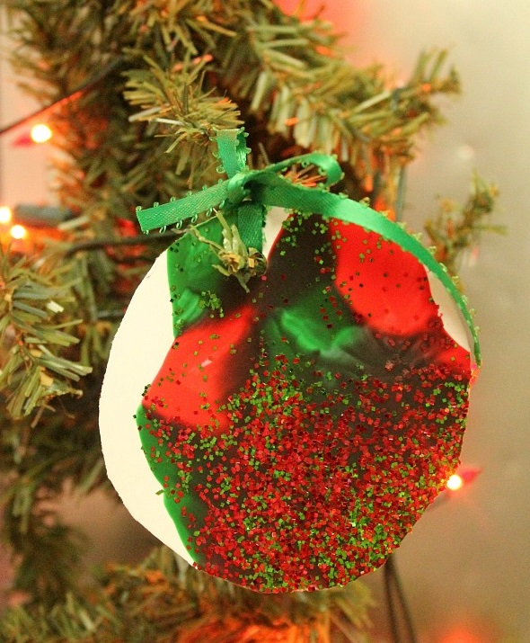

Toddler spin art is a beloved activity in our household, and we especially embrace it during the Christmas season when creativity is in full swing.

Get the tutorial at [Teaching 2 and 3 Year Olds](https://teaching2and3yearolds.com/easy-toddler-christmas-art/)

### **10\. Simple Handprint Christmas Wreath**

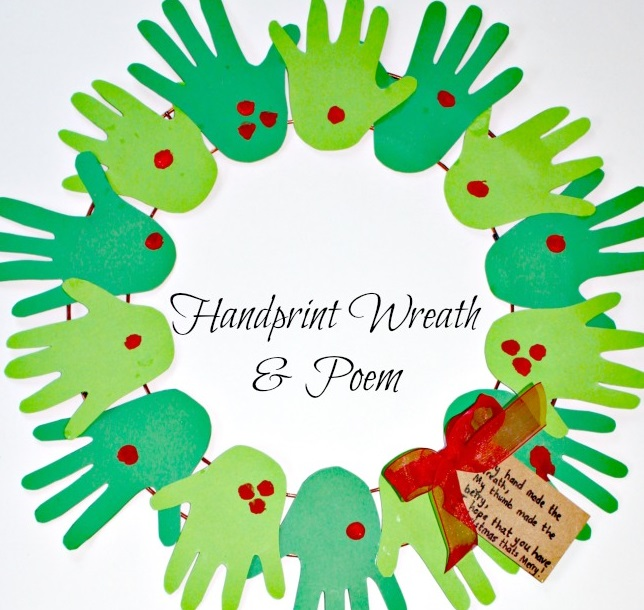

A simple handprint Christmas wreath for toddlers is a fun and engaging craft activity designed to provide them with a creative outlet during the holiday season. This project allows toddlers to explore their artistic skills and create a personalized keepsake that can be hung as festive decor in their homes.

Get the tutorial [Messy Little Monster](https://www.messylittlemonster.com/2015/12/simple-handprint-christmas-wreath.html)

### **11\. Felt Christmas Tree**

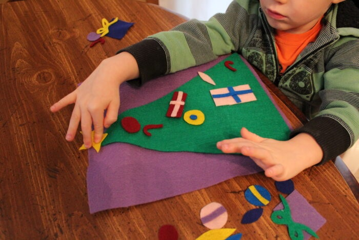

Felt Christmas trees are popular among families with kids, as they provide a safe and engaging activity for toddlers to get involved in the holiday spirit. They promote fine motor skills, cognitive development, and imaginative play as children arrange and rearrange the felt ornaments on the tree. 

Get the tutorial at [Teaching Mama](https://teachingmama.org/felt-christmas-tree/)

### **12.  Holiday Sticker Cups**

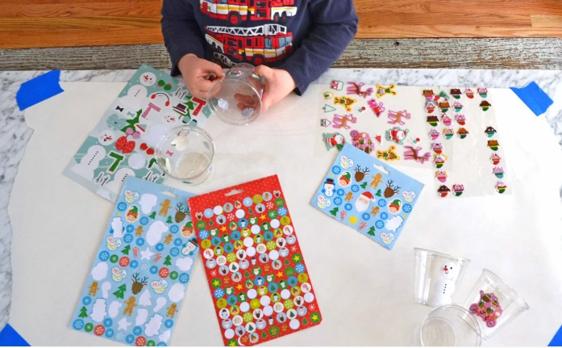

This Christmas sticker cup activity is budget-friendly and a breeze to set up! But without further ado, let’s dive into the supplies you’ll prepare for your toddlers and get started with this fantastic holiday activity!

Get the tutorial at [Days with Grey](https://dayswithgrey.com/holiday-sticker-cups-indoor-activity-for-kids/)

## **Literacy Christmas Activities for Toddlers**

### **13\. Reindeer Alphabet Bingo**

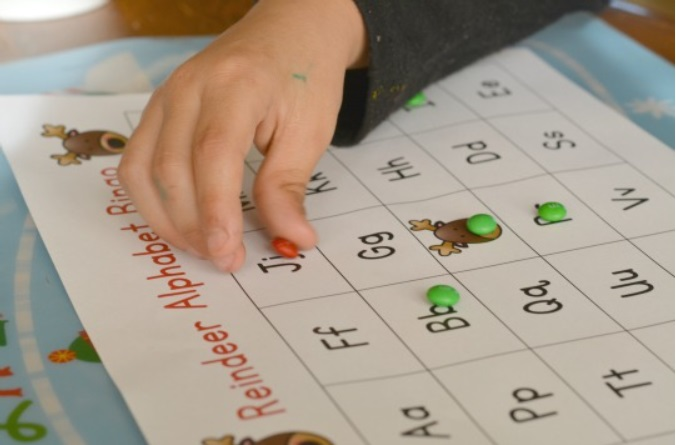

This activity involves printing Christmas-themed bingo sheets with various letters of the alphabet. Toddlers can place red and green candies or tokens on the letters called out. The first one to have five letters in a row can shout “reindeer!” to claim victory in the game.

Read more at [Growing Book By Book](https://growingbookbybook.com/reindeer-alphabet-bingo/)

### **14\. Christmas Story Sequencing**

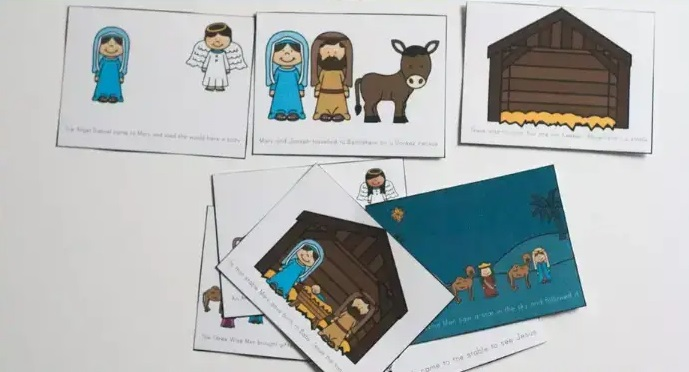

Another engaging activity for toddlers is to have them sort pictures depicting the key events of the Christmas story. In this activity, kids can examine pictures representing the main story events and arrange them in the correct sequence.

Read more at [Teaching Mama](https://teachingmama.org/christmas-literacy-printables-for-preschoolers/)

### **15\. Christmas Color Words and Item Match**

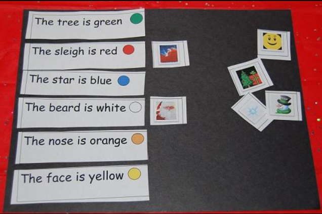

Print the pictures on sturdy paper and, if you wish, laminate them for added durability. Read the sentence strips aloud to all the kids and discuss the colors used. Then, you pre-cut the word strips and pictures apart to help your toddler with this step.

Read more at [The Preschool Toolbox Blog](https://thepreschooltoolboxblog.com/christmas-literacy-activities-preschool/)

### **16\. [Queen of Christmas List Activity](https://www.amazon.com/Queen-Christmas-Ann-Estelle-Stories/dp/0060081759/)**

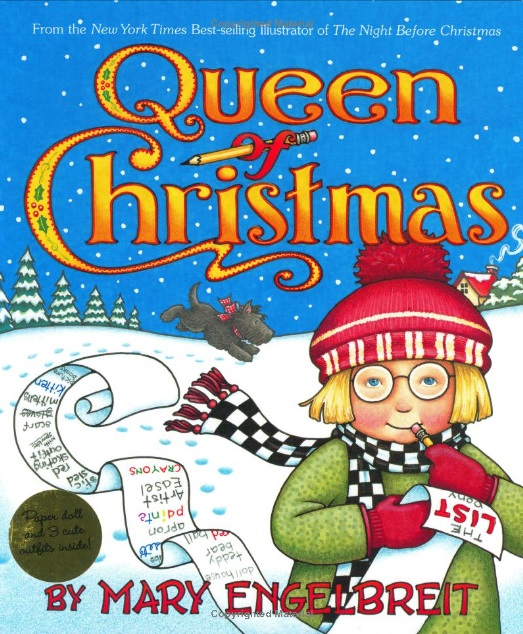

Another wonderful activity for toddlers is to read a Christmas story and follow it up with a related activity. One excellent choice for children’s Christmas books is “Queen of Christmas,” which introduces new vocabulary and the concept of a Christmas list.

### **17\. Gingerbread House Letter Recognition Activity**

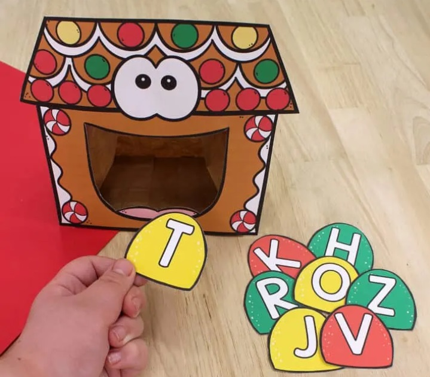

Are you searching for enjoyable alphabet resources for your toddlers to enjoy in December? Don’t miss out on this printable Gingerbread House Letter Recognition Activity! This holiday-themed game can be a captivating and fun literacy center, morning tub activity, or enrichment resource.

Get the tutorial at [ABC’s of Literacy](https://abcsofliteracy.com/gingerbread-house-letter-recognition-activity/)

### **18\. Christmas Letter Maze Worksheets**

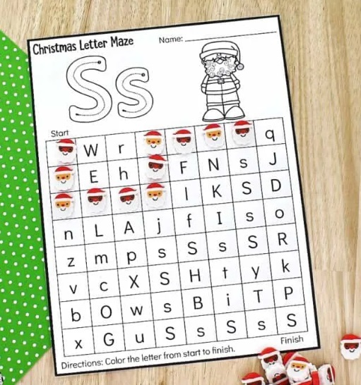

Letter mazes are an excellent way to enhance letter recognition for preschoolers or toddlers. Plus, they offer many more benefits for your kids to explore and enjoy!

Get the tutorial at [ABC’s of Literacy](https://abcsofliteracy.com/christmas-letter-maze-preschool-worksheets/)

### **19\. Christmas Tree Beginning Sound Puzzles**

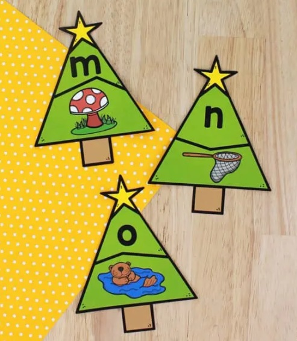

Before your toddlers can dive into reading, it’s crucial for them to grasp the sounds that letters make. This Christmas-themed activity is enjoyable for young learners to acquire this knowledge!

Get the tutorial at [ABC’s of Literacy](https://abcsofliteracy.com/christmas-tree-beginning-sound-puzzles/)

### **20\. Pirate’s Twelve Days Of Christmas Sequencing Activity**

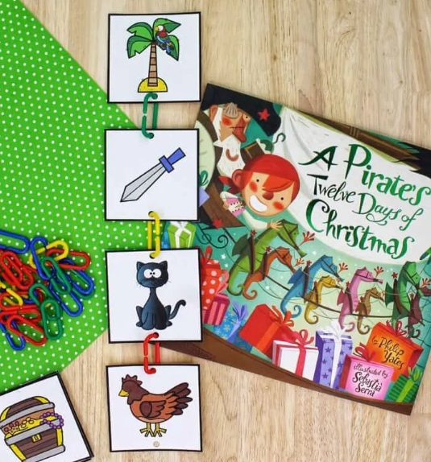

Sequencing plays a crucial role in assisting emerging readers in understanding what they’ve read. This Christmas, let’s give your toddlers a chance to engage in the narrative elements!

Get the tutorial at [ABC’s of Literacy](https://abcsofliteracy.com/pirates-twelve-days-of-christmas-sequencing-activity/)

### **21\. Alphabet Christmas Tree**

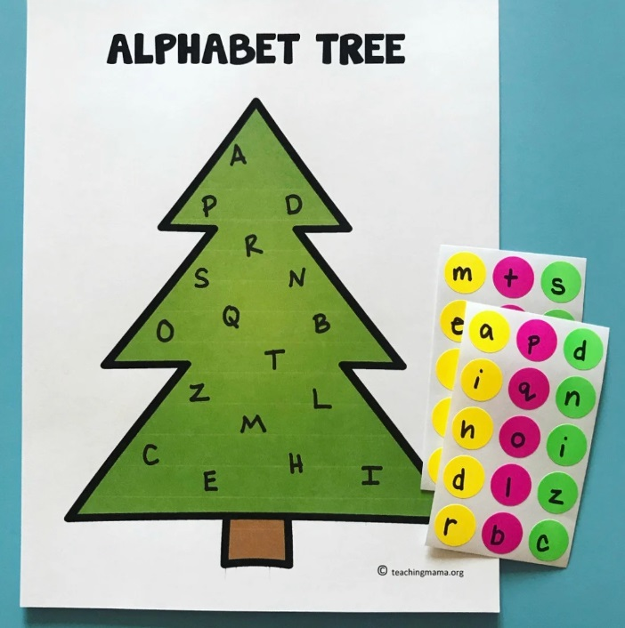

The Alphabet Christmas Tree for toddlers is a fun and interactive learning experience designed to engage young children. This activity involves arranging alphabet flashcards in the shape of a Christmas tree, allowing toddlers to practice letter recognition, sequencing, and fine motor skills.

Get this printable at [Teaching Mama](https://teachingmama.org/wp-content/uploads/2018/12/alphabet-tree.pdf)

### **22\. Roll & Match Christmas Tree Game**

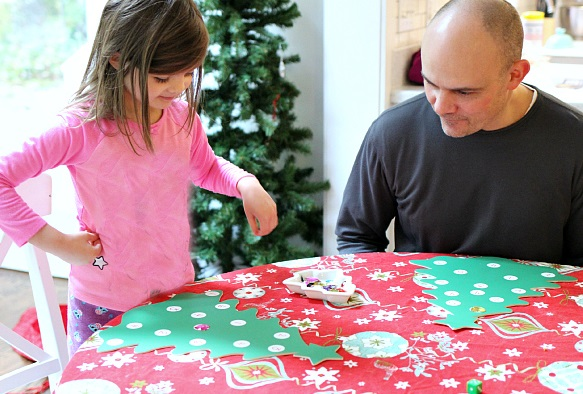

The “Roll & Match Christmas Tree Game” is an interactive holiday activity that promises endless entertainment for the whole family. Players take turns rolling the included dice, matching the symbols and colors to decorate their very own Christmas tree. 

Get the tutorial at [No Time for Flashcards](https://www.notimeforflashcards.com/2015/11/christmas-tree-math-game-for-preschool.html)

## **Christmas Sensory Activities**

### **23\. Candy Cane Sensory Bin**

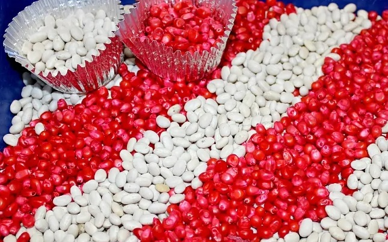

A candy cane sensory bin is a delightful and engaging activity designed to stimulate children’s senses and encourage exploration and play. This sensory bin typically consists of a large container filled with various materials related to the Christmas candy cane theme.

Get the tutorial at [Fun-A-Day](https://fun-a-day.com/sweet-smelling-candy-cane-sensory-play/)

### **24\. Fluffy Candy Cane Shaving Cream Slime**

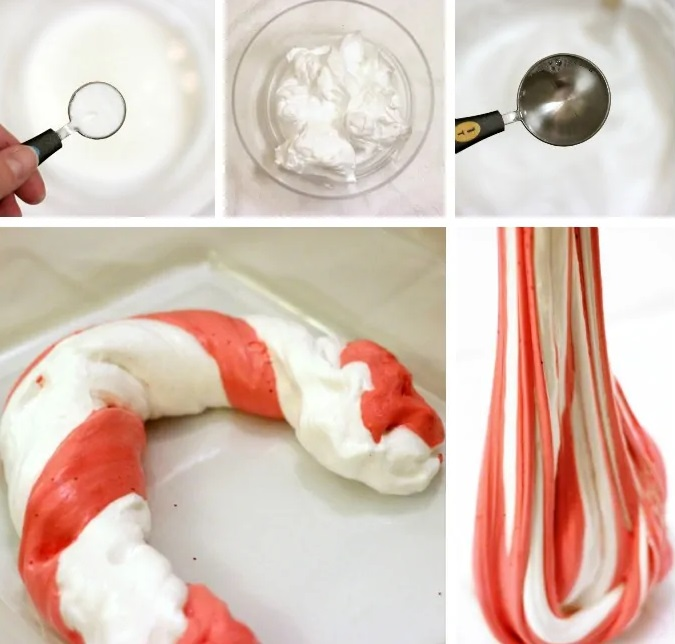

Want to create some holiday-themed slime with the toddlers during the festive season? Why not give candy cane shaving cream slime for Christmas a go? Be sure to include it on your list of Christmas slime recipes that kids will adore!

Get the tutorial at [Fun-A-Day](https://fun-a-day.com/candy-cane-shaving-cream-slime/)

### **25\. Candy Cane Slime**

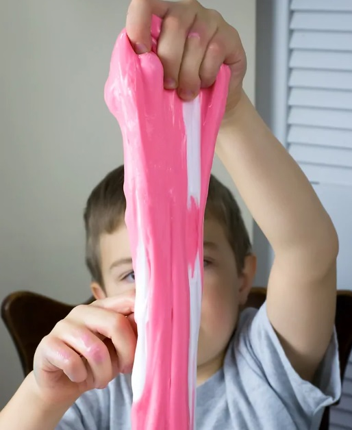

Discover how to craft scented Candy Cane Slime as a delightful addition to your toddler Christmas activities. This festive sensory play offers lots of fun and incorporates math and science elements, making it a well-rounded and engaging experience!

Get the tutorial at [Fun-A-Day](https://fun-a-day.com/making-slime-candy-cane-recipe-kids/)

### **26\. Lights on the Tree Sensory Activity**

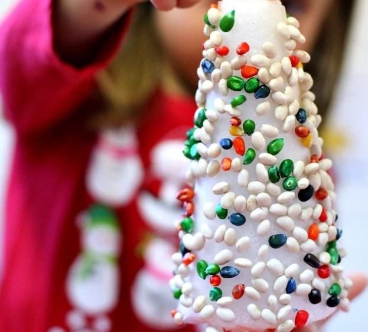

This activity involves exploring and interacting with a Christmas tree adorned with colorful lights, creating a magical atmosphere. Your kids can touch, see, and hear different elements, enhancing their motor skills, visual perception, and auditory awareness.

Get the tutorial at [Fun-A-Day](https://fun-a-day.com/sensory-preschool-christmas-activity/)

### **27\. Christmas Sensory Bin**

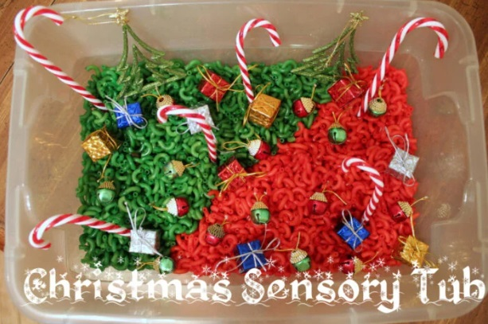

When you toss in brightly colored noodles, bells, and imitation candy canes, it becomes an absolute blast for the little ones. Remember, this activity is best suited for toddlers who do not put objects in their mouths, for safety reasons.

Get the tutorial at [Teaching Mama](https://teachingmama.org/christmas-sensory-bin/)

### **28\. Christmas Sparkly Play Dough**

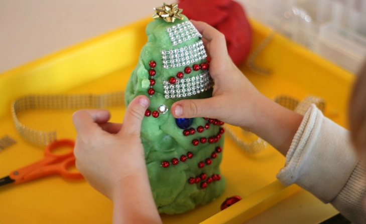

Sparkly Play Dough is a unique holiday-themed modeling compound that brings joy and creativity to toddlers during the Christmas season. This engaging material combines the excitement of Christmas with the fun of molding and shaping dough.

Get the tutorial at [Teaching Mama](https://teachingmama.org/christmas-play-dough-the-easiest-recipe/)

### **29\. Christmas Cutting Box**

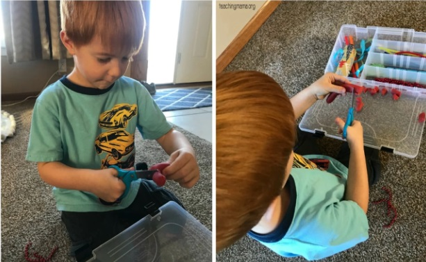

Creating a Christmas-themed cutting box is an excellent method for enhancing fine motor skills in toddlers. You can include a variety of items for them to practice cutting.

Get the tutorial at [Teaching Mama](https://teachingmama.org/christmas-cutting-box/)

### **30\. Peppermint Water Play**

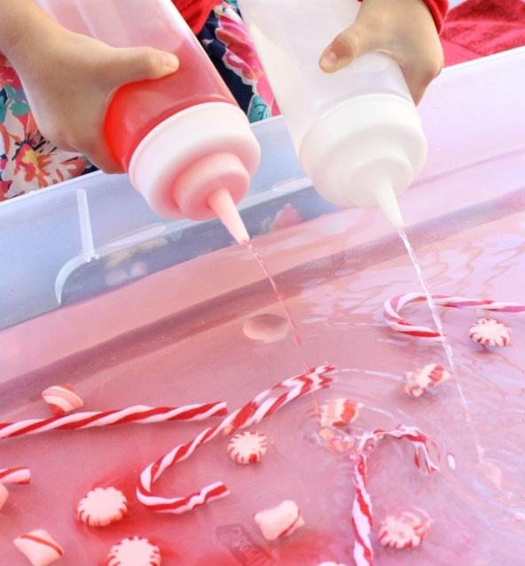

Water play is consistently calming and incredibly versatile for the Christmas holidays. We had a blast with this candy cane water play by incorporating a delightful peppermint scent, adding a festive twist to the experience.

Get the tutorial at [Fantastic Fun and Learning](https://www.fantasticfunandlearning.com/peppermint-water-play-christmas-activity.html)

### **31\. Play Dough Christmas Trees**

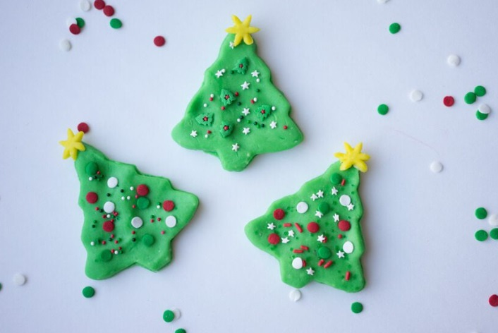

As Christmas approaches, I’m thinking about ways to embrace the holiday spirit with enjoyable crafts and DIY tutorials. If you have a toddler who adores playdough, you’re in for a treat with this playful Christmas tree dough!

Get the tutorial at [The Best Ideas for kids](https://www.thebestideasforkids.com/playdough-christmas-trees/)

### **32\. Christmas Sensory Box**

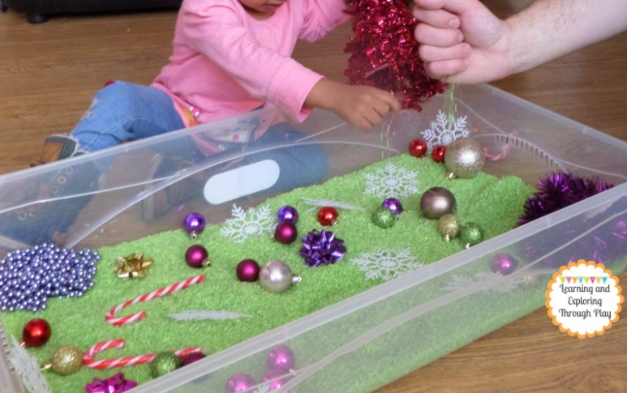

A Christmas sensory box is a delightful holiday-themed activity for toddlers. It is filled with various textures, objects, and scents and provides a multi-sensory experience that stimulates creativity and imagination. 

Get the tutorial at [Learning and Exploring Through Play](https://www.learningandexploringthroughplay.com/2014/12/christmas-sensory-box.html)

### **33\. Christmas Gift Wrap Sensory Bin**

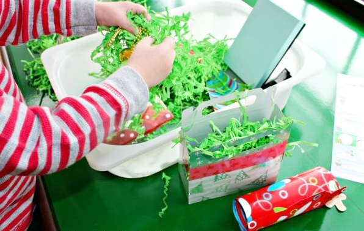

This Christmas sensory play activity is simple to set up and uses materials you might already have around the house. It’s a fantastic way to repurpose gift wraps, boxes, and bows that promote learning and enjoyment for your toddlers!

Get the tutorial at [Pre-K Pages](https://www.pre-kpages.com/christmas-gift-wrap-sensory-bin/)

### **34\. Jingle Bells Sensory Bottle**

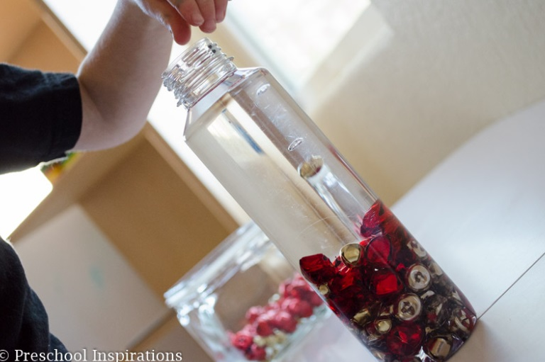

The jingle bells sensory bottle features a transparent container filled with colorful and eye-catching objects such as glitter, beads, and mini jingle bells. The contents are carefully chosen to provide a mesmerizing visual display when the bottle is shaken or moved. 

Get the tutorial at [Preschool Inspirations](https://preschoolinspirations.com/jingle-bells-discovery-bottle/)

## **Math and Science Christmas Ideas for Toddlers**

### **35\. Sparkly Christmas Engineering Activity**

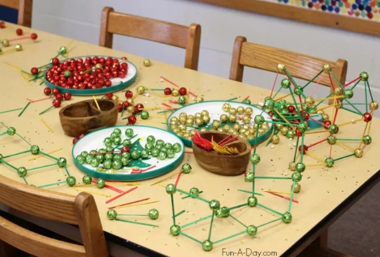

The Christmas engineering project is a straightforward yet vibrant activity for toddlers to dive into amid the holiday rush. We had an absolute blast as the kids brainstormed and constructed using some delightful materials.

Get the tutorial at [Fun-A-Day](https://fun-a-day.com/christmas-engineering-activity-for-kids/)

### **36\. Preschool Magnet Science with Jingle Bells**

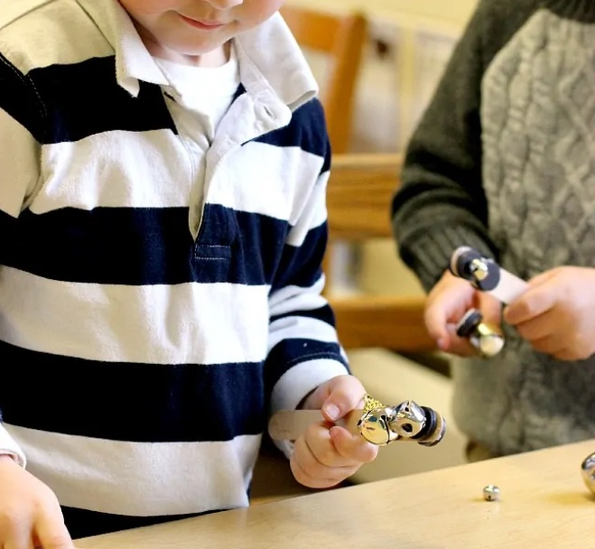

Playing Magnet Science with Jingle Bells is a hands-on [educational activity](https://avada.io/loveable/blog/engaging-educational-activities/) that introduces the concept of magnetism. By incorporating the delightful sound of jingle bells, this activity fosters sensory development and cognitive growth in toddlers.

Get the tutorial [Fun-A-Day](https://fun-a-day.com/preschool-magnet-science-jingle-bells/)

###  **37. Christmas Fizzy Drips Science** 

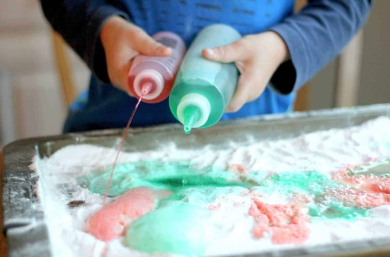

Christmas Fizzy Drips Science for toddlers is an exciting and innovative holiday-themed activity that combines Christmas’s joy with science’s wonders. This educational experiment involves creating fizzing and bubbling concoctions using simple household materials.

Get the tutorial at [Toddler Approved](https://toddlerapproved.com/christmas-fizzy-drips-science-for-kids/)

### **38\. Jingle Bell Christmas Math Game**

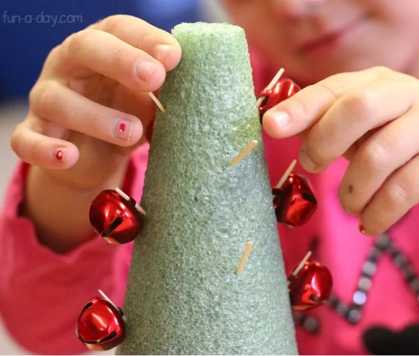

Through this activity, toddlers can sharpen their listening skills while honing crucial early math abilities. The jingle bells math game draws inspiration from last year’s geoboard Christmas trees and And Next Comes L’s threading bells activity.

Get the tutorial at [Fun-A-Day](https://fun-a-day.com/christmas-math-game-fine-motor-bells/)

### **39\. Christmas Book Countdown**

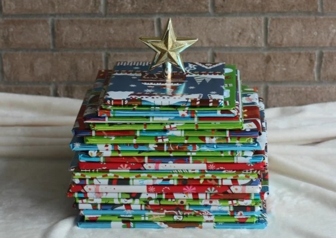

Children adore unwrapping presents, and they’ll absolutely delight in unwrapping a new book to read daily! You just borrow books from the library and gather your Christmas book collection. Then, wrap them up and place them under your tree.

Get the tutorial at [Teaching Mama](https://teachingmama.org/christmas-book-countdown/)

### **40\. Christmas Pictures Using Duplo Blocks**

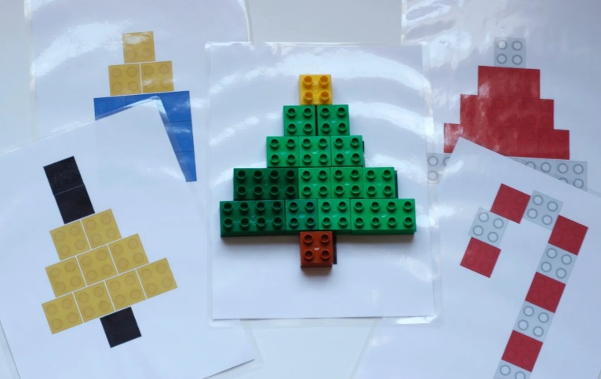

This Christmas activity for toddlers involves arranging and stacking Duplo blocks in various colors to construct beautiful classic Christmas motifs such as snowmen, Santa Claus, Christmas trees, reindeer, presents, and other festive elements.

Get the tutorial at [Teaching Mama](https://teachingmama.org/christmas-pictures-duplo/)

### **41\. Jingle Bell Threading**

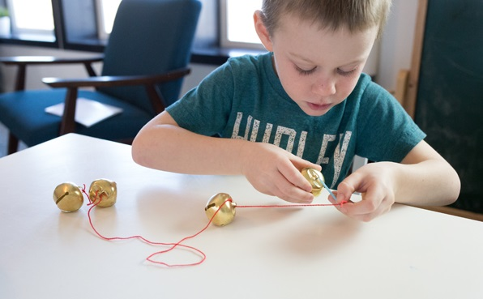

This festive crafting technique allows toddlers to create vibrant and melodic decorations like garlands, ornaments, or jewelry. By threading jingle bells with different sizes, colors, and textures, one can easily personalize their creations to suit their own unique style and taste.

Get the tutorial at [Play, Teach, Repeat](https://playteachrepeat.com/jingle-bell-threading/)

### **42\. Christmas Lava Lamp Science Experiment**

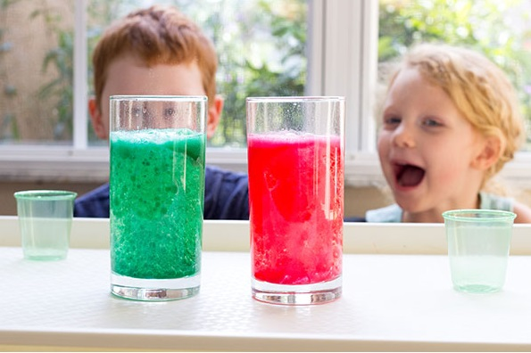

To do this experiment, just use green or red food coloring or watercolor paints. It’s simple to set up, needing only a few common household items and a few minutes. It’s great for toddlers, but ensure that you always supervise them.

Get the tutorial at [Fun Learning at Home](https://funlearningforkids.com/christmas-lava-lamp-science-experiment/)

**_Check Out:_** Best [Toddler Christmas Gifts](https://avada.io/loveable/toddler-christmas-gifts/) for Your Little Baby

## **Bottom line**

In wrapping up, the holiday season provides a unique opportunity to cultivate joy and wonder in the hearts of our youngest family members. Navigating the world of **Christmas activities for toddlers** might seem daunting initially, but with some creativity and patience, you can make this season truly magical for your little one.

Whether you opt for crafty endeavors, sensory adventures, or culinary delights, the key is making every moment count. After all, you’re not just filling their days with activities—you’re filling their lives with cherished memories. So dive into these toddler-friendly activities and make this holiday season one for the books!

- [Easy Christmas Arts and Crafts](https://avada.io/loveable/blog/christmas-activities-for-toddlers/#wp-block-heading-2-3)
    - [1\. Christmas Pom Pom Push](https://avada.io/loveable/blog/christmas-activities-for-toddlers/#wp-block-heading-3-4)
    - [2\. Sticker Christmas Tree Craft](https://avada.io/loveable/blog/christmas-activities-for-toddlers/#wp-block-heading-3-8) 
    - [3\. Montessori DIY Button Christmas Tree](https://avada.io/loveable/blog/christmas-activities-for-toddlers/#wp-block-heading-3-12)
    - [4\. Cork Board Christmas Tree](https://avada.io/loveable/blog/christmas-activities-for-toddlers/#wp-block-heading-3-16)
    - [5\. Christmas Matching Game](https://avada.io/loveable/blog/christmas-activities-for-toddlers/#wp-block-heading-3-20)
    - [6\. Christmas Sweater Sticky Wall](https://avada.io/loveable/blog/christmas-activities-for-toddlers/#wp-block-heading-3-24)
    - [7\. Potato Stamped Christmas Lights Activity](https://avada.io/loveable/blog/christmas-activities-for-toddlers/#wp-block-heading-3-28)
    - [8\. Ripping Paper Christmas Activity](https://avada.io/loveable/blog/christmas-activities-for-toddlers/#wp-block-heading-3-32)
    - [9\. Easy Christmas Spin Art for Toddlers](https://avada.io/loveable/blog/christmas-activities-for-toddlers/#wp-block-heading-3-36) 
    - [10\. Simple Handprint Christmas Wreath](https://avada.io/loveable/blog/christmas-activities-for-toddlers/#wp-block-heading-3-40)
    - [11\. Felt Christmas Tree](https://avada.io/loveable/blog/christmas-activities-for-toddlers/#wp-block-heading-3-44)
    - [12.  Holiday Sticker Cups](https://avada.io/loveable/blog/christmas-activities-for-toddlers/#wp-block-heading-3-48)
- [Literacy Christmas Activities for Toddlers](https://avada.io/loveable/blog/christmas-activities-for-toddlers/#wp-block-heading-2-52)
    - [13\. Reindeer Alphabet Bingo](https://avada.io/loveable/blog/christmas-activities-for-toddlers/#wp-block-heading-3-53)
    - [14\. Christmas Story Sequencing](https://avada.io/loveable/blog/christmas-activities-for-toddlers/#wp-block-heading-3-57)
    - [15\. Christmas Color Words and Item Match](https://avada.io/loveable/blog/christmas-activities-for-toddlers/#wp-block-heading-3-61)
    - [16\. Queen of Christmas List Activity](https://avada.io/loveable/blog/christmas-activities-for-toddlers/#wp-block-heading-3-65)
    - [17\. Gingerbread House Letter Recognition Activity](https://avada.io/loveable/blog/christmas-activities-for-toddlers/#wp-block-heading-3-68)
    - [18\. Christmas Letter Maze Worksheets](https://avada.io/loveable/blog/christmas-activities-for-toddlers/#wp-block-heading-3-72)
    - [19\. Christmas Tree Beginning Sound Puzzles](https://avada.io/loveable/blog/christmas-activities-for-toddlers/#wp-block-heading-3-76)
    - [20\. Pirate’s Twelve Days Of Christmas Sequencing Activity](https://avada.io/loveable/blog/christmas-activities-for-toddlers/#wp-block-heading-3-80)
    - [21\. Alphabet Christmas Tree](https://avada.io/loveable/blog/christmas-activities-for-toddlers/#wp-block-heading-3-84)
    - [22\. Roll & Match Christmas Tree Game](https://avada.io/loveable/blog/christmas-activities-for-toddlers/#wp-block-heading-3-88)
- [Christmas Sensory Activities](https://avada.io/loveable/blog/christmas-activities-for-toddlers/#wp-block-heading-2-92)
    - [23\. Candy Cane Sensory Bin](https://avada.io/loveable/blog/christmas-activities-for-toddlers/#wp-block-heading-3-93)
    - [24\. Fluffy Candy Cane Shaving Cream Slime](https://avada.io/loveable/blog/christmas-activities-for-toddlers/#wp-block-heading-3-97)
    - [25\. Candy Cane Slime](https://avada.io/loveable/blog/christmas-activities-for-toddlers/#wp-block-heading-3-101)
    - [26\. Lights on the Tree Sensory Activity](https://avada.io/loveable/blog/christmas-activities-for-toddlers/#wp-block-heading-3-105)
    - [27\. Christmas Sensory Bin](https://avada.io/loveable/blog/christmas-activities-for-toddlers/#wp-block-heading-3-109)
    - [28\. Christmas Sparkly Play Dough](https://avada.io/loveable/blog/christmas-activities-for-toddlers/#wp-block-heading-3-113)
    - [29\. Christmas Cutting Box](https://avada.io/loveable/blog/christmas-activities-for-toddlers/#wp-block-heading-3-117)
    - [30\. Peppermint Water Play](https://avada.io/loveable/blog/christmas-activities-for-toddlers/#wp-block-heading-3-121)
    - [31\. Play Dough Christmas Trees](https://avada.io/loveable/blog/christmas-activities-for-toddlers/#wp-block-heading-3-125)
    - [32\. Christmas Sensory Box](https://avada.io/loveable/blog/christmas-activities-for-toddlers/#wp-block-heading-3-129)
    - [33\. Christmas Gift Wrap Sensory Bin](https://avada.io/loveable/blog/christmas-activities-for-toddlers/#wp-block-heading-3-133)
    - [34\. Jingle Bells Sensory Bottle](https://avada.io/loveable/blog/christmas-activities-for-toddlers/#wp-block-heading-3-137)
- [Math and Science Christmas Ideas for Toddlers](https://avada.io/loveable/blog/christmas-activities-for-toddlers/#wp-block-heading-2-141)
    - [35\. Sparkly Christmas Engineering Activity](https://avada.io/loveable/blog/christmas-activities-for-toddlers/#wp-block-heading-3-142)
    - [36\. Preschool Magnet Science with Jingle Bells](https://avada.io/loveable/blog/christmas-activities-for-toddlers/#wp-block-heading-3-146)
    -  [37. Christmas Fizzy Drips Science](https://avada.io/loveable/blog/christmas-activities-for-toddlers/#wp-block-heading-3-150) 
    - [38\. Jingle Bell Christmas Math Game](https://avada.io/loveable/blog/christmas-activities-for-toddlers/#wp-block-heading-3-154)
    - [39\. Christmas Book Countdown](https://avada.io/loveable/blog/christmas-activities-for-toddlers/#wp-block-heading-3-158)
    - [40\. Christmas Pictures Using Duplo Blocks](https://avada.io/loveable/blog/christmas-activities-for-toddlers/#wp-block-heading-3-162)
    - [41\. Jingle Bell Threading](https://avada.io/loveable/blog/christmas-activities-for-toddlers/#wp-block-heading-3-166)
    - [42\. Christmas Lava Lamp Science Experiment](https://avada.io/loveable/blog/christmas-activities-for-toddlers/#wp-block-heading-3-170)
- [Bottom line](https://avada.io/loveable/blog/christmas-activities-for-toddlers/#wp-block-heading-2-175)

### [Blake Simpson](https://avada.io/loveable/author/blake/)

Hi, I'm Blake from Loveable. I help people find perfect gifts for occasions like anniversaries and weddings. I also write a blog about holidays, sharing insights to make them more meaningful. Let's create unforgettable moments together!

- [Twitter](https://twitter.com/intent/tweet)
- [Facebook](https://www.facebook.com/sharer/sharer.php)
- [instagram](https://avada.io/loveable/blog/christmas-activities-for-toddlers/)
- [pinterest](https://www.pinterest.com/loveablellc/)

## Related Posts

[### 120+ Christian Birthday Wishes To Spread Your Love](https://avada.io/loveable/blog/christian-birthday-wishes/) 

[

### 35 Best 70th Birthday Ideas To Celebrate The Special Milestone

](https://avada.io/loveable/blog/70th-birthday-ideas/)

[

### 50 Best 30th Birthday Decorations for a Remarkable Birthday Bash

](https://avada.io/loveable/blog/30th-birthday-decorations/)

[

### 40 Delicious Vegan Christmas Desserts to Delight Your Palate

](https://avada.io/loveable/blog/vegan-christmas-desserts/)

[

### 60 Christmas Team Building Activities to Boost Workplace Spirit

](https://avada.io/loveable/blog/christmas-team-building-activities/)
