This article has been written and researched by our expert Loveable through a precise methodology. [Learn more about our methodology](https://avada.io/loveable/our-methodological.html)

[Loveable](https://avada.io/loveable/) > [Blog](https://avada.io/loveable/blog/) > [Holiday](https://avada.io/loveable/holiday/)

# 40 Delicious Vegan Christmas Desserts to Delight Your Palate

Written by [Blake Simpson](https://avada.io/loveable/author/blake/) Last Updated on October 05, 2023

- [40 Delicious Vegan: Christmas Desserts for a Sweet Celebration](https://avada.io/loveable/blog/vegan-christmas-desserts/#wp-block-heading-2-2) 
    - [1\. Vegan gingerbread cookies](https://avada.io/loveable/blog/vegan-christmas-desserts/#wp-block-heading-3-3)
    - [2\. Vegan pumpkin pie](https://avada.io/loveable/blog/vegan-christmas-desserts/#wp-block-heading-3-7)
    - [3\. Vegan peppermint bark](https://avada.io/loveable/blog/vegan-christmas-desserts/#wp-block-heading-3-11)
    - [4\. Vegan biscoff cheesecake](https://avada.io/loveable/blog/vegan-christmas-desserts/#wp-block-heading-3-15)
    - [5\. Vegan sugar cookies](https://avada.io/loveable/blog/vegan-christmas-desserts/#wp-block-heading-3-19)
    - [6\. Vegan pecan pie](https://avada.io/loveable/blog/vegan-christmas-desserts/#wp-block-heading-3-23)
    - [7\. Vegan chocolate yule log](https://avada.io/loveable/blog/vegan-christmas-desserts/#wp-block-heading-3-27)
        - [8\. Fluffy cranberry orange muffins](https://avada.io/loveable/blog/vegan-christmas-desserts/#wp-block-heading-4-31)
        - [9\. Vegan walnut snowball cookies](https://avada.io/loveable/blog/vegan-christmas-desserts/#wp-block-heading-4-35)
    - [10\. Vegan tiramisu](https://avada.io/loveable/blog/vegan-christmas-desserts/#wp-block-heading-3-39)
    - [11\. Vegan mince pies](https://avada.io/loveable/blog/vegan-christmas-desserts/#wp-block-heading-3-43)
    - [12\. Vegan apple crisp](https://avada.io/loveable/blog/vegan-christmas-desserts/#wp-block-heading-3-47)
    - [13\. Vegan chocolate cupcakes](https://avada.io/loveable/blog/vegan-christmas-desserts/#wp-block-heading-3-51)
    - [14\. Vegan shortbread cookies](https://avada.io/loveable/blog/vegan-christmas-desserts/#wp-block-heading-3-55)
    - [15\. Vegan chocolate truffles](https://avada.io/loveable/blog/vegan-christmas-desserts/#wp-block-heading-3-59)
        - [16\. Vegan banana cinnamon rolls](https://avada.io/loveable/blog/vegan-christmas-desserts/#wp-block-heading-4-63)
    - [17\. Vegan rice pudding](https://avada.io/loveable/blog/vegan-christmas-desserts/#wp-block-heading-3-67)
    - [18\. Raspberry almond layer cake](https://avada.io/loveable/blog/vegan-christmas-desserts/#wp-block-heading-3-71)
    - [19\. Vegan hot chocolate](https://avada.io/loveable/blog/vegan-christmas-desserts/#wp-block-heading-3-75)
    - [20\. Vegan panna cotta](https://avada.io/loveable/blog/vegan-christmas-desserts/#wp-block-heading-3-79)
    - [21\. Vegan lemon bars](https://avada.io/loveable/blog/vegan-christmas-desserts/#wp-block-heading-3-83)
    - [22\. Vegan rocky road](https://avada.io/loveable/blog/vegan-christmas-desserts/#wp-block-heading-3-87)
    - [23\. Vegan banofee pie](https://avada.io/loveable/blog/vegan-christmas-desserts/#wp-block-heading-3-91)
    - [24\. Vegan skillet cookie](https://avada.io/loveable/blog/vegan-christmas-desserts/#wp-block-heading-3-95)
    - [25\. Vegan caramel apples](https://avada.io/loveable/blog/vegan-christmas-desserts/#wp-block-heading-3-99)
    - [26\. Vegan black forest cake](https://avada.io/loveable/blog/vegan-christmas-desserts/#wp-block-heading-3-103)
    - [27\. Vegan coconut macaroons](https://avada.io/loveable/blog/vegan-christmas-desserts/#wp-block-heading-3-107)
    - [28\. Vegan chocolate-covered strawberries](https://avada.io/loveable/blog/vegan-christmas-desserts/#wp-block-heading-3-111)
    - [29\. Vegan lemon pound cake](https://avada.io/loveable/blog/vegan-christmas-desserts/#wp-block-heading-3-115)
    - [30\. Vegan pumpkin donuts](https://avada.io/loveable/blog/vegan-christmas-desserts/#wp-block-heading-3-119)
    - [31\. Vegan pecan pralines](https://avada.io/loveable/blog/vegan-christmas-desserts/#wp-block-heading-3-123)
    - [32\. Vegan chocolate mousse](https://avada.io/loveable/blog/vegan-christmas-desserts/#wp-block-heading-3-127)
    - [33\. Vegan fruitcake](https://avada.io/loveable/blog/vegan-christmas-desserts/#wp-block-heading-3-131)
    - [34\. Vegan creme brulee](https://avada.io/loveable/blog/vegan-christmas-desserts/#wp-block-heading-3-135)
    - [35\. Vegan oatmeal cookies](https://avada.io/loveable/blog/vegan-christmas-desserts/#wp-block-heading-3-139)
    - [36\. Chia pudding with pumpkin caramel](https://avada.io/loveable/blog/vegan-christmas-desserts/#wp-block-heading-3-143)
    - [37\. Carrot cake oatmeal bake](https://avada.io/loveable/blog/vegan-christmas-desserts/#wp-block-heading-3-147)
    - [38\. Winter citrus smoothie](https://avada.io/loveable/blog/vegan-christmas-desserts/#wp-block-heading-3-151)
    - [39\. Vegan gingerbread latte](https://avada.io/loveable/blog/vegan-christmas-desserts/#wp-block-heading-3-155)
    - [40\. Apple pie chia smoothie](https://avada.io/loveable/blog/vegan-christmas-desserts/#wp-block-heading-3-159)
- [Bottom Line](https://avada.io/loveable/blog/vegan-christmas-desserts/#wp-block-heading-2-163)

Get ready to elevate your holiday celebrations with a delectable array of plant-based delights! In ’40 Delicious **Vegan Christmas Desserts** to Delight Your Palate,’ we’re unwrapping a treasure trove of festive flavors, enchanting aromas, and sweet indulgences, all while staying true to compassionate and cruelty-free eating. Whether you’re a dedicated vegan or simply looking to add some plant-based magic to your Christmas menu, this collection of decadent desserts is your ticket to a joyful and satisfying holiday season.

## **40 Delicious Vegan: Christmas Desserts for a Sweet Celebration** 

### **1\. Vegan gingerbread cookies**

Vegan gingerbread cookies are a type of gingerbread cookie that adheres to a vegan dietary lifestyle. “Vegan” means that these cookies are made without any animal-derived ingredients, such as butter, eggs, or dairy. Instead, they use plant-based substitutes like coconut oil or applesauce for the same delicious texture and flavor. 

Get the recipe: [Vegan Gingerbread Cookies](https://www.landsandflavors.com/vegan-gingerbread-cookies/)

### **2\. Vegan pumpkin pie**

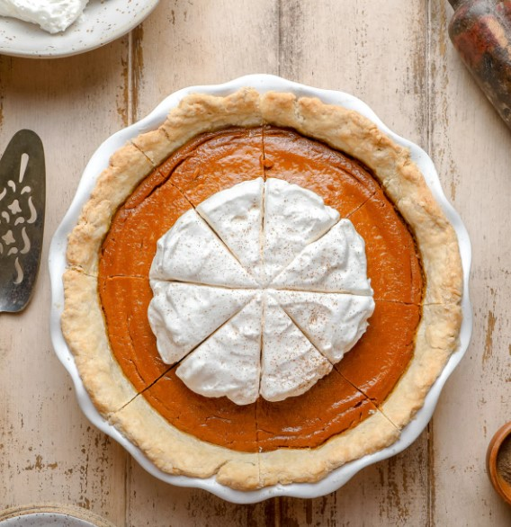

This plant-based dessert retains all the warm, spiced flavors and creamy texture of traditional pumpkin pie while eschewing dairy and eggs. It mixes pumpkin’s creamy richness with the soothing embrace of festive spices. This dessert is a vegan-friendly twist on a classic, ensuring that everyone can savor the taste of Christmas in a single slice.

Get the recipe: [Vegan Pumpkin Pie](https://www.noracooks.com/vegan-pumpkin-pie/)

### **3\. Vegan peppermint bark**

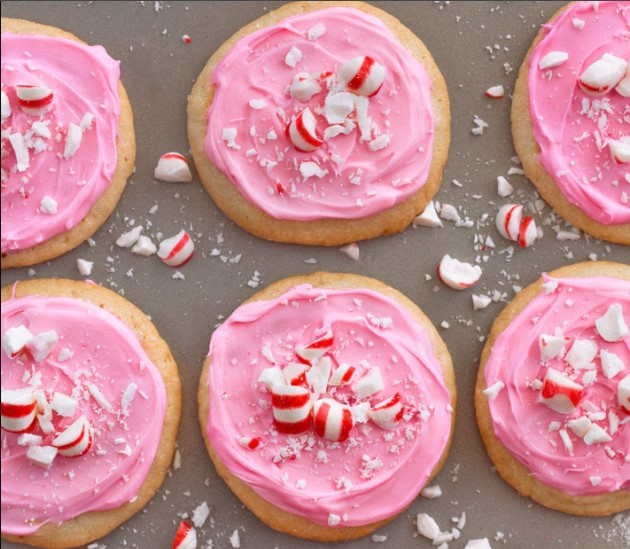

A lovely and cruelty-free variation on the traditional holiday dessert is vegan peppermint bark. White chocolate and milk chocolate are common dairy-based components in peppermint bark in its classic form. However, the “vegan” label denotes that this delectable delight lacks animal byproducts.

Get the recipe: [Vegan Peppermint Bark](https://chocolatecoveredkatie.com/vegan-peppermint-cookies-recipe/)

### 4\. **Vegan biscoff cheesecake**

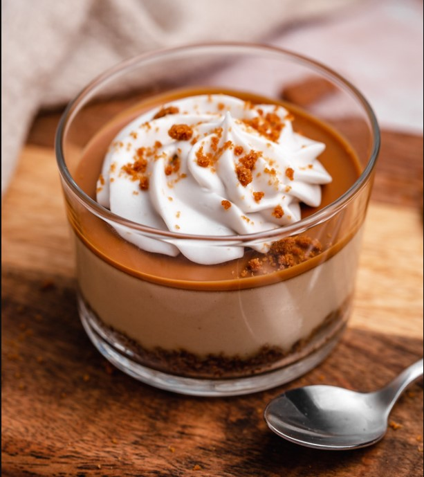

A mouthwatering Christmas dessert for vegans that appeals to cheesecake lovers and vegans alike is vegan biscoff cheesecake. Following vegan guidelines, this delicious treat is created totally without the use of any animal products. It’s such a sweet dessert for anyone to enjoy this Christmas!

Get the recipe: [Vegan Biscoff Cheesecake](https://plantifulbakery.com/vegan-biscoff-cheesecake-cups/)

### **5\. Vegan sugar cookies**

These cookies are a kind option for individuals living a vegan lifestyle because they are absolutely devoid of components produced by animals. By using vegan-friendly sugar, the end product is a soft and supple cookie with a sweet buttery taste.

Get the recipe: [Vegan Sugar Cookies](https://lovingitvegan.com/the-easiest-vegan-sugar-cookies/)

### **6\. Vegan pecan pie**

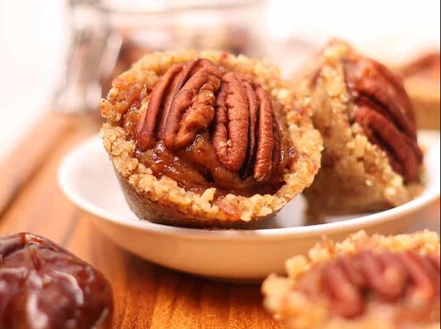

Vegan pecan pie is a delicious dessert that precisely adheres to vegan dietary guidelines while imitating classic pecan pie’s rich, nutty, and caramel-like flavors. This delectable delicacy has no ingredients produced by animals, making it a kind option for anyone adopting a vegan diet. 

Get the recipe: [Vegan Pecan Pie](https://www.mydarlingvegan.com/raw-pecan-tartlets/)

### **7\. Vegan chocolate yule log**

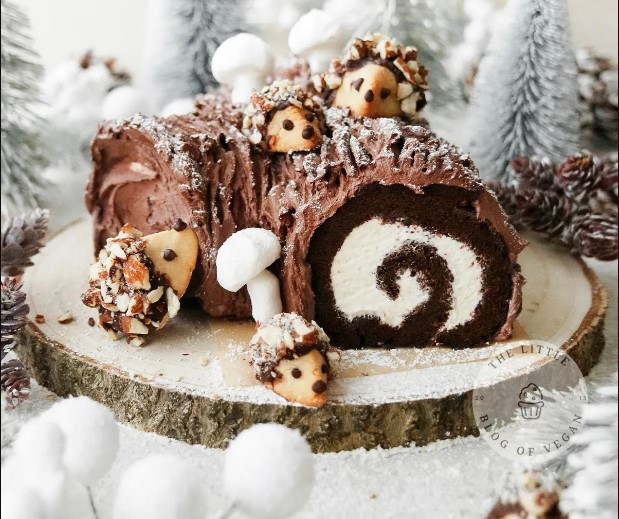

The traditional Yule Log, often called a “Bûche de Nol,” has been veganized. This delectable vegan Christmas dessert often comprises a light and fluffy chocolate sponge cake that is created without dairy or eggs. A thick and creamy vegan chocolate frosting rolls up the cake, making it look like a Yule log. 

Get the recipe: [Vegan Chocolate Yule Log](https://www.thelittleblogofvegan.com/2022/12/gluten-free-vegan-yule-log.html)

#### **8\. Fluffy cranberry orange muffins**

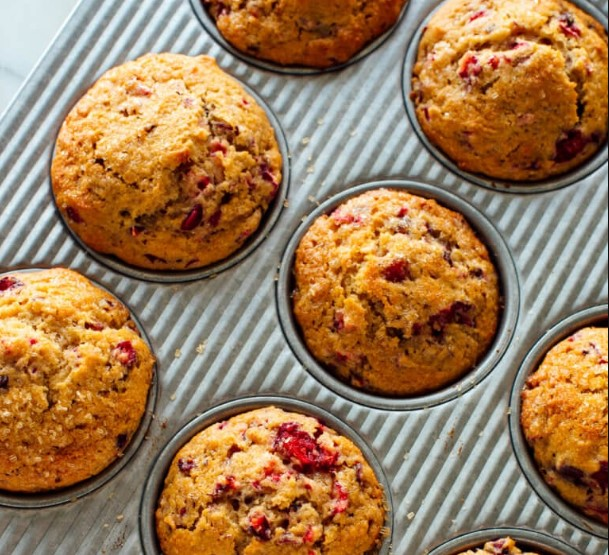

Fluffy cherry orange muffins have a delicious taste combination, making them an ideal vegan Christmas dessert. The flavor is a beautiful combination of sweet and tangy, with a delicate, airy texture reminiscent of seasonal cheer. The muffin is light and fluffy, with a soft texture that melts in your tongue. It’s not too rich, which allows the cranberry and orange tastes to stand out.

Get the recipe: [Fluffy Cranberry Orange Muffins](https://cookieandkate.com/fluffy-cranberry-orange-muffins-recipe/)

#### **9\. Vegan walnut snowball cookies**

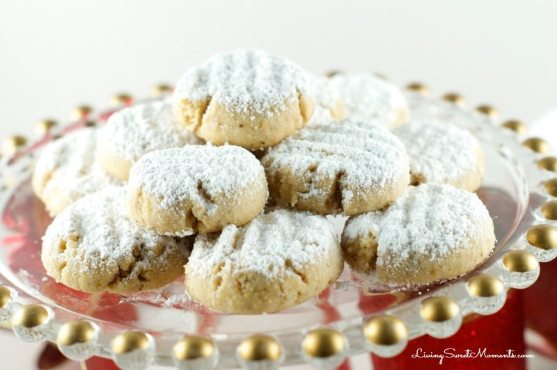

You can bring the winter to your table with these vegan walnut snowball cookies. They offer a delightful blend of nutty flavor and sugary sweetness, making them a favorite during the holidays or for sharing with friends and family year-round. Besides, these [Christmas cookies](https://avada.io/loveable/blog/christmas-cookie-recipes/) are a vegan twist on the classic Russian tea cake or Mexican wedding cookie, known for their crumbly and melt-in-your-mouth texture.

Get the recipe: [Vegan Walnut Snowball Cookies](https://livingsweetmoments.com/walnut-snowball-cookies-recipe-polvorosas/)

### **10\. Vegan tiramisu**

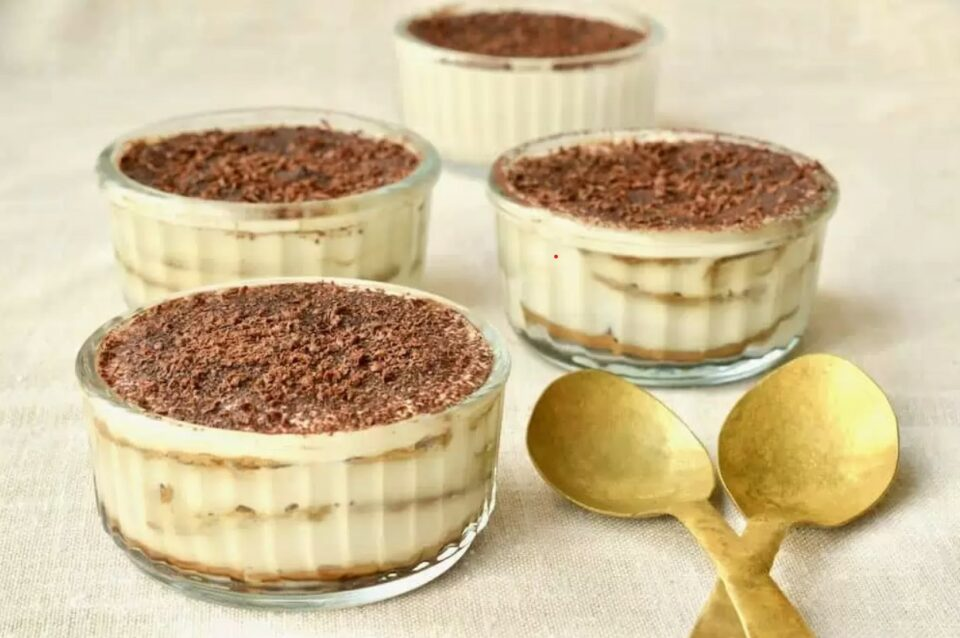

This delicious dessert has been inventively transformed to adhere to vegan nutritional guidelines, making it a delicious vegan Christmas dessert. While being totally devoid of animal components, vegan tiramisu still has the traditional dessert’s rich texture and delicious coffee flavor. 

Get the recipe: [Vegan Tiramisu](https://veganonboard.com/easy-vegan-tiramisu/)

### **11\. Vegan mince pies**

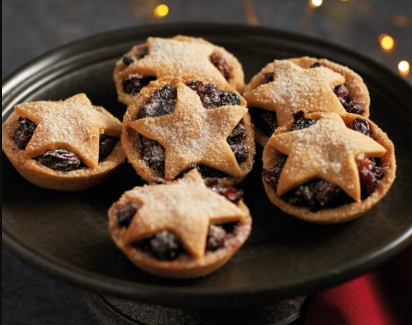

These vegan Christmas dessert star pies are often served with powdered sugar or a dollop of dairy-free cream or custard to enhance the flavor. Their fruity, spiced filling combined with the comfortable pastry produces a sensory experience that epitomizes the warmth and joy of Christmas.

Get the recipe: [Vegan Mince Pies](https://www.aldi.co.uk/vegan-mince-pies/p/000000261104100)

### **12\. Vegan apple crisp**

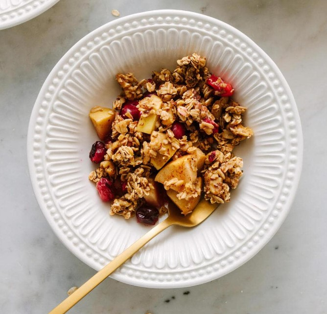

Vegan apple crisp is an easy-making Christmas dessert that adheres to a plant-based diet and is created without any components originating from animals. The traditional apple crisp recipe may be replaced with a vegan version that is compassionate and dairy-free, enabling individuals who live a vegan diet to eat this satisfying treat.

Get the recipe: [Vegan Apple Crisp](https://minimalistbaker.com/the-best-vegan-apple-crisp/) 

### **13\. Vegan chocolate cupcakes**

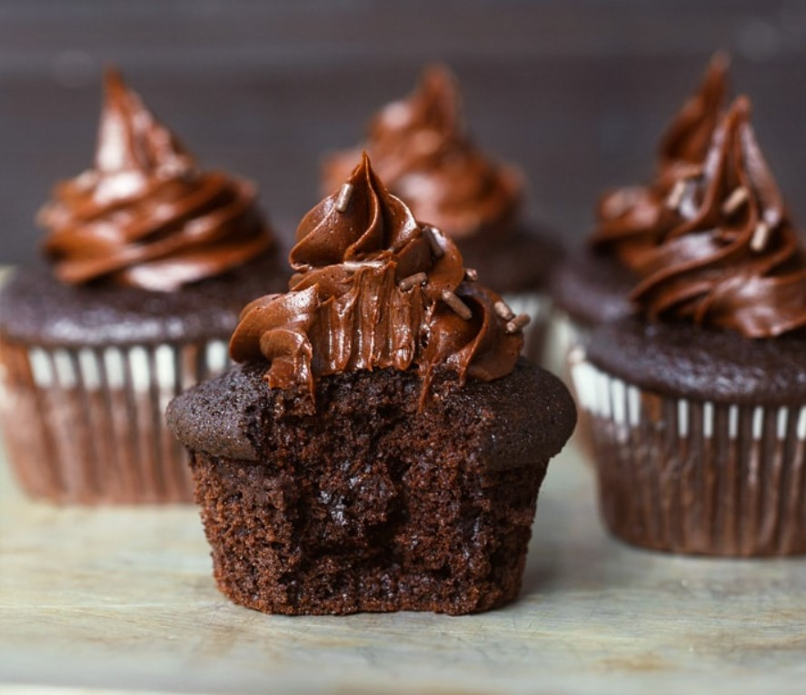

What makes vegan chocolate cupcakes great for Christmas is their potential to provide warmth and joy to the festive season. They taste like traditional, handcrafted chocolate delicacies served during holiday celebrations. The rich chocolate flavor is comforting and heartwarming, like a warm fireside embrace.

Get the recipe: [Vegan Chocolate Cupcakes](https://chocolatecoveredkatie.com/vegan-chocolate-cupcakes-recipe/)

### **14\. Vegan shortbread cookies**

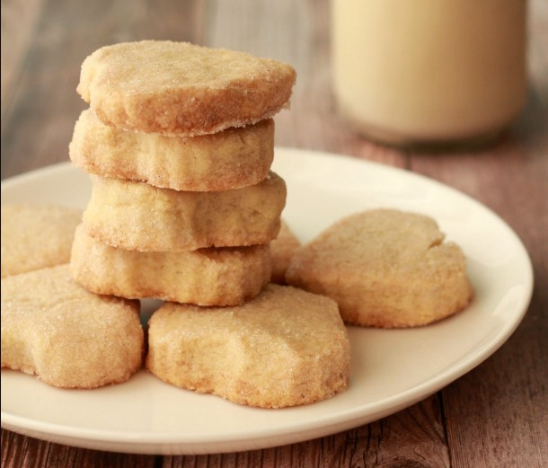

These cookies are a testament to the creativity and adaptability of vegan baking, offering a compassionate and delectable option for cookie lovers of all kinds. They have the same buttery, crumbly texture, using vegan butter or coconut oil as sweet ingredients like organic cane sugar or maple syrup. Perfect for those on a vegan diet or seeking a dairy-free holiday dessert!

Get the recipe: [Vegan Shortbread Cookies](https://lovingitvegan.com/small-batch-vegan-shortbread-cookies/)

### **15\. Vegan chocolate truffles**

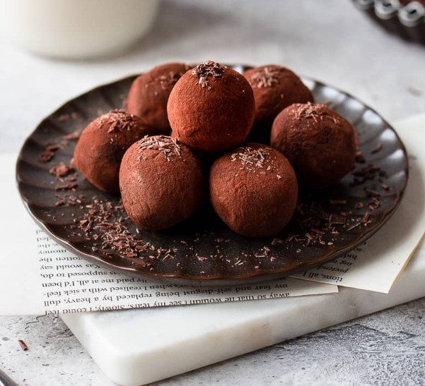

If you are a vegan who loves the rich and sweet chocolate flavor, try this vegan chocolate truffle! This vegan Christmas dessert makes you taste smooth, bittersweet chocolate that melts on your lips. These truffles are decadently soft, with a creamy and luscious texture highlighting chocolate’s deep, black flavor. 

Get the recipe: [Vegan Chocolate Truffles](https://cookingwithelo.com/vegan-chocolate-truffles/)

#### **16\. Vegan banana cinnamon rolls**

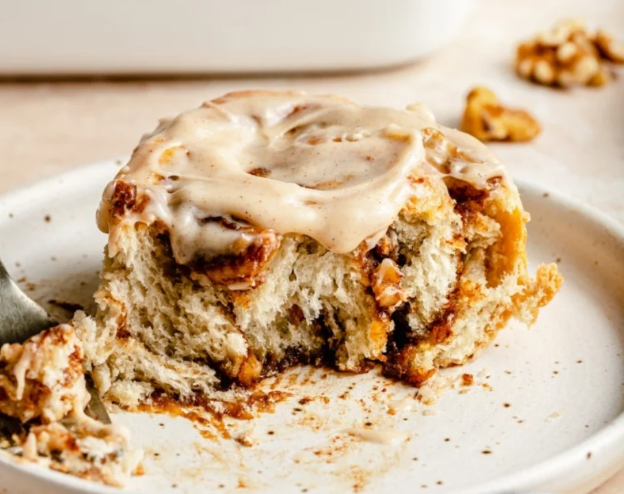

Their homey, traditional flavor makes vegan banana cinnamon rolls ideal for Christmas. Combining bananas and cinnamon creates a comforting, almost nostalgic flavor that warms the heart.

Get the recipe: [Vegan banana cinnamon rolls](https://www.ambitiouskitchen.com/vegan-banana-bread-cinnamon-rolls/)

### **17\. Vegan rice pudding**

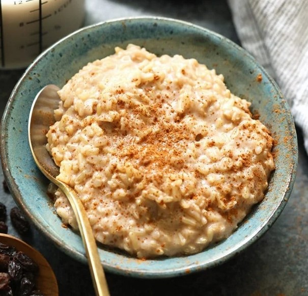

Do you think this is a dessert for Christmas? Yes, it is. A delicious dairy-free alternative to the traditional rice pudding dessert is vegan rice pudding. The dominant flavor is the gentle sweetness of rice, which comes together with a plant-based milk base to create a soothing taste.

Get the recipe: [Vegan Rice Pudding](https://fitfoodiefinds.com/healthy-rice-pudding/)

### **18\. Raspberry almond layer cake**

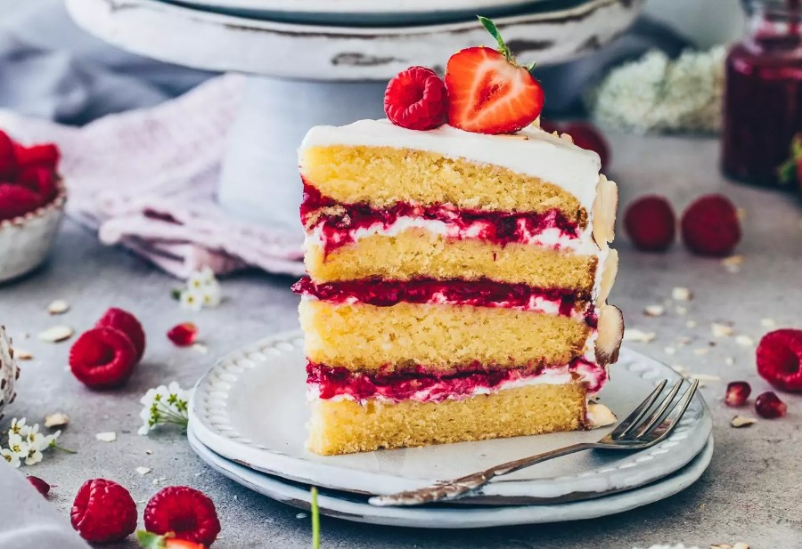

This classy cake normally has several layers of moist cake with a hint of almond taste, which are layers of raspberry jam or fresh raspberry compote. The mix of these two layers creates a well-rounded taste that’s not too sweet and not too nutty but just right. This is a creative and smart decision if you want a vegan Christmas dessert.

Get the recipe: [Raspberry Almond Layer Cake](https://biancazapatka.com/en/raspberry-almond-layer-cake/)

### **19\. Vegan hot chocolate**

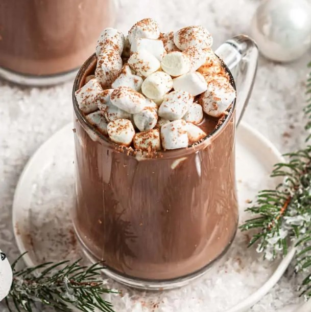

Vegan hot chocolate tastes like a silky, cocoa-infused pleasure. The chocolaty flavor is rich and soothing, like a warm, liquid embrace for your taste senses. It’s a delectable combination of bittersweet cocoa flavors surrounding your taste, producing a comfortable and delicious vegan Christmas dessert.

Get the recipe: [Vegan Hot Chocolate](https://www.simplyquinoa.com/dairy-free-hot-chocolate/)

### **20\. Vegan panna cotta**

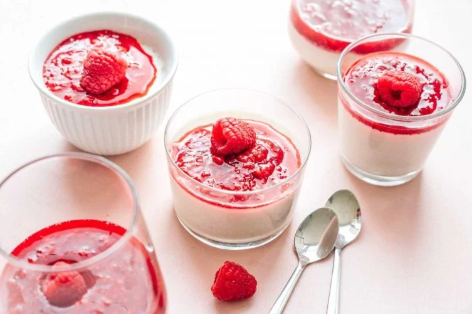

In dairy-free sweets, vegan panna cotta is a fanciful waltz of tastes and textures. This airy invention converts the spirit of classic Italian panna cotta into a plant-based beauty. It’s an enticing combination hint of sweetness and a perfect choice for someone following a vegan diet.

Get the recipe: [Vegan Panna Cotta](https://www.liveeatlearn.com/vegan-panna-cotta/)

### **21\. Vegan lemon bars**

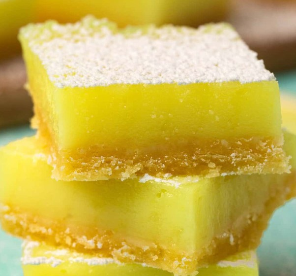

Vegan lemon bars are a delicious blast of lemony freshness. These bars are all about acidic, citrusy punch with a refreshing zing that awakens your taste receptors. The experience is fresh, vivid, and gratifying, leaving you with a need for that distinct zesty zing.

Get the recipe: [Vegan Lemon Bars](https://lovingitvegan.com/vegan-lemon-bars/)

### **22\. Vegan rocky road**

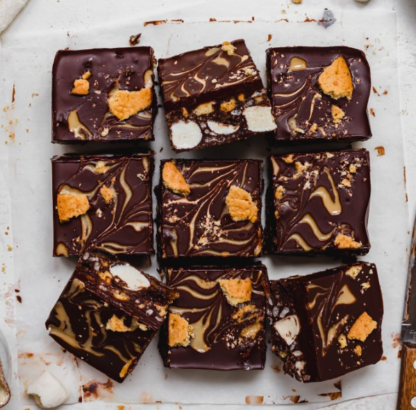

Vegan banoffee pie takes your taste senses on a delicious trip. You will consider a balanced combination of sweet and creamy tastes in which ripe bananas take center stage, providing a natural, fruity sweetness. They make a delicious contrast to the thick, velvety caramel sauce, which imparts a deep, toffee-like flavor to each bite.

Get the recipe: [Vegan Rocky Road](https://nourishingamy.com/2020/05/28/easy-vegan-rocky-road/)

### **23\. Vegan banofee pie**

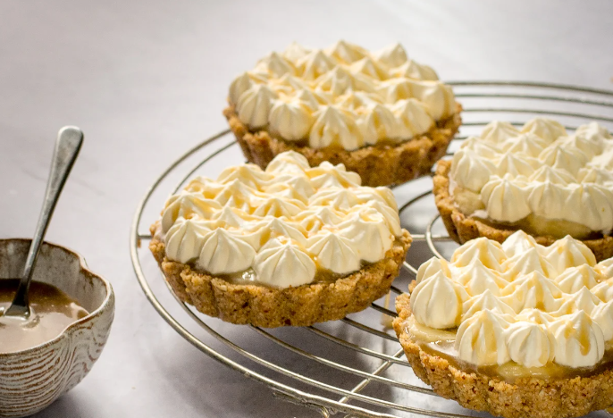

It’s a vegan Christmas dessert experience that redefines the boundaries of sweet satisfaction. Creamy, dreamy layers of banana meet velvety toffee, all nestled within a buttery, dairy-free crust. Every spoonful is a divine fusion of textures and flavors. Your guests will love your dessert a lot, though it is a vegan dessert. 

Get the recipe: [Vegan Banoffee Pie](https://www.thevegspace.co.uk/vegan-banoffee-pie/)

### **24\. Vegan skillet cookie**

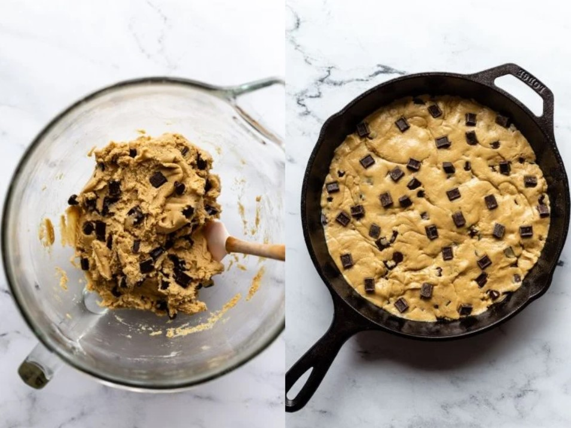

Vegan skillet cookies are frequently topped with dairy-free chocolate chips, almonds, or other inventive ingredients, which give layers of taste and texture. It’s a dessert for anyone, even vegans, to make a cozy, sweet treat after a big Christmas dinner. 

Get the recipe [Vegan Skillet Cookie](https://foodwithfeeling.com/vegan-skillet-cookie/)

### **25\. Vegan caramel apples**

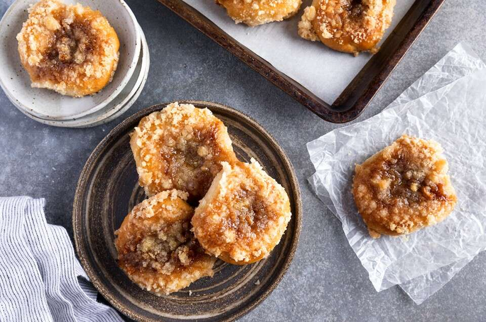

These tender, orchard-fresh apples are generously covered with a rich, dairy-free caramel that is a perfect vegan Christmas dessert for this holiday. The rich, buttery tones of vegan caramel blend flawlessly with the sweet, slightly tangy crunch of apples to create an unforgettable flavor. 

Get the recipe: [Vegan Caramel Apples](https://www.kingarthurbaking.com/recipes/vegan-caramel-apple-kolaches-recipe#317c79e1-e0b7-4949-a6a1-fd8e344ff670)

### **26\. Vegan black forest cake**

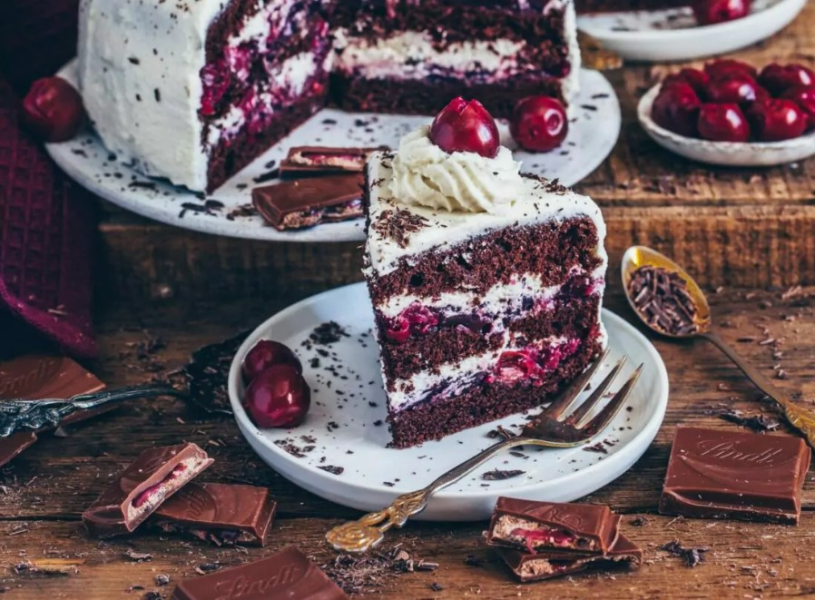

There is a wonderful and born to be for vegans, and it is called a vegan black forest. These ruby jewels complement the whipped coconut cream that envelops them superbly, producing a stunning interplay of creamy and fruity pleasures.

Get the recipe: [Vegan Black Forest Cake](https://biancazapatka.com/en/vegan-black-forest-cake/)

### **27\. Vegan coconut macaroons**

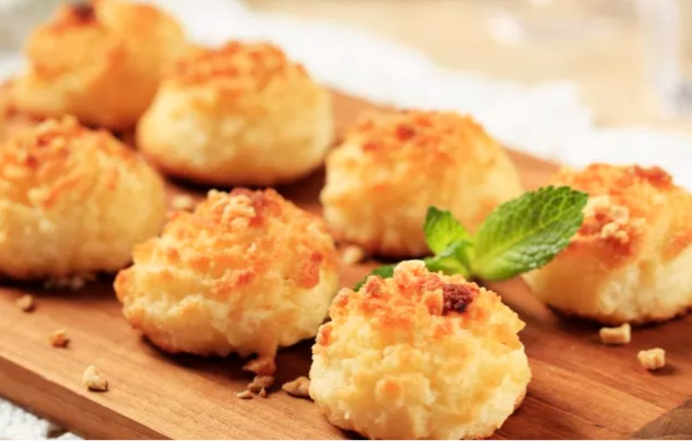

You must taste these mouthwatering vegan coconut macaroons and be whisked away to a beachside flavor paradise. The dominant flavor is the sweet and fragrant coconut, often enhanced with a hint of vanilla extract.

Get the recipe: [Vegan Coconut Macaroons](https://oureverydaylife.com/179695-vegan-coconut-macaroons.html)

### **28\. Vegan chocolate-covered strawberries**

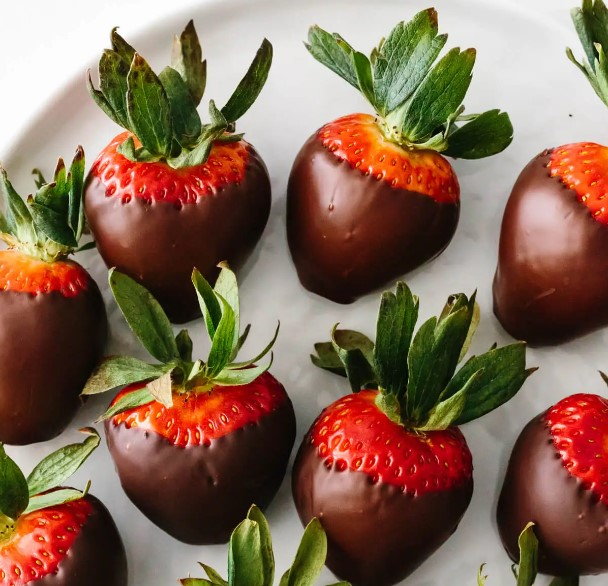

Among vegan Christmas desserts, chocolate-covered strawberries are an easy-making and tasty dessert that you can have in a short time. The natural sweetness of strawberries and the richness of chocolate create a symphony of tastes that dance in your mouth. Each bite is an exciting adventure, a delectable secret that fruit and chocolate share.

Get the recipe: [Vegan Chocolate Covered Strawberries](https://downshiftology.com/recipes/chocolate-covered-strawberries/)

### **29\. Vegan lemon pound cake**

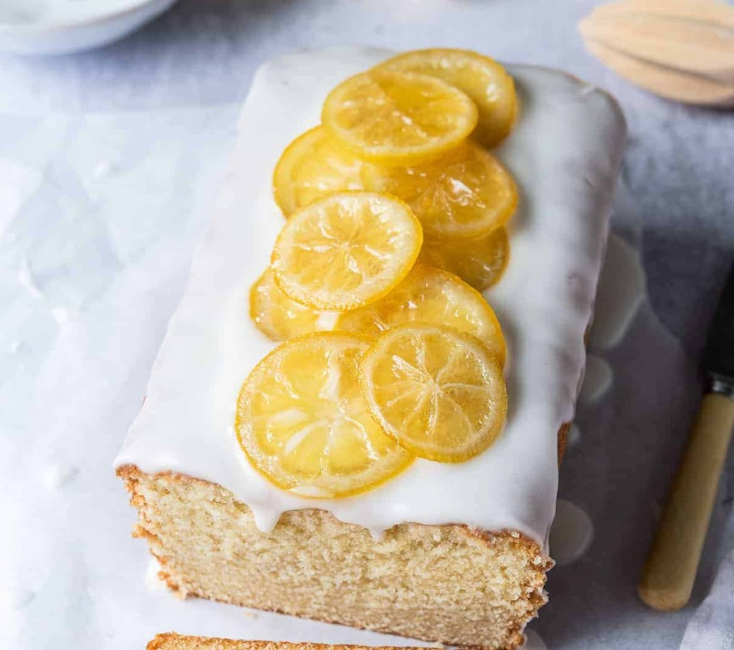

Try to make this vegan lemon pound cake – a zesty and delicious vegan Christmas dessert that reimagines the traditional pound cake without the use of animal ingredients. This delectable dessert is made with plant-based ingredients, which gives it a vibrant and zesty citrus taste.

Get the recipe: [Vegan Lemon Pound Cake](https://domesticgothess.com/blog/2020/03/17/vegan-lemon-pound-cake/)

### **30\. Vegan pumpkin donuts**

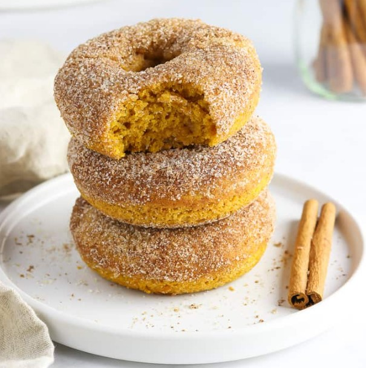

Vegan pumpkin donuts are a delicious treat that will satisfy all of your needs! The warm, soothing flavor of pumpkin spice is incorporated into these fluffy, golden rings of delight, creating a unique flavor. Each mouthful is a seamless fusion of spice and sweetness that instantly takes your taste senses to autumnal celebrations. 

Get the recipe: [Vegan Pumpkin Donuts](https://veganhuggs.com/cinnamon-sugar-pumpkin-spice-donuts/)

### **31\. Vegan pecan pralines**

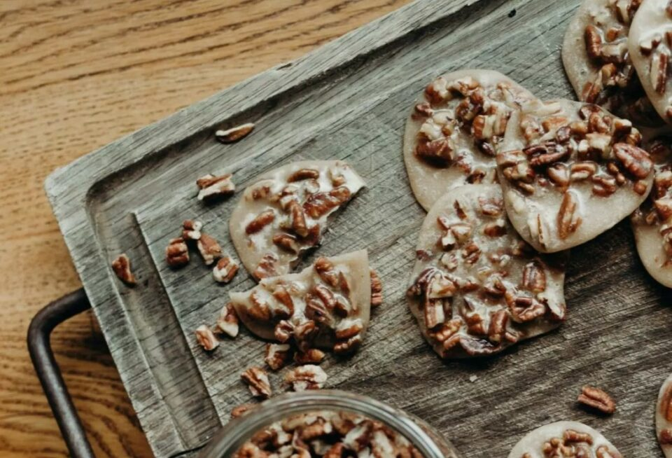

To get Southern charm, make these crunchy pecan pralines that put a humane spin on a traditional Southern favorite. These pralines are a pleasant indulgence whether you pursue a vegan diet or are simply searching for a tasty, dairy-free dessert.

Get the recipe: [Vegan Pecan Pralines](https://thelocalpalate.com/recipes/vegan-pecan-pralines/)

### **32\. Vegan chocolate mousse**

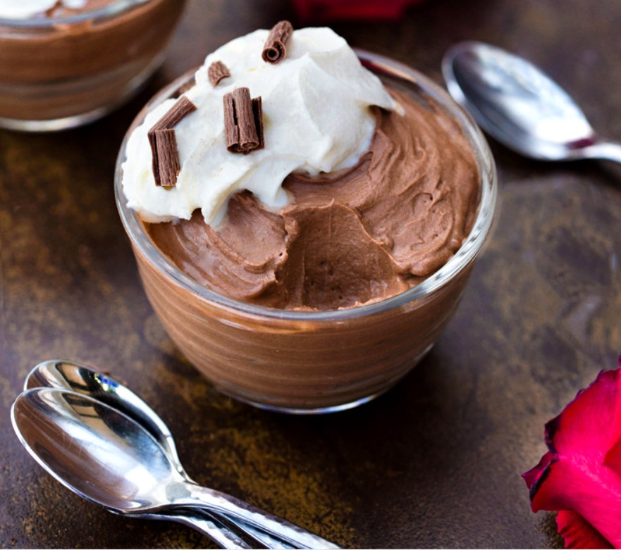

Finding a delicious vegan Christmas dessert is not difficult with this vegan chocolate mousse. It is a decadent dessert that redefines enjoyment with plant-based sophistication. When perfectly combined, it changes into a silky-smooth, velvety mousse that enchants the senses.

Get the recipe: [Vegan Chocolate Mousse](https://chocolatecoveredkatie.com/vegan-chocolate-mousse-recipe/)

### **33\. Vegan fruitcake**

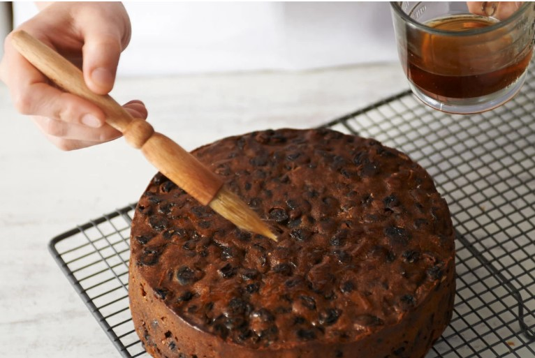

Bursting with the natural sweetness of ripe fruits like figs, apricots, and cranberries, every bite of this vegan fruit cake is a taste sensation. Moist and full of flavor, it’s the perfect treat for those who appreciate a guilt-free indulgence. Enjoy a slice today and savor the goodness of nature in every mouthful on Christmas!

Get the recipe: [Vegan Fruitcake](https://www.bbcgoodfood.com/howto/guide/how-feed-christmas-cake)

### **34\. Vegan creme brulee**

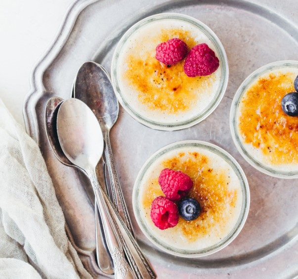

Vegan creme brulee is a plant-based rendition of the classic French dessert to eat this Christmas. You will experience the creamy, velvety texture that melts in your mouth, and savor the balance of rich vanilla flavors, all enveloped in a delicate caramelized crust. It’s a taste sensation that lingers, leaving you craving the next heavenly spoonful.

Get the recipe: [Vegan Creme Brulee](https://www.bakerita.com/vegan-creme-brulee/)

### **35\. Vegan oatmeal cookies**

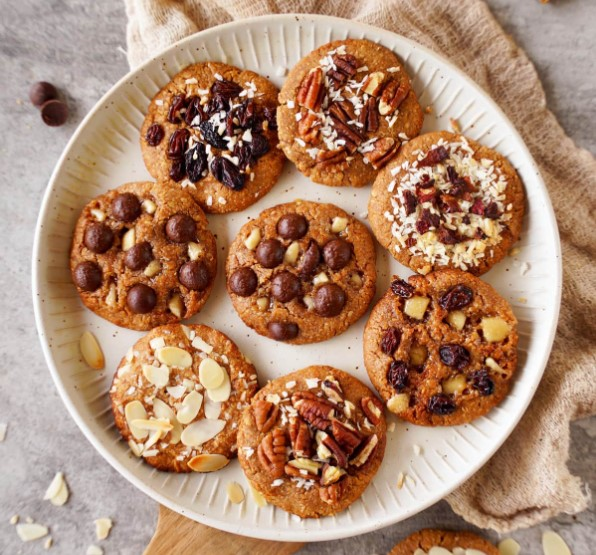

A small treat like oatmeal biscuits taste is a warm, comfortable hug – a great dessert for a Christmas treat! These scrumptious delights are proof of plant-based baking genius. Since it is for the vegan, they use vegan butter or creamy coconut oil instead of typical butter, which adds a note of luxury to each cookie.

Get the recipe: [Vegan Oatmeal Cookies](https://elavegan.com/vegan-oatmeal-cookies/)

### **36\. Chia pudding with pumpkin caramel**

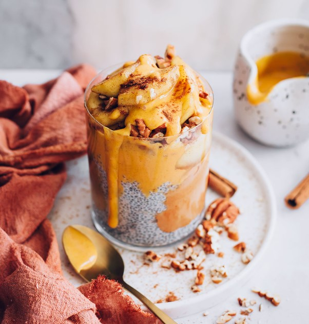

The chia pudding’s smooth, delicate texture contrasts harmoniously with the pumpkin caramel’s sweet intensity, creating a sensation that resonates deep within. It’s more than just Christmas dessert for vegans; it’s a nostalgic journey, a reminder of cherished moments, and a celebration of life’s sweet pleasures.

Get the recipe: [Chia Pudding with Pumpkin Caramel](https://helloveggie.co/vegan-chia-seed-pudding-with-pumpkin-caramel/)

### **37\. Carrot cake oatmeal bake**

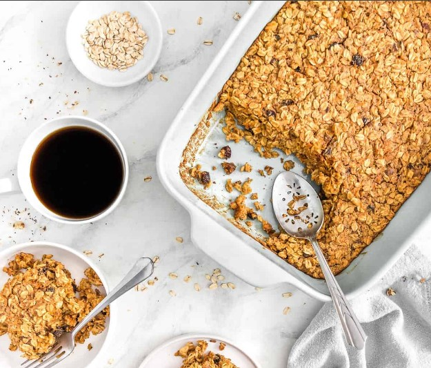

For Christmas dessert for vegans like you, try to make carrot cake oatmeal! It is a healthful dessert alternative that replicates the taste of a classic carrot cake in the form of warm oatmeal. This healthful treat blends rolled oats with grated carrots, cinnamon, and nutmeg spices and a touch of sweetness from maple syrup. 

Get the recipe: [Carrot Cake Oatmeal Bake](https://monkeyandmekitchenadventures.com/carrot-cake-oatmeal-breakfast-bake/)

### **38\. Winter citrus smoothie**

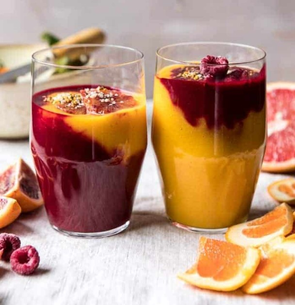

A winter citrus smoothie is a refreshing and invigorating beverage that celebrates the vibrant flavors of citrus fruits during the colder months. This fresh dessert to enjoy this Christmas is a delicious way to boost your immune system and a delightful reminder of sunny days amidst the chill of winter.

Get the recipe: [Winter Citrus Smoothie](https://www.halfbakedharvest.com/immune-boosting-winter-citrus-smoothie/)

### **39\. Vegan gingerbread latte**

Sipping a warm gingerbread latte while gathering with your loved ones or family members is a precious moment this Christmas! You will have a chance to immerse yourself in the seductive tango of spicy gingerbread blending with the rich and special espresso. Every drink is an artistic creation that serves as an invitation to a world of fine taste. 

Get the recipe: [Vegan Gingerbread Latte](https://thebananadiaries.com/vegan-gingerbread-latte/)

### **40\. Apple pie chia smoothie**

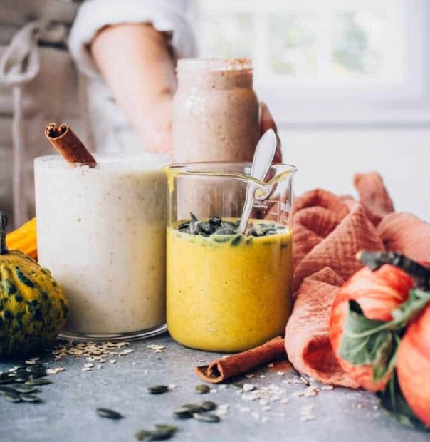

Do you want to be taken on a delicious voyage? You should taste apple pie chia smoothie, a highlight among vegan Christmas treats. Every taste is like embarking on a journey through a winter wonderland. This smoothie is a delectable fusion of familiar comfort food with a contemporary twist.

Get the recipe: [Apple Pie Chia Smoothie](https://helloglow.co/fall-smoothies/)

## **Bottom Line**

In the spirit of togetherness and compassion that defines the holiday season, these 40 **Delicious Vegan Christmas Desserts** have filled your taste buds and warmed your hearts. As we conclude this delightful journey through plant-based sweets, we’re reminded that the true essence of Christmas also lies in the joy of the act of savoring a sweet treat together.

In this blog, we’ve discovered that vegan desserts can be as decadent and soul-satisfying as their traditional counterparts. From creamy vegan eggnog cheesecakes to spiced gingerbread cookies, each recipe has been a testament to the boundless creativity and dedication of those who embrace a plant-based lifestyle.

- [40 Delicious Vegan: Christmas Desserts for a Sweet Celebration](https://avada.io/loveable/blog/vegan-christmas-desserts/#wp-block-heading-2-2) 
    - [1\. Vegan gingerbread cookies](https://avada.io/loveable/blog/vegan-christmas-desserts/#wp-block-heading-3-3)
    - [2\. Vegan pumpkin pie](https://avada.io/loveable/blog/vegan-christmas-desserts/#wp-block-heading-3-7)
    - [3\. Vegan peppermint bark](https://avada.io/loveable/blog/vegan-christmas-desserts/#wp-block-heading-3-11)
    - [4\. Vegan biscoff cheesecake](https://avada.io/loveable/blog/vegan-christmas-desserts/#wp-block-heading-3-15)
    - [5\. Vegan sugar cookies](https://avada.io/loveable/blog/vegan-christmas-desserts/#wp-block-heading-3-19)
    - [6\. Vegan pecan pie](https://avada.io/loveable/blog/vegan-christmas-desserts/#wp-block-heading-3-23)
    - [7\. Vegan chocolate yule log](https://avada.io/loveable/blog/vegan-christmas-desserts/#wp-block-heading-3-27)
        - [8\. Fluffy cranberry orange muffins](https://avada.io/loveable/blog/vegan-christmas-desserts/#wp-block-heading-4-31)
        - [9\. Vegan walnut snowball cookies](https://avada.io/loveable/blog/vegan-christmas-desserts/#wp-block-heading-4-35)
    - [10\. Vegan tiramisu](https://avada.io/loveable/blog/vegan-christmas-desserts/#wp-block-heading-3-39)
    - [11\. Vegan mince pies](https://avada.io/loveable/blog/vegan-christmas-desserts/#wp-block-heading-3-43)
    - [12\. Vegan apple crisp](https://avada.io/loveable/blog/vegan-christmas-desserts/#wp-block-heading-3-47)
    - [13\. Vegan chocolate cupcakes](https://avada.io/loveable/blog/vegan-christmas-desserts/#wp-block-heading-3-51)
    - [14\. Vegan shortbread cookies](https://avada.io/loveable/blog/vegan-christmas-desserts/#wp-block-heading-3-55)
    - [15\. Vegan chocolate truffles](https://avada.io/loveable/blog/vegan-christmas-desserts/#wp-block-heading-3-59)
        - [16\. Vegan banana cinnamon rolls](https://avada.io/loveable/blog/vegan-christmas-desserts/#wp-block-heading-4-63)
    - [17\. Vegan rice pudding](https://avada.io/loveable/blog/vegan-christmas-desserts/#wp-block-heading-3-67)
    - [18\. Raspberry almond layer cake](https://avada.io/loveable/blog/vegan-christmas-desserts/#wp-block-heading-3-71)
    - [19\. Vegan hot chocolate](https://avada.io/loveable/blog/vegan-christmas-desserts/#wp-block-heading-3-75)
    - [20\. Vegan panna cotta](https://avada.io/loveable/blog/vegan-christmas-desserts/#wp-block-heading-3-79)
    - [21\. Vegan lemon bars](https://avada.io/loveable/blog/vegan-christmas-desserts/#wp-block-heading-3-83)
    - [22\. Vegan rocky road](https://avada.io/loveable/blog/vegan-christmas-desserts/#wp-block-heading-3-87)
    - [23\. Vegan banofee pie](https://avada.io/loveable/blog/vegan-christmas-desserts/#wp-block-heading-3-91)
    - [24\. Vegan skillet cookie](https://avada.io/loveable/blog/vegan-christmas-desserts/#wp-block-heading-3-95)
    - [25\. Vegan caramel apples](https://avada.io/loveable/blog/vegan-christmas-desserts/#wp-block-heading-3-99)
    - [26\. Vegan black forest cake](https://avada.io/loveable/blog/vegan-christmas-desserts/#wp-block-heading-3-103)
    - [27\. Vegan coconut macaroons](https://avada.io/loveable/blog/vegan-christmas-desserts/#wp-block-heading-3-107)
    - [28\. Vegan chocolate-covered strawberries](https://avada.io/loveable/blog/vegan-christmas-desserts/#wp-block-heading-3-111)
    - [29\. Vegan lemon pound cake](https://avada.io/loveable/blog/vegan-christmas-desserts/#wp-block-heading-3-115)
    - [30\. Vegan pumpkin donuts](https://avada.io/loveable/blog/vegan-christmas-desserts/#wp-block-heading-3-119)
    - [31\. Vegan pecan pralines](https://avada.io/loveable/blog/vegan-christmas-desserts/#wp-block-heading-3-123)
    - [32\. Vegan chocolate mousse](https://avada.io/loveable/blog/vegan-christmas-desserts/#wp-block-heading-3-127)
    - [33\. Vegan fruitcake](https://avada.io/loveable/blog/vegan-christmas-desserts/#wp-block-heading-3-131)
    - [34\. Vegan creme brulee](https://avada.io/loveable/blog/vegan-christmas-desserts/#wp-block-heading-3-135)
    - [35\. Vegan oatmeal cookies](https://avada.io/loveable/blog/vegan-christmas-desserts/#wp-block-heading-3-139)
    - [36\. Chia pudding with pumpkin caramel](https://avada.io/loveable/blog/vegan-christmas-desserts/#wp-block-heading-3-143)
    - [37\. Carrot cake oatmeal bake](https://avada.io/loveable/blog/vegan-christmas-desserts/#wp-block-heading-3-147)
    - [38\. Winter citrus smoothie](https://avada.io/loveable/blog/vegan-christmas-desserts/#wp-block-heading-3-151)
    - [39\. Vegan gingerbread latte](https://avada.io/loveable/blog/vegan-christmas-desserts/#wp-block-heading-3-155)
    - [40\. Apple pie chia smoothie](https://avada.io/loveable/blog/vegan-christmas-desserts/#wp-block-heading-3-159)
- [Bottom Line](https://avada.io/loveable/blog/vegan-christmas-desserts/#wp-block-heading-2-163)

### [Blake Simpson](https://avada.io/loveable/author/blake/)

Hi, I'm Blake from Loveable. I help people find perfect gifts for occasions like anniversaries and weddings. I also write a blog about holidays, sharing insights to make them more meaningful. Let's create unforgettable moments together!

- [Twitter](https://twitter.com/intent/tweet)
- [Facebook](https://www.facebook.com/sharer/sharer.php)
- [instagram](https://avada.io/loveable/blog/vegan-christmas-desserts/)
- [pinterest](https://www.pinterest.com/loveablellc/)

## Related Posts

[### 120+ Christian Birthday Wishes To Spread Your Love](https://avada.io/loveable/blog/christian-birthday-wishes/) 

[

### 35 Best 70th Birthday Ideas To Celebrate The Special Milestone

](https://avada.io/loveable/blog/70th-birthday-ideas/)

[

### 50 Best 30th Birthday Decorations for a Remarkable Birthday Bash

](https://avada.io/loveable/blog/30th-birthday-decorations/)

[

### 40 Delicious Vegan Christmas Desserts to Delight Your Palate

](https://avada.io/loveable/blog/vegan-christmas-desserts/)

[

### 60 Christmas Team Building Activities to Boost Workplace Spirit

](https://avada.io/loveable/blog/christmas-team-building-activities/)
