This article has been written and researched by our expert Loveable through a precise methodology. [Learn more about our methodology](https://avada.io/loveable/our-methodological.html)

[Loveable](https://avada.io/loveable/) > [Blog](https://avada.io/loveable/blog/) > [Holiday](https://avada.io/loveable/holiday/)

# 40 DIY Halloween Costume Ideas for a Spooky Night Out in 2023

Written by [Blake Simpson](https://avada.io/loveable/author/blake/) Last Updated on October 03, 2023

- [40 Easy DIY Halloween Costume Ideas For 2023](https://avada.io/loveable/blog/diy-halloween-costume-ideas/#wp-block-heading-2-3)
    - [Rey from ‘Star Wars’ Costume](https://avada.io/loveable/blog/diy-halloween-costume-ideas/#wp-block-heading-3-4)
    - [Rosie the Riveter Costume](https://avada.io/loveable/blog/diy-halloween-costume-ideas/#wp-block-heading-3-7)
    - [Pennywise from ‘It’ DIY Halloween Costume Idea](https://avada.io/loveable/blog/diy-halloween-costume-ideas/#wp-block-heading-3-10)
    - [Scarecrow Costume](https://avada.io/loveable/blog/diy-halloween-costume-ideas/#wp-block-heading-3-13)
    - [Little Red Riding Hood Costume](https://avada.io/loveable/blog/diy-halloween-costume-ideas/#wp-block-heading-3-16)
    - [Bank Robber Costume](https://avada.io/loveable/blog/diy-halloween-costume-ideas/#wp-block-heading-3-19)
    - [Mermaid DIY Halloween Costume Idea](https://avada.io/loveable/blog/diy-halloween-costume-ideas/#wp-block-heading-3-22)
    - [Garden Gnome Costume](https://avada.io/loveable/blog/diy-halloween-costume-ideas/#wp-block-heading-3-25)
    - [Audrey Hepburn Costume](https://avada.io/loveable/blog/diy-halloween-costume-ideas/#wp-block-heading-3-28)
    - [Movie Monster Group Costume](https://avada.io/loveable/blog/diy-halloween-costume-ideas/#wp-block-heading-3-31)
    - [Cruella de Vil Costume](https://avada.io/loveable/blog/diy-halloween-costume-ideas/#wp-block-heading-3-34)
    - [Up! Movie Couple Costume](https://avada.io/loveable/blog/diy-halloween-costume-ideas/#wp-block-heading-3-37)
    - [Barbie DIY Halloween Costume Idea](https://avada.io/loveable/blog/diy-halloween-costume-ideas/#wp-block-heading-3-40)
    - [‘The Powerpuff Girls’ Costume](https://avada.io/loveable/blog/diy-halloween-costume-ideas/#wp-block-heading-3-43)
    - [Devil and Angel Costume](https://avada.io/loveable/blog/diy-halloween-costume-ideas/#wp-block-heading-3-46)
    - [Skeleton DIY Halloween Costume Idea](https://avada.io/loveable/blog/diy-halloween-costume-ideas/#wp-block-heading-3-49)
    - [Witch Costume](https://avada.io/loveable/blog/diy-halloween-costume-ideas/#wp-block-heading-3-52)
    - [Raincloud Costume](https://avada.io/loveable/blog/diy-halloween-costume-ideas/#wp-block-heading-3-55)
    - [Holy Cow Costume](https://avada.io/loveable/blog/diy-halloween-costume-ideas/#wp-block-heading-3-58)
    - [Wing-Up Doll Costume](https://avada.io/loveable/blog/diy-halloween-costume-ideas/#wp-block-heading-3-61)
    - [Bat DIY Halloween Costume Idea](https://avada.io/loveable/blog/diy-halloween-costume-ideas/#wp-block-heading-3-64)
    - [Crayon Costume](https://avada.io/loveable/blog/diy-halloween-costume-ideas/#wp-block-heading-3-67)
    - [Milkshakes DIY Halloween Costume Idea](https://avada.io/loveable/blog/diy-halloween-costume-ideas/#wp-block-heading-3-70)
    - [Popsicle Costume](https://avada.io/loveable/blog/diy-halloween-costume-ideas/#wp-block-heading-3-73)
    - [Tropical Drink and Pool Boy Costume](https://avada.io/loveable/blog/diy-halloween-costume-ideas/#wp-block-heading-3-76)
    - [Mime Costume](https://avada.io/loveable/blog/diy-halloween-costume-ideas/#wp-block-heading-3-79)
    - [Cupcake Costume](https://avada.io/loveable/blog/diy-halloween-costume-ideas/#wp-block-heading-3-82)
    - [Frankenstein’s Monster Costume](https://avada.io/loveable/blog/diy-halloween-costume-ideas/#wp-block-heading-3-85)
    - [Rapunzel Costume](https://avada.io/loveable/blog/diy-halloween-costume-ideas/#wp-block-heading-3-88)
    - [Vampire DIY Halloween Costume Idea](https://avada.io/loveable/blog/diy-halloween-costume-ideas/#wp-block-heading-3-91)
    - [Cookies and Milk Costume](https://avada.io/loveable/blog/diy-halloween-costume-ideas/#wp-block-heading-3-94)
    - [Wednesday Addams Costume](https://avada.io/loveable/blog/diy-halloween-costume-ideas/#wp-block-heading-3-97)
    - [Mummy DIY Halloween Costume Idea](https://avada.io/loveable/blog/diy-halloween-costume-ideas/#wp-block-heading-3-100)
    - [Snow White Costume](https://avada.io/loveable/blog/diy-halloween-costume-ideas/#wp-block-heading-3-103)
    - [White Rabbit from Alice in Wonderland](https://avada.io/loveable/blog/diy-halloween-costume-ideas/#wp-block-heading-3-106)
    - [Lucy and Ethel Costume](https://avada.io/loveable/blog/diy-halloween-costume-ideas/#wp-block-heading-3-109)
    - [Queen of Hearts DIY Halloween Costume Idea](https://avada.io/loveable/blog/diy-halloween-costume-ideas/#wp-block-heading-3-112)
    - [Picnic Costume](https://avada.io/loveable/blog/diy-halloween-costume-ideas/#wp-block-heading-3-115)
    - [Operation Costume](https://avada.io/loveable/blog/diy-halloween-costume-ideas/#wp-block-heading-3-118)
- [Bottom Line](https://avada.io/loveable/blog/diy-halloween-costume-ideas/#wp-block-heading-2-122)

With Halloween just around the corner, it can be hard to find the perfect costume in time. We may intend to plan ahead, but all too often life gets in the way, and we are at a loss for ideas when it comes down to the wire. This is why it is important to come up with some DIY Halloween costume ideas using normal clothes from your closet. With minimal effort and no added expense, you can still pull off a unique look that will [impress your friends](https://avada.io/loveable/handmade-gift-best-friend/) and family.

This year, don’t let being caught unprepared keep you from joining in on the fun. We’ve scoured the Internet for a list of **40 easy DIY Halloween costume ideas** for you to get creative using items you already have in your home. So grab your tools and start creating your eye-catching costumes with ease!

## **40 Easy DIY Halloween Costume Ideas For 2023**

### [Rey from ‘Star Wars’ Costume](https://www.amazon.com/Expandable-Warriors-Christmas-Halloween-Birthday/dp/B0BQQV1YVM/ref=sr_1_6?keywords=light%2Bup%2Bsaber%2Bfor%2Bkids%2Bled%2Bfx%2Blight%2Bsword&qid=1689840042&sr=8-6&th=1)

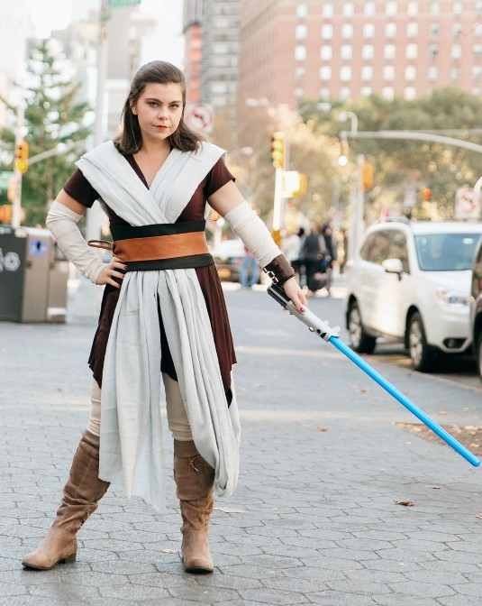

If you are a [fan of Star Wars](https://avada.io/loveable/star-wars-gifts-him/) movies, you too can dress up as Rey and lead the resistance against any uncanny ghouls this Halloween. This outfit involves only a bit of white cloth to create makeshift armbands, a brown tunic, a lightsaber, and a pair of riding boots. Finally, a brown belt binds everything together. You could even create a replica of BB-8 if you wanted!

### [Rosie the Riveter Costume](https://www.amazon.com/Headbands-Retro-Paisley-Headband-Headwrap/dp/B07WWVCTCH/ref=sr_1_1_sspa?crid=3OTFG8KJIMGFP&keywords=rosie+the+riveter+signature+red+bandana&qid=1689839943&sprefix=rosie+the+riverter+signature+red+bandana%2Caps%2C288&sr=8-1-spons&sp_csd=d2lkZ2V0TmFtZT1zcF9hdGY&psc=1)

In World War II, Rosie the Riveter played a vital role in recruiting female workers, and her signature red bandana still makes her instantly recognizable today.

### [Pennywise from ‘It’ DIY Halloween Costume Idea](https://www.amazon.com/Rubies-Womens-Deluxe-Pennywise-Costume/dp/B07NWMZ15W/ref=sr_1_5?crid=18C20EBMOLPAG&keywords=Pennywise+Costume&qid=1689839832&sprefix=%2Caps%2C465&sr=8-5)

Pennywise from ‘It’ will surely frighten anyone who fears clowns. A white dress, a red balloon, and orange hair are needed for this shapeshifting monster. Randomly begin dancing the Macarena to get in character.

### [Scarecrow Costume](https://www.amazon.com/luvamia-Adjustable-Overalls-Fashion-Jumpsuits/dp/B08CKV5NSY/ref=sr_1_1_sspa?keywords=luvamia+Women%27s+Casual+Stretch+Adjustable+Denim+Bib+Overalls+Jeans+Pants+Jumpsuits&qid=1689840137&sr=8-1-spons&sp_csd=d2lkZ2V0TmFtZT1zcF9hdGY&psc=1)

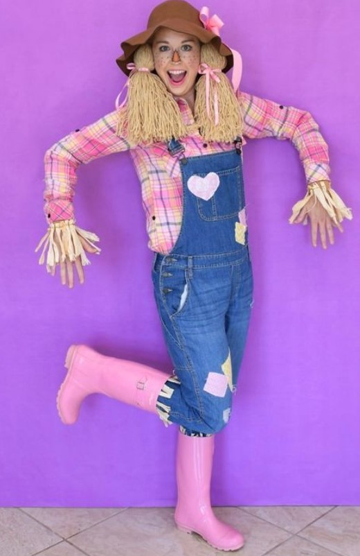

Lauren Akins, Thomas Rhett’s wife, makes an adorable scarecrow. There’s no need to go shopping for this one. You might even have everything you need stored in your closet. Style yourself in a plaid shirt and straw hat. Add braids and freckles to complete the look.

### [Little Red Riding Hood Costume](https://www.amazon.com/s?k=red+riding+hood+cape&sprefix=red+riding+h%2Caps%2C470&ref=nb_sb_ss_ts-doa-p_1_12)

No Halloween is complete without a Little Red Riding Hood costume. It is super easy to find the items for this DIY Halloween costume idea. All you need is an affordable red hooded cape or poncho, a white blouse, and a basket of goodies to complete the look. To make sure everyone in your family is included in the festivities, let your four-legged friend join in with a DIY Big Bad Wolf costume crafted from a sweater, granny glasses, and wig. [Have fun this Halloween](https://avada.io/loveable/funny-halloween-costumes/)!

### [Bank Robber Costume](https://www.amazon.com/Tigerdoe-Robber-Costume-Bandit-Burglar/dp/B0722XNTLJ/ref=sr_1_7?keywords=Bank+Robber+Costume&qid=1689840282&sr=8-7)

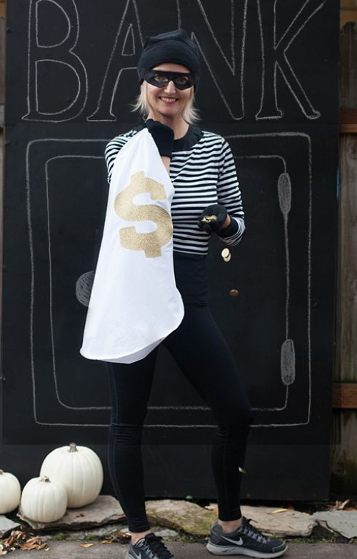

You likely have a black-and-white striped shirt and black leggings. Add a snazzy dollar sign to a white laundry bag and a little black mask to complete this bandit costume.

### [Mermaid DIY Halloween Costume Idea](https://www.amazon.com/Earfodo-Short-Curly-Wavy-Shoulder-Resistant-Synthetic/dp/B08PP4LH35/ref=sr_1_1?keywords=Earfodo+Light+Pink+Wig+For+Women+Short+Curly+Wavy+Bob+Wig+14+Inch+Shoulder+Length+Middle+Part+Short+Pink+Wig+Heat+Resistant+Synthetic+Party+Costume+Cosplay+Wig+For+Girls+W&qid=1689839750&s=beauty&sr=1-1)

Be creative and channel your inner mermaid with this [easy DIY Halloween costume idea](https://avada.io/loveable/blog/easy-halloween-costumes/)! All you need is a long-sleeve green shirt and an apron, both of which can easily be found at home. For the fin, just fold some cupcake liners in half and attach them to the bottom of the apron using hot glue, alternating colors to fill the width. Keep layering until you have completely covered the apron, then top it off with a colorful wig, and you are ready for an underwater adventure!

### [Garden Gnome Costume](https://www.amazon.com/Tigerdoe-Dwarf-Hats-Christmas-Seven/dp/B07885G1Y5/ref=sxin_16_pa_sp_search_thematic_sspa?content-id=amzn1.sym.1c86ab1a-a73c-4131-85f1-15bd92ae152d%3Aamzn1.sym.1c86ab1a-a73c-4131-85f1-15bd92ae152d&cv_ct_cx=gnome+costume&keywords=gnome+costume&pd_rd_i=B07885G1Y5&pd_rd_r=983c066a-2af5-4c57-8fa3-db64504c8b07&pd_rd_w=xx91E&pd_rd_wg=VMUWT&pf_rd_p=1c86ab1a-a73c-4131-85f1-15bd92ae152d&pf_rd_r=VT3RZRKYARAFENC0YXH5&qid=1689840333&sbo=RZvfv%2F%2FHxDF%2BO5021pAnSA%3D%3D&sprefix=gnome%2Caps%2C391&sr=1-1-364cf978-ce2a-480a-9bb0-bdb96faa0f61-spons&sp_csd=d2lkZ2V0TmFtZT1zcF9zZWFyY2hfdGhlbWF0aWM&psc=1)

Doesn’t this costume look adorable and easy to put on as a couple? If you are looking for some DIY [Halloween couple costume ideas](https://avada.io/loveable/couples-halloween-costumes/) for the garden theme, this is the one for you.

### [Audrey Hepburn Costume](https://www.amazon.com/Hepburn-Golightly-Breakfast-Tiffanys-Accessory/dp/B075STGF6X/ref=sr_1_1?crid=PZC1WG9Q12GP&keywords=Zivyes+Audrey+Hepburn+Holly+Golightly+Breakfast+at+Tiffanys+Costume+Accessory+Necklace+Gloves+Holder&qid=1689839708&sprefix=zivyes+audrey+hepburn+holly+golightly+breakfast+at+tiffanys+costume+accessory+necklace+gloves+holder%2Caps%2C317&sr=8-1)

Nothing says iconic style quite like Audrey Hepburn’s classic little black dress. And luckily for us, it’s never been easier to recreate her timeless look. Owning a basic black dress is the perfect start – then simply accessorize with faux pearls, elbow-length gloves, oversized sunglasses, and top off your French Twist with a mini tiara. To really nail the outfit, try to carry a croissant around with you for at least 10 minutes! Whether you rock this classic costume on Halloween or just for fun, you’ll be sure to look stunning in vintage-inspired glamour and get plenty of compliments in no time.

### [Movie Monster Group Costume](https://www.amazon.com/Sinpiling-Shoulder-Renaissance-Medieval-Halloween/dp/B09H7N1SSB/ref=sr_1_3?crid=246VDZ6WHIQYL&keywords=halloween+white+dress&qid=1689840463&sprefix=halloween+white+dress+%2Caps%2C346&sr=8-3)

A Hollywood movie monster group costume is sure to spook your neighbors. The creepy set includes Mom and Dad dressed as Frankenstein’s monster and his bride while the kids play Count Dracula, the Creature from the Black Lagoon, a fanged vampire, and a mummy.

### [Cruella de Vil Costume](https://www.amazon.com/Plus-Womens-Deluxe-Cruella-Costume/dp/B09JZV1SBS/ref=sr_1_3?crid=RHSSS21VVMLZ&keywords=cruella%2Bde%2Bvil%2Bfur%2Bcoat&qid=1689840487&sprefix=Cruella%2Bde%2BVil%2Bfur%2Caps%2C627&sr=8-3&th=1)

This Halloween, channel your inner Disney villain by dressing as Cruella. If you’re short on time, you can use black pieces from your closet, buy her signature black and white wig, and DIY a last-minute cane.

### [Up! Movie Couple Costume](https://www.amazon.com/Backdrop-Decoration-Birthday-Bachelorette-MULTICOLOR/dp/B0B56M1ZJR/ref=sr_1_7_sspa?crid=4UNZ6NA5BXIU&keywords=up%2Bmovie&qid=1689840635&sprefix=up%2Bmovie%2Caps%2C357&sr=8-7-spons&sp_csd=d2lkZ2V0TmFtZT1zcF9tdGY&th=1)

Disney’s Up was an instant animated classic when it was released. The heartwarming story makes for an excellent couple’s costume as well. Get ready for a wild adventure by crafting the “balloon house” and bringing along your version of Carl Fredricksen!

### [Barbie DIY Halloween Costume Idea](https://www.amazon.com/Womens-Stretchy-Unitard-Costume-Turquoise/dp/B08GGX29P2/ref=sr_1_2?keywords=Stretch+Is+Comfort+Women%27s+Turquoise+Metallic+Unitard+Doll+Costume+Small&qid=1689840679&sr=8-2)

Come on Barbie, let’s go party – this October! You can recreate this workout Barbie look by wearing blue leggings and a blue shirt. You can also order the blue one-piece quickly! Don’t forget to accessorize the outfit with anything pink!

### [‘The Powerpuff Girls’ Costume](https://www.amazon.com/Waisted-Rise-Ladies-Colored-Stretch-Distressed/dp/B07FRX2WDV/ref=sr_1_1_sspa?crid=3GL5I3829YM6M&keywords=colorful+skinny+trousers&qid=1689840769&sprefix=colorfuskinny+trousers%2Caps%2C408&sr=8-1-spons&sp_csd=d2lkZ2V0TmFtZT1zcF9hdGY&psc=1)

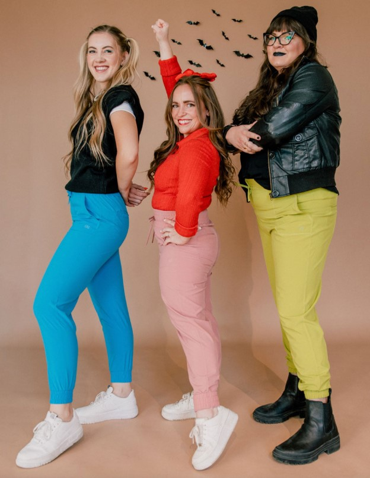

There is certainly sugar, spice, and everything nice about these costumes! If you have any blue, pink, or green clothes in your closet, you can easily recreate Blossom, Bubbles, and Buttercup.

### [Devil and Angel Costume](https://www.amazon.com/Cheerin-Accessory-Accessories-Halloween-Christmas/dp/B08BRGD2TR/ref=sxin_16_pa_sp_search_thematic_sspa?content-id=amzn1.sym.1c86ab1a-a73c-4131-85f1-15bd92ae152d%3Aamzn1.sym.1c86ab1a-a73c-4131-85f1-15bd92ae152d&crid=3HPXWSSIVMEOU&cv_ct_cx=halo+hat&keywords=halo+hat&pd_rd_i=B08BRGD2TR&pd_rd_r=ed15b2cc-e15f-4904-a30f-a50d95e66908&pd_rd_w=ltIDQ&pd_rd_wg=fsAcE&pf_rd_p=1c86ab1a-a73c-4131-85f1-15bd92ae152d&pf_rd_r=X3BZBJVJ9RH95AWVQ7NV&qid=1689840809&sbo=RZvfv%2F%2FHxDF%2BO5021pAnSA%3D%3D&sprefix=halo+hat%2Caps%2C313&sr=1-4-364cf978-ce2a-480a-9bb0-bdb96faa0f61-spons&sp_csd=d2lkZ2V0TmFtZT1zcF9zZWFyY2hfdGhlbWF0aWM&psc=1)

Classic, but still adorable! For this DIY Halloween costume idea, you can wear anything red and white. For even more festive fun, flexibly add a halo, wings, horns, and a pitchfork.

### [Skeleton DIY Halloween Costume Idea](https://www.amazon.com/Woman-Within-Length-Fleece-Sweatsuit/dp/B018W8OBEM/ref=sr_1_6?crid=1WIEEHNB9NWYE&keywords=black+fit+sweat+suit&qid=1689840890&sprefix=black+fitsweat+suit%2Caps%2C294&sr=8-6)

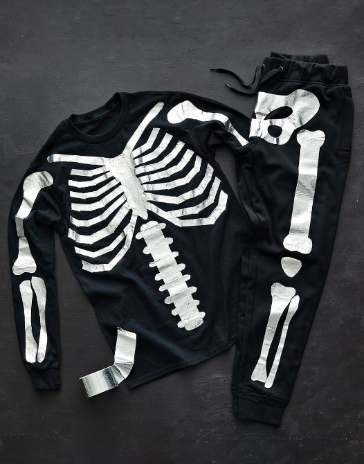

It’s time to get comfy this Halloween! Grab a long-sleeve black shirt and some black sweatpants, then cut or tear a piece of duct tape the length of a bone. Place it on your clothing items and draw the bone shape on top. Peel off the tape and place it flat onto your cutting mat, then use an X-Acto knife to cut out the bone shape. When you’re done, re-stick them back onto your clothing for a cozy Halloween look.

### [Witch Costume](https://www.amazon.com/Halloween-See-through-Foldable-Accessories-Lace-Wine/dp/B09B1QF8Z2/ref=sr_1_1_sspa?crid=2ZBZJKOGQJMCJ&keywords=Witch+hat&qid=1689840923&sprefix=witch+ha%2Caps%2C550&sr=8-1-spons&sp_csd=d2lkZ2V0TmFtZT1zcF9hdGY&psc=1)

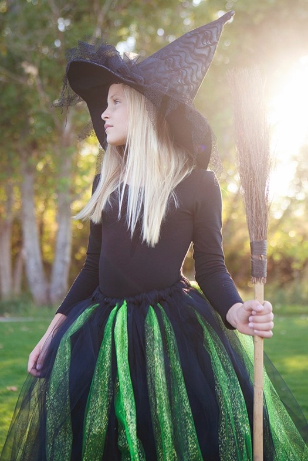

The moment we saw this costume, we were enchanted! Just use black clothes as your base and DIY a tulle skirt in any festive Halloween colors that you want. You can also buy a witch hat in-store or make one yourself if you are crafty. Now you know what magic is!

### [Raincloud Costume](https://www.walmart.com/ip/Hyde-EEK-Boutique-LED-Rainbow-Soft-Brights-Dog-and-Cat-Costume-Medium/2415743579?from=/search)

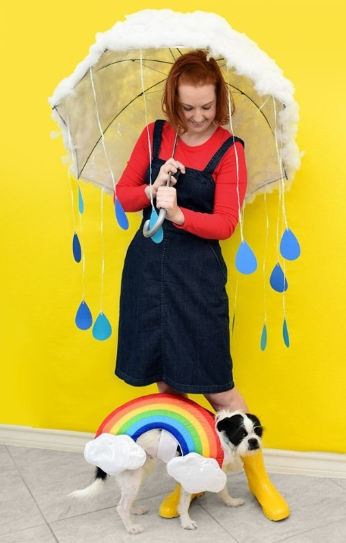

You only need a clear umbrella, blue card stock, Polyfil, and translucent ribbon to make this raincloud costume. The adorable dog rainbow costume is also perfect for pet moms.

### [Holy Cow Costume](https://www.amazon.com/Feather-Elastic-Halloween-Costume-Cosplay/dp/B07WBWB14L/ref=sr_1_5?crid=2RGYNTS12YJ51&keywords=feather+wings&qid=1689840957&sprefix=eather+wings%2Caps%2C323&sr=8-5)

For a fun and punny Halloween look this year, why not use your old college costume to create a holy cow? Start with a plain white T-shirt – use black paint pens to add some cow spots. Then grab those dusty feather wings and halo from your closet, put them on, and finish off the look with a store-bought cow headband. In no time at all, you can have the perfect PG costume that’s sure to get a chuckle out of everyone!

### [Wing-Up Doll Costume](https://www.amazon.com/Grosgrain-Toddler-Accessories-Alligator-Toddlers/dp/B0BRC5GF19/ref=sr_1_6?crid=EAC3WX8R0772&keywords=hairbows+for+girls+6-8&qid=1689840996&sprefix=hairbow%2Caps%2C306&sr=8-6)

A wing-up doll can be a great DIY Halloween costume idea for your little one. By using cardboard, spray paint, elastic, and glue, you can turn your tot into a darling vintage wind-up doll. Finish off the look with a larger-than-life hairbow!

### [Bat DIY Halloween Costume Idea](https://www.amazon.com/Gildan-Fleece-Sweatshirt-G18500-X-Large/dp/B01B9K2JB2/ref=sr_1_1_sspa?crid=3TEZBVYFU27B9&keywords=black+hoodie&qid=1689841047&sprefix=black+hoodi%2Caps%2C355&sr=8-1-spons&sp_csd=d2lkZ2V0TmFtZT1zcF9hdGY&psc=1)

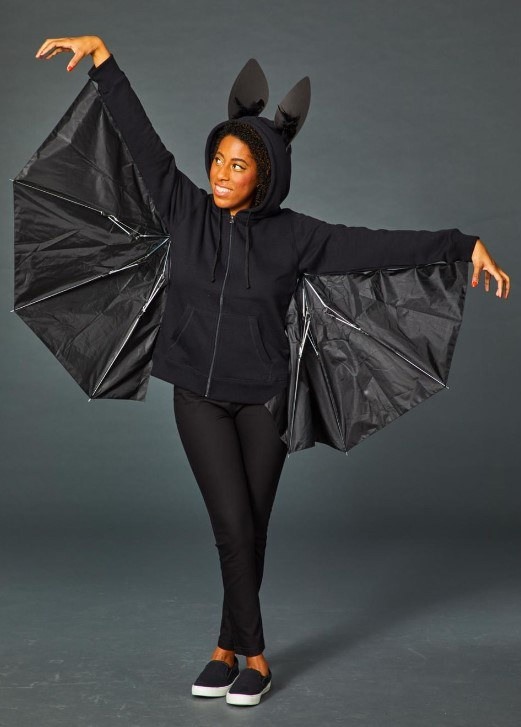

This Halloween costume has never been easier to pull off! All you need is a broken umbrella and a black hoodie. To make it, simply cut the umbrella in half and affix it to the arms of the hoodie using black safety pins or hot glue. Secure the hinges with black electrical tape so they can fold properly. Finally, create animal-like ears from foam core and feathers to give your costume some added texture and dimension for an extra spooky look!

### [Crayon Costume](https://www.amazon.com/LAPASA-Basics-Non-Allergenic-Cotton-T-Shirts/dp/B075YV4SPS/ref=sr_1_3?crid=BSRAD36495BP&keywords=colorful+plain+t+shirt+kids&qid=1689841133&sprefix=colorful+plaint+shirt+kids%2Caps%2C319&sr=8-3)

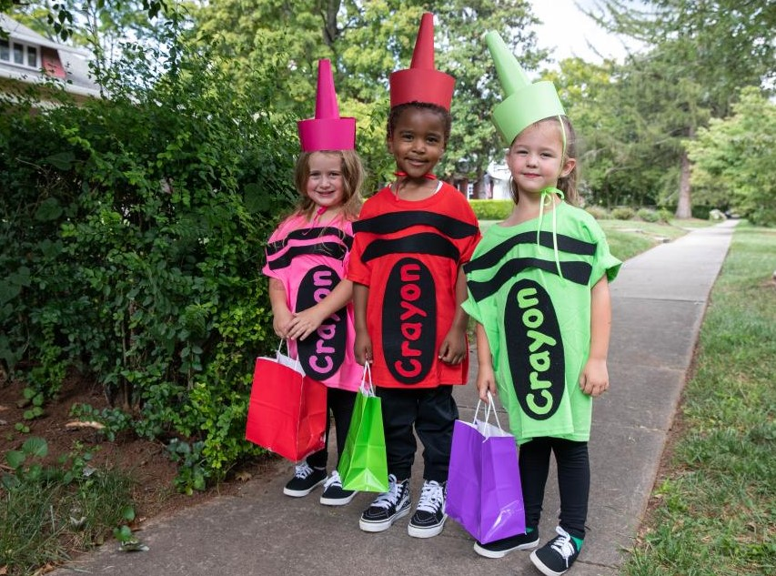

There’s no reason last-minute costumes have to be lackluster, friend. Make your child (or yourself) look like the cutesy crayon in the box with a T-shirt, black cardstock, and a hot glue gun.

### [Milkshakes DIY Halloween Costume Idea](https://www.amazon.com/Dress-Population-Womens-Catalina-Sleeveless/dp/B079KCTN1D/ref=sr_1_5?crid=8K9L406F6G7Q&keywords=pastel+no+sleeves+dress&qid=1689842358&sprefix=pastel+no+slevesdress%2Caps%2C302&sr=8-5)

For this DIY Halloween costume idea, you will need an ice cream-colored dress. Then get creative and DIY a cherry and whipped cream-colored hat to match your dress color.

### [Popsicle Costume](https://www.amazon.com/acrylic-paint-set-craft-paint-kit/dp/B01EVJ8Q0Q/ref=sr_1_2_sspa?crid=3HXI6XHEDC6NS&keywords=acrylic+paint&qid=1689841290&sprefix=acrylic+paint%2Caps%2C575&sr=8-2-spons&sp_csd=d2lkZ2V0TmFtZT1zcF9hdGY&psc=1)

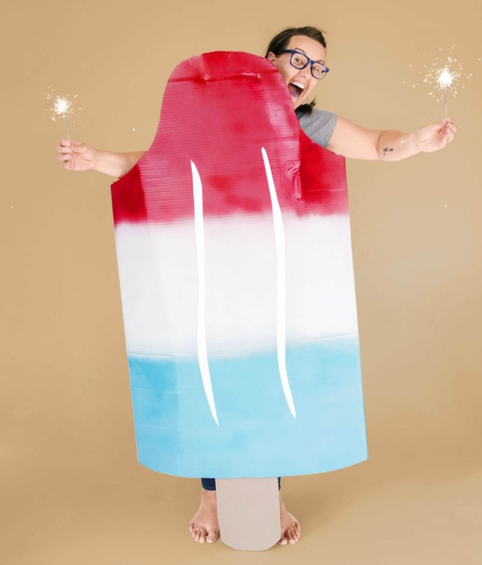

A sweet (and easy) summer costume, this one calls for large pieces of cardboard, red, white, and blue spray paint, and white acrylic paint. (Sparklers, too if you want!)

### [Tropical Drink and Pool Boy Costume](https://www.amazon.com/Kanu-Surf-Plus-Size-Printed-Workout/dp/B0799DF7LG/ref=sr_1_6?crid=1EHUDRDS5M2VS&keywords=tropical+short&qid=1689841339&sprefix=tropical+sho%2Caps%2C316&sr=8-6)

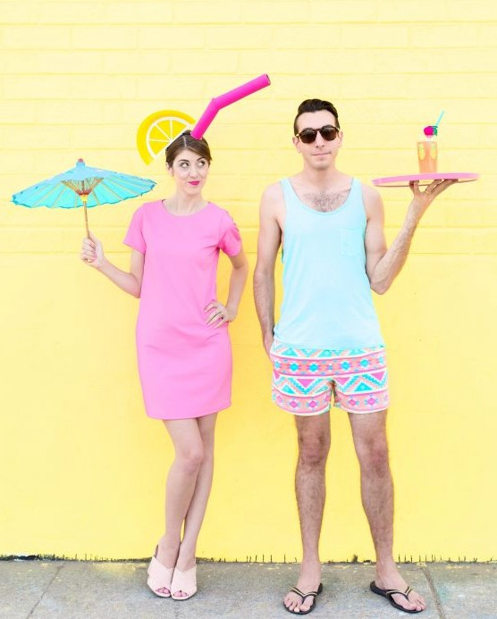

Trying to find the perfect couple’s costume? Get your partner to dress as a pool boy to match your tropical drink look. With paper plates, cardstock, and hot pink paint, you can easily DIY your unique straw hat.

### [Mime Costume](https://www.amazon.com/SOJOS-Vintage-Square-Scarfs-Neckerchief/dp/B07P32CZDC/ref=sr_1_5?keywords=polka+dot+bandana&qid=1689841405&sprefix=polka+dot+band%2Caps%2C303&sr=8-5)

The mime is a classic [easy Halloween costume](https://avada.io/loveable/easy-halloween-costumes/) for a reason: It’s easy to make! Plus, the clothing and bandana can be worn long after the holiday has passed.

### [Cupcake Costume](https://www.amazon.com/Birthday-Wedding-Decorations-Christmas-Supplies/dp/B09LVDG9LR/ref=sr_1_5?crid=3NOHVQ6UGZQG3&keywords=layer%2Bof%2Btulle&qid=1689841445&sprefix=layer%2Bof%2Btul%2Caps%2C365&sr=8-5&th=1)

Who’s up for cupcakes? It’s a cheerful yellow costume made from layers of tulle and cardboard cupcake liners. In other words, it’s the cherry on top!

### [Frankenstein’s Monster Costume](https://www.amazon.com/Dickies-Womens-Sleeve-Cotton-Coverall/dp/B07S6XJPGZ/ref=sr_1_16?crid=2CVAH86DMY1MR&keywords=green+mechanic+overall&qid=1689841889&sprefix=green+machanic+overal%2Caps%2C302&sr=8-16)

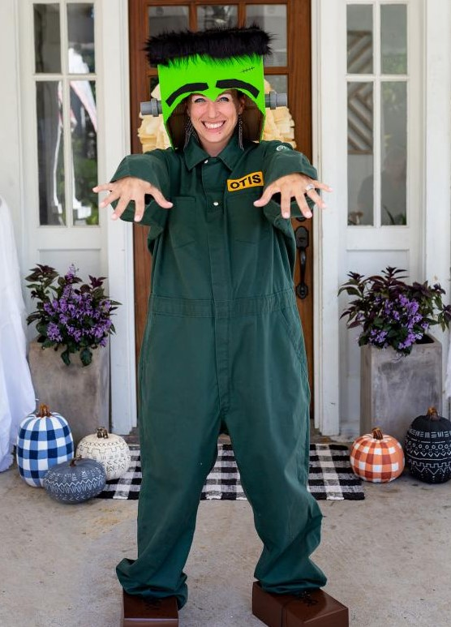

Use items you’d normally throw away to make this spooky-cute DIY Halloween costume idea. This iconic literary monster can be crafted with cardboard boxes, empty tissue boxes, fabric softener bottle caps, and other basic craft supplies.

### [Rapunzel Costume](https://www.amazon.com/Red-Heart-Super-Bright-Yellow/dp/B09W1K6B84/ref=sr_1_2?crid=3F6Q5AY9O2RJ0&keywords=yellow+yarn&qid=1689841669&sprefix=yellow+yarn%2Caps%2C302&sr=8-2)

There’s no need to have long golden locks for your Rapunzel costume this Halloween. Just a few skeins of yellow yarn will do the trick!

### [Vampire DIY Halloween Costume Idea](https://www.amazon.com/VGLOOK-Christmas-Halloween-Reversible-Vampires/dp/B077GRLF5V/ref=sr_1_3?crid=8RF6TFHU6BUK&keywords=Vampire+costume&qid=1689841860&sprefix=vampire+costum%2Caps%2C296&sr=8-3)

That’s one fang-tastic pick! A white button-up, a vest, and black pants are enough to turn anyone into a classic vampire. Any black fabric can be used for the cape, or you can simply buy one!

### [Cookies and Milk Costume](https://www.amazon.com/TINYHI-Womens-Sleeve-Tshirt-As_coffee/dp/B06XZ7L9J3/ref=sr_1_1_sspa?crid=1455UGLQOX0XO&keywords=light+brown+dress&qid=1689841828&sprefix=light+brown+dre%2Caps%2C308&sr=8-1-spons&sp_csd=d2lkZ2V0TmFtZT1zcF9hdGY&psc=1)

You will never look so delicious as when you dress up as milk and cookies for Halloween. A cute cookie is also a good DIY Halloween costume idea if you are short on time.

### [Wednesday Addams Costume](https://www.amazon.com/Halloween-Wednesday-Addams-Family-Costume/dp/B09ZPMMBWB/ref=sr_1_19_sspa?keywords=frankenstein+costume+kids&qid=1689841736&sprefix=frankenstein+costume%2Caps%2C291&sr=8-19-spons&sp_csd=d2lkZ2V0TmFtZT1zcF9tdGY&psc=1)

There’s no doubt that Wednesday Addams is one of the biggest trends of Halloween, and it’s easy to recreate her famous look. Make the collar out of white felt and a black dress, black stockings, and black shoes. If you already have dark hair, you don’t even need a wig!

### [Mummy DIY Halloween Costume Idea](https://www.amazon.com/PRETTYGARDEN-Crewneck-Pullover-Sweatsuits-Tracksuits/dp/B08FWVHXPB/ref=sr_1_7?crid=18DZ8BGVL8GPP&keywords=black+sweat+suit&qid=1689841959&sprefix=black+sweat+suit%2Caps%2C358&sr=8-7)

A few old T-shirts and some coffee are all you need to create stained mummy rags. Put on ghoulish makeup and layer all-black clothing underneath.

### [Snow White Costume](https://www.amazon.com/Anogol-Short-Curly-Fluffy-Synthetic/dp/B06ZZ1RLQX/ref=sr_1_1_sspa?crid=271CW5DRQ3WJ4&keywords=snow+white+wig&qid=1689841991&sprefix=snow+shite+wi%2Caps%2C299&sr=8-1-spons&sp_csd=d2lkZ2V0TmFtZT1zcF9hdGY&psc=1)

This DIY Halloween costume idea will enchant your party guests. You only need a wig, ruby red lipstick, blue shirts, and yellow skirts to create your own Snow White costume. Make sure you grab a fresh apple before leaving!

### [White Rabbit from Alice in Wonderland](https://www.amazon.com/Cicy-Bell-Womens-Blazers-Jackets/dp/B082F624RL/ref=sr_1_2_sspa?crid=1IBTYZT7GIHR2&keywords=red+blazer&qid=1689842036&sprefix=red+blaze%2Caps%2C305&sr=8-2-spons&sp_csd=d2lkZ2V0TmFtZT1zcF9hdGY&psc=1)

If you are running late for a very important date like the White Rabbit from Alice in Wonderland, and it turns out to be October 31, this will be an easy DIY Halloween costume idea to recreate.

### [Lucy and Ethel Costume](https://www.amazon.com/IDEALSANXUN-Womens-Elastic-Winter-X-Large/dp/B07HRJ7V58/ref=sr_1_3?crid=1GJ2C6KH30RI5&keywords=checked+long+skirt&qid=1689842099&sprefix=checked+long+skir%2Caps%2C299&sr=8-3)

Take your bestie and re-imagine Lucy and Ethel at their finest using what you can find in the back of your closet – just make sure you bring grapes, chocolates, and your funniest faces with you.

### [Queen of Hearts DIY Halloween Costume Idea](https://www.amazon.com/s?k=Red+Evening+Gowns&ref=nb_sb_noss)

For an easy Alice in Wonderland costume, pair this collar with your favorite red dress and red lipstick. You can make the collar by wrapping a large piece of paper around your neck and trimming it to size. After stapling cards to the paper collar, fan out the cards by layering them.

### [Picnic Costume](https://www.amazon.com/ECOWISH-Dresses-Sleeveless-Sundress-Pockets/dp/B08F9T3F9T/ref=sr_1_8?keywords=red+gingham+dress&qid=1689842125&sprefix=red+gin%2Caps%2C376&sr=8-8)

Are you a fan of the red gingham dress? What about an adorable picnic basket? If that is the case, then you are ready to embody everyone’s favorite summer activity for Halloween. There is nothing like a picnic without a few oversized ants, so if you have some time, you can iron them on with black vinyl as well. They would be a nice addition.

### [Operation Costume](https://www.amazon.com/FabricLA-Acrylic-Felt-Fabric-Decoration/dp/B08L9SNH8L/ref=sr_1_1_sspa?crid=1817UTBXGMKFC&keywords=red+felt+shape&qid=1689842173&sprefix=red+felt+shap%2Caps%2C380&sr=8-1-spons&sp_csd=d2lkZ2V0TmFtZT1zcF9hdGY&psc=1)

Cut out the red felt shapes and the smaller white shapes, using the Operation board game as a guide. Glue the white on top of the red and then stick the red on top of the pajamas. You will need to write each part out with a label maker and affix them to the shape. Just put on the nose, and you’re good to go!

**RELATED:** Best [Baddie Halloween Costumes](https://avada.io/loveable/baddie-halloween-costumes/)

## **Bottom Line**

You will find countless **DIY Halloween costume ideas** that are fun and easy to make. With a little creativity, anyone can pull off a unique and memorable look that stands out from the typical store-bought costumes. The possibilities are endless, whether it’s a classic character, a trendy pop culture reference, or a spooky monster. So why not add some personal flair to this year’s Halloween costume and try your hand at a DIY creation? Who knows, you may just impress everyone with your ingenuity and originality. Happy crafting!

- [40 Easy DIY Halloween Costume Ideas For 2023](https://avada.io/loveable/blog/diy-halloween-costume-ideas/#wp-block-heading-2-3)
    - [Rey from ‘Star Wars’ Costume](https://avada.io/loveable/blog/diy-halloween-costume-ideas/#wp-block-heading-3-4)
    - [Rosie the Riveter Costume](https://avada.io/loveable/blog/diy-halloween-costume-ideas/#wp-block-heading-3-7)
    - [Pennywise from ‘It’ DIY Halloween Costume Idea](https://avada.io/loveable/blog/diy-halloween-costume-ideas/#wp-block-heading-3-10)
    - [Scarecrow Costume](https://avada.io/loveable/blog/diy-halloween-costume-ideas/#wp-block-heading-3-13)
    - [Little Red Riding Hood Costume](https://avada.io/loveable/blog/diy-halloween-costume-ideas/#wp-block-heading-3-16)
    - [Bank Robber Costume](https://avada.io/loveable/blog/diy-halloween-costume-ideas/#wp-block-heading-3-19)
    - [Mermaid DIY Halloween Costume Idea](https://avada.io/loveable/blog/diy-halloween-costume-ideas/#wp-block-heading-3-22)
    - [Garden Gnome Costume](https://avada.io/loveable/blog/diy-halloween-costume-ideas/#wp-block-heading-3-25)
    - [Audrey Hepburn Costume](https://avada.io/loveable/blog/diy-halloween-costume-ideas/#wp-block-heading-3-28)
    - [Movie Monster Group Costume](https://avada.io/loveable/blog/diy-halloween-costume-ideas/#wp-block-heading-3-31)
    - [Cruella de Vil Costume](https://avada.io/loveable/blog/diy-halloween-costume-ideas/#wp-block-heading-3-34)
    - [Up! Movie Couple Costume](https://avada.io/loveable/blog/diy-halloween-costume-ideas/#wp-block-heading-3-37)
    - [Barbie DIY Halloween Costume Idea](https://avada.io/loveable/blog/diy-halloween-costume-ideas/#wp-block-heading-3-40)
    - [‘The Powerpuff Girls’ Costume](https://avada.io/loveable/blog/diy-halloween-costume-ideas/#wp-block-heading-3-43)
    - [Devil and Angel Costume](https://avada.io/loveable/blog/diy-halloween-costume-ideas/#wp-block-heading-3-46)
    - [Skeleton DIY Halloween Costume Idea](https://avada.io/loveable/blog/diy-halloween-costume-ideas/#wp-block-heading-3-49)
    - [Witch Costume](https://avada.io/loveable/blog/diy-halloween-costume-ideas/#wp-block-heading-3-52)
    - [Raincloud Costume](https://avada.io/loveable/blog/diy-halloween-costume-ideas/#wp-block-heading-3-55)
    - [Holy Cow Costume](https://avada.io/loveable/blog/diy-halloween-costume-ideas/#wp-block-heading-3-58)
    - [Wing-Up Doll Costume](https://avada.io/loveable/blog/diy-halloween-costume-ideas/#wp-block-heading-3-61)
    - [Bat DIY Halloween Costume Idea](https://avada.io/loveable/blog/diy-halloween-costume-ideas/#wp-block-heading-3-64)
    - [Crayon Costume](https://avada.io/loveable/blog/diy-halloween-costume-ideas/#wp-block-heading-3-67)
    - [Milkshakes DIY Halloween Costume Idea](https://avada.io/loveable/blog/diy-halloween-costume-ideas/#wp-block-heading-3-70)
    - [Popsicle Costume](https://avada.io/loveable/blog/diy-halloween-costume-ideas/#wp-block-heading-3-73)
    - [Tropical Drink and Pool Boy Costume](https://avada.io/loveable/blog/diy-halloween-costume-ideas/#wp-block-heading-3-76)
    - [Mime Costume](https://avada.io/loveable/blog/diy-halloween-costume-ideas/#wp-block-heading-3-79)
    - [Cupcake Costume](https://avada.io/loveable/blog/diy-halloween-costume-ideas/#wp-block-heading-3-82)
    - [Frankenstein’s Monster Costume](https://avada.io/loveable/blog/diy-halloween-costume-ideas/#wp-block-heading-3-85)
    - [Rapunzel Costume](https://avada.io/loveable/blog/diy-halloween-costume-ideas/#wp-block-heading-3-88)
    - [Vampire DIY Halloween Costume Idea](https://avada.io/loveable/blog/diy-halloween-costume-ideas/#wp-block-heading-3-91)
    - [Cookies and Milk Costume](https://avada.io/loveable/blog/diy-halloween-costume-ideas/#wp-block-heading-3-94)
    - [Wednesday Addams Costume](https://avada.io/loveable/blog/diy-halloween-costume-ideas/#wp-block-heading-3-97)
    - [Mummy DIY Halloween Costume Idea](https://avada.io/loveable/blog/diy-halloween-costume-ideas/#wp-block-heading-3-100)
    - [Snow White Costume](https://avada.io/loveable/blog/diy-halloween-costume-ideas/#wp-block-heading-3-103)
    - [White Rabbit from Alice in Wonderland](https://avada.io/loveable/blog/diy-halloween-costume-ideas/#wp-block-heading-3-106)
    - [Lucy and Ethel Costume](https://avada.io/loveable/blog/diy-halloween-costume-ideas/#wp-block-heading-3-109)
    - [Queen of Hearts DIY Halloween Costume Idea](https://avada.io/loveable/blog/diy-halloween-costume-ideas/#wp-block-heading-3-112)
    - [Picnic Costume](https://avada.io/loveable/blog/diy-halloween-costume-ideas/#wp-block-heading-3-115)
    - [Operation Costume](https://avada.io/loveable/blog/diy-halloween-costume-ideas/#wp-block-heading-3-118)
- [Bottom Line](https://avada.io/loveable/blog/diy-halloween-costume-ideas/#wp-block-heading-2-122)

### [Blake Simpson](https://avada.io/loveable/author/blake/)

Hi, I'm Blake from Loveable. I help people find perfect gifts for occasions like anniversaries and weddings. I also write a blog about holidays, sharing insights to make them more meaningful. Let's create unforgettable moments together!

- [Twitter](https://twitter.com/intent/tweet)
- [Facebook](https://www.facebook.com/sharer/sharer.php)
- [instagram](https://avada.io/loveable/blog/diy-halloween-costume-ideas/)
- [pinterest](https://www.pinterest.com/loveablellc/)

## Related Posts

[### 120+ Christian Birthday Wishes To Spread Your Love](https://avada.io/loveable/blog/christian-birthday-wishes/) 

[

### 35 Best 70th Birthday Ideas To Celebrate The Special Milestone

](https://avada.io/loveable/blog/70th-birthday-ideas/)

[

### 50 Best 30th Birthday Decorations for a Remarkable Birthday Bash

](https://avada.io/loveable/blog/30th-birthday-decorations/)

[

### 40 Delicious Vegan Christmas Desserts to Delight Your Palate

](https://avada.io/loveable/blog/vegan-christmas-desserts/)

[

### 60 Christmas Team Building Activities to Boost Workplace Spirit

](https://avada.io/loveable/blog/christmas-team-building-activities/)
