This article has been written and researched by our expert Loveable through a precise methodology. [Learn more about our methodology](https://avada.io/loveable/our-methodological.html)

[Loveable](https://avada.io/loveable/) > [Blog](https://avada.io/loveable/blog/) > [Holiday](https://avada.io/loveable/holiday/)

# 40+ Enchanting Christmas Stories For All Age

Written by [Blake Simpson](https://avada.io/loveable/author/blake/) Last Updated on September 15, 2023

- [Top 34 Must-Read Christmas Stories for a Magical Christmas Eve](https://avada.io/loveable/blog/christmas-stories/#wp-block-heading-2-2)
    - [1\. The Little Match Girl](https://avada.io/loveable/blog/christmas-stories/#wp-block-heading-3-3) 
    - [2\. A Christmas Carol](https://avada.io/loveable/blog/christmas-stories/#wp-block-heading-3-6)
    - [3\. How the Grinch Stole Christmas!](https://avada.io/loveable/blog/christmas-stories/#wp-block-heading-3-9) 
    - [4\. Christmas Day in the Morning](https://avada.io/loveable/blog/christmas-stories/#wp-block-heading-3-12)
    - [5\. The First Christmas of New England](https://avada.io/loveable/blog/christmas-stories/#wp-block-heading-3-15)
    - [6\. The Gift of the Magi](https://avada.io/loveable/blog/christmas-stories/#wp-block-heading-3-18)
    - [7\. Old Christmas](https://avada.io/loveable/blog/christmas-stories/#wp-block-heading-3-21) 
    - [8\. Papa Panov’s Special Christmas](https://avada.io/loveable/blog/christmas-stories/#wp-block-heading-3-24)
    - [9\. The Polar Express](https://avada.io/loveable/blog/christmas-stories/#wp-block-heading-3-27)
    - [10\. Twas the Night Before Christmas](https://avada.io/loveable/blog/christmas-stories/#wp-block-heading-3-30) 
    - [11\. A Kidnapped Santa Claus](https://avada.io/loveable/blog/christmas-stories/#wp-block-heading-3-33)
    - [12\. A Letter From Santa Claus](https://avada.io/loveable/blog/christmas-stories/#wp-block-heading-3-36)
    - [13\. Christmas at Red Butte](https://avada.io/loveable/blog/christmas-stories/#wp-block-heading-3-39)
    - [14\. A Christmas Sermon](https://avada.io/loveable/blog/christmas-stories/#wp-block-heading-3-42)
    - [15\. Christmas at Cold Comfort Farm](https://avada.io/loveable/blog/christmas-stories/#wp-block-heading-3-45)
    - [16\. The Elves and the Shoemaker](https://avada.io/loveable/blog/christmas-stories/#wp-block-heading-3-48) 
    - [17\. The Snowman](https://avada.io/loveable/blog/christmas-stories/#wp-block-heading-3-51)
    - [18\. Hogfather](https://avada.io/loveable/blog/christmas-stories/#wp-block-heading-3-54)
    - [19\. Holidays on Ice](https://avada.io/loveable/blog/christmas-stories/#wp-block-heading-3-57)
    - [20\. The Steadfast Tin Soldier](https://avada.io/loveable/blog/christmas-stories/#wp-block-heading-3-60)
    - [21\. Stick Man](https://avada.io/loveable/blog/christmas-stories/#wp-block-heading-3-63)
    - [22\. The Box Of Delights](https://avada.io/loveable/blog/christmas-stories/#wp-block-heading-3-66)
    - [23\. The Lion, The Witch, and the Wardrobe](https://avada.io/loveable/blog/christmas-stories/#wp-block-heading-3-69) 
    - [24\. The Twelve Terrors Of Christmas](https://avada.io/loveable/blog/christmas-stories/#wp-block-heading-3-72)
    - [25\. Father Christmas](https://avada.io/loveable/blog/christmas-stories/#wp-block-heading-3-75) 
    - [26\. The Greatest Gift](https://avada.io/loveable/blog/christmas-stories/#wp-block-heading-3-78)
    - [27\. Skipping Christmas](https://avada.io/loveable/blog/christmas-stories/#wp-block-heading-3-81)
    - [28\. A Christmas Memory](https://avada.io/loveable/blog/christmas-stories/#wp-block-heading-3-84) 
    - [29\. The Chimes](https://avada.io/loveable/blog/christmas-stories/#wp-block-heading-3-87) 
    - [30\. The Cricket on the Hearth](https://avada.io/loveable/blog/christmas-stories/#wp-block-heading-3-90)
    - [31\. The Burglar’s Christmas](https://avada.io/loveable/blog/christmas-stories/#wp-block-heading-3-93) 
    - [32\. Sleigh Bells Ring](https://avada.io/loveable/blog/christmas-stories/#wp-block-heading-3-96)
    - [33\. Letters from Father Christmas](https://avada.io/loveable/blog/christmas-stories/#wp-block-heading-3-99) 
    - [34\. The Snow Queen](https://avada.io/loveable/blog/christmas-stories/#wp-block-heading-3-102)
- [10 Best Christmas Bedtime Stories for Kids](https://avada.io/loveable/blog/christmas-stories/#wp-block-heading-2-105) 
    - [1\. The Story of Holly and Ivy](https://avada.io/loveable/blog/christmas-stories/#wp-block-heading-3-106) 
    - [2\. A Wish to be a Christmas Tree](https://avada.io/loveable/blog/christmas-stories/#wp-block-heading-3-109)
    - [3\. Nancy and Plum](https://avada.io/loveable/blog/christmas-stories/#wp-block-heading-3-112) 
    - [4\. Pete the Cat Saves Christmas](https://avada.io/loveable/blog/christmas-stories/#wp-block-heading-3-115)
    - [5\. The Christmas Miracle of Jonathan Toomey](https://avada.io/loveable/blog/christmas-stories/#wp-block-heading-3-118) 
    - [6\. Nutcracker and Mouse King](https://avada.io/loveable/blog/christmas-stories/#wp-block-heading-3-121)
    - [7\. A Kidnapped Santa Claus](https://avada.io/loveable/blog/christmas-stories/#wp-block-heading-3-124)
    - [8\. The Life and Adventures of Santa Claus](https://avada.io/loveable/blog/christmas-stories/#wp-block-heading-3-127) 
    - [9\. Bear Stays Up for Christmas](https://avada.io/loveable/blog/christmas-stories/#wp-block-heading-3-130)
    - [10\. The Best Christmas Pageant Ever](https://avada.io/loveable/blog/christmas-stories/#wp-block-heading-3-133)
- [Bottom Line](https://avada.io/loveable/blog/christmas-stories/#wp-block-heading-2-137)

The holiday season brings a sense of warmth, togetherness, and the magic of traditions. One such cherished tradition passed down through generations is the sharing of enchanting **Christmas stories**. As we embark on this delightful journey through “35 Enchanting Christmas Stories for All Ages,” we invite you to immerse yourself in a collection of heartwarming tales that celebrate the true essence of Christmas.

## **Top 34 Must-Read Christmas Stories for a Magical Christmas Eve**

### **1\. [The Little Match Girl](https://www.amazon.com/Little-Match-Picture-Puffin-Books/dp/0142301884/)** 

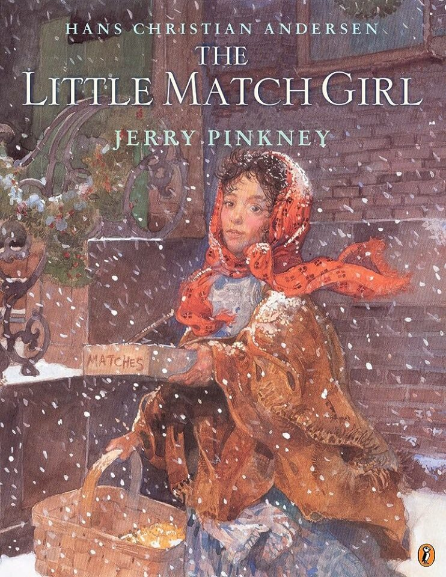

Set in a festive setting, the narrative follows a little girl who attempts to sell matches in the freezing weather to support her family. This story teaches the power of compassion, empathy that can be discovered even in the worst circumstances.

### **2\. [A Christmas Carol](https://www.amazon.com/Christmas-Carol-Charles-Dickens/dp/1503212831)**

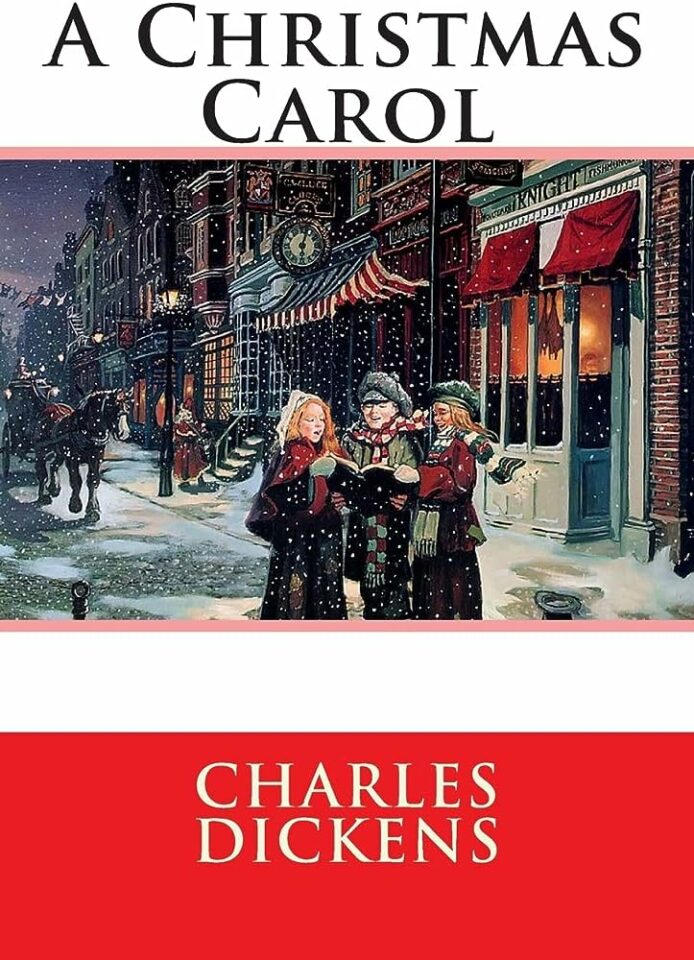

“A Christmas Carol” revolves around the miserly Ebenezer Scrooge, whose heartless pursuit of wealth and indifference to the plight of others is transformed on Christmas Eve. This narrative is a compelling exploration of personal transformation, empathy, and the capacity for change.

### **3\. [How the Grinch Stole Christmas!](https://www.amazon.com/Grinch-Stole-Christmas-Classic-Seuss/dp/0394800796)** 

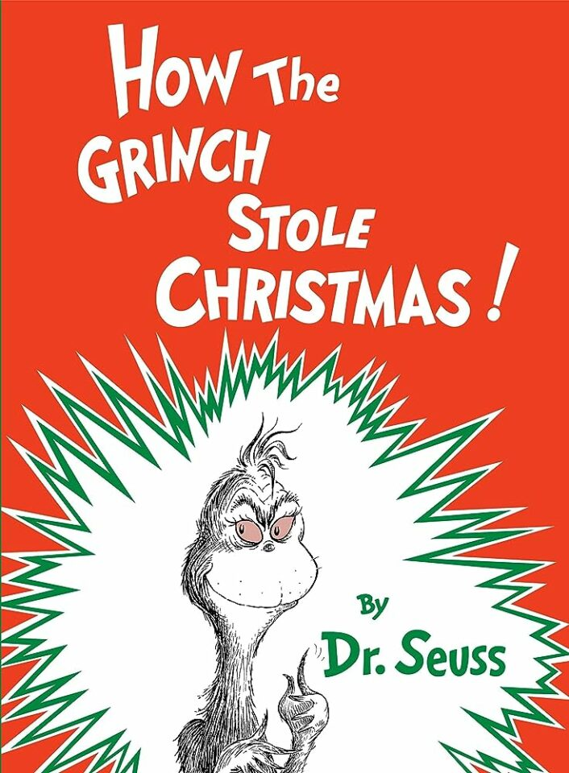

The story follows the Grinch, a green, grouchy creature. He hatches a dastardly plan to steal Christmas from them by taking away all their decorations, presents, and holiday treats on Christmas Eve. However, when he carries out his scheme, he discovers that the Whos’ joy is not dependent on material possessions.

### **4\. [Christmas Day in the Morning](https://www.amazon.com/Christmas-Day-Morning-Pearl-Buck/dp/0688162673)**

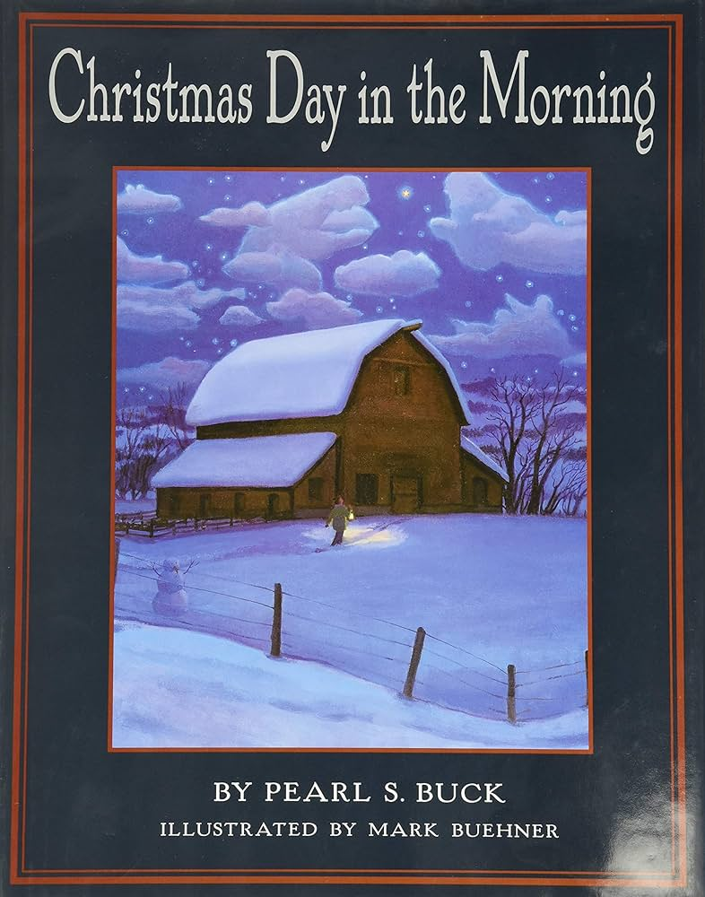

The story beautifully portrays the theme of selfless love as Rob – a teenager, wakes up before dawn to prepare a surprise for his father, who was burdened with farm work. Its poignant storytelling resonates with readers, reminding them of the significance of genuine love and appreciation in their lives.

### **5\. [The First Christmas of New England](https://www.amazon.com/First-Christmas-England-Harriet-Stowe/dp/1557094799)**

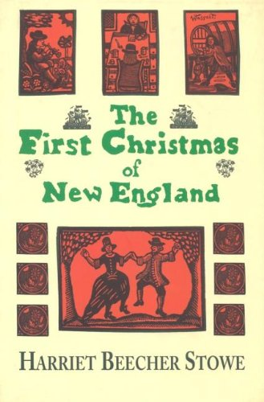

“The First Christmas of New England” by Harriet Beecher Stowe is a heartwarming short story that transports readers to the early days of New England colonization. Through this tale, readers are invited to reflect on the enduring themes of cultural diversity, human resilience, and faith’s power in shaping history.

### **6\. [The Gift of the Magi](https://www.amazon.com/Gift-Holiday-Classics-Illustrated-Lynch/dp/0763635308)**

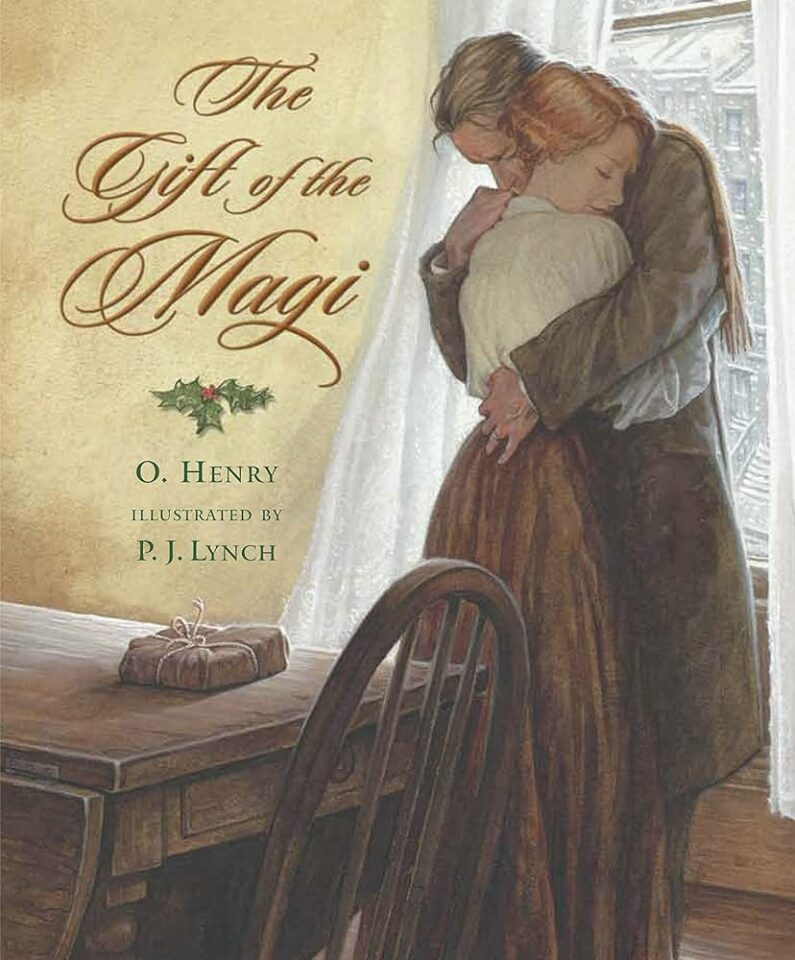

Set in a humble apartment during the holiday season, the story follows a young couple, Jim and Della, who are deeply in love but financially struggling. “The Gift of the Magi” continues to captivate audiences with its timeless message of love, sacrifice, and the ultimate worth of genuine connections over material possessions.

### **7\. [Old Christmas](https://www.amazon.co.uk/Old-Christmas-Washington-Irving/dp/142901668X)** 

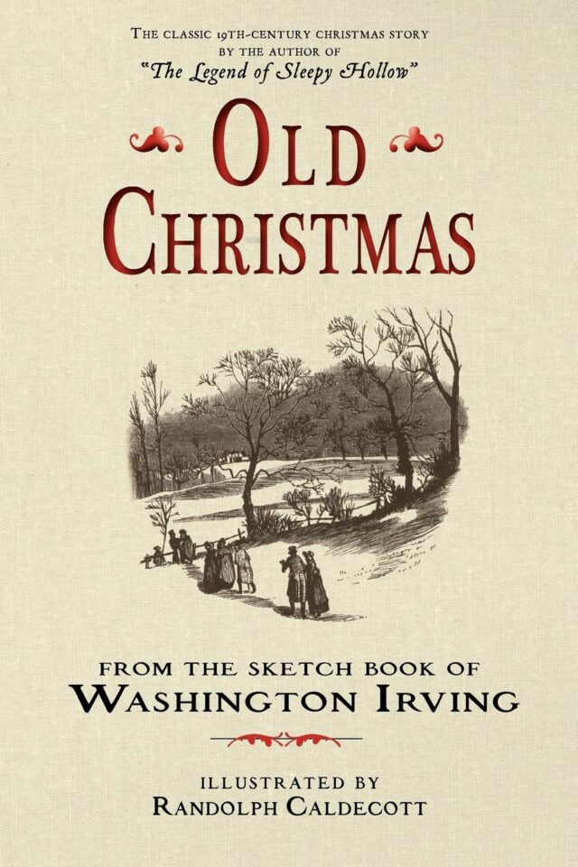

The novel is set in the early nineteenth century and revolves around the narrator’s visit to an English countryside house over Christmas. “Old Christmas” invites readers to reflect on the past, appreciate the present, and get the enduring traditions that define the holiday season.

### **8\. [Papa Panov’s Special Christmas](https://www.amazon.com/Papa-Panovs-Special-Christmas-Tolstoy/dp/1599559196)**

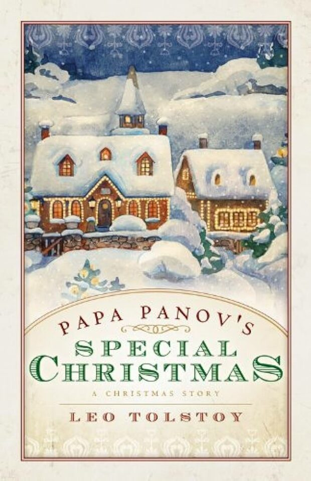

This beautiful story follows the humble shoemaker, Papa Panov, as he prepares for Christmas. Eagerly awaiting the arrival of Jesus, Papa Panov opens his home to strangers, hoping to welcome the Savior.

### **9\. [The Polar Express](https://www.amazon.com/Polar-Express-van-allsburg-chris/dp/1842709496)**

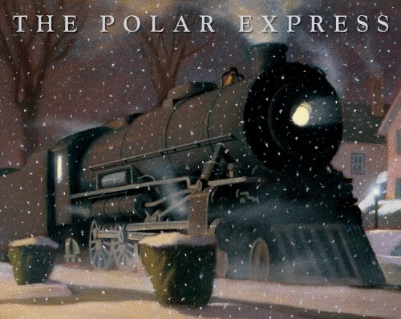

This timeless tale follows a young boy on Christmas Eve, wrestling with his fading belief in the enchantment of Santa Claus. As snow falls outside, a mysterious Polar Express train arrives at his doorstep, ready to transport him to the North Pole.

### **10\. [Twas the Night Before Christmas](https://www.amazon.com/Night-Before-Christmas-Clement-Clarke/dp/1449435572)** 

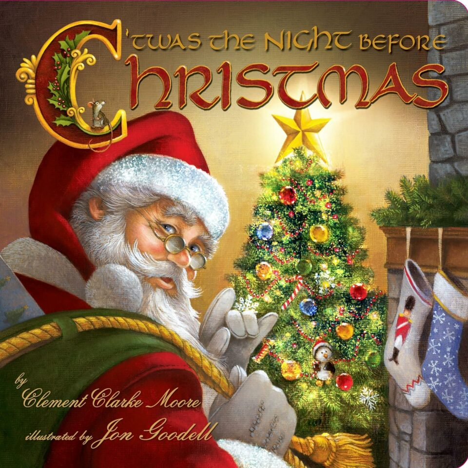

This narrative follows an inquisitive homeowner on a fascinating adventure as he meets a jovial, nighttime guest. The tale conjures a stunning scenario of a winter evening, replete with glittering lights and a joyful sleigh, using vivid imagery and poetic words.

### **11\. [A Kidnapped Santa Claus](https://www.amazon.com/Kidnapped-Santa-Claus-Frank-Baum/dp/9389282942)**

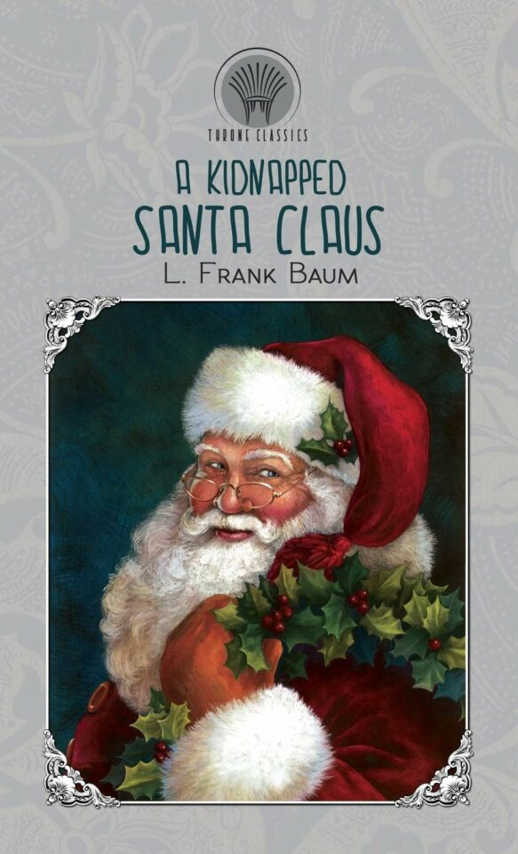

In this captivating tale, Santa Claus finds himself in an unexpected predicament when the mischievous Daemons of the Caves, led by their wicked ruler Awgwas, decide to abduct him on Christmas Eve. This imaginative story presents the timeless themes of bravery, friendship, and the magic of Christmas.

### **12\. [A Letter From Santa Claus](https://www.amazon.com/Letter-Santa-Claus-Mark-Twain-ebook/dp/B08RCCGH11)**

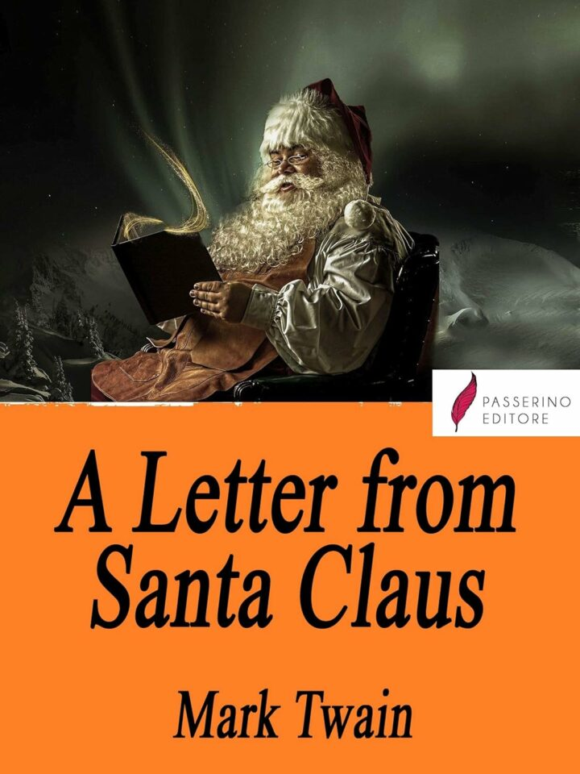

This enchanting tale revolves around a curious young girl named Susy, who daringly decides to write to Santa Claus, questioning his existence’s authenticity. A heartwarming exchange of letters follows between Susy and the jolly old man, each brimming with wit, humor, and wonder.

### **13\. [Christmas at Red Butte](https://www.amazon.com/Christmas-at-Red-Butte-Montgomery-ebook/dp/B07HJYWW43)**

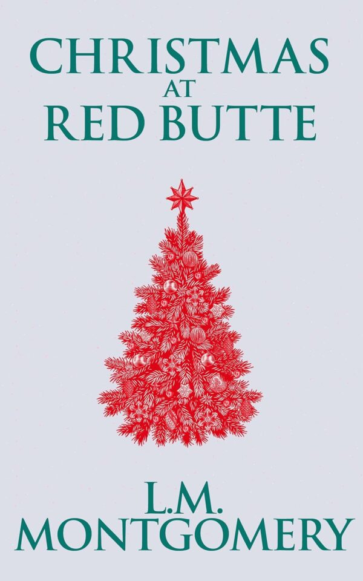

As winter’s embrace tightens, Emily and Teddy Starr anticipate a festive season. However, unexpected visitors and a series of delightful mishaps turn their quiet Christmas plans into a memorable adventure. Montgomery’s story encapsulates the magic of the holidays, leaving a mark on the hearts of young and old.

### **14\. [A Christmas Sermon](https://www.amazon.com/Christmas-Sermon-Robert-Louis-Stevenson/dp/6257959098)**

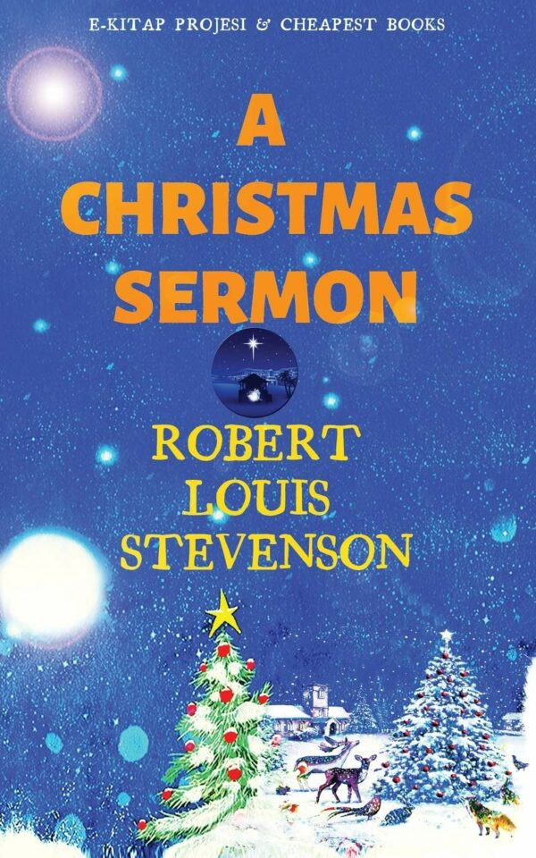

The story centers around a preacher, who casts aside the traditional sermon to deliver a discourse on the intricacies of giving and receiving. At its core, this story explores the duality of human existence, which delves into the complexities of good and evil, darkness and light.

### **15\. [Christmas at Cold Comfort Farm](https://www.amazon.com/Christmas-at-Cold-Comfort-Farm/dp/0143120115)**

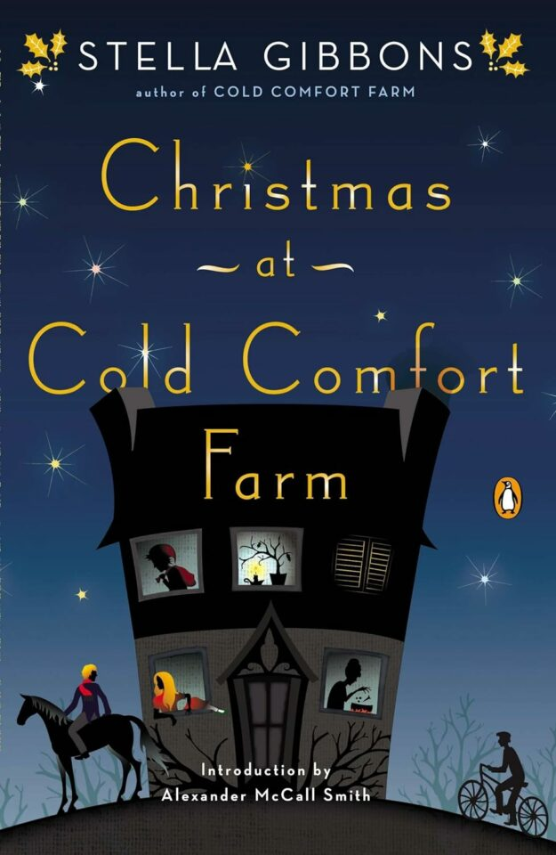

This story captures the witty and resourceful Flora Poste as she returns to the Starkadder family estate to celebrate Christmas. But beneath the rustic charm of the farm lies a web of quirky characters and unresolved family tensions, creating a delightful blend of humor, warmth, and mystery.

### **16\. [The Elves and the Shoemaker](https://www.amazon.com/Elves-Shoemaker-Jacob-Grimm/dp/0811834778)** 

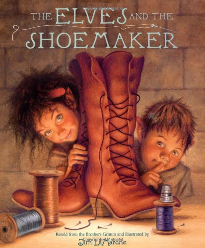

The story unfolds a struggling shoemaker and his kind-hearted wife, who find themselves on the brink of despair due to their dwindling fortunes. Their fate turns unexpectedly when a pair of mysterious elves come to their aid, crafting exquisite shoes overnight that captivate the town’s attention.

### **17\. [The Snowman](https://www.amazon.com/Snowman-Raymond-Briggs/dp/0394884663)**

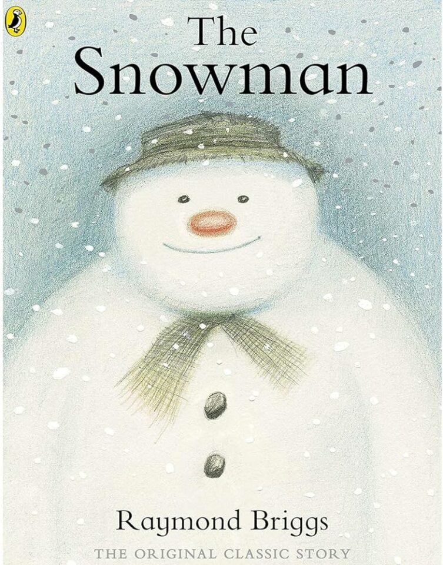

“The Snowman” is a timeless story that captures the essence of dreams and the joy of shared discovery. It revolves around a young boy’s extraordinary encounter with a snowman he creates. As the clock strikes midnight, the snowman comes to life, whisking the boy away on an unforgettable adventure.

### **18\. [Hogfather](https://www.amazon.co.uk/Hogfather-Discworld-Novel-20-Novels/dp/0552167584)**

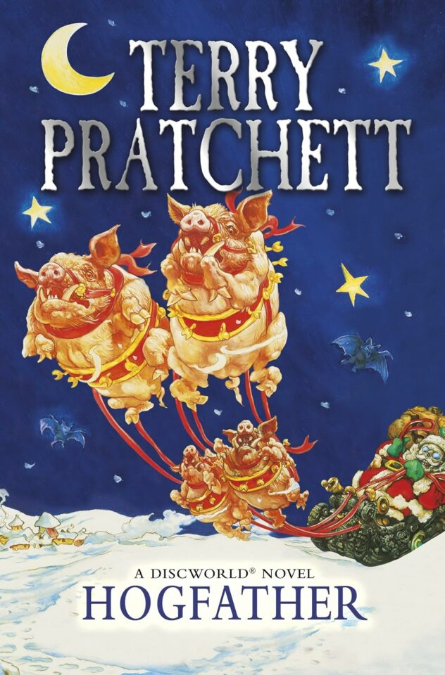

“Hogfather” invites you to embrace the magic of the unexpected and reminds us that even in the most fantastical realms, the true essence of traditions lies in the spirit of giving and belief.

### **19\. [Holidays on Ice](https://www.amazon.com/Holidays-Ice-David-Sedaris/dp/0316078913)**

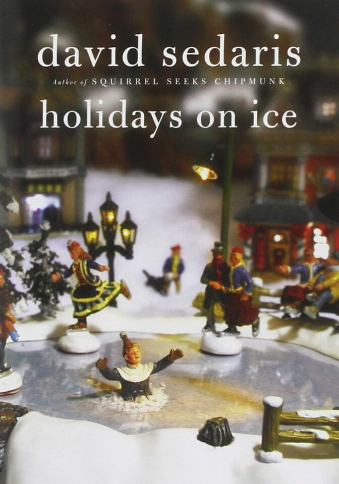

This collection of festive tales is a rollercoaster of wit and satire, capturing the essence of celebrations through Sedaris’s distinctive lens. From a department store elf’s uproarious confessions to a family’s unconventional Christmas letter, Sedaris serves up a delectable dark comedy.

### **20\. [The Steadfast Tin Soldier](https://www.amazon.com/Steadfast-Soldier-Hans-Christian-Andersen/dp/1842704435)**

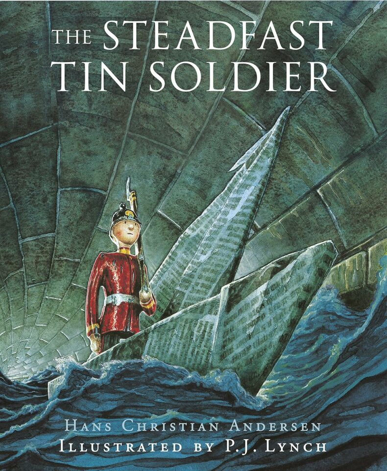

The captivating story follows the journey of a brave tin soldier, molded with unwavering resolve and an unyielding spirit. “The Steadfast Tin Soldier” is more than a tale; it’s a testament to the power of resilience, the magic of destiny, and the enduring strength of love that resonates across generations.

### **21\. [Stick Man](https://www.amazon.co.uk/Stick-Man-Julia-Donaldson/dp/1407170716)**

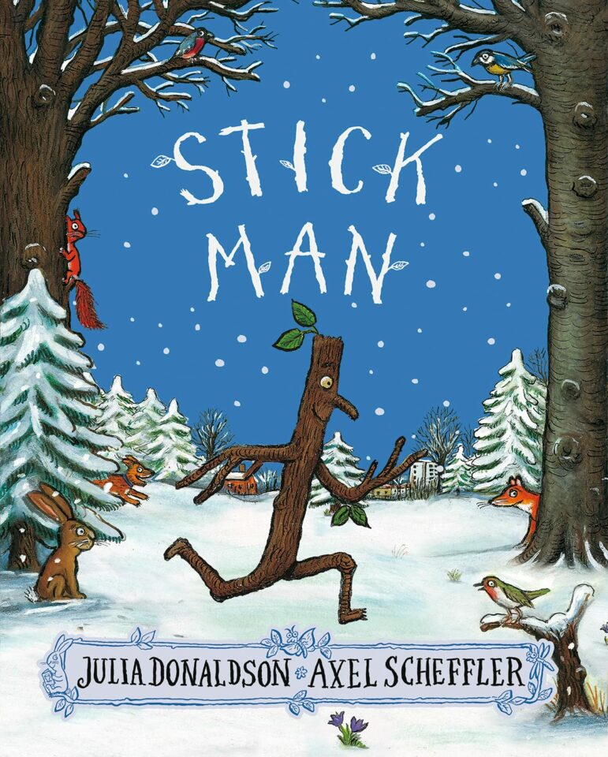

“Stick Man” by Julia Donaldson is a heartwarming tale that brings to life the extraordinary adventures of a humble stick. Stick Man’s story is filled with unexpected twists and endearing moments, from being mistaken for a simple stick by dogs to becoming a vital component in a swan’s nest.

### **22\. [The Box Of Delights](https://www.amazon.com/Box-Delights-Kay-Harker/dp/1590172515)**

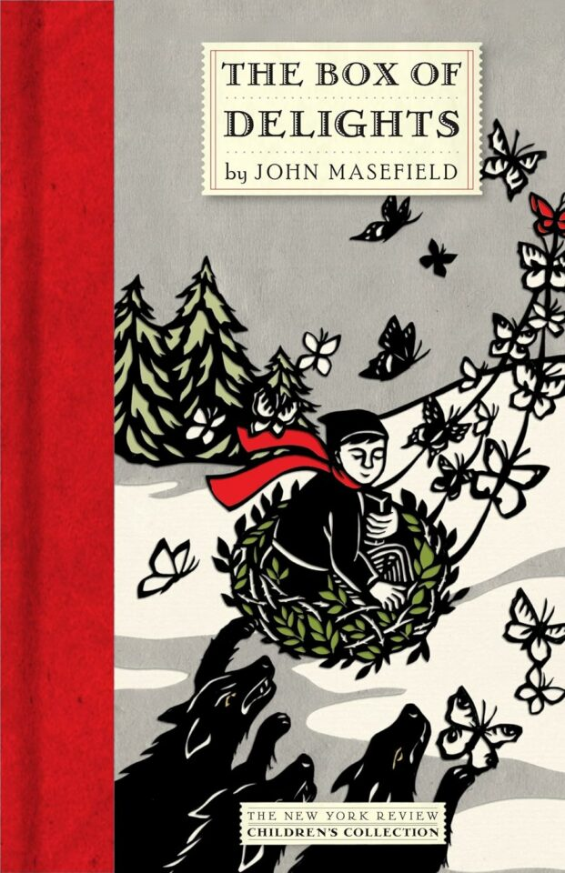

This timeless tale whisks us away on a mesmerizing journey, where young Kay Harker stumbles upon a magical box that grants him the ability to shrink in size and travel through time. The story seamlessly blends fantasy, adventure, and holiday charm, making it a perfect read for young and mature readers.

### **23\. [The Lion, The Witch, and the Wardrobe](https://www.amazon.com/Lion-Witch-Wardrobe-C-Lewis/dp/0007323123)** 

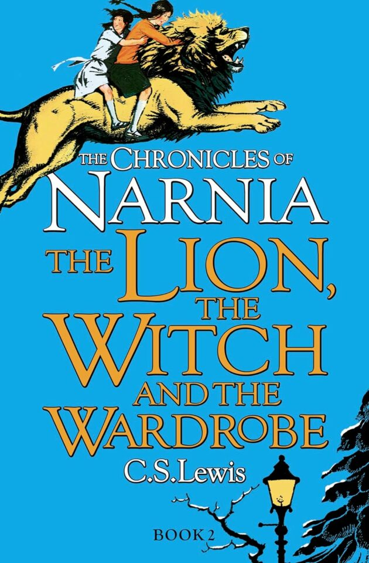

“The Lion, The Witch, and The Wardrobe” is a classic fantasy novel that tells the tale of four siblings—Peter, Susan, Edmund, and Lucy as they stumble upon an enchanted wardrobe that serves as a portal to another realm. Overall, this story remains a beloved tale that resonates with readers of all ages, inviting them into a world of wonder and imagination.

### **24\. [The Twelve Terrors Of Christmas](https://www.amazon.com/12-Terrors-Christmas-John-Updike/dp/0764937103)**

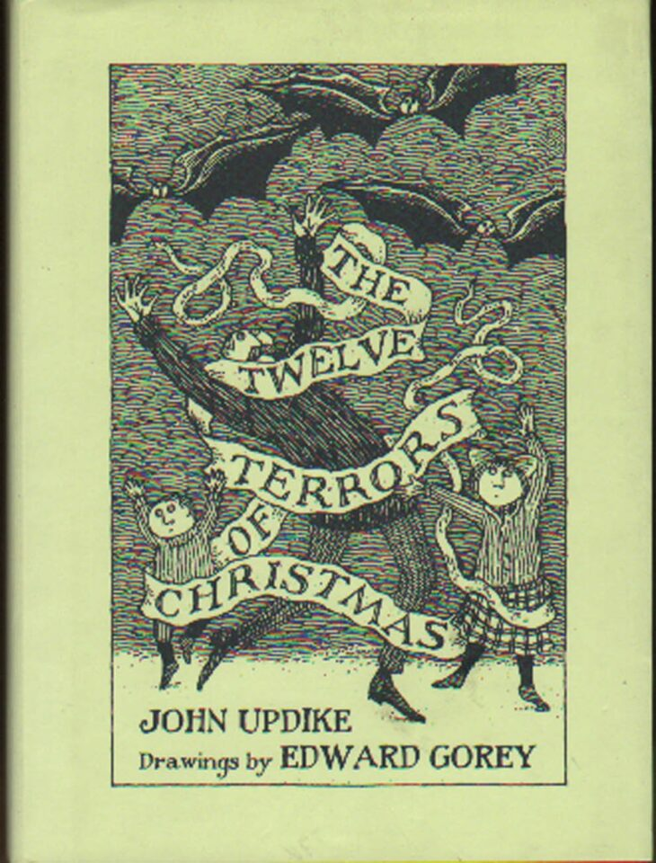

“The Twelve Terrors of Christmas” by John Updike is a satirical short story that humorously explores the darker side of the holiday season. The story presents twelve amusing and exaggerated “terrors” people might encounter during Christmas. Through vivid descriptions and clever wordplay, the author highlights the stress and challenges accompanying the pursuit of holiday perfection. 

### **25\. [Father Christmas](https://www.amazon.com/Father-Christmas-RAYMOND-BRIGGS/dp/0723277974)** 

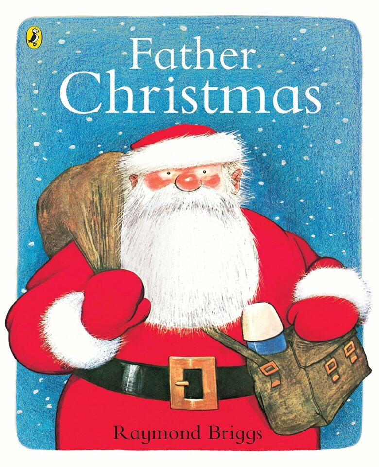

“Father Christmas” by Raymond Briggs is a heartwarming children’s picture book that tells the tale of Santa Claus in a refreshingly down-to-earth and relatable manner. The book’s exciting points lie in its humorous and relatable depiction of Santa, showing his human side and the challenges he faces beyond his iconic role. 

### **26\. [The Greatest Gift](https://www.amazon.co.uk/Greatest-Gift-Philip-Doren-Stern/dp/085752321X)**

The Greatest Gift” is a heartwarming and thought-provoking short story that centers around a man named George Pratt who is disillusioned and contemplating suicide on Christmas Eve. It inspired the classic film “It’s a Wonderful Life,” it captures the essence of empathy, gratitude, and the interconnectedness of human lives.

### **27\. [Skipping Christmas](https://www.amazon.in/Skipping-Christmas-John-Grisham/dp/0385508417)**

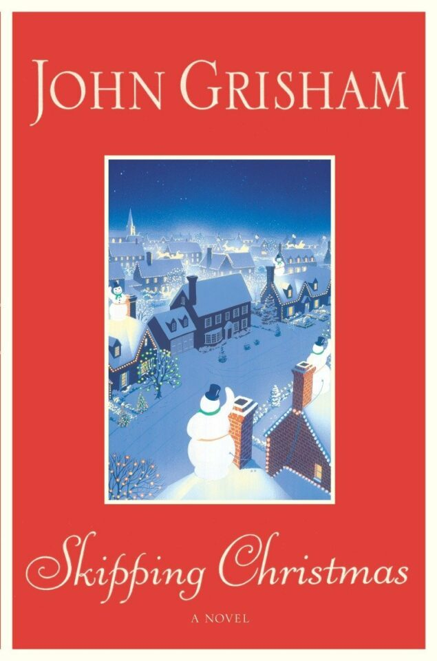

The main content of the story follows Luther and Nora Krank as they face societal pressures, skeptical neighbors, and unexpected challenges while trying to boycott the holiday festivities. The book explores the themes of consumerism, community, and the true meaning of Christmas.

### **28\. [A Christmas Memory](https://www.amazon.com/A-Christmas-Memory/dp/0241474418)** 

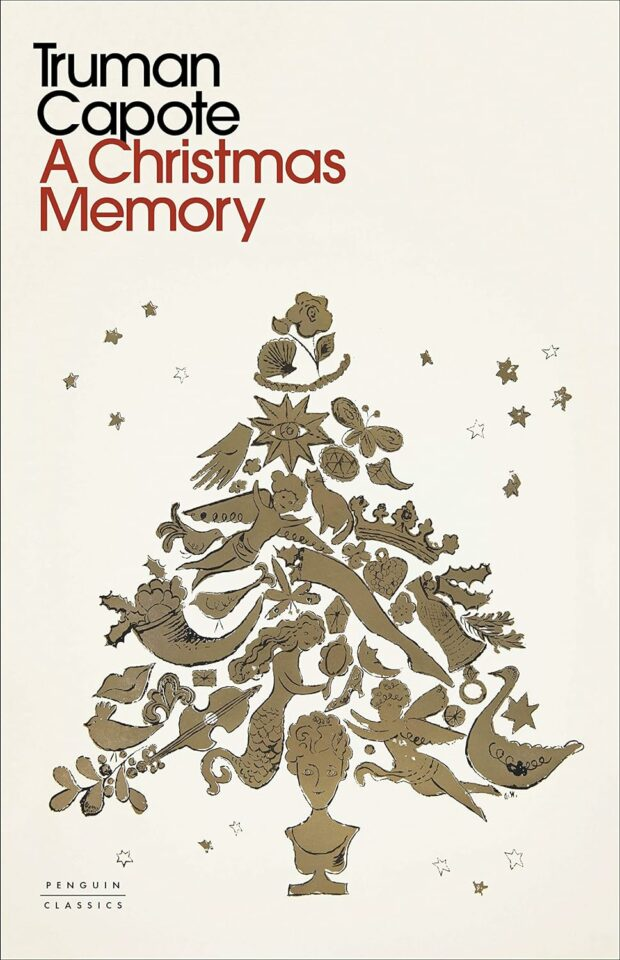

The story is narrated by a young boy who recounts his cherished memories of spending Christmas with his elderly cousin, referred to simply as ‘Buddy. The story explores friendship, innocence, and the fleeting nature of time, reminding readers of the importance of treasuring moments that evoke warmth and love.

### **29\. [The Chimes](https://www.amazon.com/Chimes-Charles-Dickens-Christmas-Story/dp/B0BNV6XJ6W)** 

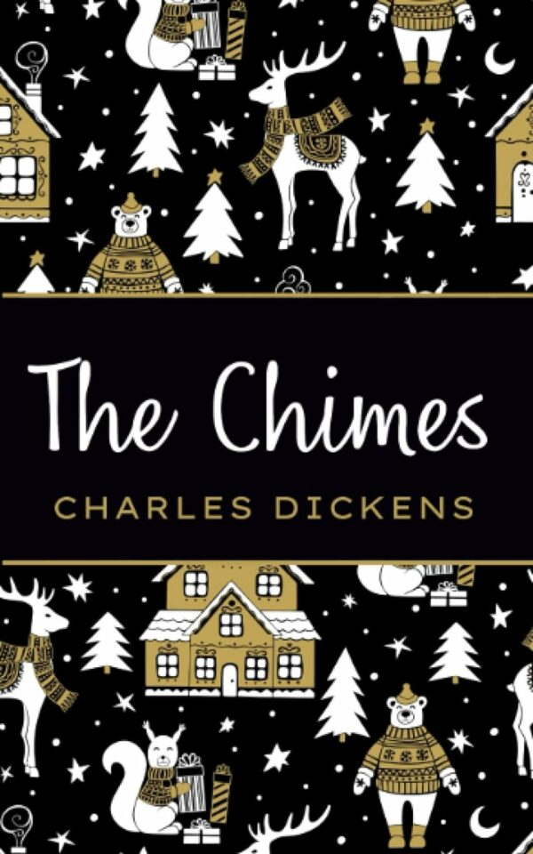

“The Chimes” is a novel by Charles Dickens, first published in 1844. The story centers around Toby “Trotty” Veck, a poor and humble ticket-porter who lives in London. Through a dreamlike journey guided by spirits, Trotty witnesses the potential consequences of his own despair and the negative influence of societal attitudes. 

### **30\. [The Cricket on the Hearth](https://www.amazon.com/Cricket-Hearth-Christmas-Stories-Editions/dp/048628039X)**

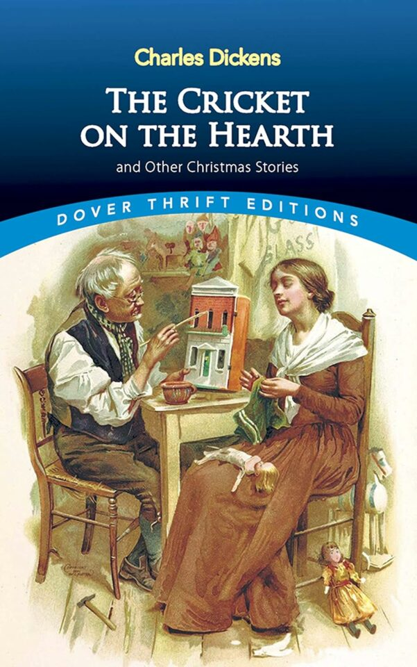

The main characters are John Peerybingle, a carrier, and his young wife Dot. Their happiness is disrupted by misunderstandings and appearances, primarily concerning a mysterious stranger named Mr. Tackleton. A key element of the story is the cricket, which serves as a comforting presence and a symbol of domestic harmony.

### **31\. [The Burglar’s Christmas](https://www.amazon.com/Burglars-Christmas-Willa-Cather-ebook/dp/B07H63LC54)** 

The story centers on a destitute burglar named Charley, who breaks into a house on Christmas Eve, seeking shelter from the cold. To his surprise, he encounters a poor family struggling to make ends meet. Instead of robbing them, Charley is moved by their plight and decides to help them by leaving money and gifts, all while remaining hidden.

### **32\. [Sleigh Bells Ring](https://www.amazon.com/Sleigh-Bells-Ring-RaeAnne-Thayne/dp/1335679928)**

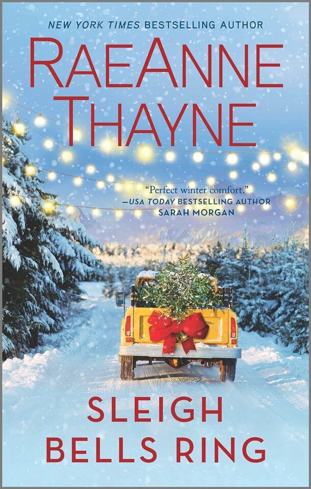

“Sleigh Bells Ring” is a warm holiday romance that revolves around the lives of Jess and Graham, two individuals with wounded hearts seeking solace in a small town during the festive season. With relatable characters and a touch of Christmas magic, “Sleigh Bells Ring” captivates readers with its poignant narrative and heartwarming moments of connection.

### **33\. [Letters from Father Christmas](https://www.amazon.com/Letters-Father-Christmas-J-R-R-Tolkien/dp/0618512659)** 

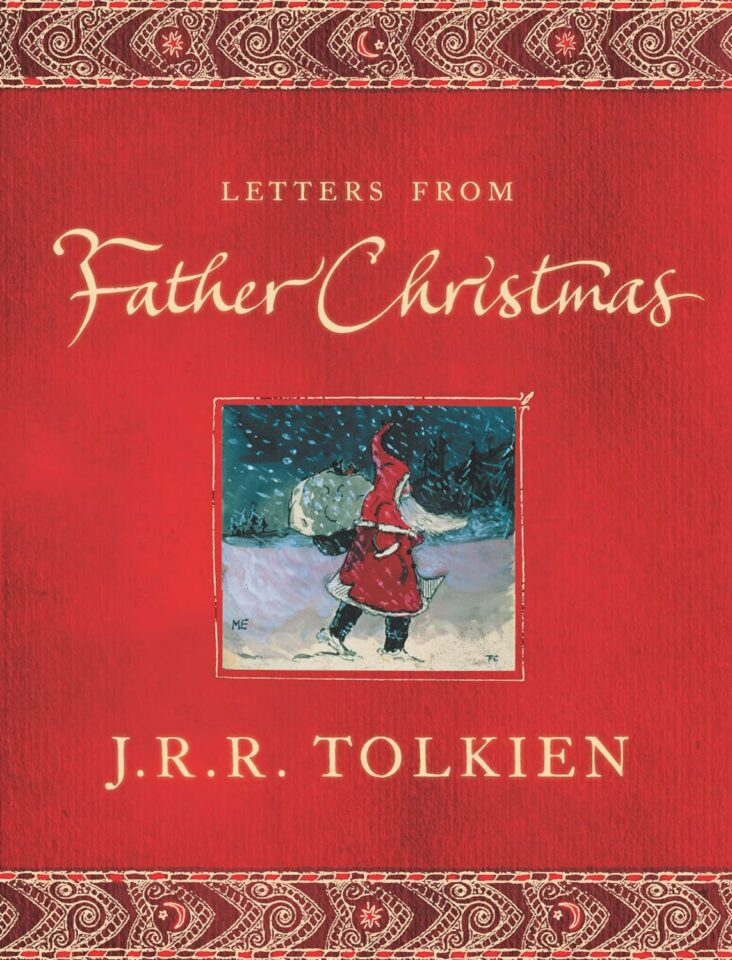

The story revolves around the enchanting correspondence between Father Christmas (Santa Claus) and Tolkien’s children, spanning over two decades. These letters, beautifully illustrated by Tolkien, feature characters like Polar Bear, Ilbereth the Elf, and even mischievous goblins.

### **34\. [The Snow Queen](https://www.amazon.co.uk/Snow-Queen-Hans-Christian-Andersen/dp/1842709011)**

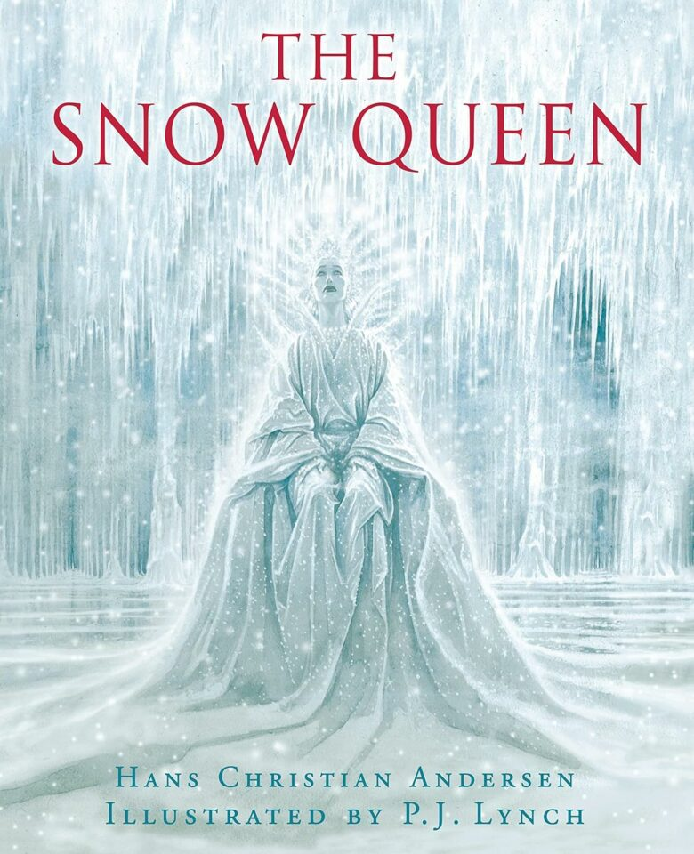

“The Snow Queen” by Hans Christian Andersen is a captivating fairy tale that follows the adventures of a young boy named Kai and his friend Gerda. The story begins when a magical mirror, created by an evil troll, shatters into countless pieces that distort people’s perception, making them see only the negative aspects of everything.

## **10 Best Christmas Bedtime Stories for Kids** 

### **1\. [The Story of Holly and Ivy](https://www.amazon.com/Story-Holly-Ivy-Rumer-Godden/dp/1509805052)** 

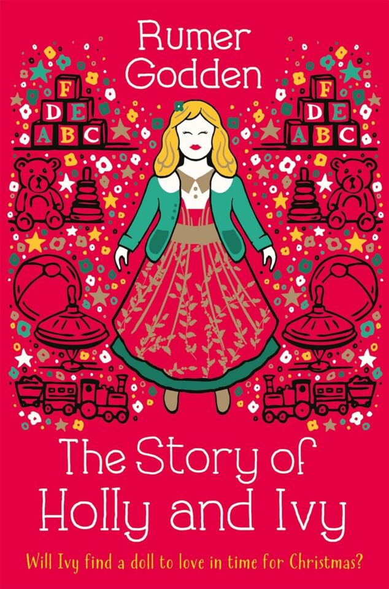

The story follows Ivy’s desperate wish for a family, Holly’s yearning for a child to care for her, and Sir Topham’s longing for purpose. As fate weaves their destinies together, the characters’ paths cross, leading to a heart-touching resolution filled with love, warmth, and the magic of Christmas.

### **2\. [A Wish to be a Christmas Tree](https://www.amazon.com/Christmas-Colleen-Monroe-15-Oct-2005-Board/dp/B012HU3ZCK)**

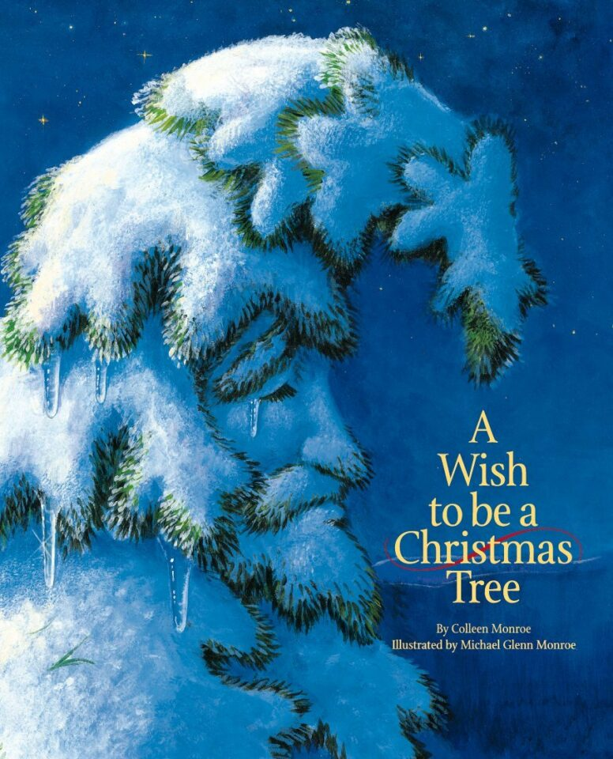

The tale unfolds in a charming forest, where the pine tree watches year after year as other trees are chosen for the holiday celebrations. Throughout the story, the tree’s friends, including woodland creatures and birds, rally together to make the tree’s wish come true.

### **3\. [Nancy and Plum](https://www.amazon.com/Nancy-Plum-Betty-MacDonald/dp/0375859861)** 

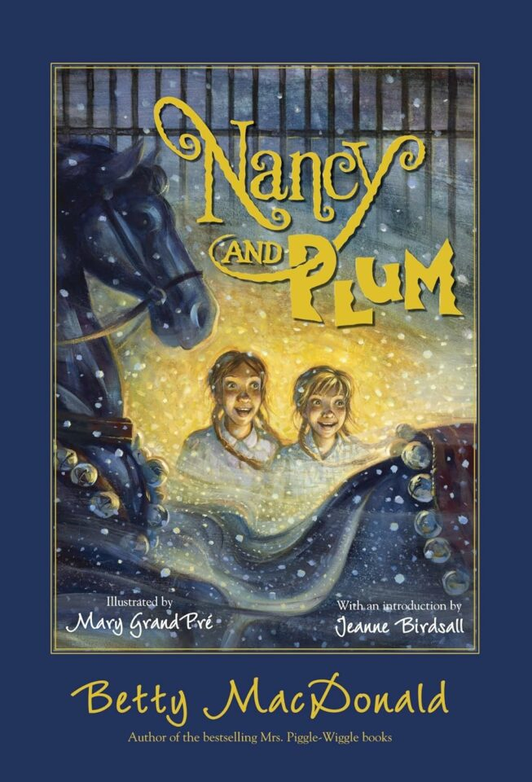

Set in the 1940s, the story revolves around two orphaned sisters, Nancy and Pamela (Plum), who are sent to an oppressive boarding school after the death of their parents. Through their adventures, Nancy and Plum capture readers’ hearts as they bring light and hope to their seemingly bleak circumstances.

### **4\. [Pete the Cat Saves Christmas](https://www.amazon.com/Pete-Cat-Saves-Christmas-audiobook/dp/B00HCOLC68)**

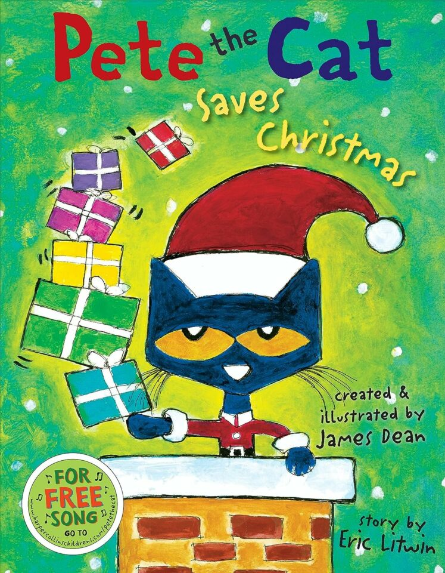

“Pete the Cat Saves Christmas” is a heartwarming children’s story that follows the charming blue cat, Pete, on a festive adventure. When Santa falls ill and Christmas is in jeopardy, it’s up to Pete to step in and save the day.

### **5\. [The Christmas Miracle of Jonathan Toomey](https://www.amazon.com/Christmas-Miracle-Jonathan-Toomey/dp/0763678228)** 

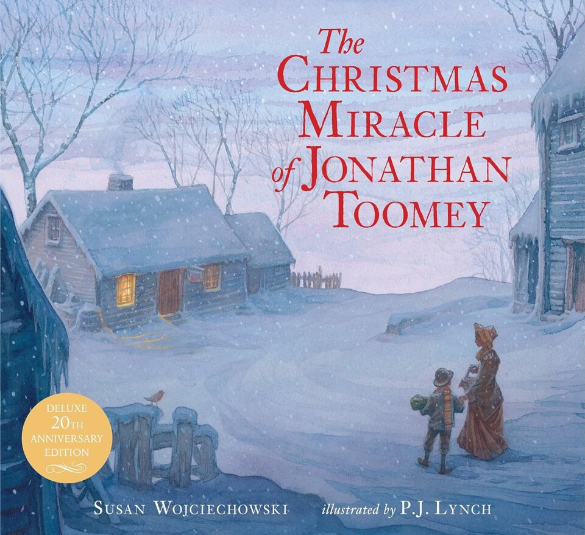

“The Christmas Miracle of Jonathan Toomey” is a heartwarming tale that revolves around Jonathan Toomey, a lonely and grumpy woodcarver who lives in a small village. The story unfolds when a widow and her young son, Thomas, approach Jonathan to carve a nativity scene for them. 

### **6\. [Nutcracker and Mouse King](https://www.amazon.com/Nutcracker-Mouse-King-Christmas-Fairytale/dp/1791760821)**

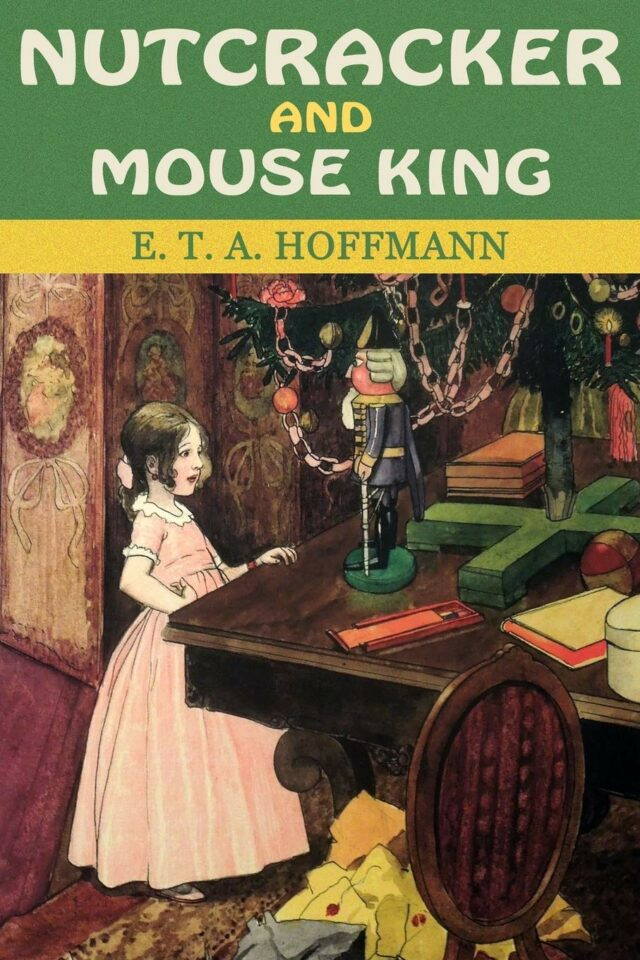

The story unfolds as Marie’s beloved nutcracker comes to life to lead her into a world of enchantment, battling the malicious Mouse King and his army of mice. Amidst fantastical scenes and encounters with quirky characters, Marie navigates through a series of trials, discovering her bravery and resilience. 

### **7\. [A Kidnapped Santa Claus](https://www.amazon.com/Kidnapped-Santa-Claus-Frank-Baum/dp/B0CDNFCZP6)**

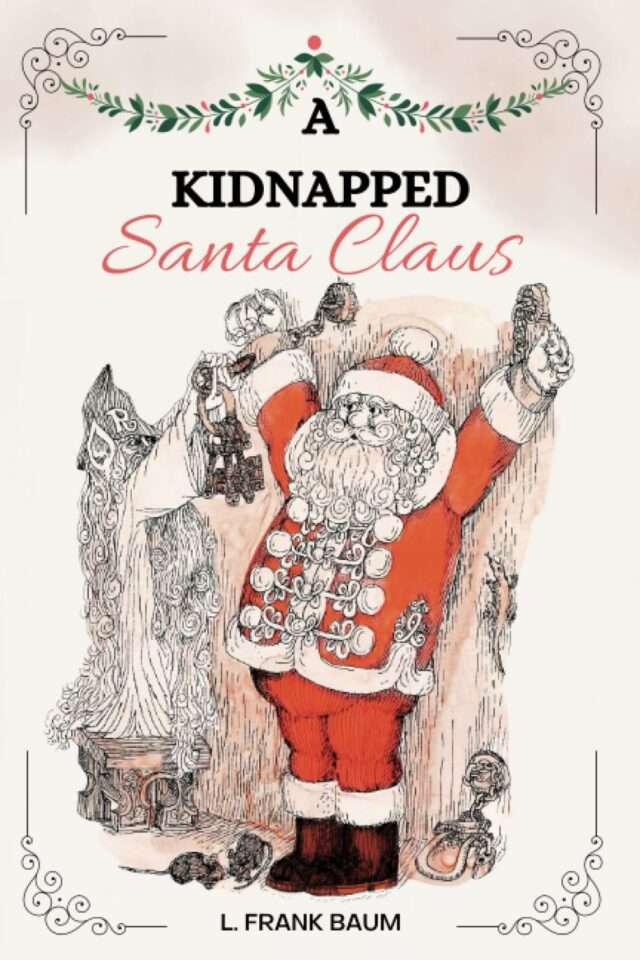

“A Kidnapped Santa Claus” takes an unexpected turn as five wicked demons. The demons aim to discourage kindness and generosity by preventing Santa from delivering gifts. Baum’s imaginative narrative showcases Santa’s resourcefulness and the dedication of his loyal fairy friends. 

### **8\. [The Life and Adventures of Santa Claus](https://www.amazon.com/Life-Adventures-Santa-Claus/dp/0762463139)** 

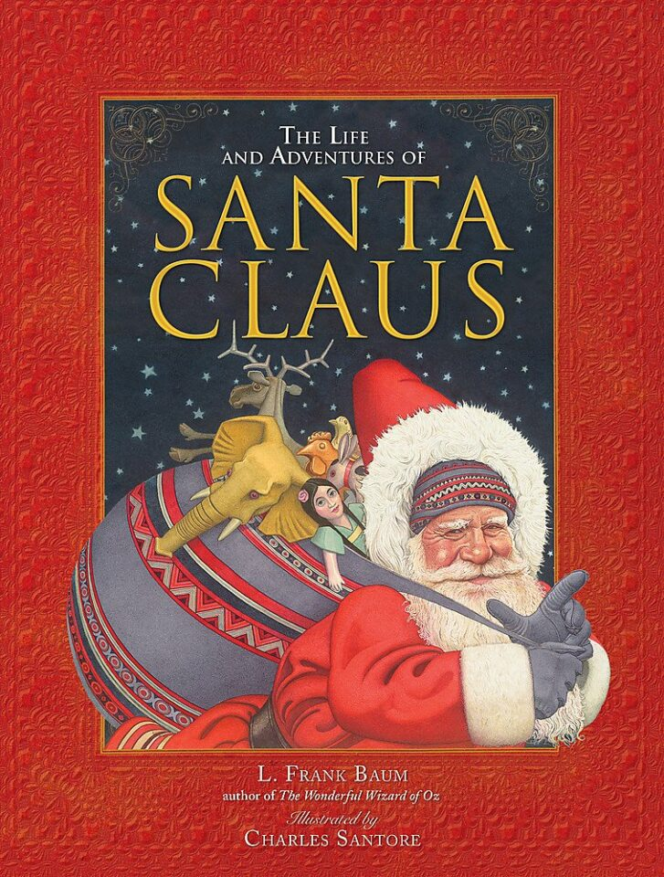

“The Life and Adventures of Santa Claus” is a classic fantasy tale that provides a unique and imaginative take on the origins of Santa Claus. The story explores Santa’s life from his early years as an abandoned baby in the enchanted forest, where he is raised by supernatural beings and animals. 

### **9\. [Bear Stays Up for Christmas](https://www.amazon.com/Bear-Stays-Up-Christmas-Books/dp/1442427906)**

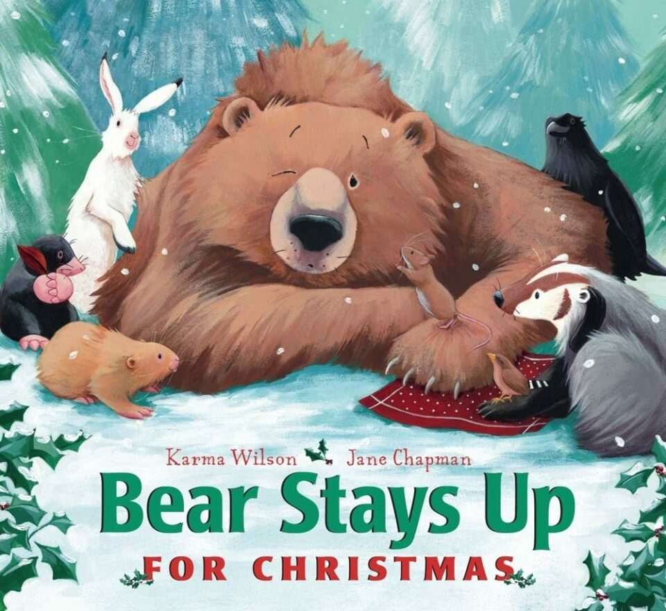

The main content revolves around Bear’s determination to stay awake during the festive season, a challenging feat for a bear who usually hibernates. Bear’s friends engage in various activities throughout the story to keep him awake, highlighting the importance of togetherness and camaraderie.

### **10\. [The Best Christmas Pageant Ever](https://www.amazon.com/Best-Christmas-Pageant-Ever/dp/0440842492)**

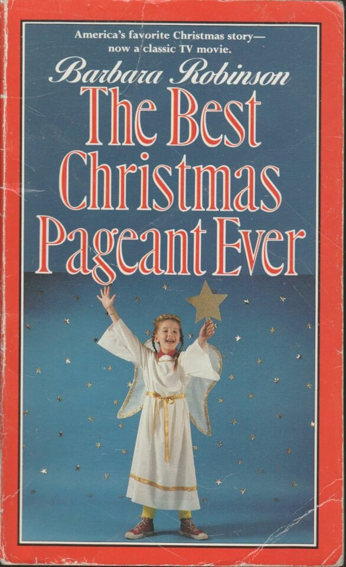

“The Best Christmas Pageant Ever” revolves around the Herdmans, a notorious family of six unruly children who take over the annual Christmas pageant in a small town. The story centers on the transformation of the Herdmans from troublemakers to valuable participants. 

**_See More:_** Best [Kid Christmas Story](https://avada.io/loveable/blog/kid-christmas-story/) on Christmas Eve

## **Bottom Line**

As the holiday season wraps us in its warm embrace, immerse yourself in a world of wonder and joy with our 40+ enchanting **Christmas stories collection.** These tales, like shimmering ornaments on a grand tree, can rekindle the magic of the holiday season in the hearts of the young and old. So, take a moment to read the stories, and let the enchantment of Christmas brighten your days throughout the year.

- [Top 34 Must-Read Christmas Stories for a Magical Christmas Eve](https://avada.io/loveable/blog/christmas-stories/#wp-block-heading-2-2)
    - [1\. The Little Match Girl](https://avada.io/loveable/blog/christmas-stories/#wp-block-heading-3-3) 
    - [2\. A Christmas Carol](https://avada.io/loveable/blog/christmas-stories/#wp-block-heading-3-6)
    - [3\. How the Grinch Stole Christmas!](https://avada.io/loveable/blog/christmas-stories/#wp-block-heading-3-9) 
    - [4\. Christmas Day in the Morning](https://avada.io/loveable/blog/christmas-stories/#wp-block-heading-3-12)
    - [5\. The First Christmas of New England](https://avada.io/loveable/blog/christmas-stories/#wp-block-heading-3-15)
    - [6\. The Gift of the Magi](https://avada.io/loveable/blog/christmas-stories/#wp-block-heading-3-18)
    - [7\. Old Christmas](https://avada.io/loveable/blog/christmas-stories/#wp-block-heading-3-21) 
    - [8\. Papa Panov’s Special Christmas](https://avada.io/loveable/blog/christmas-stories/#wp-block-heading-3-24)
    - [9\. The Polar Express](https://avada.io/loveable/blog/christmas-stories/#wp-block-heading-3-27)
    - [10\. Twas the Night Before Christmas](https://avada.io/loveable/blog/christmas-stories/#wp-block-heading-3-30) 
    - [11\. A Kidnapped Santa Claus](https://avada.io/loveable/blog/christmas-stories/#wp-block-heading-3-33)
    - [12\. A Letter From Santa Claus](https://avada.io/loveable/blog/christmas-stories/#wp-block-heading-3-36)
    - [13\. Christmas at Red Butte](https://avada.io/loveable/blog/christmas-stories/#wp-block-heading-3-39)
    - [14\. A Christmas Sermon](https://avada.io/loveable/blog/christmas-stories/#wp-block-heading-3-42)
    - [15\. Christmas at Cold Comfort Farm](https://avada.io/loveable/blog/christmas-stories/#wp-block-heading-3-45)
    - [16\. The Elves and the Shoemaker](https://avada.io/loveable/blog/christmas-stories/#wp-block-heading-3-48) 
    - [17\. The Snowman](https://avada.io/loveable/blog/christmas-stories/#wp-block-heading-3-51)
    - [18\. Hogfather](https://avada.io/loveable/blog/christmas-stories/#wp-block-heading-3-54)
    - [19\. Holidays on Ice](https://avada.io/loveable/blog/christmas-stories/#wp-block-heading-3-57)
    - [20\. The Steadfast Tin Soldier](https://avada.io/loveable/blog/christmas-stories/#wp-block-heading-3-60)
    - [21\. Stick Man](https://avada.io/loveable/blog/christmas-stories/#wp-block-heading-3-63)
    - [22\. The Box Of Delights](https://avada.io/loveable/blog/christmas-stories/#wp-block-heading-3-66)
    - [23\. The Lion, The Witch, and the Wardrobe](https://avada.io/loveable/blog/christmas-stories/#wp-block-heading-3-69) 
    - [24\. The Twelve Terrors Of Christmas](https://avada.io/loveable/blog/christmas-stories/#wp-block-heading-3-72)
    - [25\. Father Christmas](https://avada.io/loveable/blog/christmas-stories/#wp-block-heading-3-75) 
    - [26\. The Greatest Gift](https://avada.io/loveable/blog/christmas-stories/#wp-block-heading-3-78)
    - [27\. Skipping Christmas](https://avada.io/loveable/blog/christmas-stories/#wp-block-heading-3-81)
    - [28\. A Christmas Memory](https://avada.io/loveable/blog/christmas-stories/#wp-block-heading-3-84) 
    - [29\. The Chimes](https://avada.io/loveable/blog/christmas-stories/#wp-block-heading-3-87) 
    - [30\. The Cricket on the Hearth](https://avada.io/loveable/blog/christmas-stories/#wp-block-heading-3-90)
    - [31\. The Burglar’s Christmas](https://avada.io/loveable/blog/christmas-stories/#wp-block-heading-3-93) 
    - [32\. Sleigh Bells Ring](https://avada.io/loveable/blog/christmas-stories/#wp-block-heading-3-96)
    - [33\. Letters from Father Christmas](https://avada.io/loveable/blog/christmas-stories/#wp-block-heading-3-99) 
    - [34\. The Snow Queen](https://avada.io/loveable/blog/christmas-stories/#wp-block-heading-3-102)
- [10 Best Christmas Bedtime Stories for Kids](https://avada.io/loveable/blog/christmas-stories/#wp-block-heading-2-105) 
    - [1\. The Story of Holly and Ivy](https://avada.io/loveable/blog/christmas-stories/#wp-block-heading-3-106) 
    - [2\. A Wish to be a Christmas Tree](https://avada.io/loveable/blog/christmas-stories/#wp-block-heading-3-109)
    - [3\. Nancy and Plum](https://avada.io/loveable/blog/christmas-stories/#wp-block-heading-3-112) 
    - [4\. Pete the Cat Saves Christmas](https://avada.io/loveable/blog/christmas-stories/#wp-block-heading-3-115)
    - [5\. The Christmas Miracle of Jonathan Toomey](https://avada.io/loveable/blog/christmas-stories/#wp-block-heading-3-118) 
    - [6\. Nutcracker and Mouse King](https://avada.io/loveable/blog/christmas-stories/#wp-block-heading-3-121)
    - [7\. A Kidnapped Santa Claus](https://avada.io/loveable/blog/christmas-stories/#wp-block-heading-3-124)
    - [8\. The Life and Adventures of Santa Claus](https://avada.io/loveable/blog/christmas-stories/#wp-block-heading-3-127) 
    - [9\. Bear Stays Up for Christmas](https://avada.io/loveable/blog/christmas-stories/#wp-block-heading-3-130)
    - [10\. The Best Christmas Pageant Ever](https://avada.io/loveable/blog/christmas-stories/#wp-block-heading-3-133)
- [Bottom Line](https://avada.io/loveable/blog/christmas-stories/#wp-block-heading-2-137)

### [Blake Simpson](https://avada.io/loveable/author/blake/)

Hi, I'm Blake from Loveable. I help people find perfect gifts for occasions like anniversaries and weddings. I also write a blog about holidays, sharing insights to make them more meaningful. Let's create unforgettable moments together!

- [Twitter](https://twitter.com/intent/tweet)
- [Facebook](https://www.facebook.com/sharer/sharer.php)
- [instagram](https://avada.io/loveable/blog/christmas-stories/)
- [pinterest](https://www.pinterest.com/loveablellc/)

## Related Posts

[### 120+ Christian Birthday Wishes To Spread Your Love](https://avada.io/loveable/blog/christian-birthday-wishes/) 

[

### 35 Best 70th Birthday Ideas To Celebrate The Special Milestone

](https://avada.io/loveable/blog/70th-birthday-ideas/)

[

### 50 Best 30th Birthday Decorations for a Remarkable Birthday Bash

](https://avada.io/loveable/blog/30th-birthday-decorations/)

[

### 40 Delicious Vegan Christmas Desserts to Delight Your Palate

](https://avada.io/loveable/blog/vegan-christmas-desserts/)

[

### 60 Christmas Team Building Activities to Boost Workplace Spirit

](https://avada.io/loveable/blog/christmas-team-building-activities/)
