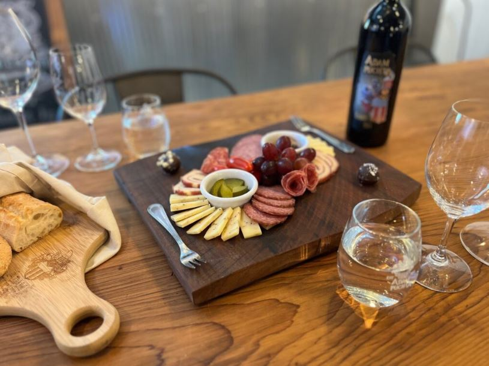

This article has been written and researched by our expert Loveable through a precise methodology. [Learn more about our methodology](https://avada.io/loveable/our-methodological.html)

[Loveable](https://avada.io/loveable/) > [Blog](https://avada.io/loveable/blog/) > [Family](https://avada.io/loveable/family/)

# 40 Exciting 60th Birthday Party Ideas To Try On This Special Day

Written by [Rose Bryne](https://avada.io/loveable/author/rose/) Last Updated on September 26, 2023

- [40 Exciting 60th Birthday Party Ideas for an Unforgettable Bash](https://avada.io/loveable/blog/60th-birthday-party-ideas/#wp-block-heading-2-3)
    - [1\. Make the Party Meaningful and Memorable](https://avada.io/loveable/blog/60th-birthday-party-ideas/#wp-block-heading-3-4)
    - [2\. Take a Local Tour](https://avada.io/loveable/blog/60th-birthday-party-ideas/#wp-block-heading-3-7)
    - [3\. Camp Your Heart Out](https://avada.io/loveable/blog/60th-birthday-party-ideas/#wp-block-heading-3-10)
    - [4\. Garden Tea](https://avada.io/loveable/blog/60th-birthday-party-ideas/#wp-block-heading-3-13)
    - [5\. Celebrate With Sparkle](https://avada.io/loveable/blog/60th-birthday-party-ideas/#wp-block-heading-3-17)
    - [6\. Relax at the Spa](https://avada.io/loveable/blog/60th-birthday-party-ideas/#wp-block-heading-3-20)
    - [7\. Embrace the Adventure](https://avada.io/loveable/blog/60th-birthday-party-ideas/#wp-block-heading-3-23)
    - [8\. Friends and Family Golf Tournament](https://avada.io/loveable/blog/60th-birthday-party-ideas/#wp-block-heading-3-26)
    - [9\. Have a Masquerade Ball](https://avada.io/loveable/blog/60th-birthday-party-ideas/#wp-block-heading-3-29)
    - [10\. Go on a Cruise](https://avada.io/loveable/blog/60th-birthday-party-ideas/#wp-block-heading-3-33) 
    - [11\. Outdoor Concert](https://avada.io/loveable/blog/60th-birthday-party-ideas/#wp-block-heading-3-36)
    - [12\. Host a Movie Night](https://avada.io/loveable/blog/60th-birthday-party-ideas/#wp-block-heading-3-39)
    - [13\. Breakfast Party](https://avada.io/loveable/blog/60th-birthday-party-ideas/#wp-block-heading-3-42)
    - [14\. Birthday Bowling](https://avada.io/loveable/blog/60th-birthday-party-ideas/#wp-block-heading-3-45)
    - [15\. Surprise Them With a Secret Guest](https://avada.io/loveable/blog/60th-birthday-party-ideas/#wp-block-heading-3-48)
    - [16\. Share 60 Great Memories](https://avada.io/loveable/blog/60th-birthday-party-ideas/#wp-block-heading-3-51)
    - [17\. Take a World Tour at the Buffet Table](https://avada.io/loveable/blog/60th-birthday-party-ideas/#wp-block-heading-3-55)
    - [18\. Hire a Live Band – 60th Birthday Party Idea For Music Lover](https://avada.io/loveable/blog/60th-birthday-party-ideas/#wp-block-heading-3-58)
    - [19\. Fondue Party](https://avada.io/loveable/blog/60th-birthday-party-ideas/#wp-block-heading-3-62)
    - [20\. Rent a Movie Theater](https://avada.io/loveable/blog/60th-birthday-party-ideas/#wp-block-heading-3-65)
    - [21\. Tropical Getaway](https://avada.io/loveable/blog/60th-birthday-party-ideas/#wp-block-heading-3-68)
    - [22\. Epic Dessert Table](https://avada.io/loveable/blog/60th-birthday-party-ideas/#wp-block-heading-3-71)
    - [23\. 60 Years of Photos](https://avada.io/loveable/blog/60th-birthday-party-ideas/#wp-block-heading-3-74)
    - [24\. Karaoke Competition](https://avada.io/loveable/blog/60th-birthday-party-ideas/#wp-block-heading-3-77)
    - [25\. Weekend In Vegas](https://avada.io/loveable/blog/60th-birthday-party-ideas/#wp-block-heading-3-80)
    - [26\. Elevated Wine and Cheese Tasting](https://avada.io/loveable/blog/60th-birthday-party-ideas/#wp-block-heading-3-83)
    - [27\. Backyard BBQ – Food Ideas For 60th Birthday](https://avada.io/loveable/blog/60th-birthday-party-ideas/#wp-block-heading-3-86)
    - [28\. Birthday Glamping](https://avada.io/loveable/blog/60th-birthday-party-ideas/#wp-block-heading-3-89)
    - [29\. Light Some Fireworks](https://avada.io/loveable/blog/60th-birthday-party-ideas/#wp-block-heading-3-92)
    - [30\. Celebratory Staycation](https://avada.io/loveable/blog/60th-birthday-party-ideas/#wp-block-heading-3-95)
    - [31\. Take Your Party on the Road](https://avada.io/loveable/blog/60th-birthday-party-ideas/#wp-block-heading-3-98)
    - [32\. Have a Fiesta](https://avada.io/loveable/blog/60th-birthday-party-ideas/#wp-block-heading-3-101)
    - [33\. Have a 1960s-themed Party](https://avada.io/loveable/blog/60th-birthday-party-ideas/#wp-block-heading-3-104)
    - [34\. Formal Cocktail Party](https://avada.io/loveable/blog/60th-birthday-party-ideas/#wp-block-heading-3-107)
    - [35\. Gaze at the Night Sky](https://avada.io/loveable/blog/60th-birthday-party-ideas/#wp-block-heading-3-110)
    - [36\. 80s Decade Party](https://avada.io/loveable/blog/60th-birthday-party-ideas/#wp-block-heading-3-113)
    - [37\. Hold Wine Tasting](https://avada.io/loveable/blog/60th-birthday-party-ideas/#wp-block-heading-3-117)
    - [38\. Personalized Trivia](https://avada.io/loveable/blog/60th-birthday-party-ideas/#wp-block-heading-3-120)
    - [39\. Learn Something New at the Party](https://avada.io/loveable/blog/60th-birthday-party-ideas/#wp-block-heading-3-123)
    - [40\. Corn Hole](https://avada.io/loveable/blog/60th-birthday-party-ideas/#wp-block-heading-3-126)
- [5 Special 60th Birthday Gifts That Make Anyone Smile](https://avada.io/loveable/blog/60th-birthday-party-ideas/#wp-block-heading-2-129)
    - [Canvas Poster Wall Art](https://avada.io/loveable/blog/60th-birthday-party-ideas/#wp-block-heading-3-130)
    - [Custom Number Personalized Sweater Hoodie](https://avada.io/loveable/blog/60th-birthday-party-ideas/#wp-block-heading-3-133)
    - [Personalized Canvas Poster Wall Art Home Decor](https://avada.io/loveable/blog/60th-birthday-party-ideas/#wp-block-heading-3-136)
    - [Personalized Black White Mug](https://avada.io/loveable/blog/60th-birthday-party-ideas/#wp-block-heading-3-139)
    - [Personalized Ceramic Plan Pot](https://avada.io/loveable/blog/60th-birthday-party-ideas/#wp-block-heading-3-142)
- [To Sum Up,](https://avada.io/loveable/blog/60th-birthday-party-ideas/#wp-block-heading-2-145)

Reaching the illustrious milestone of a 60th birthday is an occasion worth commemorating in style. Whether it’s for a beloved family member, a cherished friend, or even yourself, this collection of exciting **60th birthday party ideas** is designed to make this momentous event truly unforgettable.

Join us as we explore a plethora of creative and memorable ways to honor six decades of life and create lasting memories!

## **40 Exciting 60th Birthday Party Ideas for an Unforgettable Bash**

### **1\. Make the Party Meaningful and Memorable**

Selecting an activity or event that aligns perfectly with the guest of honor’s personality holds the secret to orchestrating a triumphant 60th birthday celebration. Recognizing the individuality of each person, when you opt for a distinctive birthday party concept that resonates, you pave the way for a significant and unforgettable commemoration of this milestone.

### **2\. Take a Local Tour**

Turning sixty also provides an excellent opportunity for a staycation. Explore your hometown through the lens of a visitor, considering the activities that locals recommend for enjoyment. Consider options like local riverboat cruises, train journeys, scenic tours, and even airplane rides if available. Embracing the delights of your own community adds a wonderful touch to the celebration of your 60th birthday.

### **3\. Camp Your Heart Out**

Should the individual’s 60th birthday coincide with the sunnier seasons, embarking on a camping expedition can present a delightful approach to commemorating the occasion. If traditional tent camping isn’t your preference, consider the option of renting an RV to explore state and national parks. When it comes to the main birthday festivities, consider the idea of grilling up something extraordinary and indulging in a cake sourced from a local bakery. And to get ready for this camping trip, you’ll need some essential items, or you might want to gift a birthday [present for the camper](https://avada.io/loveable/gifts-campers/).

### **4\. Garden Tea**

Let’s indulge in the splendor of a picturesque garden while savoring delectable delicacies, making a garden tea event an elegant and sophisticated option for a 60th birthday celebration. Delight in dainty finger foods and exquisite teas, all presented on delicate china.

Whether you choose to share this delightful day with friends or present it as a charming surprise for your Mom or Grandma, a garden tea gathering promises to be a truly delightful 60th birthday party idea.

### **5\. Celebrate With Sparkle**

The conventional 60th birthday present is diamonds, and there’s certainly no fault in upholding that tradition (since who could resist the allure of diamonds?). However, there’s also room to put a fresh spin on the tradition by infusing the entire birthday celebration with a touch of shimmer.

### **6\. Relax at the Spa**

Why not consider indulging in a tranquil day at the spa? Treat yourself to a day of pampering that encompasses facials, massages, and wraps, ensuring you emerge feeling completely revitalized. This idea presents an excellent option for both a valuable experience gift and an opportunity to celebrate your birthday alongside cherished companions like daughters, sisters, and friends. If it’s your mom’s 60th birthday, you can absolutely create a home spa experience for her, and for her friends too. [Spa gifts for mom](https://avada.io/loveable/spa-gifts-mom/) are just what you need to make it special!

### **7\. Embrace the Adventure**

Should the honoree have a daring endeavor they’ve yet to experience, their 60th birthday celebration presents the perfect opportunity to embark on it. Consider activities like skydiving, windsurfing, hot air balloon rides, and ziplining – essentially, anything that strikes that balance between exhilarating and enjoyable. Undertaking a significant adventure of this kind can truly transform the 60th birthday into an exceptional and indelible occasion.

### **8\. Friends and Family Golf Tournament**

On this special occasion of your birthday, extend an invitation to your dear ones to join you on the greens for a day of golfing. If your numbers allow, arrange a friendly tournament complete with prizes for achievements like closest to the pin, longest drive, and the most adventurous lost balls. Opt for a venue with an accompanying restaurant, enabling everyone to relish a delectable meal together once the ninth or eighteenth hole has been conquered.

### **9\. Have a Masquerade Ball**

Embrace the epitome of sophistication with a masquerade ball as an exquisite 60th birthday celebration concept. Secure a ballroom venue and invite guests to grace the occasion in formal attire paired with masks.

As for the color scheme, tradition designates gold as the quintessential hue for the 60th birthday celebration. Aptly known as a golden jubilee, it beautifully harmonizes with the masquerade ball theme, lending an air of elegance and opulence to the event.

### **10\. Go on a Cruise** 

Gather your family members and cherished friends to indulge in a luxurious cruise as you commemorate your 60th birthday. Whether you opt for a day excursion or embark on a week-long Caribbean voyage, relish the delights of the sun and revel in joyful moments together.

### **11\. Outdoor Concert**

Whether you discover an open-air location or decide to host the celebration right in your own backyard, consider elevating the entertainment by enlisting a live band to perform for you and your guests. This approach is a fantastic means to infuse the gathering with a festive atmosphere, and you’ll be freed from the task of crafting a playlist.

### **12\. Host a Movie Night**

Enthusiasts of cinema will delight in commemorating their 60th birthday with a movie-centric affair. Opt for an intimate movie night at home, complete with iconic movie snacks and a lineup of your most cherished films. Alternatively, for a grander celebration, consider the option of reserving a movie theater to enjoy a curated selection of movies on the big screen.

### **13\. Breakfast Party**

Come together to celebrate your special day with a 60th birthday breakfast. Opt to engage a caterer and play host in the comfort of your home, or secure a reservation at your preferred brunch spot.

### **14\. Birthday Bowling**

Why don’t reserve your favorite bowling alley and mark this momentous event with a night filled with striking successes? Prioritize a venue that offers food or permits you to bring your own, allowing everyone to come together for a shared meal and slices of birthday cake amidst the rounds of fun.

### **15\. Surprise Them With a Secret Guest**

Should a beloved family member or cherished friend reside at a distance, the occasion of a 60th birthday can present a perfect opportunity to orchestrate a surprise visit. You can opt for a full surprise party or simply have the special guest make an unexpected entrance. This tactic is particularly effective if you choose to host the celebration at a restaurant or an external venue, as the appearance of the guest will be even more delightfully unforeseen.

### **16\. Share 60 Great Memories**

The number sixty holds a remarkable significance, and its celebration can take the form of guests collaboratively recounting 60 wonderful moments they’ve experienced with the birthday individual.

As dinner or cake is enjoyed, everyone can take their turns to share cherished anecdotes, be they heartwarming memories or uproarious tales.

### **17\. Take a World Tour at the Buffet Table**

Although embarking on a global adventure would be delightful, the feasibility of a grand voyage isn’t always within reach. Instead, consider hosting an around-the-world buffet for your 60th birthday celebration. Present an array of dishes from various countries, complete with labels detailing their origins. This concept can be seamlessly executed as a potluck gathering as well, encouraging guests to contribute dishes representative of different nations.

### **18\. Hire a Live Band** **– 60th Birthday Party Idea For Music Lover**

Certainly, crafting a playlist or enlisting a DJ are options, yet a 60th birthday celebration holds substantial significance. If a specific genre of music resonates with the birthday individual, consider engaging a live band to serenade the gathering with that favored sound.

The 60th birthday party ideas like this align seamlessly with an outdoor affair, allowing for the creation of a music festival-inspired atmosphere. Arrange cozy blankets for seating and present a buffet featuring grilled fare and picnic-friendly salads, making the experience both melodious and delicious.

### **19\. Fondue Party**

Unearth your fondue fountains and mark the occasion of turning 60 with a delectable spread of chocolates, cheeses, and ripe fruits. This touch of culinary delight will instantly elevate your appetizers or dessert table, enticing your guests to return for repeated indulgence.

### **20\. Rent a Movie Theater**

Whether you opt for a beloved vintage film or a recently released blockbuster, relish a cinematic experience alongside your nearest and dearest this year. Secure the entire theater for yourselves, ensuring a private screening space.

### **21\. Tropical Getaway**

Should exploring new horizons be a goal on your life’s agenda, seize the opportunity to embark on a journey for your 60th birthday and commence your adventures. Extend an invitation to a select group of friends to accompany you, or venture forth independently and forge connections with fellow travelers abroad to partake in celebratory festivities!

### **22\. Epic Dessert Table**

Indeed, while birthday cake is undeniably delightful, consider elevating your birthday dessert experience with an extravagant dessert spread. Imagine an array of cupcakes, macarons, and cascading chocolate fondue fountains—your options are limitless.

### **23\. 60 Years of Photos**

Dedicate yourself to crafting a slideshow that beautifully captures moments from each year of the birthday celebrant’s life. Alternatively, you might consider selecting and printing these chosen photographs to compile a heartfelt scrapbook—a cherished 60th birthday gift.

### **24\. Karaoke Competition**

Celebrate your 60th birthday in style by embracing a lively and innovative karaoke showdown. Whether you venture to a local karaoke bar or arrange for a karaoke DJ to preside over the festivities at your chosen venue, begin curating a playlist of your preferred hits and prepare for an exhilarating time.

### **25\. Weekend In Vegas**

Should your 60th birthday call for an extravagant celebration, why not consider planning a trip to Las Vegas and embracing the full experience? Extend invitations to your closest friends and embark on a thrilling night of revelry at the casino, ensuring an unforgettable occasion filled with exciting escapades.

### **26\. Elevated Wine and Cheese Tasting**

Embrace your 60th birthday by immersing yourself in a celebration centered around your twin passions: wine and cheese. Should you prefer to bypass the task of assembling cheese boards, consider enlisting the assistance of a caterer.

### **27\. Backyard BBQ** **– Food Ideas For 60th Birthday**

Ignite the barbecue and embrace an informal ambiance for your 60th birthday celebration right within the confines of your backyard. As for the culinary offerings, opt for the straightforward yet satisfying choices of hotdogs, hamburgers, and skewered vegetables.

### **28\. Birthday Glamping**

Load up the RV and embark on a nature-infused 60th birthday getaway. Whether you set out with cherished friends or dedicate time to create memories with your grandkids, usher in this new decade by immersing yourself in swimming and stargazing adventures.

### **29\. Light Some Fireworks**

Fireworks stand as the quintessential and distinctive method to commemorate a 60th birthday. While the availability of ground or aerial displays might be influenced by your location, the array of choices remains abundant in either scenario.

### **30\. Celebratory Staycation**

If a getaway isn’t feasible this year, consider treating yourself to a weekend escape at a local bed, breakfast, or hotel in your neighborhood. This way, you can relish the sensation of a vacation without the inconvenience of travel.

### **31\. Take Your Party on the Road**

The universal appeal of a road trip makes it an ideal choice for a 60th birthday celebration. Seizing this opportunity enables you to embark on an incredible journey to visit friends and family across the nation, ensuring that everyone can partake in the festivity, regardless of their proximity. Devise an itinerary tailored to the preferences of the honoree, complete with multiple stops designed for celebrating along the way.

### **32\. Have a Fiesta**

Honor the special guest by hosting a spectacular fiesta! Envision a vibrant dinner gathering complete with tacos, margaritas, Palomas, a pinata, and the joyful melodies of a mariachi band. And be sure to remind your guests to come prepared with their dancing shoes for a truly unforgettable celebration!

### **33\. Have a 1960s-themed Party**

A celebration immersed in the spirit of the 1960s can be a fantastic and lively means to honor sixty years of life. Begin by setting the stage with iconic music from that era, curating a playlist spanning from the Beatles to the Beach Boys. Encourage all your guests to channel their inner 60s with their attire, and offer culinary delights that mirror the culinary trends of that time—think onion soup mix dips, Jello salads, and classic pigs in a blanket.

### **34\. Formal Cocktail Party**

Elevate the dress code and elevate the ambiance with an elegant 60th birthday soirée. Enhance the experience by offering a signature house cocktail or two. If devising a drinks menu seems daunting, consider enlisting a bartender to alleviate some of the event planning stress. For a harmonious touch, align the musical entertainment with the ambiance and consider engaging a string quartet to perform at the gathering.

### **35\. Gaze at the Night Sky**

In pursuit of an exceptional 60th birthday celebration concept, consider embarking on a collective stargazing venture. Select a site removed from the glare of city lights and arrange for everyone to assemble there. The 60th birthday party ideas like this hold the potential for an awe-inspiring surprise party for the honoree.

### **36\. 80s Decade Party**

If your 60th birthday is on the horizon, there’s a good chance the 80s were your prime party years. Revisit that vibrant era and immerse yourself in your twenties once again by adopting it as the theme for your celebration.

Queue up an 80s playlist that resonates with the nostalgia, and encourage your guests to embrace the spirit by donning their favorite fashions from the bygone era. Alternatively, if you prefer live music, seek out a band specializing in 80s hits (bonus points if they join in the theme with their attire!).

### **37\. Hold Wine Tasting**

Is the honoree a wine enthusiast? If their passion lies in wine tasting, consider crafting an entire birthday celebration centered around this theme. Organize a blind wine-tasting event where labels are concealed by personalized 60th birthday messages, and invite guests to assess their preferred selections. To complement the occasion, offer delectable snacks like cheese and crackers, or bread paired with tapenade.

### **38\. Personalized Trivia**

Playing trivia is an endlessly enjoyable party game, particularly when you tailor all the questions to revolve around the birthday honoree. Incorporate sentimental tidbits, inside anecdotes, and cherished memories, but remember to sprinkle in a few lighthearted, amusing moments to share a laugh together as well.

### **39\. Learn Something New at the Party**

[Learning a new skill](https://avada.io/loveable/blog/learning-new-skill/) becomes an excellent focus for a 60th birthday celebration, allowing you to craft the entire event around this endeavor. Opt for an activity that resonates with the honoree’s interests, whether it’s cooking, crafting, art, or even rock climbing, and arrange a lesson session for the entire gathering. This collective experience of acquiring fresh knowledge not only unites everyone in the joy of learning but also shapes a truly unforgettable and meaningful celebration.

### **40\. Corn Hole**

Whether you’re commemorating the occasion in your own backyard or by the seashore, this widely loved lawn game is an ideal addition to an outdoor 60th birthday gathering. Commonly available at furniture and major department stores, you can also opt for a do-it-yourself approach if you’re skilled with some plywood, basic tools, and bean bags.

## **5 Special 60th Birthday Gifts That Make Anyone Smile**

### [**Canvas Poster Wall Art**](https://loveable.us/products/50-60-things-we-love-about-you-personalized-canvas-poster-wall-art-home-decor-best-gift-for-family-mom-dad-parents-graantparents-wife-husband-lovers-302ihplnca236?variant=44325324030184)

This personalized canvas poster, adorned with “60 Things We Love About You,” is a perfect tribute. Showcase cherished memories and sentiments, making it a meaningful addition to any home decor. Ideal for family, parents, grandparents, or your beloved partner. Shop now for a touching and memorable 60th birthday present!

### **[Custom Number Personalized Sweater Hoodie](https://loveable.us/products/more-fun-than-year-olds-custom-number-personalized-sweater-hoodie-best-birthday-gifts-212ihpvssw576?variant=44140346999016)**

Add a touch of humor to 60th birthdays! This “More Fun Than 20-Year-Olds” personalized sweater hoodie is a standout choice. Tailored with their age, it’s a unique and cozy gift that captures the joy of this milestone. The perfect birthday present for a playful and stylish celebration!

### **[Personalized Canvas Poster Wall Art Home Decor](https://loveable.us/products/happy-birthday-50-60-65-70-80-100-personalized-canvas-poster-wall-art-home-decor-best-birthday-gift-for-dad-mom-grandparents-301ihpvsca049?variant=44233354543336)**

This “Happy Birthday” canvas poster is an ideal gift for the big 60, 65, 70, 80, or 100 milestone. Thoughtfully designed, it makes a stunning addition to their home decor. A cherished present for parents, grandparents, or anyone marking this remarkable age. Celebrate with style!

### [**Personalized Black White Mug**](https://loveable.us/products/i-regret-to-inform-you-that-personalized-black-white-mug-best-birthday-gift-for-20-30-40-50-60-70-80-years-old-305ihpnpmu518?variant=44484614783208)

Delight them with a touch of humor on their 60th birthday! Our “I Regret to Inform You That” personalized black and white mug brings laughter and warmth. Customized for their age, it’s a fun and thoughtful gift. Perfect for celebrating the milestone, this mug is an excellent choice for those with a sense of humor and a love for a good cup of coffee or tea.

### [**Personalized Ceramic Plan Pot**](https://loveable.us/products/personalized-plan-pot-birthday-gift-for-family-306ihpbnpo640?variant=44652179980520)

This personalized “Plan Pot” stands out as one of the finest gifts for 60th birthday party ideas due to its heartfelt essence. Crafted to hold cherished plans and dreams, it symbolizes the richness of experience at this milestone. Tailored for family, this gift encapsulates love, thoughtfulness, and the celebration of a life’s worth of achievements. It’s a unique and touching present that beautifully commemorates the 60th birthday with personal significance.

## **To Sum Up,**

Turning 60 is a remarkable achievement that deserves to be celebrated in a way that reflects the individual’s unique journey and personality. From intimate gatherings that bring close friends together to grand affairs that encompass the entire family, the 60th birthday marks a time of reflection, joy, and anticipation for the chapters still to come. 

These handpicked **60th birthday party ideas** offer a range of possibilities to make this milestone a truly unforgettable experience. Whether it’s a nostalgic trip down memory lane or an adrenaline-pumping adventure, the goal is to ensure that the 60th birthday celebration is a fitting tribute to the life lived and the adventures that lie ahead.

- [40 Exciting 60th Birthday Party Ideas for an Unforgettable Bash](https://avada.io/loveable/blog/60th-birthday-party-ideas/#wp-block-heading-2-3)
    - [1\. Make the Party Meaningful and Memorable](https://avada.io/loveable/blog/60th-birthday-party-ideas/#wp-block-heading-3-4)
    - [2\. Take a Local Tour](https://avada.io/loveable/blog/60th-birthday-party-ideas/#wp-block-heading-3-7)
    - [3\. Camp Your Heart Out](https://avada.io/loveable/blog/60th-birthday-party-ideas/#wp-block-heading-3-10)
    - [4\. Garden Tea](https://avada.io/loveable/blog/60th-birthday-party-ideas/#wp-block-heading-3-13)
    - [5\. Celebrate With Sparkle](https://avada.io/loveable/blog/60th-birthday-party-ideas/#wp-block-heading-3-17)
    - [6\. Relax at the Spa](https://avada.io/loveable/blog/60th-birthday-party-ideas/#wp-block-heading-3-20)
    - [7\. Embrace the Adventure](https://avada.io/loveable/blog/60th-birthday-party-ideas/#wp-block-heading-3-23)
    - [8\. Friends and Family Golf Tournament](https://avada.io/loveable/blog/60th-birthday-party-ideas/#wp-block-heading-3-26)
    - [9\. Have a Masquerade Ball](https://avada.io/loveable/blog/60th-birthday-party-ideas/#wp-block-heading-3-29)
    - [10\. Go on a Cruise](https://avada.io/loveable/blog/60th-birthday-party-ideas/#wp-block-heading-3-33) 
    - [11\. Outdoor Concert](https://avada.io/loveable/blog/60th-birthday-party-ideas/#wp-block-heading-3-36)
    - [12\. Host a Movie Night](https://avada.io/loveable/blog/60th-birthday-party-ideas/#wp-block-heading-3-39)
    - [13\. Breakfast Party](https://avada.io/loveable/blog/60th-birthday-party-ideas/#wp-block-heading-3-42)
    - [14\. Birthday Bowling](https://avada.io/loveable/blog/60th-birthday-party-ideas/#wp-block-heading-3-45)
    - [15\. Surprise Them With a Secret Guest](https://avada.io/loveable/blog/60th-birthday-party-ideas/#wp-block-heading-3-48)
    - [16\. Share 60 Great Memories](https://avada.io/loveable/blog/60th-birthday-party-ideas/#wp-block-heading-3-51)
    - [17\. Take a World Tour at the Buffet Table](https://avada.io/loveable/blog/60th-birthday-party-ideas/#wp-block-heading-3-55)
    - [18\. Hire a Live Band – 60th Birthday Party Idea For Music Lover](https://avada.io/loveable/blog/60th-birthday-party-ideas/#wp-block-heading-3-58)
    - [19\. Fondue Party](https://avada.io/loveable/blog/60th-birthday-party-ideas/#wp-block-heading-3-62)
    - [20\. Rent a Movie Theater](https://avada.io/loveable/blog/60th-birthday-party-ideas/#wp-block-heading-3-65)
    - [21\. Tropical Getaway](https://avada.io/loveable/blog/60th-birthday-party-ideas/#wp-block-heading-3-68)
    - [22\. Epic Dessert Table](https://avada.io/loveable/blog/60th-birthday-party-ideas/#wp-block-heading-3-71)
    - [23\. 60 Years of Photos](https://avada.io/loveable/blog/60th-birthday-party-ideas/#wp-block-heading-3-74)
    - [24\. Karaoke Competition](https://avada.io/loveable/blog/60th-birthday-party-ideas/#wp-block-heading-3-77)
    - [25\. Weekend In Vegas](https://avada.io/loveable/blog/60th-birthday-party-ideas/#wp-block-heading-3-80)
    - [26\. Elevated Wine and Cheese Tasting](https://avada.io/loveable/blog/60th-birthday-party-ideas/#wp-block-heading-3-83)
    - [27\. Backyard BBQ – Food Ideas For 60th Birthday](https://avada.io/loveable/blog/60th-birthday-party-ideas/#wp-block-heading-3-86)
    - [28\. Birthday Glamping](https://avada.io/loveable/blog/60th-birthday-party-ideas/#wp-block-heading-3-89)
    - [29\. Light Some Fireworks](https://avada.io/loveable/blog/60th-birthday-party-ideas/#wp-block-heading-3-92)
    - [30\. Celebratory Staycation](https://avada.io/loveable/blog/60th-birthday-party-ideas/#wp-block-heading-3-95)
    - [31\. Take Your Party on the Road](https://avada.io/loveable/blog/60th-birthday-party-ideas/#wp-block-heading-3-98)
    - [32\. Have a Fiesta](https://avada.io/loveable/blog/60th-birthday-party-ideas/#wp-block-heading-3-101)
    - [33\. Have a 1960s-themed Party](https://avada.io/loveable/blog/60th-birthday-party-ideas/#wp-block-heading-3-104)
    - [34\. Formal Cocktail Party](https://avada.io/loveable/blog/60th-birthday-party-ideas/#wp-block-heading-3-107)
    - [35\. Gaze at the Night Sky](https://avada.io/loveable/blog/60th-birthday-party-ideas/#wp-block-heading-3-110)
    - [36\. 80s Decade Party](https://avada.io/loveable/blog/60th-birthday-party-ideas/#wp-block-heading-3-113)
    - [37\. Hold Wine Tasting](https://avada.io/loveable/blog/60th-birthday-party-ideas/#wp-block-heading-3-117)
    - [38\. Personalized Trivia](https://avada.io/loveable/blog/60th-birthday-party-ideas/#wp-block-heading-3-120)
    - [39\. Learn Something New at the Party](https://avada.io/loveable/blog/60th-birthday-party-ideas/#wp-block-heading-3-123)
    - [40\. Corn Hole](https://avada.io/loveable/blog/60th-birthday-party-ideas/#wp-block-heading-3-126)
- [5 Special 60th Birthday Gifts That Make Anyone Smile](https://avada.io/loveable/blog/60th-birthday-party-ideas/#wp-block-heading-2-129)
    - [Canvas Poster Wall Art](https://avada.io/loveable/blog/60th-birthday-party-ideas/#wp-block-heading-3-130)
    - [Custom Number Personalized Sweater Hoodie](https://avada.io/loveable/blog/60th-birthday-party-ideas/#wp-block-heading-3-133)
    - [Personalized Canvas Poster Wall Art Home Decor](https://avada.io/loveable/blog/60th-birthday-party-ideas/#wp-block-heading-3-136)
    - [Personalized Black White Mug](https://avada.io/loveable/blog/60th-birthday-party-ideas/#wp-block-heading-3-139)
    - [Personalized Ceramic Plan Pot](https://avada.io/loveable/blog/60th-birthday-party-ideas/#wp-block-heading-3-142)
- [To Sum Up,](https://avada.io/loveable/blog/60th-birthday-party-ideas/#wp-block-heading-2-145)

### [Rose Bryne](https://avada.io/loveable/author/rose/)

Hi, I'm Rose! I love animals and spending time with kids. At Loveable, I help people find unique gifts for special occasions like Valentine's Day, housewarmings, and graduations. I enjoy finding gifts for kids, teens, and animal lovers that match their interests and personalities. Making gift-giving a pleasant experience is my priority. Let me assist you in finding the perfect gift!

- [Twitter](https://twitter.com/intent/tweet)
- [Facebook](https://www.facebook.com/sharer/sharer.php)
- [instagram](https://avada.io/loveable/blog/60th-birthday-party-ideas/)
- [pinterest](https://www.pinterest.com/loveablellc/)

## Related Posts

[### 30 Best 4 Year Old Birthday Party Ideas For A Memorable Celebration](https://avada.io/loveable/blog/4-year-old-birthday-party-ideas/) 

[

### 16th Birthday Party Ideas to Make an Unforgettable Day

](https://avada.io/loveable/blog/16th-birthday-party-ideas/)

[

### 150+ Inspirational Birthday Quotes to Spread Joy on Special Day

](https://avada.io/loveable/blog/inspirational-birthday-quotes/)

[

### 160+ Birthday Wishes for Wife to Express Eternal Love

](https://avada.io/loveable/blog/birthday-wishes-for-wife/)

[### 90+ Heart Touching Birthday Wishes for Niece to Make Her Day Extra Special](https://avada.io/loveable/blog/birthday-wishes-for-niece/)
