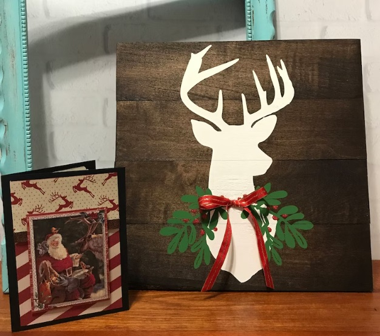

This article has been written and researched by our expert Loveable through a precise methodology. [Learn more about our methodology](https://avada.io/loveable/our-methodological.html)

[Loveable](https://avada.io/loveable/) > [Blog](https://avada.io/loveable/blog/) > [Holiday](https://avada.io/loveable/holiday/)

# 40+ Handcrafted Wooden Christmas Decorations that Infuse Any Space

Written by [Blake Simpson](https://avada.io/loveable/author/blake/) Last Updated on September 15, 2023

- [40+ Best DIY Wooden Christmas Decorations That Infuse Any Space with Rustic Holiday Charm](https://avada.io/loveable/blog/wooden-christmas-decorations/#wp-block-heading-2-2)
    - [1\. DIY Christmas Countdown Clock](https://avada.io/loveable/blog/wooden-christmas-decorations/#wp-block-heading-3-3)
    - [2\. DIY String Art Stocking Holders](https://avada.io/loveable/blog/wooden-christmas-decorations/#wp-block-heading-3-7)
    - [3\. DIY Personalized Wood Christmas Sign](https://avada.io/loveable/blog/wooden-christmas-decorations/#wp-block-heading-3-11)
    - [4\. DIY Christmas Countdown Calendar](https://avada.io/loveable/blog/wooden-christmas-decorations/#wp-block-heading-3-15)
    - [5\. Reclaimed Wood Christmas Tree and Star](https://avada.io/loveable/blog/wooden-christmas-decorations/#wp-block-heading-3-19)
    - [6\. Snowflake Wall Shelf](https://avada.io/loveable/blog/wooden-christmas-decorations/#wp-block-heading-3-23)
    - [7\. Tree Wall Shelf](https://avada.io/loveable/blog/wooden-christmas-decorations/#wp-block-heading-3-27)
    - [8\. Wooden Christmas Trees](https://avada.io/loveable/blog/wooden-christmas-decorations/#wp-block-heading-3-31)
    - [9\. Easy DIY Wooden Christmas Trees](https://avada.io/loveable/blog/wooden-christmas-decorations/#wp-block-heading-3-35)
    - [10\. Oversized Wood Ornament](https://avada.io/loveable/blog/wooden-christmas-decorations/#wp-block-heading-3-39)
    - [11\. DIY Wood Block Snowman](https://avada.io/loveable/blog/wooden-christmas-decorations/#wp-block-heading-3-43)
    - [12\. Wood Block Gnomes](https://avada.io/loveable/blog/wooden-christmas-decorations/#wp-block-heading-3-47)
    - [13\. Wooden Bead Snowman Ornaments](https://avada.io/loveable/blog/wooden-christmas-decorations/#wp-block-heading-3-51)
    - [14\. Names of Jesus Wooden Ornaments](https://avada.io/loveable/blog/wooden-christmas-decorations/#wp-block-heading-3-55)
    - [15\. DIY Painted Christmas Sign](https://avada.io/loveable/blog/wooden-christmas-decorations/#wp-block-heading-3-59)
    - [16\. DIY Oversized Wood Bead Garland](https://avada.io/loveable/blog/wooden-christmas-decorations/#wp-block-heading-3-63)
    - [17\. DIY Christmas Lantern Post](https://avada.io/loveable/blog/wooden-christmas-decorations/#wp-block-heading-3-67)
    - [18\. Handmade Wooden Christmas Trees](https://avada.io/loveable/blog/wooden-christmas-decorations/#wp-block-heading-3-71)
    - [19\. 2 Piece Pre-lit Christmas Tree Hanging Set](https://avada.io/loveable/blog/wooden-christmas-decorations/#wp-block-heading-3-74)
    - [20\. Handmade Wooden Reindeer Christmas Decoration](https://avada.io/loveable/blog/wooden-christmas-decorations/#wp-block-heading-3-77)
    - [21\. 24-Drawer Wooden Christmas Advent Calendar](https://avada.io/loveable/blog/wooden-christmas-decorations/#wp-block-heading-3-80)
    - [22\. Handmade Wooden Tree With Jute](https://avada.io/loveable/blog/wooden-christmas-decorations/#wp-block-heading-3-83)
    - [23\. Wooden Christmas Tree with Light](https://avada.io/loveable/blog/wooden-christmas-decorations/#wp-block-heading-3-86)
    - [24\. Wooden Gift Box Christmas Decor with LED Lights](https://avada.io/loveable/blog/wooden-christmas-decorations/#wp-block-heading-3-89)
    - [25\. Personalized Wood Handmade Snowflake Ornament](https://avada.io/loveable/blog/wooden-christmas-decorations/#wp-block-heading-3-92)
    - [26\. Battery-Operated LED Wood Village House](https://avada.io/loveable/blog/wooden-christmas-decorations/#wp-block-heading-3-95)
    - [27\. Christmas Village Mantel Garland Christmas Light Decorations](https://avada.io/loveable/blog/wooden-christmas-decorations/#wp-block-heading-3-98)
    - [28\. Cheerful Garland Chain of Wooden Gingerbread Men](https://avada.io/loveable/blog/wooden-christmas-decorations/#wp-block-heading-3-101)
    - [29\. Handcrafted Rustic Wooden Christmas Trees](https://avada.io/loveable/blog/wooden-christmas-decorations/#wp-block-heading-3-104)
    - [30\. Family Christmas Tree Log Wood Slice Sign Decoration](https://avada.io/loveable/blog/wooden-christmas-decorations/#wp-block-heading-3-107)
    - [31\. Shooting Star Triple Tea Light Candle Holder](https://avada.io/loveable/blog/wooden-christmas-decorations/#wp-block-heading-3-110)
    - [32\. Rustic Painted Reindeer Wooden Christmas Decor](https://avada.io/loveable/blog/wooden-christmas-decorations/#wp-block-heading-3-113)
    - [33\. Wooden Snowman Family Christmas Ornament](https://avada.io/loveable/blog/wooden-christmas-decorations/#wp-block-heading-3-116)
    - [34\. Personalized Family Christmas Ornament with Names](https://avada.io/loveable/blog/wooden-christmas-decorations/#wp-block-heading-3-119)
    - [35\. Here’s A Few Bucks for Christmas](https://avada.io/loveable/blog/wooden-christmas-decorations/#wp-block-heading-3-122)
    - [36\. Large Wooden Snowman Decor](https://avada.io/loveable/blog/wooden-christmas-decorations/#wp-block-heading-3-125)
    - [37\. Wooden Village Houses Decor](https://avada.io/loveable/blog/wooden-christmas-decorations/#wp-block-heading-3-128)
    - [38\. Wood Christmas Present Decor](https://avada.io/loveable/blog/wooden-christmas-decorations/#wp-block-heading-3-131)
    - [39\. Wood Felt Reindeer Elk Tree Decorations](https://avada.io/loveable/blog/wooden-christmas-decorations/#wp-block-heading-3-134)
    - [40\. Wood LED Christmas Ornaments](https://avada.io/loveable/blog/wooden-christmas-decorations/#wp-block-heading-3-137)
    - [41\. Christmas Lantern Light](https://avada.io/loveable/blog/wooden-christmas-decorations/#wp-block-heading-3-140) 
- [Bottom Line](https://avada.io/loveable/blog/wooden-christmas-decorations/#wp-block-heading-2-143)

As the holiday season ushers in its delightful festivities, a timeless way to infuse warmth and charm into your celebrations emerges with wooden Christmas decorations. What better way to bring warmth and charm to your celebrations over the holiday season than with wooden Christmas decorations? These classic items, which range from rustic ornaments to finely carved figures, evoke the Christmas spirit and infuse your decor with a touch of elegant naturalism. In this article, we dig into the world of wooden Christmas decorations, investigating the many forms, imaginative applications, and factors contributing to its enduring popularity as a festive decoration option.

## **40+ Best DIY Wooden Christmas Decorations That Infuse Any Space with Rustic Holiday Charm**

### **1\. DIY Christmas Countdown Clock**

This creative and engaging project allows you to craft a personalized countdown clock that enhances your festive decor and builds anticipation as you eagerly await the holiday season. Discover the joy of crafting as you design and assemble your very own countdown clock, making each passing day a delightful step closer to the magical Christmas celebration.

Get the tutorial at [Thrifty and Chic](http://www.thriftyandchic.com/2016/11/diy-wood-clock-christmas-advent-calendar.html)

### **2\. DIY String Art Stocking Holders**

This inventive project allows you to fashion one-of-a-kind stocking holders adorned with intricate string patterns that perfectly blend creativity and functionality. Crafted with care and tailored to your style, these string art stocking holders add a touch of personalized elegance to your festive home, ensuring your stockings are displayed with both grace and creativity.

Get the tutorial at [The Turquoise Home](https://theturquoisehome.com/diy-string-art-christmas-stocking-holders/)

### **3\. DIY Personalized Wood Christmas Sign**

It is wonderful to make a personalized wooden sign, whether for a gift or as a [Christmas decoration at home](https://avada.io/loveable/blog/christmas-house-decorations/), adds a wonderful touch. Primarily when the poster features a cheerful Santa! It truly brings out a charming vibe.

Get the tutorial at [Polka Dot Chair](https://www.polkadotchair.com/diy-personalized-wood-christmas-sign-a-cricut-project/)

### **4\. DIY Christmas Countdown Calendar**

Using this straightforward and attractive calendar is perfect for keeping track of the remaining days till Christmas. It assists you in keeping track of the days till the important day.

Get the tutorial at [The House of Wood](https://jenwoodhouse.com/diy-christmas-countdown-calendar/)

### **5\. Reclaimed Wood Christmas Tree and Star**

The person creating this craft opted for charmingly worn white planks, but feel free to choose any color that suits your [outdoor Christmas decor](https://avada.io/loveable/blog/diy-outdoor-christmas-decorations/). You have the flexibility to match it perfectly to your surroundings.

Get the tutorial at [Funky Junk Interiors](https://www.funkyjunkinteriors.net/2015/12/reclaimed-wood-christmas-tree-and-star-front-porch.html)

### **6\. Snowflake Wall Shelf**

The Snowflake Wall Shelf is a captivating blend of functionality and aesthetics that brings a touch of enchantment to your living space. This intricately designed wall shelf takes inspiration from the delicate beauty of snowflakes, adding a hint of winter magic to any room. 

Get the tutorial at [Wood Shop Diaries](https://www.woodshopdiaries.com/let-it-snow-my-diy-wooden-snowflake-shelf/)

### **7\. Tree Wall Shelf**

In this fantastic tree-shaped shelving unit, you have the space to keep presents, showcase a Christmas village, stand up your holiday cards, and explore many other creative possibilities.

Get the tutorial at [Jaime Costiglio](https://jaimecostiglio.com/2015/11/diy-tree-shelf.html)

### **8\. Wooden Christmas Trees**

If you love the charming appeal of rustic [farmhouse decor](https://avada.io/loveable/blog/farmhouse-christmas-decor/), these wood-slice Christmas trees are an ideal choice to enhance your mantel or tabletop during this festive season. They’re simple to create and will blend beautifully with your holiday setup.

Get the tutorial at [The Country Chic Cottage](https://www.thecountrychiccottage.net/wooden-christmas-tree/)

### **9\. Easy DIY Wooden Christmas Trees**

Numerous methods exist for crafting a wooden Christmas tree. Among the simplest and most cost-effective approaches is utilizing framing lumber, which we got in this guide. Furthermore, this technique only necessitates three power tools: a miter saw, a drill, and a brad nailer.

Get the tutorial at [Angela Marie Made](https://angelamariemade.com/easy-diy-wooden-christmas-trees/)

### **10\. Oversized Wood Ornament**

Large holiday decorations usually come with a hefty price, but this huge ornament is an exception. You can easily make it yourself without spending much.

Get the tutorial at [The Endearing Home](https://theendearinghome.com/2014/12/22/wood-holiday-ornament/)

### **11\. DIY Wood Block Snowman**

Crafting your own wooden snowman is a delightful project. It’s designed to be reversible, featuring a wintry phrase created using a Cricut machine. However, you can still create this craft if you don’t have access to a Cricut machine! And if you wish to make it reversible, you can handwrite the letters on the other side using a permanent marker or paint.

Get the tutorial at [Single Girl’s Diy](https://singlegirlsdiy.com/diy-wood-block-snowman/)

### **12\. Wood Block Gnomes**

Wood Block Gnomes is a heartwarming addition to your decor that infuses a sense of playfulness and enchantment into your living space. These charming wooden figurines capture the essence of whimsy and craftsmanship, making them the perfect accent for your home.

Get the tutorial at [Do Dodson Designs](https://www.dododsondesigns.com/wood-block-gnomes/)

### **13\. Wooden Bead Snowman Ornaments**

These adorable Wood Bead Snowman Ornaments are charming and incredibly simple to create! It’s a delightful Christmas project you can enjoy making with the children – and they could even share these cute ornaments with all their buddies!

Get the tutorial at [Creating Me](https://creatingme.net/2018/12/04/wood-bead-snowman-ornaments/)

### **14\. Names of Jesus Wooden Ornaments**

Each ornament showcases a different name of Jesus, encapsulating his various attributes and roles. Crafted from high-quality wood, these ornaments are visually appealing and serve as a meaningful reminder of the spiritual significance of Christmas.

Get the tutorial at [Emily’s Project List](https://www.emilysprojectlist.com/2020/12/02/names-of-jesus-simple-wood-ornaments/)

### **15\. DIY Painted Christmas Sign**

This wood sign with the joyful message “Joy to the World” is absolutely stylish, and it earns bonus points for seamlessly integrating a beloved crafting favorite – the grapevine wreath – into its design.

Get the tutorial at [Landeelu](https://www.landeeseelandeedo.com/diy-painted-christmas-sign/)

### **16\. DIY Oversized Wood Bead Garland**

Whether adorned with pine or displayed as is, this wooden garland offers a blend of simplicity, modernity, and elegance. What are you waiting for without checking out my DIY Oversize Wood Bead Christmas Garland?

Get the tutorial at [Inspired by Charm](https://inspiredbycharm.com/diy-oversized-wood-bead-garland/)

### **17\. DIY Christmas Lantern Post**

With the help of this candle-adorned lantern post, light up Santa’s route. For the whole post, the instructions make use of scrap wood.

Get the tutorial at [Woodshop Diaries](https://www.woodshopdiaries.com/christmas-diy-lantern-post/)

### **18\. [Handmade Wooden Christmas Trees](https://www.etsy.com/uk/listing/868786840/handmade-wooden-christmas-trees-scand)**

Handcrafted wooden Christmas decorations give Your festive atmosphere an additional distinctive touch. These handcrafted wooden Christmas trees come in four exquisite designs and are made from sustainable wood.

### **19.** **[2 Piece Pre-lit Christmas Tree Hanging Set](https://www.wayfair.co.uk/christmas-decorations/pdp/the-seasonal-aisle-2-piece-pre-lit-christmas-tree-hanging-house-ornament-set-u004214382.html)**

This captivating set of three hanging house ornaments offers a distinct method to adorn your Christmas tree. Each ornament is lit up by an LED flickering candle, creating a warm and snug ambiance.

### **20\.** [**Handmade Wooden Reindeer Christmas Decoration**](https://www.etsy.com/uk/listing/897341683/handmade-oak-wooden-reindeer-christmas)

For those who adore the delightful appeal of crafted wooden Christmas ornaments, this oak reindeer decoration will surely capture your heart. Pick your preferred collar color (and the possibility of a red nose) and decide whether you’d like a string to hang it up.

### **21\. [24-Drawer Wooden Christmas Advent Calendar](https://www.diy.com/departments/homcom-24-drawer-wooden-christmas-advent-calendar-wooden-light-up-decoration/5056534521318_BQ)**

Here’s a wonderful method to enjoy the days leading up to Christmas – a charming wooden advent calendar that brings joy to both grown-ups and kids. Beneath the roof, there’s a lit-up festive village scene, making this calendar even more enchanting. Fill the drawers with whatever delights you.

### **22\. [Handmade Wooden Tree With Jute](https://www.etsy.com/uk/listing/1108882034/hand-made-wooden-tree-with-jute-jingle)**

Adding jute accentuates the piece’s organic feel, adding texture and depth. The combination of wood and jute creates a harmonious blend that appeals to traditional and contemporary tastes, making this tree a timeless decor item.

### **23\. [Wooden Christmas Tree with Light](https://www.etsy.com/uk/listing/1352827741/2-and-3-feet-wooden-christmas-tree)**

With its expertly carved wooden form, this tree captures the essence of nature’s elegance, bringing an element of organic charm to your decor. Twinkling lights further enhance its visual appeal, creating a mesmerizing interplay of light and shadows that dance across its surface.

### **24\. [Wooden Gift Box Christmas Decor with LED Lights](https://www.amazon.com/Alpine-Corporation-3-Piece-Wooden-Christmas/dp/B0B35BGMXD)**

This enchanting piece seamlessly merges the allure of rustic elegance with modern illumination, creating a harmonious blend that captures the season’s spirit. Adding LED lights enhances its beauty, casting a gentle and inviting glow that transforms any space into a cozy haven of festivity.

### **25\. [Personalized Wood Handmade Snowflake Ornament](https://www.amazon.com/Personalized-Snowflake-Ornaments-Christmas-Decorations/dp/B07KQFS43Z)**

Personalized Wood Handmade Snowflake Ornament is a timeless piece of artistry that brings a touch of individuality to your holiday decor. Meticulously crafted by skilled hands, this ornament is a testament to both the beauty of handiwork and the uniqueness of your personal touch.

### **26\.** [**Battery-Operated LED Wood Village House**](https://www.amazon.com/Kurt-S-Adler-10-82-Inch-Battery-Operated/dp/B005PK1CE8)

The soft glow of LED lights emanates from within, casting a gentle and inviting radiance that brings the miniature village to life. Its intricate design and carefully carved features capture the essence of a quaint village scene, evoking a sense of nostalgia and wonder.

### **27\. [Christmas Village Mantel Garland Christmas Light Decorations](https://www.etsy.com/listing/722847840/christmas-village-mantel-garland)**

Drape the Christmas Village Mantel Garland across your mantel or display it as a centerpiece on your dining table to infuse your space with the festive spirit. It’s more than just a decoration; it’s a storybook scene that comes to life, a tangible expression of the joy and togetherness that define this special time of year.

### **28\. [Cheerful Garland Chain of Wooden Gingerbread Men](https://www.etsy.com/listing/567495401/gingerbread-man-wooden-bunting)**

What could be more adorable than a cheerful gingerbread man? A chain of gingerbread men, naturally! There are numerous ways to use this garland for your holiday decor – you can drape it around your tree, along the banister, or across a doorway.

### **29\. [Handcrafted Rustic Wooden Christmas Trees](https://www.etsy.com/listing/485798761/set-of-3-rustic-wooden-christmas-trees)**

These artistically designed conifers are crafted onto hand-sanded, hand-stained wooden planks to achieve an authentic driftwood appearance. They come pre-wrapped with twine, but you can explore using rope, pine garlands, or a string of lights. 

### **30\. [Family Christmas Tree Log Wood Slice Sign Decoration](https://www.etsy.com/uk/listing/874971539/personalised-family-christmas-tree-log)**

This gorgeous engraved Wood Slice is a perfect addition to your rustic Christmas decor. Featuring a delightful design of Santa’s Sleigh with Reindeer, it’s personalized with your family name, transforming it into a cherished keepsake that can be proudly displayed year after year.

### **31\.** [**Shooting Star Triple Tea Light Candle Holder**](https://www.etsy.com/uk/listing/1124128297/christmas-candle-holder-wooden-branch)

Capture the night sky with the Shooting Star Triple Tea Light Candle Holder. This exquisite piece blends artistry and functionality, creating a mesmerizing display that adds a touch of celestial wonder to your space.

### **32\. [Rustic Painted Reindeer Wooden Christmas Decor](https://www.etsy.com/listing/558028789/rustic-decor-christmas-reindeer-pallet)**

The wooden reindeer figurine boasts a rustic elegance, meticulously painted to evoke the cozy spirit of the holidays. Its quaint design adds a touch of nostalgia, while the intricate details bring the reindeer to life, from its antlers to its delicate features.

### **33\. [Wooden Snowman Family Christmas Ornament](https://www.etsy.com/listing/1056686674/wooden-snowman-family-christmas-ornament)**

The ornament depicts a charming snowman family, each figure carefully carved from quality wood. The intricate details and cheerful expressions convey a sense of warmth and camaraderie, embodying the spirit of family bonds during the holiday season.

### **34\. [Personalized Family Christmas Ornament with Names](https://www.etsy.com/listing/1103983717/personalized-family-christmas-ornament-)**

Hang it on your Christmas tree, display it on mantels, or even use it as a heartfelt gift for loved ones. The Personalized Family Christmas Ornament with Names adds a festive touch to your decor and serves as a tangible reminder of the cherished moments shared with your family.

### **35\. [Here’s A Few Bucks for Christmas](https://www.etsy.com/listing/1333065908/heres-a-few-bucks-for-christmas-money)**

With a convenient pocket to securely hold cash, this money holder is a thoughtful solution for those who appreciate the flexibility of receiving money while still maintaining the joy of unwrapping a present.

### **36\. [Large Wooden Snowman Decor](https://www.etsy.com/listing/1036344472/large-wooden-snowman-wood-snowman-winte)**

Standing tall, this snowman becomes a focal point in your decor, whether placed indoors or in a covered outdoor area. The natural textures of wood coupled with the snowman’s endearing features create a harmonious blend of simplicity and festive delight.

### **37\. [Wooden Village Houses Decor](https://www.etsy.com/listing/1332610142/modern-christmas-village-holiday-decor)**

Each wooden house showcases intricate detailing and craftsmanship, capturing the essence of quaint architecture and timeless beauty. The natural textures of wood bring warmth and authenticity to the decor, making it a versatile addition that complements various interior styles.

### **38\. [Wood Christmas Present Decor](https://www.etsy.com/listing/1108023429/wood-christmas-present-decor-farmhouse)**

Place these Wood Christmas Present Decors on tabletops, shelves, or as part of your overall decor scheme to create a heartwarming atmosphere. The timeless appeal of these wooden presents not only complements various interior styles but also serves as a reminder of the joy that comes from both giving and receiving.

### **39\. [Wood Felt Reindeer Elk Tree Decorations](https://www.etsy.com/listing/1330260915/christmas-home-decor-wool-and-wood-felt)**

As you bask in the ambiance of the holiday season, let these charming decorations serve as a reminder of the beauty of the natural world and the spirit of coziness and togetherness that define this special time of year. 

### **40\. [Wood LED Christmas Ornaments](https://www.etsy.com/listing/1347319057/santa-claus-lanternwood-led-christmas)**

As you immerse yourself in the joy of the holiday season, let these ornaments illuminate your surroundings with a touch of whimsy and radiance. These meticulously crafted ornaments seamlessly blend the warmth of wood with the modern touch of LED illumination, creating a captivating ambiance that radiates festive charm.

### **41\. [Christmas Lantern Light](https://www.etsy.com/listing/1276583672/christmas-lantern-light-merry-christmas)** 

Whether placed on your mantel, used as a centerpiece, or adorning your outdoor spaces, the Christmas Lantern Light adds a touch of enchantment to your celebrations, guiding the way to merriment and joy.

## **Bottom Line**

As you embark on your journey to deck the halls this holiday season, consider the enchantment that **wooden Christmas decorations** bring. From the intricacy of wooden ornaments to the creativity of figurines and the timelessness of wreaths, these pieces weave stories of tradition, craftsmanship, and nature’s elegance. Choosing wooden decorations infuse your celebrations with authenticity, warmth, and a touch of rustic allure. Let your holiday decor resonate with the true spirit of Christmas as you embrace the beauty of wooden adornments.

- [40+ Best DIY Wooden Christmas Decorations That Infuse Any Space with Rustic Holiday Charm](https://avada.io/loveable/blog/wooden-christmas-decorations/#wp-block-heading-2-2)
    - [1\. DIY Christmas Countdown Clock](https://avada.io/loveable/blog/wooden-christmas-decorations/#wp-block-heading-3-3)
    - [2\. DIY String Art Stocking Holders](https://avada.io/loveable/blog/wooden-christmas-decorations/#wp-block-heading-3-7)
    - [3\. DIY Personalized Wood Christmas Sign](https://avada.io/loveable/blog/wooden-christmas-decorations/#wp-block-heading-3-11)
    - [4\. DIY Christmas Countdown Calendar](https://avada.io/loveable/blog/wooden-christmas-decorations/#wp-block-heading-3-15)
    - [5\. Reclaimed Wood Christmas Tree and Star](https://avada.io/loveable/blog/wooden-christmas-decorations/#wp-block-heading-3-19)
    - [6\. Snowflake Wall Shelf](https://avada.io/loveable/blog/wooden-christmas-decorations/#wp-block-heading-3-23)
    - [7\. Tree Wall Shelf](https://avada.io/loveable/blog/wooden-christmas-decorations/#wp-block-heading-3-27)
    - [8\. Wooden Christmas Trees](https://avada.io/loveable/blog/wooden-christmas-decorations/#wp-block-heading-3-31)
    - [9\. Easy DIY Wooden Christmas Trees](https://avada.io/loveable/blog/wooden-christmas-decorations/#wp-block-heading-3-35)
    - [10\. Oversized Wood Ornament](https://avada.io/loveable/blog/wooden-christmas-decorations/#wp-block-heading-3-39)
    - [11\. DIY Wood Block Snowman](https://avada.io/loveable/blog/wooden-christmas-decorations/#wp-block-heading-3-43)
    - [12\. Wood Block Gnomes](https://avada.io/loveable/blog/wooden-christmas-decorations/#wp-block-heading-3-47)
    - [13\. Wooden Bead Snowman Ornaments](https://avada.io/loveable/blog/wooden-christmas-decorations/#wp-block-heading-3-51)
    - [14\. Names of Jesus Wooden Ornaments](https://avada.io/loveable/blog/wooden-christmas-decorations/#wp-block-heading-3-55)
    - [15\. DIY Painted Christmas Sign](https://avada.io/loveable/blog/wooden-christmas-decorations/#wp-block-heading-3-59)
    - [16\. DIY Oversized Wood Bead Garland](https://avada.io/loveable/blog/wooden-christmas-decorations/#wp-block-heading-3-63)
    - [17\. DIY Christmas Lantern Post](https://avada.io/loveable/blog/wooden-christmas-decorations/#wp-block-heading-3-67)
    - [18\. Handmade Wooden Christmas Trees](https://avada.io/loveable/blog/wooden-christmas-decorations/#wp-block-heading-3-71)
    - [19\. 2 Piece Pre-lit Christmas Tree Hanging Set](https://avada.io/loveable/blog/wooden-christmas-decorations/#wp-block-heading-3-74)
    - [20\. Handmade Wooden Reindeer Christmas Decoration](https://avada.io/loveable/blog/wooden-christmas-decorations/#wp-block-heading-3-77)
    - [21\. 24-Drawer Wooden Christmas Advent Calendar](https://avada.io/loveable/blog/wooden-christmas-decorations/#wp-block-heading-3-80)
    - [22\. Handmade Wooden Tree With Jute](https://avada.io/loveable/blog/wooden-christmas-decorations/#wp-block-heading-3-83)
    - [23\. Wooden Christmas Tree with Light](https://avada.io/loveable/blog/wooden-christmas-decorations/#wp-block-heading-3-86)
    - [24\. Wooden Gift Box Christmas Decor with LED Lights](https://avada.io/loveable/blog/wooden-christmas-decorations/#wp-block-heading-3-89)
    - [25\. Personalized Wood Handmade Snowflake Ornament](https://avada.io/loveable/blog/wooden-christmas-decorations/#wp-block-heading-3-92)
    - [26\. Battery-Operated LED Wood Village House](https://avada.io/loveable/blog/wooden-christmas-decorations/#wp-block-heading-3-95)
    - [27\. Christmas Village Mantel Garland Christmas Light Decorations](https://avada.io/loveable/blog/wooden-christmas-decorations/#wp-block-heading-3-98)
    - [28\. Cheerful Garland Chain of Wooden Gingerbread Men](https://avada.io/loveable/blog/wooden-christmas-decorations/#wp-block-heading-3-101)
    - [29\. Handcrafted Rustic Wooden Christmas Trees](https://avada.io/loveable/blog/wooden-christmas-decorations/#wp-block-heading-3-104)
    - [30\. Family Christmas Tree Log Wood Slice Sign Decoration](https://avada.io/loveable/blog/wooden-christmas-decorations/#wp-block-heading-3-107)
    - [31\. Shooting Star Triple Tea Light Candle Holder](https://avada.io/loveable/blog/wooden-christmas-decorations/#wp-block-heading-3-110)
    - [32\. Rustic Painted Reindeer Wooden Christmas Decor](https://avada.io/loveable/blog/wooden-christmas-decorations/#wp-block-heading-3-113)
    - [33\. Wooden Snowman Family Christmas Ornament](https://avada.io/loveable/blog/wooden-christmas-decorations/#wp-block-heading-3-116)
    - [34\. Personalized Family Christmas Ornament with Names](https://avada.io/loveable/blog/wooden-christmas-decorations/#wp-block-heading-3-119)
    - [35\. Here’s A Few Bucks for Christmas](https://avada.io/loveable/blog/wooden-christmas-decorations/#wp-block-heading-3-122)
    - [36\. Large Wooden Snowman Decor](https://avada.io/loveable/blog/wooden-christmas-decorations/#wp-block-heading-3-125)
    - [37\. Wooden Village Houses Decor](https://avada.io/loveable/blog/wooden-christmas-decorations/#wp-block-heading-3-128)
    - [38\. Wood Christmas Present Decor](https://avada.io/loveable/blog/wooden-christmas-decorations/#wp-block-heading-3-131)
    - [39\. Wood Felt Reindeer Elk Tree Decorations](https://avada.io/loveable/blog/wooden-christmas-decorations/#wp-block-heading-3-134)
    - [40\. Wood LED Christmas Ornaments](https://avada.io/loveable/blog/wooden-christmas-decorations/#wp-block-heading-3-137)
    - [41\. Christmas Lantern Light](https://avada.io/loveable/blog/wooden-christmas-decorations/#wp-block-heading-3-140) 
- [Bottom Line](https://avada.io/loveable/blog/wooden-christmas-decorations/#wp-block-heading-2-143)

### [Blake Simpson](https://avada.io/loveable/author/blake/)

Hi, I'm Blake from Loveable. I help people find perfect gifts for occasions like anniversaries and weddings. I also write a blog about holidays, sharing insights to make them more meaningful. Let's create unforgettable moments together!

- [Twitter](https://twitter.com/intent/tweet)
- [Facebook](https://www.facebook.com/sharer/sharer.php)
- [instagram](https://avada.io/loveable/blog/wooden-christmas-decorations/)
- [pinterest](https://www.pinterest.com/loveablellc/)

## Related Posts

[### 120+ Christian Birthday Wishes To Spread Your Love](https://avada.io/loveable/blog/christian-birthday-wishes/) 

[

### 35 Best 70th Birthday Ideas To Celebrate The Special Milestone

](https://avada.io/loveable/blog/70th-birthday-ideas/)

[

### 50 Best 30th Birthday Decorations for a Remarkable Birthday Bash

](https://avada.io/loveable/blog/30th-birthday-decorations/)

[

### 40 Delicious Vegan Christmas Desserts to Delight Your Palate

](https://avada.io/loveable/blog/vegan-christmas-desserts/)

[

### 60 Christmas Team Building Activities to Boost Workplace Spirit

](https://avada.io/loveable/blog/christmas-team-building-activities/)
