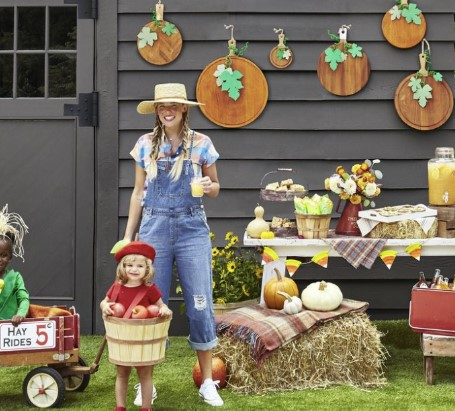

This article has been written and researched by our expert Loveable through a precise methodology. [Learn more about our methodology](https://avada.io/loveable/our-methodological.html)

[Loveable](https://avada.io/loveable/) > [Blog](https://avada.io/loveable/blog/) > [Holiday](https://avada.io/loveable/holiday/)

# 40+ Hot Trend Halloween Decoration Ideas You Can Follow In 2023

Written by [Blake Simpson](https://avada.io/loveable/author/blake/) Last Updated on August 23, 2023

- [Creative DIY Halloween Decoration Ideas](https://avada.io/loveable/blog/halloween-decoration-ideas/#wp-block-heading-2-4)
    - [1\. Haunted Archway](https://avada.io/loveable/blog/halloween-decoration-ideas/#wp-block-heading-3-5)
    - [2\. Spooky Spiders](https://avada.io/loveable/blog/halloween-decoration-ideas/#wp-block-heading-3-8)
    - [3\. Transferware Pumpkins](https://avada.io/loveable/blog/halloween-decoration-ideas/#wp-block-heading-3-12)
    - [4\. Front Door Wreath](https://avada.io/loveable/blog/halloween-decoration-ideas/#wp-block-heading-3-15)
    - [5\. Floral Pumpkin](https://avada.io/loveable/blog/halloween-decoration-ideas/#wp-block-heading-3-18)
    - [6\. Mouse Infested Stairway](https://avada.io/loveable/blog/halloween-decoration-ideas/#wp-block-heading-3-22)
    - [7\. Sinister Tone](https://avada.io/loveable/blog/halloween-decoration-ideas/#wp-block-heading-3-25)
    - [8\. Leaf Ghosts](https://avada.io/loveable/blog/halloween-decoration-ideas/#wp-block-heading-3-28)
    - [9\. Cob Web-Covered Doors](https://avada.io/loveable/blog/halloween-decoration-ideas/#wp-block-heading-3-31)
    - [10\. Skull String Art](https://avada.io/loveable/blog/halloween-decoration-ideas/#wp-block-heading-3-34)
    - [11\. Paper Pumpkin Wreath for Halloween](https://avada.io/loveable/blog/halloween-decoration-ideas/#wp-block-heading-3-37)
    - [12\. Mummy Up a Fall Planter](https://avada.io/loveable/blog/halloween-decoration-ideas/#wp-block-heading-3-40)
    - [13\. Wine Bottle Candlesticks](https://avada.io/loveable/blog/halloween-decoration-ideas/#wp-block-heading-3-43)
    - [14\. Halloween Door Mat](https://avada.io/loveable/blog/halloween-decoration-ideas/#wp-block-heading-3-46)
    - [15\. DIY Halloween Party Decorations](https://avada.io/loveable/blog/halloween-decoration-ideas/#wp-block-heading-3-49)
    - [16\. Spellbooks](https://avada.io/loveable/blog/halloween-decoration-ideas/#wp-block-heading-3-52)
    - [17\. Eerie Living Room](https://avada.io/loveable/blog/halloween-decoration-ideas/#wp-block-heading-3-55)
- [Easy DIY Halloween Decoration Ideas](https://avada.io/loveable/blog/halloween-decoration-ideas/#wp-block-heading-2-58)
    - [18\. Creepy Critters](https://avada.io/loveable/blog/halloween-decoration-ideas/#wp-block-heading-3-59)
    - [19\. Jar Jack ‘O Lanterns](https://avada.io/loveable/blog/halloween-decoration-ideas/#wp-block-heading-3-62)
    - [20\. Spool and Bobbin Display](https://avada.io/loveable/blog/halloween-decoration-ideas/#wp-block-heading-3-65)
    - [21\. Dress the Windows](https://avada.io/loveable/blog/halloween-decoration-ideas/#wp-block-heading-3-68)
    - [22\. Glow In the Dark](https://avada.io/loveable/blog/halloween-decoration-ideas/#wp-block-heading-3-71)
    - [23\. Cat String Lights](https://avada.io/loveable/blog/halloween-decoration-ideas/#wp-block-heading-3-74)
    - [24\. Shadowy Scene](https://avada.io/loveable/blog/halloween-decoration-ideas/#wp-block-heading-3-77)
    - [25\. Halloween Front Porch](https://avada.io/loveable/blog/halloween-decoration-ideas/#wp-block-heading-3-84)
    - [26\. Witch’s Cauldron](https://avada.io/loveable/blog/halloween-decoration-ideas/#wp-block-heading-3-87)
    - [27\. Pumpkins Black Cats](https://avada.io/loveable/blog/halloween-decoration-ideas/#wp-block-heading-3-90)
    - [28\. Paper Bats on Windows](https://avada.io/loveable/blog/halloween-decoration-ideas/#wp-block-heading-3-93)
    - [29\. Copper Painted Pumpkins](https://avada.io/loveable/blog/halloween-decoration-ideas/#wp-block-heading-3-96)
- [Best Outdoor Halloween Decoration Ideas](https://avada.io/loveable/blog/halloween-decoration-ideas/#wp-block-heading-2-99)
    - [30\. Lucky Black Cat Mum-star](https://avada.io/loveable/blog/halloween-decoration-ideas/#wp-block-heading-3-100)
    - [31\. Frankenstein Painted Jugs](https://avada.io/loveable/blog/halloween-decoration-ideas/#wp-block-heading-3-107)
    - [32\. Horror Novel Door](https://avada.io/loveable/blog/halloween-decoration-ideas/#wp-block-heading-3-110)
    - [33\. Witch Pumpkin](https://avada.io/loveable/blog/halloween-decoration-ideas/#wp-block-heading-3-113)
    - [34\. Paper Lanterns](https://avada.io/loveable/blog/halloween-decoration-ideas/#wp-block-heading-3-116)
    - [35\. Etched Vine Topiary Pumpkin](https://avada.io/loveable/blog/halloween-decoration-ideas/#wp-block-heading-3-119)
    - [36\. Candy Corn Piñata](https://avada.io/loveable/blog/halloween-decoration-ideas/#wp-block-heading-3-122)
    - [37\. Spider Wreath](https://avada.io/loveable/blog/halloween-decoration-ideas/#wp-block-heading-3-126)
    - [38\. Spiderweb Cake](https://avada.io/loveable/blog/halloween-decoration-ideas/#wp-block-heading-3-129)
    - [39\. Crafty Candy Hanger](https://avada.io/loveable/blog/halloween-decoration-ideas/#wp-block-heading-3-132)
    - [40\. Orange Skeleton Wreath](https://avada.io/loveable/blog/halloween-decoration-ideas/#wp-block-heading-3-136)
    - [41\. Tattered Curtains](https://avada.io/loveable/blog/halloween-decoration-ideas/#wp-block-heading-3-139)
- [Bottom Line](https://avada.io/loveable/blog/halloween-decoration-ideas/#wp-block-heading-2-142)

Welcome to our collection of **99+ hot-trend Halloween decoration ideas for 2023**! Get ready to elevate your Halloween festivities with these creative and spooky suggestions. Whether you’re hosting a party or simply want to add a festive touch to your home, we’ve got plenty of inspiration for you. 

From eerie displays to enchanting details, this guide has it all. Join us as we explore the latest trends in Halloween decorations and discover exciting ways to make this year’s celebration truly unforgettable. Let’s dive in and unleash your Halloween creativity!

And if you want to give an [amazing gift to anyone on Halloween](https://avada.io/loveable/halloween/), [Loveable](https://loveable.ai/) is here to accompany you. Our store offers hundreds of personalized gifts and hot-picked products on Amazon. You won’t want to miss out on this Halloween 2023!

## **Creative DIY Halloween Decoration Ideas**

### **1\. Haunted Archway**

Let’s kick off the party with a super spooky entrance that will wow your guests! Start by placing two branches on each side of the walkway. Bend the tops of the branches together and tie them securely with garden twine. Then, cover the branches with cobwebs, shaping them as you go. You can add a skeleton crew to complete the spooky scene for an extra eerie touch. 

### **2\. Spooky Spiders**

Get ready for a fun [Halloween activity](https://avada.io/loveable/halloween-traditions/) that you and the kids can do together! We’re going to show you how to easily make giant spiders that are sure to give everyone the creeps. All you need are some affordable materials from the craft store and a bit of imagination. Follow our simple instructions below to create your very own spooky Halloween props.

Tutorials: [Spooky Spiders](https://www.hgtv.com/lifestyle/holidays/halloween-diy-spooky-spiders)

### **3\. Transferware Pumpkins**

All you need is some Mod Podge and a trip to the color copier to transform your favorite plates and trays into pumpkins. Here’s how: Make a color copy of your preferred designs, then cut the paper into strips. Use Mod Podge to stick the strips onto a pumpkin or gourd and let it dry. Once done, place your homemade Halloween decorations alongside your real transferware pieces, and watch as visitors do a double take.

### **4\. Front Door Wreath**

Enhance your front door with a touch of Halloween spirit using a stylish wreath. This vine wreath takes a subtle and sophisticated approach with black ribbon and leafy branches, creating an elegant and understated look. If you’re seeking a departure from the traditional bright orange hues, this neutral color scheme is perfect for adding a sophisticated holiday accent to your home.

### **5\. Floral Pumpkin**

Prepare to be amazed by the most sophisticated [Halloween decor piece](https://avada.io/loveable/blog/halloween-decoration-ideas/) you’ve ever seen. All it takes is a pumpkin, paint, and faux flowers. Get ready to elevate your Halloween decorations with this easy and stunning DIY project.

**Tutorial at [The Merry Thought](https://themerrythought.com/diy/diy-floral-pumpkin/)**

### **6\. Mouse Infested Stairway**

To add a whimsical touch to your staircase, follow these simple steps: Print out mouse templates onto black paper and carefully cut them out using scissors. Then, use double-sided tape to securely attach the mice to your staircase. This playful and [easy DIY project](https://avada.io/loveable/blog/diy-halloween-costume-ideas/) will bring a delightful Halloween vibe to your home.

### **7\. Sinister Tone**

Combining dry ice with spooky decor creates a Halloween atmosphere that’s truly otherworldly. However, it’s crucial to handle this subzero substance with caution. Safety should always come first. Don’t worry, though, because we’ve got you covered! Below, you’ll find our expert tips on how to incorporate dry ice safely and effectively into your haunted house. Learn how to achieve an eerie effect without any risks of burns or accidents.

### **8\. Leaf Ghosts**

Start by gathering fallen leaves and giving them a coat of white paint. Once dry, you can add eyes using a permanent marker. These cute little ghost leaves can be used in various ways to add a spooky touch to your home. Decorate a plain table runner with them or glue them onto pumpkins for an extra festive touch. 

### **9\. Cob Web-Covered Doors**

Create a spooky ambiance by [covering your front doors](https://avada.io/loveable/blog/halloween-door-decorations/) with cobwebs and adding hanging ghosts, skulls, pumpkins, and other Halloween decorations. Get ready to impress and spook your guests with a frightfully fun entrance!

### **10\. Skull String Art**

Transforming your mantle or shelf into a wow-worthy display is easier than you think! Simply paint a piece of plywood, place a few nails, and then twist the string around the nails. This simple technique will add a touch of charm and create an eye-catching decor arrangement.

### **11\. Paper Pumpkin Wreath for Halloween**

Looking to make a pumpkin-themed [wreath at home](https://avada.io/loveable/blog/diy-halloween-wreath/)? Gather orange, brown, black, and white paper along with twine, thin wire, and ribbon. With these supplies, you can create a unique jack-o’-lantern wreath that doesn’t require actual pumpkins. For a detailed tutorial on making the Paper Pumpkin Wreath for Halloween, head over to Crafting Cheerfully.

### **12\. Mummy Up a Fall Planter**

Want to give your front porch planter a spooktacular makeover without breaking the bank? You’re in luck! With just under $10, you can transform it into a mummy masterpiece that’s both affordable and removable. We’ve got all the tips and tricks you need to pull off this eerie transformation. 

### **13\. Wine Bottle Candlesticks**

Create an eerie flickering ambiance at your Halloween gathering with this simple trick. Start by painting wine bottles with matte-black spray paint. Once the paint is dry, insert an orange taper candle into each bottle opening. The contrast between the black bottles and the glowing orange candles will add a hauntingly beautiful touch to your decorations. 

### **14\. Halloween Door Mat**

Add a fun Halloween door mat to greet your guests and prevent dirt from coming inside. You can use one inspired by a popular holiday movie for a playful touch. To make it stand out even more, place the door mat on top of a bigger rug or mat with a different pattern and color.

### **15\. DIY Halloween Party Decorations**

Decorate your family-friendly event with pumpkin-shaped wooden cutting boards. Use orangewood stain, paper leaves, and pipe cleaner tendrils to create a delightful pumpkin look. Craft a candy cane garland by painting paper plates with orange and yellow stripes. Place a seasonal arrangement in a vintage metal container and elevate your buffet table with mini hay bales and wooden crates to add some height and charm.

### **16\. Spellbooks**

Give your new books a vintage touch by covering them with removable leather jackets that you’ve distressed and antiqued. This will make them look like old leather-bound tomes. Create a captivating display by stacking these books alongside lit taper candles, adding a touch of spooky sophistication to your vignette. Follow [our instructions](https://www.hgtv.com/design/make-and-celebrate/handmade/how-to-make-distressed-leather-wrapped-books) to learn how to work your magic and create these leather jackets.

### **17\. Eerie Living Room**

These do-it-yourself Halloween decorating ideas are incredibly simple; it’s almost scary! Get inspired by Miss Havisham’s style and drape sheets over chairs to give your room a ruined look. Next, create a “cobweb” effect by stringing cheesecloth across a mirror. For an eerie touch, secure curly willow branches in candlesticks using museum wax.

## **Easy DIY Halloween Decoration Ideas**

### **18\. Creepy Critters**

Transform your foyer into a haunting scene without causing actual destruction. Simply place fabric batting and stuffed mice on a seldom-used antique chair to create the illusion of a once-cherished piece being torn apart by a mouse infestation. 

### **19\. Jar Jack ‘O Lanterns**

Let your creativity shine as you create these charming ghost and Jack O’Lantern decorations for your front steps using a handful of supplies. Prepare mason jars, orange and white tissue paper, black paper, mod podge, and a paintbrush, and don’t forget flameless tea light candles to bring your finished decorations to life.

### **20\. Spool and Bobbin Display**

Get ready to stack and upgrade your mantel with these quick and effortless DIY Halloween decorations. Simply place small pumpkins on top of wooden spools and bobbins for an instant transformation that takes just 60 seconds.

### **21\. Dress the Windows**

Turn the front of your home into a spooky spectacle in no time by using stencils to decorate curtains with Halloween designs. This simple trick will instantly transform your windows or clear doors into a haunting scene that will delight passersby.

### **22\. Glow In the Dark**

Elevate your outdoor Halloween decor by incorporating glow-in-the-dark objects for a captivating effect. Create a charming vignette by your front door using lanterns and a glow-in-the-dark ball. To enhance the theme, use a glue gun to attach small plastic spiders and a white cobweb over the lanterns.

### **23\. Cat String Lights**

To create Cat String Lights, start by downloading and printing our cat face template. Cut out the template and trace it onto black card stock using a white pencil. Cut out the desired number of cat faces and fringe the sides and top of each face with scissors. For each cat, take three 4-inch pieces of black waxed twine, knot them together in the center, and glue them to the cat’s face as whiskers. Use a single-hole punch to create eye holes about 2 1/2 inches apart. Hang your string lights and attach the cat faces by pushing a light through each eye hole, spacing them evenly along the string lights.

### **24\. Shadowy Scene**

You can turn your plain garage door into a spooky Halloween scene with just adhesive black vinyl sheets and a little creativity. The best part is that it’s super easy to remove when Halloween is over. Here are some more tips to help you recreate this look:

- Buy adhesive black vinyl sheets from a craft or home improvement store.
- Measure your garage door and cut the vinyl sheets to fit.
- Carefully stick the black vinyl onto your garage door, smoothing out any wrinkles or bubbles.
- Let your imagination run wild and create a shadowy scene by cutting out shapes like bats, witches, or other Halloween stuff from more black vinyl sheets.

### **25\. Halloween Front Porch**

Create a festive Halloween atmosphere by going all out with your decorations. Line your steps with pumpkins, hang ghost decorations from the porch ceiling, wrap garland around the railing, and add bats to the siding and spiders to the columns. These additions will give your home an extra dose of spookiness and bring out the Halloween spirit.

### **26\. Witch’s Cauldron**

Bring your Halloween punch to life with a spooky setup. Place battery-operated LED lights in a grapevine wreath, add tissue paper flames, and place a cauldron on top. Fill the cauldron with dry ice and your favorite Halloween cocktail for an extra touch of excitement. Enjoy the eerie atmosphere as your punch display becomes a captivating centerpiece.

### **27\. Pumpkins Black Cats**

Give a warm Halloween welcome to trick-or-treaters and guests by crafting a litter of black cat pumpkins. These adorable feline-inspired creations are perfect for all ages, making them a great project for older children or younger ones with some assistance from a crafty adult. The best part? You won’t need to carve them!

### **28\. Paper Bats on Windows**

Create a spooky atmosphere both indoors and outdoors by cutting bats out of black cardstock and attaching them to your windows using double-sided tape. For a realistic effect and added visual interest, use bats of different shapes and sizes. This will bring depth and contrast to your Halloween decorations.

### **29\. Copper Painted Pumpkins**

Create a stunning display by combining your cookware collectibles with pumpkins coated in metallic acrylic copper paint. The shimmering effect will add a touch of elegance and autumnal charm. You can showcase these beautifully painted pumpkins alongside or even inside your cookware collection, creating a cohesive and eye-catching arrangement.

## **Best Outdoor Halloween Decoration Ideas**

### **30\. Lucky Black Cat Mum-star**

Infuse some personality into your planters by following our tips to transform a fall mum into a charming, lucky black cat just in time for Halloween. Get crafty and create your own using the instructions provided below.

- Start with a fall mum of your choice, preferably in a vibrant color like orange or black.
- Cut out two triangular-shaped ears from black craft paper or felt.
- Attach the ears to the mum by using a small amount of adhesive or by carefully inserting them into the plant’s soil.
- Use craft paper or felt to cut out two large circular eyes and a smaller triangular nose. Feel free to get creative with different eye shapes or add whiskers for extra flair.

### **31\. Frankenstein Painted Jugs**

Transform your old empty jugs and canisters into delightful Halloween decorations for your backyard. Use waterproof paint in green, black, and white to craft adorable Frankenstein faces, or get creative with other spooky characters like ghosts, Jack O’Lanterns, or the Sanderson Sisters. Let your imagination run wild and enjoy the fun DIY project while giving a new purpose to these items.

### **32\. Horror Novel Door**

Incorporate spooky classic books into your Halloween decor with a Book Door. Cut rectangular pieces of colored kraft paper, write book titles on them, outline them with a gold paint pen, and attach them to your door with double-sided tape. Add a bushel basket and buffalo-check doormat for an extra touch.

### **33\. Witch Pumpkin**

Bring some magic to your front porch or entryway with a charming witch decoration that’s not too scary. All you need are basic supplies from the craft store and a faux pumpkin. Use your creativity to craft a friendly witch to welcome Halloween guests, or go for a scowling witch to ward off mischief-makers. 

### **34\. Paper Lanterns**

Add a festive touch to your walkway with these adorable Halloween lanterns. To recreate them, all you need are orange paper bags and a black Sharpie for the faces. Once you’ve drawn the spooky expressions, place flameless tea light candles inside the bags for a safe and fun accent to illuminate your front yard. These lanterns will create a welcoming and enchanting atmosphere for your Halloween celebrations.

### **35\. Etched Vine Topiary Pumpkin**

Create a sophisticated front door display with a trio of pumpkins. Stack one large, one medium, and one small pumpkin in any color combo. Remove the stems from the large and medium pumpkins. Sketch a vine pattern on one pumpkin and carve it with a linoleum tool. Finally, attach red berries or beads with hot glue for an elegant touch. Place them on the porch or layer them on a vintage chair with plaid blankets for added charm.

### **36\. Candy Corn Piñata**

No Halloween is complete without candy, so why not add a colorful piñata to your Halloween festivities? This DIY project serves as a vibrant party decoration and a thrilling game for your Halloween get-together. Get started by using our free templates and following the step-by-step instructions provided below.

**Tutorial:** [Make a Candy Corn Pinata for Halloween](https://www.hgtv.com/design/make-and-celebrate/handmade/how-to-make-a-candy-corn-pinata-for-halloween)

### **37\. Spider Wreath**

Create a delightful Halloween wreath with this DIY project that embraces the classic color combination for a festive holiday look. Begin by taking a round foam wreath and wrapping it with orange ribbon, securing the ribbon at the back with hot glue. Then, attach a decorative black spider to the bottom of the wreath and hang it using a black ribbon. This adorable wreath will bring a touch of Halloween charm to your door, welcoming guests with a whimsical spirit.

### **38\. Spiderweb Cake**

Impress your guests with minimal effort by adding a simple yet eye-catching decoration to a store-bought cake. All you need to do is transfer white frosting to a cream bag fitted with a small tip. Then, slowly pipe the frosting onto the cake in a random pattern to create a spiderweb-like design. Finish it by topping the cake with plastic spiders for an extra spooky touch. This easy decoration will make your cake look like a masterpiece and leave your guests thinking you put in much effort.

### **39\. Crafty Candy Hanger**

Create a delightful interactive candy bowl for trick-or-treaters by transforming a faux pumpkin and an old frame into a playful black cat-themed candy holder. Simply paint the pumpkin and frame black, attach the pumpkin to the frame, and cut out the cat’s facial features. Hang or lean it against a wall, and watch as the kiddos enjoy reaching into the cat’s mouth for treats.

**Check out the tutorial:** [DIY Black Cat Candy Hanger](https://www.hgtv.com/lifestyle/holidays/halloween-diy-black-cat-candy-hanger).

### **40\. Orange Skeleton Wreath**

If you already have a fall wreath adorning your front door, there’s no need to replace it entirely with a new Halloween-themed wreath. Instead, you can add a whimsical touch by incorporating a small skeleton or skull. Attach it securely using floral wire or a twisty tie, ensuring it stays in place throughout the Halloween season.

### **41\. Tattered Curtains**

Create a haunting atmosphere by repurposing Dotted Swiss fabric into a torn and tattered curtain. Serve a chilling lychee eyeball punch in vintage battery glasses and scatter black craft paper rat silhouettes throughout the display.

## **Bottom Line**

All in all, these **40+ hot-trend Halloween decoration ideas for 2023** offer a wide range of spooky and creative options to transform your home. From eerie lighting to intricate pumpkin carvings, there’s something for everyone to enjoy. Embrace the spirit of the season and make this Halloween a memorable one with these trendy ideas.

- [Creative DIY Halloween Decoration Ideas](https://avada.io/loveable/blog/halloween-decoration-ideas/#wp-block-heading-2-4)
    - [1\. Haunted Archway](https://avada.io/loveable/blog/halloween-decoration-ideas/#wp-block-heading-3-5)
    - [2\. Spooky Spiders](https://avada.io/loveable/blog/halloween-decoration-ideas/#wp-block-heading-3-8)
    - [3\. Transferware Pumpkins](https://avada.io/loveable/blog/halloween-decoration-ideas/#wp-block-heading-3-12)
    - [4\. Front Door Wreath](https://avada.io/loveable/blog/halloween-decoration-ideas/#wp-block-heading-3-15)
    - [5\. Floral Pumpkin](https://avada.io/loveable/blog/halloween-decoration-ideas/#wp-block-heading-3-18)
    - [6\. Mouse Infested Stairway](https://avada.io/loveable/blog/halloween-decoration-ideas/#wp-block-heading-3-22)
    - [7\. Sinister Tone](https://avada.io/loveable/blog/halloween-decoration-ideas/#wp-block-heading-3-25)
    - [8\. Leaf Ghosts](https://avada.io/loveable/blog/halloween-decoration-ideas/#wp-block-heading-3-28)
    - [9\. Cob Web-Covered Doors](https://avada.io/loveable/blog/halloween-decoration-ideas/#wp-block-heading-3-31)
    - [10\. Skull String Art](https://avada.io/loveable/blog/halloween-decoration-ideas/#wp-block-heading-3-34)
    - [11\. Paper Pumpkin Wreath for Halloween](https://avada.io/loveable/blog/halloween-decoration-ideas/#wp-block-heading-3-37)
    - [12\. Mummy Up a Fall Planter](https://avada.io/loveable/blog/halloween-decoration-ideas/#wp-block-heading-3-40)
    - [13\. Wine Bottle Candlesticks](https://avada.io/loveable/blog/halloween-decoration-ideas/#wp-block-heading-3-43)
    - [14\. Halloween Door Mat](https://avada.io/loveable/blog/halloween-decoration-ideas/#wp-block-heading-3-46)
    - [15\. DIY Halloween Party Decorations](https://avada.io/loveable/blog/halloween-decoration-ideas/#wp-block-heading-3-49)
    - [16\. Spellbooks](https://avada.io/loveable/blog/halloween-decoration-ideas/#wp-block-heading-3-52)
    - [17\. Eerie Living Room](https://avada.io/loveable/blog/halloween-decoration-ideas/#wp-block-heading-3-55)
- [Easy DIY Halloween Decoration Ideas](https://avada.io/loveable/blog/halloween-decoration-ideas/#wp-block-heading-2-58)
    - [18\. Creepy Critters](https://avada.io/loveable/blog/halloween-decoration-ideas/#wp-block-heading-3-59)
    - [19\. Jar Jack ‘O Lanterns](https://avada.io/loveable/blog/halloween-decoration-ideas/#wp-block-heading-3-62)
    - [20\. Spool and Bobbin Display](https://avada.io/loveable/blog/halloween-decoration-ideas/#wp-block-heading-3-65)
    - [21\. Dress the Windows](https://avada.io/loveable/blog/halloween-decoration-ideas/#wp-block-heading-3-68)
    - [22\. Glow In the Dark](https://avada.io/loveable/blog/halloween-decoration-ideas/#wp-block-heading-3-71)
    - [23\. Cat String Lights](https://avada.io/loveable/blog/halloween-decoration-ideas/#wp-block-heading-3-74)
    - [24\. Shadowy Scene](https://avada.io/loveable/blog/halloween-decoration-ideas/#wp-block-heading-3-77)
    - [25\. Halloween Front Porch](https://avada.io/loveable/blog/halloween-decoration-ideas/#wp-block-heading-3-84)
    - [26\. Witch’s Cauldron](https://avada.io/loveable/blog/halloween-decoration-ideas/#wp-block-heading-3-87)
    - [27\. Pumpkins Black Cats](https://avada.io/loveable/blog/halloween-decoration-ideas/#wp-block-heading-3-90)
    - [28\. Paper Bats on Windows](https://avada.io/loveable/blog/halloween-decoration-ideas/#wp-block-heading-3-93)
    - [29\. Copper Painted Pumpkins](https://avada.io/loveable/blog/halloween-decoration-ideas/#wp-block-heading-3-96)
- [Best Outdoor Halloween Decoration Ideas](https://avada.io/loveable/blog/halloween-decoration-ideas/#wp-block-heading-2-99)
    - [30\. Lucky Black Cat Mum-star](https://avada.io/loveable/blog/halloween-decoration-ideas/#wp-block-heading-3-100)
    - [31\. Frankenstein Painted Jugs](https://avada.io/loveable/blog/halloween-decoration-ideas/#wp-block-heading-3-107)
    - [32\. Horror Novel Door](https://avada.io/loveable/blog/halloween-decoration-ideas/#wp-block-heading-3-110)
    - [33\. Witch Pumpkin](https://avada.io/loveable/blog/halloween-decoration-ideas/#wp-block-heading-3-113)
    - [34\. Paper Lanterns](https://avada.io/loveable/blog/halloween-decoration-ideas/#wp-block-heading-3-116)
    - [35\. Etched Vine Topiary Pumpkin](https://avada.io/loveable/blog/halloween-decoration-ideas/#wp-block-heading-3-119)
    - [36\. Candy Corn Piñata](https://avada.io/loveable/blog/halloween-decoration-ideas/#wp-block-heading-3-122)
    - [37\. Spider Wreath](https://avada.io/loveable/blog/halloween-decoration-ideas/#wp-block-heading-3-126)
    - [38\. Spiderweb Cake](https://avada.io/loveable/blog/halloween-decoration-ideas/#wp-block-heading-3-129)
    - [39\. Crafty Candy Hanger](https://avada.io/loveable/blog/halloween-decoration-ideas/#wp-block-heading-3-132)
    - [40\. Orange Skeleton Wreath](https://avada.io/loveable/blog/halloween-decoration-ideas/#wp-block-heading-3-136)
    - [41\. Tattered Curtains](https://avada.io/loveable/blog/halloween-decoration-ideas/#wp-block-heading-3-139)
- [Bottom Line](https://avada.io/loveable/blog/halloween-decoration-ideas/#wp-block-heading-2-142)

### [Blake Simpson](https://avada.io/loveable/author/blake/)

Hi, I'm Blake from Loveable. I help people find perfect gifts for occasions like anniversaries and weddings. I also write a blog about holidays, sharing insights to make them more meaningful. Let's create unforgettable moments together!

- [Twitter](https://twitter.com/intent/tweet)
- [Facebook](https://www.facebook.com/sharer/sharer.php)
- [instagram](https://avada.io/loveable/blog/halloween-decoration-ideas/)
- [pinterest](https://www.pinterest.com/loveablellc/)

## Related Posts

[### 120+ Christian Birthday Wishes To Spread Your Love](https://avada.io/loveable/blog/christian-birthday-wishes/) 

[

### 35 Best 70th Birthday Ideas To Celebrate The Special Milestone

](https://avada.io/loveable/blog/70th-birthday-ideas/)

[

### 50 Best 30th Birthday Decorations for a Remarkable Birthday Bash

](https://avada.io/loveable/blog/30th-birthday-decorations/)

[

### 40 Delicious Vegan Christmas Desserts to Delight Your Palate

](https://avada.io/loveable/blog/vegan-christmas-desserts/)

[

### 60 Christmas Team Building Activities to Boost Workplace Spirit

](https://avada.io/loveable/blog/christmas-team-building-activities/)
