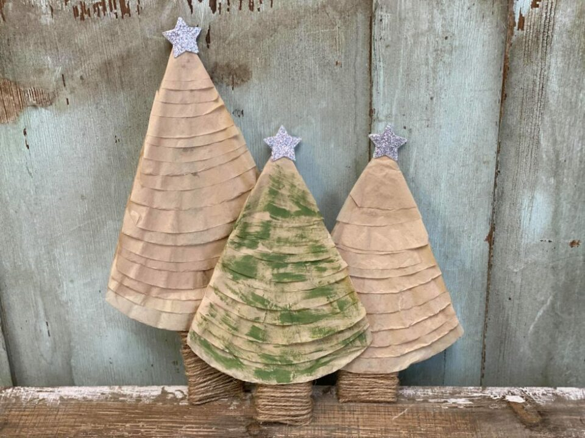
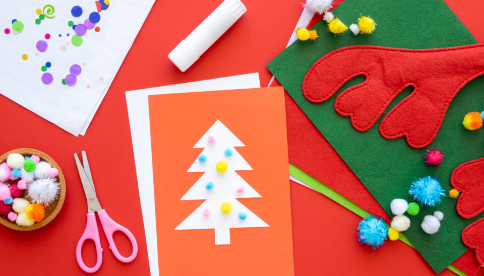

This article has been written and researched by our expert Loveable through a precise methodology. [Learn more about our methodology](https://avada.io/loveable/our-methodological.html)

[Loveable](https://avada.io/loveable/) > [Blog](https://avada.io/loveable/blog/) > [Holiday](https://avada.io/loveable/holiday/)

# 40+ Memorable Christmas Activities for Preschoolers

Written by [Blake Simpson](https://avada.io/loveable/author/blake/) Last Updated on September 26, 2023

- [40+ Hands-On Christmas Activities for Preschoolers](https://avada.io/loveable/blog/christmas-activities-for-preschoolers/#wp-block-heading-2-2)
    - [1\. Decorate a Christmas tree](https://avada.io/loveable/blog/christmas-activities-for-preschoolers/#wp-block-heading-3-3)
    - [2\. Make paper snowflakes](https://avada.io/loveable/blog/christmas-activities-for-preschoolers/#wp-block-heading-3-6)
    - [3\. Create handprint reindeer](https://avada.io/loveable/blog/christmas-activities-for-preschoolers/#wp-block-heading-3-9)
    - [4\. Gingerbread house decorating](https://avada.io/loveable/blog/christmas-activities-for-preschoolers/#wp-block-heading-3-12)
    - [5\. Christmas coloring pages](https://avada.io/loveable/blog/christmas-activities-for-preschoolers/#wp-block-heading-3-15)
    - [6\. Jingle Bell crafts](https://avada.io/loveable/blog/christmas-activities-for-preschoolers/#wp-block-heading-3-18)
    - [7\. Felt Christmas tree](https://avada.io/loveable/blog/christmas-activities-for-preschoolers/#wp-block-heading-3-21)
    - [8\. Holiday photo booth](https://avada.io/loveable/blog/christmas-activities-for-preschoolers/#wp-block-heading-3-24)
    - [9\. An ugly sweater party](https://avada.io/loveable/blog/christmas-activities-for-preschoolers/#wp-block-heading-3-27)
    - [10\. Sock snowman craft](https://avada.io/loveable/blog/christmas-activities-for-preschoolers/#wp-block-heading-3-30)
    - [11\. Holiday pajama day](https://avada.io/loveable/blog/christmas-activities-for-preschoolers/#wp-block-heading-3-33)
    - [12\. Marbled Christmas ornaments](https://avada.io/loveable/blog/christmas-activities-for-preschoolers/#wp-block-heading-3-36)
    - [13\. DIY Christmas-theme cookies](https://avada.io/loveable/blog/christmas-activities-for-preschoolers/#wp-block-heading-3-39)
    - [14\. Paper plate Santa](https://avada.io/loveable/blog/christmas-activities-for-preschoolers/#wp-block-heading-3-42)
    - [15\. Christmas bingo](https://avada.io/loveable/blog/christmas-activities-for-preschoolers/#wp-block-heading-3-45)
    - [16\. Simple bubblewrap Christmas cards](https://avada.io/loveable/blog/christmas-activities-for-preschoolers/#wp-block-heading-3-48)
    - [17\. Fizzy candy canes](https://avada.io/loveable/blog/christmas-activities-for-preschoolers/#wp-block-heading-3-51)
    - [18\. DIY fake snow sensory bin](https://avada.io/loveable/blog/christmas-activities-for-preschoolers/#wp-block-heading-3-54)
    - [19\. Wrap present](https://avada.io/loveable/blog/christmas-activities-for-preschoolers/#wp-block-heading-3-57)
    - [20\. Toilet paper Santa roll craft](https://avada.io/loveable/blog/christmas-activities-for-preschoolers/#wp-block-heading-3-60)
    - [21\. DIY Christmas story stones](https://avada.io/loveable/blog/christmas-activities-for-preschoolers/#wp-block-heading-3-63)
    - [22\. Holiday playdough](https://avada.io/loveable/blog/christmas-activities-for-preschoolers/#wp-block-heading-3-66)
    - [23\. Visit a Christmas tree farm](https://avada.io/loveable/blog/christmas-activities-for-preschoolers/#wp-block-heading-3-69)
    - [24\. Christmas nature walk](https://avada.io/loveable/blog/christmas-activities-for-preschoolers/#wp-block-heading-3-72)
    - [25\. Write letters to Santa](https://avada.io/loveable/blog/christmas-activities-for-preschoolers/#wp-block-heading-3-75)
    - [26\. Create snowglobes from mason jars](https://avada.io/loveable/blog/christmas-activities-for-preschoolers/#wp-block-heading-3-78)
    - [27\. Host a paint and sip](https://avada.io/loveable/blog/christmas-activities-for-preschoolers/#wp-block-heading-3-81)
    - [28\. Attend volunteer](https://avada.io/loveable/blog/christmas-activities-for-preschoolers/#wp-block-heading-3-84)
    - [29\. Build a snowman](https://avada.io/loveable/blog/christmas-activities-for-preschoolers/#wp-block-heading-3-87)
    - [30\. Santa’s workshop play](https://avada.io/loveable/blog/christmas-activities-for-preschoolers/#wp-block-heading-3-90)
    - [31\. Christmas storytime](https://avada.io/loveable/blog/christmas-activities-for-preschoolers/#wp-block-heading-3-93)
    - [32\. Holiday sing and dance](https://avada.io/loveable/blog/christmas-activities-for-preschoolers/#wp-block-heading-3-96)
    - [33\. Countdown to Christmas](https://avada.io/loveable/blog/christmas-activities-for-preschoolers/#wp-block-heading-3-99)
    - [34\. Outdoor snow play](https://avada.io/loveable/blog/christmas-activities-for-preschoolers/#wp-block-heading-3-102)
    - [35\. Go sledding](https://avada.io/loveable/blog/christmas-activities-for-preschoolers/#wp-block-heading-3-105)
    - [36\. Christmas puppet show](https://avada.io/loveable/blog/christmas-activities-for-preschoolers/#wp-block-heading-3-108)
    - [37\. DIY snowflake art](https://avada.io/loveable/blog/christmas-activities-for-preschoolers/#wp-block-heading-3-111)
    - [38\. Make a popcorn garland](https://avada.io/loveable/blog/christmas-activities-for-preschoolers/#wp-block-heading-3-114)
    - [39\. Build a model train](https://avada.io/loveable/blog/christmas-activities-for-preschoolers/#wp-block-heading-3-117)
    - [40\. Christmas paper plate wreath](https://avada.io/loveable/blog/christmas-activities-for-preschoolers/#wp-block-heading-3-120)
    - [41\.  Bauble Christmas ornament](https://avada.io/loveable/blog/christmas-activities-for-preschoolers/#wp-block-heading-3-123)
    - [42\.  Christmas tree coffee filter](https://avada.io/loveable/blog/christmas-activities-for-preschoolers/#wp-block-heading-3-126)
    - [43\. Pom Pom painting Christmas tree](https://avada.io/loveable/blog/christmas-activities-for-preschoolers/#wp-block-heading-3-129) 
    - [44\. Popsicle stick Christmas tree](https://avada.io/loveable/blog/christmas-activities-for-preschoolers/#wp-block-heading-3-132)
- [Bottom line](https://avada.io/loveable/blog/christmas-activities-for-preschoolers/#wp-block-heading-2-135)

The holiday season is a magical time, especially for preschoolers who are full of wonder and excitement. Engaging them in Christmas activities brings joy and helps them develop important skills. In this blog, we’ll explore a variety of fun and educational **Christmas activities for preschoolers**.

## **40+ Hands-On Christmas Activities for Preschoolers**

### **1\. Decorate a Christmas tree**

“Decorate a Christmas Tree” is a fun and creative holiday project for young children. During this festive activity, children decorate a Christmas tree with various bright ornaments, shimmering lights, and joyful decorations. Besides, your children can also decorate [the farmhouse](https://avada.io/loveable/blog/farmhouse-christmas-decor/) as a meaningful Christmas activity for preschoolers.

### **2\. Make paper snowflakes**

[Making Paper Snowflakes](https://www.prima.co.uk/craft/papercraft/a29483638/how-make-snowflake/) is a fun and creative winter activity for young children. Preschoolers may use basic items like paper and scissors to create beautiful snowflake images in this activity. This hands-on experience inspires their creativity and teaches children the beauty of winter and the individuality of snowflakes. 

### **3\. Create handprint reindeer**

[Creating Handprint Reindeer](https://www.messylittlemonster.com/2021/12/handprint-reindeer-craft.html) is a delightful and festive craft activity for young children. By painting their hands and pressing them onto paper, preschoolers create the reindeer’s antlers, adding googly eyes, a red pom-pom for the nose, and details for the face.

### **4**. **Gingerbread house decorating**

Specifically created for young children, “Gingerbread House Decorating” is a fun and engaging holiday activity. Toddlers can use this festive craft to develop their creativity and imagination with the help of many vibrant candies, frosting, and edible embellishments.

### **5**. **Christmas coloring pages**

The holiday activity “Christmas Coloring Pages” is entertaining and informative for young children. Preschoolers are given a selection of festive coloring papers for this creative activity, including traditional Christmas images like Santa Claus, reindeer, snowmen, and adorned trees.

### **6**. **Jingle Bell crafts**

[Jingle Bell Crafts](https://www.sunnydayfamily.com/2016/12/easy-christmas-bell-crafts-for-kids.html) is a joyful activity where young children can explore their creativity during the holiday season. They can paint the bells, add sparkly details, and even create adorable jingle bell characters. With a ribbon hanger, these crafts can be proudly displayed, bringing holiday cheer to any space. 

### **7\.** [**Felt Christmas tree**](https://www.amazon.com/Aytai-Felt-Christmas-Tree-Decorations/dp/B075MY3NFW)

Making a Felt Christmas tree is a fun craft activity for toddlers. Your kids may make their holiday tree using green felt as the base and multicolored felt decorations. This entertaining craft promotes creativity and the development of fine motor skills, making it an ideal way for them to join in holiday festivities.

### **8\. Holiday photo booth**

A photo booth for preschoolers is a fun and creative activity that blends playfulness and creativity, allowing young children to shoot the joy and beauty of the holiday season. During this special time of year, it’s a delightful opportunity to make lasting memories and memorable images.

### **9\. An ugly sweater party**

A preschool Ugly Sweater Party is a cheerful and fun-filled Christmas party. The celebration includes sweater crafting, Christmas crafts, and a vibrant Ugly Sweater Fashion show. Children enjoy cookies and hot chocolate while listening to seasonal music, which is a fun way for your children to get into the holiday mood and make happy memories.

### **10\. Sock snowman craft**

For a fun winter project, your preschoolers may make their own snowman friend with the sock snowman craft. They can construct, embellish, and customize their snowman with this hands-on activity. It encourages imaginative play and produces a beautiful winter ornament that the creators and their families can be proud of.

### **11\. Holiday pajama day**

Holiday Pajama Day is a heartwarming tradition that brings a touch of holiday magic to preschoolers. Dressed in their coziest and most festive pajamas, preschoolers start a day filled with storytelling, crafts, sweet treats, and joyful activities – while enjoying the warmth of their holiday-themed sleepwear. 

### **12\. Marbled Christmas ornaments**

The fun “Marbled Christmas ornaments” activity encourages young children to express their creativity and create original decorations. Preschoolers make marbling masterpieces with acrylic paint, transparent ornaments, and a little swirling magic. After making, they will bring these cute ornaments to decorate their school area for celebrating Christmas.

### **13\. DIY Christmas-theme cookies**

A fun holiday activity in the kindergarten that blends the craft of baking is making your Christmas-themed cookies. This creative project is ideal for families to enjoy the mouthwatering taste of homemade Christmas cookies. It involves choosing your favorite cookie shapes and decorating them with vibrant frosting and sprinkles.

### **14\. Paper plate Santa**

The [DIY Paper Plate Santa](https://supersimple.com/article/jolly-santa-craft/) is a lovely and imaginative holiday craft project meant to help youngsters experience the spirit of Christmas. Young crafters can convert a basic plate into a lovely Santa Claus face with a simple paper plate, vivid paints, fluffy cotton balls, and ingenuity.

### **15\. [Christmas bingo](https://www.amazon.com/Christmas-Bingo-Adults-Large-Groups/dp/B0991HPP2Y)**

Christmas Bingo for preschoolers is a lovely holiday game to instill a festive attitude in young children. The rules are simple, yet the pleasure is limitless as youngsters anxiously mark their cards, rushing to be the first to exclaim: “Bingo!”. The laughter and shared moments make this game a valued addition to Christmas parties, building memories.

### **16\. Simple bubblewrap Christmas cards**

A hands-on holiday activity – [Simple Bubble Wrap Christmas Cards](https://www.learnwithplayathome.com/2013/11/simple-bubblewrap-christmas-cards-made.html) for preschoolers enables your kids to make their own distinctive greeting cards. Preschoolers may create festive designs on blank cards using bubble wrap and acrylic paint, developing their creativity and fine motor skills. 

### **17\. Fizzy candy canes**

[Fizzy Candy Canes](https://teachingmama.org/fizzing-candy-canes/) is a delightful hands-on activity combining holiday cheer and simple science. Preschoolers get to sprinkle candy canes with baking soda and then watch in amazement as they dip them into vinegar, creating an effervescent, fizzy reaction. This sensory experience brings joy and introduces young minds to the fascinating world of chemical reactions. 

### **18\. DIY fake snow sensory bin**

With the [DIY Fake Snow Sensory Bin](https://www.thebestideasforkids.com/fake-snow/), you can transport small children to a winter wonderland. This sensory adventure, made from inexpensive items such as baking soda and glitter, encourages kids to experience the enchantment of snow without the cold. They may gain sensory awareness, fine motor skills, and creativity while experiencing hands-on play and imaginative storytelling. 

### **19\. Wrap present**

Gift wrapping is a cherished holiday tradition that turns giving into a moment of wonder and delight. This artful process involves carefully selecting wrapping paper, measuring and folding it precisely, adding decorative touches, and crafting a note for the gift. The result is not just a beautifully wrapped present but a gesture of thoughtfulness that amplifies the joy of the holiday season.

### **20\. Toilet paper Santa roll craft**

The adorable [Toilet Paper Santa](https://www.printablesfairy.com/christmas-toilet-paper-roll-crafts/) craft is a delightful holiday DIY project transforming ordinary toilet paper rolls into charming Santa Claus decorations. With red and white construction paper, googly eyes, cotton balls, and a bit of creativity, you can craft these jolly Santas to adorn your holiday table, mantel, or even use them as unique gift toppers. 

### **21\. DIY Christmas story stones**

DIY [Christmas Story Stones](https://homeschoolpreschool.net/christmas-story-stones/), a unique holiday project, will capture children’s imaginations. These stones are made of painted pebbles and contain festive motifs such as Santa and snowflakes. Gather in a circle, choose a stone, and begin [a Christmas story](https://avada.io/loveable/blog/kid-christmas-story/). It’s a rewarding way to celebrate Christmas, encouraging creativity, language skills, and treasured traditions.

### **22\. Holiday playdough**

Holiday Playdough is a hands-on and festive activity that combines creativity with sensory exploration. This homemade playdough is made from common kitchen ingredients and transformed into holiday magic with glitter, food coloring, or scents like peppermint.

### **23\. Visit a Christmas tree farm**

A journey to a Christmas tree farm is a delightful excursion that warms kids’ hearts with seasonal cheer. It’s a treasured tradition in which children learn about nature, choose decorations, and feel the warmth of the holiday spirit in the great outdoors.

### **24\. Christmas nature walk**

A Christmas Nature Walk provides a tranquil and meaningful way to celebrate the season, allowing participants to connect with the natural world and find inspiration in its serene beauty. Whether a peaceful solo stroll or a family adventure, this activity is a perfect way to infuse the holiday season with a sense of wonder for the great outdoors.

### **25\. Write letters to Santa**

Writing letters to Santa is a heartwarming and time-honored tradition that fills the holiday season with anticipation and excitement, especially for preschoolers. It’s a special way for children to express their wishes, dreams, and gratitude while awaiting a reply from the jolly man in the red suit.

### **26\. Create snowglobes from mason jars**

Making your own [mason jar snow globes](https://www.shutterfly.com/ideas/mason-jar-snow-globe/) is a beautiful and imaginative Christmas craft that adds a unique touch to your holiday decor. Simple techniques and supplies such as figurines, glitter, glycerin, and waterproof glue may create lovely winter settings that come to life with a slight shake.

### **27\. Host a paint and sip**

A painting event is a fun way to combine artwork and socialization. Gather your kids’ friends and parents for an evening of painting, drinking, and enjoying each other’s drawings. Your children can make their own masterpieces while having a great time with the help of an instructor or step-by-step tutorials.

### **28\. Attend volunteer**

Participating in volunteer activities on Christmas with preschoolers is a heartwarming way to share the spirit of giving during the holiday season. From collecting empty and crafting decorations to singing carols and wrapping gifts, this meaningful activity teaches young ones the values of empathy, kindness, and the joy of volunteering.

### **29\. Build a snowman**

Building a snowman is a fun winter activity that captures toddlers’ imaginations and brings joy to their hearts. They roll, stack, and decorate snowballs while dressed warmly to make their own icy companion. This time-honored custom encourages play outside, stimulates creativity, and leaves cherished winter wonderland memories behind. 

### **30\. Santa’s workshop play**

Santa’s workshop for preschoolers is a delightful way to embrace the holiday spirit while fostering creativity, social interaction, and imaginative play. It allows children to take on the role of Santa’s little helpers, spreading joy and laughter throughout the workshop. 

### **31\. Christmas storytime**

Christmas storytime for preschoolers is an unavoidable activity to introduce the joy of reading. It fosters a love for storytelling and the holiday season. This storytime for families, educators, or caregivers is a chance to bond with little ones through Christmas tales and create cherished memories with your child.

### **32\. Holiday sing and dance**

Holiday Sing and Dance for preschoolers is a festive and lively activity designed to bring the magic of the holiday season to young children. With holiday tunes, simple dance moves, costumes, and interactive games, it’s a delightful way for little ones to express themselves, get into the holiday spirit, and create cherished memories.

### **33\. Countdown to Christmas**

Christmas countdowns are not only a joyous and entertaining tradition but also a chance to create enduring memories and celebrate the holiday with loved ones. The countdown to Christmas instills a spirit of enchantment and anticipation that elevates the holiday season, whether you celebrate with food, fun, or deeds of kindness.

### **34\. Outdoor snow play**

Outdoor snow play is a delightful winter activity that invites children and families to embrace the magic of snow-covered landscapes. This seasonal adventure takes place outdoors, where the white, glistening snow becomes a canvas for endless fun and creativity.

### **35\. Go sledding**

Sledding is a fantastic winter pastime created just for your kids to try this Christmas holiday! Little ones and their families may slide down snowy hills, giggling with delight, if they have warm winter clothing and a sense of adventure. This winter wonderland experience promotes outdoor play, improves family bonding, and generates treasured memories of snowy adventures. 

### **36\. Christmas puppet show**

The [Christmas Puppet](https://iheartcraftythings.com/christmas-stick-puppets-craft.html) is a delightful and interactive holiday activity that brings the Christmas season to every corner. Children use puppets or create their own, along with a little imagination, to perform festive tales or skits. Whether it’s retelling the story of Santa Claus, reenacting holiday classics, or inventing their own winter wonderland adventures, this activity fosters creativity and storytelling skills. 

### **37\. DIY snowflake art**

[DIY Snowflake Art](https://artfulparent.com/snowflake-prints-with-bleeding-tissue-paper/) allows participants to create their own distinctive snowflakes, making it a charming and imaginative winter activity. This craft activity promotes creativity and fine motor skills using supplies like paper, scissors, and maybe some glitter or paint. Each snowflake is individually sculpted into a little work of seasonal art that may be a perfect option for [Christmas wall decor](https://avada.io/loveable/blog/christmas-wall-decor/).

### **38\. [Make a popcorn garland](https://www.amazon.com/Faux-Popcorn-Garland-Christmas-Trees/dp/B01K044AYM?th=1)**

A fun holiday project for little hands is making a popcorn garland for preschoolers. With plastic sewing needles, colorful popcorn is strung onto yarn, ensuring safe and interesting entertainment.

### **39\. Build a model train**

Building a Model Train is a fun, hands-on project for preschoolers that combines creativity and play. Kids build a basic track using a toy train set on a cardboard basis, decorate the surrounding scenery with markers, paint, and stickers, and add tiny figurines for narrative fun.

### **40\. Christmas paper plate wreath**

A joyful and meaningful Christmas project created especially for young children. Kids make custom holiday wreaths out of paper plates, green paint or markers, glue, and other ornaments. This exercise teaches the value of [Christmas wreaths](https://www.craftymorning.com/paper-plate-christmas-wreath-craft/) and the joys of gifting and artistic expression.

### **41\.  Bauble Christmas ornament**

Preschoolers in the kindergarten will enjoy making the Bauble Christmas ornament project. Kids make personalized gifts using transparent plastic or glass ornaments as a canvas with craft paint, paintbrushes, glitter, sequins, and other colorful objects. Swirling paint inside the ornaments provides a hypnotic touch, and encourages fine motor skills and creative expression.

### **42\.  Christmas tree coffee filter**

Preschoolers can make vivid and one-of-a-kind [Christmas tree ornaments using coffee filters](https://theshabbytree.com/diy-coffee-filter-tree-ornament/), washable markers, and a spray bottle filled with water. The color mixing adds a touch of science and beauty to the craft. Adding a construction paper trunk and decorations helps children develop decision-making and fine motor abilities. 

### **43\. Pom Pom painting Christmas tree** 

A fun holiday exercise for toddlers that promotes creativity, fine motor skills, and the Christmas spirit. Kids make their Christmas tree masterpieces from green construction paper, colorful pom poms, glue, and safety scissors. For added glitz, use a star sticker and optional glitter. This exercise promotes family unity and the creation of treasured memories.

### **44\. Popsicle stick Christmas tree**

The [Popsicle Stick Christmas Tree](https://supersimple.com/article/popsicle-stick-christmas-tree-ornaments/) activity is a wonderful holiday craft for preschoolers that combines creativity with a heartwarming message. Kids get to design their Christmas tree ornaments using Popsicle sticks, green paint or markers, glue, and decorations like sequins, buttons, and glitter.

## **Bottom line**

The holiday season is a special time, and these **Christmas activities for preschoolers** can make it even more magical. These activities include making decorations, decorating cookies, singing carols, sharing stories, and creating festive art. They’re not just about having fun; they also help kids be creative, learn, and feel close to others.

When we see the excitement in their eyes and hear their laughter, it reminds us that the best part of the season is spending time with these young, joyful, and imaginative hearts. These activities create memories that will stay with them forever, making the holiday season truly enchanting for preschoolers and for those lucky enough to celebrate with them.

- [40+ Hands-On Christmas Activities for Preschoolers](https://avada.io/loveable/blog/christmas-activities-for-preschoolers/#wp-block-heading-2-2)
    - [1\. Decorate a Christmas tree](https://avada.io/loveable/blog/christmas-activities-for-preschoolers/#wp-block-heading-3-3)
    - [2\. Make paper snowflakes](https://avada.io/loveable/blog/christmas-activities-for-preschoolers/#wp-block-heading-3-6)
    - [3\. Create handprint reindeer](https://avada.io/loveable/blog/christmas-activities-for-preschoolers/#wp-block-heading-3-9)
    - [4\. Gingerbread house decorating](https://avada.io/loveable/blog/christmas-activities-for-preschoolers/#wp-block-heading-3-12)
    - [5\. Christmas coloring pages](https://avada.io/loveable/blog/christmas-activities-for-preschoolers/#wp-block-heading-3-15)
    - [6\. Jingle Bell crafts](https://avada.io/loveable/blog/christmas-activities-for-preschoolers/#wp-block-heading-3-18)
    - [7\. Felt Christmas tree](https://avada.io/loveable/blog/christmas-activities-for-preschoolers/#wp-block-heading-3-21)
    - [8\. Holiday photo booth](https://avada.io/loveable/blog/christmas-activities-for-preschoolers/#wp-block-heading-3-24)
    - [9\. An ugly sweater party](https://avada.io/loveable/blog/christmas-activities-for-preschoolers/#wp-block-heading-3-27)
    - [10\. Sock snowman craft](https://avada.io/loveable/blog/christmas-activities-for-preschoolers/#wp-block-heading-3-30)
    - [11\. Holiday pajama day](https://avada.io/loveable/blog/christmas-activities-for-preschoolers/#wp-block-heading-3-33)
    - [12\. Marbled Christmas ornaments](https://avada.io/loveable/blog/christmas-activities-for-preschoolers/#wp-block-heading-3-36)
    - [13\. DIY Christmas-theme cookies](https://avada.io/loveable/blog/christmas-activities-for-preschoolers/#wp-block-heading-3-39)
    - [14\. Paper plate Santa](https://avada.io/loveable/blog/christmas-activities-for-preschoolers/#wp-block-heading-3-42)
    - [15\. Christmas bingo](https://avada.io/loveable/blog/christmas-activities-for-preschoolers/#wp-block-heading-3-45)
    - [16\. Simple bubblewrap Christmas cards](https://avada.io/loveable/blog/christmas-activities-for-preschoolers/#wp-block-heading-3-48)
    - [17\. Fizzy candy canes](https://avada.io/loveable/blog/christmas-activities-for-preschoolers/#wp-block-heading-3-51)
    - [18\. DIY fake snow sensory bin](https://avada.io/loveable/blog/christmas-activities-for-preschoolers/#wp-block-heading-3-54)
    - [19\. Wrap present](https://avada.io/loveable/blog/christmas-activities-for-preschoolers/#wp-block-heading-3-57)
    - [20\. Toilet paper Santa roll craft](https://avada.io/loveable/blog/christmas-activities-for-preschoolers/#wp-block-heading-3-60)
    - [21\. DIY Christmas story stones](https://avada.io/loveable/blog/christmas-activities-for-preschoolers/#wp-block-heading-3-63)
    - [22\. Holiday playdough](https://avada.io/loveable/blog/christmas-activities-for-preschoolers/#wp-block-heading-3-66)
    - [23\. Visit a Christmas tree farm](https://avada.io/loveable/blog/christmas-activities-for-preschoolers/#wp-block-heading-3-69)
    - [24\. Christmas nature walk](https://avada.io/loveable/blog/christmas-activities-for-preschoolers/#wp-block-heading-3-72)
    - [25\. Write letters to Santa](https://avada.io/loveable/blog/christmas-activities-for-preschoolers/#wp-block-heading-3-75)
    - [26\. Create snowglobes from mason jars](https://avada.io/loveable/blog/christmas-activities-for-preschoolers/#wp-block-heading-3-78)
    - [27\. Host a paint and sip](https://avada.io/loveable/blog/christmas-activities-for-preschoolers/#wp-block-heading-3-81)
    - [28\. Attend volunteer](https://avada.io/loveable/blog/christmas-activities-for-preschoolers/#wp-block-heading-3-84)
    - [29\. Build a snowman](https://avada.io/loveable/blog/christmas-activities-for-preschoolers/#wp-block-heading-3-87)
    - [30\. Santa’s workshop play](https://avada.io/loveable/blog/christmas-activities-for-preschoolers/#wp-block-heading-3-90)
    - [31\. Christmas storytime](https://avada.io/loveable/blog/christmas-activities-for-preschoolers/#wp-block-heading-3-93)
    - [32\. Holiday sing and dance](https://avada.io/loveable/blog/christmas-activities-for-preschoolers/#wp-block-heading-3-96)
    - [33\. Countdown to Christmas](https://avada.io/loveable/blog/christmas-activities-for-preschoolers/#wp-block-heading-3-99)
    - [34\. Outdoor snow play](https://avada.io/loveable/blog/christmas-activities-for-preschoolers/#wp-block-heading-3-102)
    - [35\. Go sledding](https://avada.io/loveable/blog/christmas-activities-for-preschoolers/#wp-block-heading-3-105)
    - [36\. Christmas puppet show](https://avada.io/loveable/blog/christmas-activities-for-preschoolers/#wp-block-heading-3-108)
    - [37\. DIY snowflake art](https://avada.io/loveable/blog/christmas-activities-for-preschoolers/#wp-block-heading-3-111)
    - [38\. Make a popcorn garland](https://avada.io/loveable/blog/christmas-activities-for-preschoolers/#wp-block-heading-3-114)
    - [39\. Build a model train](https://avada.io/loveable/blog/christmas-activities-for-preschoolers/#wp-block-heading-3-117)
    - [40\. Christmas paper plate wreath](https://avada.io/loveable/blog/christmas-activities-for-preschoolers/#wp-block-heading-3-120)
    - [41\.  Bauble Christmas ornament](https://avada.io/loveable/blog/christmas-activities-for-preschoolers/#wp-block-heading-3-123)
    - [42\.  Christmas tree coffee filter](https://avada.io/loveable/blog/christmas-activities-for-preschoolers/#wp-block-heading-3-126)
    - [43\. Pom Pom painting Christmas tree](https://avada.io/loveable/blog/christmas-activities-for-preschoolers/#wp-block-heading-3-129) 
    - [44\. Popsicle stick Christmas tree](https://avada.io/loveable/blog/christmas-activities-for-preschoolers/#wp-block-heading-3-132)
- [Bottom line](https://avada.io/loveable/blog/christmas-activities-for-preschoolers/#wp-block-heading-2-135)

### [Blake Simpson](https://avada.io/loveable/author/blake/)

Hi, I'm Blake from Loveable. I help people find perfect gifts for occasions like anniversaries and weddings. I also write a blog about holidays, sharing insights to make them more meaningful. Let's create unforgettable moments together!

- [Twitter](https://twitter.com/intent/tweet)
- [Facebook](https://www.facebook.com/sharer/sharer.php)
- [instagram](https://avada.io/loveable/blog/christmas-activities-for-preschoolers/)
- [pinterest](https://www.pinterest.com/loveablellc/)

## Related Posts

[### 120+ Christian Birthday Wishes To Spread Your Love](https://avada.io/loveable/blog/christian-birthday-wishes/) 

[

### 35 Best 70th Birthday Ideas To Celebrate The Special Milestone

](https://avada.io/loveable/blog/70th-birthday-ideas/)

[

### 50 Best 30th Birthday Decorations for a Remarkable Birthday Bash

](https://avada.io/loveable/blog/30th-birthday-decorations/)

[

### 40 Delicious Vegan Christmas Desserts to Delight Your Palate

](https://avada.io/loveable/blog/vegan-christmas-desserts/)

[

### 60 Christmas Team Building Activities to Boost Workplace Spirit

](https://avada.io/loveable/blog/christmas-team-building-activities/)
