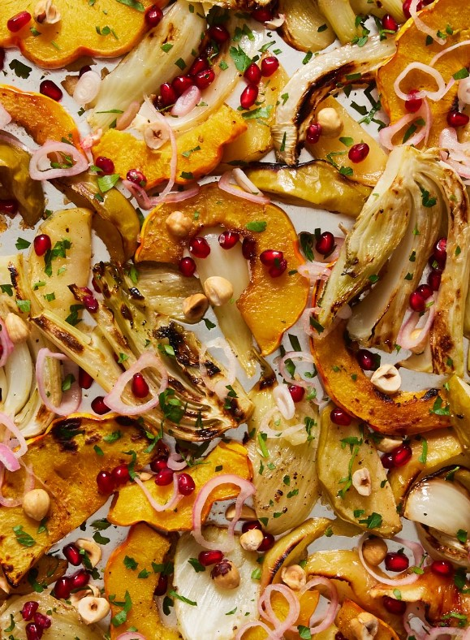
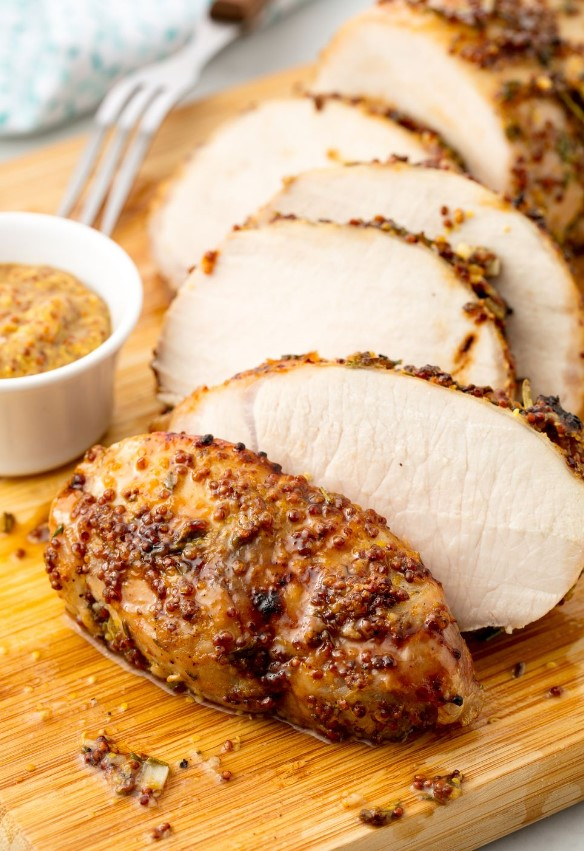

This article has been written and researched by our expert Loveable through a precise methodology. [Learn more about our methodology](https://avada.io/loveable/our-methodological.html)

[Loveable](https://avada.io/loveable/) > [Blog](https://avada.io/loveable/blog/) > [Holiday](https://avada.io/loveable/holiday/)

# 40+ Must-Try Christmas Dinner Ideas For This Holiday Season

Written by [Blake Simpson](https://avada.io/loveable/author/blake/) Last Updated on October 03, 2023

- [40+ Easy Christmas Dinner Ideas to Fill Your Festive Table](https://avada.io/loveable/blog/christmas-dinner-ideas/#wp-block-heading-2-3)
    - [Spinach-Artichoke Christmas Tree Skewers](https://avada.io/loveable/blog/christmas-dinner-ideas/#wp-block-heading-3-4)
    - [Cherry Bourbon Glazed Ham](https://avada.io/loveable/blog/christmas-dinner-ideas/#wp-block-heading-3-7)
    - [Red Wine Braised Short Ribs](https://avada.io/loveable/blog/christmas-dinner-ideas/#wp-block-heading-3-10)
    - [Roast Beef](https://avada.io/loveable/blog/christmas-dinner-ideas/#wp-block-heading-3-13)
    - [Roasted Fennel With Delicata Squash and Apples](https://avada.io/loveable/blog/christmas-dinner-ideas/#wp-block-heading-3-16)
    - [Chicken Pot Pie Soup](https://avada.io/loveable/blog/christmas-dinner-ideas/#wp-block-heading-3-19)
    - [Vegetable Tian Christmas Dinner Idea](https://avada.io/loveable/blog/christmas-dinner-ideas/#wp-block-heading-3-22)
    - [Roasted Squash with Poached Cranberries and Goat Cheese](https://avada.io/loveable/blog/christmas-dinner-ideas/#wp-block-heading-3-25)
    - [Pecan Slab Pie](https://avada.io/loveable/blog/christmas-dinner-ideas/#wp-block-heading-3-28)
    - [Grilled Lobster Tail](https://avada.io/loveable/blog/christmas-dinner-ideas/#wp-block-heading-3-31)
    - [Cranberry Apple Quinoa Salad](https://avada.io/loveable/blog/christmas-dinner-ideas/#wp-block-heading-3-34)
    - [Twice-Baked Sweet Potatoes](https://avada.io/loveable/blog/christmas-dinner-ideas/#wp-block-heading-3-37)
    - [Cherry Punch Christmas Dinner Idea](https://avada.io/loveable/blog/christmas-dinner-ideas/#wp-block-heading-3-40)
    - [Creamy Potato Soup](https://avada.io/loveable/blog/christmas-dinner-ideas/#wp-block-heading-3-43)
    - [Stuffing with Chorizo and Poblano](https://avada.io/loveable/blog/christmas-dinner-ideas/#wp-block-heading-3-46)
    - [Baked Brie Wreath](https://avada.io/loveable/blog/christmas-dinner-ideas/#wp-block-heading-3-49)
    - [Holiday Salsa with Tortilla Chips](https://avada.io/loveable/blog/christmas-dinner-ideas/#wp-block-heading-3-52)
    - [Peppermint Eggnog Christmas Dinner Idea](https://avada.io/loveable/blog/christmas-dinner-ideas/#wp-block-heading-3-55)
    - [Beef Tenderloin with Roasted Cauliflower Salad](https://avada.io/loveable/blog/christmas-dinner-ideas/#wp-block-heading-3-58)
    - [Citrus-Roasted Salmon](https://avada.io/loveable/blog/christmas-dinner-ideas/#wp-block-heading-3-61)
    - [Red Chile and Orange Glazed Turkey](https://avada.io/loveable/blog/christmas-dinner-ideas/#wp-block-heading-3-64)
    - [Parmesan Brussels Sprouts Salad](https://avada.io/loveable/blog/christmas-dinner-ideas/#wp-block-heading-3-67)
    - [Goat Cheese-Stuffed Rolls](https://avada.io/loveable/blog/christmas-dinner-ideas/#wp-block-heading-3-70)
    - [Fish Pie Christmas Dinner Idea](https://avada.io/loveable/blog/christmas-dinner-ideas/#wp-block-heading-3-73)
    - [Garlic Rosemary Pork Roast](https://avada.io/loveable/blog/christmas-dinner-ideas/#wp-block-heading-3-76)
    - [Chicken and Mushroom White Lasagna](https://avada.io/loveable/blog/christmas-dinner-ideas/#wp-block-heading-3-79)
    - [Beef Wellington](https://avada.io/loveable/blog/christmas-dinner-ideas/#wp-block-heading-3-82)
    - [Pull-Apart Christmas Tree](https://avada.io/loveable/blog/christmas-dinner-ideas/#wp-block-heading-3-85)
    - [Roast Lamb](https://avada.io/loveable/blog/christmas-dinner-ideas/#wp-block-heading-3-88)
    - [Crab-Stuffed Mushrooms](https://avada.io/loveable/blog/christmas-dinner-ideas/#wp-block-heading-3-91)
    - [Skillet Cornbread](https://avada.io/loveable/blog/christmas-dinner-ideas/#wp-block-heading-3-94)
    - [Wild Rice-and-Cider-Cranberry Pilaf](https://avada.io/loveable/blog/christmas-dinner-ideas/#wp-block-heading-3-97)
    - [Crockpot Green Bean Casserole](https://avada.io/loveable/blog/christmas-dinner-ideas/#wp-block-heading-3-100)
    - [Pumpkin Spice White Russian](https://avada.io/loveable/blog/christmas-dinner-ideas/#wp-block-heading-3-103)
    - [Marinated Feta](https://avada.io/loveable/blog/christmas-dinner-ideas/#wp-block-heading-3-106)
    - [Scalloped Oysters](https://avada.io/loveable/blog/christmas-dinner-ideas/#wp-block-heading-3-109)
    - [Cheddar Holly Crackers](https://avada.io/loveable/blog/christmas-dinner-ideas/#wp-block-heading-3-112)
    - [Shepherd’s Pie](https://avada.io/loveable/blog/christmas-dinner-ideas/#wp-block-heading-3-115)
    - [Garlic Green Beans](https://avada.io/loveable/blog/christmas-dinner-ideas/#wp-block-heading-3-118)
    - [Pumpkin Risotto](https://avada.io/loveable/blog/christmas-dinner-ideas/#wp-block-heading-3-121)
    - [Apple Cider Sangria](https://avada.io/loveable/blog/christmas-dinner-ideas/#wp-block-heading-3-124)
    - [Vegetarian Mushroom Gravy](https://avada.io/loveable/blog/christmas-dinner-ideas/#wp-block-heading-3-127)
    - [Bacon-Wrapped Scallops](https://avada.io/loveable/blog/christmas-dinner-ideas/#wp-block-heading-3-130)
    - [Baked Gnocchi Alfredo](https://avada.io/loveable/blog/christmas-dinner-ideas/#wp-block-heading-3-133)
    - [White Chocolate Truffles](https://avada.io/loveable/blog/christmas-dinner-ideas/#wp-block-heading-3-136)
    - [Sweet Potato Casserole with Marshmallow](https://avada.io/loveable/blog/christmas-dinner-ideas/#wp-block-heading-3-139)
- [Bottom Line](https://avada.io/loveable/blog/christmas-dinner-ideas/#wp-block-heading-2-142)

As the joyous season of Christmas draws near, the anticipation for a delightful and heartwarming dinner grows stronger. This year, elevate your festive gathering with our collection of enchanting **Christmas dinner ideas** that will leave your loved ones filled with delight and merriment. From traditional classics that evoke cherished memories to innovative twists that add a modern flair, there is a captivating feast for every palate. Picture roasted turkey, golden and glistening, served with a medley of indulgent sides, such as creamy mashed potatoes and Brussels sprouts.

Don’t forget to savor the enchanting aroma of [cherry bourbon](https://avada.io/loveable/bourbon-christmas-gifts/) glazed ham, accompanied by sweet potato casserole topped with marshmallows, and crockpot green bean casserole. Embrace the spirit of togetherness and culinary excellence as you embark on a magical cooking journey this Christmas.

## **40+ Easy Christmas Dinner Ideas to Fill Your Festive Table**

### [**Spinach-Artichoke Christmas Tree Skewers**](https://www.delish.com/cooking/recipe-ideas/a42157851/spinach-artichoke-christmas-tree-skewers-recipe/)

Discover some delightful Christmas dinner ideas with this festive twist on a classic appetizer – the spinach-artichoke dip! By wrapping the dip in puff pastry, you can create adorable Christmas tree-shaped individual appetizers. Complete the look with a charming cheese star on top, just as every [Christmas tree](https://avada.io/loveable/personalized-christmas-ornaments/) should have its shining star!

### [**Cherry Bourbon Glazed Ham**](https://www.delish.com/cooking/a22827100/how-to-cook-a-ham/)

Prepare yourself for orchestrating a spectacular Christmas dinner party solely centered on this delicious ham! The fusion of tart cherries and bourbon creates a harmonious blend, infusing the spiral ham with a gentle sourness and oaky tartness. Meanwhile, the glaze boasts a perfect balance of cayenne pepper, imparting a subtle yet enticing smoky heat.

### [**Red Wine Braised Short Ribs**](https://www.countryliving.com/food-drinks/a41768450/red-wine-braised-short-ribs-recipe/)

Looking for a Christmas dinner idea that’s perfect for a festive feast? Look no further! Indulge in this mouthwatering, slow-cooked dish guaranteed to satisfy your taste buds. Whether you’re celebrating with family or friends, this recipe promises to add a touch of holiday magic to your table. So gather around, share joy, and savor every flavorful bite of this Christmas dish.

### [**Roast Beef**](https://www.thepioneerwoman.com/food-cooking/recipes/a40942239/roast-beef-recipe/)

Enjoy an impressive yet budget-friendly Christmas recipe! You will love the succulent, garlic-infused meat topped with a caramelized onion gravy that rivals the taste of a tenderloin.

### [**Roasted Fennel With Delicata Squash and Apples**](https://www.delish.com/cooking/recipe-ideas/a42163432/roasted-fennel-recipe/)

This vibrant and nutritious side dish combines a medley of in-season vegetables, making it an ideal option for elegant dinner parties, quick weeknight dinners, or as a rich addition to indulgent holiday feasts.

### [**Chicken Pot Pie Soup**](https://www.goodhousekeeping.com/food-recipes/a40785753/chicken-pot-pie-soup-recipe/)

For a fuss-free Christmas dinner idea, opt for a comforting chicken soup topped with puff pastry rounds. Embrace the warmth and simplicity of this cozy dish, perfect for celebrating the holiday season with ease and satisfaction.

### [**Vegetable Tian Christmas Dinner Idea**](https://www.tasteofhome.com/recipes/vegetable-tian/)

Originating in Provence, France, the vibrant Vegetable Tian bursts with flavors. Whether using a mandoline or a knife, slicing the vegetables becomes effortless. Enjoy the colorful and hearty goodness of this dish!

### [**Roasted Squash with Poached Cranberries and Goat Cheese**](https://www.countryliving.com/food-drinks/a29628010/roasted-squash-with-goat-cheese-and-poached-cranberries-recipe/)

Impress your Christmas guests with a unique Christmas dinner idea featuring a one-of-a-kind side dish. Elevate the classic butternut squash by infusing it with delectable flavors like tangy goat cheese, sweet cranberries, and crunchy roasted pepitas. This innovative and savory combination will surely become the talk of the dinner table, creating a memorable dining experience for everyone.

### [**Pecan Slab Pie**](http://www.countryliving.com/food-drinks/a29145983/nancy-fuller-pecan-slab-pie/)

Hosting a Christmas dinner with a hungry crowd to satisfy? Save your time and effort by preparing a single, delicious solution – the pecan slab pie. With the capacity to serve 16 people, it’s the perfect treat to satiate everyone’s sweet cravings without the need for two separate pecan pies.

### [**Grilled Lobster Tail**](https://www.thepioneerwoman.com/food-cooking/recipes/a40218213/how-to-grill-lobster-tail/)

This elevated lobster recipe will be a perfect main course for your Christmas dinner. As it’s cooked on a grill, it will even save you oven space. Don’t forget to bundle up while preparing this flavorful dish!

### [**Cranberry Apple Quinoa Salad**](https://www.delish.com/cooking/recipe-ideas/a42028408/cranberry-apple-quinoa-salad-recipe/)

Embrace the vibrancy that comes from combining crunchy apples and tangy cranberries in this appetizing mix. The dressing, with its subtle sweetness and refreshing lemony twist, is a breeze to whip up.

### [**Twice-Baked Sweet Potatoes**](https://www.thepioneerwoman.com/food-cooking/recipes/a41392653/twice-baked-sweet-potatoes-recipe/)

Discover some delightful Christmas dinner ideas with this unique twist on sweet potato casserole! Double-bake individual sweet potatoes and adorn them with toasted oat and pecan crumbles. Your guests will love this festive and flavorful addition to your holiday spread.

### [**Cherry Punch Christmas Dinner Idea**](https://www.thepioneerwoman.com/food-cooking/recipes/a41969117/cherry-punch-recipe/)

This yummy punch is a breeze to serve! Its kid-friendly nature ensures a delightful experience for your entire family.

### [**Creamy Potato Soup**](https://www.goodhousekeeping.com/food-recipes/a41870766/creamy-potato-soup-recipe/)

There’s nothing quite as comforting as a steaming bowl of warm soup in the cold months. Crafted from a balancing blend of creamy Yukon gold potatoes, flavorful parsnips, and a medley of fresh ingredients, this soup is guaranteed to envelop you in warmth.

### [**Stuffing with Chorizo and Poblano**](https://www.thepioneerwoman.com/food-cooking/recipes/a41995457/stuffing-with-chorizo-and-poblanos-recipe/)

Packed with tasteful flavors from oregano, thyme, garlic, and onion, this hearty side dish stands out thanks to the addition of chorizo and poblano peppers.

### [**Baked Brie Wreath**](https://www.delish.com/cooking/recipe-ideas/a42087252/baked-brie-wreath-recipe/)

Trying to come up with a nutty Christmas dinner idea? We’ve got you covered! Combine honey-glazed melted brie with herby crispy pizza dough and you’ve got a recipe for happiness. As soon as you step through the door, your friends and family will eagerly gather around this edible wreath, excited to savor the warm and gooey cheese.

### [**Holiday Salsa with Tortilla Chips**](https://www.countryliving.com/food-drinks/a41766882/holiday-salsa-tortilla-chips/)

Bursting with vibrant red, white, and green colors, this delectable pico-de-gallo-style salsa is the perfect appetizer to grace your Christmas feast.

### [**Peppermint Eggnog Christmas Dinner Idea**](https://www.countryliving.com/food-drinks/a41767381/peppermint-eggnog-recipe/)

What’s better than a rich, homemade egg nog during Christmas? Well, picture this: a sweet cup of peppermint nog, enhanced with a hint of rum or bourbon. Undoubtedly, that’s the epitome of perfection.

### [**Beef Tenderloin with Roasted Cauliflower Salad**](https://www.countryliving.com/food-drinks/recipes/a6207/beef-tenderloin-roasted-cauliflower-pomegranate-salad-recipe-clx1214/)

You’re sure to please your Christmas guests with this tangy cauliflower-pomegranate salad that compliments the tenderloin. This salad’s going to be a hit and is the perfect side to the main dish.

### **[Citrus-Roasted Salmon](https://www.countryliving.com/food-drinks/a34347516/citrus-roasted-salmon/)**

Rich and succulent salmon fillets stuffed with citrusy goodness are a lighter take on Christmas dinner. They make a perfect entrée for a festive meal or an easy weeknight dinner. The combination of flavors will definitely satisfy the whole family. Enjoy the citrusy goodness of these salmon fillets!

### **[Red Chile and Orange Glazed Turkey](https://www.countryliving.com/food-drinks/recipes/a45298/red-chile-and-orange-glazed-turkey-recipe/)**

How about this zesty red chile and orange glaze on your holiday turkey? You can use a large cooler when bringing your turkey to save space in the refrigerator.

### **[Parmesan Brussels Sprouts Salad](https://www.delish.com/cooking/recipe-ideas/a21085670/brussels-sprouts-salad-recipe/)**

It might seem intimidating to prepare this salad, but you won’t need to spend much time in the kitchen. Brussels makes a great side dish when topped with shaved Parmesan, toasted almond, and pomegranate seeds.

### **[Goat Cheese-Stuffed Rolls](https://www.delish.com/cooking/recipe-ideas/a42006086/goat-cheese-stuffed-rolls-recipe/)**

As if dinner rolls couldn’t get any better, let’s stuff them with goat cheese. Inside, these golden brown beauties are full of honey and goat cheese. You don’t even need butter for this!

### [**Fish Pie Christmas Dinner Idea**](https://www.delish.com/cooking/recipe-ideas/a41547639/fish-pie-recipe/)

Traditionally, fish pie consists of seafood in a rich cream sauce topped with mashed potatoes.  For a Greek-inspired twist, you can add the dill and the zesty tang of lemon, elevating its flavors to new heights.

### **[Garlic Rosemary Pork Roast](https://www.delish.com/cooking/recipe-ideas/recipes/a55309/best-pork-loin-roast-recipe/)**

Thyme and rosemary infuse the pork with aromatic woody flavors. A touch of mustard adds a classic twist that perfectly complements the sweetness of brown sugar. And, of course, let’s not forget the secret ingredient – butter, the ultimate enhancer!

### **[Chicken and Mushroom White Lasagna](https://www.delish.com/cooking/recipe-ideas/a38239592/white-lasagna-recipe/)**

You will love this luscious, cheesy square of lasagna that is perfect for Christmas dinner. This white lasagna is enriched with Mornay sauce, oozing with cheese. This appealing dish is filled with savory chopped chicken, wholesome spinach, earthy mushrooms, and fresh herbs, creating a symphony of flavors.

### **[Beef Wellington](https://www.delish.com/cooking/recipe-ideas/recipes/a58702/easy-beef-wellington-recipe/)**

Although the exact origins of this renowned dish remain a mystery, one thing is certain – it’s a holiday showstopper. A masterpiece that will impress guests and leave them wanting more!

### **[Pull-Apart Christmas Tree](https://www.delish.com/cooking/recipe-ideas/recipes/a50528/pull-apart-christmas-tree-recipe/)**

Introducing the ultimate Christmas dinner idea – a super-cheesy and herby centerpiece that promises to impress. With its delectable taste and quick preparation in under an hour, it’s the perfect addition to your holiday spread.

### **[Roast Lamb](https://www.delish.com/cooking/recipe-ideas/recipes/a56354/best-roast-lamb-recipe/)**

Roasting a lamb shoulder can be just as effortless, compared to roasting a chicken. Simply coat your roast with a blend of fresh herbs, garlic, and olive oil, then pop it in the oven for about an hour. For an added touch, consider roasting the meat atop a bed of potatoes, creating the ideal Christmas feast.

### **[Crab-Stuffed Mushrooms](https://www.delish.com/cooking/recipe-ideas/a40991851/crab-stuffed-mushrooms-recipe/)**

The crab-stuffed mushroom is the reigning star of fancy appetizers, but it can also shine as a flavorful main dish. Elevate it to a dinner-worthy entrée by substituting cremini with portobello mushrooms.

### **[Skillet Cornbread](https://www.delish.com/cooking/recipe-ideas/a41444391/skillet-cornbread-recipe/)**

This oven-to-table cornbread not only reduces cleanup but also achieves the perfect texture of a crunchy crust surrounding a moist and decadent corncake. When you pour the batter into a preheated cast iron, it creates a delicious sear with that satisfying sizzling sound and shortens the baking time as well.

### **[Wild Rice-and-Cider-Cranberry Pilaf](https://www.countryliving.com/food-drinks/a23390979/wild-rice-and-cider-cranberry-pilaf-recipe/)**

Enjoy this delicious blend of sweetness and vibrant berries on Christmas Day with our cranberry-infused pilaf. A festive dish like this is an ideal choice for the holiday season, as it is sure to satisfy every palate.

### **[Crockpot Green Bean Casserole](https://www.delish.com/cooking/recipe-ideas/a41557911/crockpot-green-bean-casserole-recipe/)**

No holiday season is complete without this comforting side dish – green bean casserole. This recipe takes it up a notch in simplicity by allowing you to prepare and cook it in your slow cooker, eliminating the need for an oven. Embrace the ease and deliciousness of this dish, and make your celebrations even more enjoyable with this hassle-free version of a classic favorite.

### **[Pumpkin Spice White Russian](https://www.goodhousekeeping.com/food-recipes/dessert/a41753485/pumpkin-spice-white-russian-recipe/)**

Don’t let the end of fall stop you from enjoying your pumpkin pie spice. Embrace the season with this creamy cocktail that everyone will adore. Whether it’s a holiday gathering or any get-together, this seasonal drink will be a hit and keep the spirit of fall alive year-round.

### **[Marinated Feta](https://www.goodhousekeeping.com/food-recipes/a40785411/marinated-feta-recipe/)**

Enhance the exquisite taste of feta cheese by marinating it with zesty lemon zest, vibrant red chili, and a delightful blend of herbs. The resulting flavor explosion will captivate your guests, making this appetizer an instant hit. This Christmas dinner idea not only complements the meal but also elevates the dining experience, creating a memorable gathering filled with culinary delight.

### **[Scalloped Oysters](https://www.countryliving.com/food-drinks/a29132365/scalloped-oysters-recipe/)**

The scrumptious scalloped oysters are the perfect twist on classic Christmas dishes. Leeks, rich butter, and a crisp Saltine cracker topping take this dish to the next level. Perfect for a festive treat!

### **[Cheddar Holly Crackers](https://www.countryliving.com/food-drinks/a29640457/cheddar-holly-crackers-recipe/)**

This homemade cracker recipe is perfect for cheese platters, dips, or just munching on your own. Plus, it’s super easy to make!

### **[Shepherd’s Pie](https://www.delish.com/cooking/recipe-ideas/recipes/a57949/easy-shepherds-pie-recipe/)**

In the birthplace of this hearty dish, England, shepherd’s pie typically features a ground lamb filling, while in the United States, it is more commonly prepared with ground beef. Choose the one that fits your tastes best; either variation is delicious.

### **[Garlic Green Beans](https://www.thepioneerwoman.com/food-cooking/recipes/a40896832/garlic-green-beans-recipe/)**

A recipe that is ready in just 15 minutes is a sure bet when it comes to holiday sides. You won’t have to spend hours in the kitchen with this dish.

### **[Pumpkin Risotto](https://www.thepioneerwoman.com/food-cooking/recipes/a40883956/pumpkin-risotto-recipe/)**

Served with crispy bacon and sage leaves, the risotto makes any night feel like a special occasion. It’s a simple yet delicious dish that can be enjoyed by the whole family. The combination of the creamy risotto and the salty bacon makes it an irresistible meal.

### **[Apple Cider Sangria](https://www.goodhousekeeping.com/food-recipes/a33407253/apple-cider-sangria-recipe/)**

A festive and fun way to toast the holiday, this sparkling punch is made with apple cider, Prosecco, and brandy. Enjoy this delicious drink with friends and family to add some extra cheer to the season.

### **[Vegetarian Mushroom Gravy](https://www.delish.com/cooking/recipe-ideas/recipes/a50251/vegetable-gravy-recipe/)**

Both vegetarians and meat-eaters will find themselves eagerly spooning this rich and flavorful gravy over all their Thanksgiving sides. The best part is that it takes just minutes to prepare, and you won’t feel like you’re missing out on roasting a whole turkey or chicken to enjoy it.

### **[Bacon-Wrapped Scallops](https://www.thepioneerwoman.com/food-cooking/recipes/a10470/bacon-wrapped-scallops-with-chili-butter/)**

These bacon-wrapped scallops are versatile and perfect for any occasion. Whether you prefer to enjoy them as a holiday appetizer or as a main course over a bed of rice or pasta, one thing is certain – they are best when generously coated with the mouthwatering chili butter sauce!

### **[Baked Gnocchi Alfredo](https://www.thepioneerwoman.com/food-cooking/recipes/a37612005/gnocchi-alfredo-recipe/)**

It’s more than just your typical mac and cheese with this luxurious pasta delight. Crafted with velvety, pillowy gnocchi readily available at your local grocery store, it’s a true culinary masterpiece.

### **[White Chocolate Truffles](https://www.countryliving.com/food-drinks/a29640166/white-chocolate-truffles-recipe/)**

These decadent Speculoos-filled truffles can be easily prepared in just three simple steps, leaving only one last amusing task – savoring them!

### **[Sweet Potato Casserole with Marshmallow](https://www.countryliving.com/food-drinks/a29133187/sweet-potato-casserole-with-homemade-marshmallow/)**

The must-have side dish on the Christmas dinner table is none other than this all-time favorite. Remember to broil it just before serving to achieve that appealing golden-brown top.

## **Bottom Line**

Christmas is a time of joy, love, and delicious food shared with family and friends. For memorable **Christmas dinner ideas**, consider incorporating both traditional favorites and innovative dishes that will delight your guests’ taste buds. Let the warmth of the season permeate your dining experience, as the aroma of hearty dishes fills the air and laughter resounds throughout the house.

- [40+ Easy Christmas Dinner Ideas to Fill Your Festive Table](https://avada.io/loveable/blog/christmas-dinner-ideas/#wp-block-heading-2-3)
    - [Spinach-Artichoke Christmas Tree Skewers](https://avada.io/loveable/blog/christmas-dinner-ideas/#wp-block-heading-3-4)
    - [Cherry Bourbon Glazed Ham](https://avada.io/loveable/blog/christmas-dinner-ideas/#wp-block-heading-3-7)
    - [Red Wine Braised Short Ribs](https://avada.io/loveable/blog/christmas-dinner-ideas/#wp-block-heading-3-10)
    - [Roast Beef](https://avada.io/loveable/blog/christmas-dinner-ideas/#wp-block-heading-3-13)
    - [Roasted Fennel With Delicata Squash and Apples](https://avada.io/loveable/blog/christmas-dinner-ideas/#wp-block-heading-3-16)
    - [Chicken Pot Pie Soup](https://avada.io/loveable/blog/christmas-dinner-ideas/#wp-block-heading-3-19)
    - [Vegetable Tian Christmas Dinner Idea](https://avada.io/loveable/blog/christmas-dinner-ideas/#wp-block-heading-3-22)
    - [Roasted Squash with Poached Cranberries and Goat Cheese](https://avada.io/loveable/blog/christmas-dinner-ideas/#wp-block-heading-3-25)
    - [Pecan Slab Pie](https://avada.io/loveable/blog/christmas-dinner-ideas/#wp-block-heading-3-28)
    - [Grilled Lobster Tail](https://avada.io/loveable/blog/christmas-dinner-ideas/#wp-block-heading-3-31)
    - [Cranberry Apple Quinoa Salad](https://avada.io/loveable/blog/christmas-dinner-ideas/#wp-block-heading-3-34)
    - [Twice-Baked Sweet Potatoes](https://avada.io/loveable/blog/christmas-dinner-ideas/#wp-block-heading-3-37)
    - [Cherry Punch Christmas Dinner Idea](https://avada.io/loveable/blog/christmas-dinner-ideas/#wp-block-heading-3-40)
    - [Creamy Potato Soup](https://avada.io/loveable/blog/christmas-dinner-ideas/#wp-block-heading-3-43)
    - [Stuffing with Chorizo and Poblano](https://avada.io/loveable/blog/christmas-dinner-ideas/#wp-block-heading-3-46)
    - [Baked Brie Wreath](https://avada.io/loveable/blog/christmas-dinner-ideas/#wp-block-heading-3-49)
    - [Holiday Salsa with Tortilla Chips](https://avada.io/loveable/blog/christmas-dinner-ideas/#wp-block-heading-3-52)
    - [Peppermint Eggnog Christmas Dinner Idea](https://avada.io/loveable/blog/christmas-dinner-ideas/#wp-block-heading-3-55)
    - [Beef Tenderloin with Roasted Cauliflower Salad](https://avada.io/loveable/blog/christmas-dinner-ideas/#wp-block-heading-3-58)
    - [Citrus-Roasted Salmon](https://avada.io/loveable/blog/christmas-dinner-ideas/#wp-block-heading-3-61)
    - [Red Chile and Orange Glazed Turkey](https://avada.io/loveable/blog/christmas-dinner-ideas/#wp-block-heading-3-64)
    - [Parmesan Brussels Sprouts Salad](https://avada.io/loveable/blog/christmas-dinner-ideas/#wp-block-heading-3-67)
    - [Goat Cheese-Stuffed Rolls](https://avada.io/loveable/blog/christmas-dinner-ideas/#wp-block-heading-3-70)
    - [Fish Pie Christmas Dinner Idea](https://avada.io/loveable/blog/christmas-dinner-ideas/#wp-block-heading-3-73)
    - [Garlic Rosemary Pork Roast](https://avada.io/loveable/blog/christmas-dinner-ideas/#wp-block-heading-3-76)
    - [Chicken and Mushroom White Lasagna](https://avada.io/loveable/blog/christmas-dinner-ideas/#wp-block-heading-3-79)
    - [Beef Wellington](https://avada.io/loveable/blog/christmas-dinner-ideas/#wp-block-heading-3-82)
    - [Pull-Apart Christmas Tree](https://avada.io/loveable/blog/christmas-dinner-ideas/#wp-block-heading-3-85)
    - [Roast Lamb](https://avada.io/loveable/blog/christmas-dinner-ideas/#wp-block-heading-3-88)
    - [Crab-Stuffed Mushrooms](https://avada.io/loveable/blog/christmas-dinner-ideas/#wp-block-heading-3-91)
    - [Skillet Cornbread](https://avada.io/loveable/blog/christmas-dinner-ideas/#wp-block-heading-3-94)
    - [Wild Rice-and-Cider-Cranberry Pilaf](https://avada.io/loveable/blog/christmas-dinner-ideas/#wp-block-heading-3-97)
    - [Crockpot Green Bean Casserole](https://avada.io/loveable/blog/christmas-dinner-ideas/#wp-block-heading-3-100)
    - [Pumpkin Spice White Russian](https://avada.io/loveable/blog/christmas-dinner-ideas/#wp-block-heading-3-103)
    - [Marinated Feta](https://avada.io/loveable/blog/christmas-dinner-ideas/#wp-block-heading-3-106)
    - [Scalloped Oysters](https://avada.io/loveable/blog/christmas-dinner-ideas/#wp-block-heading-3-109)
    - [Cheddar Holly Crackers](https://avada.io/loveable/blog/christmas-dinner-ideas/#wp-block-heading-3-112)
    - [Shepherd’s Pie](https://avada.io/loveable/blog/christmas-dinner-ideas/#wp-block-heading-3-115)
    - [Garlic Green Beans](https://avada.io/loveable/blog/christmas-dinner-ideas/#wp-block-heading-3-118)
    - [Pumpkin Risotto](https://avada.io/loveable/blog/christmas-dinner-ideas/#wp-block-heading-3-121)
    - [Apple Cider Sangria](https://avada.io/loveable/blog/christmas-dinner-ideas/#wp-block-heading-3-124)
    - [Vegetarian Mushroom Gravy](https://avada.io/loveable/blog/christmas-dinner-ideas/#wp-block-heading-3-127)
    - [Bacon-Wrapped Scallops](https://avada.io/loveable/blog/christmas-dinner-ideas/#wp-block-heading-3-130)
    - [Baked Gnocchi Alfredo](https://avada.io/loveable/blog/christmas-dinner-ideas/#wp-block-heading-3-133)
    - [White Chocolate Truffles](https://avada.io/loveable/blog/christmas-dinner-ideas/#wp-block-heading-3-136)
    - [Sweet Potato Casserole with Marshmallow](https://avada.io/loveable/blog/christmas-dinner-ideas/#wp-block-heading-3-139)
- [Bottom Line](https://avada.io/loveable/blog/christmas-dinner-ideas/#wp-block-heading-2-142)

### [Blake Simpson](https://avada.io/loveable/author/blake/)

Hi, I'm Blake from Loveable. I help people find perfect gifts for occasions like anniversaries and weddings. I also write a blog about holidays, sharing insights to make them more meaningful. Let's create unforgettable moments together!

- [Twitter](https://twitter.com/intent/tweet)
- [Facebook](https://www.facebook.com/sharer/sharer.php)
- [instagram](https://avada.io/loveable/blog/christmas-dinner-ideas/)
- [pinterest](https://www.pinterest.com/loveablellc/)

## Related Posts

[### 120+ Christian Birthday Wishes To Spread Your Love](https://avada.io/loveable/blog/christian-birthday-wishes/) 

[

### 35 Best 70th Birthday Ideas To Celebrate The Special Milestone

](https://avada.io/loveable/blog/70th-birthday-ideas/)

[

### 50 Best 30th Birthday Decorations for a Remarkable Birthday Bash

](https://avada.io/loveable/blog/30th-birthday-decorations/)

[

### 40 Delicious Vegan Christmas Desserts to Delight Your Palate

](https://avada.io/loveable/blog/vegan-christmas-desserts/)

[

### 60 Christmas Team Building Activities to Boost Workplace Spirit

](https://avada.io/loveable/blog/christmas-team-building-activities/)
