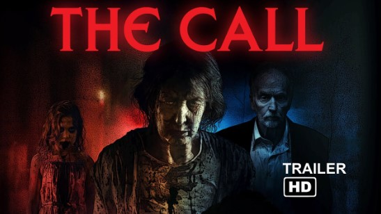
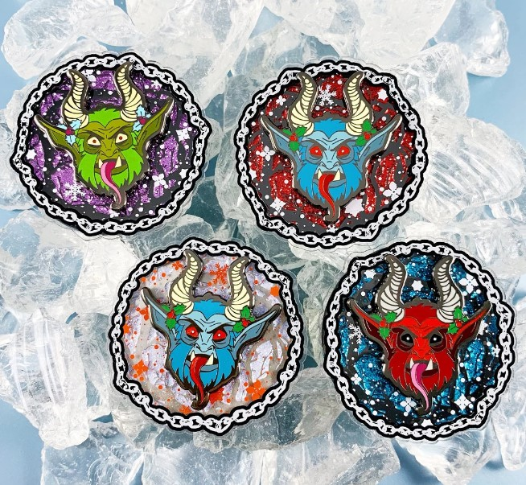

This article has been written and researched by our expert Loveable through a precise methodology. [Learn more about our methodology](https://avada.io/loveable/our-methodological.html)

[Loveable](https://avada.io/loveable/) > [Blog](https://avada.io/loveable/blog/) > [Holiday](https://avada.io/loveable/holiday/)

# 40 Noteable Scary Christmas Movies to Haunt Your Holiday

Written by [Blake Simpson](https://avada.io/loveable/author/blake/) Last Updated on September 11, 2023

- [40 Scary Christmas Movies That Make You Bone-Chilling](https://avada.io/loveable/blog/scary-christmas-movies/#wp-block-heading-2-3)
    - [1\. Krampus (2015)](https://avada.io/loveable/blog/scary-christmas-movies/#wp-block-heading-3-4)
    - [2\. Gremlins (1984)](https://avada.io/loveable/blog/scary-christmas-movies/#wp-block-heading-3-10)
    - [3\. Black Christmas (1974)](https://avada.io/loveable/blog/scary-christmas-movies/#wp-block-heading-3-16) 
    - [4\. “Rare Exports: A Christmas Tale” (2010)](https://avada.io/loveable/blog/scary-christmas-movies/#wp-block-heading-3-21)
    - [5\. Silent Night, Deadly Night (1984)](https://avada.io/loveable/blog/scary-christmas-movies/#wp-block-heading-3-27)
    - [6\. A Christmas Horror Story (2015)](https://avada.io/loveable/blog/scary-christmas-movies/#wp-block-heading-3-33)
    - [7\. Better Watch Out (2016)](https://avada.io/loveable/blog/scary-christmas-movies/#wp-block-heading-3-39) 
    - [8\. Santa’s Slay (2005)](https://avada.io/loveable/blog/scary-christmas-movies/#wp-block-heading-3-45)
    - [9\. Dead End (2003)](https://avada.io/loveable/blog/scary-christmas-movies/#wp-block-heading-3-51) 
    - [10\. P2 (2007)](https://avada.io/loveable/blog/scary-christmas-movies/#wp-block-heading-3-57)
    - [11\. The Children (2008)](https://avada.io/loveable/blog/scary-christmas-movies/#wp-block-heading-3-63)
    - [12\. Elves (1989)](https://avada.io/loveable/blog/scary-christmas-movies/#wp-block-heading-3-69)
    - [13\. Jack Frost (1997)](https://avada.io/loveable/blog/scary-christmas-movies/#wp-block-heading-3-75)
    - [14\. Sint (2010)](https://avada.io/loveable/blog/scary-christmas-movies/#wp-block-heading-3-81)
    - [15\. All Through the House (2015)](https://avada.io/loveable/blog/scary-christmas-movies/#wp-block-heading-3-87)
    - [16\. Red Christmas (2016)](https://avada.io/loveable/blog/scary-christmas-movies/#wp-block-heading-3-93)
    - [17\. The Nightmare Before Christmas (1993)](https://avada.io/loveable/blog/scary-christmas-movies/#wp-block-heading-3-99) 
    - [18\. Anna and the Apocalypse (2017)](https://avada.io/loveable/blog/scary-christmas-movies/#wp-block-heading-3-105)
    - [19\. Mercy Christmas (2017)](https://avada.io/loveable/blog/scary-christmas-movies/#wp-block-heading-3-111)
    - [20\. Dial Code Santa Claus (1989)](https://avada.io/loveable/blog/scary-christmas-movies/#wp-block-heading-3-117) 
    - [21\. Don’t Open Till Christmas (1984)](https://avada.io/loveable/blog/scary-christmas-movies/#wp-block-heading-3-123) 
    - [22\. Silent Night (2012)](https://avada.io/loveable/blog/scary-christmas-movies/#wp-block-heading-3-129)
    - [23\. To All A Goodnight (1980)](https://avada.io/loveable/blog/scary-christmas-movies/#wp-block-heading-3-135)
    - [24\. A Cadaver Christmas (2011)](https://avada.io/loveable/blog/scary-christmas-movies/#wp-block-heading-3-141)
    - [25\. The Children’s Hour (1961)](https://avada.io/loveable/blog/scary-christmas-movies/#wp-block-heading-3-147)
    - [26\. Christmas Evil (1980)](https://avada.io/loveable/blog/scary-christmas-movies/#wp-block-heading-3-153)
    - [27\. The Gingerdead Man (2005)](https://avada.io/loveable/blog/scary-christmas-movies/#wp-block-heading-3-159) 
    - [28\. The Day of the Beast (1995)](https://avada.io/loveable/blog/scary-christmas-movies/#wp-block-heading-3-165)
    - [29\. Scrooged (1988)](https://avada.io/loveable/blog/scary-christmas-movies/#wp-block-heading-3-171)
    - [30\. Tales from the Crypt: And All Through the House (1972)](https://avada.io/loveable/blog/scary-christmas-movies/#wp-block-heading-3-177)
    - [31\. Aquaslash (2020)](https://avada.io/loveable/blog/scary-christmas-movies/#wp-block-heading-3-183)
    - [32\. Anything for Jackson (2020)](https://avada.io/loveable/blog/scary-christmas-movies/#wp-block-heading-3-188)
    - [33\. Deathcember (2020)](https://avada.io/loveable/blog/scary-christmas-movies/#wp-block-heading-3-194)
    - [34\. Puppet Killer (2020)](https://avada.io/loveable/blog/scary-christmas-movies/#wp-block-heading-3-200)
    - [35\. Pooka Lives! (2020)](https://avada.io/loveable/blog/scary-christmas-movies/#wp-block-heading-3-206)
    - [37\. Christmas Zombies (2020)](https://avada.io/loveable/blog/scary-christmas-movies/#wp-block-heading-3-212)
    - [38\. The Call (2020)](https://avada.io/loveable/blog/scary-christmas-movies/#wp-block-heading-3-218)
    - [38\. The Exorcism of Karen Walker (2020)](https://avada.io/loveable/blog/scary-christmas-movies/#wp-block-heading-3-224)
    - [39\. Host (2020)](https://avada.io/loveable/blog/scary-christmas-movies/#wp-block-heading-3-229) 
    - [40\. The Old Ways (2021)](https://avada.io/loveable/blog/scary-christmas-movies/#wp-block-heading-3-234)
- [Enjoy Christmas Day with a Horror Movie Gift-giving](https://avada.io/loveable/blog/scary-christmas-movies/#wp-block-heading-2-239)
    - [1\. Merry Krampus Christmas Metal Ornament](https://avada.io/loveable/blog/scary-christmas-movies/#wp-block-heading-3-240)
    - [2\. Gremlins 2 Retro Sprites Mug](https://avada.io/loveable/blog/scary-christmas-movies/#wp-block-heading-3-243)
    - [3\. Black Christmas Tee](https://avada.io/loveable/blog/scary-christmas-movies/#wp-block-heading-3-246)
    - [4\. Horror Movie Scene Poster](https://avada.io/loveable/blog/scary-christmas-movies/#wp-block-heading-3-249)
    - [5\. Krampus in the Corner Plush Toy](https://avada.io/loveable/blog/scary-christmas-movies/#wp-block-heading-3-252)
    - [6\. Vintage Silent Night Deadly T-shirt](https://avada.io/loveable/blog/scary-christmas-movies/#wp-block-heading-3-255)
    - [7\. Jack Skellington The Nightmare Before Christmas Pillow](https://avada.io/loveable/blog/scary-christmas-movies/#wp-block-heading-3-258)
    - [8\. Macabre Christmas Ornaments Set](https://avada.io/loveable/blog/scary-christmas-movies/#wp-block-heading-3-261)
    - [9\. Merry Christmas Gremlin Basic Sweatshirt](https://avada.io/loveable/blog/scary-christmas-movies/#wp-block-heading-3-264)
    - [10\. Krampus Spinning Snow Flurry Enamel Pin](https://avada.io/loveable/blog/scary-christmas-movies/#wp-block-heading-3-267)
- [Bottom Line](https://avada.io/loveable/blog/scary-christmas-movies/#wp-block-heading-2-273)

Get ready to add a spine-tingling twist to your holiday festivities as you dive into the more than 40 Notable **Scary Christmas Movies**. You’ll embark on a thrilling journey through a unique blend of yuletide cheer and hair-raising horror. 

But wait, Why not look for a unique and unforgettable gift for your friends and family? These movie-themed gifts will perfectly delight their faces. So, whether it’s a movie night with loved ones or a solo adventure into the unknown, these films make for a perfect present that will keep on giving long after the holiday season has passed.

## **40 Scary Christmas Movies That Make You Bone-Chilling**

### **1\. Krampus (2015)**

Cast: Adam Scott, Toni Collette, David Koechner, Allison Tolman, Conchata Ferrell, Emjay Anthony, Stefania LaVie Owen và Krista Stadler.

The 2015 horror-comedy film “Krampus,” was directed by Michael Dougherty. Frustrated and disillusioned, Max unwittingly summons the ancient and malevolent spirit of Krampus.

When you follow the family’s desperate struggle against Krampus and his minions. This movie offers you a unique holiday experience, blending festive cheer with spine-tingling suspense, all while reimagining the traditional Christmas narrative.

Where to watch: [Amazon Prime Video](https://www.amazon.com/Krampus-Adam-Scott/dp/B01DYZM0AK/ref=sr_1_1)

### **2\. Gremlins (1984)**

Cast: Zach Galligan, Phoebe Cates, Hoyt Axton, Polly Holliday và Frances Lee McCain and Howie Mandel

“Gremlins,” the iconic scary Christmas 1984 film introduces you to a quirky and unsuspecting town where the discovery of an unusual creature. 

When Billy Peltzer receives a Mogwai named Gizmo as a Christmas gift, he is given three important rules: keep it away from bright lights, don’t get it wet, and never feed it after midnight. The film will leave you entertained and reminiscing about the magic of 80s cinema.

**Where to watch:** [Amazon Prime Video](https://www.amazon.com/Gremlins-Zach-Galligan/dp/B00KQ9ZW4O/ref=sr_1_1)

### **3\. Black Christmas (1974)** 

Cast: Olivia Hussey, Keir Dullea, Margot Kidder, Andrea Martin, Lynne Griffin và John Saxon.

Set during the holiday season, the film follows a group of sorority sisters who find themselves terrorized by a mysterious and deranged killer. As you delve into this iconic horror film, you’ll be drawn into the unsettling events surrounding a sorority house during the holiday season. 

**Where to watch:** [Amazon Prime Video](https://www.amazon.com/Black-Christmas-Olivia-Hussey/dp/B01MSXEEFG/ref=sr_1_1)

### **4\. “Rare Exports: A Christmas Tale” (2010)**

Cast: Onni Tommila, Jorma Tommila, Tommi Korpela, Rauno Juvonen, Per Christian Ellefsen

“Rare Exports: A Christmas Tale” is set in the Korvatunturi mountains of Finland, the film centers around a young boy named Pietari who discovers the truth behind the myth of Santa Claus. 

In the movie, you are likely to follow the young protagonist’s quest to prevent the ancient, malevolent Santa from wreaking havoc on Christmas Eve.

**Where to watch:** [Amazon Prime Video](https://www.amazon.com/Rare-Exports-Christmas-English-Subtitled/dp/B018JQSJHM/ref=sr_1_1)

### **5\. Silent Night, Deadly Night (1984)**

Cast: Robert Brian Wilson, Lilyan Chauvin, Gilmer McCormick, Toni Nero, Linnea Quigley, Britt Leach và Leo Geter.

The “Silent Night, Deadly Night” film opens you to the twisted origins of a holiday-themed killer. The story follows young Billy Chapman, traumatized by witnessing his parents’ brutal murder at the hands of a man dressed as Santa Claus. 

This horror Christmas movie gives you a provocative and unconventional holiday viewing experience. 

**Where to watch:** [Amazon Prime Video](https://www.amazon.com/Silent-Night-Deadly-Lilyan-Chauvin/dp/B00ALZZFEK/ref=sr_1_1)

### **6\. A Christmas Horror Story (2015)**

Cast:  William Shatner, George Buza, Rob Archer, Zoé De Grand Maison and more

“A Christmas Horror Story” movie weaves together multiple interlocking stories set on Christmas Eve. The film takes you on a chilling journey through a small town, where a radio DJ and his team uncover a series of eerie events. 

This film gives you a unique blend of festive merriment and spine-tingling horror, offering a fresh perspective on holiday storytelling.

**Where to watch:** [Amazon Prime Video](https://www.amazon.com/Christmas-Horror-Story-George-Buza/dp/B01546FYKA/ref=sr_1_1)

### **7\. Better Watch Out (2016)** 

Cast: Olivia DeJonge, Levi Miller và Ed Oxenbould

Directed by Chris Peckover, “Better Watch Out” is set during the Christmas season, the film revolves around Ashley, a babysitter tasked with looking after a 12-year-old boy named Luke. 

It delivers a tense and thrilling experience, giving you a holiday-themed narrative that stands out from the usual seasonal fare and leaves you with a lingering sense of unease.

**Where to watch:** [Amazon Prime Video](https://www.amazon.com/Better-Watch-Out-Not-Specified/dp/B0C8XXVWZN/ref=sr_1_1)

### **8\. Santa’s Slay (2005)**

Cast: Bill Goldberg, Douglas Smith, Emilie de Ravin, Robert Culp. 

“Santa’s Slay” flips the traditional Christmas narrative on its head by portraying Santa Claus as a malevolent and murderous figure. The film kicks off when Santa is actually the son of Satan, and for a thousand years, he is forced to spread holiday cheer. 

This Christmas scary film gives you a gleefully twisted take on the holiday season, offering a wickedly entertaining escape from traditional cheer.

**Where to watch:** [Amazon Prime Video](https://www.amazon.com/Santas-Slay-Bill-Goldberg/dp/B00FVXSH9W/ref=sr_1_1)

### **9\. Dead End (2003)** 

Cast: Alexandra Holden, Ray Wise, Lin Shaye, Mick Cain, Billy Asher và Amber Smith.

“Dead End,” a 2003 horror-thriller directed by Jean-Baptiste that you cannot miss for an interesting holiday.

As the Harrington family embarks on their traditional Christmas Eve drive to visit relatives, they find themselves trapped on a desolate and endless road. The tensions rise and strange occurrences unfold, it becomes evident that a malevolent force is toying with them.

**Where to watch:** [IMDb](https://www.imdb.com/title/tt0308152/)

### **10\. P2 (2007)**

Cast: Wes Bentley, Rachel Nichols, Simon Reynolds, Philip Akin

Let’s delve into the tale of a young woman named Angela, who becomes trapped in an underground parking garage on Christmas Eve. Stalked by a deranged security guard named Thomas, Angela must navigate the maze-like structure to escape his twisted obsession. 

In “P2” (2007), you’re thrust into a tense cat-and-mouse game that unfolds in a seemingly secure parking garage. 

**Where to watch:** [Amazon Prime Video](https://www.amazon.com/P2-Wes-Bentley/dp/B009HEPG36/ref=sr_1_1)

### **11\. The Children (2008)**

Cast: Eva Birthistle, Stephen Campbell Moore, Jeremy Sheffield, Rachel Shelley.

“The Children” is opened on a winter vacation, the film follows two families who come together to celebrate Christmas in a secluded countryside home. As the adults grapple with the horrifying realization that the children are turning against them.

With its eerie ambiance, “The Children” will offer a disturbingly effective experience, reminding you that even festive moments can hide unimaginable horrors.

**Where to watch:** [IMDb](https://www.imdb.com/title/tt1172571/)

### **12\. Elves (1989)**

Cast: Dan Haggerty, Deanna Lund, and Ken Carpenter

“Elves,” a 1989 horror film directed by Jeffrey Mandel, will take you on an unexpected and twisted approach to the holiday season. The story revolves around a group of neo-Nazis who inadvertently awaken a malevolent and ancient elf creature while performing a ritual.

This scary Christmas movie gifts you a strangely captivating viewing experience that defies conventional holiday storytelling. Let’s prepare for an offbeat ride that’s bound to leave you perplexed and intrigued.

**Where to watch:** [IMDb](https://www.imdb.com/title/tt0099496/)

### **13\. Jack Frost (1997)**

Cast: Scott MacDonald, Christopher Allport, Stephen Mendel Watch

Jack Frost is a horror movie which is directed by Michael Cooney. The story follows a serial killer named Jack Frost, who dies in a car accident while being transported to his execution.

The film delivers a blend of dark humor and campy horror that’s surprisingly entertaining. It may gift you a playfully absurd twist on the holiday season, offering a lighthearted yet gory romp through winter mayhem.

**Where to watch:** [Amazon Prime Video](https://www.amazon.com/Jack-Frost-Chris-Allport/dp/B01A63XP70/)

### **14\. Sint (2010)**

Cast: Caro Lenssen, Cynthia Abma, Egbert Jan Weeber, Escha Tanihatu, Huub Stapel

Why not watch a scary movie to have a dramatic holiday with your beloved? This Dutch horror film, also known as “Saint,” revolves around the sinister Saint Nicholas, who, instead of bestowing gifts, spreads terror among the innocent. 

However, when you watch, a malevolent bishop, risen from the dead, wreaks havoc on the eve of St. Nicholas’ feast, leaving you a trail of terror. It definitely grants you an unsettling and thrilling experience, filled with suspense and unexpected scares.

**Where to watch:** [IMDb](https://www.imdb.com/title/tt1167675/)

### **15\. All Through the House (2015)**

Cast: Jessica Cameron, Ashley Mary Nunes, Melynda Kiring, Natalie Montera, Lito Velasco

Let’s embark on a heart-pounding journey into the macabre with “All Through the House” (2015) – a horror treat that combines festive cheer with spine-chilling terror. 

The movie is opened in a quaint suburban neighborhood during the Christmas season. It follows a young woman’s return home, only to find herself trapped in a nightmare of yuletide horror. It gives you a fresh take on the genre, presenting a holiday-themed narrative that’s both shocking and entertaining.

**Where to watch:** [Amazon Prime Video](https://www.amazon.com/Through-House-Ashley-Marie-Nunes/dp/B01KZ6VB4M/)

### **16\. Red Christmas (2016)**

Cast: Dee Wallace, Geoff Morrell, David Collins, Sam Campbell

“Red Christmas” (2016) is a chilling tale that transcends the boundaries of traditional holiday fare. The story unfolds during a family gathering at Christmastime, but its joy quickly gives way to terror as an unexpected and malevolent guest arrives. 

In the movie, it thrusts you into a tense family gathering turned nightmare. As you watch, you will see that a deformed stranger disrupts a Christmas reunion, reveals shocking secrets, and ignites a deadly battle for survival. 

**Where to watch:** [IMDb](https://www.imdb.com/title/tt5120400/)

### **17\. The Nightmare Before Christmas (1993)** 

Cast: Danny Elfman, Chris Sarandon, Catherine O’Hara, William Hickey. Jack Skellington

Let’s gather with your loved ones and together immerse in Tim Burton’s visionary tale, “The Nightmare Before Christmas” (1993). Jack Skellington, the Pumpkin King, discovers Christmas and endeavors to bring his own twist to the holiday. 

You can enjoy a spellbinding cinematic journey, delving into the magic of imagination and the power of embracing differences. This scary Christmas movie will perfectly gift you a timeless tale that resonates with both the Halloween and Christmas spirit.

**Where to watch:** [Amazon Prime Video](https://www.amazon.com/Tim-Burtons-Nightmare-Before-Christmas/dp/B003SI05PG/)

### **18\. Anna and the Apocalypse (2017)**

Cast: Ella Hunt, Malcolm Cumming, Sarah Swire, Christopher Leveaux, Marli Siu

“Anna and the Apocalypse” (2017) shatters conventions with its infectious blend of music, horror, and heart. It starts in the backdrop of a zombie apocalypse; this genre-defying gem follows Anna, a high school student who dreams of escaping her small town.

In the film, you will feel the thrill of horror while understanding a resonant message about friendship, survival, and finding hope in the most unexpected places.

**Where to watch:** [Amazon Prime Video](https://www.amazon.com/Anna-Apocalypse-Ella-Hunt/dp/B07KWJPDXK/)

### **19\. Mercy Christmas (2017)**

Cast: Steven Hubbell, Cole Gleason, Whitney Nielsen, Casey O’Keefe, D.J. Hale

“Mercy Christmas” (2017) invites you to a holiday celebration unlike any other, where family gatherings take a spine-chilling turn. The film follows Michael, an unsuspecting man kidnapped by a seemingly harmless family for their sinister holiday traditions. 

The film absolutely provides gruesome yet laugh-out-loud moments to you and reminds you that even amidst chaos, there’s room for laughter.

**Where to watch:** [Amazon Prime Video](https://www.amazon.com/Mercy-Christmas-Steven-Hubbell/dp/B076L12WH5/)

### **20\. Dial Code Santa Claus (1989)** 

Cast: Brigitte Fossey, Louis Ducreux, Patrick Floersheim, François-Éric Gendron

“Dial Code Santa Claus” (1989), also known as “Game Over” and “Deadly Games,” is a heart-pounding holiday horror that takes place on Christmas Eve. 

The movie depicts young Thomas, a resourceful boy who must defend his home from a deranged intruder dressed as Santa Claus. If you’re seeking an adrenaline-fueled thriller with a festive twist, “Dial Code Santa Claus” is a must-watch. 

Where to watch: [IMDb](https://www.imdb.com/title/tt0096741/)

### **21\. Don’t Open Till Christmas (1984)** 

Cast: Edmund Purdom, Alan Lake, Belinda Mayne, Mark Jones

In “Don’t Open Till Christmas” (1984), the festive season turns sinister when a serial killer targets those celebrating the holidays. The film is placed in a backdrop of holiday cheer, showing the chilling investigation into the gruesome murders. 

This movie will deliver you with shocking twists and pulse-pounding moments that will leave you on the edge of your seat. 

**Where to watch:** [Amazon Prime Video](https://www.amazon.com/Dont-Open-Christmas-Edmund-Purdom/dp/B0B8MRL2ZP/)

### **22\. Silent Night (2012)**

Cast: Malcolm McDowell, Jaime King, Donal Logue, Rick Skene

In “Silent Night” (2012), you will feel Christmas turns sinister as a masked killer wreaks havoc on a small town’s Christmas celebrations. The film follows the determined Deputy Sheriff Aubrey Bradimore as she races against time to unravel the mystery behind the murders. 

The movie delivers shocking twists that will keep you on the edge of your seat. Let’s turn on your streaming device and delve into the dark of this Christmas scary movie.

 **Where to watch:** [Amazon Prime Video](https://www.amazon.com/Silent-Night-Malcolm-McDowell/dp/B00AHSGMKC/)

### **23\. To All A Goodnight (1980)**

Cast: Jennifer Runyon, Forrest Swanson, Linda Gentile, and more

“To All a Goodnight” (1980) tells about a group of college friends gathering at a secluded mansion over the Christmas break. And they find themselves stalked by a mysterious killer in a Santa Claus costume. 

To make your Christmas season more interesting, this spooky movie is the top choice for you to watch with your friends and partners. 

**Where to watch:** [Amazon Prime Video](https://www.amazon.com/All-Good-Night-Jennifer-Runyon/dp/B0B6SKRTRM/)

### **24\. A Cadaver Christmas (2011)**

Cast: Daniel Rairdin-Hale, Hanlon Smith-Dorsey, Yosh Hayashi, Ben Hopkins

“A Cadaver Christmas” (2011) delivers holiday humor with a gory twist. A bumbling janitor accidentally unleashes a zombie apocalypse on a college campus. Then, a mismatched group of survivors must navigate the chaos while facing the undead and other bizarre obstacles.

The film’s unique blend of gory visuals and dark humor creates an unconventional holiday treat that will leave you both entertained and horrified. 

**Where to watch:** [Amazon Prime Video](https://www.amazon.com/Cadaver-Christmas-Daniel-Rairdin-Hale/dp/B009K72LII/) 

### **25\. The Children’s Hour (1961)**

Cast: Audrey Hepburn, Shirley MacLaine, James Garner và Fay Bainter

“The Children’s Hour” (1961) is adapted from Lillian Hellman’s play; the film follows two women who run a girls’ boarding school. As malicious student spreads a false rumor about their relationship, their lives spiral into chaos as the lie takes on a life of its own. 

The film will take you on an emotional journey through prejudice, loyalty, and the devastating consequences of false accusations.

**Where to watch:** [Amazon Prime Video](https://www.amazon.com/Childrens-Hour-Audrey-Hepburn/dp/B000RLAPLQ/)

### **26\. Christmas Evil (1980)**

Cast: Brandon Maggart, Jeffrey DeMunn, Dianne Hull, Andy Fenwick

“Christmas Evil” (1980) focuses on Harry Stradling, a troubled man consumed by his fixation on Santa Claus. When Christmas approaches, Harry’s delusions and sinister tendencies escalate, leading him to obsession and violence. 

This scary Christmas film reminds you that even joyous occasions can take a sinister turn. Therefore, let’s prepare to discover an eccentric and thought-provoking yuletide journey with this film.

**Where to watch:**  [Amazon Prime Video](https://www.amazon.com/Christmas-Better-Watch-Retro-Style/dp/B00DG8EQ62/)

### **27\. The Gingerdead Man (2005)** 

Cast: Gary Busey, Robin Sydney, Ryan Locke, Alexia Aleman, Jonathan Chase

It is a great horror-comedy treat for you to enjoy this Christmas, “The Gingerdead Man” (2005). The film starts after a deranged killer’s ashes are mixed into cookie dough, and a batch of gingerbread cookies turns into a murderous confection brought to life. 

If you want to challenge your brace, this film embraces its over-the-top premise with a wink that absolutely makes you tear up at fear.

**Where to watch:** [Amazon Prime Video](https://www.amazon.com/Gingerdead-Man-Gary-Busey/dp/B0071241VE/) 

### **28\. The Day of the Beast (1995)**

Cast: Álex Angulo, Armando De Razza, Santiago Segura, Terele Pávez

“The Day of the Beast” (1995) offers a devilishly dark and comedic twist on the horror genre. When a priest becomes convinced that the birth of the Antichrist is imminent, he teams up with a heavy metal fan and a TV show host to stop the apocalypse. 

Moreover, “The Day of the Beast” (1995) will invite you on an audacious journey through a twisted blend of dark comedy, horror, and religious satire. It also impresses you with a unique mix of irreverent humor and apocalyptic dread. 

**Where to watch:** [IMDb](https://www.imdb.com/title/tt0112922/)

### **29\. Scrooged (1988)**

Cast: Bill Murray, Karen Allen, John Forsythe, John Glover, and more

“Scrooged” (1988) tells about Frank Cross, a ruthless TV executive, as he embarks on a surreal journey of self-discovery. Bill Murray’s comedic brilliance shines as he navigates a world of slapstick chaos and heartwarming redemption. 

The film will remind you of the importance of empathy and kindness while keeping you entertained with its witty dialogue and memorable performances.

**Where to watch:** [Amazon Prime Video](https://www.amazon.com/Scrooged-Bill-Murray/dp/B0045W32NG/)

### **30\. Tales from the Crypt: And All Through the House (1972)**

Cast: Ralph Richardson, Geoffrey Bayldon, Joan Collins, Martin Boddey

“Tales from the Crypt: And All Through the House” (1972) presents a sinister holiday tale as a woman’s festive plans take a horrifying turn. On Christmas Eve, the film follows a woman who must fend off an escaped mental patient dressed as Santa Claus.

So, it will provide you with a thrilling and compact experience, reminding you that even during the holidays, fear can take center stage.

**Where to watch:** [IMDb](https://www.imdb.com/title/tt0069341/)

### **31\. Aquaslash (2020)**

Cast: Nicolas Fontaine, Brittany Drisdelle, Nick Walker, Madelline Harvey

Come with your besties to dive into the chilling waters of “Aquaslash” (2020), a suspenseful horror film set around a water park. As young adults gather for a wild end-of-summer party, they quickly face an unexpected and deadly threat. 

**Where to watch:** [Amazon Prime Video](https://www.amazon.com/Aquaslash-Nicolas-Fontaine/dp/B0891LXFYN/)

### **32\. Anything for Jackson (2020)**

Cast: Sheila McCarthy, Julian Richings, Konstantina Mantelos, Josh Cruddas

The film will welcome you to a chilling narrative where grief collides with the supernatural. After losing their grandson, a grieving couple turns to dark forces, attempting to bring him back through a forbidden ritual. 

The film will welcome you to a chilling narrative where grief collides with the supernatural. As you watch, it may bring you to a suspenseful and thought-provoking experience after that. 

**Where to watch**: [Amazon Prime Video](https://www.amazon.com/Anything-Jackson-Julian-Richings/dp/B0961RSDX6/)

### **33\. Deathcember (2020)**

Cast: Barbara Crampton, Pollyanna McIntosh, AJ Bowen

It would be a regret for you if you didn’t watch “Deathcember” (2020). With each segment directed by a different filmmaker, the film weaves together a series of chilling stories exploring Christmas’s darker aspects.

The movie is a blockbuster for the scary Christmas genre so it is always the best option for you to watch with your friend or family. 

**Where to watch:** [Amazon Prime Video](https://www.amazon.com/Deathcember-Barbara-Crampton/dp/B08MWXW1CK/)

### **34\. Puppet Killer (2020)**

Cast: Aleks Paunovic, Lee Majdoub, Lisa Durupt, Richard Harmon

Watch the eerie world of “Puppet Killer” (2020), a horror-comedy film that twists your childhood nostalgia into a chilling tale. When a young woman inherits her late mother’s cherished puppet collection, she soon finds herself in a nightmare.

With its inventive kills, this movie delivers an offbeat and entertaining experience that will leave you both amused and spooked.

**Where to watch:** [IMDb](https://www.imdb.com/title/tt4278760/)

### **35\. Pooka Lives! (2020)**

Cast: Malcolm Barrett, Lyndie Greenwood, Felicia Day, Jonah Ray

Welcome to “Pooka Lives!” (2020), a horror-comedy film that takes you to a dark and humorous look at the power of viral superstitions. 

When a group of friends resurrects the infamous Pooka character as an online prank, they unknowingly unleash a wave of chaos and terror. It invites you to contemplate the blurred lines between truth and fiction in an era dominated by technology. 

**Where to watch:** [IMDb](https://www.imdb.com/title/tt11828642/) 

### **37\. Christmas Zombies (2020)**

Cast: Ashley Hays Wright, Jaina Wright, and David Owen Wright

Are you ready for a wild and festive ride with “Christmas Zombies” (2020), a horror Christmas movie that turns your holiday season into a gory showdown? 

When a small town is hit by an unexpected zombie outbreak during Christmas, it’s up to a group of survivors to fight for their lives and save the holiday spirit. The movie prompts you to contemplate the fragility of tradition in the face of chaos.

**Where to watch:** [IMDb](https://www.imdb.com/title/tt12906940/)

### **38\. The Call (2020)**

Cast: Lin Shaye, Tobin Bell, Erin Sanders, and Chester Rushing

“The Call” (2020) invites you into the heart-pounding world. When a woman receives a call from her past self, she faces a life-changing decision that ripples through time.

The movie’s exploration of the repercussions of choices and the ripple effect across time gives you a poignant narrative that sparks introspection. That’s why if you want to lift your holiday experience, this movie is a perfect option for you. 

**Where to watch:** [Amazon Prime Video](https://www.amazon.com/Call-Lin-Shaye/dp/B08LXJ7K5X/)

### **38\. The Exorcism of Karen Walker (2020)**

Cast: Shane Taylor, Rula Lenska, Jeanine Nerissa Sothcott, Denise Moreno

Do you prepare for a spine-tingling experience with “The Exorcism of Karen Walker” (2020) that plunges you into supernatural terror? When a young woman named Karen becomes possessed by a malevolent entity, a priest and his team embark on a harrowing exorcism to save her soul. 

**Where to watch:** [IMDb](https://www.imdb.com/title/tt7631320/) 

### **39\. Host (2020)** 

Cast: Haley Bishop, Jemma Moore, Emma Louise Webb, Radina Drandova

Gather your loved one and experience a new dimension of horror with “Host” (2020). The film starts with a group of friends who decide to hold an online séance during the pandemic lockdown, they unwittingly invite an evil presence into their homes.

**Where to watch:** [Amazon Prime Video](https://www.amazon.com/Host-Haley-Bishop/dp/B08NDB2M21/)

### **40\. The Old Ways (2021)**

Cast: Brigitte Kali Canales, Andrea Cortés, Julia Vera, Sal Lopez

“The Old Ways” is a supernatural horror film that explores the clash between ancient traditions and modern skepticism. Starting with a young journalist who is held captive by villagers in Mexico. She’s accused of being possessed by a malevolent spirit. 

**Where to watch:** [Amazon Prime Video](https://www.amazon.com/Old-Ways-Brigitte-Kali-Canales/dp/B09HMPRP87/)

## **Enjoy Christmas Day with a Horror Movie Gift-giving**

### **1\. Merry Krampus Christmas Metal Ornament**

[Merry Krampus Christmas metal ornament](https://www.etsy.com/listing/1358653257/) is inspired by the intriguing folklore of Krampus, which is evil. Crafted with intricate details, it will infuse your festivities with a hint of edgy charm.

### **2\. Gremlins 2 Retro Sprites Mug**

Do you want this [Gremlins 2 Retro Sprites mug](https://www.etsy.com/listing/1469923753/) to live up some exciting moments with the Gremline? The retro sprite’s design evokes a sense of whimsical adventure, transporting you to the thrilling world of the [classic Christmas film](https://avada.io/loveable/blog/classic-christmas-movies/). 

### **3\. Black Christmas Tee**

Elevate your wardrobe with the [Black Christmas](https://avada.io/loveable/blog/black-christmas-movie/) tee. The attention to detail draws you in—you’ll feel like you’re part of the scene. Whether it’s a creepy forest or a haunted house, you’re there.

### **4\. Horror Movie Scene Poster**

Let’s add a touch of enchantment to your walls – get your [Horror Movie Scene Poster](https://www.etsy.com/listing/1537396565/) today and bring the hauntingly beautiful love story to life in your own home!

### **5\. Krampus in the Corner Plush Toy**

[Krampus](https://www.etsy.com/listing/533003732) in the Corner Plush Toy is here for you or your loved scary movie buff to show your passion for this genre. With a nod to film-inspired mythology, it brings a touch of dark folklore to your space. 

### **6\. Vintage Silent Night Deadly T-shirt**

The [Vintage Silent Night Deadly Night T-shirt](https://www.amazon.com/Vintage-Silent-Night-Deadly-T-Shirt/dp/B0BMPRKQ63/) is a wonderful gift to honor your favorite Christmas scary moves. This tee evokes the nostalgic horror of the ’80s slasher genre.

### **7\. Jack Skellington The Nightmare Before Christmas Pillow**

Transform your space into a realm of enchantment by getting this [Jack Skellington Pillow](https://www.etsy.com/listing/848429770/) now. The pillow captures the haunting allure of Halloween and Christmas entwined to give you a spooky Christmas holiday with your beloved. 

### **8\. Macabre Christmas Ornaments Set**

Are you ready to celebrate the holidays with the intriguing [Macabre Christmas Ornaments Set](https://www.amazon.com/Christmas-Ornaments-Macabre-Holidays-Decoration/dp/B09KFHPY9V/)? The gift features the offbeat charm of Tim Burton’s movies, it is a standout addition to your holiday decoration. 

### **9\. Merry Christmas Gremlin Basic Sweatshirt**

Merry Christmas! Let’s come here to buy the [Merry Christmas Gremlin Basic Sweatshirt](https://www.etsy.com/listing/1525131446/merry-christmas-gremlin-basic-sweatshirt)! This sweatshirt will remind you of some unforgettable shots from Gremlin, to add a playful twist to your festive attire!

### **10\. Krampus Spinning Snow Flurry Enamel Pin**

The [Krampus Spinning Snow Flurry Enamel Pin](https://www.etsy.com/listing/724336181/krampus-spinning-snow-flurry-enamel-pin) will support you to be a famous character from the scary Christmas movie – Krampus. It is a must-have accessory for you and your loved girl who appreciates the darker side of the holiday. 

**_See More:_**

- [Funny Christmas Movie](https://avada.io/loveable/blog/funny-christmas-movie-quotes/) Quotes

- Best [Christmas Movie Trivia Questions](https://avada.io/loveable/blog/christmas-movie-trivia/)

## **Bottom Line**

You’ve journeyed through fright and festivity during the holiday, exploring a curated list of **40 Notable Scary Christmas Movies** to Haunt Your Holiday.

But remember, the thrill of these movies can linger long after the credits roll, making them perfect inspirations for unique gifts. These scary, movie-inspired presents will bring a touch of spooky delight to your holiday festivities. So why not let these films add an intriguing twist to your seasonal celebrations?

- [40 Scary Christmas Movies That Make You Bone-Chilling](https://avada.io/loveable/blog/scary-christmas-movies/#wp-block-heading-2-3)
    - [1\. Krampus (2015)](https://avada.io/loveable/blog/scary-christmas-movies/#wp-block-heading-3-4)
    - [2\. Gremlins (1984)](https://avada.io/loveable/blog/scary-christmas-movies/#wp-block-heading-3-10)
    - [3\. Black Christmas (1974)](https://avada.io/loveable/blog/scary-christmas-movies/#wp-block-heading-3-16) 
    - [4\. “Rare Exports: A Christmas Tale” (2010)](https://avada.io/loveable/blog/scary-christmas-movies/#wp-block-heading-3-21)
    - [5\. Silent Night, Deadly Night (1984)](https://avada.io/loveable/blog/scary-christmas-movies/#wp-block-heading-3-27)
    - [6\. A Christmas Horror Story (2015)](https://avada.io/loveable/blog/scary-christmas-movies/#wp-block-heading-3-33)
    - [7\. Better Watch Out (2016)](https://avada.io/loveable/blog/scary-christmas-movies/#wp-block-heading-3-39) 
    - [8\. Santa’s Slay (2005)](https://avada.io/loveable/blog/scary-christmas-movies/#wp-block-heading-3-45)
    - [9\. Dead End (2003)](https://avada.io/loveable/blog/scary-christmas-movies/#wp-block-heading-3-51) 
    - [10\. P2 (2007)](https://avada.io/loveable/blog/scary-christmas-movies/#wp-block-heading-3-57)
    - [11\. The Children (2008)](https://avada.io/loveable/blog/scary-christmas-movies/#wp-block-heading-3-63)
    - [12\. Elves (1989)](https://avada.io/loveable/blog/scary-christmas-movies/#wp-block-heading-3-69)
    - [13\. Jack Frost (1997)](https://avada.io/loveable/blog/scary-christmas-movies/#wp-block-heading-3-75)
    - [14\. Sint (2010)](https://avada.io/loveable/blog/scary-christmas-movies/#wp-block-heading-3-81)
    - [15\. All Through the House (2015)](https://avada.io/loveable/blog/scary-christmas-movies/#wp-block-heading-3-87)
    - [16\. Red Christmas (2016)](https://avada.io/loveable/blog/scary-christmas-movies/#wp-block-heading-3-93)
    - [17\. The Nightmare Before Christmas (1993)](https://avada.io/loveable/blog/scary-christmas-movies/#wp-block-heading-3-99) 
    - [18\. Anna and the Apocalypse (2017)](https://avada.io/loveable/blog/scary-christmas-movies/#wp-block-heading-3-105)
    - [19\. Mercy Christmas (2017)](https://avada.io/loveable/blog/scary-christmas-movies/#wp-block-heading-3-111)
    - [20\. Dial Code Santa Claus (1989)](https://avada.io/loveable/blog/scary-christmas-movies/#wp-block-heading-3-117) 
    - [21\. Don’t Open Till Christmas (1984)](https://avada.io/loveable/blog/scary-christmas-movies/#wp-block-heading-3-123) 
    - [22\. Silent Night (2012)](https://avada.io/loveable/blog/scary-christmas-movies/#wp-block-heading-3-129)
    - [23\. To All A Goodnight (1980)](https://avada.io/loveable/blog/scary-christmas-movies/#wp-block-heading-3-135)
    - [24\. A Cadaver Christmas (2011)](https://avada.io/loveable/blog/scary-christmas-movies/#wp-block-heading-3-141)
    - [25\. The Children’s Hour (1961)](https://avada.io/loveable/blog/scary-christmas-movies/#wp-block-heading-3-147)
    - [26\. Christmas Evil (1980)](https://avada.io/loveable/blog/scary-christmas-movies/#wp-block-heading-3-153)
    - [27\. The Gingerdead Man (2005)](https://avada.io/loveable/blog/scary-christmas-movies/#wp-block-heading-3-159) 
    - [28\. The Day of the Beast (1995)](https://avada.io/loveable/blog/scary-christmas-movies/#wp-block-heading-3-165)
    - [29\. Scrooged (1988)](https://avada.io/loveable/blog/scary-christmas-movies/#wp-block-heading-3-171)
    - [30\. Tales from the Crypt: And All Through the House (1972)](https://avada.io/loveable/blog/scary-christmas-movies/#wp-block-heading-3-177)
    - [31\. Aquaslash (2020)](https://avada.io/loveable/blog/scary-christmas-movies/#wp-block-heading-3-183)
    - [32\. Anything for Jackson (2020)](https://avada.io/loveable/blog/scary-christmas-movies/#wp-block-heading-3-188)
    - [33\. Deathcember (2020)](https://avada.io/loveable/blog/scary-christmas-movies/#wp-block-heading-3-194)
    - [34\. Puppet Killer (2020)](https://avada.io/loveable/blog/scary-christmas-movies/#wp-block-heading-3-200)
    - [35\. Pooka Lives! (2020)](https://avada.io/loveable/blog/scary-christmas-movies/#wp-block-heading-3-206)
    - [37\. Christmas Zombies (2020)](https://avada.io/loveable/blog/scary-christmas-movies/#wp-block-heading-3-212)
    - [38\. The Call (2020)](https://avada.io/loveable/blog/scary-christmas-movies/#wp-block-heading-3-218)
    - [38\. The Exorcism of Karen Walker (2020)](https://avada.io/loveable/blog/scary-christmas-movies/#wp-block-heading-3-224)
    - [39\. Host (2020)](https://avada.io/loveable/blog/scary-christmas-movies/#wp-block-heading-3-229) 
    - [40\. The Old Ways (2021)](https://avada.io/loveable/blog/scary-christmas-movies/#wp-block-heading-3-234)
- [Enjoy Christmas Day with a Horror Movie Gift-giving](https://avada.io/loveable/blog/scary-christmas-movies/#wp-block-heading-2-239)
    - [1\. Merry Krampus Christmas Metal Ornament](https://avada.io/loveable/blog/scary-christmas-movies/#wp-block-heading-3-240)
    - [2\. Gremlins 2 Retro Sprites Mug](https://avada.io/loveable/blog/scary-christmas-movies/#wp-block-heading-3-243)
    - [3\. Black Christmas Tee](https://avada.io/loveable/blog/scary-christmas-movies/#wp-block-heading-3-246)
    - [4\. Horror Movie Scene Poster](https://avada.io/loveable/blog/scary-christmas-movies/#wp-block-heading-3-249)
    - [5\. Krampus in the Corner Plush Toy](https://avada.io/loveable/blog/scary-christmas-movies/#wp-block-heading-3-252)
    - [6\. Vintage Silent Night Deadly T-shirt](https://avada.io/loveable/blog/scary-christmas-movies/#wp-block-heading-3-255)
    - [7\. Jack Skellington The Nightmare Before Christmas Pillow](https://avada.io/loveable/blog/scary-christmas-movies/#wp-block-heading-3-258)
    - [8\. Macabre Christmas Ornaments Set](https://avada.io/loveable/blog/scary-christmas-movies/#wp-block-heading-3-261)
    - [9\. Merry Christmas Gremlin Basic Sweatshirt](https://avada.io/loveable/blog/scary-christmas-movies/#wp-block-heading-3-264)
    - [10\. Krampus Spinning Snow Flurry Enamel Pin](https://avada.io/loveable/blog/scary-christmas-movies/#wp-block-heading-3-267)
- [Bottom Line](https://avada.io/loveable/blog/scary-christmas-movies/#wp-block-heading-2-273)

### [Blake Simpson](https://avada.io/loveable/author/blake/)

Hi, I'm Blake from Loveable. I help people find perfect gifts for occasions like anniversaries and weddings. I also write a blog about holidays, sharing insights to make them more meaningful. Let's create unforgettable moments together!

- [Twitter](https://twitter.com/intent/tweet)
- [Facebook](https://www.facebook.com/sharer/sharer.php)
- [instagram](https://avada.io/loveable/blog/scary-christmas-movies/)
- [pinterest](https://www.pinterest.com/loveablellc/)

## Related Posts

[### 120+ Christian Birthday Wishes To Spread Your Love](https://avada.io/loveable/blog/christian-birthday-wishes/) 

[

### 35 Best 70th Birthday Ideas To Celebrate The Special Milestone

](https://avada.io/loveable/blog/70th-birthday-ideas/)

[

### 50 Best 30th Birthday Decorations for a Remarkable Birthday Bash

](https://avada.io/loveable/blog/30th-birthday-decorations/)

[

### 40 Delicious Vegan Christmas Desserts to Delight Your Palate

](https://avada.io/loveable/blog/vegan-christmas-desserts/)

[

### 60 Christmas Team Building Activities to Boost Workplace Spirit

](https://avada.io/loveable/blog/christmas-team-building-activities/)
