This article has been written and researched by our expert Loveable through a precise methodology. [Learn more about our methodology](https://avada.io/loveable/our-methodological.html)

[Loveable](https://avada.io/loveable/) > [Blog](https://avada.io/loveable/blog/) > [Holiday](https://avada.io/loveable/holiday/)

# 40 Office Christmas Decorations That Will Impress Everyone

Written by [Blake Simpson](https://avada.io/loveable/author/blake/) Last Updated on September 15, 2023

- [8 Christmas Lights for Office Decoration](https://avada.io/loveable/blog/office-christmas-decorations/#wp-block-heading-2-3)
    - [1\. Snow Globe Terrariums](https://avada.io/loveable/blog/office-christmas-decorations/#wp-block-heading-3-4)
    - [2\. DIY Copper Lighted Wreaths](https://avada.io/loveable/blog/office-christmas-decorations/#wp-block-heading-3-8)
    - [3\. Faux Metal Star Lantern](https://avada.io/loveable/blog/office-christmas-decorations/#wp-block-heading-3-12)
    - [4\. Twine Spheres](https://avada.io/loveable/blog/office-christmas-decorations/#wp-block-heading-3-16)
    - [5\. Hallway Twinkle Lights](https://avada.io/loveable/blog/office-christmas-decorations/#wp-block-heading-3-20)
    - [6\. Stars Garland Christmas Mantel](https://avada.io/loveable/blog/office-christmas-decorations/#wp-block-heading-3-24)
    - [7\. Fairy Light Jars](https://avada.io/loveable/blog/office-christmas-decorations/#wp-block-heading-3-28)
    - [8\. DIY Flameless Fire Pit](https://avada.io/loveable/blog/office-christmas-decorations/#wp-block-heading-3-32)
- [6 Office Christmas Tree Decorations](https://avada.io/loveable/blog/office-christmas-decorations/#wp-block-heading-2-36) 
    - [9\. Rope Ladder Tree](https://avada.io/loveable/blog/office-christmas-decorations/#wp-block-heading-3-37)
    - [10\. Tomato Cage Christmas Trees](https://avada.io/loveable/blog/office-christmas-decorations/#wp-block-heading-3-41)
    - [11\. DIY Alternative Christmas Tree](https://avada.io/loveable/blog/office-christmas-decorations/#wp-block-heading-3-45)
    - [12\. Poplar and Macrame Christmas Tree](https://avada.io/loveable/blog/office-christmas-decorations/#wp-block-heading-3-49)
    - [13\. Scrabble Tile Christmas Tree](https://avada.io/loveable/blog/office-christmas-decorations/#wp-block-heading-3-53)
    - [14\. Cactus Christmas Tree](https://avada.io/loveable/blog/office-christmas-decorations/#wp-block-heading-3-57)
- [5 Christmas Office Wall Décor Banners](https://avada.io/loveable/blog/office-christmas-decorations/#wp-block-heading-2-61)
    - [15\. Custom Christmas Banner](https://avada.io/loveable/blog/office-christmas-decorations/#wp-block-heading-3-62)
    - [16\. Vintage Christmas Banner](https://avada.io/loveable/blog/office-christmas-decorations/#wp-block-heading-3-65)
    - [17\. Burlap Banners Garlands with Ribbon Bows](https://avada.io/loveable/blog/office-christmas-decorations/#wp-block-heading-3-68) 
    - [18\. Clothespin Garland Banner](https://avada.io/loveable/blog/office-christmas-decorations/#wp-block-heading-3-71)
    - [19\. Banner-Sock Shaped Christmas Decoration](https://avada.io/loveable/blog/office-christmas-decorations/#wp-block-heading-3-74)
- [8 Office Christmas Wreath Decorations](https://avada.io/loveable/blog/office-christmas-decorations/#wp-block-heading-2-77)
    - [20\. Under Wraps Wreath](https://avada.io/loveable/blog/office-christmas-decorations/#wp-block-heading-3-78)
    - [21\. Christmas Balloon Wreath](https://avada.io/loveable/blog/office-christmas-decorations/#wp-block-heading-3-82)
    - [22\. Vintage Toy Cars Wreath](https://avada.io/loveable/blog/office-christmas-decorations/#wp-block-heading-3-86)
    - [23\. Light-Up Snow Man Wreath](https://avada.io/loveable/blog/office-christmas-decorations/#wp-block-heading-3-90)
    - [24\. Christmas Office Door Wreath](https://avada.io/loveable/blog/office-christmas-decorations/#wp-block-heading-3-94)
    - [25\. Upcycled Plaid Door Hanger](https://avada.io/loveable/blog/office-christmas-decorations/#wp-block-heading-3-97)
    - [26\. Christmas Door Hanger Laser Cut File](https://avada.io/loveable/blog/office-christmas-decorations/#wp-block-heading-3-101)
    - [27\. Christmas Front Door Decor for Office](https://avada.io/loveable/blog/office-christmas-decorations/#wp-block-heading-3-104)
- [13 Christmas Ornaments for Office Decoration](https://avada.io/loveable/blog/office-christmas-decorations/#wp-block-heading-2-107)
    - [28\. Mini Artificial Christmas Tree with Bows](https://avada.io/loveable/blog/office-christmas-decorations/#wp-block-heading-3-108)
    - [29\. Mini Christmas Village Glowing House Ornament](https://avada.io/loveable/blog/office-christmas-decorations/#wp-block-heading-3-111)
    - [30\. Christmas Duck Driving Car](https://avada.io/loveable/blog/office-christmas-decorations/#wp-block-heading-3-114) 
    - [31\. Santa Resin Craft Ornament](https://avada.io/loveable/blog/office-christmas-decorations/#wp-block-heading-3-117)
    - [32\. Christmas Table Decorations Desk Sign](https://avada.io/loveable/blog/office-christmas-decorations/#wp-block-heading-3-120)
    - [33\. Heiheiup Artificial Mini Christmas Tree With Ornaments](https://avada.io/loveable/blog/office-christmas-decorations/#wp-block-heading-3-123) 
    - [34\. The Office Themed Christmas Ornaments](https://avada.io/loveable/blog/office-christmas-decorations/#wp-block-heading-3-126)
    - [35\. Wooden Christmas Tree Sign with Star](https://avada.io/loveable/blog/office-christmas-decorations/#wp-block-heading-3-129)
    - [36\. Lighted Gnome Plush](https://avada.io/loveable/blog/office-christmas-decorations/#wp-block-heading-3-132)
    - [37\. Tree Giant Candy Props for Xmas Office Decor](https://avada.io/loveable/blog/office-christmas-decorations/#wp-block-heading-3-135)
    - [38\. Artificial Small Tabletop Christmas Pine Tree](https://avada.io/loveable/blog/office-christmas-decorations/#wp-block-heading-3-138) 
    - [39\. Letters to Santa Mailbox](https://avada.io/loveable/blog/office-christmas-decorations/#wp-block-heading-3-141)
    - [40\. Snowflake Christmas Card Display](https://avada.io/loveable/blog/office-christmas-decorations/#wp-block-heading-3-145)

With the holiday season rapidly approaching, the need for Christmas decorations in office spaces becomes more apparent. By thoughtfully integrating select office Christmas decorations, your workplace can radiate a more festive and vibrant ambiance, serving as a respite from the daily routine. For those in search of effective strategies to tastefully decorate their office areas, the subsequent Christmas decoration ideas for the office will prove invaluable. This is where our expertise comes in.

We’ve curated over **40 ingenious office Christmas decorations** that not only save you money but also infuse your workspace with the heartwarming spirit of the holiday season. These creations offer an opportunity to express your creativity and foster a sense of community and shared festivity among colleagues. As you implement these ideas, your office will transform into a lively and cheerful setting, capturing the essence of the holiday season while maintaining a prudent financial approach.

## **8 Christmas Lights for Office Decoration**

### **1\. Snow Globe Terrariums**

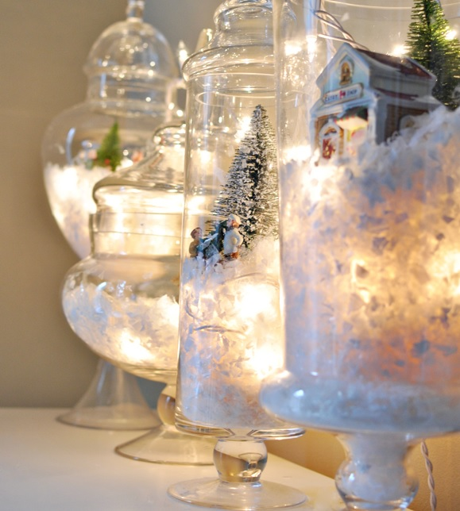

You can easily create these charming DIY winter-themed terrariums in just 10 minutes. Grab a couple of apothecary jars and fill them with imitation snow, LED lights, classic figurines, and bottlebrush trees.

Get the tutorial at [Pink Pistachio](http://www.pinkpistachio.com/let-it-snow/)

### **2\. DIY Copper Lighted Wreaths**

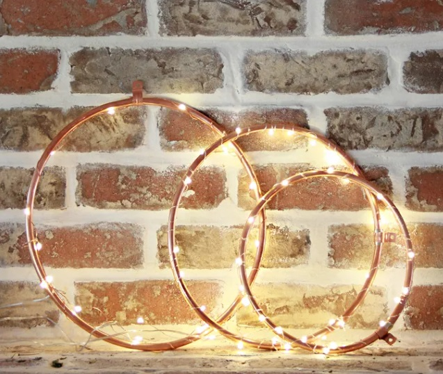

This stylish ornament resembles a minimalist Christmas wreath. Shape copper coils into spheres and then envelop them with coordinating copper string firefly lights. Experiment with different sizes to achieve a charmingly uneven arrangement that radiates a warm glow.

Get the tutorial at [A Bubbly Life](http://www.abubblylife.com/2015/11/diy-copper-lighted-wreaths.html)

### **3\. Faux Metal Star Lantern**

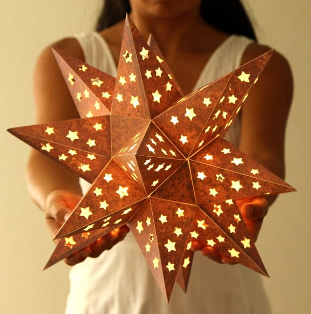

This lantern is ingeniously crafted from cut cardstock—a truly creative endeavor! Blogger Ananda generously provides stencil templates and a rust pattern for free, allowing you to fashion your very own celestial faux metal lamp, illuminated by twinkling Christmas lights.

Get the tutorial at [A Piece of Rainbow](http://www.apieceofrainbow.com/make-star-lantern/)

### **4\. Twine Spheres**

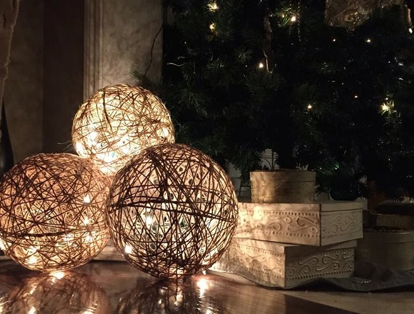

There’s no requirement to purchase those twine balls found in craft shops—crafting your own is simple, using balloons, twine, and Mod Podge. Once completed, insert a strand of lights, and you’ll have a magnificent holiday ornament ready to grace your office space.

Get the tutorial at [Mucho Crafts](http://www.muchocrafts.com/2014/12/twine-spheres-diy.html#more)

### **5\. Hallway Twinkle Lights**

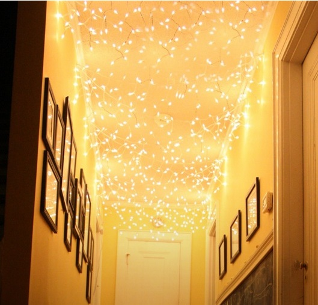

This simple yet captivating decor idea has the power to completely transform the atmosphere of your office hallway. The soft and twinkling illumination provided by the lights creates a warm and inviting ambiance that is sure to enchant anyone who passes through. 

Get the tutorial at [Nest of Posies](http://www.nestofposies-blog.com/2012/12/all-things-merry-bright-add-twinkle-lights-to-your-hallway/)

### **6\. Stars Garland Christmas Mantel**

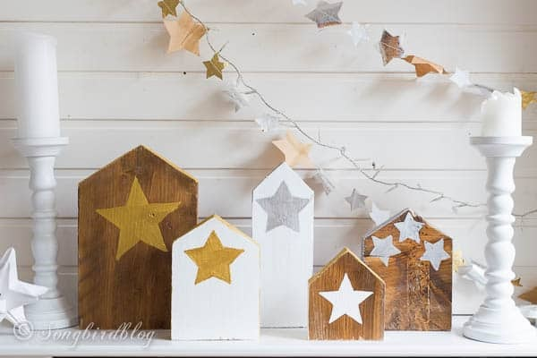

These stars can be thoughtfully sewn onto fairy lights, creating a captivating visual spectacle that evokes the magic of the season. As the fairy lights twinkle within your reclaimed wood village, the stars will cast a warm and inviting glow, turning your creation into a mesmerizing centerpiece.

Get the tutorial at [Song Bird Blog](http://www.songbirdblog.com/garlands-stars-houses-christmas-mantel/)

### **7\. Fairy Light Jars**

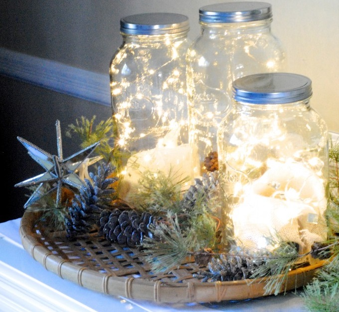

Transforming a beloved rural classic into a holiday delight, this DIY endeavor takes center stage: Just pack a Mason jar with an array of string lights, and then gather them in clusters on a mantel or entryway table.

Get the tutorial at [Making Lemonade](http://makinglemonadeblog.com/holiday-party-tips-ideas-decor/)

### **8\. DIY Flameless Fire Pit**

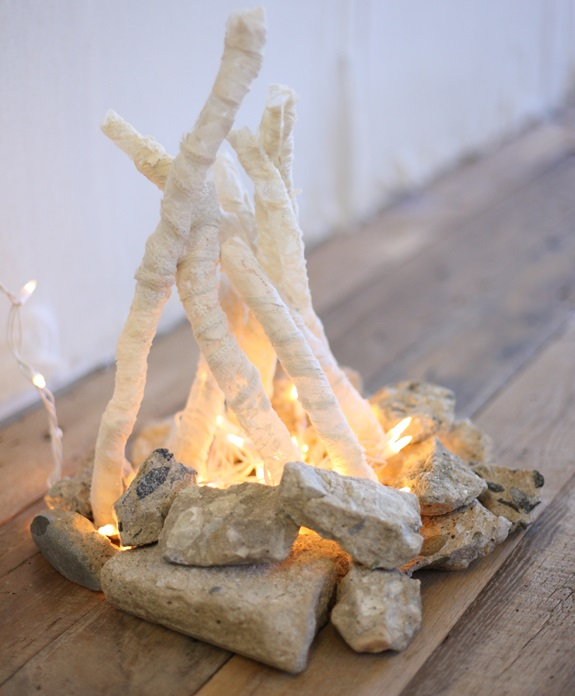

When the charm of a fireplace is absent from your living space, fear not—there’s a delightful solution to infuse an extra touch of “warmth” into your working area. This creative DIY project brings forth an adorable faux fire pit that not only adds visual appeal but also creates a comforting ambiance reminiscent of a crackling fire.

Get the tutorial at [Free People](http://blog.freepeople.com/2012/11/diy-flameless-fire-pit/)

## **6 Office Christmas Tree Decorations** 

### **9\. Rope Ladder Tree**

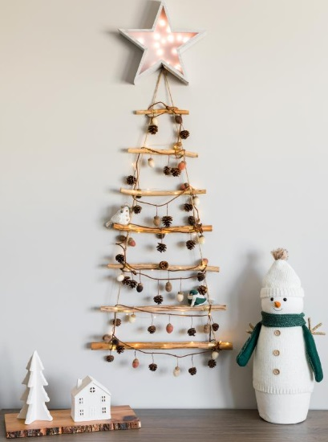

Opt for either a grand or more compact approach with this ingenious festive tree. Its inherent simplicity and joyful illumination make it compatible with virtually any type of holiday decoration style.

Get the tutorial at [HGTV](https://www.hgtv.com/design/make-and-celebrate/handmade/rope-ladder-tree)

### **10\. Tomato Cage Christmas Trees**

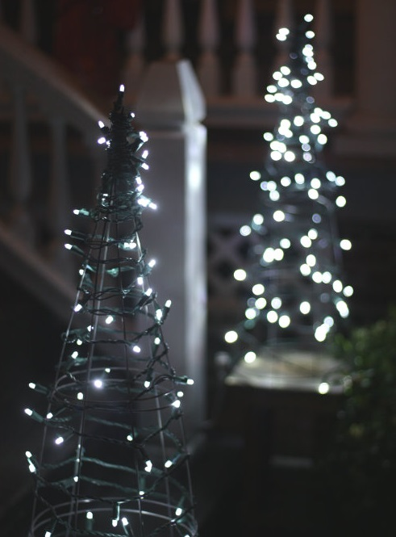

Whether placed indoors or outdoors, this DIY project offers a versatile and eye-catching addition to your office decorations. Embrace the joy of repurposing as you reimagine your tomato cages as radiant holiday accents that effortlessly spread warmth and enchantment throughout your surroundings.

Get the tutorial at [17 Apart](http://www.17apart.com/2012/12/diy-tomato-cage-christmas-tree-lights.html)

### **11\. DIY Alternative Christmas Tree**

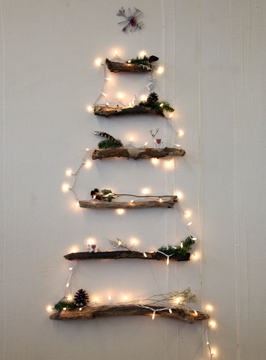

For those constrained by space and unable to accommodate a sizable Christmas tree, consider this equally stunning alternative. Create a vertical arrangement by stacking several twigs in a descending sequence, and then embellish the edges with twinkling Christmas lights. Enhance its allure by adorning it with festive foliage, such as sprigs of pine needles and frost-kissed pinecones.

Get the tutorial at [Free People](http://blog.freepeople.com/2012/12/diy-alternative-christmas-tree/)

### **12\. Poplar and Macrame Christmas Tree**

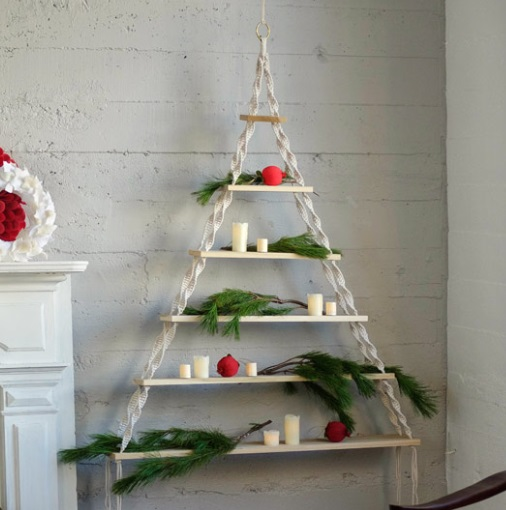

When space is at a premium and a traditional tree isn’t feasible, a clever alternative is to construct a wall-mounted version. This modern yet rustic option, crafted from poplar and macrame, offers a unique blend of styles. Once in place, you’re free to adorn it with decorations to your heart’s content, tailoring it to your desired aesthetic.

Get the tutorial at [Lia Griffith](https://go.redirectingat.com/?id=74968X1616970&url=https%3A%2F%2Fliagriffith.com%2Four-poplar-macrame-christmas-tree%2F&sref=https%3A%2F%2Fwww.thepioneerwoman.com%2Fhome-lifestyle%2Fcrafts-diy%2Fg33549660%2Fchristmas-decoration-ideas%2F&xs=1&xcust=%5Butm_source%7C%5Butm_campaign%7C%5Butm_medium%7C%5Bgclid%7C%5Bmsclkid%7C%5Bfbclid%7C%5Brefdomain%7Ccoccoc.com%5Bcontent_id%7Cd4734629-fc1e-4585-9d64-b2db35344c99%5Bcontent_product_id%7Cfd703eca-b59b-4476-87cc-a8a0e7ce61c9%5Bproduct_retailer_id%7C58b3e862-9ca5-40c4-81e3-c9e8e81cf405%5Blt%7C%5Boptxid%7C%5Boptvid%7C)

### **13\. Scrabble Tile Christmas Tree**

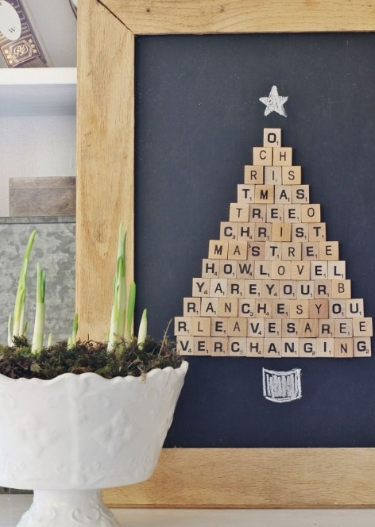

Do you engage in numerous rounds of board games with your coworkers during the festive season? Capture that office camaraderie by creating a unique Christmas tree crafted using Scrabble tiles.

Get the tutorial at [Thistlewood Farms](https://thistlewoodfarms.com/scrabble-tile-christmas-tree/)

### **14\. Cactus Christmas Tree**

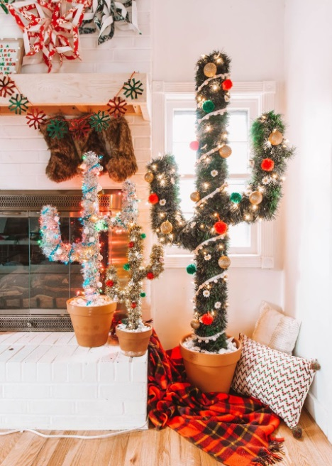

Even in the midst of winter, there’s no reason you can’t figuratively click your boots and imagine yourself in a warm and arid destination. Infuse your holiday decor with a touch of the desert by incorporating these glittering cacti.

Get the tutorial at [Hey Wanderer](https://www.heywandererblog.com/2018/12/mini-cactus-christmas-tree-diy.html)

## **5 Christmas Office Wall Décor Banners**

### **15\. [Custom Christmas Banner](https://www.etsy.com/listing/1260583170/custom-christmas-banner-personalized)**

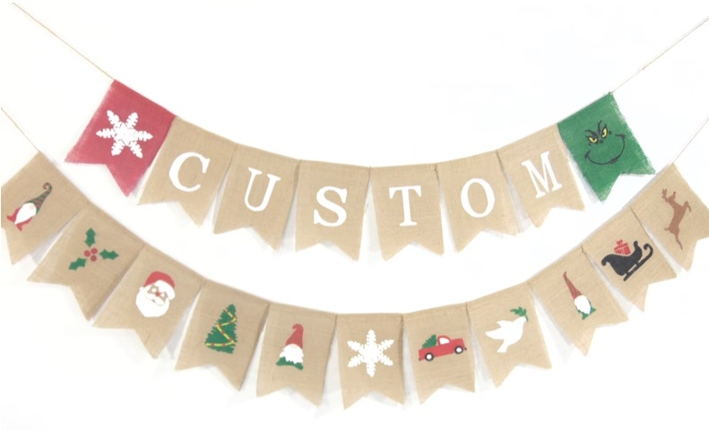

Impeccably crafted from high-quality materials, these banners ensure durability throughout the festive season and beyond. Hang them in the reception area, adorn boardroom walls, or use them to create a captivating focal point during office parties and gatherings.

### **16\. [Vintage Christmas Banner](https://www.etsy.com/listing/745799223/merry-christmas-banner-vintage-style)**

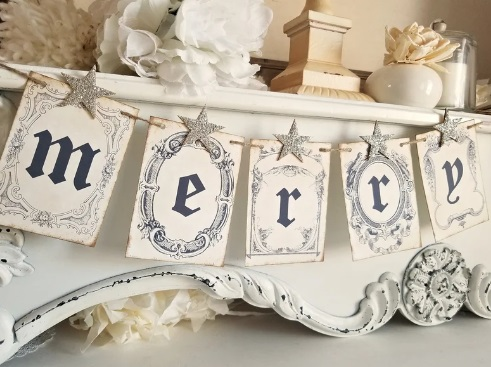

Crafted from sturdy card stock paper, this banner exudes a vintage aesthetic. The edges have been delicately inked to evoke a weathered, nostalgic appearance. Each letter piece is crowned with a wooden star, adorned with shimmering silver vintage glass glitter, to add a touch of enchantment to the design.

### **17\. [Burlap Banners Garlands with Ribbon Bows](https://www.walmart.com/ip/MERRY-CHRISTMAS-Burlap-Banners-Garlands-with-Ribbon-Bows-for-Xmas-Party-Decoration-Photo-Prop/1205284876?from=/search)** 

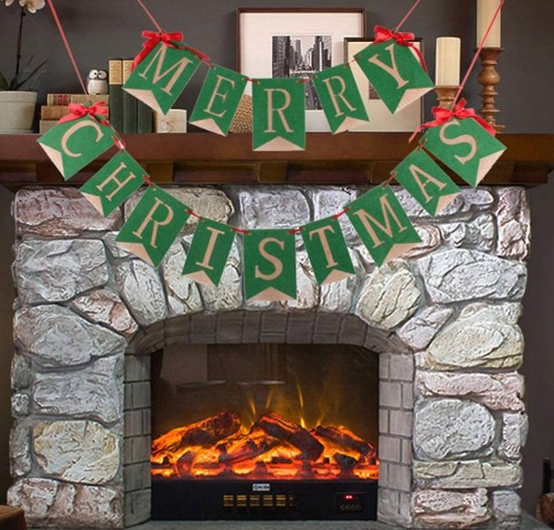

These versatile Burlap Banners Garlands with Ribbon Bows can be draped along walls, hung across mantels, or strung along tables – the options are as diverse as your creativity. They serve as eye-catching décor for office spaces, birthdays and other memorable events, infusing a dash of vintage charisma into every corner.

### **18\. [Clothespin Garland Banner](https://www.walmart.com/ip/Big-Dot-of-Happiness-Holiday-Plaid-Trees-Buffalo-Plaid-Christmas-Party-DIY-Decorations-Clothespin-Garland-Banner-44-Pieces/698236474?from=/search)**

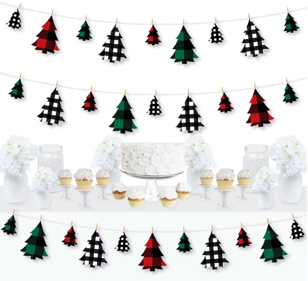

The captivating Clothespin Garland Banner is a delightful way to infuse your spaces with a personalized and dynamic touch. This unique banner reimagines the traditional concept of décor, adding a playful and interactive element to your working space.

### **19\. [Banner-Sock Shaped Christmas Decoration](https://www.amazon.com/Christmas-Banner-Sock-Decoration-Decorations-Fireplace/dp/B08D6J5ZPS)**

The socks are strung together on a sturdy ribbon, creating a captivating banner that can be hung across walls, mantels, or any space that craves a dose of holiday magic. Perfect for office decor or simply as a unique focal point, this banner adds a touch of lighthearted elegance to your space. 

## **8 Office Christmas Wreath Decorations**

### **20\. Under Wraps Wreath**

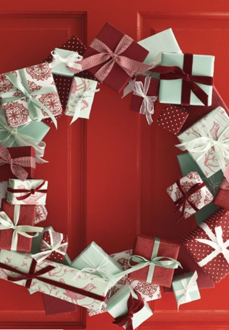

[Office gifts](https://avada.io/loveable/office-gifts/) deserve more than just a spot under the tree! Display them prominently in your living space with this delightful wreath adorned with petite gift boxes, each thoughtfully wrapped and tied with elegant ribbons.

Get the [Under Wraps Wreath](https://www.womansday.com/home/crafts-projects/how-to/a6251/craft-how-to-under-wraps/) tutorial

### **21\. Christmas Balloon Wreath**

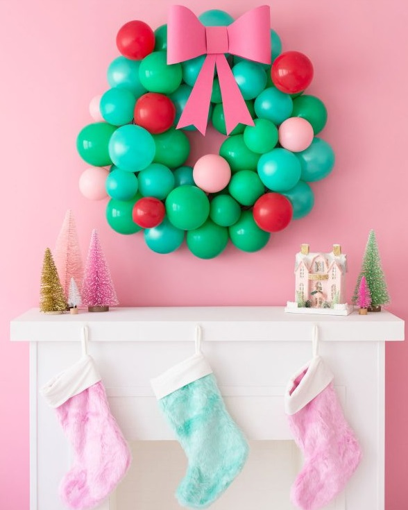

By adding colorful red and green balloons to a wire wreath, you can enhance the festive ambiance over your mantel. The best thing is that creating this item is relatively inexpensive, yet the aesthetic impression it creates is significant!

Get the tutorial at [Studio DIY](https://studiodiy.com/diy-christmas-balloon-wreath/)

### **22\. Vintage Toy Cars Wreath**

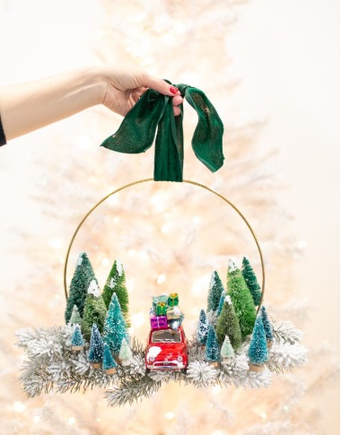

This versatile foundation lends itself perfectly to hosting a charming ensemble. Start by arranging miniature sisal trees, which evoke a sense of enchantment and winter wonderland. These tiny arboreal wonders bring a dash of the natural world indoors, evoking the coziness of a rustic cabin.

Get the tutorial at [Lovely Indeed](https://lovelyindeed.com/diy-christmas-wreath-with-vintage-toy-cars/)

### **23\. Light-Up Snow Man Wreath**

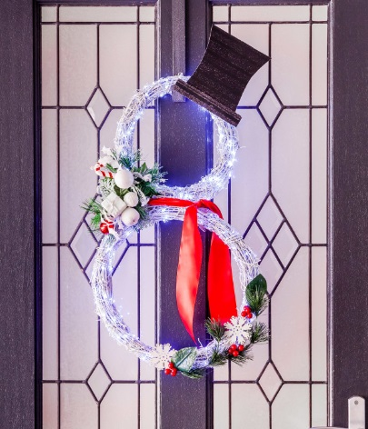

This snowman vine wreath serves as a testament to the beauty of dual-purpose decor. It not only adds a touch of elegance and artistry to your working space during the day but also holds the power to captivate and enchant after the sun sets.

Get the tutorial at [The Whimsical Wife](https://www.thewhimsicalwife.com/home/2018/11/18/diy-light-up-snow-man-wreath-video)

### **24\. [Christmas Office Door Wreath](https://www.etsy.com/listing/1291453340/christmas-front-door-decor-merry)**

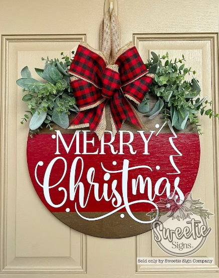

With a gorgeous Christmas office door wreath, you may turn your business into a joyful oasis. Improve the atmosphere and bring festive pleasure to both visitors and coworkers. This ornamental addition warms and brightens the atmosphere in your workplace, creating the ideal mood for the holiday season.

### **25\. Upcycled Plaid Door Hanger**

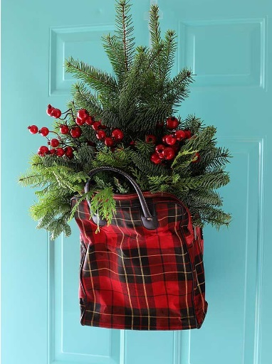

By incorporating fresh greens and faux crab apples, you elevate the door hanger to a whole new level. The lushness of the greens brings nature indoors, creating a harmonious connection between your office and the winter landscape. 

Get the tutorial at [House of Hawthornes](https://www.houseofhawthornes.com/upcycled-plaid-christmas-door-hanger/)

### **26\. [Christmas Door Hanger Laser Cut File](https://www.etsy.com/listing/1320985484/christmas-door-hanger-laser-cut-file)**

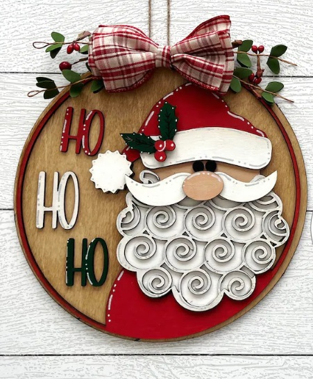

Crafted with precision, this file allows you to create intricate and beautiful door hangers that capture the spirit of the season. Add a personal touch to your decor and showcase your creativity with stunning designs that welcome the holidays in style.

### **27\. [Christmas Front Door Decor for Office](https://www.etsy.com/listing/1270289105/christmas-front-door-decor-christmas)**

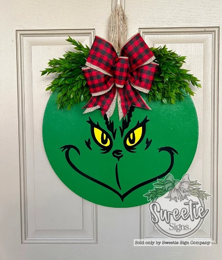

Decorating the office front door not only adds aesthetic value but also cultivates a sense of togetherness among colleagues. Festive office decorations have a positive impact on employee morale and productivity. They create a joyful ambiance that can alleviate stress and encourage a collaborative atmosphere.

## **13 Christmas Ornaments for Office Decoration**

### **28\. [Mini Artificial Christmas Tree with Bows](https://www.walmart.com/ip/Mini-Artificial-Christmas-Tree-Bows-Table-Decorative/589661937)**

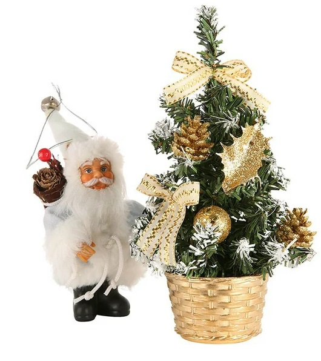

The Mini Artificial Christmas Tree with Bows is a compact and delightful centerpiece that captures the spirit of the holiday season in a charming display. This miniature masterpiece brings the joy and festivity of a traditional Christmas tree into any space, no matter how limited.

### **29\. [Mini Christmas Village Glowing House Ornament](https://www.walmart.com/ip/Clearance-EQWLJWE-Mini-Christmas-Village-Glowing-House/1256851686?athbdg=L1400)**

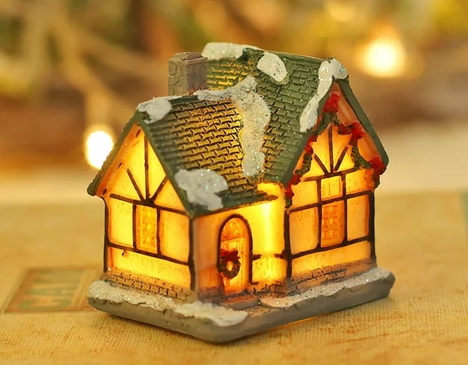

What sets this ornament apart is the gentle, warm glow that emanates from within each house. With soft LED lights that cast a welcoming radiance, this ornament adds a serene and magical ambiance to your décor. 

### **30\. [Christmas Duck Driving Car](https://www.walmart.com/ip/Christmas-Duck-Driving-Car-Hanging-Decor-4-Ducks/1207119340)** 

The Christmas Duck Driving Car Ornament isn’t just an ornament – it’s a mini-masterpiece that captures the merriment of the season in a charming and unexpected way. Embrace the holiday spirit with a dash of whimsy, and let this adorable duck behind the wheel steer your festivities towards joy and laughter.

### **31\. [Santa Resin Craft Ornament](https://www.walmart.com/ip/Christmas-Office/1483709122)**

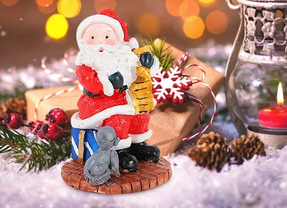

This ornament is the perfect addition to your Christmas tree, wreaths, garlands, or even as a standalone decorative piece. Its timeless design ensures that it complements a wide range of decor styles, from traditional to modern, adding a touch of nostalgia and warmth to any space.

### **32\. [Christmas Table Decorations Desk Sign](https://www.walmart.com/ip/Christmas-Table-Decorations-Desk-Sign-/3318549012)**

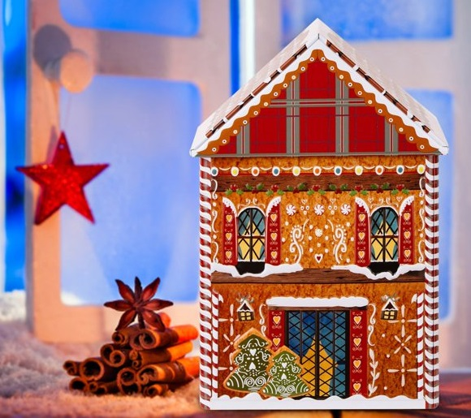

Perfect for adorning office desks, mantels, or even as a centerpiece for holiday gatherings, this sign becomes a delightful focal point that invites everyone to share in the festive ambiance. Its compact size ensures that it fits seamlessly into various spaces, spreading holiday joy wherever it’s placed.

### **33\. [Heiheiup Artificial Mini Christmas Tree With Ornaments](https://www.walmart.com/ip/Heiheiup-Artifical-Mini-Christmas-Tree/2500212997)** 

The Heiheiup Artificial Mini Christmas Tree With Ornaments is a delightful and convenient way to bring the festive spirit into your space. This charming mini tree comes adorned with carefully selected ornaments, creating an instant holiday centerpiece that captures the joy of Christmas.

### **34\. [The Office Themed Christmas Ornaments](https://www.amazon.com/Dwight-Schrute-Christmas-Ornament-Decoration/dp/B08JQ45CDB)**

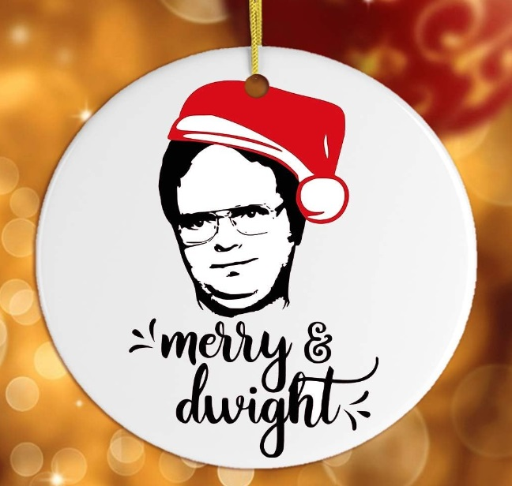

“The Office” Themed Christmas Ornaments aren’t just ornaments – they’re a tribute to the humor and camaraderie that have made the show a beloved classic. Embrace the nostalgia and relive the laughter with these ornaments, and let them be a highlight of your holiday decor.

### **35\. [Wooden Christmas Tree Sign with Star](https://www.amazon.com/Adroiteet-Christmas-Tabletop-Decorations-Ornaments/dp/B0991X5CGG/)**

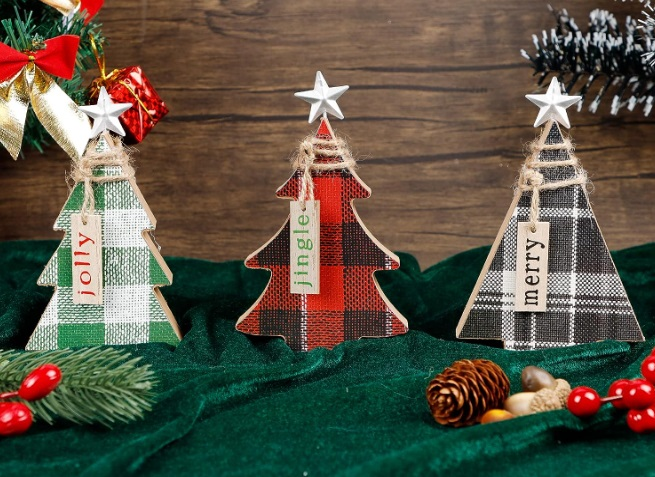

This sign is perfect for displaying on mantels, entryways, or walls, instantly infusing any space with the spirit of the holidays. Its versatile design complements various decor styles, from traditional to modern, making it a versatile piece that can be enjoyed for years to come.

### **36\. [Lighted Gnome Plush](https://www.amazon.com/Christmas-Lighted-Scandinavian-Decorations-Farmhouse/dp/B0B59G6JC1/)**

The Lighted Gnome Plush isn’t just a decoration – it’s a source of comfort and delight during the holiday season. Embrace its charm and let it infuse your space with the magic of Christmas, creating a serene atmosphere that reminds us of the joy and togetherness that define this special time of year.

### **37\. [Tree Giant Candy Props for Xmas Office Decor](https://www.amazon.com/Ferraycle-Christmas-Ornaments-Hanging-Peppermint/dp/B0C6Y2SCPS/)**

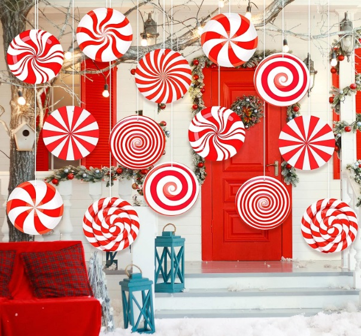

These props are perfect for placing in reception areas, common spaces, or even as a surprise in meeting rooms. They add a delightful element of surprise and create a unique photo backdrop, encouraging employees and visitors alike to engage with the festive atmosphere.

### **38\. [Artificial Small Tabletop Christmas Pine Tree](https://www.amazon.com/Artificial-Tabletop-Christmas-Ornaments-Decoration/dp/B096XHWXGJ)** 

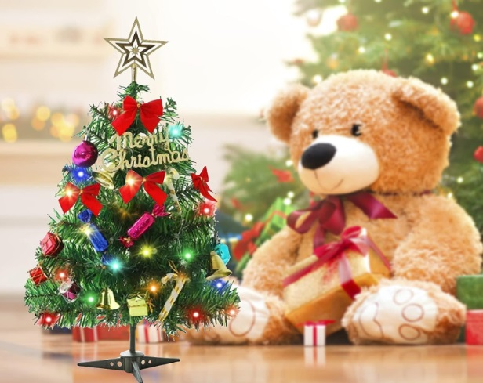

This tree isn’t just a decoration – it’s a symbol of the season’s beauty and tradition. Embrace the joy of Christmas with our Artificial Small Tabletop Christmas Pine Tree, and let its natural charm become a cherished part of your holiday celebrations for years to come.

### **39\. Letters to Santa Mailbox**

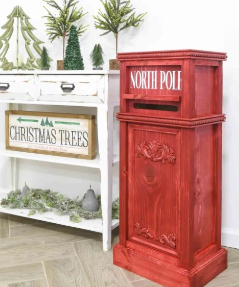

Isn’t this concept wonderfully original? If you have young ones around, they can playfully “send” their letters to Santa using this charming decoration. The piece opens up, allowing you to peruse the heartfelt notes and preserve them as cherished mementos.

Get the tutorial at [Houseful of Handmade](https://housefulofhandmade.com/wooden-letters-to-santa-mailbox/)

### **40\. Snowflake Christmas Card Display**

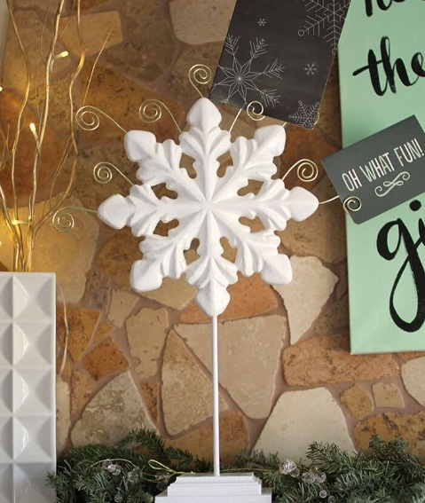

Admire the abundance of Christmas cards you receive? Incorporate them into your festive decor by fashioning a charming snowflake card display that you can easily create yourself! With some white paint and a foam snowflake, you’re all set to embark on this delightful DIY project.

Get the tutorial at [Persia Lou](https://persialou.com/diy-snowflake-christmas-card-holder/)

**_See More:_**

- Best [Office Christmas Gifts](https://avada.io/loveable/office-christmas-gifts/)

- Best [White Christmas Tree Decoration](https://avada.io/loveable/blog/white-christmas-tree-decoration/)

- Charming [Blow Mold Christmas Decorations](https://avada.io/loveable/blog/blow-mold-christmas-decorations/)

# **Bottom Line**

In conclusion, embracing **office Christmas decorations** not only adds flair to the workspace but also cultivates a sense of togetherness and festive spirit among colleagues. From transforming cubicles into winter wonderlands to fostering collaborative decor projects, the possibilities are endless. Let your workplace radiate the joy of the season, creating a memorable and heartwarming atmosphere for everyone.

- [8 Christmas Lights for Office Decoration](https://avada.io/loveable/blog/office-christmas-decorations/#wp-block-heading-2-3)
    - [1\. Snow Globe Terrariums](https://avada.io/loveable/blog/office-christmas-decorations/#wp-block-heading-3-4)
    - [2\. DIY Copper Lighted Wreaths](https://avada.io/loveable/blog/office-christmas-decorations/#wp-block-heading-3-8)
    - [3\. Faux Metal Star Lantern](https://avada.io/loveable/blog/office-christmas-decorations/#wp-block-heading-3-12)
    - [4\. Twine Spheres](https://avada.io/loveable/blog/office-christmas-decorations/#wp-block-heading-3-16)
    - [5\. Hallway Twinkle Lights](https://avada.io/loveable/blog/office-christmas-decorations/#wp-block-heading-3-20)
    - [6\. Stars Garland Christmas Mantel](https://avada.io/loveable/blog/office-christmas-decorations/#wp-block-heading-3-24)
    - [7\. Fairy Light Jars](https://avada.io/loveable/blog/office-christmas-decorations/#wp-block-heading-3-28)
    - [8\. DIY Flameless Fire Pit](https://avada.io/loveable/blog/office-christmas-decorations/#wp-block-heading-3-32)
- [6 Office Christmas Tree Decorations](https://avada.io/loveable/blog/office-christmas-decorations/#wp-block-heading-2-36) 
    - [9\. Rope Ladder Tree](https://avada.io/loveable/blog/office-christmas-decorations/#wp-block-heading-3-37)
    - [10\. Tomato Cage Christmas Trees](https://avada.io/loveable/blog/office-christmas-decorations/#wp-block-heading-3-41)
    - [11\. DIY Alternative Christmas Tree](https://avada.io/loveable/blog/office-christmas-decorations/#wp-block-heading-3-45)
    - [12\. Poplar and Macrame Christmas Tree](https://avada.io/loveable/blog/office-christmas-decorations/#wp-block-heading-3-49)
    - [13\. Scrabble Tile Christmas Tree](https://avada.io/loveable/blog/office-christmas-decorations/#wp-block-heading-3-53)
    - [14\. Cactus Christmas Tree](https://avada.io/loveable/blog/office-christmas-decorations/#wp-block-heading-3-57)
- [5 Christmas Office Wall Décor Banners](https://avada.io/loveable/blog/office-christmas-decorations/#wp-block-heading-2-61)
    - [15\. Custom Christmas Banner](https://avada.io/loveable/blog/office-christmas-decorations/#wp-block-heading-3-62)
    - [16\. Vintage Christmas Banner](https://avada.io/loveable/blog/office-christmas-decorations/#wp-block-heading-3-65)
    - [17\. Burlap Banners Garlands with Ribbon Bows](https://avada.io/loveable/blog/office-christmas-decorations/#wp-block-heading-3-68) 
    - [18\. Clothespin Garland Banner](https://avada.io/loveable/blog/office-christmas-decorations/#wp-block-heading-3-71)
    - [19\. Banner-Sock Shaped Christmas Decoration](https://avada.io/loveable/blog/office-christmas-decorations/#wp-block-heading-3-74)
- [8 Office Christmas Wreath Decorations](https://avada.io/loveable/blog/office-christmas-decorations/#wp-block-heading-2-77)
    - [20\. Under Wraps Wreath](https://avada.io/loveable/blog/office-christmas-decorations/#wp-block-heading-3-78)
    - [21\. Christmas Balloon Wreath](https://avada.io/loveable/blog/office-christmas-decorations/#wp-block-heading-3-82)
    - [22\. Vintage Toy Cars Wreath](https://avada.io/loveable/blog/office-christmas-decorations/#wp-block-heading-3-86)
    - [23\. Light-Up Snow Man Wreath](https://avada.io/loveable/blog/office-christmas-decorations/#wp-block-heading-3-90)
    - [24\. Christmas Office Door Wreath](https://avada.io/loveable/blog/office-christmas-decorations/#wp-block-heading-3-94)
    - [25\. Upcycled Plaid Door Hanger](https://avada.io/loveable/blog/office-christmas-decorations/#wp-block-heading-3-97)
    - [26\. Christmas Door Hanger Laser Cut File](https://avada.io/loveable/blog/office-christmas-decorations/#wp-block-heading-3-101)
    - [27\. Christmas Front Door Decor for Office](https://avada.io/loveable/blog/office-christmas-decorations/#wp-block-heading-3-104)
- [13 Christmas Ornaments for Office Decoration](https://avada.io/loveable/blog/office-christmas-decorations/#wp-block-heading-2-107)
    - [28\. Mini Artificial Christmas Tree with Bows](https://avada.io/loveable/blog/office-christmas-decorations/#wp-block-heading-3-108)
    - [29\. Mini Christmas Village Glowing House Ornament](https://avada.io/loveable/blog/office-christmas-decorations/#wp-block-heading-3-111)
    - [30\. Christmas Duck Driving Car](https://avada.io/loveable/blog/office-christmas-decorations/#wp-block-heading-3-114) 
    - [31\. Santa Resin Craft Ornament](https://avada.io/loveable/blog/office-christmas-decorations/#wp-block-heading-3-117)
    - [32\. Christmas Table Decorations Desk Sign](https://avada.io/loveable/blog/office-christmas-decorations/#wp-block-heading-3-120)
    - [33\. Heiheiup Artificial Mini Christmas Tree With Ornaments](https://avada.io/loveable/blog/office-christmas-decorations/#wp-block-heading-3-123) 
    - [34\. The Office Themed Christmas Ornaments](https://avada.io/loveable/blog/office-christmas-decorations/#wp-block-heading-3-126)
    - [35\. Wooden Christmas Tree Sign with Star](https://avada.io/loveable/blog/office-christmas-decorations/#wp-block-heading-3-129)
    - [36\. Lighted Gnome Plush](https://avada.io/loveable/blog/office-christmas-decorations/#wp-block-heading-3-132)
    - [37\. Tree Giant Candy Props for Xmas Office Decor](https://avada.io/loveable/blog/office-christmas-decorations/#wp-block-heading-3-135)
    - [38\. Artificial Small Tabletop Christmas Pine Tree](https://avada.io/loveable/blog/office-christmas-decorations/#wp-block-heading-3-138) 
    - [39\. Letters to Santa Mailbox](https://avada.io/loveable/blog/office-christmas-decorations/#wp-block-heading-3-141)
    - [40\. Snowflake Christmas Card Display](https://avada.io/loveable/blog/office-christmas-decorations/#wp-block-heading-3-145)

### [Blake Simpson](https://avada.io/loveable/author/blake/)

Hi, I'm Blake from Loveable. I help people find perfect gifts for occasions like anniversaries and weddings. I also write a blog about holidays, sharing insights to make them more meaningful. Let's create unforgettable moments together!

- [Twitter](https://twitter.com/intent/tweet)
- [Facebook](https://www.facebook.com/sharer/sharer.php)
- [instagram](https://avada.io/loveable/blog/office-christmas-decorations/)
- [pinterest](https://www.pinterest.com/loveablellc/)

## Related Posts

[### 120+ Christian Birthday Wishes To Spread Your Love](https://avada.io/loveable/blog/christian-birthday-wishes/) 

[

### 35 Best 70th Birthday Ideas To Celebrate The Special Milestone

](https://avada.io/loveable/blog/70th-birthday-ideas/)

[

### 50 Best 30th Birthday Decorations for a Remarkable Birthday Bash

](https://avada.io/loveable/blog/30th-birthday-decorations/)

[

### 40 Delicious Vegan Christmas Desserts to Delight Your Palate

](https://avada.io/loveable/blog/vegan-christmas-desserts/)

[

### 60 Christmas Team Building Activities to Boost Workplace Spirit

](https://avada.io/loveable/blog/christmas-team-building-activities/)
