This article has been written and researched by our expert Loveable through a precise methodology. [Learn more about our methodology](https://avada.io/loveable/our-methodological.html)

[Loveable](https://avada.io/loveable/) > [Blog](https://avada.io/loveable/blog/) > [Holiday](https://avada.io/loveable/holiday/)

# 40+ Rustic Christmas Decorations For A Cozy Holiday

Written by [Blake Simpson](https://avada.io/loveable/author/blake/) Last Updated on September 15, 2023

- [40+ DIY Rustic Christmas Decorations for 2023 Celebration](https://avada.io/loveable/blog/rustic-christmas-decorations/#wp-block-heading-2-3) 
    - [1\. Rustic Burlap Wreath For Christmas](https://avada.io/loveable/blog/rustic-christmas-decorations/#wp-block-heading-3-4)
    - [2\. DIY Paper Christmas Tree](https://avada.io/loveable/blog/rustic-christmas-decorations/#wp-block-heading-3-8)
    - [3\. Burlap Christmas Wreath](https://avada.io/loveable/blog/rustic-christmas-decorations/#wp-block-heading-3-12)
    - [4\. DIY Lighted Twig Christmas Tree](https://avada.io/loveable/blog/rustic-christmas-decorations/#wp-block-heading-3-16)
    - [5\. Lighted Pinecone Branch Centerpiece](https://avada.io/loveable/blog/rustic-christmas-decorations/#wp-block-heading-3-20)
    - [6\. Rustic Wood Candle Holders](https://avada.io/loveable/blog/rustic-christmas-decorations/#wp-block-heading-3-24)
    - [7\. Reclaimed Wood Christmas Tree And Star](https://avada.io/loveable/blog/rustic-christmas-decorations/#wp-block-heading-3-28)
    - [8\. Holiday Light Globe](https://avada.io/loveable/blog/rustic-christmas-decorations/#wp-block-heading-3-32)
    - [9\. Rustic Ski Lodge Christmas Tree](https://avada.io/loveable/blog/rustic-christmas-decorations/#wp-block-heading-3-36)
    - [10\. Mason Jar Lid Christmas Tree Wreath](https://avada.io/loveable/blog/rustic-christmas-decorations/#wp-block-heading-3-40)
    - [11\. DIY Christmas Gift Wrap](https://avada.io/loveable/blog/rustic-christmas-decorations/#wp-block-heading-3-44)
    - [12\. Stamped Christmas Ornaments](https://avada.io/loveable/blog/rustic-christmas-decorations/#wp-block-heading-3-48)
    - [13\. Jingle Bell Wood Bead Garland](https://avada.io/loveable/blog/rustic-christmas-decorations/#wp-block-heading-3-52)
    - [14\. Chippy White Spindle Tree](https://avada.io/loveable/blog/rustic-christmas-decorations/#wp-block-heading-3-56)
    - [15\. Cardboard Christmas Trees](https://avada.io/loveable/blog/rustic-christmas-decorations/#wp-block-heading-3-60)
    - [16\. Christmas Candle Centerpiece](https://avada.io/loveable/blog/rustic-christmas-decorations/#wp-block-heading-3-64)
    - [17\. Burlap Christmas Card Holder](https://avada.io/loveable/blog/rustic-christmas-decorations/#wp-block-heading-3-68)
    - [18\. Tiny Star Wall Hanging](https://avada.io/loveable/blog/rustic-christmas-decorations/#wp-block-heading-3-72)
    - [19\. Mason Jar Christmas Tree](https://avada.io/loveable/blog/rustic-christmas-decorations/#wp-block-heading-3-76)
    - [20\. Matchbox Advent Calendar](https://avada.io/loveable/blog/rustic-christmas-decorations/#wp-block-heading-3-80)
    - [21\. Marquee Holiday Sign](https://avada.io/loveable/blog/rustic-christmas-decorations/#wp-block-heading-3-84)
    - [22\. Buffalo Plaid Trees](https://avada.io/loveable/blog/rustic-christmas-decorations/#wp-block-heading-3-88)
    - [23\. Rustic Sign](https://avada.io/loveable/blog/rustic-christmas-decorations/#wp-block-heading-3-92)
    - [24\. Button Ornament](https://avada.io/loveable/blog/rustic-christmas-decorations/#wp-block-heading-3-96)
    - [25\. Arrow Ornaments](https://avada.io/loveable/blog/rustic-christmas-decorations/#wp-block-heading-3-100)
    - [26\. Winter Centerpiece](https://avada.io/loveable/blog/rustic-christmas-decorations/#wp-block-heading-3-104)
    - [27\. Twig Stars](https://avada.io/loveable/blog/rustic-christmas-decorations/#wp-block-heading-3-108)
    - [28\. Yarn Tassel Tree](https://avada.io/loveable/blog/rustic-christmas-decorations/#wp-block-heading-3-112)
    - [29\. Wood Burned Garland](https://avada.io/loveable/blog/rustic-christmas-decorations/#wp-block-heading-3-116)
    - [30\. Wood House Candleholders](https://avada.io/loveable/blog/rustic-christmas-decorations/#wp-block-heading-3-120)
    - [31\. Pine Branch Christmas Tree](https://avada.io/loveable/blog/rustic-christmas-decorations/#wp-block-heading-3-124)
    - [32\. Faux Wood Burned Ornaments](https://avada.io/loveable/blog/rustic-christmas-decorations/#wp-block-heading-3-128)
    - [33\. Mason Jar Sconce](https://avada.io/loveable/blog/rustic-christmas-decorations/#wp-block-heading-3-132)
    - [34\. Tea Light Holders](https://avada.io/loveable/blog/rustic-christmas-decorations/#wp-block-heading-3-136)
    - [35\. Christmas Tea Light Holders](https://avada.io/loveable/blog/rustic-christmas-decorations/#wp-block-heading-3-139)
    - [36\. Rustic Tree Decor](https://avada.io/loveable/blog/rustic-christmas-decorations/#wp-block-heading-3-142)
    - [37\. Farmhouse Rustic Faux Wood Presents](https://avada.io/loveable/blog/rustic-christmas-decorations/#wp-block-heading-3-145)
    - [38\. Christmas Rustic Wooden Log Birch Lantern](https://avada.io/loveable/blog/rustic-christmas-decorations/#wp-block-heading-3-148)
    - [39\. Rustic Farmhouse Natural Canvas Rag Ball](https://avada.io/loveable/blog/rustic-christmas-decorations/#wp-block-heading-3-151) 
    - [40\. Rustic Ornament Wood Crafts](https://avada.io/loveable/blog/rustic-christmas-decorations/#wp-block-heading-3-154)
    - [41\. Christmas Farmhouse Rustic Ornaments Set](https://avada.io/loveable/blog/rustic-christmas-decorations/#wp-block-heading-3-157)
- [Bottom Line](https://avada.io/loveable/blog/rustic-christmas-decorations/#wp-block-heading-2-160)

It’s that magical time of year again, when the air is filled with the sweet aroma of cinnamon and pine, and the world is transformed into a winter wonderland. As the holiday season approaches, many of us eagerly anticipate the joyous task of adorning our homes with festive decorations that genuinely capture the spirit of Christmas. And what better way to infuse warmth and charm into your living space than by embracing the timeless beauty of **rustic Christmas decorations**?

Rustic Christmas decorations exude a distinct charm that transports us back to simpler times, reminiscent of crackling fireplaces, handmade ornaments, and the merry melodies of carols sung by loved ones. So, this year, why not abandon the glitz and glamour of modern decor and embrace the enchanting allure of rustic Christmas decorations? Invite the nostalgic spirit of Christmas past into your home and create lasting memories that will warm your heart for years to come.

## **40+ DIY Rustic Christmas Decorations for 2023 Celebration** 

### **1\. Rustic Burlap Wreath For Christmas**

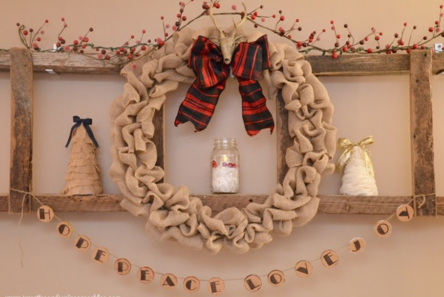

You can craft Christmas wreaths using various materials, but the best choice for that cozy holiday feel is a burlap wreath. This charming burlap wreath adorned with a large red bow can be showcased indoors on your fireplace mantel, walls, or even outdoors on your doors!

Get the tutorial at [Sweet Tea and Saving Grace blog](http://sweetteaandsavinggraceblog.com/2014/12/plaid-burlap-christmas-wreath.html)

### **2\. DIY Paper Christmas Tree**

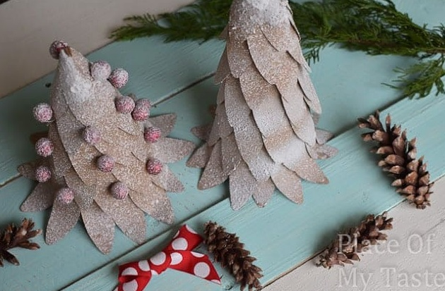

Here’s a lovely and budget-friendly method to bring a joyful holiday spirit into your surroundings: crafting a mini paper Christmas tree. You only require a handful of items you most likely already have at home.

Get the tutorial at [Place Of My Taste](http://placeofmytaste.com/2013/12/diy-paper-christmas-tree-with-printable.html)

### **3\. Burlap Christmas Wreath**

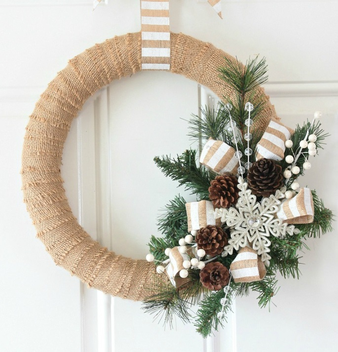

Adorn your front door stylishly using this tidy and attractive burlap wreath. It’s simple and affordable to create, requiring just a handful of supplies you likely already have at home.

Get the tutorial at [Love of Family and Home](https://loveoffamilyandhome.net/2013/12/burlap-christmas-wreath-tutorial.html)

### **4\. DIY Lighted Twig Christmas Tree**

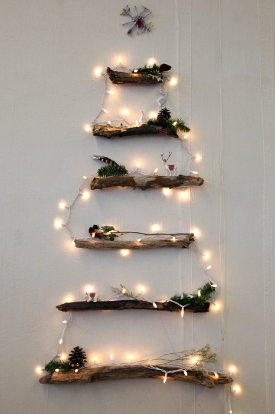

A highly meaningful element of the Christmas season is the tree. However, numerous individuals cannot accommodate real trees in their apartments, or space might be limited. Thankfully, many creative methods exist to craft your own “tree” with the same stunning beauty as the real deal!

Get the tutorial at [Blog.free people](http://blog.freepeople.com/2012/12/diy-alternative-christmas-tree/)

### **5\. Lighted Pinecone Branch Centerpiece**

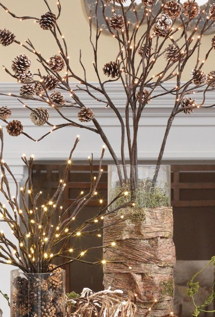

Set up this fantastic centerpiece of illuminated pine cones and branches to adorn your Christmas table beautifully! These branches came out last year from RAZ, but this year, they include a timer setting. You can set the time to come on; it will stay on for six hours, and then repeat every 18 hours. 

Get the tutorial at [Trendy Tree](http://www.trendytree.com/blog/lighted-pinecone-branche-centerpiece/)

### **6\. Rustic Wood Candle Holders**

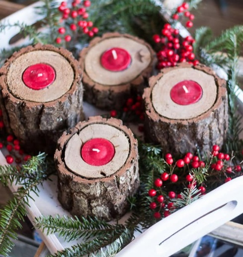

These simple wooden candle holders with a rustic touch showcase the charm of decoration using only a handful of natural elements. Create openings in little logs and place tealight candles within. This will become the ideal enhancement for your Christmas dinner table decoration.

Get the tutorial at [Martys Musings](http://martysmusings.net/2014/12/rustic-wood-candle-holders.html)

### **7\. Reclaimed Wood Christmas Tree And Star**

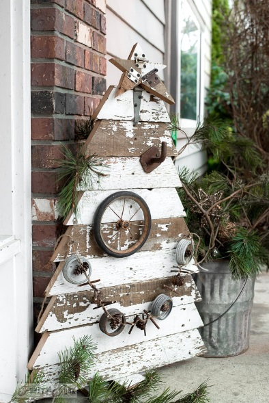

Here’s a special approach to repurposing your old items and crafting a stunning decorative piece for your Christmas celebration. Learn how to build a rustic DIY reclaimed [wood Christmas](https://avada.io/loveable/blog/wooden-christmas-decorations/) tree and star using free scrap wood!

Get the tutorial at [Funky Junk Interiors](http://www.funkyjunkinteriors.net/2015/12/reclaimed-wood-christmas-tree-and-star-front-porch.html)

### **8\. Holiday Light Globe**

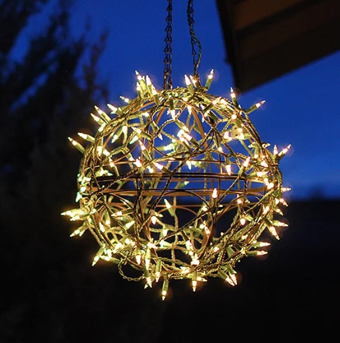

You only require a wire basket, a bit of floral wire, and white mini-lights to fashion this festive light globe. Crafting it is incredibly simple and enjoyable, making it a fantastic addition to your [outdoor holiday decorations](https://avada.io/loveable/blog/diy-outdoor-christmas-decorations/)!

Get the tutorial at [The Garden Glove](http://www.thegardenglove.com/holiday-light-globe-hack/)

### **9\. Rustic Ski Lodge Christmas Tree**

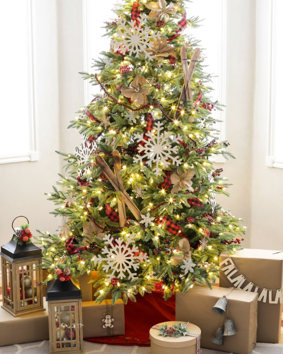

If you’ve ever imagined celebrating Christmas at a cozy ski lodge nestled in the mountains, you can bring that rustic allure into your home using this Christmas tree. Decorations such as large snowflakes, wooden skis, pine cones, and red berries truly unite to create the perfect scene.

Get the tutorial at [The Craft Patch](https://www.thecraftpatchblog.com/rustic-ski-lodge-christmas-tree/)

### **10\. Mason Jar Lid Christmas Tree Wreath**

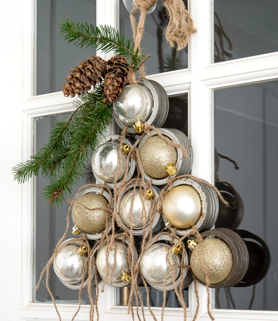

Put your old, rustic mason jars for a beautiful purpose by turning them into a delightful wreath everyone can admire. You’ll connect the lids and embellish them with ornaments, greenery, and twine for hanging.

Get the tutorial at [Mason Jar Crafts](https://masonjarcraftslove.com/mason-jar-lid-christmas-tree-wreath/)

### **11\. DIY Christmas Gift Wrap**

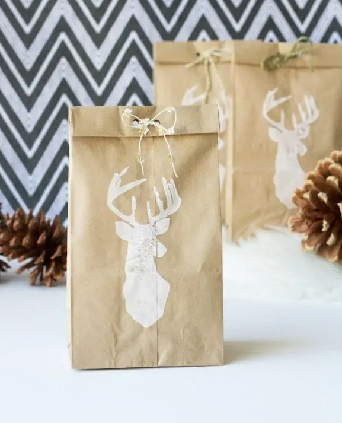

Alright, this suggestion doesn’t entirely focus on decoration, but if you wish for the gifts beneath your Christmas tree to complement the rest of your charming rustic design, we absolutely adore the appearance of these paper bags imprinted with deer motifs. They’re incredibly adorable!

Get the tutorial at [Lovely Indeed](https://lovelyindeed.com/simple-diy-holiday-wrapping/)

### **12\. Stamped Christmas Ornaments**

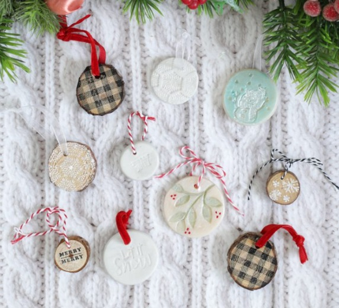

Designs like plaid, stripes, and snowflakes imprinted onto little wooden pieces create ideal ornaments for your rustic Christmas tree. Add coordinating ribbons as a finishing touch, then suspend them to achieve your natural holiday look.

Get the tutorial at [The Craft Patch](https://www.thecraftpatchblog.com/diy-stamped-christmas-ornaments/)

### **13\. Jingle Bell Wood Bead Garland**

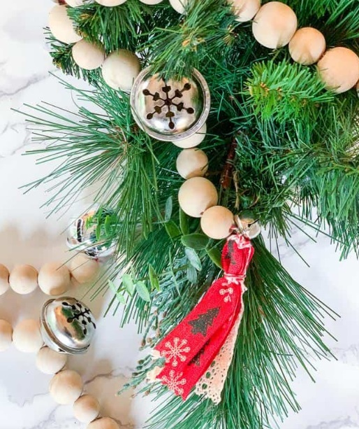

A wooden bead garland adorned with cheerful jingle bells and festive ribbon captures the essence of dashing through snowy landscapes in a horse-drawn open sleigh. It transforms into an impeccable decoration to embellish your tree with this December.

Get the tutorial at [Average but Inspired](https://averageinspired.com/2019/10/how-to-make-a-jingle-bell-wood-bead-garland-for-christmas.html)

### **14\. Chippy White Spindle Tree**

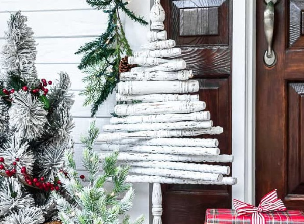

Whether you place it on your front porch or utilize it to infuse a wintery cabin ambiance indoors, this tree crafted from aged white spindles offers a distinctive decor element and an enjoyable winter project. You can even create a compact version for your tabletop.

Get the tutorial at [DIY Beautify](https://www.diybeautify.com/2021/12/DIY-chippy-white-spindle-tree-for-Christmas.html)

### **15\. Cardboard Christmas Trees**

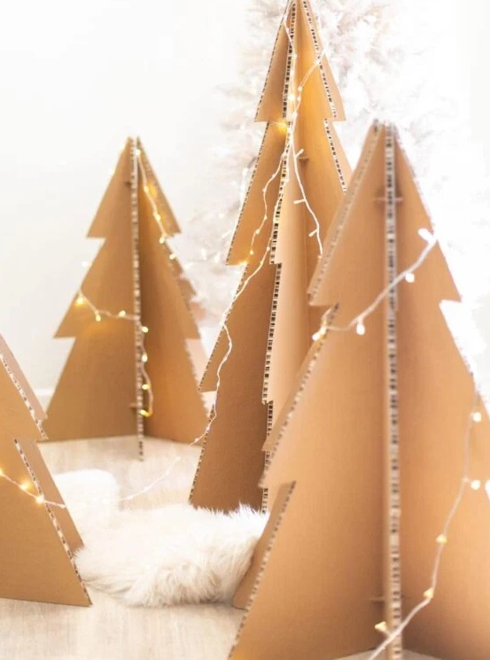

Create your personal Christmas tree farm with a rustic touch by crafting a couple of life-sized replicas using cardboard boxes. These not only radiate a wonderfully festive vibe, but they’re also extremely budget-friendly. Even better, they can be stored flat once the season ends.

Get the tutorial at [Lovely Indeed](https://lovelyindeed.com/giant-cardboard-christmas-trees/)

### **16\. Christmas Candle Centerpiece**

The finest rustic candle holder centerpiece can be fashioned from a wooden liquor box. Infuse it with holiday spirit by incorporating lively greenery and berries like wide and needle-like evergreen twigs, laurel, and holly.

Get the tutorial at [Garden Therapy](https://gardentherapy.ca/christmas-candle-centerpiece/)

### **17\. Burlap Christmas Card Holder**

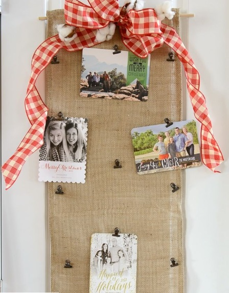

December’s charm includes delightful Christmas cards, so why not showcase them? Burlap is a timeless choice for rustic decor and greatly complements the festive Christmas hues!

Get the tutorial at [Polkadot Chair](https://www.polkadotchair.com/diy-christmas-card-holder/)

### **18\. Tiny Star Wall Hanging**

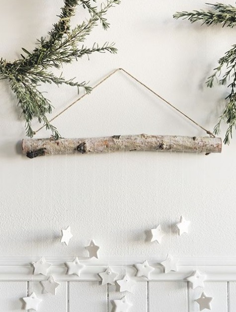

Delicate small white clay stars suspended beneath a weathered branch infuse this wall art creation with an incredibly charming appearance. Envision how splendidly it would grace an entryway or bedroom space.

Get the tutorial at [Delineate Your Dwelling](https://www.delineateyourdwelling.com/diy-tiny-star-wall-hanging/)

### **19\. Mason Jar Christmas Tree**

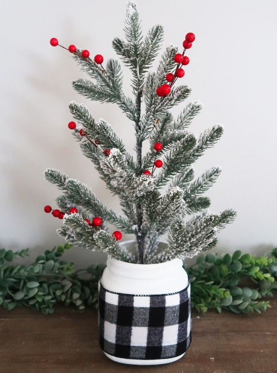

Inside a painted Mason jar, it is great to place a miniature tree covered with berries and snow; add a piece of plaid flannel. It will give the craft an even more wintry appearance.

Get the tutorial at [Weekend Craft](https://weekendcraft.com/christmas/mason-jar-christmas-tree/')

### **20\. Matchbox Advent Calendar**

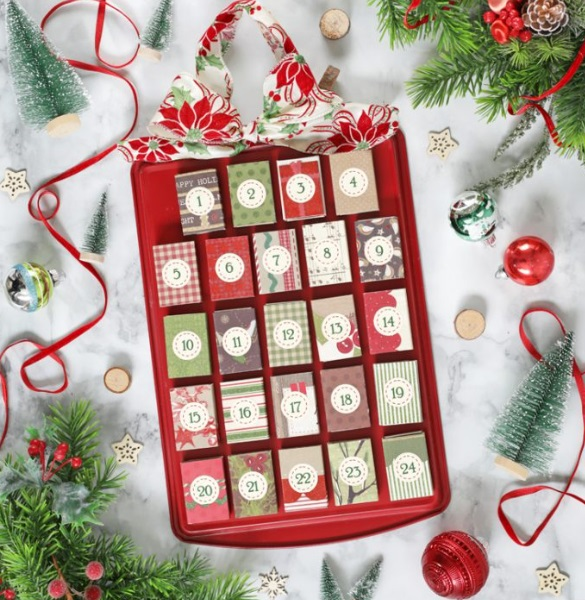

Advent calendars offer a double benefit by being both attractive and participatory. Who could not adore that? Replace the pan with a block of wood or galvanized metal to give it an even more handcrafted appearance.

Get the tutorial at [The Craft Patch](https://www.thecraftpatchblog.com/matchbox-advent-calendar/)

### **21\. Marquee Holiday Sign**

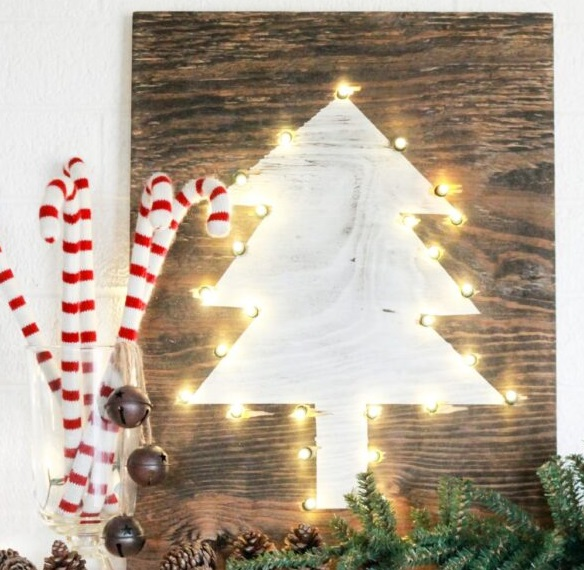

This marquee sign is the ideal decoration for a rustic holiday. Adorable tree painted on wood with shining lights around it! We made a DIY rustic marquee Christmas tree sign with the help of some ScotchBlueTM Painter’s Tape.

Get the tutorial at [Lolly Jane](https://lollyjane.com/diy-rustic-marquee-holiday-tree-sign/)

### **22\. Buffalo Plaid Trees**

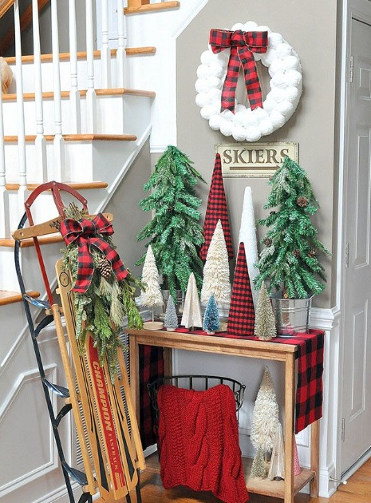

By making these buffalo plaid trees, you can spruce up the rustic Christmas décor in your foyer (or your living room, kitchen, or bedroom!). They are constructed out of foam, wooden dowels, and foam.

Get the tutorial at [Made in a Day](https://madeinaday.com/buffalo-plaid-christmas-forest-entryway-3/)

### **23\. Rustic Sign**

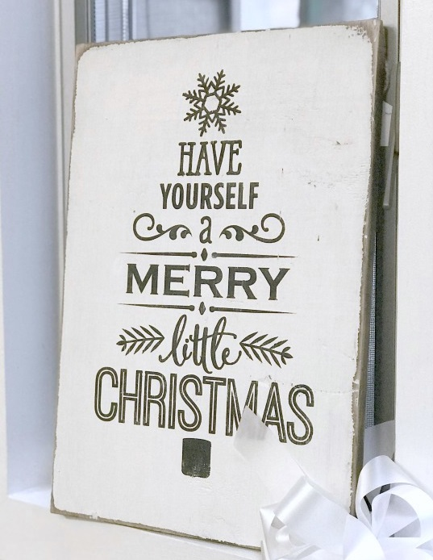

These simple rustic Christmas signs can be made with a vinyl cutting machine, craft paint, and a palm sander. It will appear to have been around for a long time! 

Get the tutorial at [Homeroad](https://www.homeroad.net/2017/12/how-to-make-rustic-christmas-signs.html)

### **24\. Button Ornament**

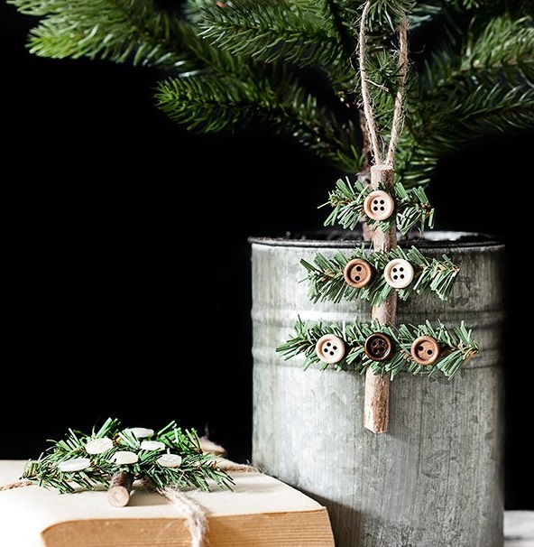

There seems to be a lot of wood with farmhouse and rustic décor.  A wooden branch stick would look wonderful with this tree decoration. Making this button decoration at home is quite simple. Tiny buttons and pine branches are all you need!

Get the tutorial at [Live Laugh Rowe](https://livelaughrowe.com/rustic-holiday-ornament/)

### **25\. Arrow Ornaments**

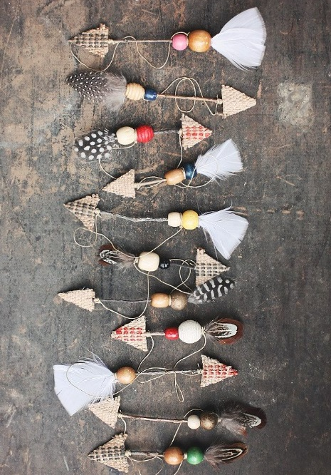

These little arrow decorations will be the talk of your visitors. With twigs, tiny feathers, wooden beads, hemp rope, and jute upholstery webbing attached to them, they’ll look wonderful anyplace.

Get the tutorial at [Alice Wingerden](https://alicewingerden.com/2014/12/diy-rustic-boho-twig-arrow-ornaments/)

### **26\. Winter Centerpiece**

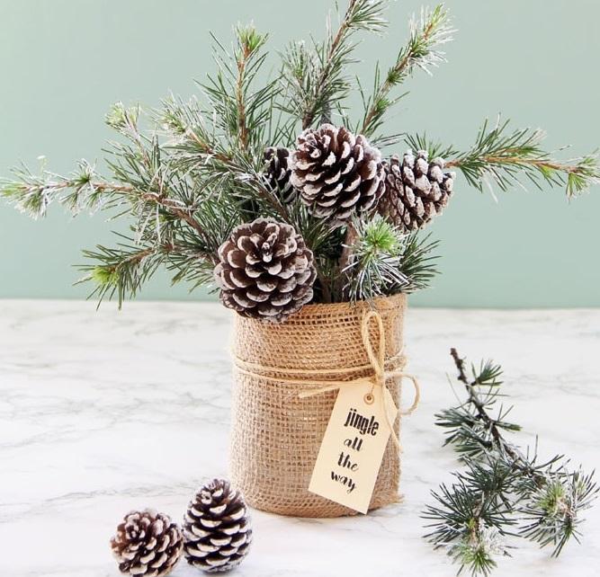

This beautiful DIY holiday table decoration makes me think of some of my favorite tabletop Christmas trees with their limbs wrapped in snow and pine cones. This table decoration costs nearly nothing to construct and takes ten minutes to complete.

Get the tutorial at [A Piece of Rainbow](https://www.apieceofrainbow.com/snow-diy-winter-christmas-table-centerpiece/)

### **27\. Twig Stars**

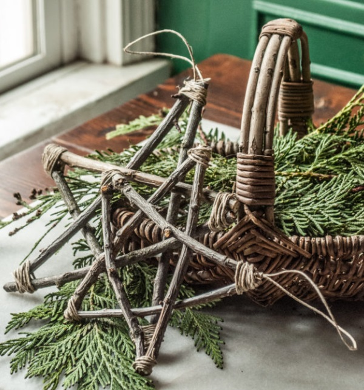

If you haven’t noticed, using twigs to add rustic accents to your holiday decorations is the way to go. They may be used to create various items, like these simple twig stars. It’s so simple and easy to make, but will forever be the rustic ornament that feels like an old-fashioned Christmas!

Get the tutorial at [Cottage Chronicles](http://cottagechroniclesblog.com/the-simple-star-handmade-christmas/)

### **28\. Yarn Tassel Tree**

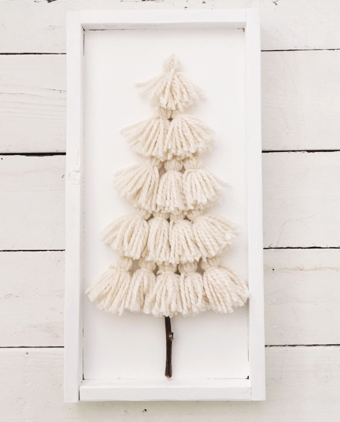

One thing is certain: the tiny corner where this will hang will look absolutely rustic for the holidays, regardless of whether you decide to build this yarn tassel tree from scratch or purchase one already built.

Get the tutorial at [The Dotted Bow](https://thedottedbow.com/2019/12/08/diy-yarn-tassel-tree/)

### **29\. Wood Burned Garland**

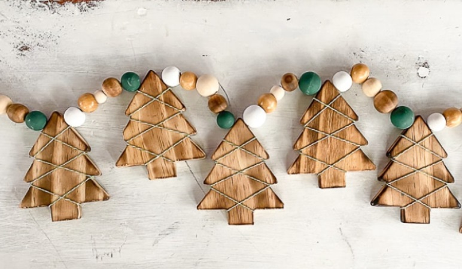

This wood-burned garland with tree-shaped beads and wooden beads in various colors is the perfect place to practice your wood-burning techniques. Crafting with a heat gun is fun. It gave this DIY Wood Burned Christmas Tree Garland a beautiful look.

Get the tutorial at [My Creative Days](https://mycreativedays.porch.com/diy-wood-burned-christmas-tree-garland/)

### **30\. Wood House Candleholders**

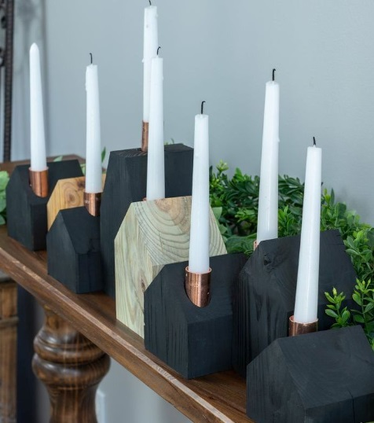

“Home for the holidays” takes on a new meaning with these wooden house-shaped candlesticks. When you arrange many of them together in various hues, they’ll seem much more striking.

Get the tutorial at [The Navage Patch](https://www.thenavagepatch.com/diy-wood-house-candle-holders/)

### **31\. Pine Branch Christmas Tree**

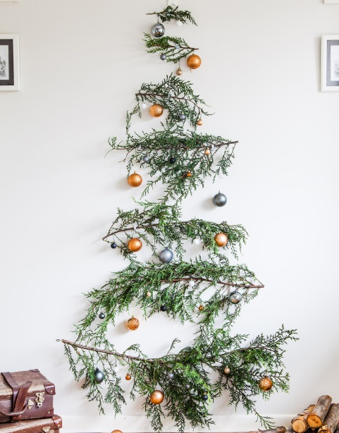

If a traditional Christmas tree isn’t your cup of tea, consider a different Christmas tree that might be attractively displayed on your wall. With its fir branch decorations and muted, natural-inspired hues, this one has an especially rustic appearance.

Get the tutorial at [The Whimsical Wife](https://www.thewhimsicalwife.com/home/2017/12/2/quick-easy-pine-branch-christmas-tree)

### **32\. Faux Wood Burned Ornaments**

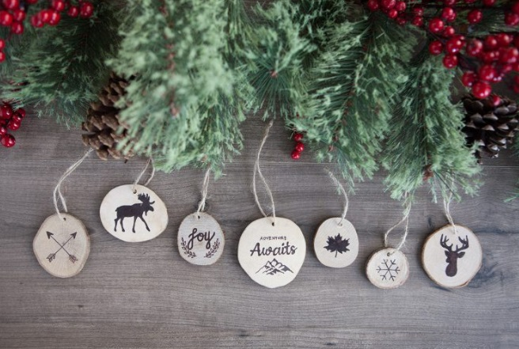

These rustic ornaments are actually faux, despite having decorations that appear to have been burned into the wood. Nobody will be able to tell that you used permanent markers.

Get the tutorial at [Simple As That](https://simpleasthatblog.com/faux-wood-burned-christmas-tree-ornaments/)

### **33\. Mason Jar Sconce**

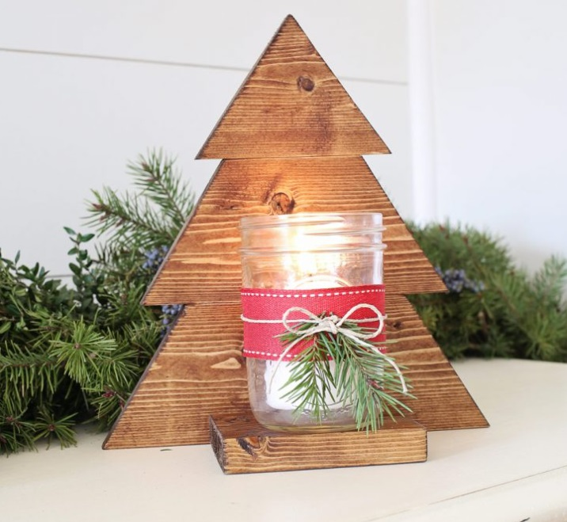

Here’s your chance to expand your project list or learn more about woodworking. The pinnacle of rustic design is this pine tree wall sconce, which includes a base for a lit candle.

Get the tutorial at [Angela Marie Made](https://angelamariemade.com/diy-wood-christmas-tree-mason-jar-sconce/)

### **34\. [Tea Light Holders](https://www.etsy.com/listing/749339921/3-christmas-candle-holders-tea-light)**

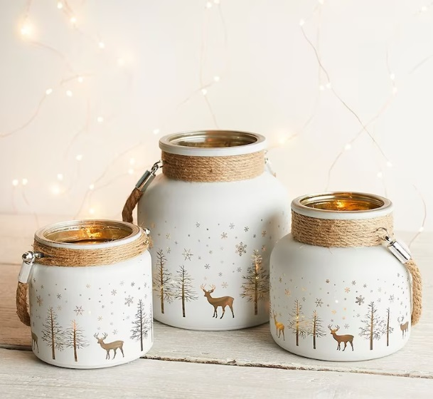

Your Christmas decorations will look great with these candle holders. The tea light holder gives your ideal seasonal setting a rustic feel. Your visitors will like these, leaving them shining late into the night.

### **35\. [Christmas Tea Light Holders](https://www.etsy.com/listing/1099034158/christmas-tea-light-holders-christmas)**

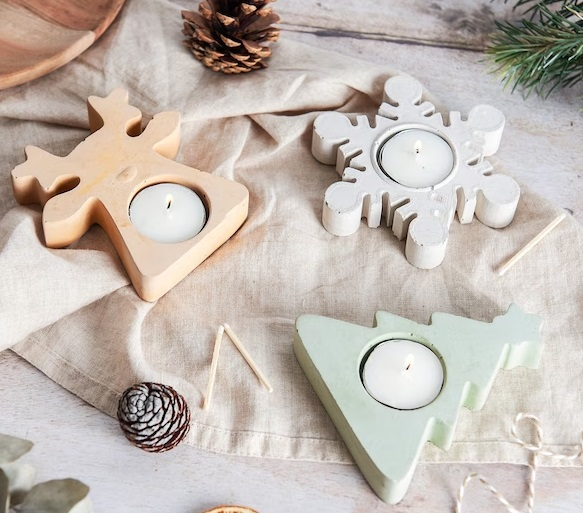

Our concrete holiday tea light holders are a must-have if you are sick of the same old Christmas decor. With these whimsical reindeer, snowflake, and Christmas tree tea light holders, you can spread the holiday cheer throughout your house.

### **36\. [Rustic Tree Decor](https://www.etsy.com/listing/1125134531/rustic-tree-decorrustic-treechristmas)**

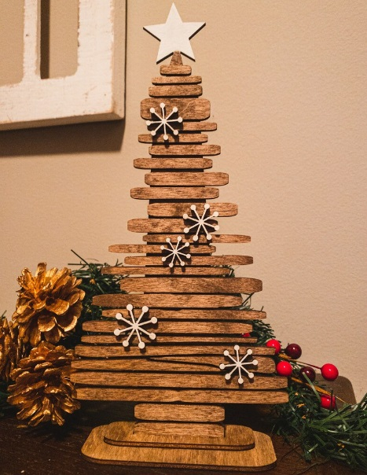

Your Christmas decorations would look fantastic with this adorable rustic tree! With a focus on natural materials and earthy tones, this style embraces the beauty of weathered wood, vintage accents, and organic textures. It would look fantastic on a mantel, hall table, bookcase, or wall-mounted shelves!

### **37\. [Farmhouse Rustic Faux Wood Presents](https://www.etsy.com/listing/1534285369/farmhouse-rustic-faux-wood-presents)**

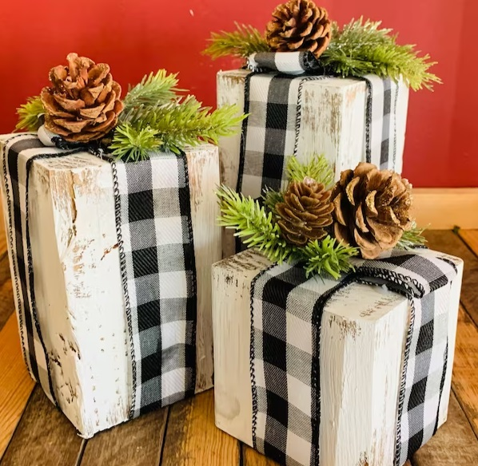

Farmhouse rustic faux wood presents offer a charming and nostalgic touch to any gift-giving occasion. These beautifully crafted wooden presents mimic the warmth and authenticity of a traditional farmhouse, with a rustic finish that adds character. 

### **38\. [Christmas Rustic Wooden Log Birch Lantern](https://www.etsy.com/listing/753357913/christmas-rustic-wooden-log-birch)**

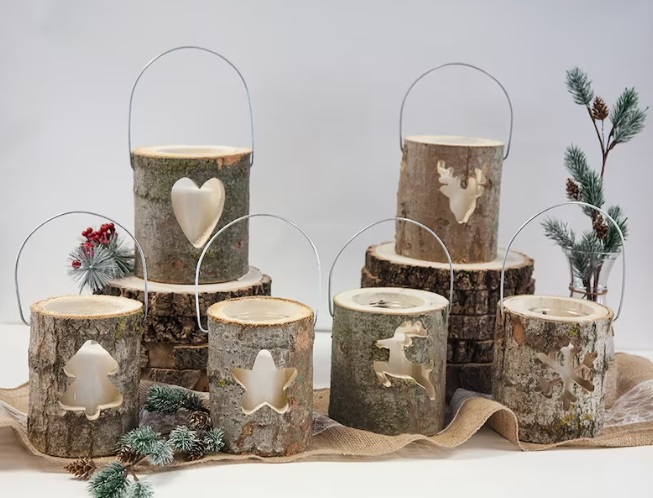

The Christmas Rustic Wooden Log Birch Lantern is a charming holiday decor piece that exudes warmth and nostalgia. This lantern is the perfect addition to add a cozy ambiance and a touch of traditional charm to your festive celebrations.

### **39\. [Rustic Farmhouse Natural Canvas Rag Ball](https://www.etsy.com/listing/1120373450/rustic-farmhouse-natural-canvas-rag-ball)** 

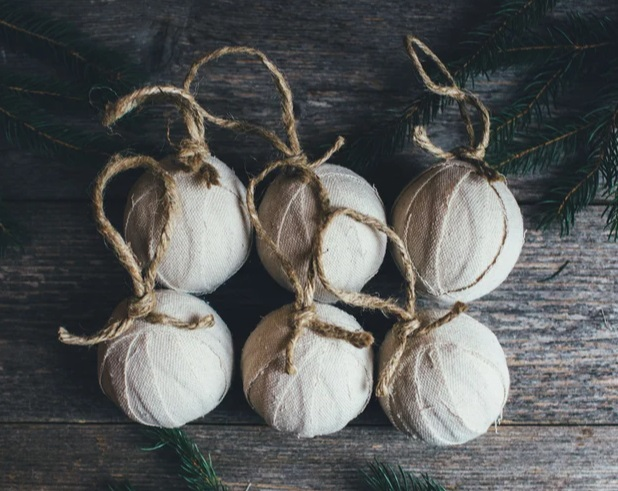

The rustic farmhouse natural canvas rag ball is a charming decorative piece that adds a touch of vintage allure to any home. Handcrafted from natural canvas and designed in a rag ball shape, it exudes a cozy, country aesthetic.

### **40\. [Rustic Ornament Wood Crafts](https://www.amazon.com/Snowflakes-Ornaments-Christmas-Decorations-Ornament/dp/B08HJ6JSPW)**

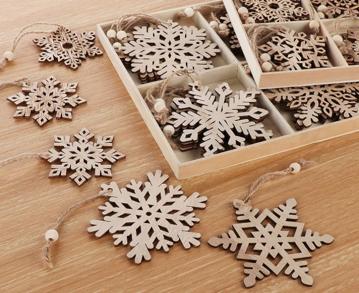

Their rustic charm and warm, earthy tones add an inviting touch to any space. From hand-carved figurines to intricate wall hangings, these wooden crafts effortlessly blend rustic aesthetics with artistic elegance. 

### **41\. [Christmas Farmhouse Rustic Ornaments Set](https://www.amazon.com/Christmas-Farmhouse-Ornaments-Decorations-Reindeer/dp/B098Q8L96Y)**

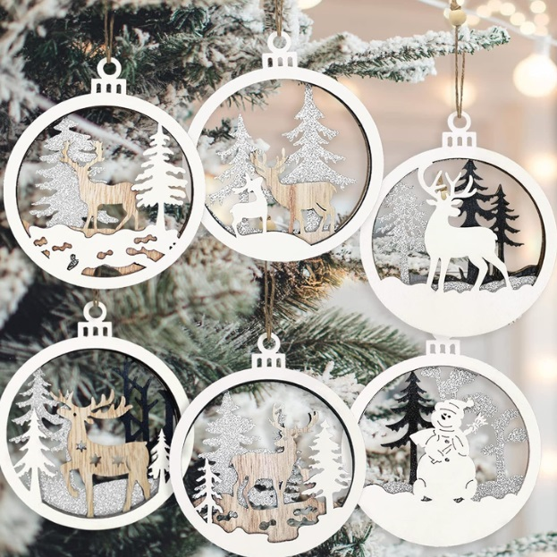

With its charming and rustic design, this set features a variety of ornaments that capture the essence of a cozy [farmhouse Christmas](https://avada.io/loveable/blog/farmhouse-christmas-decor/). Hang these timeless pieces on your tree or use them to decorate your mantel. 

## **Bottom Line**

In conclusion, **rustic Christmas decorations** bring warmth, nostalgia, and charm to our holiday celebrations. They evoke memories of cozy cabins, crackling fireplaces, and snow-covered landscapes. Incorporating these unique decorations into our homes creates a festive ambiance and embraces the season’s simplicity and authenticity. So, this Christmas, let us adorn our surroundings with these enchanting rustic touches and let the magic of old-fashioned charm envelop us all.

- [40+ DIY Rustic Christmas Decorations for 2023 Celebration](https://avada.io/loveable/blog/rustic-christmas-decorations/#wp-block-heading-2-3) 
    - [1\. Rustic Burlap Wreath For Christmas](https://avada.io/loveable/blog/rustic-christmas-decorations/#wp-block-heading-3-4)
    - [2\. DIY Paper Christmas Tree](https://avada.io/loveable/blog/rustic-christmas-decorations/#wp-block-heading-3-8)
    - [3\. Burlap Christmas Wreath](https://avada.io/loveable/blog/rustic-christmas-decorations/#wp-block-heading-3-12)
    - [4\. DIY Lighted Twig Christmas Tree](https://avada.io/loveable/blog/rustic-christmas-decorations/#wp-block-heading-3-16)
    - [5\. Lighted Pinecone Branch Centerpiece](https://avada.io/loveable/blog/rustic-christmas-decorations/#wp-block-heading-3-20)
    - [6\. Rustic Wood Candle Holders](https://avada.io/loveable/blog/rustic-christmas-decorations/#wp-block-heading-3-24)
    - [7\. Reclaimed Wood Christmas Tree And Star](https://avada.io/loveable/blog/rustic-christmas-decorations/#wp-block-heading-3-28)
    - [8\. Holiday Light Globe](https://avada.io/loveable/blog/rustic-christmas-decorations/#wp-block-heading-3-32)
    - [9\. Rustic Ski Lodge Christmas Tree](https://avada.io/loveable/blog/rustic-christmas-decorations/#wp-block-heading-3-36)
    - [10\. Mason Jar Lid Christmas Tree Wreath](https://avada.io/loveable/blog/rustic-christmas-decorations/#wp-block-heading-3-40)
    - [11\. DIY Christmas Gift Wrap](https://avada.io/loveable/blog/rustic-christmas-decorations/#wp-block-heading-3-44)
    - [12\. Stamped Christmas Ornaments](https://avada.io/loveable/blog/rustic-christmas-decorations/#wp-block-heading-3-48)
    - [13\. Jingle Bell Wood Bead Garland](https://avada.io/loveable/blog/rustic-christmas-decorations/#wp-block-heading-3-52)
    - [14\. Chippy White Spindle Tree](https://avada.io/loveable/blog/rustic-christmas-decorations/#wp-block-heading-3-56)
    - [15\. Cardboard Christmas Trees](https://avada.io/loveable/blog/rustic-christmas-decorations/#wp-block-heading-3-60)
    - [16\. Christmas Candle Centerpiece](https://avada.io/loveable/blog/rustic-christmas-decorations/#wp-block-heading-3-64)
    - [17\. Burlap Christmas Card Holder](https://avada.io/loveable/blog/rustic-christmas-decorations/#wp-block-heading-3-68)
    - [18\. Tiny Star Wall Hanging](https://avada.io/loveable/blog/rustic-christmas-decorations/#wp-block-heading-3-72)
    - [19\. Mason Jar Christmas Tree](https://avada.io/loveable/blog/rustic-christmas-decorations/#wp-block-heading-3-76)
    - [20\. Matchbox Advent Calendar](https://avada.io/loveable/blog/rustic-christmas-decorations/#wp-block-heading-3-80)
    - [21\. Marquee Holiday Sign](https://avada.io/loveable/blog/rustic-christmas-decorations/#wp-block-heading-3-84)
    - [22\. Buffalo Plaid Trees](https://avada.io/loveable/blog/rustic-christmas-decorations/#wp-block-heading-3-88)
    - [23\. Rustic Sign](https://avada.io/loveable/blog/rustic-christmas-decorations/#wp-block-heading-3-92)
    - [24\. Button Ornament](https://avada.io/loveable/blog/rustic-christmas-decorations/#wp-block-heading-3-96)
    - [25\. Arrow Ornaments](https://avada.io/loveable/blog/rustic-christmas-decorations/#wp-block-heading-3-100)
    - [26\. Winter Centerpiece](https://avada.io/loveable/blog/rustic-christmas-decorations/#wp-block-heading-3-104)
    - [27\. Twig Stars](https://avada.io/loveable/blog/rustic-christmas-decorations/#wp-block-heading-3-108)
    - [28\. Yarn Tassel Tree](https://avada.io/loveable/blog/rustic-christmas-decorations/#wp-block-heading-3-112)
    - [29\. Wood Burned Garland](https://avada.io/loveable/blog/rustic-christmas-decorations/#wp-block-heading-3-116)
    - [30\. Wood House Candleholders](https://avada.io/loveable/blog/rustic-christmas-decorations/#wp-block-heading-3-120)
    - [31\. Pine Branch Christmas Tree](https://avada.io/loveable/blog/rustic-christmas-decorations/#wp-block-heading-3-124)
    - [32\. Faux Wood Burned Ornaments](https://avada.io/loveable/blog/rustic-christmas-decorations/#wp-block-heading-3-128)
    - [33\. Mason Jar Sconce](https://avada.io/loveable/blog/rustic-christmas-decorations/#wp-block-heading-3-132)
    - [34\. Tea Light Holders](https://avada.io/loveable/blog/rustic-christmas-decorations/#wp-block-heading-3-136)
    - [35\. Christmas Tea Light Holders](https://avada.io/loveable/blog/rustic-christmas-decorations/#wp-block-heading-3-139)
    - [36\. Rustic Tree Decor](https://avada.io/loveable/blog/rustic-christmas-decorations/#wp-block-heading-3-142)
    - [37\. Farmhouse Rustic Faux Wood Presents](https://avada.io/loveable/blog/rustic-christmas-decorations/#wp-block-heading-3-145)
    - [38\. Christmas Rustic Wooden Log Birch Lantern](https://avada.io/loveable/blog/rustic-christmas-decorations/#wp-block-heading-3-148)
    - [39\. Rustic Farmhouse Natural Canvas Rag Ball](https://avada.io/loveable/blog/rustic-christmas-decorations/#wp-block-heading-3-151) 
    - [40\. Rustic Ornament Wood Crafts](https://avada.io/loveable/blog/rustic-christmas-decorations/#wp-block-heading-3-154)
    - [41\. Christmas Farmhouse Rustic Ornaments Set](https://avada.io/loveable/blog/rustic-christmas-decorations/#wp-block-heading-3-157)
- [Bottom Line](https://avada.io/loveable/blog/rustic-christmas-decorations/#wp-block-heading-2-160)

### [Blake Simpson](https://avada.io/loveable/author/blake/)

Hi, I'm Blake from Loveable. I help people find perfect gifts for occasions like anniversaries and weddings. I also write a blog about holidays, sharing insights to make them more meaningful. Let's create unforgettable moments together!

- [Twitter](https://twitter.com/intent/tweet)
- [Facebook](https://www.facebook.com/sharer/sharer.php)
- [instagram](https://avada.io/loveable/blog/rustic-christmas-decorations/)
- [pinterest](https://www.pinterest.com/loveablellc/)

## Related Posts

[### 120+ Christian Birthday Wishes To Spread Your Love](https://avada.io/loveable/blog/christian-birthday-wishes/) 

[

### 35 Best 70th Birthday Ideas To Celebrate The Special Milestone

](https://avada.io/loveable/blog/70th-birthday-ideas/)

[

### 50 Best 30th Birthday Decorations for a Remarkable Birthday Bash

](https://avada.io/loveable/blog/30th-birthday-decorations/)

[

### 40 Delicious Vegan Christmas Desserts to Delight Your Palate

](https://avada.io/loveable/blog/vegan-christmas-desserts/)

[

### 60 Christmas Team Building Activities to Boost Workplace Spirit

](https://avada.io/loveable/blog/christmas-team-building-activities/)
