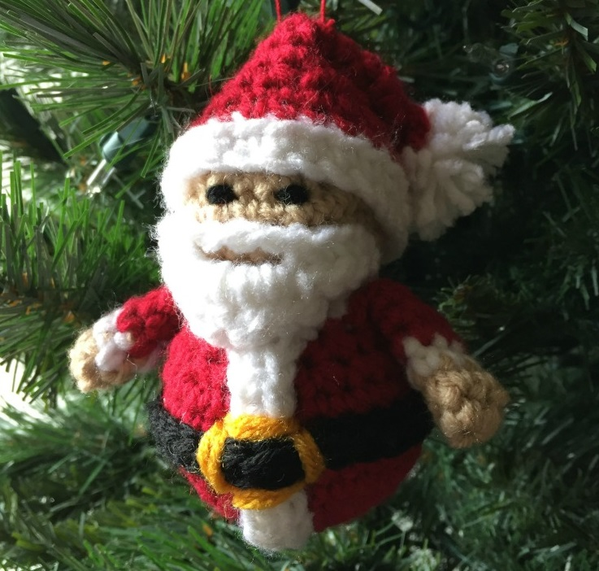
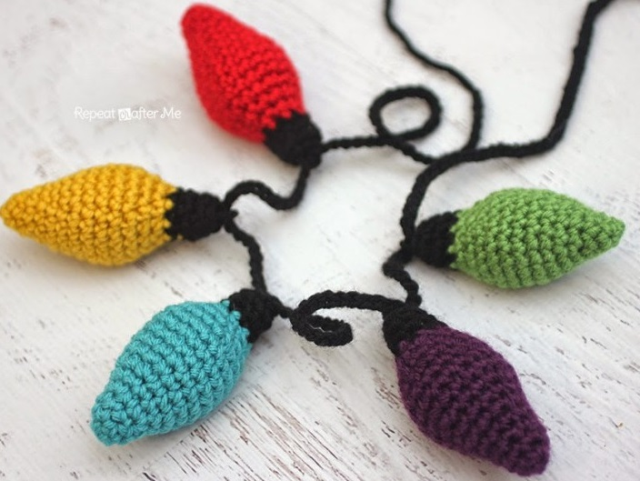
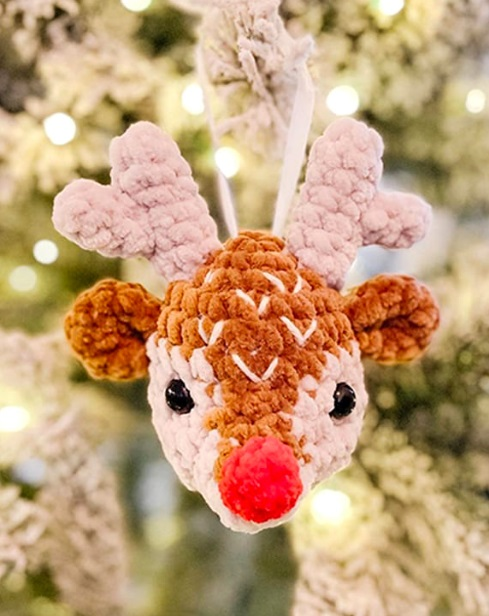

This article has been written and researched by our expert Loveable through a precise methodology. [Learn more about our methodology](https://avada.io/loveable/our-methodological.html)

[Loveable](https://avada.io/loveable/) > [Blog](https://avada.io/loveable/blog/) > [Holiday](https://avada.io/loveable/holiday/)

# 40+ Stunning Crochet Christmas Ornaments to Brighten Your Season

Written by [Blake Simpson](https://avada.io/loveable/author/blake/) Last Updated on September 11, 2023

- [40+ DIY Crochet Christmas Ornaments to Sparkle Your Season](https://avada.io/loveable/blog/crochet-christmas-ornaments/#wp-block-heading-2-3)
    - [1\. DIY Crochet Snow Globe Ornaments](https://avada.io/loveable/blog/crochet-christmas-ornaments/#wp-block-heading-3-4)
    - [2\. Boho Christmas Crochet Baubles](https://avada.io/loveable/blog/crochet-christmas-ornaments/#wp-block-heading-3-8)
    - [3\. Crochet Mittens Ornaments](https://avada.io/loveable/blog/crochet-christmas-ornaments/#wp-block-heading-3-12)
    - [4\. Ugly Christmas Sweater Crochet Ornaments](https://avada.io/loveable/blog/crochet-christmas-ornaments/#wp-block-heading-3-16)
    - [5\. DIY Crochet Stocking Ornaments](https://avada.io/loveable/blog/crochet-christmas-ornaments/#wp-block-heading-3-20)
    - [6\. DIY Traditional Crochet Ornament](https://avada.io/loveable/blog/crochet-christmas-ornaments/#wp-block-heading-3-24)
    - [7\. DIY Crochet Christmas Light Ornaments](https://avada.io/loveable/blog/crochet-christmas-ornaments/#wp-block-heading-3-28)
    - [8\. DIY Crochet Little Christmas Mouse](https://avada.io/loveable/blog/crochet-christmas-ornaments/#wp-block-heading-3-32)
    - [9\. DIY Crochet Christmas Tree Ornament](https://avada.io/loveable/blog/crochet-christmas-ornaments/#wp-block-heading-3-36)
    - [10\. Crochet Bells Christmas Ornament](https://avada.io/loveable/blog/crochet-christmas-ornaments/#wp-block-heading-3-40)
    - [11\. DIY Crochet Snowflake Ornaments](https://avada.io/loveable/blog/crochet-christmas-ornaments/#wp-block-heading-3-44)
    - [12\. DIY Crochet Reindeer Ornament](https://avada.io/loveable/blog/crochet-christmas-ornaments/#wp-block-heading-3-48)
    - [13\. Retro Ornament Garland](https://avada.io/loveable/blog/crochet-christmas-ornaments/#wp-block-heading-3-52)
    - [14\. Crocheted Snowman Ornament](https://avada.io/loveable/blog/crochet-christmas-ornaments/#wp-block-heading-3-56)
    - [15\. Mini Christmas Baubles](https://avada.io/loveable/blog/crochet-christmas-ornaments/#wp-block-heading-3-60)
    - [16\. DIY Crochet Santa Claus Ornament](https://avada.io/loveable/blog/crochet-christmas-ornaments/#wp-block-heading-3-64)
    - [17\. Crochet Granny Square Angel Christmas Ornament](https://avada.io/loveable/blog/crochet-christmas-ornaments/#wp-block-heading-3-68)
    - [18\. Caron North Star Ornament](https://avada.io/loveable/blog/crochet-christmas-ornaments/#wp-block-heading-3-72)
    - [19\. Red Heart Slice of Pizza Ornament](https://avada.io/loveable/blog/crochet-christmas-ornaments/#wp-block-heading-3-76)
    - [20\. Crochet Gingerbread Man](https://avada.io/loveable/blog/crochet-christmas-ornaments/#wp-block-heading-3-80)
    - [21\. Mitten Ornament/Gift Card Holder](https://avada.io/loveable/blog/crochet-christmas-ornaments/#wp-block-heading-3-84)
    - [22\. Crochet Christmas Candy Cane Cover](https://avada.io/loveable/blog/crochet-christmas-ornaments/#wp-block-heading-3-88)
    - [23\. Candy Cane](https://avada.io/loveable/blog/crochet-christmas-ornaments/#wp-block-heading-3-92)
    - [24\. Ribbon Christmas Tree](https://avada.io/loveable/blog/crochet-christmas-ornaments/#wp-block-heading-3-96)
    - [25\. Alberelli Christmas Decoration](https://avada.io/loveable/blog/crochet-christmas-ornaments/#wp-block-heading-3-100)
    - [26\. Crochet Christmas Lights](https://avada.io/loveable/blog/crochet-christmas-ornaments/#wp-block-heading-3-104)
    - [27\. Jeffrey the Eggnog](https://avada.io/loveable/blog/crochet-christmas-ornaments/#wp-block-heading-3-108)
    - [28\. Christmas Pudding Bauble](https://avada.io/loveable/blog/crochet-christmas-ornaments/#wp-block-heading-3-112)
    - [29\. Festive Christmas Ornament Cover](https://avada.io/loveable/blog/crochet-christmas-ornaments/#wp-block-heading-3-116)
    - [30\. DIY Crochet Christmas Bell](https://avada.io/loveable/blog/crochet-christmas-ornaments/#wp-block-heading-3-120)
    - [31\. Crochet Christmas Village Ornaments](https://avada.io/loveable/blog/crochet-christmas-ornaments/#wp-block-heading-3-124)
    - [32\. Vintage Guardian Angels](https://avada.io/loveable/blog/crochet-christmas-ornaments/#wp-block-heading-3-128)
    - [33\. Easy Crochet Christmas Bag Ornament](https://avada.io/loveable/blog/crochet-christmas-ornaments/#wp-block-heading-3-132)
    - [34\. Crochet Ornament Garland](https://avada.io/loveable/blog/crochet-christmas-ornaments/#wp-block-heading-3-136)
    - [35\. Easy Crochet Santa Ornaments](https://avada.io/loveable/blog/crochet-christmas-ornaments/#wp-block-heading-3-140)
    - [36\. Crochet Flat Christmas Tree Pattern](https://avada.io/loveable/blog/crochet-christmas-ornaments/#wp-block-heading-3-144)
    - [37\. DIY Rudolph Crochet Ornaments](https://avada.io/loveable/blog/crochet-christmas-ornaments/#wp-block-heading-3-148)
    - [38\. Gingerbread House Crochet Gift Tags](https://avada.io/loveable/blog/crochet-christmas-ornaments/#wp-block-heading-3-152)
    - [39\. Whimsical Face Reindeer Crochet Ornaments](https://avada.io/loveable/blog/crochet-christmas-ornaments/#wp-block-heading-3-156)
    - [40\. Crochet Poinsettia Coasters](https://avada.io/loveable/blog/crochet-christmas-ornaments/#wp-block-heading-3-160)
    - [41\. The Grinch-Inspired Crochet Ornament](https://avada.io/loveable/blog/crochet-christmas-ornaments/#wp-block-heading-3-164)
- [Bottom Line](https://avada.io/loveable/blog/crochet-christmas-ornaments/#wp-block-heading-2-172)

As winter’s frosty embrace draws near, a magical transformation occurs within the crafting realm – where hooks and yarn intertwine to conjure miniature masterpieces that shimmer and sparkle with the spirit of the season. Welcome to the enchanting world of **crochet Christmas ornaments**, where creativity dances with tradition and imagination stitches together holiday joy.

From elegant baubles that grace the boughs of evergreens to charming stockings, crochet Christmas ornaments are a gateway to a world where tradition and innovation weave a tapestry of wonder. Join us as we explore the intricate artistry, heartfelt stories, and timeless magic spun by the hands of crochet enthusiasts during the most wonderful time of the year.

## **40+ DIY Crochet Christmas Ornaments to Sparkle Your Season**

### **1\. DIY Crochet Snow Globe Ornaments**

With their captivating allure, snow globes are likely already on display among your Christmas adornments. However, consider employing this unique project to incorporate them within your tree’s decor.

Check out the tutorial at [Repeat Crafter Me](https://www.repeatcrafterme.com/2018/12/crochet-snowglobe-ornaments.html)

### **2**. **Boho Christmas Crochet Baubles**

Harness your collection of vibrant threads to craft these lively and delightful baubles. Beyond their decorative potential, they also serve as charming gift toppers.

Check out the tutorial at [Annie Design Crochet](https://www.anniedesigncrochet.com/2020/11/13/boho-christmas-crochet-baubles-free-pattern/)

### **3\. Crochet Mittens Ornaments**

Crocheting these petite mittens is wonderfully uncomplicated, requiring only a brief period to complete. With the interval leading up to the Christmas decorating season, you can effortlessly craft numerous pairs. 

Check out the tutorial at [Spin Yarn Crochet](https://spinayarncrochet.com/mittens-ornament-free-crochet-pattern/)

### **4\. Ugly Christmas Sweater Crochet Ornaments**

It’s highly recommended that you create these charming mini Christmas sweaters for everyone on your list this year. Opt for classic Christmas hues or embrace vibrant and contrasting colors to achieve an intentionally “ugly” aesthetic.

Check out the tutorial at [Raffamusa Designs](https://raffamusadesigns.com/ugly-christmas-sweater-crochet-ornament/)

### **5\. DIY Crochet Stocking Ornaments**

Suspend these [unique Christmas ornaments](https://avada.io/loveable/unique-christmas-ornaments/) on your tree thoughtfully. These baubles serve as a testament that stockings appear equally delightful gracing your mantle as they do adorning your evergreen.

Check out the tutorial at [Sewrella](https://www.sewrella.com/mini-stockings-ornament-christmas-traditions-cal/)

### **6\. DIY Traditional Crochet Ornament**

Expanding your horizons beyond round glass ornaments can yield equally stunning results when decorating your tree. For an equally enchanting yet more durable option, consider experimenting with this crocheted rendition!

Get the tutorial at: [Once Upon a Cheerio](http://www.onceuponacheerio.com/2018/12/flatland-christmas-baubles-crochet.html)

### **7\. DIY Crochet Christmas Light Ornaments**

Crafting these petite decorations, resembling traditional bauble ornaments, is simple and versatile. Experiment with color combinations or monochromatic approaches to align with your decorating theme. These charming creations can also serve as gifts.

Get the tutorial at [Sewrella](http://www.sewrella.com/christmas-lights-ornament-christmas/)

### **8\. DIY Crochet Little Christmas Mouse**

We wouldn’t mind this cute critter stirring in our house! And I’m sure you will welcome this adorable creature’s presence with open arms in your home!

Get the tutorial at [Lucy Ravenscar](http://lucyravenscar.blogspot.com/2015/12/little-christmas-mouse-free-pattern.html)

### **9\. DIY Crochet Christmas Tree Ornament**

Faux pearls look just like shining ornaments on this teeny tiny tree. They add a touch of elegance and sophistication to the tree’s overall appearance. The faux pearls also create a stunning contrast against the vibrant green branches. 

Get the tutorial at [Hands Occupied](https://www.handsoccupied.com/crochet-christmas-tree/)

### **10\. Crochet Bells Christmas Ornament**

Christmas wouldn’t quite be complete without the presence of bells, and these charming creations are just as delightful adorning your tree as they are simple to craft. Incorporating these handcrafted bells onto your Christmas tree imparts a festive element and evokes a feeling of cherished tradition and nostalgic sentiment.

Get the tutorial at [Crochet For You](https://www.crochetforyoublog.com/2017/11/christmas-ornament-mini-cal-crochet-bells/)

### **11\. DIY Crochet Snowflake Ornaments**

Transform your tree into a captivating winter wonderland with the addition of these exquisite snowflakes. Each snowflake is meticulously crafted, resulting in a mesmerizing arrangement that perfectly captures the enchanting beauty of the winter season.

Get the tutorial at [Grateful Prayer Thankful Heart](https://gratefulprayerthankfulheart.com/my-daughter-erin-makes-pretty/)

### **12\. DIY Crochet Reindeer Ornament**

This rendition of Rudolph is brimming with extra adorability, featuring an endearingly exaggerated red nose, button eyes, and a cheerful smiling mouth. The vibrant hue of the nose infuses a playful element into Rudolph’s overall look. 

Get the tutorial at [Spin a Yarn Crochet](https://spinayarncrochet.com/reindeer-ornament-free-crochet-pattern/)

### **13\. Retro Ornament Garland**

Whether you opt to have these stylish retro ornaments suspended individually from your tree or integrated into a garland on your mantel, rest assured they will exude a remarkably cool vibe.

Get the tutorial at [Persia Lou](https://persialou.com/crochet-retro-ornament-garland/)

### **14\. Crocheted Snowman Ornament**

About four inches tall, this little snowman is stylishly decked out for your tree in a top hat, scarf, and small blue buttons on the belly.

Get the tutorial at [5 Little Monsters](https://www.5littlemonsters.com/2015/11/crocheted-snowman-ornament.html)

### **15\. Mini Christmas Baubles**

The pastel hues adorning these charming miniature baubles hold a special allure, particularly when accompanied by golden accents. Their versatile appeal ensures they will beautifully complement a wide array of Christmas decorations.

Get the tutorial at [Thoresby Cottage](https://thoresbycottage.com/2019/12/06/mini-christmas-bauble-free-crochet-pattern/)

### **16\. DIY Crochet Santa Claus Ornament**

Merry old St. Nicholas is characterized by a pleasantly round tummy, likely brimming with an abundance of Christmas cookies! His jolly laugh echoes through the air as he spreads cheer and joy to all. Children eagerly await his arrival, knowing that he will bring them gifts and fill their hearts with happiness. 

Get the tutorial at [5 Little Monsters](https://www.5littlemonsters.com/2015/11/crocheted-santa-ornament.html)

### **17\. Crochet Granny Square Angel Christmas Ornament**

Every house has to have a crocheted angel! Such a tiny sweetheart will look wonderful hanging from the chimney or on the tree; a group of these angels would also create a gorgeous garland. This decoration is incredibly ingenious and quite easy.

Check out the tutorial at [Sewrella](https://www.sewrella.com/granny-square-angel-ornament-christmas/)

### **18\. Caron North Star Ornament**

The lovely and [funny Christmas ornaments](https://avada.io/loveable/funny-christmas-ornaments/) in the images below were created by Yarnspirations and fall between hanging decorations and light bulbs. So, what are you waiting for without making a few of these in various colors that make your Christmas tree seem fantastic?

Check out the product at [Yarnspirations](https://www.yarnspirations.com/gb/caron-north-star-ornament/CAC0517-004396M.html)

### **19\. Red Heart Slice of Pizza Ornament**

Care for a piece of pizza? Who decreed those holiday decorations must lack excitement? These delectable segments disprove that notion! Frankly, just gazing at them is making me famished! They come together swiftly and make an excellent present for any pizza lovers!

Check out the product at [Yarnspirations](https://www.yarnspirations.com/products/red-heart-slice-of-pizza-ornament)

### **20\. Crochet Gingerbread Man**

A Gingerbread Person embodies the timeless essence of the holiday season, open to your creative embellishments! Simply exercise caution against indulging (a challenge indeed!). It’s an enchanting addition to adorning your children’s spaces!

Check out the tutorial at [Repeat Crafter Me](https://www.repeatcrafterme.com/2017/11/crochet-gingerbread-man.html)

### **21\. Mitten Ornament/Gift Card Holder**

Holiday ornaments should radiate exuberance, with a penchant for vibrant and celebratory hues. Take, for example, the charming glove showcased in the images beneath. It serves as both a delightful embellishment and a versatile receptacle for presents – a shrewd notion indeed! 

Find this free crochet pattern on [Highland Hickory Designs](http://www.highlandhickorydesigns.com/mitten-ornamentgift-card-holder/)

### **22\. Crochet Christmas Candy Cane Cover**

When adorning your home for the holiday season, candy canes are an enduring tradition. However, the infusion of a lacy covering with these candy canes leads to an overwhelming abundance of cuteness. These would make a splendid addition to your Christmas tree! 

Check out the tutorial at [Sewrella](https://www.sewrella.com/crochet-candy-cane-cover-christmas-traditions-cal/)

### **23\. Candy Cane**

Aside from its typical role adorning the Christmas tree, the candy cane is the most favored ornament. While crafting a solitary candy cane is an option, consider elevating the festive atmosphere to an entirely new echelon by pairing it with charming mice.

Check out the product at [Yarnspirations](https://www.yarnspirations.com/products/caron-candy-cane-ornament)

### **24\. Ribbon Christmas Tree**

In case you’re on the lookout for an incredibly delightful and charming Christmas DIY project, these ribbon trees showcased in the images below are destined to be a resounding success! Their assembly is impressively rapid but exudes creativity and is admirably straightforward to execute!

Check out the tutorial at [Poppyand and Bliss](https://poppyandbliss.com/2015/11/17/crochet-ribbon-christmas-tree-pattern/)

### **25\. Alberelli Christmas Decoration**

This adorable piece welcomes your creative touch, allowing you to fashion it in various colors and designs limited only by your imagination. What remains certain is that these creations will unquestionably steal the spotlight amid your Christmas decorations.

Check out the tutorial at [Airali Design](https://airalidesign.com/en/christmas-tree-amigurumi-free-pattern/)

### **26\. Crochet Christmas Lights**

Unlike regular Christmas lights, these vibrant bulbs will never fade. If you’re seeking a perpetually charming and immensely enjoyable holiday embellishment, these lights are guaranteed a resounding success in your household! Don’t hesitate to craft them in a multitude of colors to your heart’s content.

Check out the tutorial at [Repeat Crafter Me](https://www.repeatcrafterme.com/2014/12/crochet-christmas-lights.html)

### **27\. Jeffrey the Eggnog**

Eggnog holds a special place among my cherished holiday drinks, and the instant I laid eyes on this adorable creation by Knot Bad in the images below, I felt compelled to pass it along to you! This incredibly charming amigurumi embodies sweetness and is certain to infuse your Christmas celebrations with an extra dose of joy.

Check out the tutorial at [Knot Badami](https://knotbadami.com/jeffrey-the-eggnog/)

### **28\. Christmas Pudding Bauble**

Are you a fan of pudding? If so, you’re bound to adore this delectable pudding-themed bauble, which appears almost good enough to savor! Even better, it will exude exquisite charm while adorning your Christmas tree!

Find this free crochet pattern on [Sooz In The Shed](https://soozintheshed.blogspot.com/2015/10/crochet-christmas-pudding-bauble-free.html)

### **29\. Festive Christmas Ornament Cover**

Elevate your old baubles into magnificent handmade treasures destined to become cherished heirlooms passed down through the ages. Moreover, bauble covers have an enduring quality, making them thoughtful gifts for loved ones.

Check out the tutorial at [Oombawka Design Crochet](https://oombawkadesigncrochet.com/glory-festive-christmas-ornament-cover/)

### **30\. DIY Crochet Christmas Bell**

This exquisite petite bell exudes a delightful vintage aesthetic and boasts a remarkably straightforward crochet pattern. Feel free to experiment with various colors or opt for an all-white ensemble if that suits your preference.

Tutorial and Pattern: [Ravelry](https://www.ravelry.com/patterns/library/christmas-time---bell)

### **31\. Crochet Christmas Village Ornaments**

Crafting these Christmas village components through crochet offers versatile options for adornment. The process is pleasantly straightforward, and diverse structures await your creation. The pattern, conveniently sourced from Etsy, presents an effortlessly comprehensible guide.

Check out the tutorial at [Redheart](http://www.redheart.com/free-patterns/christmas-village)

### **32\. Vintage Guardian Angels**

Fashioning these is delightfully straightforward, open to various color options or captivating combinations. Incorporating a handful of these onto your Christmas tree imparts an enchanting vintage allure, or craft several as charming presents to bestow upon loved ones.

Check out the tutorial at [Guardian Angel](https://web.archive.org/web/20210506063012/https://crochetmillan.com/2016/10/30/guardian-angel/)

### **33\. Easy Crochet Christmas Bag Ornament**

This petite Christmas bag offers an effortlessly manageable crochet project, serving as an ideal enhancement for both indoor and outdoor Christmas trees. It can be suspended wherever you desire a touch of supplementary Christmas embellishment, whether filled with pinecones or delectable candies.

Check out the tutorial at [Garn Studio](http://www.garnstudio.com/pattern.php?id=5912&cid=17)

### **34\. Crochet Ornament Garland**

These charming crocheted ornaments exude a distinct 1970s vibe and boast a straightforward crafting process. You have the option to fashion them individually and suspend them from the tree, or you can assemble a delightful garland that’s well-suited for gracing the mantle or any space in need of a festive touch.

Check out the tutorial at [Twin Dragon Fly Designs](http://www.twindragonflydesigns.com/crochet-garland-blog-hop/)

### **35\. Easy Crochet Santa Ornaments**

Crafting a petite Santa figure is a versatile addition to your Christmas tree or gift tag. The process is not overly complex, with minimal yarn and proficiency in various colors. The charming bell on his hat adds an extra touch of charm.

Check out the tutorial at [Knitted Patterns](https://knitted-patterns.com/knitting-for-home/4242-crochet-christmas-ornament-pattern-free)

### **36\. Crochet Flat Christmas Tree Pattern**

Craft a plethora of these diminutive crochet Christmas trees, spanning an array of colors, and festoon your living space with their charm. Enrich them with buttons and assorted adornments, serving as ornaments upon your petite trees. 

Check out the tutorial at [Made By Gootie](https://madebygootie.com/crochet/free-christmas-tree-crochet-patterns/)

### **37\. DIY Rudolph Crochet Ornaments**

Creating Rudolph The Red-Nosed Reindeer is a delightfully straightforward endeavor, and their petite size allows for the creation of numerous figures over a single weekend. Commence your crafting journey now, and you’ll amass an abundant collection to adorn your tree lavishly!

Check out the tutorial at [Knots Thoughts](http://knots-thoughts.blogspot.com/2012/12/rudolph-reindeer-christmas-ornament.html)

### **38\. Gingerbread House Crochet Gift Tags**

Crafting these tags is surprisingly manageable, and the intricate details they exhibit are truly captivating. Whether suspended from the tree, adorning your presents, or enhancing your holiday wreath, these tags offer a versatile and visually appealing decorative element.

Check out the tutorial at [Ursula Markgraf](https://ursulamarkgraf.com/how-to-make-your-own-gingerbread-house-tags-free-pattern)

### **39\. Whimsical Face Reindeer Crochet Ornaments**

These petite crochet reindeer ornaments wear a whimsical expression, their faces adorned with smiles, embodying the confidence that they’re a breeze to craft, even for beginners. They present a splendid gifting notion, especially suited for coffee enthusiasts fondly for reindeer.

Check out the tutorial at [Lovely Craft](https://www.lovelycraft.com/crochet-reindeer-christmas-ornament-amigurumi-free-pattern/)

### **40\. Crochet Poinsettia Coasters**

Enhance your holiday decor flawlessly with these poinsettia coasters, an impeccable addition that doubles as thoughtful gifts. Should you be inclined, these coasters can even grace your Christmas tree as ornaments. Their versatility ensures a seamless fit for any decorating endeavor.

Check out the tutorial at [Craft Passion](https://www.craftpassion.com/crochet-poinsettia-coaster-pattern-tutorial/)

### **41\. The Grinch-Inspired Crochet Ornament**

Incorporating facial features through crochet requires additional time and attention, yet these creations remain remarkably straightforward. They prove to be an ideal choice for infusing your holiday decorating with a touch of Grinch-like charm.

Check out the tutorial at [Sewrella](https://www.sewrella.com/the-grinch-inspired-ornament-christmas-traditions-cal/)

**_See More:_**

- Best [Gifts For Crocheters](https://avada.io/loveable/gifts-crocheters/)

- Best [Christmas Gifts Crochet](https://avada.io/loveable/christmas-gifts-crochet/)

- Perfect [Personalized Christmas Ornaments](https://avada.io/loveable/personalized-christmas-ornaments/)

## **Bottom Line**

In the captivating realm of **crochet Christmas ornaments**, the threads of creativity intertwine with cherished traditions, weaving a tapestry of enchantment. These intricate creations hold the power to kindle nostalgia, forge connections, and spread the warm holiday spirit. They craft not just ornaments but lasting memories that adorn our homes and hearts.

So, whether adorning your tree or finding a new abode in the homes of friends and family, these crochet marvels are an invitation to celebrate the season’s magic in a way that only handcrafted treasures can offer.

- [40+ DIY Crochet Christmas Ornaments to Sparkle Your Season](https://avada.io/loveable/blog/crochet-christmas-ornaments/#wp-block-heading-2-3)
    - [1\. DIY Crochet Snow Globe Ornaments](https://avada.io/loveable/blog/crochet-christmas-ornaments/#wp-block-heading-3-4)
    - [2\. Boho Christmas Crochet Baubles](https://avada.io/loveable/blog/crochet-christmas-ornaments/#wp-block-heading-3-8)
    - [3\. Crochet Mittens Ornaments](https://avada.io/loveable/blog/crochet-christmas-ornaments/#wp-block-heading-3-12)
    - [4\. Ugly Christmas Sweater Crochet Ornaments](https://avada.io/loveable/blog/crochet-christmas-ornaments/#wp-block-heading-3-16)
    - [5\. DIY Crochet Stocking Ornaments](https://avada.io/loveable/blog/crochet-christmas-ornaments/#wp-block-heading-3-20)
    - [6\. DIY Traditional Crochet Ornament](https://avada.io/loveable/blog/crochet-christmas-ornaments/#wp-block-heading-3-24)
    - [7\. DIY Crochet Christmas Light Ornaments](https://avada.io/loveable/blog/crochet-christmas-ornaments/#wp-block-heading-3-28)
    - [8\. DIY Crochet Little Christmas Mouse](https://avada.io/loveable/blog/crochet-christmas-ornaments/#wp-block-heading-3-32)
    - [9\. DIY Crochet Christmas Tree Ornament](https://avada.io/loveable/blog/crochet-christmas-ornaments/#wp-block-heading-3-36)
    - [10\. Crochet Bells Christmas Ornament](https://avada.io/loveable/blog/crochet-christmas-ornaments/#wp-block-heading-3-40)
    - [11\. DIY Crochet Snowflake Ornaments](https://avada.io/loveable/blog/crochet-christmas-ornaments/#wp-block-heading-3-44)
    - [12\. DIY Crochet Reindeer Ornament](https://avada.io/loveable/blog/crochet-christmas-ornaments/#wp-block-heading-3-48)
    - [13\. Retro Ornament Garland](https://avada.io/loveable/blog/crochet-christmas-ornaments/#wp-block-heading-3-52)
    - [14\. Crocheted Snowman Ornament](https://avada.io/loveable/blog/crochet-christmas-ornaments/#wp-block-heading-3-56)
    - [15\. Mini Christmas Baubles](https://avada.io/loveable/blog/crochet-christmas-ornaments/#wp-block-heading-3-60)
    - [16\. DIY Crochet Santa Claus Ornament](https://avada.io/loveable/blog/crochet-christmas-ornaments/#wp-block-heading-3-64)
    - [17\. Crochet Granny Square Angel Christmas Ornament](https://avada.io/loveable/blog/crochet-christmas-ornaments/#wp-block-heading-3-68)
    - [18\. Caron North Star Ornament](https://avada.io/loveable/blog/crochet-christmas-ornaments/#wp-block-heading-3-72)
    - [19\. Red Heart Slice of Pizza Ornament](https://avada.io/loveable/blog/crochet-christmas-ornaments/#wp-block-heading-3-76)
    - [20\. Crochet Gingerbread Man](https://avada.io/loveable/blog/crochet-christmas-ornaments/#wp-block-heading-3-80)
    - [21\. Mitten Ornament/Gift Card Holder](https://avada.io/loveable/blog/crochet-christmas-ornaments/#wp-block-heading-3-84)
    - [22\. Crochet Christmas Candy Cane Cover](https://avada.io/loveable/blog/crochet-christmas-ornaments/#wp-block-heading-3-88)
    - [23\. Candy Cane](https://avada.io/loveable/blog/crochet-christmas-ornaments/#wp-block-heading-3-92)
    - [24\. Ribbon Christmas Tree](https://avada.io/loveable/blog/crochet-christmas-ornaments/#wp-block-heading-3-96)
    - [25\. Alberelli Christmas Decoration](https://avada.io/loveable/blog/crochet-christmas-ornaments/#wp-block-heading-3-100)
    - [26\. Crochet Christmas Lights](https://avada.io/loveable/blog/crochet-christmas-ornaments/#wp-block-heading-3-104)
    - [27\. Jeffrey the Eggnog](https://avada.io/loveable/blog/crochet-christmas-ornaments/#wp-block-heading-3-108)
    - [28\. Christmas Pudding Bauble](https://avada.io/loveable/blog/crochet-christmas-ornaments/#wp-block-heading-3-112)
    - [29\. Festive Christmas Ornament Cover](https://avada.io/loveable/blog/crochet-christmas-ornaments/#wp-block-heading-3-116)
    - [30\. DIY Crochet Christmas Bell](https://avada.io/loveable/blog/crochet-christmas-ornaments/#wp-block-heading-3-120)
    - [31\. Crochet Christmas Village Ornaments](https://avada.io/loveable/blog/crochet-christmas-ornaments/#wp-block-heading-3-124)
    - [32\. Vintage Guardian Angels](https://avada.io/loveable/blog/crochet-christmas-ornaments/#wp-block-heading-3-128)
    - [33\. Easy Crochet Christmas Bag Ornament](https://avada.io/loveable/blog/crochet-christmas-ornaments/#wp-block-heading-3-132)
    - [34\. Crochet Ornament Garland](https://avada.io/loveable/blog/crochet-christmas-ornaments/#wp-block-heading-3-136)
    - [35\. Easy Crochet Santa Ornaments](https://avada.io/loveable/blog/crochet-christmas-ornaments/#wp-block-heading-3-140)
    - [36\. Crochet Flat Christmas Tree Pattern](https://avada.io/loveable/blog/crochet-christmas-ornaments/#wp-block-heading-3-144)
    - [37\. DIY Rudolph Crochet Ornaments](https://avada.io/loveable/blog/crochet-christmas-ornaments/#wp-block-heading-3-148)
    - [38\. Gingerbread House Crochet Gift Tags](https://avada.io/loveable/blog/crochet-christmas-ornaments/#wp-block-heading-3-152)
    - [39\. Whimsical Face Reindeer Crochet Ornaments](https://avada.io/loveable/blog/crochet-christmas-ornaments/#wp-block-heading-3-156)
    - [40\. Crochet Poinsettia Coasters](https://avada.io/loveable/blog/crochet-christmas-ornaments/#wp-block-heading-3-160)
    - [41\. The Grinch-Inspired Crochet Ornament](https://avada.io/loveable/blog/crochet-christmas-ornaments/#wp-block-heading-3-164)
- [Bottom Line](https://avada.io/loveable/blog/crochet-christmas-ornaments/#wp-block-heading-2-172)

### [Blake Simpson](https://avada.io/loveable/author/blake/)

Hi, I'm Blake from Loveable. I help people find perfect gifts for occasions like anniversaries and weddings. I also write a blog about holidays, sharing insights to make them more meaningful. Let's create unforgettable moments together!

- [Twitter](https://twitter.com/intent/tweet)
- [Facebook](https://www.facebook.com/sharer/sharer.php)
- [instagram](https://avada.io/loveable/blog/crochet-christmas-ornaments/)
- [pinterest](https://www.pinterest.com/loveablellc/)

## Related Posts

[### 120+ Christian Birthday Wishes To Spread Your Love](https://avada.io/loveable/blog/christian-birthday-wishes/) 

[

### 35 Best 70th Birthday Ideas To Celebrate The Special Milestone

](https://avada.io/loveable/blog/70th-birthday-ideas/)

[

### 50 Best 30th Birthday Decorations for a Remarkable Birthday Bash

](https://avada.io/loveable/blog/30th-birthday-decorations/)

[

### 40 Delicious Vegan Christmas Desserts to Delight Your Palate

](https://avada.io/loveable/blog/vegan-christmas-desserts/)

[

### 60 Christmas Team Building Activities to Boost Workplace Spirit

](https://avada.io/loveable/blog/christmas-team-building-activities/)
