This article has been written and researched by our expert Loveable through a precise methodology. [Learn more about our methodology](https://avada.io/loveable/our-methodological.html)

[Loveable](https://avada.io/loveable/) > [Blog](https://avada.io/loveable/blog/) > [Family](https://avada.io/loveable/family/)

# 40 Thoughtful Community Service Activities That Make a Positive Impact on Your Community

Written by [Rose Bryne](https://avada.io/loveable/author/rose/) Last Updated on August 25, 2023

- [10 Best Educational Community Service Activities](https://avada.io/loveable/blog/community-service-activities/#wp-block-heading-2-4) 
    - [Hold an egg hunt for school kids](https://avada.io/loveable/blog/community-service-activities/#wp-block-heading-3-7)
    - [Organize a local book party for children](https://avada.io/loveable/blog/community-service-activities/#wp-block-heading-3-10)
    - [Coach a youth sports team](https://avada.io/loveable/blog/community-service-activities/#wp-block-heading-3-14)
    - [Begin a pen pal initiative for children](https://avada.io/loveable/blog/community-service-activities/#wp-block-heading-3-17)
    - [Teach kids a valuable life skill](https://avada.io/loveable/blog/community-service-activities/#wp-block-heading-3-21)
    - [Volunteer at a youth shelter](https://avada.io/loveable/blog/community-service-activities/#wp-block-heading-3-24)
    - [Donate used books to a children’s library](https://avada.io/loveable/blog/community-service-activities/#wp-block-heading-3-29)
    - [Help build a playground for disabled children](https://avada.io/loveable/blog/community-service-activities/#wp-block-heading-3-32)
    - [Create a summer reading program](https://avada.io/loveable/blog/community-service-activities/#wp-block-heading-3-35)
    - [Hold health and fitness presentations in schools](https://avada.io/loveable/blog/community-service-activities/#wp-block-heading-3-37)
- [10 Meaningful Community Service Activities to Help Animals and the Environment](https://avada.io/loveable/blog/community-service-activities/#wp-block-heading-2-39)
    - [Volunteer at an animal shelter](https://avada.io/loveable/blog/community-service-activities/#wp-block-heading-3-42)
    - [Raise money for retired police dogs](https://avada.io/loveable/blog/community-service-activities/#wp-block-heading-3-44)
    - [Offer a dog-walking service](https://avada.io/loveable/blog/community-service-activities/#wp-block-heading-3-47)
    - [Organize a spay and neuter program](https://avada.io/loveable/blog/community-service-activities/#wp-block-heading-3-49)
    - [Sponsor an animal in your city’s zoo](https://avada.io/loveable/blog/community-service-activities/#wp-block-heading-3-53)
    - [Host a puppy day at a school](https://avada.io/loveable/blog/community-service-activities/#wp-block-heading-3-56)
    - [Build birdhouses for your neighborhood](https://avada.io/loveable/blog/community-service-activities/#wp-block-heading-3-60)
    - [Host an equine skills clinic](https://avada.io/loveable/blog/community-service-activities/#wp-block-heading-3-62)
    - [Raise money for a local animal shelter](https://avada.io/loveable/blog/community-service-activities/#wp-block-heading-3-64)
    - [Encourage and promote conservationism](https://avada.io/loveable/blog/community-service-activities/#wp-block-heading-3-68)
- [10 Community Service Activities Ideas to Reduce Crime and Promote Safety](https://avada.io/loveable/blog/community-service-activities/#wp-block-heading-2-70)
    - [Create a violence protection group in your community](https://avada.io/loveable/blog/community-service-activities/#wp-block-heading-3-72)
    - [Take part in your neighborhood watch group](https://avada.io/loveable/blog/community-service-activities/#wp-block-heading-3-75)
    - [Volunteer to be a crossing guard at a school](https://avada.io/loveable/blog/community-service-activities/#wp-block-heading-3-79)
    - [Host seminars about drug and alcohol use](https://avada.io/loveable/blog/community-service-activities/#wp-block-heading-3-82)
    - [Teach self-defense lessons](https://avada.io/loveable/blog/community-service-activities/#wp-block-heading-3-86)
    - [Volunteer at a fire station](https://avada.io/loveable/blog/community-service-activities/#wp-block-heading-3-89)
    - [Volunteer at or donate to a battered woman or youth shelter](https://avada.io/loveable/blog/community-service-activities/#wp-block-heading-3-93)
    - [Teach kids about safety and first aid](https://avada.io/loveable/blog/community-service-activities/#wp-block-heading-3-96)
    - [Become CPR certified](https://avada.io/loveable/blog/community-service-activities/#wp-block-heading-3-99)
    - [Paint over graffiti in your neighborhood](https://avada.io/loveable/blog/community-service-activities/#wp-block-heading-3-102)
- [10 Community Service Activities Ideas to Help Senior Citizens](https://avada.io/loveable/blog/community-service-activities/#wp-block-heading-2-105)
    - [Take flowers to nurse home residents](https://avada.io/loveable/blog/community-service-activities/#wp-block-heading-3-107)
    - [Help elderly neighbors with chores](https://avada.io/loveable/blog/community-service-activities/#wp-block-heading-3-111)
    - [Cook a meal for a senior](https://avada.io/loveable/blog/community-service-activities/#wp-block-heading-3-115)
    - [Decorate the doors of a nursing home for the holidays](https://avada.io/loveable/blog/community-service-activities/#wp-block-heading-3-118)
    - [Perform a musical act at a nursing home](https://avada.io/loveable/blog/community-service-activities/#wp-block-heading-3-121)
    - [Offer a grocery delivery service specifically designed for senior citizens](https://avada.io/loveable/blog/community-service-activities/#wp-block-heading-3-125)
    - [Regularly host game nights at a nursing home](https://avada.io/loveable/blog/community-service-activities/#wp-block-heading-3-128)
    - [Teach an elderly neighbor computer skills](https://avada.io/loveable/blog/community-service-activities/#wp-block-heading-3-132)
    - [Offer to write letters for a senior](https://avada.io/loveable/blog/community-service-activities/#wp-block-heading-3-135)
    - [Organize a senior garden](https://avada.io/loveable/blog/community-service-activities/#wp-block-heading-3-139)
- [Bottom Line](https://avada.io/loveable/blog/community-service-activities/#wp-block-heading-2-143) 

In today’s fast-paced world, it’s easy to dive into the hustle and bustle of our daily lives and forget about the importance of giving back to the communities we live in. But the truth is, community service is not only a powerful way to create meaningful connections with others, but it’s also an incredible opportunity to grow personally and contribute to the greater good. 

In this comprehensive list, we’ve compiled diverse activities of various interests, skills, and time commitments to help you find the perfect way to make a lasting impact. So, whether you’re a seasoned volunteer or just taking your first steps towards community service, dive in and discover the myriad of ways you can generate a huge effect of kindness and compassion that will transform your community for the better.

Discover **40 thoughtful community service activities** that not only make a positive impact on your community but also enrich your own life, as you connect with fellow citizens and contribute to the greater good.

## **10 Best Educational Community Service Activities** 

If you aim to enhance your community’s after-school program or impart an essential life skill to children, you may require monetary assistance to support your initiatives. Collaborating with your acquaintances, family, and community members can significantly amplify the effectiveness of your community service proposals focused on helping children, infants, and schools.

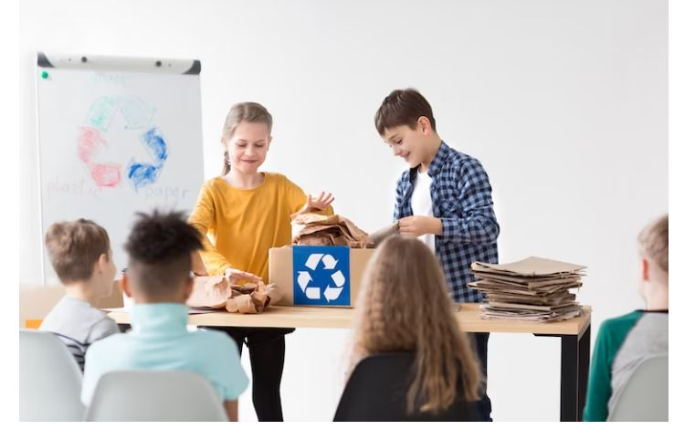

Organize a local book party for children

### **Hold an egg hunt for school kids**

What could be more exciting than organizing an egg hunt for school kids? Being able to do it as a thoughtful community service activity, that’s what! It is to create opportunities that are both fun and meaningful. And that’s exactly what an egg hunt can be.

Not only will the youngsters have a blast searching for eggs, but they’ll also be learning valuable skills like teamwork and problem-solving. So let’s get cracking and plan an unforgettable event!

### **Organize a local book party for children**

Hosting a book party for children is an excellent way to engage in educational community service while enjoying yourself. It’s a great opportunity to give back to make a positive impact on young minds.

By organizing a book party, you can inspire younger and encourage a love of reading in them. So, gather some snacks, invite some children, and let’s celebrate the joy of learning!

### **Coach a youth sports team**

There’s nothing quite like the experience of guiding a group of young athletes toward their goals and helping them develop not just as players but as individuals. Whether it’s basketball, soccer, football, or any other sport, coaching a youth team is an incredibly rewarding experience that allows you to pass on your knowledge and passion to the next generation. 

Have you ever thought about coaching a youth sports team? It’s a great way to give back and help shape the lives of young individuals, making a positive impact in your community.

### **Begin a pen pal initiative for children**

What better way to create meaningful connections through the written word than by encouraging young minds to write and share their thoughts with someone new?

By starting up this pen pal program, you can promote literacy, creativity, and empathy among children from all walks of life. There is hardly anything as gratifying as witnessing the pure happiness in children’s expressions when they receive letters from their newly-found pen friends.

### **Teach kids a valuable life skill**

Are you interested in contributing to your community? How about imparting valuable life skills to children through educational community service activities? It’s a great opportunity to make a difference in the lives of young ones while serving the community. Not only will you be helping your local area, but you’ll also be making a positive impact on the next generation. 

By providing opportunities for young people to engage in activities that promote learning and growth, you can help them develop essential skills that will benefit them for years to come. 

### **Volunteer at a youth shelter**

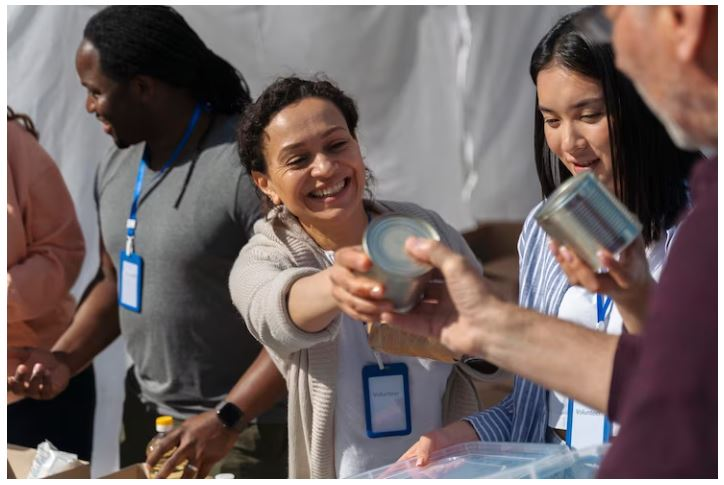

It’s a great way to give back to the community and help those in need, especially young people who are vulnerable and looking for guidance. As a volunteer, you can plan and participate in various activities that can help these youths learn new things, build skills, and have fun while doing it. 

Whether it’s organizing a workshop on financial literacy or simply playing games with them and making them feel like they belong, every little contribution counts.

**_Related_**: [Volunteer Activities](https://avada.io/loveable/volunteer-activities/)

### **Donate used books to a children’s library**

Engaging in educational community service activities is one of the most fulfilling experiences. And what better way to give back to the community than by donating used books to a children’s library? 

Not only does this help foster a love for reading in children, but it also promotes a sense of community and sharing. Together, as a community, we can positively impact young readers’ lives by inspiring them to read more and explore the wonders of literature. Let us motivate others to join in this activity of book donation and create a world where every child has access to the joy of reading. 

### **Help build a playground for disabled children**

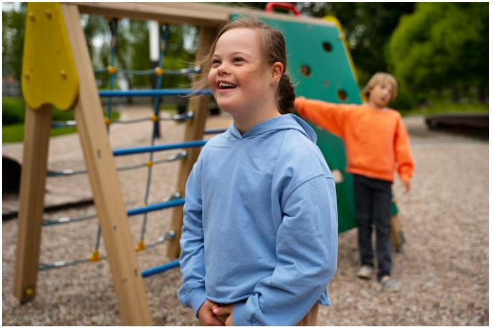

Imagine the joy on the faces of disabled children as they have a playground built just for them! Building a playground for these kids will not only provide them with a safe and fun space to play, but it will also teach them valuable skills like teamwork and communication. This is more than just a community service activity; it’s an opportunity to make a lasting impact on the lives of these children. 

### **Create a summer reading program**

Creating a summer reading program not only fosters a love for reading but also promotes educational community service activities. By designing a program that incorporates reading challenges and community outreach, we can inspire young minds to learn while giving back to society. This will provide a fun-filled summer and leave a lasting impact on the next generation. 

### **Hold health and fitness presentations in schools**

Seeing the kids’ faces light up with excitement as they learned new ways to stay healthy and active was truly inspiring. Not only will you get to share my expertise, but you will also get to contribute to the community meaningfully. 

## **10 Meaningful Community Service Activities to Help Animals and the Environment**

If you’re looking for community service activities that will positively impact the environment and help animals in need, plenty of options are available. Whether you choose to spend your time or raise funds for these causes, there are many community service ideas that can help make the world a better place for animals and the environment.

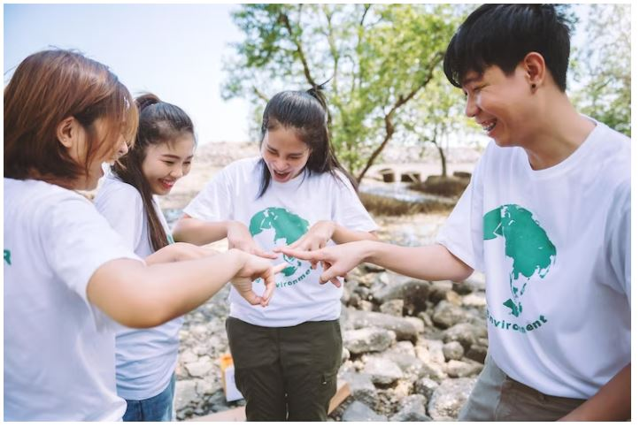

### **Volunteer at an animal shelter**

Volunteering your time at an animal shelter is an excellent opportunity to contribute to your community while developing your skills in animal care. Not only will you be helping care for animals in need, but you’ll also be providing them with much-needed love and attention.

### **Raise money for retired police dogs**

Another great option is to raise money for retired [police dogs](https://en.wikipedia.org/wiki/Police_dog), who have dedicated their lives to keeping our communities safe. By supporting these brave dogs, you’ll be making a difference in their lives and helping them enjoy a well-deserved retirement. 

### **Offer a dog-walking service**

If you’re looking for ideas on how to get involved, consider offering a dog-walking service in your neighborhood. This not only helps dog owners who may not have the time or ability to walk their pets, but it also promotes exercise for both the dogs and their walkers.

### **Organize a spay and neuter program**

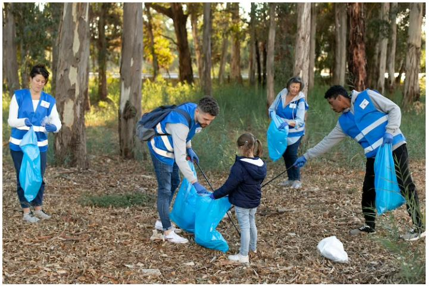

Organizing a spay and neuter program is one such activity that can help reduce the number of stray animals, prevent unwanted litters, and ultimately improve the overall health of the community. 

Through this program, volunteers and veterinary professionals work together to provide low-cost or free services to pet owners who do not afford them otherwise. 

### **Sponsor an animal in your city’s zoo**

Sponsoring an animal in your city’s zoo is an excellent way to support wildlife and contribute to conservation efforts. By sponsoring an animal, you are providing the necessary funds for its care, including food, medical expenses, and habitat maintenance, ensuring that it receives the best possible care. 

In return, you receive exclusive benefits such as behind-the-scenes tours, VIP access to events, and personalized updates on your sponsored animal’s progress.

### **Host a puppy day at a school**

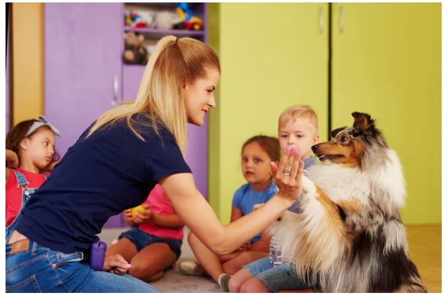

Organizing a Puppy Day at a school is one of the most rewarding community service activities that can be undertaken. Not only does it serve as a great way to spread awareness about animal welfare, but it also has the potential to create unforgettable memories for both students and puppies. 

By hosting this event, schools can instill in their students a sense of responsibility towards animals and encourage them to participate in other community service activities in the future.

### **Build birdhouses for your neighborhood**

By constructing birdhouses, you can provide a home for the feathered creatures and create a beautiful addition to your community as well. This activity is perfect for those interested in woodworking or wanting to spend some quality time outdoors. Not only will it improve your carpentry skills, but it will also benefit the environment by promoting bird conservation. 

### **Host an equine skills clinic**

The clinic can cover topics such as grooming, riding techniques, and horse care, and participants can learn from experienced trainers and riders. You can also use this opportunity to raise funds for a local horse rescue or therapy organization, adding an additional layer of community service to the event. 

### **Raise money for a local animal shelter**

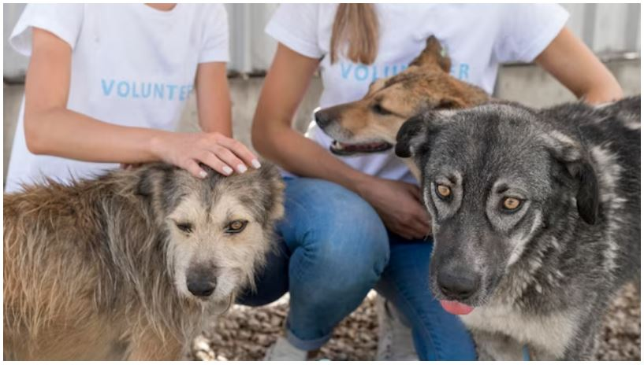

Community service is an excellent means to contribute to society and create a positive influence. One such activity that can make a real difference is raising money for a local animal shelter. 

Not only does this help provide for animals in need, but it also helps raise awareness about the importance of animal welfare. We have the power to positively impact the lives of animals in need through community service initiatives such as organizing fundraising events for nearby animal shelters. Let’s work together to make a meaningful difference.

### **Encourage and promote conservationism**

These activities can range from cleaning up local parks and beaches to planting trees and educating others about sustainable practices. By actively participating in these types of initiatives, individuals can not only raise awareness about the importance of conservationism but also make a tangible impact on their local ecosystems.

## **10 Community Service Activities Ideas to Reduce Crime and Promote Safety**

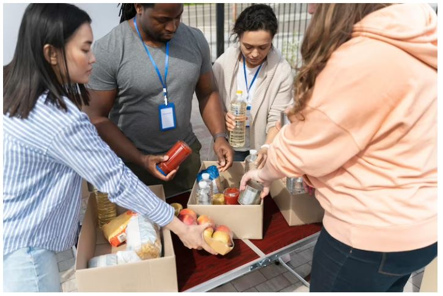

### **Create a violence protection group in your community**

A violence protection group can raise awareness about the impact of violence on the community and the importance of promoting safety. By educating community members about the risks and consequences of violence, the group can encourage people to take action to prevent it.

 By partnering with other community organizations, such as schools, churches, and community centers, a violence protection group can build a network of support for promoting safety.

### **Take part in your neighborhood watch group**

By participating in a neighborhood watch group, you can build stronger relationships with your neighbors and improve communication in the community. This can lead to a better understanding of local crime trends and help identify potential problem areas before they become major issues.

Neighborhood watch groups can help create a sense of community and promote a shared responsibility for keeping the neighborhood safe.

### **Volunteer to be a crossing guard at a school**

Crossing guards help control the flow of traffic around school zones, which can reduce the risk of accidents involving children and other pedestrians. By assisting children to cross the street safely, crossing guards can reduce the risk of injuries or fatalities from traffic accidents.

Crossing guards can provide a visible presence in the community, deterring criminals from targeting the area. Additionally, they can help monitor the behavior of children and identify any potential safety concerns or suspicious activity.

### **Host seminars about drug and alcohol use**

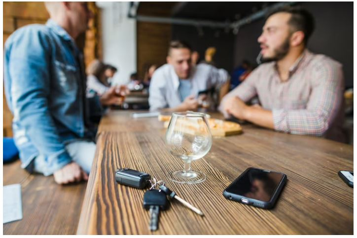

Seminars that address drug and alcohol use are an excellent way of imparting crucial information about the dangers and consequences of substance abuse. These seminars can play a pivotal role in thwarting drug and alcohol-related crimes like impaired driving and theft aimed at financing addiction. 

By educating people about the perils of substance abuse, these seminars can help prevent addiction from taking root in the first place. This, in turn, can diminish the possibility of criminal behavior that frequently accompanies addiction. It’s exhilarating to know that these seminars can make a real difference in society!

### **Teach self-defense lessons**

Self-defense lessons can provide individuals with the skills and confidence to protect themselves if they are ever in a dangerous situation. This can help reduce the fear of victimization and empower people with their safety.

By generating teaching self-defense community service activities, individuals can learn how to recognize and avoid potentially dangerous situations. Self-defense lessons can help individuals develop a greater awareness of their surroundings and potential threats.

### **Volunteer at a fire station**

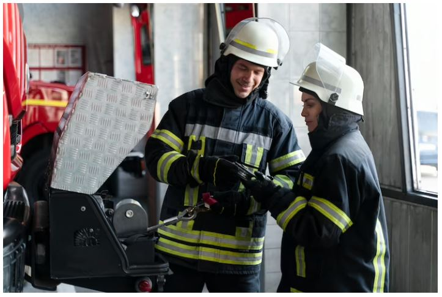

Firefighters play an important role in preventing fires and other emergencies. They can conduct safety inspections, provide education and outreach to the community, and help identify potential hazards before they become major problems.

Volunteering at a fire station can help promote public safety by providing a visible presence in the community. This can deter criminal activity and help realize potential safety matters before they become big issues.

### **Volunteer at or donate to a battered woman or youth shelter**

Battered women and youth shelters offer victims of violence a secure place to seek safety and help. Volunteering at or donating to these shelters can help victims reach the resources to rebuild their lives.

Shelters can also help prevent domestic violence by providing education and resources to those at risk of becoming victims. This can include information about healthy relationships, warning signs of abuse, and how to access support services.

### **Teach kids about safety and first aid**

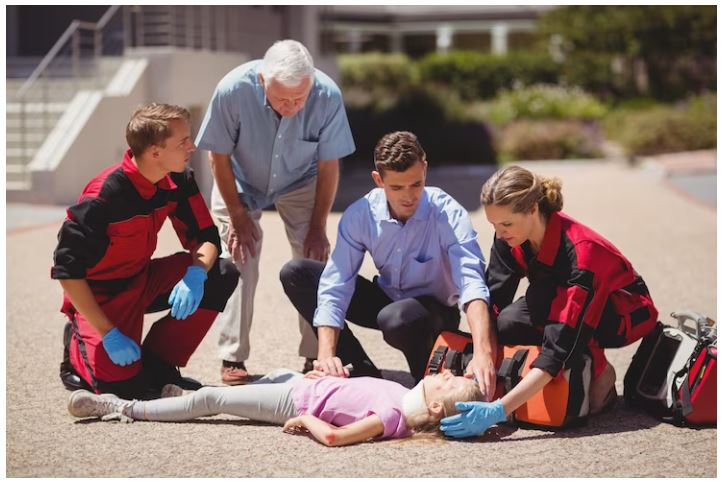

In the event of an emergency, children who have been taught about safety and first aid are better prepared to respond appropriately. They can provide basic first aid to themselves or others, and can also communicate more effectively with emergency responders. Teaching kids about safety and first aid can also help build stronger communities.

### **Become CPR certified**

[CPR](https://cpr.heart.org/en/resources/what-is-cpr) certification provides individuals with the knowledge and skills to respond to cardiac emergencies. By knowing how to perform CPR, individuals can help save lives in emergency situations, which can promote public safety.

By becoming CPR-certified, individuals are better prepared to respond to emergencies. They can provide life-saving care to those in need, and can also communicate more effectively with emergency responders.

### Paint over graffiti in your neighborhood

Graffiti can often be associated with gang activity and other criminal behavior. By removing graffiti, you can help deter criminal activity and make your neighborhood a safer place.

Painting over graffiti can also help promote a sense of neighborhood pride. It shows that community members care about their neighborhood and are willing to take action to keep it looking clean and attractive.

## **10 Community Service Activities Ideas to Help Senior Citizens**

### **Take flowers to nurse home residents**

Many senior citizens in nursing homes may feel lonely or isolated, and may not receive regular visits from family or friends. Bringing flowers to someone can positively impact their day by elevating their mood, improving their emotional well-being, and making them feel appreciated and nurtured.

Flowers are known to have a calming effect and can help reduce stress and anxiety. This can prove to be extremely advantageous for elderly individuals who may be struggling with medical problems or facing other obstacles.

**_Check Out_**: [Thank You Gifts For Nurses](https://avada.io/loveable/thank-you-gifts-nurses/)

### **Help elderly neighbors with chores**

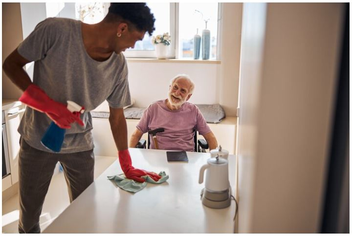

Senior citizens highly cherish their independence and prefer to reside in their own homes for an extended period of time. Helping them with chores such as grocery shopping, cleaning, or yard work enables them to maintain their independence and live in their own homes for longer.

But, they are at a higher risk of falls due to mobility issues and other health factors. Helping them with tasks such as cleaning or yard work can reduce the risk of falls and help them maintain their safety.

### **Cook a meal for a senior**

It’s often challenging for elderly individuals to cook or prepare meals due to physical constraints or lack of energy. You can help by cooking a nutritious and well-balanced meal that they may not have been able to put together themselves. 

Moreover, seniors who live alone may feel isolated and lonely, but by sharing a meal with them, you can reduce feelings of loneliness and provide an opportunity for social interaction. It’s incredibly thrilling to have the ability to make a positive difference in their lives!

### **Decorate the doors of a nursing home for the holidays**

Holiday decorations can evoke memories and stimulate reminiscence therapy, which can be especially beneficial for seniors with dementia or Alzheimer’s. It can help them feel more connected to their past and improve their cognitive functioning.

Decorating doors can also promote community involvement and volunteerism. It can provide an opportunity for volunteers to work together and collaborate with nursing home staff to create a festive and welcoming environment for residents.

### **Perform a musical act at a nursing home**

Music has the ability to bring back memories and trigger reminiscence therapy, which can be particularly advantageous for elderly individuals dealing with dementia or Alzheimer’s. It can help them feel more connected to their past and improve their cognitive functioning.

Among community service activities, a musical performance can provide them with a form of entertainment and help boost their mood. It is a chance to encourage socialization and interaction among nursing home residents. And it can provide an opportunity for seniors to connect with others and engage in conversation.

### **Offer a grocery delivery service specifically designed for senior citizens**

Elderly individuals may have difficulty leaving their homes due to physical limitations or lack of transportation. A grocery delivery service can provide them with the ability to obtain food and household supplies without having to rely on others.

A grocery delivery service can also increase safety for elderly individuals by reducing the risk of falls or other injuries that may occur when they leave their homes to shop for groceries.

### **Regularly host game nights at a nursing home**

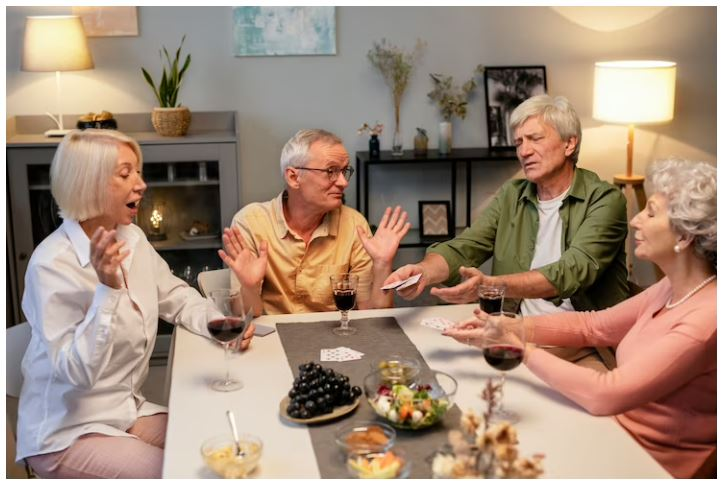

Playing games can stimulate cognitive functioning, which can be especially beneficial for seniors with dementia or Alzheimer’s. It can help improve memory, attention, and problem-solving skills.

A game night can enhance the quality of life for nursing home residents by providing entertainment and cultural enrichment. It can help create a sense of community and improve their overall well-being.

### **Teach an elderly neighbor computer skills**

Most seniors may feel left behind in the digital age, especially if they lack computer skills. Teaching them basic computer skills can empower them to handle online tasks independently, such as online banking or communicating with loved ones via email or video chat.

The internet is an excellent source of information, and learning how to use it can help seniors stay informed about current events, research health concerns, and learn about various topics of interest. Computers and the internet can also help seniors stay connected with friends and family, reducing social isolation and feelings of loneliness. 

### **Offer to write letters for a senior**

Offering to write letters for a senior can be a simple yet meaningful way to improve their quality of life and provide them with emotional support and social connection. Moreover, writing letters can help them stay connected with friends and family, reducing loneliness.

Moreover, seniors may have difficulty expressing their thoughts and feelings to loved ones, especially when experiencing health or emotional challenges. Writing letters can provide a safe outlet for seniors to share their emotions and receive emotional support.

### **Organize a senior garden**

Organizing a senior garden can be a great way to promote physical and mental health, reduce stress, provide nutritious food, and foster community connection among seniors.

Gardening is an excellent form of physical activity that can help seniors enhance their strength and flexibility. It is also a fun way for seniors to stay active and healthy.

A senior garden can provide seniors with fresh, nutritious fruits and veggies, which are good for their overall health and well-being.

## **Bottom Line** 

Community service is a broad concept. It can involve volunteering in your community, participating in charitable work, helping in a service organization, and/or donating money through giving. 

**Community service activities**, while not always easy, can be very rewarding. You can make significant changes in the lives of others, help them in a time of need, and make your community stronger in the process.

Depending on your area of interest, you can choose from various community service projects that you may be able to participate in. If you don’t know where to start or how to get involved, see above for ideas and suggestions on how to get started.

- [10 Best Educational Community Service Activities](https://avada.io/loveable/blog/community-service-activities/#wp-block-heading-2-4) 
    - [Hold an egg hunt for school kids](https://avada.io/loveable/blog/community-service-activities/#wp-block-heading-3-7)
    - [Organize a local book party for children](https://avada.io/loveable/blog/community-service-activities/#wp-block-heading-3-10)
    - [Coach a youth sports team](https://avada.io/loveable/blog/community-service-activities/#wp-block-heading-3-14)
    - [Begin a pen pal initiative for children](https://avada.io/loveable/blog/community-service-activities/#wp-block-heading-3-17)
    - [Teach kids a valuable life skill](https://avada.io/loveable/blog/community-service-activities/#wp-block-heading-3-21)
    - [Volunteer at a youth shelter](https://avada.io/loveable/blog/community-service-activities/#wp-block-heading-3-24)
    - [Donate used books to a children’s library](https://avada.io/loveable/blog/community-service-activities/#wp-block-heading-3-29)
    - [Help build a playground for disabled children](https://avada.io/loveable/blog/community-service-activities/#wp-block-heading-3-32)
    - [Create a summer reading program](https://avada.io/loveable/blog/community-service-activities/#wp-block-heading-3-35)
    - [Hold health and fitness presentations in schools](https://avada.io/loveable/blog/community-service-activities/#wp-block-heading-3-37)
- [10 Meaningful Community Service Activities to Help Animals and the Environment](https://avada.io/loveable/blog/community-service-activities/#wp-block-heading-2-39)
    - [Volunteer at an animal shelter](https://avada.io/loveable/blog/community-service-activities/#wp-block-heading-3-42)
    - [Raise money for retired police dogs](https://avada.io/loveable/blog/community-service-activities/#wp-block-heading-3-44)
    - [Offer a dog-walking service](https://avada.io/loveable/blog/community-service-activities/#wp-block-heading-3-47)
    - [Organize a spay and neuter program](https://avada.io/loveable/blog/community-service-activities/#wp-block-heading-3-49)
    - [Sponsor an animal in your city’s zoo](https://avada.io/loveable/blog/community-service-activities/#wp-block-heading-3-53)
    - [Host a puppy day at a school](https://avada.io/loveable/blog/community-service-activities/#wp-block-heading-3-56)
    - [Build birdhouses for your neighborhood](https://avada.io/loveable/blog/community-service-activities/#wp-block-heading-3-60)
    - [Host an equine skills clinic](https://avada.io/loveable/blog/community-service-activities/#wp-block-heading-3-62)
    - [Raise money for a local animal shelter](https://avada.io/loveable/blog/community-service-activities/#wp-block-heading-3-64)
    - [Encourage and promote conservationism](https://avada.io/loveable/blog/community-service-activities/#wp-block-heading-3-68)
- [10 Community Service Activities Ideas to Reduce Crime and Promote Safety](https://avada.io/loveable/blog/community-service-activities/#wp-block-heading-2-70)
    - [Create a violence protection group in your community](https://avada.io/loveable/blog/community-service-activities/#wp-block-heading-3-72)
    - [Take part in your neighborhood watch group](https://avada.io/loveable/blog/community-service-activities/#wp-block-heading-3-75)
    - [Volunteer to be a crossing guard at a school](https://avada.io/loveable/blog/community-service-activities/#wp-block-heading-3-79)
    - [Host seminars about drug and alcohol use](https://avada.io/loveable/blog/community-service-activities/#wp-block-heading-3-82)
    - [Teach self-defense lessons](https://avada.io/loveable/blog/community-service-activities/#wp-block-heading-3-86)
    - [Volunteer at a fire station](https://avada.io/loveable/blog/community-service-activities/#wp-block-heading-3-89)
    - [Volunteer at or donate to a battered woman or youth shelter](https://avada.io/loveable/blog/community-service-activities/#wp-block-heading-3-93)
    - [Teach kids about safety and first aid](https://avada.io/loveable/blog/community-service-activities/#wp-block-heading-3-96)
    - [Become CPR certified](https://avada.io/loveable/blog/community-service-activities/#wp-block-heading-3-99)
    - [Paint over graffiti in your neighborhood](https://avada.io/loveable/blog/community-service-activities/#wp-block-heading-3-102)
- [10 Community Service Activities Ideas to Help Senior Citizens](https://avada.io/loveable/blog/community-service-activities/#wp-block-heading-2-105)
    - [Take flowers to nurse home residents](https://avada.io/loveable/blog/community-service-activities/#wp-block-heading-3-107)
    - [Help elderly neighbors with chores](https://avada.io/loveable/blog/community-service-activities/#wp-block-heading-3-111)
    - [Cook a meal for a senior](https://avada.io/loveable/blog/community-service-activities/#wp-block-heading-3-115)
    - [Decorate the doors of a nursing home for the holidays](https://avada.io/loveable/blog/community-service-activities/#wp-block-heading-3-118)
    - [Perform a musical act at a nursing home](https://avada.io/loveable/blog/community-service-activities/#wp-block-heading-3-121)
    - [Offer a grocery delivery service specifically designed for senior citizens](https://avada.io/loveable/blog/community-service-activities/#wp-block-heading-3-125)
    - [Regularly host game nights at a nursing home](https://avada.io/loveable/blog/community-service-activities/#wp-block-heading-3-128)
    - [Teach an elderly neighbor computer skills](https://avada.io/loveable/blog/community-service-activities/#wp-block-heading-3-132)
    - [Offer to write letters for a senior](https://avada.io/loveable/blog/community-service-activities/#wp-block-heading-3-135)
    - [Organize a senior garden](https://avada.io/loveable/blog/community-service-activities/#wp-block-heading-3-139)
- [Bottom Line](https://avada.io/loveable/blog/community-service-activities/#wp-block-heading-2-143) 

### [Rose Bryne](https://avada.io/loveable/author/rose/)

Hi, I'm Rose! I love animals and spending time with kids. At Loveable, I help people find unique gifts for special occasions like Valentine's Day, housewarmings, and graduations. I enjoy finding gifts for kids, teens, and animal lovers that match their interests and personalities. Making gift-giving a pleasant experience is my priority. Let me assist you in finding the perfect gift!

- [Twitter](https://twitter.com/intent/tweet)
- [Facebook](https://www.facebook.com/sharer/sharer.php)
- [instagram](https://avada.io/loveable/blog/community-service-activities/)
- [pinterest](https://www.pinterest.com/loveablellc/)

## Related Posts

[### 30 Best 4 Year Old Birthday Party Ideas For A Memorable Celebration](https://avada.io/loveable/blog/4-year-old-birthday-party-ideas/) 

[

### 16th Birthday Party Ideas to Make an Unforgettable Day

](https://avada.io/loveable/blog/16th-birthday-party-ideas/)

[

### 150+ Inspirational Birthday Quotes to Spread Joy on Special Day

](https://avada.io/loveable/blog/inspirational-birthday-quotes/)

[

### 160+ Birthday Wishes for Wife to Express Eternal Love

](https://avada.io/loveable/blog/birthday-wishes-for-wife/)

[### 90+ Heart Touching Birthday Wishes for Niece to Make Her Day Extra Special](https://avada.io/loveable/blog/birthday-wishes-for-niece/)
